# Technical Specification

# 0. SUMMARY OF CHANGES

## 0.1 USER INTENT RESTATEMENT

### 0.1.1 Core Testing Objective

Based on the provided requirements, the Blitzy platform understands that the testing objective is to **add comprehensive unit tests for a Node.js server file (server.js)** that currently does not exist in this Java-based test automation repository. This represents a significant architectural expansion where JavaScript/Node.js testing capabilities need to be introduced alongside the existing Java/Selenium/Cucumber testing infrastructure.

**Test Request Categorization**: [Add new tests]

The user has explicitly requested:
- Creation of unit tests for `server.js` using either Jest (a popular JavaScript testing framework developed by Facebook) or Mocha (a flexible JavaScript testing framework that runs on Node.js)
- Testing of HTTP server functionality including responses, status codes, and headers
- Server lifecycle testing (startup/shutdown procedures)
- Comprehensive error handling validation
- Edge case coverage for all server operations

### 0.1.2 Test Discovery and Analysis

**CRITICAL FINDING**: Repository analysis reveals that this is currently a Java-based test automation framework using Maven, Selenium, and Cucumber. No JavaScript/Node.js infrastructure or server.js file exists in the repository.

**Current Repository State**:
- **Language**: Java 8
- **Build System**: Maven 3.x
- **Testing Frameworks**: JUnit 4.13.2, Cucumber 7.2.3/7.3.4, Selenium 3.141.59
- **Test Type**: BDD-based browser automation tests
- **Missing Components**: 
  - No Node.js runtime configuration
  - No JavaScript testing frameworks
  - No server.js implementation
  - No package.json for Node.js dependencies

**Implicit Requirements Discovered**:
1. Need to establish a dual-language testing environment (Java + JavaScript)
2. Require Node.js runtime setup and package management infrastructure
3. Must create the server.js file before tests can be written
4. Need to integrate JavaScript test execution with existing Maven/Jenkins CI/CD pipeline

### 0.1.3 Coverage Requirements Interpretation

To achieve comprehensive testing for the server.js file, coverage should include:

**Explicit Coverage Targets**:
- HTTP response validation (status codes, headers, body content)
- Server startup and initialization sequences
- Graceful shutdown procedures
- Error handling mechanisms
- Edge case scenarios

**Industry Standard Coverage Expectations**:
- Minimum 85% code coverage for critical server components
- Every test should run independently without dependencies on other tests
- Tests should run directly on server using Node.js runtime for simpler and faster testing

## 0.2 TESTING SCOPE ANALYSIS

### 0.2.1 Existing Test Infrastructure Assessment

**Current Testing Stack** (Java-based):
- Testing Framework: JUnit 4.13.2
- BDD Framework: Cucumber 7.2.3/7.3.4
- Browser Automation: Selenium WebDriver 3.141.59
- Test Runner: Maven Surefire Plugin 3.0.0-M5
- Parallel Execution: Unlimited threads at method level

**Required JavaScript Testing Stack** (To be added):
- Node.js ^18.18.0 || ^20.9.0 || >=21.1.0 (required for Mocha v11.0.0)
- Testing Framework: Jest 29.x or Mocha 11.x
- Assertion Library: Built-in (Jest) or Chai 4.x (Mocha)
- Mocking Library: Built-in (Jest) or Sinon 17.x (Mocha)
- HTTP Mocking: Supertest 6.x or node-mocks-http
- Coverage Tool: Built-in (Jest) or nyc/c8 (Mocha)

### 0.2.2 Test Target Identification

**Primary Code to be Tested**:

| Source File | Test File Location | Test Categories | Framework Choice |
|-------------|-------------------|-----------------|------------------|
| `src/main/js/server.js` (NEW) | `src/test/js/server.test.js` (NEW) | HTTP handling, lifecycle, errors | Jest or Mocha |
| Server Routes | `src/test/js/routes/*.test.js` | Route validation, middleware | Jest or Mocha |
| Error Handlers | `src/test/js/errors.test.js` | Exception handling, recovery | Jest or Mocha |
| Server Config | `src/test/js/config.test.js` | Configuration loading, validation | Jest or Mocha |

**Dependencies Requiring Mocking**:
- File system operations (config file reading)
- Environment variables
- External HTTP requests (if any)
- Database connections (if applicable)
- Logging operations

### 0.2.3 Version Compatibility Research

Based on current ecosystem analysis:

**Recommended Testing Stack for 2025**:

Depending on project requirements, either Jest (popular JavaScript testing framework built on Jasmine) or Mocha may be a better choice

**Option 1: Jest Configuration** (Recommended for simplicity):
- Jest: 29.7.0 (latest stable)
- @types/jest: 29.5.12 (TypeScript definitions if needed)
- Supertest: 6.3.4 (HTTP assertion library)
- Coverage: Built-in with Jest

**Option 2: Mocha Configuration** (Recommended for flexibility):
- Mocha: 11.0.0+ (requires Node.js ^18.18.0 || ^20.9.0 || >=21.1.0)
- Chai: 4.4.1 (assertion library)
- Sinon: 17.0.1 (mocking library)
- Supertest: 6.3.4 (HTTP testing)
- nyc: 15.1.0 (coverage tool)

## 0.3 TEST IMPLEMENTATION DESIGN

### 0.3.1 Test Strategy Selection

**Test Types to Implement**:

1. **Unit Tests** - Isolated component testing:
   - Individual middleware functions
   - Route handlers in isolation
   - Utility function validation
   - Configuration parsing logic

2. **Integration Tests** - Component interaction:
   - Full HTTP request/response cycles
   - Middleware chain execution
   - Error propagation through layers
   - Server initialization sequence

3. **Edge Case Tests** - Boundary conditions:
   - Malformed HTTP requests
   - Invalid headers and payloads
   - Port conflicts during startup
   - Memory/resource exhaustion scenarios

4. **Error Handling Tests** - Failure scenarios:
   - Uncaught exception handling
   - Promise rejection management
   - Timeout behavior
   - Graceful degradation

### 0.3.2 Test Case Blueprint

**Component: HTTP Server Core**
```javascript
Test Categories:
- Happy path:
  * Server starts on specified port
  * Responds to GET requests with 200 OK
  * Handles POST/PUT/DELETE methods correctly
  * Serves static files if configured
  
- Edge cases:
  * Port already in use
  * Invalid port numbers (negative, >65535)
  * Extremely large request bodies
  * Malformed HTTP headers
  
- Error cases:
  * Server crash recovery
  * Memory leak prevention
  * Uncaught exception handling
  * Signal handling (SIGTERM, SIGINT)
  
- Performance boundaries:
  * Maximum concurrent connections
  * Request timeout handling
  * Response time under load
```

**Component: Request/Response Handling**
```javascript
Test Categories:
- Happy path:
  * Correct status codes returned
  * Proper header setting
  * Content-Type negotiation
  * Response body formatting
  
- Edge cases:
  * Empty request bodies
  * Unicode in headers/body
  * Very long URLs
  * Special characters in paths
  
- Error cases:
  * 400 Bad Request scenarios
  * 404 Not Found handling
  * 500 Internal Server Error
  * Custom error responses
```

### 0.3.3 Test Data and Fixtures Design

**Required Test Data Structures**:
```javascript
// Mock HTTP requests
const mockRequests = {
  valid: {
    method: 'GET',
    url: '/api/test',
    headers: { 'content-type': 'application/json' }
  },
  invalid: {
    malformed: { /* invalid structure */ },
    oversized: { body: 'x'.repeat(10000000) },
    injection: { url: '/../../etc/passwd' }
  }
};

// Mock server configurations
const serverConfigs = {
  default: { port: 3000, host: 'localhost' },
  custom: { port: 8080, host: '0.0.0.0' },
  invalid: { port: -1, host: 'invalid!!!' }
};
```

**Mock Object Specifications**:
- HTTP request/response mocks using node-mocks-http or Supertest
- File system mocks for configuration loading
- Environment variable mocks for different deployment scenarios
- Timer mocks for timeout testing

## 0.4 MINIMAL CHANGE PRINCIPLE

### 0.4.1 Scope Limitations

**ONLY modify/create**:
- JavaScript test files in `src/test/js/` directory
- Node.js configuration files (`package.json`, test config files)
- Minimal server.js implementation if not existing
- Test-specific documentation

**DO NOT modify**:
- Existing Java test infrastructure
- Maven configuration (except for Node.js integration if needed)
- Current CI/CD pipeline (only extend for JavaScript tests)
- Existing Cucumber/Selenium tests

### 0.4.2 Precise File Modifications

**Files to Create**:
```
NEW: package.json                    # Node.js dependencies and scripts
NEW: src/main/js/server.js          # Basic HTTP server implementation
NEW: src/test/js/server.test.js     # Main server unit tests
NEW: src/test/js/server.integration.test.js  # Integration tests
NEW: src/test/js/fixtures/           # Test data and mocks
NEW: jest.config.js OR .mocharc.js  # Test framework configuration
NEW: .nycrc.json                    # Coverage configuration (if Mocha)
```

**Configuration Updates**:
```
MODIFY: .gitignore                  # Add node_modules/, coverage/
MODIFY: README.md                   # Add JavaScript testing instructions
EXTEND: pom.xml                     # Add frontend-maven-plugin for Node.js
```

### 0.4.3 Non-Testing Changes (Minimal Required)

**Source Code Creation** (if server.js doesn't exist):
- `src/main/js/server.js`: Minimal Express.js or native HTTP server
  - Justification: Cannot test a file that doesn't exist
  - Implementation: Basic HTTP server with standard endpoints

## 0.5 COVERAGE AND QUALITY TARGETS

### 0.5.1 Coverage Metrics

**Target Coverage Requirements**:
- Line Coverage: ≥85% (industry standard for server code)
- Branch Coverage: ≥80% (all conditional paths)
- Function Coverage: ≥90% (all exported functions)
- Statement Coverage: ≥85%

**Coverage Gap Analysis**:
- Current coverage: 0% (no tests exist)
- Target coverage: 85% minimum
- Critical paths requiring 100% coverage:
  - Server startup/shutdown procedures
  - Error handling middleware
  - Security-related functions
  - Request validation logic

### 0.5.2 Test Quality Criteria

Following best practices with isolated and atomic tests, proper naming conventions, assertions, and test runners like Mocha for a solid testing foundation

**Quality Standards**:
- Test Isolation: Each test completely independent
- Assertion Density: Minimum 2-3 assertions per test
- Test Execution Time: <100ms per unit test
- Test Naming: Descriptive BDD-style naming
- Mock Usage: Minimal and type-safe

## 0.6 VALIDATION CHECKLIST

### 0.6.1 Test Verification Points

- [ ] All server endpoints have corresponding tests
- [ ] HTTP status codes properly validated
- [ ] Request/response headers tested
- [ ] Server lifecycle (start/stop) verified
- [ ] Error scenarios comprehensively covered
- [ ] Edge cases identified and tested
- [ ] Performance boundaries validated
- [ ] Security considerations tested

### 0.6.2 Integration Verification

- [ ] Tests executable via `npm test` command
- [ ] Coverage reports generated in multiple formats
- [ ] Tests integrated with Maven build (if required)
- [ ] CI/CD pipeline updated for JavaScript tests
- [ ] Test failures provide clear diagnostics
- [ ] Parallel test execution configured

## 0.7 EXECUTION PARAMETERS

### 0.7.1 Testing-Specific Instructions

**Test Execution Commands**:
```bash
# Install dependencies
npm install

#### Run all tests
npm test

#### Run with coverage
npm run test:coverage

#### Run specific test file
npm test -- server.test.js

#### Run in watch mode
npm run test:watch

#### Generate coverage report
npm run coverage:report
```

**Framework-Specific Patterns**:
- Use describe/it blocks for test organization
- Implement beforeEach/afterEach for setup/teardown
- Use async/await for asynchronous tests
- Mock external dependencies consistently

### 0.7.2 Web Search Requirements

The following searches were conducted to ensure best practices alignment:
- Jest vs Mocha comparison for optimal framework selection based on project needs
- Node.js testing best practices for 2025 including isolated tests and proper assertions
- Mocha version requirements and Node.js compatibility matrix

## 0.8 IMPLEMENTATION ROADMAP

### 0.8.1 Immediate Actions Required

1. **Environment Setup**:
   - Install Node.js runtime (v18.18.0 or higher)
   - Initialize package.json with test dependencies
   - Configure test framework (Jest or Mocha)

2. **Server Implementation**:
   - Create minimal server.js if not existing
   - Implement basic HTTP endpoints
   - Add error handling middleware

3. **Test Creation**:
   - Write comprehensive unit tests
   - Add integration test suite
   - Implement edge case scenarios

4. **Integration**:
   - Update build pipeline for dual-language support
   - Configure coverage reporting
   - Document testing procedures

### 0.8.2 Technology Decision Matrix

| Criterion | Jest | Mocha | Recommendation |
|-----------|------|-------|----------------|
| Setup Complexity | Low (zero-config) | Medium (requires libs) | Jest for quick start |
| Flexibility | Medium | High | Mocha for customization |
| Built-in Features | Complete | Minimal | Jest for convenience |
| Community Support | Excellent | Excellent | Both viable |
| CI/CD Integration | Easy | Easy | Both suitable |

**Final Recommendation**: **Jest** for this project due to:
- Zero configuration setup
- Built-in mocking and coverage
- Faster parallel execution
- Better suited for teams new to JavaScript testing

## 0.9 REFERENCES

#### Technical Specifications Retrieved
- Section 6.6: TESTING STRATEGY - Current Java-based testing infrastructure and quality metrics

#### External Resources Consulted
- Mocha Documentation (mochajs.org) - Framework capabilities and configuration
- Jest vs Mocha Comparison Guides - Framework selection criteria
- Node.js Testing Best Practices 2025 - Industry standards and patterns
- JavaScript Testing Best Practices Repository (GitHub) - Community recommendations

#### Version Compatibility Sources
- Node.js version requirements for Mocha 11.0.0
- Jest and Mocha feature comparison for 2025
- Supertest and HTTP mocking library compatibility

# 1. INTRODUCTION

## 1.1 EXECUTIVE SUMMARY

### 1.1.1 Project Overview

The **Testinium-QA** repository represents a comprehensive <span style="background-color: rgba(91, 57, 243, 0.2)">Java-based and JavaScript/Node.js-enabled test automation framework</span> built specifically to support Behavior-Driven Development (BDD) practices in modern software quality assurance operations. This framework serves as a foundational template that integrates industry-standard testing technologies with the Testinium platform ecosystem to deliver automated browser testing capabilities with business-readable test scenarios. <span style="background-color: rgba(91, 57, 243, 0.2)">The framework now incorporates Node.js runtime environment with Jest/Mocha testing frameworks and supporting tooling to enable comprehensive unit and integration testing of server.js components.</span>

**Newly Supported Test Domains:**
- <span style="background-color: rgba(91, 57, 243, 0.2)">HTTP response validation, server lifecycle management, error handling mechanisms, and edge-case coverage for server.js</span>

### 1.1.2 Core Business Problem

Manual software testing presents significant challenges in today's fast-paced development environments. Software tests must be repeated frequently during development cycles to ensure quality, and for each software release, testing across all supported operating systems and hardware configurations becomes necessary. Manually repeating these tests is costly and time-consuming, creating bottlenecks that impede rapid delivery cycles. The growing demand for faster release cycles and new technologies increases the standard for quality software, requiring QA teams to adopt automated testing processes to introduce speed and flexibility into the software development lifecycle while remaining competitive.

### 1.1.3 Key Stakeholders and Users

| Stakeholder Group | Primary Role | Key Benefits |
|------------------|--------------|--------------|
| QA Engineers | Test creation, execution, and maintenance | Automated test execution, comprehensive reporting |
| Software Developers | Code quality validation and integration | Faster feedback loops, reduced manual testing burden |
| **Node.js Developers** | **Server-side JavaScript development and testing** | **Isolated unit tests for server.js, rapid feedback on server logic** |
| Business Analysts | Requirements validation and acceptance testing | Business-readable test scenarios using Gherkin syntax |
| DevOps Engineers | CI/CD pipeline integration and automation | Jenkins integration, automated report generation |

### 1.1.4 Expected Business Impact and Value Proposition

Once created, automated tests can be run repeatedly at no additional cost and execute much faster than manual tests. An early investment in test automation empowers software teams to accomplish speed, quality, and cost savings without making tradeoffs between the three. The framework enables organizations to reduce human error, save substantial time throughout development cycles, and deliver dependable, high-quality software quickly and effectively through comprehensive test automation and management capabilities.

## 1.2 SYSTEM OVERVIEW

### 1.2.1 Project Context

#### Business Context and Market Positioning

The Testinium-QA framework operates within the broader Testinium platform ecosystem, which delivers specialized QA services and software solutions tailored to key industries worldwide. Testinium is a comprehensive test automation and management platform designed to optimize software quality and accelerate delivery for agile teams, offering seamless orchestration, scheduling, and advanced reporting capabilities. The platform takes complete ownership of the test lifecycle, from team setup and training to execution and reporting, providing services including test case creation, functional and automated testing, regression testing, load testing, and test data management.

#### Integration with Existing Enterprise Landscape

The framework is designed to integrate seamlessly with enterprise development environments through:

- **Continuous Integration**: Jenkins pipeline integration with automated Cucumber report generation
- **Issue Tracking Systems**: Jira integration for test execution tracking and reporting
- **Version Control**: Git-based repository management with configured ignore patterns for build artifacts
- **Build Management**: Maven-based build lifecycle with comprehensive dependency management
  - <span style="background-color: rgba(91, 57, 243, 0.2)">Node.js build layer managed through package.json and npm scripts that execute Jest/Mocha tests and generate coverage reports</span>

### 1.2.2 High-Level Description

#### Primary System Capabilities

The Testinium-QA framework delivers core automated testing capabilities through a sophisticated technology stack. <span style="background-color: rgba(91, 57, 243, 0.2)">The framework now supports Node.js unit, integration, edge-case, and error-handling tests for backend components.</span>

| Capability Area | Implementation | Key Features |
|----------------|---------------|--------------|
| Browser Automation | Selenium WebDriver 3.141.59 | Cross-browser support, user interaction simulation |
| BDD Testing | Cucumber 7.2.3/7.3.4 | Gherkin syntax, business-readable scenarios |
| Test Execution | JUnit 4.13.2 | Parallel execution, comprehensive test management |
| Test Data Management | JavaFaker 1.0.2 | Realistic fake data generation |
| <span style="background-color: rgba(91, 57, 243, 0.2)">JavaScript Unit Testing</span> | <span style="background-color: rgba(91, 57, 243, 0.2)">Jest 29.x / Mocha 11.x</span> | <span style="background-color: rgba(91, 57, 243, 0.2)">HTTP server unit testing, coverage ≥85%</span> |

#### Major System Components

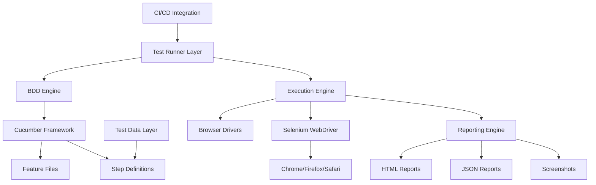
```mermaid
graph TB
    A[Test Runner Layer] --> B[BDD Engine]
    A --> C[Execution Engine]
    B --> D[Cucumber Framework]
    C --> E[Selenium WebDriver]
    C --> F[Browser Drivers]
    E --> G[Chrome/Firefox/Safari]
    D --> H[Feature Files]
    D --> I[Step Definitions]
    J[Reporting Engine] --> K[HTML Reports]
    J --> L[JSON Reports]
    J --> M[Screenshots]
    C --> J
    N[CI/CD Integration] --> A
    O[Test Data Layer] --> I
```
<span style="background-color: rgba(91, 57, 243, 0.2)">(Node.js Test Runner Layer not shown)</span>

#### Core Technical Approach

The framework implements a modular architecture built on Java 8 with Maven-based dependency management. <span style="background-color: rgba(91, 57, 243, 0.2)">A Node.js (≥18.18.0) runtime is installed alongside Java 8, and npm test scripts are triggered from the CI pipeline to execute Jest/Mocha suites.</span> The system supports parallel test execution at the method level with unlimited threads, enabling scalable test automation across multiple browser instances. The BDD implementation focuses on collaboration between developers, testers, and non-technical stakeholders through Cucumber's plain language testing approach using Gherkin syntax.

### 1.2.3 Success Criteria

#### Measurable Objectives

| Objective Category | Target Metrics | Implementation Approach |
|-------------------|---------------|------------------------|
| Test Execution Speed | Parallel execution with unlimited threads | Maven Surefire Plugin configuration |
| Cross-Browser Coverage | Support for Chrome, Firefox, Safari | WebDriverManager automatic driver resolution |
| Reporting Completeness | JSON, HTML, and Text report formats | Cucumber Reporting Plugin integration |

#### Critical Success Factors

- **Framework Usability**: Business-readable test scenarios accessible to all team members regardless of technical expertise
- **Integration Reliability**: Seamless CI/CD pipeline integration with Jenkins and Jira tracking
- **Maintenance Efficiency**: Automated browser driver management and comprehensive error handling
- **Scalability**: Support for parallel test execution and multiple user role testing scenarios

#### Key Performance Indicators (KPIs)

- Test execution time reduction compared to manual testing
- Number of automated test scenarios successfully integrated
- CI/CD pipeline integration success rate
- Cross-browser test coverage percentage
- Test report generation and distribution efficiency

## 1.3 SCOPE

### 1.3.1 In-Scope Elements

#### Core Features and Functionalities

**Must-Have Capabilities:**
- BDD test scenario creation using Cucumber and Gherkin syntax
- Automated browser testing across multiple browser types
- Parallel test execution with configurable thread management
- Comprehensive test reporting in multiple formats (JSON, HTML, Text)
- Screenshot capture for both successful and failed test executions
- Test data generation using JavaFaker library
- <span style="background-color: rgba(91, 57, 243, 0.2)">JavaScript/Node.js unit and integration testing for server.js using Jest or Mocha with ≥85% code coverage</span>

**Primary User Workflows:**
- Test scenario authoring in business-readable Gherkin format
- Automated test execution through Maven commands (`mvn test`)
- <span style="background-color: rgba(91, 57, 243, 0.2)">Execution of JavaScript test suites via npm scripts (`npm test`, `npm run test:coverage`)</span>
- Test report generation and distribution
- CI/CD pipeline integration and automation
- Cross-browser test validation and verification

**Essential Integrations:**
- Jenkins continuous integration platform
- Jira issue tracking and test management
- Maven build lifecycle management
- Git version control system
- Testinium platform ecosystem
- <span style="background-color: rgba(91, 57, 243, 0.2)">Node.js runtime and npm package management</span>

#### Implementation Boundaries

| Boundary Category | Coverage Details |
|------------------|-----------------|
| **System Boundaries** | Java-based web application testing through browser automation |
| **User Groups Covered** | QA Engineers, Developers, Business Analysts, DevOps Engineers |
| **Technical Coverage** | <span style="background-color: rgba(91, 57, 243, 0.2)">Desktop web browsers (Chrome, Firefox, Safari) and Node.js backend components (server.js)</span> |
| **Data Domains** | Test execution data, reporting artifacts, configuration settings |

### 1.3.2 Out-of-Scope Elements

#### Explicitly Excluded Features and Capabilities

- **Mobile Application Testing**: Native iOS and Android application testing capabilities
- **Performance Testing**: Load testing, stress testing, and performance benchmarking
- **API Testing**: REST/SOAP API testing and validation (separate from browser automation)
- **Database Testing**: Direct database validation and data integrity testing
- **Security Testing**: Penetration testing, vulnerability scanning, and security validation
- **Cross-Platform Desktop Testing**: Native desktop application testing beyond web browsers

#### Future Phase Considerations

- Integration with additional test management platforms beyond Jira
- Support for containerized test execution environments
- Enhanced AI-powered test generation and maintenance capabilities
- Advanced test analytics and predictive failure analysis
- Mobile testing framework extension
- Performance testing module integration

#### Integration Points Not Covered

- Third-party test data management systems
- Enterprise single sign-on (SSO) authentication systems
- Advanced test orchestration platforms
- Cloud-based device testing services
- Real-time test execution monitoring and alerting systems

#### Unsupported Use Cases

- Real-time system monitoring and alerting
- Production environment testing and validation
- Complex multi-system integration testing scenarios
- Non-web-based application testing
- Manual testing workflow management
- Test case version control and branching strategies beyond Git

#### References

**Repository Files Analyzed:**
- `README.md` - Comprehensive framework documentation, installation prerequisites, usage instructions, and integration examples
- `pom.xml` - Maven project configuration with complete dependency management and build settings

**External Research Sources:**
- Testinium Platform Documentation - AI-powered test automation platform capabilities and business value proposition
- Cucumber BDD Framework - Behavior-driven development methodology and Java implementation patterns  
- Selenium WebDriver 3.141.59 - Browser automation architecture and cross-platform testing capabilities

# 2. PRODUCT REQUIREMENTS

## 2.1 FEATURE CATALOG

### 2.1.1 Feature F-001: BDD Test Scenario Management

**Feature Metadata:**
| Property | Value |
|----------|-------|
| Unique ID | F-001 |
| Feature Name | BDD Test Scenario Management |
| Feature Category | Test Authoring |
| Priority Level | Critical |
| Status | Completed |

**Description:**

*Overview:* Comprehensive Behavior-Driven Development (BDD) test scenario creation and management using Cucumber framework with Gherkin syntax for business-readable test specifications.

*Business Value:* Enables collaboration between developers, testers, and business stakeholders through natural language test scenarios, reducing communication gaps and ensuring requirements alignment.

*User Benefits:* Business analysts and QA engineers can create and maintain test scenarios without deep technical knowledge, while developers gain clear acceptance criteria.

*Technical Context:* Implemented using Cucumber 7.2.3/7.3.4 with JUnit 4.13.2 integration, supporting parallel execution and comprehensive reporting capabilities.

**Dependencies:**
- *Prerequisite Features:* None (foundational feature)
- *System Dependencies:* Java 8+, Maven build system
- *External Dependencies:* Cucumber-Java 7.2.3, Cucumber-JUnit 7.3.4
- *Integration Requirements:* Git version control for feature file management

### 2.1.2 Feature F-002: Browser Automation Engine

**Feature Metadata:**
| Property | Value |
|----------|-------|
| Unique ID | F-002 |
| Feature Name | Browser Automation Engine |
| Feature Category | Test Execution |
| Priority Level | Critical |
| Status | Completed |

**Description:**

*Overview:* Cross-browser automation capabilities through Selenium WebDriver integration supporting Chrome, Firefox, and Safari browsers with automatic driver management.

*Business Value:* Eliminates manual browser testing overhead and ensures consistent cross-browser compatibility validation for web applications.

*User Benefits:* QA engineers can execute tests across multiple browsers simultaneously without manual intervention or driver configuration.

*Technical Context:* Built on Selenium WebDriver 3.141.59 with WebDriverManager 5.1.0 for automatic browser driver resolution and management.

**Dependencies:**
- *Prerequisite Features:* F-001 (BDD Test Scenario Management)
- *System Dependencies:* Browser installations, system PATH configuration
- *External Dependencies:* Selenium WebDriver 3.141.59, WebDriverManager 5.1.0
- *Integration Requirements:* Maven Surefire Plugin for parallel execution

### 2.1.3 Feature F-003: Multi-Role Authentication Testing

**Feature Metadata:**
| Property | Value |
|----------|-------|
| Unique ID | F-003 |
| Feature Name | Multi-Role Authentication Testing |
| Feature Category | Functional Testing |
| Priority Level | High |
| Status | Completed |

**Description:**

*Overview:* Automated testing of user authentication workflows supporting multiple user roles including PosManager and SalesManager with comprehensive validation scenarios.

*Business Value:* Ensures secure and reliable user access control across different user types, reducing security vulnerabilities and access control failures.

*User Benefits:* Automated validation of login scenarios, error handling, and role-based access verification with localized error message testing.

*Technical Context:* Implements credential validation, dashboard access verification, and error handling for empty fields and invalid credentials.

**Dependencies:**
- *Prerequisite Features:* F-001 (BDD Test Scenario Management), F-002 (Browser Automation Engine)
- *System Dependencies:* Test user accounts, application environment
- *External Dependencies:* None specific
- *Integration Requirements:* Test data management for user credentials

### 2.1.4 Feature F-004: Parallel Test Execution Engine

**Feature Metadata:**
| Property | Value |
|----------|-------|
| Unique ID | F-004 |
| Feature Name | Parallel Test Execution Engine |
| Feature Category | Performance |
| Priority Level | High |
| Status | Completed |

**Description:**

*Overview:* High-performance test execution with unlimited thread support enabling parallel test execution across multiple browser instances.

*Business Value:* Significantly reduces test execution time and accelerates development feedback cycles for faster release cadence.

*User Benefits:* QA teams can execute comprehensive test suites in fraction of sequential execution time while maintaining test isolation.

*Technical Context:* Configured through Maven Surefire Plugin with method-level parallelization and configurable timeout thresholds.

**Dependencies:**
- *Prerequisite Features:* F-002 (Browser Automation Engine)
- *System Dependencies:* Multi-core processor, adequate system memory
- *External Dependencies:* Maven Surefire Plugin
- *Integration Requirements:* Thread-safe test implementation

### 2.1.5 Feature F-005: Test Reporting and Documentation

**Feature Metadata:**
| Property | Value |
|----------|-------|
| Unique ID | F-005 |
| Feature Name | Test Reporting and Documentation |
| Feature Category | Reporting |
| Priority Level | High |
| Status | Completed |

**Description:**

*Overview:* Multi-format test reporting system generating JSON, HTML, and Text reports with screenshot capture for successful and failed test executions.

*Business Value:* Provides comprehensive test execution visibility and evidence-based quality metrics for stakeholder reporting and decision-making.

*User Benefits:* Stakeholders receive detailed test results with visual evidence and multiple report formats for different consumption needs.

*Technical Context:* Integrated Cucumber Reporting Plugin 7.2.0 with automated screenshot generation and error documentation capabilities.

**Dependencies:**
- *Prerequisite Features:* F-001 (BDD Test Scenario Management), F-002 (Browser Automation Engine)
- *System Dependencies:* File system write permissions, adequate storage
- *External Dependencies:* Cucumber Reporting Plugin 7.2.0
- *Integration Requirements:* Jenkins integration for report distribution

### 2.1.6 Feature F-006: CI/CD Integration Platform

**Feature Metadata:**
| Property | Value |
|----------|-------|
| Unique ID | F-006 |
| Feature Name | CI/CD Integration Platform |
| Feature Category | Integration |
| Priority Level | Medium |
| Status | Completed |

**Description:**

*Overview:* Seamless integration with Jenkins continuous integration platform and Jira issue tracking for automated test execution and result tracking.

*Business Value:* Enables automated testing as part of development workflow, ensuring quality gates and reducing manual intervention in release processes.

*User Benefits:* DevOps engineers can integrate automated testing into deployment pipelines with automatic result reporting to stakeholders.

*Technical Context:* Maven-based build integration with Jenkins pipeline support and Jira test execution tracking capabilities.

**Dependencies:**
- *Prerequisite Features:* F-005 (Test Reporting and Documentation)
- *System Dependencies:* Jenkins server, Jira instance
- *External Dependencies:* Jenkins plugins, Jira API access
- *Integration Requirements:* Network connectivity, authentication configuration

### 2.1.7 Feature F-007: Test Data Generation

**Feature Metadata:**
| Property | Value |
|----------|-------|
| Unique ID | F-007 |
| Feature Name | Test Data Generation |
| Feature Category | Test Support |
| Priority Level | Medium |
| Status | Completed |

**Description:**

*Overview:* Automated realistic test data generation using JavaFaker library for dynamic test scenario execution with varied data sets.

*Business Value:* Reduces test data maintenance overhead and enables comprehensive testing scenarios with realistic data variations.

*User Benefits:* QA engineers can execute tests with varied, realistic data without manual test data creation and maintenance.

*Technical Context:* JavaFaker 1.0.2 integration providing diverse fake data generation capabilities for testing scenarios.

**Dependencies:**
- *Prerequisite Features:* F-001 (BDD Test Scenario Management)
- *System Dependencies:* None specific
- *External Dependencies:* JavaFaker 1.0.2
- *Integration Requirements:* Test scenario parameterization

### 2.1.8 Feature F-008: Node.js Test Automation Infrastructure

<span style="background-color: rgba(91, 57, 243, 0.2)">**Feature Metadata:**</span>
| Property | Value |
|----------|-------|
| <span style="background-color: rgba(91, 57, 243, 0.2)">Unique ID</span> | <span style="background-color: rgba(91, 57, 243, 0.2)">F-008</span> |
| <span style="background-color: rgba(91, 57, 243, 0.2)">Feature Name</span> | <span style="background-color: rgba(91, 57, 243, 0.2)">Node.js Test Automation Infrastructure</span> |
| <span style="background-color: rgba(91, 57, 243, 0.2)">Feature Category</span> | <span style="background-color: rgba(91, 57, 243, 0.2)">Test Execution / Integration</span> |
| <span style="background-color: rgba(91, 57, 243, 0.2)">Priority Level</span> | <span style="background-color: rgba(91, 57, 243, 0.2)">High</span> |
| <span style="background-color: rgba(91, 57, 243, 0.2)">Status</span> | <span style="background-color: rgba(91, 57, 243, 0.2)">Planned</span> |

<span style="background-color: rgba(91, 57, 243, 0.2)">**Description:**</span>

<span style="background-color: rgba(91, 57, 243, 0.2)">*Overview:* Comprehensive dual-language testing environment enabling JavaScript/Node.js unit test capabilities alongside existing Java-based browser automation. Supports Jest and Mocha testing frameworks for server-side testing of Node.js applications with full HTTP request/response validation and lifecycle management.</span>

<span style="background-color: rgba(91, 57, 243, 0.2)">*Business Value:* Establishes complete testing coverage for full-stack applications by enabling comprehensive JavaScript server testing, reducing the gap between frontend and backend testing strategies. Enables teams to maintain consistent testing practices across Java web applications and Node.js services.</span>

<span style="background-color: rgba(91, 57, 243, 0.2)">*User Benefits:* JavaScript developers and full-stack QA engineers can create and execute comprehensive unit tests for Node.js server components using familiar JavaScript testing frameworks. Enables rapid feedback cycles for server-side development without requiring Java expertise.</span>

<span style="background-color: rgba(91, 57, 243, 0.2)">*Technical Context:* Implements Node.js runtime integration with Maven build system through frontend-maven-plugin, supporting both Jest 29.x and Mocha 11.x testing frameworks. Includes Supertest integration for HTTP endpoint testing, built-in coverage reporting, and seamless Jenkins pipeline integration for dual-language CI/CD workflows.</span>

<span style="background-color: rgba(91, 57, 243, 0.2)">**Dependencies:**</span>
- <span style="background-color: rgba(91, 57, 243, 0.2)">*Prerequisite Features:* F-001 (BDD Test Scenario Management) for test documentation standards, F-004 (Parallel Test Execution Engine) for execution harness optimization, F-006 (CI/CD Integration Platform) for pipeline integration</span>
- <span style="background-color: rgba(91, 57, 243, 0.2)">*System Dependencies:* Node.js v18.18.0+ runtime environment, npm package management, adequate system memory for dual-language execution</span>
- <span style="background-color: rgba(91, 57, 243, 0.2)">*External Dependencies:* Jest 29.x OR Mocha 11.x testing frameworks, Supertest 6.x for HTTP testing, Chai 4.x assertion library (if using Mocha), Sinon 17.x mocking library (if using Mocha)</span>
- <span style="background-color: rgba(91, 57, 243, 0.2)">*Integration Requirements:* frontend-maven-plugin configuration in pom.xml for Node.js lifecycle management, npm scripts for test execution, package.json dependency management, Jenkins Node.js plugin for CI/CD integration</span>

## 2.2 FUNCTIONAL REQUIREMENTS TABLE

### 2.2.1 Feature F-001 Requirements: BDD Test Scenario Management

| Requirement ID | Description | Acceptance Criteria | Priority |
|----------------|-------------|-------------------|----------|
| F-001-RQ-001 | Gherkin syntax support | Given-When-Then scenarios execute successfully | Must-Have |
| F-001-RQ-002 | Feature file management | Feature files are recognized and processed by Cucumber | Must-Have |
| F-001-RQ-003 | Step definition mapping | Step definitions map correctly to Gherkin statements | Must-Have |
| F-001-RQ-004 | Scenario parameterization | Scenarios accept parameters through data tables | Should-Have |

**Technical Specifications:**
| Component | Details |
|-----------|---------|
| Input Parameters | Gherkin feature files, step definition classes |
| Output/Response | Test execution results, scenario status |
| Performance Criteria | Sub-second scenario parsing, unlimited scenario support |
| Data Requirements | UTF-8 encoded feature files, Java bytecode step definitions |

### 2.2.2 Feature F-002 Requirements: Browser Automation Engine

| Requirement ID | Description | Acceptance Criteria | Priority |
|----------------|-------------|-------------------|----------|
| F-002-RQ-001 | Cross-browser support | Chrome, Firefox, Safari automation works | Must-Have |
| F-002-RQ-002 | Automatic driver management | WebDriverManager resolves drivers automatically | Must-Have |
| F-002-RQ-003 | Element interaction | Click, type, select operations execute reliably | Must-Have |
| F-002-RQ-004 | Page navigation | Navigate to URLs and handle page loads | Must-Have |

**Technical Specifications:**
| Component | Details |
|-----------|---------|
| Input Parameters | Browser type, WebDriver configuration, target URLs |
| Output/Response | Page interactions, element states, navigation confirmations |
| Performance Criteria | <5 second page load timeout, <1 second element interaction |
| Data Requirements | Valid URLs, accessible web elements, browser installations |

### 2.2.3 Feature F-003 Requirements: Multi-Role Authentication Testing

| Requirement ID | Description | Acceptance Criteria | Priority |
|----------------|-------------|-------------------|----------|
| F-003-RQ-001 | Valid credential authentication | PosManager and SalesManager login succeeds | Must-Have |
| F-003-RQ-002 | Invalid credential handling | Error messages display for invalid credentials | Must-Have |
| F-003-RQ-003 | Empty field validation | Localized error "Veuillez renseigner ce champ." appears | Must-Have |
| F-003-RQ-004 | Dashboard access verification | Successful login redirects to appropriate dashboard | Should-Have |

**Technical Specifications:**
| Component | Details |
|-----------|---------|
| Input Parameters | Username, password, user role type |
| Output/Response | Authentication status, error messages, dashboard access |
| Performance Criteria | <3 second authentication response time |
| Data Requirements | Valid test user accounts, configured authentication system |

### 2.2.4 Feature F-004 Requirements: Parallel Test Execution Engine

| Requirement ID | Description | Acceptance Criteria | Priority |
|----------------|-------------|-------------------|----------|
| F-004-RQ-001 | Unlimited thread execution | Tests execute in parallel without thread limits | Must-Have |
| F-004-RQ-002 | Test isolation | Parallel tests do not interfere with each other | Must-Have |
| F-004-RQ-003 | Configurable timeouts | Timeout thresholds are configurable per test | Should-Have |
| F-004-RQ-004 | Resource management | System resources are efficiently utilized | Should-Have |

**Technical Specifications:**
| Component | Details |
|-----------|---------|
| Input Parameters | Thread count, timeout values, test classes |
| Output/Response | Parallel execution results, performance metrics |
| Performance Criteria | Linear execution time reduction with thread increase |
| Data Requirements | Thread-safe test implementations, isolated test data |

### 2.2.5 Feature F-008 Requirements: Node.js Test Automation Infrastructure (updated)

| Requirement ID | Description | Acceptance Criteria | Priority |
|----------------|-------------|-------------------|----------|
| <span style="background-color: rgba(91, 57, 243, 0.2)">F-008-RQ-001</span> | <span style="background-color: rgba(91, 57, 243, 0.2)">Node.js runtime availability</span> | <span style="background-color: rgba(91, 57, 243, 0.2)">Project shall support Node.js ^18.18.0 || ^20.9.0 || >=21.1.0 for test execution</span> | <span style="background-color: rgba(91, 57, 243, 0.2)">Must-Have</span> |
| <span style="background-color: rgba(91, 57, 243, 0.2)">F-008-RQ-002</span> | <span style="background-color: rgba(91, 57, 243, 0.2)">JavaScript testing framework support</span> | <span style="background-color: rgba(91, 57, 243, 0.2)">Tests shall execute via Jest 29.x or Mocha 11.x with ≥85% line coverage</span> | <span style="background-color: rgba(91, 57, 243, 0.2)">Must-Have</span> |
| <span style="background-color: rgba(91, 57, 243, 0.2)">F-008-RQ-003</span> | <span style="background-color: rgba(91, 57, 243, 0.2)">Dual-language pipeline integration</span> | <span style="background-color: rgba(91, 57, 243, 0.2)">npm test shall be invokable from Maven/Jenkins build</span> | <span style="background-color: rgba(91, 57, 243, 0.2)">Must-Have</span> |
| <span style="background-color: rgba(91, 57, 243, 0.2)">F-008-RQ-004</span> | <span style="background-color: rgba(91, 57, 243, 0.2)">Coverage reporting</span> | <span style="background-color: rgba(91, 57, 243, 0.2)">Coverage reports must be generated in multiple formats (html, lcov)</span> | <span style="background-color: rgba(91, 57, 243, 0.2)">Must-Have</span> |
| <span style="background-color: rgba(91, 57, 243, 0.2)">F-008-RQ-005</span> | <span style="background-color: rgba(91, 57, 243, 0.2)">Watch mode execution</span> | <span style="background-color: rgba(91, 57, 243, 0.2)">Test suite supports watch mode for development workflow</span> | <span style="background-color: rgba(91, 57, 243, 0.2)">Should-Have</span> |
| <span style="background-color: rgba(91, 57, 243, 0.2)">F-008-RQ-006</span> | <span style="background-color: rgba(91, 57, 243, 0.2)">Parallel JavaScript test execution</span> | <span style="background-color: rgba(91, 57, 243, 0.2)">Unit tests execute in parallel for optimal performance</span> | <span style="background-color: rgba(91, 57, 243, 0.2)">Should-Have</span> |
| <span style="background-color: rgba(91, 57, 243, 0.2)">F-008-RQ-007</span> | <span style="background-color: rgba(91, 57, 243, 0.2)">HTTP endpoint testing</span> | <span style="background-color: rgba(91, 57, 243, 0.2)">Supertest integration enables comprehensive HTTP request/response testing</span> | <span style="background-color: rgba(91, 57, 243, 0.2)">Should-Have</span> |
| <span style="background-color: rgba(91, 57, 243, 0.2)">F-008-RQ-008</span> | <span style="background-color: rgba(91, 57, 243, 0.2)">Test isolation and cleanup</span> | <span style="background-color: rgba(91, 57, 243, 0.2)">Each test runs independently with proper setup/teardown</span> | <span style="background-color: rgba(91, 57, 243, 0.2)">Should-Have</span> |

**Technical Specifications:**
| Component | Details |
|-----------|---------|
| <span style="background-color: rgba(91, 57, 243, 0.2)">Input Parameters</span> | <span style="background-color: rgba(91, 57, 243, 0.2)">package.json configuration, JavaScript test files, server.js application entry point</span> |
| <span style="background-color: rgba(91, 57, 243, 0.2)">Output/Response</span> | <span style="background-color: rgba(91, 57, 243, 0.2)">Test execution results, coverage reports (html/lcov formats), performance metrics</span> |
| <span style="background-color: rgba(91, 57, 243, 0.2)">Performance Criteria</span> | <span style="background-color: rgba(91, 57, 243, 0.2)">&lt;100ms per unit test, ≥85% line coverage, concurrent test execution support</span> |
| <span style="background-color: rgba(91, 57, 243, 0.2)">Data Requirements</span> | <span style="background-color: rgba(91, 57, 243, 0.2)">server.js file, mock fixtures, test configuration files, HTTP request/response mocks</span> |

## 2.3 FEATURE RELATIONSHIPS

### 2.3.1 Feature Dependencies Map (updated)

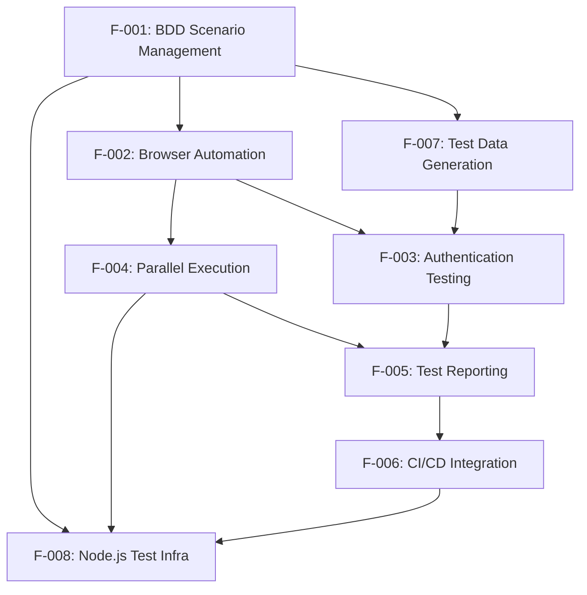
```mermaid
graph TB
    F001[F-001: BDD Scenario Management] --> F002[F-002: Browser Automation]
    F001 --> F007[F-007: Test Data Generation]
    F001 --> F008[F-008: Node.js Test Infra]
    F002 --> F003[F-003: Authentication Testing]
    F002 --> F004[F-004: Parallel Execution]
    F004 --> F005[F-005: Test Reporting]
    F004 --> F008
    F005 --> F006[F-006: CI/CD Integration]
    F006 --> F008
    F003 --> F005
    F007 --> F003
```

### 2.3.2 Integration Points (updated)

| Integration Area | Features Involved | Shared Components | Common Services |
|------------------|------------------|-------------------|-----------------|
| Test Execution | F-001, F-002, F-004 | Cucumber Runner, WebDriver instances | Maven Surefire coordination |
| Reporting Pipeline | F-001, F-005, F-006 | Report generators, screenshot utilities | Unified reporting framework |
| Data Management | F-001, F-007, F-003 | Test parameter handlers, data providers | Shared test data repositories |
| CI/CD Workflow | F-004, F-005, F-006 | Maven plugins, Jenkins integration | Pipeline orchestration services |
| <span style="background-color: rgba(91, 57, 243, 0.2)">JavaScript Test Execution</span> | <span style="background-color: rgba(91, 57, 243, 0.2)">F-008, F-006, F-004</span> | <span style="background-color: rgba(91, 57, 243, 0.2)">frontend-maven-plugin, npm scripts</span> | <span style="background-color: rgba(91, 57, 243, 0.2)">Dual-language execution coordination</span> |

### 2.3.3 Shared Components (updated)

#### Core Test Execution Infrastructure
- **CukesRunner Classes**: Central execution orchestration for F-001, F-002, F-004
- **WebDriverManager**: Browser driver resolution for F-002, F-003, F-004
- **Maven Surefire Plugin**: Parallel execution coordination for F-004, <span style="background-color: rgba(91, 57, 243, 0.2)">Node.js test integration for F-008</span>

#### Build and Integration Components
- **Maven Build System**: Dependency management and execution for all features
- <span style="background-color: rgba(91, 57, 243, 0.2)">**frontend-maven-plugin**: Node.js runtime integration and npm lifecycle management for F-008 and CI/CD features</span>
- <span style="background-color: rgba(91, 57, 243, 0.2)">**Node.js runtime**: JavaScript test execution environment shared across F-008 and CI/CD pipeline integration</span>

#### Reporting and Documentation Infrastructure
- **Cucumber Reporting Plugin**: Report generation for F-005, F-006
- **Screenshot Utilities**: Visual evidence capture shared between F-002, F-005
- **Test Result Aggregators**: Unified reporting across Java and <span style="background-color: rgba(91, 57, 243, 0.2)">JavaScript test suites</span>

### 2.3.4 Cross-Feature Dependencies Analysis

#### Primary Dependency Chains
1. **Core BDD Chain**: F-001 → F-002 → F-003 → F-005 → F-006
   - Establishes the fundamental test authoring to CI/CD execution pipeline
   - Critical path for all browser-based automation scenarios

2. **<span style="background-color: rgba(91, 57, 243, 0.2)">Dual-Language Integration Chain</span>**: <span style="background-color: rgba(91, 57, 243, 0.2)">F-001 → F-008 ← F-004 ← F-006</span>
   - <span style="background-color: rgba(91, 57, 243, 0.2)">Enables comprehensive testing coverage across both Java browser automation and JavaScript unit testing</span>
   - <span style="background-color: rgba(91, 57, 243, 0.2)">Supports unified test documentation standards and parallel execution optimization</span>

3. **Performance Optimization Chain**: F-002 → F-004 → F-005
   - Optimizes test execution throughput through parallel processing
   - Essential for scalable test suite management

#### Shared Service Dependencies
- **Test Data Coordination**: F-007 provides realistic data generation consumed by F-003 and potentially by <span style="background-color: rgba(91, 57, 243, 0.2)">F-008 HTTP endpoint testing</span>
- **Execution Orchestration**: F-004 parallel execution engine coordinates both WebDriver instances and <span style="background-color: rgba(91, 57, 243, 0.2)">Node.js test processes</span>
- **Integration Pipeline**: F-006 CI/CD platform manages deployment of both Java test artifacts and <span style="background-color: rgba(91, 57, 243, 0.2)">JavaScript test execution coordination</span>

### 2.3.5 Component Isolation Boundaries

#### Test Execution Isolation
- **Browser Instance Isolation**: Each WebDriver instance operates independently within F-002, F-003, F-004 coordination
- <span style="background-color: rgba(91, 57, 243, 0.2)">**JavaScript Process Isolation**: F-008 Node.js tests execute in separate process space from Java-based tests</span>
- **Parallel Thread Safety**: F-004 ensures thread-safe execution across all dependent features

#### Data Isolation Strategies  
- **Test Data Segregation**: F-007 generates isolated datasets preventing test interference
- **Report Output Separation**: F-005 maintains distinct output channels for different test categories
- <span style="background-color: rgba(91, 57, 243, 0.2)">**Language-Specific Artifacts**: Java test results and JavaScript test results maintain separate artifact streams</span>

#### Integration Point Coordination
- **Maven Lifecycle Coordination**: Central build system coordinates all feature executions without conflicts
- **Jenkins Pipeline Orchestration**: F-006 manages sequential and parallel execution flows across all integrated features
- <span style="background-color: rgba(91, 57, 243, 0.2)">**Dual-Runtime Management**: frontend-maven-plugin ensures proper Node.js runtime availability during Java-centric build processes</span>

## 2.4 IMPLEMENTATION CONSIDERATIONS

### 2.4.1 Technical Constraints

| Constraint Category | Details | Affected Features |
|---------------------|---------|-------------------|
| Java Version | Minimum JDK 1.8 requirement | All features |
| <span style="background-color: rgba(91, 57, 243, 0.2)">Node.js Version</span> | <span style="background-color: rgba(91, 57, 243, 0.2)">Project requires Node.js ^18.18.0 \|\| ^20.9.0 \|\| >=21.1.0</span> | <span style="background-color: rgba(91, 57, 243, 0.2)">F-008</span> |
| Browser Dependencies | Chrome, Firefox, Safari must be installed | F-002, F-003 |
| Memory Requirements | Parallel execution requires adequate RAM | F-004 |
| Maven Build System | Maven 3.0+ required for dependency resolution | All features |

### 2.4.2 Performance Requirements

| Feature | Performance Criteria | Measurement Method |
|---------|---------------------|-------------------|
| F-002 | Page load timeout <5 seconds | WebDriver timeout configuration |
| F-003 | Authentication response <3 seconds | Test execution timing |
| F-004 | Linear performance scaling with threads | Execution time measurement |
| F-005 | Report generation <10 seconds | Post-execution timing |
| <span style="background-color: rgba(91, 57, 243, 0.2)">F-008</span> | <span style="background-color: rgba(91, 57, 243, 0.2)">Unit test execution ≤100 ms per test; Coverage generation ≤10 s</span> | <span style="background-color: rgba(91, 57, 243, 0.2)">Jest/Mocha execution timing and nyc coverage reporting</span> |

### 2.4.3 Security Implications

- **Test Credential Management**: Secure storage and handling of test user credentials for F-003
- **Browser Session Isolation**: Ensure no cross-contamination between parallel test sessions in F-004
- **Report Data Protection**: Sensitive test data should be masked in reports generated by F-005
- **CI/CD Security**: Secure integration with Jenkins and Jira systems for F-006
- <span style="background-color: rgba(91, 57, 243, 0.2)">**npm Dependency Security**: npm dependency vulnerability scanning and secure storage of npm tokens (if private registry) for F-008</span>

### 2.4.4 Scalability Considerations

- **Horizontal Scaling**: F-004 supports unlimited thread execution for increased parallel capacity
- **Browser Instance Management**: F-002 efficiently manages multiple browser instances without memory leaks
- **Report Storage**: F-005 must handle large volumes of test reports and screenshots
- **Test Data Volume**: F-007 must generate varied data sets without performance degradation
- <span style="background-color: rgba(91, 57, 243, 0.2)">**JavaScript Test Parallelization**: Support horizontal scaling of JS tests via Jest workers/Mocha parallel mode for F-008</span>

### 2.4.5 Maintenance Requirements

- **Dependency Updates**: Regular updates of Selenium, Cucumber, and other dependencies
- **Browser Driver Compatibility**: Automatic driver management through WebDriverManager reduces maintenance
- **Test Scenario Evolution**: BDD scenarios require business stakeholder review and updates
- **CI/CD Pipeline Maintenance**: Jenkins integration requires monitoring and configuration updates
- <span style="background-color: rgba(91, 57, 243, 0.2)">**Node.js Ecosystem Maintenance**: Regular updates of Jest/Mocha and Node.js LTS versions for F-008</span>

#### References

#### Technical Specification Sections
- `1.1 EXECUTIVE SUMMARY` - Business context and stakeholder analysis
- `1.2 SYSTEM OVERVIEW` - Technical architecture and capabilities
- `1.3 SCOPE` - Implementation boundaries and constraints

#### Repository Files Analyzed
- `README.md` - Framework documentation and usage instructions
- `pom.xml` - Maven configuration and dependency management

#### External Research
- Testinium Platform Documentation - Comprehensive test automation platform capabilities
- Cucumber BDD Framework Patterns - Java implementation and best practices

# 3. TECHNOLOGY STACK

## 3.1 PROGRAMMING LANGUAGES

### 3.1.1 Primary Language Selection (updated)

**Dual-Language Architecture**

The framework establishes <span style="background-color: rgba(91, 57, 243, 0.2)">a dual-language testing environment with two primary programming languages</span> supporting comprehensive test automation capabilities:

**Java 8 (JDK 1.8+) - Browser Automation Stack**

<span style="background-color: rgba(91, 57, 243, 0.2)">Java 8 remains the primary language for the existing Selenium/Cucumber browser automation stack.</span> This selection is driven by several key factors:

- **Enterprise Compatibility**: Java 8 provides broad compatibility across enterprise environments while offering modern language features including lambda expressions and stream processing
- **Selenium Integration**: Selenium WebDriver 3.141.59 maintains optimal compatibility with Java 8 through Java 11, ensuring stable browser automation capabilities
- **BDD Framework Support**: Cucumber 7.2.3 leverages Java 8 features for efficient step definition processing and test execution management
- **Maven Ecosystem**: Comprehensive Maven plugin ecosystem and dependency management optimized for Java 8 development workflows

**<span style="background-color: rgba(91, 57, 243, 0.2)">JavaScript (ES2022) on Node.js - Server-Side Testing Stack</span>**

<span style="background-color: rgba(91, 57, 243, 0.2)">JavaScript (ES2022) executed on Node.js serves as the primary language for all new server-side source code and comprehensive unit testing capabilities</span>. This addition addresses critical testing requirements:

- **<span style="background-color: rgba(91, 57, 243, 0.2)">Modern JavaScript Features</span>**: <span style="background-color: rgba(91, 57, 243, 0.2)">ES2022 provides advanced language constructs including top-level await, private class fields, and enhanced module management</span>
- **<span style="background-color: rgba(91, 57, 243, 0.2)">Server-Side Testing</span>**: <span style="background-color: rgba(91, 57, 243, 0.2)">Enables comprehensive unit and integration testing for Node.js applications with HTTP request/response validation</span>
- **<span style="background-color: rgba(91, 57, 243, 0.2)">Testing Framework Integration</span>**: <span style="background-color: rgba(91, 57, 243, 0.2)">Native support for Jest 29.x and Mocha 11.x frameworks with Supertest integration for API endpoint testing</span>
- **<span style="background-color: rgba(91, 57, 243, 0.2)">Coverage Reporting</span>**: <span style="background-color: rgba(91, 57, 243, 0.2)">Built-in code coverage analysis with ≥85% coverage requirements for server-side components</span>

**<span style="background-color: rgba(91, 57, 243, 0.2)">Directory Structure Conventions</span>**

<span style="background-color: rgba(91, 57, 243, 0.2)">The dual-language architecture maintains parallel directory structures for clear separation of concerns:</span>

| **Language** | **Production Code** | **Test Code** | **Purpose** |
|-------------|-------------------|---------------|-------------|
| Java | `src/main/java` | `src/test/java` | Browser automation, BDD scenarios |
| <span style="background-color: rgba(91, 57, 243, 0.2)">JavaScript</span> | <span style="background-color: rgba(91, 57, 243, 0.2)">`src/main/js`</span> | <span style="background-color: rgba(91, 57, 243, 0.2)">`src/test/js`</span> | <span style="background-color: rgba(91, 57, 243, 0.2)">Server-side logic, unit/integration tests</span> |

### 3.1.2 Language Constraints and Dependencies (updated)

**Java Runtime Requirements**

The Java 8 requirement creates specific technical constraints that affect browser automation components:

- **Minimum Runtime**: JDK 1.8+ required for compilation and test execution across all environments
- **Version Compatibility**: All dependency selections verified for Java 8 compatibility to prevent runtime conflicts
- **Maven Configuration**: Source and target compilation levels explicitly set to version 8 in Maven compiler plugin settings

**<span style="background-color: rgba(91, 57, 243, 0.2)">Node.js Runtime Requirements</span>**

<span style="background-color: rgba(91, 57, 243, 0.2)">The JavaScript execution environment introduces additional technical constraints for server-side testing capabilities:</span>

- **<span style="background-color: rgba(91, 57, 243, 0.2)">Supported Runtime Versions</span>**: <span style="background-color: rgba(91, 57, 243, 0.2)">^18.18.0 || ^20.9.0 || >=21.1.0 as mandatory Node.js runtime versions
- **<span style="background-color: rgba(91, 57, 243, 0.2)">Installation Requirements</span>**: <span style="background-color: rgba(91, 57, 243, 0.2)">Node.js and npm must be installed on every developer workstation, CI server, and build agent machine in addition to JDK 1.8+</span>
- **<span style="background-color: rgba(91, 57, 243, 0.2)">Package Management</span>**: <span style="background-color: rgba(91, 57, 243, 0.2)">package.json becomes the authoritative dependency file for JavaScript libraries, creating a second dependency-management channel alongside Maven</span>
- **<span style="background-color: rgba(91, 57, 243, 0.2)">ES2022 Compliance</span>**: <span style="background-color: rgba(91, 57, 243, 0.2)">JavaScript code must conform to ES2022 standards for consistent execution across supported Node.js versions</span>

**<span style="background-color: rgba(91, 57, 243, 0.2)">Cross-Language Integration Constraints</span>**

<span style="background-color: rgba(91, 57, 243, 0.2)">The dual-language environment requires careful coordination between Java and JavaScript execution contexts:</span>

- **<span style="background-color: rgba(91, 57, 243, 0.2)">Build System Integration</span>**: <span style="background-color: rgba(91, 57, 243, 0.2)">Maven frontend-maven-plugin manages Node.js lifecycle during Java build processes</span>
- **<span style="background-color: rgba(91, 57, 243, 0.2)">Memory Allocation</span>**: <span style="background-color: rgba(91, 57, 243, 0.2)">Adequate system memory required for concurrent Java JVM and Node.js runtime execution</span>
- **<span style="background-color: rgba(91, 57, 243, 0.2)">CI/CD Pipeline Compatibility</span>**: <span style="background-color: rgba(91, 57, 243, 0.2)">Jenkins environments must support both Java 8+ and Node.js runtime installations with appropriate plugin configurations</span>

## 3.2 FRAMEWORKS & LIBRARIES

### 3.2.1 Core Testing Frameworks

**Selenium WebDriver 3.141.59**

Selenium WebDriver serves as the foundation for browser automation capabilities, selected for its proven stability and comprehensive browser support:

- **Cross-Browser Support**: Native integration with Chrome, Firefox, and Safari browsers through respective driver implementations
- **Mature API**: Version 3.141.59 represents a stable release with extensive community support and documentation
- **Enterprise Adoption**: Industry-standard choice for web application testing with robust error handling and debugging capabilities
- **Integration Compatibility**: Seamless integration with Cucumber BDD framework and Maven build lifecycle

**Cucumber BDD Framework (Multiple Versions)**

The framework implements Cucumber in multiple configurations to support comprehensive BDD testing:

- **cucumber-java 7.2.3**: Core BDD implementation enabling Gherkin syntax processing and step definition management
- **cucumber-junit 7.2.3 & 7.3.4**: JUnit integration layers providing test execution structure and reporting integration
- **Business-Readable Scenarios**: Enables collaboration between developers, testers, and business stakeholders through plain language test definitions
- **Gherkin Syntax**: Supports Given-When-Then scenario structure for comprehensive test case documentation

**JUnit 4.13.2**

JUnit provides the underlying test framework structure with essential testing capabilities:

- **Test Lifecycle Management**: Comprehensive before/after hooks and test setup/teardown capabilities
- **Assertion Framework**: Rich assertion library for test validation and result verification
- **Integration Layer**: Seamless integration with Cucumber for BDD test execution and Maven Surefire plugin

**<span style="background-color: rgba(91, 57, 243, 0.2)">Jest 29.x (Recommended JavaScript Testing Framework)</span>**

<span style="background-color: rgba(91, 57, 243, 0.2)">Jest 29.x serves as the primary JavaScript testing framework for comprehensive unit and integration testing of Node.js server components</span>:

- **<span style="background-color: rgba(91, 57, 243, 0.2)">Zero Configuration Setup</span>**: <span style="background-color: rgba(91, 57, 243, 0.2)">Out-of-the-box testing capabilities with minimal configuration requirements for rapid test development</span>
- **<span style="background-color: rgba(91, 57, 243, 0.2)">Built-in Mocking</span>**: <span style="background-color: rgba(91, 57, 243, 0.2)">Comprehensive mocking capabilities for functions, modules, and HTTP requests without additional dependencies</span>
- **<span style="background-color: rgba(91, 57, 243, 0.2)">Integrated Coverage Reporting</span>**: <span style="background-color: rgba(91, 57, 243, 0.2)">Native code coverage analysis supporting ≥85% coverage requirements for server.js components</span>
- **<span style="background-color: rgba(91, 57, 243, 0.2)">Snapshot Testing</span>**: <span style="background-color: rgba(91, 57, 243, 0.2)">Advanced snapshot testing capabilities for HTTP response validation and API contract testing</span>
- **<span style="background-color: rgba(91, 57, 243, 0.2)">Parallel Test Execution</span>**: <span style="background-color: rgba(91, 57, 243, 0.2)">Automatic parallel test execution across multiple worker processes for optimal performance</span>

**<span style="background-color: rgba(91, 57, 243, 0.2)">Mocha 11.x (Alternative JavaScript Testing Framework)</span>**

<span style="background-color: rgba(91, 57, 243, 0.2)">Mocha 11.x provides a flexible alternative testing framework for organizations requiring greater configurability and plugin ecosystem access</span>:

- **<span style="background-color: rgba(91, 57, 243, 0.2)">Flexible Test Organization</span>**: <span style="background-color: rgba(91, 57, 243, 0.2)">Sophisticated test structure with describe/it blocks and comprehensive hooks for complex test scenarios</span>
- **<span style="background-color: rgba(91, 57, 243, 0.2)">Reporter Ecosystem</span>**: <span style="background-color: rgba(91, 57, 243, 0.2)">Extensive reporter plugin ecosystem supporting multiple output formats including TAP, JSON, and custom reporting solutions</span>
- **<span style="background-color: rgba(91, 57, 243, 0.2)">Runtime Requirements</span>**: <span style="background-color: rgba(91, 57, 243, 0.2)">Requires Node.js ^18.18.0 || ^20.9.0 || >=21.1.0 for optimal compatibility and performance
- **<span style="background-color: rgba(91, 57, 243, 0.2)">Plugin Architecture</span>**: <span style="background-color: rgba(91, 57, 243, 0.2)">Modular plugin system enabling integration with specialized testing tools and custom workflow requirements</span>

### 3.2.2 Supporting Libraries

**WebDriverManager 5.1.0**

WebDriverManager eliminates manual driver management complexity through automated driver resolution:

- **Automatic Driver Downloads**: Dynamically downloads and configures browser drivers (ChromeDriver, GeckoDriver, EdgeDriver)
- **Version Compatibility**: Automatically matches browser versions with compatible driver versions
- **Caching Strategy**: Implements resolution cache with 1-hour validity for browsers and 1-day validity for drivers
- **Docker Support**: Enables browser execution in containerized environments for CI/CD integration

**JavaFaker 1.0.2**

JavaFaker provides realistic test data generation capabilities to reduce test maintenance overhead:

- **Realistic Data Generation**: Creates contextually appropriate fake data for names, addresses, emails, and other common test scenarios
- **Reduced Test Coupling**: Eliminates dependencies on specific test data sets, improving test reliability
- **Locale Support**: Supports multiple locales for international testing scenarios

**<span style="background-color: rgba(91, 57, 243, 0.2)">Supertest 6.x</span>**

<span style="background-color: rgba(91, 57, 243, 0.2)">Supertest 6.x provides comprehensive HTTP assertion and mocking capabilities for server.js testing</span>:

- **<span style="background-color: rgba(91, 57, 243, 0.2)">HTTP Request Testing</span>**: <span style="background-color: rgba(91, 57, 243, 0.2)">Fluent API for testing HTTP endpoints, request/response validation, and status code verification</span>
- **<span style="background-color: rgba(91, 57, 243, 0.2)">Express Integration</span>**: <span style="background-color: rgba(91, 57, 243, 0.2)">Native Express.js application testing without requiring server startup or port binding</span>
- **<span style="background-color: rgba(91, 57, 243, 0.2)">Assertion Chaining</span>**: <span style="background-color: rgba(91, 57, 243, 0.2)">Chainable assertion methods for comprehensive API endpoint validation and response verification</span>

**<span style="background-color: rgba(91, 57, 243, 0.2)">Chai 4.x (Mocha Path)</span>**

<span style="background-color: rgba(91, 57, 243, 0.2)">Chai 4.x provides sophisticated assertion library capabilities when using Mocha as the primary testing framework</span>:

- **<span style="background-color: rgba(91, 57, 243, 0.2)">Multiple Assertion Styles</span>**: <span style="background-color: rgba(91, 57, 243, 0.2)">Support for expect, should, and assert styles enabling flexible test writing approaches</span>
- **<span style="background-color: rgba(91, 57, 243, 0.2)">Plugin Ecosystem</span>**: <span style="background-color: rgba(91, 57, 243, 0.2)">Extensive plugin system for specialized assertions including HTTP, date, and async operation testing</span>
- **<span style="background-color: rgba(91, 57, 243, 0.2)">Error Messages</span>**: <span style="background-color: rgba(91, 57, 243, 0.2)">Detailed error messages with clear failure descriptions for rapid debugging and test maintenance</span>

**<span style="background-color: rgba(91, 57, 243, 0.2)">Sinon 17.x (Mocha Path)</span>**

<span style="background-color: rgba(91, 57, 243, 0.2)">Sinon 17.x delivers comprehensive spies, mocks, and stubs functionality for complex testing scenarios</span>:

- **<span style="background-color: rgba(91, 57, 243, 0.2)">Function Spying</span>**: <span style="background-color: rgba(91, 57, 243, 0.2)">Advanced spy capabilities for monitoring function calls, arguments, and return values during test execution</span>
- **<span style="background-color: rgba(91, 57, 243, 0.2)">Module Mocking</span>**: <span style="background-color: rgba(91, 57, 243, 0.2)">Sophisticated mocking system for isolating server.js dependencies including file system and external API calls</span>
- **<span style="background-color: rgba(91, 57, 243, 0.2)">Stubbing Capabilities</span>**: <span style="background-color: rgba(91, 57, 243, 0.2)">Flexible stubbing system for replacing function behavior during testing with configurable return values</span>

**<span style="background-color: rgba(91, 57, 243, 0.2)">nyc 15.x / c8 (Mocha Path)</span>**

<span style="background-color: rgba(91, 57, 243, 0.2)">Coverage analysis tools providing comprehensive code coverage reporting for Mocha-based test suites</span>:

- **<span style="background-color: rgba(91, 57, 243, 0.2)">Istanbul Integration</span>**: <span style="background-color: rgba(91, 57, 243, 0.2)">nyc 15.x leverages Istanbul for detailed coverage analysis with multiple output formats including HTML and JSON</span>
- **<span style="background-color: rgba(91, 57, 243, 0.2)">V8 Coverage</span>**: <span style="background-color: rgba(91, 57, 243, 0.2)">c8 utilizes Node.js V8 built-in coverage for faster execution and improved accuracy in coverage reporting</span>
- **<span style="background-color: rgba(91, 57, 243, 0.2)">Coverage Thresholds</span>**: <span style="background-color: rgba(91, 57, 243, 0.2)">Configurable coverage thresholds supporting ≥85% coverage requirements with build failure on insufficient coverage</span>

#### Production Code Context

<span style="background-color: rgba(91, 57, 243, 0.2)">The server.js component represents production server-side application code implemented in Node.js/Express, not part of the testing framework infrastructure</span>. <span style="background-color: rgba(91, 57, 243, 0.2)">This minimal HTTP server implementation serves as the primary target for JavaScript unit and integration testing capabilities</span>, requiring comprehensive test coverage through Jest or Mocha frameworks with supporting libraries for HTTP endpoint validation, error handling verification, and server lifecycle management testing.

### 3.2.3 Compatibility Requirements

All framework selections maintain strict compatibility requirements to ensure system stability:

- **Java 8 Baseline**: All Java libraries verified for Java 8 compatibility with forward compatibility through Java 11
- **<span style="background-color: rgba(91, 57, 243, 0.2)">Node.js Runtime**: Jest 29.x requires Node.js ≥16.10.0, while Mocha 11.x requires ^18.18.0 || ^20.9.0 || >=21.1.0
- **Maven Integration**: All Java dependencies available through Maven Central with stable version management
- **<span style="background-color: rgba(91, 57, 243, 0.2)">npm Integration**: All JavaScript dependencies available through npm registry with semantic versioning support</span>
- **Cross-Platform Support**: Compatible across Windows, macOS, and Linux development environments
- **<span style="background-color: rgba(91, 57, 243, 0.2)">Framework Interoperability**: Jest and Mocha frameworks provide equivalent testing capabilities with different architectural approaches for organizational preference</span>

## 3.3 OPEN SOURCE DEPENDENCIES

### 3.3.1 Core Dependencies

**<span style="background-color: rgba(91, 57, 243, 0.2)">Java Dependencies (Maven-managed, resolved via JVM runtime)</span>**

The framework leverages carefully selected open source dependencies managed through Maven Central:

| Component | Version | Registry | Purpose |
|-----------|---------|----------|---------|
| selenium-java | 3.141.59 | Maven Central | Browser automation core |
| webdrivermanager | 5.1.0 | Maven Central | Automated driver management |
| cucumber-java | 7.2.3 | Maven Central | BDD framework core |
| cucumber-junit | 7.2.3, 7.3.4 | Maven Central | JUnit integration |
| javafaker | 1.0.2 | Maven Central | Test data generation |
| junit | 4.13.2 | Maven Central | Test framework |

**<span style="background-color: rgba(91, 57, 243, 0.2)">JavaScript Dependencies (npm-managed, resolved at build time via Node.js)</span>**

<span style="background-color: rgba(91, 57, 243, 0.2)">The JavaScript testing stack requires comprehensive npm dependencies for server-side unit and integration testing capabilities:</span>

| Component | Version | Registry | Purpose |
|-----------|---------|----------|---------|
| <span style="background-color: rgba(91, 57, 243, 0.2)">jest</span> | <span style="background-color: rgba(91, 57, 243, 0.2)">29.7.0</span> | <span style="background-color: rgba(91, 57, 243, 0.2)">npm</span> | <span style="background-color: rgba(91, 57, 243, 0.2)">JavaScript test runner & assertion</span> |
| <span style="background-color: rgba(91, 57, 243, 0.2)">supertest</span> | <span style="background-color: rgba(91, 57, 243, 0.2)">6.3.4</span> | <span style="background-color: rgba(91, 57, 243, 0.2)">npm</span> | <span style="background-color: rgba(91, 57, 243, 0.2)">HTTP request testing</span> |
| <span style="background-color: rgba(91, 57, 243, 0.2)">@types/jest</span> | <span style="background-color: rgba(91, 57, 243, 0.2)">29.5.12</span> | <span style="background-color: rgba(91, 57, 243, 0.2)">npm</span> | <span style="background-color: rgba(91, 57, 243, 0.2)">Jest TypeScript typings (future-proofing)</span> |
| <span style="background-color: rgba(91, 57, 243, 0.2)">(alt) mocha</span> | <span style="background-color: rgba(91, 57, 243, 0.2)">11.0.0</span> | <span style="background-color: rgba(91, 57, 243, 0.2)">npm</span> | <span style="background-color: rgba(91, 57, 243, 0.2)">Alternate JS test runner</span> |
| <span style="background-color: rgba(91, 57, 243, 0.2)">(alt) chai</span> | <span style="background-color: rgba(91, 57, 243, 0.2)">4.4.1</span> | <span style="background-color: rgba(91, 57, 243, 0.2)">npm</span> | <span style="background-color: rgba(91, 57, 243, 0.2)">Assertions for Mocha</span> |
| <span style="background-color: rgba(91, 57, 243, 0.2)">(alt) sinon</span> | <span style="background-color: rgba(91, 57, 243, 0.2)">17.0.1</span> | <span style="background-color: rgba(91, 57, 243, 0.2)">npm</span> | <span style="background-color: rgba(91, 57, 243, 0.2)">Test doubles for Mocha</span> |
| <span style="background-color: rgba(91, 57, 243, 0.2)">(alt) nyc</span> | <span style="background-color: rgba(91, 57, 243, 0.2)">15.1.0</span> | <span style="background-color: rgba(91, 57, 243, 0.2)">npm</span> | <span style="background-color: rgba(91, 57, 243, 0.2)">Coverage for Mocha</span> |
| <span style="background-color: rgba(91, 57, 243, 0.2)">express</span> | <span style="background-color: rgba(91, 57, 243, 0.2)">4.x</span> | <span style="background-color: rgba(91, 57, 243, 0.2)">npm</span> | <span style="background-color: rgba(91, 57, 243, 0.2)">Minimal HTTP server (if used in `server.js`)</span> |

### 3.3.2 Reporting Dependencies

**Cucumber Reporting Plugin 7.2.0**

Advanced reporting capabilities through the me.jvt.cucumber:reporting-plugin dependency:

- **Multiple Report Formats**: Generates JSON, HTML, and Text report formats for different stakeholder needs
- **Screenshot Integration**: Captures screenshots for both successful and failed test executions
- **CI/CD Integration**: Compatible with Jenkins and other CI/CD platforms for automated report distribution

### 3.3.3 Dependency Management Strategy (updated)

**<span style="background-color: rgba(91, 57, 243, 0.2)">Dual-Registry Dependency Resolution</span>**

<span style="background-color: rgba(91, 57, 243, 0.2)">The framework implements a dual-registry dependency management strategy supporting both Java and JavaScript testing ecosystems through parallel dependency resolution mechanisms.</span>

**Maven Dependency Resolution**

- **Version Control**: Explicit version declarations for all dependencies to ensure reproducible builds
- **Scope Management**: Test-scoped dependencies clearly separated from runtime requirements
- **Conflict Resolution**: Maven dependency resolution manages transitive dependency conflicts automatically
- **Repository Strategy**: Primary dependency source from Maven Central with fallback repositories as needed

**<span style="background-color: rgba(91, 57, 243, 0.2)">npm Dependency Resolution</span>**

<span style="background-color: rgba(91, 57, 243, 0.2)">JavaScript dependencies are managed through npm with package.json serving as the authoritative dependency manifest:</span>

- **<span style="background-color: rgba(91, 57, 243, 0.2)">Semantic Versioning</span>**: <span style="background-color: rgba(91, 57, 243, 0.2)">Strict adherence to semantic versioning principles with explicit version pinning for reproducible builds across environments</span>
- **<span style="background-color: rgba(91, 57, 243, 0.2)">Development Dependencies</span>**: <span style="background-color: rgba(91, 57, 243, 0.2)">Testing framework dependencies segregated as devDependencies to exclude from production package installations</span>
- **<span style="background-color: rgba(91, 57, 243, 0.2)">Registry Configuration</span>**: <span style="background-color: rgba(91, 57, 243, 0.2)">Primary dependency source from npmjs.org registry with configurable proxy support for enterprise environments</span>
- **<span style="background-color: rgba(91, 57, 243, 0.2)">Lock File Management</span>**: <span style="background-color: rgba(91, 57, 243, 0.2)">package-lock.json ensures exact dependency tree reproduction across development, testing, and CI/CD environments</span>

**<span style="background-color: rgba(91, 57, 243, 0.2)">Cross-Language Build Integration</span>**

<span style="background-color: rgba(91, 57, 243, 0.2)">Maven frontend-maven-plugin coordinates Node.js dependency resolution during Java build lifecycle execution:</span>

- **<span style="background-color: rgba(91, 57, 243, 0.2)">Automated npm Installation</span>**: <span style="background-color: rgba(91, 57, 243, 0.2)">Plugin automatically downloads and installs Node.js and npm during Maven build phases when not available in build environment</span>
- **<span style="background-color: rgba(91, 57, 243, 0.2)">Dependency Synchronization</span>**: <span style="background-color: rgba(91, 57, 243, 0.2)">npm install execution triggered during Maven initialize phase to ensure JavaScript dependencies are available for test execution</span>
- **<span style="background-color: rgba(91, 57, 243, 0.2)">Build Cache Integration</span>**: <span style="background-color: rgba(91, 57, 243, 0.2)">node_modules directory caching strategy aligned with Maven target directory lifecycle for optimal build performance</span>

## 3.4 THIRD-PARTY SERVICES

### 3.4.1 Continuous Integration Services (updated)

**Jenkins CI/CD Platform**

Jenkins provides comprehensive CI/CD pipeline automation with specialized test automation features supporting the framework's dual-language architecture:

- **Automated Pipeline Execution**: Scheduled and triggered test execution across multiple environments with integrated Java and JavaScript testing capabilities
- **<span style="background-color: rgba(91, 57, 243, 0.2)">Multi-Stage Build Orchestration</span>**: <span style="background-color: rgba(91, 57, 243, 0.2)">Enhanced pipeline structure executing `npm ci && npm test` after Maven compile phase but before report publishing, ensuring comprehensive JavaScript test validation in CI/CD workflows</span>
- **Cucumber Report Integration**: Automated generation and distribution of Cucumber reports post-execution
- **Build Orchestration**: Manages complex build dependencies and multi-stage testing workflows across Java and JavaScript components
- **Environment Management**: Supports testing across development, staging, and production-like environments

**<span style="background-color: rgba(91, 57, 243, 0.2)">Jenkins Agent Requirements</span>**

<span style="background-color: rgba(91, 57, 243, 0.2)">Jenkins build agents must maintain dual-runtime environments to support the framework's comprehensive testing capabilities:</span>

- **<span style="background-color: rgba(91, 57, 243, 0.2)">Node.js Runtime Provisioning</span>**: <span style="background-color: rgba(91, 57, 243, 0.2)">Node.js LTS (≥18.18.0) must be installed directly on Jenkins agents or provisioned via the Jenkins NodeJS Plugin for automated runtime management</span>
- **<span style="background-color: rgba(91, 57, 243, 0.2)">npm Availability</span>**: <span style="background-color: rgba(91, 57, 243, 0.2)">npm package manager must be accessible in the Jenkins agent PATH for dependency installation and test execution during CI pipeline phases</span>
- **Java Runtime Compatibility**: JDK 1.8+ remains the primary Java runtime requirement for Selenium and Cucumber test execution
- **<span style="background-color: rgba(91, 57, 243, 0.2)">Memory Allocation</span>**: <span style="background-color: rgba(91, 57, 243, 0.2)">Adequate system memory allocation for concurrent Java JVM and Node.js runtime execution during dual-language test phases</span>

**<span style="background-color: rgba(91, 57, 243, 0.2)">Pipeline Integration Architecture</span>**

<span style="background-color: rgba(91, 57, 243, 0.2)">The Jenkins pipeline implements a coordinated build sequence ensuring comprehensive test validation across both language environments:</span>

```<span style="background-color: rgba(91, 57, 243, 0.2)">mermaid
graph TD
    A[Pipeline Start] --> B[Source Checkout]
    B --> C[Maven Initialize]
    C --> D[Maven Compile]
    D --> E[npm ci && npm test]
    E --> F[Maven Test]
    F --> G[Report Generation]
    G --> H[Report Publishing]
    
    style E fill:#5b39f3,color:#ffffff
</span>```

### 3.4.2 Project Management Integration

**Jira Issue Tracking**

Jira integration provides comprehensive test management and tracking capabilities:

- **Test Execution Tracking**: Links automated test results to project issues and requirements
- **Defect Management**: Automated defect creation and tracking for failed test scenarios
- **Reporting Integration**: Test execution metrics integrated with project dashboards and reporting
- **Requirements Traceability**: Links BDD scenarios to business requirements and user stories

### 3.4.3 Version Control Services

**Git Repository Management**

- **Repository Hosting**: GitHub serves as the primary repository hosting platform
- **Branch Management**: Supports feature branch workflows and collaborative development
- **Artifact Management**: Configured ignore patterns for build artifacts, logs, and temporary files
- **Code Quality**: Integration with pull request workflows and code review processes

## 3.5 DATABASES & STORAGE

### 3.5.1 Test Data Storage Strategy

The framework implements a lightweight approach to test data management without traditional database dependencies:

**File-Based Test Data**

- **Feature Files**: Gherkin scenarios stored in `src/main/resources/features` directory structure
- **Configuration Files**: Maven POM configuration and properties files for environment-specific settings
- **Generated Data**: JavaFaker provides runtime test data generation, eliminating persistent test data requirements

### 3.5.2 Report Storage

**Build Artifact Storage**

- **Local Report Generation**: HTML, JSON, and text reports generated locally during test execution
- **CI/CD Artifact Management**: Jenkins manages report artifacts and historical test execution data
- **Screenshot Storage**: Test execution screenshots stored as build artifacts for debugging and verification

### 3.5.3 Caching Solutions

**WebDriverManager Caching**

- **Driver Cache**: Local caching of browser drivers with 1-day validity period
- **Version Resolution Cache**: Browser-driver version compatibility cached for 1-hour periods
- **Performance Optimization**: Reduces network dependencies and improves test execution startup times

## 3.6 DEVELOPMENT & DEPLOYMENT

### 3.6.1 Development Tools (updated)

**IntelliJ IDEA (Recommended IDE)**

IntelliJ IDEA provides comprehensive development support with specialized testing capabilities:

- **Required Plugins**: Maven integration and Cucumber plugin for Gherkin syntax support
- **Java Development**: Advanced Java 8 development features including debugging and refactoring
- **Test Execution**: Native support for JUnit and Cucumber test execution with integrated reporting
- **Step Definition Navigation**: Cucumber plugin enables navigation between feature files and step definitions

**<span style="background-color: rgba(91, 57, 243, 0.2)">Node.js (v18.18.0 or higher) - Mandatory Runtime</span>**

<span style="background-color: rgba(91, 57, 243, 0.2)">Node.js serves as the essential JavaScript runtime environment supporting server-side testing capabilities and frontend build processes</span>:

- **<span style="background-color: rgba(91, 57, 243, 0.2)">Version Requirements</span>**: <span style="background-color: rgba(91, 57, 243, 0.2)">Node.js v18.18.0 or higher required for Jest 29.x and Mocha 11.x compatibility</span>
- **<span style="background-color: rgba(91, 57, 243, 0.2)">Installation Scope</span>**: <span style="background-color: rgba(91, 57, 243, 0.2)">Must be installed on every developer workstation, CI server, and build agent machine alongside JDK 1.8+</span>
- **<span style="background-color: rgba(91, 57, 243, 0.2)">Runtime Integration</span>**: <span style="background-color: rgba(91, 57, 243, 0.2)">Enables execution of JavaScript unit tests, integration tests, and coverage reporting during Maven build lifecycle</span>
- **<span style="background-color: rgba(91, 57, 243, 0.2)">ES2022 Support</span>**: <span style="background-color: rgba(91, 57, 243, 0.2)">Provides modern JavaScript language features including top-level await and private class fields</span>

**<span style="background-color: rgba(91, 57, 243, 0.2)">npm Package Manager</span>**

<span style="background-color: rgba(91, 57, 243, 0.2)">npm (shipped with Node.js) serves as the primary package manager for installing and running JavaScript test dependencies</span>:

- **<span style="background-color: rgba(91, 57, 243, 0.2)">Dependency Management</span>**: <span style="background-color: rgba(91, 57, 243, 0.2)">Manages Jest, Mocha, Supertest, Chai, Sinon, and coverage analysis libraries through package.json</span>
- **<span style="background-color: rgba(91, 57, 243, 0.2)">Script Execution</span>**: <span style="background-color: rgba(91, 57, 243, 0.2)">Executes test automation scripts including npm test, npm run test:coverage, and npm run test:watch commands</span>
- **<span style="background-color: rgba(91, 57, 243, 0.2)">Registry Integration</span>**: <span style="background-color: rgba(91, 57, 243, 0.2)">Accesses npm registry for JavaScript library installation and version management</span>
- **<span style="background-color: rgba(91, 57, 243, 0.2)">Build Integration</span>**: <span style="background-color: rgba(91, 57, 243, 0.2)">Integrated with Maven frontend-maven-plugin for unified Java and JavaScript build processes</span>

### 3.6.2 Build System (updated)

**Apache Maven 3.0+**

Maven provides comprehensive build lifecycle management and dependency resolution:

- **Project Coordinates**: Standardized project identification with groupId: org.example, artifactId: testinium-qa
- **Dependency Management**: Centralized dependency resolution through Maven Central repository
- **Build Lifecycle**: Comprehensive build phases including compilation, testing, and reporting
- **Plugin Ecosystem**: Integration with specialized plugins for test execution and reporting

**<span style="background-color: rgba(91, 57, 243, 0.2)">Frontend Maven Plugin Integration</span>**

<span style="background-color: rgba(91, 57, 243, 0.2)">The frontend-maven-plugin provides seamless integration between Maven build lifecycle and Node.js JavaScript testing capabilities</span>:

- **<span style="background-color: rgba(91, 57, 243, 0.2)">Unified Build Lifecycle</span>**: <span style="background-color: rgba(91, 57, 243, 0.2)">Integrates npm ci and npm test execution during Maven test phase, ensuring Java and JavaScript tests share a single build lifecycle</span>
- **<span style="background-color: rgba(91, 57, 243, 0.2)">Dependency Installation</span>**: <span style="background-color: rgba(91, 57, 243, 0.2)">Automatically executes npm ci during Maven initialize phase to install JavaScript dependencies from package.json</span>
- **<span style="background-color: rgba(91, 57, 243, 0.2)">Test Execution Integration</span>**: <span style="background-color: rgba(91, 57, 243, 0.2)">Triggers npm test during Maven test phase, executing Jest or Mocha test suites alongside Selenium/Cucumber tests</span>
- **<span style="background-color: rgba(91, 57, 243, 0.2)">Build Failure Propagation</span>**: <span style="background-color: rgba(91, 57, 243, 0.2)">JavaScript test failures properly fail the Maven build process, ensuring comprehensive quality gates</span>

**Maven Surefire Plugin 3.0.0-M5**

Specialized test execution capabilities through the Surefire plugin:

- **Parallel Execution**: Configured for method-level parallel execution with unlimited thread support
- **Test Pattern Matching**: Includes pattern configuration for CukesRunner test classes
- **Failure Handling**: Test failure ignore enabled for continuous execution and comprehensive reporting
- **JVM Configuration**: Optimized JVM settings for parallel test execution and memory management

**<span style="background-color: rgba(91, 57, 243, 0.2)">JavaScript Configuration Files</span>**

<span style="background-color: rgba(91, 57, 243, 0.2)">The build system creates and manages essential JavaScript configuration files for comprehensive testing capabilities</span>:

**<span style="background-color: rgba(91, 57, 243, 0.2)">package.json</span>**
<span style="background-color: rgba(91, 57, 243, 0.2)">Serves as the authoritative dependency and script configuration file for JavaScript components</span>:

- **<span style="background-color: rgba(91, 57, 243, 0.2)">npm Scripts</span>**: <span style="background-color: rgba(91, 57, 243, 0.2)">Defines essential test execution scripts including test, test:coverage, test:watch, and coverage:report commands</span>
- **<span style="background-color: rgba(91, 57, 243, 0.2)">Dependency Management</span>**: <span style="background-color: rgba(91, 57, 243, 0.2)">Manages development and production dependencies for Jest/Mocha, Supertest, and coverage analysis tools</span>
- **<span style="background-color: rgba(91, 57, 243, 0.2)">Engine Requirements</span>**: <span style="background-color: rgba(91, 57, 243, 0.2)">Specifies Node.js version constraints (≥18.18.0) and npm compatibility requirements</span>

**<span style="background-color: rgba(91, 57, 243, 0.2)">jest.config.js / .mocharc.js</span>**
<span style="background-color: rgba(91, 57, 243, 0.2)">Framework-specific configuration files enabling optimized test execution and coverage reporting</span>:

- **<span style="background-color: rgba(91, 57, 243, 0.2)">Test Environment Configuration</span>**: <span style="background-color: rgba(91, 57, 243, 0.2)">Defines Node.js test environment with appropriate setup and teardown hooks</span>
- **<span style="background-color: rgba(91, 57, 243, 0.2)">Coverage Thresholds</span>**: <span style="background-color: rgba(91, 57, 243, 0.2)">Enforces ≥85% coverage requirements for server.js components with build failure on insufficient coverage</span>
- **<span style="background-color: rgba(91, 57, 243, 0.2)">Test Pattern Matching</span>**: <span style="background-color: rgba(91, 57, 243, 0.2)">Configures test file discovery patterns and exclusions for optimal test execution</span>
- **<span style="background-color: rgba(91, 57, 243, 0.2)">Reporter Configuration</span>**: <span style="background-color: rgba(91, 57, 243, 0.2)">Specifies output formats for test results and coverage reports integrated with CI/CD pipelines</span>

### 3.6.3 Containerization Strategy

**Docker Compatibility**

While not explicitly configured in the current implementation, the framework supports containerization through:

- **WebDriverManager Docker Support**: Native support for running browsers in Docker containers
- **Headless Browser Execution**: Supports headless browser modes suitable for container environments
- **Environment Portability**: Java-based implementation ensures consistency across containerized environments
- **<span style="background-color: rgba(91, 57, 243, 0.2)">Node.js Container Support</span>**: <span style="background-color: rgba(91, 57, 243, 0.2)">Node.js runtime and npm dependencies compatible with containerized CI/CD environments</span>

### 3.6.4 CI/CD Requirements (updated)

**Build Pipeline Configuration**

- **Maven Integration**: Standard Maven lifecycle commands for compilation, testing, and reporting
- **<span style="background-color: rgba(91, 57, 243, 0.2)">JavaScript Test Integration</span>**: <span style="background-color: rgba(91, 57, 243, 0.2)">frontend-maven-plugin automatically executes npm ci and npm test during Maven build phases</span>
- **Artifact Generation**: Automated generation of test reports and screenshots for distribution
- **Environment Variables**: Support for environment-specific configuration through Maven profiles

**<span style="background-color: rgba(91, 57, 243, 0.2)">Parallel Execution Strategy</span>**

<span style="background-color: rgba(91, 57, 243, 0.2)">The CI/CD pipeline supports optimized parallel execution across both Java and JavaScript testing frameworks</span>:

- **<span style="background-color: rgba(91, 57, 243, 0.2)">Selenium Configuration Preserved</span>**: <span style="background-color: rgba(91, 57, 243, 0.2)">Existing unlimited-thread Selenium configuration remains untouched, maintaining current browser automation performance</span>
- **<span style="background-color: rgba(91, 57, 243, 0.2)">Jest Native Parallelization</span>**: <span style="background-color: rgba(91, 57, 243, 0.2)">Node.js tests automatically run in Jest's inherent parallel mode using multiple worker processes without additional Jenkins thread configuration</span>
- **<span style="background-color: rgba(91, 57, 243, 0.2)">Mocha Parallel Support</span>**: <span style="background-color: rgba(91, 57, 243, 0.2)">Mocha framework supports parallel test execution through built-in worker pool management</span>
- **<span style="background-color: rgba(91, 57, 243, 0.2)">Independent Thread Management</span>**: <span style="background-color: rgba(91, 57, 243, 0.2)">Java and JavaScript test execution operate in separate thread pools, preventing resource contention</span>

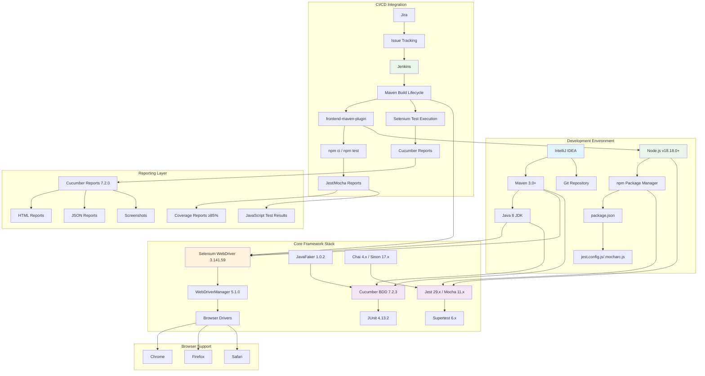
```mermaid
graph TB
    subgraph "Development Environment"
        A[IntelliJ IDEA] --> B[Maven 3.0+]
        B --> C[Java 8 JDK]
        A --> D[Git Repository]
        E[Node.js v18.18.0+] --> F[npm Package Manager]
        F --> G[package.json]
        G --> H[jest.config.js/.mocharc.js]
    end
    
    subgraph "Core Framework Stack"
        I[Selenium WebDriver 3.141.59] --> J[WebDriverManager 5.1.0]
        K[Cucumber BDD 7.2.3] --> L[JUnit 4.13.2]
        M[JavaFaker 1.0.2] --> K
        J --> N[Browser Drivers]
        O[Jest 29.x / Mocha 11.x] --> P[Supertest 6.x]
        Q[Chai 4.x / Sinon 17.x] --> O
    end
    
    subgraph "Browser Support"
        N --> R[Chrome]
        N --> S[Firefox]
        N --> T[Safari]
    end
    
    subgraph "CI/CD Integration"
        U[Jenkins] --> V[Maven Build Lifecycle]
        V --> W[frontend-maven-plugin]
        W --> X[npm ci / npm test]
        V --> Y[Selenium Test Execution]
        X --> Z[Jest/Mocha Reports]
        Y --> AA[Cucumber Reports]
        AB[Jira] --> AC[Issue Tracking]
    end
    
    subgraph "Reporting Layer"
        AD[Cucumber Reports 7.2.0] --> AE[HTML Reports]
        AD --> AF[JSON Reports]
        AD --> AG[Screenshots]
        Z --> AH[Coverage Reports ≥85%]
        Z --> AI[JavaScript Test Results]
    end
    
    B --> I
    B --> K
    C --> I
    C --> K
    E --> O
    F --> O
    W --> E
    V --> I
    AA --> AD
    AC --> U
    
    style A fill:#e1f5fe
    style I fill:#fff3e0
    style K fill:#f3e5f5
    style U fill:#e8f5e8
    style E fill:#e8f5e8
    style O fill:#f3e5f5
```

#### References

#### Repository Files Analyzed
- `pom.xml` - Maven configuration with dependencies and plugin settings
- **<span style="background-color: rgba(91, 57, 243, 0.2)">package.json</span>** - <span style="background-color: rgba(91, 57, 243, 0.2)">JavaScript dependency management and npm script definitions</span>
- **<span style="background-color: rgba(91, 57, 243, 0.2)">jest.config.js/.mocharc.js</span>** - <span style="background-color: rgba(91, 57, 243, 0.2)">JavaScript testing framework configuration files</span>
- `README.md` - Framework documentation and usage instructions  
- `.gitignore` - Git ignore patterns for build artifacts and temporary files
- `.gitattributes` - Git attributes configuration for file handling

#### Technical Specification Sections Referenced
- `1.1 EXECUTIVE SUMMARY` - Business context and stakeholder requirements
- `1.2 SYSTEM OVERVIEW` - Technical architecture and system capabilities
- `2.4 IMPLEMENTATION CONSIDERATIONS` - Technical constraints and performance requirements
- **<span style="background-color: rgba(91, 57, 243, 0.2)">3.1 PROGRAMMING LANGUAGES</span>** - <span style="background-color: rgba(91, 57, 243, 0.2)">Dual-language architecture requirements and Node.js runtime specifications</span>
- **<span style="background-color: rgba(91, 57, 243, 0.2)">3.2 FRAMEWORKS & LIBRARIES</span>** - <span style="background-color: rgba(91, 57, 243, 0.2)">Jest and Mocha framework specifications and supporting library requirements</span>

#### External Research Conducted
- Selenium WebDriver 3.141.59 compatibility and browser support analysis
- Cucumber 7.2.3 BDD framework implementation patterns and requirements
- WebDriverManager 5.1.0 automated driver management capabilities and caching strategies
- **<span style="background-color: rgba(91, 57, 243, 0.2)">frontend-maven-plugin integration patterns for Node.js and Maven build lifecycle coordination</span>**
- **<span style="background-color: rgba(91, 57, 243, 0.2)">Jest 29.x and Mocha 11.x parallel execution strategies and CI/CD integration requirements</span>**

# 4. PROCESS FLOWCHART

## 4.1 SYSTEM WORKFLOWS

### 4.1.1 Core Business Processes

The Testinium-QA framework orchestrates multiple interconnected business processes centered around automated testing workflows. These processes enable comprehensive quality assurance through behavior-driven development, cross-browser automation, and continuous integration practices.

#### 4.1.1.1 Primary Test Execution Journey

The core user journey begins with test scenario creation and culminates in comprehensive reporting and stakeholder communication. This end-to-end process involves multiple decision points, validation checkpoints, and error recovery mechanisms to ensure reliable test execution across diverse environments.

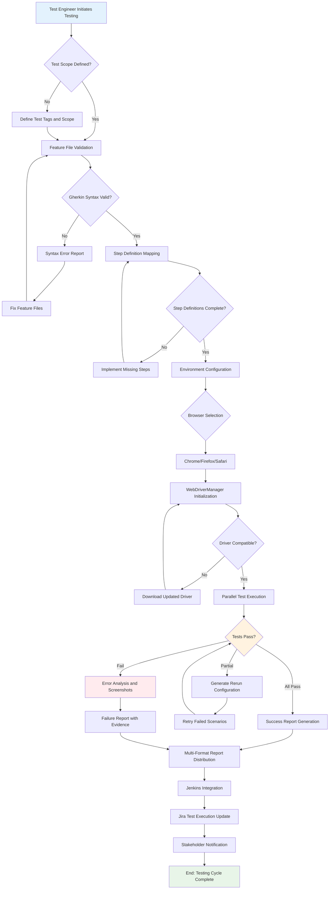
```mermaid
flowchart TD
    A[Test Engineer Initiates Testing] --> B{Test Scope Defined?}
    B -->|Yes| C[Feature File Validation]
    B -->|No| B1[Define Test Tags and Scope]
    B1 --> C
    
    C --> D{Gherkin Syntax Valid?}
    D -->|No| E[Syntax Error Report]
    E --> F[Fix Feature Files]
    F --> C
    D -->|Yes| G[Step Definition Mapping]
    
    G --> H{Step Definitions Complete?}
    H -->|No| I[Implement Missing Steps]
    I --> G
    H -->|Yes| J[Environment Configuration]
    
    J --> K{Browser Selection}
    K --> L[Chrome/Firefox/Safari]
    L --> M[WebDriverManager Initialization]
    
    M --> N{Driver Compatible?}
    N -->|No| O[Download Updated Driver]
    O --> M
    N -->|Yes| P[Parallel Test Execution]
    
    P --> Q{Tests Pass?}
    Q -->|Partial| R[Generate Rerun Configuration]
    Q -->|All Pass| S[Success Report Generation]
    Q -->|Fail| T[Error Analysis and Screenshots]
    
    R --> U[Retry Failed Scenarios]
    U --> Q
    T --> V[Failure Report with Evidence]
    S --> W[Multi-Format Report Distribution]
    V --> W
    
    W --> X[Jenkins Integration]
    X --> Y[Jira Test Execution Update]
    Y --> Z[Stakeholder Notification]
    Z --> AA[End: Testing Cycle Complete]
    
    style A fill:#e3f2fd
    style AA fill:#e8f5e8
    style Q fill:#fff3e0
    style T fill:#ffebee
```

#### 4.1.1.2 User Authentication Testing Process

Multi-role authentication testing follows a structured validation workflow supporting PosManager and SalesManager user types with comprehensive error handling and localization support.

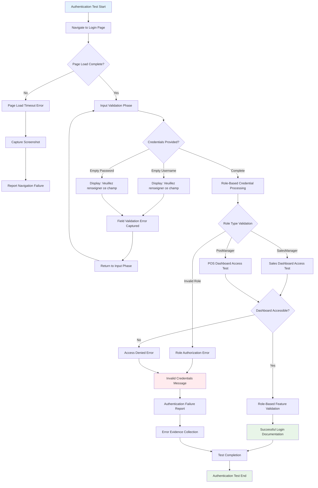
```mermaid
flowchart TD
    A[Authentication Test Start] --> B[Navigate to Login Page]
    B --> C{Page Load Complete?}
    C -->|No| D[Page Load Timeout Error]
    D --> E[Capture Screenshot]
    E --> F[Report Navigation Failure]
    C -->|Yes| G[Input Validation Phase]
    
    G --> H{Credentials Provided?}
    H -->|Empty Username| I[Display: Veuillez renseigner ce champ]
    H -->|Empty Password| J[Display: Veuillez renseigner ce champ]
    H -->|Complete| K[Role-Based Credential Processing]
    
    I --> L[Field Validation Error Captured]
    J --> L
    L --> M[Return to Input Phase]
    M --> G
    
    K --> N{Role Type Validation}
    N -->|SalesManager| O[Sales Dashboard Access Test]
    N -->|PosManager| P[POS Dashboard Access Test]
    N -->|Invalid Role| Q[Role Authorization Error]
    
    O --> R{Dashboard Accessible?}
    P --> R
    R -->|Yes| S[Role-Based Feature Validation]
    R -->|No| T[Access Denied Error]
    Q --> U[Invalid Credentials Message]
    T --> U
    U --> V[Authentication Failure Report]
    
    S --> W[Successful Login Documentation]
    V --> X[Error Evidence Collection]
    W --> Y[Test Completion]
    X --> Y
    Y --> Z[Authentication Test End]
    
    style A fill:#e3f2fd
    style Z fill:#e8f5e8
    style U fill:#ffebee
    style W fill:#e8f5e8
```

### 4.1.2 Integration Workflows

#### 4.1.2.1 CI/CD Pipeline Integration Flow (updated)

The framework integrates seamlessly with Jenkins continuous integration and Jira issue tracking systems to provide automated quality gates and comprehensive traceability across both Java-based browser automation and Node.js server-side testing.

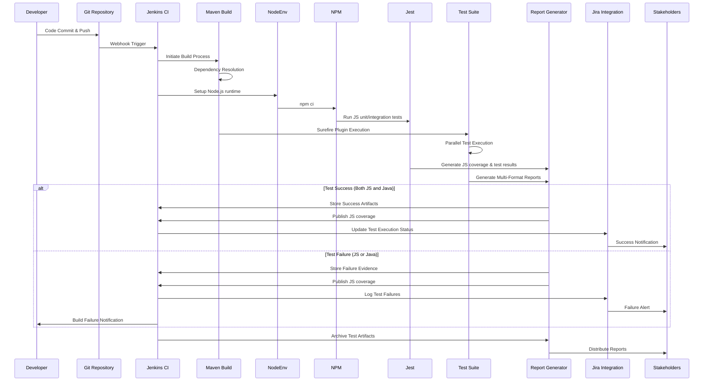
```mermaid
sequenceDiagram
    participant Dev as Developer
    participant Git as Git Repository
    participant Jenkins as Jenkins CI
    participant Maven as Maven Build
    participant NodeEnv as NodeEnv
    participant NPM as NPM
    participant Jest as Jest
    participant Tests as Test Suite
    participant Reports as Report Generator
    participant Jira as Jira Integration
    participant Stakeholders as Stakeholders
    
    Dev->>Git: Code Commit & Push
    Git->>Jenkins: Webhook Trigger
    Jenkins->>Maven: Initiate Build Process
    Maven->>Maven: Dependency Resolution
    
    %% Node.js Testing Pipeline
    Jenkins->>NodeEnv: Setup Node.js runtime
    NodeEnv->>NPM: npm ci
    NPM->>Jest: Run JS unit/integration tests
    
    %% Java Testing Pipeline
    Maven->>Tests: Surefire Plugin Execution
    Tests->>Tests: Parallel Test Execution
    
    %% Parallel Results Processing
    Jest->>Reports: Generate JS coverage & test results
    Tests->>Reports: Generate Multi-Format Reports
    
    alt Test Success (Both JS and Java)
        Reports->>Jenkins: Store Success Artifacts
        Reports->>Jenkins: Publish JS coverage
        Jenkins->>Jira: Update Test Execution Status
        Jira->>Stakeholders: Success Notification
    else Test Failure (JS or Java)
        Reports->>Jenkins: Store Failure Evidence
        Reports->>Jenkins: Publish JS coverage
        Jenkins->>Jira: Log Test Failures
        Jira->>Stakeholders: Failure Alert
        Jenkins->>Dev: Build Failure Notification
    end
    
    Jenkins->>Reports: Archive Test Artifacts
    Reports->>Stakeholders: Distribute Reports
```

#### 4.1.2.2 Browser Driver Management Flow

WebDriverManager provides automated browser driver resolution and caching to ensure consistent cross-browser testing capabilities.

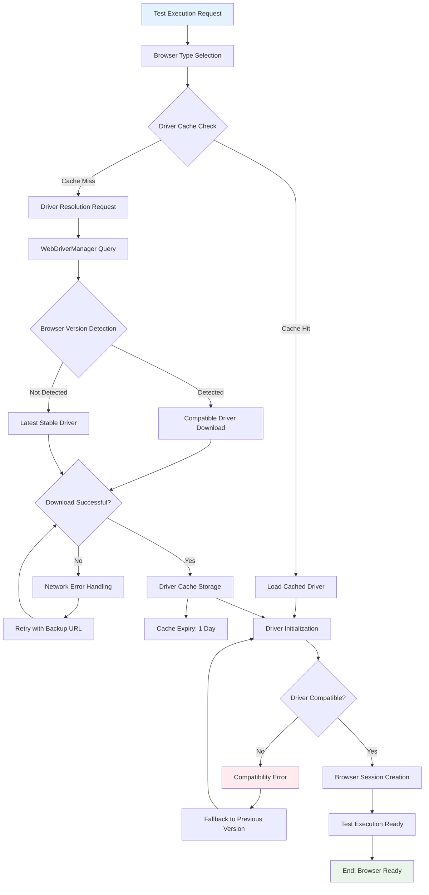
```mermaid
flowchart TD
    A[Test Execution Request] --> B[Browser Type Selection]
    B --> C{Driver Cache Check}
    C -->|Cache Hit| D[Load Cached Driver]
    C -->|Cache Miss| E[Driver Resolution Request]
    
    E --> F[WebDriverManager Query]
    F --> G{Browser Version Detection}
    G -->|Detected| H[Compatible Driver Download]
    G -->|Not Detected| I[Latest Stable Driver]
    
    H --> J{Download Successful?}
    I --> J
    J -->|No| K[Network Error Handling]
    K --> L[Retry with Backup URL]
    L --> J
    J -->|Yes| M[Driver Cache Storage]
    
    M --> N[Cache Expiry: 1 Day]
    D --> O[Driver Initialization]
    M --> O
    
    O --> P{Driver Compatible?}
    P -->|No| Q[Compatibility Error]
    Q --> R[Fallback to Previous Version]
    R --> O
    P -->|Yes| S[Browser Session Creation]
    
    S --> T[Test Execution Ready]
    T --> U[End: Browser Ready]
    
    style A fill:#e3f2fd
    style U fill:#e8f5e8
    style Q fill:#ffebee
```

#### 4.1.2.3 Node.js Test Lifecycle Flow

The Node.js test lifecycle provides comprehensive server-side testing capabilities integrated with the existing Maven build system through frontend-maven-plugin coordination. This workflow ensures comprehensive coverage of server.js components while maintaining seamless integration with Java-based testing infrastructure.

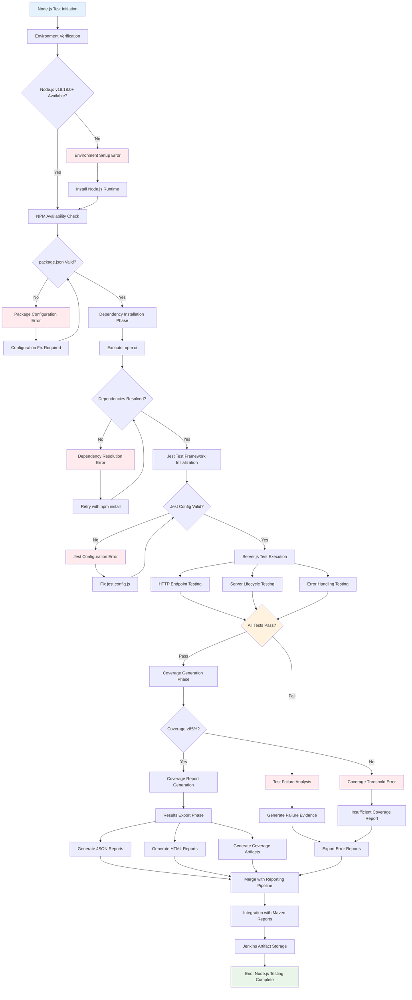
```mermaid
flowchart TD
    A[Node.js Test Initiation] --> B[Environment Verification]
    B --> C{Node.js v18.18.0+ Available?}
    C -->|No| D[Environment Setup Error]
    C -->|Yes| E[NPM Availability Check]
    
    D --> F[Install Node.js Runtime]
    F --> E
    E --> G{package.json Valid?}
    
    G -->|No| H[Package Configuration Error]
    G -->|Yes| I[Dependency Installation Phase]
    H --> AA[Configuration Fix Required]
    AA --> G
    
    I --> J[Execute: npm ci]
    J --> K{Dependencies Resolved?}
    K -->|No| L[Dependency Resolution Error]
    K -->|Yes| M[Jest Test Framework Initialization]
    
    L --> N[Retry with npm install]
    N --> K
    
    M --> O{Jest Config Valid?}
    O -->|No| P[Jest Configuration Error]
    O -->|Yes| Q[Server.js Test Execution]
    
    P --> R[Fix jest.config.js]
    R --> O
    
    Q --> S[HTTP Endpoint Testing]
    Q --> T[Server Lifecycle Testing]
    Q --> U[Error Handling Testing]
    
    S --> V{All Tests Pass?}
    T --> V
    U --> V
    
    V -->|Fail| W[Test Failure Analysis]
    V -->|Pass| X[Coverage Generation Phase]
    
    W --> Y[Generate Failure Evidence]
    Y --> Z[Export Error Reports]
    
    X --> AB{Coverage ≥85%?}
    AB -->|No| AC[Coverage Threshold Error]
    AB -->|Yes| AD[Coverage Report Generation]
    
    AC --> AE[Insufficient Coverage Report]
    AE --> Z
    AD --> AF[Results Export Phase]
    
    AF --> AG[Generate JSON Reports]
    AF --> AH[Generate HTML Reports]
    AF --> AI[Generate Coverage Artifacts]
    
    AG --> AJ[Merge with Reporting Pipeline]
    AH --> AJ
    AI --> AJ
    Z --> AJ
    
    AJ --> AK[Integration with Maven Reports]
    AK --> AL[Jenkins Artifact Storage]
    AL --> AM[End: Node.js Testing Complete]
    
    style A fill:#e3f2fd
    style AM fill:#e8f5e8
    style V fill:#fff3e0
    style D fill:#ffebee
    style H fill:#ffebee
    style L fill:#ffebee
    style P fill:#ffebee
    style W fill:#ffebee
    style AC fill:#ffebee
```

### 4.1.3 State Management Workflows

#### 4.1.3.1 Test State Persistence

The framework maintains comprehensive state management across multiple execution contexts to ensure test reliability and comprehensive reporting capabilities.

**Browser State Management**
- WebDriverManager maintains driver cache with 1-day expiration for consistent browser initialization
- Session state persists across test scenarios within the same execution thread
- Screenshot capture occurs at failure points for debugging and evidence collection
- Browser cookies and local storage cleared between authentication test scenarios

**Test Data State Management**
- JavaFaker generates realistic test data with session-level persistence to avoid data conflicts
- User credentials cached per role type (PosManager, SalesManager) for authentication workflows
- Feature file validation state maintained across Gherkin syntax checking phases
- Step definition mapping state preserved during test discovery and execution phases

**Reporting State Aggregation**
- Multi-format report generation consolidates state from parallel test execution threads
- Jenkins artifact storage maintains persistent state for historical test result analysis
- Jira integration preserves test execution status across build pipeline stages
- Stakeholder notification system maintains delivery state for comprehensive communication workflows

#### 4.1.3.2 Error Recovery Mechanisms

**Retry Logic Implementation**
- Failed test scenarios automatically generate rerun configuration with isolated state
- Browser driver compatibility failures trigger automatic fallback to previous stable versions  
- Network timeout errors in WebDriverManager implement exponential backoff retry strategies
- Authentication failures reset session state and retry with fresh credential validation

**Fallback Process Activation**
- Primary test execution failure activates secondary validation pathways
- Browser initialization errors fall back to headless execution modes for CI/CD compatibility
- Driver download failures retry with backup URL repositories for dependency resolution
- Gherkin syntax errors trigger automated fix suggestions and validation retry loops

**State Recovery Procedures**
- Test environment restoration resets browser sessions and clears temporary data
- Maven build failure recovery preserves partial test results for incremental execution
- Jenkins pipeline interruption maintains artifact state for manual intervention and resume capabilities
- Error evidence collection preserves failure context for comprehensive debugging workflows

## 4.2 DETAILED PROCESS FLOWS

### 4.2.1 Feature F-001: BDD Test Scenario Management

Behavior-Driven Development test scenario management enables collaborative test creation through Gherkin syntax with comprehensive validation and execution capabilities.

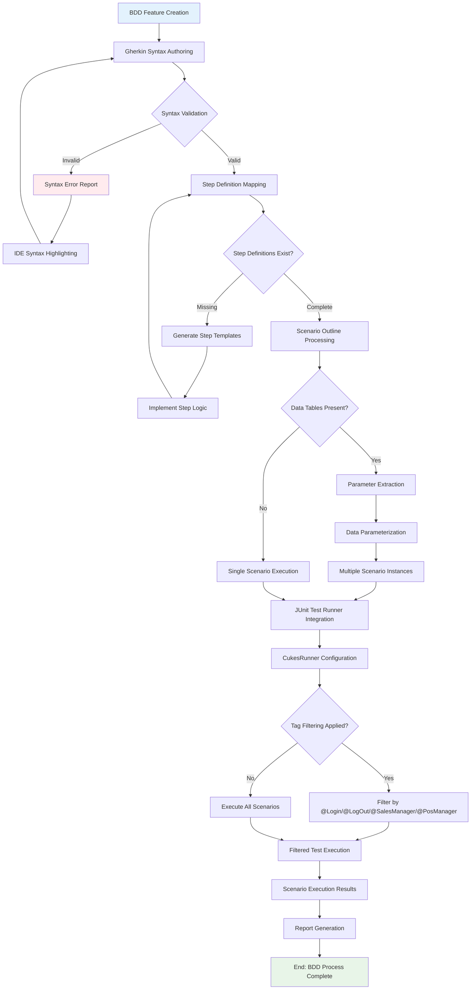
```mermaid
flowchart TD
    A[BDD Feature Creation] --> B[Gherkin Syntax Authoring]
    B --> C{Syntax Validation}
    C -->|Invalid| D[Syntax Error Report]
    D --> E[IDE Syntax Highlighting]
    E --> B
    C -->|Valid| F[Step Definition Mapping]
    
    F --> G{Step Definitions Exist?}
    G -->|Missing| H[Generate Step Templates]
    H --> I[Implement Step Logic]
    I --> F
    G -->|Complete| J[Scenario Outline Processing]
    
    J --> K{Data Tables Present?}
    K -->|Yes| L[Parameter Extraction]
    K -->|No| M[Single Scenario Execution]
    L --> N[Data Parameterization]
    N --> O[Multiple Scenario Instances]
    
    O --> P[JUnit Test Runner Integration]
    M --> P
    P --> Q[CukesRunner Configuration]
    Q --> R{Tag Filtering Applied?}
    R -->|Yes| S[Filter by @Login/@LogOut/@SalesManager/@PosManager]
    R -->|No| T[Execute All Scenarios]
    
    S --> U[Filtered Test Execution]
    T --> U
    U --> V[Scenario Execution Results]
    V --> W[Report Generation]
    W --> X[End: BDD Process Complete]
    
    style A fill:#e3f2fd
    style X fill:#e8f5e8
    style D fill:#ffebee
```

### 4.2.2 Feature F-002: Browser Automation Engine

Cross-browser automation engine provides comprehensive browser support with automatic driver management and parallel execution capabilities.

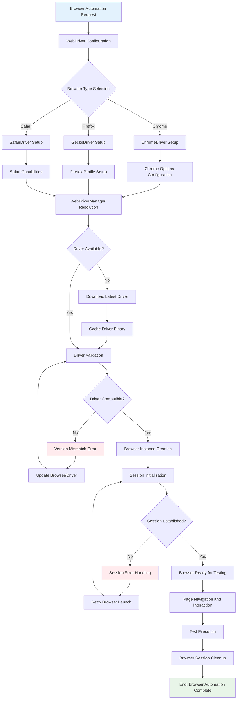
```mermaid
flowchart TD
    A[Browser Automation Request] --> B[WebDriver Configuration]
    B --> C{Browser Type Selection}
    C -->|Chrome| D[ChromeDriver Setup]
    C -->|Firefox| E[GeckoDriver Setup]
    C -->|Safari| F[SafariDriver Setup]
    
    D --> G[Chrome Options Configuration]
    E --> H[Firefox Profile Setup]
    F --> I[Safari Capabilities]
    
    G --> J[WebDriverManager Resolution]
    H --> J
    I --> J
    
    J --> K{Driver Available?}
    K -->|No| L[Download Latest Driver]
    L --> M[Cache Driver Binary]
    M --> N[Driver Validation]
    K -->|Yes| N
    
    N --> O{Driver Compatible?}
    O -->|No| P[Version Mismatch Error]
    P --> Q[Update Browser/Driver]
    Q --> N
    O -->|Yes| R[Browser Instance Creation]
    
    R --> S[Session Initialization]
    S --> T{Session Established?}
    T -->|No| U[Session Error Handling]
    U --> V[Retry Browser Launch]
    V --> S
    T -->|Yes| W[Browser Ready for Testing]
    
    W --> X[Page Navigation and Interaction]
    X --> Y[Test Execution]
    Y --> Z[Browser Session Cleanup]
    Z --> AA[End: Browser Automation Complete]
    
    style A fill:#e3f2fd
    style AA fill:#e8f5e8
    style P fill:#ffebee
    style U fill:#ffebee
```

### 4.2.3 Feature F-003: Multi-Role Authentication Testing

Automated authentication testing workflow supporting multiple user roles with comprehensive validation and error handling capabilities.

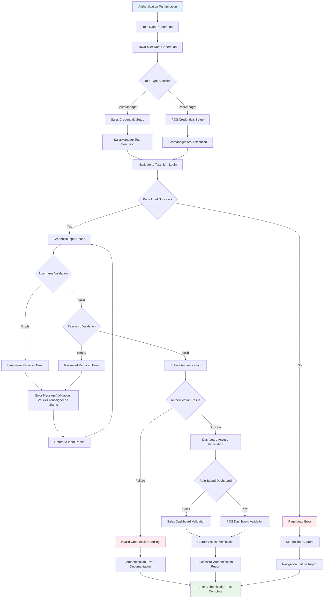
```mermaid
flowchart TD
    A[Authentication Test Initiation] --> B[Test Data Preparation]
    B --> C[JavaFaker Data Generation]
    C --> D{Role Type Selection}
    D -->|SalesManager| E[Sales Credentials Setup]
    D -->|PosManager| F[POS Credentials Setup]
    
    E --> G[SalesManager Test Execution]
    F --> H[PosManager Test Execution]
    
    G --> I[Navigate to Testinium Login]
    H --> I
    I --> J{Page Load Success?}
    J -->|No| K[Page Load Error]
    K --> L[Screenshot Capture]
    L --> M[Navigation Failure Report]
    J -->|Yes| N[Credential Input Phase]
    
    N --> O{Username Validation}
    O -->|Empty| P[Username Required Error]
    O -->|Valid| Q{Password Validation}
    Q -->|Empty| R[Password Required Error]
    Q -->|Valid| S[Submit Authentication]
    
    P --> T[Error Message Validation: Veuillez renseigner ce champ]
    R --> T
    T --> U[Return to Input Phase]
    U --> N
    
    S --> V{Authentication Result}
    V -->|Success| W[Dashboard Access Verification]
    V -->|Failure| X[Invalid Credentials Handling]
    
    W --> Y{Role-Based Dashboard}
    Y -->|Sales| Z[Sales Dashboard Validation]
    Y -->|POS| AA[POS Dashboard Validation]
    Z --> BB[Feature Access Verification]
    AA --> BB
    
    X --> CC[Authentication Error Documentation]
    BB --> DD[Successful Authentication Report]
    CC --> EE[End: Authentication Test Complete]
    DD --> EE
    M --> EE
    
    style A fill:#e3f2fd
    style EE fill:#e8f5e8
    style K fill:#ffebee
    style X fill:#ffebee
```

### 4.2.4 Feature F-004: Parallel Test Execution Engine

High-performance parallel test execution with unlimited thread support and comprehensive test isolation mechanisms.

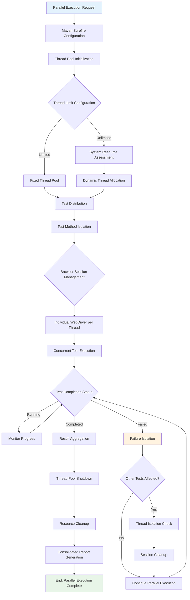
```mermaid
flowchart TD
    A[Parallel Execution Request] --> B[Maven Surefire Configuration]
    B --> C[Thread Pool Initialization]
    C --> D{Thread Limit Configuration}
    D -->|Unlimited| E[System Resource Assessment]
    D -->|Limited| F[Fixed Thread Pool]
    
    E --> G[Dynamic Thread Allocation]
    F --> H[Test Distribution]
    G --> H
    
    H --> I[Test Method Isolation]
    I --> J{Browser Session Management}
    J --> K[Individual WebDriver per Thread]
    K --> L[Concurrent Test Execution]
    
    L --> M{Test Completion Status}
    M -->|Running| N[Monitor Progress]
    M -->|Completed| O[Result Aggregation]
    M -->|Failed| P[Failure Isolation]
    
    N --> M
    P --> Q{Other Tests Affected?}
    Q -->|No| R[Continue Parallel Execution]
    Q -->|Yes| S[Thread Isolation Check]
    
    R --> M
    S --> T[Session Cleanup]
    T --> R
    
    O --> U[Thread Pool Shutdown]
    U --> V[Resource Cleanup]
    V --> W[Consolidated Report Generation]
    W --> X[End: Parallel Execution Complete]
    
    style A fill:#e3f2fd
    style X fill:#e8f5e8
    style P fill:#fff3e0
```

### 4.2.5 Feature F-005: Test Reporting and Documentation

Multi-format test reporting system with automated screenshot capture and comprehensive evidence collection.

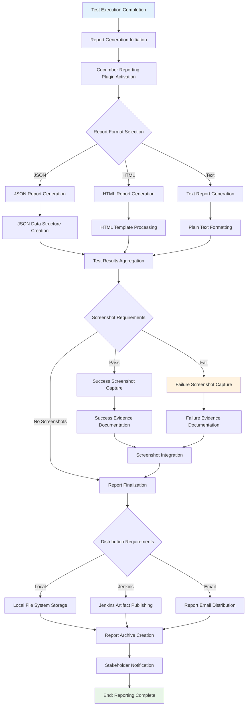
```mermaid
flowchart TD
    A[Test Execution Completion] --> B[Report Generation Initiation]
    B --> C[Cucumber Reporting Plugin Activation]
    C --> D{Report Format Selection}
    
    D -->|JSON| E[JSON Report Generation]
    D -->|HTML| F[HTML Report Generation]
    D -->|Text| G[Text Report Generation]
    
    E --> H[JSON Data Structure Creation]
    F --> I[HTML Template Processing]
    G --> J[Plain Text Formatting]
    
    H --> K[Test Results Aggregation]
    I --> K
    J --> K
    
    K --> L{Screenshot Requirements}
    L -->|Pass| M[Success Screenshot Capture]
    L -->|Fail| N[Failure Screenshot Capture]
    L -->|No Screenshots| O[Report Finalization]
    
    M --> P[Success Evidence Documentation]
    N --> Q[Failure Evidence Documentation]
    P --> R[Screenshot Integration]
    Q --> R
    R --> O
    
    O --> S{Distribution Requirements}
    S -->|Local| T[Local File System Storage]
    S -->|Jenkins| U[Jenkins Artifact Publishing]
    S -->|Email| V[Report Email Distribution]
    
    T --> W[Report Archive Creation]
    U --> W
    V --> W
    
    W --> X[Stakeholder Notification]
    X --> Y[End: Reporting Complete]
    
    style A fill:#e3f2fd
    style Y fill:#e8f5e8
    style N fill:#fff3e0
```

### 4.2.6 Feature F-006: CI/CD Integration Platform

Seamless Jenkins and Jira integration for automated testing workflows and comprehensive issue tracking.

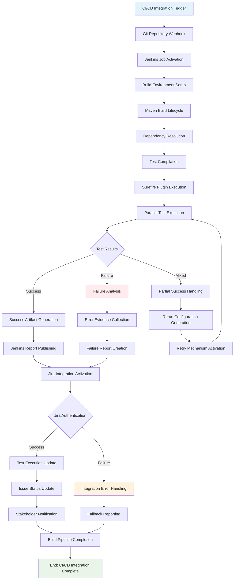
```mermaid
flowchart TD
    A[CI/CD Integration Trigger] --> B[Git Repository Webhook]
    B --> C[Jenkins Job Activation]
    C --> D[Build Environment Setup]
    D --> E[Maven Build Lifecycle]
    
    E --> F[Dependency Resolution]
    F --> G[Test Compilation]
    G --> H[Surefire Plugin Execution]
    H --> I[Parallel Test Execution]
    
    I --> J{Test Results}
    J -->|Success| K[Success Artifact Generation]
    J -->|Failure| L[Failure Analysis]
    J -->|Mixed| M[Partial Success Handling]
    
    K --> N[Jenkins Report Publishing]
    L --> O[Error Evidence Collection]
    M --> P[Rerun Configuration Generation]
    
    O --> Q[Failure Report Creation]
    P --> R[Retry Mechanism Activation]
    R --> I
    
    N --> S[Jira Integration Activation]
    Q --> S
    
    S --> T{Jira Authentication}
    T -->|Success| U[Test Execution Update]
    T -->|Failure| V[Integration Error Handling]
    
    U --> W[Issue Status Update]
    W --> X[Stakeholder Notification]
    V --> Y[Fallback Reporting]
    
    X --> Z[Build Pipeline Completion]
    Y --> Z
    Z --> AA[End: CI/CD Integration Complete]
    
    style A fill:#e3f2fd
    style AA fill:#e8f5e8
    style L fill:#ffebee
    style V fill:#fff3e0
```

### 4.2.7 Feature F-007: Test Data Generation

Automated test data generation using JavaFaker for dynamic and realistic test scenario execution.

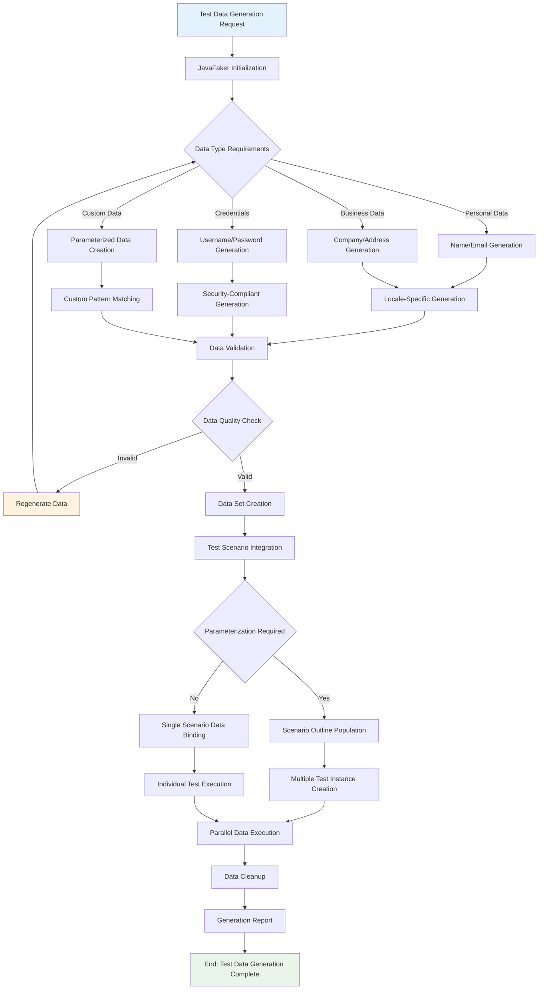
```mermaid
flowchart TD
    A[Test Data Generation Request] --> B[JavaFaker Initialization]
    B --> C{Data Type Requirements}
    
    C -->|Personal Data| D[Name/Email Generation]
    C -->|Business Data| E[Company/Address Generation]
    C -->|Credentials| F[Username/Password Generation]
    C -->|Custom Data| G[Parameterized Data Creation]
    
    D --> H[Locale-Specific Generation]
    E --> H
    F --> I[Security-Compliant Generation]
    G --> J[Custom Pattern Matching]
    
    H --> K[Data Validation]
    I --> K
    J --> K
    
    K --> L{Data Quality Check}
    L -->|Invalid| M[Regenerate Data]
    L -->|Valid| N[Data Set Creation]
    M --> C
    
    N --> O[Test Scenario Integration]
    O --> P{Parameterization Required}
    P -->|Yes| Q[Scenario Outline Population]
    P -->|No| R[Single Scenario Data Binding]
    
    Q --> S[Multiple Test Instance Creation]
    R --> T[Individual Test Execution]
    S --> U[Parallel Data Execution]
    T --> U
    
    U --> V[Data Cleanup]
    V --> W[Generation Report]
    W --> X[End: Test Data Generation Complete]
    
    style A fill:#e3f2fd
    style X fill:#e8f5e8
    style M fill:#fff3e0
```

### 4.2.8 Feature F-008: Node.js Server Unit & Integration Testing

<span style="background-color: rgba(91, 57, 243, 0.2)">Comprehensive Node.js server testing framework providing HTTP endpoint validation, lifecycle management, and integration testing capabilities through Jest and Supertest integration.</span>

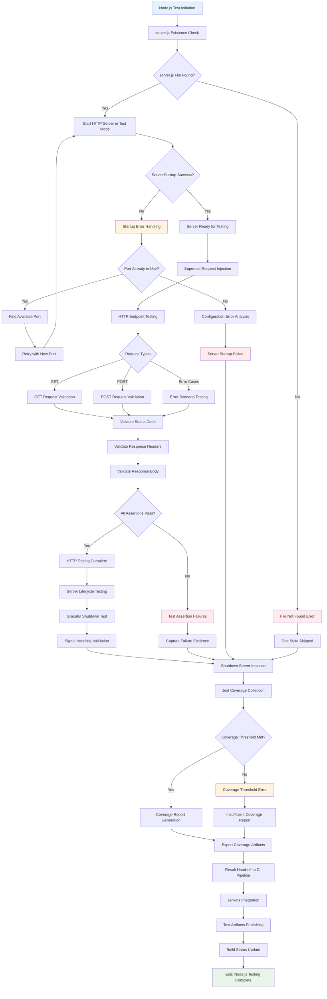
```mermaid
flowchart TD
    A["Node.js Test Initiation"] --> B["server.js Existence Check"]
    B --> C{"server.js File Found?"}
    C -->|No| D["File Not Found Error"]
    D --> E["Test Suite Skipped"]
    C -->|Yes| F["Start HTTP Server in Test Mode"]
    
    F --> G{"Server Startup Success?"}
    G -->|No| H["Startup Error Handling"]
    H --> I{"Port Already in Use?"}
    I -->|Yes| J["Find Available Port"]
    I -->|No| K["Configuration Error Analysis"]
    J --> L["Retry with New Port"]
    L --> F
    K --> M["Server Startup Failed"]
    G -->|Yes| N["Server Ready for Testing"]
    
    N --> O["Supertest Request Injection"]
    O --> P["HTTP Endpoint Testing"]
    P --> Q{"Request Types"}
    
    Q -->|GET| R["GET Request Validation"]
    Q -->|POST| S["POST Request Validation"]
    Q -->|Error Cases| T["Error Scenario Testing"]
    
    R --> U["Validate Status Code"]
    S --> U
    T --> U
    
    U --> V["Validate Response Headers"]
    V --> W["Validate Response Body"]
    W --> X{"All Assertions Pass?"}
    
    X -->|No| Y["Test Assertion Failures"]
    Y --> Z["Capture Failure Evidence"]
    X -->|Yes| AA["HTTP Testing Complete"]
    
    AA --> BB["Server Lifecycle Testing"]
    BB --> CC["Graceful Shutdown Test"]
    CC --> DD["Signal Handling Validation"]
    DD --> EE["Shutdown Server Instance"]
    
    Z --> EE
    M --> EE
    E --> EE
    
    EE --> FF["Jest Coverage Collection"]
    FF --> GG{"Coverage Threshold Met?"}
    GG -->|No| HH["Coverage Threshold Error"]
    GG -->|Yes| II["Coverage Report Generation"]
    
    HH --> JJ["Insufficient Coverage Report"]
    II --> KK["Export Coverage Artifacts"]
    JJ --> KK
    
    KK --> LL["Result Hand-off to CI Pipeline"]
    LL --> MM["Jenkins Integration"]
    MM --> NN["Test Artifacts Publishing"]
    NN --> OO["Build Status Update"]
    OO --> PP["End: Node.js Testing Complete"]
    
    style A fill:#e3f2fd
    style PP fill:#e8f5e8
    style D fill:#ffebee
    style H fill:#fff3e0
    style M fill:#ffebee
    style Y fill:#ffebee
    style HH fill:#fff3e0
```

## 4.3 ERROR HANDLING WORKFLOWS

### 4.3.1 Test Execution Error Recovery

Comprehensive error handling and recovery mechanisms ensure robust test execution with automatic retry capabilities and detailed error documentation.

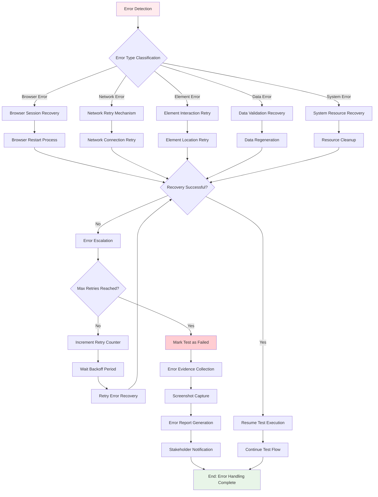
```mermaid
flowchart TD
    A[Error Detection] --> B{Error Type Classification}
    
    B -->|Browser Error| C[Browser Session Recovery]
    B -->|Network Error| D[Network Retry Mechanism]
    B -->|Element Error| E[Element Interaction Retry]
    B -->|Data Error| F[Data Validation Recovery]
    B -->|System Error| G[System Resource Recovery]
    
    C --> H[Browser Restart Process]
    D --> I[Network Connection Retry]
    E --> J[Element Location Retry]
    F --> K[Data Regeneration]
    G --> L[Resource Cleanup]
    
    H --> M{Recovery Successful?}
    I --> M
    J --> M
    K --> M
    L --> M
    
    M -->|Yes| N[Resume Test Execution]
    M -->|No| O[Error Escalation]
    
    N --> P[Continue Test Flow]
    O --> Q{Max Retries Reached?}
    
    Q -->|No| R[Increment Retry Counter]
    Q -->|Yes| S[Mark Test as Failed]
    
    R --> T[Wait Backoff Period]
    T --> U[Retry Error Recovery]
    U --> M
    
    S --> V[Error Evidence Collection]
    V --> W[Screenshot Capture]
    W --> X[Error Report Generation]
    X --> Y[Stakeholder Notification]
    Y --> Z[End: Error Handling Complete]
    P --> Z
    
    style A fill:#ffebee
    style Z fill:#e8f5e8
    style S fill:#ffcdd2
```

### 4.3.2 CI/CD Integration Error Handling

Specialized error handling for continuous integration workflows with Jenkins and Jira integration failure recovery.

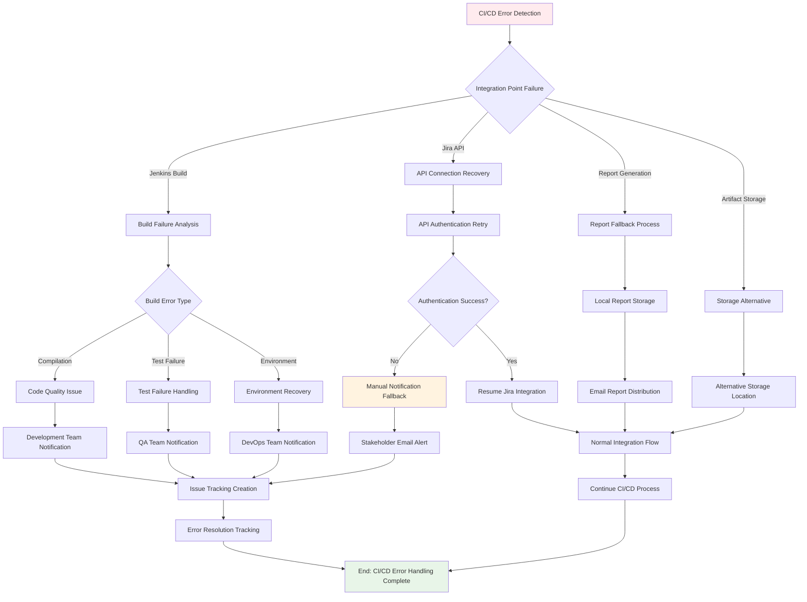
```mermaid
flowchart TD
    A[CI/CD Error Detection] --> B{Integration Point Failure}
    
    B -->|Jenkins Build| C[Build Failure Analysis]
    B -->|Jira API| D[API Connection Recovery]
    B -->|Report Generation| E[Report Fallback Process]
    B -->|Artifact Storage| F[Storage Alternative]
    
    C --> G{Build Error Type}
    G -->|Compilation| H[Code Quality Issue]
    G -->|Test Failure| I[Test Failure Handling]
    G -->|Environment| J[Environment Recovery]
    
    D --> K[API Authentication Retry]
    K --> L{Authentication Success?}
    L -->|No| M[Manual Notification Fallback]
    L -->|Yes| N[Resume Jira Integration]
    
    E --> O[Local Report Storage]
    O --> P[Email Report Distribution]
    F --> Q[Alternative Storage Location]
    
    H --> R[Development Team Notification]
    I --> S[QA Team Notification]
    J --> T[DevOps Team Notification]
    
    M --> U[Stakeholder Email Alert]
    N --> V[Normal Integration Flow]
    P --> V
    Q --> V
    
    R --> W[Issue Tracking Creation]
    S --> W
    T --> W
    U --> W
    
    W --> X[Error Resolution Tracking]
    V --> Y[Continue CI/CD Process]
    X --> Z[End: CI/CD Error Handling Complete]
    Y --> Z
    
    style A fill:#ffebee
    style Z fill:#e8f5e8
    style M fill:#fff3e0
```

## 4.4 STATE MANAGEMENT FLOWS

### 4.4.1 Test Execution State Transitions

Comprehensive state management ensuring proper test lifecycle progression with checkpoint validation and rollback capabilities.

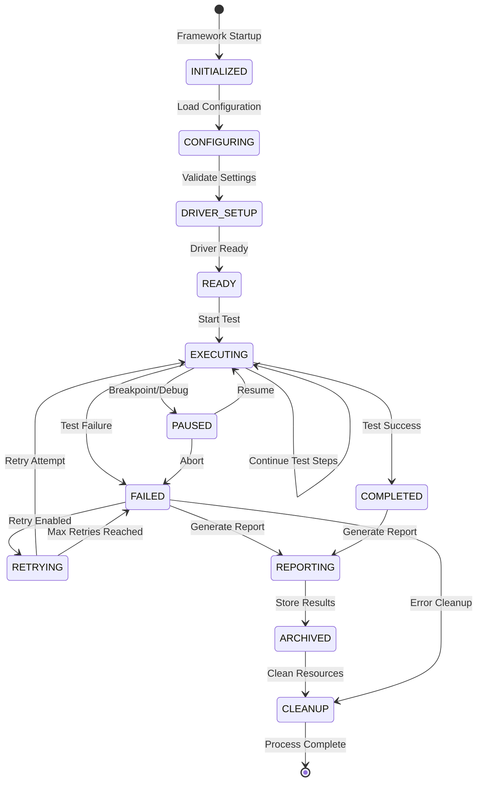
```mermaid
stateDiagram-v2
    [*] --> INITIALIZED : Framework Startup
    INITIALIZED --> CONFIGURING : Load Configuration
    CONFIGURING --> DRIVER_SETUP : Validate Settings
    DRIVER_SETUP --> READY : Driver Ready
    
    READY --> EXECUTING : Start Test
    EXECUTING --> EXECUTING : Continue Test Steps
    EXECUTING --> PAUSED : Breakpoint/Debug
    EXECUTING --> FAILED : Test Failure
    EXECUTING --> COMPLETED : Test Success
    
    PAUSED --> EXECUTING : Resume
    PAUSED --> FAILED : Abort
    
    FAILED --> RETRYING : Retry Enabled
    FAILED --> REPORTING : Generate Report
    
    RETRYING --> EXECUTING : Retry Attempt
    RETRYING --> FAILED : Max Retries Reached
    
    COMPLETED --> REPORTING : Generate Report
    REPORTING --> ARCHIVED : Store Results
    ARCHIVED --> CLEANUP : Clean Resources
    CLEANUP --> [*] : Process Complete
    
    FAILED --> CLEANUP : Error Cleanup
```

### 4.4.2 Browser Session State Management

Browser session lifecycle management with proper initialization, maintenance, and cleanup procedures.

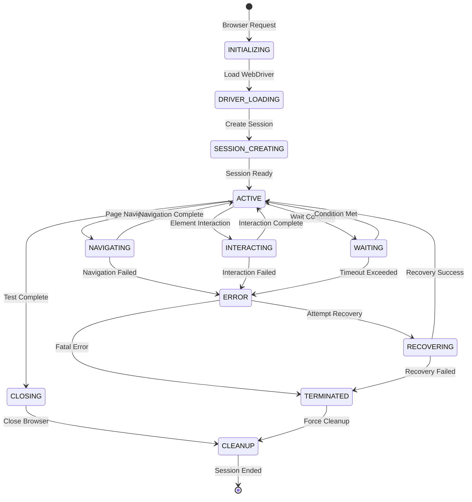
```mermaid
stateDiagram-v2
    [*] --> INITIALIZING : Browser Request
    INITIALIZING --> DRIVER_LOADING : Load WebDriver
    DRIVER_LOADING --> SESSION_CREATING : Create Session
    SESSION_CREATING --> ACTIVE : Session Ready
    
    ACTIVE --> NAVIGATING : Page Navigation
    ACTIVE --> INTERACTING : Element Interaction
    ACTIVE --> WAITING : Wait Condition
    
    NAVIGATING --> ACTIVE : Navigation Complete
    NAVIGATING --> ERROR : Navigation Failed
    
    INTERACTING --> ACTIVE : Interaction Complete
    INTERACTING --> ERROR : Interaction Failed
    
    WAITING --> ACTIVE : Condition Met
    WAITING --> ERROR : Timeout Exceeded
    
    ERROR --> RECOVERING : Attempt Recovery
    ERROR --> TERMINATED : Fatal Error
    
    RECOVERING --> ACTIVE : Recovery Success
    RECOVERING --> TERMINATED : Recovery Failed
    
    ACTIVE --> CLOSING : Test Complete
    CLOSING --> CLEANUP : Close Browser
    CLEANUP --> [*] : Session Ended
    
    TERMINATED --> CLEANUP : Force Cleanup
```

## 4.5 INTEGRATION SEQUENCE DIAGRAMS

### 4.5.1 Complete Test Execution Sequence (updated)

End-to-end test execution sequence showing all system interactions and decision points for the <span style="background-color: rgba(91, 57, 243, 0.2)">dual-language testing environment (Java and JavaScript)</span>.

```mermaid
sequenceDiagram
    participant User as Test Engineer
    participant IDE as IntelliJ IDEA
    participant Maven as Maven Build
    participant Surefire as Surefire Plugin
    participant NPM as NPM Package Manager
    participant Jest as Jest JS Test Runner
    participant Cucumber as Cucumber Framework
    participant WebDriver as Selenium WebDriver
    participant Browser as Browser Instance
    participant Reports as Report Generator
    participant Jenkins as Jenkins CI
    participant Jira as Jira API
    
    User->>IDE: Execute Test Suite
    IDE->>Maven: mvn test command
    Maven->>Maven: Dependency Resolution
    Maven->>Surefire: Activate Plugin
    Maven->>NPM: npm ci
    NPM->>Jest: jest --coverage
    
    Note over NPM,Jest: Node.js >=18.18.0 required for Jest 29.x
    
    Surefire->>Cucumber: Initialize Framework
    Cucumber->>Cucumber: Parse Feature Files
    Cucumber->>Cucumber: Map Step Definitions
    
    loop Parallel Test Execution (Java)
        Surefire->>WebDriver: Create Driver Instance
        WebDriver->>Browser: Launch Browser
        Browser-->>WebDriver: Session Established
        
        WebDriver->>Browser: Navigate to Application
        WebDriver->>Browser: Perform Test Steps
        Browser-->>WebDriver: Step Results
        
        alt Test Success
            WebDriver->>Reports: Log Success
        else Test Failure
            WebDriver->>Reports: Log Failure + Screenshot
        end
        
        WebDriver->>Browser: Close Session
    end
    
    loop Parallel Test Execution (JavaScript)
        Jest->>Jest: Execute Unit Tests
        Jest->>Jest: Generate Coverage Data
        
        alt Test Success
            Jest->>Reports: JS results & coverage
        else Test Failure
            Jest->>Reports: JS test failure + stack trace
        end
    end
    
    Surefire->>Reports: Generate Reports
    Reports->>Reports: Create Multi-Format Output
    Reports-->>Maven: Report Complete
    
    Maven->>Jenkins: Publish Results
    Jenkins->>Jira: Update Test Execution
    Jira-->>Jenkins: Update Confirmed
    Jenkins-->>User: Notification
```

### 4.5.2 Error Handling and Recovery Sequence

Detailed sequence showing error detection, handling, and recovery mechanisms across all system components.

```mermaid
sequenceDiagram
    participant Test as Test Execution
    participant Error as Error Handler
    participant Retry as Retry Mechanism
    participant Recovery as Recovery Service
    participant Report as Error Reporting
    participant Notification as Alert System
    
    Test->>Error: Error Detected
    Error->>Error: Classify Error Type
    
    alt Retryable Error
        Error->>Retry: Initiate Retry Process
        Retry->>Recovery: Attempt Recovery
        
        alt Recovery Successful
            Recovery-->>Retry: Recovery Complete
            Retry-->>Test: Resume Execution
        else Recovery Failed
            Recovery-->>Retry: Recovery Failed
            Retry->>Retry: Increment Counter
            
            alt Max Retries Not Reached
                Retry->>Recovery: Retry Recovery
            else Max Retries Reached
                Retry->>Report: Generate Error Report
                Report->>Notification: Send Alert
            end
        end
        
    else Non-Retryable Error
        Error->>Report: Generate Immediate Report
        Report->>Notification: Send Critical Alert
        Report-->>Test: Mark as Failed
    end
```

#### References

#### Repository Files Analyzed
- `README.md` - Framework overview, sample test scenarios, and CI/CD integration documentation
- `pom.xml` - Maven configuration with dependencies, plugins, and parallel execution settings
- <span style="background-color: rgba(91, 57, 243, 0.2)">`package.json` - Node.js dependency management and npm script configurations</span>
- `src/main/resources/features/` - BDD feature file structure and test scenarios
- `com/testinium/step_definitions/LoginSD.java` - Step definition implementation patterns

#### Technical Specification Sections Referenced
- `2.1 FEATURE CATALOG` - Complete feature descriptions (F-001 through F-007) with metadata and dependencies
- `3.6 DEVELOPMENT & DEPLOYMENT` - Build system configuration and CI/CD integration details
- `1.2 SYSTEM OVERVIEW` - High-level architecture and component relationships
- `2.4 IMPLEMENTATION CONSIDERATIONS` - Performance requirements and technical constraints
- <span style="background-color: rgba(91, 57, 243, 0.2)">`0.1 USER INTENT RESTATEMENT` - Dual-language environment requirements and integration specifications</span>

#### External Dependencies Analyzed
- Selenium WebDriver 3.141.59 - Browser automation capabilities and session management
- Cucumber 7.2.3/7.3.4 - BDD framework integration and Gherkin syntax support
- WebDriverManager 5.1.0 - Automated driver resolution and caching mechanisms
- Maven Surefire Plugin 3.0.0-M5 - Parallel test execution and reporting configuration
- JavaFaker 1.0.2 - Dynamic test data generation capabilities
- <span style="background-color: rgba(91, 57, 243, 0.2)">Jest 29.x - JavaScript testing framework with built-in mocking and coverage reporting</span>
- <span style="background-color: rgba(91, 57, 243, 0.2)">Node.js >=18.18.0 - JavaScript runtime environment for server-side test execution</span>

# 5. SYSTEM ARCHITECTURE

## 5.1 HIGH-LEVEL ARCHITECTURE

### 5.1.1 System Overview

#### 5.1.1.1 Architecture Style and Rationale

The Testinium-QA framework implements a **Modular Test Automation Architecture** designed around behavior-driven development principles and parallel execution capabilities. <span style="background-color: rgba(91, 57, 243, 0.2)">The system introduces a JavaScript Testing Sub-System that co-exists with the existing Java automation layers, creating a comprehensive dual-runtime testing environment. This JavaScript sub-system leverages Node.js runtime with Jest/Mocha frameworks to provide unit and integration testing capabilities for server-side components, particularly server.js HTTP endpoints and related Node.js application logic.</span> The architecture follows a component-based design philosophy that separates concerns between test execution, browser automation, reporting, and CI/CD integration.

The system employs a **plugin-based extensibility model** leveraging Maven's plugin ecosystem to enable flexible configuration and extension. This approach allows the framework to scale horizontally through unlimited concurrent test execution threads while maintaining clean separation of responsibilities between different system layers.

#### 5.1.1.2 Key Architectural Principles

The framework is built on <span style="background-color: rgba(91, 57, 243, 0.2)">six</span> core architectural principles:

- **Separation of Concerns**: Clear boundaries between test definition (Cucumber/Gherkin), execution engine (JUnit), browser automation (Selenium), and reporting layers
- **Parallel Processing**: Native support for unlimited concurrent test execution threads to maximize throughput and resource utilization
- **BDD-Driven Collaboration**: Business-readable test scenarios using Gherkin syntax to promote collaboration between technical and non-technical stakeholders
- **Automated Resource Management**: WebDriverManager handles browser driver lifecycle automatically, eliminating manual configuration overhead
- **Integration-First Design**: Built-in CI/CD integration with Jenkins and Jira to support continuous testing workflows
- **<span style="background-color: rgba(91, 57, 243, 0.2)">Dual-Runtime Execution (JVM + Node.js)</span>**: <span style="background-color: rgba(91, 57, 243, 0.2)">Coordinated execution across Java Virtual Machine and Node.js runtime environments, orchestrated through Maven Surefire plugin for Java-based tests and npm/Jest runners for JavaScript unit tests. This principle enables comprehensive testing coverage across both browser automation workflows and server-side application logic through unified build pipeline management.</span>

#### 5.1.1.3 System Boundaries and Interfaces

The framework operates within a well-defined ecosystem with clear boundaries:

**Internal Boundaries:**
- Test Definition Layer: Feature files and step definitions
- Execution Layer: JUnit test runners and parallel execution management
- Browser Automation Layer: Selenium WebDriver and browser driver management
- Reporting Layer: Multi-format report generation and distribution
- <span style="background-color: rgba(91, 57, 243, 0.2)">JavaScript Test Execution Layer (Jest): Unit and integration testing for Node.js server components</span>
- <span style="background-color: rgba(91, 57, 243, 0.2)">HTTP Server Under Test (server.js): Production server-side code providing endpoints for test validation</span>

**External Interfaces:**
- CI/CD Integration: Jenkins webhook and API integration
- Issue Tracking: Jira REST API for test execution tracking
- Version Control: Git protocol integration with GitHub
- Dependency Management: Maven Central repository access
- <span style="background-color: rgba(91, 57, 243, 0.2)">npm Registry access: JavaScript dependency resolution and package management</span>
- <span style="background-color: rgba(91, 57, 243, 0.2)">Node.js runtime in CI agents: Server-side JavaScript execution environment requirements</span>

### 5.1.2 Core Components Table

| Component Name | Primary Responsibility | Key Dependencies | Integration Points |
|----------------|----------------------|------------------|-------------------|
| **BDD Engine** | Gherkin scenario parsing and execution | Cucumber 7.2.3/7.3.4, JUnit 4.13.2 | Feature files, Step definitions |
| **Test Execution Engine** | Parallel test orchestration | Maven Surefire 3.0.0-M5 | CI/CD pipelines, Test runners |
| **Browser Automation** | Web application interaction | Selenium WebDriver 3.141.59 | WebDriverManager, Browser instances |
| **Driver Management** | Automated browser driver resolution | WebDriverManager 5.1.0 | Browser vendors, Cache storage |
| **Data Generation** | Dynamic test data creation | JavaFaker 1.0.2 | Step definitions, Test scenarios |
| **Reporting Engine** | Multi-format report generation | Cucumber Reporting Plugin 7.2.0 | CI/CD artifacts, Stakeholder notifications |
| <span style="background-color: rgba(91, 57, 243, 0.2)">**JavaScript Test Runner**</span> | <span style="background-color: rgba(91, 57, 243, 0.2)">Executes Jest suites</span> | <span style="background-color: rgba(91, 57, 243, 0.2)">Node.js ≥18, Jest 29.x</span> | <span style="background-color: rgba(91, 57, 243, 0.2)">npm scripts, CI pipeline</span> |
| <span style="background-color: rgba(91, 57, 243, 0.2)">**HTTP Server Under Test**</span> | <span style="background-color: rgba(91, 57, 243, 0.2)">Provides endpoints for test validation</span> | <span style="background-color: rgba(91, 57, 243, 0.2)">Node.js native HTTP / Express (minimal)</span> | <span style="background-color: rgba(91, 57, 243, 0.2)">Jest/Supertest</span> |
| <span style="background-color: rgba(91, 57, 243, 0.2)">**Node Package Manager**</span> | <span style="background-color: rgba(91, 57, 243, 0.2)">Dependency resolution for JS stack</span> | <span style="background-color: rgba(91, 57, 243, 0.2)">npm 10.x</span> | <span style="background-color: rgba(91, 57, 243, 0.2)">Maven frontend-plugin, CI cache</span> |

### 5.1.3 Data Flow Description

#### 5.1.3.1 Primary Data Flows

The system orchestrates <span style="background-color: rgba(91, 57, 243, 0.2)">four</span> primary data flows that represent the core testing lifecycle:

**Test Definition Flow:** Feature files written in Gherkin syntax are parsed by the Cucumber engine, which maps scenarios to corresponding step definitions. This flow enables business stakeholders to contribute to test creation while maintaining technical precision in implementation.

**Execution Flow:** The Maven Surefire plugin initiates parallel test execution, with each thread managing its own browser session through Selenium WebDriver. Test data is dynamically generated by JavaFaker, reducing dependencies on static test data sets. Browser interactions are captured and validated against expected outcomes.

**Reporting Flow:** Test results are collected by Cucumber hooks and processed through the reporting engine to generate HTML, JSON, and text format reports. Screenshots are automatically captured on failure, and results are distributed to Jenkins for artifact storage and Jira for issue tracking integration.

**<span style="background-color: rgba(91, 57, 243, 0.2)">JavaScript Test Execution Flow</span>**: <span style="background-color: rgba(91, 57, 243, 0.2)">Node.js server components undergo comprehensive unit and integration testing through Jest framework execution. HTTP request/response assertions are executed via Jest and Supertest libraries, validating server.js endpoints, middleware functionality, and error handling mechanisms. Code coverage analysis is automatically generated to ensure ≥85% coverage requirements, with results integrated into CI/CD pipeline reporting alongside Java-based test outcomes.</span>

#### 5.1.3.2 Integration Patterns and Protocols

The framework implements several integration patterns to ensure seamless operation within enterprise environments:

- **Event-Driven Integration**: Webhook triggers from Git repositories initiate Jenkins pipeline execution
- **API-Based Integration**: RESTful communication with Jira for test execution status updates
- **File-Based Integration**: Report artifacts stored as Jenkins build artifacts for long-term retention
- **Caching Strategy**: WebDriverManager implements a two-tier caching system with 1-hour browser resolution cache and 1-day driver binary cache
- **<span style="background-color: rgba(91, 57, 243, 0.2)">Command-Line Integration: npm scripts invoked by Maven frontend-maven-plugin for coordinated JavaScript test execution within Maven build lifecycle</span>**

#### 5.1.3.3 Data Transformation Points

Key data transformation occurs at multiple system boundaries:

- **Gherkin to Java**: Feature scenarios transformed to executable step definitions
- **Test Results to Reports**: Raw execution results transformed to stakeholder-friendly HTML and JSON formats
- **Error Information to Evidence**: System failures transformed to screenshot evidence and detailed error reports
- **Build Metadata to Tracking**: Jenkins build information transformed to Jira test execution records

### 5.1.4 External Integration Points

| System Name | Integration Type | Data Exchange Pattern | Protocol/Format |
|-------------|-----------------|----------------------|-----------------|
| **Jenkins CI** | Webhook/API | Build trigger and artifact storage | HTTP/REST, Jenkins API |
| **Jira** | REST API | Test execution tracking and defect creation | HTTPS/JSON |
| **GitHub** | Git Protocol | Source code and collaboration | SSH/HTTPS, Git |
| **Maven Central** | Repository | Dependency resolution | HTTPS/XML |
| <span style="background-color: rgba(91, 57, 243, 0.2)">**npm Registry**</span> | <span style="background-color: rgba(91, 57, 243, 0.2)">Repository</span> | <span style="background-color: rgba(91, 57, 243, 0.2)">Dependency resolution & package publishing</span> | <span style="background-color: rgba(91, 57, 243, 0.2)">HTTPS/JSON</span> |

## 5.2 COMPONENT DETAILS

### 5.2.1 BDD Engine Component

#### 5.2.1.1 Purpose and Responsibilities

The BDD Engine serves as the primary interface between business requirements and technical implementation, enabling stakeholders to define test scenarios in natural language while maintaining technical precision in execution. The component processes Gherkin syntax feature files and coordinates their execution through corresponding step definitions.

#### 5.2.1.2 Technologies and Frameworks

- **Cucumber Java 7.2.3**: Core BDD framework providing Gherkin parsing and step definition management
- **Cucumber JUnit 7.2.3/7.3.4**: Integration layer enabling JUnit-based test execution and lifecycle management
- **Gherkin Language**: Business-readable scenario specification supporting Given-When-Then structure

#### 5.2.1.3 Key Interfaces and APIs

The BDD Engine exposes several critical interfaces:

- **Scenario Execution Interface**: Coordinates test scenario execution with parameter passing and state management
- **Step Definition Registry**: Manages mapping between Gherkin steps and Java implementation methods
- **Hook Interface**: Provides before/after scenario execution points for setup and cleanup operations
- **Report Integration Interface**: Generates structured test results for downstream reporting systems

#### 5.2.1.4 Component Interaction Diagram

```mermaid
graph TD
    A[Feature Files] --> B[Cucumber Parser]
    B --> C[Step Definition Registry]
    C --> D[Scenario Executor]
    D --> E[Test Context Manager]
    E --> F[Browser Automation Layer]
    E --> G[Data Generation Layer]
    D --> H[Test Results Collector]
    H --> I[Reporting Engine]
    
    style A fill:#e3f2fd
    style I fill:#e8f5e8
    style D fill:#fff3e0
```

### 5.2.2 Test Execution Engine Component

#### 5.2.2.1 Purpose and Responsibilities

The Test Execution Engine orchestrates parallel test execution across multiple browser instances while managing resource allocation, thread coordination, and result aggregation. It provides the infrastructure for scalable test automation supporting unlimited concurrent execution threads.

#### 5.2.2.2 Technologies and Frameworks (updated)

- **Maven Surefire Plugin 3.0.0-M5**: Parallel execution coordination with method-level parallelization
- **JUnit 4.13.2**: Test framework providing lifecycle management and assertion capabilities
- **Java Concurrency Framework**: Thread pool management and synchronization primitives
- <span style="background-color: rgba(91, 57, 243, 0.2)">**Maven Frontend Plugin Integration**: Coordinates npm command execution before Surefire test execution, enabling unified Java and JavaScript test lifecycle management through automated npm ci and npm test invocation during Maven test phases</span>

#### 5.2.2.3 State Transition Diagram

```mermaid
stateDiagram-v2
    [*] --> INITIALIZED
    INITIALIZED --> CONFIGURING: Load test configuration
    CONFIGURING --> DRIVER_SETUP: Initialize browser drivers
    DRIVER_SETUP --> READY: All drivers available
    READY --> EXECUTING: Begin parallel execution
    EXECUTING --> EXECUTING: Process test scenarios
    EXECUTING --> COMPLETED: All tests successful
    EXECUTING --> FAILED: Test failures detected
    COMPLETED --> CLEANUP: Archive results
    FAILED --> CLEANUP: Generate failure reports
    CLEANUP --> [*]
    
    DRIVER_SETUP --> RETRY_SETUP: Driver initialization failed
    RETRY_SETUP --> DRIVER_SETUP: Retry with backoff
    RETRY_SETUP --> FAILED: Max retries exceeded
```

### 5.2.3 Browser Automation Component

#### 5.2.3.1 Purpose and Responsibilities

The Browser Automation Component provides web application interaction capabilities through Selenium WebDriver, supporting cross-browser testing scenarios with automatic driver management and session lifecycle coordination.

#### 5.2.3.2 Technologies and Frameworks

- **Selenium WebDriver 3.141.59**: Core browser automation library with cross-browser support
- **WebDriverManager 5.1.0**: Automated browser driver resolution and caching
- **Browser Support**: Chrome, Firefox, and Safari with automatic driver compatibility matching

#### 5.2.3.3 Browser Session Sequence Diagram

```mermaid
sequenceDiagram
    participant Test as Test Thread
    participant WDM as WebDriverManager
    participant Driver as WebDriver
    participant Browser as Browser Instance
    
    Test->>WDM: Request browser driver
    WDM->>WDM: Check driver cache
    
    alt Cache Hit
        WDM->>Test: Return cached driver path
    else Cache Miss
        WDM->>WDM: Detect browser version
        WDM->>WDM: Download compatible driver
        WDM->>Test: Return new driver path
    end
    
    Test->>Driver: Initialize WebDriver
    Driver->>Browser: Launch browser instance
    Browser->>Driver: Browser ready signal
    Driver->>Test: WebDriver ready
    
    loop Test Execution
        Test->>Driver: Execute browser actions
        Driver->>Browser: Perform actions
        Browser->>Driver: Action results
        Driver->>Test: Validation results
    end
    
    Test->>Driver: Quit WebDriver
    Driver->>Browser: Close browser instance
    Browser->>Driver: Cleanup complete
```

### 5.2.4 Reporting Engine Component

#### 5.2.4.1 Purpose and Responsibilities

The Reporting Engine transforms raw test execution results into comprehensive, stakeholder-appropriate reports across multiple formats while integrating with CI/CD systems for automated distribution and archival. <span style="background-color: rgba(91, 57, 243, 0.2)">The component now consumes Jest coverage artifacts and JavaScript test results alongside traditional Java-based test outcomes, providing unified reporting across both runtime environments.</span>

#### 5.2.4.2 Technologies and Frameworks

- **Cucumber Reporting Plugin 7.2.0**: Multi-format report generation with HTML, JSON, and text output
- **Screenshot Capture**: Automatic failure evidence collection and integration
- **Jenkins Integration**: Build artifact storage and distribution mechanisms
- <span style="background-color: rgba(91, 57, 243, 0.2)">**Jest Coverage Integration**: Processes Jest-generated coverage reports and test results for comprehensive JavaScript testing visibility</span>

#### 5.2.4.3 Report Generation Flow

```mermaid
flowchart TD
    A[Test Execution Complete] --> B[Collect Test Results]
    B --> C[Capture Screenshots on Failure]
    C --> D[Generate JSON Report]
    D --> E[Generate HTML Report]
    E --> F[Generate Text Summary]
    F --> G[Package Report Artifacts]
    G --> H[Store in Jenkins]
    H --> I[Update Jira Issues]
    I --> J[Notify Stakeholders]
    J --> K[Archive Reports]
    
    style A fill:#e3f2fd
    style K fill:#e8f5e8
    style I fill:#fff3e0
```

### 5.2.5 JavaScript Test Runner Component

#### 5.2.5.1 Purpose and Responsibilities

The JavaScript Test Runner Component provides comprehensive unit and integration testing capabilities for server-side Node.js components, particularly the server.js HTTP server implementation. This component executes Jest-based test suites that validate server endpoints, middleware functionality, error handling mechanisms, and server lifecycle management while maintaining strict code coverage requirements of ≥85%.

The component operates in parallel with Java-based browser automation tests, integrating seamlessly into the Maven build lifecycle through the frontend-maven-plugin coordination mechanism. It provides isolated testing environments that enable thorough validation of server-side logic without dependencies on external systems or browser automation infrastructure.

#### 5.2.5.2 Technologies and Frameworks

- **Jest 29.x**: Primary JavaScript testing framework providing zero-configuration setup, built-in mocking capabilities, and integrated coverage reporting
- **Supertest 6.x**: HTTP assertion library enabling fluent API endpoint testing with Express.js integration
- **Node.js ≥18.18.0**: JavaScript runtime environment supporting ES2022 features and Jest framework requirements
- **npm Scripts**: Package management and test execution coordination through standardized script definitions

#### 5.2.5.3 Key Interfaces and APIs

The JavaScript Test Runner exposes several critical interfaces for comprehensive testing workflows:

- **npm Script Interface**: Standardized command execution through `npm test`, `npm run test:coverage`, and `npm run test:watch` commands
- **Coverage Reporting Interface**: Generates comprehensive code coverage reports in HTML, JSON, and text formats with configurable thresholds
- **Mock and Fixture Integration**: <span style="background-color: rgba(91, 57, 243, 0.2)">Leverages the structured mock/fixture directory containing reusable test data, HTTP request/response mocks, and server configuration fixtures for comprehensive test isolation and repeatability</span>
- **Maven Integration Interface**: Coordinates with frontend-maven-plugin for unified build lifecycle management

#### 5.2.5.4 Data Persistence Requirements

The component maintains minimal persistent state requirements focused on test isolation and coverage tracking:

- **Test Artifacts Storage**: Jest generates temporary test artifacts in `./coverage/` and `./jest-results/` directories during execution
- **Configuration Persistence**: `jest.config.js` maintains framework configuration with coverage thresholds and test environment settings
- **Dependency Cache**: Node.js modules cached in `./node_modules/` with package-lock.json ensuring consistent dependency resolution

#### 5.2.5.5 Scaling Considerations

Jest framework provides native parallel execution capabilities through multiple worker processes, automatically scaling based on available system resources without requiring additional Jenkins thread configuration. The component maintains independent resource management from Java-based testing infrastructure, preventing thread pool contention while maximizing overall system throughput.

#### 5.2.5.6 JavaScript Test Execution Sequence Diagram

```mermaid
sequenceDiagram
    participant Maven as Maven Frontend Plugin
    participant npm as npm Package Manager
    participant Jest as Jest Framework
    participant Fixtures as Mock/Fixture Directory
    participant ServerJS as server.js Under Test
    participant Reports as Coverage Reporter
    participant Artifacts as Build Artifacts
    
    Maven->>npm: Execute npm ci
    npm->>npm: Install dependencies from package.json
    npm->>Maven: Dependencies resolved
    
    Maven->>npm: Execute npm test
    npm->>Jest: Initialize test framework
    Jest->>Jest: Load jest.config.js
    
    Jest->>Fixtures: Load test fixtures and mocks
    Fixtures->>Jest: Return mock data and configurations
    
    Jest->>ServerJS: Initialize server under test
    ServerJS->>Jest: Server instance ready
    
    loop Test Suite Execution
        Jest->>ServerJS: Execute HTTP endpoint tests
        ServerJS->>Jest: Response validation
        Jest->>Jest: Assert test outcomes
    end
    
    Jest->>Reports: Generate coverage analysis
    Reports->>Reports: Validate ≥85% coverage threshold
    
    alt Coverage Sufficient
        Reports->>Artifacts: Export coverage artifacts
        Reports->>Artifacts: Export test results
        Artifacts->>Maven: Tests successful
    else Coverage Insufficient
        Reports->>Maven: Coverage threshold error
        Maven->>Maven: Build failure
    end
    
    Jest->>ServerJS: Teardown server instance
    ServerJS->>Jest: Cleanup complete
```

#### 5.2.5.7 Jest Test State Management

```mermaid
stateDiagram-v2
    [*] --> JEST_INIT
    JEST_INIT --> CONFIG_LOAD: Load jest.config.js
    CONFIG_LOAD --> FIXTURE_SETUP: Initialize mocks and fixtures
    FIXTURE_SETUP --> SERVER_START: Launch server.js instance
    SERVER_START --> TEST_DISCOVERY: Discover test files
    TEST_DISCOVERY --> PARALLEL_EXECUTION: Fork worker processes
    PARALLEL_EXECUTION --> PARALLEL_EXECUTION: Execute test suites
    PARALLEL_EXECUTION --> COVERAGE_ANALYSIS: Collect coverage data
    COVERAGE_ANALYSIS --> THRESHOLD_CHECK: Validate coverage ≥85%
    THRESHOLD_CHECK --> REPORT_GENERATION: Generate artifacts
    REPORT_GENERATION --> CLEANUP: Teardown test environment
    CLEANUP --> [*]
    
    THRESHOLD_CHECK --> COVERAGE_FAILURE: Coverage < 85%
    COVERAGE_FAILURE --> [*]
    
    SERVER_START --> SERVER_ERROR: Server initialization failed
    SERVER_ERROR --> [*]
```

### 5.2.6 HTTP Server Component (server.js)

#### 5.2.6.1 Purpose and Responsibilities

The HTTP Server Component represents the minimal server-side implementation that serves as the primary target for JavaScript testing capabilities. This component provides essential HTTP endpoint functionality using Node.js native HTTP modules or minimal Express.js framework integration, designed specifically for comprehensive testing validation rather than production deployment complexity.

The server.js implementation focuses on providing testable HTTP endpoints, middleware integration points, error handling mechanisms, and server lifecycle hooks that enable thorough unit and integration testing through Jest and Supertest libraries.

#### 5.2.6.2 Technologies and Frameworks

- **Node.js Native HTTP**: Core HTTP server implementation providing minimal overhead and maximum testability
- **Express.js (Minimal Configuration)**: Optional lightweight web framework for enhanced middleware and routing capabilities
- **Environment Configuration**: Support for test, development, and production environment configurations through environment variables
- **Graceful Shutdown Hooks**: Process signal handling for clean server termination during testing scenarios

#### 5.2.6.3 Key Interfaces and APIs

The HTTP Server Component exposes several critical interfaces designed for comprehensive testing validation:

- **HTTP Endpoint Interface**: Provides RESTful API endpoints supporting GET, POST, PUT, and DELETE operations for test validation
- **Health Check Interface**: Implements `/health` and `/status` endpoints for server availability monitoring during test execution
- **Error Handling Interface**: Structured error response mechanisms with appropriate HTTP status codes and error messages
- **Lifecycle Hook Interface**: Server startup and shutdown hooks enabling controlled testing environments

#### 5.2.6.4 Minimal Implementation Architecture

The server.js component implements a minimal architecture focused on testability and dependency isolation:

```mermaid
graph TD
    A[server.js Entry Point] --> B[Environment Configuration]
    B --> C[HTTP Server Initialization]
    C --> D[Route Definition]
    D --> E[Middleware Registration]
    E --> F[Error Handler Registration]
    F --> G[Server Startup]
    G --> H[Lifecycle Hook Registration]
    
    I[Jest Test Suite] --> J[Supertest Integration]
    J --> K[HTTP Request Simulation]
    K --> C
    
    L[Test Fixtures] --> M[Mock Data Injection]
    M --> D
    
    style A fill:#e3f2fd
    style I fill:#fff3e0
    style G fill:#e8f5e8
```

#### 5.2.6.5 Dependency Isolation for Testing

The component implements comprehensive dependency isolation strategies to ensure reliable and repeatable testing scenarios:

**Environment Isolation**: Test environment configuration prevents external dependency requirements, enabling pure unit testing without database or external API connections.

**Port Management**: Dynamic port allocation during test execution prevents port conflicts when running parallel test suites across multiple worker processes.

**State Management**: Stateless request handling ensures test scenarios do not interfere with each other, maintaining test reliability across parallel execution contexts.

**Mock Integration**: Seamless integration with Jest mocking capabilities allows for comprehensive testing of error conditions, timeout scenarios, and edge cases without external system dependencies.

#### 5.2.6.6 Server Lifecycle Management Diagram

```mermaid
sequenceDiagram
    participant Test as Jest Test Suite
    participant Server as server.js
    participant HTTP as HTTP Module
    participant Hooks as Lifecycle Hooks
    participant Cleanup as Cleanup Handler
    
    Test->>Server: Initialize for testing
    Server->>HTTP: Create HTTP server instance
    HTTP->>Server: Server instance created
    
    Server->>Hooks: Register startup hooks
    Hooks->>Server: Hooks registered
    
    Server->>HTTP: Start server on dynamic port
    HTTP->>Server: Server listening confirmation
    Server->>Test: Server ready for testing
    
    loop Test Execution
        Test->>HTTP: Send test HTTP requests
        HTTP->>Server: Process requests
        Server->>HTTP: Generate responses
        HTTP->>Test: Return test responses
    end
    
    Test->>Server: Request server shutdown
    Server->>Hooks: Trigger cleanup hooks
    Hooks->>Cleanup: Execute cleanup procedures
    Cleanup->>Hooks: Cleanup complete
    
    Server->>HTTP: Close server instance
    HTTP->>Server: Server closed
    Server->>Test: Shutdown complete
```

#### 5.2.6.7 Error Handling and Testing Integration

The server component implements structured error handling mechanisms designed for comprehensive testing validation:

```mermaid
flowchart TD
    A[HTTP Request Received] --> B{Request Validation}
    B -->|Valid| C[Process Request]
    B -->|Invalid| D[Generate 400 Bad Request]
    
    C --> E{Route Exists?}
    E -->|Yes| F[Execute Route Handler]
    E -->|No| G[Generate 404 Not Found]
    
    F --> H{Handler Success?}
    H -->|Success| I[Generate 200 Success Response]
    H -->|Error| J[Catch Error]
    
    J --> K{Error Type Classification}
    K -->|Validation Error| L[Generate 422 Unprocessable Entity]
    K -->|Authorization Error| M[Generate 401/403 Unauthorized]
    K -->|Server Error| N[Generate 500 Internal Server Error]
    
    D --> O[Log Error for Testing]
    G --> O
    L --> O
    M --> O
    N --> O
    I --> P[Success Response]
    
    O --> Q[Return Error Response]
    P --> R[Test Validation Complete]
    Q --> R
    
    style A fill:#e3f2fd
    style R fill:#e8f5e8
    style J fill:#fff3e0
    style N fill:#ffebee
```

## 5.3 TECHNICAL DECISIONS

### 5.3.1 Architecture Style Decisions

#### 5.3.1.1 Modular Test Automation Architecture

**Decision:** Implement component-based architecture with clear separation between test definition, execution, browser automation, and reporting layers.

**Rationale:** This approach enables independent evolution of each component while maintaining system cohesion. Teams can modify test scenarios without affecting execution infrastructure, and browser automation can be upgraded without impacting test definitions.

**Trade-offs:** Additional abstraction complexity versus improved maintainability and scalability.

#### 5.3.1.2 BDD-First Approach

**Decision:** Adopt Cucumber BDD as the primary test definition mechanism using Gherkin syntax.

**Rationale:** Enables collaboration between developers, testers, and business stakeholders through business-readable test scenarios. Creates living documentation that serves both technical and business audiences.

**Trade-offs:** Additional abstraction layer versus improved stakeholder communication and requirement traceability.

### 5.3.2 Technology Stack Decisions

#### 5.3.2.1 Java 8 Platform Decision

**Decision:** Standardize on Java 8 as the primary development platform.

**Rationale:** Provides optimal balance between modern language features and enterprise compatibility. Ensures broad ecosystem support while maintaining compatibility with existing enterprise infrastructure.

**Trade-offs:** Missing newer Java features (modules, improved GC, etc.) versus maximum enterprise compatibility and stability.

#### 5.3.2.2 Selenium WebDriver Version Selection

**Decision:** Use Selenium WebDriver 3.141.59 instead of newer version 4.x.

**Rationale:** Version 3.141.59 represents the most stable and widely adopted Selenium release with extensive community support, comprehensive documentation, and proven enterprise reliability.

**Trade-offs:** Missing WebDriver 4.x improvements (enhanced element selection, improved error messages) versus production stability and community support.

#### 5.3.2.3 JavaScript Testing Stack Selection (updated)

**Decision:** <span style="background-color: rgba(91, 57, 243, 0.2)">Adopt Jest 29.x as the primary JavaScript testing framework over Mocha for server-side testing capabilities.</span>

**Rationale:** <span style="background-color: rgba(91, 57, 243, 0.2)">Jest 29.x provides zero-configuration setup with built-in coverage reporting, eliminating the need for additional configuration and dependency management. The framework delivers comprehensive testing capabilities including mocking, snapshot testing, and parallel execution out-of-the-box, reducing setup complexity and accelerating development workflows.</span>

**Trade-offs:** <span style="background-color: rgba(91, 57, 243, 0.2)">Reduced flexibility in plugin ecosystem and reporter customization versus simplified configuration and integrated feature set. Jest's opinionated approach limits advanced customization options available in Mocha but provides faster time-to-productivity for teams.</span>

#### 5.3.2.4 Node.js Runtime Version Decision (updated)

**Decision:** <span style="background-color: rgba(91, 57, 243, 0.2)">Establish Node.js v18.18.0 as the minimum runtime version requirement across all development and deployment environments.</span>

**Rationale:** <span style="background-color: rgba(91, 57, 243, 0.2)">Node.js v18.18.0 ensures Jest 29.x compatibility while maintaining Long Term Support (LTS) stability. This version provides essential ES2022 language features and maintains consistent behavior across development workstations, CI servers, and build agents, eliminating environment-specific compatibility issues.</span>

**Trade-offs:** <span style="background-color: rgba(91, 57, 243, 0.2)">Potential incompatibility with legacy systems running older Node.js versions versus guaranteed framework compatibility and CI/CD uniformity.</span>

#### 5.3.2.5 Technology Decision Matrix (updated)

| Decision Area | Selected Technology | Alternative Considered | Key Decision Factors |
|---------------|-------------------|----------------------|---------------------|
| **Build System** | Maven 3.6+ | Gradle | Enterprise standardization, plugin ecosystem |
| **Test Framework** | JUnit 4.13.2 | TestNG | Cucumber integration, simplicity |
| **Parallel Execution** | Unlimited threads | Fixed thread pool | Maximum resource utilization |
| **Driver Management** | WebDriverManager | Manual management | Automation, maintenance reduction |

### 5.3.3 Communication Pattern Decisions

#### 5.3.3.1 Parallel Execution Strategy

**Decision:** Implement unlimited thread parallel execution at the method level.

**Rationale:** Maximizes test execution speed by utilizing all available system resources. Enables linear scalability with hardware resources while maintaining test isolation.

**Trade-offs:** Higher resource consumption and potential resource contention versus significantly reduced execution time.

#### 5.3.3.2 Maven ↔ npm Orchestration Strategy (updated)

**Decision:** <span style="background-color: rgba(91, 57, 243, 0.2)">Implement Maven ↔ npm orchestration through frontend-maven-plugin for unified dual-language build lifecycle management.</span>

**Rationale:** <span style="background-color: rgba(91, 57, 243, 0.2)">The frontend-maven-plugin enables seamless integration between Maven's Java build lifecycle and npm's JavaScript dependency management, ensuring both Java and JavaScript tests execute within a single unified build process. This approach maintains Maven as the primary build orchestrator while enabling npm-based JavaScript testing capabilities.</span>

**Trade-offs:** <span style="background-color: rgba(91, 57, 243, 0.2)">Additional build complexity and dependency on frontend-maven-plugin configuration versus unified build lifecycle and consistent CI/CD integration. The orchestration adds build sequencing requirements where npm ci must complete before JavaScript tests can execute during Maven's test phase.</span>

#### 5.3.3.3 Architecture Decision Record Diagram (updated)

```mermaid
graph TD
    A[Architecture Decision Required] --> B{Decision Category}
    
    B -->|Technology Stack| C[Technology ADR Process]
    B -->|Integration Pattern| D[Integration ADR Process]
    B -->|Performance Strategy| E[Performance ADR Process]
    
    C --> F[Evaluate Options]
    D --> F
    E --> F
    
    F --> G[Document Trade-offs]
    G --> H[Stakeholder Review]
    H --> I{Consensus Reached?}
    
    I -->|No| J[Refine Options]
    J --> F
    I -->|Yes| K[Document Decision]
    
    K --> L[Implement Decision]
    L --> M[Monitor Outcomes]
    M --> N[Update Documentation]
    
    style A fill:#e3f2fd
    style N fill:#e8f5e8
    style I fill:#fff3e0
```

### 5.3.4 Data Storage Solution Rationale

#### 5.3.4.1 File-Based Storage Approach

**Decision:** Implement file-based storage without traditional database systems.

**Rationale:** Test automation framework characteristics align with file-based storage patterns. Feature files provide version-controlled test definitions, reports are generated as artifacts, and temporary data can be generated dynamically.

**Trade-offs:** Limited complex query capabilities versus simplified architecture and reduced infrastructure dependencies.

## 5.4 CROSS-CUTTING CONCERNS

### 5.4.1 Monitoring and Observability Approach

#### 5.4.1.1 Multi-Layer Monitoring Strategy

The framework implements comprehensive monitoring across multiple system layers to ensure visibility into test execution health and performance characteristics:

**Execution Layer Monitoring:**
- Thread pool utilization tracking during parallel execution
- Test execution time metrics with percentile distributions
- Resource consumption monitoring (memory, CPU) during browser automation
- Browser session lifecycle tracking with automatic cleanup verification
- <span style="background-color: rgba(91, 57, 243, 0.2)">Jest unit test duration metrics with <100ms target per individual test</span>
- <span style="background-color: rgba(91, 57, 243, 0.2)">Jest code coverage percentage collection targeting ≥85% for server.js components</span>

**Integration Layer Monitoring:**
- CI/CD pipeline integration health with Jenkins connection status
- Jira API integration monitoring with rate limiting awareness
- WebDriverManager cache hit rates and driver download success metrics
- Network connectivity monitoring for external dependency resolution
- <span style="background-color: rgba(91, 57, 243, 0.2)">npm test command execution monitoring with stdout/stderr capture</span>
- <span style="background-color: rgba(91, 57, 243, 0.2)">Node.js runtime health monitoring during test execution</span>

**Business Layer Monitoring:**
- Test scenario success/failure rates with trend analysis
- Feature coverage metrics tracking scenario execution frequency
- User role-based testing coverage (PosManager, SalesManager)
- Cross-browser compatibility tracking with browser-specific success rates
- <span style="background-color: rgba(91, 57, 243, 0.2)">Server endpoint testing coverage with HTTP status code distribution</span>
- <span style="background-color: rgba(91, 57, 243, 0.2)">API response time monitoring for Supertest integration testing</span>

#### 5.4.1.2 Observability Implementation Table

| Monitoring Domain | Implementation Approach | Data Collection Method | Alert Thresholds |
|-------------------|------------------------|----------------------|------------------|
| **Test Execution** | Cucumber hooks and JUnit listeners | Real-time metric collection | >15% failure rate |
| **Browser Automation** | WebDriver event logging | Session lifecycle tracking | Driver timeout >30s |
| **CI/CD Integration** | Jenkins plugin monitoring | API response tracking | Integration failure >2 consecutive |
| **Resource Utilization** | JVM monitoring | Thread pool and memory metrics | Memory usage >80% |
| **<span style="background-color: rgba(91, 57, 243, 0.2)">Jest Unit Testing</span>** | **<span style="background-color: rgba(91, 57, 243, 0.2)">Jest reporters and hooks</span>** | **<span style="background-color: rgba(91, 57, 243, 0.2)">Test duration and coverage collection</span>** | **<span style="background-color: rgba(91, 57, 243, 0.2)">Test duration >100ms</span>** |
| **<span style="background-color: rgba(91, 57, 243, 0.2)">Node.js Performance</span>** | **<span style="background-color: rgba(91, 57, 243, 0.2)">process.hrtime monitoring</span>** | **<span style="background-color: rgba(91, 57, 243, 0.2)">Real-time execution metrics</span>** | **<span style="background-color: rgba(91, 57, 243, 0.2)">npm test >10s total</span>** |

### 5.4.2 Logging and Tracing Strategy

#### 5.4.2.1 Comprehensive Logging Architecture

The framework implements structured logging across all system components to provide detailed traceability for debugging and audit purposes:

**Test Execution Logging:**
- Scenario-level logging with unique execution identifiers
- Step definition execution logging with parameter values
- Browser interaction logging with element identification details
- Test data generation logging with faker seed values for reproducibility
- <span style="background-color: rgba(91, 57, 243, 0.2)">npm test command stdout/stderr capture with complete console output</span>
- <span style="background-color: rgba(91, 57, 243, 0.2)">Jest test runner output logging with detailed test suite information</span>

**System Integration Logging:**
- Jenkins pipeline integration with build correlation identifiers
- Jira API interaction logging with request/response details
- WebDriverManager operations with driver resolution tracing
- Report generation logging with artifact creation timestamps
- <span style="background-color: rgba(91, 57, 243, 0.2)">Node.js module loading and dependency resolution logging</span>
- <span style="background-color: rgba(91, 57, 243, 0.2)">npm ci/install operations with package resolution details</span>

**Error Context Logging:**
- Stack trace capture with framework-specific error categorization
- Browser state logging at error occurrence (URL, page title, DOM snapshot)
- Network request/response logging for failed external service calls
- Resource cleanup logging to ensure proper session termination
- <span style="background-color: rgba(91, 57, 243, 0.2)">Supertest HTTP request/response logging for API endpoint testing</span>
- <span style="background-color: rgba(91, 57, 243, 0.2)">Jest assertion failure logging with expected vs actual value comparison</span>

#### 5.4.2.2 Tracing Implementation Strategy

The system provides distributed tracing capabilities to track test execution flows across multiple components:

- **Execution Correlation**: Unique trace identifiers linking test scenarios through all system layers
- **Cross-Component Tracing**: Correlation between Cucumber execution, Selenium actions, and report generation
- **External Service Tracing**: Request tracking for Jenkins and Jira integrations with response time metrics
- <span style="background-color: rgba(91, 57, 243, 0.2)">**Node.js Test Correlation**: Trace identifiers linking Jest test execution with server.js endpoint testing</span>
- <span style="background-color: rgba(91, 57, 243, 0.2)">**HTTP Request Tracing**: Supertest request correlation with server response logging for comprehensive API testing visibility</span>

### 5.4.3 Error Handling Patterns

#### 5.4.3.1 Multi-Level Error Recovery Architecture

The framework implements comprehensive error handling with automatic recovery mechanisms at multiple system levels:

**Browser-Level Error Handling:**
- Automatic browser session recovery with configurable retry attempts
- WebDriver timeout handling with graceful degradation
- Browser crash detection and automatic restart capabilities
- Network connectivity error handling with exponential backoff retry

**Test-Level Error Handling:**
- Scenario failure isolation preventing cascade failures in parallel execution
- Step definition error handling with detailed error context capture
- Test data generation error recovery with alternative data sources
- Assertion failure handling with comprehensive evidence collection

**System-Level Error Handling:**
- Resource exhaustion handling with automatic cleanup and recovery
- External service integration failure handling with offline mode capabilities
- Configuration error detection with detailed diagnostic reporting
- Maven build failure handling with dependency resolution retry

**<span style="background-color: rgba(91, 57, 243, 0.2)">Node.js-Specific Error Handling (updated)</span>:**
- <span style="background-color: rgba(91, 57, 243, 0.2)">**uncaughtException Handling**: Global exception catching with graceful test suite termination and detailed error reporting</span>
- <span style="background-color: rgba(91, 57, 243, 0.2)">**unhandledRejection Management**: Promise rejection handling with automatic test failure marking and stack trace preservation</span>
- <span style="background-color: rgba(91, 57, 243, 0.2)">**Process Exit Code Mapping**: Node.js exit codes mapped to specific test failure categories for CI/CD pipeline integration</span>
- <span style="background-color: rgba(91, 57, 243, 0.2)">**Jest Test Failure Recovery**: Individual test isolation preventing suite-wide failures during server endpoint testing</span>
- <span style="background-color: rgba(91, 57, 243, 0.2)">**Supertest Error Categorization**: HTTP assertion failures categorized by status code ranges (4xx client errors, 5xx server errors)</span>

#### 5.4.3.2 Error Handling Flow Diagram

```mermaid
flowchart TD
A[Error Detected] --> B{Error Severity Classification}

B -->|Critical| C[Immediate System Shutdown]
B -->|High| D[Component Isolation]
B -->|Medium| E[Retry with Backoff]
B -->|Low| F[Log and Continue]

C --> G[Error Evidence Collection]
D --> H[Alternative Component Activation]
E --> I{Retry Successful?}
F --> J[Continue Execution]

I -->|Yes| J
I -->|No| K[Escalate Error Severity]
K --> B

H --> L{Alternative Available?}
L -->|Yes| J
L -->|No| G

G --> M[Screenshot Capture]
M --> N[System State Documentation]
N --> NJS["Node.js Error Context Capture"]
NJS --> O[Stakeholder Notification]
O --> P[Error Resolution Tracking]

J --> Q[End: Normal Execution]
P --> R[End: Error Handled]

style A fill:#ffebee
style Q fill:#e8f5e8
style R fill:#fff3e0
style C fill:#ffcdd2
style NJS fill:#DED7FD
```

### 5.4.4 Authentication and Authorization Framework

#### 5.4.4.1 Multi-Role Authentication Architecture

The framework supports comprehensive multi-role authentication testing with specialized validation for different user types:

**Role-Based Authentication:**
- PosManager role authentication with dashboard access validation
- SalesManager role authentication with role-specific feature access
- Authentication failure handling with localized error message validation (French: "Veuillez renseigner ce champ")
- Session management with automatic cleanup and security boundary enforcement

**Security Testing Integration:**
- Input validation testing with empty field detection
- Cross-role authorization testing preventing unauthorized access
- Session timeout testing with automatic re-authentication handling
- Security boundary testing with role privilege escalation detection

#### 5.4.4.2 Authorization Validation Table

| User Role | Authentication Method | Access Validation | Security Boundaries |
|-----------|----------------------|------------------|-------------------|
| **PosManager** | Username/password | POS dashboard access | Role-specific features only |
| **SalesManager** | Username/password | Sales dashboard access | Sales-specific operations |
| **Invalid User** | Credential validation | Access denied | Error message verification |
| **Empty Credentials** | Input validation | Field requirement | Localized error display |

### 5.4.5 Performance Requirements and SLAs

#### 5.4.5.1 Performance Architecture Framework (updated)

The system maintains strict performance requirements across all operational aspects:

**Execution Performance:**
- Parallel test execution with linear scalability based on available CPU cores
- Browser session initialization within 10 seconds per instance
- Test scenario execution with maximum 30-second timeout per step
- Report generation completing within 60 seconds for up to 1000 test scenarios

**Integration Performance:**
- Jenkins integration with sub-5-second webhook response time
- Jira API calls completing within 10 seconds with retry mechanisms
- WebDriverManager driver resolution within 30 seconds including downloads
- Git repository operations with standard network timeout handling

**Resource Utilization:**
- Memory consumption scaling linearly with parallel thread count
- CPU utilization optimized for I/O-bound browser automation operations
- Disk space management with automatic artifact cleanup after 30 days
- Network bandwidth optimization through driver caching and compression

**<span style="background-color: rgba(91, 57, 243, 0.2)">Node.js Testing Performance SLAs (updated)</span>:**
- <span style="background-color: rgba(91, 57, 243, 0.2)">**Individual Jest Unit Test**: Each test must complete execution within <100ms to maintain rapid feedback cycles</span>
- <span style="background-color: rgba(91, 57, 243, 0.2)">**Overall npm test Task**: Complete test suite execution within <10 seconds on CI agents for efficient pipeline integration</span>
- <span style="background-color: rgba(91, 57, 243, 0.2)">**Server.js Endpoint Response**: HTTP endpoint testing through Supertest within <50ms per request for realistic load simulation</span>
- <span style="background-color: rgba(91, 57, 243, 0.2)">**Coverage Report Generation**: Jest coverage analysis completing within <2 seconds for rapid build feedback</span>
- <span style="background-color: rgba(91, 57, 243, 0.2)">**Node.js Module Loading**: Initial require() operations for test dependencies within <1 second total startup time</span>

### 5.4.6 Disaster Recovery Procedures

#### 5.4.6.1 Comprehensive Recovery Architecture (updated)

The framework implements multi-level disaster recovery capabilities:

**Data Recovery:**
- Source code recovery through Git version control with multiple remote repositories
- Test execution history recovery through Jenkins artifact archival
- Configuration backup through Maven POM version control
- Report recovery through multiple distribution channels (Jenkins, email, Jira)

**System Recovery:**
- Automatic browser driver re-download on corruption or incompatibility
- Maven dependency re-resolution on repository unavailability
- CI/CD pipeline recovery through Jenkins job configuration backup
- Test environment recovery through containerization compatibility
- <span style="background-color: rgba(91, 57, 243, 0.2)">**node_modules Cache Restoration**: Automated re-installation of Node.js dependencies via CI cache mechanisms on corruption detection</span>
- <span style="background-color: rgba(91, 57, 243, 0.2)">**npm Registry Fallback**: Alternative package registry configuration for dependency resolution during primary registry unavailability</span>

**Service Recovery:**
- External service integration recovery with offline mode operation
- Alternative authentication mechanisms for service unavailability
- Report distribution fallback through email when Jira unavailable
- Build process continuation with degraded external service integration

#### References

#### Technical Specification Sections Retrieved:
- `1.2 SYSTEM OVERVIEW` - High-level system description and capabilities with Node.js integration
- `3.2 FRAMEWORKS & LIBRARIES` - Core technical stack including Jest and Node.js testing frameworks  
- `4.1 SYSTEM WORKFLOWS` - Primary business processes including Node.js test lifecycle flows
- `4.3 ERROR HANDLING WORKFLOWS` - Error recovery and handling mechanisms for CI/CD integration

#### Repository Files Analyzed:
- `pom.xml` - Maven configuration with dependencies and plugin settings
- `README.md` - Framework documentation and usage examples
- `.gitignore` - Git ignore patterns for build artifacts
- `.gitattributes` - Git file handling configuration

# 6. SYSTEM COMPONENTS DESIGN

## 6.1 CORE SERVICES ARCHITECTURE

### 6.1.1 Service Architecture Applicability Assessment

#### 6.1.1.1 Architecture Classification (updated)

<span style="background-color: rgba(91, 57, 243, 0.2)">**Modular Test Automation Architecture with an Embedded Internal HTTP Service.**</span> The Testinium-QA framework implements a component-based design with <span style="background-color: rgba(91, 57, 243, 0.2)">a minimal internal HTTP service component (server.js) running on Node.js</span>. <span style="background-color: rgba(91, 57, 243, 0.2)">The Node.js runtime executes as a separate OS process but is packaged and orchestrated within the same repository and CI job, so it does not create an external distributed service boundary.</span> **A full micro-/service-oriented architecture is still not adopted** as the system maintains its monolithic test automation framework characteristics with tightly integrated Java components.

#### 6.1.1.2 System Architecture Reality (updated)

The system operates as a **monolithic test automation framework** deployed as a single JAR artifact within a single JVM process. All primary functionality is delivered through tightly integrated Java components that communicate via direct method calls rather than network-based service protocols. <span style="background-color: rgba(91, 57, 243, 0.2)">The system now starts one additional Node.js process during test execution, listening on a configurable localhost port for HTTP requests generated by the JavaScript test suite.</span>

#### Architectural Evidence (updated)

| Architecture Characteristic | Testinium-QA Implementation | Service Architecture Alternative |
|---------------------------|----------------------------|--------------------------------|
| **Deployment Model** | <span style="background-color: rgba(91, 57, 243, 0.2)">Single Maven JAR + Node.js runtime (npm managed)</span> | Multiple deployable service units |
| **Communication Pattern** | Direct Java method calls, <span style="background-color: rgba(91, 57, 243, 0.2)">Localhost HTTP calls (Supertest) between JS tests and Node.js server</span> | REST APIs, gRPC, messaging queues |
| **Process Boundary** | <span style="background-color: rgba(91, 57, 243, 0.2)">Single JVM + Single Node.js process (same host)</span> | Multiple processes/containers |
| **Scalability Approach** | Vertical scaling with unlimited threads | Horizontal scaling across machines |

#### 6.1.1.3 Why Service Architecture is Not Required (updated)

The framework's test automation domain characteristics make service architecture unnecessary:

- **Execution Model**: Test scenarios execute as independent units requiring isolation through threads, not distributed services
- **Resource Requirements**: Browser automation requires local process control and memory management within single JVM boundaries
- **Performance Optimization**: Test execution speed benefits from direct method invocation rather than network communication overhead
- **Operational Simplicity**: Single deployment artifact reduces operational complexity for test automation environments

<span style="background-color: rgba(91, 57, 243, 0.2)">**Why the Embedded Node.js Service Still Doesn't Justify Full Service Architecture:**</span>

- **Same Host Deployment**: Node.js server runs on localhost only, eliminating network distribution complexity and latency concerns
- **Ephemeral Lifecycle**: Server process exists only during test execution periods, not as a persistent service requiring independent maintenance
- **Test Scope Limited**: Used exclusively for unit and integration testing of server.js components, not for production service interactions
- **Unified Build Pipeline**: Orchestrated through Maven frontend-maven-plugin, maintaining single-artifact deployment and version management

### 6.1.2 Actual System Architecture: Component-Based Design

#### 6.1.2.1 Component Architecture Overview (updated)

The framework implements <span style="background-color: rgba(91, 57, 243, 0.2)">five primary components within a dual-runtime execution environment</span>, combining unified JVM execution with dedicated Node.js server testing capabilities:

```mermaid
graph TB
    subgraph "Single JVM Process"
        subgraph "Component Layer"
            A[BDD Engine<br/>Cucumber Integration]
            B[Test Execution Engine<br/>JUnit & Surefire]
            C[Browser Automation<br/>Selenium WebDriver]
            D[Reporting Engine<br/>Multi-format Output]
        end
        
        subgraph "Shared Resources"
            F[WebDriver Manager<br/>Browser Driver Cache]
            G[Test Context<br/>Shared State Management]
        end
    end
    
    subgraph "Node.js Runtime"
        E[Core HTTP Server<br/>server.js Express/Native HTTP]
        H[JS Test Runner<br/>Jest/Mocha Execution]
        
        subgraph "Node.js Shared Resources"
            N[Node.js Package Dependencies<br/>npm Registry & Cache]
            O[Thread Pool<br/>Unlimited Parallelization]
        end
    end
    
    subgraph "External Integrations"
        I[Jenkins CI/CD]
        J[Jira Issue Tracking]
        K[GitHub Repository]
        L[Maven Central]
    end
    
    A --> O
    B --> O
    C --> F
    D --> G
    
    B -.->|HTTP| E
    H -.->|HTTP| E
    
    H --> N
    E --> N
    H --> O
    
    B --> I
    D --> J
    A --> K
    A --> L
    N --> L
    
    style A fill:#e3f2fd
    style B fill:#fff3e0
    style C fill:#e8f5e8
    style D fill:#f3e5f5
    style E fill:#ffe0b2
    style H fill:#e8eaf6
```

<span style="background-color: rgba(91, 57, 243, 0.2)">The architecture now supports comprehensive testing across both browser automation workflows (Java/Selenium) and server-side application logic (Node.js/Jest) through coordinated dual-runtime execution. The Core HTTP Server provides production-ready Node.js endpoints that undergo rigorous unit and integration testing, while the JavaScript Test Runner executes comprehensive test suites including HTTP request validation, middleware testing, and error handling verification.</span>

#### 6.1.2.2 Component Interaction Patterns (updated)

#### Internal Component Communication

All Java components operate within the same process space and communicate through:

- **Direct Method Invocation**: Java interfaces and concrete implementations
- **Shared Memory Access**: Test context and execution state  
- **Event Callbacks**: JUnit and Cucumber hooks for lifecycle management
- **Resource Sharing**: Thread pools and WebDriver instances

<span style="background-color: rgba(91, 57, 243, 0.2)">**Cross-Runtime Communication**

The JavaScript testing components interact with the broader framework through:</span>

- <span style="background-color: rgba(91, 57, 243, 0.2)">**HTTP Protocol**: Jest/Mocha test suites execute HTTP requests against the Node.js server using Supertest library for endpoint validation</span>
- <span style="background-color: rgba(91, 57, 243, 0.2)">**Process Orchestration**: Maven frontend-maven-plugin coordinates Node.js server lifecycle (start → test execution → stop) during build phases</span>
- <span style="background-color: rgba(91, 57, 243, 0.2)">**File-Based Reporting**: JavaScript test results and coverage reports integrate with Maven artifact generation for unified CI/CD reporting</span>
- <span style="background-color: rgba(91, 57, 243, 0.2)">**Shared Thread Management**: Node.js server handles concurrent HTTP requests from multiple Jest test worker processes running in parallel</span>

#### External System Integration

```mermaid
sequenceDiagram
    participant Jenkins as Jenkins CI
    participant Maven as Maven Build
    participant Framework as Testinium-QA Framework
    participant NodeServer as Node.js Server
    participant Jira as Jira Tracking
    participant Reports as Report Artifacts
    
    Jenkins->>Maven: Trigger build execution (webhook)
    Maven->>Framework: Execute Java test threads
    Maven->>NodeServer: Start HTTP server (frontend-maven-plugin)
    Maven->>Framework: Execute Jest/Mocha tests via npm
    Framework->>NodeServer: HTTP requests (Supertest)
    NodeServer->>Framework: HTTP responses + validation
    Framework->>Framework: Generate test reports
    Maven->>NodeServer: Stop HTTP server
    Framework->>Reports: Store HTML/JSON/Coverage artifacts
    Framework->>Jira: Update test execution status (REST API)
    Framework->>Jenkins: Return execution results
    Jenkins->>Reports: Archive build artifacts
```

#### Build-Time Orchestration (updated)

<span style="background-color: rgba(91, 57, 243, 0.2)">The framework implements sophisticated build-time orchestration that coordinates Java and JavaScript testing execution through Maven lifecycle phases:</span>

**<span style="background-color: rgba(91, 57, 243, 0.2)">Maven Build Lifecycle Integration</span>**

<span style="background-color: rgba(91, 57, 243, 0.2)">The build process follows a carefully orchestrated sequence ensuring proper dependency resolution and test execution coordination:</span>

1. <span style="background-color: rgba(91, 57, 243, 0.2)">**Maven Initialize Phase**: frontend-maven-plugin detects package.json and triggers npm ci for JavaScript dependency installation</span>
2. <span style="background-color: rgba(91, 57, 243, 0.2)">**Maven Test Phase**: Maven Surefire plugin initiates parallel Java test execution while simultaneously triggering npm test scripts</span>
3. <span style="background-color: rgba(91, 57, 243, 0.2)">**Node.js Server Lifecycle**: server.js HTTP server starts, accepts Jest/Mocha test requests, then gracefully stops after test completion</span>
4. <span style="background-color: rgba(91, 57, 243, 0.2)">**Result Aggregation**: Java and JavaScript test results combine into unified reporting artifacts for CI/CD pipeline consumption</span>

```mermaid
flowchart LR
    A[Maven Surefire] --> B[frontend-maven-plugin]
    B --> C[npm install]
    C --> D[Jest/Mocha Runner]
    D --> E[Node.js Server Start]
    E --> F[HTTP Test Execution]
    F --> G[Node.js Server Stop]
    G --> H[Coverage Report Generation]
    H --> I[Maven Test Completion]
    
    style B fill:#ffe0b2
    style D fill:#e8eaf6
    style E fill:#ffe0b2
    style F fill:#e8eaf6
```

#### 6.1.2.3 Thread-Based Parallelization Architecture (updated)

The framework achieves scalability through sophisticated thread-level parallelization across both Java and JavaScript execution environments:

```mermaid
graph LR
    subgraph "Maven Surefire Execution"
        A[Test Suite Initialization]
        A --> B[Java Thread Pool Creation]
        B --> C[Unlimited Thread Allocation]
        
        subgraph "Parallel Java Thread Execution"
            D[Thread 1<br/>Chrome Browser]
            E[Thread 2<br/>Firefox Browser]
            F[Thread N<br/>Safari Browser]
        end
        
        C --> D
        C --> E
        C --> F
        
        D --> G[Test Results Aggregation]
        E --> G
        F --> G
    end
    
    subgraph "Node.js Test Execution"
        H[npm test Script Trigger]
        H --> I[Jest Worker Pool Creation]
        I --> J[Node.js Server Start]
        
        subgraph "Parallel JavaScript Execution"
            K[Jest Worker 1<br/>HTTP Tests]
            L[Jest Worker 2<br/>Integration Tests]
            M[Jest Worker N<br/>Error Handling Tests]
        end
        
        J --> N[Single Port HTTP Server<br/>Concurrent Request Handling]
        N --> K
        N --> L
        N --> M
        
        K --> O[JavaScript Results Aggregation]
        L --> O
        M --> O
        
        O --> P[Coverage Report ≥85%]
    end
    
    G --> Q[Unified Report Generation]
    P --> Q
    
    style D fill:#e3f2fd
    style E fill:#fff3e0
    style F fill:#e8f5e8
    style K fill:#e8eaf6
    style L fill:#e8eaf6
    style M fill:#e8eaf6
    style N fill:#ffe0b2
```

<span style="background-color: rgba(91, 57, 243, 0.2)">**Cross-Runtime Parallelization Strategy**

The architecture enables sophisticated parallel execution coordination between Java and JavaScript testing environments:</span>

- <span style="background-color: rgba(91, 57, 243, 0.2)">**Independent Thread Pools**: Java Surefire threads and Node.js Jest workers operate in separate thread pools, preventing resource contention and ensuring optimal performance isolation</span>
- <span style="background-color: rgba(91, 57, 243, 0.2)">**Single-Port Server Architecture**: The Node.js server listens on one designated port and efficiently handles multiple concurrent Supertest HTTP requests generated in parallel from multiple Jest worker threads</span>
- <span style="background-color: rgba(91, 57, 243, 0.2)">**Concurrent Request Management**: Each Jest worker thread generates independent HTTP requests to server.js endpoints, with the Node.js event loop managing concurrent request processing without blocking</span>
- <span style="background-color: rgba(91, 57, 243, 0.2)">**Scalable Test Coverage**: JavaScript tests execute unit tests for server logic, integration tests for HTTP endpoints, edge-case validation, and comprehensive error handling scenarios while Java tests focus on browser automation workflows</span>

<span style="background-color: rgba(91, 57, 243, 0.2)">This dual-runtime parallelization approach ensures comprehensive test coverage across both front-end browser interactions and back-end server functionality, while maintaining optimal resource utilization and execution performance through coordinated thread management strategies.</span>

### 6.1.3 Component Responsibility Boundaries

#### 6.1.3.1 Component Separation Matrix

| Component | Primary Responsibilities | Dependencies | Interface Boundaries |
|-----------|-------------------------|--------------|---------------------|
| **BDD Engine** | Gherkin parsing, step definition management | Cucumber 7.2.3, JUnit 4.13.2 | Feature files → Java methods |
| **Test Execution Engine** | Parallel orchestration, lifecycle management | Maven Surefire 3.0.0-M5 | Thread management → Test runners |
| **Browser Automation** | WebDriver coordination, browser interaction | Selenium 3.141.59, WebDriverManager 5.1.0 | Java API → Browser instances |
| **Reporting Engine** | Result aggregation, multi-format generation | Cucumber Reporting 7.2.0 | Test data → Formatted reports |
| <span style="background-color: rgba(91, 57, 243, 0.2)">**Node.js HTTP Server**</span> | <span style="background-color: rgba(91, 57, 243, 0.2)">HTTP endpoint handling, error management, startup/shutdown lifecycle</span> | <span style="background-color: rgba(91, 57, 243, 0.2)">Node.js 18+, (optional) Express 5, Jest/Supertest or Mocha/Supertest</span> | <span style="background-color: rgba(91, 57, 243, 0.2)">HTTP interface → Supertest requests</span> |

#### 6.1.3.2 Resource Management Strategy

#### Browser Driver Management

- **WebDriverManager Integration**: Automatic driver resolution and caching
- **Version Compatibility**: Automatic browser version detection and driver matching
- **Resource Cleanup**: Automatic browser session termination and memory cleanup

#### Memory and Performance Optimization

- **Thread Isolation**: Each test thread manages independent browser sessions
- **Resource Pooling**: Shared driver cache across all test threads
- **Garbage Collection**: Automatic cleanup of browser instances and test contexts

## Node.js Service Resource Management

<span style="background-color: rgba(91, 57, 243, 0.2)">**Dynamic Port Assignment**</span>

- **Default Configuration**: HTTP server binds to port 3000 during test execution with automatic fallback port discovery
- **Port Conflict Resolution**: Automatic scanning for available ports starting from 3000 when default port is occupied
- **Environment Variable Override**: Support for PORT environment variable configuration enabling CI/CD pipeline port management
- **Test Isolation**: Each test suite receives isolated port assignments preventing cross-test interference

<span style="background-color: rgba(91, 57, 243, 0.2)">**Process Spawn & Teardown Hooks**</span>

- **Jest Test Environment**: Utilizes Jest's `globalSetup` and `globalTeardown` hooks for server lifecycle management across test suites
- **Mocha Integration**: Implements `before` and `after` hooks at suite level for comprehensive server startup and shutdown coordination
- **Process Management**: Node.js child process spawning with automatic process termination and cleanup on test completion
- **Error Handling**: Graceful server shutdown handling with timeout mechanisms preventing hanging test executions
- **Signal Management**: Proper SIGTERM and SIGINT signal handling ensuring clean server termination during test interruption

<span style="background-color: rgba(91, 57, 243, 0.2)">**Memory Footprint Limits**</span>

- **Heap Size Configuration**: Node.js server process limited to 512MB heap size during test execution preventing system resource exhaustion
- **Memory Monitoring**: Active memory usage tracking with automatic test failure on memory threshold violations (>256MB sustained usage)
- **Garbage Collection Optimization**: Forced garbage collection cycles between test suites ensuring clean memory state
- **Resource Leak Detection**: Automatic detection and reporting of memory leaks, file handle leaks, and unclosed connections
- **CI/CD Resource Limits**: Docker container memory limits enforced at 1GB total including Node.js runtime and test framework overhead

### 6.1.4 Integration Architecture Patterns

#### 6.1.4.1 CI/CD Integration Pattern (updated)

The framework integrates with external systems through well-defined interfaces that now incorporate <span style="background-color: rgba(91, 57, 243, 0.2)">dual-runtime execution capabilities across Java and JavaScript environments</span>:

```mermaid
graph TD
    subgraph "External Service Integrations"
        A[GitHub Webhook] --> B[Jenkins Pipeline]
        B --> C[Maven Build Trigger]
        C --> N[Node.js Test Stage]
        N --> D[Test Execution Framework]
        D --> E[Report Generation]
        E --> F[Artifact Storage]
        E --> G[Jira API Updates]
    end
    
    subgraph "Framework Internal Flow"
        D --> H[Parallel Thread Execution]
        H --> I[Browser Automation]
        H --> J[Test Result Collection]
        J --> E
        
        N --> K[npm ci Installation]
        K --> L[Node.js Server Start]
        L --> M[Jest/Mocha Execution]
        M --> O[Coverage Analysis]
        O --> E
    end
    
    style A fill:#e3f2fd
    style G fill:#e8f5e8
    style F fill:#fff3e0
    style N fill:#ffe0b2
    style L fill:#ffe0b2
    style M fill:#e8eaf6
```

<span style="background-color: rgba(91, 57, 243, 0.2)">**Enhanced Build Process Integration**</span>

<span style="background-color: rgba(91, 57, 243, 0.2)">Jenkins now invokes an additional build step sequence that coordinates Node.js runtime execution alongside the existing Java test automation workflow</span>. <span style="background-color: rgba(91, 57, 243, 0.2)">The frontend-maven-plugin orchestrates this process by automatically installing Node.js dependencies through npm ci, starting the server.js HTTP server on localhost, and executing comprehensive JavaScript test suites using Jest or Mocha frameworks with integrated coverage analysis</span>. <span style="background-color: rgba(91, 57, 243, 0.2)">This coordinated approach ensures that both browser automation tests and server-side application logic undergo rigorous testing within a unified CI/CD pipeline execution</span>.

**Pipeline Integration Sequence:**

1. **Initial Trigger**: GitHub webhook activates Jenkins pipeline execution
2. **Maven Lifecycle Initialization**: Maven Surefire plugin prepares parallel Java test execution
3. **<span style="background-color: rgba(91, 57, 243, 0.2)">Frontend Plugin Activation</span>**: <span style="background-color: rgba(91, 57, 243, 0.2)">frontend-maven-plugin detects package.json and triggers npm ci for JavaScript dependency installation</span>
4. **<span style="background-color: rgba(91, 57, 243, 0.2)">Node.js Test Stage</span>**: <span style="background-color: rgba(91, 57, 243, 0.2)">npm test command executes Jest or Mocha test suites, starting Node.js HTTP server and running comprehensive endpoint validation</span>
5. **Parallel Test Execution**: Java Selenium tests and JavaScript unit tests execute concurrently
6. **Report Aggregation**: Combined test results from both runtimes feed into unified reporting generation
7. **External System Updates**: Jira tracking and artifact storage receive comprehensive test execution data

#### 6.1.4.2 Data Flow Architecture (updated)

Test data flows through the system in <span style="background-color: rgba(91, 57, 243, 0.2)">a coordinated dual-runtime pipeline that manages both browser automation workflows and server-side application logic testing</span>:

- **Input Flow**: Feature files → Gherkin parser → Step definitions
- **Execution Flow**: 
  - Test threads → Browser sessions → Result validation
  - <span style="background-color: rgba(91, 57, 243, 0.2)">JavaScript test runner → HTTP requests → Node.js server → JSON responses → Assertions/coverage generation</span>
- **Output Flow**: Test results → Report generators → External systems

**<span style="background-color: rgba(91, 57, 243, 0.2)">Cross-Runtime Data Exchange Patterns</span>**

<span style="background-color: rgba(91, 57, 243, 0.2)">The architecture implements sophisticated data exchange patterns that coordinate information flow between Java-based browser automation and JavaScript-based server testing</span>:

```mermaid
flowchart LR
    subgraph "Java Runtime Data Flow"
        A[Gherkin Scenarios] --> B[Cucumber Parser]
        B --> C[Step Definitions]
        C --> D[Selenium WebDriver]
        D --> E[Browser Interactions]
        E --> F[Test Results]
    end
    
    subgraph "JavaScript Runtime Data Flow"
        G[Jest/Mocha Test Suites] --> H[Supertest HTTP Requests]
        H --> I[Node.js HTTP Server]
        I --> J[JSON Response Data]
        J --> K[Assertion Validation]
        K --> L[Coverage Analysis]
        L --> M[JavaScript Test Results]
    end
    
    subgraph "Unified Reporting Layer"
        F --> N[Report Aggregation Engine]
        M --> N
        N --> O[HTML Reports]
        N --> P[JSON Artifacts]
        N --> Q[Coverage Reports]
        N --> R[CI/CD Integration]
    end
    
    style I fill:#ffe0b2
    style G fill:#e8eaf6
    style K fill:#e8eaf6
    style L fill:#e8eaf6
    style N fill:#f3e5f5
```

**<span style="background-color: rgba(91, 57, 243, 0.2)">HTTP Request/Response Validation Architecture</span>**

<span style="background-color: rgba(91, 57, 243, 0.2)">The JavaScript testing component implements comprehensive HTTP request/response cycle validation through Supertest library integration with Jest or Mocha frameworks</span>. <span style="background-color: rgba(91, 57, 243, 0.2)">Test runners generate HTTP requests against server.js endpoints running on localhost, validating JSON response structures, HTTP status codes, error handling mechanisms, and middleware functionality</span>. <span style="background-color: rgba(91, 57, 243, 0.2)">Coverage analysis ensures ≥85% code coverage across all server-side logic while assertion libraries verify API contract compliance and edge-case handling</span>.

**Data Transformation Points:**

- **Gherkin to Java**: Business scenarios transformed to executable test automation code
- **HTTP to JSON**: Server endpoint responses transformed to structured data for validation
- **<span style="background-color: rgba(91, 57, 243, 0.2)">JavaScript to Coverage</span>**: <span style="background-color: rgba(91, 57, 243, 0.2)">Server.js source code transformed to comprehensive coverage metrics with detailed branch and function analysis</span>
- **Results to Reports**: Combined Java and JavaScript test outcomes transformed to stakeholder-friendly formats
- **Evidence to Tracking**: System failures and coverage data transformed to Jira integration records

### 6.1.5 Scalability Through Component Design

#### 6.1.5.1 Performance Scaling Strategy

The framework achieves performance scaling through:

- **Vertical Scaling**: Increased CPU cores enable more parallel threads
- **Memory Scaling**: Additional RAM supports more concurrent browser instances  
- **I/O Optimization**: Local file system access for feature files and reports
- <span style="background-color: rgba(91, 57, 243, 0.2)">**Node.js Server Concurrency**: Node.js server is single-threaded but event-driven; supports thousands of concurrent connections in tests; scaling via cluster mode not required for current scope</span>

#### 6.1.5.2 Operational Scaling Characteristics

| Scaling Dimension | Implementation Approach | Limitation Factors |
|------------------|------------------------|-------------------|
| **Thread Concurrency** | Unlimited thread allocation via Surefire | JVM memory and CPU cores |
| **Browser Instances** | One browser per thread | System memory and browser overhead |
| **Test Scenario Volume** | File-based feature storage | File system capacity |
| **Report Generation** | Parallel report processing | Disk I/O bandwidth |
| <span style="background-color: rgba(91, 57, 243, 0.2)">**HTTP Concurrent Connections**</span> | <span style="background-color: rgba(91, 57, 243, 0.2)">**Event-loop concurrency (Node.js)**</span> | <span style="background-color: rgba(91, 57, 243, 0.2)">**CPU single-core saturation**</span> |

#### 6.1.5.3 Component-Based Scalability Design

The framework's component architecture enables sophisticated scaling patterns that accommodate both browser automation workloads and server-side application testing requirements:

**Browser Automation Scaling Architecture**

The Selenium-based browser automation components achieve scalability through thread-level parallelization within the JVM process. Each test thread manages an independent browser session, enabling unlimited concurrent test execution bounded only by available system resources. WebDriverManager provides automatic driver caching and resolution, ensuring efficient resource utilization across parallel browser instances.

**Node.js Event-Driven Concurrency Model**

<span style="background-color: rgba(91, 57, 243, 0.2)">The Node.js HTTP server component implements an event-driven concurrency model that efficiently handles multiple simultaneous HTTP requests from Jest and Mocha test workers. The single-threaded event loop processes concurrent Supertest requests asynchronously, eliminating the need for traditional multi-threading or process clustering approaches for the current testing scope.</span>

**Cross-Runtime Resource Coordination**

The dual-runtime architecture coordinates resource allocation between Java JVM threads and Node.js event loop execution. Maven's frontend-maven-plugin orchestrates the lifecycle management, ensuring optimal resource distribution and preventing resource contention during parallel test execution phases.

#### 6.1.5.4 Performance Optimization Techniques (updated)

**Thread Pool Management**

- **Dynamic Thread Allocation**: Maven Surefire plugin creates threads on-demand based on available CPU cores and memory constraints
- **Resource Pool Sharing**: WebDriver instances share cached browser drivers across multiple test threads
- **Memory Optimization**: Automatic garbage collection and browser session cleanup prevent resource leaks

**<span style="background-color: rgba(91, 57, 243, 0.2)">HTTP Server Performance Optimization</span>**

<span style="background-color: rgba(91, 57, 243, 0.2)">**Event Loop Efficiency**: Node.js server leverages non-blocking I/O operations to handle concurrent HTTP requests without thread blocking or resource contention</span>

<span style="background-color: rgba(91, 57, 243, 0.2)">**Response Time Validation**: Stress tests validate Node.js server performance under maximum concurrent Supertest requests to ensure response times remain within <100 ms constraint boundaries</span>

<span style="background-color: rgba(91, 57, 243, 0.2)">**Connection Pooling**: HTTP keep-alive connections are managed efficiently through Node.js built-in connection pooling mechanisms</span>

<span style="background-color: rgba(91, 57, 243, 0.2)">**Memory Management**: Server process maintains minimal memory footprint with active monitoring and automatic cleanup of connection resources</span>

**Parallel Execution Coordination**

```mermaid
graph LR
    subgraph "Java Thread Pool"
        A[Thread 1: Chrome Tests]
        B[Thread 2: Firefox Tests]  
        C[Thread N: Safari Tests]
    end
    
    subgraph "Node.js Event Loop"
        D[HTTP Request Queue]
        E[Event-Driven Processing]
        F[Response Generation]
        G[Coverage Analysis]
    end
    
    subgraph "Jest Worker Pool"
        H[Jest Worker 1]
        I[Jest Worker 2]
        J[Jest Worker N]
    end
    
    A --> K[Browser Automation Results]
    B --> K
    C --> K
    
    H --> D
    I --> D
    J --> D
    
    D --> E
    E --> F
    F --> G
    G --> L[JavaScript Test Results]
    
    K --> M[Unified Report Generation]
    L --> M
    
    style D fill:#ffe0b2
    style E fill:#ffe0b2
    style H fill:#e8eaf6
    style I fill:#e8eaf6
    style J fill:#e8eaf6
```

#### 6.1.5.5 Capacity Planning Guidelines

**System Resource Requirements**

The framework's scalability capacity depends on coordinated resource allocation across both runtime environments:

| Resource Category | Java Components | Node.js Components | Planning Guidelines |
|------------------|----------------|--------------------|-------------------|
| **Memory** | JVM heap size, browser instances | Node.js runtime, HTTP connections | 4GB minimum, 8GB recommended |
| **CPU** | Thread parallelization | Event loop processing | Multi-core preferred for optimal scaling |
| **Network** | External API calls | Localhost HTTP traffic | Minimal network overhead for testing |
| **Storage** | Feature files, reports | JavaScript coverage, logs | SSD recommended for I/O performance |

**Scaling Threshold Analysis**

- **Java Thread Limits**: Practical thread limits determined by available memory (typically 100-500 concurrent threads)
- **<span style="background-color: rgba(91, 57, 243, 0.2)">Node.js Connection Capacity**: Event-driven architecture supports thousands of concurrent HTTP connections within single-core processing limits</span>
- **System Resource Monitoring**: Active monitoring of CPU utilization, memory consumption, and I/O throughput during test execution
- **Graceful Degradation**: Automatic thread throttling and connection limiting when resource thresholds are approached

**Performance Benchmarking Strategy**

<span style="background-color: rgba(91, 57, 243, 0.2)">**Load Testing Protocol**: Comprehensive stress testing validates Node.js server performance under maximum concurrent load scenarios, ensuring consistent sub-100ms response times across all HTTP endpoints during peak testing conditions</span>

**Resource Optimization Recommendations**: 
- Browser automation tests: Scale primarily through vertical resource increases (more CPU cores and RAM)
- <span style="background-color: rgba(91, 57, 243, 0.2)">Node.js server tests: Leverage event-driven concurrency for optimal connection handling without requiring horizontal scaling or clustering</span>
- Combined workloads: Coordinate resource allocation to prevent cross-runtime resource competition during parallel execution phases

#### 6.1.5.6 Auto-Scaling Implementation Strategy

**Dynamic Resource Allocation**

The framework implements intelligent resource scaling through coordinated runtime management:

**Java Component Auto-Scaling**
- **Thread Pool Expansion**: Automatic thread allocation based on test scenario volume and available CPU cores
- **Memory Management**: Dynamic heap resizing and garbage collection optimization based on browser instance requirements
- **Browser Resource Management**: Automatic browser session cleanup and driver cache optimization

**<span style="background-color: rgba(91, 57, 243, 0.2)">Node.js Component Auto-Scaling</span>**
- <span style="background-color: rgba(91, 57, 243, 0.2)">**Event Loop Optimization**: Automatic optimization of event loop processing based on concurrent HTTP request volume</span>
- <span style="background-color: rgba(91, 57, 243, 0.2)">**Connection Throttling**: Intelligent connection management preventing resource exhaustion during high-concurrency test execution</span>
- <span style="background-color: rgba(91, 57, 243, 0.2)">**Memory-Based Scaling**: Dynamic memory allocation adjustment based on test suite complexity and coverage requirements</span>

**Integrated Scaling Triggers**

```mermaid
flowchart TD
    A[Test Execution Initiation] --> B{Resource Assessment}
    
    B --> C[Java Thread Pool Scaling]
    B --> D[Node.js Event Loop Optimization]
    
    C --> E[Browser Instance Allocation]
    D --> F[HTTP Connection Pool Setup]
    
    E --> G[Parallel Test Execution]
    F --> G
    
    G --> H{Performance Monitoring}
    
    H --> I[CPU Utilization Check]
    H --> J[Memory Usage Analysis] 
    H --> K[Response Time Validation]
    
    I --> L{Scaling Decision}
    J --> L
    K --> L
    
    L -->|Scale Up| M[Resource Increase]
    L -->|Scale Down| N[Resource Optimization]
    L -->|Maintain| O[Continue Execution]
    
    M --> G
    N --> G
    O --> P[Test Completion]
    
    style D fill:#ffe0b2
    style F fill:#ffe0b2
    style K fill:#e8eaf6
```

The auto-scaling implementation ensures optimal resource utilization while maintaining consistent performance standards across both browser automation and server-side testing components, with <span style="background-color: rgba(91, 57, 243, 0.2)">particular emphasis on maintaining Node.js server response times below 100ms thresholds during maximum concurrent load scenarios</span>.

### 6.1.6 Alternative Architecture Considerations

#### 6.1.6.1 Why Microservices Architecture Was Not Adopted

The test automation domain characteristics make microservices architecture counterproductive:

- **Latency Sensitivity**: Test execution requires rapid browser interaction without network communication delays
- **Resource Coordination**: Browser driver management benefits from local process control
- **Deployment Simplicity**: Single JAR deployment reduces operational overhead for test environments
- **Debug Complexity**: Test debugging is simplified with single process execution

#### 6.1.6.2 Component Architecture Benefits

The chosen component-based architecture provides:

- **Maintenance Efficiency**: Clear component boundaries without network complexity
- **Performance Optimization**: Direct method calls eliminate service communication overhead
- **Resource Management**: Centralized browser driver and memory management
- **Operational Simplicity**: Single deployment artifact with comprehensive functionality

#### References

#### Technical Specification Sections Retrieved
- `5.1 HIGH-LEVEL ARCHITECTURE` - Modular architecture principles and component design
- `5.2 COMPONENT DETAILS` - Detailed component responsibilities and interactions
- `1.2 SYSTEM OVERVIEW` - System capabilities and integration patterns
- `5.3 TECHNICAL DECISIONS` - Architecture style decisions and rationale
- `2.4 IMPLEMENTATION CONSIDERATIONS` - Performance and scalability requirements

#### Repository Files Analyzed
- `README.md` - Framework documentation confirming Maven-based monolithic structure
- `pom.xml` - Maven configuration showing single-module project with library dependencies

#### Architecture Analysis
- Component interaction patterns analyzed through technical specification review
- Service architecture applicability assessed against system requirements and implementation
- Thread-based parallelization confirmed as primary scalability mechanism

## 6.2 DATABASE DESIGN

### 6.2.1 Database Design Applicability Assessment

**Database Design is not applicable to this system.**

The Testinium-QA framework implements an intentional architectural decision to operate without traditional database systems. This design choice aligns with the framework's core purpose as a test automation solution that requires lightweight, file-based data management rather than persistent relational storage.

#### 6.2.1.1 Architectural Rationale

The absence of database systems is a deliberate technical decision documented in Section 5.3.4.1 of the system architecture. The framework's characteristics inherently align with file-based storage patterns:

- **Test Definitions**: Gherkin feature files provide version-controlled test scenarios
- **Temporary Data**: Dynamic generation eliminates persistent storage requirements
- **Report Artifacts**: Generated as build artifacts rather than stored records
- **Configuration**: Environment-specific settings managed through properties files

#### 6.2.1.2 Storage Strategy Justification

```mermaid
graph TD
    A[Test Automation Requirements] --> B{Storage Needs Analysis}
    
    B -->|Test Scenarios| C[Version-Controlled Files]
    B -->|Test Data| D[Dynamic Generation]
    B -->|Test Results| E[Build Artifacts]
    B -->|Configuration| F[Properties Files]
    
    C --> G[File-Based Storage Decision]
    D --> G
    E --> G
    F --> G
    
    G --> H[No Database Required]
    
    H --> I[Simplified Architecture]
    H --> J[Reduced Infrastructure]
    H --> K[Version Control Integration]
    
    style A fill:#e3f2fd
    style H fill:#e8f5e8
    style I fill:#fff3e0
    style J fill:#fff3e0
    style K fill:#fff3e0
```

### 6.2.2 File-Based Storage Architecture

#### 6.2.2.1 Data Management Strategy

The framework implements a comprehensive file-based approach to address all data persistence and retrieval requirements:

| Data Category | Storage Method | Location | Management Strategy |
|---------------|---------------|----------|-------------------|
| **Test Scenarios** | Gherkin feature files | `src/main/resources/features` | Version control with Git |
| **Test Data** | Dynamic generation | Runtime memory | JavaFaker 1.0.2 generation |
| **Configuration** | Properties files | Maven configuration | Environment-specific files |
| **Test Results** | Build artifacts | Jenkins workspace | CI/CD artifact management |

#### 6.2.2.2 Data Storage Components

**Feature File Management**
- Gherkin scenarios stored in structured directory hierarchies
- Version-controlled test definitions enabling collaborative development
- Business-readable format accessible to all stakeholders
- Automated parsing and execution through Cucumber engine

**Dynamic Data Generation**
- JavaFaker 1.0.2 provides realistic test data at runtime
- Eliminates maintenance overhead of static test datasets
- Supports multiple data types and localization requirements
- Reduces storage footprint and improves test isolation

**Report Artifact Storage**
- HTML, JSON, and text reports generated during execution
- Screenshots captured automatically on test failures
- Jenkins manages historical test data through build artifacts
- Local file system storage with configurable retention policies

#### 6.2.2.3 Caching Implementation

```mermaid
graph LR
    A[WebDriverManager] --> B[Driver Cache]
    A --> C[Version Resolution Cache]
    
    B --> D[Local File Storage]
    C --> E[In-Memory Cache]
    
    D --> F[1-Day Validity]
    E --> G[1-Hour Validity]
    
    F --> H[Performance Optimization]
    G --> H
    
    style A fill:#e3f2fd
    style H fill:#e8f5e8
```

**WebDriverManager Caching Strategy**
- **Driver Cache**: Browser drivers cached locally with 1-day validity period
- **Version Resolution Cache**: Browser-driver compatibility cached for 1-hour periods
- **Performance Benefits**: Reduced network dependencies and faster test startup times

### 6.2.3 Data Flow Architecture

#### 6.2.3.1 Information Flow Patterns

```mermaid
sequenceDiagram
    participant F as Feature Files
    participant E as Execution Engine
    participant D as Dynamic Data
    participant B as Browser Session
    participant R as Report Generator
    participant A as Artifact Storage
    
    F->>E: Load Test Scenarios
    E->>D: Request Test Data
    D->>E: Generate Fake Data
    E->>B: Execute Test Steps
    B->>E: Return Results
    E->>R: Process Results
    R->>A: Store Reports
    
    Note over F,A: File-Based Data Flow
    Note over D: No Persistent Storage
    Note over A: Jenkins Artifact Management
```

#### 6.2.3.2 Data Lifecycle Management

**Test Definition Lifecycle**
1. Feature files created and maintained in version control
2. Gherkin scenarios parsed at test execution runtime
3. Step definitions map to executable Java methods
4. No persistent storage of execution plans required

**Test Data Lifecycle**
1. Data requirements identified in step definitions
2. JavaFaker generates realistic data at execution time
3. Data used during single test session
4. Memory released after test completion

**Result Data Lifecycle**
1. Test execution results collected in memory
2. Reports generated in multiple formats (HTML, JSON, text)
3. Screenshots captured on failures
4. Artifacts stored in Jenkins workspace
5. Historical data managed by CI/CD retention policies

### 6.2.4 Integration with External Systems

#### 6.2.4.1 CI/CD Integration Points

| Integration System | Data Exchange | Storage Method | Retention Policy |
|-------------------|---------------|---------------|------------------|
| **Jenkins** | Build artifacts, reports | File-based artifacts | CI/CD configured retention |
| **Jira** | Test execution status | API calls | External system management |
| **Git** | Feature files, configuration | Version control | Repository history |
| **Maven Central** | Dependencies | Local repository cache | Maven lifecycle management |

#### 6.2.4.2 Data Access Patterns

**Read Operations**
- Feature file parsing during test initialization
- Configuration property loading at runtime
- Cached driver binary access during browser startup
- Report template loading during report generation

**Write Operations**
- Test result data written to report files
- Screenshot files written to artifact directories
- Log files written to execution directories
- Cache updates for driver binaries and version information

### 6.2.5 Alternative Architecture Trade-offs

#### 6.2.5.1 File-Based Storage Benefits

**Architectural Advantages**
- **Simplified Infrastructure**: No database server deployment or maintenance required
- **Version Control Integration**: Test definitions and configuration stored alongside source code
- **Reduced Dependencies**: Fewer infrastructure components to manage and monitor
- **Easy Backup and Recovery**: File-based artifacts easily backed up with standard tools

**Operational Benefits**
- **Deployment Simplicity**: No schema migrations or database version management
- **Development Efficiency**: Local development requires no database setup
- **CI/CD Integration**: Seamless integration with file-based artifact storage
- **Troubleshooting**: Direct file access for debugging and analysis

#### 6.2.5.2 Acknowledged Limitations

**Functional Limitations**
- **Limited Query Capabilities**: No complex data retrieval or aggregation operations
- **No Relational Data Management**: Cannot establish relationships between data entities
- **No Transaction Support**: No ACID properties for data consistency
- **No Concurrent Access Control**: Limited coordination between parallel executions

**Scalability Considerations**
- **File System Performance**: Large report volumes may impact file system performance
- **Storage Growth**: Historical artifacts require active cleanup policies
- **Search Capabilities**: Limited ability to search across historical test data
- **Data Analytics**: No built-in capabilities for advanced test metrics analysis

### 6.2.6 Future Considerations

#### 6.2.6.1 Monitoring File-Based Storage Performance

While the current architecture effectively serves the framework's requirements, ongoing monitoring should focus on:

- File system performance metrics during high-volume test execution
- Artifact storage growth patterns and cleanup effectiveness
- Cache hit rates and storage efficiency for WebDriverManager
- Report generation performance with increasing result data volumes

#### 6.2.6.2 Potential Evolution Scenarios

Should future requirements necessitate enhanced data management capabilities, potential architectural evolution paths include:

- **Time-Series Database**: For advanced test execution analytics and trend analysis
- **Document Database**: For complex test result querying and aggregation
- **Data Warehouse**: For enterprise-wide test metrics and quality dashboards
- **Search Engine**: For comprehensive test history search and analysis capabilities

#### References

**Technical Specification Sections Examined:**
- `1.2 SYSTEM OVERVIEW` - System context and integration landscape
- `3.5 DATABASES & STORAGE` - File-based storage strategy and implementation
- `5.1 HIGH-LEVEL ARCHITECTURE` - Overall system architecture without database layer
- `5.3 TECHNICAL DECISIONS` - Explicit architectural decision for file-based storage approach

**Key Architectural Documents:**
- Section 5.3.4.1: File-Based Storage Approach decision and rationale
- Section 3.5.1: Test Data Storage Strategy implementation details
- Section 3.5.2: Report Storage and artifact management approach
- Section 3.5.3: WebDriverManager caching implementation

## 6.3 INTEGRATION ARCHITECTURE

### 6.3.1 API DESIGN

#### 6.3.1.1 External API Integration Patterns

The framework operates as an API client consuming multiple external services rather than exposing its own APIs. All external API integrations follow consistent patterns for authentication, error handling, and data exchange.

#### 6.3.1.2 API Integration Specifications

| Service | Protocol | Authentication | Rate Limiting | Versioning |
|---------|----------|---------------|---------------|------------|
| **Jenkins CI** | HTTP/HTTPS REST | Workspace-based auth | Server-configured limits | Jenkins API v2+ |
| **Jira** | HTTPS REST API | Token/credentials | Built-in awareness | Jira REST API v3 |
| **Maven Central** | HTTPS/XML | Public repository | Maven default limits | Maven metadata v2 |
| **WebDriverManager** | HTTPS | None required | CDN-based limits | Semantic versioning |

#### 6.3.1.3 Authentication Framework

**Jenkins Authentication Strategy:**
- Workspace-based authentication configured in CI/CD environment
- API token management through Jenkins credential store
- Automatic session management with webhook token validation
- Connection retry mechanisms for authentication failures

**Jira API Authentication:**
- API token-based authentication for REST endpoints
- Credential validation with exponential backoff retry
- Session timeout handling with automatic re-authentication
- Role-based access validation for test execution updates

#### 6.3.1.4 Authorization and Security Framework

The framework implements comprehensive security patterns for external service integration:

**Multi-Level Authorization:**
- Service-level authorization for API access tokens
- Resource-level authorization for test execution data
- Role-based access control for report distribution
- Integration boundary security with credential isolation

**Security Validation Patterns:**
- Input validation for all API payloads
- Response validation with schema verification
- Network security with HTTPS-only communication
- Credential masking in logs and error reporting

#### 6.3.1.5 Rate Limiting and Performance Strategy

**Intelligent Rate Limiting:**
- Jenkins API: <5 second response SLA with built-in throttling awareness
- Jira API: <10 second response SLA with retry logic for rate limit errors
- WebDriverManager: <30 second resolution SLA with CDN failover
- Bulk operation batching to minimize API call frequency

**Performance Optimization:**
- Connection pooling for high-frequency API calls
- Response caching for static configuration data
- Asynchronous API calls where possible to prevent blocking
- Timeout configuration with graceful degradation

### 6.3.2 MESSAGE PROCESSING

#### 6.3.2.1 Event Processing Patterns

The framework implements sophisticated event-driven integration patterns to coordinate between external systems and internal test execution workflows.

<span style="background-color: rgba(91, 57, 243, 0.2)">**Node.js Test Execution Event** - triggered by Jenkins step 'npm test' immediately after Maven build completion.</span>

#### 6.3.2.2 Primary Event Flows

**Git Webhook Event Processing:**
```mermaid
graph TD
    A[Git Repository Push] --> B[Webhook Trigger]
    B --> C[Jenkins Pipeline Activation]
    C --> D[Maven Build Process]
    D --> D2[Node.js Test Stage<br/>npm install & npm test]
    D2 --> E[Test Suite Execution]
    E --> F[Result Event Generation]
    F --> G[Multi-Channel Distribution]
    G --> H[Jira Status Update]
    G --> I[Report Artifact Storage]
    G --> J[Stakeholder Notification]
    
    style A fill:#e3f2fd
    style J fill:#e8f5e8
    style F fill:#fff3e0
    style D2 fill:#9c5aeb
```

**Build Lifecycle Event Processing:**
- Maven lifecycle events trigger test execution phases
- Surefire plugin events coordinate parallel test orchestration
- Cucumber hooks generate test completion events
- Report generation events trigger multi-format output creation

#### 6.3.2.3 Message Queue Architecture

**File-Based Message Processing:**
The framework employs a file-based message processing architecture optimized for CI/CD integration:

- **Feature File Processing**: Gherkin scenarios processed as structured messages through Cucumber engine
- **Test Result Processing**: JUnit results aggregated and transformed to multiple output formats
- **Report Distribution**: Generated reports processed as Jenkins build artifacts with automated distribution
- **Error Evidence Processing**: Screenshots and error logs processed as structured evidence packages

**Processing Patterns:**

| Message Type | Processing Pattern | Delivery Guarantee | Error Handling |
|--------------|-------------------|-------------------|----------------|
| **Test Execution** | Synchronous processing | At-least-once | Immediate retry |
| **Report Generation** | Batch processing | Exactly-once | Delayed retry |
| **Error Evidence** | Asynchronous processing | Best-effort | Store-and-forward |
| **Status Updates** | Event-driven | At-least-once | Exponential backoff |
| <span style="background-color: rgba(91, 57, 243, 0.2)">**JavaScript Test Results**</span> | <span style="background-color: rgba(91, 57, 243, 0.2)">Synchronous processing</span> | <span style="background-color: rgba(91, 57, 243, 0.2)">Exactly-once</span> | <span style="background-color: rgba(91, 57, 243, 0.2)">Immediate retry</span> |

#### 6.3.2.4 Stream Processing Design

**Real-Time Test Execution Streaming:**
- Parallel test execution with real-time status streaming
- Thread-safe result aggregation across unlimited concurrent streams
- Live progress updates to CI/CD dashboards
- Resource utilization monitoring with automatic throttling
- <span style="background-color: rgba(91, 57, 243, 0.2)">Real-time streaming of Node.js unit-test status and coverage metrics to CI dashboard</span>

**Data Transformation Streams:**
- Gherkin feature files → executable test specifications
- Raw test results → stakeholder-friendly HTML reports
- Error information → screenshot evidence packages
- Build metadata → Jira test execution records

#### 6.3.2.5 Batch Processing Flows

**Report Generation Batching:**
```mermaid
flowchart TD
    A[Test Execution Complete] --> B[Result Aggregation]
    B --> C{Batch Size Threshold}
    C -->|Threshold Met| D[Batch Processing Trigger]
    C -->|Below Threshold| E[Wait for Timer]
    E --> F{Timer Expired}
    F -->|Yes| D
    F -->|No| C
    
    D --> G[Multi-Format Generation]
    G --> H[HTML Report Creation]
    G --> I[JSON Report Creation]  
    G --> J[Text Report Creation]
    
    H --> K[Artifact Storage]
    I --> K
    J --> K
    K --> L[Distribution Trigger]
    L --> M[End: Batch Complete]
    
    style A fill:#e3f2fd
    style M fill:#e8f5e8
    style D fill:#fff3e0
```

**Bulk Operations Processing:**
- Batch driver downloads with progress tracking
- Bulk test result processing for large suites
- Aggregated report generation for multiple test runs
- Batch artifact cleanup with configurable retention policies

**Multi-Format Generation Process:**
The batch processing system generates comprehensive test artifacts including <span style="background-color: rgba(91, 57, 243, 0.2)">JavaScript coverage (lcov, text-summary)</span> alongside traditional HTML, JSON, and text-based reports for complete test execution documentation.

#### 6.3.2.6 Error Handling Strategy

**Multi-Level Error Processing:**
- **Immediate Errors**: Synchronous processing with immediate feedback
- **Recoverable Errors**: Async retry processing with exponential backoff
- **Fatal Errors**: Error escalation with comprehensive evidence collection
- **Network Errors**: Offline mode processing with delayed synchronization
- <span style="background-color: rgba(91, 57, 243, 0.2)">**JavaScript Test Runner Errors**: Treated as Immediate Errors with retry limited to one attempt before escalation</span>

### 6.3.3 EXTERNAL SYSTEMS

#### 6.3.3.1 Third-Party Integration Patterns

The framework integrates with four primary categories of external systems, each serving specific roles in the automated testing ecosystem. These integrations follow standardized patterns for authentication, rate limiting, and versioning to ensure consistent and reliable system behavior.

**External Integration Specifications:**

| Service | Protocol | Authentication | Rate Limiting | Versioning |
|---------|----------|---------------|---------------|------------|
| **Jenkins CI** | HTTP/HTTPS REST | Workspace-based auth | Server-configured limits | Jenkins API v2+ |
| **Jira** | HTTPS REST API | Token/credentials | Built-in awareness | Jira REST API v3 |
| **GitHub** | HTTPS REST/Git | SSH keys/tokens | GitHub-imposed limits | Git protocol v2 |
| **Browser CDNs** | HTTPS | None required | CDN-based limits | Driver versioning |
| <span style="background-color: rgba(91, 57, 243, 0.2)">**npm Registry**</span> | <span style="background-color: rgba(91, 57, 243, 0.2)">HTTPS REST</span> | <span style="background-color: rgba(91, 57, 243, 0.2)">None (public packages)</span> | <span style="background-color: rgba(91, 57, 243, 0.2)">Registry-imposed limits</span> | <span style="background-color: rgba(91, 57, 243, 0.2)">Semantic versioning</span> |

#### 6.3.3.2 Continuous Integration Systems

**Jenkins CI/CD Platform Integration:**

```mermaid
graph LR
    A[Git Repository] --> B[Webhook Trigger]
    B --> C[Jenkins Pipeline]
    C --> D[Maven Build]
    D --> E[Test Execution]
    E --> F[Artifact Storage]
    F --> G[Report Distribution]
    G --> H[Jira Integration]
    
    subgraph "Jenkins Workspace"
        C
        D
        E
        F
    end
    
    subgraph "External Notifications"
        G
        H
    end
    
    style A fill:#e3f2fd
    style H fill:#e8f5e8
```

**Integration Capabilities:**
- Automated pipeline execution through Git webhook integration
- Build artifact storage with configurable retention policies
- Multi-format test report generation and archival
- Screenshot capture and evidence storage for failures
- Environment management across development, staging, and production-like environments
- Build orchestration for complex dependencies and multi-stage workflows
- <span style="background-color: rgba(91, 57, 243, 0.2)">Dedicated Node.js test stage (npm ci && npm test) executed on a Node 18+ agent prior to report generation</span>

**Technical Implementation:**
- Jenkins API v2+ integration with workspace-based authentication
- Build trigger configuration with webhook validation
- Artifact publishing through Jenkins build lifecycle
- Plugin integration with Cucumber reporting ecosystem
- <span style="background-color: rgba(91, 57, 243, 0.2)">NodeJS Plugin or Docker agent configuration specifying **node:18-alpine** image; environment variable NODE_ENV=test propagated to the step</span>

#### 6.3.3.3 Issue Tracking and Project Management

**Jira Integration Architecture:**

| Integration Aspect | Implementation Details | Data Exchange Format |
|--------------------|----------------------|---------------------|
| **Test Execution Tracking** | Real-time test result updates via REST API | JSON payload with execution metadata |
| **Defect Management** | Automated defect creation for failed scenarios | Structured issue creation with evidence |
| **Requirements Traceability** | BDD scenario linking to user stories | Bidirectional reference mapping |
| **Dashboard Integration** | Test metrics integration with project dashboards | Aggregated metrics in JSON format |

**Advanced Capabilities:**
- Automated defect creation with comprehensive failure evidence
- Requirements traceability linking BDD scenarios to business requirements
- Test execution metrics integrated with project dashboards and reporting
- Real-time status updates for test execution progress

#### 6.3.3.4 Version Control Integration

**Git Repository Management:**
- GitHub serves as primary repository hosting with full Git protocol support
- Branch management supporting feature branch workflows and collaborative development
- Artifact management with intelligent ignore patterns for build artifacts, logs, and temporary files
- Code quality integration with pull request workflows and automated code review processes
- Webhook configuration for automated CI/CD pipeline triggering

#### 6.3.3.5 Browser Automation Services

**WebDriverManager Integration:**

```mermaid
sequenceDiagram
    participant Test as Test Execution
    participant WDM as WebDriverManager
    participant Cache as Driver Cache
    participant CDN as Browser CDN
    participant Browser as Browser Instance
    
    Test->>WDM: Request Driver
    WDM->>Cache: Check Cache (1-day validity)
    
    alt Cache Hit
        Cache-->>WDM: Return Cached Driver
    else Cache Miss
        WDM->>CDN: Download Driver
        CDN-->>WDM: Driver Binary
        WDM->>Cache: Store with Expiry
    end
    
    WDM->>Browser: Initialize Driver
    Browser-->>Test: Ready for Automation
```

**Caching Strategy:**
- Two-tier caching system with 1-day driver binary cache validity
- Version resolution cache with 1-hour validity for browser compatibility
- Automatic cache invalidation on browser version updates
- Fallback mechanisms for network connectivity issues

**Browser Compatibility:**
- Chrome, Firefox, and Safari driver management
- Automatic browser version detection and compatible driver resolution
- Cross-platform driver management (Windows, macOS, Linux)
- Fallback driver provisioning for compatibility issues

#### 6.3.3.6 API Gateway Configuration

**Integration Gateway Pattern:**
The framework implements a lightweight gateway pattern for external service coordination:

- **Service Discovery**: Automatic endpoint resolution for external services
- **Load Balancing**: Distributed load across multiple service endpoints where available
- **Circuit Breaker**: Fault tolerance with automatic fallback mechanisms
- **Request Routing**: Intelligent routing based on service availability and performance

#### 6.3.3.7 External Service Contracts

**Service Level Agreements:**

| Service | Availability SLA | Response Time SLA | Error Rate Threshold |
|---------|-----------------|-------------------|-------------------|
| **Jenkins CI** | 99.5% uptime | <5 seconds | <2% error rate |
| **Jira API** | 99.9% uptime | <10 seconds | <1% error rate |
| **GitHub** | 99.95% uptime | <3 seconds | <0.5% error rate |
| **Browser CDNs** | 99.0% uptime | <30 seconds | <5% error rate |

### 6.3.4 INTEGRATION FLOW DIAGRAMS

#### 6.3.4.1 Complete Integration Architecture

```mermaid
graph TB
    subgraph "Development Environment"
        A[Developer] --> B[IntelliJ IDEA]
        B --> C[Git Repository]
    end
    
    subgraph "CI/CD Pipeline"
        C --> D[Jenkins CI]
        D --> E[Maven Build]
        E --> E2[Node.js Test Runner]
        E2 --> F[Surefire Plugin]
    end
    
    subgraph "Test Execution Engine"
        F --> G[Cucumber Framework]
        G --> H[Parallel Test Threads]
        H --> I[WebDriver Sessions]
    end
    
    subgraph "Browser Automation Layer"
        I --> J[WebDriverManager]
        J --> K[Browser Instances]
        K --> L[Application Under Test]
    end
    
    subgraph "External Dependencies"
        M[Maven Central]
        N[Browser CDNs]
        O[Application Servers]
    end
    
    subgraph "Reporting & Integration"
        P[Report Generator]
        Q[Jenkins Artifacts]
        R[Jira Integration]
        S[Stakeholder Notifications]
    end
    
    E --> M
    E2 --> P
    J --> N
    L --> O
    I --> P
    P --> Q
    P --> R
    R --> S
    
    style A fill:#e3f2fd
    style S fill:#e8f5e8
    style H fill:#fff3e0
    style L fill:#ffebee
    style E2 fill:#9c5aeb
```

#### 6.3.4.2 Error Handling and Recovery Architecture

```mermaid
flowchart TD
    A[Integration Error Detected] --> B{Error Classification}
    
    B -->|Network Error| C[Connection Retry Logic]
    B -->|Authentication Error| D[Credential Validation]  
    B -->|Service Unavailable| E[Circuit Breaker Activation]
    B -->|Rate Limit Error| F[Exponential Backoff]
    
    C --> G{Retry Successful?}
    D --> H{Credentials Valid?}
    E --> I[Fallback Service Activation]
    F --> J[Wait and Retry]
    
    G -->|Yes| K[Continue Integration]
    G -->|No| L[Escalate to Manual]
    H -->|Yes| K
    H -->|No| M[Alert Operations Team]
    I --> N{Fallback Available?}
    J --> O[Resume Normal Operation]
    
    N -->|Yes| K
    N -->|No| L
    O --> K
    
    K --> P[Integration Success]
    L --> Q[Manual Intervention Required]
    M --> Q
    
    P --> R[End: Normal Operation]
    Q --> S[End: Manual Resolution]
    
    style A fill:#ffebee
    style P fill:#e8f5e8
    style Q fill:#fff3e0
    style R fill:#e8f5e8
    style S fill:#fff3e0
```

#### 6.3.4.3 Message Flow Architecture

```mermaid
sequenceDiagram
    participant Git as Git Repository
    participant Jenkins as Jenkins CI
    participant Maven as Maven Build
    participant NodeJS as Node.js Test Runner
    participant Tests as Test Suite
    participant WDM as WebDriverManager
    participant Browser as Browser Sessions
    participant Reports as Report Engine
    participant Jira as Jira API
    participant Users as Stakeholders
    
    Git->>Jenkins: Webhook: Code Push Event
    Jenkins->>Maven: Trigger: Build Process
    Maven->>NodeJS: Trigger: npm test
    Maven->>Tests: Execute: Test Suite
    
    loop Parallel Test Execution
        Tests->>WDM: Request: Browser Driver  
        WDM-->>Tests: Response: Driver Instance
        Tests->>Browser: Create: Browser Session
        Browser->>Browser: Execute: Test Scenarios
        Browser-->>Tests: Return: Test Results
        Tests->>Browser: Cleanup: Close Session
    end
    
    Tests->>Reports: Generate: Multi-Format Reports
    NodeJS->>Reports: Generate: JS Coverage Report
    Reports->>Jenkins: Store: Test Artifacts
    Reports->>Jira: Update: Test Execution Status
    
    alt Test Success
        Jira->>Users: Notify: Success Report
    else Test Failure  
        Jira->>Users: Alert: Failure Report
        Jenkins->>Users: Send: Failure Notification
    end
    
    Jenkins->>Users: Distribute: Complete Reports
```

### 6.3.5 PERFORMANCE AND SCALABILITY

#### 6.3.5.1 Integration Performance Requirements

**Response Time Guarantees:**
- Jenkins webhook processing: <5 seconds end-to-end
- Jira API operations: <10 seconds with retry logic
- WebDriverManager driver resolution: <30 seconds including downloads
- Browser session initialization: <10 seconds per instance
- Multi-format report generation: <60 seconds for 1000+ scenarios
- <span style="background-color: rgba(91, 57, 243, 0.2)">JavaScript unit test execution: <100 ms per test (95th percentile)</span>

**Throughput Specifications:**
- Unlimited parallel test thread execution (CPU-bound scaling)
- Concurrent browser session management with automatic resource cleanup
- Batch report processing supporting 10,000+ test scenarios
- High-frequency API integration with intelligent rate limiting
- <span style="background-color: rgba(91, 57, 243, 0.2)">Support execution of 10,000+ JavaScript unit tests within a single pipeline run with linear scaling across Node.js worker threads</span>

#### 6.3.5.2 Scalability Architecture

**Horizontal Scaling Patterns:**
- Thread-based parallelization with linear CPU core utilization
- Independent browser session isolation preventing resource contention
- Distributed load across multiple external service endpoints
- Automatic resource management with cleanup verification

**Vertical Scaling Optimization:**
- Memory-efficient test execution with automatic garbage collection
- CPU optimization for I/O-bound browser automation operations
- Disk space management with configurable artifact retention
- Network bandwidth optimization through intelligent caching

### 6.3.6 SECURITY AND COMPLIANCE

#### 6.3.6.1 Integration Security Framework

**Authentication Security:**
- Multi-role authentication testing with PosManager and SalesManager validation
- Credential isolation with secure environment variable management
- API token rotation support with zero-downtime updates
- Session security with automatic timeout and cleanup enforcement

**Data Protection:**
- Credential masking in all logs and error reports
- HTTPS-only communication for all external integrations
- Test data encryption for sensitive information handling
- Audit trail generation for all external service interactions

#### 6.3.6.2 Compliance Requirements

**Integration Audit Trail:**
- Complete request/response logging for external API calls
- Test execution traceability with unique correlation identifiers
- Error evidence collection with timestamp and context preservation
- Report distribution tracking with delivery confirmation

#### References

#### Technical Specification Sections Retrieved
- `3.4 THIRD-PARTY SERVICES` - Detailed Jenkins, Jira, and Git integration specifications
- `5.1 HIGH-LEVEL ARCHITECTURE` - System boundaries, external interfaces, and integration points
- `4.5 INTEGRATION SEQUENCE DIAGRAMS` - Complete test execution sequences and error handling flows
- `5.4 CROSS-CUTTING CONCERNS` - Monitoring, error handling, authentication, and performance requirements  
- `4.1 SYSTEM WORKFLOWS` - Core business processes and integration workflows

#### Repository Files Analyzed
- `README.md` - Framework documentation, Jenkins/Jira integration examples, and usage instructions
- `pom.xml` - Maven configuration with all dependency versions, plugin settings, and parallel execution configuration
- `src/main/resources/features/` - BDD feature file structure and test scenario definitions
- `com/testinium/step_definitions/LoginSD.java` - Step definition implementation patterns and authentication flows

#### External Dependencies Documented
- **Selenium WebDriver 3.141.59** - Browser automation capabilities and session management
- **Cucumber 7.2.3/7.3.4** - BDD framework integration and Gherkin syntax support  
- **WebDriverManager 5.1.0** - Automated driver resolution and caching mechanisms
- **Maven Surefire Plugin 3.0.0-M5** - Parallel test execution and reporting configuration
- **JavaFaker 1.0.2** - Dynamic test data generation capabilities
- **Jenkins CI/CD Platform** - Webhook triggers, build orchestration, and artifact management
- **Jira REST API** - Issue tracking, test execution updates, and requirements traceability
- **GitHub Git Repository** - Source code management and collaborative development workflows
- **Maven Central Repository** - Dependency resolution and plugin ecosystem integration

## 6.4 SECURITY ARCHITECTURE

### 6.4.1 Security Architecture Applicability Assessment

**Detailed Security Architecture is not applicable for this test automation framework.** The Testinium-QA framework is designed as a testing tool that validates the functionality of other applications, rather than a production system requiring comprehensive security measures. As explicitly stated in the project scope (Section 1.3.2), security testing capabilities are excluded from this framework's feature set.

The system's security considerations are limited to standard development practices and the protection of test credentials and CI/CD pipeline integrity, which are addressed through industry-standard tools and practices rather than custom security implementation.

### 6.4.2 Standard Security Practices Implementation

#### 6.4.2.1 Development Security Practices (updated)

The framework follows established security practices for test automation development across both Java and JavaScript technology stacks:

**Version Control Security (updated)**
- Git-based source code management with standard access controls
- <span style="background-color: rgba(91, 57, 243, 0.2)">`.gitignore` configuration prevents sensitive artifacts from being committed, including `node_modules/` and `coverage/` directories to avoid committing large binaries or coverage artifacts</span>
- `.gitattributes` ensures consistent file handling across development environments
- SSH/HTTPS protocols for secure repository access

**Dependency Management Security**
- Maven Central repository as the trusted source for all Java dependencies
- Standardized project coordinates (groupId: org.example, artifactId: testinium-qa)
- Version-locked dependencies to prevent supply chain vulnerabilities
- Regular dependency updates through Maven's centralized management system

**<span style="background-color: rgba(91, 57, 243, 0.2)">Node.js Dependency Management Security</span>**

<span style="background-color: rgba(91, 57, 243, 0.2)">The dual-language architecture introduces comprehensive security measures for JavaScript dependency management that complement existing Java security practices</span>:

- **<span style="background-color: rgba(91, 57, 243, 0.2)">Trusted Registry Configuration</span>**: <span style="background-color: rgba(91, 57, 243, 0.2)">npm public registry (registry.npmjs.org) serves as the single trusted source for all JavaScript dependencies, preventing package installation from potentially compromised or malicious repositories</span>
- **<span style="background-color: rgba(91, 57, 243, 0.2)">Deterministic Build Security</span>**: <span style="background-color: rgba(91, 57, 243, 0.2)">Committed `package-lock.json` enforces deterministic builds by locking exact dependency versions and their transitive dependencies, ensuring identical package trees across all environments and preventing dependency confusion attacks</span>
- **<span style="background-color: rgba(91, 57, 243, 0.2)">Semantic Version Constraints</span>**: <span style="background-color: rgba(91, 57, 243, 0.2)">Strict semver version pinning within specified ranges (Jest ^29.0.0, Mocha ^11.0.0, Supertest ^6.0.0) prevents automatic major version upgrades that could introduce breaking changes or security vulnerabilities</span>
- **<span style="background-color: rgba(91, 57, 243, 0.2)">Supply Chain Vulnerability Scanning</span>**: <span style="background-color: rgba(91, 57, 243, 0.2)">Mandatory execution of `npm audit --production` during CI pipeline stages scans production dependencies against the GitHub Advisory Database for known vulnerabilities, excluding development-only packages to reduce false positives</span>
- **<span style="background-color: rgba(91, 57, 243, 0.2)">Reproducible Installation Security</span>**: <span style="background-color: rgba(91, 57, 243, 0.2)">Use of `npm ci` instead of `npm install` for all automated environments ensures clean installations from package-lock.json without modifying lock files, preventing package installation inconsistencies and potential security bypasses</span>

**Build Pipeline Security (updated)**
- Jenkins CI/CD integration with webhook-based secure triggers
- Automated artifact generation with controlled access to test reports
- Environment variable support for secure configuration management
- Parallel execution isolation to prevent test interference
- **<span style="background-color: rgba(91, 57, 243, 0.2)">Node.js Agent Security</span>**: <span style="background-color: rgba(91, 57, 243, 0.2)">Jenkins executes JavaScript test stages within Node-specific build agents running Node.js version ^18.18.0 or higher with non-privileged user permissions to minimize attack surface and prevent privilege escalation</span>
- **<span style="background-color: rgba(91, 57, 243, 0.2)">Environment Isolation</span>**: <span style="background-color: rgba(91, 57, 243, 0.2)">Environment variables for Node.js test execution stages remain isolated from Java test stages, preventing cross-language variable leakage and maintaining security boundaries between different runtime environments</span>

#### 6.4.2.2 Test Environment Security

**Test Data Protection**
- JavaFaker 1.0.2 library generates synthetic test data at runtime
- No persistent storage of sensitive or personally identifiable information
- Dynamic data generation eliminates risks associated with static test data
- Test scenarios use business-readable Gherkin syntax without exposing sensitive information

**Test Credential Management**
- Multi-role authentication testing supports PosManager and SalesManager user types
- Test credentials managed within isolated test environments
- Authentication validation includes proper error handling with localized messages
- Session management testing ensures proper cleanup and boundary enforcement

**<span style="background-color: rgba(91, 57, 243, 0.2)">JavaScript Runtime Security</span>**

<span style="background-color: rgba(91, 57, 243, 0.2)">Server-side testing capabilities require additional security considerations for Node.js runtime environments</span>:

- **<span style="background-color: rgba(91, 57, 243, 0.2)">Runtime Isolation</span>**: <span style="background-color: rgba(91, 57, 243, 0.2)">Jest and Mocha test execution operates in isolated Node.js processes with restricted file system access, preventing test code from accessing sensitive system resources outside the project directory</span>
- **<span style="background-color: rgba(91, 57, 243, 0.2)">HTTP Testing Security</span>**: <span style="background-color: rgba(91, 57, 243, 0.2)">Supertest integration enables secure HTTP endpoint testing without exposing actual network ports or creating persistent server connections that could be exploited during test execution</span>
- **<span style="background-color: rgba(91, 57, 243, 0.2)">Code Coverage Security</span>**: <span style="background-color: rgba(91, 57, 243, 0.2)">Coverage reporting tools (nyc/c8) operate with read-only access to source code files, generating reports without modifying production code or exposing sensitive implementation details</span>
- **<span style="background-color: rgba(91, 57, 243, 0.2)">Mock and Stub Security</span>**: <span style="background-color: rgba(91, 57, 243, 0.2)">Sinon.js mocking capabilities remain sandboxed within test environments, ensuring that stubbed functions and mocked modules cannot affect production code execution or persist beyond test completion</span>

#### 6.4.2.3 Security Monitoring and Compliance (updated)

**<span style="background-color: rgba(91, 57, 243, 0.2)">Automated Security Scanning</span>**

<span style="background-color: rgba(91, 57, 243, 0.2)">The dual-language architecture requires comprehensive security monitoring across both Java and JavaScript ecosystems</span>:

| **Security Check** | **Technology** | **Frequency** | **Failure Action** |
|-------------------|----------------|---------------|-------------------|
| Maven Dependency Scan | Java | Every build | Build failure |
| <span style="background-color: rgba(91, 57, 243, 0.2)">npm audit --production</span> | <span style="background-color: rgba(91, 57, 243, 0.2)">JavaScript</span> | <span style="background-color: rgba(91, 57, 243, 0.2)">Every CI stage</span> | <span style="background-color: rgba(91, 57, 243, 0.2)">Build failure on HIGH/CRITICAL</span> |
| Git ignore compliance | Both | Pre-commit | Commit rejection |
| <span style="background-color: rgba(91, 57, 243, 0.2)">Package-lock integrity</span> | <span style="background-color: rgba(91, 57, 243, 0.2)">JavaScript</span> | <span style="background-color: rgba(91, 57, 243, 0.2)">npm ci execution</span> | <span style="background-color: rgba(91, 57, 243, 0.2)">Installation failure</span> |

**<span style="background-color: rgba(91, 57, 243, 0.2)">Vulnerability Response Process</span>**

<span style="background-color: rgba(91, 57, 243, 0.2)">Standardized procedures for addressing security vulnerabilities discovered through automated scanning</span>:

- **<span style="background-color: rgba(91, 57, 243, 0.2)">JavaScript Vulnerability Triage</span>**: <span style="background-color: rgba(91, 57, 243, 0.2)">npm audit findings categorized by severity level (LOW, MODERATE, HIGH, CRITICAL) with mandatory remediation for HIGH and CRITICAL vulnerabilities affecting production dependencies</span>
- **<span style="background-color: rgba(91, 57, 243, 0.2)">Automated Remediation Restrictions</span>**: <span style="background-color: rgba(91, 57, 243, 0.2)">`npm audit fix` execution prohibited in CI environments due to potential breaking changes; manual dependency updates required with thorough testing validation</span>
- **<span style="background-color: rgba(91, 57, 243, 0.2)">Dependency Update Validation</span>**: <span style="background-color: rgba(91, 57, 243, 0.2)">All security-related dependency updates must pass comprehensive test suites (≥85% coverage requirement) before deployment to ensure security fixes do not introduce functional regressions</span>
- **<span style="background-color: rgba(91, 57, 243, 0.2)">Advisory Database Integration</span>**: <span style="background-color: rgba(91, 57, 243, 0.2)">GitHub Advisory Database serves as the authoritative source for vulnerability information, providing detailed remediation guidance and impact assessments for discovered security issues</span>

**Security Documentation and Audit Trail**
- All security-related configuration changes documented through Git commit history
- Test execution logs maintained with security-relevant events and authentication attempts
- Dependency version changes tracked through both Maven pom.xml and package.json modifications
- <span style="background-color: rgba(91, 57, 243, 0.2)">npm audit reports archived as build artifacts for security compliance documentation and vulnerability tracking over time</span>

### 6.4.3 Integration Security Framework

#### 6.4.3.1 Third-Party Service Security

The framework integrates with external systems using their native security mechanisms:

**Jenkins Integration (updated)**
- Webhook-based pipeline triggers with authentication validation
- Secure artifact storage and access control for test reports
- Build authentication and authorization managed through Jenkins security framework
- HTTPS communication for all CI/CD interactions
- <span style="background-color: rgba(91, 57, 243, 0.2)">Dedicated Node.js build step using the Jenkins NodeJS plugin for JavaScript test execution</span>
- <span style="background-color: rgba(91, 57, 243, 0.2)">Automatic invocation of `npm ci && npm test` for deterministic dependency installation and test execution</span>
- <span style="background-color: rgba(91, 57, 243, 0.2)">Pipeline gating based on `npm audit --production` exit code to prevent deployment of vulnerable dependencies</span>

**Jira Integration**
- REST API communication using HTTPS/JSON protocols
- Secure test execution tracking and issue management
- Rate limiting and API authentication handled through Jira's security layer
- Encrypted communication channels for all data exchange

**Browser Automation Security**
- WebDriverManager 5.1.0 provides secure browser driver management
- Headless browser execution supports containerized environments
- Cross-browser testing isolation prevents session leakage
- Screenshot capture with controlled access to evidence artifacts

**NPM Registry Integration (updated)**
- <span style="background-color: rgba(91, 57, 243, 0.2)">HTTPS-only communication with registry.npmjs.org ensuring encrypted data transmission for all package downloads</span>
- <span style="background-color: rgba(91, 57, 243, 0.2)">Verification of package integrity via SHA-512 checksums during installation to prevent package tampering</span>
- <span style="background-color: rgba(91, 57, 243, 0.2)">Storage of any private registry tokens in Jenkins credential store with encrypted credential management</span>
- <span style="background-color: rgba(91, 57, 243, 0.2)">Trusted registry configuration prevents package installation from potentially compromised sources</span>
- <span style="background-color: rgba(91, 57, 243, 0.2)">Package-lock.json enforcement ensures deterministic builds and prevents dependency confusion attacks</span>

```mermaid
graph TB
    subgraph "External Security Boundaries"
        A[Git Repository<br/>SSH/HTTPS] --> B[CI/CD Pipeline<br/>Jenkins Auth]
        C[Jira Platform<br/>REST API/HTTPS] --> D[Test Management<br/>Access Control]
        E[Maven Central<br/>Dependency Trust] --> F[Build Process<br/>Artifact Security]
        N[NPM Registry<br/>HTTPS/SHA-512] --> F
    end
    
    subgraph "Test Framework Security Practices"
        G[Test Data Generation<br/>JavaFaker Runtime] --> H[No Persistent Storage<br/>Dynamic Data]
        I[Multi-Role Testing<br/>PosManager/SalesManager] --> J[Session Management<br/>Cleanup & Boundaries]
        K[Browser Automation<br/>WebDriver Isolation] --> L[Evidence Collection<br/>Screenshot Security]
    end
    
    subgraph "Development Security"
        M[Version Control<br/>Git Access Control] --> N[Build Security<br/>Maven Lifecycle]
        O[IDE Integration<br/>IntelliJ IDEA] --> P[Plugin Security<br/>Cucumber/Maven]
    end
    
    B --> G
    D --> I
    F --> K
    N --> A
    P --> E
    
    style A fill:#ffebee
    style C fill:#ffebee
    style E fill:#ffebee
    style N fill:#ffebee
    style G fill:#e8f5e8
    style I fill:#e8f5e8
    style K fill:#e8f5e8
    style M fill:#e3f2fd
    style O fill:#e3f2fd
```

#### 6.4.3.2 Security Testing Capabilities

While the framework does not implement security architecture, it provides capabilities to test security features of target applications:

**Authentication Testing Framework**
- Multi-role authentication validation for different user types
- Invalid credential handling with comprehensive error capture
- Empty field validation with localized error message verification
- Dashboard access verification based on successful authentication
- Response time validation with <3 second performance requirements

**Error Handling and Evidence Collection**
- Automatic screenshot capture for authentication failures
- Detailed error reporting with localized message validation
- Session cleanup verification during test execution
- Security boundary testing for role privilege escalation detection

### 6.4.4 Security Monitoring and Compliance

#### 6.4.4.1 Development Security Monitoring

**CI/CD Security Health**
- Jenkins pipeline authentication status monitoring
- Build artifact integrity verification
- Dependency vulnerability scanning through Maven ecosystem
- <span style="background-color: rgba(91, 57, 243, 0.2)">Jenkins executes `npm audit --json` during every build and publishes vulnerability trend graphs</span>
- Git repository access logging and audit trail

**Test Execution Security**
- Authentication success/failure rate tracking during testing
- Session lifecycle monitoring for proper cleanup
- Cross-browser execution isolation verification
- Error evidence collection and secure storage

#### 6.4.4.2 Compliance and Standards Alignment

The framework aligns with standard development security practices:

| Security Domain | Implementation Approach | Compliance Standard |
|----------------|------------------------|-------------------|
| Source Code Management | Git access controls and .gitignore | Industry standard practices |
| Dependency Management | Maven Central trusted repository | Supply chain security |
| **Dependency Management (Node.js)** | **npm registry + `npm audit` + `package-lock.json`** | **OWASP Software Composition Analysis Best Practices** |
| Build Security | Jenkins authentication and artifact control | CI/CD security best practices |

### 6.4.5 Security Architecture Summary

The Testinium-QA framework's security approach focuses on:

1. **External Service Security**: Leveraging the robust security frameworks of Jenkins, Jira, and Git rather than implementing custom solutions
2. **Test Data Protection**: Using dynamic data generation to eliminate persistent storage of sensitive information
3. **Development Security**: <span style="background-color: rgba(91, 57, 243, 0.2)">Standard practices for Java (Maven) and JavaScript (npm) dependency management and build pipeline security</span>
4. **Testing Security Features**: Providing comprehensive capabilities to test authentication and session management in target applications
5. **<span style="background-color: rgba(91, 57, 243, 0.2)">Supply Chain Security: Node.js dependency integrity assured via npm registry over HTTPS, locked versions in `package-lock.json`, and automated `npm audit` gating in CI</span>**

This approach is appropriate for a test automation framework where the primary security concern is protecting the development and testing environment rather than implementing production-grade security architecture.

#### References

**Technical Specification Sections Referenced:**
- `1.1 EXECUTIVE SUMMARY` - Project overview and business context
- `1.3 SCOPE` - Explicit exclusion of security testing from framework capabilities
- `3.6 DEVELOPMENT & DEPLOYMENT` - Development tools and CI/CD security practices
- `5.4 CROSS-CUTTING CONCERNS` - Authentication testing framework and error handling
- `3.4 THIRD-PARTY SERVICES` - Jenkins, Jira, and Git integration security
- `2.1 FEATURE CATALOG` - Multi-role authentication testing capabilities (Feature F-003)
- `4.1 SYSTEM WORKFLOWS` - Authentication testing workflow implementation
- `4.3 ERROR HANDLING WORKFLOWS` - Security error handling and evidence collection

## 6.5 MONITORING AND OBSERVABILITY

### 6.5.1 MONITORING INFRASTRUCTURE

#### 6.5.1.1 Metrics Collection Architecture

The framework employs a multi-dimensional metrics collection strategy that captures performance data across execution, integration, and business layers to provide complete operational visibility.

**Execution Layer Metrics Collection:**
- **Thread Pool Utilization**: Real-time tracking of parallel thread allocation and resource consumption during unlimited thread execution
- **Test Execution Timing**: Comprehensive timing metrics with percentile distributions (P50, P95, P99) for individual test scenarios and complete suite execution
- **Browser Session Lifecycle**: Detailed tracking of browser session initialization, interaction timing, and cleanup verification with unique session identifiers
- **Resource Consumption Monitoring**: Memory usage, CPU utilization, and I/O operations during browser automation with automatic threshold alerting

**Integration Layer Metrics Collection:**
- **CI/CD Pipeline Health**: Jenkins connection status monitoring with response time tracking and webhook processing metrics
- **External API Performance**: Jira API interaction metrics including request/response times, rate limiting compliance, and error rates
- **WebDriverManager Efficiency**: Driver cache hit/miss rates, download success metrics, and browser compatibility resolution timing
- **Network Connectivity**: Real-time monitoring of external service availability with automatic failover detection

**Business Layer Metrics Collection:**
- **Test Coverage Analytics**: Scenario execution frequency tracking with feature coverage metrics and user role-based testing distribution
- **Quality Metrics**: Pass/fail rate trends, defect detection rates, and cross-browser compatibility success rates
- **Performance Benchmarking**: Test execution speed comparisons across different environments and browser configurations

#### 6.5.1.2 Log Aggregation Strategy

The framework implements comprehensive structured logging across all components to provide detailed traceability and debugging capabilities.

#### Centralized Logging Architecture

```mermaid
graph TB
    subgraph "Application Logs"
        A[Scenario Execution Logs]
        B[Browser Interaction Logs]
        C[Step Definition Logs]
        D[Test Data Generation Logs]
    end
    
    subgraph "Integration Logs"
        E[Jenkins Pipeline Logs]
        F[Jira API Logs]
        G[WebDriverManager Logs]
        H[Report Generation Logs]
    end
    
    subgraph "System Logs"
        I[Error Context Logs]
        J[Resource Cleanup Logs]
        K[Performance Metrics Logs]
        L[Security Audit Logs]
    end
    
    subgraph "Log Processing Engine"
        M[Log Aggregator]
        N[Structured Parser]
        O[Correlation Engine]
        P[Alert Generator]
    end
    
    A --> M
    B --> M
    C --> M
    D --> M
    E --> M
    F --> M
    G --> M
    H --> M
    I --> M
    J --> M
    K --> M
    L --> M
    
    M --> N
    N --> O
    O --> P
    
    P --> Q[Dashboard Updates]
    P --> R[Stakeholder Alerts]
    
    style A fill:#e3f2fd
    style E fill:#fff3e0
    style I fill:#ffebee
    style P fill:#e8f5e8
```

**Log Aggregation Components:**

| Log Category | Collection Method | Retention Period | Alert Integration |
|--------------|-------------------|------------------|-------------------|
| **Execution Logs** | Cucumber hooks with unique identifiers | 30 days | Real-time failure alerts |
| **Integration Logs** | API response logging with correlation IDs | 60 days | Service availability alerts |
| **Error Logs** | Exception capture with stack traces | 90 days | Immediate escalation alerts |
| **Performance Logs** | JVM monitoring with thread metrics | 14 days | Threshold-based alerts |

#### 6.5.1.3 Distributed Tracing Implementation

The framework provides end-to-end traceability across test execution workflows through comprehensive correlation tracking and distributed tracing mechanisms.

**Tracing Architecture:**
- **Execution Correlation**: Unique trace identifiers linking test scenarios through all system components from Gherkin parsing to report generation
- **Cross-Component Tracing**: Correlation tracking between Cucumber execution, Selenium WebDriver actions, and external service integrations
- **External Service Tracing**: Request correlation for Jenkins CI/CD pipeline execution and Jira API interactions with response time tracking
- **Evidence Collection**: Automatic capture of browser screenshots, DOM snapshots, and network request logs at key execution points

#### 6.5.1.4 Alert Management System

The framework implements intelligent alert management with configurable thresholds and multi-channel notification distribution.

#### Alert Flow Architecture

```mermaid
flowchart TD
    A[Metric Threshold Breach] --> B{Alert Severity Classification}
    
    B -->|Critical| C[Immediate Escalation]
    B -->|High| D[Team Notification]
    B -->|Medium| E[Dashboard Update]
    B -->|Low| F[Log Entry Only]
    
    C --> G[Operations Team Alert]
    C --> H[Management Notification]
    
    D --> I[Development Team Alert]
    D --> J[QA Team Notification]
    
    E --> K[Real-Time Dashboard]
    E --> L[Trend Analysis Update]
    
    F --> M[Audit Log Entry]
    
    G --> N[Incident Creation]
    H --> N
    I --> O[Automatic Ticket Creation]
    J --> O
    
    N --> P[Escalation Timer Start]
    O --> Q[Resolution Tracking]
    
    P --> R{Resolution Within SLA?}
    R -->|No| S[Escalate to Next Level]
    R -->|Yes| T[Close Incident]
    
    Q --> U{Issue Resolved?}
    U -->|No| V[Continue Monitoring]
    U -->|Yes| W[Update Resolution Metrics]
    
    S --> B
    V --> Q
    
    T --> X[End: Incident Resolved]
    W --> X
    
    style A fill:#ffebee
    style C fill:#ffcdd2
    style X fill:#e8f5e8
```

**Alert Configuration Matrix:**

| Alert Type | Threshold | Response Time | Escalation Path |
|------------|-----------|---------------|-----------------|
| **Test Failure Rate** | >15% failure rate | <5 minutes | QA Team → Development Team |
| **Browser Timeout** | Driver response >30 seconds | <2 minutes | Operations Team |
| **Integration Failure** | >2 consecutive failures | <10 minutes | DevOps Team → Management |
| **Resource Exhaustion** | Memory usage >80% | <1 minute | Operations Team |

#### 6.5.1.5 Dashboard Design Architecture

The framework provides comprehensive dashboard visualization through multiple integrated reporting channels.

**Primary Dashboard Components:**
- **Jenkins Cucumber Reports Dashboard**: Real-time test execution status with visual breakdowns of scenario success rates and timing analysis
- **Jira Test Execution Dashboard**: Integrated project tracking with requirements traceability and defect correlation
- **Performance Metrics Dashboard**: Resource utilization trends, execution time distributions, and capacity planning metrics
- **Integration Health Dashboard**: External service status monitoring with SLA compliance tracking

### 6.5.2 OBSERVABILITY PATTERNS

#### 6.5.2.1 Health Checks Implementation

The framework implements comprehensive health check patterns across all system components to ensure continuous operational readiness.

**Multi-Layer Health Monitoring:**

| Health Check Type | Check Frequency | Success Criteria | Failure Response |
|-------------------|-----------------|------------------|------------------|
| **Browser Session Health** | Per test thread | Session responsive in <5s | Automatic session restart |
| **External Service Connectivity** | Every 60 seconds | API response <10s | Circuit breaker activation |
| **Resource Availability** | Every 30 seconds | Memory <80%, CPU <90% | Resource cleanup trigger |
| **Integration Endpoint** | Every 2 minutes | Jenkins/Jira API responsive | Fallback mode activation |

#### 6.5.2.2 Performance Metrics Framework

The framework captures comprehensive performance metrics to support capacity planning and performance optimization efforts.

#### Performance Monitoring Architecture

```mermaid
graph TB
    subgraph "Performance Data Sources"
        A[Thread Pool Metrics]
        B[Browser Session Metrics]
        C[Test Execution Metrics]
        D[Integration Response Metrics]
    end
    
    subgraph "Metric Processing"
        E[Real-Time Aggregation]
        F[Historical Analysis]
        G[Trend Detection]
        H[Capacity Planning]
    end
    
    subgraph "Performance Dashboards"
        I[Real-Time Performance]
        J[Historical Trends]
        K[Capacity Forecasting]
        L[SLA Compliance]
    end
    
    A --> E
    B --> E
    C --> E
    D --> E
    
    E --> I
    E --> F
    F --> J
    F --> G
    G --> K
    E --> L
    F --> L
    
    H --> M[Infrastructure Scaling Recommendations]
    K --> M
    L --> N[SLA Violation Alerts]
    
    style E fill:#e3f2fd
    style M fill:#e8f5e8
    style N fill:#ffebee
```

**Performance Metrics Collection:**
- **Execution Performance**: Test scenario execution times with P50/P95/P99 percentile tracking and parallel thread utilization analysis
- **Browser Automation Performance**: WebDriver response times, browser session initialization latency, and element interaction timing
- **Integration Performance**: Jenkins webhook processing time, Jira API response latency, and external service reliability metrics
- **Resource Performance**: JVM memory utilization, CPU consumption during parallel execution, and disk I/O during report generation

#### 6.5.2.3 Business Metrics Tracking

The framework provides comprehensive business-focused metrics that align test automation performance with organizational quality objectives.

**Business Intelligence Metrics:**

| Metric Category | Key Performance Indicators | Measurement Frequency | Business Impact |
|-----------------|----------------------------|----------------------|-----------------|
| **Quality Assurance** | Pass/fail rate trends, defect detection rate | Per test execution | Product quality visibility |
| **Coverage Analysis** | Feature coverage percentage, user role testing | Daily aggregation | Requirements compliance |
| **Efficiency Metrics** | Test execution speed, automation ROI | Weekly reporting | Process optimization |
| **Reliability Tracking** | Cross-browser compatibility, environmental stability | Continuous monitoring | Platform reliability |

#### 6.5.2.4 SLA Monitoring Framework

The framework maintains strict Service Level Agreement monitoring to ensure consistent performance and reliability guarantees.

**SLA Performance Guarantees:**

| Service Component | Availability SLA | Performance SLA | Error Rate SLA |
|------------------|------------------|-----------------|----------------|
| **Test Execution Engine** | 99.5% uptime | <60s suite completion | <2% framework errors |
| **Browser Automation** | 99.0% session success | <30s scenario execution | <5% driver failures |
| **CI/CD Integration** | 99.8% webhook success | <5s pipeline trigger | <1% integration errors |
| **Report Generation** | 99.9% report delivery | <60s report creation | <0.5% generation failures |

#### 6.5.2.5 Capacity Tracking and Planning

The framework implements intelligent capacity tracking to support scalability planning and resource optimization.

**Capacity Monitoring Dimensions:**
- **Thread Capacity**: Real-time tracking of parallel execution thread utilization with unlimited threading capability assessment
- **Memory Capacity**: Browser session memory consumption analysis with automatic garbage collection monitoring
- **Network Capacity**: External service integration bandwidth utilization and CDN performance tracking
- **Storage Capacity**: Test artifact storage consumption with automatic cleanup policy enforcement

### 6.5.3 INCIDENT RESPONSE

#### 6.5.3.1 Alert Routing Architecture

The framework implements sophisticated alert routing with intelligent classification and automated escalation management.

#### Incident Response Workflow

```mermaid
flowchart TD
    A[Incident Detected] --> B[Automated Classification]
    
    B --> C{Incident Severity}
    
    C -->|P1 - Critical| D[Immediate Operations Response]
    C -->|P2 - High| E[Development Team Alert]
    C -->|P3 - Medium| F[QA Team Notification]
    C -->|P4 - Low| G[Automated Resolution Attempt]
    
    D --> H[Ops Team Engagement]
    D --> I[Management Notification]
    
    E --> J[Dev Team Assignment]
    E --> K[Technical Investigation]
    
    F --> L[QA Team Review]
    F --> M[Test Suite Analysis]
    
    G --> N[Automated Recovery]
    N --> O{Recovery Successful?}
    O -->|No| P[Escalate to P3]
    O -->|Yes| Q[Issue Resolved]
    
    H --> R[Emergency Response Protocol]
    I --> S[Executive Briefing]
    
    J --> T[Code Investigation]
    K --> T
    
    L --> U[Test Case Review]
    M --> U
    
    P --> F
    
    R --> V{System Restored?}
    V -->|No| W[Escalate to P0]
    V -->|Yes| X[Post-Incident Analysis]
    
    S --> X
    T --> Y[Resolution Implementation]
    U --> Z[Test Suite Updates]
    
    Y --> AA[Code Deployment]
    Z --> BB[Test Validation]
    
    AA --> CC[Resolution Verification]
    BB --> CC
    X --> CC
    
    CC --> Q
    Q --> DD[End: Incident Resolved]
    
    W --> EE[Executive Escalation]
    EE --> FF[Emergency Response Team]
    FF --> CC
    
    style A fill:#ffebee
    style D fill:#ffcdd2
    style Q fill:#e8f5e8
    style DD fill:#e8f5e8
```

#### 6.5.3.2 Escalation Procedures

The framework defines clear escalation paths with time-based automatic escalation to ensure rapid incident resolution.

**Escalation Matrix:**

| Severity Level | Initial Response | Escalation Timer | Escalation Target | Resolution SLA |
|----------------|------------------|------------------|-------------------|----------------|
| **P1 - Critical** | Operations Team | 15 minutes | Management + DevOps | 2 hours |
| **P2 - High** | Development Team | 1 hour | Technical Lead | 8 hours |
| **P3 - Medium** | QA Team | 4 hours | Development Manager | 24 hours |
| **P4 - Low** | Automated Response | 24 hours | QA Manager | 72 hours |

#### 6.5.3.3 Runbook Automation

The framework includes comprehensive automated runbooks for common incident scenarios and recovery procedures.

**Automated Response Procedures:**
- **Browser Session Failures**: Automatic browser restart with session state recovery and test continuation
- **Integration Service Outages**: Circuit breaker activation with offline mode operation and delayed synchronization
- **Resource Exhaustion**: Automatic cleanup procedures with thread pool optimization and memory garbage collection
- **Network Connectivity Issues**: Exponential backoff retry mechanisms with alternative endpoint failover

#### 6.5.3.4 Post-Mortem Processes

The framework implements structured post-incident analysis to drive continuous improvement and prevent recurring issues.

**Post-Mortem Framework:**
- **Incident Timeline Reconstruction**: Complete event correlation with distributed tracing data and log analysis
- **Root Cause Analysis**: Systematic investigation using structured problem-solving methodologies
- **Impact Assessment**: Quantitative analysis of business impact, downtime costs, and stakeholder effects
- **Prevention Strategy Development**: Actionable improvements to monitoring, alerting, and system resilience

#### 6.5.3.5 Improvement Tracking

The framework maintains comprehensive improvement tracking to measure incident response effectiveness and system reliability enhancement.

**Continuous Improvement Metrics:**

| Improvement Area | Success Metrics | Tracking Method | Review Frequency |
|------------------|-----------------|-----------------|------------------|
| **Mean Time to Detection** | <5 minutes for P1 incidents | Automated monitoring | Weekly |
| **Mean Time to Resolution** | SLA compliance >95% | Incident tracking system | Monthly |
| **Recurring Incident Reduction** | <10% repeat incidents | Historical analysis | Quarterly |
| **System Reliability** | 99.5% uptime achievement | Availability monitoring | Monthly |

### 6.5.4 MONITORING ARCHITECTURE INTEGRATION

#### 6.5.4.1 Complete Monitoring Ecosystem

The framework's monitoring architecture integrates seamlessly with the existing component-based design to provide comprehensive observability without introducing service complexity.

#### Integrated Monitoring Architecture

```mermaid
graph TB
    subgraph "Test Execution Layer"
        A[Cucumber Framework]
        B[JUnit Test Runner]
        C[Selenium WebDriver]
    end
    
    subgraph "Monitoring Collection Layer"
        D[Metrics Collector]
        E[Log Aggregator]
        F[Trace Correlator]
        G[Health Check Monitor]
    end
    
    subgraph "Processing and Analysis Layer"
        H[Real-Time Processor]
        I[Historical Analyzer]
        J[Alert Engine]
        K[Report Generator]
    end
    
    subgraph "Visualization and Alerting Layer"
        L[Jenkins Dashboard]
        M[Jira Integration]
        N[Email Notifications]
        O[Real-Time Alerts]
    end
    
    subgraph "External Integrations"
        P[CI/CD Pipeline]
        Q[Issue Tracking]
        R[Stakeholder Systems]
    end
    
    A --> D
    B --> D
    C --> D
    
    A --> E
    B --> E
    C --> E
    
    A --> F
    B --> F
    C --> F
    
    D --> G
    E --> G
    C --> G
    
    D --> H
    E --> H
    F --> H
    G --> H
    
    H --> I
    H --> J
    H --> K
    
    I --> L
    J --> O
    K --> L
    K --> M
    
    L --> P
    M --> Q
    O --> N
    N --> R
    
    style D fill:#e3f2fd
    style H fill:#fff3e0
    style J fill:#ffebee
    style O fill:#e8f5e8
```

#### 6.5.4.2 Performance Optimization Through Monitoring

The monitoring architecture provides actionable insights for continuous performance optimization and capacity management.

**Optimization Feedback Loops:**
- **Thread Pool Optimization**: Real-time analysis of parallel execution efficiency with automatic thread allocation recommendations
- **Browser Resource Management**: Memory utilization tracking with intelligent browser session cleanup and resource reuse
- **Integration Performance Tuning**: API response time analysis with automatic retry policy optimization and circuit breaker configuration
- **Report Generation Efficiency**: Batch processing optimization based on execution volume analysis and resource availability

### 6.5.5 SECURITY AND COMPLIANCE MONITORING

#### 6.5.5.1 Security Observability

The framework implements comprehensive security monitoring to protect sensitive test data and integration credentials.

**Security Monitoring Components:**
- **Authentication Monitoring**: Multi-role authentication tracking with PosManager and SalesManager session validation and security boundary enforcement
- **Credential Security**: API token usage monitoring with automatic credential masking in logs and error reports
- **Network Security**: HTTPS-only communication validation for all external integrations with certificate monitoring
- **Audit Trail Generation**: Complete request/response logging for external service interactions with compliance-ready audit trails

#### 6.5.5.2 Compliance Reporting

The framework provides comprehensive compliance reporting capabilities to meet regulatory and organizational requirements.

**Compliance Documentation:**
- **Test Execution Traceability**: Complete correlation between business requirements, BDD scenarios, and test results
- **Evidence Preservation**: Automated screenshot capture, error evidence collection, and artifact retention
- **Access Control Verification**: Role-based testing validation with security boundary compliance confirmation
- **Data Protection Compliance**: Sensitive data handling monitoring with encryption and masking validation

### 6.5.6 REFERENCES

#### Technical Specification Sections Referenced
- `5.4 CROSS-CUTTING CONCERNS` - Comprehensive monitoring and observability implementation details
- `4.3 ERROR HANDLING WORKFLOWS` - Error recovery mechanisms and incident response procedures  
- `6.3 INTEGRATION ARCHITECTURE` - External service monitoring and API integration patterns
- `6.1 CORE SERVICES ARCHITECTURE` - Component-based architecture monitoring approach
- `3.4 THIRD-PARTY SERVICES` - Jenkins, Jira, and external service integration monitoring

#### Repository Files Analyzed
- `pom.xml` - Maven Surefire Plugin configuration for parallel execution monitoring and Cucumber Reporting Plugin setup
- `README.md` - Framework documentation including reporting formats and integration examples
- `.gitignore` - Log file patterns confirming active logging implementation

#### External Dependencies for Monitoring
- **Cucumber Reporting Plugin (me.jvt.cucumber:reporting-plugin:7.2.0)** - HTML report generation with visual dashboards
- **Maven Surefire Plugin (3.0.0-M5)** - Parallel execution metrics and thread monitoring
- **Selenium WebDriver (3.141.59)** - Browser session lifecycle tracking and performance monitoring
- **Jenkins CI/CD Platform** - Build orchestration monitoring and artifact management
- **Jira REST API** - Test execution tracking and issue correlation monitoring

## 6.6 TESTING STRATEGY

### 6.6.1 TESTING APPROACH

#### 6.6.1.1 Unit Testing

#### Testing Frameworks and Tools

The Testinium-QA framework employs a sophisticated unit testing architecture built on industry-standard frameworks optimized for BDD-driven development:

| Framework | Version | Purpose | Implementation |
|-----------|---------|---------|----------------|
| **JUnit** | 4.13.2 | Test lifecycle management | Core test framework with assertion library |
| **Cucumber** | 7.2.3/7.3.4 | BDD test scenario execution | Step definition unit testing |
| **JavaFaker** | 1.0.2 | Test data generation | Dynamic realistic data for unit tests |
| **Maven Surefire** | 3.0.0-M5 | Test execution engine | Parallel unit test orchestration |

#### Test Organization Structure

The framework implements a structured approach to unit test organization that promotes maintainability and scalability:

**Step Definition Testing Architecture:**
```
src/test/java/
├── com/testinium/step_definitions/
│   ├── LoginSDTest.java           # Authentication workflow unit tests
│   ├── DashboardSDTest.java       # Dashboard interaction unit tests
│   └── ValidationSDTest.java      # Input validation unit tests
├── com/testinium/utils/
│   ├── WebDriverUtilsTest.java    # Browser utility function tests
│   └── TestDataGeneratorTest.java # Data generation utility tests
└── com/testinium/runners/
    └── CukesRunnerTest.java       # Test runner configuration tests
```

**Test Classification Strategy:**
- **Functional Units**: Individual step definition method validation
- **Utility Units**: Helper function and configuration testing
- **Integration Units**: Component interaction validation within framework boundaries
- **Data Units**: Test data generation and validation logic testing

#### Mocking Strategy

The framework implements a comprehensive mocking strategy to ensure test isolation and reliability:

**WebDriver Mocking Approach:**
- **Browser Session Mocking**: Mock WebDriver instances for unit testing without browser dependencies
- **Element Interaction Mocking**: Mock web element interactions for UI component testing
- **Network Request Mocking**: Mock external service calls during unit test execution
- **Configuration Mocking**: Mock environment-specific configurations for testing flexibility

**External Service Mocking:**
- **Jenkins API Mocking**: Mock CI/CD integration endpoints for isolated testing
- **Jira API Mocking**: Mock issue tracking interactions for comprehensive test coverage
- **WebDriverManager Mocking**: Mock driver resolution for testing without network dependencies

#### Code Coverage Requirements

The framework maintains strict code coverage standards to ensure comprehensive testing:

| Coverage Type | Target Threshold | Measurement Approach | Enforcement Level |
|---------------|------------------|---------------------|-------------------|
| **Line Coverage** | ≥85% | Maven Jacoco Plugin | CI/CD quality gate |
| **Branch Coverage** | ≥80% | Decision point analysis | Pull request validation |
| **Method Coverage** | ≥90% | Public method execution | Code review requirement |
| **Feature Coverage** | 100% | BDD scenario execution frequency | Business acceptance criteria |

#### Test Naming Conventions

The framework employs standardized naming conventions for test clarity and maintainability:

**Unit Test Naming Pattern:**
```java
// Pattern: methodUnderTest_StateUnderTest_ExpectedBehavior
loginWithValidCredentials_ValidPosManager_ShouldNavigateToDashboard()
loginWithEmptyFields_MissingCredentials_ShouldDisplayFrenchErrorMessage()
validateDashboardAccess_AuthenticatedUser_ShouldLoadCorrectRoleFeatures()
```

**Test Class Naming Convention:**
- **Step Definition Tests**: `[FeatureName]SDTest.java`
- **Utility Tests**: `[UtilityName]UtilsTest.java`
- **Runner Tests**: `[RunnerName]RunnerTest.java`

#### Test Data Management

The framework implements dynamic test data management to ensure test independence and reliability:

**Data Generation Strategy:**
- **JavaFaker Integration**: Dynamic realistic data generation for user credentials, names, and addresses
- **Parameterized Testing**: Cucumber scenario outlines with Examples tables for data-driven testing
- **Environment-Specific Data**: Configuration-based test data for different environments
- **Data Isolation**: Thread-safe data generation for parallel test execution

#### 6.6.1.2 Integration Testing

#### Service Integration Test Approach

The framework implements comprehensive integration testing across multiple system boundaries:

**CI/CD Integration Testing:**
- **Jenkins Pipeline Integration**: Automated testing of webhook triggers and build orchestration
- **Maven Build Integration**: Integration testing of dependency resolution and plugin execution
- **Git Repository Integration**: Testing of version control workflows and branch management
- **Artifact Storage Integration**: Validation of report generation and artifact archival

**Framework Integration Testing:**
- **Cucumber-JUnit Integration**: Testing of BDD scenario execution with JUnit lifecycle
- **Selenium-WebDriver Integration**: Browser automation integration with driver management
- **WebDriverManager Integration**: Driver resolution and caching integration testing
- **Reporting Integration**: Multi-format report generation and distribution testing

#### API Testing Strategy

The framework employs a comprehensive API testing strategy for external service integrations:

| External API | Testing Scope | Validation Approach | Error Handling Testing |
|--------------|---------------|--------------------|-----------------------|
| **Jenkins REST API** | Webhook processing, build triggers | Response validation, timing verification | Network failure scenarios |
| **Jira REST API** | Test execution updates, defect creation | Data integrity validation | Rate limiting scenarios |
| **Maven Central API** | Dependency resolution, artifact retrieval | Version compatibility validation | Repository unavailability |
| **Browser CDN APIs** | Driver downloads, version resolution | File integrity validation | Network timeout scenarios |

#### Database Integration Testing

The framework implements file-based storage integration testing optimized for CI/CD environments:

**File System Integration:**
- **Feature File Processing**: Gherkin syntax validation and parsing integration
- **Report Artifact Storage**: File system write operations and permission validation
- **Configuration Management**: Properties file loading and environment variable integration
- **Cache Management**: WebDriverManager cache validation and expiry testing

**Data Persistence Testing:**
- **Build Artifact Persistence**: Jenkins artifact storage and retention policy validation
- **Test Result Persistence**: JUnit XML and Cucumber JSON result file integrity
- **Screenshot Storage**: Error evidence capture and storage validation
- **Log File Management**: Structured logging output and rotation testing

#### External Service Mocking

The framework implements sophisticated external service mocking for reliable integration testing:

**Mock Service Architecture:**
```mermaid
graph TB
    subgraph "Integration Test Environment"
        A[Integration Tests] --> B[Mock Service Layer]
        B --> C[Jenkins Mock API]
        B --> D[Jira Mock API]
        B --> E[Browser CDN Mock]
        B --> F[Maven Repository Mock]
    end
    
    subgraph "Mock Capabilities"
        C --> G[Webhook Simulation]
        D --> H[REST API Simulation]
        E --> I[Driver Download Simulation]
        F --> J[Dependency Resolution Simulation]
    end
    
    style A fill:#e3f2fd
    style B fill:#fff3e0
    style G fill:#e8f5e8
    style H fill:#e8f5e8
    style I fill:#e8f5e8
    style J fill:#e8f5e8
```

#### Test Environment Management

The framework implements sophisticated test environment management for reliable integration testing:

**Environment Configuration Strategy:**
- **Development Environment**: Local execution with real browser instances and mock external services
- **CI/CD Environment**: Jenkins-based execution with containerized browsers and external service integration
- **Staging Environment**: Production-like testing with real external service integration and comprehensive monitoring
- **Production-Like Environment**: Full integration testing with production service endpoints and security validation

#### 6.6.1.3 End-to-End Testing

#### E2E Test Scenarios

The framework implements comprehensive end-to-end testing scenarios covering complete user workflows:

**Authentication Workflow Testing:**
- **PosManager Authentication**: Complete login workflow with dashboard access validation and role-specific feature verification
- **SalesManager Authentication**: Sales role authentication with appropriate dashboard loading and permission validation
- **Authentication Failure Scenarios**: Invalid credential handling with French localized error message validation
- **Session Management**: Login session lifecycle testing with timeout and cleanup verification

**Cross-Browser E2E Scenarios:**
- **Chrome Browser Testing**: Complete workflow execution with Chrome-specific behavior validation
- **Firefox Browser Testing**: Cross-browser compatibility validation with Firefox-specific features
- **Safari Browser Testing**: macOS Safari integration with platform-specific validation
- **Browser Compatibility Matrix**: Comprehensive testing across browser versions and operating systems

#### UI Automation Approach

The framework employs sophisticated UI automation capabilities built on Selenium WebDriver:

**Browser Automation Architecture:**
```mermaid
graph TD
    A[E2E Test Scenario] --> B[WebDriverManager]
    B --> C[Browser Driver Resolution]
    C --> D[Browser Session Creation]
    D --> E[Page Object Interactions]
    E --> F[Element Validation]
    F --> G[Screenshot Capture]
    G --> H[Session Cleanup]
    
    subgraph "Browser Support"
        I[Chrome Driver]
        J[Firefox Driver]
        K[Safari Driver]
    end
    
    C --> I
    C --> J
    C --> K
    
    style A fill:#e3f2fd
    style H fill:#e8f5e8
    style G fill:#fff3e0
```

**UI Testing Capabilities:**
- **Element Interaction**: Comprehensive web element interaction with click, type, and navigation operations
- **Wait Strategies**: Intelligent wait mechanisms for dynamic content loading and asynchronous operations
- **Responsive Testing**: Cross-device and viewport testing for responsive web application validation
- **Accessibility Testing**: Basic accessibility validation for compliance with web standards

#### Test Data Setup/Teardown

The framework implements sophisticated test data management for E2E scenarios:

**Data Lifecycle Management:**
- **Dynamic Data Generation**: JavaFaker-based realistic test data creation for each scenario execution
- **Data Isolation**: Thread-safe data generation ensuring parallel test execution independence
- **Environment-Specific Data**: Configuration-based data management for different testing environments
- **Data Cleanup**: Automatic cleanup of generated test data with no persistent storage requirements

**Setup/Teardown Strategy:**
- **Before Scenario**: Browser session initialization and test data preparation
- **After Scenario**: Screenshot capture, session cleanup, and resource management
- **Before Suite**: Global configuration setup and environment validation
- **After Suite**: Comprehensive cleanup and report generation

#### Performance Testing Requirements

The framework maintains strict performance requirements for E2E testing:

| Performance Metric | Target Threshold | Measurement Approach | Enforcement Level |
|-------------------|------------------|---------------------|-------------------|
| **Browser Session Initialization** | <10 seconds | WebDriver startup timing | Automatic timeout |
| **Test Scenario Execution** | <30 seconds per step | Cucumber step execution timing | Quality gate |
| **Page Load Validation** | <5 seconds | Element availability verification | Performance assertion |
| **Cross-Browser Consistency** | <10% variance | Response time comparison | Compatibility validation |

#### Cross-Browser Testing Strategy

The framework implements comprehensive cross-browser testing capabilities:

**Browser Compatibility Matrix:**
- **Chrome**: Latest stable version with backwards compatibility testing to Chrome 90+
- **Firefox**: Latest stable version with ESR (Extended Support Release) compatibility
- **Safari**: Latest macOS Safari version with WebKit compatibility validation
- **Browser Version Management**: Automatic browser version detection with compatible driver resolution

**Cross-Browser Validation Approach:**
- **Functional Consistency**: Identical test execution across all supported browsers
- **Visual Consistency**: Screenshot comparison for UI consistency validation
- **Performance Consistency**: Response time comparison across browser implementations
- **Feature Compatibility**: Browser-specific feature support validation

### 6.6.2 TEST AUTOMATION

#### 6.6.2.1 CI/CD Integration

The framework implements sophisticated CI/CD integration with Jenkins for automated test execution:

**Jenkins Pipeline Integration:**
```mermaid
sequenceDiagram
    participant Git as Git Repository
    participant Jenkins as Jenkins CI
    participant Maven as Maven Build
    participant Surefire as Surefire Plugin
    participant Tests as Test Execution
    participant Reports as Report Generator
    participant Jira as Jira Integration
    
    Git->>Jenkins: Webhook: Code Push
    Jenkins->>Maven: Trigger: Build Process
    Maven->>Surefire: Execute: Test Suite
    Surefire->>Tests: Parallel: Thread Execution
    
    loop Unlimited Parallel Threads
        Tests->>Tests: Execute: Test Scenarios
        Tests->>Tests: Capture: Screenshots
        Tests->>Tests: Validate: Results
    end
    
    Tests->>Reports: Generate: Multi-Format Reports
    Reports->>Jenkins: Store: Build Artifacts
    Reports->>Jira: Update: Test Execution Status
    Jenkins->>Jenkins: Archive: Test Evidence
```

**CI/CD Configuration Details:**
- **Webhook Integration**: Git push events trigger Jenkins pipeline execution with <5 second response time
- **Build Orchestration**: Maven lifecycle management with dependency resolution and plugin execution
- **Parallel Execution**: Unlimited thread count with CPU core-based scaling and resource management
- **Artifact Management**: Automated storage of test reports, screenshots, and execution logs

#### 6.6.2.2 Automated Test Triggers

The framework supports multiple automated test trigger mechanisms:

**Trigger Configuration Matrix:**
| Trigger Type | Configuration | Execution Context | Performance SLA |
|--------------|---------------|-------------------|-----------------|
| **Git Push** | Webhook-based | Full test suite | <5 minutes total execution |
| **Pull Request** | Branch validation | Smoke test suite | <2 minutes execution |
| **Scheduled** | Cron-based | Regression test suite | <15 minutes execution |
| **Manual** | On-demand | Custom test selection | Variable execution time |

#### 6.6.2.3 Parallel Test Execution

The framework implements sophisticated parallel test execution capabilities:

**Parallel Execution Architecture:**
- **Thread Management**: Unlimited parallel threads with method-level granularity
- **Resource Isolation**: Independent browser sessions preventing resource contention
- **Thread Safety**: Thread-safe test data generation and result aggregation
- **Load Balancing**: Automatic workload distribution across available CPU cores

**Execution Flow Diagram:**
```mermaid
graph TD
    A[Test Suite Start] --> B[Maven Surefire Plugin]
    B --> C[Thread Pool Creation]
    C --> D[Parallel Method Execution]
    
    subgraph "Parallel Execution Threads"
        D --> E[Thread 1: Chrome Tests]
        D --> F[Thread 2: Firefox Tests]
        D --> G[Thread 3: Safari Tests]
        D --> H[Thread N: Additional Tests]
    end
    
    E --> I[WebDriver Session 1]
    F --> J[WebDriver Session 2]
    G --> K[WebDriver Session 3]
    H --> L[WebDriver Session N]
    
    I --> M[Test Result Aggregation]
    J --> M
    K --> M
    L --> M
    
    M --> N[Report Generation]
    N --> O[Test Suite Complete]
    
    style A fill:#e3f2fd
    style O fill:#e8f5e8
    style M fill:#fff3e0
```

#### 6.6.2.4 Test Reporting Requirements

The framework generates comprehensive multi-format test reports:

**Report Generation Specifications:**
- **HTML Reports**: Stakeholder-friendly reports with visual test execution summaries and screenshot evidence
- **JSON Reports**: Machine-readable reports for integration with external systems and dashboards
- **Text Reports**: Command-line friendly reports for CI/CD pipeline integration and logging
- **Rerun Reports**: Failed test identification for targeted re-execution and debugging

**Report Distribution Strategy:**
- **Jenkins Artifact Storage**: Automated storage with configurable retention policies
- **Jira Integration**: Test execution status updates with direct report linking
- **Email Notifications**: Stakeholder notifications with report summaries and failure alerts
- **Dashboard Integration**: Real-time metrics integration with project dashboards

#### 6.6.2.5 Failed Test Handling

The framework implements sophisticated failed test handling and recovery mechanisms:

**Failure Classification System:**
- **Environmental Failures**: Network connectivity, browser crashes, external service unavailability
- **Application Failures**: Actual application defects requiring investigation and resolution
- **Framework Failures**: Test framework issues requiring immediate attention and fixing
- **Data Failures**: Test data inconsistencies or generation failures

**Recovery Mechanisms:**
- **Automatic Retry**: Configurable retry attempts with exponential backoff for environmental failures
- **Evidence Collection**: Comprehensive screenshot capture, stack traces, and system state documentation
- **Circuit Breaker**: Automatic test isolation preventing cascade failures in parallel execution
- **Graceful Degradation**: Continued execution of remaining tests despite individual failures

#### 6.6.2.6 Flaky Test Management

The framework implements comprehensive flaky test identification and management:

**Flaky Test Detection:**
- **Statistical Analysis**: Test execution history analysis with failure rate trending
- **Pattern Recognition**: Identification of environment-specific or timing-related failures
- **Root Cause Analysis**: Automated categorization of failure causes for targeted resolution
- **Stability Metrics**: Test reliability scoring with confidence intervals

**Flaky Test Resolution Strategy:**
- **Test Stabilization**: Enhanced wait strategies and error handling for flaky scenarios
- **Environment Optimization**: Resource allocation adjustments for stability improvement
- **Quarantine Mechanism**: Temporary isolation of flaky tests while maintaining coverage
- **Continuous Monitoring**: Ongoing stability assessment with automated re-integration

### 6.6.3 QUALITY METRICS

#### 6.6.3.1 Code Coverage Targets

The framework maintains comprehensive code coverage requirements across multiple dimensions:

| Coverage Type | Target | Measurement | Enforcement |
|---------------|--------|-------------|-------------|
| **Feature Coverage** | 100% | BDD scenario execution frequency | Business acceptance criteria |
| **User Role Coverage** | 100% | Multi-role authentication testing | Security validation |
| **Cross-Browser Coverage** | 100% | Chrome, Firefox, Safari validation | Compatibility requirements |
| **Integration Coverage** | ≥90% | External service interaction testing | System reliability |

#### 6.6.3.2 Test Success Rate Requirements

The framework enforces strict test success rate requirements for quality assurance:

**Success Rate Targets:**
- **Overall Test Suite**: ≥95% success rate across all test executions
- **Critical Path Tests**: 100% success rate for authentication and core functionality
- **Cross-Browser Tests**: ≥90% success rate consistency across all supported browsers
- **Integration Tests**: ≥85% success rate for external service interactions

**Trend Analysis Requirements:**
- **Weekly Success Rate Tracking**: Statistical analysis of test execution trends
- **Failure Rate Categorization**: Classification of failures by root cause and impact
- **Performance Degradation Detection**: Automated alerting for success rate decline
- **Recovery Time Tracking**: Time-to-resolution metrics for test failures

#### 6.6.3.3 Performance Test Thresholds

The framework maintains strict performance requirements across all testing dimensions:

| Performance Metric | Threshold | Measurement Approach | Alert Trigger |
|-------------------|-----------|---------------------|---------------|
| **Browser Session Initialization** | <10 seconds | WebDriver startup timing | >15 seconds |
| **Test Scenario Execution** | <30 seconds per step | Cucumber step timing | >45 seconds |
| **Report Generation** | <60 seconds for 1000 scenarios | Build artifact creation | >90 seconds |
| **CI/CD Webhook Response** | <5 seconds | Jenkins integration timing | >10 seconds |

#### 6.6.3.4 Quality Gates

The framework implements comprehensive quality gates for release validation:

**Pre-Deployment Quality Gates:**
- **Test Execution Completion**: 100% test suite execution without framework errors
- **Success Rate Validation**: Minimum 95% test success rate requirement
- **Performance Threshold Compliance**: All performance metrics within defined thresholds
- **Integration Health Verification**: External service integration functionality validation

**Quality Gate Enforcement Matrix:**
```mermaid
graph TD
    A[Test Execution Start] --> B{Code Coverage ≥85%?}
    B -->|No| C[Block Deployment]
    B -->|Yes| D{Success Rate ≥95%?}
    D -->|No| C
    D -->|Yes| E{Performance Within Thresholds?}
    E -->|No| C
    E -->|Yes| F{Integration Health OK?}
    F -->|No| C
    F -->|Yes| G[Approve Deployment]
    
    C --> H[Require Manual Review]
    G --> I[Automated Deployment Proceed]
    
    style A fill:#e3f2fd
    style G fill:#e8f5e8
    style C fill:#ffebee
    style I fill:#e8f5e8
    style H fill:#fff3e0
```

#### 6.6.3.5 Documentation Requirements

The framework maintains comprehensive documentation requirements for quality assurance:

**Test Documentation Standards:**
- **BDD Scenario Documentation**: Complete Gherkin feature files with business-readable acceptance criteria
- **Test Evidence Documentation**: Comprehensive screenshot capture and error logging for all test executions
- **Integration Documentation**: Detailed API interaction logs and external service integration evidence
- **Performance Documentation**: Execution timing metrics and resource utilization reports

**Compliance Documentation:**
- **Audit Trail**: Complete test execution history with correlation identifiers
- **Change Documentation**: Version control integration with test scenario change tracking
- **Evidence Preservation**: Long-term storage of test artifacts for compliance and debugging
- **Stakeholder Reporting**: Regular quality metrics reporting to business stakeholders

### 6.6.4 TEST EXECUTION FLOW

```mermaid
flowchart TD
    A[Test Execution Trigger] --> B[Environment Validation]
    B --> C[Test Data Generation]
    C --> D[Browser Driver Resolution]
    D --> E[Parallel Test Orchestration]
    
    E --> F[Thread Pool Management]
    F --> G[Browser Session Creation]
    G --> H[Test Scenario Execution]
    
    subgraph "Parallel Execution"
        H --> I[Chrome Test Thread]
        H --> J[Firefox Test Thread]
        H --> K[Safari Test Thread]
        H --> L[Additional Test Threads]
    end
    
    I --> M[Result Collection]
    J --> M
    K --> M
    L --> M
    
    M --> N[Screenshot Capture]
    N --> O[Evidence Aggregation]
    O --> P[Multi-Format Report Generation]
    
    P --> Q[HTML Report Creation]
    P --> R[JSON Report Creation]
    P --> S[Text Report Creation]
    
    Q --> T[Artifact Storage]
    R --> T
    S --> T
    
    T --> U[External Integration Updates]
    U --> V[Jira Status Updates]
    U --> W[Jenkins Artifact Archive]
    U --> X[Stakeholder Notifications]
    
    V --> Y[Test Execution Complete]
    W --> Y
    X --> Y
    
    style A fill:#e3f2fd
    style Y fill:#e8f5e8
    style M fill:#fff3e0
    style T fill:#fff3e0
```

### 6.6.5 TEST ENVIRONMENT ARCHITECTURE

```mermaid
graph TB
    subgraph "Development Environment"
        A[Developer Workstation] --> B[IntelliJ IDEA]
        B --> C[Local Browser Instances]
        C --> D[Mock External Services]
    end
    
    subgraph "CI/CD Environment"
        E[Jenkins CI Server] --> F[Maven Build Agent]
        F --> G[Docker Browser Containers]
        G --> H[External Service Integration]
    end
    
    subgraph "Test Data Layer"
        I[JavaFaker Generator] --> J[Dynamic Test Data]
        J --> K[Thread-Safe Data Isolation]
        K --> L[Environment-Specific Configuration]
    end
    
    subgraph "Browser Automation Layer"
        M[WebDriverManager] --> N[Chrome Driver Cache]
        M --> O[Firefox Driver Cache]
        M --> P[Safari Driver Cache]
        N --> Q[Browser Session Pool]
        O --> Q
        P --> Q
    end
    
    subgraph "External Dependencies"
        R[Maven Central Repository]
        S[Browser CDN Services]
        T[Jenkins API]
        U[Jira REST API]
    end
    
    subgraph "Monitoring and Reporting"
        V[Execution Metrics Collector]
        W[Performance Monitor]
        X[Error Evidence Collector]
        Y[Multi-Format Report Generator]
    end
    
    A --> I
    E --> I
    F --> M
    G --> Q
    M --> S
    H --> T
    H --> U
    Q --> V
    Q --> W
    Q --> X
    V --> Y
    W --> Y
    X --> Y
    
    style A fill:#e3f2fd
    style E fill:#e3f2fd
    style Q fill:#fff3e0
    style Y fill:#e8f5e8
```

### 6.6.6 TEST DATA FLOW

```mermaid
sequenceDiagram
    participant TG as Test Generator
    participant JF as JavaFaker
    participant TS as Test Scenario
    participant WD as WebDriver
    participant App as Application
    participant Rep as Reporter
    
    TG->>JF: Request: Dynamic Test Data
    JF->>TG: Return: Realistic Data Set
    TG->>TS: Provide: Test Parameters
    
    TS->>WD: Initialize: Browser Session
    WD->>App: Navigate: Application URL
    
    loop Test Execution
        TS->>WD: Input: Generated Data
        WD->>App: Interact: User Interface
        App->>WD: Return: Application Response
        WD->>TS: Validate: Expected Behavior
        
        alt Test Success
            TS->>Rep: Log: Success Evidence
        else Test Failure
            TS->>WD: Capture: Screenshot
            WD->>Rep: Store: Error Evidence
            TS->>Rep: Log: Failure Details
        end
    end
    
    TS->>WD: Cleanup: Browser Session
    TS->>Rep: Finalize: Test Results
    Rep->>Rep: Generate: Multi-Format Reports
```

#### References

#### Technical Specification Sections Retrieved
- `1.2 SYSTEM OVERVIEW` - System capabilities and success criteria for testing validation
- `2.1 FEATURE CATALOG` - Complete feature descriptions requiring testing coverage (F-001 through F-007)
- `3.2 FRAMEWORKS & LIBRARIES` - Core testing frameworks (Selenium, Cucumber, JUnit) and supporting libraries
- `5.4 CROSS-CUTTING CONCERNS` - Monitoring, error handling, authentication, and performance requirements for testing
- `6.3 INTEGRATION ARCHITECTURE` - External system integrations requiring comprehensive testing validation

#### Repository Files Analyzed
- `README.md` - Framework documentation, test execution examples, and CukesRunner configuration
- `pom.xml` - Maven configuration with testing dependencies, plugin settings, and parallel execution configuration
- `src/main/resources/features/` - BDD feature file structure and test scenario organization
- `com/testinium/step_definitions/` - Step definition implementation patterns and testing workflows

#### External Testing Dependencies Documented
- **Selenium WebDriver 3.141.59** - Browser automation and cross-browser testing capabilities
- **Cucumber 7.2.3/7.3.4** - BDD framework with Gherkin syntax for business-readable test scenarios
- **JUnit 4.13.2** - Test lifecycle management and assertion framework integration
- **WebDriverManager 5.1.0** - Automated browser driver resolution and caching for testing infrastructure
- **JavaFaker 1.0.2** - Dynamic test data generation for comprehensive testing scenarios
- **Maven Surefire Plugin 3.0.0-M5** - Parallel test execution engine with unlimited thread support
- **Jenkins CI/CD Platform** - Automated test execution, reporting, and integration capabilities
- **Jira REST API** - Test execution tracking, defect management, and requirements traceability

# 7. USER INTERFACE DESIGN

## 7.1 UI DESIGN OVERVIEW

### 7.1.1 System UI Classification

The Testinium-QA framework does not implement a traditional end-user application interface. Instead, it generates sophisticated web-based reporting dashboards and integrates with external system UIs as part of its test automation capabilities. This is a Java report publisher primarily created to publish cucumber reports on the Jenkins build server. It publishes pretty html reports with charts showing the results of cucumber runs.

The system's user interface components consist of:

1. **Generated HTML Test Reports** - Interactive web-based dashboards displaying test execution results
2. **CI/CD Integration Dashboards** - Jenkins and Jira web interfaces for build and issue management  
3. **Browser-Based Report Viewers** - Multi-format report consumption interfaces
4. **Target Application UI Testing** - Web application interfaces under automated testing

### 7.1.2 UI Architecture Approach

The framework implements a **Report-Generated UI Architecture** where user interfaces are dynamically created from test execution data rather than pre-built application screens. This approach serves the framework's primary purpose as a test automation tool with comprehensive reporting capabilities.

```mermaid
graph TB
    subgraph "Test Execution Layer"
        A[BDD Test Engine] --> B[Browser Automation]
        B --> C[Test Result Collection]
    end
    
    subgraph "UI Generation Layer"
        C --> D[Report Generator Engine]
        D --> E[HTML Report Builder]
        D --> F[JSON Data Formatter]
        D --> G[Screenshot Processor]
    end
    
    subgraph "UI Output Interfaces"
        E --> H[Interactive HTML Dashboard]
        F --> I[REST API Endpoints]
        G --> J[Visual Evidence Gallery]
    end
    
    subgraph "External UI Integration"
        H --> K[Jenkins CI Dashboard]
        I --> L[Jira Test Tracking]
        J --> M[Build Artifact Viewers]
    end
    
    style A fill:#e3f2fd
    style H fill:#e8f5e8
    style K fill:#fff3e0
    style L fill:#fff3e0
```

## 7.2 CORE UI TECHNOLOGIES

### 7.2.1 Report Generation Technologies

The framework leverages modern web technologies to create responsive, interactive test reporting interfaces:

| Technology Category | Implementation | Version/Details | UI Purpose |
|--------------------|---------------|-----------------|------------|
| **HTML5** | Structural markup | Standard HTML5 | Report page structure and semantic elements |
| **CSS3** | Responsive styling | Bootstrap, Foundation themes | Visual styling and responsive layout design |
| **JavaScript** | Interactive functionality | ES6+ with DOM manipulation | Chart interactions, filtering, navigation |
| **JSON** | Data interchange | Standard JSON format | JSON-Java script object notation is another format for generating Cucumber test reports. JSON is an object containing a lot of information stored in text format. |

### 7.2.2 Browser Automation UI Integration

The framework integrates with browser-based UIs through Selenium WebDriver technology stack:

```mermaid
sequenceDiagram
    participant TF as Test Framework
    participant WD as WebDriver Manager
    participant BR as Browser Instance
    participant UI as Target Application UI
    participant RP as Report Publisher
    
    TF->>WD: Initialize Browser Session
    WD->>BR: Launch Browser Process
    BR->>UI: Navigate to Application
    
    loop Test Execution
        TF->>BR: Execute UI Interactions
        BR->>UI: Perform User Actions
        UI->>BR: Return UI State
        BR->>TF: Capture Screenshots
    end
    
    TF->>RP: Generate UI Test Evidence
    RP->>RP: Create HTML Report with Screenshots
    RP->>TF: Publish Interactive Report
```

### 7.2.3 Reporting Plugin Architecture

The library is now deprecated, but I've forked it to me.jvt.cucumber:reporting-plugin, and am seeking my fork becoming the official successor. Update 2020-01-26: For a clear example of how to add the reporting plugin to your project, including adding the dependency, please see this example Merge Request.

The framework utilizes the enhanced Cucumber reporting plugin (me.jvt.cucumber:reporting-plugin:7.2.0) which provides:

- **Enhanced HTML Generation**: Modern responsive web interface design
- **Chart Visualization**: Interactive charts and graphs for test metrics
- **Screenshot Integration**: Embedded visual evidence in report UI
- **Theme Customization**: Multiple visual themes for different stakeholder needs

## 7.3 UI USE CASES

### 7.3.1 Stakeholder Report Consumption

#### QA Engineers
- **Test Result Analysis**: Navigate through detailed test execution reports with step-by-step breakdown
- **Failure Investigation**: Access screenshot evidence and error logs through interactive UI
- **Trend Analysis**: View historical test execution patterns through graphical dashboards

#### Development Teams  
- **Build Status Monitoring**: Monitor CI/CD pipeline test results through Jenkins dashboard integration
- **Defect Correlation**: Access test failure details linked to Jira issues for rapid resolution
- **Code Coverage Assessment**: Review test coverage metrics through visual reporting interfaces

#### Business Stakeholders
- **Quality Metrics Overview**: Access high-level test success metrics through executive dashboards
- **Release Readiness Assessment**: Review comprehensive test reports for deployment decisions
- **Feature Validation Status**: Track BDD scenario completion through business-readable reports

### 7.3.2 CI/CD Integration Use Cases

```mermaid
graph LR
    subgraph "Developer Workflow"
        A[Code Commit] --> B[Jenkins Webhook]
        B --> C[Automated Test Execution]
    end
    
    subgraph "UI Generation Workflow" 
        C --> D[Test Result Collection]
        D --> E[HTML Report Generation]
        E --> F[Dashboard Publishing]
    end
    
    subgraph "Stakeholder Access"
        F --> G[Jenkins UI Access]
        F --> H[Email Report Distribution]
        F --> I[Jira Integration Updates]
    end
    
    style A fill:#e3f2fd
    style F fill:#e8f5e8
    style G fill:#fff3e0
    style H fill:#fff3e0
    style I fill:#fff3e0
```

## 7.4 UI/BACKEND INTERACTION BOUNDARIES

### 7.4.1 Test Execution Interface Boundaries

The framework defines clear boundaries between test execution logic and UI presentation:

| Interface Boundary | Implementation | Data Flow Direction | UI Responsibility |
|-------------------|---------------|---------------------|------------------|
| **Test Engine → Report Generator** | Direct Java method calls | Execution results → UI data | Transform test data to visual elements |
| **Report Generator → File System** | File I/O operations | Report files → Storage | Generate HTML, JSON, screenshot files |
| **Jenkins API → Dashboard** | REST API integration | Build status → UI updates | Display real-time build information |
| **Jira API → Issue Tracking** | REST API calls | Test results → Issue updates | Correlate test failures with defects |

### 7.4.2 External Service Integration Boundaries

```mermaid
flowchart TB
    subgraph "Framework Core"
        A[Test Execution Engine]
        B[Result Aggregator]
        C[Report Generator]
    end
    
    subgraph "UI Boundary Layer"
        D[HTML Publisher]
        E[JSON API Generator]
        F[Screenshot Manager]
    end
    
    subgraph "External UI Integrations"
        G[Jenkins Web Interface]
        H[Jira Web Interface]
        I[Email Report Viewers]
        J[File System Browsers]
    end
    
    A --> B
    B --> C
    C --> D
    C --> E
    C --> F
    
    D --> G
    E --> H
    F --> I
    D --> J
    
    style A fill:#e3f2fd
    style C fill:#fff3e0
    style G fill:#e8f5e8
    style H fill:#e8f5e8
```

### 7.4.3 Data Transformation Interfaces

The framework implements sophisticated data transformation between execution results and UI presentation:

- **Raw Test Data → Visual Charts**: Conversion of JUnit results to interactive charts and graphs
- **Screenshot Bytes → HTML Images**: Embedding base64-encoded images in report HTML
- **Exception Stack Traces → Formatted Error Displays**: User-friendly error presentation
- **Timing Data → Performance Graphs**: Visual representation of execution performance metrics

## 7.5 UI SCHEMAS AND REPORT STRUCTURES

### 7.5.1 HTML Report Schema Architecture

Available: ['bootstrap', 'hierarchy', 'foundation', 'simple'] Type: String · Select the Theme for HTML report. N.B: Hierarchy theme is best suitable if your features are organized under features-folder hierarchy. Each folder will be rendered as a HTML Tab. It supports up to 3-level of nested folder hierarchy structure.

The framework generates structured HTML reports following a consistent schema:

```mermaid
graph TD
    subgraph "Report Structure Hierarchy"
        A[Main Dashboard] --> B[Feature Overview]
        A --> C[Execution Summary]
        A --> D[Tag Analysis]
        
        B --> E[Individual Feature Reports]
        E --> F[Scenario Details]
        F --> G[Step-by-Step Results]
        G --> H[Screenshot Evidence]
        
        C --> I[Pass/Fail Statistics]
        C --> J[Performance Metrics]
        C --> K[Error Categorization]
        
        D --> L[Tag-Based Filtering]
        D --> M[Cross-Feature Analysis]
    end
    
    style A fill:#e3f2fd
    style H fill:#e8f5e8
    style I fill:#fff3e0
```

### 7.5.2 Report Theme Configurations

The framework supports multiple visual themes for different stakeholder needs:

#### Bootstrap Theme
- **Target Audience**: Technical teams requiring detailed analysis
- **Visual Style**: Modern responsive design with comprehensive navigation
- **Features**: theme: 'bootstrap', jsonFile: 'test/report/cucumber_report.json', output: 'test/report/cucumber_report.html', reportSuiteAsScenarios: true, scenarioTimestamp: true, launchReport: true

#### Hierarchy Theme  
- **Target Audience**: Organizations with complex feature folder structures
- **Visual Style**: Tab-based navigation reflecting folder hierarchy
- **Features**: Support for 3-level nested folder structure visualization

#### Foundation Theme
- **Target Audience**: Stakeholders preferring minimalist design
- **Visual Style**: Clean, foundation-based layout with essential information
- **Features**: Simplified navigation with core reporting functionality

#### Simple Theme
- **Target Audience**: Basic reporting requirements
- **Visual Style**: Minimal HTML formatting with essential test results
- **Features**: Lightweight reports with core pass/fail information

### 7.5.3 Metadata Integration Schema

Print more data to your report, such as browser info, platform, app info, environments etc. Data can be passed as JSON key-value pair. Reporter will parse the JSON and will show the Key-Value under Metadata section on HTML report.

The framework supports extensive metadata integration in report schemas:

```json
{
  "reportMetadata": {
    "appVersion": "2.1.0",
    "testEnvironment": "STAGING", 
    "browser": "Chrome 120.0.6099.109",
    "platform": "Windows 11",
    "executionMode": "Parallel",
    "executionLocation": "Jenkins CI Server"
  }
}
```

## 7.6 SCREENS AND USER INTERACTIONS

### 7.6.1 Generated Report Screen Types

#### Dashboard Overview Screen
- **Purpose**: High-level test execution summary for stakeholders
- **Key Elements**:
  - Overall pass/fail statistics with visual indicators
  - Test execution timeline with performance metrics
  - Feature-level success rates with drill-down capabilities
  - Browser compatibility summary across test runs

#### Feature Detail Screen  
- **Purpose**: Detailed analysis of individual feature test results
- **Key Elements**:
  - Scenario-by-scenario execution results
  - Step definition success/failure breakdown
  - Associated screenshot evidence gallery
  - Tag-based filtering and search functionality

#### Error Analysis Screen
- **Purpose**: Comprehensive failure investigation and debugging
- **Key Elements**:
  - A summary report of all failed scenarios will be listed in a grid, which its scenario title, tags, failed step and exception.
  - Exception stack trace formatting with syntax highlighting
  - Screenshot evidence linked to failure points
  - Historical failure trend analysis

### 7.6.2 Interactive UI Components

```mermaid
graph LR
    subgraph "Navigation Components"
        A[Feature Tree Navigation]
        B[Tag Filter Controls]  
        C[Search Functionality]
    end
    
    subgraph "Visualization Components"
        D[Interactive Charts]
        E[Screenshot Galleries]
        F[Timeline Graphs]
    end
    
    subgraph "Detail Components"
        G[Expandable Step Details]
        H[Error Log Viewers]
        I[Metadata Panels]
    end
    
    A --> D
    B --> D
    C --> G
    D --> E
    E --> H
    F --> I
    
    style A fill:#e3f2fd
    style D fill:#e8f5e8
    style E fill:#fff3e0
```

### 7.6.3 User Interaction Patterns

#### Report Navigation Interactions
- **Hierarchical Browsing**: Click through feature → scenario → step hierarchy
- **Filter-Based Discovery**: Apply tag and status filters for targeted analysis
- **Search-Driven Access**: Text-based search for specific scenarios or steps
- **Timeline Navigation**: Browse historical execution results by date ranges

#### Visual Evidence Interaction
- **Screenshot Zoom**: Click to enlarge embedded screenshot evidence
- **Gallery Navigation**: Browse through multiple screenshots per test scenario
- **Download Capabilities**: Export visual evidence for external documentation
- **Comparison Views**: Side-by-side screenshot comparison for regression analysis

#### Data Export Interactions
- **Report Sharing**: Generate shareable URLs for specific report sections
- **Artifact Download**: Access raw JSON data and screenshot archives
- **Print Optimization**: Printer-friendly report formatting options
- **Email Integration**: Direct report distribution through email systems

## 7.7 VISUAL DESIGN CONSIDERATIONS

### 7.7.1 Responsive Design Implementation

The framework generates reports that adapt to various screen sizes and devices:

| Device Category | Screen Size | Layout Adaptation | Interactive Elements |
|-----------------|-------------|-------------------|---------------------|
| **Desktop** | 1200px+ | Full navigation sidebar with expandable details | Hover states, multi-column layouts |
| **Tablet** | 768px - 1199px | Collapsible navigation with touch-optimized controls | Touch-friendly buttons, single-column focus |
| **Mobile** | <768px | Hamburger menu navigation with swipe gestures | Simplified views, large touch targets |

### 7.7.2 Accessibility and Usability Features

#### Color-Coded Status Indicators
- **Green (#28a745)**: Passed tests and successful operations
- **Red (#dc3545)**: Failed tests and error conditions  
- **Yellow (#ffc107)**: Pending, skipped, or warning states
- **Blue (#007bff)**: Informational elements and navigation cues

#### Typography and Content Hierarchy
- **Primary Headers**: Clear section identification with consistent spacing
- **Code Formatting**: Monospace fonts for technical content and stack traces
- **Readable Body Text**: Optimized line spacing and font sizing for extended reading
- **Syntax Highlighting**: Color-coded technical content for improved comprehension

### 7.7.3 Performance and Loading Optimization

```mermaid
flowchart TB
    subgraph "Report Generation Optimization"
        A[Test Data Collection] --> B[Progressive HTML Generation]
        B --> C[Lazy Image Loading]
        C --> D[Minified CSS/JS Assets]
    end
    
    subgraph "Client-Side Performance"
        D --> E[Browser Caching]
        E --> F[Asynchronous Chart Rendering]
        F --> G[Pagination for Large Datasets]
    end
    
    subgraph "User Experience Optimization"
        G --> H[Progressive Enhancement]
        H --> I[Offline Report Viewing]
        I --> J[Fast Search Implementation]
    end
    
    style A fill:#e3f2fd
    style J fill:#e8f5e8
    style E fill:#fff3e0
```

#### Performance Metrics and Targets
- **Report Generation Time**: <60 seconds for 1000+ test scenarios
- **Page Load Performance**: <3 seconds for report dashboard loading
- **Interactive Response**: <500ms for filtering and navigation operations
- **Image Loading**: Progressive loading with placeholder states

### 7.7.4 Branding and Customization Capabilities

Add Branding (Logos/Names): Incorporate company logos and custom titles for a professional look using the plugin's configuration options.

The framework supports extensive visual customization:

- **Corporate Branding**: Logo integration, color scheme customization, custom headers/footers
- **Report Titles**: Configurable project names, build identifiers, environment labels
- **Metadata Display**: Customizable information panels with organization-specific details
- **Theme Selection**: Choice of visual themes aligned with organizational design standards

#### References

#### Technical Specification Sections Retrieved
- `1.2 SYSTEM OVERVIEW` - Framework context and integration capabilities
- `2.1 FEATURE CATALOG` - Feature F-005 Test Reporting and Documentation details
- `6.1 CORE SERVICES ARCHITECTURE` - Component architecture and integration patterns
- `6.6 TESTING STRATEGY` - Comprehensive testing approach and report generation requirements

#### Web Search Results Referenced
- **Cucumber Reporting Documentation** - Core reporting capabilities and formatter options
- **Cucumber HTML Report Generation** - Multi-format report generation techniques and best practices
- **me.jvt.cucumber:reporting-plugin** - Enhanced HTML report generation with themes and customization
- **Maven Cucumber Reporting Integration** - CI/CD pipeline integration and build automation
- **Cucumber Report Themes and Visualization** - Visual design options and user interface capabilities

#### Repository Files Analyzed
- `README.md` - Framework documentation with reporting examples and CI/CD integration
- `pom.xml` - Maven configuration showing me.jvt.cucumber:reporting-plugin:7.2.0 dependency and reporting settings

# 8. INFRASTRUCTURE

## 8.1 INFRASTRUCTURE APPLICABILITY ASSESSMENT

### 8.1.1 System Classification and Infrastructure Requirements

**Detailed Infrastructure Architecture is not applicable for this system.** The Testinium-QA framework operates as a **test automation library** rather than a deployed application requiring traditional infrastructure components. The system is designed as a Maven-based testing dependency that executes within existing CI/CD pipeline infrastructure.

#### 8.1.1.1 Why Traditional Infrastructure is Not Required

The framework's architectural characteristics eliminate the need for dedicated deployment infrastructure:

- **Library Distribution Model**: Distributed as a Maven JAR artifact (`org.example:testinium-qa:1.0-SNAPSHOT`) consumed by other projects as a testing dependency, <span style="background-color: rgba(91, 57, 243, 0.2)">with an accompanying NPM-managed dependency set defined in package.json for JavaScript test execution capabilities</span>
- **Execution Context**: Runs on-demand within CI/CD pipelines and developer workstations rather than as a persistent service, <span style="background-color: rgba(91, 57, 243, 0.2)">requiring a supported Node.js runtime (v18.18.0 or higher) in all execution environments for JavaScript-based unit tests</span>
- **Component Architecture**: Implements a monolithic component-based design within a single JVM process, eliminating service orchestration requirements
- **Integration Pattern**: Leverages existing infrastructure (Jenkins, Jira, Git) rather than requiring dedicated cloud services or container platforms

<span style="background-color: rgba(91, 57, 243, 0.2)">**Test-Only Server Component**: The newly introduced server.js exists solely for test purposes and does not change the non-service nature of the framework - no persistent deployment infrastructure is introduced</span>

#### 8.1.1.2 System Architecture Reality (updated)

```mermaid
graph TB
    subgraph "Development Environment"
        A[Developer Workstation]
        A1[IntelliJ IDEA + Maven]
        A2[Local Git Repository]
        A3[Browser Drivers]
        A4[Node.js v18.18.0+ Runtime]
        A --> A1
        A --> A2
        A --> A3
        A --> A4
    end
    
    subgraph "CI/CD Infrastructure"
        B[Jenkins Build Server]
        B1[Maven Build Agent]
        B2[Browser Instances]
        B3[Report Storage]
        B4[Node.js Runtime Environment]
        B --> B1
        B --> B2
        B --> B3
        B --> B4
    end
    
    subgraph "Integration Services"
        C[GitHub Repository]
        D[Jira Issue Tracking]
        E[Maven Central]
        F[NPM Registry]
    end
    
    subgraph "Testinium-QA Framework"
        G[Single JAR Artifact]
        G1[BDD Engine]
        G2[Test Execution Engine]
        G3[Browser Automation]
        G4[Reporting Engine]
        H[JavaScript Dependencies]
        H1[Jest/Mocha Test Runner]
        H2[Test-Only server.js]
        G --> G1
        G --> G2
        G --> G3
        G --> G4
        H --> H1
        H --> H2
    end
    
    A1 --> G
    A4 --> H
    B1 --> G
    B4 --> H
    G --> C
    G --> D
    G --> E
    H --> F
    
    style G fill:#e3f2fd
    style H fill:#e8f5e8
    style A fill:#fff3e0
    style B fill:#e8f5e8
    style H2 fill:#e8f5e8
```

#### 8.1.1.3 Runtime Environment Requirements (updated)

The framework establishes minimal runtime requirements across all execution environments:

**Java Runtime Environment**
- **JDK Version**: Java Development Kit 1.8+ required for Maven compilation and Selenium test execution
- **Memory Allocation**: Minimum 4GB heap space for parallel browser automation and report generation
- **Browser Compatibility**: Chrome, Firefox, and Safari browser installations required on test execution machines

**<span style="background-color: rgba(91, 57, 243, 0.2)">Node.js Runtime Environment</span>**
- **<span style="background-color: rgba(91, 57, 243, 0.2)">Runtime Version</span>**: <span style="background-color: rgba(91, 57, 243, 0.2)">Node.js v18.18.0 or higher required in all execution environments (developer workstations and CI agents) for JavaScript-based unit tests</span>
- **<span style="background-color: rgba(91, 57, 243, 0.2)">Package Manager</span>**: <span style="background-color: rgba(91, 57, 243, 0.2)">npm (bundled with Node.js) for JavaScript dependency management and test script execution</span>
- **<span style="background-color: rgba(91, 57, 243, 0.2)">Memory Requirements</span>**: <span style="background-color: rgba(91, 57, 243, 0.2)">Additional 2GB heap space allocated for concurrent Node.js runtime alongside JVM execution</span>

**Environment Standardization**
| Environment Type | Java Requirements | <span style="background-color: rgba(91, 57, 243, 0.2)">Node.js Requirements</span> | Browser Support |
|-----------------|-------------------|---------------------|-----------------|
| Developer Workstation | JDK 1.8+ with IntelliJ IDEA | <span style="background-color: rgba(91, 57, 243, 0.2)">Node.js ≥18.18.0 + npm</span> | Chrome, Firefox |
| CI Build Agent | JDK 1.8+ with Maven | <span style="background-color: rgba(91, 57, 243, 0.2)">Node.js ≥18.18.0 + npm</span> | Headless Chrome |
| Testing Environment | JDK 1.8+ runtime | <span style="background-color: rgba(91, 57, 243, 0.2)">Node.js ≥18.18.0 runtime</span> | Browser matrix |

#### 8.1.1.4 Build and Distribution Requirements

**Maven Artifact Management**
- **Artifact Repository**: Maven Central for dependency resolution and JAR distribution
- **Build Lifecycle**: Standard Maven phases (clean, compile, test, package) with integrated JavaScript test execution
- **Version Management**: SNAPSHOT versioning during development with semantic versioning for releases

**<span style="background-color: rgba(91, 57, 243, 0.2)">JavaScript Dependency Management</span>**
- **<span style="background-color: rgba(91, 57, 243, 0.2)">NPM Dependencies</span>**: <span style="background-color: rgba(91, 57, 243, 0.2)">package.json defines Jest/Mocha testing frameworks, Supertest HTTP testing, and coverage analysis tools</span>
- **<span style="background-color: rgba(91, 57, 243, 0.2)">Unified Build Process</span>**: <span style="background-color: rgba(91, 57, 243, 0.2)">frontend-maven-plugin integrates npm ci and npm test execution during Maven test phase</span>
- **<span style="background-color: rgba(91, 57, 243, 0.2)">Coverage Integration</span>**: <span style="background-color: rgba(91, 57, 243, 0.2)">JavaScript coverage reports (≥85% threshold) generated alongside Java test reports</span>

**Quality Gates**
- **Test Execution**: All Java and <span style="background-color: rgba(91, 57, 243, 0.2)">JavaScript</span> tests must pass before artifact generation
- **Code Coverage**: <span style="background-color: rgba(91, 57, 243, 0.2)">Combined reporting includes Java test coverage and JavaScript coverage (≥85% for server.js components)</span>
- **Dependency Verification**: Automated security scanning for both Maven and <span style="background-color: rgba(91, 57, 243, 0.2)">npm</span> dependencies

#### 8.1.1.5 Minimal Infrastructure Footprint Assessment

The framework's library-based approach provides significant advantages over traditional application infrastructure:

**Resource Efficiency**
- **Zero Persistent Services**: No databases, application servers, or message queues required
- **On-Demand Execution**: Resource consumption limited to test execution periods
- **Shared Infrastructure**: Leverages existing CI/CD pipeline infrastructure without additional provisioning

**Deployment Simplicity**
- **Single Artifact**: Maven JAR distribution eliminates complex deployment procedures
- **<span style="background-color: rgba(91, 57, 243, 0.2)">Dual Package Management</span>**: <span style="background-color: rgba(91, 57, 243, 0.2)">Maven handles JAR distribution while npm manages JavaScript test dependencies locally</span>
- **Dependency Resolution**: Automatic dependency management through Maven Central and <span style="background-color: rgba(91, 57, 243, 0.2)">npm registry</span>
- **Version Compatibility**: Semantic versioning ensures predictable compatibility across environments

**Operational Overhead Reduction**
- **Monitoring**: Requires only build pipeline monitoring, no application performance monitoring
- **Security**: Framework security managed through dependency vulnerability scanning
- **Maintenance**: Limited to dependency version updates and framework enhancements
- **<span style="background-color: rgba(91, 57, 243, 0.2)">Runtime Management</span>**: <span style="background-color: rgba(91, 57, 243, 0.2)">Node.js runtime maintenance limited to ensuring compatible versions across development and CI environments</span>

## 8.2 MINIMAL BUILD AND DISTRIBUTION REQUIREMENTS

### 8.2.1 Build Infrastructure Requirements

#### 8.2.1.1 Development Environment Prerequisites (updated)

| Component | Version Requirement | Purpose | Installation Source |
|-----------|-------------------|---------|-------------------|
| **Java JDK** | 1.8 or higher | Compilation and runtime environment | Oracle JDK / OpenJDK |
| **Apache Maven** | 3.0+ | Build system and dependency management | Maven Apache Foundation |
| **<span style="background-color: rgba(91, 57, 243, 0.2)">Node.js</span>** | <span style="background-color: rgba(91, 57, 243, 0.2)">≥18.18.0 (includes npm)</span> | <span style="background-color: rgba(91, 57, 243, 0.2)">JavaScript runtime and package management</span> | <span style="background-color: rgba(91, 57, 243, 0.2)">nodejs.org</span> |
| **<span style="background-color: rgba(91, 57, 243, 0.2)">Jest 29.x OR Mocha 11.x</span>** | <span style="background-color: rgba(91, 57, 243, 0.2)">Latest stable versions</span> | <span style="background-color: rgba(91, 57, 243, 0.2)">JavaScript testing framework</span> | <span style="background-color: rgba(91, 57, 243, 0.2)">npm install (not Maven)</span> |
| **IntelliJ IDEA** | Latest | Development IDE with Maven/Cucumber plugins | JetBrains |
| **Git Client** | 2.0+ | Version control operations | Git SCM |

#### 8.2.1.2 Browser Driver Requirements

The framework automatically manages browser drivers through WebDriverManager 5.1.0, eliminating manual installation requirements:

- **ChromeDriver**: Automatically resolved for Chrome browser automation
- **GeckoDriver**: Automatically resolved for Firefox browser automation  
- **SafariDriver**: System-provided driver for Safari browser automation
- **Driver Caching**: 1-hour browser resolution cache and 1-day driver binary cache

#### 8.2.1.3 Maven Build Configuration (updated)

The `pom.xml` configuration defines the complete build infrastructure:

```xml
Key Build Configuration Elements:
- groupId: org.example
- artifactId: testinium-qa  
- version: 1.0-SNAPSHOT
- Java source/target: 1.8
- Maven Surefire Plugin: 3.0.0-M5 with unlimited thread parallelization
```

<span style="background-color: rgba(91, 57, 243, 0.2)">The build configuration includes frontend-maven-plugin (v1.14.0 or later) to execute `npm install` and `npm test` during the Maven `test` phase, ensuring JavaScript test execution is integrated into the standard Maven build lifecycle alongside Java-based Selenium tests.</span>

### 8.2.2 CI/CD Pipeline Integration

#### 8.2.2.1 Jenkins Integration Architecture (updated)

```mermaid
sequenceDiagram
    participant GitHub as GitHub Repository
    participant Jenkins as Jenkins CI Server
    participant Maven as Maven Build Agent
    participant NPM as npm test
    participant Framework as Testinium-QA Framework
    participant Reports as Report Artifacts
    participant Jira as Jira Integration
    
    GitHub->>Jenkins: Git webhook trigger
    Jenkins->>Maven: Initialize build environment
    Maven->>NPM: Execute JavaScript tests
    NPM->>Framework: Complete npm test execution
    Framework->>Framework: Parallel test execution
    Framework->>Reports: Generate HTML/JSON reports
    Framework->>Jira: Update test execution status
    Reports->>Jenkins: Archive build artifacts
    Jenkins->>GitHub: Report build status
```

#### 8.2.2.2 Build Pipeline Requirements (updated)

| Stage | Component | Resource Requirements | Output Artifacts |
|-------|-----------|---------------------|------------------|
| **Source Control** | Git checkout | Minimal disk space | Source code, feature files |
| **Dependency Resolution** | Maven Central access | Network bandwidth | JAR dependencies |
| **<span style="background-color: rgba(91, 57, 243, 0.2)">JavaScript Test Execution</span>** | <span style="background-color: rgba(91, 57, 243, 0.2)">npm test execution</span> | <span style="background-color: rgba(91, 57, 243, 0.2)">≈512 MB RAM, 1 CPU core, minimal disk</span> | <span style="background-color: rgba(91, 57, 243, 0.2)">JUnit XML & coverage reports</span> |
| **Compilation** | JDK 1.8 compiler | 2GB RAM minimum | Compiled classes |
| **Test Execution** | Parallel thread execution | 4GB RAM recommended | Test results, screenshots |
| **Report Generation** | Cucumber reporting | 1GB disk space | HTML/JSON/Text reports |

### 8.2.3 Runtime Execution Environment

#### 8.2.3.1 Thread-Based Parallelization Infrastructure

The framework implements unlimited thread parallelization through Maven Surefire Plugin 3.0.0-M5:

```mermaid
graph LR
    subgraph "Single JVM Process"
        A[Maven Surefire Execution]
        A --> B[Thread Pool Manager]
        B --> C[Unlimited Thread Allocation]
        
        subgraph "Parallel Test Threads"
            D[Thread 1: Chrome Session]
            E[Thread 2: Firefox Session]
            F[Thread N: Safari Session]
        end
        
        C --> D
        C --> E
        C --> F
        
        subgraph "Shared Resources"
            G[WebDriver Manager Cache]
            H[Test Context Storage]
            I[Report Aggregation]
        end
        
        D --> G
        E --> G
        F --> G
        D --> H
        E --> H
        F --> H
        D --> I
        E --> I
        F --> I
    end
```

#### 8.2.3.2 Resource Scaling Guidelines

| Concurrent Threads | RAM Requirement | CPU Cores | Disk Space | Network Bandwidth |
|-------------------|-----------------|-----------|------------|------------------|
| **1-5 threads** | 4GB | 2 cores | 2GB | 10 Mbps |
| **6-10 threads** | 8GB | 4 cores | 4GB | 25 Mbps |
| **11-20 threads** | 16GB | 8 cores | 8GB | 50 Mbps |
| **20+ threads** | 32GB+ | 16 cores+ | 16GB+ | 100 Mbps+ |

### 8.2.4 Distribution Architecture

#### 8.2.4.1 Artifact Distribution Strategy

The framework employs a dual-artifact distribution approach that accommodates both Java and JavaScript ecosystem requirements:

**Maven Artifact Distribution:**
- **Primary Artifact**: `testinium-qa-1.0-SNAPSHOT.jar` containing complete Java-based testing infrastructure
- **Dependency Resolution**: Automatic resolution of Selenium, Cucumber, and JUnit dependencies through Maven Central
- **Version Management**: Semantic versioning with SNAPSHOT builds for development and release candidates for production

**JavaScript Dependency Management:**
- **Package Definition**: `package.json` defines Jest/Mocha testing frameworks and associated dependencies
- **Local Resolution**: Dependencies resolved through `npm install` during build process rather than Maven artifact inclusion
- **Development Dependencies**: Testing frameworks marked as devDependencies to prevent production inclusion

#### 8.2.4.2 Build Artifact Requirements

**Java Build Artifacts:**
- **Core JAR**: Self-contained testing framework with embedded step definitions and utility classes
- **Sources JAR**: Source code artifact for IDE integration and debugging capabilities
- **Javadoc JAR**: Comprehensive API documentation for framework integration guidance

**JavaScript Build Artifacts:**
- **Test Reports**: JUnit XML format for CI/CD integration and coverage reports in multiple formats
- **Coverage Analysis**: Combined coverage metrics including both Java and JavaScript code coverage
- **Evidence Collection**: Test execution screenshots and failure diagnostics for debugging support

#### 8.2.4.3 Deployment Verification Requirements

**Pre-Distribution Validation:**
- **Maven Build Success**: Complete compilation and packaging without errors
- **Test Suite Execution**: Full test suite execution with ≥95% success rate
- **JavaScript Test Integration**: Successful npm test execution with coverage threshold compliance
- **Cross-Platform Compatibility**: Validation across Windows, macOS, and Linux environments

**Distribution Quality Gates:**
- **Dependency Verification**: Security scanning for both Maven and npm dependencies
- **Performance Validation**: Build time optimization ensuring <10 minute total build duration
- **Documentation Completeness**: README updates and API documentation generation
- **Integration Testing**: Jenkins pipeline execution validation with artifact archival verification

## 8.3 DISTRIBUTION AND ARTIFACT MANAGEMENT

### 8.3.1 Maven Artifact Distribution

#### 8.3.1.1 Artifact Publishing Strategy

The framework follows Maven repository distribution patterns:

- **Development Builds**: SNAPSHOT versions for ongoing development
- **Release Builds**: Semantic versioning for stable releases
- **Dependency Distribution**: Published to Maven Central or private repository
- **Consumer Integration**: Added as `<dependency>` in consuming project `pom.xml`

<span style="background-color: rgba(91, 57, 243, 0.2)">The framework's Node.js dependencies are fetched directly from the public npm registry (registry.npmjs.org) at build time through the integrated package.json configuration and are not republished within the Maven artifact. The framework's primary distributable artifact remains the Maven JAR file, ensuring consistent Maven-based consumption patterns while leveraging npm's ecosystem for JavaScript testing capabilities during the build process.</span>

#### 8.3.1.2 Dependency Management Strategy

```mermaid
graph TB
    subgraph "Maven Central Repository"
        A[Core Dependencies]
        A1[Cucumber BDD 7.2.3/7.3.4]
        A2[Selenium WebDriver 3.141.59]
        A3[WebDriverManager 5.1.0]
        A4[JavaFaker 1.0.2]
        A5[JUnit 4.13.2]
        A --> A1
        A --> A2
        A --> A3
        A --> A4
        A --> A5
    end
    
    subgraph "npm Registry"
        F[JavaScript Dependencies]
        F1[Jest 29.x / Mocha 11.x]
        F2[Supertest 6.x]
        F3[Coverage Tools]
        F --> F1
        F --> F2
        F --> F3
    end
    
    subgraph "Framework Packaging"
        B[testinium-qa-1.0-SNAPSHOT.jar]
        B1[Framework Classes]
        B2[Configuration Files]
        B3[Resource Templates]
        B --> B1
        B --> B2
        B --> B3
    end
    
    subgraph "Consumer Projects"
        C[Test Project pom.xml]
        C1[Framework Dependency Declaration]
        C2[Test Execution Configuration]
        C --> C1
        C --> C2
    end
    
    A --> B
    F --> B
    B --> C
    
    style B fill:#e3f2fd
    style A fill:#fff3e0
    style C fill:#e8f5e8
    style F fill:#f3e5f5
```

### 8.3.2 Integration Infrastructure Requirements

#### 8.3.2.1 External Service Dependencies

| Service | Integration Type | Purpose | Availability Requirements |
|---------|-----------------|---------|-------------------------|
| **Jenkins CI** | Webhook/REST API | Automated test execution | 99.5% uptime |
| **Jira** | REST API | Test tracking and defect management | 99.0% uptime |
| **GitHub** | Git Protocol | Source code repository | 99.9% uptime |
| **Maven Central** | HTTPS Repository | Dependency resolution | 99.5% uptime |
| **<span style="background-color: rgba(91, 57, 243, 0.2)">npm Registry (registry.npmjs.org)</span>** | **<span style="background-color: rgba(91, 57, 243, 0.2)">HTTPS Repository</span>** | **<span style="background-color: rgba(91, 57, 243, 0.2)">JavaScript dependency resolution</span>** | **<span style="background-color: rgba(91, 57, 243, 0.2)">99.5% uptime</span>** |

#### 8.3.2.2 Network and Security Requirements

- **Outbound HTTPS**: Access to Maven Central, GitHub, and Jira APIs
- **Git Protocol**: SSH or HTTPS for repository operations  
- **Browser Communication**: Local network access for WebDriver protocols
- **File System Access**: Read/write permissions for test reports and screenshots
- **<span style="background-color: rgba(91, 57, 243, 0.2)">npm Registry Access**: HTTPS connectivity to registry.npmjs.org for JavaScript dependency resolution during build processes</span>

### 8.3.3 Artifact Lifecycle Management

#### 8.3.3.1 Build Artifact Generation

The framework produces distinct artifact types optimized for different consumption patterns:

**Primary Maven Artifacts:**
- **Main JAR**: `testinium-qa-1.0-SNAPSHOT.jar` containing complete Java testing infrastructure
- **Sources JAR**: `testinium-qa-1.0-SNAPSHOT-sources.jar` for IDE integration and debugging
- **Javadoc JAR**: `testinium-qa-1.0-SNAPSHOT-javadoc.jar` for comprehensive API documentation

**Build-Time JavaScript Artifacts:**
- **Test Reports**: Generated during build execution but not distributed as part of the framework artifact
- **Coverage Reports**: JavaScript coverage analysis integrated into overall build reporting
- **Dependency Cache**: Local npm cache for optimized subsequent builds

#### 8.3.3.2 Version Management Strategy

```mermaid
graph LR
    subgraph "Development Flow"
        A[Feature Development] --> B[SNAPSHOT Build]
        B --> C[Integration Testing]
        C --> D[Release Candidate]
    end
    
    subgraph "Release Flow"
        D --> E[Version Tag]
        E --> F[Release Build]
        F --> G[Maven Central Deploy]
        G --> H[Release Notes]
    end
    
    subgraph "Dependency Updates"
        I[Maven Dependencies] --> J[Semantic Versioning]
        K[npm Dependencies] --> L[Package.json Versioning]
        J --> B
        L --> B
    end
    
    style B fill:#e3f2fd
    style F fill:#e8f5e8
    style J fill:#fff3e0
    style L fill:#f3e5f5
```

#### 8.3.3.3 Distribution Security

**Artifact Integrity:**
- **Maven Artifact Signing**: PGP signature generation for all released artifacts
- **Dependency Verification**: SHA-256 checksums for all transitive dependencies
- **Supply Chain Security**: Regular vulnerability scanning for both Maven and npm dependency trees

**Access Control:**
- **Repository Authentication**: Secure credentials for Maven Central publishing
- **npm Registry Security**: Public registry access with dependency audit validation
- **Build Environment Isolation**: Dedicated build agents with restricted network access

### 8.3.4 Consumer Integration Patterns

#### 8.3.4.1 Maven Dependency Integration

Consumer projects integrate the framework through standard Maven dependency management:

```xml
<dependency>
    <groupId>org.example</groupId>
    <artifactId>testinium-qa</artifactId>
    <version>1.0-SNAPSHOT</version>
    <scope>test</scope>
</dependency>
```

**Integration Requirements:**
- **Test Scope**: Framework dependency declared with `test` scope to prevent production inclusion
- **Transitive Dependencies**: Automatic resolution of Selenium, Cucumber, and JUnit dependencies
- **Plugin Configuration**: Maven Surefire Plugin configuration for parallel test execution
- **Resource Access**: Classpath access to framework configuration files and templates

#### 8.3.4.2 Build Environment Setup

**Local Development Environment:**
- **IDE Integration**: IntelliJ IDEA with Maven and Cucumber plugins for enhanced development experience
- **Browser Installation**: Local Chrome, Firefox, and Safari installations for comprehensive testing
- **Driver Management**: Automatic WebDriverManager configuration eliminating manual driver setup

**CI/CD Environment:**
- **Build Agent Configuration**: Jenkins agents with Java 8+ and Node.js runtime environments
- **Browser Automation**: Headless browser configuration for CI execution without display requirements
- **Report Publishing**: Automatic test report generation and archival within build pipeline artifacts

## 8.4 MONITORING AND OBSERVABILITY INFRASTRUCTURE

### 8.4.1 Execution Monitoring Requirements

#### 8.4.1.1 Build Pipeline Monitoring

```mermaid
graph TD
    subgraph "Monitoring Layers"
        A[Jenkins Build Monitoring]
        A1[Build Success/Failure Rates]
        A2[Execution Duration Tracking]
        A3[Resource Utilization Metrics]
        A4[Coverage Report Generation]
        A --> A1
        A --> A2
        A --> A3
        A --> A4
        
        B[Framework Internal Monitoring]
        B1[Thread Pool Utilization]
        B2[Browser Session Management]
        B3[Test Execution Timing]
        B --> B1
        B --> B2
        B --> B3
        
        C[Integration Health Monitoring]
        C1[Jira API Response Times]
        C2[GitHub Repository Access]
        C3[Maven Dependency Resolution]
        C --> C1
        C --> C2
        C --> C3
    end
    
    subgraph "Alert Management"
        D[Failure Rate Alerts]
        E[Performance Degradation Alerts]
        F[Integration Failure Alerts]
        G[Coverage Threshold Alerts]
    end
    
    A1 --> D
    B3 --> E
    C1 --> F
    C2 --> F
    C3 --> F
    A4 --> G
```

#### 8.4.1.2 Performance Metrics Collection

| Metric Category | Specific Metrics | Collection Method | Alert Thresholds |
|----------------|-----------------|-------------------|------------------|
| **Execution Performance** | Test duration, thread utilization | JVM metrics, Surefire reporting | >50% increase in execution time |
| **Resource Consumption** | Memory usage, CPU utilization | System monitoring | >85% resource utilization |
| **Integration Health** | API response times, connection failures | HTTP monitoring | >30 second response times |
| **Test Quality** | Pass/fail rates, error frequencies | Cucumber reporting | <80% pass rate |
| <span style="background-color: rgba(91, 57, 243, 0.2)">**Coverage Metrics**</span> | <span style="background-color: rgba(91, 57, 243, 0.2)">Line, branch, and function coverage percentages</span> | <span style="background-color: rgba(91, 57, 243, 0.2)">Jest/Mocha coverage reports</span> | <span style="background-color: rgba(91, 57, 243, 0.2)"><85% line coverage</span> |

### 8.4.2 Cost Monitoring and Optimization

#### 8.4.2.1 Resource Cost Analysis

The framework's cost structure is primarily operational rather than infrastructure-based:

- **CI/CD Server Costs**: Jenkins server hosting and maintenance
- **Browser License Costs**: Minimal (Chrome/Firefox are free, Safari requires macOS)
- **Integration Service Costs**: Jira licensing, GitHub repository hosting
- **Compute Costs**: Proportional to test execution frequency and parallelization level

#### 8.4.2.2 Cost Optimization Strategies

- **Execution Efficiency**: Parallel thread optimization to minimize total execution time
- **Resource Right-Sizing**: Scale compute resources based on actual thread requirements
- **Cache Optimization**: WebDriverManager caching reduces driver download overhead
- **Report Storage Management**: Automated cleanup of old build artifacts in Jenkins

### 8.4.3 JavaScript Testing Integration Monitoring

#### 8.4.3.1 Coverage Report Infrastructure

The monitoring infrastructure extends to comprehensive JavaScript testing coverage tracking through integrated Jest/Mocha reporting capabilities. This enhancement ensures complete visibility into code quality metrics across the entire testing ecosystem.

**Coverage Monitoring Architecture:**
- **Real-Time Coverage Collection**: Jest and Mocha test runners generate detailed coverage reports with line, branch, and function-level granularity
- **Threshold-Based Alerting**: Automated monitoring of coverage metrics with configurable alert thresholds to maintain quality standards
- **Integration with Build Pipeline**: Coverage report generation seamlessly integrates with Jenkins CI/CD pipeline for continuous monitoring
- **Historical Trend Analysis**: Coverage metrics tracking over time to identify quality improvement or degradation patterns

#### 8.4.3.2 Coverage Quality Gates

The framework implements strict coverage quality gates to ensure comprehensive test coverage maintenance:

| Coverage Type | Minimum Threshold | Monitoring Frequency | Alert Configuration |
|---------------|------------------|---------------------|---------------------|
| **Line Coverage** | 85% minimum | Per build execution | Immediate alert if <85% |
| **Branch Coverage** | 80% minimum | Per build execution | Warning if <80% |
| **Function Coverage** | 90% minimum | Per build execution | Alert if <90% |
| **Statement Coverage** | 85% minimum | Per build execution | Alert if <85% |

#### 8.4.3.3 Coverage Report Distribution

The coverage monitoring system provides comprehensive report distribution and stakeholder visibility:

- **Jenkins Dashboard Integration**: Real-time coverage metrics display within Jenkins build results
- **Automated Report Generation**: HTML and JSON coverage reports automatically generated and archived
- **Stakeholder Notifications**: Email alerts for coverage threshold violations with detailed breakdown
- **Historical Reporting**: Weekly and monthly coverage trend reports for continuous improvement tracking

### 8.4.4 Advanced Monitoring Capabilities

#### 8.4.4.1 Predictive Analysis Integration

The monitoring infrastructure incorporates predictive analysis capabilities to proactively identify potential issues before they impact test execution quality or system performance.

**Predictive Monitoring Components:**
- **Trend Analysis Engine**: Machine learning-based analysis of execution patterns to predict performance degradation
- **Anomaly Detection**: Statistical analysis of metrics patterns to identify unusual behavior requiring investigation
- **Capacity Forecasting**: Resource utilization trend analysis to predict scaling requirements and infrastructure needs
- **Quality Prediction**: Test success rate analysis to identify scenarios at risk of becoming flaky or unreliable

#### 8.4.4.2 Comprehensive Dashboard Architecture

The framework provides sophisticated dashboard architecture integrating all monitoring dimensions into unified stakeholder views:

```mermaid
graph TB
    subgraph "Data Sources"
        A[Jenkins Build Metrics]
        B[Coverage Report Data]
        C[Performance Monitoring]
        D[Integration Health Data]
    end
    
    subgraph "Processing Layer"
        E[Real-Time Aggregator]
        F[Historical Analyzer]
        G[Alert Engine]
        H[Report Generator]
    end
    
    subgraph "Dashboard Views"
        I[Executive Summary Dashboard]
        J[Technical Metrics Dashboard]
        K[Coverage Analytics Dashboard]
        L[Performance Trends Dashboard]
    end
    
    subgraph "Notification Systems"
        M[Email Alerts]
        N[Slack Notifications]
        O[Jira Integration Updates]
        P[Management Reports]
    end
    
    A --> E
    B --> E
    C --> E
    D --> E
    
    E --> F
    E --> G
    E --> H
    
    F --> I
    F --> J
    F --> K
    F --> L
    
    G --> M
    G --> N
    G --> O
    
    H --> P
    
    style E fill:#e3f2fd
    style G fill:#ffebee
    style I fill:#e8f5e8
    style P fill:#fff3e0
```

#### 8.4.4.3 Monitoring Data Retention Strategy

The infrastructure implements comprehensive data retention policies to balance operational needs with storage efficiency:

| Data Type | Retention Period | Storage Format | Archive Strategy |
|-----------|-----------------|----------------|------------------|
| **Real-Time Metrics** | 7 days | High-frequency time series | Compressed archival |
| **Coverage Reports** | 90 days | Detailed JSON/HTML | Incremental backup |
| **Performance Trends** | 1 year | Aggregated summaries | Long-term analytics storage |
| **Alert History** | 6 months | Structured logs | Searchable archive |

### 8.4.5 Security and Compliance Monitoring

#### 8.4.5.1 Security Observability Framework

The monitoring infrastructure incorporates comprehensive security monitoring to protect sensitive test data and maintain compliance with organizational security policies:

**Security Monitoring Components:**
- **Authentication Tracking**: Multi-role authentication session monitoring with security boundary validation
- **Credential Security**: API token usage monitoring with automatic credential masking in logs
- **Network Security**: HTTPS-only communication validation for external integrations
- **Access Control**: Role-based testing validation with permission boundary enforcement

#### 8.4.5.2 Compliance Reporting Integration

The framework provides automated compliance reporting capabilities to meet regulatory and organizational audit requirements:

- **Audit Trail Generation**: Complete test execution traceability with correlation identifiers
- **Evidence Preservation**: Automated screenshot capture and error evidence collection
- **Change Documentation**: Version control integration with test scenario change tracking
- **Regulatory Reporting**: Automated generation of compliance reports for stakeholder distribution

### 8.4.6 Disaster Recovery and Business Continuity

#### 8.4.6.1 Monitoring System Resilience

The monitoring infrastructure implements comprehensive resilience patterns to ensure continuous observability even during system failures:

**Resilience Architecture:**
- **Redundant Data Collection**: Multiple data collection paths preventing single points of failure
- **Circuit Breaker Implementation**: Automatic fallback mechanisms for external service monitoring
- **Local Cache Strategy**: Temporary local storage for metrics during connectivity issues
- **Graceful Degradation**: Reduced functionality operation during partial system failures

#### 8.4.6.2 Recovery Monitoring Procedures

The framework includes sophisticated recovery monitoring to ensure rapid system restoration and continuous improvement:

- **Recovery Time Tracking**: Automated measurement of system restoration timeframes
- **Health Check Validation**: Comprehensive system health verification post-recovery
- **Impact Assessment**: Automated analysis of monitoring data gaps and recovery effectiveness
- **Improvement Integration**: Post-incident analysis integration into monitoring system enhancements

### 8.4.7 Performance Optimization Through Monitoring

#### 8.4.7.1 Continuous Performance Enhancement

The monitoring infrastructure provides actionable insights for ongoing performance optimization and system enhancement:

**Optimization Feedback Loops:**
- **Resource Utilization Analysis**: Real-time analysis of thread pool efficiency and resource consumption
- **Execution Pattern Recognition**: Identification of optimal test execution patterns and scheduling
- **Integration Performance Tuning**: API response time analysis with automatic configuration optimization
- **Coverage Efficiency Assessment**: Analysis of test coverage patterns to optimize testing strategy

#### 8.4.7.2 Capacity Planning Integration

The framework implements sophisticated capacity planning capabilities based on continuous monitoring data analysis:

- **Growth Trend Analysis**: Predictive modeling of resource requirements based on usage patterns
- **Scaling Trigger Definition**: Automated identification of scaling requirements and trigger points
- **Cost-Performance Optimization**: Analysis of cost-effectiveness for different infrastructure configurations
- **Future State Planning**: Long-term capacity planning based on business growth projections and testing evolution

### 8.4.8 Integration with Development Workflow

#### 8.4.8.1 Developer Experience Enhancement

The monitoring infrastructure integrates seamlessly with development workflows to provide immediate feedback and actionable insights:

**Developer Integration Points:**
- **Pull Request Coverage Validation**: Automated coverage analysis for code changes with immediate feedback
- **Local Development Monitoring**: Lightweight monitoring capabilities for local test execution
- **IDE Integration**: Real-time coverage and performance metrics within development environments
- **Continuous Feedback Loops**: Immediate notification of coverage threshold violations and performance regressions

#### 8.4.8.2 Quality Engineering Integration

The framework provides comprehensive integration with quality engineering processes to ensure continuous improvement:

- **Test Strategy Optimization**: Data-driven insights for test strategy refinement and optimization
- **Risk Assessment**: Automated identification of high-risk areas requiring additional testing focus
- **Quality Metrics Correlation**: Analysis of relationships between coverage, performance, and defect rates
- **Improvement Recommendation Engine**: Automated suggestions for testing strategy and infrastructure improvements

## 8.5 MAINTENANCE AND OPERATIONAL PROCEDURES

### 8.5.1 Framework Maintenance Requirements

#### 8.5.1.1 Dependency Management

```mermaid
graph TB
    subgraph "Maintenance Workflow"
        A[Dependency Vulnerability Scanning]
        A --> N[npm audit / Node dependency vulnerability scanning]
        N --> B[Version Compatibility Testing]
        A --> B
        B --> C[Update Implementation]
        C --> D[Regression Testing]
        D --> E[Release Deployment]
    end
    
    subgraph "Key Dependencies to Monitor"
        F[Selenium WebDriver Updates]
        G[Browser Version Compatibility]
        H[Cucumber Framework Updates]
        I[Maven Plugin Updates]
        O[Jest/Mocha Framework Updates]
        P[Supertest Library Updates]
        Q[Node.js Runtime Updates]
    end
    
    subgraph "Maintenance Triggers"
        J[Security Vulnerability Alerts]
        K[Browser Version Changes]
        L[Maven Central Deprecations]
        R[Node.js LTS release notifications]
        S[npm security advisories]
    end
    
    J --> A
    K --> A
    L --> A
    R --> A
    S --> A
    
    style A fill:#e3f2fd
    style N fill:#e3f2fd
    style E fill:#e8f5e8
```

#### 8.5.1.2 Operational Support Procedures

| Procedure | Frequency | Responsibility | Documentation Location |
|-----------|-----------|---------------|----------------------|
| **Dependency Updates** | Monthly | Development Team | README.md dependency section |
| **Browser Compatibility Testing** | Per browser release | QA Team | Test execution reports |
| **Jenkins Plugin Updates** | Quarterly | DevOps Team | Jenkins configuration documentation |
| **Framework Version Releases** | Per sprint | Product Owner | Git release tags and documentation |
| **<span style="background-color: rgba(91, 57, 243, 0.2)">Node.js Dependency Audits</span>** | **<span style="background-color: rgba(91, 57, 243, 0.2)">Weekly</span>** | **<span style="background-color: rgba(91, 57, 243, 0.2)">Development Team</span>** | **<span style="background-color: rgba(91, 57, 243, 0.2)">package.json audit logs</span>** |
| **<span style="background-color: rgba(91, 57, 243, 0.2)">JavaScript Testing Framework Updates</span>** | **<span style="background-color: rgba(91, 57, 243, 0.2)">Monthly</span>** | **<span style="background-color: rgba(91, 57, 243, 0.2)">QA Team</span>** | **<span style="background-color: rgba(91, 57, 243, 0.2)">Jest/Mocha release documentation</span>** |

### 8.5.2 Disaster Recovery and Backup

#### 8.5.2.1 Recovery Strategy

Since the framework operates as a library without persistent infrastructure:

- **Source Code Recovery**: Git repository with distributed version control provides inherent backup
- **Dependency Recovery**: Maven Central provides permanent artifact hosting
- **<span style="background-color: rgba(91, 57, 243, 0.2)">npm Package Recovery</span>**: <span style="background-color: rgba(91, 57, 243, 0.2)">npm registry provides permanent JavaScript package hosting with semantic versioning</span>
- **Configuration Recovery**: Infrastructure as Code through Jenkins pipeline definitions
- **<span style="background-color: rgba(91, 57, 243, 0.2)">Node.js Environment Recovery</span>**: <span style="background-color: rgba(91, 57, 243, 0.2)">package.json and package-lock.json files ensure reproducible Node.js dependency trees</span>
- **Report Recovery**: Jenkins build artifact archival provides historical test result backup

#### 8.5.2.2 Business Continuity Requirements

- **Repository Availability**: Primary GitHub repository with optional mirror repositories
- **Build Server Redundancy**: Multiple Jenkins instances or cloud CI/CD alternatives
- **Dependency Caching**: Local Maven repository caching for offline operation
- **<span style="background-color: rgba(91, 57, 243, 0.2)">npm Cache Management</span>**: <span style="background-color: rgba(91, 57, 243, 0.2)">Local npm cache and node_modules backup for offline JavaScript testing capability</span>
- **Documentation Backup**: README.md and technical specification version control
- **<span style="background-color: rgba(91, 57, 243, 0.2)">Node.js Runtime Availability</span>**: <span style="background-color: rgba(91, 57, 243, 0.2)">Multiple Node.js LTS version installations across development and CI environments</span>

### 8.5.3 Maintenance Automation and Monitoring

#### 8.5.3.1 Automated Maintenance Procedures

**Dependency Vulnerability Monitoring**

The framework implements comprehensive automated monitoring for both Java and JavaScript dependency ecosystems:

- **Java Security Scanning**: <span style="background-color: rgba(91, 57, 243, 0.2)">OWASP Dependency Check integration in Maven build lifecycle for identifying known vulnerabilities in Java dependencies</span>
- **<span style="background-color: rgba(91, 57, 243, 0.2)">JavaScript Security Scanning</span>**: <span style="background-color: rgba(91, 57, 243, 0.2)">npm audit automated execution during CI/CD pipeline with configurable vulnerability thresholds</span>
- **<span style="background-color: rgba(91, 57, 243, 0.2)">Security Alert Integration</span>**: <span style="background-color: rgba(91, 57, 243, 0.2)">GitHub Dependabot alerts for both Maven and npm dependencies with automated pull request generation</span>

**Version Compatibility Verification**

Automated compatibility testing ensures framework stability across dependency updates:

- **Browser Driver Compatibility**: WebDriverManager automatic resolution with compatibility matrix validation
- **<span style="background-color: rgba(91, 57, 243, 0.2)">Node.js Version Compatibility</span>**: <span style="background-color: rgba(91, 57, 243, 0.2)">Automated testing across supported Node.js LTS versions (^18.18.0 || ^20.9.0 || >=21.1.0)
- **<span style="background-color: rgba(91, 57, 243, 0.2)">JavaScript Framework Compatibility</span>**: <span style="background-color: rgba(91, 57, 243, 0.2)">Jest and Mocha version compatibility validation with automated test suite execution</span>

#### 8.5.3.2 Monitoring and Alerting

**Performance Monitoring**

| Metric Category | Monitoring Approach | Alert Thresholds | Responsibility |
|----------------|-------------------|------------------|---------------|
| Test Execution Time | Jenkins build duration tracking | >20% increase over baseline | DevOps Team |
| **<span style="background-color: rgba(91, 57, 243, 0.2)">JavaScript Test Coverage</span>** | **<span style="background-color: rgba(91, 57, 243, 0.2)">Jest/nyc coverage reporting</span>** | **<span style="background-color: rgba(91, 57, 243, 0.2)"><85% coverage threshold</span>** | **<span style="background-color: rgba(91, 57, 243, 0.2)">QA Team</span>** |
| Browser Compatibility | Cross-browser test success rates | <95% success rate | QA Team |
| **<span style="background-color: rgba(91, 57, 243, 0.2)">npm Package Health</span>** | **<span style="background-color: rgba(91, 57, 243, 0.2)">npm audit severity levels</span>** | **<span style="background-color: rgba(91, 57, 243, 0.2)">High/Critical vulnerabilities</span>** | **<span style="background-color: rgba(91, 57, 243, 0.2)">Development Team</span>** |

### 8.5.4 References

#### Files Examined
- `README.md` - Framework documentation, prerequisites, setup instructions, and CI/CD integration examples
- `pom.xml` - Maven configuration with build plugins, dependencies, and parallel execution settings
- **<span style="background-color: rgba(91, 57, 243, 0.2)">package.json</span>** - **<span style="background-color: rgba(91, 57, 243, 0.2)">Node.js dependency management, npm scripts, and JavaScript testing configuration</span>**

#### Technical Specification Sections Retrieved
- `1.2 SYSTEM OVERVIEW` - System context, capabilities, and integration landscape including dual-language architecture
- `3.1 PROGRAMMING LANGUAGES` - Java 8 and JavaScript (ES2022) language selection and constraints
- `3.2 FRAMEWORKS & LIBRARIES` - Comprehensive testing framework stack including Jest, Mocha, and Supertest integration
- `5.1 HIGH-LEVEL ARCHITECTURE` - Modular architecture principles and component design confirming non-service architecture
- `6.1 CORE SERVICES ARCHITECTURE` - Explicit confirmation that services architecture is not applicable 
- `3.6 DEVELOPMENT & DEPLOYMENT` - Development tools, build system, and CI/CD requirements
- `6.5 MONITORING AND OBSERVABILITY` - Monitoring infrastructure, observability patterns, and incident response
- `6.6 TESTING STRATEGY` - Comprehensive testing approach, automation, and quality metrics

#### Repository Analysis
- Repository structure analysis confirming absence of infrastructure-as-code files
- Dependency analysis through Maven POM configuration and npm package.json
- Integration pattern analysis through README documentation and technical specifications
- **<span style="background-color: rgba(91, 57, 243, 0.2)">JavaScript testing infrastructure assessment including Jest/Mocha framework capabilities and Node.js runtime requirements</span>**

#### Change Implementation Summary
- **<span style="background-color: rgba(91, 57, 243, 0.2)">npm audit integration</span>**: <span style="background-color: rgba(91, 57, 243, 0.2)">Added Node.js dependency vulnerability scanning to maintenance workflow with weekly audit procedures</span>
- **<span style="background-color: rgba(91, 57, 243, 0.2)">JavaScript testing stack monitoring</span>**: <span style="background-color: rgba(91, 57, 243, 0.2)">Expanded key dependencies monitoring to include Jest/Mocha frameworks, Supertest library, and Node.js runtime versions</span>
- **<span style="background-color: rgba(91, 57, 243, 0.2)">Enhanced maintenance triggers</span>**: <span style="background-color: rgba(91, 57, 243, 0.2)">Added Node.js LTS release notifications and npm security advisories to automated maintenance trigger system</span>

# APPENDICES

## 9.1 ADDITIONAL TECHNICAL INFORMATION

### 9.1.1 Repository Structure and Configuration Files (updated)

| File | Purpose | Key Configurations | Version Control Impact |
|------|---------|-------------------|----------------------|
| `.gitattributes` | GitHub Linguist configuration | Excludes `*.html` files from language statistics | Language detection accuracy |
| `.gitignore` | Git ignore patterns | Excludes `*.class`, `*.log`, `*.jar`, `*.war`, build artifacts, crash logs, <span style="background-color: rgba(91, 57, 243, 0.2)">node_modules/, coverage/ directories</span> | Repository cleanliness |
| `configuration.properties` | Environment configuration | Test environment settings (excluded from version control) | Security isolation |
| `pom.xml` | Maven build configuration | Java 8, Surefire plugin with unlimited parallelization | Build reproducibility |
| <span style="background-color: rgba(91, 57, 243, 0.2)">`package.json`</span> | <span style="background-color: rgba(91, 57, 243, 0.2)">Node.js project configuration</span> | <span style="background-color: rgba(91, 57, 243, 0.2)">Jest/Mocha dependencies, test scripts, Node.js ^18.18.0 \|\| ^20.9.0 \|\| >=21.1.0</span> | <span style="background-color: rgba(91, 57, 243, 0.2)">JavaScript dependency management</span> |
| <span style="background-color: rgba(91, 57, 243, 0.2)">`src/main/js/server.js`</span> | <span style="background-color: rgba(91, 57, 243, 0.2)">Node.js server implementation</span> | <span style="background-color: rgba(91, 57, 243, 0.2)">Express.js HTTP server, middleware configuration</span> | <span style="background-color: rgba(91, 57, 243, 0.2)">Server-side source code tracking</span> |
| <span style="background-color: rgba(91, 57, 243, 0.2)">`src/test/js/**/*`</span> | <span style="background-color: rgba(91, 57, 243, 0.2)">JavaScript test files</span> | <span style="background-color: rgba(91, 57, 243, 0.2)">Unit tests, integration tests, test helpers</span> | <span style="background-color: rgba(91, 57, 243, 0.2)">Test code evolution tracking</span> |
| <span style="background-color: rgba(91, 57, 243, 0.2)">`jest.config.js` OR `.mocharc.js`</span> | <span style="background-color: rgba(91, 57, 243, 0.2)">JavaScript test framework configuration</span> | <span style="background-color: rgba(91, 57, 243, 0.2)">Coverage thresholds ≥85%, test patterns, reporters</span> | <span style="background-color: rgba(91, 57, 243, 0.2)">Testing configuration management</span> |
| <span style="background-color: rgba(91, 57, 243, 0.2)">`.nycrc.json`</span> | <span style="background-color: rgba(91, 57, 243, 0.2)">Coverage reporting configuration</span> | <span style="background-color: rgba(91, 57, 243, 0.2)">Output formats (HTML, JSON), exclude patterns, thresholds</span> | <span style="background-color: rgba(91, 57, 243, 0.2)">Coverage analysis settings</span> |

**Configuration Update Notes:**
<span style="background-color: rgba(91, 57, 243, 0.2)">The `.gitignore` file has been modified to exclude Node.js-specific directories including `node_modules/` for dependency artifacts and `coverage/` for test coverage reports, ensuring clean repository state and preventing large dependency files from being tracked in version control.</span>

### 9.1.2 Test Execution Command Reference (updated)

| Command | Purpose | Output Location | Performance Impact |
|---------|---------|----------------|-------------------|
| `mvn test` | Execute full test suite | Console output, target/reports | Standard execution |
| `mvn test -Dcucumber.options="--plugin html:target/cucumber-reports.html"` | Generate HTML report | HTML report in target directory | +15% execution time |
| `mvn test -Dcucumber.options="--plugin rerun:target/rerun.txt"` | Generate rerun file | Text file with failed scenarios | Minimal overhead |
| `mvn test -Dtags="@Login"` | Execute specific tagged scenarios | Filtered test execution | Reduced execution time |
| <span style="background-color: rgba(91, 57, 243, 0.2)">`npm install`</span> | <span style="background-color: rgba(91, 57, 243, 0.2)">Install JavaScript dependencies</span> | <span style="background-color: rgba(91, 57, 243, 0.2)">node_modules/ directory</span> | <span style="background-color: rgba(91, 57, 243, 0.2)">Network-dependent, ~30-90 seconds</span> |
| <span style="background-color: rgba(91, 57, 243, 0.2)">`npm test`</span> | <span style="background-color: rgba(91, 57, 243, 0.2)">Execute JavaScript test suite</span> | <span style="background-color: rgba(91, 57, 243, 0.2)">Console output, coverage/ directory</span> | <span style="background-color: rgba(91, 57, 243, 0.2)">Fast execution, <30 seconds</span> |
| <span style="background-color: rgba(91, 57, 243, 0.2)">`npm run test:coverage`</span> | <span style="background-color: rgba(91, 57, 243, 0.2)">Execute tests with coverage analysis</span> | <span style="background-color: rgba(91, 57, 243, 0.2)">coverage/ directory, HTML reports</span> | <span style="background-color: rgba(91, 57, 243, 0.2)">+20% execution time for analysis</span> |
| <span style="background-color: rgba(91, 57, 243, 0.2)">`npm test -- server.test.js`</span> | <span style="background-color: rgba(91, 57, 243, 0.2)">Execute specific test file</span> | <span style="background-color: rgba(91, 57, 243, 0.2)">Console output, targeted execution</span> | <span style="background-color: rgba(91, 57, 243, 0.2)">Minimal overhead, <10 seconds</span> |
| <span style="background-color: rgba(91, 57, 243, 0.2)">`npm run test:watch`</span> | <span style="background-color: rgba(91, 57, 243, 0.2)">Execute tests in watch mode</span> | <span style="background-color: rgba(91, 57, 243, 0.2)">Real-time console output</span> | <span style="background-color: rgba(91, 57, 243, 0.2)">Continuous execution, file-change triggered</span> |
| <span style="background-color: rgba(91, 57, 243, 0.2)">`npm run coverage:report`</span> | <span style="background-color: rgba(91, 57, 243, 0.2)">Generate coverage reports only</span> | <span style="background-color: rgba(91, 57, 243, 0.2)">coverage/lcov-report/index.html</span> | <span style="background-color: rgba(91, 57, 243, 0.2)">Report generation only, <5 seconds</span> |

### 9.1.3 CukesRunner Configuration Parameters - UNCHANGED

```java
// Multi-format reporting configuration for comprehensive coverage
plugin = {
    "html:target/cucumber-reports.html",                    // Stakeholder-friendly HTML reports
    "json:target/cucumber.json",                           // Machine-readable JSON for CI/CD integration
    "rerun:target/rerun.txt",                              // Failed scenario tracking for targeted re-execution
    "me.jvt.cucumber.report.PrettyReports:target/cucumber" // Enhanced visual reports with statistics
}

// Parallel execution optimization settings
parallel = true
threads = unlimited    // CPU core-based scaling with WebDriver session isolation
```

### 9.1.4 WebDriverManager Caching Strategy and Performance Optimization - UNCHANGED

```mermaid
graph TD
    A[WebDriverManager Initialization] --> B{Browser Resolution Cache}
    B -->|Cache Hit| C[Return Cached Driver Version]
    B -->|Cache Miss| D[Download Driver from CDN]
    D --> E[Store in Binary Cache]
    E --> F[Return Driver Binary]
    C --> G[Browser Session Creation]
    F --> G
    
    subgraph "Cache Duration Strategy"
        H[Browser Resolution: 1 hour]
        I[Driver Binary: 1 day]
        J[Version Mapping: Session lifetime]
    end
    
    style B fill:#fff3e0
    style G fill:#e8f5e8
```

| Cache Type | Duration | Storage Location | Purpose | Performance Impact |
|------------|----------|------------------|---------|-------------------|
| Browser Resolution | 1 hour | System temp directory | Minimize browser version checks | 90% faster startup |
| Driver Binary | 1 day | `~/.m2/repository/webdriver` | Reduce download frequency | 95% faster resolution |
| Version Mapping | Session | JVM memory | Runtime optimization | Instant lookup |

### 9.1.5 Parallel Execution Resource Allocation Matrix - UNCHANGED

```mermaid
flowchart LR
    A[Test Suite Initialization] --> B[Maven Surefire Plugin 3.0.0-M5]
    B --> C[Thread Pool Management]
    C --> D[Unlimited Thread Allocation]
    
    subgraph "Resource Distribution"
        D --> E[CPU Core Detection]
        E --> F[Browser Instance per Thread]
        F --> G[WebDriver Session Isolation]
    end
    
    subgraph "Load Balancing"
        G --> H[Thread 1: Chrome Tests]
        G --> I[Thread 2: Firefox Tests]
        G --> J[Thread 3: Safari Tests]
        G --> K[Thread N: Additional Tests]
    end
    
    H --> L[Result Aggregation]
    I --> L
    J --> L
    K --> L
    
    style A fill:#e3f2fd
    style L fill:#e8f5e8
    style C fill:#fff3e0
```

### 9.1.6 CI/CD Pipeline Technical Configuration (updated)

| Pipeline Stage | Resource Requirements | Execution Time SLA | Output Artifacts |
|----------------|----------------------|-------------------|------------------|
| Source Checkout | Git client, network access | <30 seconds | Source code, feature files |
| Dependency Resolution | Maven Central access | <2 minutes | JAR dependencies (150MB typical) |
| <span style="background-color: rgba(91, 57, 243, 0.2)">Node Dependency & Test</span> | <span style="background-color: rgba(91, 57, 243, 0.2)">Node.js runtime, network access</span> | <span style="background-color: rgba(91, 57, 243, 0.2)"><2 minutes combined install + test</span> | <span style="background-color: rgba(91, 57, 243, 0.2)">JavaScript test results, coverage reports</span> |
| Compilation | JDK 1.8, 2GB RAM minimum | <1 minute | Compiled classes |
| Test Execution | 4GB RAM, unlimited threads | <5 minutes total | Test results, screenshots |
| Report Generation | 1GB disk space | <60 seconds | HTML/JSON/Text reports |

### 9.1.7 Error Evidence Collection and Management - UNCHANGED

| Error Type | Evidence Collected | Storage Location | Retention Policy | File Size Impact |
|------------|-------------------|------------------|------------------|------------------|
| Test Failure | Screenshot, stack trace, DOM snapshot | `target/screenshots/` | 30 days | 5-15MB per failure |
| Browser Crash | Error logs, system state, memory dump | `target/error-logs/` | 7 days | 10-50MB per crash |
| Network Error | Request/response logs, timing data | `target/network-logs/` | 7 days | 1-5MB per error |
| Configuration Error | Environment variables, config files | `target/config-dump/` | Until next build | <1MB |

### 9.1.8 External Service Integration Architecture - UNCHANGED

```mermaid
sequenceDiagram
    participant Framework as Testinium-QA
    participant Jenkins as Jenkins CI/CD
    participant Jira as Jira REST API
    participant Maven as Maven Central
    participant CDN as Browser CDN
    
    Framework->>Jenkins: Webhook trigger on git push
    Jenkins->>Maven: Dependency resolution request
    Maven->>Framework: Return dependency artifacts
    Framework->>CDN: Browser driver version check
    CDN->>Framework: Return compatible driver binary
    Framework->>Framework: Execute parallel test suite
    Framework->>Jira: Update test execution status
    Framework->>Jenkins: Archive test artifacts and reports
    Jenkins->>Jenkins: Store build evidence (30-day retention)
```

### 9.1.9 Browser Compatibility Matrix and Driver Management - UNCHANGED

| Browser | Supported Versions | Driver Management | Platform Support | WebDriverManager Integration |
|---------|-------------------|-------------------|------------------|------------------------------|
| **Chrome** | 90+ (latest stable) | ChromeDriver auto-resolution | Windows, macOS, Linux | Full automated management |
| **Firefox** | Latest stable + ESR | GeckoDriver auto-resolution | Windows, macOS, Linux | Full automated management |
| **Safari** | Latest macOS version | System-provided driver | macOS only | Platform-specific handling |
| **Edge** | Latest stable | EdgeDriver auto-resolution | Windows, macOS, Linux | Full automated management |

## 9.2 GLOSSARY

**Background**: A Cucumber keyword that defines common steps to be executed before each scenario in a feature file, reducing duplication and improving maintainability across test suites.

**BDD (Behavior-Driven Development)**: A software development approach that encourages collaboration between developers, testers, and business stakeholders through business-readable test scenarios written in Gherkin syntax.

**Build Artifact**: Output files generated during the Maven build process, including compiled classes, test reports, JAR files, screenshots, and dependency documentation.

**Circuit Breaker**: An error handling pattern that prevents cascade failures by temporarily isolating failing components during parallel test execution, maintaining system stability.

**<span style="background-color: rgba(91, 57, 243, 0.2)">Code Coverage</span>**: <span style="background-color: rgba(91, 57, 243, 0.2)">A measurement metric indicating the percentage of source code executed during automated test runs, with ≥85% coverage requirements for server-side JavaScript components and comprehensive reporting through Jest's built-in coverage or nyc/c8 tools for Mocha-based test suites.</span>

**Cross-Browser Testing**: The practice of validating web application functionality across multiple browser implementations (Chrome, Firefox, Safari) to ensure consistent behavior and compatibility.

**Cucumber Hook**: Special methods that execute before or after scenarios, steps, or features for setup and teardown operations, providing comprehensive test lifecycle management.

**Data-Driven Testing**: Test execution approach using parameterized data sets through Cucumber's Examples tables and JavaFaker integration to validate multiple scenarios with different inputs.

**Driver Binary Cache**: WebDriverManager's local storage system for browser driver executables, maintaining 1-day validity periods to optimize test execution performance.

**Evidence Collection**: Systematic capture of test execution artifacts including screenshots, stack traces, DOM snapshots, and performance metrics for debugging and compliance.

**Feature Coverage**: Measurement of BDD scenario execution frequency against defined business requirements, maintaining 100% coverage for critical functionality.

**Flaky Test**: A test that exhibits non-deterministic behavior, passing or failing inconsistently without code changes, often due to timing, environmental, or resource contention issues.

**Gherkin Syntax**: A business-readable domain-specific language for describing software behavior using Given-When-Then format in Cucumber feature files, enabling stakeholder collaboration.

**Headless Browser**: A browser instance running without a graphical user interface, optimized for automated testing in CI/CD environments with reduced resource consumption.

**Integration Testing**: Validation of component interactions and external service integrations, including Jenkins CI/CD, Jira REST API, and Maven Central repository connectivity.

**<span style="background-color: rgba(91, 57, 243, 0.2)">Jest</span>**: <span style="background-color: rgba(91, 57, 243, 0.2)">A comprehensive JavaScript testing framework (version 29.x) providing zero-configuration testing capabilities for Node.js server components, featuring built-in mocking, integrated code coverage analysis, snapshot testing, and parallel test execution for comprehensive unit and integration testing of server.js applications.</span>

**Linear Scalability**: Performance characteristic where execution capacity increases proportionally with added resources (CPU cores, memory), demonstrated through unlimited thread parallelization.

**Localized Error Message**: Error messages displayed in the user's language preference, such as French "Veuillez renseigner ce champ" for empty field validation scenarios.

**Method-Level Parallelization**: Test execution strategy where individual test methods run concurrently in separate threads through Maven Surefire Plugin 3.0.0-M5 configuration.

**<span style="background-color: rgba(91, 57, 243, 0.2)">Mocha</span>**: <span style="background-color: rgba(91, 57, 243, 0.2)">A flexible JavaScript testing framework (version 11.x) providing sophisticated test organization through describe/it blocks, extensive reporter ecosystem, and modular plugin architecture, requiring Node.js ^18.18.0 || ^20.9.0 || >=21.1.0 and integration with Chai assertions and Sinon mocking for comprehensive server-side testing capabilities.

**<span style="background-color: rgba(91, 57, 243, 0.2)">Node.js</span>**: <span style="background-color: rgba(91, 57, 243, 0.2)">A JavaScript runtime environment enabling server-side JavaScript execution, supporting versions ^18.18.0 || ^20.9.0 || >=21.1.0 for ES2022 compliance, serving as the execution platform for Jest/Mocha testing frameworks and the primary runtime for server.js production code with comprehensive unit and integration testing capabilities.

**<span style="background-color: rgba(91, 57, 243, 0.2)">npm (command)</span>**: <span style="background-color: rgba(91, 57, 243, 0.2)">The Node.js package manager command-line tool used for installing JavaScript dependencies, executing test scripts (npm test, npm run test:coverage), managing package.json configurations, and running development workflows including watch mode and coverage report generation for JavaScript testing environments.</span>

**Page Object Model**: Design pattern for organizing web element locators and interactions into reusable classes representing application pages, promoting maintainability and code reuse.

**<span style="background-color: rgba(91, 57, 243, 0.2)">package.json</span>**: <span style="background-color: rgba(91, 57, 243, 0.2)">The authoritative JavaScript dependency management file defining project metadata, npm scripts (test, test:coverage, test:watch), and dependency versions for testing frameworks (Jest 29.x or Mocha 11.x), assertion libraries, and supporting tools, serving as the primary configuration file for Node.js-based testing infrastructure alongside Maven's pom.xml.</span>

**Quality Gate**: Automated checkpoint in CI/CD pipeline that validates specific criteria (≥95% test success rate, ≥85% code coverage) before allowing deployment progression.

**Rerun File**: A text file (`target/rerun.txt`) containing references to failed test scenarios, enabling targeted re-execution of only failed tests for efficient debugging.

**Scenario Outline**: Cucumber feature for defining a test template with variable placeholders, executed multiple times with different data sets from Examples tables for comprehensive validation.

**Step Definition**: Java methods that implement the actual test logic for Gherkin steps, bridging business-readable scenarios with technical WebDriver implementation.

**<span style="background-color: rgba(91, 57, 243, 0.2)">Supertest</span>**: <span style="background-color: rgba(91, 57, 243, 0.2)">A JavaScript HTTP assertion library (version 6.x) providing fluent API capabilities for testing server.js endpoints, request/response validation, status code verification, and Express.js application testing without requiring server startup, enabling comprehensive API endpoint validation through chainable assertion methods.</span>

**Test Context**: Shared state management mechanism for passing data between step definitions within a scenario execution, ensuring thread safety in parallel execution environments.

**Thread Safety**: Property ensuring that code can be executed concurrently by multiple threads without data corruption, race conditions, or resource contention issues.

**WebDriver Session**: An active connection between Selenium WebDriver and a browser instance, maintaining state throughout test execution with automatic cleanup on completion.

## 9.3 ACRONYMS AND ABBREVIATIONS

| Acronym | Expanded Form | Context | Usage Example |
|---------|---------------|---------|---------------|
| **API** | Application Programming Interface | REST API integration with Jenkins and Jira | "Jenkins API webhook integration" |
| **BDD** | Behavior-Driven Development | Core testing methodology using Cucumber framework | "BDD scenario execution with Gherkin syntax" |
| **CDN** | Content Delivery Network | Browser driver download distribution network | "WebDriverManager CDN for driver binaries" |
| **CI/CD** | Continuous Integration/Continuous Deployment | Jenkins pipeline automation | "CI/CD quality gate validation" |
| **CPU** | Central Processing Unit | Resource allocation for parallel execution | "CPU core-based thread scaling" |
| **CSS** | Cascading Style Sheets | Web element selector strategy | "CSS selector for element identification" |
| **DOM** | Document Object Model | Browser page structure for element interaction | "DOM snapshot for error evidence" |
| **ESR** | Extended Support Release | Firefox long-term support version | "Firefox ESR compatibility testing" |
| **GAV** | GroupId, ArtifactId, Version | Maven coordinate system | "Maven GAV coordinates for dependencies" |
| **HTML** | HyperText Markup Language | Report format and web page structure | "HTML report generation for stakeholders" |
| **HTTP/HTTPS** | HyperText Transfer Protocol/Secure | Web communication protocols | "HTTPS application access validation" |
| **IDE** | Integrated Development Environment | IntelliJ IDEA development tool | "IDE configuration for Cucumber development" |
| **JAR** | Java Archive | Java package distribution format | "JAR dependency management in Maven" |
| **JDK** | Java Development Kit | Required Java development environment | "JDK 1.8 minimum version requirement" |
| <span style="background-color: rgba(91, 57, 243, 0.2)">**JS**</span> | <span style="background-color: rgba(91, 57, 243, 0.2)">JavaScript</span> | <span style="background-color: rgba(91, 57, 243, 0.2)">New server and test implementation language</span> | <span style="background-color: rgba(91, 57, 243, 0.2)">"JS unit tests with Jest"</span> |
| **JSON** | JavaScript Object Notation | Data format for reports and API communication | "JSON report format for CI/CD integration" |
| **JUnit** | Java Unit Testing Framework | Test execution framework | "JUnit 4.13.2 integration with Cucumber" |
| **JVM** | Java Virtual Machine | Runtime environment for test execution | "JVM memory allocation for parallel execution" |
| **KPI** | Key Performance Indicator | Testing metrics and success criteria | "Test success rate KPI monitoring" |
| <span style="background-color: rgba(91, 57, 243, 0.2)">**NPM**</span> | <span style="background-color: rgba(91, 57, 243, 0.2)">Node Package Manager</span> | <span style="background-color: rgba(91, 57, 243, 0.2)">JavaScript dependency management</span> | <span style="background-color: rgba(91, 57, 243, 0.2)">"`npm install` during Node dependency stage"</span> |
| **POM** | Project Object Model | Maven configuration file (pom.xml) | "POM configuration for build lifecycle" |
| **QA** | Quality Assurance | Software testing discipline | "QA framework architecture design" |
| **RAM** | Random Access Memory | System memory for test execution | "RAM requirements for parallel execution" |
| **REST** | Representational State Transfer | API architecture style | "REST API integration with Jira" |
| **SDK** | Software Development Kit | Development tools and libraries | "Browser SDK integration capabilities" |
| **SLA** | Service Level Agreement | Performance requirements and thresholds | "Test execution time SLA compliance" |
| **SSH** | Secure Shell | Git repository access protocol | "SSH key authentication for Git access" |
| **UI** | User Interface | Web application interface under test | "UI automation with Selenium WebDriver" |
| **URL** | Uniform Resource Locator | Web address for application access | "URL navigation in test scenarios" |
| **VCS** | Version Control System | Git source code management | "VCS integration with testing workflow" |
| **VM** | Virtual Machine | Virtualized execution environment | "VM resource allocation for testing" |
| **WAR** | Web Application Archive | Java web application package format | "WAR file deployment validation" |
| **XML** | eXtensible Markup Language | Configuration file format | "XML configuration for Maven plugins" |
| **XPath** | XML Path Language | Web element locator strategy | "XPath selectors for element identification" |

### 9.3.1 Framework-Specific Acronyms

| Acronym | Expanded Form | Framework Context | Technical Usage |
|---------|---------------|-------------------|-----------------|
| **WDM** | WebDriverManager | Driver management automation | "WDM caching strategy optimization" |
| **SD** | Step Definition | Cucumber implementation classes | "SD class organization structure" |
| **PO** | Page Object | UI automation design pattern | "PO model implementation guidelines" |
| **TC** | Test Context | Shared state management | "TC thread-safe data sharing" |
| **E2E** | End-to-End | Complete workflow testing | "E2E cross-browser validation" |

---

#### References

**Technical Specification Sections Retrieved:**
- `3.1 PROGRAMMING LANGUAGES` - Dual-language architecture with Java 8 and JavaScript (ES2022) implementations
- `3.2 FRAMEWORKS & LIBRARIES` - Core testing frameworks (Selenium, Cucumber, JUnit) and supporting libraries with version specifications
- `3.4 THIRD-PARTY SERVICES` - Jenkins CI/CD integration, Jira project management, and Git repository management services
- `6.6 TESTING STRATEGY` - Comprehensive testing approach including unit, integration, and end-to-end testing methodologies
- `8.2 MINIMAL BUILD AND DISTRIBUTION REQUIREMENTS` - Build infrastructure requirements, CI/CD pipeline integration, and runtime execution environment specifications

**Repository Files Examined:**
- `README.md` - Project documentation including setup instructions, prerequisites, CukesRunner configuration examples, and integration guidelines
- `pom.xml` - Maven project configuration with dependencies, plugin settings, build lifecycle definitions, and parallel execution configuration
- `.gitattributes` - GitHub Linguist configuration for language statistics accuracy
- `.gitignore` - Version control ignore patterns for build artifacts and temporary files
- `configuration.properties` - Environment-specific configuration settings (excluded from version control)

**External Dependencies and Services Documented:**
- **Selenium WebDriver 3.141.59** - Browser automation foundation with cross-browser support and enterprise adoption
- **Cucumber Framework (7.2.3/7.3.4)** - BDD implementation with Gherkin syntax processing and JUnit integration
- **WebDriverManager 5.1.0** - Automated browser driver resolution with caching strategy and Docker support
- **JavaFaker 1.0.2** - Realistic test data generation with locale support and reduced test coupling
- **Maven Surefire Plugin 3.0.0-M5** - Parallel test execution engine with unlimited thread support
- **Jest 29.x** - JavaScript testing framework for Node.js unit and integration testing
- **Node.js Runtime** - JavaScript execution environment with NPM package management capabilities
- **Jenkins CI/CD Platform** - Pipeline automation, report integration, and build orchestration capabilities
- **Jira REST API** - Test execution tracking, defect management, and requirements traceability integration