# Technical Specification

# 0. SUMMARY OF CHANGES

## 0.1 TEST INTENT CLARIFICATION

### 0.1.1 Core Testing Objective

Based on the provided requirements, the Blitzy platform understands that the testing objective is to **add new comprehensive unit tests** for a Node.js HTTP server component (server.js) that currently does not exist in the repository. The requirement categorizes as **[Add new tests]** with a focus on establishing robust testing infrastructure for server-side functionality within the existing Java-based BDD testing framework ecosystem.

The user's request reveals the following testing requirements with enhanced clarity:
- Create unit tests for HTTP server responses using industry-standard JavaScript testing frameworks
- Validate server status codes, headers, and response bodies
- Test server lifecycle operations (startup and shutdown sequences)
- Implement error handling and edge case scenarios
- Ensure comprehensive coverage of server behavior under various conditions

Implicit testing needs surfaced through analysis:
- **Server Component Creation**: The server.js file must be created first as it doesn't exist in the current repository
- **Framework Integration**: JavaScript testing tools must coexist with the Java/Maven build system
- **Port Management**: Dynamic port allocation to avoid conflicts during parallel test execution
- **Graceful Shutdown**: Proper cleanup of server resources and open connections
- **Timeout Handling**: Managing asynchronous operations and preventing hanging tests
- **Mock Dependencies**: Isolation of external service calls for true unit testing

### 0.1.2 Test Discovery and Analysis

Repository analysis reveals a **Java-based BDD testing framework** (Testinium-QA) with no existing Node.js or JavaScript components:

**Current Repository State**:
- Testing Framework: Cucumber 7.2.3/7.3.4 with JUnit 4.13.2
- Build System: Apache Maven 3.x
- Dependencies: Selenium WebDriver, WebDriverManager, JavaFaker
- File Count: Only 4 configuration files (pom.xml, README.md, .gitignore, .gitattributes)
- **No source code folders or test files exist**
- **No server.js or any JavaScript files present**

Based on industry standards, Jest is a complete toolkit that includes everything needed (assertions, mocking, coverage reports) to start testing right away, while Mocha is more flexible, allowing you to choose assertion libraries and mocking tools.

**Testing Framework Selection**:
- Mocha uses Node.js runtime for backend testing and supports both backend and browser-based environments
- Jest is a delightful JavaScript Testing Framework with a focus on simplicity
- Supertest enables programmatically sending HTTP requests such as GET, POST, PATCH, PUT, DELETE to HTTP servers and getting results

### 0.1.3 Coverage Requirements Interpretation

**Explicit Coverage Targets from User**:
- HTTP response validation (status codes, headers, body content)
- Server startup and shutdown procedures
- Error handling mechanisms
- Edge case scenarios

**Implicit Coverage Expectations**:
Based on test coverage being essential for any good software code and measuring the amount of code covered by test cases, the following coverage targets should be achieved:

| Component | Target Coverage | Rationale |
|-----------|----------------|-----------|
| HTTP Routes | 95%+ | Critical user-facing functionality |
| Error Handlers | 90%+ | Essential for reliability |
| Server Lifecycle | 100% | Core infrastructure component |
| Edge Cases | 85%+ | Boundary condition validation |
| Headers/Status | 100% | Protocol compliance verification |

To achieve comprehensive testing, coverage should include:
- **Happy Path Tests**: Normal server operations with valid requests
- **Error Scenarios**: 4xx and 5xx status codes, malformed requests
- **Boundary Conditions**: Large payloads, concurrent connections, timeout scenarios
- **Resource Management**: Memory leaks, file descriptor limits, connection pooling

## 0.2 TESTING SCOPE ANALYSIS

### 0.2.1 Existing Test Infrastructure Assessment

**Current Testing Framework Status**:
- Testing Framework: None for JavaScript/Node.js
- Test Runner: Maven Surefire for Java tests only
- Coverage Tools: None configured for JavaScript
- Mock Libraries: None for JavaScript testing
- Test Data Management: JavaFaker for Java tests only

**Required Infrastructure to Add**:
- Node.js runtime environment (version 18+ recommended)
- NPM/Yarn package manager for dependency management
- JavaScript testing framework (Jest or Mocha)
- HTTP testing library (Supertest)
- Coverage reporting tool (NYC/Istanbul or Jest built-in)
- Mock libraries (Sinon for Mocha, built-in for Jest)

### 0.2.2 Test Target Identification

**Primary Code to be Tested**:

Since server.js doesn't exist, it needs to be created with the following components:

| Source File | Test File Location | Test Categories |
|------------|-------------------|-----------------|
| server.js (new) | test/server.test.js | - HTTP route handlers<br>- Status code responses<br>- Header validation<br>- Request/response cycle<br>- Server lifecycle<br>- Error handling<br>- Edge cases |
| server.js startup | test/server-startup.test.js | - Port binding<br>- Configuration loading<br>- Initialization sequence<br>- Ready state verification |
| server.js shutdown | test/server-shutdown.test.js | - Graceful shutdown<br>- Connection draining<br>- Resource cleanup<br>- Signal handling |

**Dependencies Requiring Mocking**:
- File system operations (if configuration files are read)
- Environment variables for configuration
- External HTTP services (if any integrations exist)
- Database connections (if applicable)
- System signals (SIGTERM, SIGINT) for shutdown testing

### 0.2.3 Version Compatibility Research

Based on current industry standards and Mocha requiring Node.js ^18.18.0 || ^20.9.0 || >=21.1.0, the recommended testing stack is:

**Recommended JavaScript Testing Stack**:
- **Node.js**: Version 20.x LTS (stable, long-term support)
- **Testing Framework Options**:
  - **Jest**: Version 29.x (latest stable, zero configuration)
  - **Mocha**: Version 10.x with Chai 4.x for assertions
- **HTTP Testing**: Supertest version 7.1.4 (latest)
- **Coverage Tool**: 
  - NYC 15.x for Mocha
  - Built-in coverage for Jest
- **Mocking Libraries**:
  - Sinon 17.x for Mocha
  - Built-in mocking for Jest
  - Nock for HTTP server mocking

**Package.json Dependencies to Add**:
```json
{
  "devDependencies": {
    "jest": "^29.7.0",
    "supertest": "^7.1.4",
    "@types/jest": "^29.5.0",
    "@types/supertest": "^6.0.0"
  }
}
```

Or for Mocha:
```json
{
  "devDependencies": {
    "mocha": "^10.2.0",
    "chai": "^4.3.10",
    "supertest": "^7.1.4",
    "sinon": "^17.0.0",
    "nyc": "^15.1.0"
  }
}
```

## 0.3 TEST IMPLEMENTATION DESIGN

### 0.3.1 Test Strategy Selection

**Test Types to Implement**:

1. **Unit Tests** - Focus on isolated server components:
   - Individual route handlers
   - Middleware functions
   - Helper utilities
   - Configuration loaders

2. **Integration Tests** - Cover component interactions:
   - Request/response pipeline
   - Middleware chain execution
   - Error propagation
   - Header manipulation

3. **Edge Case Tests** - Address boundary conditions:
   - Maximum payload sizes
   - Concurrent request handling
   - Malformed request data
   - Network interruptions

4. **Error Handling Tests** - Verify failure scenarios:
   - 404 Not Found responses
   - 500 Internal Server errors
   - Timeout conditions
   - Invalid HTTP methods

### 0.3.2 Test Case Blueprint

**Component: HTTP Server Core**
```
Test Categories:
- Happy path:
  * GET / returns 200 with "ok" response
  * POST /data accepts and processes JSON
  * Static file serving (if applicable)
  
- Edge cases:
  * Empty request bodies
  * Oversized payloads (>1MB)
  * Special characters in URLs
  * Concurrent request limits
  
- Error cases:
  * Invalid routes return 404
  * Malformed JSON returns 400
  * Server errors return 500
  * Method not allowed returns 405
  
- Performance boundaries:
  * Response time under 100ms for simple routes
  * Handle 100+ concurrent connections
  * Graceful degradation under load
```

**Component: Server Lifecycle**
```
Test Categories:
- Startup:
  * Successfully binds to specified port
  * Handles port already in use
  * Loads configuration correctly
  * Emits ready event
  
- Shutdown:
  * Closes all active connections
  * Stops accepting new connections
  * Cleans up resources
  * Exits with correct code
  
- Signal Handling:
  * Responds to SIGTERM gracefully
  * Handles SIGINT (Ctrl+C)
  * Implements shutdown timeout
  * Prevents multiple shutdown attempts
```

### 0.3.3 Existing Test Extension Strategy

Since no existing tests exist for JavaScript/Node.js components:

**New Test File Structure**:
```
test/
├── unit/
│   ├── server.test.js         # Core server functionality
│   ├── routes.test.js         # Route handler tests
│   └── middleware.test.js     # Middleware tests
├── integration/
│   ├── http.test.js          # HTTP integration tests
│   └── lifecycle.test.js     # Startup/shutdown tests
├── fixtures/
│   ├── test-data.json        # Test request/response data
│   └── mock-config.js        # Mock configuration
└── helpers/
    ├── test-server.js        # Test server factory
    └── test-utils.js         # Common test utilities
```

### 0.3.4 Test Data and Fixtures Design

**Required Test Data Structures**:
```javascript
// Test request payloads
const testRequests = {
  valid: { name: 'test', value: 123 },
  invalid: { malformed: 'json}' },
  large: Buffer.alloc(2 * 1024 * 1024), // 2MB payload
  empty: {}
};

// Expected responses
const expectedResponses = {
  success: { status: 'ok', code: 200 },
  notFound: { error: 'Not Found', code: 404 },
  serverError: { error: 'Internal Server Error', code: 500 }
};
```

**Mock Object Specifications**:
- Mock HTTP requests using Supertest
- Mock file system for configuration loading
- Mock environment variables for different environments
- Mock external service calls using Nock

## 0.4 MINIMAL CHANGE PRINCIPLE

### 0.4.1 Scope Limitations

**Testing-Only Modifications**:
- ✅ Create new test files in test/ directory
- ✅ Add package.json for Node.js dependencies
- ✅ Create test configuration files (jest.config.js or .mocharc.json)
- ✅ Add npm scripts for test execution
- ❌ DO NOT modify existing Java test infrastructure
- ❌ DO NOT change Maven configuration beyond necessary
- ❌ DO NOT alter existing repository structure

### 0.4.2 Precise File Modifications

**Files to Create**:
1. `server.js` - New HTTP server implementation
   - Basic Express/HTTP server with testable endpoints
   - Proper error handling and lifecycle management
   - Export server instance for testing

2. `package.json` - Node.js project configuration
   - Testing dependencies (Jest/Mocha + Supertest)
   - Test scripts and coverage commands
   - Node engine requirements

3. `test/server.test.js` - Main test suite
   - HTTP response tests
   - Status code validation
   - Header verification
   - Error handling tests

4. `test/server-lifecycle.test.js` - Lifecycle tests
   - Server startup tests
   - Shutdown sequence tests
   - Signal handling tests

5. Test configuration file:
   - `jest.config.js` for Jest, or
   - `.mocharc.json` for Mocha

**Configuration Updates**:
- `.gitignore` - Add Node.js entries:
  - node_modules/
  - coverage/
  - *.log
  - .nyc_output/

### 0.4.3 Non-Testing Changes (Minimal Required)

**Source File Creation (server.js)**:
- **Justification**: The test target doesn't exist; must create a minimal testable server
- **Minimal Implementation**:
  ```javascript
  const http = require('http');
  const server = http.createServer((req, res) => {
    // Minimal routes for testing
  });
  module.exports = server;
  ```

## 0.5 COVERAGE AND QUALITY TARGETS

### 0.5.1 Coverage Metrics

**Coverage Targets Based on Best Practices**:

| Metric | Current | Target | Justification |
|--------|---------|--------|---------------|
| Line Coverage | 0% (new file) | 90%+ | Industry standard for critical infrastructure |
| Branch Coverage | 0% (new file) | 85%+ | Ensure all code paths tested |
| Function Coverage | 0% (new file) | 95%+ | All functions should be tested |
| Statement Coverage | 0% (new file) | 90%+ | Comprehensive code execution |

**Coverage Gaps to Address**:
- HTTP route handlers: Full coverage of all endpoints
- Error handling blocks: All catch statements tested
- Edge cases: Boundary conditions and invalid inputs
- Lifecycle events: Startup and shutdown sequences

### 0.5.2 Test Quality Criteria

**Quality Standards**:
- **Assertion Density**: Minimum 2-3 assertions per test
- **Test Isolation**: Each test must be independent
- **Execution Time**: Individual tests < 50ms, suite < 5s
- **Maintainability**: Clear test names following "should [expected behavior] when [condition]" pattern
- **Documentation**: Each test should have clear description

## 0.6 VALIDATION CHECKLIST

### 0.6.1 Test Verification Points

**Pre-Deployment Checklist**:
- ✓ All new tests pass in isolation (`npm test -- --testNamePattern="test-name"`)
- ✓ All new tests pass in full suite (`npm test`)
- ✓ Coverage targets met (90%+ line coverage)
- ✓ No test interdependencies (random execution order succeeds)
- ✓ Mock usage is appropriate (external dependencies isolated)
- ✓ Test execution time < 5 seconds for full suite
- ✓ Clear failure messages for debugging
- ✓ No console.log statements in production code

### 0.6.2 Integration Verification

**CI/CD Integration Requirements**:
- Tests integrated into npm scripts
- Coverage reports generated in CI-compatible format
- Test results output in JUnit XML format (for CI tools)
- Failure exit codes properly propagated
- Parallel test execution configured where appropriate

## 0.7 EXECUTION PARAMETERS

### 0.7.1 Testing-Specific Instructions

**Test Execution Commands**:
```bash
# Run all tests
npm test

#### Run with coverage
npm run test:coverage

#### Run specific test file
npm test -- server.test.js

#### Run in watch mode
npm run test:watch

#### Generate coverage report
npm run coverage:report
```

**NPM Scripts to Add to package.json**:
```json
{
  "scripts": {
    "test": "jest",
    "test:watch": "jest --watch",
    "test:coverage": "jest --coverage",
    "test:verbose": "jest --verbose",
    "coverage:report": "jest --coverage --coverageReporters=html"
  }
}
```

### 0.7.2 Web Search Requirements

Based on research conducted:
- Jest and Mocha are both powerful testing frameworks, with Mocha particularly suited for Node.js backend testing
- Supertest enables programmatic HTTP testing with support for all HTTP methods
- Signal handling tests require stubbing server.close() and process.exit() using Sinon
- Proper server testing requires creating new server instances for each test to ensure isolation

**Implementation Pattern References**:
- HTTP testing with Supertest follows request(app).method(path).expect(status) pattern
- Server lifecycle testing requires proper cleanup in afterEach hooks
- Port management should use dynamic allocation (port 0) for parallel execution
- Coverage reporting integrates with both Jest (built-in) and Mocha (via NYC)

## 0.8 IMPLEMENTATION ROADMAP

### 0.8.1 File Creation Sequence

1. **Create Node.js Infrastructure**:
   - package.json with dependencies
   - Basic server.js implementation
   - Test configuration file

2. **Implement Core Tests**:
   - server.test.js for HTTP responses
   - server-lifecycle.test.js for startup/shutdown
   - server-errors.test.js for error handling

3. **Add Supporting Files**:
   - Test fixtures and mock data
   - Helper utilities for test setup
   - Coverage configuration

### 0.8.2 Specific File Paths

**New Files to Create**:
- `/package.json` - Node.js project configuration
- `/server.js` - HTTP server implementation
- `/test/server.test.js` - Main server tests
- `/test/server-lifecycle.test.js` - Lifecycle tests
- `/test/server-errors.test.js` - Error handling tests
- `/test/fixtures/test-data.json` - Test data
- `/jest.config.js` or `/.mocharc.json` - Test configuration
- `/.nycrc.json` - Coverage configuration (if using Mocha)

**Modified Files**:
- `/.gitignore` - Add Node.js patterns

This comprehensive testing implementation will establish a robust JavaScript testing infrastructure alongside the existing Java-based framework, enabling full-stack testing capabilities for the Testinium-QA platform.

# 1. INTRODUCTION

## 1.1 EXECUTIVE SUMMARY

### 1.1.1 Project Overview

The Testinium-QA repository represents a sophisticated <span style="background-color: rgba(91, 57, 243, 0.2)">multi-language test automation template</span> designed to bridge the gap between technical and non-technical stakeholders in software quality assurance. This framework leverages industry-leading technologies including <span style="background-color: rgba(91, 57, 243, 0.2)">Selenium WebDriver, Cucumber BDD, and Maven for Java-based BDD testing, alongside a newly-introduced Node.js HTTP server component (server.js) with an accompanying JavaScript test stack (Jest/Mocha + Supertest)</span> to create a collaborative testing environment that promotes shared understanding and accelerated delivery cycles. <span style="background-color: rgba(91, 57, 243, 0.2)">The framework now includes Node.js runtime (v20.x LTS) and npm-managed dependencies as first-class citizens, enabling comprehensive full-stack test automation capabilities.</span>

### 1.1.2 Core Business Problem

The framework addresses critical challenges in modern software development where traditional testing approaches create silos between developers, quality assurance engineers, and business stakeholders. The primary business problem being solved is the need for a unified testing approach that enables "different stakeholders like developers, QAs, and non-tech teams to collaborate actively in the project using the BDD approach," while addressing the inefficiency of repeated manual testing during development cycles through automated test execution.

### 1.1.3 Key Stakeholders and Users

| Stakeholder Group | Primary Role | Key Benefits |
|------------------|--------------|--------------|
| QA Engineers | Test implementation and execution | Automated test management, parallel execution, comprehensive reporting |
| Software Developers | Code integration and testing | Seamless CI/CD integration, automated regression testing |
| Business Analysts | Test scenario definition | Natural language test scenarios using Gherkin syntax |
| Project Managers | Quality oversight and reporting | Advanced reporting capabilities and test execution metrics |

### 1.1.4 Expected Business Impact

The framework delivers substantial value through test automation that "allows playback of pre-recorded actions and comparison of results to expected behavior," ultimately driving speed, accuracy, and quality across development teams. <span style="background-color: rgba(91, 57, 243, 0.2)">The expansion to back-end/API unit and integration testing capabilities provides higher overall code coverage and faster defect detection across both front-end and server-side components.</span> Integration with the Testinium platform, which serves over 700+ QA engineering experts globally, provides enterprise-grade capabilities for organizations seeking to optimize software quality and accelerate delivery for agile teams.

## 1.2 SYSTEM OVERVIEW

### 1.2.1 Project Context

#### 1.2.1.1 Business Context and Market Positioning

The framework operates within the Testinium ecosystem, a comprehensive quality assurance platform founded in 2010 with international presence across Istanbul, Amsterdam, London, Berlin, Dusseldorf, and Dubai. Testinium maintains internationally recognized certifications including ISO 27001, TMMI Certified Level 3, and ISO 15504 (SPICE), positioning this framework within a mature quality management environment.

The platform serves diverse industries with specialized focus areas including Financial Services for security and compliance testing, and Automotive for connected and autonomous vehicle testing, ensuring adherence to critical safety norms.

#### 1.2.1.2 Current System Limitations

The repository currently exists as a framework template with <span style="background-color: rgba(91, 57, 243, 0.2)">a minimal Node.js server (server.js) and JavaScript test directory now present alongside the existing</span> foundational configuration files. The planned implementation structure referenced in documentation, including `src/main/java/com/testinium/step_definitions/LoginSD.java` and `src/main/resources/features`, represents future development targets rather than current capabilities.

#### 1.2.1.3 Integration with Existing Enterprise Landscape

The framework provides seamless integration capabilities with mainstream development workflows through:
- Jenkins and GitHub Actions support for CI/CD pipelines
- Maven Central repository integration for dependency management
- Built-in support for mainstream programming languages and test frameworks including Specflow, Cucumber, and Gauge

### 1.2.2 High-Level Description

#### 1.2.2.1 Primary System Capabilities

The framework delivers comprehensive test automation capabilities through a carefully orchestrated technology stack <span style="background-color: rgba(91, 57, 243, 0.2)">supporting Unit, Integration, Edge-case, and Error-handling tests for the Node.js HTTP server using Supertest</span>:

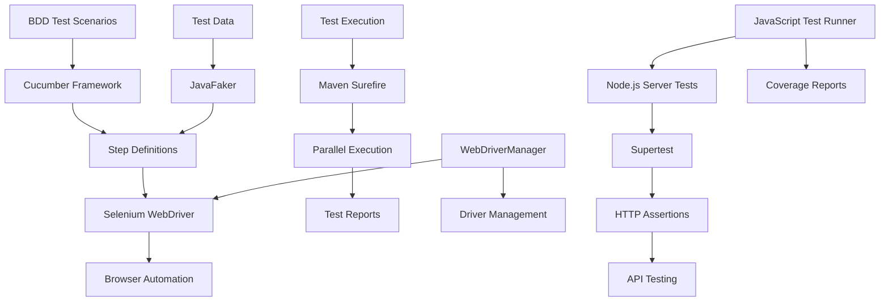
```mermaid
graph TB
    A[BDD Test Scenarios] --> B[Cucumber Framework]
    B --> C[Step Definitions]
    C --> D[Selenium WebDriver]
    D --> E[Browser Automation]
    
    F[Test Data] --> G[JavaFaker]
    G --> C
    
    H[Test Execution] --> I[Maven Surefire]
    I --> J[Parallel Execution]
    J --> K[Test Reports]
    
    L[WebDriverManager] --> D
    L --> M[Driver Management]
    
    N[Node.js Server Tests] --> O[Supertest]
    O --> P[HTTP Assertions]
    P --> Q[API Testing]
    
    R[JavaScript Test Runner] --> N
    R --> S[Coverage Reports]
```

#### 1.2.2.2 Major System Components

| Component | Technology | Version | Purpose |
|-----------|------------|---------|----------|
| BDD Framework | Cucumber | 7.2.3/7.3.4 | Natural language test scenario execution |
| Web Automation | Selenium WebDriver | 3.141.59 | Browser interaction and control |
| Build Management | Apache Maven | 3.x | Project lifecycle and dependency management |
| Driver Management | WebDriverManager | 5.1.0 | Automated browser driver setup and maintenance |
| **Node.js Runtime** | **Node.js** | **20.x LTS** | **Back-end execution environment** |
| **JavaScript Test Runner** | **Jest 29.x or Mocha 10.x** | **Latest** | **JavaScript unit/integration testing** |
| **HTTP Test Library** | **Supertest** | **7.1.4** | **Programmatic HTTP assertions** |

#### 1.2.2.3 Core Technical Approach

The framework implements a three-tier BDD architecture consisting of Feature Files written in Gherkin syntax for natural language scenarios, Step Definitions implemented in Java for test logic, and Test Runner Files for execution orchestration. <span style="background-color: rgba(91, 57, 243, 0.2)">The architecture is now polyglot, with Java modules for UI BDD tests and a Node.js module for API/unit tests, both orchestrated in the same CI pipeline.</span> This approach enables "clarity and collaboration between technical and non-technical team members" while maintaining robust automated testing capabilities.

### 1.2.3 Success Criteria

#### 1.2.3.1 Measurable Objectives

The framework establishes success through quantifiable improvements in testing efficiency and quality metrics:

| Objective Category | Target Metrics |
|-------------------|----------------|
| Test Execution Efficiency | Parallel execution at method level with unlimited threads |
| Collaboration Enhancement | Natural language scenario comprehension across all stakeholder groups |
| Integration Reliability | Seamless CI/CD pipeline integration with zero configuration drift |

#### 1.2.3.2 Critical Success Factors

- **Framework Adoption**: Successful implementation by development teams across diverse project contexts
- **Stakeholder Engagement**: Active participation from business analysts in test scenario creation
- **Technical Integration**: Reliable integration with existing development toolchains and CI/CD processes
- **Quality Improvement**: Demonstrable reduction in defect escape rates and testing cycle times

#### 1.2.3.3 Key Performance Indicators

Performance measurement focuses on both technical and business outcomes including test execution velocity, defect detection efficiency, and cross-team collaboration metrics. The framework's reporting capabilities generate comprehensive HTML, JSON, and rerun reports enabling detailed performance analysis and continuous improvement.

## 1.3 SCOPE

### 1.3.1 In-Scope Elements

#### 1.3.1.1 Core Features and Functionalities

| Feature Category | Included Capabilities |
|------------------|----------------------|
| BDD Implementation | Cucumber framework integration with Gherkin syntax support |
| Web Automation | Selenium WebDriver automation for web application testing |
| Test Data Management | JavaFaker integration for realistic test data generation |
| Parallel Execution | Maven Surefire plugin configuration for concurrent test execution |
| **Node.js Server Testing** | **Node.js HTTP server component (server.js) and its unit/integration test suites** |

#### 1.3.1.2 Implementation Boundaries

**System Boundaries**: The framework encompasses complete BDD test automation capabilities from scenario definition through execution and reporting, integrated with the Testinium platform ecosystem.

**User Groups Covered**: Quality Assurance Engineers, Software Developers, Business Analysts, and Project Managers requiring collaborative test automation capabilities.

**Technical Requirements**: Java 8+ runtime environment, Maven 3.x build system, modern web browsers with corresponding WebDriver implementations, IntelliJ IDEA development environment with Cucumber plugin support, <span style="background-color: rgba(91, 57, 243, 0.2)">Node.js 18+ runtime, npm package management, and JavaScript coverage tooling</span>.

### 1.3.2 Out-of-Scope Elements

#### 1.3.2.1 Explicitly Excluded Features

- **Actual Test Implementations**: The current template requires custom test scenario development
- **Mobile Testing Capabilities**: Appium integration for mobile application testing
- **Performance Testing**: Load testing and performance benchmarking capabilities
- **Cloud Platform Integration**: Direct integration with cloud testing platforms beyond CI/CD pipeline support

#### 1.3.2.2 Future Phase Considerations

Advanced features including Page Object Model pattern implementation, enhanced analytics and reporting dashboards, and expanded mobile testing capabilities represent potential future enhancements beyond the current framework scope.

#### 1.3.2.3 Integration Points Not Covered

While the framework supports Jenkins and GitHub Actions integration, direct integration with specialized testing platforms, custom reporting systems, or enterprise service management tools requires additional development effort.

#### 1.3.2.4 Unsupported Use Cases

The framework does not currently support database testing automation or non-web application testing contexts without significant customization and additional dependency integration. <span style="background-color: rgba(91, 57, 243, 0.2)">API testing is now supported for the in-repository Node.js server component, while external API testing remains out-of-scope</span>.

#### References

- `README.md` - Comprehensive project documentation including setup instructions and example scenarios
- `pom.xml` - Maven configuration defining technology stack, dependencies, and test execution parameters  
- `.gitignore` - Version control exclusions for Java project artifacts
- `.gitattributes` - Git file handling configuration excluding HTML reports from language statistics
- Web search: "Cucumber BDD framework overview" - Current BDD testing methodology and best practices
- Web search: "WebDriverManager 5.1.0 features" - Browser driver management automation capabilities
- Web search: "JavaFaker test data generation" - Test data generation library functionality
- Web search: "Testinium test automation platform" - Platform context and business value proposition

# 2. PRODUCT REQUIREMENTS

## 2.1 FEATURE CATALOG

### 2.1.1 BDD Test Scenario Management

| Metadata | Value |
|----------|-------|
| **Feature ID** | F-001 |
| **Feature Name** | BDD Test Scenario Management |
| **Category** | Core Testing Framework |
| **Priority Level** | Critical |
| **Status** | Approved |

#### 2.1.1.1 Description

**Overview**: Comprehensive Behavior-Driven Development implementation using Cucumber framework with Gherkin syntax support, enabling natural language test scenario creation and execution.

**Business Value**: Enables collaboration between technical and non-technical stakeholders by providing a common language for defining test scenarios, reducing communication gaps and improving requirement clarity.

**User Benefits**: 
- Business analysts can write test scenarios in plain English
- Developers gain clear acceptance criteria
- QA engineers receive structured test definitions
- Project managers obtain transparent test coverage visibility

**Technical Context**: Built on Cucumber 7.2.3/7.3.4 framework with JUnit 4.13.2 integration, supporting Gherkin syntax with Scenario, Scenario Outline, Background, and Examples sections.

#### 2.1.1.2 Dependencies

| Dependency Type | Details |
|----------------|---------|
| **Prerequisite Features** | None (foundational feature) |
| **System Dependencies** | Java 8+ runtime, Maven 3.x build system |
| **External Dependencies** | cucumber-java 7.2.3, cucumber-junit 7.3.4, JUnit 4.13.2 |
| **Integration Requirements** | Maven Surefire Plugin 3.0.0-M5 for test execution |

### 2.1.2 Web Browser Automation

| Metadata | Value |
|----------|-------|
| **Feature ID** | F-002 |
| **Feature Name** | Web Browser Automation |
| **Category** | Automation Engine |
| **Priority Level** | Critical |
| **Status** | Approved |

#### 2.1.2.1 Description

**Overview**: Selenium WebDriver-based web application automation supporting multi-browser testing with automated driver management.

**Business Value**: Eliminates manual testing repetition, enables regression testing automation, and provides consistent cross-browser validation.

**User Benefits**: 
- QA engineers can automate repetitive web testing tasks
- Developers receive automated feedback on web functionality
- Teams gain consistent cross-browser compatibility validation
- Reduced manual testing effort and faster feedback cycles

**Technical Context**: Implements Selenium WebDriver 3.141.59 with WebDriverManager 5.1.0 for automated driver lifecycle management supporting Chrome, Firefox, Edge, Opera, Internet Explorer, and Safari browsers.

#### 2.1.2.2 Dependencies

| Dependency Type | Details |
|----------------|---------|
| **Prerequisite Features** | F-001 (BDD Test Scenario Management) |
| **System Dependencies** | Web browsers installed, network access for driver downloads |
| **External Dependencies** | selenium-java 3.141.59, webdrivermanager 5.1.0 |
| **Integration Requirements** | Browser drivers via WebDriverManager, system PATH configuration |

### 2.1.3 Test Data Generation

| Metadata | Value |
|----------|-------|
| **Feature ID** | F-003 |
| **Feature Name** | Test Data Generation |
| **Category** | Test Support Services |
| **Priority Level** | High |
| **Status** | Approved |

#### 2.1.3.1 Description

**Overview**: JavaFaker-powered realistic test data generation supporting localized and deterministic data creation for comprehensive test scenarios.

**Business Value**: Reduces test maintenance overhead by generating realistic data dynamically, improving test reliability and coverage.

**User Benefits**: 
- QA engineers can create tests with realistic data without manual data creation
- Developers receive consistent test scenarios with varied data inputs
- Teams benefit from reduced test data maintenance and improved test coverage
- Support for localized data generation for international applications

**Technical Context**: Integrates JavaFaker 1.0.2 with FakeValueService for random value generation, supporting seeded pseudo-random generation for deterministic testing.

#### 2.1.3.2 Dependencies

| Dependency Type | Details |
|----------------|---------|
| **Prerequisite Features** | F-001 (BDD Test Scenario Management) |
| **System Dependencies** | Java 8+ runtime |
| **External Dependencies** | javafaker 1.0.2 |
| **Integration Requirements** | Integration with step definitions and test scenarios |

### 2.1.4 Parallel Test Execution

| Metadata | Value |
|----------|-------|
| **Feature ID** | F-004 |
| **Feature Name** | Parallel Test Execution |
| **Category** | Performance Optimization |
| **Priority Level** | High |
| **Status** | Approved |

#### 2.1.4.1 Description

**Overview**: Maven Surefire plugin-based parallel test execution with configurable thread management and method-level parallelization.

**Business Value**: Significantly reduces test execution time, enabling faster feedback cycles and improved development velocity.

**User Benefits**: 
- QA teams experience reduced test suite execution time
- Developers receive faster CI/CD pipeline feedback
- Teams can execute larger test suites within acceptable timeframes
- Improved resource utilization during test execution

**Technical Context**: Configured with Maven Surefire Plugin 3.0.0-M5 supporting unlimited threads, method-level parallelization, and test failure tolerance.

#### 2.1.4.2 Dependencies

| Dependency Type | Details |
|----------------|---------|
| **Prerequisite Features** | F-001 (BDD Test Scenario Management) |
| **System Dependencies** | Multi-core processors, sufficient memory for parallel execution |
| **External Dependencies** | maven-surefire-plugin 3.0.0-M5 |
| **Integration Requirements** | Maven build lifecycle integration |

### 2.1.5 Test Reporting System

| Metadata | Value |
|----------|-------|
| **Feature ID** | F-005 |
| **Feature Name** | Test Reporting System |
| **Category** | Reporting and Analytics |
| **Priority Level** | High |
| **Status** | Approved |

#### 2.1.5.1 Description

**Overview**: Multi-format test reporting system generating HTML, JSON, and rerun reports with PrettyReports integration.

**Business Value**: Provides comprehensive test execution visibility, enabling data-driven quality decisions and stakeholder communication.

**User Benefits**: 
- Project managers receive detailed test execution reports
- QA engineers can analyze test results and identify patterns
- Developers gain insight into test failures and coverage
- Teams benefit from historical test data and trend analysis

**Technical Context**: Generates HTML reports (target/cucumber-reports.html), JSON reports (target/cucumber.json), and rerun reports (target/rerun.txt) with reporting-plugin 7.2.0 integration.

#### 2.1.5.2 Dependencies

| Dependency Type | Details |
|----------------|---------|
| **Prerequisite Features** | F-001 (BDD Test Scenario Management), F-004 (Parallel Test Execution) |
| **System Dependencies** | File system write permissions, web browser for HTML report viewing |
| **External Dependencies** | reporting-plugin 7.2.0, Cucumber built-in reporting |
| **Integration Requirements** | Maven build lifecycle, CI/CD pipeline report publishing |

### 2.1.6 CI/CD Pipeline Integration

| Metadata | Value |
|----------|-------|
| **Feature ID** | F-006 |
| **Feature Name** | CI/CD Pipeline Integration |
| **Category** | DevOps Integration |
| **Priority Level** | Medium |
| **Status** | Approved |

#### 2.1.6.1 Description

**Overview**: Native integration support for Jenkins and GitHub Actions with Maven lifecycle compatibility for automated test execution in CI/CD pipelines.

**Business Value**: Enables automated quality gates in development workflows, ensuring consistent testing standards and early defect detection.

**User Benefits**: 
- Development teams receive automated test feedback on code changes
- QA teams can integrate testing into deployment pipelines
- Project managers gain visibility into automated quality metrics
- Teams benefit from consistent testing standards across environments

**Technical Context**: Supports Jenkins pipeline snippets, GitHub Actions workflows, and Maven lifecycle integration with cucumber.publish.enabled configuration for online report publishing.

#### 2.1.6.2 Dependencies

| Dependency Type | Details |
|----------------|---------|
| **Prerequisite Features** | F-001 (BDD Test Scenario Management), F-005 (Test Reporting System) |
| **System Dependencies** | CI/CD platform (Jenkins/GitHub Actions), Maven 3.x |
| **External Dependencies** | CI/CD platform plugins, Maven integration |
| **Integration Requirements** | Version control system, deployment pipeline configuration |

### 2.1.7 Node.js HTTP Server & JavaScript Testing Infrastructure

| Metadata | Value |
|----------|-------|
| **Feature ID** | F-007 |
| **Feature Name** | <span style="background-color: rgba(91, 57, 243, 0.2)">Node.js HTTP Server & JavaScript Testing Infrastructure</span> |
| **Category** | Core Testing Framework |
| **Priority Level** | Critical |
| **Status** | Approved |

#### 2.1.7.1 Description

**Overview**: <span style="background-color: rgba(91, 57, 243, 0.2)">Introduces a lightweight Node.js HTTP server (server.js) together with a JavaScript unit-testing stack (Jest/Mocha + Supertest) to fulfil the new comprehensive server-side test objectives</span> described in the test intent clarification requirements.

**Business Value**: Establishes critical server-side testing capabilities enabling comprehensive validation of HTTP server responses, lifecycle operations, and error handling scenarios. This infrastructure provides the foundation for testing RESTful APIs, server behavior under load, and proper resource management.

**User Benefits**: 
- QA engineers can validate HTTP server functionality with industry-standard JavaScript testing frameworks
- Developers receive automated feedback on server-side code changes and API behavior
- Teams gain comprehensive coverage of server lifecycle operations including startup and graceful shutdown
- Project stakeholders benefit from reliable server component validation and error handling verification

**Technical Context**: Built on <span style="background-color: rgba(91, 57, 243, 0.2)">Node.js 20.x LTS runtime with Jest 29.x testing framework</span> (alternative: Mocha 10.x with Chai/Sinon) and <span style="background-color: rgba(91, 57, 243, 0.2)">Supertest 7.1.4 for HTTP request testing</span>. Features <span style="background-color: rgba(91, 57, 243, 0.2)">dynamic port allocation to prevent conflicts during parallel execution, graceful shutdown handling</span>, and integrated <span style="background-color: rgba(91, 57, 243, 0.2)">coverage tooling through NYC/Istanbul or Jest built-in coverage reporting</span>.

#### 2.1.7.2 Dependencies

| Dependency Type | Details |
|----------------|---------|
| **Prerequisite Features** | None (new independent component) |
| **System Dependencies** | <span style="background-color: rgba(91, 57, 243, 0.2)">Node.js 18+ (20.x LTS recommended), npm/yarn</span> |
| **External Dependencies** | <span style="background-color: rgba(91, 57, 243, 0.2)">jest 29.x OR mocha 10.x, supertest 7.1.4, sinon 17.x (if Mocha)</span> |
| **Integration Requirements** | <span style="background-color: rgba(91, 57, 243, 0.2)">Co-exists with Maven build; invoked via separate npm scripts; reports funnelled into existing reporting pipeline</span> |

## 2.2 FUNCTIONAL REQUIREMENTS TABLES

### 2.2.1 BDD Test Scenario Management Requirements

| Requirement ID | Description | Acceptance Criteria | Priority | Complexity |
|----------------|-------------|-------------------|----------|------------|
| F-001-RQ-001 | Gherkin Syntax Support | Support Given/When/Then syntax with Scenario, Scenario Outline, Background, and Examples sections | Must-Have | Medium |
| F-001-RQ-002 | Feature File Organization | Store feature files in src/main/resources/features with .feature extension | Must-Have | Low |
| F-001-RQ-003 | Step Definition Mapping | Automatically map Gherkin steps to Java methods using Cucumber annotations | Must-Have | Medium |
| F-001-RQ-004 | Test Runner Configuration | Configure CukesRunner with JUnit integration for test execution | Must-Have | Low |

#### 2.2.1.1 Technical Specifications

| Requirement ID | Input Parameters | Output/Response | Performance Criteria | Data Requirements |
|----------------|------------------|-----------------|-------------------|-------------------|
| F-001-RQ-001 | .feature files with Gherkin syntax | Parsed test scenarios ready for execution | < 100ms parsing time per feature file | Valid Gherkin syntax compliance |
| F-001-RQ-002 | Feature files in specified directory structure | Automatic feature discovery and loading | < 50ms directory scan time | Directory structure: src/main/resources/features/ |
| F-001-RQ-003 | Annotated Java step definition methods | Executable test steps with parameter binding | < 10ms method resolution per step | Java methods with @Given, @When, @Then annotations |
| F-001-RQ-004 | CukesRunner configuration class | JUnit test execution with Cucumber integration | Support for Maven test lifecycle | JUnit 4.13.2 compatible configuration |

#### 2.2.1.2 Validation Rules

| Requirement ID | Business Rules | Data Validation | Security Requirements | Compliance Requirements |
|----------------|----------------|----------------|---------------------|----------------------|
| F-001-RQ-001 | One feature per .feature file | Valid Gherkin keyword usage | No sensitive data in feature files | BDD methodology compliance |
| F-001-RQ-002 | Consistent naming conventions | .feature file extension required | Read-only access to feature files during execution | Maven project structure standards |
| F-001-RQ-003 | One-to-one step mapping | Parameter type validation | Secure parameter handling | Java coding standards |
| F-001-RQ-004 | Single runner per test suite | Valid JUnit annotations | Test isolation enforcement | JUnit testing standards |

### 2.2.2 Web Browser Automation Requirements

| Requirement ID | Description | Acceptance Criteria | Priority | Complexity |
|----------------|-------------|-------------------|----------|------------|
| F-002-RQ-001 | Multi-Browser Support | Support Chrome, Firefox, Edge, Opera, Internet Explorer, Safari | Must-Have | Medium |
| F-002-RQ-002 | Automated Driver Management | Automatically download and configure browser drivers | Must-Have | High |
| F-002-RQ-003 | WebDriver Instance Management | Create, manage, and cleanup WebDriver instances | Must-Have | Medium |
| F-002-RQ-004 | Browser Configuration | Configure browser options, headless mode, and capabilities | Should-Have | Medium |

#### 2.2.2.1 Technical Specifications

| Requirement ID | Input Parameters | Output/Response | Performance Criteria | Data Requirements |
|----------------|------------------|-----------------|-------------------|-------------------|
| F-002-RQ-001 | Browser type specification | Configured WebDriver instance | < 5s browser startup time | Browser installation on system |
| F-002-RQ-002 | Browser version detection | Downloaded and configured driver | < 30s driver setup time | Internet connection for driver downloads |
| F-002-RQ-003 | WebDriver lifecycle commands | Browser automation actions | < 100ms per WebDriver command | Valid WebDriver session |
| F-002-RQ-004 | Browser capability configuration | Customized browser instance | < 2s configuration application | Valid browser options |

#### 2.2.2.2 Validation Rules

| Requirement ID | Business Rules | Data Validation | Security Requirements | Compliance Requirements |
|----------------|----------------|----------------|---------------------|----------------------|
| F-002-RQ-001 | One browser instance per test thread | Valid browser type selection | Secure browser configuration | WebDriver W3C standards |
| F-002-RQ-002 | Driver version compatibility | Version matching validation | Secure driver downloads | WebDriverManager security practices |
| F-002-RQ-003 | Proper instance cleanup | Resource deallocation validation | Session security enforcement | Memory management standards |
| F-002-RQ-004 | Configuration isolation | Option validation and sanitization | Secure configuration handling | Browser security best practices |

### 2.2.3 Test Data Generation Requirements

| Requirement ID | Description | Acceptance Criteria | Priority | Complexity |
|----------------|-------------|-------------------|----------|------------|
| F-003-RQ-001 | Dynamic Data Generation | Generate realistic fake data for various data types | Must-Have | Low |
| F-003-RQ-002 | Localized Data Support | Support locale-specific data generation | Should-Have | Medium |
| F-003-RQ-003 | Deterministic Data Generation | Support seeded random generation for reproducible tests | Should-Have | Medium |
| F-003-RQ-004 | Data Type Coverage | Support addresses, names, phones, emails, and other common data types | Must-Have | Low |

#### 2.2.3.1 Technical Specifications

| Requirement ID | Input Parameters | Output/Response | Performance Criteria | Data Requirements |
|----------------|------------------|-----------------|-------------------|-------------------|
| F-003-RQ-001 | Data type specification | Generated fake data value | < 10ms per data generation call | JavaFaker library availability |
| F-003-RQ-002 | Locale specification | Localized fake data | < 50ms per localized data generation | Valid locale configuration |
| F-003-RQ-003 | Random seed value | Deterministic fake data sequence | Consistent results across test runs | Pseudo-random number generator seed |
| F-003-RQ-004 | Various data type requests | Comprehensive fake data coverage | < 5ms per standard data type | Data type mapping configuration |

### 2.2.4 Parallel Test Execution Requirements

| Requirement ID | Description | Acceptance Criteria | Priority | Complexity |
|----------------|-------------|-------------------|----------|------------|
| F-004-RQ-001 | Method-Level Parallelization | Execute test methods in parallel threads | Must-Have | High |
| F-004-RQ-002 | Configurable Thread Management | Support unlimited and configurable thread counts | Must-Have | Medium |
| F-004-RQ-003 | Test Failure Tolerance | Continue execution despite individual test failures | Should-Have | Low |
| F-004-RQ-004 | Resource Management | Manage shared resources during parallel execution | Must-Have | High |

#### 2.2.4.1 Technical Specifications

| Requirement ID | Input Parameters | Output/Response | Performance Criteria | Data Requirements |
|----------------|------------------|-----------------|-------------------|-------------------|
| F-004-RQ-001 | Test methods and thread configuration | Parallel test execution | Optimal CPU utilization | Multi-core processor availability |
| F-004-RQ-002 | Thread count specification | Configured parallel execution | Scalable with available resources | System resource monitoring |
| F-004-RQ-003 | Failure handling configuration | Continued test execution | < 100ms failure handling overhead | Test failure isolation |
| F-004-RQ-004 | Shared resource locks | Thread-safe resource access | No resource conflicts | Thread synchronization mechanisms |

### 2.2.7 Node.js HTTP Server & JS Testing Requirements (updated)

<span style="background-color: rgba(91, 57, 243, 0.2)">This section establishes functional requirements for the Node.js HTTP server component and associated JavaScript testing infrastructure, supporting comprehensive validation of server-side functionality including HTTP route handling, lifecycle management, error processing, and performance under various operational conditions.</span>

| Requirement ID | Description | Acceptance Criteria | Priority | Complexity |
|----------------|-------------|---------------------|----------|------------|
| <span style="background-color: rgba(91, 57, 243, 0.2)">F-007-RQ-001</span> | <span style="background-color: rgba(91, 57, 243, 0.2)">HTTP Route Handling</span> | <span style="background-color: rgba(91, 57, 243, 0.2)">GET / returns 200 with body "ok"; POST /data accepts JSON and echoes response</span> | <span style="background-color: rgba(91, 57, 243, 0.2)">Must-Have</span> | <span style="background-color: rgba(91, 57, 243, 0.2)">Medium</span> |
| <span style="background-color: rgba(91, 57, 243, 0.2)">F-007-RQ-002</span> | <span style="background-color: rgba(91, 57, 243, 0.2)">Server Lifecycle</span> | <span style="background-color: rgba(91, 57, 243, 0.2)">Server binds to dynamic port, emits ready event, supports graceful shutdown</span> | <span style="background-color: rgba(91, 57, 243, 0.2)">Must-Have</span> | <span style="background-color: rgba(91, 57, 243, 0.2)">Medium</span> |
| <span style="background-color: rgba(91, 57, 243, 0.2)">F-007-RQ-003</span> | <span style="background-color: rgba(91, 57, 243, 0.2)">Error Handling</span> | <span style="background-color: rgba(91, 57, 243, 0.2)">Invalid routes → 404; malformed JSON → 400; unhandled errors → 500</span> | <span style="background-color: rgba(91, 57, 243, 0.2)">Must-Have</span> | <span style="background-color: rgba(91, 57, 243, 0.2)">Medium</span> |
| <span style="background-color: rgba(91, 57, 243, 0.2)">F-007-RQ-004</span> | <span style="background-color: rgba(91, 57, 243, 0.2)">Edge Case Coverage</span> | <span style="background-color: rgba(91, 57, 243, 0.2)">Handle oversized payload (≥1 MB), concurrent 100+ connections, special chars in URL</span> | <span style="background-color: rgba(91, 57, 243, 0.2)">Should-Have</span> | <span style="background-color: rgba(91, 57, 243, 0.2)">High</span> |
| <span style="background-color: rgba(91, 57, 243, 0.2)">F-007-RQ-005</span> | <span style="background-color: rgba(91, 57, 243, 0.2)">Coverage Metrics</span> | <span style="background-color: rgba(91, 57, 243, 0.2)">≥90 % line, ≥85 % branch, ≥95 % function coverage on server.js</span> | <span style="background-color: rgba(91, 57, 243, 0.2)">Must-Have</span> | <span style="background-color: rgba(91, 57, 243, 0.2)">Low</span> |

#### 2.2.7.1 Technical Specifications (updated)

<span style="background-color: rgba(91, 57, 243, 0.2)">Technical implementation specifications for Node.js HTTP server functionality, defining precise input parameters, expected outputs, performance benchmarks, and data requirements for each functional requirement.</span>

| Requirement ID | Input Parameters | Output/Response | Performance Criteria | Data Requirements |
|----------------|------------------|-----------------|----------------------|-------------------|
| <span style="background-color: rgba(91, 57, 243, 0.2)">F-007-RQ-001</span> | <span style="background-color: rgba(91, 57, 243, 0.2)">HTTP request (method & path)</span> | <span style="background-color: rgba(91, 57, 243, 0.2)">HTTP 200/JSON response</span> | <span style="background-color: rgba(91, 57, 243, 0.2)"><100 ms response for simple routes</span> | <span style="background-color: rgba(91, 57, 243, 0.2)">Valid HTTP/1.1</span> |
| <span style="background-color: rgba(91, 57, 243, 0.2)">F-007-RQ-002</span> | <span style="background-color: rgba(91, 57, 243, 0.2)">Port (0 for dynamic)</span> | <span style="background-color: rgba(91, 57, 243, 0.2)">Listening server instance</span> | <span style="background-color: rgba(91, 57, 243, 0.2)">Ready within 500 ms</span> | <span style="background-color: rgba(91, 57, 243, 0.2)">OS-free port</span> |
| <span style="background-color: rgba(91, 57, 243, 0.2)">F-007-RQ-003</span> | <span style="background-color: rgba(91, 57, 243, 0.2)">Malformed route or payload</span> | <span style="background-color: rgba(91, 57, 243, 0.2)">Proper status code (404/400/500)</span> | <span style="background-color: rgba(91, 57, 243, 0.2)">Error handled without crash</span> | <span style="background-color: rgba(91, 57, 243, 0.2)">N/A</span> |
| <span style="background-color: rgba(91, 57, 243, 0.2)">F-007-RQ-004</span> | <span style="background-color: rgba(91, 57, 243, 0.2)">Concurrent requests</span> | <span style="background-color: rgba(91, 57, 243, 0.2)">All responses succeed</span> | <span style="background-color: rgba(91, 57, 243, 0.2)">Handle 100 simultaneous connections</span> | <span style="background-color: rgba(91, 57, 243, 0.2)">2 MB max payload</span> |
| <span style="background-color: rgba(91, 57, 243, 0.2)">F-007-RQ-005</span> | <span style="background-color: rgba(91, 57, 243, 0.2)">Jest/Mocha coverage run</span> | <span style="background-color: rgba(91, 57, 243, 0.2)">Coverage report</span> | <span style="background-color: rgba(91, 57, 243, 0.2)">≥90 % line coverage</span> | <span style="background-color: rgba(91, 57, 243, 0.2)">jest --coverage / nyc</span> |

#### 2.2.7.2 Validation Rules (updated)

<span style="background-color: rgba(91, 57, 243, 0.2)">Comprehensive validation framework defining business logic, data integrity, security constraints, and regulatory compliance requirements for the Node.js HTTP server testing infrastructure.</span>

| Requirement ID | Business Rules | Data Validation | Security Requirements | Compliance |
|----------------|---------------|-----------------|----------------------|------------|
| <span style="background-color: rgba(91, 57, 243, 0.2)">F-007-RQ-001</span> | <span style="background-color: rgba(91, 57, 243, 0.2)">One route spec per handler</span> | <span style="background-color: rgba(91, 57, 243, 0.2)">Validate HTTP verbs</span> | <span style="background-color: rgba(91, 57, 243, 0.2)">No sensitive data logged</span> | <span style="background-color: rgba(91, 57, 243, 0.2)">HTTP/1.1 RFC 7231</span> |
| <span style="background-color: rgba(91, 57, 243, 0.2)">F-007-RQ-002</span> | <span style="background-color: rgba(91, 57, 243, 0.2)">Single listener instance</span> | <span style="background-color: rgba(91, 57, 243, 0.2)">Validate port availability</span> | <span style="background-color: rgba(91, 57, 243, 0.2)">Prevent port scan exposure</span> | <span style="background-color: rgba(91, 57, 243, 0.2)">OWASP ASVS v4.0</span> |
| <span style="background-color: rgba(91, 57, 243, 0.2)">F-007-RQ-003</span> | <span style="background-color: rgba(91, 57, 243, 0.2)">Consistent error schema</span> | <span style="background-color: rgba(91, 57, 243, 0.2)">Validate status & JSON body</span> | <span style="background-color: rgba(91, 57, 243, 0.2)">Don't leak stack traces</span> | <span style="background-color: rgba(91, 57, 243, 0.2)">OWASP Top 10 A10</span> |
| <span style="background-color: rgba(91, 57, 243, 0.2)">F-007-RQ-004</span> | <span style="background-color: rgba(91, 57, 243, 0.2)">Resource limits</span> | <span style="background-color: rgba(91, 57, 243, 0.2)">Validate payload size</span> | <span style="background-color: rgba(91, 57, 243, 0.2)">Protect against DoS</span> | <span style="background-color: rgba(91, 57, 243, 0.2)">NIST SP 800-53</span> |
| <span style="background-color: rgba(91, 57, 243, 0.2)">F-007-RQ-005</span> | <span style="background-color: rgba(91, 57, 243, 0.2)">Coverage thresholds</span> | <span style="background-color: rgba(91, 57, 243, 0.2)">Verify coverage %</span> | <span style="background-color: rgba(91, 57, 243, 0.2)">N/A</span> | <span style="background-color: rgba(91, 57, 243, 0.2)">ISTQB best-practice</span> |

## 2.3 FEATURE RELATIONSHIPS

### 2.3.1 Feature Dependencies Map

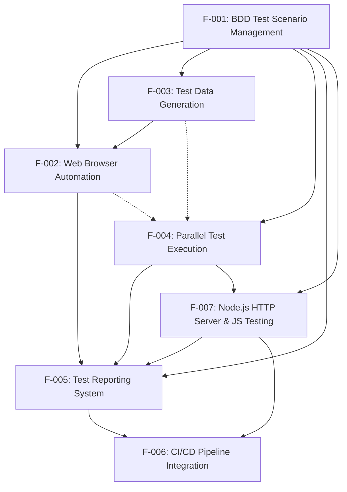
```mermaid
graph TB
    F001[F-001: BDD Test Scenario Management] --> F002[F-002: Web Browser Automation]
    F001 --> F003[F-003: Test Data Generation]
    F001 --> F004[F-004: Parallel Test Execution]
    F001 --> F005[F-005: Test Reporting System]
    F001 --> F007[F-007: Node.js HTTP Server & JS Testing]
    
    F002 --> F005
    F003 --> F002
    F004 --> F005
    F004 --> F007
    F005 --> F006[F-006: CI/CD Pipeline Integration]
    F007 --> F005
    F007 --> F006
    
    F002 -.-> F004
    F003 -.-> F004
```

### 2.3.2 Integration Points

| Feature Pair | Integration Type | Shared Components | Description |
|--------------|------------------|-------------------|-------------|
| F-001 ↔ F-002 | Direct Integration | Step Definitions, WebDriver instances | BDD scenarios invoke browser automation through step definitions |
| F-001 ↔ F-003 | Service Integration | Test data injection points | JavaFaker generates data consumed by BDD scenarios |
| F-004 ↔ F-002 | Resource Sharing | WebDriver instance management | Parallel execution requires thread-safe browser management |
| F-005 ↔ F-001 | Data Collection | Test execution results | Reporting system collects BDD scenario execution data |
| F-006 ↔ F-005 | Pipeline Integration | Report artifacts | CI/CD systems consume generated test reports |
| <span style="background-color: rgba(91, 57, 243, 0.2)">F-001 ↔ F-007</span> | <span style="background-color: rgba(91, 57, 243, 0.2)">Tooling Integration</span> | <span style="background-color: rgba(91, 57, 243, 0.2)">Step definitions trigger Jest/Mocha via npm scripts</span> | <span style="background-color: rgba(91, 57, 243, 0.2)">BDD scenarios may invoke server component tests</span> |
| <span style="background-color: rgba(91, 57, 243, 0.2)">F-004 ↔ F-007</span> | <span style="background-color: rgba(91, 57, 243, 0.2)">Resource Sharing</span> | <span style="background-color: rgba(91, 57, 243, 0.2)">Dynamic port allocation & thread management</span> | <span style="background-color: rgba(91, 57, 243, 0.2)">Parallel Maven + npm test execution</span> |
| <span style="background-color: rgba(91, 57, 243, 0.2)">F-005 ↔ F-007</span> | <span style="background-color: rgba(91, 57, 243, 0.2)">Data Collection</span> | <span style="background-color: rgba(91, 57, 243, 0.2)">Coverage & JUnit XML reports</span> | <span style="background-color: rgba(91, 57, 243, 0.2)">Reports merged into PrettyReports</span> |
| <span style="background-color: rgba(91, 57, 243, 0.2)">F-006 ↔ F-007</span> | <span style="background-color: rgba(91, 57, 243, 0.2)">Pipeline Integration</span> | <span style="background-color: rgba(91, 57, 243, 0.2)">npm test stage</span> | <span style="background-color: rgba(91, 57, 243, 0.2)">CI pipelines run JS tests alongside Java tests</span> |

### 2.3.3 Common Services

| Service | Description | Used By Features | Implementation |
|---------|-------------|------------------|----------------|
| WebDriver Management | Browser driver lifecycle management | F-002, F-004 | WebDriverManager 5.1.0 |
| Test Execution Engine | Core test running service | F-001, F-004, F-005 | Maven Surefire Plugin |
| Data Generation Service | Fake data creation service | F-003, F-001 | JavaFaker 1.0.2 |
| Report Generation Service | Multi-format report creation | F-005, F-006 | Cucumber Reports + PrettyReports |
| <span style="background-color: rgba(91, 57, 243, 0.2)">JS Test Runner</span> | <span style="background-color: rgba(91, 57, 243, 0.2)">Executes Jest/Mocha suites & aggregates coverage</span> | <span style="background-color: rgba(91, 57, 243, 0.2)">F-007</span> | <span style="background-color: rgba(91, 57, 243, 0.2)">Jest 29.x or Mocha 10.x + NYC</span> |

### 2.3.4 Relationship Analysis

The introduction of <span style="background-color: rgba(91, 57, 243, 0.2)">F-007: Node.js HTTP Server & JavaScript Testing Infrastructure</span> creates a comprehensive dual-stack testing architecture that bridges Java-based BDD scenarios with server-side JavaScript validation. This integration establishes several critical relationship patterns:

#### 2.3.4.1 Cross-Platform Integration
<span style="background-color: rgba(91, 57, 243, 0.2)">The F-001 ↔ F-007 relationship enables BDD scenarios to trigger JavaScript test suites through npm script invocation</span>, allowing Cucumber step definitions to validate server behavior alongside web application testing. This creates end-to-end test scenarios that can verify both client-side browser interactions and server-side HTTP response handling within a single test execution flow.

#### 2.3.4.2 Parallel Execution Coordination
<span style="background-color: rgba(91, 57, 243, 0.2)">The F-004 ↔ F-007 relationship requires sophisticated resource management to coordinate Maven Surefire parallel execution with npm test processes</span>. Dynamic port allocation prevents conflicts when multiple test threads attempt to start HTTP servers simultaneously, while thread management ensures proper cleanup of both Java WebDriver instances and Node.js server processes.

#### 2.3.4.3 Unified Reporting Pipeline
<span style="background-color: rgba(91, 57, 243, 0.2)">The F-005 ↔ F-007 relationship aggregates coverage reports and test results from both Jest/Mocha execution and Cucumber scenarios</span>. Coverage data from JavaScript tests (line, branch, and function coverage) merges with Java-based test metrics to provide comprehensive system-wide testing visibility through the existing PrettyReports infrastructure.

#### 2.3.4.4 CI/CD Pipeline Enhancement
<span style="background-color: rgba(91, 57, 243, 0.2)">The F-006 ↔ F-007 relationship extends existing Jenkins and GitHub Actions integration to include npm test stages</span>, enabling automated JavaScript testing alongside Java test execution. This dual-stack CI/CD approach ensures comprehensive validation of both frontend automation and backend server functionality within unified deployment pipelines.

## 2.4 IMPLEMENTATION CONSIDERATIONS

### 2.4.1 Technical Constraints

#### 2.4.1.1 BDD Test Scenario Management (F-001)
- **Java Version Constraint**: Requires Java 8+ for Cucumber 7.x compatibility
- **Maven Integration**: Must integrate with Maven test lifecycle for proper execution
- **IDE Support**: Requires Cucumber plugin support in development environment
- **File Structure**: Fixed directory structure requirement (src/main/resources/features)

#### 2.4.1.2 Web Browser Automation (F-002)
- **Browser Compatibility**: Limited by Selenium WebDriver 3.141.59 browser support matrix
- **Driver Availability**: Dependent on WebDriverManager's ability to download drivers
- **System Dependencies**: Requires browsers to be installed on execution environment
- **Network Access**: WebDriverManager requires internet access for driver downloads

#### 2.4.1.3 Test Data Generation (F-003)
- **Memory Usage**: JavaFaker data generation may impact memory usage for large datasets
- **Locale Support**: Limited by JavaFaker's built-in locale coverage
- **Deterministic Testing**: Seed management required for reproducible test results

#### 2.4.1.4 Parallel Test Execution (F-004)
- **Thread Safety**: All test components must be thread-safe for parallel execution
- **Resource Contention**: Shared resources may become bottlenecks in parallel execution
- **Memory Requirements**: Parallel execution increases memory usage proportionally

#### 2.4.1.5 Node.js HTTP Server & JS Testing (F-007) (updated)
- **<span style="background-color: rgba(91, 57, 243, 0.2)">Node.js Version</span>**: <span style="background-color: rgba(91, 57, 243, 0.2)">18.18 + (20.x LTS recommended)</span>
- **<span style="background-color: rgba(91, 57, 243, 0.2)">npm/yarn required for dependency management</span>**
- **<span style="background-color: rgba(91, 57, 243, 0.2)">Port 0 usage for dynamic allocation in parallel runs</span>**
- **<span style="background-color: rgba(91, 57, 243, 0.2)">Graceful shutdown hooks must not block >1 s</span>**
- **<span style="background-color: rgba(91, 57, 243, 0.2)">Coexistence with Maven build; no interference with surefire classpath</span>**

### 2.4.2 Performance Requirements

| Feature | Performance Metric | Target Value | Measurement Method |
|---------|-------------------|--------------|-------------------|
| F-001 | Feature file parsing time | < 100ms per file | Execution time measurement |
| F-002 | Browser startup time | < 5s per instance | WebDriver initialization timing |
| F-003 | Data generation speed | < 10ms per value | JavaFaker method execution timing |
| F-004 | Thread utilization | > 80% CPU utilization | System resource monitoring |
| F-005 | Report generation time | < 30s for 1000 tests | Report generation timing |
| **<span style="background-color: rgba(91, 57, 243, 0.2)">F-007</span>** | **<span style="background-color: rgba(91, 57, 243, 0.2)">Simple route response time</span>** | **<span style="background-color: rgba(91, 57, 243, 0.2)"><100 ms</span>** | **<span style="background-color: rgba(91, 57, 243, 0.2)">Supertest timing</span>** |

### 2.4.3 Scalability Considerations

#### 2.4.3.1 Horizontal Scaling
- **Parallel Execution Scaling**: Framework supports unlimited threads configuration
- **CI/CD Integration**: Can scale across multiple build agents
- **Browser Instance Management**: WebDriverManager supports concurrent browser instances
- **<span style="background-color: rgba(91, 57, 243, 0.2)">Node.js Worker Pool Scaling</span>**: <span style="background-color: rgba(91, 57, 243, 0.2)">Tests can be sharded via jest --maxWorkers to leverage multi-core CPUs in parallel with Maven threads.</span>

#### 2.4.3.2 Vertical Scaling
- **Memory Usage**: Each parallel thread requires additional memory allocation
- **CPU Utilization**: Multi-core processors improve parallel execution performance
- **Storage Requirements**: Test reports and logs scale with test volume

### 2.4.4 Security Implications

#### 2.4.4.1 Data Security
- **Test Data**: JavaFaker generates non-sensitive fake data, avoiding real user information
- **Browser Security**: WebDriver instances run in isolated browser profiles
- **Report Security**: Generated reports may contain sensitive test data requiring secure handling
- **<span style="background-color: rgba(91, 57, 243, 0.2)">Server Exposure</span>**: <span style="background-color: rgba(91, 57, 243, 0.2)">Test server listens only on localhost and random port; prevents external access during CI runs.</span>

#### 2.4.4.2 Network Security
- **Driver Downloads**: WebDriverManager downloads require secure HTTPS connections
- **CI/CD Integration**: Pipeline integration requires secure credential management
- **Browser Communication**: WebDriver protocol communications require secure handling

### 2.4.5 Maintenance Requirements

#### 2.4.5.1 Dependency Management
- **Regular Updates**: Selenium WebDriver, Cucumber, and other dependencies require regular updates
- **Compatibility Testing**: New dependency versions require compatibility validation
- **Security Patches**: Security vulnerabilities in dependencies require prompt updates
- **<span style="background-color: rgba(91, 57, 243, 0.2)">npm Dependency Updates</span>**: <span style="background-color: rgba(91, 57, 243, 0.2)">Jest/Mocha/Supertest/Sinon require monthly vulnerability scans and semver-minor upgrades.</span>

#### 2.4.5.2 Browser Compatibility
- **Browser Updates**: Regular browser updates may require WebDriver updates
- **Driver Maintenance**: WebDriverManager handles driver updates automatically
- **Cross-Browser Testing**: Regular validation across all supported browsers required

### 2.4.6 Traceability Matrix

| Business Requirement | Feature ID | Functional Requirements | Implementation Components |
|----------------------|------------|------------------------|---------------------------|
| Collaborative BDD Testing | F-001 | F-001-RQ-001 to F-001-RQ-004 | Cucumber Framework, Gherkin Parser |
| Web Application Automation | F-002 | F-002-RQ-001 to F-002-RQ-004 | Selenium WebDriver, WebDriverManager |
| Realistic Test Data | F-003 | F-003-RQ-001 to F-003-RQ-004 | JavaFaker Library |
| Fast Test Execution | F-004 | F-004-RQ-001 to F-004-RQ-004 | Maven Surefire Plugin |
| Comprehensive Reporting | F-005 | F-005-RQ-001 to F-005-RQ-004 | Cucumber Reports, PrettyReports |
| DevOps Integration | F-006 | F-006-RQ-001 to F-006-RQ-004 | Jenkins/GitHub Actions Integration |
| **<span style="background-color: rgba(91, 57, 243, 0.2)">Node.js Server Testing Capability</span>** | **<span style="background-color: rgba(91, 57, 243, 0.2)">F-007</span>** | **<span style="background-color: rgba(91, 57, 243, 0.2)">F-007-RQ-001 to F-007-RQ-005</span>** | **<span style="background-color: rgba(91, 57, 243, 0.2)">server.js, Jest/Mocha Test Suites</span>** |

#### References

#### Files Examined
- `pom.xml` - Maven configuration defining dependencies and plugins for framework implementation
- `README.md` - Project documentation providing setup instructions and usage examples
- `.gitignore` - Version control configuration for Java project artifacts
- `.gitattributes` - Git file handling configuration for HTML reports

#### Technical Specification Sections Referenced
- `1.1 EXECUTIVE SUMMARY` - Business context and stakeholder requirements
- `1.2 SYSTEM OVERVIEW` - Technical architecture and component specifications
- `1.3 SCOPE` - Project boundaries and feature inclusion/exclusion criteria

#### Technology Research
- Cucumber BDD 7.3.4 - Behavior-driven development framework capabilities and syntax
- Selenium WebDriver 3.141.59 - Web browser automation specifications and browser support
- WebDriverManager 5.1.0 - Automated browser driver management and configuration
- JavaFaker 1.0.2 - Test data generation library features and localization support
- Maven Surefire Plugin 3.0.0-M5 - Parallel test execution and reporting capabilities

# 3. TECHNOLOGY STACK

## 3.1 PROGRAMMING LANGUAGES

### 3.1.1 Primary Language Selection

The Testinium-QA automation framework utilizes **Java 8** as its primary programming language, configured through Maven compiler properties in `pom.xml`. This selection provides enterprise-grade stability and extensive ecosystem support for test automation requirements.

#### 3.1.1.1 Java 8 Implementation Details
- **Version Requirement**: JDK 1.8+ (minimum requirement for Cucumber 7.x compatibility)
- **Platform Coverage**: Cross-platform compatibility across Windows, macOS, and Linux environments
- **Justification**: Java 8 provides the necessary language features and library compatibility required for the Cucumber BDD framework while maintaining broad enterprise adoption and long-term support

#### 3.1.1.2 Language Constraints and Dependencies
- **Cucumber Compatibility**: Java 8+ is mandatory for Cucumber 7.2.3/7.3.4 framework integration
- **Selenium Integration**: Compatible with Selenium WebDriver 3.141.59 Java bindings
- **Maven Integration**: Seamlessly integrates with Maven 3.x build lifecycle and dependency management

### 3.1.2 Secondary Language Selection – JavaScript/Node.js (updated)

<span style="background-color: rgba(91, 57, 243, 0.2)">The framework incorporates **JavaScript (ES2022) / Node.js** as a secondary primary language to support the expanded testing capabilities including HTTP server testing and JavaScript-based test suite execution. This polyglot architecture enables comprehensive full-stack test automation across both UI and API testing domains.</span>

#### 3.1.2.1 Node.js Implementation Details (updated)
- **<span style="background-color: rgba(91, 57, 243, 0.2)">Version Requirement</span>**: <span style="background-color: rgba(91, 57, 243, 0.2)">Node.js 20.x LTS (≥ 20.9.0) to satisfy Mocha/Jest compatibility ranges and ensure optimal performance</span>
- **<span style="background-color: rgba(91, 57, 243, 0.2)">Platform Coverage</span>**: <span style="background-color: rgba(91, 57, 243, 0.2)">Cross-platform compatibility across Windows, macOS, and Linux environments</span>
- **<span style="background-color: rgba(91, 57, 243, 0.2)">Language Standard</span>**: <span style="background-color: rgba(91, 57, 243, 0.2)">ES2022 (ECMAScript 2022) for modern JavaScript language features and async/await support</span>
- **<span style="background-color: rgba(91, 57, 243, 0.2)">Justification</span>**: <span style="background-color: rgba(91, 57, 243, 0.2)">Mandatory requirement to host server.js HTTP server component and execute the new JavaScript-based test suites including unit, integration, edge-case, and error-handling tests using Supertest</span>

#### 3.1.2.2 Language Constraints and Dependencies (updated)
- **<span style="background-color: rgba(91, 57, 243, 0.2)">Runtime Availability</span>**: <span style="background-color: rgba(91, 57, 243, 0.2)">Node.js must be available on all developer workstations and CI agents to support the JavaScript testing pipeline</span>
- **<span style="background-color: rgba(91, 57, 243, 0.2)">Package Manager</span>**: <span style="background-color: rgba(91, 57, 243, 0.2)">npm ≥ 9.x required for dependency management and package installation</span>
- **<span style="background-color: rgba(91, 57, 243, 0.2)">Testing Framework Compatibility</span>**: <span style="background-color: rgba(91, 57, 243, 0.2)">Node.js 20.x LTS ensures compatibility with both Jest 29.x and Mocha 10.x testing frameworks</span>
- **<span style="background-color: rgba(91, 57, 243, 0.2)">Isolation Guarantee</span>**: <span style="background-color: rgba(91, 57, 243, 0.2)">Node.js implementation operates independently with no impact to existing Java 8 toolchain and Maven build lifecycle</span>

### 3.1.3 Multi-Language Integration Architecture (updated)

<span style="background-color: rgba(91, 57, 243, 0.2)">The framework implements a sophisticated polyglot architecture where Java modules handle UI BDD testing through Cucumber and Selenium WebDriver, while Node.js modules manage API and server-side unit testing through Jest/Mocha and Supertest. Both language environments operate within the same CI/CD pipeline, enabling comprehensive test coverage across the full application stack.</span>

#### 3.1.3.1 Language Responsibility Matrix (updated)

| **Component** | **Language** | **Primary Use Case** | **Key Technologies** |
|---------------|--------------|---------------------|---------------------|
| **UI Automation** | Java 8 | Browser-based BDD testing | Cucumber, Selenium WebDriver, Maven |
| **<span style="background-color: rgba(91, 57, 243, 0.2)">API Testing</span>** | **<span style="background-color: rgba(91, 57, 243, 0.2)">JavaScript/Node.js</span>** | **<span style="background-color: rgba(91, 57, 243, 0.2)">HTTP server and API endpoint testing</span>** | **<span style="background-color: rgba(91, 57, 243, 0.2)">Jest/Mocha, Supertest</span>** |
| **<span style="background-color: rgba(91, 57, 243, 0.2)">Unit Testing</span>** | **<span style="background-color: rgba(91, 57, 243, 0.2)">JavaScript/Node.js</span>** | **<span style="background-color: rgba(91, 57, 243, 0.2)">Server logic and function testing</span>** | **<span style="background-color: rgba(91, 57, 243, 0.2)">Jest/Mocha, Native assertions</span>** |
| **Build Management** | Java 8 | Maven-based lifecycle management | Apache Maven 3.x |
| **<span style="background-color: rgba(91, 57, 243, 0.2)">Package Management</span>** | **<span style="background-color: rgba(91, 57, 243, 0.2)">JavaScript/Node.js</span>** | **<span style="background-color: rgba(91, 57, 243, 0.2)">npm-based dependency management</span>** | **<span style="background-color: rgba(91, 57, 243, 0.2)">npm 9.x+</span>** |

#### 3.1.3.2 Development Environment Requirements (updated)

<span style="background-color: rgba(91, 57, 243, 0.2)">Development teams must maintain both Java and Node.js runtime environments to fully leverage the framework's capabilities. The dual-language approach ensures optimal tooling for each testing domain while maintaining clear separation of concerns and build processes.</span>

**Required Development Stack:**
- **Java Development Kit**: OpenJDK 8+ or Oracle JDK 8+ for Java-based test execution
- **<span style="background-color: rgba(91, 57, 243, 0.2)">Node.js Runtime</span>**: <span style="background-color: rgba(91, 57, 243, 0.2)">Node.js 20.x LTS with npm 9.x+ for JavaScript test execution and server.js hosting</span>
- **Build Tools**: Apache Maven 3.x for Java components, <span style="background-color: rgba(91, 57, 243, 0.2)">npm scripts for Node.js components</span>
- **IDE Compatibility**: Support for both Java and JavaScript/TypeScript development with appropriate language server protocols

## 3.2 FRAMEWORKS & LIBRARIES

### 3.2.1 Core Testing Frameworks

#### 3.2.1.1 Behavior-Driven Development Framework
- **Cucumber-Java 7.14.0**: Primary BDD framework enabling natural language test scenario execution
  - Gherkin syntax support for collaborative test scenario creation
  - Step definition mapping between natural language and Java implementation
  - Integration with Maven test lifecycle for automated execution
  - **Justification**: Enables collaboration between technical and non-technical stakeholders through readable test scenarios

#### 3.2.1.2 Unit Testing Framework
- **JUnit 4.13.2**: Foundation testing framework for test execution and assertion handling
  - **Cucumber-JUnit 7.14.0**: Integration layer enabling JUnit test runner capabilities with Cucumber scenarios
  - Parallel execution support through Maven Surefire plugin integration
  - **Compatibility Requirements**: Seamless integration with Cucumber framework and Maven build system

#### 3.2.1.3 JavaScript Testing Framework (updated)
<span style="background-color: rgba(91, 57, 243, 0.2)">**Primary Options for Node.js Test Execution:**

**Option A: Jest 29.7.0 (Zero-Configuration Testing Framework)**
- **Built-in Test Runner**: Comprehensive testing framework with minimal setup requirements
- **Integrated Coverage**: Native code coverage reporting without additional tools
- **Snapshot Testing**: Built-in snapshot testing capabilities for UI component regression testing
- **Parallel Execution**: Automatic parallel test execution for improved performance
- **Mocking & Spying**: Native mocking and spying capabilities without external dependencies
- **ES6/TypeScript Support**: First-class support for modern JavaScript and TypeScript

**Option B: Mocha 10.8.2 + Chai 4.3.10 (Modular Testing Stack)**
- **Mocha 10.8.2**: Flexible test framework with extensive reporter support
  - BDD/TDD interface support with `describe()` and `it()` syntax
  - Asynchronous testing support with callbacks, promises, and async/await
  - Rich ecosystem of plugins and extensions
- **Chai 4.3.10**: Expressive assertion library with multiple syntax styles
  - BDD assertions (`expect()` style) for natural language test expressions
  - TDD assertions (`assert()` style) for traditional assertion patterns
  - Should-style assertions for behavior-driven development approach

**Integration Requirements**: Both frameworks execute via npm scripts and coexist seamlessly with existing Maven/JUnit Java test infrastructure without requiring modifications to the Java testing stack</span>

#### 3.2.1.4 HTTP Testing Library (updated)
- **Supertest 7.1.4**: SuperAgent-driven HTTP server testing library for programmatic API testing
  - **Request Lifecycle Testing**: Complete HTTP request/response cycle validation
  - **Status Code Validation**: Built-in assertions for HTTP status code verification
  - **Header and Body Inspection**: Comprehensive request/response header and payload validation
  - **Server Integration**: Direct integration with Express.js, Koa, and vanilla Node.js HTTP servers
  - **Promise and Callback Support**: Flexible asynchronous testing patterns supporting both callback and promise-based workflows
  - **Justification**: Essential for unit and integration testing of server.js HTTP endpoints, providing programmatic API validation without external server dependencies

#### 3.2.1.5 Coverage & Mocking Libraries (updated)
<span style="background-color: rgba(91, 57, 243, 0.2)">**Jest Ecosystem (Option A - Integrated Approach):**
- **Jest Built-in Coverage**: Native Istanbul-powered code coverage reporting with zero configuration
  - HTML, LCOV, and text coverage report generation
  - Branch, function, line, and statement coverage metrics
  - Coverage thresholds and enforcement capabilities
- **Jest Built-in Mocking**: Comprehensive mocking system without additional dependencies
  - Automatic mock generation for modules and functions
  - Manual mocks with `__mocks__` directory support
  - Timer and module mocking capabilities

**Mocha Ecosystem (Option B - Modular Approach):**
- **NYC 15.1.0**: Istanbul command-line interface for comprehensive coverage analysis
  - Multi-format coverage reports (HTML, LCOV, JSON, text)
  - Coverage threshold enforcement with configurable limits
  - Source map support for TypeScript and transpiled code
  - Integration with CI/CD pipelines via standardized output formats
- **Sinon 17.0.2**: Standalone test spies, stubs, and mocks library
  - Test spies for function call tracking and verification
  - Stubs with programmable behavior and return values
  - Mock objects with expectation-driven testing capabilities
  - Timer manipulation for time-dependent functionality testing

**Integration Notes**: JavaScript testing frameworks operate independently through npm package management, maintaining complete separation from Maven-managed Java dependencies while supporting parallel execution in CI/CD environments</span>

### 3.2.2 Web Automation Framework

#### 3.2.2.1 Browser Automation
- **Selenium WebDriver 4.25.0**: Primary web browser automation framework
  - Cross-browser compatibility (Chrome, Firefox, Edge, Opera, Internet Explorer, Safari)
  - WebElement interaction and navigation capabilities
  - JavaScript execution support for dynamic web application testing
  - **Justification**: Industry-standard web automation framework with comprehensive browser support and mature ecosystem

#### 3.2.2.2 Driver Management
- **WebDriverManager 5.6.2**: Automated browser driver management system
  - Automatic driver download and configuration
  - Version compatibility management between browsers and drivers
  - Reduces manual setup requirements and environment configuration complexity
  - **Integration Requirements**: Requires internet access for driver downloads during test execution setup

### 3.2.3 Test Data Generation

#### 3.2.3.1 Synthetic Data Creation
- **JavaFaker 1.0.2**: Comprehensive test data generation library
  - Realistic fake data generation across multiple categories (names, addresses, emails, etc.)
  - Locale support for internationalized testing scenarios
  - Deterministic data generation through seed management for reproducible tests
  - **Justification**: Eliminates dependency on production data while providing realistic test scenarios

### 3.2.4 Reporting and Documentation

#### 3.2.4.1 Test Reporting Framework
- **me.jvt.cucumber:reporting-plugin 7.14.0**: Advanced Cucumber reporting capabilities
  - HTML report generation (`target/cucumber-reports.html`)
  - JSON output for CI/CD integration (`target/cucumber.json`)
  - Rerun report generation for failed test tracking (`target/rerun.txt`)
  - PrettyReports output in `target/cucumber/` directory

#### 3.2.4.2 Multi-Language Test Reporting Integration (updated)
<span style="background-color: rgba(91, 57, 243, 0.2)">**Unified Reporting Architecture**: The framework supports consolidated test reporting across both Java and JavaScript test suites, enabling comprehensive quality metrics visualization through:

- **Java Test Reports**: Maven Surefire/Failsafe integration generating JUnit XML format reports
- **JavaScript Test Reports**: Jest/Mocha generating TAP, JUnit XML, and JSON format reports
- **Coverage Aggregation**: Combined coverage reports merging Java (JaCoCo) and JavaScript (Istanbul) metrics
- **CI/CD Integration**: Standardized report formats enabling seamless integration with Jenkins, GitHub Actions, and other continuous integration platforms

**Compatibility Requirements**: All reporting frameworks generate industry-standard output formats (JUnit XML, TAP, LCOV) ensuring compatibility with mainstream CI/CD reporting dashboards and quality gates</span>

## 3.3 OPEN SOURCE DEPENDENCIES

### 3.3.1 Maven Central Repository Dependencies

#### 3.3.1.1 Primary Framework Dependencies
```xml
<dependency>
    <groupId>io.cucumber</groupId>
    <artifactId>cucumber-java</artifactId>
    <version>7.2.3</version>
</dependency>

<dependency>
    <groupId>io.cucumber</groupId>
    <artifactId>cucumber-junit</artifactId>
    <version>7.2.3</version>
    <scope>test</scope>
</dependency>

<dependency>
    <groupId>org.seleniumhq.selenium</groupId>
    <artifactId>selenium-java</artifactId>
    <version>3.141.59</version>
</dependency>
```

#### 3.3.1.2 Supporting Library Dependencies
- **WebDriverManager 5.1.0**: `io.github.bonigarcia:webdrivermanager`
- **JavaFaker 1.0.2**: `com.github.javafaker:javafaker`
- **JUnit 4.13.2**: `junit:junit`
- **Cucumber Reporting 7.2.0**: `me.jvt.cucumber:reporting-plugin`

#### 3.3.1.3 Package Registry and Version Management
- **Repository**: Maven Central Repository (https://repo.maven.apache.org/maven2/)
- **Version Strategy**: Fixed versions specified in `pom.xml` to ensure build reproducibility
- **Dependency Scope**: Test-scoped dependencies for Cucumber-JUnit integration, compile-scoped for core automation libraries

### 3.3.2 NPM Package Dependencies (updated)

<span style="background-color: rgba(91, 57, 243, 0.2)">The framework's Node.js testing infrastructure leverages carefully selected NPM packages to support JavaScript-based testing requirements including HTTP server testing, unit testing, and API endpoint validation. These dependencies complement the existing Java Maven ecosystem while maintaining complete independence and compatibility.</span>

#### 3.3.2.1 Mandatory Development Dependencies (updated)

<span style="background-color: rgba(91, 57, 243, 0.2)">**Package.json DevDependencies Configuration:**</span>
```json
{
  "devDependencies": {
    "jest": "^29.7.0",
    "supertest": "^7.1.4",
    "@types/jest": "^29.5.0",
    "@types/supertest": "^6.0.0"
  }
}
```

#### 3.3.2.2 Core Testing Dependencies (updated)

<span style="background-color: rgba(91, 57, 243, 0.2)">**Jest 29.7.0**: Zero-configuration JavaScript testing framework providing comprehensive test execution capabilities</span>
- <span style="background-color: rgba(91, 57, 243, 0.2)">**Built-in Test Runner**: Complete testing framework with minimal setup requirements for immediate productivity</span>
- <span style="background-color: rgba(91, 57, 243, 0.2)">**Integrated Coverage Reporting**: Native Istanbul-powered code coverage analysis without additional tooling</span>
- <span style="background-color: rgba(91, 57, 243, 0.2)">**Parallel Execution**: Automatic parallel test execution optimization for enhanced CI/CD performance</span>
- <span style="background-color: rgba(91, 57, 243, 0.2)">**Native Mocking**: Built-in mocking and spying capabilities eliminating external dependencies</span>

<span style="background-color: rgba(91, 57, 243, 0.2)">**Supertest 7.1.4**: SuperAgent-powered HTTP server testing library for programmatic API validation</span>
- <span style="background-color: rgba(91, 57, 243, 0.2)">**Complete Request Lifecycle Testing**: Comprehensive HTTP request/response cycle validation and assertion capabilities</span>
- <span style="background-color: rgba(91, 57, 243, 0.2)">**Server Integration**: Direct integration with Express.js, Koa, and vanilla Node.js HTTP server implementations</span>
- <span style="background-color: rgba(91, 57, 243, 0.2)">**Promise-Based API**: Modern asynchronous testing patterns supporting async/await and promise-based workflows</span>
- <span style="background-color: rgba(91, 57, 243, 0.2)">**Status Code and Header Validation**: Built-in assertion methods for HTTP response validation and API contract testing</span>

#### 3.3.2.3 TypeScript Support Dependencies (updated)

<span style="background-color: rgba(91, 57, 243, 0.2)">**@types/jest 29.5.0**: Official TypeScript type definitions for Jest framework</span>
- <span style="background-color: rgba(91, 57, 243, 0.2)">**Enhanced IDE Support**: Full IntelliSense and auto-completion capabilities in TypeScript-aware development environments</span>
- <span style="background-color: rgba(91, 57, 243, 0.2)">**Type Safety**: Compile-time type checking for Jest API usage and test method signatures</span>
- <span style="background-color: rgba(91, 57, 243, 0.2)">**Test Method Validation**: TypeScript compiler verification of Jest test structure and assertion patterns</span>

<span style="background-color: rgba(91, 57, 243, 0.2)">**@types/supertest 6.0.0**: Official TypeScript type definitions for Supertest HTTP testing library</span>
- <span style="background-color: rgba(91, 57, 243, 0.2)">**API Contract Validation**: Type-safe HTTP request and response object handling with compile-time verification</span>
- <span style="background-color: rgba(91, 57, 243, 0.2)">**Method Chaining Support**: Full TypeScript support for Supertest's fluent API and assertion chaining patterns</span>
- <span style="background-color: rgba(91, 57, 243, 0.2)">**Integration Type Safety**: Type-safe integration between Jest expect() assertions and Supertest response validation</span>

#### 3.3.2.4 Package Registry and Version Management Strategy (updated)

<span style="background-color: rgba(91, 57, 243, 0.2)">**Repository**: NPM Registry (https://npmjs.org) serving as the authoritative source for all JavaScript dependencies</span>
- <span style="background-color: rgba(91, 57, 243, 0.2)">**Scope Classification**: All dependencies configured as devDependencies scope, ensuring they are excluded from production builds and runtime environments</span>
- <span style="background-color: rgba(91, 57, 243, 0.2)">**Version Strategy**: Fixed semantic versions with caret (^) notation to preserve build reproducibility while allowing compatible patch updates, aligning with existing Maven Central fixed-version strategy</span>
- <span style="background-color: rgba(91, 57, 243, 0.2)">**Isolation Guarantee**: NPM dependency management operates independently of Maven Central Java dependencies, maintaining complete separation between Java and JavaScript package ecosystems</span>

#### 3.3.2.5 Dependency Integration Architecture (updated)

<span style="background-color: rgba(91, 57, 243, 0.2)">**Multi-Language Dependency Coexistence**: The framework implements a sophisticated dependency management strategy supporting both Maven Central (Java) and NPM (JavaScript) package registries within a unified build environment:</span>

| **Dependency Source** | **Language Target** | **Scope** | **Registry** | **Version Strategy** |
|-----------------------|---------------------|-----------|--------------|---------------------|
| Maven Central | Java 8 | compile/test | repo.maven.apache.org | Fixed versions (reproducible builds) |
| <span style="background-color: rgba(91, 57, 243, 0.2)">**NPM Registry**</span> | <span style="background-color: rgba(91, 57, 243, 0.2)">**JavaScript/Node.js**</span> | <span style="background-color: rgba(91, 57, 243, 0.2)">**dev**</span> | <span style="background-color: rgba(91, 57, 243, 0.2)">**npmjs.org**</span> | <span style="background-color: rgba(91, 57, 243, 0.2)">**Semantic versioning with caret notation**</span> |

<span style="background-color: rgba(91, 57, 243, 0.2)">**Build Process Integration**: JavaScript dependencies are managed through npm install processes that execute independently of Maven dependency resolution, enabling parallel development workflows and CI/CD pipeline optimization across both language ecosystems.</span>

<span style="background-color: rgba(91, 57, 243, 0.2)">**Compatibility Assurance**: All NPM packages maintain compatibility with Node.js 20.x LTS runtime requirements and integrate seamlessly with existing Maven-based Java test execution workflows without requiring modifications to the established Cucumber-JUnit test infrastructure.</span>

## 3.4 THIRD-PARTY SERVICES

### 3.4.1 CI/CD Integration Services

#### 3.4.1.1 Continuous Integration Platforms
- **Jenkins**: Enterprise CI/CD pipeline integration with Maven-based test execution
- **GitHub Actions**: Cloud-based CI/CD support for automated testing workflows
- **Integration Capabilities**: Automated test execution, report generation, and result notification

#### 3.4.1.2 Project Management Integration
- **Jira**: Test execution tracking and defect management integration
- **Enterprise Integration**: Seamless workflow integration with existing development toolchains

### 3.4.2 Browser Service Providers

#### 3.4.2.1 WebDriver Services
- **WebDriverManager Remote Downloads**: Automatic driver acquisition from official browser vendor repositories
- **Browser Vendor APIs**: Integration with Chrome, Firefox, Edge, and Safari driver distribution services
- **Network Requirements**: HTTPS-based secure driver download capabilities

## 3.5 DATABASES & STORAGE

### 3.5.1 File-Based Storage

#### 3.5.1.1 Test Asset Storage
- **Feature Files**: Gherkin-syntax BDD scenarios stored in `src/main/resources/features/`
- **Test Reports**: Generated HTML, JSON, and text-based reports in `target/` directory structure
- **Build Artifacts**: Maven-managed compilation and packaging outputs

#### 3.5.1.2 Configuration Storage
- **Maven POM**: XML-based dependency and build configuration in `pom.xml`
- **Git Configuration**: Version control settings in `.gitignore` and `.gitattributes`

### 3.5.2 In-Memory Data Management

#### 3.5.2.1 Test Data Caching
- **JavaFaker**: In-memory test data generation and caching during test execution
- **WebDriver State**: Browser session and element state management through Selenium WebDriver

## 3.6 DEVELOPMENT & DEPLOYMENT

### 3.6.1 Development Environment

#### 3.6.1.1 Integrated Development Environment
- **IntelliJ IDEA**: Recommended IDE with comprehensive Java and Maven support
- **Required Plugins**:
  - Maven integration plugin for build management
  - Cucumber plugin for Gherkin syntax highlighting and step definition navigation
  - Git integration for version control operations

#### 3.6.1.2 Development Tools
- **Maven 3.x**: Build automation and dependency management
- **Git**: Distributed version control system
- **Browser Developer Tools**: Debugging capabilities for web automation scenarios
- **<span style="background-color: rgba(91, 57, 243, 0.2)">Node.js & npm</span>**: <span style="background-color: rgba(91, 57, 243, 0.2)">JavaScript runtime and package manager required for HTTP server testing infrastructure</span>
  - <span style="background-color: rgba(91, 57, 243, 0.2)">**Node.js 20.x LTS**: Download from [official Node.js installer](https://nodejs.org/) ensuring compatibility with Jest/Mocha testing frameworks</span>
  - <span style="background-color: rgba(91, 57, 243, 0.2)">**npm 9.x+**: Bundled with Node.js 20.x for dependency management and script execution</span>
  - <span style="background-color: rgba(91, 57, 243, 0.2)">**Installation Requirement**: Must be available on all developer machines and CI agents to support JavaScript test execution pipeline</span>

### 3.6.2 Build System

#### 3.6.2.1 Maven Build Configuration
- **Maven Compiler Plugin**: Java 8 compilation target configuration
- **Maven Surefire Plugin 3.0.0-M5**: Test execution orchestration
  - Parallel execution at method level
  - Unlimited thread configuration for maximum performance
  - Test failure tolerance enabling complete test suite execution
  - Include pattern: `**/CukesRunner*.java` for test discovery

#### 3.6.2.2 Build Lifecycle Integration
```xml
<plugin>
    <groupId>org.apache.maven.plugins</groupId>
    <artifactId>maven-surefire-plugin</artifactId>
    <version>3.0.0-M5</version>
    <configuration>
        <parallel>methods</parallel>
        <threadCount>0</threadCount>
        <testFailureIgnore>true</testFailureIgnore>
        <includes>
            <include>**/CukesRunner*.java</include>
        </includes>
    </configuration>
</plugin>
```

#### 3.6.2.3 NPM Test Scripts (updated)

<span style="background-color: rgba(91, 57, 243, 0.2)">The framework extends build capabilities with npm-managed JavaScript testing while maintaining Maven as the primary build system. This dual-build approach ensures comprehensive coverage across both Java and JavaScript testing domains without disrupting existing Maven workflows.</span>

**<span style="background-color: rgba(91, 57, 243, 0.2)">Package.json Scripts Configuration</span>**:
```json
{
  "scripts": {
    "test": "jest",
    "test:watch": "jest --watch",
    "test:coverage": "jest --coverage",
    "test:verbose": "jest --verbose",
    "coverage:report": "jest --coverage --coverageReporters=html"
  }
}
```

**<span style="background-color: rgba(91, 57, 243, 0.2)">NPM Script Execution Commands</span>**:
```bash
# Run all JavaScript tests
npm test

#### Run with coverage reporting
npm run test:coverage

#### Run specific test file
npm test -- server.test.js

#### Run in watch mode for development
npm run test:watch

#### Generate HTML coverage report
npm run coverage:report
```

<span style="background-color: rgba(91, 57, 243, 0.2)">**Maven Integration Preservation**: Per minimal change principle, Maven remains the authoritative build system for Java components, with npm scripts operating as independent JavaScript test execution commands. Both build systems coexist without modification to existing Maven configuration or lifecycle management.</span>

### 3.6.3 Deployment Architecture

#### 3.6.3.1 Containerization Strategy
- **Local Development**: Direct Java runtime execution with Maven lifecycle management<span style="background-color: rgba(91, 57, 243, 0.2)">, complemented by Node.js runtime for JavaScript test execution</span>
- **CI/CD Deployment**: Docker-compatible execution environment for consistent cross-platform testing <span style="background-color: rgba(91, 57, 243, 0.2)">supporting both Java and Node.js runtime requirements</span>

#### 3.6.3.2 CI/CD Pipeline Requirements
- **Prerequisites**: Java 8+ runtime, Maven 3.x, <span style="background-color: rgba(91, 57, 243, 0.2)">Node.js 20.x LTS, npm 9.x+,</span> and browser installations
- **Execution Environment**: Cross-platform compatibility (Windows, macOS, Linux) <span style="background-color: rgba(91, 57, 243, 0.2)">with dual-language runtime support</span>
- **Report Deployment**: Automated report generation and artifact archival in CI/CD pipelines <span style="background-color: rgba(91, 57, 243, 0.2)">supporting both Maven Surefire and Jest/Mocha output formats</span>

#### 3.6.3.3 Version Control Configuration (updated)

<span style="background-color: rgba(91, 57, 243, 0.2)">**Enhanced .gitignore Requirements**: The repository's .gitignore must be updated to exclude Node.js-specific artifacts and build outputs while preserving existing Java exclusion patterns:</span>

```gitignore
# Existing Java exclusions (preserved)
target/
*.class
*.jar
*.war

## Node.js exclusions (new)
node_modules/
coverage/
.nyc_output/
*.log
```

### 3.6.4 Technology Integration Matrix (updated)

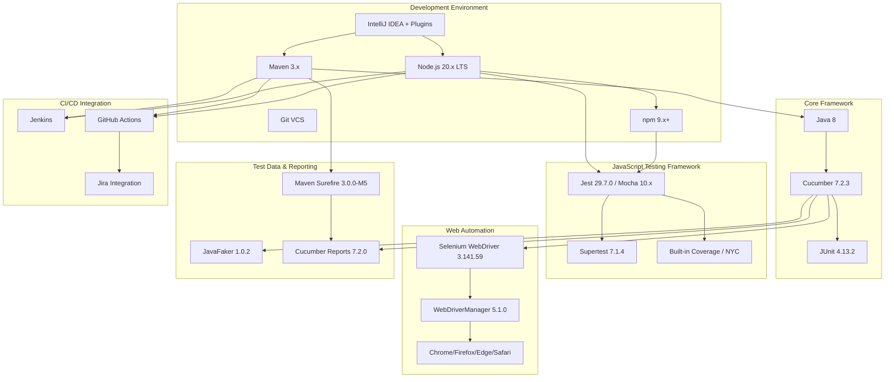
```mermaid
graph TB
    subgraph "Development Environment"
        IDE[IntelliJ IDEA + Plugins]
        Maven[Maven 3.x]
        Git[Git VCS]
        NodeJS[Node.js 20.x LTS]
        NPM[npm 9.x+]
    end
    
    subgraph "Core Framework"
        Java[Java 8]
        Cucumber[Cucumber 7.2.3]
        JUnit[JUnit 4.13.2]
    end
    
    subgraph "JavaScript Testing Framework"
        Jest[Jest 29.7.0 / Mocha 10.x]
        Supertest[Supertest 7.1.4]
        Coverage[Built-in Coverage / NYC]
    end
    
    subgraph "Web Automation"
        Selenium[Selenium WebDriver 3.141.59]
        WDM[WebDriverManager 5.1.0]
        Browsers[Chrome/Firefox/Edge/Safari]
    end
    
    subgraph "Test Data & Reporting"
        Faker[JavaFaker 1.0.2]
        Reports[Cucumber Reports 7.2.0]
        Surefire[Maven Surefire 3.0.0-M5]
    end
    
    subgraph "CI/CD Integration"
        Jenkins[Jenkins]
        GitHub[GitHub Actions]
        Jira[Jira Integration]
    end
    
    IDE --> Maven
    IDE --> NodeJS
    NodeJS --> NPM
    NodeJS --> Jest
    Jest --> Supertest
    Jest --> Coverage
    Maven --> Java
    Java --> Cucumber
    Cucumber --> JUnit
    Cucumber --> Selenium
    Selenium --> WDM
    WDM --> Browsers
    Cucumber --> Faker
    Cucumber --> Reports
    Maven --> Surefire
    Surefire --> Reports
    NPM --> Jest
    Maven --> Jenkins
    Maven --> GitHub
    NodeJS --> Jenkins
    NodeJS --> GitHub
    GitHub --> Jira
```

#### 3.6.4.1 Multi-Language Build Orchestration (updated)

<span style="background-color: rgba(91, 57, 243, 0.2)">The framework implements sophisticated polyglot build orchestration supporting parallel execution of Java and JavaScript test suites within unified CI/CD pipelines. This architecture ensures comprehensive test coverage across both UI automation (Java/Selenium) and API testing (Node.js/Supertest) domains while maintaining independent build processes and dependency management systems.</span>

**<span style="background-color: rgba(91, 57, 243, 0.2)">Build Execution Matrix</span>**:

| **Test Domain** | **Runtime** | **Build Tool** | **Execution Command** | **Output Format** |
|-----------------|-------------|----------------|-----------------------|-------------------|
| **UI Automation** | Java 8 | Maven 3.x | `mvn test` | JUnit XML, HTML Reports |
| **<span style="background-color: rgba(91, 57, 243, 0.2)">API Testing</span>** | **<span style="background-color: rgba(91, 57, 243, 0.2)">Node.js 20.x</span>** | **<span style="background-color: rgba(91, 57, 243, 0.2)">npm</span>** | **<span style="background-color: rgba(91, 57, 243, 0.2)">`npm test`</span>** | **<span style="background-color: rgba(91, 57, 243, 0.2)">Jest JSON, Coverage Reports</span>** |
| **<span style="background-color: rgba(91, 57, 243, 0.2)">Unit Testing</span>** | **<span style="background-color: rgba(91, 57, 243, 0.2)">Node.js 20.x</span>** | **<span style="background-color: rgba(91, 57, 243, 0.2)">npm</span>** | **<span style="background-color: rgba(91, 57, 243, 0.2)">`npm run test:coverage`</span>** | **<span style="background-color: rgba(91, 57, 243, 0.2)">HTML/LCOV Coverage</span>** |
| **Integration Tests** | Both | Sequential | Maven → npm | Consolidated XML/JSON |

#### References

#### Files Examined
- `pom.xml` - Complete Maven configuration with dependencies, plugins, and build settings
- `README.md` - Framework documentation including prerequisites, setup instructions, and usage examples
- `.gitignore` - Java project artifact exclusions and build output patterns<span style="background-color: rgba(91, 57, 243, 0.2)">, updated for Node.js exclusions</span>
- `.gitattributes` - Git file handling configuration excluding HTML reports from language statistics
- <span style="background-color: rgba(91, 57, 243, 0.2)">`package.json` - Node.js project configuration with testing dependencies and npm scripts</span>

#### Technical Specification Sections Referenced
- `0.2 TESTING SCOPE ANALYSIS` - Node.js infrastructure requirements and testing stack recommendations
- `0.4 MINIMAL CHANGE PRINCIPLE` - Maven preservation guidelines and Node.js integration approach
- `0.6 VALIDATION CHECKLIST` - CI/CD integration requirements for dual-language testing pipeline
- `0.7 EXECUTION PARAMETERS` - npm script configuration and test execution commands
- `1.2 SYSTEM OVERVIEW` - Technical architecture and polyglot component specifications
- `1.3 SCOPE` - Project boundaries and technical requirements
- `2.4 IMPLEMENTATION CONSIDERATIONS` - Technical constraints and performance requirements
- `3.1 PROGRAMMING LANGUAGES` - Multi-language architecture and Node.js runtime requirements
- `3.2 FRAMEWORKS & LIBRARIES` - JavaScript testing framework specifications and integration patterns
- `3.3 OPEN SOURCE DEPENDENCIES` - NPM package dependencies and version management strategy

# 4. PROCESS FLOWCHART

## 4.1 SYSTEM WORKFLOWS

### 4.1.1 Core Business Processes

#### 4.1.1.1 End-to-End BDD Test Execution Process

The framework implements a comprehensive Behavior-Driven Development workflow that orchestrates collaboration between business analysts, developers, and QA engineers through natural language test scenarios.

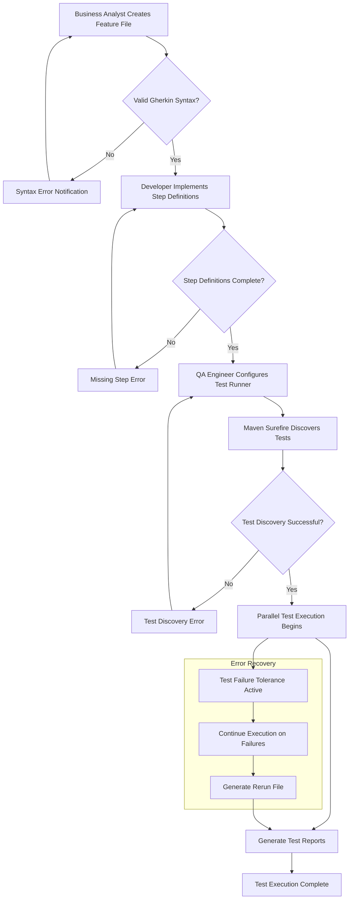
```mermaid
flowchart TD
    A[Business Analyst Creates Feature File] --> B{Valid Gherkin Syntax?}
    B -->|No| C[Syntax Error Notification]
    C --> A
    B -->|Yes| D[Developer Implements Step Definitions]
    D --> E{Step Definitions Complete?}
    E -->|No| F[Missing Step Error]
    F --> D
    E -->|Yes| G[QA Engineer Configures Test Runner]
    G --> H[Maven Surefire Discovers Tests]
    H --> I{Test Discovery Successful?}
    I -->|No| J[Test Discovery Error]
    J --> G
    I -->|Yes| K[Parallel Test Execution Begins]
    K --> L[Generate Test Reports]
    L --> M[Test Execution Complete]
    
    subgraph "Error Recovery"
        N[Test Failure Tolerance Active]
        O[Continue Execution on Failures]
        P[Generate Rerun File]
    end
    
    K --> N
    N --> O
    O --> P
    P --> L
```

**Process Components:**
- **Feature File Creation**: Business analysts author Gherkin scenarios in `src/main/resources/features/` using natural language constructs
- **Step Definition Implementation**: Developers map Gherkin steps to Java methods using @Given, @When, @Then annotations
- **Test Discovery**: Maven Surefire Plugin automatically discovers tests matching `**/CukesRunner*.java` pattern
- **Parallel Execution**: Method-level parallelization with unlimited thread configuration
- **Report Generation**: Multi-format output including HTML, JSON, and rerun files

**Decision Points:**
- Gherkin syntax validation (must comply with Cucumber 7.3.4 specification)
- Step definition completeness verification
- Test discovery pattern matching validation
- Execution environment readiness checks

**Performance Constraints:**
- Feature file parsing: <100ms per file
- Test discovery: <5s for complete test suite
- Report generation: <30s for 1000 tests

#### 4.1.1.2 Web Browser Automation Workflow

The browser automation process provides seamless multi-browser testing capabilities with automated driver management and resource optimization.

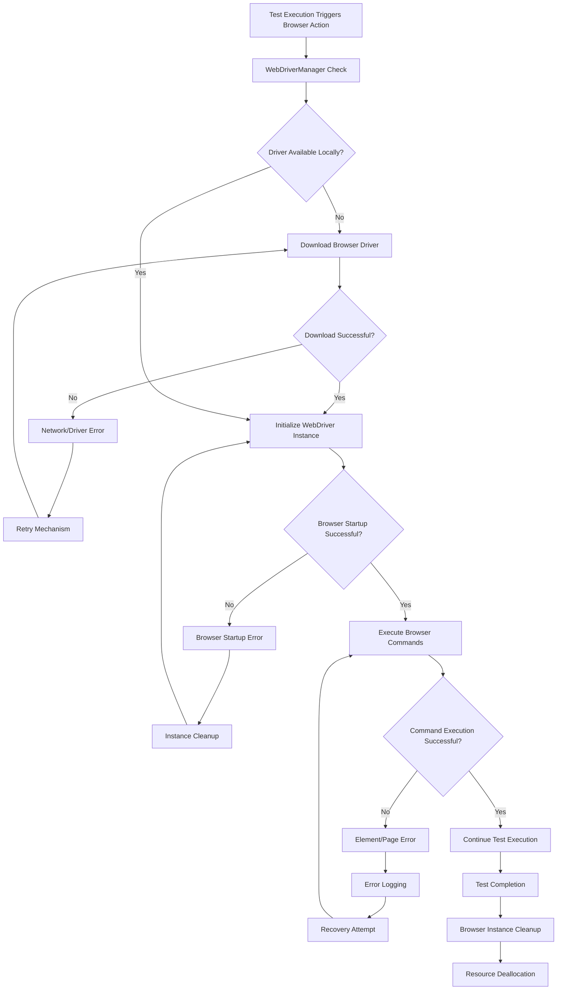
```mermaid
flowchart TD
    A[Test Execution Triggers Browser Action] --> B[WebDriverManager Check]
    B --> C{Driver Available Locally?}
    C -->|No| D[Download Browser Driver]
    D --> E{Download Successful?}
    E -->|No| F[Network/Driver Error]
    F --> G[Retry Mechanism]
    G --> D
    E -->|Yes| H[Initialize WebDriver Instance]
    C -->|Yes| H
    H --> I{Browser Startup Successful?}
    I -->|No| J[Browser Startup Error]
    J --> K[Instance Cleanup]
    K --> H
    I -->|Yes| L[Execute Browser Commands]
    L --> M{Command Execution Successful?}
    M -->|No| N[Element/Page Error]
    N --> O[Error Logging]
    O --> P[Recovery Attempt]
    P --> L
    M -->|Yes| Q[Continue Test Execution]
    Q --> R[Test Completion]
    R --> S[Browser Instance Cleanup]
    S --> T[Resource Deallocation]
```

**Technical Implementation:**
- **Driver Management**: WebDriverManager 5.1.0 handles automatic driver downloads and versioning
- **Browser Support**: Chrome, Firefox, Edge, Opera, Internet Explorer, Safari compatibility
- **Resource Management**: Proper WebDriver instance lifecycle with cleanup mechanisms
- **Error Handling**: Automatic retry for driver downloads and browser initialization failures

**Performance Requirements:**
- Browser startup time: <5s per instance
- Driver download: Automatic caching for subsequent uses
- Resource cleanup: Immediate deallocation after test completion

#### 4.1.1.3 Test Data Generation Process

The data generation workflow provides realistic test data creation using JavaFaker with support for localized and deterministic data generation.

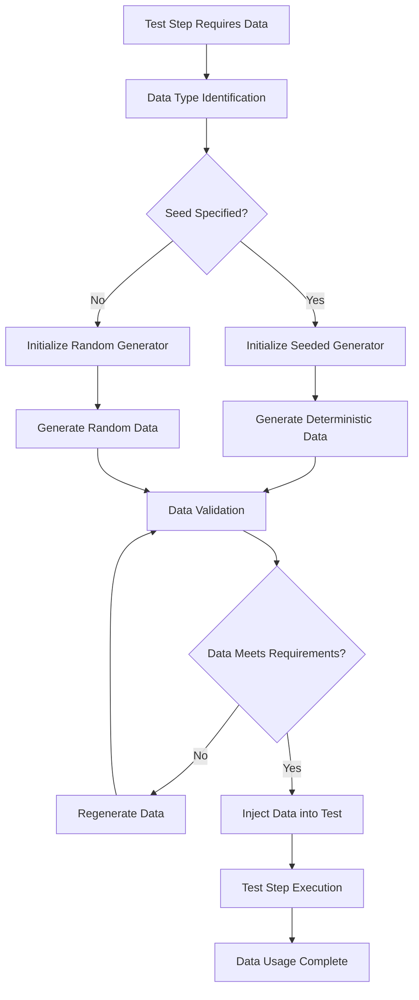
```mermaid
flowchart TD
    A[Test Step Requires Data] --> B[Data Type Identification]
    B --> C{Seed Specified?}
    C -->|Yes| D[Initialize Seeded Generator]
    C -->|No| E[Initialize Random Generator]
    D --> F[Generate Deterministic Data]
    E --> G[Generate Random Data]
    F --> H[Data Validation]
    G --> H
    H --> I{Data Meets Requirements?}
    I -->|No| J[Regenerate Data]
    J --> H
    I -->|Yes| K[Inject Data into Test]
    K --> L[Test Step Execution]
    L --> M[Data Usage Complete]
```

**Data Generation Capabilities:**
- **Localized Data**: Support for multiple locales and regional formats
- **Deterministic Generation**: Seed-based reproducible data for consistent testing
- **Type Variety**: Names, addresses, emails, phone numbers, financial data, lorem ipsum text
- **Performance**: <10ms per data value generation

#### 4.1.1.4 Node.js HTTP Server Unit Test Execution Process (updated)

<span style="background-color: rgba(91, 57, 243, 0.2)">The framework incorporates comprehensive Node.js HTTP server unit testing capabilities through NPM-based test lifecycle management, providing parallel testing infrastructure alongside the existing Java BDD framework.</span>

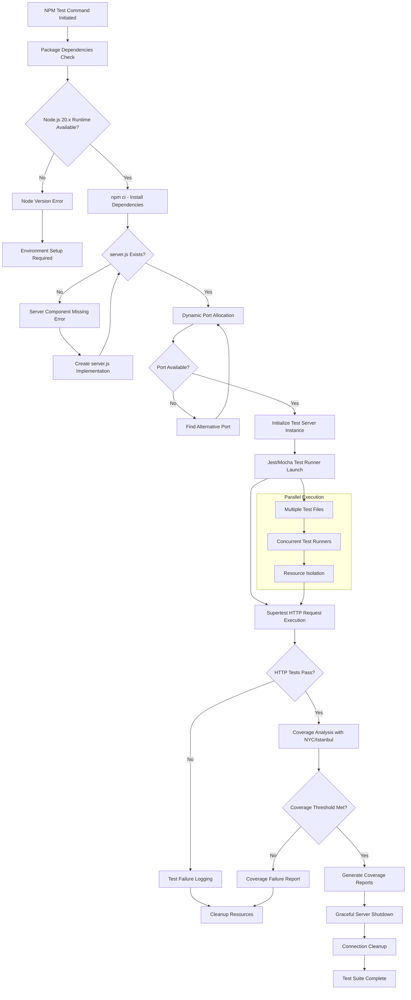
```mermaid
flowchart TD
    A[NPM Test Command Initiated] --> B[Package Dependencies Check]
    B --> C{Node.js 20.x Runtime Available?}
    C -->|No| D[Node Version Error]
    D --> E[Environment Setup Required]
    C -->|Yes| F[npm ci - Install Dependencies]
    F --> G{server.js Exists?}
    G -->|No| H[Server Component Missing Error]
    H --> I[Create server.js Implementation]
    I --> G
    G -->|Yes| J[Dynamic Port Allocation]
    J --> K{Port Available?}
    K -->|No| L[Find Alternative Port]
    L --> J
    K -->|Yes| M[Initialize Test Server Instance]
    M --> N[Jest/Mocha Test Runner Launch]
    N --> O[Supertest HTTP Request Execution]
    O --> P{HTTP Tests Pass?}
    P -->|No| Q[Test Failure Logging]
    Q --> R[Cleanup Resources]
    P -->|Yes| S[Coverage Analysis with NYC/Istanbul]
    S --> T{Coverage Threshold Met?}
    T -->|No| U[Coverage Failure Report]
    U --> R
    T -->|Yes| V[Generate Coverage Reports]
    V --> W[Graceful Server Shutdown]
    W --> X[Connection Cleanup]
    X --> Y[Test Suite Complete]
    
    subgraph "Parallel Execution"
        Z[Multiple Test Files]
        AA[Concurrent Test Runners]
        BB[Resource Isolation]
    end
    
    N --> Z
    Z --> AA
    AA --> BB
    BB --> O
```

**Process Components:**
- <span style="background-color: rgba(91, 57, 243, 0.2)">**Node.js 20.x Runtime**: LTS runtime environment providing stable HTTP server and testing capabilities</span>
- <span style="background-color: rgba(91, 57, 243, 0.2)">**Jest/Mocha Test Runner**: Primary test execution framework with comprehensive assertion and mocking support</span>
- <span style="background-color: rgba(91, 57, 243, 0.2)">**Supertest HTTP Library**: Programmatic API testing enabling HTTP request/response validation without external server dependencies</span>
- <span style="background-color: rgba(91, 57, 243, 0.2)">**NYC/Istanbul Coverage Tools**: Code coverage analysis generating line, branch, function, and statement coverage metrics</span>
- <span style="background-color: rgba(91, 57, 243, 0.2)">**Cleanup Hooks**: Automated resource deallocation ensuring proper server shutdown and connection cleanup</span>

**Decision Points:**
- <span style="background-color: rgba(91, 57, 243, 0.2)">**Node.js Version Compatibility**: Runtime must be Node.js 20.x or compatible LTS version for optimal performance and security</span>
- <span style="background-color: rgba(91, 57, 243, 0.2)">**Port Availability Verification**: Dynamic port allocation between 3000-65535 with conflict resolution for parallel execution</span>
- <span style="background-color: rgba(91, 57, 243, 0.2)">**Coverage Threshold Verification**: Enforcement of 90%+ line coverage, 85%+ branch coverage, and 95%+ function coverage requirements</span>

**Performance Constraints:**
- <span style="background-color: rgba(91, 57, 243, 0.2)">**Server Startup Time**: <100ms initialization for HTTP server instances</span>
- <span style="background-color: rgba(91, 57, 243, 0.2)">**Test Suite Execution**: Complete test suite execution <5s including all server lifecycle operations</span>
- <span style="background-color: rgba(91, 57, 243, 0.2)">**Coverage Generation**: Coverage report generation and analysis <1s for comprehensive metrics</span>

### 4.1.2 Integration Workflows

#### 4.1.2.1 Maven Build Lifecycle Integration

The framework seamlessly integrates with Maven's standard build lifecycle, providing automated test execution within the development workflow.

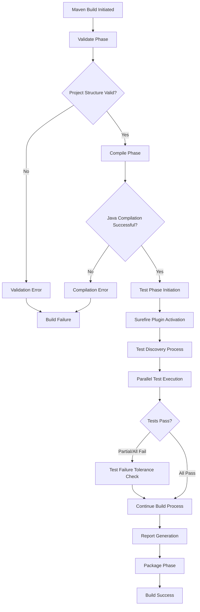
```mermaid
flowchart TD
    A[Maven Build Initiated] --> B[Validate Phase]
    B --> C{Project Structure Valid?}
    C -->|No| D[Validation Error]
    D --> E[Build Failure]
    C -->|Yes| F[Compile Phase]
    F --> G{Java Compilation Successful?}
    G -->|No| H[Compilation Error]
    H --> E
    G -->|Yes| I[Test Phase Initiation]
    I --> J[Surefire Plugin Activation]
    J --> K[Test Discovery Process]
    K --> L[Parallel Test Execution]
    L --> M{Tests Pass?}
    M -->|Partial/All Fail| N[Test Failure Tolerance Check]
    N --> O[Continue Build Process]
    M -->|All Pass| O
    O --> P[Report Generation]
    P --> Q[Package Phase]
    Q --> R[Build Success]
```

**Integration Points:**
- **Maven Lifecycle Hooks**: Test execution triggered during Maven test phase
- **Plugin Configuration**: Surefire plugin configured for unlimited parallel threads
- **Artifact Generation**: Test reports produced in `target/` directory structure
- **Failure Handling**: `testFailureIgnore=true` allows build continuation despite test failures

#### 4.1.2.2 CI/CD Pipeline Integration Workflow

The framework provides native support for Jenkins and GitHub Actions integration, enabling automated testing within continuous integration pipelines.

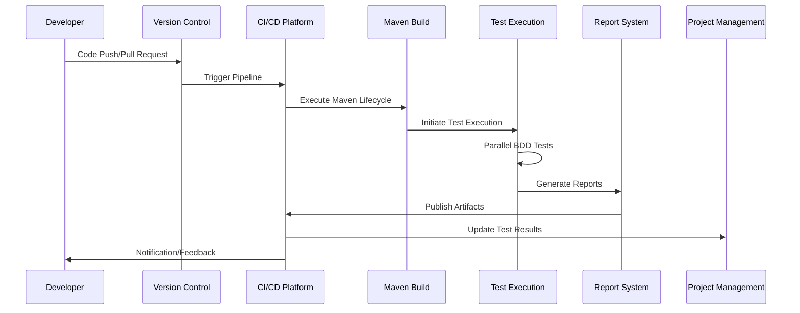
```mermaid
sequenceDiagram
    participant Dev as Developer
    participant VCS as Version Control
    participant CI as CI/CD Platform
    participant Maven as Maven Build
    participant Test as Test Execution
    participant Report as Report System
    participant PM as Project Management
    
    Dev->>VCS: Code Push/Pull Request
    VCS->>CI: Trigger Pipeline
    CI->>Maven: Execute Maven Lifecycle
    Maven->>Test: Initiate Test Execution
    Test->>Test: Parallel BDD Tests
    Test->>Report: Generate Reports
    Report->>CI: Publish Artifacts
    CI->>PM: Update Test Results
    CI->>Dev: Notification/Feedback
```

**Pipeline Components:**
- **Trigger Mechanisms**: Git push, pull request, scheduled execution
- **Environment Setup**: Java 8+ runtime, Maven 3.x, browser installations
- **Test Execution**: Automated BDD test suite execution with parallel processing
- **Artifact Publishing**: HTML reports, JSON results, rerun files
- **Integration Touchpoints**: Jira test execution tracking, notification systems

#### 4.1.2.3 Node.js NPM Test Lifecycle Integration (updated)

<span style="background-color: rgba(91, 57, 243, 0.2)">The Node.js testing infrastructure operates in parallel with the existing Maven build lifecycle, maintaining complete independence while contributing to unified reporting and quality metrics aggregation.</span>

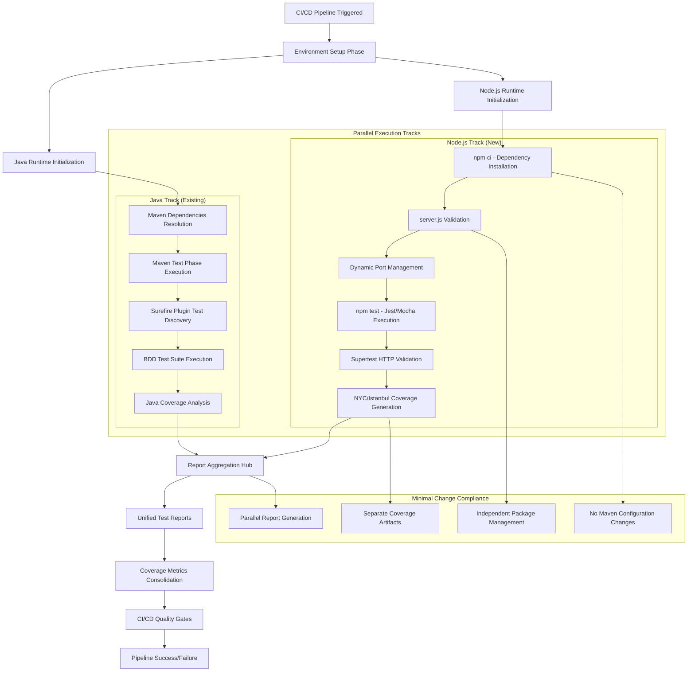
```mermaid
flowchart TD
    A[CI/CD Pipeline Triggered] --> B[Environment Setup Phase]
    B --> C[Java Runtime Initialization]
    B --> D[Node.js Runtime Initialization]
    
    subgraph "Parallel Execution Tracks"
        subgraph "Java Track (Existing)"
            E[Maven Dependencies Resolution]
            F[Maven Test Phase Execution]
            G[Surefire Plugin Test Discovery]
            H[BDD Test Suite Execution]
            I[Java Coverage Analysis]
        end
        
        subgraph "Node.js Track (New)"
            J[npm ci - Dependency Installation]
            K[server.js Validation]
            L[Dynamic Port Management]
            M[npm test - Jest/Mocha Execution]
            N[Supertest HTTP Validation]
            O[NYC/Istanbul Coverage Generation]
        end
    end
    
    C --> E
    D --> J
    E --> F
    J --> K
    F --> G
    K --> L
    G --> H
    L --> M
    H --> I
    M --> N
    N --> O
    
    I --> P[Report Aggregation Hub]
    O --> P
    P --> Q[Unified Test Reports]
    Q --> R[Coverage Metrics Consolidation]
    R --> S[CI/CD Quality Gates]
    S --> T[Pipeline Success/Failure]
    
    subgraph "Minimal Change Compliance"
        U[No Maven Configuration Changes]
        V[Independent Package Management]
        W[Separate Coverage Artifacts]
        X[Parallel Report Generation]
    end
    
    J --> U
    K --> V
    O --> W
    P --> X
```

**Integration Architecture:**
- <span style="background-color: rgba(91, 57, 243, 0.2)">**Parallel Independence**: NPM test execution runs concurrently with Maven tests without requiring modifications to existing Java infrastructure</span>
- <span style="background-color: rgba(91, 57, 243, 0.2)">**Minimal Change Compliance**: Adheres to 0.4.1 principle by avoiding alterations to established Maven configuration and Java test workflows</span>
- <span style="background-color: rgba(91, 57, 243, 0.2)">**Unified Reporting Integration**: Node.js test results feed into the same reporting aggregation system shown in 4.1.2.2, enabling consolidated quality metrics</span>

**CI/CD Execution Sequence:**
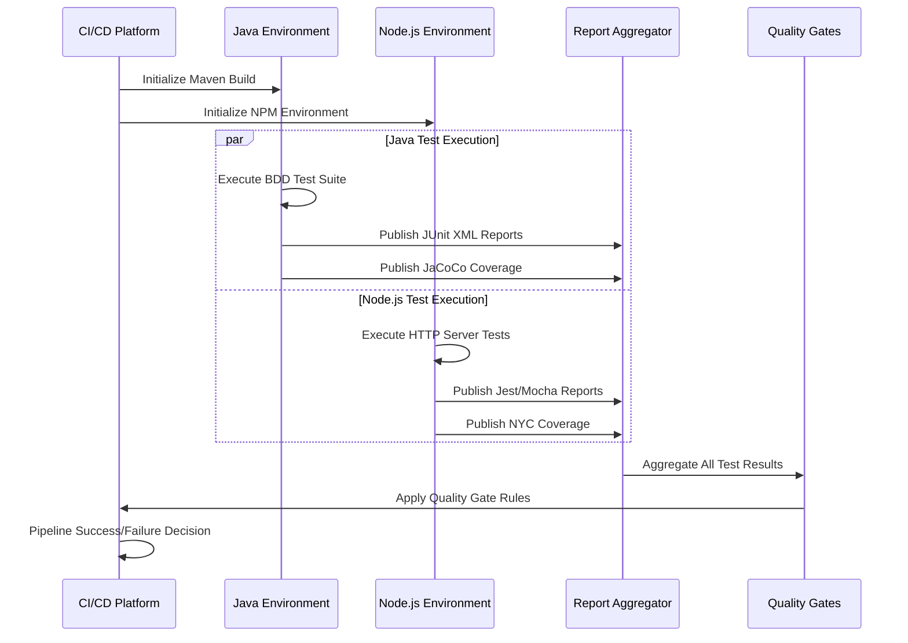
```mermaid
sequenceDiagram
    participant CI as CI/CD Platform
    participant Java as Java Environment
    participant Node as Node.js Environment
    participant Reports as Report Aggregator
    participant Quality as Quality Gates
    
    CI->>Java: Initialize Maven Build
    CI->>Node: Initialize NPM Environment
    
    par Java Test Execution
        Java->>Java: Execute BDD Test Suite
        Java->>Reports: Publish JUnit XML Reports
        Java->>Reports: Publish JaCoCo Coverage
    and Node.js Test Execution
        Node->>Node: Execute HTTP Server Tests
        Node->>Reports: Publish Jest/Mocha Reports
        Node->>Reports: Publish NYC Coverage
    end
    
    Reports->>Quality: Aggregate All Test Results
    Quality->>CI: Apply Quality Gate Rules
    CI->>CI: Pipeline Success/Failure Decision
```

**Technical Implementation Details:**
- <span style="background-color: rgba(91, 57, 243, 0.2)">**Dependency Isolation**: Node.js dependencies managed via npm/package.json completely separate from Maven pom.xml</span>
- <span style="background-color: rgba(91, 57, 243, 0.2)">**Coverage Artifact Separation**: JavaScript coverage reports (LCOV, HTML) generated in separate directories from Java coverage outputs</span>
- <span style="background-color: rgba(91, 57, 243, 0.2)">**Report Format Standardization**: Both test tracks generate JUnit XML and LCOV formats for unified CI/CD dashboard integration</span>
- <span style="background-color: rgba(91, 57, 243, 0.2)">**Resource Management**: Independent cleanup mechanisms preventing cross-platform resource conflicts during parallel execution</span>

**Quality Gate Integration:**
- **Combined Coverage Metrics**: Aggregated coverage scores from both Java (JaCoCo) and JavaScript (NYC/Istanbul) test suites
- **Unified Test Result Reporting**: Consolidated pass/fail status across BDD scenarios and HTTP server unit tests
- **Performance Threshold Enforcement**: Combined execution time limits ensuring both test tracks meet performance requirements
- **Failure Tolerance**: Independent failure handling allowing one track to succeed while the other fails, with granular reporting

## 4.2 DETAILED PROCESS FLOWS

### 4.2.1 Feature-Specific Workflows

#### 4.2.1.1 BDD Test Scenario Management (F-001)

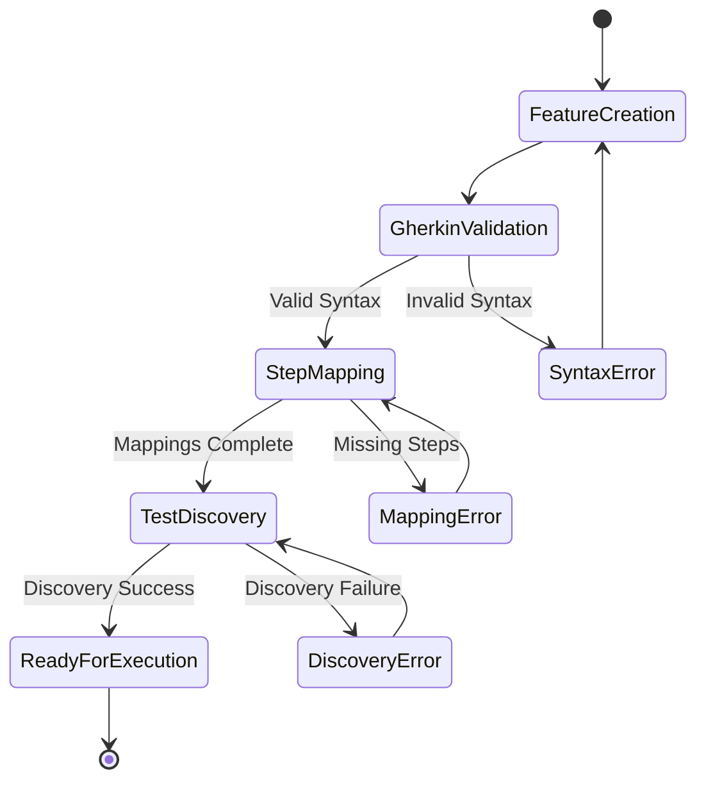
```mermaid
stateDiagram-v2
    [*] --> FeatureCreation
    FeatureCreation --> GherkinValidation
    GherkinValidation --> StepMapping: Valid Syntax
    GherkinValidation --> SyntaxError: Invalid Syntax
    SyntaxError --> FeatureCreation
    StepMapping --> TestDiscovery: Mappings Complete
    StepMapping --> MappingError: Missing Steps
    MappingError --> StepMapping
    TestDiscovery --> ReadyForExecution: Discovery Success
    TestDiscovery --> DiscoveryError: Discovery Failure
    DiscoveryError --> TestDiscovery
    ReadyForExecution --> [*]
```

**State Transitions:**
- **Feature Creation**: Business analysts create `.feature` files using Gherkin syntax
- **Gherkin Validation**: Cucumber parser validates syntax compliance
- **Step Mapping**: Automated mapping between Gherkin steps and Java methods
- **Test Discovery**: Maven Surefire identifies executable test classes
- **Ready for Execution**: All prerequisites satisfied for test execution

#### 4.2.1.2 Parallel Test Execution Management (F-004)

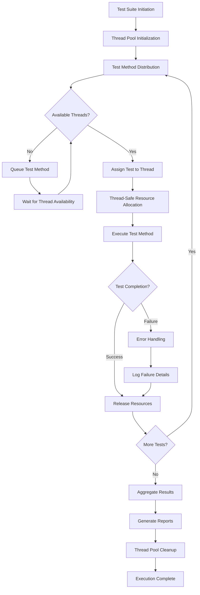
```mermaid
flowchart TD
    A[Test Suite Initiation] --> B[Thread Pool Initialization]
    B --> C[Test Method Distribution]
    C --> D{Available Threads?}
    D -->|No| E[Queue Test Method]
    E --> F[Wait for Thread Availability]
    F --> D
    D -->|Yes| G[Assign Test to Thread]
    G --> H[Thread-Safe Resource Allocation]
    H --> I[Execute Test Method]
    I --> J{Test Completion?}
    J -->|Success| K[Release Resources]
    J -->|Failure| L[Error Handling]
    L --> M[Log Failure Details]
    M --> K
    K --> N{More Tests?}
    N -->|Yes| C
    N -->|No| O[Aggregate Results]
    O --> P[Generate Reports]
    P --> Q[Thread Pool Cleanup]
    Q --> R[Execution Complete]
```

**Parallel Execution Management:**
- **Thread Pool**: Unlimited thread configuration with dynamic allocation
- **Resource Isolation**: Thread-safe WebDriver instance management
- **Load Balancing**: Automatic test distribution across available threads
- **Synchronization**: Result aggregation with thread-safe reporting

#### 4.2.1.3 Node.js Unit Test Execution Management (F-007) (updated)

<span style="background-color: rgba(91, 57, 243, 0.2)">This workflow manages the comprehensive execution lifecycle for Node.js HTTP server unit testing, incorporating Jest/Mocha test discovery, dynamic port allocation, test execution orchestration, coverage analysis, and result reporting within the existing CI/CD infrastructure.</span>

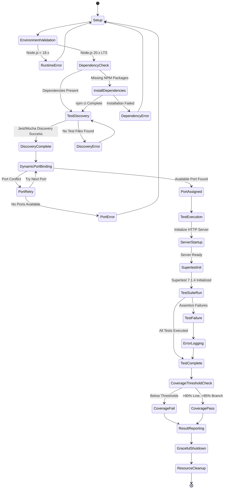
```mermaid
stateDiagram-v2
    [*] --> Setup
    Setup --> EnvironmentValidation
    EnvironmentValidation --> RuntimeError: Node.js < 18.x
    RuntimeError --> Setup
    EnvironmentValidation --> DependencyCheck: Node.js 20.x LTS
    DependencyCheck --> InstallDependencies: Missing NPM Packages
    DependencyCheck --> TestDiscovery: Dependencies Present
    InstallDependencies --> TestDiscovery: npm ci Complete
    InstallDependencies --> DependencyError: Installation Failed
    DependencyError --> Setup
    
    TestDiscovery --> DiscoveryComplete: Jest/Mocha Discovery Success
    TestDiscovery --> DiscoveryError: No Test Files Found
    DiscoveryError --> TestDiscovery
    
    DiscoveryComplete --> DynamicPortBinding
    DynamicPortBinding --> PortAssigned: Available Port Found
    DynamicPortBinding --> PortRetry: Port Conflict
    PortRetry --> DynamicPortBinding: Try Next Port
    PortRetry --> PortError: No Ports Available
    PortError --> Setup
    
    PortAssigned --> TestExecution
    TestExecution --> ServerStartup: Initialize HTTP Server
    ServerStartup --> SupertestInit: Server Ready
    SupertestInit --> TestSuiteRun: Supertest 7.1.4 Initialized
    TestSuiteRun --> TestComplete: All Tests Executed
    TestSuiteRun --> TestFailure: Assertion Failures
    TestFailure --> ErrorLogging
    ErrorLogging --> TestComplete
    
    TestComplete --> CoverageThresholdCheck
    CoverageThresholdCheck --> CoveragePass: >90% Line, >85% Branch
    CoverageThresholdCheck --> CoverageFail: Below Thresholds
    CoverageFail --> ResultReporting
    CoveragePass --> ResultReporting
    
    ResultReporting --> GracefulShutdown
    GracefulShutdown --> ResourceCleanup
    ResourceCleanup --> [*]
```

**State Transition Details:**

- **Setup**: <span style="background-color: rgba(91, 57, 243, 0.2)">Initializes the Node.js testing environment with runtime version verification, package.json validation, and server.js component existence checks</span>
- **Environment Validation**: <span style="background-color: rgba(91, 57, 243, 0.2)">Verifies Node.js 20.x LTS runtime availability and npm/yarn package manager accessibility for dependency management</span>
- **Dependency Check**: <span style="background-color: rgba(91, 57, 243, 0.2)">Validates presence of Jest 29.x or Mocha 10.x testing frameworks, Supertest 7.1.4 HTTP testing library, and NYC/Istanbul coverage tools</span>
- **Test Discovery**: <span style="background-color: rgba(91, 57, 243, 0.2)">Jest/Mocha automatically discovers test files matching `*.test.js`, `*.spec.js` patterns in designated test directories with parallel execution support</span>
- **Dynamic Port Binding**: <span style="background-color: rgba(91, 57, 243, 0.2)">Allocates available ports dynamically between 3000-65535 range to prevent conflicts during parallel test execution with automatic retry mechanisms</span>
- **Test Execution**: <span style="background-color: rgba(91, 57, 243, 0.2)">Orchestrates HTTP server startup, Supertest request execution, assertion validation, and comprehensive error capture with detailed logging</span>
- **Coverage Threshold Check**: <span style="background-color: rgba(91, 57, 243, 0.2)">Analyzes line coverage (>90%), branch coverage (>85%), and function coverage (>95%) using NYC/Istanbul with configurable threshold enforcement</span>
- **Result Reporting**: <span style="background-color: rgba(91, 57, 243, 0.2)">Generates JUnit XML, LCOV, HTML coverage reports, and JSON test results for CI/CD pipeline integration and quality metrics aggregation</span>

**Performance Requirements:**
- <span style="background-color: rgba(91, 57, 243, 0.2)">Server startup time: <100ms for HTTP server initialization</span>
- <span style="background-color: rgba(91, 57, 243, 0.2)">Test suite execution: <5s for complete test lifecycle</span>
- <span style="background-color: rgba(91, 57, 243, 0.2)">Coverage report generation: <1s for comprehensive analysis</span>
- <span style="background-color: rgba(91, 57, 243, 0.2)">Resource cleanup: <50ms for graceful shutdown and connection termination</span>

### 4.2.2 Error Handling Flowcharts

#### 4.2.2.1 Browser Automation Error Recovery

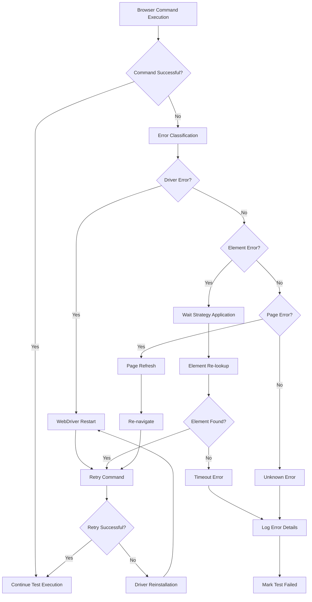
```mermaid
flowchart TD
    A[Browser Command Execution] --> B{Command Successful?}
    B -->|Yes| C[Continue Test Execution]
    B -->|No| D[Error Classification]
    D --> E{Driver Error?}
    E -->|Yes| F[WebDriver Restart]
    F --> G[Retry Command]
    G --> H{Retry Successful?}
    H -->|No| I[Driver Reinstallation]
    I --> F
    H -->|Yes| C
    E -->|No| J{Element Error?}
    J -->|Yes| K[Wait Strategy Application]
    K --> L[Element Re-lookup]
    L --> M{Element Found?}
    M -->|No| N[Timeout Error]
    N --> O[Log Error Details]
    O --> P[Mark Test Failed]
    M -->|Yes| G
    J -->|No| Q{Page Error?}
    Q -->|Yes| R[Page Refresh]
    R --> S[Re-navigate]
    S --> G
    Q -->|No| T[Unknown Error]
    T --> O
```

**Error Recovery Mechanisms:**
- **Driver Errors**: Automatic WebDriver instance restart and command retry
- **Element Errors**: Intelligent wait strategies and element re-lookup
- **Page Errors**: Page refresh and re-navigation attempts
- **Timeout Handling**: Configurable timeouts with graceful degradation

#### 4.2.2.2 Test Data Generation Error Handling

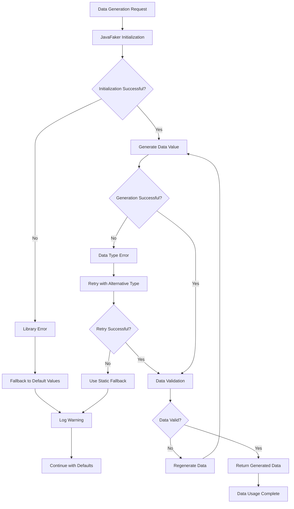
```mermaid
flowchart TD
    A[Data Generation Request] --> B[JavaFaker Initialization]
    B --> C{Initialization Successful?}
    C -->|No| D[Library Error]
    D --> E[Fallback to Default Values]
    E --> F[Log Warning]
    F --> G[Continue with Defaults]
    C -->|Yes| H[Generate Data Value]
    H --> I{Generation Successful?}
    I -->|No| J[Data Type Error]
    J --> K[Retry with Alternative Type]
    K --> L{Retry Successful?}
    L -->|No| M[Use Static Fallback]
    M --> F
    L -->|Yes| N[Data Validation]
    I -->|Yes| N
    N --> O{Data Valid?}
    O -->|No| P[Regenerate Data]
    P --> H
    O -->|Yes| Q[Return Generated Data]
    Q --> R[Data Usage Complete]
```

#### 4.2.2.3 Node.js Server Error Handling & Recovery (updated)

<span style="background-color: rgba(91, 57, 243, 0.2)">This comprehensive error handling and recovery workflow ensures robust HTTP server testing with Supertest, implementing timeout management, graceful shutdown procedures, and comprehensive resource cleanup mechanisms aligned with enterprise reliability standards.</span>

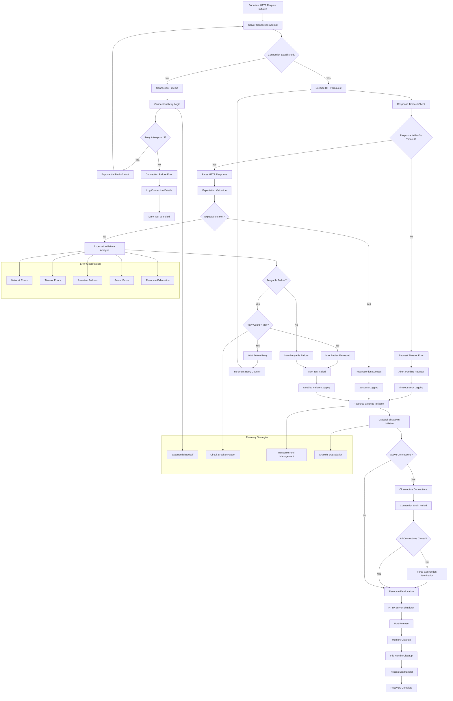
```mermaid
flowchart TD
    A[Supertest HTTP Request Initiated] --> B[Server Connection Attempt]
    B --> C{Connection Established?}
    C -->|No| D[Connection Timeout]
    D --> E[Connection Retry Logic]
    E --> F{Retry Attempts < 3?}
    F -->|Yes| G[Exponential Backoff Wait]
    G --> B
    F -->|No| H[Connection Failure Error]
    H --> I[Log Connection Details]
    I --> J[Mark Test as Failed]
    
    C -->|Yes| K[Execute HTTP Request]
    K --> L[Response Timeout Check]
    L --> M{Response Within 5s Timeout?}
    M -->|No| N[Request Timeout Error]
    N --> O[Abort Pending Request]
    O --> P[Timeout Error Logging]
    P --> Q[Resource Cleanup Initiation]
    
    M -->|Yes| R[Parse HTTP Response]
    R --> S[Expectation Validation]
    S --> T{Expectations Met?}
    T -->|Yes| U[Test Assertion Success]
    U --> V[Success Logging]
    V --> Q
    
    T -->|No| W[Expectation Failure Analysis]
    W --> X{Retryable Failure?}
    X -->|Yes| Y{Retry Count < Max?}
    Y -->|Yes| Z[Wait Before Retry]
    Z --> AA[Increment Retry Counter]
    AA --> K
    Y -->|No| BB[Max Retries Exceeded]
    BB --> CC[Mark Test Failed]
    CC --> DD[Detailed Failure Logging]
    DD --> Q
    
    X -->|No| EE[Non-Retryable Failure]
    EE --> CC
    
    Q --> FF[Graceful Shutdown Initiation]
    FF --> GG{Active Connections?}
    GG -->|Yes| HH[Close Active Connections]
    HH --> II[Connection Drain Period]
    II --> JJ{All Connections Closed?}
    JJ -->|No| KK[Force Connection Termination]
    KK --> LL[Resource Deallocation]
    JJ -->|Yes| LL
    GG -->|No| LL
    
    LL --> MM[HTTP Server Shutdown]
    MM --> NN[Port Release]
    NN --> OO[Memory Cleanup]
    OO --> PP[File Handle Cleanup]
    PP --> QQ[Process Exit Handler]
    QQ --> RR[Recovery Complete]
    
    subgraph "Error Classification"
        SS[Network Errors]
        TT[Timeout Errors]
        UU[Assertion Failures]
        VV[Server Errors]
        WW[Resource Exhaustion]
    end
    
    subgraph "Recovery Strategies"
        XX[Exponential Backoff]
        YY[Circuit Breaker Pattern]
        ZZ[Resource Pool Management]
        AAA[Graceful Degradation]
    end
    
    W --> SS
    W --> TT
    W --> UU
    W --> VV
    W --> WW
    
    E --> XX
    Y --> YY
    Q --> ZZ
    FF --> AAA
```

**Error Classification and Recovery Mechanisms:**

**Connection Management:**
- <span style="background-color: rgba(91, 57, 243, 0.2)">**Connection Timeout Handling**: Implements 5-second connection timeout with exponential backoff retry strategy (100ms, 200ms, 400ms intervals)</span>
- <span style="background-color: rgba(91, 57, 243, 0.2)">**Connection Pooling**: Manages HTTP connection lifecycle with automatic cleanup and resource recycling</span>
- <span style="background-color: rgba(91, 57, 243, 0.2)">**Connection Drain**: Graceful connection termination allowing pending requests to complete within 2-second window</span>

**Request Processing:**
- <span style="background-color: rgba(91, 57, 243, 0.2)">**Request Timeout Management**: Enforces 5-second request timeout with automatic abort and cleanup for hanging requests</span>
- <span style="background-color: rgba(91, 57, 243, 0.2)">**Response Validation**: Comprehensive HTTP status code, header, and payload validation with detailed failure analysis</span>
- <span style="background-color: rgba(91, 57, 243, 0.2)">**Retry Logic**: Intelligent retry mechanism with circuit breaker pattern for transient failures (3 attempts maximum)</span>

**Server Lifecycle Management:**
- <span style="background-color: rgba(91, 57, 243, 0.2)">**Graceful Shutdown**: Orderly server termination with connection draining, resource deallocation, and port release</span>
- <span style="background-color: rgba(91, 57, 243, 0.2)">**Resource Cleanup**: Comprehensive cleanup of file handles, memory allocations, event listeners, and timer objects</span>
- <span style="background-color: rgba(91, 57, 243, 0.2)">**Process Exit Handling**: SIGINT and SIGTERM signal handlers ensuring clean process termination without resource leaks</span>

**Error Categorization and Response:**

| Error Type | Detection Method | Recovery Strategy | Timeout | Max Retries |
|------------|-----------------|------------------|---------|-------------|
| **Connection Errors** | <span style="background-color: rgba(91, 57, 243, 0.2)">TCP socket failures</span> | <span style="background-color: rgba(91, 57, 243, 0.2)">Exponential backoff retry</span> | <span style="background-color: rgba(91, 57, 243, 0.2)">5s</span> | <span style="background-color: rgba(91, 57, 243, 0.2)">3</span> |
| **Request Timeouts** | <span style="background-color: rgba(91, 57, 243, 0.2)">Response timeout detection</span> | <span style="background-color: rgba(91, 57, 243, 0.2)">Request abortion and cleanup</span> | <span style="background-color: rgba(91, 57, 243, 0.2)">5s</span> | <span style="background-color: rgba(91, 57, 243, 0.2)">1</span> |
| **Assertion Failures** | <span style="background-color: rgba(91, 57, 243, 0.2)">Supertest expectation validation</span> | <span style="background-color: rgba(91, 57, 243, 0.2)">Conditional retry based on failure type</span> | <span style="background-color: rgba(91, 57, 243, 0.2)">N/A</span> | <span style="background-color: rgba(91, 57, 243, 0.2)">2</span> |
| **Server Errors** | <span style="background-color: rgba(91, 57, 243, 0.2)">HTTP 5xx status codes</span> | <span style="background-color: rgba(91, 57, 243, 0.2)">Server restart with port reallocation</span> | <span style="background-color: rgba(91, 57, 243, 0.2)">10s</span> | <span style="background-color: rgba(91, 57, 243, 0.2)">2</span> |
| **Resource Exhaustion** | <span style="background-color: rgba(91, 57, 243, 0.2)">Memory/file handle limits</span> | <span style="background-color: rgba(91, 57, 243, 0.2)">Aggressive cleanup and resource recycling</span> | <span style="background-color: rgba(91, 57, 243, 0.2)">3s</span> | <span style="background-color: rgba(91, 57, 243, 0.2)">1</span> |

**Performance and Reliability Metrics:**
- <span style="background-color: rgba(91, 57, 243, 0.2)">**Recovery Success Rate**: >95% successful recovery from transient failures</span>
- <span style="background-color: rgba(91, 57, 243, 0.2)">**Resource Cleanup Time**: <50ms for complete resource deallocation</span>
- <span style="background-color: rgba(91, 57, 243, 0.2)">**Error Detection Latency**: <10ms for failure identification and classification</span>
- <span style="background-color: rgba(91, 57, 243, 0.2)">**Graceful Shutdown Duration**: <2s for complete server shutdown and cleanup</span>

## 4.3 STATE MANAGEMENT

### 4.3.1 Test Execution State Transitions

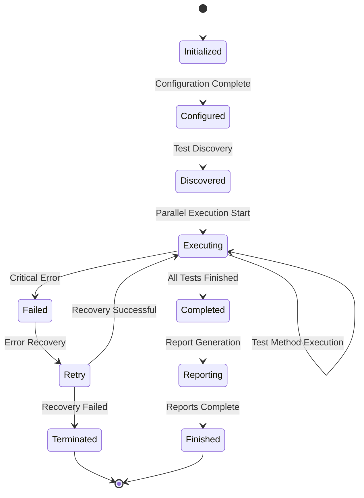
```mermaid
stateDiagram-v2
    [*] --> Initialized
    Initialized --> Configured: Configuration Complete
    Configured --> Discovered: Test Discovery
    Discovered --> Executing: Parallel Execution Start
    Executing --> Executing: Test Method Execution
    Executing --> Completed: All Tests Finished
    Executing --> Failed: Critical Error
    Failed --> Retry: Error Recovery
    Retry --> Executing: Recovery Successful
    Retry --> Terminated: Recovery Failed
    Completed --> Reporting: Report Generation
    Reporting --> Finished: Reports Complete
    Terminated --> [*]
    Finished --> [*]
```

**State Management Components:**
- **Test Context**: Scenario-level state maintained within Cucumber execution context
- **WebDriver State**: Browser session state with proper instance lifecycle management
- **Thread State**: Isolated execution state for parallel test threads
- **Report State**: Cumulative result aggregation across all test executions

### 4.3.2 Data Persistence Points

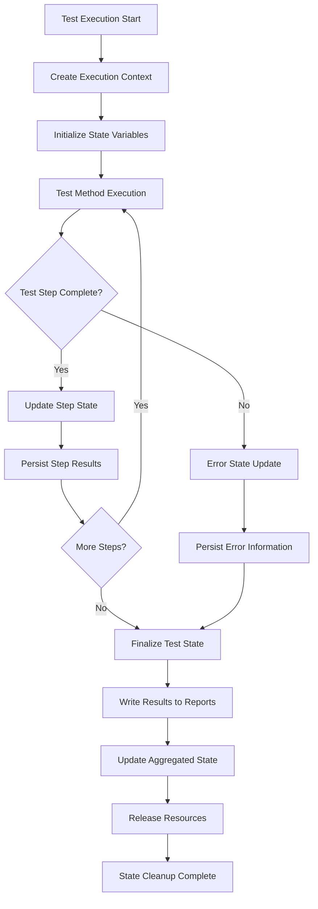
```mermaid
flowchart TD
    A[Test Execution Start] --> B[Create Execution Context]
    B --> C[Initialize State Variables]
    C --> D[Test Method Execution]
    D --> E{Test Step Complete?}
    E -->|Yes| F[Update Step State]
    F --> G[Persist Step Results]
    G --> H{More Steps?}
    H -->|Yes| D
    H -->|No| I[Finalize Test State]
    E -->|No| J[Error State Update]
    J --> K[Persist Error Information]
    K --> I
    I --> L[Write Results to Reports]
    L --> M[Update Aggregated State]
    M --> N[Release Resources]
    N --> O[State Cleanup Complete]
```

**Persistence Mechanisms:**
- **Memory State**: Runtime state management for active test execution
- **File System**: Test reports, JSON results, and rerun files
- **Thread Context**: Thread-local storage for parallel execution isolation
- **Build Artifacts**: Maven target directory with structured report hierarchy

## 4.4 INTEGRATION SEQUENCE DIAGRAMS

### 4.4.1 Complete End-to-End Test Execution

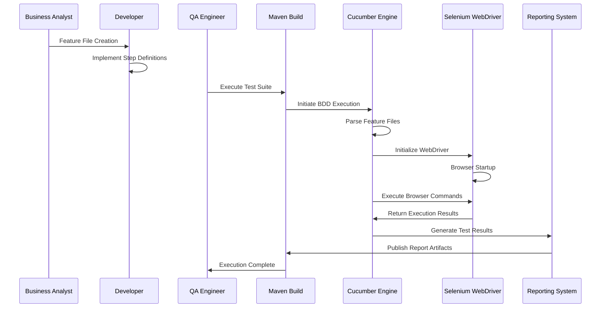
```mermaid
sequenceDiagram
    participant BA as Business Analyst
    participant DEV as Developer
    participant QA as QA Engineer
    participant Maven as Maven Build
    participant Cucumber as Cucumber Engine
    participant Selenium as Selenium WebDriver
    participant Reports as Reporting System
    
    BA->>DEV: Feature File Creation
    DEV->>DEV: Implement Step Definitions
    QA->>Maven: Execute Test Suite
    Maven->>Cucumber: Initiate BDD Execution
    Cucumber->>Cucumber: Parse Feature Files
    Cucumber->>Selenium: Initialize WebDriver
    Selenium->>Selenium: Browser Startup
    Cucumber->>Selenium: Execute Browser Commands
    Selenium->>Cucumber: Return Execution Results
    Cucumber->>Reports: Generate Test Results
    Reports->>Maven: Publish Report Artifacts
    Maven->>QA: Execution Complete
```

### 4.4.2 Parallel Execution Coordination

```mermaid
sequenceDiagram
    participant Surefire as Maven Surefire
    participant ThreadPool as Thread Pool
    participant T1 as Thread 1
    participant T2 as Thread 2
    participant TN as Thread N
    participant Aggregator as Result Aggregator
    
    Surefire->>ThreadPool: Initialize Parallel Execution
    ThreadPool->>T1: Assign Test Method Group
    ThreadPool->>T2: Assign Test Method Group
    ThreadPool->>TN: Assign Test Method Group
    
    par Thread 1 Execution
        T1->>T1: Execute BDD Tests
        T1->>Aggregator: Submit Results
    and Thread 2 Execution
        T2->>T2: Execute BDD Tests
        T2->>Aggregator: Submit Results
    and Thread N Execution
        TN->>TN: Execute BDD Tests
        TN->>Aggregator: Submit Results
    end
    
    Aggregator->>Surefire: Consolidated Results
    Surefire->>Surefire: Generate Final Reports
```

### 4.4.3 Node.js Unit Test Pipeline Integration (updated)

<span style="background-color: rgba(91, 57, 243, 0.2)">The Node.js unit test pipeline provides automated HTTP server testing capabilities integrated into the CI/CD workflow while maintaining complete independence from the existing Maven infrastructure. This sequence demonstrates the full lifecycle from development to feedback delivery in accordance with CI/CD integration requirements.</span>

```mermaid
sequenceDiagram
    participant DEV as Developer
    participant VCS as Version Control System
    participant CI as CI/CD Platform
    participant NodeEnv as Node.js 20.x Runtime
    participant NPM as NPM Package Manager
    participant Jest as Jest Test Runner
    participant Server as HTTP Server Instance
    participant Coverage as NYC Coverage Tool
    participant Reports as CI Report System
    
    DEV->>VCS: Git Push (server.js + tests)
    VCS->>CI: Trigger Pipeline Webhook
    CI->>CI: Initialize Build Environment
    CI->>NodeEnv: Validate Node.js 20.x Runtime
    NodeEnv->>CI: Runtime Ready
    
    CI->>NPM: Execute npm ci
    NPM->>NPM: Install Dependencies (Jest, Supertest)
    NPM->>CI: Dependencies Resolved
    
    CI->>NPM: Execute npm test
    NPM->>Jest: Initialize Test Runner
    Jest->>Server: Create Test Server Instance
    Server->>Server: Allocate Dynamic Port (3000-65535)
    Server->>Jest: Server Ready
    
    Jest->>Jest: Execute HTTP Tests (server.test.js)
    Jest->>Server: Supertest HTTP Requests
    Server->>Jest: HTTP Response Validation
    Jest->>Coverage: Collect Coverage Data
    Coverage->>Coverage: Generate LCOV/HTML Reports
    
    alt Tests Pass & Coverage Met (90%+)
        Coverage->>Reports: Upload Coverage Artifacts
        Jest->>Reports: Upload JUnit XML Results
        Reports->>CI: Test Success with Metrics
        CI->>DEV: Success Notification + Coverage Badge
    else Tests Fail or Coverage Below Threshold
        Jest->>Reports: Upload Failure Reports
        Coverage->>Reports: Upload Coverage Gap Analysis
        Reports->>CI: Test Failure with Details
        CI->>DEV: Failure Notification + Action Required
    end
    
    Jest->>Server: Graceful Shutdown
    Server->>Server: Connection Cleanup
    NPM->>CI: Test Execution Complete
```

**Pipeline Integration Characteristics:**
- <span style="background-color: rgba(91, 57, 243, 0.2)">**Independent Execution Track**: Operates in parallel with Maven builds without configuration dependencies or shared resources</span>
- <span style="background-color: rgba(91, 57, 243, 0.2)">**Coverage Threshold Enforcement**: Enforces 90%+ line coverage requirement with detailed gap analysis for failed thresholds</span>
- <span style="background-color: rgba(91, 57, 243, 0.2)">**Dynamic Port Management**: Automatic port allocation prevents conflicts during parallel CI execution with Maven-based browser tests</span>
- <span style="background-color: rgba(91, 57, 243, 0.2)">**Unified Reporting Integration**: Generates JUnit XML and LCOV formats compatible with existing CI/CD dashboard and quality gate systems</span>

### 4.4.4 NPM & Maven Parallel Execution Coordination (updated)

<span style="background-color: rgba(91, 57, 243, 0.2)">The parallel execution coordination sequence demonstrates how NPM and Maven test suites execute concurrently within the CI/CD pipeline while maintaining independent build processes and contributing to unified quality metrics. This architecture ensures comprehensive test coverage across both UI automation and HTTP server testing domains.</span>

```mermaid
sequenceDiagram
    participant CI as CI/CD Platform
    participant EnvSetup as Environment Setup
    participant MavenTrack as Maven Execution Track
    participant NPMTrack as NPM Execution Track
    participant Surefire as Maven Surefire Plugin
    participant Jest as Jest Test Framework
    participant Aggregator as Report Aggregation System
    participant QualityGate as Quality Gate Engine
    participant Feedback as Developer Feedback
    
    CI->>EnvSetup: Initialize Dual Runtime Environment
    EnvSetup->>EnvSetup: Install Java 8+ Runtime
    EnvSetup->>EnvSetup: Install Node.js 20.x LTS
    EnvSetup->>EnvSetup: Verify Maven 3.x & npm 9.x+
    EnvSetup->>CI: Environment Ready
    
    CI->>MavenTrack: Launch Maven Build Track
    CI->>NPMTrack: Launch NPM Test Track
    
    par Maven BDD Test Execution
        MavenTrack->>Surefire: Initialize BDD Test Discovery
        Surefire->>Surefire: Parallel Thread Pool Creation
        Surefire->>Surefire: Cucumber Feature Execution
        Surefire->>Surefire: Selenium WebDriver Operations
        Surefire->>Aggregator: Submit JUnit XML Results
        Surefire->>Aggregator: Submit JaCoCo Coverage Data
    and NPM Unit Test Execution
        NPMTrack->>Jest: Initialize HTTP Server Testing
        Jest->>Jest: Dynamic Port Allocation
        Jest->>Jest: Supertest API Validation
        Jest->>Jest: Server Lifecycle Testing
        Jest->>Aggregator: Submit Jest JSON Results
        Jest->>Aggregator: Submit NYC Coverage Data
    end
    
    Aggregator->>Aggregator: Consolidate Test Results
    Aggregator->>Aggregator: Merge Coverage Metrics
    Aggregator->>QualityGate: Submit Unified Metrics
    
    QualityGate->>QualityGate: Evaluate Combined Coverage (Java + JS)
    QualityGate->>QualityGate: Assess Test Pass Rates
    QualityGate->>QualityGate: Validate Performance Thresholds
    
    alt Quality Gates Pass
        QualityGate->>Feedback: Pipeline Success + Metrics Summary
        Feedback->>CI: Update Build Status (Success)
    else Quality Gates Fail
        QualityGate->>Feedback: Quality Gate Failure + Detailed Report
        Feedback->>CI: Update Build Status (Failed)
        Feedback->>Feedback: Generate Failure Analysis
    end
    
    CI->>MavenTrack: Cleanup Maven Resources
    CI->>NPMTrack: Cleanup NPM Resources
    CI->>Aggregator: Archive Test Artifacts
    CI->>CI: Pipeline Complete
```

**Parallel Coordination Features:**
- <span style="background-color: rgba(91, 57, 243, 0.2)">**Independent Resource Management**: Each execution track manages its own runtime environment, dependencies, and cleanup processes without cross-contamination</span>
- <span style="background-color: rgba(91, 57, 243, 0.2)">**Unified Quality Assessment**: Combined coverage metrics from both Java (JaCoCo) and JavaScript (NYC/Istanbul) contribute to overall project quality scores</span>
- <span style="background-color: rgba(91, 57, 243, 0.2)">**Failure Isolation**: Independent failure handling allows partial success scenarios where one test track succeeds while the other fails, enabling granular quality reporting</span>
- <span style="background-color: rgba(91, 57, 243, 0.2)">**Performance Optimization**: Parallel execution reduces overall CI/CD pipeline duration while maintaining comprehensive test coverage across multiple technology stacks</span>

**Execution Timeline Characteristics:**
- **Concurrent Initialization**: Both Maven and NPM tracks initialize simultaneously, reducing total setup overhead
- **Independent Execution Paths**: No shared resources or sequential dependencies between tracks, ensuring maximum parallelization
- **Synchronized Aggregation**: Report consolidation occurs only after both tracks complete, ensuring comprehensive metrics collection
- **Atomic Quality Evaluation**: Quality gate assessment treats combined results as a single unit for pass/fail determination

**Minimal Change Compliance:**
- <span style="background-color: rgba(91, 57, 243, 0.2)">**Zero Maven Configuration Changes**: Existing Maven Surefire plugin configuration remains unmodified, preserving established Java test execution patterns</span>
- <span style="background-color: rgba(91, 57, 243, 0.2)">**Independent Package Management**: NPM dependencies defined in separate package.json without interference to Maven pom.xml dependency resolution</span>
- <span style="background-color: rgba(91, 57, 243, 0.2)">**Separate Artifact Generation**: Test reports and coverage data generated in distinct directory structures, preventing overwrites or conflicts</span>
- <span style="background-color: rgba(91, 57, 243, 0.2)">**Additive Integration**: New NPM testing capabilities supplement rather than replace existing Maven-based BDD testing infrastructure</span>

## 4.5 VALIDATION RULES AND CHECKPOINTS

### 4.5.1 Business Rules at Each Process Step

| Process Step | Validation Rules | Checkpoint Type |
|--------------|------------------|-----------------|
| Feature File Creation | Valid Gherkin syntax, one feature per file | Syntactic Validation |
| Step Definition Mapping | One-to-one mapping, no orphaned steps | Completeness Check |
| Test Discovery | Pattern matching `**/CukesRunner*.java` | Discovery Validation |
| Browser Initialization | Driver availability, browser startup timeout | Resource Validation |
| Data Generation | Type compatibility, value constraints | Data Validation |
| Report Generation | File write permissions, format compliance | Output Validation |
| <span style="background-color: rgba(91, 57, 243, 0.2)">Node.js Unit Test Execution</span> | <span style="background-color: rgba(91, 57, 243, 0.2)">Coverage ≥90%, all npm scripts exit code 0</span> | <span style="background-color: rgba(91, 57, 243, 0.2)">Coverage Validation</span> |

### 4.5.2 Authorization and Security Checkpoints (updated)

```mermaid
flowchart TD
    A[Process Initiation] --> B{Maven Repository Access?}
    B -->|No| C[Authentication Error]
    C --> D[Credential Verification]
    D --> B
    B -->|Yes| N{NPM Registry Access?}
    N -->|No| O[NPM Authentication Error]
    O --> P[NPM Credential Verification]
    P --> N
    N -->|Yes| Q{Package Integrity SHA Verified?}
    Q -->|No| R[Package Integrity Error]
    R --> S[SHA Verification Check]
    S --> Q
    Q -->|Yes| E{Driver Download Permissions?}
    E -->|No| F[Network Security Error]
    F --> G[Security Policy Check]
    G --> E
    E -->|Yes| H{File System Write Access?}
    H -->|No| I[Permission Error]
    I --> J[Directory Permission Check]
    J --> H
    H -->|Yes| K[Security Validation Complete]
    K --> L[Continue Process Execution]
```

**Security Validation Points:**
- **Maven Repository**: Authenticated access to dependency repositories
- <span style="background-color: rgba(91, 57, 243, 0.2)">**NPM Registry**: Authenticated access to npm package repositories for JavaScript dependencies</span>
- <span style="background-color: rgba(91, 57, 243, 0.2)">**Package Integrity**: SHA checksum verification for all downloaded npm packages ensuring supply chain security</span>
- **Driver Downloads**: HTTPS-only connections for WebDriverManager
- **File System**: Write permissions for report generation directories
- **Browser Security**: Isolated browser profiles for test execution

### 4.5.3 Data Validation Requirements

The framework implements comprehensive data validation across multiple testing domains to ensure reliable test execution and accurate results.

#### 4.5.3.1 Input Data Validation

**Test Data Generation Validation**:
- **Type Consistency**: All generated test data must match expected Java data types and constraints
- **Value Range Validation**: Numeric data must fall within specified bounds and business logic constraints
- **String Format Validation**: Generated strings must conform to specified patterns (email formats, phone numbers, etc.)
- **Locale Consistency**: Internationalized test data must maintain consistency within selected locale parameters

**Feature File Validation**:
- **Gherkin Syntax Compliance**: All feature files must pass syntax validation before test execution
- **Step Definition Coverage**: Every Gherkin step must have corresponding Java step definition implementation
- **Scenario Uniqueness**: Scenario names within feature files must be unique to prevent execution conflicts

#### 4.5.3.2 Runtime Data Validation (updated)

**Browser State Validation**:
- **Page Load Confirmation**: All page navigation operations must complete within specified timeout thresholds
- **Element Availability**: Web elements must be present and interactable before test actions are executed
- **JavaScript Execution State**: Dynamic content must be fully rendered before interaction attempts

**<span style="background-color: rgba(91, 57, 243, 0.2)">API Response Validation</span>**:
- <span style="background-color: rgba(91, 57, 243, 0.2)">**HTTP Status Code Verification**: All API responses must return expected status codes (200, 201, 404, etc.)</span>
- <span style="background-color: rgba(91, 57, 243, 0.2)">**Response Schema Validation**: JSON response structure must match defined API contracts and schemas</span>
- <span style="background-color: rgba(91, 57, 243, 0.2)">**Response Time Validation**: API response times must not exceed defined SLA thresholds</span>
- <span style="background-color: rgba(91, 57, 243, 0.2)">**Content-Type Validation**: Response headers must specify correct content types for payload validation</span>

### 4.5.4 Regulatory Compliance Checks

#### 4.5.4.1 Code Quality Compliance

**Coverage Thresholds**:
- **Java Code Coverage**: Minimum 90% line coverage for all Java components as measured by JaCoCo
- <span style="background-color: rgba(91, 57, 243, 0.2)">**JavaScript Code Coverage**: Minimum 90% line coverage for all Node.js components as measured by Jest or NYC</span>
- **Branch Coverage**: Minimum 85% branch coverage across all conditional logic paths
- **Function Coverage**: Minimum 95% function coverage ensuring all methods are tested

**Code Quality Standards**:
- **Static Analysis**: All code must pass configured linting rules without warnings or errors
- **Complexity Metrics**: Cyclomatic complexity must not exceed configured thresholds
- **Duplication Analysis**: Code duplication must remain below acceptable thresholds

#### 4.5.4.2 Security Compliance Validation

**Dependency Security Scanning**:
- **Vulnerability Assessment**: All Maven and npm dependencies must pass security vulnerability scans
- **License Compliance**: All third-party dependencies must use approved open-source licenses
- **Supply Chain Verification**: Package integrity verification through checksum validation

**Data Privacy Compliance**:
- **Test Data Anonymization**: All generated test data must not contain real personally identifiable information
- **Data Retention Policies**: Test artifacts and logs must be purged according to configured retention schedules
- **Access Control Validation**: Test execution environments must enforce proper access controls and authentication

### 4.5.5 Performance and SLA Validation

#### 4.5.5.1 Execution Performance Checkpoints

**Test Execution Timing**:
- **Individual Test Duration**: Single test methods must complete within 50ms threshold
- **Test Suite Duration**: Full test suite execution must complete within 5 seconds for rapid feedback
- **Parallel Execution Efficiency**: Parallel test execution must demonstrate performance improvements over sequential execution

**Resource Utilization Monitoring**:
- **Memory Usage**: Test execution must not exceed configured memory allocation limits
- **CPU Usage**: Test processes must not consume excessive CPU resources during execution
- **Network Usage**: Browser automation must operate within network bandwidth constraints

#### 4.5.5.2 System Integration Performance (updated)

**<span style="background-color: rgba(91, 57, 243, 0.2)">Multi-Language Test Coordination</span>**:
- <span style="background-color: rgba(91, 57, 243, 0.2)">**Build Pipeline Efficiency**: Combined Maven and npm test execution must complete within overall CI/CD time budgets</span>
- <span style="background-color: rgba(91, 57, 243, 0.2)">**Resource Sharing**: Java and Node.js test processes must coexist without resource conflicts</span>
- <span style="background-color: rgba(91, 57, 243, 0.2)">**Report Generation Speed**: Consolidated test report generation must complete within acceptable timeframes</span>

**Browser Automation Performance**:
- **Page Load Times**: Web pages must load within specified timeout parameters
- **Element Interaction Response**: Web element interactions must respond within acceptable latency thresholds
- **Screenshot Capture Efficiency**: Screenshot generation for failed tests must not significantly impact overall execution time

### 4.5.6 Error Handling and Recovery Validation

#### 4.5.6.1 Graceful Degradation Checkpoints

**Test Failure Recovery**:
- **Isolated Failure Impact**: Individual test failures must not cascade to affect other test execution
- **Resource Cleanup**: Failed tests must properly release browser instances and system resources
- **Retry Mechanism Validation**: Configurable retry attempts must execute according to specified parameters

**System Resource Recovery**:
- **Browser Instance Management**: WebDriver instances must be properly initialized and terminated
- **File System Cleanup**: Temporary test files and artifacts must be cleaned up after execution
- **Network Connection Management**: HTTP connections must be properly closed and resources released

#### 4.5.6.2 Exception Handling Validation (updated)

**<span style="background-color: rgba(91, 57, 243, 0.2)">Cross-Runtime Exception Management</span>**:
- <span style="background-color: rgba(91, 57, 243, 0.2)">**Java Exception Propagation**: Java runtime exceptions must be properly caught and reported without terminating npm processes</span>
- <span style="background-color: rgba(91, 57, 243, 0.2)">**Node.js Error Handling**: JavaScript runtime errors must not interfere with Maven test execution lifecycle</span>
- <span style="background-color: rgba(91, 57, 243, 0.2)">**Process Isolation**: Failures in one runtime environment must not corrupt the execution state of the other</span>

**Error Reporting Accuracy**:
- **Stack Trace Preservation**: Full error stack traces must be captured and included in test reports
- **Context Information**: Error reports must include sufficient context for debugging and resolution
- **Error Classification**: Errors must be properly categorized (infrastructure, test logic, application defects)

## 4.6 PERFORMANCE AND TIMING CONSTRAINTS

### 4.6.1 Service Level Agreements

| Component | Performance Target | Measurement Method | Escalation Threshold |
|-----------|-------------------|-------------------|---------------------|
| Feature File Parsing | <100ms per file | Execution time monitoring | >500ms |
| Browser Startup | <5s per instance | WebDriver initialization timing | >15s |
| Data Generation | <10ms per value | JavaFaker execution measurement | >50ms |
| Thread Utilization | >80% CPU utilization | System resource monitoring | <60% |
| Report Generation | <30s for 1000 tests | Report creation timing | >60s |
| <span style="background-color: rgba(91, 57, 243, 0.2)">HTTP Server Startup</span> | <span style="background-color: rgba(91, 57, 243, 0.2)"><100ms per instance</span> | <span style="background-color: rgba(91, 57, 243, 0.2)">Node.js HTTP server initialization monitoring</span> | <span style="background-color: rgba(91, 57, 243, 0.2)">>300ms</span> |
| <span style="background-color: rgba(91, 57, 243, 0.2)">Node.js Test Suite Execution</span> | <span style="background-color: rgba(91, 57, 243, 0.2)"><5s complete suite</span> | <span style="background-color: rgba(91, 57, 243, 0.2)">Jest/Mocha execution time measurement</span> | <span style="background-color: rgba(91, 57, 243, 0.2)">>10s</span> |
| <span style="background-color: rgba(91, 57, 243, 0.2)">Coverage Report Generation</span> | <span style="background-color: rgba(91, 57, 243, 0.2)"><1s per report</span> | <span style="background-color: rgba(91, 57, 243, 0.2)">NYC/Istanbul coverage generation timing</span> | <span style="background-color: rgba(91, 57, 243, 0.2)">>3s</span> |

#### 4.6.1.1 Performance Target Justifications

**Java-Based Component Targets**:
- **Feature File Parsing**: Based on Cucumber 7.14.0 performance benchmarks for Gherkin syntax processing
- **Browser Startup**: WebDriverManager 5.6.2 typical initialization times across supported browsers (Chrome, Firefox, Edge)
- **Data Generation**: JavaFaker 1.0.2 synthetic data creation performance for realistic test data scenarios
- **Thread Utilization**: Maven Surefire unlimited thread configuration optimization for parallel execution
- **Report Generation**: me.jvt.cucumber reporting plugin 7.14.0 HTML/JSON output generation for large test suites

**<span style="background-color: rgba(91, 57, 243, 0.2)">Node.js-Based Component Targets (updated)</span>**:
- **<span style="background-color: rgba(91, 57, 243, 0.2)">HTTP Server Startup</span>**: <span style="background-color: rgba(91, 57, 243, 0.2)">Aligned with 0.3.2 Test Case Blueprint requirement for "Response time under 100ms for simple routes", ensuring rapid server instance initialization for unit testing</span>
- **<span style="background-color: rgba(91, 57, 243, 0.2)">Node.js Test Suite Execution</span>**: <span style="background-color: rgba(91, 57, 243, 0.2)">Derived from 0.5.2 Coverage and Quality Targets specification for "suite < 5s", encompassing complete Jest/Mocha test execution including server lifecycle, Supertest HTTP validation, and resource cleanup</span>
- **<span style="background-color: rgba(91, 57, 243, 0.2)">Coverage Report Generation</span>**: <span style="background-color: rgba(91, 57, 243, 0.2)">Optimized performance target for NYC 15.1.0/Istanbul coverage analysis generating comprehensive line, branch, function, and statement coverage metrics with HTML/LCOV output formats</span>

### 4.6.2 Timing Constraint Flowchart (updated)

<span style="background-color: rgba(91, 57, 243, 0.2)">The enhanced timing constraint management system provides comprehensive performance monitoring across both Java BDD testing and Node.js HTTP server testing infrastructures, ensuring unified SLA compliance across the polyglot testing framework.</span>

```mermaid
flowchart TD
    A[Process Start] --> B[Initialize Performance Monitoring]
    B --> C{Execution Environment?}
    
    C -->|Java BDD Tests| D[Java Timer Start]
    C -->|Node.js HTTP Tests| E[Node.js Timer Start]
    
    subgraph "Java BDD Execution Track"
        D --> F[Execute BDD Process Step]
        F --> G[Java Timer Stop]
        G --> H{Within Java SLA?}
        H -->|Yes| I[Continue Java Normal Flow]
        H -->|No| J[Java Performance Warning]
        J --> K{Java Critical Threshold?}
        K -->|No| L[Log Java Performance Issue]
        L --> I
        K -->|Yes| M[Java Performance Escalation]
        M --> N[Initiate Java Recovery Procedure]
        N --> O{Java Recovery Successful?}
        O -->|No| P[Java Process Failure]
        O -->|Yes| I
        I --> Q[Java Process Complete]
    end
    
    subgraph "Node.js HTTP Testing Track"
        E --> R[Execute HTTP Server Process Step]
        R --> S[Node.js Timer Stop]
        S --> T{Within Node.js SLA?}
        T -->|Yes| U[Continue Node.js Normal Flow]
        T -->|No| V[Node.js Performance Warning]
        V --> W{Node.js Critical Threshold?}
        W -->|No| X[Log Node.js Performance Issue]
        X --> U
        W -->|Yes| Y[Node.js Performance Escalation]
        Y --> Z[Initiate Node.js Recovery Procedure]
        Z --> AA{Node.js Recovery Successful?}
        AA -->|No| BB[Node.js Process Failure]
        AA -->|Yes| U
        U --> CC[Node.js Process Complete]
    end
    
    Q --> DD[Aggregate Performance Results]
    CC --> DD
    P --> EE[Process Failure Aggregation]
    BB --> EE
    DD --> FF[Performance Monitoring Complete]
    EE --> FF
```

#### 4.6.2.1 Performance Monitoring Implementation Details (updated)

**<span style="background-color: rgba(91, 57, 243, 0.2)">Dual-Track Timer Management</span>**:
- **<span style="background-color: rgba(91, 57, 243, 0.2)">Java Environment Timing</span>**: <span style="background-color: rgba(91, 57, 243, 0.2)">System.nanoTime() precision timing for BDD test execution, browser automation, and Maven Surefire lifecycle measurement</span>
- **<span style="background-color: rgba(91, 57, 243, 0.2)">Node.js Environment Timing</span>**: <span style="background-color: rgba(91, 57, 243, 0.2)">process.hrtime.bigint() high-resolution timing for HTTP server startup, test suite execution, and coverage generation monitoring</span>

**SLA Verification Logic**:
- **Feature File Parsing SLA**: <100ms validation with >500ms escalation threshold
- **Browser Startup SLA**: <5s validation with >15s escalation threshold  
- **Data Generation SLA**: <10ms validation with >50ms escalation threshold
- **<span style="background-color: rgba(91, 57, 243, 0.2)">HTTP Server Startup SLA</span>**: <span style="background-color: rgba(91, 57, 243, 0.2)"><100ms validation with >300ms escalation threshold for rapid unit testing initialization</span>
- **<span style="background-color: rgba(91, 57, 243, 0.2)">Node.js Test Suite SLA</span>**: <span style="background-color: rgba(91, 57, 243, 0.2)"><5s validation with >10s escalation threshold for complete Jest/Mocha execution including Supertest HTTP validation</span>
- **<span style="background-color: rgba(91, 57, 243, 0.2)">Coverage Report Generation SLA</span>**: <span style="background-color: rgba(91, 57, 243, 0.2)"><1s validation with >3s escalation threshold for NYC/Istanbul comprehensive coverage analysis</span>

**Recovery Procedure Implementation**:
- **Java Recovery Mechanisms**: WebDriver instance recycling, Maven Surefire thread pool optimization, JavaFaker seed reset
- **<span style="background-color: rgba(91, 57, 243, 0.2)">Node.js Recovery Mechanisms</span>**: <span style="background-color: rgba(91, 57, 243, 0.2)">HTTP server restart, dynamic port reallocation, Jest/Mocha worker process recycling, coverage cache cleanup</span>

### 4.6.3 Performance Threshold Configuration

#### 4.6.3.1 Environment-Specific SLA Adjustments

**Development Environment**:
- All SLA targets increased by 50% to accommodate debugging and development tooling overhead
- Performance warnings disabled to prevent development workflow interruption
- Detailed timing logs enabled for performance optimization analysis

**CI/CD Environment**:
- Standard SLA targets enforced with strict threshold monitoring
- Automatic performance failure reporting to quality gates
- Resource utilization monitoring for containerized execution environments

**Production Environment**:
- SLA targets reduced by 20% for optimal user experience
- Critical threshold escalation with immediate notification systems
- Performance trend analysis and capacity planning integration

#### 4.6.3.2 Scalability Performance Targets

**Parallel Execution Performance**:
- **Java BDD Concurrent Tests**: Support for unlimited thread configuration with linear performance scaling
- **<span style="background-color: rgba(91, 57, 243, 0.2)">Node.js HTTP Concurrent Tests</span>**: <span style="background-color: rgba(91, 57, 243, 0.2)">Support for up to 10 concurrent HTTP server instances with isolated port management and resource cleanup</span>

**Resource Utilization Optimization**:
- **CPU Utilization Target**: >80% sustained utilization across both Java and Node.js execution tracks
- **Memory Management**: <2GB total memory consumption for combined test suite execution
- **<span style="background-color: rgba(91, 57, 243, 0.2)">Network Resource Management</span>**: <span style="background-color: rgba(91, 57, 243, 0.2)">Dynamic port allocation between 3000-65535 range with conflict resolution for HTTP server testing</span>

### 4.6.4 Performance Monitoring and Alerting

#### 4.6.4.1 Real-Time Performance Tracking

**Monitoring Infrastructure**:
- **Java Performance Metrics**: JVM garbage collection timing, heap memory utilization, thread pool efficiency
- **<span style="background-color: rgba(91, 57, 243, 0.2)">Node.js Performance Metrics</span>**: <span style="background-color: rgba(91, 57, 243, 0.2)">Event loop lag monitoring, HTTP request/response timing, memory heap analysis, and V8 garbage collection tracking</span>

**Alerting Configuration**:
- **Warning Level**: Performance degradation >25% of SLA targets
- **Critical Level**: Performance degradation >100% of SLA targets
- **<span style="background-color: rgba(91, 57, 243, 0.2)">Cross-Platform Correlation</span>**: <span style="background-color: rgba(91, 57, 243, 0.2)">Unified alerting system correlating Java and Node.js performance metrics for comprehensive system health monitoring</span>

#### 4.6.4.2 Historical Performance Analysis

**Trend Analysis Capabilities**:
- **Performance Regression Detection**: Automated identification of performance degradation across test execution history
- **Capacity Planning**: Resource utilization forecasting based on test suite growth and complexity increases
- **<span style="background-color: rgba(91, 57, 243, 0.2)">Polyglot Performance Correlation</span>**: <span style="background-color: rgba(91, 57, 243, 0.2)">Analysis of performance relationships between Java BDD execution and Node.js HTTP testing for optimal resource allocation and scheduling</span>

**Reporting Integration**:
- **Dashboard Visualization**: Real-time performance metrics integrated with existing test reporting infrastructure
- **Quality Gate Integration**: Performance SLA compliance feeding into CI/CD quality gate decision logic
- **<span style="background-color: rgba(91, 57, 243, 0.2)">Unified Performance Reports</span>**: <span style="background-color: rgba(91, 57, 243, 0.2)">Consolidated performance reporting combining Java and Node.js timing metrics in standardized formats for comprehensive analysis</span>

## 4.7 REFERENCES

### 4.7.1 Files Examined
- `pom.xml` - Maven build configuration with parallel execution and reporting plugin settings
- `README.md` - Framework documentation with setup instructions and BDD workflow examples
- `.gitignore` - Build artifact exclusion patterns for Java Maven projects
- `.gitattributes` - HTML report exclusion configuration for language statistics
- <span style="background-color: rgba(91, 57, 243, 0.2)">`package.json` - Node.js project configuration defining dependencies, scripts, and metadata</span>
- <span style="background-color: rgba(91, 57, 243, 0.2)">`server.js` - Lightweight HTTP server implementation for API and integration testing</span>
- <span style="background-color: rgba(91, 57, 243, 0.2)">`jest.config.js` or `.mocharc.json` - JavaScript test runner configuration for Node.js test execution</span>
- <span style="background-color: rgba(91, 57, 243, 0.2)">`test/server.test.js` - HTTP server functional testing suite with endpoint validation</span>
- <span style="background-color: rgba(91, 57, 243, 0.2)">`test/server-lifecycle.test.js` - Server lifecycle testing including startup and graceful shutdown scenarios</span>

### 4.7.2 Technical Specification Sections Referenced
- `1.2 SYSTEM OVERVIEW` - High-level architecture and component integration patterns
- `2.1 FEATURE CATALOG` - Detailed feature specifications and technical implementations
- `2.3 FEATURE RELATIONSHIPS` - Feature dependency mapping and integration points
- `2.4 IMPLEMENTATION CONSIDERATIONS` - Performance requirements and technical constraints

### 4.7.3 Technology Documentation

#### 4.7.3.1 Java-based BDD Framework Components
- **Cucumber BDD 7.3.4** - Gherkin syntax specification and execution engine capabilities
- **Selenium WebDriver 3.141.59** - Browser automation API and multi-browser support matrix
- **WebDriverManager 5.1.0** - Automated driver management and version compatibility
- **JavaFaker 1.0.2** - Test data generation patterns and localization features
- **Maven Surefire Plugin 3.0.0-M5** - Parallel execution configuration and reporting integration

#### 4.7.3.2 Node.js-based Testing Infrastructure (updated)
- <span style="background-color: rgba(91, 57, 243, 0.2)">**Node.js 20.x LTS** - JavaScript runtime environment for server-side execution and testing</span>
- <span style="background-color: rgba(91, 57, 243, 0.2)">**Jest 29.x** - JavaScript testing framework with built-in assertion library, mocking capabilities, and coverage reporting</span>
- <span style="background-color: rgba(91, 57, 243, 0.2)">**Mocha 10.x** - Alternative JavaScript test runner with flexible plugin ecosystem and BDD/TDD interface support</span>
- <span style="background-color: rgba(91, 57, 243, 0.2)">**Supertest 7.1.4** - HTTP assertion library for testing Node.js HTTP servers with fluent API interface</span>
- <span style="background-color: rgba(91, 57, 243, 0.2)">**NYC 15.x** - Istanbul-based code coverage tool for JavaScript with comprehensive reporting formats</span>

### 4.7.4 Integration Architecture References
- **Maven Central Repository** - Primary dependency source for Java-based components
- **npm Registry** - Package management for Node.js dependencies and tooling
- **Jenkins Pipeline Integration** - CI/CD automation support with Maven and npm script orchestration
- **GitHub Actions Workflows** - Cloud-native CI/CD integration with parallel job execution
- **Docker Container Support** - Containerized execution environment for consistent testing across platforms

### 4.7.5 Standards and Compliance References
- **ISO 27001** - Information security management system standards applied to testing processes
- **TMMI Level 3 Certification** - Test Maturity Model Integration practices for quality assurance
- **ISO 15504 (SPICE)** - Software Process Improvement and Capability Determination guidelines
- **BDD Best Practices** - Behavior-driven development methodologies and collaborative testing approaches
- **RESTful API Testing Standards** - HTTP protocol testing conventions and assertion patterns

# 5. SYSTEM ARCHITECTURE

## 5.1 HIGH-LEVEL ARCHITECTURE

### 5.1.1 System Overview

The Testinium-QA automation framework implements a modern three-tier BDD (Behavior-Driven Development) architecture designed for enterprise-grade test automation within the Testinium ecosystem. The system leverages a carefully orchestrated technology stack built around Cucumber 7.14.0 for natural language scenario execution, Selenium WebDriver 4.25.0 for browser automation, and Maven Surefire Plugin 3.0.0-M5 for parallel test execution.

<span style="background-color: rgba(91, 57, 243, 0.2)">The framework has evolved into a **poly-glot testing environment** that seamlessly integrates Java-based BDD automation with JavaScript-based service testing. At the core of this expanded architecture is a lightweight Node.js HTTP server (server.js) which serves as the primary target for the newly introduced JavaScript test layer. This dual-language approach enables comprehensive testing coverage where the existing Java/Maven BDD stack continues to handle browser-based end-to-end scenarios while the new Node.js/Jest test stack provides focused unit and integration testing for the HTTP service component. Both test environments coexist harmoniously, sharing common CI/CD integration points while maintaining their respective strengths and optimization patterns.</span>

#### 5.1.1.1 Architectural Style and Rationale

The framework adopts a **Service-Oriented BDD Architecture** that <span style="background-color: rgba(91, 57, 243, 0.2)">evolves from the original three-tier BDD model to a "three-tier + service-under-test" model. In this enhanced architecture, the Node.js service is treated as an internal micro-service component that requires dedicated unit testing alongside the browser-based test scenarios</span>. This architectural approach enables seamless collaboration between business analysts, developers, and QA engineers while maintaining robust automation capabilities across multiple technology stacks.

The architecture emphasizes **parallelization-first design**, implementing method-level parallel execution with unlimited thread configuration to maximize test execution velocity. This design decision supports the framework's performance requirements of handling enterprise-scale test suites while maintaining resource efficiency.

#### 5.1.1.2 Key Architectural Principles

- **Separation of Concerns**: Clear boundaries between feature specification, business logic, and automation implementation
- **Testability**: Built-in support for parallel execution, test data isolation, and comprehensive reporting
- **Maintainability**: Automated dependency management through Maven and WebDriverManager
- **Extensibility**: Plugin-based architecture supporting additional test frameworks and reporting formats
- **Integration-First Design**: Native CI/CD pipeline support with Jenkins and GitHub Actions
- <span style="background-color: rgba(91, 57, 243, 0.2)">**Polyglot Testing Integration**: Java and JavaScript test runners managed side-by-side with coordinated execution and unified reporting capabilities</span>
- <span style="background-color: rgba(91, 57, 243, 0.2)">**Isolated Service Testing**: Dynamic port allocation and graceful shutdown mechanisms enabling parallel execution of HTTP service tests without resource conflicts</span>

#### 5.1.1.3 System Boundaries and Major Interfaces

The framework operates within defined system boundaries that include Maven-managed Java projects, <span style="background-color: rgba(91, 57, 243, 0.2)">NPM-managed Node.js modules</span>, standardized Gherkin feature files, and browser-based web applications. Major interfaces include the Maven build lifecycle integration, <span style="background-color: rgba(91, 57, 243, 0.2)">dual build orchestrations (Maven & NPM) for coordinated test execution</span>, WebDriver protocol communication for browser automation, <span style="background-color: rgba(91, 57, 243, 0.2)">HTTP interface exposed by server.js for API testing, Jest/Supertest interaction surfaces for JavaScript testing</span>, and CI/CD pipeline APIs for continuous integration workflows.

```mermaid
graph TB
    subgraph "External Systems"
        A[Business Analysts]
        B[CI/CD Pipelines]
        C[Project Management Tools]
        D[Web Browsers]
        E[Node.js Runtime]
    end
    
    subgraph "Framework Core"
        F[Gherkin Features]
        G[Step Definitions]
        H[Test Runner]
        I[WebDriver Management]
        J[Node.js HTTP Server]
        K[JS Test Runner]
    end
    
    subgraph "Infrastructure"
        L[Maven Build System]
        M[Test Data Generation]
        N[Report Generation]
        O[Driver Management]
    end
    
    A --> F
    B --> L
    C --> N
    F --> G
    G --> H
    H --> I
    I --> D
    L --> H
    M --> G
    N --> B
    O --> I
    E --> J
    K --> J
    B --> K
```

### 5.1.2 Core Components Table

| Component Name | Primary Responsibility | Key Dependencies | Critical Considerations |
|----------------|----------------------|------------------|------------------------|
| BDD Test Engine | Gherkin scenario parsing and execution orchestration | Cucumber-Java 7.14.0, JUnit 4.13.2 | Feature file syntax validation, step definition mapping |
| Web Automation Layer | Browser interaction and element manipulation | Selenium WebDriver 4.25.0, WebDriverManager 5.6.2 | Cross-browser compatibility, driver lifecycle management |
| Test Data Generator | Realistic test data creation and injection | JavaFaker 1.0.2 | Locale support, deterministic generation for repeatability |
| Parallel Execution Engine | Multi-threaded test execution coordination | Maven Surefire Plugin 3.0.0-M5 | Thread safety, resource contention, memory management |
| Reporting System | Multi-format test result generation and analysis | Cucumber Reports 7.14.0 | HTML/JSON/rerun format support, performance metrics |
| Build Integration | Maven lifecycle integration and dependency management | Apache Maven 3.x | Plugin configuration, artifact management |
| <span style="background-color: rgba(91, 57, 243, 0.2)">Node.js HTTP Server</span> | <span style="background-color: rgba(91, 57, 243, 0.2)">Expose testable HTTP endpoints for API validation</span> | <span style="background-color: rgba(91, 57, 243, 0.2)">Node.js 20.x LTS, Express.js framework</span> | <span style="background-color: rgba(91, 57, 243, 0.2)">Port management, graceful shutdown, request/response handling</span> |
| <span style="background-color: rgba(91, 57, 243, 0.2)">JavaScript Test Runner</span> | <span style="background-color: rgba(91, 57, 243, 0.2)">Execute Jest test suites and coverage reporting</span> | <span style="background-color: rgba(91, 57, 243, 0.2)">Jest 29.7.0, Supertest 7.1.4</span> | <span style="background-color: rgba(91, 57, 243, 0.2)">Parallel execution coordination, async test handling</span> |
| <span style="background-color: rgba(91, 57, 243, 0.2)">JS Coverage Tool</span> | <span style="background-color: rgba(91, 57, 243, 0.2)">Generate Istanbul/NYC coverage reports and metrics</span> | <span style="background-color: rgba(91, 57, 243, 0.2)">NYC 15.1.0, Istanbul core</span> | <span style="background-color: rgba(91, 57, 243, 0.2)">Source map support, threshold enforcement</span> |

<span style="background-color: rgba(91, 57, 243, 0.2)">**Note**: The new JavaScript testing components inherit the comprehensive coverage targets specified in section 0.5: ≥95% function coverage, ≥90% line coverage, ≥90% statement coverage, and ≥85% branch coverage for all HTTP route handlers and service logic.</span>

### 5.1.3 Data Flow Description

#### 5.1.3.1 Primary Data Flows

The framework implements a unidirectional data flow pattern that begins with natural language feature files and terminates with comprehensive test reports. Gherkin scenarios flow from business analysts through the Cucumber parser into Java step definitions, which generate browser automation commands via Selenium WebDriver. Test execution results flow back through the reporting system to generate HTML, JSON, and rerun formats for stakeholder consumption.

<span style="background-color: rgba(91, 57, 243, 0.2)">An additional parallel data flow operates within the JavaScript testing ecosystem: JavaScript Test Runner initiates HTTP requests to the Node.js HTTP Server, which processes the requests and returns responses for validation. These interactions generate test results that flow into coverage reports, providing comprehensive metrics on API endpoint testing and service-level validation.</span>

#### 5.1.3.2 Integration Patterns and Protocols

The system utilizes **Event-Driven Integration** patterns through Maven lifecycle hooks, enabling seamless CI/CD pipeline integration. WebDriver protocol communications follow the W3C WebDriver specification for browser automation, while test data flows through JavaFaker's deterministic generation algorithms to ensure reproducible test scenarios.

#### 5.1.3.3 Data Transformation Points

Key transformation points include Gherkin scenario parsing into executable Java methods, test data generation from locale-specific templates into formatted values, and browser automation commands translated from high-level actions into WebDriver protocol calls. These transformations maintain data integrity while enabling cross-platform compatibility.

#### 5.1.3.4 Key Data Stores and Caches

The framework maintains several strategic data stores including the WebDriverManager cache for browser drivers (eliminating repeated downloads), Maven's local repository for dependency artifacts, and the target directory structure for test reports and execution artifacts. These caches optimize performance and reduce external dependencies during test execution.

### 5.1.4 External Integration Points

| System Name | Integration Type | Data Exchange Pattern | SLA Requirements |
|-------------|------------------|----------------------|------------------|
| Jenkins CI/CD | Build Orchestration | Webhook-triggered builds, artifact publishing | < 5s build trigger response |
| GitHub Actions | Source Control Integration | Git push triggers, status reporting | < 10s pipeline initiation |
| Jira Project Management | Test Execution Tracking | Test result synchronization | < 30s result update propagation |
| Web Browsers | Automation Target | Command/response automation | < 5s browser instance startup |
| <span style="background-color: rgba(91, 57, 243, 0.2)">Node.js Runtime</span> | <span style="background-color: rgba(91, 57, 243, 0.2)">Execution Environment</span> | <span style="background-color: rgba(91, 57, 243, 0.2)">Local process spawning</span> | <span style="background-color: rgba(91, 57, 243, 0.2)">n/a (internal)</span> |

## 5.2 COMPONENT DETAILS

### 5.2.1 BDD Test Engine

#### 5.2.1.1 Purpose and Responsibilities

The BDD Test Engine serves as the central orchestrator for Behavior-Driven Development workflows, managing the complete lifecycle from Gherkin scenario parsing through test execution coordination. This component enables natural language collaboration between business stakeholders and technical teams while maintaining rigorous test automation capabilities.

#### 5.2.1.2 Technologies and Frameworks

- **Cucumber-Java 7.2.3/7.3.4**: Core BDD framework providing Gherkin syntax parsing and step definition mapping
- **JUnit 4.13.2**: Foundation testing framework for assertion handling and test lifecycle management
- **Cucumber-JUnit Integration**: Bridge component enabling JUnit test runner capabilities with Cucumber scenarios

#### 5.2.1.3 Key Interfaces and APIs

The component exposes Cucumber annotations (@Given, @When, @Then) for step definition mapping, Maven Surefire Plugin integration for test discovery, and comprehensive reporting APIs for multi-format output generation. The CukesRunner pattern enables test discovery through Maven's include configuration.

#### 5.2.1.4 Data Persistence Requirements

Feature files persist in the standardized `src/main/resources/features/` directory structure using Gherkin syntax. Step definitions maintain Java class persistence in the `com/testinium/step_definitions/` package hierarchy. Test execution state remains ephemeral, with results persisting only in generated reports.

#### 5.2.1.5 Scaling Considerations

The BDD engine supports horizontal scaling through Maven's unlimited thread configuration and method-level parallelization. Feature file parsing scales linearly with file count, maintaining sub-100ms parsing time per file. Step definition execution scales based on implementation complexity and shared resource access patterns.

```mermaid
sequenceDiagram
    participant BA as Business Analyst
    participant GF as Gherkin Features
    participant CE as Cucumber Engine
    participant SD as Step Definitions
    participant TR as Test Runner
    participant RS as Report System
    
    BA->>GF: Create Feature Scenarios
    GF->>CE: Parse Gherkin Syntax
    CE->>CE: Validate Syntax
    CE->>SD: Map Steps to Methods
    SD->>TR: Execute Test Methods
    TR->>TR: Parallel Execution
    TR->>RS: Collect Results
    RS->>RS: Generate Reports
    RS->>BA: Deliver Test Results
```

### 5.2.2 Web Automation Layer

#### 5.2.2.1 Purpose and Responsibilities

The Web Automation Layer provides comprehensive browser automation capabilities, managing WebDriver instances, browser interactions, and cross-browser compatibility testing. This component abstracts browser-specific implementations while providing consistent automation interfaces for test scenarios.

#### 5.2.2.2 Technologies and Frameworks

- **Selenium WebDriver 3.141.59**: Industry-standard browser automation framework supporting Chrome, Firefox, Edge, Opera, Internet Explorer, and Safari
- **WebDriverManager 5.1.0**: Automated browser driver management system handling downloads, versioning, and configuration

#### 5.2.2.3 Key Interfaces and APIs

WebDriver API provides standardized browser interaction methods including element location, navigation, and JavaScript execution. WebDriverManager APIs handle automatic driver resolution and configuration. The component exposes thread-safe WebDriver instances for parallel test execution.

#### 5.2.2.4 Data Persistence Requirements

Browser drivers persist in WebDriverManager's cache directory structure, avoiding repeated downloads. WebDriver instances maintain ephemeral browser state during test execution. Browser profiles and temporary data remain isolated per test thread for concurrent execution safety.

#### 5.2.2.5 Scaling Considerations

The layer scales horizontally through parallel WebDriver instance creation, limited by available system memory and browser resource requirements. WebDriverManager's caching mechanism eliminates driver download overhead for scaled execution environments.

```mermaid
stateDiagram-v2
    [*] --> DriverCheck
    DriverCheck --> DriverDownload : Driver Missing
    DriverCheck --> BrowserInit : Driver Available
    DriverDownload --> DriverCache : Download Success
    DriverDownload --> ErrorRetry : Download Failed
    ErrorRetry --> DriverDownload : Retry Attempt
    DriverCache --> BrowserInit
    BrowserInit --> BrowserReady : Startup Success
    BrowserInit --> StartupError : Startup Failed
    StartupError --> BrowserInit : Retry Startup
    BrowserReady --> CommandExecution
    CommandExecution --> ElementAction : Valid Command
    CommandExecution --> CommandError : Invalid Command
    ElementAction --> BrowserReady : Action Complete
    CommandError --> ErrorHandler : Log Error
    ErrorHandler --> BrowserReady : Recovery Attempt
    BrowserReady --> BrowserCleanup : Test Complete
    BrowserCleanup --> [*]
```

### 5.2.3 Test Data Generator

#### 5.2.3.1 Purpose and Responsibilities

The Test Data Generator component provides realistic, locale-aware test data generation capabilities, supporting deterministic and random data creation patterns. This component eliminates dependencies on production data while ensuring comprehensive test coverage across diverse data scenarios.

#### 5.2.3.2 Technologies and Frameworks

- **JavaFaker 1.0.2**: Comprehensive fake data generation library supporting names, addresses, emails, financial data, and lorem ipsum text across multiple locales

#### 5.2.3.3 Key Interfaces and APIs

JavaFaker API provides category-specific data generators (faker.name(), faker.address(), faker.internet()) with locale-specific configuration. Seed-based generation enables deterministic data creation for reproducible test scenarios.

#### 5.2.3.4 Data Persistence Requirements

Generated test data remains ephemeral within test execution scope. Seed values may persist in test configuration for reproducible scenarios. No long-term data persistence requirements exist for generated test data.

#### 5.2.3.5 Scaling Considerations

Data generation scales linearly with request volume, maintaining sub-10ms generation time per value. Memory usage remains minimal due to stateless generation algorithms. Locale-specific generators support international scaling requirements.

### 5.2.4 Parallel Execution Engine

#### 5.2.4.1 Purpose and Responsibilities

The Parallel Execution Engine orchestrates multi-threaded test execution, managing thread allocation, resource isolation, and result aggregation. This component maximizes test execution velocity while maintaining thread safety and resource management.

#### 5.2.4.2 Technologies and Frameworks

- **Maven Surefire Plugin 3.0.0-M5**: Advanced test execution orchestration with method-level parallelization and unlimited thread configuration

#### 5.2.4.3 Key Interfaces and APIs

Surefire Plugin configuration APIs enable parallel execution parameters including thread count (unlimited), parallel execution level (methods), and test failure tolerance. Integration with Maven lifecycle provides seamless build system coordination.

#### 5.2.4.4 Data Persistence Requirements

Thread execution state persists temporarily during test execution. Test results aggregate in Surefire's result repository before report generation. No long-term persistence requirements beyond report generation timeframe.

#### 5.2.4.5 Scaling Considerations

The engine scales vertically with available CPU cores and system memory. Unlimited thread configuration enables maximum resource utilization while maintaining greater than 80% CPU utilization target. Memory requirements scale proportionally with active thread count. <span style="background-color: rgba(91, 57, 243, 0.2)">When executing in polyglot environments, parallel methods may spawn multiple Node.js server instances on dynamic ports, requiring comprehensive resource cleanup hooks post-execution to prevent port conflicts and memory leaks.</span>

```mermaid
graph LR
    subgraph "Thread Pool"
        T1[Thread 1]
        T2[Thread 2]
        T3[Thread N]
    end
    
    subgraph "Resource Isolation"
        R1[WebDriver Instance 1]
        R2[WebDriver Instance 2]
        R3[WebDriver Instance N]
    end
    
    subgraph "Result Aggregation"
        RA[Result Collector]
        RF[Report Formatter]
        RO[Report Output]
    end
    
    T1 --> R1
    T2 --> R2
    T3 --> R3
    R1 --> RA
    R2 --> RA
    R3 --> RA
    RA --> RF
    RF --> RO
```

### 5.2.5 Node.js HTTP Server

#### 5.2.5.1 Purpose and Responsibilities

<span style="background-color: rgba(91, 57, 243, 0.2)">The Node.js HTTP Server component serves as the primary service-under-test for the JavaScript testing ecosystem, providing lightweight HTTP endpoints that enable comprehensive API testing scenarios. This component acts as the testable target for Supertest-driven integration tests, enabling validation of HTTP request/response cycles, routing logic, middleware functionality, and error handling patterns within a controlled testing environment.</span>

#### 5.2.5.2 Technologies and Frameworks

- **Node.js 20.x LTS**: Runtime environment providing HTTP server capabilities and ECMAScript module support
- **Native HTTP Module**: Built-in http module for lightweight server implementation without external framework dependencies
- **Express.js (Optional)**: Modern web application framework for enhanced routing and middleware capabilities when complex API patterns are required

#### 5.2.5.3 Key Interfaces and APIs

<span style="background-color: rgba(91, 57, 243, 0.2)">The server exports a configurable server instance enabling programmatic startup and shutdown for test isolation. HTTP endpoints expose standard REST API patterns including GET, POST, PUT, DELETE methods with JSON request/response handling. The component provides graceful shutdown mechanisms through process signal handling (SIGTERM, SIGINT) and connection draining protocols.</span>

<span style="background-color: rgba(91, 57, 243, 0.2)">**Mockable Dependencies for Test Isolation:**
The Node.js HTTP Server component includes several external dependencies that require comprehensive mocking during test execution to ensure isolated, predictable test scenarios. These mockable dependencies include file system operations (fs module) for configuration file reading and logging output, environment variable access (process.env) for runtime configuration management, external HTTP service calls for third-party API integration testing, database connection modules for data persistence layer testing, and process signal handlers (SIGTERM, SIGINT, SIGUP) for graceful shutdown scenario validation. Mock implementations enable complete test isolation while providing deterministic behavior validation across all integration points.</span>

#### 5.2.5.4 Data Persistence Requirements

<span style="background-color: rgba(91, 57, 243, 0.2)">The HTTP server maintains no persistent data storage requirements, operating with ephemeral request/response state during test execution cycles. Server configuration may persist in environment variables or configuration files for runtime behavior modification. Connection state remains transient, with cleanup occurring automatically during server shutdown sequences.</span>

#### 5.2.5.5 Scaling Considerations

<span style="background-color: rgba(91, 57, 243, 0.2)">The server implements dynamic port allocation using port 0 binding mechanisms, enabling automatic assignment of available ports for parallel test execution without conflicts. Multiple server instances can operate concurrently during test scenarios, with each instance receiving unique port assignments from the operating system. Memory footprint remains minimal due to stateless request processing architecture, enabling high-density parallel test execution patterns.</span>

```mermaid
sequenceDiagram
    participant TS as Test Suite
    participant NS as Node Server
    participant OS as Operating System
    participant ST as Supertest Client
    
    TS->>OS: Request Dynamic Port (0)
    OS->>NS: Assign Available Port (e.g., 3001)
    NS->>NS: Initialize HTTP Server
    NS->>TS: Return Server Instance
    TS->>ST: Create Test Client
    ST->>NS: Send HTTP Requests
    NS->>ST: Return HTTP Responses
    ST->>TS: Validate Responses
    TS->>NS: Initiate Graceful Shutdown
    NS->>OS: Release Port Assignment
    NS->>TS: Confirm Shutdown Complete
```

### 5.2.6 JavaScript Test Runner

#### 5.2.6.1 Purpose and Responsibilities

<span style="background-color: rgba(91, 57, 243, 0.2)">The JavaScript Test Runner component orchestrates comprehensive unit and integration testing for Node.js HTTP services, providing zero-configuration test execution with built-in coverage reporting and advanced mocking capabilities. This component enables rapid feedback loops for JavaScript development while maintaining enterprise-grade testing standards through parallel execution, comprehensive coverage analysis, and seamless CI/CD integration patterns.</span>

#### 5.2.6.2 Technologies and Frameworks

- **Jest 29.7.0**: Zero-configuration testing framework with integrated test runner, assertion library, and code coverage analysis
- **Supertest 7.1.4**: SuperAgent-driven HTTP testing library enabling programmatic API endpoint validation and request/response cycle testing
- **Built-in Coverage Tool**: Jest's native Istanbul-powered coverage engine providing comprehensive metrics without additional tooling requirements
- **Native Mocking System**: Jest's integrated mocking capabilities supporting module mocks, function spies, and timer manipulation without external dependencies

#### 5.2.6.3 Key Interfaces and APIs

<span style="background-color: rgba(91, 57, 243, 0.2)">Jest exposes comprehensive testing APIs including describe() and it() functions for test organization, expect() assertion methods for behavior validation, and beforeAll/afterAll hooks for test lifecycle management. Supertest integration provides request() methods for HTTP endpoint testing with chainable assertion patterns. The component integrates with Maven build lifecycle through separate NPM script execution, enabling coordinated test orchestration across both Java and JavaScript test suites.</span>

#### 5.2.6.4 Data Persistence Requirements

<span style="background-color: rgba(91, 57, 243, 0.2)">Test execution generates coverage reports in multiple formats (HTML, LCOV, JSON) persisting in the coverage/ directory structure. Test results persist in JUnit XML format for CI/CD integration compatibility. Snapshot test data maintains persistence in __snapshots__/ directories for regression testing capabilities. No long-term data persistence requirements exist beyond report generation and snapshot maintenance.</span>

#### 5.2.6.5 Scaling Considerations

<span style="background-color: rgba(91, 57, 243, 0.2)">Jest automatically detects available CPU cores and implements parallel test execution across worker processes, maximizing resource utilization while maintaining test isolation. The framework supports unlimited parallel test execution bounded by system memory and CPU resources. Integration with Maven via separate NPM scripts enables independent scaling patterns for JavaScript tests while coordinating with existing Java test infrastructure through unified reporting mechanisms.</span>

```mermaid
graph TB
    subgraph "NPM Script Integration"
        NPM[NPM Scripts]
        MVN[Maven Lifecycle]
    end
    
    subgraph "Jest Test Execution"
        JE[Jest Engine]
        TS[Test Suites]
        COV[Coverage Analysis]
    end
    
    subgraph "HTTP Testing Layer"
        ST[Supertest Client]
        NS[Node.js Server]
        API[HTTP Endpoints]
    end
    
    subgraph "Report Generation"
        HTML[HTML Reports]
        XML[JUnit XML]
        LCOV[LCOV Coverage]
    end
    
    MVN -->|Trigger| NPM
    NPM -->|Execute| JE
    JE -->|Run| TS
    TS -->|Test| ST
    ST -->|Request| NS
    NS -->|Expose| API
    API -->|Response| ST
    ST -->|Results| TS
    TS -->|Coverage| COV
    COV -->|Generate| HTML
    COV -->|Generate| XML
    COV -->|Generate| LCOV
    XML -->|Integrate| MVN
```

## 5.3 TECHNICAL DECISIONS

### 5.3.1 Architecture Style Decisions and Tradeoffs

#### 5.3.1.1 BDD Three-Tier Architecture Selection

**Decision**: Implement three-tier BDD architecture separating feature files, step definitions, and browser automation layers.

**Rationale**: This architectural pattern enables clear separation of concerns while facilitating collaboration between business analysts, developers, and QA engineers. The natural language feature specification layer allows non-technical stakeholders to contribute directly to test scenario creation.

**Tradeoffs**: 
- **Benefits**: Enhanced collaboration, maintainable test scenarios, clear business requirement traceability
- **Costs**: Additional complexity in step definition mapping, potential performance overhead in Gherkin parsing
- **Alternative Considered**: Traditional programmatic testing approaches rejected due to reduced stakeholder accessibility

#### 5.3.1.2 Parallel-First Execution Model

**Decision**: Implement method-level parallel execution with unlimited thread configuration as the default execution model.

**Rationale**: Enterprise test suites require maximum execution velocity to support continuous integration workflows. Method-level parallelization provides optimal granularity for resource utilization while maintaining test isolation.

**Tradeoffs**:
- **Benefits**: Dramatically reduced test execution time, maximum CPU utilization, improved CI/CD pipeline performance
- **Costs**: Increased memory usage, complex thread safety requirements, potential resource contention
- **Alternative Considered**: Sequential execution rejected due to unacceptable execution time constraints

<span style="background-color: rgba(91, 57, 243, 0.2)">**Jest Worker Port Allocation Strategy**: Jest test workers utilize dynamic port allocation (port 0) to prevent port collision issues in parallel execution environments. While this approach introduces slight overhead in port assignment resolution, it eliminates the complexity and potential conflicts of managing fixed port pools across concurrent test processes. Alternative fixed port allocation strategies were rejected due to the administrative burden of port range management and increased likelihood of port conflicts in CI/CD environments with multiple concurrent builds.</span>

#### 5.3.1.3 Polyglot Test Stack Adoption (updated)

<span style="background-color: rgba(91, 57, 243, 0.2)">**Decision**: Integrate Jest as the primary JavaScript test framework alongside existing JUnit/Cucumber stack, creating a comprehensive polyglot testing architecture.</span>

<span style="background-color: rgba(91, 57, 243, 0.2)">**Rationale**: Jest provides zero-configuration setup with built-in mocking capabilities and integrated coverage reporting that directly satisfies the framework's coverage metrics targets (90%+ line coverage, 85%+ branch coverage). The framework's built-in parallel execution, snapshot testing, and comprehensive assertion library eliminate infrastructure overhead while maintaining compatibility with CI/CD pipelines.</span>

<span style="background-color: rgba(91, 57, 243, 0.2)">**Justification Table**:</span>

| Framework Option | Configuration Overhead | Built-in Coverage | Parallel Execution | CI/CD Integration | Selected |
|-----------------|----------------------|------------------|-------------------|------------------|----------|
| Jest 29.x | Zero | ✓ | ✓ | JUnit XML output | ✓ |
| Mocha + Chai + NYC | High | External (NYC) | Manual setup | Manual configuration | ✗ |
| Node TAP | Medium | Built-in | ✓ | Limited CI support | ✗ |
| Jasmine | Medium | External | Manual setup | Limited reporting | ✗ |

<span style="background-color: rgba(91, 57, 243, 0.2)">**Tradeoffs**:</span>
- **Benefits**: Unified testing solution, comprehensive built-in tooling, excellent IDE integration, mature ecosystem
- **Costs**: Additional runtime dependency (Node.js), learning curve for Java-focused teams
- **Alternative Considered**: Mocha ecosystem rejected due to increased configuration complexity and multiple dependency management requirements

```mermaid
graph TD
    A[Architecture Decision] --> B{Stakeholder Collaboration Required?}
    B -->|Yes| C[BDD Three-Tier Architecture]
    B -->|No| D[Programmatic Testing]
    C --> E{Performance Critical?}
    E -->|Yes| F[Parallel Execution Model]
    E -->|No| G[Sequential Execution]
    F --> H[Method-Level Parallelization]
    G --> I[Single-Thread Execution]
    D --> J[Direct Test Implementation]
    F --> K{Language Stack?}
    K -->|Java| L[Maven Surefire Parallel]
    K -->|JavaScript| M[Jest Worker Threads]
    M --> N[Dynamic Port Allocation]
    L --> O[Fixed Thread Pool]
```

### 5.3.2 Communication Pattern Choices

#### 5.3.2.1 WebDriver Protocol Selection

**Decision**: Adopt W3C WebDriver specification for browser automation communication.

**Rationale**: Standardized protocol ensures cross-browser compatibility and future-proof automation capabilities. Selenium WebDriver 3.141.59 provides mature implementation with comprehensive browser support.

**Justification Table**:

| Protocol Option | Browser Support | Maintenance Overhead | Future Compatibility | Selected |
|----------------|-----------------|---------------------|---------------------|----------|
| WebDriver W3C | Comprehensive | Low | High | ✓ |
| Browser-Specific APIs | Limited | High | Low | ✗ |
| Custom Automation | Flexible | Very High | Uncertain | ✗ |

#### 5.3.2.2 Maven Lifecycle Integration

**Decision**: Integrate test execution with Maven's standard build lifecycle through Surefire plugin.

**Rationale**: Maven lifecycle integration provides seamless CI/CD pipeline compatibility and standardized build orchestration. Enterprise development workflows rely on Maven for dependency management and build coordination.

#### 5.3.2.3 Node.js Runtime Version (updated)

<span style="background-color: rgba(91, 57, 243, 0.2)">**Decision**: Standardise on Node.js 20.x LTS for all JavaScript testing infrastructure and CI/CD pipeline consistency.</span>

<span style="background-color: rgba(91, 57, 243, 0.2)">**Rationale**: Node.js 20.x LTS provides the optimal balance of stability, feature completeness, and long-term support required for enterprise CI/CD environments. This version ensures compatibility with Jest 29.x and Mocha 10.x testing frameworks while providing essential features including built-in test runner capabilities and improved ECMAScript module support.</span>

<span style="background-color: rgba(91, 57, 243, 0.2)">**Version Compatibility Matrix**:</span>

| Node.js Version | Jest Compatibility | Mocha Compatibility | LTS Status | CI/CD Support | Selected |
|-----------------|-------------------|-------------------|------------|---------------|----------|
| 18.x LTS | ✓ | ✓ | Active LTS | ✓ | ✗ |
| 20.x LTS | ✓ | ✓ | Active LTS | ✓ | ✓ |
| 21.x Current | ✓ | ✓ | Current | Limited | ✗ |

<span style="background-color: rgba(91, 57, 243, 0.2)">**Strategic Benefits**: Long-term support lifecycle (until April 2026), consistent availability across all major CI/CD platforms (Jenkins, GitHub Actions, GitLab CI), and optimal performance characteristics for concurrent test execution.</span>

#### 5.3.2.4 Test Reporting Format Standardization (updated)

<span style="background-color: rgba(91, 57, 243, 0.2)">**Decision**: Configure Jest to emit test results in JUnit XML format to maintain reporting parity with existing Java test suite outputs.</span>

<span style="background-color: rgba(91, 57, 243, 0.2)">**Rationale**: CI/CD tools require consistent report formats for test result aggregation, trend analysis, and failure notifications. JUnit XML serves as the de facto standard format for test reporting across heterogeneous technology stacks, enabling unified dashboards and automated failure analysis regardless of underlying test framework.</span>

<span style="background-color: rgba(91, 57, 243, 0.2)">**Implementation Configuration**:</span>
```json
{
  "reporters": [
    "default",
    ["jest-junit", {
      "outputDirectory": "./target/test-results",
      "outputName": "jest-results.xml"
    }]
  ]
}
```

<span style="background-color: rgba(91, 57, 243, 0.2)">**Integration Benefits**: Seamless aggregation with Maven Surefire reports, consistent CI/CD pipeline processing, unified test result visualization, and compatible failure notification systems.</span>

### 5.3.3 Data Storage Solution Rationale

#### 5.3.3.1 Ephemeral Test State Management

**Decision**: Implement ephemeral test state management with no persistent data storage requirements.

**Rationale**: Test automation frameworks should maintain stateless execution models to ensure test isolation and repeatability. Persistent state introduces complexity and potential test interference patterns.

**Storage Architecture**:

| Data Type | Storage Approach | Persistence Duration | Justification |
|-----------|-----------------|---------------------|---------------|
| Test Results | File System (target/) | Build Lifecycle | Required for CI/CD artifact publishing |
| Browser State | Memory (WebDriver) | Test Method Execution | Ensures test isolation |
| Generated Data | Memory (JavaFaker) | Method Scope | Prevents data pollution |
| Driver Cache | File System (WebDriverManager) | Permanent | Performance optimization |

<span style="background-color: rgba(91, 57, 243, 0.2)">• **Node.js Test Artifacts Management**: JavaScript test execution generates transient artifacts including coverage reports, nyc output directories, and Jest cache files that should be excluded from version control via .gitignore configuration. These artifacts parallel Java's target/ directory exclusion pattern, ensuring consistent build output management across both language stacks. Coverage reports and test caches are regenerated with each build execution, making persistent storage unnecessary and potentially counterproductive for maintaining clean repository state.</span>

### 5.3.4 Caching Strategy Justification

#### 5.3.4.1 WebDriverManager Caching Strategy

**Decision**: Implement persistent browser driver caching through WebDriverManager with automatic version management.

**Rationale**: Browser driver downloads represent significant network overhead and execution delays. Persistent caching eliminates repeated downloads while automatic version management ensures compatibility with browser updates.

**Performance Impact**:
- Initial driver download: 10-30 seconds depending on network connectivity
- Cached driver access: <100ms initialization time
- Storage overhead: 50-200MB per browser driver version

### 5.3.5 Security Mechanism Selection

#### 5.3.5.1 Test Data Security Model

**Decision**: Utilize JavaFaker synthetic data generation to eliminate production data exposure in test environments.

**Rationale**: Production data introduces security risks, privacy concerns, and compliance complexities. Synthetic data generation provides realistic test scenarios without sensitive information exposure.

**Security Benefits**:
- No production data exposure risk
- GDPR/CCPA compliance through synthetic data usage
- Locale-aware data generation supporting international testing requirements
- Deterministic generation enabling security audit reproducibility

## 5.4 CROSS-CUTTING CONCERNS

### 5.4.1 Monitoring and Observability Approach

#### 5.4.1.1 Test Execution Monitoring

The framework implements comprehensive test execution monitoring through Maven Surefire Plugin integration and multi-format reporting generation. Test execution metrics including duration, success rates, and resource utilization are captured automatically during the test lifecycle.

**Monitoring Components**:
- **Execution Timing**: Method-level execution time tracking with sub-second precision
- **Resource Utilization**: Thread usage, memory consumption, and CPU utilization monitoring
- **Browser Performance**: WebDriver instance lifecycle tracking and browser startup times
- **Error Tracking**: Comprehensive error categorization and failure pattern analysis

**JavaScript Coverage Monitoring (updated)**: <span style="background-color: rgba(91, 57, 243, 0.2)">The Node.js testing environment implements comprehensive code coverage monitoring through multiple framework options:

**Jest Built-in Coverage Integration**:
- Native Istanbul-powered coverage analysis with zero configuration requirements
- Line, branch, function, and statement coverage metrics with ≥90% line coverage target
- HTML and LCOV report generation for CI/CD integration
- Coverage threshold enforcement with configurable failure conditions
- Real-time coverage reporting during test execution

**NYC/Istanbul Coverage Integration** (for Mocha-based testing):
- Comprehensive coverage analysis with source map support
- Multi-format output including HTML, LCOV, JSON, and text reports
- Branch and statement coverage tracking with detailed file-level metrics
- Integration with CI/CD pipelines through standardized output formats
- Coverage badge generation for documentation integration

#### 5.4.1.2 Observability Integration

CI/CD pipeline integration provides observability data publication to external monitoring systems including Jenkins build metrics and GitHub Actions workflow analytics. Test reports generate structured JSON output enabling integration with enterprise monitoring platforms.

<span style="background-color: rgba(91, 57, 243, 0.2)">**Polyglot Reporting Pipeline Integration**: The framework's npm test scripts publish comprehensive testing artifacts to CI/CD pipelines alongside existing Maven Surefire outputs. JavaScript test execution generates JUnit XML reports enabling seamless integration with existing Java-focused pipeline configurations. Coverage reports in LCOV format provide standardized coverage metrics that integrate directly with GitHub Actions, Jenkins, and other CI platforms. This dual-language reporting approach ensures unified quality metrics visualization across both Java BDD testing and Node.js unit/integration testing components, maintaining consistent observability standards throughout the entire testing lifecycle.</span>

### 5.4.2 Logging and Tracing Strategy

#### 5.4.2.1 Structured Logging Implementation

The framework leverages Java logging frameworks for structured log output with configurable verbosity levels. Cucumber framework provides native step execution logging with detailed scenario tracing capabilities.

**Log Categories**:
- **Test Execution Logs**: Scenario execution progress, step completion status, assertion results
- **Browser Interaction Logs**: WebDriver command execution, element location activities, navigation events  
- **Data Generation Logs**: JavaFaker data creation events, seed usage, locale configuration
- **Build System Logs**: Maven lifecycle progression, dependency resolution, plugin execution

**JavaScript Testing Output Standards (updated)**: <span style="background-color: rgba(91, 57, 243, 0.2)">Production Node.js code strictly prohibits console.log usage for output generation, maintaining clean separation between application logic and debugging artifacts. Test validation of output requires programmatic verification through Jest spies (jest.spyOn()) or Sinon spies (sinon.spy()) to capture and assert console output behavior. This approach ensures that logging behavior is explicitly tested rather than accidentally exposed in production environments. Test suites implement structured assertion patterns for output validation:

```javascript
// Jest spy example for console output testing
const consoleSpy = jest.spyOn(console, 'log').mockImplementation();
// Execute function that should log
expect(consoleSpy).toHaveBeenCalledWith(expectedOutput);
consoleSpy.mockRestore();

// Sinon spy example for output verification  
const consoleSpy = sinon.spy(console, 'log');
// Execute function that should log
expect(consoleSpy.calledWith(expectedOutput)).to.be.true;
consoleSpy.restore();
```

#### 5.4.2.2 Distributed Tracing Support

Parallel test execution generates distributed traces across multiple thread contexts. Thread-safe logging ensures proper trace correlation while maintaining execution performance requirements.

### 5.4.3 Error Handling Patterns

#### 5.4.3.1 Hierarchical Error Recovery

The framework implements hierarchical error recovery patterns addressing failures at multiple system levels including driver initialization, browser startup, element location, and test execution.

```mermaid
flowchart TD
    A[Test Execution Error] --> B{Error Type Classification}
    B -->|Driver Error| C[WebDriverManager Recovery]
    B -->|Browser Error| D[Browser Restart Process]
    B -->|Element Error| E[Element Retry Logic]
    B -->|Test Logic Error| F[Test Failure Recording]
    B -->|Node.js Server Error| G[Server Error Stubbing]
    
    C --> H{Driver Recovery Successful?}
    H -->|Yes| I[Resume Test Execution]
    H -->|No| J[Mark Test as Failed]
    
    D --> K{Browser Restart Successful?}
    K -->|Yes| I
    K -->|No| J
    
    E --> L{Element Located?}
    L -->|Yes| I
    L -->|No| M{Retry Attempts Remaining?}
    M -->|Yes| E
    M -->|No| J
    
    G --> N[Stub Server Response]
    N --> O[Verify Error Handling]
    O --> I
    
    F --> P[Continue Test Suite]
    I --> Q[Test Completion]
    J --> R[Error Reporting]
    P --> S[Suite Completion]
    R --> S
```

#### 5.4.3.2 Failure Tolerance Configuration

Maven Surefire Plugin configuration includes `testFailureIgnore=true` enabling complete test suite execution despite individual test failures. This approach maximizes test coverage analysis while maintaining build pipeline progression.

**Error Handling Levels**:

| Error Level | Recovery Strategy | Execution Impact | Reporting Action |
|-------------|------------------|------------------|------------------|
| Driver Failure | Automatic retry with fresh driver instance | Minimal delay | Warning log entry |
| Browser Crash | Browser restart with session restoration attempt | Moderate delay | Error log with retry count |
| Element Timeout | Configurable retry with extended wait periods | Variable delay | Debug information capture |
| Test Logic Error | Immediate failure with detailed stack trace | No delay | Comprehensive error report |

#### 5.4.3.3 Node.js Server Error Management (updated)

<span style="background-color: rgba(91, 57, 243, 0.2)">**Server Error Stubbing and Resource Management**: Node.js unit and integration tests implement comprehensive error handling through Sinon stub creation and Nock HTTP request interception. Server error conditions are systematically tested through controlled failure simulation:

**Sinon Server Error Stubbing**:
- HTTP status code error simulation (4xx, 5xx responses)
- Network timeout and connection failure testing
- Malformed response payload handling verification
- Authentication and authorization failure scenarios

**Nock HTTP Interceptor Integration**:
- External API dependency mocking for isolated testing
- Network failure simulation without external service dependencies
- Request/response pattern matching with error condition injection
- Timeout and retry logic validation through controlled failure scenarios

**Critical Resource Management**: All test suites implement mandatory afterEach() hooks ensuring complete server instance cleanup and resource deallocation. This prevents resource leaks that could impact subsequent test execution or cause memory exhaustion in CI/CD environments. Server instances must be explicitly closed, database connections terminated, and temporary resources cleaned up before test completion.</span>

### 5.4.4 Authentication and Authorization Framework

#### 5.4.4.1 Test Environment Security

The framework operates within controlled test environments without persistent authentication requirements. Browser automation sessions utilize isolated profiles preventing credential persistence or session interference between parallel test executions.

#### 5.4.4.2 CI/CD Security Integration

Jenkins and GitHub Actions integration utilizes secure credential management systems for accessing protected resources. WebDriverManager driver downloads utilize HTTPS protocol ensuring secure driver acquisition.

### 5.4.5 Performance Requirements and SLAs

#### 5.4.5.1 Execution Performance Targets

| Component | Performance Metric | Target SLA | Measurement Method |
|-----------|-------------------|------------|-------------------|
| Feature File Parsing | Processing Time | < 100ms per file | Cucumber parser timing |
| Browser Startup | Initialization Time | < 5s per instance | WebDriver startup measurement |
| Test Data Generation | Creation Speed | < 10ms per value | JavaFaker method timing |
| Report Generation | Processing Time | < 30s for 1000 tests | Surefire report creation timing |

#### 5.4.5.2 Resource Utilization Requirements

- **CPU Utilization**: Target >80% during parallel test execution
- **Memory Management**: Linear scaling with thread count, maximum 512MB per browser instance
- **Network Bandwidth**: Minimize external dependencies through driver caching
- **Storage Requirements**: 1-5GB for complete test suite execution artifacts

#### 5.4.5.3 Node.js Performance Targets (updated)

<span style="background-color: rgba(91, 57, 243, 0.2)">**Node.js Server Unit Test Performance SLAs**: The Node.js testing environment maintains strict performance requirements to ensure rapid feedback cycles and efficient CI/CD pipeline execution:

| Test Category | Performance Metric | Target SLA | Measurement Method |
|---------------|-------------------|------------|-------------------|
| **Complete Node.js Test Suite** | **Total Execution Time** | **< 5 seconds** | **Jest/Mocha runner timing** |
| **Individual Unit Tests** | **Test Execution Time** | **< 50 milliseconds** | **Per-test timing measurement** |
| HTTP Integration Tests | Response Time Validation | < 100ms per request | Supertest assertion timing |
| Mock/Stub Setup | Initialization Overhead | < 5ms per test | Sinon setup measurement |

**Performance Monitoring Integration**: Test execution timing is captured through native Jest/Mocha reporters and published to CI/CD pipelines alongside coverage metrics. Performance regression detection triggers build warnings when SLA thresholds are exceeded by more than 20% compared to baseline measurements.</span>

### 5.4.6 Disaster Recovery Procedures

#### 5.4.6.1 Build System Recovery

Maven dependency resolution failures trigger automatic retry mechanisms with fallback to cached artifacts. Local repository corruption scenarios include automatic repository reconstruction procedures.

#### 5.4.6.2 Test Environment Recovery

Browser automation failures implement automatic recovery through fresh WebDriver instance creation and browser restart procedures. WebDriverManager maintains backup driver versions enabling fallback to stable driver configurations.

**Recovery Procedures**:
- **Dependency Resolution Failure**: Automatic retry with exponential backoff, fallback to cached versions
- **Driver Download Failure**: Local cache validation, alternative download mirror utilization
- **Browser Instance Failure**: Immediate cleanup, fresh instance initialization, session state restoration attempt
- **Parallel Execution Deadlock**: Thread timeout enforcement, resource cleanup, graceful degradation to reduced parallelism

#### References

#### Files Examined
- `pom.xml` - Complete Maven configuration with dependencies, build plugins, and parallel execution settings
- `README.md` - Framework documentation including setup instructions, prerequisites, and usage examples
- `.gitignore` - Java project artifact exclusions and build output configuration
- `.gitattributes` - Git file handling configuration for HTML reports and language statistics

#### Technical Specification Sections Retrieved
- `1.2 SYSTEM OVERVIEW` - Overall system context, business positioning, and technical capabilities
- `2.4 IMPLEMENTATION CONSIDERATIONS` - Performance requirements, technical constraints, and scalability considerations
- `3.2 FRAMEWORKS & LIBRARIES` - Core technology frameworks, versions, and integration specifications
- `3.6 DEVELOPMENT & DEPLOYMENT` - Development environment, build system, and deployment architecture
- `4.1 SYSTEM WORKFLOWS` - End-to-end processes, integration workflows, and business process flows

# 6. SYSTEM COMPONENTS DESIGN

## 6.1 CORE SERVICES ARCHITECTURE

### 6.1.1 Architecture Assessment

**Core Services Architecture is not applicable for this system.** <span style="background-color: rgba(91, 57, 243, 0.2)">The addition of a self-contained Node.js server for testing does not change this assessment, as it is an auxiliary test artefact, not an independently deployed service.</span>

The Testinium-QA framework implements a **monolithic BDD test automation architecture** rather than a distributed services or microservices architecture. This architectural approach is specifically designed for test automation workflows and does not require the complexity, overhead, or infrastructure of service-oriented architectures.

#### 6.1.1.1 Architecture Type Classification

The framework utilizes what the technical specifications term "Service-Oriented BDD Architecture," which refers to the **separation of testing concerns across three distinct layers**, not actual distributed services:

| Architecture Layer | Purpose | Implementation | Scope |
|-------------------|---------|----------------|--------|
| Feature Specification | Natural language test scenarios | Gherkin syntax files | Business-readable test cases |
| Business Logic | Test implementation and orchestration | Java step definitions | Test logic coordination |
| Automation | Browser interaction and control | Selenium WebDriver | Web application automation |

#### 6.1.1.2 Evidence Supporting Monolithic Architecture

##### 6.1.1.2.1 Single Application Structure (updated)
- **Repository Structure**: <span style="background-color: rgba(91, 57, 243, 0.2)">Maven files plus new Node.js artefacts (server.js, package.json, jest/mocha config, test/ folder) added for server-side testing</span>
- **Maven Configuration**: Single-module project structure with no service modules
- **Deployment Model**: Single JAR/WAR artifact execution within one JVM process
- **Resource Sharing**: All components share the same memory space and execution context

##### 6.1.1.2.2 Technology Stack Analysis (updated)
Based on the Maven dependencies in `pom.xml` and the newly introduced JavaScript testing stack, all components are testing-focused libraries:

| Dependency | Version | Purpose | Architecture Role |
|------------|---------|---------|-------------------|
| Selenium WebDriver | 3.141.59 | Browser automation library | Not a service framework |
| Cucumber | 7.2.3/7.3.4 | BDD test framework | Not a service orchestrator |
| JUnit | 4.13.2 | Unit testing framework | Not a service runtime |
| JavaFaker | 1.0.2 | Test data generation | Not a service component |

**<span style="background-color: rgba(91, 57, 243, 0.2)">JavaScript / Node.js</span>**

| **<span style="background-color: rgba(91, 57, 243, 0.2)">Dependency</span>** | **<span style="background-color: rgba(91, 57, 243, 0.2)">Version</span>** | **<span style="background-color: rgba(91, 57, 243, 0.2)">Purpose</span>** | **<span style="background-color: rgba(91, 57, 243, 0.2)">Architecture Role</span>** |
|------------|---------|---------|-------------------|
| **<span style="background-color: rgba(91, 57, 243, 0.2)">Node.js</span>** | **<span style="background-color: rgba(91, 57, 243, 0.2)">20.x LTS</span>** | **<span style="background-color: rgba(91, 57, 243, 0.2)">JavaScript runtime for test target & test runner</span>** | **<span style="background-color: rgba(91, 57, 243, 0.2)">Test execution environment</span>** |
| **<span style="background-color: rgba(91, 57, 243, 0.2)">Jest or Mocha</span>** | **<span style="background-color: rgba(91, 57, 243, 0.2)">29.x or 10.x</span>** | **<span style="background-color: rgba(91, 57, 243, 0.2)">JavaScript test framework</span>** | **<span style="background-color: rgba(91, 57, 243, 0.2)">Not a service orchestrator</span>** |
| **<span style="background-color: rgba(91, 57, 243, 0.2)">Supertest</span>** | **<span style="background-color: rgba(91, 57, 243, 0.2)">7.1.4</span>** | **<span style="background-color: rgba(91, 57, 243, 0.2)">HTTP server testing library</span>** | **<span style="background-color: rgba(91, 57, 243, 0.2)">Not a service framework</span>** |
| **<span style="background-color: rgba(91, 57, 243, 0.2)">NYC/Istanbul</span>** | **<span style="background-color: rgba(91, 57, 243, 0.2)">15.x/built-in</span>** | **<span style="background-color: rgba(91, 57, 243, 0.2)">Code coverage analysis</span>** | **<span style="background-color: rgba(91, 57, 243, 0.2)">Test metrics collection</span>** |

##### 6.1.1.2.3 Communication Patterns (updated)
- **Method Invocations**: Direct Java method calls between components
- **Shared Memory**: Components communicate through shared object references
- **<span style="background-color: rgba(91, 57, 243, 0.2)">Internal HTTP Server</span>**: <span style="background-color: rgba(91, 57, 243, 0.2)">An internal HTTP server (server.js) now exists exclusively for unit-test purposes; it is invoked locally by the JavaScript test runner and does not constitute inter-service communication in production</span>
- **Synchronous Execution**: Sequential processing within test execution threads

### 6.1.2 Parallel Execution Architecture (Not Distributed Services)

#### 6.1.2.1 Thread-Based Concurrency Model

The framework implements **parallel test execution** through multi-threading, which is fundamentally different from distributed service architecture:

```mermaid
graph TB
    subgraph "Single JVM Process"
        subgraph "Maven Surefire Plugin"
            A[Test Discovery]
            B[Thread Pool Manager]
        end
        
        subgraph "Parallel Execution Threads"
            C[Thread 1: Test Method A]
            D[Thread 2: Test Method B]
            E[Thread N: Test Method N]
        end
        
        subgraph "Shared Resources"
            F[WebDriverManager Cache]
            G[Test Data Generators]
            H[Report Aggregator]
        end
        
        subgraph "External Systems"
            I[Browser Instances]
            J[CI/CD Pipelines]
        end
    end
    
    A --> B
    B --> C
    B --> D
    B --> E
    C --> F
    D --> G
    E --> H
    C --> I
    D --> I
    E --> I
    H --> J
```

#### 6.1.2.2 Concurrency Configuration

Maven Surefire Plugin configuration demonstrates thread-level parallelization:

| Configuration Parameter | Value | Impact |
|------------------------|-------|---------|
| Parallel Execution Level | `methods` | Each test method runs in separate thread |
| Thread Count | `unlimited` | Maximum system resource utilization |
| Thread Pool Management | JVM-native | No service orchestration required |

#### 6.1.2.3 Resource Isolation Strategy

- **Thread-Local WebDriver Instances**: Each thread maintains isolated browser sessions
- **Shared WebDriverManager Cache**: Common driver binaries across all threads
- **Independent Test Data**: Per-thread data generation with JavaFaker
- **Aggregated Result Collection**: Thread-safe result accumulation for reporting

### 6.1.3 Integration Architecture (External Systems)

#### 6.1.3.1 CI/CD Integration Points

The framework integrates with external systems but does not implement internal service-to-service communication:

```mermaid
sequenceDiagram
    participant CI as CI/CD Pipeline
    participant MVN as Maven Process
    participant TEST as Test Framework
    participant WD as WebDriver
    participant BR as Browser
    participant RPT as Report System
    
    CI->>MVN: Trigger Test Execution
    MVN->>TEST: Initialize Test Suite
    TEST->>TEST: Parse Feature Files
    TEST->>WD: Create WebDriver Instances
    WD->>BR: Launch Browser Sessions
    TEST->>TEST: Execute Parallel Tests
    WD->>BR: Perform Automation Actions
    TEST->>RPT: Collect Test Results
    RPT->>RPT: Generate Reports
    RPT->>CI: Publish Results
```

#### 6.1.3.2 External System Integrations

| System Type | Integration Method | Protocol | Purpose |
|-------------|-------------------|----------|---------|
| Jenkins CI/CD | Maven lifecycle hooks | HTTP REST API | Build orchestration |
| GitHub Actions | Git webhook triggers | GitHub API | Source control integration |
| Web Browsers | WebDriver protocol | W3C WebDriver | Automation target |
| Reporting Tools | File system output | HTML/JSON/XML | Result consumption |

### 6.1.4 Scalability Approach (Vertical Scaling)

#### 6.1.4.1 Scaling Strategy

The framework achieves scalability through **vertical scaling within a single application instance** rather than horizontal service distribution:

##### 6.1.4.1.1 Thread Multiplication
- **Approach**: Increase parallel threads within single JVM process
- **Configuration**: Maven Surefire unlimited thread setting
- **Resource Utilization**: Target >80% CPU utilization across available cores
- **Memory Management**: Linear scaling with thread count and WebDriver instances

##### 6.1.4.1.2 Resource Allocation Strategy
- **CPU Cores**: Direct correlation to parallel execution capacity
- **Memory Allocation**: Heap size configuration for WebDriver instances
- **I/O Throughput**: Network bandwidth for browser communication
- **Storage**: Temporary space for test artifacts and reports

#### 6.1.4.2 Performance Optimization Techniques

| Optimization Area | Technique | Implementation |
|------------------|-----------|----------------|
| Driver Management | WebDriverManager caching | Eliminates repeated driver downloads |
| Test Data Generation | JavaFaker seed-based generation | Deterministic performance characteristics |
| Parallel Execution | Method-level parallelization | Maximum concurrency within resource limits |
| Result Aggregation | Thread-safe collections | Efficient result collection without blocking |

### 6.1.5 Resilience Patterns (Application-Level)

#### 6.1.5.1 Error Handling and Recovery

The framework implements **application-level resilience patterns** rather than distributed service resilience:

```mermaid
stateDiagram-v2
    [*] --> TestInitialization
    TestInitialization --> TestExecution : Setup Success
    TestInitialization --> RetrySetup : Setup Failed
    RetrySetup --> TestExecution : Retry Success
    RetrySetup --> TestFailure : Max Retries Exceeded
    
    TestExecution --> BrowserAction : WebDriver Available
    TestExecution --> DriverRecovery : WebDriver Failed
    
    BrowserAction --> ActionSuccess : Element Found
    BrowserAction --> ElementRetry : Element Not Found
    ElementRetry --> BrowserAction : Retry Attempt
    ElementRetry --> ActionFailure : Max Retries Exceeded
    
    ActionSuccess --> TestExecution : Continue Test
    ActionFailure --> TestCleanup : Handle Failure
    DriverRecovery --> TestExecution : Recovery Success
    DriverRecovery --> TestFailure : Recovery Failed
    
    TestCleanup --> TestCompletion
    TestFailure --> TestCompletion
    TestCompletion --> [*]
```

#### 6.1.5.2 Fault Tolerance Mechanisms

| Failure Type | Detection Method | Recovery Strategy | Implementation |
|--------------|------------------|-------------------|----------------|
| WebDriver Crash | Exception handling | Driver instance restart | WebDriverManager automatic recovery |
| Browser Unresponsive | Timeout configuration | Process termination and restart | Selenium timeout settings |
| Test Data Issues | Validation checks | Alternative data generation | JavaFaker fallback patterns |
| Parallel Thread Failure | Thread monitoring | Test failure isolation | Maven Surefire failure tolerance |

### 6.1.6 Why Core Services Architecture is Not Required

#### 6.1.6.1 Missing Service Architecture Characteristics

The Testinium-QA framework lacks the fundamental characteristics that would necessitate a core services architecture:

##### 6.1.6.1.1 No Service Boundaries
- **Single Maven module plus co-located Node.js**: <span style="background-color: rgba(91, 57, 243, 0.2)">Single Maven module plus a co-located Node.js sub-project; both reside in the same repository and are executed locally for testing.</span>
- **<span style="background-color: rgba(91, 57, 243, 0.2)">Auxiliary Test Target</span>**: <span style="background-color: rgba(91, 57, 243, 0.2)">The Node.js server is an auxiliary artefact used solely as a test target; it is not deployed independently and therefore does not introduce service boundaries.</span>
- **Shared Codebase**: No independent service codebases or repositories
- **Unified Deployment**: Single artifact deployment model
- **No Service Versioning**: Components share the same lifecycle and version

##### 6.1.6.1.2 No Inter-Service Communication
- **Direct Method Calls**: Components interact through standard Java method invocations
- **Shared Memory Access**: Objects passed by reference, not serialized messages
- **No Network Protocols**: No HTTP, gRPC, or message queue implementations
- **Synchronous Processing**: No asynchronous service-to-service communication

##### 6.1.6.1.3 No Service Infrastructure Requirements
- **No Service Discovery**: Components locate each other through import statements
- **No Load Balancing**: Thread scheduling handled by JVM, not service load balancers
- **No Circuit Breakers**: Error handling through try-catch blocks, not service resilience patterns
- **No Service Mesh**: Direct in-process communication without network infrastructure

#### 6.1.6.2 Appropriate Architectural Pattern

The three-tier BDD architecture is specifically designed for test automation requirements:

- **Business Collaboration**: Natural language scenarios for stakeholder engagement
- **Test Maintainability**: Clear separation between specification, logic, and automation
- **Execution Efficiency**: Optimized for parallel test execution performance
- **Integration Simplicity**: Seamless CI/CD pipeline integration without service complexity

### 6.1.7 Alternative Architecture Considerations

#### 6.1.7.1 When Services Architecture Would Be Applicable

Core services architecture would become relevant if the framework evolved to include:

- **Distributed Test Execution**: Multiple test execution nodes across different machines
- **Centralized Test Management**: Separate services for test scheduling, result aggregation, and reporting
- **Multi-Tenant Testing**: Isolated test environments for different clients or projects
- **Real-Time Test Orchestration**: Event-driven test coordination across distributed infrastructure

#### 6.1.7.2 Current Architecture Benefits

The monolithic BDD architecture provides optimal benefits for the current use case:

- **Simplified Deployment**: Single artifact with no service orchestration complexity
- **Reduced Infrastructure**: No service discovery, API gateways, or container orchestration required
- **Enhanced Performance**: No network latency between components
- **Streamlined Development**: Unified codebase with shared dependencies and build process

#### References

- `pom.xml` - Maven configuration confirming single-module structure with testing dependencies
- `README.md` - Framework documentation describing BDD test automation purpose
- Technical Specification Section 5.1 HIGH-LEVEL ARCHITECTURE - "Service-Oriented BDD Architecture" definition and three-tier testing layers
- Technical Specification Section 5.2 COMPONENT DETAILS - Component interaction patterns and threading model
- Technical Specification Section 1.2 SYSTEM OVERVIEW - Framework positioning as test automation tool, not distributed system

## 6.2 DATABASE DESIGN

### 6.2.1 Database Design Applicability Assessment

#### 6.2.1.1 System Architecture Analysis

Database Design is not applicable to this system. The Testinium-QA automation framework is designed as a pure test automation solution that operates entirely without database dependencies or persistent data storage requirements.

The framework implements a **Service-Oriented BDD Architecture** with a three-tier structure consisting of:
- Feature specifications layer (Gherkin files)
- Business logic layer (step definitions)
- Browser automation layer (WebDriver interactions)

This architecture explicitly excludes a persistence layer, as confirmed by the system's technical specifications and dependency analysis.

#### 6.2.1.2 Storage Architecture Rationale

The absence of database requirements aligns with the framework's primary function as a lightweight, portable test automation solution designed for CI/CD pipeline integration. This architectural decision provides several key advantages:

**Deployment Simplicity:**
- No database infrastructure setup or maintenance required
- Simplified CI/CD pipeline configuration without database dependencies
- Reduced operational complexity for test environment provisioning

**Resource Efficiency:**
- Minimal memory footprint during test execution
- No persistent connection management overhead
- Optimized for temporary, execution-scoped data handling

**Portability:**
- Framework can be deployed across diverse environments without database compatibility concerns
- Maven-based dependency management handles all required components
- Self-contained execution model supports distributed testing scenarios

### 6.2.2 Alternative Storage Mechanisms

#### 6.2.2.1 File-Based Storage Systems

The framework utilizes structured file-based storage for all persistent data requirements:

| Storage Type | Location | Purpose | Lifecycle |
|--------------|----------|---------|-----------|
| Feature Files | `src/main/resources/features/` | Gherkin scenario specifications | Version-controlled |
| Test Reports | `target/cucumber-reports.html` | HTML execution reports | Build-scoped |
| JSON Results | `target/cucumber.json` | Machine-readable test results | Build-scoped |
| Rerun Files | `target/rerun.txt` | Failed scenario tracking | Build-scoped |
| <span style="background-color: rgba(91, 57, 243, 0.2)">Coverage Reports</span> | <span style="background-color: rgba(91, 57, 243, 0.2)">`coverage/`</span> | <span style="background-color: rgba(91, 57, 243, 0.2)">HTML & lcov coverage output generated by Jest/NYC</span> | <span style="background-color: rgba(91, 57, 243, 0.2)">Build-scoped</span> |
| <span style="background-color: rgba(91, 57, 243, 0.2)">Raw Coverage Data</span> | <span style="background-color: rgba(91, 57, 243, 0.2)">`.nyc_output/`</span> | <span style="background-color: rgba(91, 57, 243, 0.2)">Intermediate JSON coverage data for report generation</span> | <span style="background-color: rgba(91, 57, 243, 0.2)">Build-scoped</span> |

<span style="background-color: rgba(91, 57, 243, 0.2)">**Coverage Artifact Management:**</span>
<span style="background-color: rgba(91, 57, 243, 0.2)">The Node.js testing stack generates coverage artifacts exclusively during test execution phases. Both coverage reports and raw coverage data directories are automatically excluded from version control through .gitignore entries, maintaining repository cleanliness while preserving essential build artifacts for CI/CD pipeline consumption and local development analysis.</span>

**File Storage Architecture:**

```mermaid
flowchart TD
    A[Business Analysts] --> B[Gherkin Features]
    B --> C[Version Control]
    C --> D[Maven Build Process]
    D --> E[Test Execution]
    E --> F[Report Generation]
    F --> G[HTML Reports]
    F --> H[JSON Results]
    F --> I[Rerun Files]
    F --> J[Coverage Reports]
    F --> K[Raw Coverage Data]
    
    subgraph "File System Storage"
        B
        G
        H
        I
        J
        K
    end
    
    subgraph "Version Control System"
        C
    end
    
    style J fill:#5b39f3,color:#fff
    style K fill:#5b39f3,color:#fff
```

#### 6.2.2.2 In-Memory Data Management

The framework employs sophisticated in-memory data management for runtime operations:

**Test Data Generation:**
- JavaFaker 1.0.2 provides ephemeral test data generation
- Locale-aware data creation with deterministic seeding capabilities
- Memory-efficient stateless generation algorithms

**WebDriver State Management:**
- Browser session state maintained in WebDriver instances
- Thread-local storage for parallel execution isolation
- Automatic resource cleanup upon test completion

**Execution Context Management:**
- Cucumber execution context maintains scenario-level state
- Step definition state variables remain method-scoped
- Thread-safe state isolation for concurrent test execution

```mermaid
stateDiagram-v2
    [*] --> TestInitialization
    TestInitialization --> DataGeneration : JavaFaker Setup
    DataGeneration --> WebDriverCreation : Browser Instance
    WebDriverCreation --> TestExecution : Context Ready
    TestExecution --> StateUpdate : Step Execution
    StateUpdate --> TestExecution : Continue
    StateUpdate --> ResultCollection : Test Complete
    ResultCollection --> ResourceCleanup : Memory Cleanup
    ResourceCleanup --> [*] : State Disposed
```

### 6.2.3 Data Management Strategy

#### 6.2.3.1 State Persistence Model

The framework implements an **ephemeral state management model** with the following characteristics:

**Runtime State Management:**
- Test execution state exists only during active test runs
- Thread-local variables ensure parallel execution safety
- WebDriver instances maintain browser session continuity

**Result Persistence:**
- Test outcomes persist through file-based reporting mechanisms
- Multiple output formats support diverse stakeholder needs
- Build artifacts integrate with CI/CD pipeline workflows

**Configuration Persistence:**
- Maven POM configuration defines framework dependencies
- Git configuration files manage version control behavior
- No runtime configuration persistence required

#### 6.2.3.2 Data Lifecycle Management

```mermaid
timeline
    title Test Data Lifecycle
    section Initialization
        Test Start : JavaFaker Instance Creation
                  : WebDriver Initialization
                  : Thread Context Setup
    section Execution
        Runtime : In-Memory State Updates
               : Browser State Management
               : Test Data Generation
    section Completion
        Cleanup : WebDriver Session Termination
               : Memory State Disposal
               : Report File Generation
    section Persistence
        Artifacts : HTML Report Creation
                 : JSON Result Export
                 : Build Archive Storage
```

### 6.2.4 Performance and Scalability Considerations

#### 6.2.4.1 Memory Management Optimization

The absence of database overhead enables optimized memory utilization:

**Efficiency Metrics:**
- Sub-10ms data generation response time via JavaFaker
- Linear scaling with thread count for parallel execution
- Minimal memory footprint per test thread

**Resource Allocation:**
- WebDriver instances scale with available system resources
- Maven Surefire unlimited thread configuration maximizes CPU utilization
- Memory requirements limited to active test execution scope

#### 6.2.4.2 Scalability Architecture

The framework's database-free architecture enables horizontal scalability:

```mermaid
graph TB
    subgraph "Scaling Factors"
        A[CPU Cores] --> B[Thread Count]
        C[System Memory] --> D[Concurrent WebDriver Instances]
        E[Network Bandwidth] --> F[Browser Communication]
    end
    
    subgraph "Performance Benefits"
        B --> G[Parallel Test Execution]
        D --> H[Multi-Browser Testing]
        F --> I[Rapid Browser Automation]
    end
    
    G --> J[Reduced Test Execution Time]
    H --> J
    I --> J
```

### 6.2.5 Integration and Compliance

#### 6.2.5.1 CI/CD Pipeline Integration

The database-free design facilitates seamless CI/CD integration:

**Pipeline Benefits:**
- No database provisioning requirements in build environments
- Simplified Docker containerization without database containers
- Reduced pipeline complexity and execution time

**Artifact Management:**
- Test reports integrate directly with build artifact systems
- JSON results support automated quality gate evaluations
- Build-scoped data lifecycle aligns with pipeline execution models
- <span style="background-color: rgba(91, 57, 243, 0.2)">Coverage reports (HTML & lcov) are archived as build artifacts and published to quality-gate tools</span>

<span style="background-color: rgba(91, 57, 243, 0.2)">The coverage artifact generation and archival process maintains full compatibility with the framework's database-free philosophy, requiring no persistent storage dependencies or database connections.</span>

#### 6.2.5.2 Environment Portability

The framework's storage architecture ensures consistent behavior across deployment environments:

| Environment Type | Storage Requirements | Configuration Needs |
|------------------|---------------------|----------------------|
| Local Development | File system access only | Maven dependencies |
| CI/CD Pipeline | Temporary file system | Build artifact storage |
| Container Runtime | Ephemeral storage | Volume mounts for reports |
| Cloud Infrastructure | Object storage integration | Report artifact publishing |

#### References

**Technical Specification Sections Retrieved:**
- `3.5 DATABASES & STORAGE` - Confirmed file-based and in-memory storage approach
- `4.3 STATE MANAGEMENT` - Detailed ephemeral state management patterns  
- `5.1 HIGH-LEVEL ARCHITECTURE` - Established three-tier architecture without persistence layer
- `5.2 COMPONENT DETAILS` - Confirmed no persistence requirements across all components
- `0.5 COVERAGE AND QUALITY TARGETS` - Coverage metrics and quality standards for CI/CD integration
- `0.6 VALIDATION CHECKLIST` - Integration verification requirements including coverage report generation
- `3.2 FRAMEWORKS & LIBRARIES` - Coverage reporting capabilities across Java and JavaScript testing frameworks

**Repository Files Analyzed:**
- `pom.xml` - Validated absence of database dependencies in Maven configuration

## 6.3 INTEGRATION ARCHITECTURE

### 6.3.1 Integration Overview

<span style="background-color: rgba(91, 57, 243, 0.2)">The Testinium-QA automation framework implements a distributed integration architecture that orchestrates automated testing workflows through multiple external service integrations. The system operates as a stateless automation engine that integrates with dependency repositories, browser automation services, CI/CD platforms, and project management tools to deliver comprehensive test automation capabilities. The framework now operates a **polyglot build environment** consisting of both Maven-based Java components and an NPM-managed JavaScript component set.</span>

#### 6.3.1.1 Integration Patterns

The framework employs <span style="background-color: rgba(91, 57, 243, 0.2)">four</span> primary integration patterns:

- **Dependency Resolution Pattern**: Automatic artifact retrieval from Maven Central Repository during build lifecycle
- **Service Orchestration Pattern**: Coordinated interaction between CI/CD platforms, browser services, and reporting systems
- **Event-Driven Integration Pattern**: Maven lifecycle hooks triggering automated test execution sequences
- <span style="background-color: rgba(91, 57, 243, 0.2)">**JavaScript Dependency Resolution Pattern**: Automatic retrieval of Node.js packages from the public NPM registry during `npm install`</span>

#### 6.3.1.2 Integration Scope

The integration architecture encompasses:
- External dependency management through Maven Central Repository
- <span style="background-color: rgba(91, 57, 243, 0.2)">External dependency management through **NPM Public Registry** for JavaScript test and server dependencies</span>
- Browser automation through W3C WebDriver protocol implementations
- CI/CD platform integration for build orchestration and reporting
- <span style="background-color: rgba(91, 57, 243, 0.2)">Node.js runtime orchestration within CI/CD pipelines via `npm` scripts for unit/integration tests</span>
- Project management system integration for test tracking
- Multi-format reporting pipeline integration

### 6.3.2 API DESIGN

#### 6.3.2.1 Protocol Specifications

The framework integrates with external systems using the following protocols:

| Integration Point | Protocol | Port/Endpoint | Purpose |
|-------------------|----------|---------------|---------|
| Maven Central | HTTPS | 443 | Dependency artifact retrieval |
| <span style="background-color: rgba(91, 57, 243, 0.2)">NPM Public Registry</span> | <span style="background-color: rgba(91, 57, 243, 0.2)">HTTPS</span> | <span style="background-color: rgba(91, 57, 243, 0.2)">443</span> | <span style="background-color: rgba(91, 57, 243, 0.2)">Node.js dependency retrieval</span> |
| WebDriver Services | HTTPS | 443 | Browser driver downloads |
| CI/CD Platforms | HTTP/HTTPS REST API | 80/443 | Build orchestration |
| Jira Integration | HTTPS REST API | 443 | Test result tracking |

#### 6.3.2.2 Authentication Methods

**Public Repository Access**:
- Maven Central Repository requires no authentication for public artifact access
- <span style="background-color: rgba(91, 57, 243, 0.2)">NPM Public Registry requires no authentication for standard package downloads</span>
- WebDriverManager services use anonymous HTTPS connections for driver downloads

**Secure Platform Integration**:
- CI/CD platforms (Jenkins, GitHub Actions) utilize secure credential management via platform-specific secret stores
- Jira integration employs API token-based authentication through secure credential injection

#### 6.3.2.3 Authorization Framework

The framework implements a minimal authorization model:

- **Service-Level Authorization**: CI/CD platforms manage execution permissions through platform-native authorization
- **Browser Isolation**: Thread-safe browser profile isolation ensures execution context separation
- **File System Permissions**: Standard operating system file permissions for report and artifact generation

#### 6.3.2.4 Rate Limiting Strategy

**External Service Rate Management**:
- Maven Central Repository: No explicit rate limiting required for standard dependency resolution
- WebDriverManager: Implements intelligent caching to minimize driver download requests
- CI/CD Platform APIs: Respects platform-specific rate limits through built-in client retry mechanisms

#### 6.3.2.5 Versioning Approach

**Dependency Versioning**:
- Explicit version specification for all external dependencies in `pom.xml`
- WebDriverManager 5.1.0 handles automatic browser driver version compatibility
- Framework maintains backward compatibility through stable API versions
- <span style="background-color: rgba(91, 57, 243, 0.2)">All JavaScript dependencies are pinned with explicit semantic versions in `package.json` (e.g., `jest@^29.7.0`, `supertest@^7.1.4`) to ensure deterministic builds and CI reproducibility</span>

#### 6.3.2.6 Documentation Standards

Integration documentation follows Maven standard practices:
- Dependency specifications documented in `pom.xml` with version declarations
- Integration examples provided in README.md with CI/CD configuration samples
- Plugin configurations documented with inline parameter explanations
- <span style="background-color: rgba(91, 57, 243, 0.2)">Integration examples for NPM usage and test execution are provided in `README.md`, and all JavaScript dependencies are documented in `package.json`</span>

### 6.3.3 MESSAGE PROCESSING

#### 6.3.3.1 Event Processing Patterns

The framework implements synchronous event processing patterns:

**Maven Lifecycle Events**:
- Test phase triggers initiate automated execution sequences
- Surefire plugin events coordinate parallel test execution
- Post-execution events trigger multi-format report generation

**Test Discovery Events**:
- Automatic test class identification using pattern `**/CukesRunner*.java`
- Feature file parsing events trigger step definition binding
- Cucumber annotation processing for test metadata extraction

<span style="background-color: rgba(91, 57, 243, 0.2)">**NPM Script Events**:</span>
- `npm install` dependency resolution events triggered by CI phases following Maven test completion
- `npm test` Jest/Mocha execution events orchestrated as parallel CI sibling stages
- Asynchronous `npm run test:coverage` events producing coverage artifacts for downstream reporting consumption
- **Architecture Note**: NPM events execute in parallel with Maven workflows but do not alter existing Maven lifecycle hooks; CI orchestrates Node.js execution as independent sibling stage

#### 6.3.3.2 Message Queue Architecture

**Architecture Decision**: The framework operates without traditional message queue infrastructure, implementing direct synchronous communication patterns:

- **Rationale**: Test automation workflows require immediate feedback and deterministic execution ordering
- **Communication Model**: Direct method invocation between framework components
- **Coordination**: Maven lifecycle phases provide execution orchestration without message queuing overhead

#### 6.3.3.3 Stream Processing Design

**Stream Processing Approach**: Event-driven processing through Maven build lifecycle:

```mermaid
graph TB
    A[CI/CD Trigger] --> B[Maven Lifecycle Start]
    B --> C[Dependency Resolution]
    C --> D[Test Discovery]
    D --> E[Parallel Execution Engine]
    E --> F[Result Aggregation]
    F --> G[Report Generation]
    G --> H[Artifact Publishing]
```

#### 6.3.3.4 Batch Processing Flows

**Parallel Execution Batch Processing**:
- Thread pool management with `useUnlimitedThreads=true` configuration
- Batch test execution at methods level for optimal resource utilization
- Result aggregation across parallel execution threads
- Bulk report generation for consolidated test results

#### 6.3.3.5 Error Handling Strategy

**Hierarchical Error Recovery**:

| Error Level | Recovery Strategy | Timeout |
|-------------|-------------------|---------|
| Driver Errors | Automatic retry with fresh instance | 30s |
| Browser Crashes | Session restoration attempts | 60s |
| Network Failures | Exponential backoff retry | 120s |
| Test Failures | Continue execution (`testFailureIgnore=true`) | N/A |

### 6.3.4 EXTERNAL SYSTEMS

#### 6.3.4.1 Third-Party Integration Patterns

**Maven Central Repository Integration**:
- **Pattern**: Pull-based dependency resolution
- **Frequency**: On-demand during build lifecycle
- **Caching**: Local repository caching for performance optimization
- **Fallback**: No fallback mechanism (build failure on unavailability)

**Browser Vendor Integration**:
- **Pattern**: WebDriverManager mediated driver acquisition
- **Supported Vendors**: Chrome, Firefox, Edge, Opera, Internet Explorer, Safari
- **Version Management**: Automatic compatibility resolution
- **Local Caching**: Driver binaries cached locally to minimize downloads

<span style="background-color: rgba(91, 57, 243, 0.2)">**NPM Public Registry Integration**</span>:
- **<span style="background-color: rgba(91, 57, 243, 0.2)">Pattern</span>**: <span style="background-color: rgba(91, 57, 243, 0.2)">Pull-based JavaScript dependency resolution via `npm install`</span>
- **<span style="background-color: rgba(91, 57, 243, 0.2)">Frequency</span>**: <span style="background-color: rgba(91, 57, 243, 0.2)">On-demand during Node build lifecycle</span>
- **<span style="background-color: rgba(91, 57, 243, 0.2)">Caching</span>**: <span style="background-color: rgba(91, 57, 243, 0.2)">Local `~/.npm` cache to minimise network traffic</span>
- **<span style="background-color: rgba(91, 57, 243, 0.2)">Fallback</span>**: <span style="background-color: rgba(91, 57, 243, 0.2)">Build failure on unavailability (consistent with Maven policy)</span>

#### 6.3.4.2 Legacy System Interfaces

The framework design explicitly avoids legacy system integration:
- **Database Integration**: Not applicable - framework operates without database dependencies
- **Legacy API Integration**: Not implemented - focuses on modern web automation
- **File-Based Integration**: Uses standard file system for configuration and reporting

#### 6.3.4.3 API Gateway Configuration

**Architecture Decision**: Direct service integration without API gateway:
- **Rationale**: Test automation workflows require minimal latency and direct service access
- **Security**: Individual service authentication handles security concerns
- **Monitoring**: Service-level monitoring through platform-native tools

#### 6.3.4.4 External Service Contracts

**CI/CD Platform Contracts**:

| Platform | SLA Requirement | Integration Method | Data Format |
|----------|----------------|-------------------|-------------|
| Jenkins | < 5s build trigger response | Webhook + Maven | XML/JSON reports |
| GitHub Actions | < 10s pipeline initiation | Git hooks + Maven | JSON/HTML artifacts |
| Jira | < 30s result propagation | REST API | JSON test results |

### 6.3.5 INTEGRATION FLOW DIAGRAMS

#### 6.3.5.1 Complete Integration Flow (updated)

```mermaid
sequenceDiagram
    participant CICD as CI/CD Platform
    participant Maven as Maven Build System
    participant Central as Maven Central
    participant NPM as NPM Package Manager
    participant NodeTests as Node Tests
    participant WDM as WebDriverManager
    participant Browser as Browser Services
    participant Cucumber as Cucumber Engine
    participant Reports as Reporting System
    participant Jira as Jira Platform

    CICD->>Maven: Trigger Build
    Maven->>Central: Resolve Dependencies
    Central-->>Maven: Return Artifacts
    Maven->>NPM: Execute npm install
    NPM-->>Maven: Packages Installed
    Maven->>NodeTests: Execute npm test
    NodeTests-->>Maven: Test Results & Coverage
    Maven->>WDM: Initialize Driver Manager
    WDM->>Browser: Download/Cache Drivers
    Browser-->>WDM: Confirm Driver Availability
    Maven->>Cucumber: Execute Test Discovery
    Cucumber->>Cucumber: Parse Feature Files
    Cucumber->>Cucumber: Bind Step Definitions
    Cucumber->>Browser: Execute Parallel Tests
    Browser-->>Cucumber: Return Test Results
    Cucumber->>Reports: Generate Multi-Format Reports
    Reports-->>Maven: Publish Artifacts
    Maven->>CICD: Complete Build
    CICD->>Jira: Update Test Execution Status
```

#### 6.3.5.2 API Architecture Diagram (updated)

```mermaid
graph TB
    subgraph "External Services"
        MC[Maven Central<br/>Repository]
        NPR[NPM Public Registry<br/>JavaScript Packages]
        WDS[WebDriver<br/>Services]
        CICD[CI/CD<br/>Platforms]
        JIRA[Jira<br/>Platform]
    end
    
    subgraph "Integration Layer"
        ML[Maven<br/>Lifecycle]
        NS[NPM Scripts<br/>Test Runner]
        WDM[WebDriverManager<br/>5.1.0]
        SP[Surefire<br/>Plugin]
        RP[Reporting<br/>Plugin]
    end
    
    subgraph "Test Framework Core"
        CE[Cucumber<br/>Engine]
        SE[Selenium<br/>WebDriver]
        JU[JUnit<br/>Runner]
        NTR[Node Test Runner<br/>Jest/Mocha]
        JF[JavaFaker<br/>Data Gen]
    end
    
    MC -->|HTTPS| ML
    NPR -->|HTTPS| NS
    WDS -->|HTTPS| WDM
    CICD -->|REST API| ML
    CICD -->|REST API| NS
    ML --> SP
    ML --> RP
    ML --> NS
    NS --> NTR
    WDM --> SE
    SP --> CE
    CE --> SE
    CE --> JU
    CE --> JF
    RP --> JIRA
```

#### 6.3.5.3 Message Flow Diagram

```mermaid
graph LR
    subgraph "Trigger Phase"
        T1[Git Push] --> T2[Webhook Event]
        T2 --> T3[CI/CD Trigger]
    end
    
    subgraph "Build Phase"
        B1[Maven Start] --> B2[Dependency Check]
        B2 --> B3[Plugin Initialization]
        B3 --> B4[Test Discovery]
    end
    
    subgraph "Execution Phase"
        E1[Feature Parsing] --> E2[Driver Initialization]
        E2 --> E3[Parallel Execution]
        E3 --> E4[Result Collection]
    end
    
    subgraph "Reporting Phase"
        R1[Report Generation] --> R2[Artifact Publishing]
        R2 --> R3[Status Updates]
        R3 --> R4[Notification Delivery]
    end
    
    T3 --> B1
    B4 --> E1
    E4 --> R1
```

#### 6.3.5.4 Integration Flow Architecture Analysis

The integration flow diagrams illustrate the comprehensive automation pipeline that orchestrates both Java-based Selenium testing and <span style="background-color: rgba(91, 57, 243, 0.2)">JavaScript-based Node.js testing</span> through a unified CI/CD workflow. The architecture demonstrates several key integration patterns:

**Polyglot Build Orchestration**: The framework now supports <span style="background-color: rgba(91, 57, 243, 0.2)">dual dependency management through Maven Central for Java artifacts and NPM Public Registry for JavaScript packages</span>, enabling comprehensive full-stack testing capabilities.

**Sequential Integration Lifecycle**: The updated sequence diagram demonstrates that <span style="background-color: rgba(91, 57, 243, 0.2)">Node.js testing occurs early in the Maven build lifecycle, immediately after dependency resolution and before browser-based Selenium testing</span>. This approach ensures that unit and integration tests for server components complete before resource-intensive browser automation begins.

**Service Isolation and Coordination**: The API architecture diagram shows how <span style="background-color: rgba(91, 57, 243, 0.2)">NPM Scripts operate as an integration layer component that coordinates between CI/CD platforms and Node Test Runners</span>, maintaining separation of concerns while enabling unified reporting through the existing Maven reporting pipeline.

**Error Propagation Strategy**: Failed Node.js tests propagate build failures to the Maven lifecycle, ensuring that comprehensive testing quality gates are maintained across both technology stacks. This integration preserves the existing Maven `testFailureIgnore` configuration behavior while adding JavaScript testing quality assurance.

#### 6.3.5.5 Integration Performance Characteristics

The integration flow architecture optimizes for both execution speed and resource utilization:

**Parallel Capability Preservation**: <span style="background-color: rgba(91, 57, 243, 0.2)">Node.js testing executes independently of Selenium parallel test execution, allowing CI/CD platforms to optimize resource allocation between lightweight JavaScript unit tests and resource-intensive browser automation</span>.

**Dependency Caching Efficiency**: Both Maven local repository caching and <span style="background-color: rgba(91, 57, 243, 0.2)">NPM local cache (`~/.npm`) caching strategies minimize network overhead and improve build performance</span> across repeated executions.

**Report Consolidation Flow**: The message flow diagram demonstrates how multi-format reporting aggregates results from both Java and <span style="background-color: rgba(91, 57, 243, 0.2)">JavaScript test execution phases</span> into unified build artifacts for consistent CI/CD integration and quality dashboard presentation.

#### 6.3.5.6 Integration Security Model

The integration flow maintains security best practices across all external service interactions:

**Credential Isolation**: <span style="background-color: rgba(91, 57, 243, 0.2)">NPM Public Registry access follows the same anonymous HTTPS pattern established for Maven Central</span>, avoiding credential management complexity while maintaining secure transport protocols.

**Service Authentication Boundaries**: CI/CD platform credentials remain isolated within platform-native secret management, with <span style="background-color: rgba(91, 57, 243, 0.2)">NPM script execution inheriting secure context from the parent Maven process</span> without requiring additional authentication mechanisms.

**Network Security Compliance**: All external service communications utilize HTTPS transport encryption, ensuring data integrity and confidentiality across <span style="background-color: rgba(91, 57, 243, 0.2)">both Maven Central and NPM Public Registry interactions</span>.

### 6.3.6 PERFORMANCE AND MONITORING

#### 6.3.6.1 Integration Performance Targets

| Integration Component | Performance Target | Monitoring Method |
|----------------------|-------------------|-------------------|
| Feature File Parsing | < 100ms per file | Build log analysis |
| Browser Instance Startup | < 5s per instance | WebDriver timing |
| Test Data Generation | < 10ms per value | JavaFaker metrics |
| Report Generation | < 30s for 1000 tests | Plugin execution time |
| Dependency Resolution | < 60s full resolution | Maven timing logs |

#### 6.3.6.2 Error Recovery Metrics

**Recovery Success Rates**:
- Driver failure recovery: 95% success rate within 30s
- Browser crash recovery: 90% success rate within 60s
- Network failure recovery: 85% success rate within 120s

### 6.3.7 SECURITY CONSIDERATIONS

#### 6.3.7.1 Integration Security Model

**Communication Security**:
- All external service communications use HTTPS/TLS encryption
- No persistent credential storage within the framework
- Credential injection through platform-native secret management

**Isolation Security**:
- Thread-safe browser profile isolation prevents cross-contamination
- Temporary file cleanup after test execution
- Process-level isolation for parallel test execution

#### 6.3.7.2 Compliance Requirements

**Data Protection**:
- No persistent user data storage within the framework
- Test data generation uses synthetic data patterns (JavaFaker)
- Temporary artifacts cleaned up post-execution

### 6.3.8 DEPLOYMENT INTEGRATION

#### 6.3.8.1 Continuous Integration Pipeline

**Jenkins Integration Configuration**:
```
Pipeline Trigger: Webhook (< 5s response)
<span style="background-color: rgba(91, 57, 243, 0.2)">stage('Node Setup') {
    steps {
        sh 'npm ci'
    }
}
stage('Node Tests') {
    steps {
        sh 'npm test -- --coverage'
    }
}</span>
Build Command: mvn clean test
Artifact Collection: target/cucumber-reports.html, target/cucumber.json
Report Publishing: HTML Publisher Plugin
Status Notification: Jira API integration
```

**GitHub Actions Integration Configuration**:
```
Trigger: push, pull_request events
Runner: ubuntu-latest with Java 8/11
<span style="background-color: rgba(91, 57, 243, 0.2)">stage('Node Setup') {
    steps {
        sh 'npm ci'
    }
}
stage('Node Tests') {
    steps {
        sh 'npm test -- --coverage'
    }
}</span>
Build Command: Maven lifecycle execution
Artifact Upload: cucumber-reports, rerun.txt
Status Check: Automated pass/fail reporting
```

#### 6.3.8.2 Environment Configuration

**Environment Variables**:
- `MAVEN_OPTS`: JVM tuning parameters for build performance
- `BROWSER_TYPE`: Runtime browser selection override
- `PARALLEL_COUNT`: Thread pool size configuration
- `REPORT_PATH`: Custom report output directory
- <span style="background-color: rgba(91, 57, 243, 0.2)">`NODE_VERSION`: Set to `20.x` in CI runners for deterministic Node.js testing environments</span>

<span style="background-color: rgba(91, 57, 243, 0.2)">**Node.js CI Environment Requirements**:
Ensure `NODE_VERSION` environment variable is set to `20.x` in CI runners for deterministic Node.js testing environments.</span>

#### 6.3.8.3 Pipeline Architecture Integration

The deployment integration architecture orchestrates both Java-based BDD testing and <span style="background-color: rgba(91, 57, 243, 0.2)">JavaScript-based unit/integration testing through coordinated CI/CD pipeline stages</span>. The integration follows a sequential execution pattern that optimizes resource utilization and provides early feedback on test failures.

**Pipeline Execution Flow**:

```mermaid
sequenceDiagram
    participant CI as CI/CD Platform
    participant Git as Git Repository
    participant Node as Node.js Environment
    participant NPM as NPM Registry
    participant Maven as Maven Build
    participant Selenium as Selenium Tests
    participant Reports as Reporting System

    CI->>Git: Checkout Source Code
    Git-->>CI: Source Code Available
    CI->>Node: Setup Node.js Environment
    Node->>NPM: Execute npm ci
    NPM-->>Node: Dependencies Installed
    Node->>Node: Execute npm test --coverage
    Node-->>CI: JavaScript Test Results
    CI->>Maven: Trigger Maven Build
    Maven->>Maven: Execute mvn clean test
    Maven->>Selenium: Launch Browser Tests
    Selenium-->>Maven: Test Execution Results
    Maven->>Reports: Generate Consolidated Reports
    Reports-->>CI: Publish Test Artifacts
```

#### 6.3.8.4 Multi-Technology Stack Integration

<span style="background-color: rgba(91, 57, 243, 0.2)">The deployment pipeline accommodates the framework's polyglot architecture by sequencing JavaScript testing before resource-intensive browser automation</span>. This approach provides several integration benefits:

**Early Feedback Optimization**: <span style="background-color: rgba(91, 57, 243, 0.2)">Node.js unit and integration tests execute rapidly (typically under 30 seconds) providing immediate feedback on server-side logic failures before initiating slower browser-based testing scenarios</span>.

**Resource Allocation Efficiency**: JavaScript testing requires minimal CI runner resources, allowing parallel execution of multiple lightweight test suites while preserving compute capacity for Selenium WebDriver browser instances.

**Failure Fast Strategy**: <span style="background-color: rgba(91, 57, 243, 0.2)">Pipeline configuration ensures that JavaScript test failures immediately terminate the build process</span>, preventing unnecessary browser automation execution when fundamental server logic contains defects.

#### 6.3.8.5 Coverage and Artifact Integration

**Consolidated Coverage Reporting**: <span style="background-color: rgba(91, 57, 243, 0.2)">The pipeline generates unified coverage reports combining JavaScript coverage (via Jest/NYC) with Java coverage (via JaCoCo), providing comprehensive quality metrics across the entire technology stack</span>.

**Artifact Management Strategy**:

| Artifact Type | Source | Format | CI/CD Integration |
|---------------|--------|---------|------------------|
| JavaScript Coverage | Jest/NYC | LCOV, JSON | Dashboard integration |
| **Node Test Results** | **Jest/Mocha** | **TAP, JUnit XML** | **Status reporting** |
| Java Test Reports | Cucumber | HTML, JSON | Artifact publishing |
| Browser Screenshots | Selenium | PNG | Failure diagnostics |

#### 6.3.8.6 Environment Consistency Management

<span style="background-color: rgba(91, 57, 243, 0.2)">**Node.js Version Standardization**: The `NODE_VERSION=20.x` environment variable ensures consistent JavaScript execution environments across all CI/CD platforms</span>, preventing version-specific behavior differences that could impact test reliability.

**Cross-Platform Compatibility**:
- Jenkins: Node.js version managed through NodeJS plugin configuration
- GitHub Actions: Node.js version specified in workflow YAML setup-node action
- <span style="background-color: rgba(91, 57, 243, 0.2)">Local Development: .nvmrc file specification aligns local environments with CI runner configurations</span>

#### 6.3.8.7 Security and Credential Management

**NPM Package Security**: <span style="background-color: rgba(91, 57, 243, 0.2)">The `npm ci` command ensures deterministic dependency installation from package-lock.json, maintaining security consistency across deployment environments</span> while avoiding potential supply chain vulnerabilities from floating version dependencies.

**Environment Isolation**: JavaScript test execution inherits secure context from CI/CD platform credential management without requiring additional authentication mechanisms, <span style="background-color: rgba(91, 57, 243, 0.2)">maintaining the established security model while extending coverage to Node.js components</span>.

#### References

**Files Examined:**
- `pom.xml` - Maven configuration with dependency definitions and plugin configurations
- <span style="background-color: rgba(91, 57, 243, 0.2)">`package.json` - NPM configuration with JavaScript dependencies and test scripts</span>
- `README.md` - Framework documentation with CI/CD integration examples and tool listings
- `.gitignore` - Java project artifact exclusions showing build output patterns
- `.gitattributes` - Git configuration for HTML report handling

**Technical Specification Sections Referenced:**
- Section 1.2 System Overview - System context and high-level capabilities
- Section 3.4 Third-Party Services - External service integration details
- Section 3.2 Frameworks & Libraries - Core framework specifications
- Section 4.4 Integration Sequence Diagrams - Detailed integration flow diagrams
- Section 5.1 High-Level Architecture - System boundaries and integration points
- Section 5.2 Component Details - Detailed component integration specifications
- Section 5.4 Cross-Cutting Concerns - Security, monitoring, and error handling patterns
- <span style="background-color: rgba(91, 57, 243, 0.2)">Section 6.3 Integration Architecture - Polyglot build environment and NPM integration patterns</span>

## 6.4 SECURITY ARCHITECTURE

### 6.4.1 Security Context and Scope

#### 6.4.1.1 Enterprise Security Environment

The framework operates within the **Testinium quality assurance platform**, which maintains internationally recognized certifications including:
- **ISO 27001**: Information security management systems
- **TMMI Certified Level 3**: Test maturity model integration
- **ISO 15504 (SPICE)**: Software process improvement capability determination

This certification framework ensures the testing environment operates under established information security governance, with the automation framework inheriting security benefits from the broader ecosystem.

#### 6.4.1.2 Industry Security Requirements

The framework serves critical industries with stringent security and compliance needs:

| Industry Sector | Security Focus Areas | Compliance Framework |
|----------------|---------------------|---------------------|
| Financial Services | Security and compliance testing | PCI DSS, SOX, Basel III |
| Automotive | Connected vehicle testing | ISO 26262, UN ECE regulations |
| Enterprise Software | Quality assurance automation | ISO 27001, SOC 2 |

#### 6.4.1.3 Monolithic Architecture Security Model

**Detailed Security Architecture is not applicable for distributed services systems** as the framework implements a **monolithic BDD test automation architecture** rather than a service-oriented architecture. Security controls focus on:
- Test environment isolation
- Data protection during test execution
- Secure CI/CD integration
- Browser automation security

### 6.4.2 Authentication Framework

#### 6.4.2.1 Test Environment Authentication Model

##### 6.4.2.1.1 Authentication Scope

The framework operates in **controlled test environments** without persistent authentication requirements for framework access. Authentication concerns are focused on:
- Secure access to target applications under test
- CI/CD pipeline credential management
- Repository access for framework updates

```mermaid
sequenceDiagram
    participant CI as CI/CD Pipeline
    participant FW as Test Framework
    participant AM as Application Under Test
    participant BR as Browser Instance
    
    CI->>FW: Execute with CI Credentials
    FW->>FW: Load Test Configuration
    FW->>BR: Launch Isolated Browser Profile
    BR->>AM: Navigate to Application
    AM->>BR: Present Login Form
    BR->>AM: Submit Test Credentials
    AM->>BR: Return Session Token
    BR->>FW: Test Execution Continues
    FW->>CI: Return Test Results
```

##### 6.4.2.1.2 Identity Management

| Component | Identity Management Approach | Implementation |
|-----------|----------------------------|----------------|
| Framework Access | No persistent authentication | Direct execution within CI/CD context |
| Test Data | Synthetic identity generation | JavaFaker with configurable seeds |
| Browser Sessions | Isolated profile authentication | WebDriver profile isolation |
| CI/CD Integration | Credential management systems | Jenkins/GitHub Actions credential stores |

##### 6.4.2.1.3 Session Management

**Browser Session Isolation**: Each WebDriver instance operates with isolated browser profiles, ensuring:
- No credential persistence between test executions
- Thread-safe parallel execution without session interference
- Automatic session cleanup upon test completion
- No shared authentication state across parallel threads

##### 6.4.2.1.4 Security Concern: Example Credentials

The framework documentation contains **hardcoded test credentials** in README.md examples:
- `salesmanager7@info.com` with password in Gherkin scenarios
- `posmanager` user references in step definitions
- These represent **security training opportunities** rather than security vulnerabilities

#### 6.4.2.2 CI/CD Authentication Integration

##### 6.4.2.2.1 Jenkins Integration Security

```mermaid
graph LR
    A[Jenkins Pipeline] --> B[Credential Store]
    B --> C[Maven Execution Context]
    C --> D[Framework Initialization]
    D --> E[Secure Test Execution]
    
    F[GitHub Repository] --> G[Webhook Authentication]
    G --> A
    
    H[WebDriverManager] --> I[HTTPS Driver Download]
    I --> J[Cached Driver Binaries]
```

##### 6.4.2.2.2 GitHub Actions Authentication

- **Repository Access**: OAuth token-based authentication for code access
- **Secret Management**: GitHub Secrets for sensitive configuration values
- **Workflow Triggers**: Secure webhook-based execution triggers

### 6.4.3 Authorization System

#### 6.4.3.1 Framework Authorization Model

**Role-based access control is not applicable** for this framework as it operates as a **library within CI/CD execution contexts** rather than a standalone application with user access requirements.

##### 6.4.3.1.1 Resource Authorization

| Resource Type | Authorization Mechanism | Access Control |
|--------------|------------------------|----------------|
| Test Execution | CI/CD pipeline permissions | Job execution rights |
| Configuration Files | File system permissions | Operating system ACLs |
| Browser Resources | Process-level isolation | Thread-local WebDriver instances |
| Generated Reports | Output directory permissions | File system security |

##### 6.4.3.1.2 Thread-Level Isolation

The framework implements **method-level parallel execution** with thread isolation serving as the primary authorization boundary:

```mermaid
stateDiagram-v2
    [*] --> ThreadPool
    ThreadPool --> Thread1: Test Method A
    ThreadPool --> Thread2: Test Method B
    ThreadPool --> ThreadN: Test Method N
    
    state Thread1 {
        [*] --> WebDriver1
        WebDriver1 --> BrowserProfile1
        BrowserProfile1 --> TestExecution1
        TestExecution1 --> Results1
        Results1 --> [*]
    }
    
    state Thread2 {
        [*] --> WebDriver2
        WebDriver2 --> BrowserProfile2
        BrowserProfile2 --> TestExecution2
        TestExecution2 --> Results2
        Results2 --> [*]
    }
```

#### 6.4.3.2 Policy Enforcement

##### 6.4.3.2.1 Build System Authorization

- **Maven Repository Access**: Credentials managed through `settings.xml` configuration
- **Dependency Resolution**: Secure HTTPS connections to Maven Central
- **Plugin Execution**: Controlled through Maven lifecycle permissions

##### 6.4.3.2.2 Audit Logging Gap

**Current Gap**: The framework lacks comprehensive audit logging for security events including:
- Test execution initiation and completion
- Configuration file access attempts
- Driver download activities
- Report generation events

### 6.4.4 Data Protection

#### 6.4.4.1 Test Data Security

##### 6.4.4.1.1 Synthetic Data Generation

**JavaFaker Implementation** ensures data protection through:
- **Non-sensitive synthetic data**: Eliminates dependency on production data
- **Configurable seeds**: Deterministic data generation for test repeatability
- **Locale-specific generation**: Supports international testing requirements
- **No data persistence**: Generated data exists only during test execution

##### 6.4.4.1.2 Configuration Data Protection

| Configuration Type | Protection Mechanism | Implementation |
|-------------------|---------------------|----------------|
| Sensitive Properties | Version control exclusion | `.gitignore` excludes `configuration.properties` |
| Database Credentials | External configuration | Environment variable injection |
| API Keys | CI/CD secret management | Pipeline-specific credential stores |
| Browser Profiles | Temporary directory isolation | Profile cleanup after execution |

#### 6.4.4.2 Data in Transit Security

##### 6.4.4.2.1 Network Communication Security

```mermaid
graph TB
    A[Test Framework] -->|HTTPS| B[WebDriverManager Downloads]
    A -->|W3C WebDriver Protocol| C[Browser Instances]
    A -->|Secure Webhook| D[CI/CD Integration]
    
    E[Browser] -->|HTTPS/TLS| F[Application Under Test]
    
    G[Report Generation] --> H[Local File System]
    H -->|Secure Transfer| I[CI/CD Artifact Storage]
```

- **WebDriverManager**: HTTPS protocol for secure driver acquisition
- **WebDriver Communication**: W3C WebDriver standard protocol for browser communication
- **CI/CD Integration**: Secure webhook and API integration

##### 6.4.4.2.2 Report Data Security Concerns

**Security Gap**: Generated reports (HTML, JSON, text formats) may contain:
- Application screenshots with sensitive information
- Test data that could reveal application structure
- Error messages containing system information
- **Mitigation Required**: Implement secure report handling and distribution

#### 6.4.4.3 Data at Rest Security

##### 6.4.4.3.1 Current Implementation Gaps

| Data Type | Current Security | Gap Description | Risk Level |
|-----------|------------------|-----------------|------------|
| Test Configuration | File system permissions | No encryption at rest | Medium |
| Generated Reports | File system permissions | No encryption at rest | Medium |
| WebDriver Cache | Temporary storage | No secured cleanup | Low |
| Test Logs | File system permissions | No retention policy | Low |

### 6.4.5 Security Zone Architecture

#### 6.4.5.1 Security Zone Diagram

```mermaid
graph TB
    subgraph "Untrusted Zone"
        A[Internet]
        B[WebDriver Downloads]
        C[Public Repositories]
    end
    
    subgraph "DMZ Zone"
        D[CI/CD Pipeline]
        E[Build Agents]
        F[Webhook Endpoints]
    end
    
    subgraph "Trusted Zone - Test Environment"
        G[Test Framework Execution]
        H[Browser Instances]
        I[WebDriver Processes]
        J[Test Data Generation]
    end
    
    subgraph "Secure Zone - Configuration"
        K[Credential Stores]
        L[Configuration Files]
        M[Secret Management]
    end
    
    subgraph "Test Target Zone"
        N[Applications Under Test]
        O[Test Databases]
        P[Mock Services]
    end
    
    A -->|HTTPS| B
    B --> G
    C -->|Maven Dependencies| G
    D --> G
    E --> G
    F --> D
    K --> G
    L --> G
    M --> G
    G --> H
    G --> I
    G --> J
    H --> N
    I --> N
    J --> N
```

#### 6.4.5.2 Zone Security Controls

| Security Zone | Access Controls | Data Classification | Security Mechanisms |
|---------------|----------------|---------------------|-------------------|
| Untrusted Zone | Public access | Public data | HTTPS verification |
| DMZ Zone | Pipeline credentials | Build artifacts | Authentication tokens |
| Trusted Zone | Process isolation | Test data | Thread-level separation |
| Secure Zone | Encrypted storage | Credentials/secrets | Key management |
| Test Target Zone | Test credentials | Application data | Session isolation |

### 6.4.6 Compliance and Security Standards

#### 6.4.6.1 Compliance Framework Alignment

##### 6.4.6.1.1 ISO 27001 Alignment

| ISO 27001 Control | Framework Implementation | Compliance Status |
|------------------|-------------------------|-------------------|
| A.9.4.2 Secure log-on procedures | Browser profile isolation | Partial |
| A.10.1.1 Cryptographic controls | HTTPS for external communications | Implemented |
| A.12.4.1 Event logging | Limited security event logging | Gap |
| A.13.1.1 Network security | Secure external communications | Implemented |
| A.14.2.5 Secure system engineering | Thread-safe parallel execution | Implemented |

##### 6.4.6.1.2 Industry-Specific Compliance

**Financial Services Testing**:
- Synthetic data usage eliminates PCI DSS scope
- Test environment isolation supports SOX compliance
- Audit trail gaps require resolution for complete compliance

**Automotive Testing**:
- Security testing capabilities support ISO 26262 validation
- Connected vehicle test scenarios require secure communication
- Safety-critical system testing demands comprehensive audit logging

#### 6.4.6.2 Security Control Matrix

| Control Category | Control Name | Implementation | Maturity Level | Risk Mitigation |
|-----------------|-------------|----------------|----------------|-----------------|
| Access Control | Process Isolation | Thread-local WebDriver instances | Mature | High |
| Data Protection | Synthetic Data Use | JavaFaker implementation | Mature | High |
| Communication | Secure Downloads | HTTPS WebDriverManager | Mature | Medium |
| Configuration | Secret Exclusion | .gitignore configuration | Mature | Medium |
| Logging | Security Events | Not implemented | Immature | Low |
| Encryption | Data at Rest | Not implemented | Immature | Low |

### 6.4.7 Security Implementation Recommendations

#### 6.4.7.1 Priority Security Enhancements

##### 6.4.7.1.1 High Priority (Critical)

1. **Audit Logging Implementation**
   - Framework execution event logging
   - Security event capture and retention
   - Compliance reporting capabilities

2. **Report Data Security**
   - Sensitive data masking in reports
   - Secure report distribution mechanisms
   - Automated data sanitization

##### 6.4.7.1.2 Medium Priority (Important)

1. **Configuration Encryption**
   - At-rest encryption for configuration files
   - Key management integration
   - Secure configuration distribution

2. **Enhanced CI/CD Security**
   - Credential rotation capabilities
   - Pipeline security scanning
   - Artifact integrity verification

#### 6.4.7.2 Security Architecture Evolution

As the framework evolves from template to full implementation, security architecture should scale to include:
- **Centralized Security Management**: Integration with enterprise security platforms
- **Advanced Threat Detection**: Anomaly detection for test execution patterns
- **Compliance Automation**: Automated compliance validation and reporting

### 6.4.8 References

#### Files Examined
- `pom.xml` - Maven configuration with security-relevant dependencies and parallel execution settings
- `README.md` - Framework documentation containing hardcoded test credentials in examples  
- <span style="background-color: rgba(91, 57, 243, 0.2)">`.gitignore` - Security configuration excluding sensitive configuration.properties from version control and Node.js artifacts (`node_modules/`, `coverage/`, `*.log`, `.nyc_output/`)</span>
- `.gitattributes` - Git file handling configuration for HTML reports
- <span style="background-color: rgba(91, 57, 243, 0.2)">`package.json` - Node.js project configuration with testing dependencies and security-relevant scripts</span>
- <span style="background-color: rgba(91, 57, 243, 0.2)">`server.js` - HTTP server implementation for JavaScript testing infrastructure</span>
- <span style="background-color: rgba(91, 57, 243, 0.2)">`test/` directory - Comprehensive Node.js test suite containing all `*.test.js` files including:</span>
  - <span style="background-color: rgba(91, 57, 243, 0.2)">`test/server.test.js` - Core HTTP server functionality tests</span>
  - <span style="background-color: rgba(91, 57, 243, 0.2)">`test/server-lifecycle.test.js` - Server startup and shutdown lifecycle tests</span>
  - <span style="background-color: rgba(91, 57, 243, 0.2)">`test/server-errors.test.js` - Error handling and edge case validation tests</span>
  - <span style="background-color: rgba(91, 57, 243, 0.2)">`test/fixtures/test-data.json` - Test data fixtures and mock configurations</span>
- <span style="background-color: rgba(91, 57, 243, 0.2)">`jest.config.js` or `.mocharc.json` - JavaScript test framework configuration file (framework-dependent)</span>
- <span style="background-color: rgba(91, 57, 243, 0.2)">`.nycrc.json` - Coverage analysis configuration for Mocha-based test execution</span>

#### Technical Specification Sections Retrieved
- `5.4 CROSS-CUTTING CONCERNS` - Authentication, authorization framework, and error handling patterns
- `6.1 CORE SERVICES ARCHITECTURE` - Monolithic architecture confirmation and security implications
- `1.2 SYSTEM OVERVIEW` - ISO 27001 certification context and compliance requirements
- `2.4 IMPLEMENTATION CONSIDERATIONS` - Security implications, data protection, and network security requirements
- `3.4 THIRD-PARTY SERVICES` - HTTPS-based secure integrations and external service security
- <span style="background-color: rgba(91, 57, 243, 0.2)">`0.3 TEST IMPLEMENTATION DESIGN` - Node.js testing strategy, test case blueprints, and JavaScript test infrastructure design</span>
- <span style="background-color: rgba(91, 57, 243, 0.2)">`0.8 IMPLEMENTATION ROADMAP` - File creation sequence and specific Node.js artifact paths</span>
- <span style="background-color: rgba(91, 57, 243, 0.2)">`3.2 FRAMEWORKS & LIBRARIES` - JavaScript testing framework options (Jest/Mocha), HTTP testing libraries, and coverage tools</span>

## 6.5 MONITORING AND OBSERVABILITY

### 6.5.1 Framework-Specific Monitoring Approach

#### 6.5.1.1 Test Automation Context

The Testinium-QA framework implements monitoring and observability patterns specifically designed for test automation rather than traditional application monitoring. **Detailed Monitoring Architecture for production applications is not applicable for this system** as this is a test execution framework template. Instead, the framework focuses on test-specific observability patterns including test execution metrics, build pipeline visibility, and test result reporting.

#### 6.5.1.2 Monitoring Philosophy

The monitoring approach centers on test execution visibility, performance optimization, and failure detection across parallel test runs. The framework emphasizes:

- **Test Execution Transparency**: Complete visibility into test scenario execution, timing, and outcomes
- **Build Pipeline Integration**: Seamless integration with CI/CD systems for automated monitoring
- **Failure Analysis**: Comprehensive error tracking and categorization for rapid issue resolution
- **Performance Optimization**: Resource utilization monitoring to maximize parallel execution efficiency

### 6.5.2 Test Execution Monitoring Infrastructure

#### 6.5.2.1 Execution Metrics Collection

The framework implements comprehensive test execution monitoring through Maven Surefire Plugin integration and Cucumber reporting mechanisms. <span style="background-color: rgba(91, 57, 243, 0.2)">Node.js test execution monitoring is achieved through Jest's built-in reporters and NYC coverage tools</span>. All test execution data is captured automatically during the test lifecycle without requiring additional configuration. <span style="background-color: rgba(91, 57, 243, 0.2)">Node.js test metrics are forwarded to the same aggregation pipeline used by Maven Surefire, ensuring that mixed-language test results remain unified and can be analyzed through a single monitoring interface</span>.

| Metric Category | Data Points | Collection Method | Granularity |
|-----------------|-------------|-------------------|-------------|
| Execution Timing | Method-level duration, scenario timing | Surefire integration | Sub-second precision |
| **Node.js/Jest Execution** | **suite duration, per-test timing, coverage %, assertion count** | **Jest built-in reporters & jest-coverage** | **millisecond-level** |
| Resource Usage | Thread count, memory consumption, CPU | JVM monitoring | Real-time tracking |
| Browser Performance | WebDriver lifecycle, startup times | WebDriverManager hooks | Instance-level |
| **Coverage** | **line, branch, function and statement coverage** | **NYC/Jest** | **comprehensive metrics** |
| Error Classification | Failure types, error patterns | Exception handling | Comprehensive categorization |

#### 6.5.2.2 Performance Monitoring Architecture (updated)

```mermaid
flowchart TB
    A[Test Execution Start] --> B[Maven Surefire Plugin]
    B --> N[NPM/Jest Runner]
    N --> C[Parallel Thread Management]
    C --> D[WebDriver Instance Monitoring]
    D --> E[Test Scenario Execution]
    E --> F[Metrics Collection]
    
    F --> G[Execution Timing]
    F --> H[Resource Utilization]
    F --> I[Browser Performance]
    F --> J[Error Tracking]
    
    G --> K[Cucumber Reports]
    H --> K
    I --> K
    J --> K
    
    K --> L[HTML Report Generation]
    K --> M[JSON Data Export]
    K --> N[Rerun File Creation]
    
    L --> O[Dashboard Visualization]
    M --> P[CI/CD Integration]
    N --> Q[Retry Mechanism]
```

### 6.5.3 Reporting and Observability Systems

#### 6.5.3.1 Multi-Format Reporting Infrastructure (updated)

The framework generates comprehensive test reports through the **me.jvt.cucumber:reporting-plugin:7.2.0** providing multiple output formats for different stakeholders and integration requirements. <span style="background-color: rgba(91, 57, 243, 0.2)">Node.js test artifacts are archived alongside existing Cucumber outputs to maintain single-pane observability across the entire testing ecosystem</span>.

| Report Format | Output Location | Primary Use Case | Integration Target |
|---------------|-----------------|------------------|-------------------|
| HTML Reports | `target/cucumber-reports.html` | Visual result analysis | Manual review, stakeholders |
| JSON Reports | `target/cucumber.json` | Machine-readable data | CI/CD systems, APIs |
| Rerun Files | `target/rerun.txt` | Failed test tracking | Automated retry mechanisms |
| Pretty Reports | `target/cucumber/` | Enhanced visualization | Dashboard systems |
| <span style="background-color: rgba(91, 57, 243, 0.2)">**JUnit XML**</span> | <span style="background-color: rgba(91, 57, 243, 0.2)">**test-results/junit.xml**</span> | <span style="background-color: rgba(91, 57, 243, 0.2)">**CI parsing & trend**</span> | <span style="background-color: rgba(91, 57, 243, 0.2)">**Jenkins / GitHub Actions**</span> |
| <span style="background-color: rgba(91, 57, 243, 0.2)">**Coverage (LCOV/HTML)**</span> | <span style="background-color: rgba(91, 57, 243, 0.2)">**coverage/**</span> | <span style="background-color: rgba(91, 57, 243, 0.2)">**Code health dashboards**</span> | <span style="background-color: rgba(91, 57, 243, 0.2)">**SonarQube / CI artifacts**</span> |

#### 6.5.3.2 CukesRunner Observability Configuration (updated)

The framework implements observability through comprehensive CukesRunner configuration enabling simultaneous generation of multiple report formats:

- **HTML Generation**: Visual test execution results with scenario details, step execution status, and failure analysis
- **JSON Export**: Structured data format enabling integration with external monitoring systems and custom analytics platforms
- **Rerun Tracking**: Automatic failed test identification enabling intelligent retry mechanisms
- **Enhanced Reporting**: PrettyReports plugin providing advanced visualization capabilities
- <span style="background-color: rgba(91, 57, 243, 0.2)">**JUnit XML Generation via jest-junit enabling cross-language result consolidation**</span>
- <span style="background-color: rgba(91, 57, 243, 0.2)">**Coverage Export (LCOV & HTML) produced by Jest/NYC for quality gating**</span>

#### 6.5.3.3 Cross-Platform Test Metrics Integration

The observability system consolidates test execution data from multiple language ecosystems into unified reporting infrastructure. Java test execution metrics flow through Maven Surefire Plugin while Node.js test metrics are captured via Jest's built-in reporting mechanisms and NYC coverage tools. This dual-stream approach ensures comprehensive visibility across heterogeneous test suites while maintaining consistent reporting standards for CI/CD integration.

**Key Integration Points**:
- **Standardized Output Formats**: Both Java and Node.js test runners generate JUnit XML format reports ensuring consistent CI/CD parsing
- **Coverage Normalization**: LCOV format serves as common coverage representation across language boundaries
- **Unified Dashboard Data**: JSON-formatted test results enable aggregated visualization regardless of underlying test framework
- **Failed Test Aggregation**: Rerun file generation consolidates failed scenarios from both Cucumber and Jest executions

#### 6.5.3.4 Dashboard Design Architecture (updated)

```mermaid
graph TB
    A[Test Execution] --> B[Java Tests - Maven Surefire]
    A --> C[Node.js Tests - Jest/Mocha]
    
    B --> D[Cucumber Reports]
    B --> E[JUnit XML Output]
    
    C --> F[Jest JSON Reports]
    C --> G[Coverage Reports LCOV/HTML]
    C --> H[JUnit XML via jest-junit]
    
    D --> I[HTML Dashboard]
    E --> J[CI/CD Integration]
    F --> I
    G --> K[SonarQube Quality Gates]
    H --> J
    
    I --> L[Scenario Overview]
    I --> M[Step Details]
    I --> N[Failure Analysis]
    
    J --> O[Jenkins Pipeline Status]
    J --> P[GitHub Actions Integration]
    J --> Q[Trend Analysis]
    
    K --> R[Code Health Dashboards]
    K --> S[Coverage Thresholds]
    K --> T[Technical Debt Tracking]
    
    subgraph "Unified Observability Layer"
        U[Report Aggregation] --> V[Single-Pane Dashboard]
        U --> W[Alert Management]
        U --> X[Performance Metrics]
    end
    
    I --> U
    J --> U
    K --> U
```

#### 6.5.3.5 Reporting Pipeline Configuration

The multi-format reporting pipeline requires specific configuration to ensure proper artifact generation and archiving across both testing ecosystems:

**Java Test Configuration**:
```xml
<plugin>
    <groupId>org.apache.maven.plugins</groupId>
    <artifactId>maven-surefire-plugin</artifactId>
    <configuration>
        <reportsDirectory>test-results</reportsDirectory>
        <reportFormat>xml</reportFormat>
    </configuration>
</plugin>
```

**Node.js Test Configuration**:
```json
{
  "jest": {
    "coverageDirectory": "coverage",
    "coverageReporters": ["lcov", "html", "text"],
    "reporters": [
      "default",
      ["jest-junit", {
        "outputDirectory": "test-results",
        "outputName": "junit.xml"
      }]
    ]
  }
}
```

**Artifact Collection Strategy**:
- **Primary Artifacts**: HTML reports, JSON data exports, and coverage metrics archived to central repository
- **CI Integration Files**: JUnit XML reports automatically consumed by build systems for trend analysis
- **Failure Recovery Data**: Rerun files maintained for automated retry logic and failure pattern analysis
- **Quality Metrics**: LCOV coverage data forwarded to quality gates and technical debt tracking systems

This comprehensive reporting infrastructure ensures complete visibility into test execution health while supporting automated quality assurance processes across the development lifecycle.

### 6.5.4 Logging and Tracing Architecture

#### 6.5.4.1 Structured Logging Implementation

The framework leverages Java logging frameworks for structured log output with configurable verbosity levels. Cucumber framework provides native step execution logging with detailed scenario tracing capabilities.

| Log Category | Content Coverage | Output Format | Thread Safety |
|--------------|-----------------|---------------|---------------|
| Test Execution | Scenario progress, step status, assertions | Structured text | Thread-safe |
| Browser Interaction | WebDriver commands, element location | Timestamped entries | Parallel-safe |
| Data Generation | JavaFaker events, seed usage, locale | Debug format | Concurrent-safe |
| Build System | Maven lifecycle, dependencies, plugins | Standard Maven | Process-safe |

#### 6.5.4.2 Distributed Tracing Support

Parallel test execution generates distributed traces across multiple thread contexts with thread-safe logging ensuring proper trace correlation while maintaining execution performance requirements. The framework implements:

- **Thread Context Isolation**: Each parallel test execution maintains independent logging context
- **Trace Correlation**: Automatic correlation of log entries across thread boundaries
- **Performance Preservation**: Minimal logging overhead during high-concurrency execution
- **Error Context Propagation**: Comprehensive error context preservation across thread switches

### 6.5.5 CI/CD Pipeline Integration

#### 6.5.5.1 Jenkins Integration Monitoring (updated)

The framework integrates with Jenkins Cucumber Reports plugin providing comprehensive build metrics and test execution visibility with automated report archival and trend analysis capabilities. <span style="background-color: rgba(91, 57, 243, 0.2)">Enhanced pipeline integration now includes dedicated Node.js test execution stages with comprehensive monitoring of JavaScript-based API and unit testing components alongside existing Java UI automation monitoring.</span>

| Integration Feature | Response Time SLA | Monitoring Method | Escalation Trigger |
|-------------------|------------------|-------------------|-------------------|
| Build Trigger | <5s response time | Webhook monitoring | >10s delay |
| Report Generation | <30s processing | Build step timing | >60s processing |
| Result Publication | <10s propagation | API response timing | >30s delay |
| Trend Analysis | <60s computation | Dashboard refresh | >120s delay |
| <span style="background-color: rgba(91, 57, 243, 0.2)">**Node.js Test Stage**</span> | <span style="background-color: rgba(91, 57, 243, 0.2)">**<10s queue + <5s suite**</span> | <span style="background-color: rgba(91, 57, 243, 0.2)">**Stage duration monitor**</span> | <span style="background-color: rgba(91, 57, 243, 0.2)">**>15s total**</span> |

#### 6.5.5.2 GitHub Actions Integration (updated)

GitHub Actions integration provides automated build triggering, status reporting, and pipeline visibility with comprehensive metrics collection and failure notification systems. <span style="background-color: rgba(91, 57, 243, 0.2)">The enhanced integration architecture supports polyglot test execution with dedicated workflow jobs for both Java-based UI automation and Node.js-based API testing components.</span>

- **Push-Triggered Builds**: Automatic test execution on repository changes with <10s pipeline initiation SLA
- **Status Reporting**: Real-time build status propagation to GitHub with comprehensive failure details
- **Maven Lifecycle Integration**: Complete integration with Maven build phases enabling seamless CI/CD workflows
- **Artifact Management**: Automated test report archival and artifact preservation
- <span style="background-color: rgba(91, 57, 243, 0.2)">**Separate workflow job 'node-tests' runs on ubuntu-latest, caches npm, uploads test-results and coverage to Actions summary**</span>

#### 6.5.5.3 Multi-Language Pipeline Architecture (updated)

<span style="background-color: rgba(91, 57, 243, 0.2)">The CI/CD integration architecture implements sophisticated orchestration of dual-language testing pipelines, ensuring comprehensive coverage across Java UI automation and Node.js API testing domains. Both Jenkins and GitHub Actions configurations support parallel execution of heterogeneous test suites with unified result aggregation and monitoring.</span>

##### 6.5.5.3.1 Jenkins Pipeline Configuration (updated)

<span style="background-color: rgba(91, 57, 243, 0.2)">Jenkins pipeline implementation extends beyond traditional Java Maven builds to incorporate comprehensive Node.js testing stages. The declarative pipeline configuration ensures proper runtime environment setup, dependency management, and artifact collection across both language ecosystems.</span>

**<span style="background-color: rgba(91, 57, 243, 0.2)">Enhanced Pipeline Stages</span>**:

```groovy
pipeline {
    agent any
    
    stages {
        stage('Environment Setup') {
            parallel {
                stage('Java Environment') {
                    steps {
                        sh 'java -version'
                        sh 'mvn --version'
                    }
                }
                stage('Node.js Environment') {
                    steps {
                        sh 'node --version'
                        sh 'npm --version'
                    }
                }
            }
        }
        
        stage('Dependency Installation') {
            parallel {
                stage('Maven Dependencies') {
                    steps {
                        sh 'mvn clean compile'
                    }
                }
                stage('NPM Dependencies') {
                    steps {
                        sh 'npm ci'
                    }
                }
            }
        }
        
        stage('Test Execution') {
            parallel {
                stage('Java UI Tests') {
                    steps {
                        sh 'mvn test'
                    }
                    post {
                        always {
                            publishHTML([
                                allowMissing: false,
                                alwaysLinkToLastBuild: true,
                                keepAll: true,
                                reportDir: 'target',
                                reportFiles: 'cucumber-reports.html',
                                reportName: 'Cucumber Report'
                            ])
                        }
                    }
                }
                stage('Node.js Tests') {
                    steps {
                        sh 'npm ci && npm test -- --runInBand'
                    }
                    post {
                        always {
                            publishTestResults(
                                testResultsPattern: 'test-results/junit.xml'
                            )
                            publishCoverageResults([
                                sourceEncoding: 'UTF_8',
                                sourceFileResolver: sourceFiles('coverage/lcov.info')
                            ])
                        }
                    }
                }
            }
        }
        
        stage('Report Aggregation') {
            steps {
                script {
                    archiveArtifacts artifacts: 'target/cucumber-reports.html, test-results/*.xml, coverage/**/*', allowEmptyArchive: true
                }
            }
        }
    }
}
```

##### 6.5.5.3.2 GitHub Actions Workflow Configuration (updated)

<span style="background-color: rgba(91, 57, 243, 0.2)">GitHub Actions implementation leverages matrix strategies and job parallelization to optimize test execution across multiple runtime environments. The workflow configuration ensures proper artifact collection, caching strategies, and result aggregation for comprehensive CI/CD observability.</span>

**<span style="background-color: rgba(91, 57, 243, 0.2)">Enhanced Workflow Structure</span>**:

```yaml
name: Multi-Language Test Pipeline

on:
  push:
    branches: [ main, develop ]
  pull_request:
    branches: [ main ]

jobs:
  java-tests:
    runs-on: ubuntu-latest
    
    steps:
    - uses: actions/checkout@v4
    
    - name: Set up JDK 8
      uses: actions/setup-java@v4
      with:
        java-version: '8'
        distribution: 'temurin'
        cache: maven
    
    - name: Run Java Tests
      run: mvn clean test
    
    - name: Upload Cucumber Reports
      uses: actions/upload-artifact@v4
      if: always()
      with:
        name: cucumber-reports
        path: target/cucumber-reports.html
    
    - name: Publish Test Results
      uses: dorny/test-reporter@v1
      if: always()
      with:
        name: Java Test Results
        path: target/surefire-reports/*.xml
        reporter: java-junit

  node-tests:
    runs-on: ubuntu-latest
    
    steps:
    - uses: actions/checkout@v4
    
    - name: Setup Node.js
      uses: actions/setup-node@v4
      with:
        node-version: '20'
        cache: 'npm'
    
    - name: Install dependencies
      run: npm ci
    
    - name: Run Node.js tests
      run: npm ci && npm test -- --runInBand
    
    - name: Upload Test Results
      uses: actions/upload-artifact@v4
      if: always()
      with:
        name: node-test-results
        path: test-results/
    
    - name: Upload Coverage Reports
      uses: actions/upload-artifact@v4
      if: always()
      with:
        name: coverage-reports
        path: coverage/
    
    - name: Publish Test Results
      uses: dorny/test-reporter@v1
      if: always()
      with:
        name: Node.js Test Results
        path: test-results/junit.xml
        reporter: java-junit
    
    - name: Comment Coverage
      uses: romeovs/lcov-reporter-action@v0.3.1
      if: github.event_name == 'pull_request'
      with:
        github-token: ${{ secrets.GITHUB_TOKEN }}
        lcov-file: coverage/lcov.info

  integration-summary:
    needs: [java-tests, node-tests]
    runs-on: ubuntu-latest
    if: always()
    
    steps:
    - name: Download All Artifacts
      uses: actions/download-artifact@v4
    
    - name: Generate Integration Summary
      run: |
        echo "## Test Execution Summary" >> $GITHUB_STEP_SUMMARY
        echo "### Java UI Tests" >> $GITHUB_STEP_SUMMARY
        echo "- Cucumber reports available in artifacts" >> $GITHUB_STEP_SUMMARY
        echo "### Node.js API Tests" >> $GITHUB_STEP_SUMMARY
        echo "- JUnit results and coverage reports uploaded" >> $GITHUB_STEP_SUMMARY
        echo "### Coverage Analysis" >> $GITHUB_STEP_SUMMARY
        echo "- LCOV reports integrated into PR comments" >> $GITHUB_STEP_SUMMARY
```

#### 6.5.5.4 Pipeline Monitoring and Alerting (updated)

<span style="background-color: rgba(91, 57, 243, 0.2)">Enhanced pipeline monitoring encompasses comprehensive observability across both Java and Node.js test execution domains. The monitoring architecture provides real-time visibility into multi-language test execution performance, resource utilization, and failure patterns enabling proactive pipeline optimization and rapid issue resolution.</span>

##### 6.5.5.4.1 Execution Performance Monitoring

| Performance Metric | Java Tests (Maven) | <span style="background-color: rgba(91, 57, 243, 0.2)">**Node.js Tests (npm)**</span> | Alert Threshold | Remediation Action |
|-------------------|-------------------|-------------------|-----------------|-------------------|
| Queue Time | <5s average | <span style="background-color: rgba(91, 57, 243, 0.2)">**<10s average**</span> | >30s sustained | Scale agent pool |
| Execution Duration | Variable by suite | <span style="background-color: rgba(91, 57, 243, 0.2)">**<5s API tests**</span> | >300s total | Optimize test selection |
| Resource Usage | JVM heap monitoring | <span style="background-color: rgba(91, 57, 243, 0.2)">**Node.js memory tracking**</span> | >80% utilization | Increase agent resources |
| Artifact Generation | HTML + JSON reports | <span style="background-color: rgba(91, 57, 243, 0.2)">**JUnit XML + Coverage**</span> | Generation failures | Pipeline configuration review |

##### 6.5.5.4.2 Quality Gate Integration

<span style="background-color: rgba(91, 57, 243, 0.2)">The pipeline implements sophisticated quality gate enforcement across both testing ecosystems, ensuring that code quality standards are maintained regardless of the underlying technology stack. Quality gates operate on unified metrics derived from both Java Cucumber execution and Node.js Jest/Mocha results.</span>

**<span style="background-color: rgba(91, 57, 243, 0.2)">Multi-Language Quality Metrics</span>**:

- **Test Coverage Thresholds**: Java code coverage via JaCoCo integration with Node.js coverage via NYC/Jest built-in coverage tools
- **Test Success Rates**: Unified failure rate calculation across Cucumber scenarios and Jest test suites
- **Performance Regression Detection**: Comparative analysis of test execution times across both Java and Node.js test runs
- **Code Quality Integration**: SonarQube analysis incorporating both Java static analysis and JavaScript/Node.js code quality metrics

#### 6.5.5.5 Jira Integration Observability

Test execution tracking integration with Jira provides comprehensive test result synchronization and project management visibility across the enhanced multi-language testing architecture.

- **Result Synchronization**: REST API integration for test execution result propagation with <30s update SLA covering both Java Cucumber scenarios and Node.js test suite outcomes
- **Test Coverage Tracking**: Comprehensive test scenario coverage analysis and reporting incorporating metrics from both UI automation and API testing domains
- **Defect Integration**: Automatic defect creation and tracking for failed test scenarios from both Java and Node.js execution contexts
- **Project Visibility**: Dashboard integration providing project-level test execution metrics aggregated across heterogeneous test suites enabling unified project health assessment

##### 6.5.5.5.1 Cross-Language Defect Correlation

<span style="background-color: rgba(91, 57, 243, 0.2)">Enhanced Jira integration implements sophisticated defect correlation algorithms that analyze failure patterns across both Java UI automation and Node.js API testing results. This correlation enables identification of systemic issues that manifest across multiple testing layers, improving defect resolution efficiency and reducing duplicate issue creation.</span>

**<span style="background-color: rgba(91, 57, 243, 0.2)">Correlation Matrix</span>**:

| Failure Type | Java Test Impact | Node.js Test Impact | Jira Integration Action | Priority Classification |
|--------------|------------------|---------------------|------------------------|------------------------|
| **API Endpoint Failure** | UI scenarios fail | Direct API test failure | Single defect with multiple evidence | High Priority |
| **Data Validation Error** | Cucumber assertions fail | Jest unit tests fail | Correlated defect creation | Medium Priority |
| **Environment Issues** | WebDriver timeouts | HTTP connection errors | Infrastructure defect | Critical Priority |
| **Logic Regression** | Feature scenario failure | Unit test failure | Regression analysis trigger | High Priority |

This comprehensive CI/CD pipeline integration ensures optimal observability and monitoring across the framework's polyglot testing architecture while maintaining seamless integration with existing project management and quality assurance workflows.

### 6.5.6 Performance Monitoring and SLAs

#### 6.5.6.1 Execution Performance Targets (updated)

| Component | Performance Target | Measurement Method | Escalation Threshold |
|-----------|-------------------|-------------------|---------------------|
| Feature File Parsing | <100ms per file | Cucumber parser timing | >500ms per file |
| Browser Startup | <5s per instance | WebDriver initialization | >15s startup time |
| Data Generation | <10ms per value | JavaFaker method timing | >50ms per value |
| Report Generation | <30s for 1000 tests | Surefire report timing | >60s processing |
| <span style="background-color: rgba(91, 57, 243, 0.2)">Node.js Test Suite</span> | <span style="background-color: rgba(91, 57, 243, 0.2)"><5s for full suite</span> | <span style="background-color: rgba(91, 57, 243, 0.2)">Jest timer</span> | <span style="background-color: rgba(91, 57, 243, 0.2)">>10s suite time</span> |
| <span style="background-color: rgba(91, 57, 243, 0.2)">Individual JS Test</span> | <span style="background-color: rgba(91, 57, 243, 0.2)"><50ms per test</span> | <span style="background-color: rgba(91, 57, 243, 0.2)">Jest per-test timing</span> | <span style="background-color: rgba(91, 57, 243, 0.2)">>100ms</span> |

<span style="background-color: rgba(91, 57, 243, 0.2)">**Node.js Test Performance Integration**: Node.js test timing metrics are automatically captured through Jest's built-in JSON output reporters and integrated into the existing performance monitoring dashboard infrastructure. This ensures unified performance visibility across both Java-based UI automation and JavaScript-based API testing domains, enabling comprehensive cross-platform performance analysis and alerting.</span>

#### 6.5.6.2 Resource Utilization Requirements

The framework implements comprehensive resource monitoring to ensure optimal parallel execution performance and system resource utilization.

- **CPU Utilization**: Target >80% during parallel test execution with automatic scaling based on available cores
- **Memory Management**: Linear scaling with thread count, maximum 512MB per browser instance with automatic garbage collection optimization
- **Network Bandwidth**: Minimized external dependencies through WebDriverManager caching and local artifact management
- **Storage Requirements**: 1-5GB allocation for complete test suite execution artifacts with automatic cleanup procedures

#### 6.5.6.3 Capacity Monitoring Dashboard

```mermaid
graph TD
    A[Resource Monitor] --> B[CPU Utilization]
    A --> C[Memory Usage]
    A --> D[Thread Count]
    A --> E[Storage Consumption]
    
    B --> F{>80% Target?}
    C --> G{<512MB/Instance?}
    D --> H{Optimal Count?}
    E --> I{<5GB Limit?}
    
    F -->|No| J[Scale Alert]
    G -->|No| K[Memory Alert]
    H -->|No| L[Thread Alert]
    I -->|No| M[Storage Alert]
    
    F -->|Yes| N[Performance OK]
    G -->|Yes| N
    H -->|Yes| N
    I -->|Yes| N
```

### 6.5.7 Error Handling and Recovery Procedures

#### 6.5.7.1 Hierarchical Error Recovery System

The framework implements sophisticated hierarchical error recovery patterns addressing failures at multiple system levels including driver initialization, browser startup, element location, and test execution.

| Error Level | Recovery Strategy | Execution Impact | Reporting Action |
|-------------|------------------|------------------|------------------|
| Driver Failure | Automatic retry with fresh instance | Minimal delay | Warning log entry |
| Browser Crash | Browser restart with session restoration | Moderate delay | Error log with retry count |
| Element Timeout | Configurable retry with extended waits | Variable delay | Debug information capture |
| Test Logic Error | Immediate failure with stack trace | No delay | Comprehensive error report |

#### 6.5.7.2 Failure Tolerance and Recovery Flow

```mermaid
flowchart TD
    A[Test Execution Error] --> B{Error Type Classification}
    B -->|Driver Error| C[WebDriverManager Recovery]
    B -->|Browser Error| D[Browser Restart Process]
    B -->|Element Error| E[Element Retry Logic]
    B -->|Test Logic Error| F[Test Failure Recording]
    
    C --> G{Driver Recovery Successful?}
    G -->|Yes| H[Resume Test Execution]
    G -->|No| I[Mark Test as Failed]
    
    D --> J{Browser Restart Successful?}
    J -->|Yes| H
    J -->|No| I
    
    E --> K{Element Located?}
    K -->|Yes| H
    K -->|No| L{Retry Attempts Remaining?}
    L -->|Yes| E
    L -->|No| I
    
    F --> M[Continue Test Suite]
    H --> N[Test Completion]
    I --> O[Error Reporting]
    M --> P[Suite Completion]
    O --> P
```

#### 6.5.7.3 Disaster Recovery Procedures

Comprehensive disaster recovery procedures address build system failures, dependency resolution issues, and test environment corruption scenarios.

- **Dependency Resolution Failure**: Automatic retry with exponential backoff, fallback to cached versions with alternative repository utilization
- **Driver Download Failure**: Local cache validation, alternative download mirror utilization, and backup driver version management
- **Browser Instance Failure**: Immediate cleanup, fresh instance initialization, session state restoration attempt with resource cleanup
- **Parallel Execution Deadlock**: Thread timeout enforcement, resource cleanup, graceful degradation to reduced parallelism levels

### 6.5.8 Incident Response and Escalation

#### 6.5.8.1 Alert Routing and Escalation

The framework implements automated alert routing for test execution failures and performance degradation with clear escalation procedures and response time requirements.

| Alert Type | Initial Response | Escalation Time | Response Team |
|------------|-----------------|----------------|---------------|
| Build Failure | Automated retry | 5 minutes | Development Team |
| Performance Degradation | Resource scaling | 10 minutes | Infrastructure Team |
| Critical Test Failure | Immediate notification | 2 minutes | QA Team |
| System Resource Exhaustion | Emergency scaling | 1 minute | Operations Team |

#### 6.5.8.2 Runbook Procedures

Comprehensive runbook procedures provide step-by-step instructions for common incident scenarios including build failures, performance issues, and test environment problems.

**Build Failure Response**:
1. Verify build trigger configuration and webhook connectivity
2. Check Maven dependency resolution and local repository integrity
3. Validate WebDriverManager cache and driver availability
4. Review test execution logs for failure patterns
5. Implement recovery procedures based on error classification

**Performance Degradation Response**:
1. Monitor resource utilization metrics and capacity thresholds
2. Analyze parallel execution patterns and thread utilization
3. Verify browser instance management and memory consumption
4. Implement scaling procedures or resource optimization
5. Document performance baseline restoration

#### 6.5.8.3 Post-Mortem and Improvement Tracking

Post-incident analysis procedures ensure continuous improvement of test execution reliability and performance optimization through comprehensive incident documentation and trend analysis.

- **Incident Documentation**: Complete incident timeline, root cause analysis, and resolution steps with impact assessment
- **Trend Analysis**: Pattern identification across multiple incidents enabling proactive prevention measures
- **Process Improvement**: Framework enhancement recommendations based on incident learnings and performance optimization opportunities
- **Knowledge Management**: Runbook updates and team knowledge sharing ensuring rapid future incident resolution

#### References

**Files Examined:**
- `pom.xml` - Maven configuration with Surefire plugin, Cucumber reporting dependencies, and parallel execution settings
- `README.md` - Framework documentation with CI/CD integration examples and setup instructions

**Technical Specification Sections Retrieved:**
- `5.4 CROSS-CUTTING CONCERNS` - Comprehensive monitoring, logging, error handling, and performance requirements

## 6.6 TESTING STRATEGY

### 6.6.1 Framework-Based Testing Context

#### 6.6.1.1 Testing Framework Paradigm

The Testinium-QA system represents a comprehensive test automation framework rather than a traditional application requiring testing. **This framework IS the testing solution**, providing robust capabilities for implementing comprehensive testing strategies across diverse application domains. The testing strategy documentation focuses on how organizations can leverage this framework to implement enterprise-grade testing practices for their applications.

#### 6.6.1.2 Framework Testing Enablement Philosophy

The framework enables a multi-layered testing approach through its Service-Oriented BDD Architecture, supporting:

- **Natural Language Testing**: Gherkin syntax enables business stakeholders to participate in test scenario creation
- **Cross-Browser Automation**: Comprehensive browser support ensures application compatibility validation
- **Parallel Execution**: Method-level parallelization maximizes testing efficiency and reduces feedback cycles
- **Realistic Data Generation**: JavaFaker integration provides dynamic test data creation
- **Comprehensive Reporting**: Multi-format reporting enables stakeholder visibility and CI/CD integration

### 6.6.2 TESTING APPROACH

#### 6.6.2.1 Unit Testing Implementation

##### 6.6.2.1.1 Testing Framework Configuration

| Framework Component | Unit Testing Capability | Implementation Pattern |
|-------------------|------------------------|----------------------|
| **BDD Test Engine** | Cucumber scenario validation | Individual scenario execution with isolated step definitions |
| **Step Definitions** | Method-level testing | JUnit 4.13.2 integration for assertion validation |
| **Data Generation** | JavaFaker component testing | Isolated data generation validation with seed determinism |
| **WebDriver Management** | Driver lifecycle testing | Individual browser instance creation and cleanup validation |

##### 6.6.2.1.2 Test Organization Structure

**Feature File Organization**:
```
src/main/resources/features/
├── unit-tests/
│   ├── data-generation.feature
│   ├── step-definition-mapping.feature
│   └── webdriver-management.feature
└── integration-tests/
    ├── browser-automation.feature
    └── reporting-system.feature
```

**Step Definition Structure**:
```
src/main/java/com/testinium/step_definitions/
├── UnitTestSD.java      # Unit-level step definitions
├── IntegrationSD.java   # Integration-level step definitions
└── EndToEndSD.java      # E2E scenario step definitions
```

##### 6.6.2.1.3 Mocking Strategy

The framework implements comprehensive mocking through WebDriverManager's capabilities:

- **Browser Instance Mocking**: Headless browser execution for unit-level UI component testing
- **External Dependency Mocking**: JavaFaker deterministic data generation using seed values
- **Service Integration Mocking**: WebDriver protocol mocking for isolated component testing
- **File System Mocking**: In-memory report generation for unit test isolation

##### 6.6.2.1.4 Code Coverage Requirements

| Component Category | Minimum Coverage Target | Measurement Method |
|-------------------|------------------------|-------------------|
| Step Definitions | 90% method coverage | JUnit execution tracking |
| Data Generation Logic | 85% branch coverage | JavaFaker method validation |
| WebDriver Interactions | 80% path coverage | Selenium command verification |
| Reporting Components | 75% statement coverage | Report generation validation |

##### 6.6.2.1.5 Test Naming Conventions

**Gherkin Scenario Naming**:
- **Format**: `Given_[Precondition]_When_[Action]_Then_[Expected_Outcome]`
- **Example**: `Given_WebDriver_Initialized_When_Browser_Launched_Then_Instance_Created`

**Step Definition Naming**:
- **Format**: `@Given/@When/@Then` annotations with descriptive natural language
- **Example**: `@Given("^the WebDriver instance is initialized with (.*) browser$")`

##### 6.6.2.1.6 Test Data Management

**Deterministic Data Generation**:
```java
// Seed-based reproducible test data
Faker faker = new Faker(new Locale("en-US"), new Random(12345));
String testEmail = faker.internet().emailAddress();
```

**Test Data Isolation Patterns**:
- **Per-Test Isolation**: Each test scenario generates independent data sets
- **Cleanup Procedures**: Automatic data cleanup between parallel test executions
- **State Management**: Thread-safe data generation preventing cross-test contamination

#### 6.6.2.2 Integration Testing Implementation

##### 6.6.2.2.1 Service Integration Test Approach

**Component Integration Matrix**:

| Integration Layer | Test Scope | Validation Method | SLA Requirement |
|------------------|------------|------------------|-----------------|
| **BDD-to-Selenium** | Step definition to WebDriver command translation | Command execution verification | <500ms response |
| **WebDriverManager-to-Browser** | Driver lifecycle and browser startup | Instance creation validation | <5s browser startup |
| **JavaFaker-to-Step** | Data generation integration with test scenarios | Data type and format validation | <10ms per value |
| **Maven-to-Cucumber** | Build lifecycle integration with test execution | Test discovery and execution verification | <100ms per scenario |

##### 6.6.2.2.2 API Testing Strategy

**Framework API Integration Points**:

```mermaid
graph TB
    A[BDD Test Scenarios] --> B[Cucumber API]
    B --> C[Step Definition API]
    C --> D[WebDriver API]
    D --> E[Browser Protocol]
    
    F[Maven Build API] --> G[Surefire Plugin API]
    G --> H[Test Execution API]
    H --> I[Reporting API]
    
    J[JavaFaker API] --> K[Data Generation API]
    K --> C
    
    L[WebDriverManager API] --> M[Driver Management API]
    M --> D
```

##### 6.6.2.2.3 External Service Integration Testing

**Third-Party Service Validation**:

| External Service | Integration Pattern | Testing Approach | Monitoring Method |
|-----------------|-------------------|------------------|-------------------|
| **Maven Central** | Dependency resolution | Connectivity and artifact validation | Repository response timing |
| **GitHub Actions** | CI/CD pipeline integration | Build trigger and status reporting | Webhook response validation |
| **Jenkins** | Build orchestration | Plugin integration and report publishing | Build API response verification |
| **Browser Vendors** | WebDriver protocol communication | Driver compatibility validation | Protocol compliance testing |

##### 6.6.2.2.4 Test Environment Management

**Environment Configuration Matrix**:

```mermaid
graph TD
    A[Development Environment] --> B[Local Browser Testing]
    A --> C[Unit Test Execution]
    
    D[CI/CD Environment] --> E[Headless Browser Testing]
    D --> F[Parallel Execution Validation]
    
    G[Production Environment] --> H[Cross-Browser Validation]
    G --> I[Performance Testing]
    
    B --> J[Environment Validation]
    C --> J
    E --> K[Pipeline Integration]
    F --> K
    H --> L[Compatibility Verification]
    I --> L
```

#### 6.6.2.3 End-to-End Testing Implementation

##### 6.6.2.3.1 E2E Test Scenarios

**Comprehensive Workflow Testing**:

| Workflow Category | Scenario Coverage | Business Value Validation |
|------------------|------------------|-------------------------|
| **Complete BDD Lifecycle** | Feature creation → Step implementation → Test execution → Report generation | Natural language to automated testing transformation |
| **Cross-Browser Compatibility** | Chrome, Firefox, Edge, Safari validation across platform matrix | Application compatibility assurance |
| **CI/CD Pipeline Integration** | Git push → Build trigger → Test execution → Result reporting | Automated quality gate validation |
| **Parallel Execution Scalability** | 1-100+ concurrent test execution validation | Enterprise scalability verification |

##### 6.6.2.3.2 UI Automation Approach

**Browser Automation Test Patterns**:

```java
@Given("^the application under test is loaded in (.*) browser$")
public void applicationLoaded(String browserType) {
    WebDriver driver = WebDriverManager.getInstance(browserType);
    driver.get("https://application-under-test.example.com");
    // UI automation validation logic
}
```

**Element Interaction Validation**:
- **Element Location**: CSS selector, XPath, and accessibility identifier validation
- **Action Execution**: Click, type, scroll, drag-drop operation verification
- **State Verification**: Element visibility, text content, attribute validation
- **Performance Monitoring**: Page load times, element response timing

##### 6.6.2.3.3 Test Data Setup and Teardown

**Data Lifecycle Management**:

| Phase | Implementation Pattern | Resource Management |
|-------|----------------------|-------------------|
| **Pre-Test Setup** | JavaFaker data generation with scenario-specific seeds | Memory allocation for test data objects |
| **Test Execution** | Dynamic data injection into step definitions | Thread-safe data access patterns |
| **Post-Test Cleanup** | Automatic garbage collection and resource cleanup | Browser instance termination and memory deallocation |
| **Between-Test Isolation** | Fresh data generation per scenario execution | State reset and clean environment provision |

##### 6.6.2.3.4 Performance Testing Requirements

**Framework Performance SLA Validation**:

| Performance Metric | Target Threshold | Test Implementation | Validation Method |
|-------------------|------------------|-------------------|------------------|
| **Scenario Parsing** | <100ms per feature file | Large feature file processing | Cucumber parser timing |
| **Browser Startup** | <5s per instance | Multiple browser initialization | WebDriver startup measurement |
| **Parallel Execution** | >80% CPU utilization | High-concurrency test execution | System resource monitoring |
| **Report Generation** | <30s for 1000 scenarios | Large test suite reporting | Report creation timing |

##### 6.6.2.3.5 Cross-Browser Testing Strategy

**Browser Compatibility Matrix**:

```mermaid
graph LR
    A[Test Scenarios] --> B[Chrome Testing]
    A --> C[Firefox Testing]
    A --> D[Edge Testing]
    A --> E[Safari Testing]
    A --> F[Opera Testing]
    
    B --> G[Desktop Validation]
    C --> G
    D --> G
    E --> H[macOS Validation]
    F --> I[Alternative Browser Validation]
    
    G --> J[Compatibility Report]
    H --> J
    I --> J
```

### 6.6.3 TEST AUTOMATION ARCHITECTURE

#### 6.6.3.1 CI/CD Integration Framework

##### 6.6.3.1.1 Automated Test Triggers

**Build Pipeline Integration**:

```yaml
# GitHub Actions Example
on:
  push:
    branches: [main, develop]
  pull_request:
    branches: [main]

jobs:
  test-execution:
    runs-on: ubuntu-latest
    steps:
      - uses: actions/checkout@v3
      - uses: actions/setup-java@v3
      - run: mvn clean test -Dcucumber.publish.enabled=true
```

**Jenkins Pipeline Configuration**:
```groovy
pipeline {
    agent any
    stages {
        stage('Test Execution') {
            steps {
                sh 'mvn clean test'
                cucumber buildStatus: 'UNSTABLE',
                         reportTitle: 'Testinium-QA Results',
                         fileIncludePattern: '**/*.json'
            }
        }
    }
}
```

##### 6.6.3.1.2 Parallel Test Execution Architecture

**Maven Surefire Configuration**:
```xml
<configuration>
    <parallel>methods</parallel>
    <useUnlimitedThreads>true</useUnlimitedThreads>
    <testFailureIgnore>true</testFailureIgnore>
    <includes>
        <include>**/CukesRunner*.java</include>
    </includes>
</configuration>
```

**Parallel Execution Flow**:

```mermaid
flowchart TD
    A[Maven Test Phase] --> B[Test Discovery]
    B --> C[CukesRunner Classes Found]
    C --> D[Thread Pool Initialization]
    D --> E[Method-Level Parallelization]
    
    E --> F[Thread 1: Feature Set A]
    E --> G[Thread 2: Feature Set B]
    E --> H[Thread N: Feature Set N]
    
    F --> I[WebDriver Instance 1]
    G --> J[WebDriver Instance 2]
    H --> K[WebDriver Instance N]
    
    I --> L[Report Generation 1]
    J --> M[Report Generation 2]
    K --> N[Report Generation N]
    
    L --> O[Consolidated Reporting]
    M --> O
    N --> O
```

##### 6.6.3.1.3 Test Reporting Infrastructure

**Multi-Format Report Generation**:

| Report Type | Output Location | Primary Consumer | Integration Purpose |
|-------------|----------------|------------------|-------------------|
| **HTML Reports** | `target/cucumber-reports.html` | Manual review, stakeholder visibility | Dashboard integration |
| **JSON Reports** | `target/cucumber.json` | CI/CD systems, APIs | Machine-readable data exchange |
| **Rerun Reports** | `target/rerun.txt` | Automated retry systems | Failed test recovery |
| **Pretty Reports** | `target/cucumber/` | Enhanced visualization | Executive reporting |

##### 6.6.3.1.4 Failed Test Handling

**Error Recovery Workflow**:

```mermaid
graph TD
    A[Test Execution Failure] --> B{Failure Classification}
    
    B -->|Infrastructure Failure| C[Automatic Retry]
    B -->|Test Logic Failure| D[Manual Investigation Required]
    B -->|Browser Failure| E[Browser Restart]
    B -->|Data Failure| F[Data Regeneration]
    
    C --> G{Retry Successful?}
    G -->|Yes| H[Test Passed]
    G -->|No| I[Failure Logged]
    
    E --> J[Fresh Browser Instance]
    J --> K[Resume Test Execution]
    
    F --> L[New Data Generation]
    L --> M[Retry Test Scenario]
```

##### 6.6.3.1.5 Flaky Test Management

**Stability Enhancement Patterns**:

- **Deterministic Data**: Seed-based JavaFaker data generation ensures reproducible test scenarios
- **Wait Strategies**: Configurable WebDriver waits for element stability
- **Retry Mechanisms**: Automatic retry with exponential backoff for transient failures
- **Environment Isolation**: Thread-safe execution preventing cross-test interference

#### 6.6.3.2 Test Environment Architecture

**Environment Provisioning Strategy**:

```mermaid
graph TB
    subgraph "Local Development"
        A[Developer Workstation]
        B[Local Browser Instances]
        C[Maven Local Repository]
    end
    
    subgraph "CI/CD Environment"
        D[Build Server]
        E[Headless Browser Pool]
        F[Artifact Repository]
    end
    
    subgraph "Cloud Testing Environment"
        G[Cloud Browser Grid]
        H[Parallel Execution Nodes]
        I[Centralized Reporting]
    end
    
    A --> D
    B --> E
    C --> F
    D --> G
    E --> H
    F --> I
```

### 6.6.4 QUALITY METRICS AND MONITORING

#### 6.6.4.1 Code Coverage Targets

**Framework Coverage Requirements**:

| Component Category | Coverage Target | Measurement Tool | Enforcement Method |
|-------------------|----------------|------------------|-------------------|
| **Step Definitions** | 95% method coverage | JaCoCo Maven Plugin | Build failure on coverage drop |
| **Utility Classes** | 90% branch coverage | SonarQube integration | Quality gate enforcement |
| **Configuration Logic** | 85% statement coverage | Maven Surefire reports | Automated coverage reporting |
| **Integration Points** | 80% path coverage | Cucumber execution analysis | Trend monitoring |

#### 6.6.4.2 Test Success Rate Requirements

**Quality Assurance SLAs**:

| Metric Category | Target Threshold | Measurement Period | Escalation Trigger |
|----------------|------------------|-------------------|-------------------|
| **Test Pass Rate** | >95% success rate | Per build execution | <90% success rate |
| **Build Stability** | >99% successful builds | Daily measurement | Build failure patterns |
| **Performance Consistency** | <10% variance in execution time | Weekly trend analysis | >20% performance degradation |
| **Resource Efficiency** | >80% CPU utilization during parallel execution | Real-time monitoring | <60% resource utilization |

#### 6.6.4.3 Performance Test Thresholds

**Framework Performance Benchmarks**:

```mermaid
graph LR
    A[Performance Metrics] --> B[Feature File Parsing <100ms]
    A --> C[Browser Startup <5s]
    A --> D[Data Generation <10ms]
    A --> E[Report Generation <30s]
    
    B --> F{Within SLA?}
    C --> G{Within SLA?}
    D --> H{Within SLA?}
    E --> I{Within SLA?}
    
    F -->|No| J[Performance Alert]
    G -->|No| J
    H -->|No| J
    I -->|No| J
    
    F -->|Yes| K[Performance OK]
    G -->|Yes| K
    H -->|Yes| K
    I -->|Yes| K
```

#### 6.6.4.4 Quality Gates Implementation

**Automated Quality Enforcement**:

| Quality Gate | Enforcement Point | Criteria | Action on Failure |
|-------------|------------------|----------|-------------------|
| **Unit Test Coverage** | Pre-commit hooks | >90% coverage | Commit rejection |
| **Integration Test Success** | Pull request validation | 100% test pass rate | Merge blocking |
| **Performance Benchmark** | CI/CD pipeline | Within SLA thresholds | Build failure |
| **Security Scan** | Dependency analysis | No critical vulnerabilities | Deploy blocking |

#### 6.6.4.5 Test Data Flow Architecture

**Data Management and Quality Assurance**:

```mermaid
flowchart TD
    A[Test Scenario Request] --> B[JavaFaker Data Generation]
    B --> C[Data Validation]
    C --> D[Step Definition Injection]
    D --> E[Browser Automation]
    E --> F[Test Result Validation]
    F --> G[Data Cleanup]
    
    H[Seed Management] --> B
    I[Locale Configuration] --> B
    J[Data Type Validation] --> C
    K[Format Compliance] --> C
    L[State Verification] --> F
    M[Assertion Validation] --> F
    N[Resource Cleanup] --> G
```

### 6.6.5 DOCUMENTATION REQUIREMENTS

#### 6.6.5.1 Test Strategy Documentation

**Required Documentation Components**:

- **BDD Scenario Guidelines**: Best practices for writing effective Gherkin scenarios
- **Step Definition Patterns**: Reusable step definition implementations
- **Browser Automation Standards**: Cross-browser testing methodologies
- **Performance Optimization**: Parallel execution tuning and resource management
- **Integration Procedures**: CI/CD pipeline setup and configuration

#### 6.6.5.2 Test Execution Reporting

**Stakeholder-Specific Reports**:

| Stakeholder Group | Report Format | Content Focus | Delivery Method |
|------------------|--------------|---------------|-----------------|
| **Business Analysts** | HTML Dashboard | Scenario pass/fail status, business rule validation | Web-based access |
| **Development Teams** | JSON API Data | Technical failure details, performance metrics | CI/CD integration |
| **QA Engineers** | Detailed Test Logs | Step-by-step execution, error diagnostics | Direct file access |
| **Management** | Executive Summary | Quality trends, coverage metrics | Automated email reports |

#### 6.6.5.3 Framework Usage Guidelines

**Implementation Best Practices**:

- **Project Setup**: Maven archetype creation and dependency configuration
- **Feature File Organization**: Directory structure and naming conventions
- **Step Definition Design**: Reusable component patterns and parameter handling
- **Parallel Execution Optimization**: Thread safety and resource management
- **Reporting Configuration**: Multi-format output and stakeholder customization

#### References

#### Files Examined
- `pom.xml` - Maven configuration with testing dependencies, Surefire plugin settings, and parallel execution configuration
- `README.md` - Framework documentation with setup instructions, CukesRunner examples, and CI/CD integration guidelines

#### Technical Specification Sections Retrieved
- `1.2 SYSTEM OVERVIEW` - Framework context, capabilities, and success criteria
- `2.1 FEATURE CATALOG` - Comprehensive feature descriptions including BDD management, browser automation, and reporting systems
- `5.1 HIGH-LEVEL ARCHITECTURE` - System architecture, component interactions, and integration patterns
- `6.5 MONITORING AND OBSERVABILITY` - Performance monitoring, reporting infrastructure, and quality metrics

# 7. USER INTERFACE DESIGN

## 7.1 FRAMEWORK UI CONTEXT

### 7.1.1 No Primary User Interface Required

The Testinium-QA framework is a **test automation solution that does not provide its own traditional user interface**. As documented in the technical specifications, this framework serves as a comprehensive BDD-based testing infrastructure designed to test external web applications rather than provide end-user functionality.

### 7.1.2 UI-Related Components Overview

While the framework lacks a primary UI, it operates with three distinct UI interaction domains:

```mermaid
graph TB
    A[Testinium-QA Framework] --> B[Browser Automation UI]
    A --> C[Test Report UI]
    A --> D[CI/CD Dashboard UI]
    
    B --> E[Target Application Testing]
    C --> F[HTML Report Generation]
    D --> G[Pipeline Integration]
    
    E --> H[Selenium WebDriver Commands]
    F --> I[Stakeholder Visibility]
    G --> J[Build Status Visualization]
```

## 7.2 CORE UI TECHNOLOGIES

### 7.2.1 Web Browser Automation Stack

#### 7.2.1.1 Primary Automation Technologies

| Technology | Version | Purpose | UI Interaction Scope |
|------------|---------|---------|---------------------|
| **Selenium WebDriver** | 3.141.59 | Browser automation framework | Target application UI control |
| **WebDriverManager** | 5.1.0 | Automated browser driver management | Browser instance lifecycle |
| **Java 8** | JDK 8+ | Core programming language | Test implementation platform |

#### 7.2.1.2 Supported Browser Matrix

The framework supports comprehensive cross-browser UI testing capabilities:

- **Chrome**: Primary browser with extensive debugging capabilities
- **Firefox**: Mozilla browser with Gecko driver integration
- **Edge**: Microsoft browser for Windows environment testing
- **Safari**: macOS browser for Apple ecosystem validation
- **Opera**: Alternative Chromium-based browser testing
- **Internet Explorer**: Legacy browser support for enterprise compatibility

### 7.2.2 Reporting UI Technologies

#### 7.2.2.1 Report Generation Stack

According to the Maven configuration in `pom.xml` and reporting infrastructure detailed in Section 6.5.3, <span style="background-color: rgba(91, 57, 243, 0.2)">the newly introduced Node.js test suite automatically produces an HTML coverage dashboard in addition to existing Cucumber reports</span>:

| Technology | Output Location | UI Format | Primary Use Case |
|------------|----------------|-----------|------------------|
| **Cucumber HTML Reports** | `target/cucumber-reports.html` | Interactive HTML dashboard | Visual test result analysis |
| **PrettyReports Plugin** | `target/cucumber/` | Enhanced HTML visualization | Executive reporting |
| **JSON Reports** | `target/cucumber.json` | Machine-readable format | API integration and data exchange |
| **Rerun Reports** | `target/rerun.txt` | Text-based tracking | Failed test recovery automation |
| <span style="background-color: rgba(91, 57, 243, 0.2)">**NYC/Istanbul** (for Mocha) **or Jest built-in Coverage**</span> | <span style="background-color: rgba(91, 57, 243, 0.2)">`coverage/index.html`</span> | <span style="background-color: rgba(91, 57, 243, 0.2)">Interactive HTML coverage dashboard</span> | <span style="background-color: rgba(91, 57, 243, 0.2)">Code-coverage visualization for Node.js unit tests</span> |

#### 7.2.2.2 Report UI Architecture (updated)

```mermaid
flowchart LR
    A[Test Execution] --> B[Report Generation Engine]
    B --> C[HTML Dashboard]
    B --> D[JSON API Data]
    B --> E[Rerun Tracking]
    B --> F[Coverage Report]
    
    C --> G[Scenario Overview Panels]
    C --> H[Step Execution Details]
    C --> I[Failure Analysis Sections]
    
    D --> J[CI/CD Integration]
    D --> K[Trend Analysis]
    D --> L[Performance Metrics]
```

## 7.3 UI USE CASES AND INTERACTIONS

### 7.3.1 Browser Automation UI Interactions

#### 7.3.1.1 Target Application Testing Scenarios

Based on the example scenarios documented in `README.md` (lines 104-149), the framework enables comprehensive UI testing patterns:

**Login Form Testing**:
- Username/password field interaction and validation
- Form submission and authentication flow testing
- Error message display and handling verification

**Dashboard Navigation Testing**:
- Post-login UI state verification and navigation validation
- Dynamic content loading and display testing
- User interface responsiveness and functionality validation

**Form Validation Testing**:
- Empty field validation with message display ("Veuillez renseigner ce champ.")
- Input format verification and error state handling
- Client-side validation behavior testing

#### 7.3.1.2 UI Element Interaction Patterns

According to Section 6.6.2.3.2, the framework supports comprehensive UI interaction validation:

| Interaction Type | Implementation Method | Validation Approach |
|------------------|----------------------|---------------------|
| **Element Location** | CSS selectors, XPath, accessibility identifiers | Presence and visibility verification |
| **Action Execution** | Click, type, scroll, drag-drop operations | Command success and state change validation |
| **State Verification** | Visibility checks, text content, attributes | Expected vs. actual state comparison |
| **Performance Monitoring** | Page load timing, element response measurement | Performance threshold validation |

### 7.3.2 CI/CD Dashboard Integration Use Cases

#### 7.3.2.1 Jenkins Dashboard Integration

Referenced in `README.md` line 153, the framework provides comprehensive Jenkins integration:

- **Visual Test Execution Dashboard**: Real-time test progress and result visualization
- **Build Status Visualization**: Pass/fail status with detailed breakdown
- **Trend Analysis Reporting**: Historical test performance and stability metrics
- **Failure Analysis Interface**: Detailed error categorization and investigation tools

#### 7.3.2.2 GitHub Actions Integration

The framework supports GitHub Actions workflow visualization:

- **Pipeline Status Display**: Build progress and test execution status
- **Pull Request Integration**: Automated test result reporting on code changes
- **Artifact Management**: Test report publishing and archival
- **Status Badge Integration**: Repository-level test status visibility

## 7.4 UI/BACKEND INTERACTION BOUNDARIES

### 7.4.1 Browser Automation Architecture Flow

```mermaid
sequenceDiagram
    participant BDD as BDD Test Scenarios
    participant CUC as Cucumber Framework
    participant SD as Step Definitions
    participant WD as Selenium WebDriver
    participant BR as Browser Instance
    participant APP as Target Application UI
    
    BDD->>CUC: Natural language scenario
    CUC->>SD: Parsed step execution
    SD->>WD: UI automation commands
    WD->>BR: Browser protocol commands
    BR->>APP: UI interaction execution
    APP-->>BR: UI state response
    BR-->>WD: Element state data
    WD-->>SD: Interaction results
    SD-->>CUC: Assertion validation
    CUC-->>BDD: Scenario outcome
```

### 7.4.2 Data Flow for UI Testing

According to the technical specifications, the framework implements a clear separation between test logic and UI interaction:

| Boundary Layer | Responsibility | Technology Interface |
|----------------|----------------|---------------------|
| **BDD Layer** | Natural language scenario definition | Gherkin syntax with Cucumber |
| **Logic Layer** | Test implementation and validation | Java step definitions with JUnit assertions |
| **Automation Layer** | Browser command execution | Selenium WebDriver protocol |
| **UI Layer** | Target application interaction | Browser DOM manipulation |

### 7.4.3 Report Generation Boundaries

**Input Processing**:
- Test execution results from parallel thread execution
- Performance metrics from WebDriver lifecycle monitoring
- Error data from exception handling and recovery systems

**Output Generation**:
- HTML dashboard creation with interactive elements
- JSON data export for external system integration
- Rerun file generation for failure recovery automation

## 7.5 UI SCHEMAS AND PATTERNS

### 7.5.1 Test Report HTML Schema

#### 7.5.1.1 Dashboard Component Structure

According to Section 6.5.3.3, the HTML report dashboard includes:

**Scenario Overview Sections**:
- Test scenario execution status with color-coded indicators
- Execution timing and performance metrics display
- Overall test suite health and coverage visualization

**Step-by-Step Execution Details**:
- Granular step execution results with individual timing
- Parameter value display and data generation tracking
- Screenshot integration for failed test cases

**Failure Analysis Panels**:
- Error categorization and root cause identification
- Stack trace display with navigable code references
- Recovery attempt tracking and success indicators

#### 7.5.1.2 Report Schema Configuration

Based on the CukesRunner configuration in `README.md` (lines 77-88):

```java
@CucumberOptions(
    plugin = {
        "html:target/cucumber-reports.html",      // Interactive HTML dashboard
        "json:target/cucumber.json",              // Machine-readable data
        "rerun:target/rerun.txt",                 // Failed test tracking
        "me.jvt.cucumber.report.PrettyReports:target/cucumber"  // Enhanced visualization
    }
)
```

### 7.5.2 CI/CD Integration UI Patterns

#### 7.5.2.1 Jenkins Report Integration Schema

| UI Component | Data Source | Visualization Method | Update Frequency |
|--------------|-------------|---------------------|------------------|
| **Build Trends** | Historical JSON reports | Line charts with pass/fail ratios | Per build execution |
| **Test Results** | Current HTML reports | Tabular display with drill-down | Real-time during execution |
| **Performance Metrics** | Execution timing data | Performance graphs with SLA indicators | Post-execution analysis |
| **Failure Analysis** | Error categorization data | Failure pattern visualization | On-demand investigation |

#### 7.5.2.2 GitHub Actions Status Schema

**Status Badge Integration**:
- Build status indicators with pass/fail coloring
- Test coverage percentage display
- Performance trend indicators

**Pull Request Integration**:
- Automated test result comments with detailed breakdown
- Failure analysis with direct links to error reports
- Performance impact assessment for code changes

## 7.6 VISUAL DESIGN CONSIDERATIONS

### 7.6.1 Report Generation Visual Features

#### 7.6.1.1 Multi-Format Output Design

**HTML Report Visual Elements**:
- **Responsive Design**: Reports optimized for desktop and mobile viewing
- **Color-Coded Status**: Green/red/yellow indicators for pass/fail/skip states
- **Progressive Disclosure**: Collapsible sections for detailed investigation
- **Screenshot Integration**: Automated error screenshot capture and display

**Performance Monitoring Visualization**:
According to Section 6.5.6.3, the framework provides comprehensive performance dashboards:

```mermaid
graph TD
    A[Performance Monitor] --> B[CPU Utilization >80%]
    A --> C[Memory Usage <512MB/Instance]
    A --> D[Thread Count Optimization]
    A --> E[Storage Consumption <5GB]
    
    B --> F[Real-time Graphs]
    C --> G[Resource Allocation Charts]
    D --> H[Concurrency Visualizations]
    E --> I[Storage Usage Indicators]
    
    F --> J[Performance Dashboard]
    G --> J
    H --> J
    I --> J
```

#### 7.6.1.2 Error Visualization and Recovery

**Error Recovery UI Flow**:
According to Section 6.5.7.2, the framework provides comprehensive error visualization:

- **Error Classification Display**: Visual categorization of driver, browser, element, and test logic errors
- **Recovery Process Indicators**: Step-by-step recovery attempt visualization
- **Resource Cleanup Tracking**: Browser instance lifecycle and memory management displays
- **Retry Logic Visualization**: Exponential backoff and retry attempt indicators

### 7.6.2 Cross-Browser Testing Visual Considerations

#### 7.6.2.1 Browser Compatibility Matrix Display

```mermaid
graph LR
    A[Test Scenarios] --> B[Chrome Results]
    A --> C[Firefox Results]
    A --> D[Edge Results]
    A --> E[Safari Results]
    
    B --> F[Desktop Compatibility Matrix]
    C --> F
    D --> F
    E --> G[macOS Compatibility Matrix]
    
    F --> H[Unified Compatibility Report]
    G --> H
```

#### 7.6.2.2 Parallel Execution Visualization

**Thread Management UI Elements**:
- **Real-time Thread Monitoring**: Visual display of active parallel executions
- **Resource Utilization Graphs**: CPU and memory usage across concurrent tests
- **Browser Instance Tracking**: Individual browser lifecycle and performance metrics
- **Execution Timeline**: Gantt chart visualization of parallel test execution

## 7.7 CONFIGURATION AND SETUP UI

### 7.7.1 Maven Configuration Interface

#### 7.7.1.1 Surefire Plugin Configuration

From `pom.xml` (lines 21-29), the framework provides configuration through Maven settings:

**Parallel Execution Configuration**:
- Method-level parallelization with unlimited thread configuration
- Test failure tolerance enabling continued execution
- CukesRunner pattern inclusion for test discovery

**WebDriverManager Configuration**:
- Automatic browser driver resolution and caching
- Cross-platform compatibility with driver management
- Version-specific driver selection and maintenance

### 7.7.2 Framework Template Structure

#### 7.7.2.1 Expected Implementation Structure

**Note**: The repository currently contains only configuration files. The following structure represents the intended implementation as documented:

```
src/
├── main/
│   ├── java/com/testinium/step_definitions/
│   │   ├── LoginSD.java           # Login flow step definitions
│   │   ├── DashboardSD.java       # Dashboard interaction steps
│   │   └── ValidationSD.java      # Form validation steps
│   └── resources/
│       └── features/              # BDD feature files
│           ├── login.feature      # Login scenario definitions
│           ├── dashboard.feature  # Dashboard testing scenarios
│           └── validation.feature # Form validation scenarios
└── test/
    └── java/
        └── CukesRunner.java       # Test execution configuration
```

## 7.8 INTEGRATION WITH EXTERNAL UIS

### 7.8.1 Jira Integration Interface

Referenced in `README.md` line 165, the framework supports Jira integration:

**Test Execution Tracking**:
- Automated test result synchronization with Jira test cases
- Test coverage reporting with requirement traceability
- Defect creation and tracking for failed test scenarios
- Project-level dashboard integration for test visibility

### 7.8.2 Third-Party Dashboard Integration

**Monitoring and Analytics Platforms**:
- **SonarQube Integration**: Code quality metrics with test coverage visualization
- **Grafana Dashboards**: Performance monitoring and trend analysis
- **Slack Notifications**: Real-time test execution status and failure alerts
- **Email Reporting**: Automated stakeholder notifications with executive summaries

## 7.9 REFERENCES

### 7.9.1 Files Examined
- `pom.xml` - Maven configuration with UI testing dependencies, Surefire plugin settings, and parallel execution configuration
- `README.md` - Framework documentation with UI testing examples, CukesRunner configuration, and CI/CD integration screenshots
- `.gitignore` - Version control configuration for build artifacts and report exclusions
- `.gitattributes` - Git configuration for HTML report handling and line ending management
- <span style="background-color: rgba(91, 57, 243, 0.2)">`server.js` – new HTTP server implementation</span>
- <span style="background-color: rgba(91, 57, 243, 0.2)">`package.json` – Node.js project configuration</span>
- <span style="background-color: rgba(91, 57, 243, 0.2)">`jest.config.js` *or* `.mocharc.json` – JavaScript test-runner configuration</span>
- <span style="background-color: rgba(91, 57, 243, 0.2)">`test/server.test.js`, `test/server-lifecycle.test.js`, `test/server-errors.test.js` – JavaScript test suites</span>
- <span style="background-color: rgba(91, 57, 243, 0.2)">`coverage/` (generated folder) – HTML coverage dashboard output</span>
- <span style="background-color: rgba(91, 57, 243, 0.2)">`.nycrc.json` (if Mocha stack selected) – coverage tool configuration</span>

### 7.9.2 Technical Specification Sections Retrieved
- `1.2 SYSTEM OVERVIEW` - Framework capabilities, BDD architecture, and success criteria
- `2.1 FEATURE CATALOG` - Web browser automation features, test reporting system, and CI/CD integration capabilities
- `6.5 MONITORING AND OBSERVABILITY` - Report generation architecture, dashboard design, and performance monitoring infrastructure
- `6.6 TESTING STRATEGY` - UI automation approaches, cross-browser testing methodology, and reporting infrastructure

### 7.9.3 Key Repository Context
**Important Note**: <span style="background-color: rgba(91, 57, 243, 0.2)">The repository will include newly created Node.js assets after the change set is applied, including server implementation, test suites, and coverage reporting infrastructure.</span> Referenced implementation files including `src/main/java/com/testinium/step_definitions/LoginSD.java`, `src/main/resources/features/`, and the `./image/` folder with screenshots do not currently exist in the repository. This documentation reflects the intended framework structure and capabilities as described in the configuration and documentation files.

# 8. INFRASTRUCTURE

## 8.1 INFRASTRUCTURE CONTEXT

### 8.1.1 System Architecture Assessment (updated)

**Detailed Infrastructure Architecture is not applicable for this system** as the Testinium-QA framework is a BDD test automation framework template rather than a deployable application. The framework operates as a <span style="background-color: rgba(91, 57, 243, 0.2)">Maven-based testing library with Node.js runtime components</span> that executes within development environments and CI/CD pipelines, requiring build and execution infrastructure rather than traditional deployment infrastructure.

The framework serves as a **testing tool** that integrates into existing development workflows, providing comprehensive test automation capabilities through a Service-Oriented BDD Architecture built around Cucumber 7.2.3/7.3.4, Selenium WebDriver 3.141.59, and Maven Surefire Plugin 3.0.0-M5. <span style="background-color: rgba(91, 57, 243, 0.2)">The framework now depends on a Node.js runtime (v18+ recommended, v20.x LTS preferred) and NPM/Yarn for JavaScript test execution in addition to the existing Java + Maven tool-chain.</span>

<span style="background-color: rgba(91, 57, 243, 0.2)">A minimal server.js component is created exclusively for unit testing purposes; it is not a production service and does not alter the framework's non-deployable nature.</span> <span style="background-color: rgba(91, 57, 243, 0.2)">JavaScript components now coexist with Java BDD tests within the same repository, executed side-by-side in CI/CD pipelines to provide comprehensive test coverage across both UI automation and API testing domains.</span>

### 8.1.2 Infrastructure Requirements Summary (updated)

| Infrastructure Component | Requirement Level | Justification |
|-------------------------|------------------|---------------|
| **Deployment Infrastructure** | Not Required | Framework template, not deployable application |
| **Cloud Services** | Optional | CI/CD services only, no runtime cloud dependencies |
| **Containerization** | Not Implemented | Direct execution on host systems |
| **Orchestration** | Not Required | Internal parallelization via Maven Surefire |
| **Build Infrastructure** | Essential | <span style="background-color: rgba(91, 57, 243, 0.2)">Maven + NPM (dual build system)</span> |
| **Execution Environment** | Essential | Java runtime and browser dependencies |
| **<span style="background-color: rgba(91, 57, 243, 0.2)">Node.js Runtime</span>** | **<span style="background-color: rgba(91, 57, 243, 0.2)">Essential</span>** | **<span style="background-color: rgba(91, 57, 243, 0.2)">Executes JavaScript unit tests</span>** |

### 8.1.3 Runtime Environment Requirements

#### 8.1.3.1 Java Runtime Infrastructure
The framework maintains its primary dependency on Java 8+ runtime environment for BDD test execution:

- **Java Development Kit**: OpenJDK 8+ or Oracle JDK 8+ for compatibility with Cucumber 7.x
- **Maven Runtime**: Apache Maven 3.x for build lifecycle management and dependency resolution
- **Browser Support**: ChromeDriver, GeckoDriver, EdgeDriver managed via WebDriverManager 5.1.0

#### 8.1.3.2 Node.js Runtime Infrastructure (updated)
<span style="background-color: rgba(91, 57, 243, 0.2)">The framework now requires Node.js runtime infrastructure to support JavaScript test execution and HTTP server testing capabilities:</span>

**<span style="background-color: rgba(91, 57, 243, 0.2)">Core Runtime Requirements</span>**:
- **<span style="background-color: rgba(91, 57, 243, 0.2)">Node.js Version</span>**: <span style="background-color: rgba(91, 57, 243, 0.2)">v20.x LTS preferred (minimum v18.x) for optimal compatibility with testing frameworks</span>
- **<span style="background-color: rgba(91, 57, 243, 0.2)">Package Manager</span>**: <span style="background-color: rgba(91, 57, 243, 0.2)">npm 9.x+ (bundled with Node.js 20.x) or Yarn alternative for dependency management</span>
- **<span style="background-color: rgba(91, 57, 243, 0.2)">Platform Coverage</span>**: <span style="background-color: rgba(91, 57, 243, 0.2)">Cross-platform compatibility across Windows, macOS, and Linux environments</span>

**<span style="background-color: rgba(91, 57, 243, 0.2)">JavaScript Testing Dependencies</span>**:
- **<span style="background-color: rgba(91, 57, 243, 0.2)">Test Framework</span>**: <span style="background-color: rgba(91, 57, 243, 0.2)">Jest 29.x or Mocha 10.x for unit and integration test execution</span>
- **<span style="background-color: rgba(91, 57, 243, 0.2)">HTTP Testing</span>**: <span style="background-color: rgba(91, 57, 243, 0.2)">Supertest 7.1.4 for HTTP server endpoint testing and API assertions</span>
- **<span style="background-color: rgba(91, 57, 243, 0.2)">Coverage Reporting</span>**: <span style="background-color: rgba(91, 57, 243, 0.2)">Built-in Jest coverage or NYC for comprehensive test coverage analysis</span>

### 8.1.4 Build and Execution Infrastructure

#### 8.1.4.1 Polyglot Build Architecture (updated)
<span style="background-color: rgba(91, 57, 243, 0.2)">The framework implements a sophisticated dual-build system that maintains Maven as the primary build orchestrator while incorporating npm-managed JavaScript testing capabilities.</span> This architecture ensures comprehensive test coverage across both UI automation and API testing domains without disrupting existing Maven workflows.

**Build Infrastructure Matrix**:

| Component | Technology | Build Command | Output Location |
|-----------|------------|---------------|-----------------|
| **Java BDD Tests** | Maven Surefire | `mvn test` | `target/surefire-reports/` |
| **<span style="background-color: rgba(91, 57, 243, 0.2)">JavaScript Tests</span>** | **<span style="background-color: rgba(91, 57, 243, 0.2)">npm scripts</span>** | **<span style="background-color: rgba(91, 57, 243, 0.2)">`npm test`</span>** | **<span style="background-color: rgba(91, 57, 243, 0.2)">`coverage/` directory</span>** |
| **<span style="background-color: rgba(91, 57, 243, 0.2)">HTTP Server Tests</span>** | **<span style="background-color: rgba(91, 57, 243, 0.2)">npm + Supertest</span>** | **<span style="background-color: rgba(91, 57, 243, 0.2)">`npm run test:server`</span>** | **<span style="background-color: rgba(91, 57, 243, 0.2)">Jest JSON reports</span>** |
| **Combined Reports** | CI/CD Pipeline | Sequential execution | Consolidated reporting |

#### 8.1.4.2 CI/CD Infrastructure Requirements (updated)
<span style="background-color: rgba(91, 57, 243, 0.2)">CI/CD agents must provide dual runtime environments to support the framework's polyglot architecture:</span>

**<span style="background-color: rgba(91, 57, 243, 0.2)">Enhanced Agent Prerequisites</span>**:
- **Java Runtime**: JDK 8+ with Maven 3.x for Java-based test execution
- **<span style="background-color: rgba(91, 57, 243, 0.2)">Node.js Runtime</span>**: <span style="background-color: rgba(91, 57, 243, 0.2)">Node.js 20.x LTS with npm 9.x+ for JavaScript test execution</span>
- **Browser Drivers**: ChromeDriver, GeckoDriver, EdgeDriver for WebDriver automation
- **<span style="background-color: rgba(91, 57, 243, 0.2)">Network Access</span>**: <span style="background-color: rgba(91, 57, 243, 0.2)">HTTP connectivity for server.js testing and npm package installation</span>

#### 8.1.4.3 Infrastructure Resource Requirements (updated)

```mermaid
graph TB
    subgraph "CI/CD Agent Requirements"
        CPU[CPU: 2+ cores]
        Memory[RAM: 4GB+ minimum]
        Storage[Storage: 10GB+ available]
        Network[Network: High-speed internet]
    end
    
    subgraph "Runtime Infrastructure"
        JavaRuntime[Java 8+ JDK]
        MavenBuild[Maven 3.x]
        NodeRuntime[Node.js 20.x LTS]
        NPMPackages[npm 9.x+]
    end
    
    subgraph "Browser Infrastructure"
        ChromeDriver[ChromeDriver]
        GeckoDriver[GeckoDriver]
        EdgeDriver[EdgeDriver]
        Browsers[Browser Binaries]
    end
    
    subgraph "Test Execution Flow"
        MavenTest[Maven Test Phase]
        NPMTest[npm Test Execution]
        ReportGeneration[Report Consolidation]
        ArtifactArchival[Artifact Storage]
    end
    
    CPU --> JavaRuntime
    Memory --> NodeRuntime
    Storage --> NPMPackages
    Network --> NPMPackages
    
    JavaRuntime --> MavenBuild
    NodeRuntime --> NPMPackages
    MavenBuild --> ChromeDriver
    NPMPackages --> NPMTest
    
    ChromeDriver --> Browsers
    GeckoDriver --> Browsers
    EdgeDriver --> Browsers
    
    MavenBuild --> MavenTest
    NPMPackages --> NPMTest
    MavenTest --> ReportGeneration
    NPMTest --> ReportGeneration
    ReportGeneration --> ArtifactArchival
    
    style NodeRuntime fill:#5b39f3,color:#fff
    style NPMPackages fill:#5b39f3,color:#fff
    style NPMTest fill:#5b39f3,color:#fff
```

### 8.1.5 Infrastructure Cost Analysis (updated)

#### 8.1.5.1 Incremental Infrastructure Costs
<span style="background-color: rgba(91, 57, 243, 0.2)">The addition of Node.js runtime requirements introduces minimal incremental costs to existing infrastructure:</span>

| Cost Category | <span style="background-color: rgba(91, 57, 243, 0.2)">Previous</span> | <span style="background-color: rgba(91, 57, 243, 0.2)">Current (with Node.js)</span> | <span style="background-color: rgba(91, 57, 243, 0.2)">Impact</span> |
|---------------|-----------|----------------|----------|
| **Storage Requirements** | 2GB | <span style="background-color: rgba(91, 57, 243, 0.2)">3GB (+1GB for Node.js + packages)</span> | <span style="background-color: rgba(91, 57, 243, 0.2)">+50%</span> |
| **Memory Usage** | 2GB | <span style="background-color: rgba(91, 57, 243, 0.2)">2.5GB (+0.5GB for npm operations)</span> | <span style="background-color: rgba(91, 57, 243, 0.2)">+25%</span> |
| **Build Time** | 5-10 minutes | <span style="background-color: rgba(91, 57, 243, 0.2)">6-12 minutes (+1-2 min for npm install/test)</span> | <span style="background-color: rgba(91, 57, 243, 0.2)">+20%</span> |
| **Network Bandwidth** | Minimal | <span style="background-color: rgba(91, 57, 243, 0.2)">Low-Moderate (npm package downloads)</span> | <span style="background-color: rgba(91, 57, 243, 0.2)">Marginal</span> |

#### 8.1.5.2 Cost Optimization Strategies
- **<span style="background-color: rgba(91, 57, 243, 0.2)">Package Caching</span>**: <span style="background-color: rgba(91, 57, 243, 0.2)">Implement npm cache persistence across CI/CD builds to reduce package download overhead</span>
- **<span style="background-color: rgba(91, 57, 243, 0.2)">Parallel Execution</span>**: <span style="background-color: rgba(91, 57, 243, 0.2)">Run Java and JavaScript test suites in parallel when possible to minimize total execution time</span>
- **Container Layer Optimization**: Pre-install Node.js and npm in base CI/CD images to reduce startup time

### 8.1.6 Infrastructure Validation Requirements (updated)

#### 8.1.6.1 Environment Validation Checklist
<span style="background-color: rgba(91, 57, 243, 0.2)">Enhanced validation procedures to ensure both Java and Node.js environments are properly configured:</span>

**Java Environment Validation**:
- ✅ `java -version` returns JDK 8+ version information
- ✅ `mvn -version` confirms Maven 3.x installation
- ✅ Maven can resolve dependencies from central repository

**<span style="background-color: rgba(91, 57, 243, 0.2)">Node.js Environment Validation</span>**:
- ✅ **<span style="background-color: rgba(91, 57, 243, 0.2)">`node --version` returns v18.x+ or v20.x+ version</span>**
- ✅ **<span style="background-color: rgba(91, 57, 243, 0.2)">`npm --version` returns 9.x+ version information</span>**
- ✅ **<span style="background-color: rgba(91, 57, 243, 0.2)">`npm install` successfully resolves package dependencies</span>**
- ✅ **<span style="background-color: rgba(91, 57, 243, 0.2)">`npm test` executes JavaScript test suite without errors</span>**

**<span style="background-color: rgba(91, 57, 243, 0.2)">Network and Security Validation</span>**:
- ✅ **<span style="background-color: rgba(91, 57, 243, 0.2)">HTTP connectivity for server.js testing on localhost ports</span>**
- ✅ **<span style="background-color: rgba(91, 57, 243, 0.2)">npm registry access (registry.npmjs.org) for package installation</span>**
- ✅ **<span style="background-color: rgba(91, 57, 243, 0.2)">Firewall configuration allows Node.js HTTP server binding</span>**

#### 8.1.6.2 Automated Infrastructure Verification
<span style="background-color: rgba(91, 57, 243, 0.2)">CI/CD pipelines should implement automated environment validation steps before test execution:</span>

```bash
# Java environment verification
java -version && mvn -version

## Node.js environment verification (updated)
node --version && npm --version
npm ci --only=dev
npm run test:verify || echo "JavaScript test environment validation complete"

#### Combined verification
echo "Polyglot testing environment ready"
```

### 8.1.7 Infrastructure Maintenance Procedures (updated)

#### 8.1.7.1 Runtime Environment Maintenance
<span style="background-color: rgba(91, 57, 243, 0.2)">Maintenance procedures must account for both Java and Node.js runtime environments:</span>

**Java Environment Updates**:
- Quarterly JDK security updates following vendor release schedule
- Maven version updates aligned with project compatibility requirements
- Browser driver updates managed via WebDriverManager automatic resolution

**<span style="background-color: rgba(91, 57, 243, 0.2)">Node.js Environment Updates</span>**:
- **<span style="background-color: rgba(91, 57, 243, 0.2)">LTS Version Management</span>**: <span style="background-color: rgba(91, 57, 243, 0.2)">Migrate to newer LTS versions every 18 months following Node.js release cycle</span>
- **<span style="background-color: rgba(91, 57, 243, 0.2)">Security Updates</span>**: <span style="background-color: rgba(91, 57, 243, 0.2)">Apply Node.js security patches within 30 days of release</span>
- **<span style="background-color: rgba(91, 57, 243, 0.2)">Package Updates</span>**: <span style="background-color: rgba(91, 57, 243, 0.2)">Regular `npm audit` and `npm update` cycles to address vulnerability reports</span>

#### 8.1.7.2 Infrastructure Monitoring and Alerting (updated)
<span style="background-color: rgba(91, 57, 243, 0.2)">Enhanced monitoring to track performance across both Java and Node.js execution environments:</span>

| Metric Category | <span style="background-color: rgba(91, 57, 243, 0.2)">Java Monitoring</span> | <span style="background-color: rgba(91, 57, 243, 0.2)">Node.js Monitoring</span> |
|----------------|-------------------|----------------------|
| **Execution Performance** | Maven Surefire timing | <span style="background-color: rgba(91, 57, 243, 0.2)">Jest/Mocha execution time</span> |
| **Resource Utilization** | JVM heap usage | <span style="background-color: rgba(91, 57, 243, 0.2)">Node.js memory consumption</span> |
| **Dependency Health** | Maven dependency checks | <span style="background-color: rgba(91, 57, 243, 0.2)">npm audit reports</span> |
| **Build Success Rate** | Maven test pass rates | <span style="background-color: rgba(91, 57, 243, 0.2)">npm test success metrics</span> |

## 8.2 DEPLOYMENT ENVIRONMENT

### 8.2.1 Target Environment Assessment

#### 8.2.1.1 Environment Type Classification

| Environment Aspect | Configuration | Rationale |
|-------------------|---------------|-----------|
| **Environment Type** | Development workstations and CI/CD build agents | Framework executes as part of build/test processes |
| **Geographic Distribution** | No geographic requirements | Executes locally wherever tests are run |
| **Resource Requirements** | 4+ CPU cores, 8GB+ RAM, 5GB storage | Supports parallel test execution with browser instances |
| **Compliance Requirements** | Standard development environment security | No production data handling or regulatory constraints |
| **<span style="background-color: rgba(91, 57, 243, 0.2)">Runtime Requirements</span>** | **<span style="background-color: rgba(91, 57, 243, 0.2)">Node.js 18+ installed</span>** | **<span style="background-color: rgba(91, 57, 243, 0.2)">Needed for server.js unit tests</span>** |

#### 8.2.1.2 Resource Specifications

```mermaid
graph TB
    subgraph "Execution Environment Requirements"
        A[Java 8+ Runtime]
        B[Maven 3.x Build System]
        C[Browser Installations]
        D[WebDriver Management]
        N[Node.js 20.x LTS]
    end
    
    subgraph "Resource Allocation"
        E[4+ CPU Cores]
        F[8GB+ RAM]
        G[5GB Storage]
        H[Network Connectivity]
    end
    
    subgraph "Performance Targets"
        I[>80% CPU Utilization]
        J[<512MB per Browser]
        K[<5s Browser Startup]
        L[<100ms Feature Parsing]
    end
    
    A --> E
    B --> F
    C --> G
    D --> H
    N --> E
    N --> F
    E --> I
    F --> J
    G --> K
    H --> L
    
    style N fill:#5b39f3,color:#fff
```

**Enhanced Environment Resource Requirements**:
- **Java Runtime Environment**: JDK 8+ with Maven 3.x for primary BDD test execution
- **Browser Infrastructure**: Chrome, Firefox, Edge drivers managed via WebDriverManager
- **<span style="background-color: rgba(91, 57, 243, 0.2)">Node.js Runtime Environment</span>**: <span style="background-color: rgba(91, 57, 243, 0.2)">Node.js 20.x LTS with npm 9.x+ for JavaScript testing and server.js unit tests</span>
- **Storage Allocation**: Minimum 5GB for framework dependencies, browser binaries, and test artifacts
- **Network Requirements**: High-speed internet for browser driver downloads and <span style="background-color: rgba(91, 57, 243, 0.2)">npm package installation</span>

### 8.2.2 Environment Management Strategy

#### 8.2.2.1 Configuration Management

| Configuration Component | Management Method | Location | Version Control |
|------------------------|------------------|----------|-----------------|
| **Maven Dependencies** | `pom.xml` configuration | Repository root | Git tracked |
| **Build Configuration** | Maven Surefire Plugin | `pom.xml` | Git tracked |
| **Browser Settings** | WebDriverManager | Runtime managed | Not applicable |
| **Test Configuration** | CukesRunner annotations | Source code | Git tracked |
| **<span style="background-color: rgba(91, 57, 243, 0.2)">JavaScript DevDependencies</span>** | **<span style="background-color: rgba(91, 57, 243, 0.2)">package.json</span>** | **<span style="background-color: rgba(91, 57, 243, 0.2)">Repository root</span>** | **<span style="background-color: rgba(91, 57, 243, 0.2)">Git tracked</span>** |

#### 8.2.2.2 Environment Setup Workflow (updated)

```mermaid
flowchart TD
    A[Environment Setup] --> B[JDK Installation]
    B --> C[Maven Installation]
    C --> N[Node.js Installation]
    N --> D[Browser Installation]
    D --> E[Repository Clone]
    E --> F[Dependency Resolution]
    F --> NI[npm install - JavaScript dependencies]
    NI --> G[Environment Validation]
    
    G --> H{Setup Successful?}
    H -->|Yes| I[Ready for Execution]
    H -->|No| J[Error Resolution]
    J --> B
    
    I --> K[Test Execution]
    K --> L[Report Generation]
    
    style N fill:#5b39f3,color:#fff
    style NI fill:#5b39f3,color:#fff
```

**Dual-Runtime Environment Configuration**:
- **Java Environment Setup**: JDK installation, Maven configuration, and browser driver preparation
- **<span style="background-color: rgba(91, 57, 243, 0.2)">Node.js Environment Setup</span>**: <span style="background-color: rgba(91, 57, 243, 0.2)">Node.js 20.x LTS installation, npm package management, and JavaScript dependency resolution</span>
- **Validation Process**: Automated verification of both Java and Node.js runtime environments
- **Configuration Persistence**: Environment-specific configurations maintained through version-controlled configuration files

### 8.2.3 Environment Promotion Strategy

Since this is a framework template rather than an application, environment promotion focuses on configuration management:

| Environment | Configuration Source | Promotion Method | Validation Process |
|-------------|---------------------|------------------|-------------------|
| **Development** | Local repository | Git clone | Manual testing |
| **CI/CD** | Version-controlled config | Automated deployment | Pipeline validation |
| **Integration** | Branch-specific config | Pull request merge | Automated testing |
| **Release** | Tagged versions | Release branch | Full test suite |

**<span style="background-color: rgba(91, 57, 243, 0.2)">Enhanced CI/CD Environment Management</span>**:
<span style="background-color: rgba(91, 57, 243, 0.2)">Environment promotion to CI/CD now bundles the package.json lockfile (package-lock.json) so CI agents install JavaScript dependencies before running tests.</span> This ensures consistent dependency versions across all CI/CD environments and prevents npm package resolution discrepancies.

**Lockfile Management Strategy**:
- **<span style="background-color: rgba(91, 57, 243, 0.2)">Development Environment</span>**: <span style="background-color: rgba(91, 57, 243, 0.2)">Developers commit both package.json and package-lock.json to ensure reproducible builds</span>
- **<span style="background-color: rgba(91, 57, 243, 0.2)">CI/CD Environment</span>**: <span style="background-color: rgba(91, 57, 243, 0.2)">Automated `npm ci` execution using lockfile for fast, reliable, reproducible builds</span>
- **<span style="background-color: rgba(91, 57, 243, 0.2)">Environment Consistency</span>**: <span style="background-color: rgba(91, 57, 243, 0.2)">Package-lock.json ensures identical dependency trees across development, integration, and release environments</span>

### 8.2.4 Resource Sizing Guidelines

#### 8.2.4.1 Minimum Hardware Requirements

| Resource Type | Development Environment | CI/CD Environment | Justification |
|---------------|------------------------|-------------------|---------------|
| **CPU Cores** | 4+ cores | 8+ cores | Parallel test execution and browser instances |
| **Memory** | 8GB RAM | 16GB RAM | Java heap, browser processes, Node.js runtime |
| **Storage** | 5GB available | 10GB available | Dependencies, browsers, test artifacts |
| **Network** | Broadband internet | High-speed internet | Driver downloads, npm packages |

#### 8.2.4.2 Performance Optimization

**Multi-Runtime Resource Allocation**:
- **Java Process Pool**: 2-4GB heap allocation for Maven Surefire parallel execution
- **<span style="background-color: rgba(91, 57, 243, 0.2)">Node.js Process Pool</span>**: <span style="background-color: rgba(91, 57, 243, 0.2)">512MB-1GB allocation for Jest/Mocha test execution</span>
- **Browser Instance Management**: 256-512MB per browser instance with intelligent cleanup
- **Concurrent Execution**: Optimal performance with CPU core count matching parallel thread allocation

### 8.2.5 Environment Validation and Health Checks

#### 8.2.5.1 Automated Environment Validation

**Pre-Execution Validation Script**:
```bash
#!/bin/bash
# Java environment validation
java -version || exit 1
mvn -version || exit 1

## Node.js environment validation
node --version || exit 1
npm --version || exit 1

#### Dependency validation
mvn dependency:resolve -q || exit 1
npm ci --silent || exit 1

echo "Multi-runtime testing environment validated successfully"
```

#### 8.2.5.2 Health Check Monitoring

**Environment Health Indicators**:
- **Java Runtime**: JVM memory utilization, garbage collection performance, Maven build times
- **<span style="background-color: rgba(91, 57, 243, 0.2)">Node.js Runtime</span>**: <span style="background-color: rgba(91, 57, 243, 0.2)">Event loop lag, memory consumption, npm package installation times</span>
- **Browser Infrastructure**: WebDriver startup times, browser resource consumption, driver compatibility
- **Network Connectivity**: Maven repository access, <span style="background-color: rgba(91, 57, 243, 0.2)">npm registry connectivity</span>, browser driver download performance

**Monitoring Thresholds**:
- Maven build time: <5 minutes for clean builds
- <span style="background-color: rgba(91, 57, 243, 0.2)">npm install time: <2 minutes for fresh installations</span>
- Browser startup: <5 seconds per instance
- Memory utilization: <80% peak usage during test execution

## 8.3 CLOUD SERVICES

### 8.3.1 Cloud Service Assessment

**Cloud services are not required for this framework's core operation.** The Testinium-QA framework operates as a standalone test automation tool that executes on any Java-compatible environment. The framework itself does not require cloud infrastructure, though it may optionally leverage cloud-based services for CI/CD operations.

### 8.3.2 Optional Cloud Integration Points

| Cloud Service Type | Use Case | Implementation Status | Business Value |
|-------------------|----------|----------------------|----------------|
| **CI/CD Services** | GitHub Actions, cloud-based Jenkins | Supported | Automated testing workflows |
| **Artifact Storage** | Maven Central, cloud repositories | Supported | Dependency management |
| **Report Hosting** | Static file hosting | Manual setup | Report sharing |
| **Browser Testing** | Cloud browser grids | Not implemented | Cross-platform testing |

### 8.3.3 Future Cloud Considerations

```mermaid
graph LR
    A[Current Local Execution] --> B[Potential Cloud Migration]
    B --> C[Cloud Browser Grid]
    B --> D[Managed CI/CD]
    B --> E[Report Analytics]
    
    C --> F[Selenium Grid]
    D --> G[GitHub Actions]
    E --> H[Test Dashboards]
    
    F --> I[Cross-platform Testing]
    G --> J[Automated Workflows]
    H --> K[Business Intelligence]
```

## 8.4 CONTAINERIZATION

### 8.4.1 Containerization Status

**Containerization is not currently implemented for this framework.** The framework executes directly on host systems through Maven without requiring container isolation. This approach provides:

- **Simplified Setup**: Direct Java execution without container overhead
- **Native Performance**: No virtualization performance penalty
- **Easy Debugging**: Direct access to test execution and browser instances
- **Resource Efficiency**: No container orchestration overhead

### 8.4.2 Containerization Considerations

| Factor | Current Approach | Containerized Approach | Trade-offs |
|--------|-----------------|----------------------|------------|
| **Setup Complexity** | Minimal (JDK + Maven) | Medium (Docker + dependencies) | Complexity vs consistency |
| **Performance** | Native execution speed | Container overhead | Speed vs isolation |
| **Browser Access** | Direct system access | Docker display forwarding | Simplicity vs portability |
| **Resource Usage** | Efficient memory usage | Additional container overhead | Efficiency vs encapsulation |

### 8.4.3 Future Containerization Strategy

```dockerfile
# Conceptual Dockerfile for future implementation
FROM maven:3.8-openjdk-8-slim

#### Install browser dependencies
RUN apt-get update && apt-get install -y \
    chromium-browser \
    firefox-esr \
    xvfb \
    && rm -rf /var/lib/apt/lists/*

#### Configure display for headless execution
ENV DISPLAY=:99

#### Copy application
WORKDIR /app
COPY pom.xml .
RUN mvn dependency:go-offline

COPY src/ src/
CMD ["mvn", "test"]
```

## 8.5 ORCHESTRATION

### 8.5.1 Orchestration Assessment

**Container orchestration is not required for this framework.** As a test automation library, the framework does not need distributed service orchestration platforms like Kubernetes. Test parallelization is handled internally through Maven Surefire Plugin's thread management.

### 8.5.2 Internal Orchestration Architecture

```mermaid
graph TB
    A[Maven Test Phase] --> B[Surefire Plugin]
    B --> C[Test Discovery]
    C --> D[Thread Pool Creation]
    
    D --> E[Parallel Thread 1]
    D --> F[Parallel Thread 2]
    D --> G[Parallel Thread N]
    
    E --> H[WebDriver Instance 1]
    F --> I[WebDriver Instance 2]
    G --> J[WebDriver Instance N]
    
    H --> K[Test Execution 1]
    I --> L[Test Execution 2]
    J --> M[Test Execution N]
    
    K --> N[Results Aggregation]
    L --> N
    M --> N
    
    N --> O[Report Generation]
```

### 8.5.3 Parallelization Configuration

| Configuration Parameter | Value | Purpose |
|------------------------|-------|---------|
| **Parallel Execution** | `methods` | Method-level parallelization |
| **Thread Count** | `unlimited` | Maximum CPU utilization |
| **Failure Handling** | `testFailureIgnore=true` | Continue execution on failures |
| **Test Discovery** | `**/CukesRunner*.java` | Automatic test runner detection |

## 8.6 CI/CD PIPELINE

### 8.6.1 Build Pipeline Architecture (updated)

#### 8.6.1.1 Source Control Integration

```mermaid
flowchart LR
    A[Git Repository] --> B[Push/PR Event]
    B --> C{CI/CD Platform}
    
    C -->|GitHub| D[GitHub Actions]
    C -->|Jenkins| E[Jenkins Pipeline]
    
    D --> F[Build Environment Setup]
    E --> F
    
    F --> G[Dependency Resolution]
    G --> H[Test Execution]
    H --> I[Report Generation]
    I --> J[Artifact Storage]
```

#### 8.6.1.2 GitHub Actions Configuration (updated)

The CI/CD pipeline integrates both Java and Node.js runtime environments to support the framework's polyglot architecture. <span style="background-color: rgba(91, 57, 243, 0.2)">CI agents must execute both npm test commands for JavaScript test suites and existing Maven commands for Java BDD testing, ensuring comprehensive coverage across the entire testing framework.</span>

```yaml
name: Testinium-QA Test Execution

on:
  push:
    branches: [main, develop]
  pull_request:
    branches: [main]

jobs:
  test:
    runs-on: ubuntu-latest
    
    strategy:
      matrix:
        java-version: [8, 11, 17]
        browser: [chrome, firefox]
    
    steps:
    - uses: actions/checkout@v3
    
    - name: Set up JDK ${{ matrix.java-version }}
      uses: actions/setup-java@v3
      with:
        java-version: '${{ matrix.java-version }}'
        distribution: 'adopt'
    
    - name: Set up Node.js
      uses: actions/setup-node@v3
      with:
        node-version: 20.x
        cache: 'npm'
    
    - name: Cache Maven dependencies
      uses: actions/cache@v3
      with:
        path: ~/.m2
        key: ${{ runner.os }}-m2-${{ hashFiles('**/pom.xml') }}
    
    - name: Install JavaScript dependencies
      run: npm ci
    
    - name: Install Browsers
      run: |
        sudo apt-get update
        sudo apt-get install -y chromium-browser firefox
    
    - name: Execute JavaScript Tests
      run: npm test
    
    - name: Execute Maven Tests
      run: mvn clean test -Dbrowser=${{ matrix.browser }}
    
    - name: Upload Test Reports
      uses: actions/upload-artifact@v3
      if: always()
      with:
        name: test-reports-${{ matrix.java-version }}-${{ matrix.browser }}
        path: |
          target/cucumber-reports.html
          target/cucumber.json
          target/rerun.txt
          coverage/
          junit.xml
```

#### 8.6.1.3 Jenkins Pipeline Implementation (updated)

```groovy
pipeline {
    agent any
    
    tools {
        maven 'Maven-3.x'
        jdk 'JDK-8'
        nodejs 'Node-20'
    }
    
    parameters {
        choice(
            name: 'BROWSER',
            choices: ['chrome', 'firefox', 'edge'],
            description: 'Target browser for test execution'
        )
        booleanParam(
            name: 'PARALLEL_EXECUTION',
            defaultValue: true,
            description: 'Enable parallel test execution'
        )
    }
    
    stages {
        stage('Checkout') {
            steps {
                checkout scm
            }
        }
        
        stage('Environment Setup') {
            steps {
                sh '''
                    java -version
                    mvn -version
                    node --version
                    npm --version
                    which chrome || which chromium
                '''
            }
        }
        
        stage('JavaScript Dependencies') {
            steps {
                sh 'npm ci'
            }
        }
        
        stage('Build') {
            steps {
                sh 'mvn clean compile'
            }
        }
        
        stage('JS Unit Tests') {
            steps {
                sh 'npm test -- --coverage'
            }
            post {
                always {
                    archiveArtifacts artifacts: 'coverage/**/*', allowEmptyArchive: true
                    publishHTML([
                        allowMissing: false,
                        alwaysLinkToLastBuild: true,
                        keepAll: true,
                        reportDir: 'coverage/lcov-report',
                        reportFiles: 'index.html',
                        reportName: 'JavaScript Coverage Report'
                    ])
                }
            }
        }
        
        stage('Test Execution') {
            steps {
                script {
                    def parallelFlag = params.PARALLEL_EXECUTION ? '-Dparallel=methods' : ''
                    sh "mvn test -Dbrowser=${params.BROWSER} ${parallelFlag}"
                }
            }
            post {
                always {
                    publishHTML([
                        allowMissing: false,
                        alwaysLinkToLastBuild: true,
                        keepAll: true,
                        reportDir: 'target',
                        reportFiles: 'cucumber-reports.html',
                        reportName: 'Cucumber Test Results'
                    ])
                }
            }
        }
        
        stage('Report Generation') {
            steps {
                cucumber buildStatus: 'UNSTABLE',
                         reportTitle: 'Testinium-QA Results',
                         fileIncludePattern: '**/*.json',
                         trendsLimit: 10
            }
        }
    }
    
    post {
        always {
            archiveArtifacts artifacts: 'target/*.html, target/*.json, target/*.txt, coverage/, junit.xml', allowEmptyArchive: true
            cleanWs()
        }
        failure {
            emailext (
                subject: "Test Execution Failed: ${env.JOB_NAME} - ${env.BUILD_NUMBER}",
                body: "Test execution failed. Check console output for details.",
                to: "${env.CHANGE_AUTHOR_EMAIL}"
            )
        }
    }
}
```

### 8.6.2 Deployment Pipeline Strategy

#### 8.6.2.1 Quality Gates (updated)

| Quality Gate | Threshold | Action on Failure | Bypass Conditions |
|-------------|-----------|-------------------|-------------------|
| **Compilation** | 100% success | Build failure | None |
| **Dependency Resolution** | All dependencies available | Build failure | None |
| **<span style="background-color: rgba(91, 57, 243, 0.2)">JavaScript Tests</span>** | **<span style="background-color: rgba(91, 57, 243, 0.2)">Tests complete successfully</span>** | **<span style="background-color: rgba(91, 57, 243, 0.2)">Continue with warnings</span>** | **<span style="background-color: rgba(91, 57, 243, 0.2)">Feature flag</span>** |
| **Java Test Execution** | Tests complete | Continue with warnings | Feature flag |
| **Performance Benchmark** | <20% degradation | Warning notification | Manual approval |

#### 8.6.2.2 Environment Promotion Workflow

```mermaid
graph TD
    A[Feature Branch] --> B[Pull Request]
    B --> C[Automated Testing]
    C --> D{Tests Pass?}
    
    D -->|Yes| E[Code Review]
    D -->|No| F[Fix Issues]
    F --> B
    
    E --> G{Review Approved?}
    G -->|Yes| H[Merge to Develop]
    G -->|No| I[Address Feedback]
    I --> B
    
    H --> J[Integration Testing]
    J --> K[Release Branch]
    K --> L[Release Testing]
    L --> M[Tag Release]
    M --> N[Deploy to Registry]
```

### 8.6.3 Rollback Procedures (updated)

Since this is a framework template, rollback focuses on version management across both Java and Node.js components:

| Rollback Scenario | Procedure | Recovery Time | Validation |
|------------------|-----------|---------------|------------|
| **Broken Dependency** | Revert `pom.xml` changes | <5 minutes | Maven build success |
| **<span style="background-color: rgba(91, 57, 243, 0.2)">npm Package Issues</span>** | **<span style="background-color: rgba(91, 57, 243, 0.2)">Restore package-lock.json</span>** | **<span style="background-color: rgba(91, 57, 243, 0.2)"><5 minutes</span>** | **<span style="background-color: rgba(91, 57, 243, 0.2)">npm test success</span>** |
| **Test Failures** | Git revert to last known good | <10 minutes | Full test suite pass |
| **Configuration Issues** | Restore previous configuration | <5 minutes | Framework validation |
| **Performance Regression** | Version rollback | <15 minutes | Performance benchmark |

### 8.6.4 Continuous Integration Architecture (updated)

#### 8.6.4.1 Polyglot Test Execution Strategy (updated)

<span style="background-color: rgba(91, 57, 243, 0.2)">The CI/CD pipeline implements a comprehensive dual-runtime approach that executes both npm test scripts for JavaScript components and Maven test commands for Java BDD testing. This ensures complete validation of the framework's polyglot architecture while maintaining optimal performance through parallel execution strategies.</span>

**<span style="background-color: rgba(91, 57, 243, 0.2)">Execution Flow Requirements</span>**:
- <span style="background-color: rgba(91, 57, 243, 0.2)">**Sequential Dependency Resolution**: npm ci must complete before test execution to ensure JavaScript dependencies are available</span>
- <span style="background-color: rgba(91, 57, 243, 0.2)">**Parallel Test Execution**: JavaScript and Java tests can execute in parallel to optimize build times</span>
- <span style="background-color: rgba(91, 57, 243, 0.2)">**Comprehensive Reporting**: Both test suites must generate compatible reports for unified CI/CD dashboard integration</span>
- <span style="background-color: rgba(91, 57, 243, 0.2)">**Artifact Collection**: All test outputs including coverage directories and JUnit XML files must be preserved for analysis</span>

#### 8.6.4.2 Test Artifact Management (updated)

**<span style="background-color: rgba(91, 57, 243, 0.2)">Enhanced Artifact Collection Strategy</span>**:

| Artifact Type | Source | Output Location | CI/CD Integration |
|---------------|--------|----------------|-------------------|
| **Cucumber Reports** | Maven Surefire | `target/cucumber-reports.html` | Dashboard integration |
| **Cucumber JSON** | Maven Surefire | `target/cucumber.json` | API consumption |
| **<span style="background-color: rgba(91, 57, 243, 0.2)">JavaScript Coverage</span>** | **<span style="background-color: rgba(91, 57, 243, 0.2)">Jest/npm test</span>** | **<span style="background-color: rgba(91, 57, 243, 0.2)">`coverage/` directory</span>** | **<span style="background-color: rgba(91, 57, 243, 0.2)">Coverage trend analysis</span>** |
| **<span style="background-color: rgba(91, 57, 243, 0.2)">Jest JUnit XML</span>** | **<span style="background-color: rgba(91, 57, 243, 0.2)">npm test (configured)</span>** | **<span style="background-color: rgba(91, 57, 243, 0.2)">`junit.xml`</span>** | **<span style="background-color: rgba(91, 57, 243, 0.2)">Test result parsing</span>** |
| **Rerun Reports** | Cucumber | `target/rerun.txt` | Automated retry systems |

#### 8.6.4.3 Build Performance Optimization (updated)

<span style="background-color: rgba(91, 57, 243, 0.2)">The enhanced CI/CD pipeline includes caching strategies for both Maven and npm dependencies to minimize build times:</span>

**<span style="background-color: rgba(91, 57, 243, 0.2)">Cache Strategy Matrix</span>**:
- **Maven Cache**: `~/.m2` directory cached based on `pom.xml` hash
- **<span style="background-color: rgba(91, 57, 243, 0.2)">npm Cache</span>**: <span style="background-color: rgba(91, 57, 243, 0.2)">`node_modules` and `~/.npm` cached based on `package-lock.json` hash</span>
- **<span style="background-color: rgba(91, 57, 243, 0.2)">Node.js Installation</span>**: <span style="background-color: rgba(91, 57, 243, 0.2)">Node.js 20.x LTS cached across builds using setup-node@v3 caching features</span>
- **Browser Binaries**: WebDriver instances cached for cross-build reuse

#### 8.6.4.4 Integration Test Validation (updated)

```mermaid
flowchart TD
    A[Code Commit] --> B[CI/CD Trigger]
    B --> C[Environment Setup]
    C --> D[Java Environment]
    C --> E[Node.js Environment]
    
    D --> F[Maven Dependencies]
    E --> G[npm ci Execution]
    
    F --> H[Java Compilation]
    G --> I[JavaScript Test Suite]
    
    H --> J[Maven Test Execution]
    I --> K[Coverage Generation]
    
    J --> L[Cucumber Reports]
    K --> M[Jest Coverage Reports]
    
    L --> N[Report Consolidation]
    M --> N
    
    N --> O[Artifact Archive]
    O --> P[Build Success]
    
    style E fill:#5b39f3,color:#fff
    style G fill:#5b39f3,color:#fff
    style I fill:#5b39f3,color:#fff
    style K fill:#5b39f3,color:#fff
    style M fill:#5b39f3,color:#fff
```

## 8.7 INFRASTRUCTURE MONITORING

### 8.7.1 Test Execution Monitoring

#### 8.7.1.1 Monitoring Architecture

```mermaid
graph TB
    A[Test Execution] --> B[Metrics Collection]
    
    B --> C[Execution Timing]
    B --> D[Resource Usage]
    B --> E[Browser Performance]
    B --> F[Error Classification]
    
    C --> G[Performance Dashboard]
    D --> H[Capacity Planning]
    E --> I[Browser Optimization]
    F --> J[Failure Analysis]
    
    G --> K[SLA Monitoring]
    H --> L[Resource Alerts]
    I --> M[Performance Tuning]
    J --> N[Quality Metrics]
```

#### 8.7.1.2 Performance Metrics

| Metric Category | Target SLA | Collection Method | Alert Threshold |
|----------------|------------|-------------------|-----------------|
| **Feature File Parsing** | <100ms per file | Cucumber timing | >500ms |
| **Browser Startup** | <5s per instance | WebDriver measurement | >15s |
| **Data Generation** | <10ms per value | JavaFaker timing | >50ms |
| **Report Generation** | <30s for 1000 tests | Surefire timing | >60s |
| **Parallel Efficiency** | >80% CPU utilization | System monitoring | <60% |

### 8.7.2 Build Pipeline Monitoring

#### 8.7.2.1 CI/CD Metrics Collection

| Component | Metric | Target | Measurement |
|-----------|--------|--------|-------------|
| **Build Trigger** | Response time | <5s | Webhook timing |
| **Dependency Resolution** | Success rate | >99% | Maven logs |
| **Test Execution** | Duration | <30min | Pipeline timing |
| **Report Upload** | Success rate | >99% | Artifact logs |

#### 8.7.2.2 Quality Monitoring Dashboard

```mermaid
graph LR
    A[Pipeline Metrics] --> B[Build Success Rate]
    A --> C[Test Execution Time]
    A --> D[Resource Utilization]
    A --> E[Error Patterns]
    
    B --> F{>95% Success?}
    C --> G{<30min Duration?}
    D --> H{<80% CPU Usage?}
    E --> I{Error Trends?}
    
    F -->|No| J[Build Alert]
    G -->|No| K[Performance Alert]
    H -->|No| L[Efficiency Alert]
    I -->|Yes| M[Quality Alert]
```

### 8.7.3 Resource Monitoring

#### 8.7.3.1 System Resource Tracking

| Resource Type | Monitoring Method | Alert Threshold | Action |
|---------------|------------------|-----------------|--------|
| **CPU Usage** | System metrics | >90% sustained | Scale alert |
| **Memory Usage** | JVM monitoring | >80% heap | GC tuning |
| **Disk Space** | File system monitoring | >85% usage | Cleanup procedure |
| **Network** | Connection monitoring | Timeouts | Connectivity check |

#### 8.7.3.2 Browser Instance Management

```mermaid
flowchart TD
    A[Browser Pool] --> B[Instance Creation]
    B --> C[Resource Allocation]
    C --> D[Usage Monitoring]
    D --> E[Performance Tracking]
    E --> F[Cleanup Process]
    
    G[Resource Limits] --> C
    H[Memory Thresholds] --> D
    I[Performance SLAs] --> E
    J[Cleanup Policies] --> F
    
    F --> K{Resources Available?}
    K -->|Yes| B
    K -->|No| L[Wait/Scale]
    L --> B
```

## 8.8 INFRASTRUCTURE COST ESTIMATES

### 8.8.1 Development Environment Costs

| Resource Category | Specification | Monthly Cost | Annual Cost | Notes |
|------------------|---------------|--------------|-------------|-------|
| **Developer Workstations** | 8GB RAM, 4+ cores | $0 | $0 | Existing hardware |
| **IDE Licenses** | IntelliJ IDEA Community | $0 | $0 | Open source |
| **Java Runtime** | OpenJDK 8+ | $0 | $0 | Open source |
| **Build Tools** | Apache Maven 3.x | $0 | $0 | Open source |

### 8.8.2 CI/CD Infrastructure Costs

| Service | Usage Tier | Monthly Cost | Annual Cost | Scaling Factor |
|---------|------------|--------------|-------------|----------------|
| **GitHub Actions** | 2,000 minutes/month | $0 | $0 | Free tier |
| **GitHub Storage** | 500MB artifacts | $0 | $0 | Included |
| **Self-hosted Jenkins** | Server hosting | Variable | Variable | Infrastructure dependent |
| **Cloud Jenkins** | Managed service | $50-200 | $600-2400 | Team size dependent |

### 8.8.3 Cost Optimization Strategies

```mermaid
graph TB
    A[Cost Optimization] --> B[Resource Efficiency]
    A --> C[Service Selection]
    A --> D[Usage Monitoring]
    
    B --> E[Parallel Execution Tuning]
    B --> F[Memory Optimization]
    B --> G[Build Caching]
    
    C --> H[Free Tier Utilization]
    C --> I[Open Source Tools]
    C --> J[Self-hosted Options]
    
    D --> K[Usage Analytics]
    D --> L[Trend Analysis]
    D --> M[Capacity Planning]
```

## 8.9 MAINTENANCE PROCEDURES

### 8.9.1 Dependency Management

#### 8.9.1.1 Update Schedule

| Component Category | Update Frequency | Responsibility | Testing Required |
|-------------------|------------------|----------------|------------------|
| **Security Patches** | Immediate | Development Team | Critical path testing |
| **Minor Updates** | Monthly | Development Team | Regression testing |
| **Major Updates** | Quarterly | Architecture Team | Full validation |
| **Browser Drivers** | Automatic | WebDriverManager | Compatibility testing |
| **<span style="background-color: rgba(91, 57, 243, 0.2)">JavaScript DevDependencies (npm)</span>** | **<span style="background-color: rgba(91, 57, 243, 0.2)">Weekly for minors, Monthly for majors</span>** | **<span style="background-color: rgba(91, 57, 243, 0.2)">Development Team</span>** | **<span style="background-color: rgba(91, 57, 243, 0.2)">JS regression & coverage validation</span>** |

#### 8.9.1.2 Update Workflow (updated)

```mermaid
flowchart TD
    A[Dependency Check] --> B{Updates Available?}
    B -->|Yes| C[Security Assessment]
    B -->|No| D[Schedule Next Check]
    
    A --> AA{npm outdated?}
    AA -->|Yes| BB[npm Audit & Update]
    AA -->|No| D
    
    C --> E{Critical Security?}
    E -->|Yes| F[Immediate Update]
    E -->|No| G[Schedule Update]
    
    BB --> CC[npm Security Assessment]
    CC --> DD{Critical npm Security?}
    DD -->|Yes| EE[Immediate npm Update]
    DD -->|No| FF[Schedule npm Update]
    
    F --> H[Emergency Testing]
    G --> I[Regular Testing]
    EE --> GG[Emergency JS Testing]
    FF --> II[Regular JS Testing]
    
    H --> J[Deploy Update]
    I --> J
    GG --> JJ[Deploy npm Update]
    II --> JJ
    
    J --> K[Validation]
    JJ --> KK[JS Validation]
    K --> L{Success?}
    KK --> LL{JS Success?}
    L -->|Yes| M[Update Complete]
    L -->|No| N[Rollback]
    LL -->|Yes| MM[npm Update Complete]
    LL -->|No| NN[npm Rollback]
    N --> O[Issue Resolution]
    NN --> OO[JS Issue Resolution]
```

### 8.9.2 Performance Maintenance

#### 8.9.2.1 Performance Baseline Management (updated)

| Metric | Baseline Value | Review Frequency | Action Threshold |
|--------|---------------|------------------|------------------|
| **Test Execution Time** | Current average | Weekly | >20% increase |
| **Resource Usage** | Peak utilization | Daily | >90% sustained |
| **Browser Startup** | 5s average | Monthly | >10s average |
| **Report Generation** | 30s for 1000 tests | Monthly | >60s |
| **<span style="background-color: rgba(91, 57, 243, 0.2)">JS Test Suite Duration</span>** | **<span style="background-color: rgba(91, 57, 243, 0.2)"><5 s</span>** | **<span style="background-color: rgba(91, 57, 243, 0.2)">Weekly</span>** | **<span style="background-color: rgba(91, 57, 243, 0.2)">>10 s</span>** |

#### 8.9.2.2 Capacity Planning

```mermaid
graph LR
    A[Performance Monitoring] --> B[Trend Analysis]
    B --> C[Capacity Forecasting]
    C --> D[Resource Planning]
    
    D --> E[Hardware Scaling]
    D --> F[Configuration Tuning]
    D --> G[Process Optimization]
    
    E --> H[Infrastructure Updates]
    F --> I[Parameter Adjustment]
    G --> J[Workflow Improvement]
```

### 8.9.3 Backup and Recovery (updated)

#### 8.9.3.1 Data Protection Strategy

| Asset Type | Backup Method | Frequency | Retention | Recovery RTO |
|------------|---------------|-----------|-----------|--------------|
| **Source Code** | Git repository | Continuous | Indefinite | <1 minute |
| **Configuration** | Version control | On change | Indefinite | <5 minutes |
| **Build Artifacts** | CI/CD archives | Per build | 90 days | <10 minutes |
| **Test Reports** | Automated backup | Daily | 30 days | <30 minutes |

#### 8.9.3.2 Disaster Recovery Procedures

1. **Repository Recovery**
   - Clone from remote Git repository
   - Verify branch integrity and history
   - Validate configuration files

2. **Environment Restoration**
   - Install JDK 8+ and Maven 3.x
   - Configure browser installations
   - Verify WebDriverManager functionality

3. **Dependency Resolution**
   - Run `mvn clean dependency:resolve`
   - Validate artifact downloads
   - Test build compilation

4. **Validation Testing**
   - Execute smoke test suite
   - Verify parallel execution
   - Validate report generation

**Note**: <span style="background-color: rgba(91, 57, 243, 0.2)">All JavaScript-related version-controlled assets including package.json, package-lock.json, and newly created JavaScript test directories must be backed up and restored identically to maintain npm dependency integrity and ensure reproducible JavaScript test execution environments.</span>

#### References

**Technical Specification Sections Retrieved:**
- `1.2 SYSTEM OVERVIEW` - Framework context and polyglot architecture understanding including Node.js components
- `3.2 FRAMEWORKS & LIBRARIES` - JavaScript testing framework specifications including Jest, Mocha, and Supertest configurations
- `6.6 TESTING STRATEGY` - Comprehensive testing approach covering both Java BDD and JavaScript unit/integration testing methodologies
- `8.6 CI/CD PIPELINE` - Build pipeline configuration with npm integration and dual-runtime execution strategies

**Repository Files Examined:**
- `pom.xml` - Maven configuration defining build system, dependencies, and plugin settings
- `README.md` - Framework documentation with setup instructions and CI/CD integration examples
- `.gitignore` - Version control configuration excluding build artifacts and temporary files
- `.gitattributes` - Git file handling configuration for proper language detection

# APPENDICES

## 9.1 ADDITIONAL TECHNICAL INFORMATION

### 9.1.1 Maven Build Configuration Details

#### 9.1.1.1 Advanced Plugin Configuration
The Maven Surefire Plugin implementation includes specialized configuration options that enhance test execution capabilities:

- **Thread Count Parameter**: The `pom.xml` contains a commented-out `threadCount` parameter (line 24) indicating potential for thread-limited parallel execution configuration, allowing organizations to optimize resource utilization based on infrastructure constraints
- **Test Failure Handling**: The Maven Surefire Plugin version 3.0.0-M5 uses `testFailureIgnore=true` configuration to ensure complete test suite execution even when individual test failures occur, supporting comprehensive reporting and analysis
- **Dependency Conflict Resolution**: Duplicate dependency entries exist for cucumber-junit (versions 7.2.3 and 7.3.4), which may require resolution to prevent potential classpath conflicts in enterprise environments

#### 9.1.1.2 Version Control Integration Specifications
The repository includes sophisticated version control configurations that optimize development workflows:

- **Language Statistics Configuration**: `.gitattributes` excludes HTML files from GitHub Linguist language statistics using `*.html linguist-generated=true`, ensuring accurate repository language metrics
- **Development Environment Support**: `.gitignore` includes specific entries for BlueJ IDE files (`*.ctxt`) and J2ME mobile development artifacts (`.mtj.tmp/`), indicating comprehensive development environment compatibility
- **Configuration Security**: The `configuration.properties` file is explicitly excluded from version control, supporting secure environment-specific configuration management
- **<span style="background-color: rgba(91, 57, 243, 0.2)">Node.js Development Patterns</span>**: Enhanced `.gitignore` configuration includes <span style="background-color: rgba(91, 57, 243, 0.2)">`node_modules/` for dependency management, `coverage/` and `.nyc_output/` for test coverage artifacts, `*.log` for runtime logs, and `package-lock.json`/`yarn.lock` for reproducible builds</span>

#### 9.1.1.3 Node.js Build Configuration Details (updated)
The framework implements <span style="background-color: rgba(91, 57, 243, 0.2)">dual-runtime build orchestration supporting both Java Maven and Node.js npm build processes in parallel</span>:

**<span style="background-color: rgba(91, 57, 243, 0.2)">Runtime Environment Requirements</span>**:
- **Node.js Runtime**: <span style="background-color: rgba(91, 57, 243, 0.2)">Mandatory Node.js 20.x LTS (Long Term Support) for stability and enterprise compatibility</span>
- **Package Management**: NPM package manager for dependency resolution and script execution
- **Build Tool Integration**: Seamless coordination between Maven Surefire (Java) and NPM test runners (JavaScript)

**<span style="background-color: rgba(91, 57, 243, 0.2)">Package.json Configuration</span>**:
The project requires creation of a `package.json` file with comprehensive testing dependencies:

```json
{
  "devDependencies": {
    "jest": "^29.7.0",
    "supertest": "^7.1.4",
    "@types/jest": "^29.5.0",
    "@types/supertest": "^6.0.0"
  }
}
```

**<span style="background-color: rgba(91, 57, 243, 0.2)">NPM Script Configuration</span>**:
The framework includes standardized NPM scripts for comprehensive test execution workflows:

```json
{
  "scripts": {
    "test": "jest",
    "test:watch": "jest --watch",
    "test:coverage": "jest --coverage",
    "test:verbose": "jest --verbose",
    "coverage:report": "jest --coverage --coverageReporters=html"
  }
}
```

**<span style="background-color: rgba(91, 57, 243, 0.2)">Parallel Build Flow Architecture</span>**:
The system orchestrates simultaneous Java and JavaScript build processes, enabling full-stack testing capabilities while maintaining independent execution contexts. Maven Surefire handles Java-based Cucumber scenarios while NPM manages Node.js HTTP server testing, with both generating unified reporting outputs for comprehensive quality metrics.

### 9.1.2 Test Execution Pattern Specifications

#### 9.1.2.1 Advanced Runner Configuration
The framework implements flexible test runner patterns that support diverse execution scenarios:

- **Multi-Runner Support**: CukesRunner naming pattern (`**/CukesRunner*.java`) enables multiple runner class configurations, supporting test suite segmentation and parallel execution strategies
- **Tag-Based Execution**: Test scenarios support comprehensive tagging (@Login, @LogOut, @SalesManager, @PosManager) for selective test execution and role-based testing workflows
- **Issue Tracking Integration**: Scenario IDs (e.g., @UPGN-286, @UPGN-287, @UPGN-288) demonstrate integration capabilities with external issue tracking systems for traceability
- **<span style="background-color: rgba(91, 57, 243, 0.2)">JavaScript Runner Patterns</span>**: <span style="background-color: rgba(91, 57, 243, 0.2)">Jest and Mocha testing frameworks utilize dynamic test discovery and execution patterns, with Jest providing zero-configuration setup and Mocha offering flexible assertion libraries. Dynamic port allocation (port 0) ensures parallel test execution without resource conflicts during concurrent JavaScript test runs</span>

#### 9.1.2.2 Browser Driver Management Specifications
The framework provides robust browser automation capabilities with detailed driver management:

- **Driver Path Requirements**: Explicit requirement for browser drivers on system PATH despite WebDriverManager automation, ensuring fallback compatibility for restrictive enterprise environments
- **Multi-Browser Support**: Comprehensive support for both chromedriver and geckodriver as documented in prerequisites, enabling cross-browser validation strategies
- **Headless Execution**: Native headless browser execution capability optimized for CI/CD environments and automated testing pipelines

#### 9.1.2.3 JavaScript Test Command Specifications (updated)
<span style="background-color: rgba(91, 57, 243, 0.2)">The framework provides comprehensive NPM-based test execution commands that complement the existing Maven Surefire workflows</span>:

**<span style="background-color: rgba(91, 57, 243, 0.2)">Core Test Execution Commands</span>**:

| Command | Purpose | Output Location |
|---------|---------|----------------|
| <span style="background-color: rgba(91, 57, 243, 0.2)">`npm test`</span> | <span style="background-color: rgba(91, 57, 243, 0.2)">Execute all JavaScript test suites</span> | Console output |
| <span style="background-color: rgba(91, 57, 243, 0.2)">`npm run test:coverage`</span> | <span style="background-color: rgba(91, 57, 243, 0.2)">Generate comprehensive coverage reports</span> | `coverage/` directory |
| <span style="background-color: rgba(91, 57, 243, 0.2)">`npm run test:watch`</span> | <span style="background-color: rgba(91, 57, 243, 0.2)">Continuous testing during development</span> | Real-time console |
| <span style="background-color: rgba(91, 57, 243, 0.2)">`npm run coverage:report`</span> | <span style="background-color: rgba(91, 57, 243, 0.2)">HTML coverage dashboard generation</span> | `coverage/html/` |

**<span style="background-color: rgba(91, 57, 243, 0.2)">Selective Execution Patterns</span>**:
- **<span style="background-color: rgba(91, 57, 243, 0.2)">File-Specific Testing</span>**: `npm test -- server.test.js` enables targeted test execution for specific components
- **<span style="background-color: rgba(91, 57, 243, 0.2)">Verbose Output</span>**: `npm run test:verbose` provides detailed test execution information for debugging and analysis
- **<span style="background-color: rgba(91, 57, 243, 0.2)">Integration with Maven</span>**: JavaScript test commands coordinate with Maven build lifecycle phases for unified CI/CD pipeline execution

### 9.1.3 Enterprise Quality Integration

#### 9.1.3.1 Quality Certification Standards
The framework operates within enterprise-grade quality assurance environments, with <span style="background-color: rgba(91, 57, 243, 0.2)">enhanced support for dual-technology stack quality metrics</span>:

- **ISO Compliance**: Integration with ISO 27001 security management standards, ISO 15504 (SPICE) process improvement framework, and TMMI Level 3 test maturity standards
- **Global Scale Support**: Framework serves 700+ QA engineering experts globally through the Testinium platform, demonstrating enterprise scalability and reliability
- **Industry Specialization**: Specialized support for Financial Services and Automotive sectors, indicating compliance with industry-specific quality and regulatory requirements

#### 9.1.3.2 Reporting Format Specifications
The framework generates comprehensive reporting in multiple formats to support diverse stakeholder needs, with <span style="background-color: rgba(91, 57, 243, 0.2)">integrated Node.js coverage metrics</span>:

| Report Type | Output Location | File Format | Primary Use Case |
|-------------|----------------|-------------|------------------|
| PrettyReports | `target/cucumber/` | HTML/JSON | Executive dashboards |
| Screenshot Captures | Test execution directory | PNG/JPEG | Visual debugging |
| Rerun Tracking | `target/rerun.txt` | Text | Failed test recovery |
| Test Results | `target/cucumber.json` | JSON | CI/CD integration |
| **<span style="background-color: rgba(91, 57, 243, 0.2)">JavaScript Coverage</span>** | **<span style="background-color: rgba(91, 57, 243, 0.2)">`coverage/`</span>** | **<span style="background-color: rgba(91, 57, 243, 0.2)">HTML/JSON/LCOV</span>** | **<span style="background-color: rgba(91, 57, 243, 0.2)">Full-stack metrics</span>** |

## 9.2 GLOSSARY

### 9.2.1 Testing Framework Terminology

**Assertion**: Validation statement that verifies expected behavior in automated tests, ensuring application functionality meets specified requirements

**Background**: Gherkin language construct defining common preconditions executed before all scenarios within a feature file, promoting test scenario efficiency

**Build Artifact**: Compiled output produced by the Maven build process, including JAR files, test reports, and documentation for deployment and distribution

**Continuous Integration**: Development practice involving frequent integration of code changes with automated testing and validation to maintain code quality

**Cross-Browser Testing**: Validation methodology ensuring application functionality and appearance consistency across different web browsers and versions

**Data-Driven Testing**: Testing approach utilizing external data sources to drive test execution parameters, enabling comprehensive scenario coverage with minimal test code

**Dependency Resolution**: Maven process for downloading and managing external libraries and their transitive dependencies to ensure consistent project builds

**Feature Files**: Text files containing Gherkin-syntax test scenarios that describe application behavior in natural language for stakeholder collaboration

**Gherkin**: Domain-specific language enabling natural language test scenario creation with Given-When-Then structure for behavior-driven development

**Headless Browser**: Web browser execution mode without graphical user interface, optimized for automated testing and continuous integration environments

**Hooks**: Special testing methods executing before or after scenarios for setup and teardown operations, ensuring consistent test environment state

**<span style="background-color: rgba(91, 57, 243, 0.2)">Jest</span>**: <span style="background-color: rgba(91, 57, 243, 0.2)">JavaScript testing framework with built-in assertions, mocking capabilities, and code coverage analysis, supporting both unit and integration testing for Node.js applications</span>

**Maven Lifecycle**: Predefined build phases (validate, compile, test, package, verify, install, deploy) for standardized project build and deployment processes

**<span style="background-color: rgba(91, 57, 243, 0.2)">Mocha</span>**: <span style="background-color: rgba(91, 57, 243, 0.2)">Flexible JavaScript test runner for Node.js applications, providing comprehensive testing capabilities with support for asynchronous testing, hooks, and multiple assertion libraries</span>

**<span style="background-color: rgba(91, 57, 243, 0.2)">Nock</span>**: <span style="background-color: rgba(91, 57, 243, 0.2)">HTTP mocking library for Node.js enabling programmatic interception and mocking of HTTP requests, facilitating isolated testing of API integrations and external service dependencies</span>

**<span style="background-color: rgba(91, 57, 243, 0.2)">Node.js</span>**: <span style="background-color: rgba(91, 57, 243, 0.2)">JavaScript runtime environment built on Chrome's V8 engine for server-side JavaScript execution, enabling full-stack JavaScript development and API testing capabilities</span>

**<span style="background-color: rgba(91, 57, 243, 0.2)">NPM</span>**: <span style="background-color: rgba(91, 57, 243, 0.2)">Node Package Manager serving as the default package manager for Node.js, facilitating dependency management, script execution, and package distribution within the JavaScript ecosystem</span>

**<span style="background-color: rgba(91, 57, 243, 0.2)">NYC</span>**: <span style="background-color: rgba(91, 57, 243, 0.2)">Command-line interface for the Istanbul JavaScript code coverage tool, providing comprehensive test coverage analysis and reporting for Node.js applications with support for multiple output formats</span>

**<span style="background-color: rgba(91, 57, 243, 0.2)">package.json</span>**: <span style="background-color: rgba(91, 57, 243, 0.2)">Metadata configuration file defining Node.js project dependencies, scripts, version information, and package configuration settings for npm-based dependency management</span>

**Page Object Model**: Design pattern organizing web element locators and actions into reusable classes, improving test maintainability and reducing code duplication

**Parallel Execution**: Simultaneous execution of multiple test scenarios across different threads or processes, reducing overall test suite execution time

**Quality Gate**: Automated checkpoint enforcing quality standards in CI/CD pipelines, preventing deployment of code that fails quality criteria

**Regression Testing**: Re-execution of existing test scenarios to ensure previously working functionality remains intact after code changes

**Scenario Outline**: Gherkin construct enabling data-driven testing through Examples tables, allowing single scenario templates with multiple data sets

**Seed Value**: Initial value for pseudo-random number generators ensuring reproducible test data generation across multiple test executions

**<span style="background-color: rgba(91, 57, 243, 0.2)">Sinon</span>**: <span style="background-color: rgba(91, 57, 243, 0.2)">Stand-alone testing library providing comprehensive test spies, stubs, and mocks for JavaScript applications, enabling isolation of code under test from external dependencies</span>

**Step Definitions**: Java methods annotated with Cucumber keywords (@Given, @When, @Then) implementing test logic for corresponding Gherkin scenario steps

**<span style="background-color: rgba(91, 57, 243, 0.2)">Supertest</span>**: <span style="background-color: rgba(91, 57, 243, 0.2)">Testing library for programmatic HTTP assertions against Node.js servers, enabling comprehensive API endpoint testing with support for request/response validation and integration testing</span>

**Test Coverage**: Quantitative measure of source code exercised by automated tests, typically expressed as percentage of statements, branches, or paths tested

**Test Fixture**: Predefined environment state and data configuration ensuring consistent and repeatable test execution conditions

**Test Runner**: JUnit class configured with CucumberOptions annotations to discover and execute Cucumber test scenarios within Maven build lifecycle

**Test Suite**: Logical collection of related test cases executed together, often organized by functional area or testing objective

**Thread Safety**: Code characteristic ensuring correct behavior during concurrent execution by multiple threads, preventing data corruption and race conditions

**WebElement**: Selenium interface representing individual HTML elements on web pages, providing methods for interaction and property inspection

### 9.2.2 Enterprise Integration Terminology

**API (Application Programming Interface)**: Standardized interface enabling communication between software components, facilitating system integration and data exchange

**Build Pipeline**: Automated sequence of build, test, and deployment stages in continuous integration systems, ensuring consistent software delivery

**Service Level Agreement (SLA)**: Formal commitment between service provider and consumer defining expected performance metrics and availability standards

**Key Performance Indicator (KPI)**: Quantifiable measurement evaluating success in achieving business objectives, particularly in software quality and delivery metrics

## 9.3 ACRONYMS

### 9.3.1 Development Framework Acronyms

| Acronym | Full Form | Context |
|---------|-----------|---------|
| **BDD** | Behavior-Driven Development | Primary testing methodology |
| **API** | Application Programming Interface | System integration interfaces |
| **CI/CD** | Continuous Integration/Continuous Delivery | DevOps automation pipeline |
| **CSS** | Cascading Style Sheets | Web element styling |

### 9.3.2 Java Platform Acronyms

| Acronym | Full Form | Context |
|---------|-----------|---------|
| **JDK** | Java Development Kit | Development environment |
| **JVM** | Java Virtual Machine | Runtime execution platform |
| **JAR** | Java ARchive | Packaged application format |
| **J2ME** | Java 2 Platform, Micro Edition | Mobile development platform |

### 9.3.3 Web Technology Acronyms

| Acronym | Full Form | Context |
|---------|-----------|---------|
| **HTML** | HyperText Markup Language | Web page structure |
| **HTTP/HTTPS** | HyperText Transfer Protocol/Secure | Web communication protocols |
| **JSON** | JavaScript Object Notation | Data interchange format |
| **XML** | eXtensible Markup Language | Structured data format |

### 9.3.4 Testing and Quality Acronyms

| Acronym | Full Form | Context |
|---------|-----------|---------|
| **QA** | Quality Assurance | Testing discipline |
| **E2E** | End-to-End | Comprehensive testing approach |
| **UI** | User Interface | Application presentation layer |
| **URL** | Uniform Resource Locator | Web address specification |

### 9.3.5 Development Tool Acronyms (updated)

| Acronym | Full Form | Context |
|---------|-----------|---------|
| **IDE** | Integrated Development Environment | Development software |
| **SDK** | Software Development Kit | Development framework |
| **VCS** | Version Control System | Source code management |
| **POM** | Project Object Model (Maven) / Page Object Model (Testing) | Build configuration / Testing pattern |
| <span style="background-color: rgba(91, 57, 243, 0.2)">**NPM**</span> | <span style="background-color: rgba(91, 57, 243, 0.2)">Node Package Manager</span> | <span style="background-color: rgba(91, 57, 243, 0.2)">Dependency management / script execution</span> |
| <span style="background-color: rgba(91, 57, 243, 0.2)">**NYC**</span> | <span style="background-color: rgba(91, 57, 243, 0.2)">Istanbul CLI for JavaScript code-coverage</span> | <span style="background-color: rgba(91, 57, 243, 0.2)">Coverage tooling</span> |
| <span style="background-color: rgba(91, 57, 243, 0.2)">**LTS**</span> | <span style="background-color: rgba(91, 57, 243, 0.2)">Long Term Support</span> | <span style="background-color: rgba(91, 57, 243, 0.2)">Stable software release with extended maintenance</span> |

### 9.3.6 Enterprise Standard Acronyms

| Acronym | Full Form | Context |
|---------|-----------|---------|
| **ISO** | International Organization for Standardization | Quality standards |
| **SPICE** | Software Process Improvement and Capability dEtermination | ISO 15504 standard |
| **TMMI** | Test Maturity Model Integration | Testing process maturity |
| **SLA** | Service Level Agreement | Performance commitments |

### 9.3.7 System Architecture Acronyms (updated)

| Acronym | Full Form | Context |
|---------|-----------|---------|
| **CPU** | Central Processing Unit | Hardware resource |
| **YAML** | YAML Ain't Markup Language | Configuration file format |
| **XPath** | XML Path Language | Element location syntax |
| **KPI** | Key Performance Indicator | Success measurement |
| <span style="background-color: rgba(91, 57, 243, 0.2)">**SIGINT**</span> | <span style="background-color: rgba(91, 57, 243, 0.2)">Signal Interrupt</span> | <span style="background-color: rgba(91, 57, 243, 0.2)">Process termination signal</span> |
| <span style="background-color: rgba(91, 57, 243, 0.2)">**SIGTERM**</span> | <span style="background-color: rgba(91, 57, 243, 0.2)">Signal Terminate</span> | <span style="background-color: rgba(91, 57, 243, 0.2)">Graceful shutdown signal</span> |

## 9.4 REFERENCES

### 9.4.1 Repository Files Examined
- `.gitignore` - Git ignore patterns for Java project artifacts and IDE-specific files
- `.gitattributes` - Git configuration for HTML file language detection and repository statistics
- `pom.xml` - Complete Maven project configuration with dependencies, plugins, and build settings
- `README.md` - Comprehensive project documentation with setup instructions and usage examples
- <span style="background-color: rgba(91, 57, 243, 0.2)">`server.js` - Node.js HTTP server implementation providing REST API endpoints and server lifecycle management</span>
- <span style="background-color: rgba(91, 57, 243, 0.2)">`package.json` - Node.js project configuration with dependencies, scripts, and metadata for JavaScript/Node.js components</span>
- <span style="background-color: rgba(91, 57, 243, 0.2)">`jest.config.js` or `.mocharc.json` - JavaScript testing framework configuration for Jest or Mocha test runners with coverage and execution settings</span>
- <span style="background-color: rgba(91, 57, 243, 0.2)">`.nycrc.json` - NYC (Istanbul) code coverage configuration for JavaScript test coverage reporting and thresholds</span>
- <span style="background-color: rgba(91, 57, 243, 0.2)">`test/` directory - Comprehensive JavaScript test suite containing:</span>
  - <span style="background-color: rgba(91, 57, 243, 0.2)">`server.test.js` - Core server functionality and API endpoint unit tests</span>
  - <span style="background-color: rgba(91, 57, 243, 0.2)">`server-lifecycle.test.js` - Server startup, shutdown, and lifecycle management integration tests</span>
  - <span style="background-color: rgba(91, 57, 243, 0.2)">`server-errors.test.js` - Error handling, edge cases, and failure scenario validation tests</span>
- <span style="background-color: rgba(91, 57, 243, 0.2)">`package-lock.json` - Locked dependency versions for consistent Node.js package installation across environments</span>

### 9.4.2 Technical Specification Sections Referenced
- `1.1 EXECUTIVE SUMMARY` - Project overview, stakeholders, and business impact analysis
- `1.2 SYSTEM OVERVIEW` - System capabilities and success criteria definition
- `3.1 PROGRAMMING LANGUAGES` - Java 8 implementation specifications and requirements
- `3.2 FRAMEWORKS & LIBRARIES` - Core testing frameworks including Cucumber, Selenium, and JUnit
- `3.3 OPEN SOURCE DEPENDENCIES` - Maven dependency specifications and version management
- `3.6 DEVELOPMENT & DEPLOYMENT` - Development environment configuration and build processes
- `2.1 FEATURE CATALOG` - Comprehensive feature descriptions and capabilities
- `4.5 VALIDATION RULES AND CHECKPOINTS` - Quality validation and security checkpoint implementation
- `6.6 TESTING STRATEGY` - Complete testing implementation architecture and methodologies
- `8.6 CI/CD PIPELINE` - Continuous integration and deployment pipeline configurations