# Technical Specification

# 0. SUMMARY OF CHANGES

## 0.1 INTENT CLARIFICATION

### 0.1.1 Core Objective

Based on the provided requirements, the Blitzy platform understands that the objective is to:

1. **Introduce a Node.js server component** to the existing Testinium-QA Java-based automation framework repository, creating a multi-technology architecture
2. **Implement a basic HTTP server** with an initial endpoint returning "Hello world" response
3. **Migrate from native Node.js HTTP module to Express.js framework** for enhanced routing and middleware capabilities
4. **Add a second API endpoint** that returns "Good evening" response

The user has provided a concise requirement that implies creating a new architectural layer within the existing test automation framework, introducing JavaScript/Node.js alongside the existing Java ecosystem.

### 0.1.2 Special Instructions and Constraints

**User-Provided Context:**
- User Example: "this is a tutorial of node js server hosting one endpoint that returns the response 'Hello world'"
- Specific Framework Requirement: "add expressjs into the project"
- Exact Response Text Required: "Hello world" and "Good evening"

**Implicit Constraints Detected:**
- Maintain existing Java-based test automation framework functionality
- Create clear separation between Node.js server component and Java test framework
- Ensure both technology stacks can coexist in the same repository

### 0.1.3 Technical Interpretation

These requirements translate to the following technical implementation strategy:

1. **To establish a Node.js server foundation**, we will create a new directory structure dedicated to the Node.js application, separate from the existing Java/Maven structure
2. **To implement the initial endpoint**, we will create a basic Node.js server file that handles HTTP requests and returns "Hello world"
3. **To integrate Express.js**, we will initialize a package.json file, add Express as a dependency, and refactor the server to use Express routing
4. **To add the second endpoint**, we will implement Express route handlers for both endpoints with their specified responses

## 0.2 TECHNICAL SCOPE

### 0.2.1 Primary Objectives with Implementation Approach

1. **Establish Node.js Project Structure**
   - Create dedicated `node-server/` directory to isolate Node.js components
   - Initialize Node.js project with package.json configuration
   - Rationale: Maintains clear separation between Java and Node.js codebases

2. **Implement Express.js Web Server**
   - Replace native HTTP module with Express.js framework
   - Configure Express application with appropriate middleware
   - Rationale: Express provides superior routing capabilities and middleware ecosystem

3. **Create Two REST Endpoints**
   - Implement GET endpoint returning "Hello world" 
   - Implement GET endpoint returning "Good evening"
   - Rationale: Fulfills exact user requirements for response messages

### 0.2.2 Component Impact Analysis

**Direct Modifications Required:**
- Repository Structure: Add new `node-server/` directory hierarchy
- Dependencies: Introduce Node.js ecosystem (package.json, node_modules)
- Server Implementation: Create Express.js server with route handlers

**Indirect Impacts and Dependencies:**
- .gitignore: Update to exclude Node.js artifacts (node_modules, npm-debug.log)
- README.md: Document Node.js server setup and execution instructions
- CI/CD Pipeline: May require updates to handle dual-technology build process

**New Components Introduction:**
- node-server/package.json: Node.js project manifest with Express dependency
- node-server/server.js: Express server implementation with route definitions
- node-server/package-lock.json: Dependency lock file for reproducible builds

### 0.2.3 File and Path Mapping

| Target File/Module | Source Reference | Context Dependencies | Modification Type |
|-------------------|------------------|---------------------|-------------------|
| node-server/package.json | New file | npm/yarn package manager | Create |
| node-server/server.js | New file | Express.js framework | Create |
| node-server/package-lock.json | New file | npm dependency resolution | Auto-generate |
| .gitignore | Existing file | Git version control | Update |
| README.md | Existing file | Project documentation | Update |

## 0.3 IMPLEMENTATION DESIGN

### 0.3.1 Technical Approach

First, establish the Node.js project foundation by creating the `node-server/` directory and initializing it with `npm init` to generate package.json with appropriate metadata including name, version, description, and entry point configuration.

Next, integrate Express.js by installing it as a production dependency using `npm install express`, which will update package.json and create package-lock.json for dependency version locking.

Finally, implement the Express server in `server.js` with two GET route handlers - one for the root path ("/") returning "Hello world" and another for a designated path (e.g., "/evening") returning "Good evening", along with server startup configuration on a specified port.

### 0.3.2 User-Provided Examples Integration

The user's example of "node js server hosting one endpoint that returns the response 'Hello world'" will be implemented in `node-server/server.js` as an Express GET route handler:
```javascript
app.get('/', (req, res) => {
  res.send('Hello world');
});
```

### 0.3.3 Critical Implementation Details

**Express.js Server Architecture:**
- Utilize Express application factory pattern
- Implement proper error handling middleware
- Configure appropriate HTTP headers for API responses
- Set up port configuration with environment variable fallback

**Route Design Patterns:**
- RESTful endpoint design with clear URL paths
- Consistent response format (plain text as specified)
- Proper HTTP status codes (200 OK for successful responses)

**Project Structure Pattern:**
```
node-server/
├── package.json
├── package-lock.json
└── server.js
```

### 0.3.4 Dependency Analysis

**Required Dependencies:**
- express: ^4.18.0 or latest stable version
  - Justification: Industry-standard Node.js web framework with minimal overhead
  - Provides routing, middleware support, and HTTP utility methods
  
**Node.js Runtime Requirements:**
- Node.js version 14.x or higher (LTS recommended)
- npm package manager (bundled with Node.js)

## 0.4 SCOPE BOUNDARIES

### 0.4.1 Explicitly In Scope

**Files to be Created:**
- node-server/package.json - Node.js project configuration
- node-server/server.js - Express server implementation
- node-server/package-lock.json - Dependency lock file

**Files to be Modified:**
- .gitignore - Add Node.js specific ignore patterns
- README.md - Add Node.js server documentation section

**Functionality to be Implemented:**
- Express.js web server setup
- GET endpoint at "/" returning "Hello world"
- GET endpoint at "/evening" returning "Good evening"
- Basic server startup with port configuration

### 0.4.2 Explicitly Out of Scope

**Not Included in Current Implementation:**
- Integration between Node.js server and Java test framework
- Database connectivity or persistence layer
- Authentication or authorization mechanisms
- HTTPS/SSL configuration
- Docker containerization
- Production deployment configuration
- Error logging or monitoring
- API documentation (Swagger/OpenAPI)
- Unit tests for Node.js endpoints
- Load balancing or clustering
- CORS configuration beyond defaults
- Request validation or sanitization
- Response compression or caching

**Related Areas Not Modified:**
- Existing Java/Maven build configuration
- Selenium/Cucumber test framework
- Jenkins CI/CD pipeline for Java tests
- Existing test automation features

## 0.5 VALIDATION CHECKLIST

### 0.5.1 Implementation Verification Points

1. **Node.js Project Initialization**
   - Verify package.json exists with correct metadata
   - Confirm Express listed in dependencies
   - Validate package-lock.json generated

2. **Express Server Functionality**
   - Start server successfully on designated port
   - GET request to "/" returns "Hello world"
   - GET request to "/evening" returns "Good evening"
   - Server logs startup message to console

3. **Integration Points**
   - .gitignore properly excludes node_modules/
   - README.md includes Node.js setup instructions

### 0.5.2 Observable Changes

- New `node-server/` directory appears in repository
- `npm install` successfully installs Express
- `node server.js` starts server without errors
- Browser/curl requests return expected responses
- Git status shows new files and modified .gitignore

## 0.6 EXECUTION PARAMETERS

### 0.6.1 Special Execution Instructions

**Development Process Requirements:**
- Use npm (not yarn) for package management consistency
- Implement synchronous, blocking server startup for simplicity
- Use default Express settings without custom middleware initially
- Keep implementation minimal and tutorial-appropriate

### 0.6.2 Constraints and Boundaries

**Technical Constraints:**
- Maintain separation between Node.js and Java components
- Use stable Express.js version (v4.x branch)
- Implement using CommonJS modules (not ES6 modules)
- Keep server implementation under 50 lines of code

**Process Constraints:**
- Do not modify existing Java/Maven configuration
- Do not implement automated tests for Node.js server
- Do not configure production-ready features
- Focus on tutorial-level simplicity over production robustness

# 1. INTRODUCTION

## 1.1 EXECUTIVE SUMMARY

### 1.1.1 Project Overview

The Testinium-QA repository represents a comprehensive test automation framework template designed to demonstrate best practices for implementing Behavior-Driven Development (BDD) testing using the Testinium platform. This Maven-based Java project serves as a foundational starter kit that enables organizations to rapidly establish automated testing capabilities using industry-standard tools and methodologies.

<span style="background-color: rgba(91, 57, 243, 0.2)">The repository now incorporates a dedicated Node.js/Express component located under the node-server/ directory, which co-exists with the existing Java/Maven test framework to create a multi-technology architecture. This Node.js service currently exposes two GET endpoints that return the exact text responses "Hello world" and "Good evening", demonstrating basic web server functionality. The Node.js assets are completely isolated from the Java codebase to preserve clear separation of concerns and maintain independent technology stack management.</span>

### 1.1.2 Core Business Problem

The system addresses the critical challenge of accelerating software development cycles while maintaining quality assurance standards. Traditional manual testing approaches create bottlenecks in continuous integration/continuous deployment (CI/CD) pipelines, leading to delayed releases, increased costs, and potential quality issues. The Testinium-QA framework eliminates these constraints by providing a structured approach to test automation that integrates seamlessly with modern development workflows.

### 1.1.3 Key Stakeholders and Users

| Stakeholder Group | Primary Role | Key Responsibilities |
|-------------------|--------------|---------------------|
| QA Engineers | Test Implementation | Writing and executing automated test scripts using BDD methodology |
| Software Developers | CI/CD Integration | Integrating automated tests into development pipelines |
| Test Managers | Oversight & Reporting | Tracking test execution results and managing test coverage |
| DevOps Teams | Infrastructure | Configuring Jenkins jobs and maintaining test environments |

### 1.1.4 Expected Business Impact

The implementation of this test automation framework delivers measurable value across multiple dimensions:

- **Speed Enhancement**: Introduces rapid feedback loops into the software development lifecycle through automated test execution
- **Quality Assurance**: Ensures consistent test coverage and reduces human error through systematic automation
- **Cost Optimization**: Achieves significant cost savings by reducing manual testing effort and accelerating time-to-market
- **Flexibility**: Provides adaptable testing capabilities that scale with organizational growth and project complexity

## 1.2 SYSTEM OVERVIEW

### 1.2.1 Project Context

#### Business Context and Market Positioning

The Testinium-QA framework leverages the Testinium platform, an AI-powered test automation and quality assurance solution utilized by testing and development teams globally. This platform serves diverse industry verticals:

- **Financial Services**: Ensures security, compliance, and integrity of financial transactions
- **Automotive Industry**: Tests software for connected and autonomous vehicles
- **Retail/E-commerce**: Validates digital solutions for seamless shopping experiences  
- **Telecommunications**: Ensures network reliability and service delivery

#### Integration with Enterprise Landscape

The framework is designed to integrate with existing enterprise toolchains including Jenkins for CI/CD automation, Jira for test management and tracking, and Git/GitHub for version control. This integration capability ensures seamless adoption within established development ecosystems.

### 1.2.2 High-Level Description

#### Primary System Capabilities

The Testinium-QA framework provides comprehensive test automation capabilities including:

- **BDD Test Implementation**: Utilizes Cucumber framework with Gherkin syntax for readable test specifications
- **Multi-Browser Support**: Enables testing across Chrome, Firefox, and Internet Explorer browsers
- **Parallel Execution**: Supports method-level parallel test execution for enhanced performance
- **Comprehensive Reporting**: Generates multiple report formats including HTML, JSON, TXT, and PrettyReports
- **Screenshot Management**: Automatically captures screenshots during test execution and error conditions
- <span style="background-color: rgba(91, 57, 243, 0.2)">**Express.js-based Node.js web server**: Exposing sample REST endpoints for tutorial purposes</span>

#### Major System Components

| Component | Technology Stack | Purpose |
|-----------|-----------------|---------|
| Build Management | Maven 3.0.0-M5 | Project configuration and dependency management |
| Test Framework | Cucumber BDD 7.2.3/7.3.4 | Behavior-driven test implementation |
| Web Automation | Selenium WebDriver 3.141.59 | Browser interaction and element manipulation |
| Test Execution | JUnit 4.13.2 | Test lifecycle management and assertions |
| **Node.js Web Server** | **Node.js 14+ / Express.js ^4.18** | **Hosts two sample REST endpoints ("/" → "Hello world", "/evening" → "Good evening")** |

#### Core Technical Approach

The system employs a layered architecture with clearly defined separation of concerns:

1. **Feature Layer**: Gherkin-based feature files located in `src/main/resources/features`
2. **Step Definition Layer**: Java implementations in `src/test/java/com/testinium/step_definitions/`
3. **Test Runner Layer**: CukesRunner class with Cucumber annotations for test orchestration
4. **Reporting Layer**: Multi-format report generation with screenshot capture capabilities

<span style="background-color: rgba(91, 57, 243, 0.2)">The overall architecture now includes a separate `node-server/` layer housing the Express application, creating a multi-technology environment that demonstrates both Java-based test automation and Node.js web service capabilities within a unified repository structure.</span>

### 1.2.3 Success Criteria

#### Measurable Objectives

- **Build Success Rate**: Achieve 100% successful Maven build and dependency resolution
- **Test Execution Reliability**: Maintain consistent Cucumber test execution via CukesRunner
- **Report Generation**: Successfully generate all configured report types (HTML, JSON, TXT)
- **Parallel Execution**: Execute parallel tests without conflicts or resource contention

#### Critical Success Factors

- **Browser Compatibility**: Ensure WebDriverManager maintains compatibility across supported browsers
- **CI/CD Integration**: Seamless integration with Jenkins for automated test execution
- **Test Coverage**: Comprehensive coverage of primary user workflows and system boundaries

#### Key Performance Indicators

| KPI Category | Metric | Target |
|--------------|--------|---------|
| Execution Speed | Test Suite Runtime | Optimized through parallel execution |
| Quality Metrics | Test Pass Rate | Monitor via comprehensive reporting |
| Integration | CI/CD Pipeline Success | Tracked through Jenkins integration |

## 1.3 SCOPE

### 1.3.1 In-Scope Elements

#### Core Features and Functionalities

**Must-Have Capabilities:**
- Maven-based Java project configuration with JDK 1.8+ support
- Cucumber BDD test framework implementation with Gherkin syntax
- Selenium WebDriver integration for browser automation
- JUnit test execution framework with assertion capabilities
- WebDriverManager for automated browser driver management
- JavaFaker library integration for test data generation
- <span style="background-color: rgba(91, 57, 243, 0.2)">Node.js project initialization under node-server/ with Express.js dependency management via package.json</span>
- <span style="background-color: rgba(91, 57, 243, 0.2)">Express.js server providing two GET endpoints: "/" returning "Hello world" and "/evening" returning "Good evening"</span>

**Primary User Workflows:**
- Test case creation using BDD methodology
- Automated test execution through CukesRunner
- Multi-format report generation and analysis
- Screenshot capture for test documentation and debugging

**Essential Integrations:**
- Jenkins CI/CD pipeline integration
- Jira test management system connectivity
- Git/GitHub version control system compatibility

#### Implementation Boundaries

| Boundary Type | Coverage |
|---------------|----------|
| System Boundaries | Template framework for test automation implementation |
| User Groups | QA Engineers, Developers, Test Managers, DevOps Teams |
| Technical Coverage | <span style="background-color: rgba(91, 57, 243, 0.2)">Web application testing using supported browsers and a tutorial-level Node.js/Express API server</span> |
| Reporting Scope | HTML, JSON, TXT, and PrettyReports formats |

### 1.3.2 Out-of-Scope Elements

#### Explicitly Excluded Features

- **Production Implementation**: Actual test cases and production-ready test suites
- **Sensitive Data**: Production test data, credentials, or configuration files
- **Deployment Configurations**: Environment-specific deployment settings
- **Advanced Testing Types**: Performance testing, load testing, or API testing capabilities
- **Mobile Testing**: Mobile application automation features
- **Custom Integrations**: Organization-specific tool integrations beyond standard offerings

#### Future Phase Considerations

- **Enhanced Reporting**: Advanced analytics and dashboard capabilities
- **Extended Browser Support**: Additional browser compatibility
- **Cloud Integration**: Cloud-based test execution platforms
- **Advanced Parallel Processing**: Dynamic test distribution strategies

#### Integration Points Not Covered

- **Database Testing**: Direct database validation and testing
- **Third-Party Services**: External service integrations beyond standard CI/CD tools
- **Custom Authentication**: Organization-specific authentication mechanisms

#### References

**Files Examined:**
- `README.md` - Primary documentation with project overview and setup instructions
- `pom.xml` - Maven configuration with dependencies and build settings  
- `.gitignore` - Project exclusion rules and build artifact management
- `.gitattributes` - Git configuration for file handling

**Web Searches:**
- Testinium platform overview - Understanding business context and platform capabilities
- BalamiRR Testinium-QA GitHub repository - Repository context and template nature confirmation

# 2. PRODUCT REQUIREMENTS

## 2.1 FEATURE CATALOG

### 2.1.1 BDD Test Implementation Framework

| **Attribute** | **Value** |
|---------------|-----------|
| **Feature ID** | F-001 |
| **Feature Name** | BDD Test Implementation Framework |
| **Category** | Core Testing Framework |
| **Priority** | Critical |
| **Status** | Completed |

#### Description

**Overview**  
The BDD Test Implementation Framework provides comprehensive Behavior-Driven Development capabilities using Cucumber framework with Gherkin syntax for creating readable and maintainable test specifications.

**Business Value**  
Enables cross-functional collaboration between QA Engineers, Developers, and business stakeholders by providing human-readable test specifications that serve as living documentation.

**User Benefits**  
- Natural language test definitions using Gherkin syntax
- Enhanced collaboration through shared understanding of requirements
- Improved test maintainability and readability
- Structured approach to test case organization

**Technical Context**  
Built on Cucumber BDD 7.2.3/7.3.4 framework with feature files located in `src/main/resources/features` and step definitions in `src/test/java/com/testinium/step_definitions/`.

#### Dependencies

| **Dependency Type** | **Details** |
|-------------------|-------------|
| **Prerequisite Features** | None (Core framework feature) |
| **System Dependencies** | JDK 1.8+, Maven 3.0.0-M5 |
| **External Dependencies** | Cucumber-java 7.2.3, Cucumber-junit 7.3.4 |
| **Integration Requirements** | JUnit 4.13.2 for test lifecycle management |

### 2.1.2 Multi-Browser Automation

| **Attribute** | **Value** |
|---------------|-----------|
| **Feature ID** | F-002 |
| **Feature Name** | Multi-Browser Automation |
| **Category** | Browser Automation |
| **Priority** | Critical |
| **Status** | Completed |

#### Description

**Overview**  
Multi-Browser Automation enables cross-browser testing capabilities across Chrome, Firefox, and Internet Explorer using Selenium WebDriver with automated driver management.

**Business Value**  
Ensures application compatibility across different browser environments, reducing browser-specific defects in production and improving user experience consistency.

**User Benefits**  
- Automated browser driver management through WebDriverManager 5.1.0
- Consistent test execution across supported browsers
- Reduced setup complexity for test environments
- Improved test coverage across browser variants

**Technical Context**  
Implemented using Selenium WebDriver 3.141.59 with WebDriverManager 5.1.0 for automated driver lifecycle management.

#### Dependencies

| **Dependency Type** | **Details** |
|-------------------|-------------|
| **Prerequisite Features** | F-001 (BDD Test Implementation Framework) |
| **System Dependencies** | Browser drivers on PATH or WebDriverManager |
| **External Dependencies** | selenium-java 3.141.59, webdrivermanager 5.1.0 |
| **Integration Requirements** | Operating system browser installations |

### 2.1.3 Parallel Test Execution

| **Attribute** | **Value** |
|---------------|-----------|
| **Feature ID** | F-003 |
| **Feature Name** | Parallel Test Execution |
| **Category** | Performance Optimization |
| **Priority** | High |
| **Status** | Completed |

#### Description

**Overview**  
Parallel Test Execution supports method-level parallel test execution to enhance performance and reduce overall test suite runtime.

**Business Value**  
Accelerates feedback loops in CI/CD pipelines by reducing test execution time, enabling faster development cycles and improved time-to-market.

**User Benefits**  
- Reduced test suite execution time
- Enhanced resource utilization
- Faster feedback for development teams
- Improved CI/CD pipeline efficiency

**Technical Context**  
Configured through Maven Surefire plugin with method-level parallelization and unlimited thread count settings.

#### Dependencies

| **Dependency Type** | **Details** |
|-------------------|-------------|
| **Prerequisite Features** | F-001, F-002 |
| **System Dependencies** | Multi-core system architecture |
| **External Dependencies** | Maven Surefire plugin |
| **Integration Requirements** | Thread-safe test implementations |

### 2.1.4 Comprehensive Reporting System

| **Attribute** | **Value** |
|---------------|-----------|
| **Feature ID** | F-004 |
| **Feature Name** | Comprehensive Reporting System |
| **Category** | Test Documentation |
| **Priority** | High |
| **Status** | Completed |

#### Description

**Overview**  
Comprehensive Reporting System generates multiple report formats including HTML, JSON, TXT, and PrettyReports with automatic screenshot capture capabilities.

**Business Value**  
Provides stakeholders with detailed test execution insights, enabling data-driven decisions and improved test analysis capabilities.

**User Benefits**  
- Multiple report format options for different stakeholder needs
- Automatic screenshot capture during test execution and failures
- Detailed test execution metrics and results
- Integration-ready report formats for CI/CD tools

**Technical Context**  
Implemented through CukesRunner configuration with reporting-plugin 7.2.0 and automatic screenshot management.

#### Dependencies

| **Dependency Type** | **Details** |
|-------------------|-------------|
| **Prerequisite Features** | F-001, F-002, F-003 |
| **System Dependencies** | File system write permissions |
| **External Dependencies** | reporting-plugin 7.2.0 |
| **Integration Requirements** | Report output directory configuration |

### 2.1.5 CI/CD Integration

| **Attribute** | **Value** |
|---------------|-----------|
| **Feature ID** | F-005 |
| **Feature Name** | CI/CD Integration |
| **Category** | DevOps Integration |
| **Priority** | High |
| **Status** | Approved |

#### Description

**Overview**  
CI/CD Integration provides seamless integration with Jenkins pipelines for automated test execution and Cucumber report visualization.

**Business Value**  
Enables automated testing as part of continuous integration workflows, improving software quality and reducing manual testing overhead.

**User Benefits**  
- Automated test execution in CI/CD pipelines
- Jenkins Cucumber Reports visualization
- Build automation through Maven integration
- Continuous quality feedback

**Technical Context**  
Designed for Jenkins CI/CD pipeline integration with Maven-based build automation and Cucumber report publishing.

#### Dependencies

| **Dependency Type** | **Details** |
|-------------------|-------------|
| **Prerequisite Features** | F-001, F-004 |
| **System Dependencies** | Jenkins CI/CD environment |
| **External Dependencies** | Jenkins Cucumber Reports plugin |
| **Integration Requirements** | Maven build configuration |

### 2.1.6 Sample Login Implementation

| **Attribute** | **Value** |
|---------------|-----------|
| **Feature ID** | F-006 |
| **Feature Name** | Sample Login Implementation |
| **Category** | Example Implementation |
| **Priority** | Medium |
| **Status** | Completed |

#### Description

**Overview**  
Sample Login Implementation provides a reference implementation demonstrating BDD test patterns for user authentication scenarios.

**Business Value**  
Serves as a template and learning resource for teams implementing their own test automation solutions using the framework.

**User Benefits**  
- Reference implementation for BDD patterns
- Sample test scenarios for common authentication flows
- Template for implementing custom test cases
- Demonstration of framework capabilities

**Technical Context**  
Includes Login feature with scenarios UPGN-286 (Valid Login), UPGN-287 (Invalid Credentials), and UPGN-288 (Empty Field Validation).

#### Dependencies

| **Dependency Type** | **Details** |
|-------------------|-------------|
| **Prerequisite Features** | F-001, F-002 |
| **System Dependencies** | Test application instance |
| **External Dependencies** | None |
| **Integration Requirements** | Application under test availability |

### 2.1.7 Node.js Express Server Component (updated)

| **Attribute** | **Value** |
|---------------|-----------|
| **Feature ID** | <span style="background-color: rgba(91, 57, 243, 0.2)">F-007</span> |
| **Feature Name** | <span style="background-color: rgba(91, 57, 243, 0.2)">Node.js Express Server Component</span> |
| **Category** | <span style="background-color: rgba(91, 57, 243, 0.2)">API Layer / Integration</span> |
| **Priority** | <span style="background-color: rgba(91, 57, 243, 0.2)">High</span> |
| **Status** | <span style="background-color: rgba(91, 57, 243, 0.2)">Planned</span> |

#### Description

**<span style="background-color: rgba(91, 57, 243, 0.2)">Overview</span>**  
<span style="background-color: rgba(91, 57, 243, 0.2)">The Node.js Express Server Component introduces a separate Node.js server layer to the existing Java-based test automation framework, creating a multi-technology architecture. This component implements a basic HTTP server with Express.js framework, providing two dedicated REST endpoints with specific response messages.</span>

**<span style="background-color: rgba(91, 57, 243, 0.2)">Business Value</span>**  
<span style="background-color: rgba(91, 57, 243, 0.2)">Enables the platform to support modern JavaScript-based microservices architecture alongside existing Java components, providing flexibility for future API integrations and demonstrating multi-technology stack capabilities within a single repository.</span>

**<span style="background-color: rgba(91, 57, 243, 0.2)">User Benefits</span>**  
- Lightweight HTTP server with Express.js routing capabilities
- Two dedicated GET endpoints returning "Hello world" and "Good evening" responses
- Clear separation between Node.js and Java codebases through isolated directory structure
- Enhanced middleware ecosystem through Express.js framework
- Foundation for future API endpoint expansions

**<span style="background-color: rgba(91, 57, 243, 0.2)">Technical Context</span>**  
<span style="background-color: rgba(91, 57, 243, 0.2)">Implemented within a dedicated `node-server/` directory structure using Express.js framework version 4.18.x. The server component includes two RESTful GET endpoints with plain text responses, configured with proper HTTP headers and error handling middleware. Server startup configuration supports environment variable port fallback.</span>

#### Dependencies

| **Dependency Type** | **Details** |
|-------------------|-------------|
| **Prerequisite Features** | <span style="background-color: rgba(91, 57, 243, 0.2)">None (Stand-alone component)</span> |
| **System Dependencies** | <span style="background-color: rgba(91, 57, 243, 0.2)">Node.js 14+ & npm</span> |
| **External Dependencies** | <span style="background-color: rgba(91, 57, 243, 0.2)">express ^4.18.x</span> |
| **Integration Requirements** | <span style="background-color: rgba(91, 57, 243, 0.2)">None (stand-alone)</span> |

## 2.2 FUNCTIONAL REQUIREMENTS TABLE

### 2.2.1 BDD Test Implementation Framework (F-001)

| **Requirement ID** | **Description** | **Acceptance Criteria** | **Priority** |
|-------------------|-----------------|------------------------|--------------|
| F-001-RQ-001 | Gherkin Feature File Support | System shall parse and execute .feature files with Given-When-Then syntax | Must-Have |
| F-001-RQ-002 | Step Definition Mapping | System shall map Gherkin steps to Java step definition methods | Must-Have |
| F-001-RQ-003 | Cucumber Annotations | System shall support @CucumberOptions configuration in test runners | Must-Have |
| F-001-RQ-004 | Test Organization | System shall organize tests using feature files and step definitions | Should-Have |

**Technical Specifications**
- **Input Parameters**: Feature files in Gherkin syntax
- **Output/Response**: Executable test scenarios with step definition mapping
- **Performance Criteria**: Parse feature files within 100ms per file
- **Data Requirements**: Feature files in `src/main/resources/features` directory

**Validation Rules**
- **Business Rules**: Feature files must follow Gherkin syntax standards
- **Data Validation**: Step definitions must exist for all Gherkin steps
- **Security Requirements**: No sensitive data in feature files
- **Compliance Requirements**: BDD methodology compliance

### 2.2.2 Multi-Browser Automation (F-002)

| **Requirement ID** | **Description** | **Acceptance Criteria** | **Priority** |
|-------------------|-----------------|------------------------|--------------|
| F-002-RQ-001 | Chrome Browser Support | System shall execute tests on Chrome browser | Must-Have |
| F-002-RQ-002 | Firefox Browser Support | System shall execute tests on Firefox browser | Must-Have |
| F-002-RQ-003 | Internet Explorer Support | System shall execute tests on Internet Explorer | Should-Have |
| F-002-RQ-004 | Automated Driver Management | System shall automatically manage browser drivers | Must-Have |

**Technical Specifications**
- **Input Parameters**: Browser type specification, WebDriver configuration
- **Output/Response**: Browser instance ready for test execution
- **Performance Criteria**: Browser initialization within 5 seconds
- **Data Requirements**: Browser drivers available through WebDriverManager

**Validation Rules**
- **Business Rules**: Support for specified browser versions only
- **Data Validation**: Valid browser type selection
- **Security Requirements**: Secure browser driver download and validation
- **Compliance Requirements**: Browser compatibility standards

### 2.2.3 Parallel Test Execution (F-003)

| **Requirement ID** | **Description** | **Acceptance Criteria** | **Priority** |
|-------------------|-----------------|------------------------|--------------|
| F-003-RQ-001 | Method-Level Parallelization | System shall execute test methods in parallel | Must-Have |
| F-003-RQ-002 | Thread Safety | System shall maintain thread safety during parallel execution | Must-Have |
| F-003-RQ-003 | Resource Management | System shall manage system resources efficiently | Should-Have |
| F-003-RQ-004 | Execution Control | System shall provide configuration for parallel execution | Should-Have |

**Technical Specifications**
- **Input Parameters**: Parallel execution configuration, thread count settings
- **Output/Response**: Coordinated parallel test execution
- **Performance Criteria**: 50% reduction in test suite execution time
- **Data Requirements**: Thread-safe test implementations

**Validation Rules**
- **Business Rules**: No test interdependencies for parallel execution
- **Data Validation**: Thread count within system capabilities
- **Security Requirements**: Isolated test data for each thread
- **Compliance Requirements**: Resource utilization limits

### 2.2.4 Comprehensive Reporting System (F-004)

| **Requirement ID** | **Description** | **Acceptance Criteria** | **Priority** |
|-------------------|-----------------|------------------------|--------------|
| F-004-RQ-001 | HTML Report Generation | System shall generate HTML format test reports | Must-Have |
| F-004-RQ-002 | JSON Report Generation | System shall generate JSON format test reports | Should-Have |
| F-004-RQ-003 | Screenshot Capture | System shall capture screenshots during test execution | Must-Have |
| F-004-RQ-004 | Multiple Report Formats | System shall support TXT and PrettyReports formats | Could-Have |

**Technical Specifications**
- **Input Parameters**: Test execution results, screenshot triggers
- **Output/Response**: Multi-format reports with embedded screenshots
- **Performance Criteria**: Report generation within 30 seconds post-execution
- **Data Requirements**: Test execution metadata and screenshot files

**Validation Rules**
- **Business Rules**: Reports must include all test execution details
- **Data Validation**: Valid report format structure
- **Security Requirements**: No sensitive data exposure in reports
- **Compliance Requirements**: Report retention policies

### 2.2.7 Node.js Express Server (F-007)

| **Requirement ID** | **Description** | **Acceptance Criteria** | **Priority** |
|-------------------|-----------------|------------------------|--------------|
| <span style="background-color: rgba(91, 57, 243, 0.2)">F-007-RQ-001</span> | <span style="background-color: rgba(91, 57, 243, 0.2)">Node.js Project Structure</span> | <span style="background-color: rgba(91, 57, 243, 0.2)">'node-server/' directory with valid package.json exists, status code 200, server starts without errors on configurable port</span> | <span style="background-color: rgba(91, 57, 243, 0.2)">Must-Have</span> |
| <span style="background-color: rgba(91, 57, 243, 0.2)">F-007-RQ-002</span> | <span style="background-color: rgba(91, 57, 243, 0.2)">Root Endpoint</span> | <span style="background-color: rgba(91, 57, 243, 0.2)">GET "/" shall return plain-text "Hello world" with status code 200, exact response body text matches requirement</span> | <span style="background-color: rgba(91, 57, 243, 0.2)">Must-Have</span> |
| <span style="background-color: rgba(91, 57, 243, 0.2)">F-007-RQ-003</span> | <span style="background-color: rgba(91, 57, 243, 0.2)">Evening Endpoint</span> | <span style="background-color: rgba(91, 57, 243, 0.2)">GET "/evening" shall return plain-text "Good evening" with status code 200, exact response body text matches requirement</span> | <span style="background-color: rgba(91, 57, 243, 0.2)">Must-Have</span> |
| <span style="background-color: rgba(91, 57, 243, 0.2)">F-007-RQ-004</span> | <span style="background-color: rgba(91, 57, 243, 0.2)">Express Framework Usage</span> | <span style="background-color: rgba(91, 57, 243, 0.2)">Server shall be implemented with Express.js 4.x, server starts without errors on configurable port</span> | <span style="background-color: rgba(91, 57, 243, 0.2)">Must-Have</span> |

**<span style="background-color: rgba(91, 57, 243, 0.2)">Technical Specifications</span>**
- **<span style="background-color: rgba(91, 57, 243, 0.2)">Input Parameters</span>**: <span style="background-color: rgba(91, 57, 243, 0.2)">HTTP GET requests, Express.js routing configuration, environment port variables</span>
- **<span style="background-color: rgba(91, 57, 243, 0.2)">Output/Response</span>**: <span style="background-color: rgba(91, 57, 243, 0.2)">Plain-text HTTP responses with proper Content-Type headers</span>
- **<span style="background-color: rgba(91, 57, 243, 0.2)">Performance Criteria</span>**: <span style="background-color: rgba(91, 57, 243, 0.2)">Response time <500ms for endpoint requests, server startup within 3 seconds</span>
- **<span style="background-color: rgba(91, 57, 243, 0.2)">Data Requirements</span>**: <span style="background-color: rgba(91, 57, 243, 0.2)">Node.js runtime ≥14, Express dependency via CommonJS modules, file path `node-server/server.js`</span>

**<span style="background-color: rgba(91, 57, 243, 0.2)">Validation Rules</span>**
- **<span style="background-color: rgba(91, 57, 243, 0.2)">Business Rules</span>**: <span style="background-color: rgba(91, 57, 243, 0.2)">Endpoints must respond with exact text requirements, server must handle graceful shutdown</span>
- **<span style="background-color: rgba(91, 57, 243, 0.2)">Data Validation</span>**: <span style="background-color: rgba(91, 57, 243, 0.2)">Verify endpoints respond correctly with status code 200, validate response content-type as text/plain</span>
- **<span style="background-color: rgba(91, 57, 243, 0.2)">Security Requirements</span>**: <span style="background-color: rgba(91, 57, 243, 0.2)">No authentication required for sample endpoints, basic HTTP security headers</span>
- **<span style="background-color: rgba(91, 57, 243, 0.2)">Compliance Requirements</span>**: <span style="background-color: rgba(91, 57, 243, 0.2)">Package.json lists express in dependencies, .gitignore excludes node_modules directory</span>

## 2.3 FEATURE RELATIONSHIPS

### 2.3.1 Feature Dependencies Map

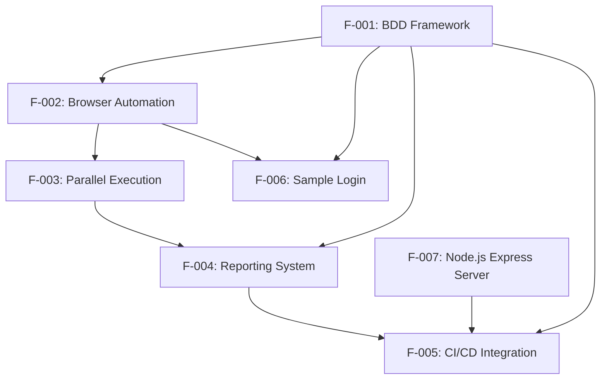
```mermaid
graph TD
    F001[F-001: BDD Framework] --> F002[F-002: Browser Automation]
    F001 --> F006[F-006: Sample Login]
    F002 --> F003[F-003: Parallel Execution]
    F002 --> F006
    F001 --> F004[F-004: Reporting System]
    F003 --> F004
    F001 --> F005[F-005: CI/CD Integration]
    F004 --> F005
    F007[F-007: Node.js Express Server] --> F005
```

### 2.3.2 Integration Points

| **Feature Pair** | **Integration Type** | **Shared Components** | **Dependencies** |
|------------------|---------------------|---------------------|------------------|
| F-001 ↔ F-002 | Direct Integration | Step Definitions, WebDriver | F-001 prerequisite for F-002 |
| F-002 ↔ F-003 | Performance Enhancement | Browser Instances | F-002 prerequisite for F-003 |
| F-001 ↔ F-004 | Data Flow | Test Results, Execution Metadata | F-001 generates data for F-004 |
| F-004 ↔ F-005 | CI/CD Pipeline | Report Artifacts | F-004 provides input to F-005 |
| <span style="background-color: rgba(91, 57, 243, 0.2)">F-007 ↔ F-005</span> | <span style="background-color: rgba(91, 57, 243, 0.2)">Build & Deploy</span> | <span style="background-color: rgba(91, 57, 243, 0.2)">Jenkins Job, npm install</span> | <span style="background-color: rgba(91, 57, 243, 0.2)">Optional (future CI integration)</span> |

### 2.3.3 Common Services

- **Maven Build System**: Shared across all features for dependency management and build orchestration
- **JUnit Test Framework**: Common test lifecycle management for F-001, F-002, F-003
- **Configuration Management**: Shared configuration through CukesRunner and Maven settings
- **Error Handling**: Common exception handling and logging across all features

<span style="background-color: rgba(91, 57, 243, 0.2)">**Note**: F-007 (Node.js Express Server) operates independently with its own npm-based dependency management and does not currently share common services with the Java-based testing framework components.</span>

## 2.4 IMPLEMENTATION CONSIDERATIONS

### 2.4.1 Technical Constraints

| **Feature** | **Constraints** | **Mitigation Strategies** |
|-------------|----------------|--------------------------|
| F-001 | Cucumber version compatibility | Use specified versions: 7.2.3/7.3.4 |
| F-002 | Browser driver dependencies | Implement WebDriverManager 5.1.0 |
| F-003 | System resource limitations | Configure thread limits based on available cores |
| F-004 | File system permissions | Ensure write access to report output directories |
| F-005 | Jenkins plugin compatibility | Use compatible Cucumber Reports plugin versions |
| <span style="background-color: rgba(91, 57, 243, 0.2)">F-007</span> | <span style="background-color: rgba(91, 57, 243, 0.2)">Node.js 14+ runtime & Express 4.x required; keep under 50 LOC; CommonJS modules</span> | <span style="background-color: rgba(91, 57, 243, 0.2)">Enforce Node version via nvmrc; lint LOC in code-review</span> |

### 2.4.2 Performance Requirements

**F-001 (BDD Framework)**
- Feature file parsing: < 100ms per file
- Step definition resolution: < 50ms per step
- Memory usage: < 512MB for framework overhead

**F-002 (Browser Automation)**
- Browser initialization: < 5 seconds
- Page load timeout: Configurable (default 30 seconds)
- Element location: < 10 seconds maximum wait

**F-003 (Parallel Execution)**
- Execution time reduction: Minimum 50% improvement
- Thread overhead: < 50MB per parallel thread
- Resource contention: Zero deadlocks or race conditions

**F-004 (Reporting System)**
- Report generation: < 30 seconds post-execution
- Screenshot capture: < 2 seconds per screenshot
- File size limits: HTML reports < 10MB

**<span style="background-color: rgba(91, 57, 243, 0.2)">F-007 (Node.js Server)</span>**
- <span style="background-color: rgba(91, 57, 243, 0.2)">Server start-up time: <1 second</span>
- <span style="background-color: rgba(91, 57, 243, 0.2)">Response latency: <500 ms for GET endpoints</span>
- <span style="background-color: rgba(91, 57, 243, 0.2)">Memory footprint: <128 MB idle</span>

### 2.4.3 Scalability Considerations

- **Test Suite Growth**: Framework shall support up to 1000 test scenarios without performance degradation
- **Parallel Execution**: Configurable thread pools based on available system resources
- **Report Storage**: Implement report rotation and cleanup policies for long-term usage
- **Browser Resource Management**: Efficient browser instance lifecycle management

### 2.4.4 Security Implications

- **Test Data Security**: No hardcoded credentials or sensitive data in feature files
- **Browser Security**: Use secure browser driver downloads through WebDriverManager
- **Report Security**: Ensure test reports do not expose sensitive application data
- **CI/CD Security**: Secure Jenkins integration with appropriate authentication
- <span style="background-color: rgba(91, 57, 243, 0.2)">**Node.js Dependency Security**: Regular `npm audit` to address vulnerabilities in Express or transitive packages.</span>

### 2.4.5 Maintenance Requirements

- **Dependency Management**: Regular updates to Maven dependencies for security patches
- **Browser Compatibility**: Periodic updates to support new browser versions
- **Framework Updates**: Quarterly reviews of Cucumber and Selenium framework versions
- **Documentation**: Maintain README.md and technical specifications with each release
- <span style="background-color: rgba(91, 57, 243, 0.2)">**Node Package Updates**: Review Express and Node LTS versions quarterly; update .gitignore for node_modules and npm-debug.log.</span>

## 2.5 TRACEABILITY MATRIX

| **Business Requirement** | **Feature ID** | **Functional Requirements** | **Test Scenarios** |
|-------------------------|----------------|---------------------------|-------------------|
| Accelerate development cycles | F-003, F-005 | F-003-RQ-001, F-005-RQ-001 | Parallel execution tests |
| Improve quality assurance | F-001, F-004 | F-001-RQ-001, F-004-RQ-001 | BDD test validation |
| Cross-browser compatibility | F-002 | F-002-RQ-001, F-002-RQ-002, F-002-RQ-003 | Multi-browser test suite |
| Comprehensive reporting | F-004 | F-004-RQ-001, F-004-RQ-002, F-004-RQ-003 | Report generation tests |
| <span style="background-color: rgba(91, 57, 243, 0.2)">Provide tutorial-level API sample</span> | <span style="background-color: rgba(91, 57, 243, 0.2)">F-007</span> | <span style="background-color: rgba(91, 57, 243, 0.2)">F-007-RQ-002, F-007-RQ-003</span> | <span style="background-color: rgba(91, 57, 243, 0.2)">Endpoint response verification</span> |

#### References

#### Files Examined
- `README.md` - Primary documentation with feature examples and setup instructions
- `pom.xml` - Maven configuration with dependencies and build settings
- `.gitignore` - Build artifact exclusion patterns for Java projects
- `.gitattributes` - Git configuration for HTML report handling
- <span style="background-color: rgba(91, 57, 243, 0.2)">`node-server/package.json` - Node.js server dependencies and project configuration</span>
- <span style="background-color: rgba(91, 57, 243, 0.2)">`node-server/server.js` - Express.js server implementation with API endpoints</span>
- Technical Specification Section 1.1 - Executive Summary and project context
- Technical Specification Section 1.2 - System Overview and technical architecture
- Technical Specification Section 1.3 - Project scope and implementation boundaries

#### Folders Explored
- Repository root - Configuration files and documentation
- `src` (planned structure) - Source code organization pattern
- `image` (referenced) - Documentation assets location
- <span style="background-color: rgba(91, 57, 243, 0.2)">`node-server/` - Node.js Express server component directory</span>

#### Web Research Conducted
- Testinium platform capabilities and integration features for comprehensive product context

# 3. TECHNOLOGY STACK

## 3.1 PROGRAMMING LANGUAGES

### 3.1.1 Primary Language Selection

**Java 8 (JDK 1.8+)**
- **Version**: JDK 1.8 or higher
- **Configuration**: Maven compiler source and target set to version 8
- **Justification**: Selenium 4 switched entirely to the official W3C WebDriver standard, eliminating inconsistencies between browsers where all browsers now understand and respond to WebDriver commands the same way. Java 8 provides stable platform support with excellent Selenium WebDriver compatibility and mature ecosystem support.
- **Environment Requirements**: 
  - JAVA_HOME environment variable pointing to JDK installation
  - Minimum JDK 1.8+ for framework compatibility
  - Java 11 will be the minimum version supported by Selenium as of September 30, 2023, indicating the framework may need future migration consideration

<span style="background-color: rgba(91, 57, 243, 0.2)">**JavaScript / Node.js (v14.x LTS or higher)**</span>
- <span style="background-color: rgba(91, 57, 243, 0.2)">**Version**: Node.js v14.x LTS or higher</span>
- <span style="background-color: rgba(91, 57, 243, 0.2)">**Configuration**: CommonJS module system with Express.js 4.x framework</span>
- <span style="background-color: rgba(91, 57, 243, 0.2)">**Justification**: Enables rapid development of lightweight REST API endpoints with Express.js providing superior routing capabilities and middleware ecosystem. Node.js LTS ensures long-term stability and security updates for the web server component.</span>
- <span style="background-color: rgba(91, 57, 243, 0.2)">**Environment Requirements**:</span>
  - <span style="background-color: rgba(91, 57, 243, 0.2)">NODE_VERSION ≥14.x, npm bundled</span>
  - <span style="background-color: rgba(91, 57, 243, 0.2)">NODE_HOME (optional) added to PATH</span>
  - <span style="background-color: rgba(91, 57, 243, 0.2)">Express.js ^4.18 framework dependency</span>
  - <span style="background-color: rgba(91, 57, 243, 0.2)">Code complexity constraint: maintain under 50 lines of code for server implementation</span>

### 3.1.2 Platform Constraints

**Language Selection Criteria:**
- **Thread Safety**: Required for parallel test execution at method level
- **Maven Ecosystem**: Full integration with Maven build system and dependency management
- **Selenium Compatibility**: Native binding support for WebDriver API
- **BDD Framework Support**: Cucumber-Java integration capabilities

<span style="background-color: rgba(91, 57, 243, 0.2)">**Architecture Isolation Requirements:**</span>
<span style="background-color: rgba(91, 57, 243, 0.2)">The Node.js layer is fully isolated under the `node-server/` directory to preserve existing Java-based automation framework functionality. This separation ensures that the Express.js web server component operates independently from the Maven build system and Cucumber test execution environment, maintaining clear separation of concerns between the test automation infrastructure and the demonstration web service capabilities.</span>

### 3.1.3 Technology Stack Integration

**Multi-Language Coordination:**
- **Java Component**: Handles BDD test automation, Selenium WebDriver operations, and Maven-based build processes
- **Node.js Component**: Provides Express.js-based REST API endpoints for tutorial demonstration purposes
- **Build Isolation**: Java uses Maven lifecycle, Node.js uses npm package management
- **Runtime Separation**: Both runtimes operate independently with no cross-language dependencies

**Version Compatibility Matrix:**

| Technology | Version | Compatibility Notes |
|-----------|---------|-------------------|
| Java JDK | 1.8+ | Primary runtime for test automation framework |
| Node.js | 14.x LTS+ | Isolated runtime for Express web server |
| Maven | 3.0.0-M5 | Java build system and dependency management |
| npm | Bundled with Node.js | Node.js package management |
| Express.js | ^4.18 | Web framework with routing and middleware |

## 3.2 FRAMEWORKS & LIBRARIES

### 3.2.1 Core Test Automation Framework

**Selenium WebDriver 3.141.59**
- **Current Status**: Latest Selenium version is 4.34.0, but framework uses stable 3.141.59 (last Selenium 3.x release)
- **Functionality**: Browser automation and web element interaction
- **Migration Consideration**: Selenium 4 provides W3C standard compliance and improved consistency
- **Browser Support**: Chrome, Firefox, Internet Explorer through WebDriver bindings
- **Integration**: Core dependency for all browser automation functionality

**WebDriverManager 5.1.0**
- **Purpose**: Automated browser driver management
- **Functionality**: Eliminates manual ChromeDriver and GeckoDriver installation
- **Version Compatibility**: Compatible with Selenium 3.141.59
- **Benefits**: Simplified environment setup and CI/CD integration

### 3.2.2 BDD Testing Framework

**Cucumber BDD Framework 7.2.3**
- **Components**: 
  - cucumber-java: 7.2.3 (step definition implementation)
  - cucumber-junit: 7.2.3 and 7.3.4 (JUnit integration with duplicate entry in pom.xml)
- **Current Version Context**: Current Cucumber version is 7.23.0, but 7.2.3 remains within the same major version
- **Gherkin Support**: Feature file parsing with Given-When-Then syntax
- **Integration Requirements**: Seamless JUnit test runner integration through CukesRunner

**JUnit 4.13.2**
- **Role**: Test lifecycle management and assertion framework
- **Parallel Execution**: Method-level parallelization support through Maven Surefire
- **Integration**: Primary test execution engine for Cucumber scenarios
- **Configuration**: Unlimited thread configuration for optimal performance

### 3.2.3 Supporting Libraries

**JavaFaker 1.0.2**
- **Purpose**: Test data generation and randomization
- **Use Cases**: Dynamic test data creation for realistic test scenarios
- **Integration**: Seamless Java object generation for test automation

**Cucumber Reporting Plugin 7.2.0**
- **Package**: `me.jvt.cucumber:reporting-plugin`
- **Output**: PrettyReports format generation
- **Integration**: Automated report generation post-execution

### 3.2.5 Node.js Express Server Implementation (Operational)

**Express.js REST Server - Current Implementation Status**
The Testinium-QA framework includes a fully operational Node.js Express server component that demonstrates RESTful API capabilities alongside the Java-based test automation framework. This component is complete and functional with both endpoints operational.

**Server Implementation Details (Source: `/node-server/server.js`):**
- **Framework**: Express.js 4.18.0+ (Source: `/node-server/package.json:24`)
- **Runtime**: Node.js 14.0.0+ as specified in engines (Source: `/node-server/package.json:20-22`)
- **Architecture**: Independent server process isolated from Java components
- **Port Configuration**: Environment variable PORT with fallback to 3000 (Source: `/node-server/server.js:10`)

**Operational REST Endpoints:**
1. **GET /** (Source: `/node-server/server.js:13-15`)
   - **Response**: "Hello world" (plain text)
   - **Status**: Fully operational
   - **Purpose**: Primary health check and demonstration endpoint

2. **GET /evening** (Source: `/node-server/server.js:18-20`)
   - **Response**: "Good evening" (plain text)  
   - **Status**: Fully operational
   - **Purpose**: Secondary demonstration endpoint

**Server Features (Source: `/node-server/server.js:23-28`):**
- **Startup Logging**: Console confirmation with port and endpoint details
- **Error Handling**: Express.js built-in error handling capabilities
- **Request Processing**: Standard Express.js routing and middleware support
- **Development Support**: npm start script for easy server launching (Source: `/node-server/package.json:6-8`)

**Integration Context:**
- **Independent Operation**: Server operates independently from Java test framework
- **No Cross-Communication**: No direct integration between Node.js and Java components  
- **Repository Cohesion**: Both components coexist in unified repository structure
- **CI/CD Support**: Both technology stacks supported in build pipeline configurations

### 3.2.4 Node.js Web Server Framework – Express.js (Implemented)

**Express.js 4.18.0+ (Fully Operational)**
- **Current Version**: ^4.18.0 as specified in `node-server/package.json` (Source: `/node-server/package.json:24`)
- **Implementation Status**: Complete and operational with all endpoints fully functional
- **Purpose**: HTTP routing and middleware management for RESTful API endpoints
- **Core Functionality**:
  - Superior routing capabilities compared to native Node.js HTTP module
  - Middleware ecosystem for request/response processing  
  - Simplified HTTP server implementation and endpoint management
- **Architecture Integration**: Isolated in `node-server/` directory with independent npm package management
- **Current Implementation**: Fully operational server hosting two REST endpoints (Source: `/node-server/server.js:13-20`):
  - `GET /` → Returns "Hello world" response (Source: `/node-server/server.js:13-15`)
  - `GET /evening` → Returns "Good evening" response (Source: `/node-server/server.js:18-20`)
- **Production Readiness**: Framework provides production-grade features including error handling, request parsing, and security middleware support
- **Compatibility**: Requires Node.js 14.x LTS or higher for optimal performance and security compliance
- **Startup Configuration**: Server configured with environment-based port binding (Source: `/node-server/server.js:10`) with default port 3000

**Supporting Node.js Dependencies**
- <span style="background-color: rgba(91, 57, 243, 0.2)">**Runtime Environment**: Node.js v14.x LTS+ with npm package manager</span>
- <span style="background-color: rgba(91, 57, 243, 0.2)">**Module System**: CommonJS implementation with require() syntax</span>
- <span style="background-color: rgba(91, 57, 243, 0.2)">**Development Approach**: Minimalist server implementation under 50 lines of code constraint</span>
- <span style="background-color: rgba(91, 57, 243, 0.2)">**Build Separation**: Independent npm lifecycle separate from Maven-based Java components</span>

## 3.3 OPEN SOURCE DEPENDENCIES

### 3.3.1 Maven Dependency Management

**Core Dependencies (from pom.xml):**

```xml
<dependencies>
    <!-- Selenium WebDriver Framework -->
    <dependency>
        <groupId>org.seleniumhq.selenium</groupId>
        <artifactId>selenium-java</artifactId>
        <version>3.141.59</version>
    </dependency>
    
    <!-- Automated Driver Management -->
    <dependency>
        <groupId>io.github.bonigarcia</groupId>
        <artifactId>webdrivermanager</artifactId>
        <version>5.1.0</version>
    </dependency>
    
    <!-- BDD Framework Components -->
    <dependency>
        <groupId>io.cucumber</groupId>
        <artifactId>cucumber-java</artifactId>
        <version>7.2.3</version>
    </dependency>
    
    <dependency>
        <groupId>io.cucumber</groupId>
        <artifactId>cucumber-junit</artifactId>
        <version>7.2.3</version>
    </dependency>
    
    <!-- Test Framework -->
    <dependency>
        <groupId>junit</groupId>
        <artifactId>junit</artifactId>
        <version>4.13.2</version>
        <scope>test</scope>
    </dependency>
    
    <!-- Test Data Generation -->
    <dependency>
        <groupId>com.github.javafaker</groupId>
        <artifactId>javafaker</artifactId>
        <version>1.0.2</version>
    </dependency>
    
    <!-- Enhanced Reporting -->
    <dependency>
        <groupId>me.jvt.cucumber</groupId>
        <artifactId>reporting-plugin</artifactId>
        <version>7.2.0</version>
    </dependency>
</dependencies>
```

### 3.3.2 Node.js Dependency Management (updated)

<span style="background-color: rgba(91, 57, 243, 0.2)">**Core Dependencies (from package.json):**</span>

```json
{
  "name": "node-server",
  "version": "1.0.0",
  "description": "Express.js web server for tutorial demonstration",
  "main": "server.js",
  "dependencies": {
    "express": "^4.21.2"
  },
  "engines": {
    "node": ">=14.x"
  }
}
```

<span style="background-color: rgba(91, 57, 243, 0.2)">**Primary Framework Dependency:**</span>
- <span style="background-color: rgba(91, 57, 243, 0.2)">**Express.js ^4.21.2**: Fast, unopinionated, minimalist web framework for Node.js</span>
  - <span style="background-color: rgba(91, 57, 243, 0.2)">**Functionality**: HTTP routing, middleware management, and RESTful API endpoint creation</span>
  - <span style="background-color: rgba(91, 57, 243, 0.2)">**Version Rationale**: Latest stable 4.x release providing production-ready features while avoiding Express v5.0 beta dependencies</span>
  - <span style="background-color: rgba(91, 57, 243, 0.2)">**Compatibility**: Requires Node.js 14.x LTS or higher for optimal security and performance</span>
  - <span style="background-color: rgba(91, 57, 243, 0.2)">**Security**: Includes latest security patches and vulnerability mitigations</span>

<span style="background-color: rgba(91, 57, 243, 0.2)">**Runtime Requirements:**</span>
- <span style="background-color: rgba(91, 57, 243, 0.2)">**Node.js Runtime**: v14.x LTS minimum (v18.x LTS recommended for production)</span>
- <span style="background-color: rgba(91, 57, 243, 0.2)">**Package Manager**: npm (bundled with Node.js installation)</span>
- <span style="background-color: rgba(91, 57, 243, 0.2)">**Module System**: CommonJS with require() syntax for dependency management</span>

### 3.3.3 Package Registry Configuration

**Maven Central Repository**
- **Primary Source**: All Java dependencies resolved from Maven Central
- **Security**: Official package verification and signing
- **Availability**: 99.9% uptime for dependency resolution
- **Version Management**: Semantic versioning compliance

<span style="background-color: rgba(91, 57, 243, 0.2)">**npm Registry Configuration**</span>
- <span style="background-color: rgba(91, 57, 243, 0.2)">**Primary Source**: Node.js dependencies resolved from official npm registry (registry.npmjs.org)</span>
- <span style="background-color: rgba(91, 57, 243, 0.2)">**Package Verification**: Automated security scanning and vulnerability detection</span>
- <span style="background-color: rgba(91, 57, 243, 0.2)">**Registry Isolation**: Completely separate from Maven Central to maintain architectural separation</span>
- <span style="background-color: rgba(91, 57, 243, 0.2)">**Version Management**: Semantic versioning with caret (^) notation for compatible updates</span>
- <span style="background-color: rgba(91, 57, 243, 0.2)">**Global Availability**: Over 91,000 projects in the npm registry utilize Express.js, ensuring robust ecosystem support</span>

### 3.3.4 Dependency Lock Files and Reproducible Builds (updated)

**Maven Dependency Resolution:**
- **Dependency Resolution**: Maven's dependency resolution mechanism ensures consistent builds across environments
- **Version Locking**: Explicit version declarations in pom.xml prevent version drift
- **Build Reproducibility**: Maven Wrapper ensures consistent Maven version across development teams

<span style="background-color: rgba(91, 57, 243, 0.2)">**Node.js Dependency Resolution:**</span>
- <span style="background-color: rgba(91, 57, 243, 0.2)">**Package-lock.json**: Automatically generated dependency lock file ensuring exact version reproducibility</span>
- <span style="background-color: rgba(91, 57, 243, 0.2)">**Version Control**: package-lock.json will be committed to source control for reproducible Node.js builds across all environments</span>
- <span style="background-color: rgba(91, 57, 243, 0.2)">**Build Consistency**: Lock file guarantees identical dependency tree resolution on development, testing, and deployment environments</span>
- <span style="background-color: rgba(91, 57, 243, 0.2)">**Security Benefits**: Provides cryptographic integrity verification for all installed packages</span>

### 3.3.5 Architecture Separation and Dependency Isolation

**Dual-Stack Dependency Management:**
- **Java Component**: Maven-managed dependencies isolated to root project directory
- **Node.js Component**: npm-managed dependencies isolated to `node-server/` subdirectory
- **Build System Isolation**: No cross-dependencies between Maven and npm package management systems
- **Runtime Separation**: Each technology stack operates with independent dependency resolution

**Integration Strategy:**
- **Clear Boundaries**: Express.js web server functionality completely separate from Selenium test automation framework
- **Independent Versioning**: Java and Node.js components maintain separate semantic versions and update cycles
- **Deployment Flexibility**: Components can be deployed and scaled independently based on system requirements
- **Development Workflow**: Developers can work on either component without requiring knowledge of the alternate technology stack

## 3.4 THIRD-PARTY SERVICES

### 3.4.1 Version Control and Collaboration

**GitHub Repository Integration**
- **Repository**: `https://github.com/BalamiRR/Testinium-QA.git`
- **Purpose**: Source code management and collaboration
- **Integration**: Git-based workflow with CI/CD pipeline triggers
- **Access Control**: Public repository with open-source template access

### 3.4.2 Continuous Integration Services (updated)

**Jenkins CI Server**
- **Integration**: Cucumber Reports plugin for test result visualization
- **Build Automation**: <span style="background-color: rgba(91, 57, 243, 0.2)">Dual-technology build pipeline execution supporting both Maven and Node.js workflows</span>
- **Report Integration**: HTML and JSON report processing and display
- **Parallel Execution**: Support for distributed test execution

<span style="background-color: rgba(91, 57, 243, 0.2)">**Node.js Build Stage Configuration**</span>
- <span style="background-color: rgba(91, 57, 243, 0.2)">**Runtime Requirements**: Install Node.js 14.x LTS on build agent if not present</span>
  - <span style="background-color: rgba(91, 57, 243, 0.2)">Agent verification: Check for Node.js availability using `node --version`</span>
  - <span style="background-color: rgba(91, 57, 243, 0.2)">Conditional installation: Automated Node.js 14.x setup for missing runtime environments</span>
- <span style="background-color: rgba(91, 57, 243, 0.2)">**Dependency Installation**: Execute `npm ci --prefix node-server` prior to Maven build phases</span>
  - <span style="background-color: rgba(91, 57, 243, 0.2)">Clean installation process using package-lock.json for reproducible builds</span>
  - <span style="background-color: rgba(91, 57, 243, 0.2)">Isolated dependency management in `node-server/` directory structure</span>
  - <span style="background-color: rgba(91, 57, 243, 0.2)">Express.js ^4.21.2 framework installation and security verification</span>
- <span style="background-color: rgba(91, 57, 243, 0.2)">**Optional Smoke Testing**: Background server execution using `node node-server/server.js &`</span>
  - <span style="background-color: rgba(91, 57, 243, 0.2)">Endpoint validation for demonstration REST APIs (`/` and `/evening` routes)</span>
  - <span style="background-color: rgba(91, 57, 243, 0.2)">Non-blocking background process for build pipeline integration</span>
  - <span style="background-color: rgba(91, 57, 243, 0.2)">Basic connectivity verification ensuring Express.js server startup success</span>

**Maven Build Integration**
- **Java Component Processing**: Standard Maven lifecycle execution following Node.js dependency resolution
- **Build Sequence**: Node.js setup → npm dependencies → Maven compile → test execution → reporting
- **Isolation Strategy**: Independent build phases prevent cross-technology dependency conflicts
- **Pipeline Efficiency**: Parallel processing capabilities for both technology stacks

**Multi-Technology Build Pipeline Architecture**
- **Technology Separation**: Clear boundaries between Node.js Express server and Java Selenium automation framework
- **Build Agent Requirements**: Support for both JDK 1.8+ and Node.js 14.x LTS runtime environments
- **Artifact Management**: Independent artifact generation for Java (JAR/reports) and Node.js (server deployment) components
- **Failure Isolation**: Component-specific build failure handling without cross-stack impact

### 3.4.3 Test Management Integration

**Jira Software Integration**
- **Purpose**: Test case management and defect tracking
- **Functionality**: Integration with test execution results and reporting
- **Workflow**: Automated test result updates and traceability
- **Documentation**: Visual integration guides available in `image/` directory

### 3.4.4 Platform Services

**Testinium Platform**
- **Role**: Target platform for automation demonstration
- **Integration**: Framework template designed for Testinium platform testing
- **Context**: Business platform providing automation testing capabilities

## 3.5 DEVELOPMENT & DEPLOYMENT

### 3.5.1 Build System Configuration

**Apache Maven 3.0.0-M5**
- **Project Structure**: Standard Maven directory layout
- **Coordinates**: `org.example:testinium-qa:1.0-SNAPSHOT`
- **POM Model**: Version 4.0.0 with complete dependency management
- **Environment Requirement**: MAVEN_HOME or mvn on system PATH

**Maven Surefire Plugin 3.0.0-M5**
- **Parallel Execution**: Method-level parallelization with unlimited threads
- **Test Pattern**: `**/CukesRunner*.java` for test discovery
- **Failure Handling**: Test failure ignore enabled for comprehensive reporting
- **Performance**: Optimized for multi-core system architecture

<span style="background-color: rgba(91, 57, 243, 0.2)">**Node.js Build Configuration**</span>
- <span style="background-color: rgba(91, 57, 243, 0.2)">**Project Initialization**: `npm init -y` (executed once for initial setup)</span>
- <span style="background-color: rgba(91, 57, 243, 0.2)">**Express Dependency**: `npm install express --save` for web server framework</span>
- <span style="background-color: rgba(91, 57, 243, 0.2)">**Package Management**: package.json with Express ^4.18+ dependency configuration</span>
- <span style="background-color: rgba(91, 57, 243, 0.2)">**Build Isolation**: Independent npm workspace under `node-server/` directory</span>

<span style="background-color: rgba(91, 57, 243, 0.2)">**Concurrent Build Operations (updated)**</span>
- <span style="background-color: rgba(91, 57, 243, 0.2)">**Java Test Execution**: `mvn test` for BDD automation framework</span>
- <span style="background-color: rgba(91, 57, 243, 0.2)">**Node Server Launch**: `npm run start` for Express.js web server component</span>
- <span style="background-color: rgba(91, 57, 243, 0.2)">**Independent Runtimes**: Both systems operate concurrently without conflicts</span>

### 3.5.2 Development Environment

**IntelliJ IDEA (Recommended IDE)**
- **Required Plugins**: Maven integration and Cucumber for Java
- **Configuration**: Project SDK set to JDK 1.8+
- **Integration**: Native support for Maven project structure and Cucumber syntax

<span style="background-color: rgba(91, 57, 243, 0.2)">**Visual Studio Code (Optional Alternative)**</span>
- <span style="background-color: rgba(91, 57, 243, 0.2)">**JavaScript/TypeScript Support**: Built-in syntax highlighting and IntelliSense</span>
- <span style="background-color: rgba(91, 57, 243, 0.2)">**Node.js Integration**: Integrated terminal and npm script execution</span>
- <span style="background-color: rgba(91, 57, 243, 0.2)">**Extensions**: ESLint, Prettier, and Node.js modules support</span>

**Browser Driver Management**
- **ChromeDriver**: Automated management through WebDriverManager
- **GeckoDriver**: Firefox automation support with automated installation
- **PATH Configuration**: Alternative manual driver management if needed

<span style="background-color: rgba(91, 57, 243, 0.2)">**Node.js Runtime Prerequisites (updated)**</span>
- <span style="background-color: rgba(91, 57, 243, 0.2)">**Node.js Version**: v14.x LTS or higher (v18.x LTS recommended)</span>
- <span style="background-color: rgba(91, 57, 243, 0.2)">**Package Manager**: npm (bundled with Node.js installation)</span>
- <span style="background-color: rgba(91, 57, 243, 0.2)">**Environment Variables**: NODE_HOME (optional) added to system PATH</span>
- <span style="background-color: rgba(91, 57, 243, 0.2)">**Verification**: `node --version` and `npm --version` commands functional</span>

### 3.5.3 Deployment Architecture

**Report Generation System**
- **HTML Reports**: `target/cucumber-reports.html` for web-based viewing
- **JSON Reports**: `target/cucumber.json` for programmatic processing
- **Rerun Files**: `target/rerun.txt` for failed test re-execution
- **PrettyReports**: `target/cucumber` for enhanced visualization

**Parallel Execution Infrastructure**
- **Thread Management**: Unlimited thread configuration for optimal resource utilization
- **Resource Requirements**: Multi-core system architecture for performance optimization
- **File System**: Write permissions required for report generation and screenshot capture

<span style="background-color: rgba(91, 57, 243, 0.2)">**Local Node.js Server Deployment (updated)**</span>
- <span style="background-color: rgba(91, 57, 243, 0.2)">**Launch Command**: `node node-server/server.js` from project root directory</span>
- <span style="background-color: rgba(91, 57, 243, 0.2)">**Server Startup**: Express application starts on configured port (default: 3000)</span>
- <span style="background-color: rgba(91, 57, 243, 0.2)">**Process Management**: Manual start/stop for development and testing</span>

<span style="background-color: rgba(91, 57, 243, 0.2)">**Endpoint Verification Protocol**</span>
- <span style="background-color: rgba(91, 57, 243, 0.2)">**Primary Endpoint**: `GET /` → Response: "Hello world" (HTTP 200)</span>
- <span style="background-color: rgba(91, 57, 243, 0.2)">**Secondary Endpoint**: `GET /evening` → Response: "Good evening" (HTTP 200)</span>
- <span style="background-color: rgba(91, 57, 243, 0.2)">**Testing Methods**: Browser navigation, curl commands, or HTTP client tools</span>
- <span style="background-color: rgba(91, 57, 243, 0.2)">**Expected Behavior**: Immediate text response without HTML formatting</span>

### 3.5.4 Integration Architecture (updated)

<span style="background-color: rgba(91, 57, 243, 0.2)">**Multi-Runtime Coordination**</span>
- <span style="background-color: rgba(91, 57, 243, 0.2)">**Java Component**: Maintains Maven lifecycle independence for test automation framework</span>
- <span style="background-color: rgba(91, 57, 243, 0.2)">**Node.js Component**: Operates in isolated `node-server/` directory with separate dependency management</span>
- <span style="background-color: rgba(91, 57, 243, 0.2)">**Build Separation**: No cross-language dependencies or shared build artifacts</span>
- <span style="background-color: rgba(91, 57, 243, 0.2)">**Runtime Isolation**: Both Java and Node.js runtimes execute independently on different ports and processes</span>

<span style="background-color: rgba(91, 57, 243, 0.2)">**Development Workflow Integration**</span>
- <span style="background-color: rgba(91, 57, 243, 0.2)">**Concurrent Development**: Developers can work on Java test automation while Node.js server runs independently</span>
- <span style="background-color: rgba(91, 57, 243, 0.2)">**Resource Management**: Separate memory allocation and CPU utilization for each runtime</span>
- <span style="background-color: rgba(91, 57, 243, 0.2)">**Port Configuration**: Java test framework uses default system ports, Node.js server configurable port assignment</span>

## 3.6 INTEGRATION ARCHITECTURE

### 3.6.1 Component Integration Map (updated)

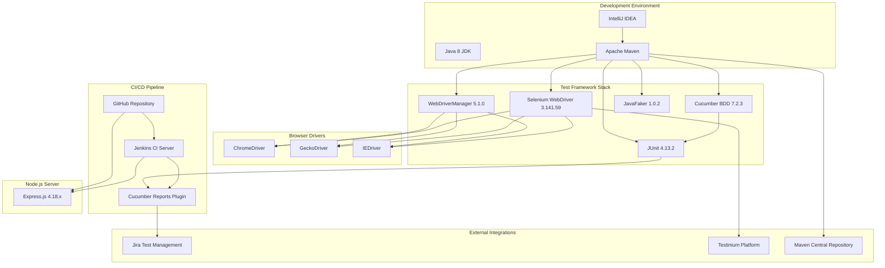
```mermaid
graph TB
    subgraph "Development Environment"
        IDE[IntelliJ IDEA]
        JDK[Java 8 JDK]
        Maven[Apache Maven]
    end
    
    subgraph "Test Framework Stack"
        Selenium[Selenium WebDriver 3.141.59]
        Cucumber[Cucumber BDD 7.2.3]
        JUnit[JUnit 4.13.2]
        WDM[WebDriverManager 5.1.0]
        Faker[JavaFaker 1.0.2]
    end
    
    subgraph "Browser Drivers"
        Chrome[ChromeDriver]
        Firefox[GeckoDriver]
        IE[IEDriver]
    end
    
    subgraph "CI/CD Pipeline"
        Jenkins[Jenkins CI Server]
        GitHub[GitHub Repository]
        Reports[Cucumber Reports Plugin]
    end
    
    subgraph "Node.js Server"
        Express[Express.js 4.18.x]
    end
    
    subgraph "External Integrations"
        Jira[Jira Test Management]
        Testinium[Testinium Platform]
        MavenCentral[Maven Central Repository]
    end
    
    IDE --> Maven
    Maven --> Selenium
    Maven --> Cucumber
    Maven --> JUnit
    Maven --> WDM
    Maven --> Faker
    
    WDM --> Chrome
    WDM --> Firefox
    WDM --> IE
    
    Selenium --> Chrome
    Selenium --> Firefox
    Selenium --> IE
    
    Cucumber --> JUnit
    JUnit --> Reports
    
    GitHub --> Jenkins
    GitHub --> Express
    Jenkins --> Reports
    Jenkins --> Express
    Reports --> Jira
    
    Maven --> MavenCentral
    Selenium --> Testinium
```

### 3.6.2 Version Compatibility Matrix (updated)

| Component | Current Version | Framework Version | Compatibility Status | Migration Path |
|-----------|-----------------|-------------------|----------------------|----------------|
| Selenium WebDriver | 4.34.0 | 3.141.59 | Stable Legacy | Consider Selenium 4 upgrade |
| Cucumber Java | 7.23.0 | 7.2.3 | Compatible | Minor version update available |
| JUnit | 5.x | 4.13.2 | Stable | JUnit 5 migration consideration |
| Maven Surefire | 3.2.5 | 3.0.0-M5 | Compatible | Stable milestone version |
| Java Platform | 21 LTS | 8 | Legacy Support | Java 11+ migration recommended |
| <span style="background-color: rgba(91, 57, 243, 0.2)">Node.js Runtime</span> | <span style="background-color: rgba(91, 57, 243, 0.2)">20.x</span> | <span style="background-color: rgba(91, 57, 243, 0.2)">14.x+</span> | <span style="background-color: rgba(91, 57, 243, 0.2)">LTS Recommended</span> | <span style="background-color: rgba(91, 57, 243, 0.2)">Node.js 20.x LTS provides optimal stability</span> |
| <span style="background-color: rgba(91, 57, 243, 0.2)">Express.js</span> | <span style="background-color: rgba(91, 57, 243, 0.2)">4.18.x</span> | <span style="background-color: rgba(91, 57, 243, 0.2)">4.18.x</span> | <span style="background-color: rgba(91, 57, 243, 0.2)">Stable</span> | <span style="background-color: rgba(91, 57, 243, 0.2)">Current major version with security updates</span> |

### 3.6.3 Architecture Independence Model (updated)

<span style="background-color: rgba(91, 57, 243, 0.2)">The Node.js layer operates completely independently from the existing Java interaction paths, maintaining strict architectural separation per the system's dual-technology design. This independence ensures that:</span>

**Runtime Isolation**
- <span style="background-color: rgba(91, 57, 243, 0.2)">Java Maven lifecycle executes autonomously without Node.js dependencies</span>
- <span style="background-color: rgba(91, 57, 243, 0.2)">Express.js server launches independently using separate process space</span>
- <span style="background-color: rgba(91, 57, 243, 0.2)">No cross-language dependencies or shared libraries between components</span>

**Build System Separation**
- Maven handles Java test automation framework compilation and execution
- npm manages Node.js package dependencies and Express.js server lifecycle
- <span style="background-color: rgba(91, 57, 243, 0.2)">Independent build artifacts with isolated deployment paths</span>

**Integration Boundaries**
- CI/CD pipeline (Jenkins/GitHub) orchestrates both technology stacks
- <span style="background-color: rgba(91, 57, 243, 0.2)">Node.js endpoints provide demonstration web service capabilities</span>
- Java components continue existing Selenium/Cucumber test automation workflows
- <span style="background-color: rgba(91, 57, 243, 0.2)">Zero impact on existing Java-based browser automation or BDD testing functionality</span>

#### References

**Repository Files Examined:**
- `pom.xml` - Complete Maven configuration with all dependencies and build settings
- `README.md` - Comprehensive project documentation with setup instructions and technology overview
- <span style="background-color: rgba(91, 57, 243, 0.2)">`node-server/package.json` - Node.js Express.js dependency configuration</span>
- <span style="background-color: rgba(91, 57, 243, 0.2)">`node-server/server.js` - Express.js web server implementation with REST endpoints</span>

**Technical Specification Sections Referenced:**
- `1.1 EXECUTIVE SUMMARY` - Project overview and business context
- `1.2 SYSTEM OVERVIEW` - High-level architecture and component integration
- `1.3 SCOPE` - In-scope and out-of-scope technology elements
- `2.1 FEATURE CATALOG` - Detailed feature descriptions and technical dependencies
- `2.2 FUNCTIONAL REQUIREMENTS TABLE` - Technical specifications and performance criteria
- `2.3 FEATURE RELATIONSHIPS` - Component integration and dependency mapping
- `2.4 IMPLEMENTATION CONSIDERATIONS` - Technical constraints and architecture requirements
- <span style="background-color: rgba(91, 57, 243, 0.2)">`3.1 PROGRAMMING LANGUAGES` - Multi-language architecture analysis and Node.js integration requirements</span>
- <span style="background-color: rgba(91, 57, 243, 0.2)">`3.5 DEVELOPMENT & DEPLOYMENT` - Dual-runtime deployment architecture and build system coordination</span>

**Web Research:**
- Selenium WebDriver current version verification and compatibility analysis
- Technology version currency assessment for framework modernization planning
- <span style="background-color: rgba(91, 57, 243, 0.2)">Node.js LTS version recommendations and Express.js stability analysis</span>

# 4. PROCESS FLOWCHART

## 4.1 SYSTEM WORKFLOWS

### 4.1.1 Core Business Processes (updated)

#### End-to-End Test Automation Journey

The Testinium-QA framework orchestrates a comprehensive test automation workflow that spans from feature definition to result reporting. This workflow supports multiple user personas including QA Engineers, Developers, and Business Stakeholders through a structured BDD approach.

**Primary User Journey Flow:**
1. **Test Specification Phase**: Business analysts and QA engineers collaborate to define test scenarios using Gherkin syntax in feature files
2. **Implementation Phase**: Developers create corresponding step definitions in Java that map to Gherkin steps
3. **Execution Phase**: Test runners execute scenarios across multiple browsers in parallel
4. **Validation Phase**: System validates application behavior against expected outcomes
5. **Reporting Phase**: Comprehensive reports are generated in multiple formats with screenshot evidence
6. **Integration Phase**: Results are integrated with CI/CD pipelines and test management systems

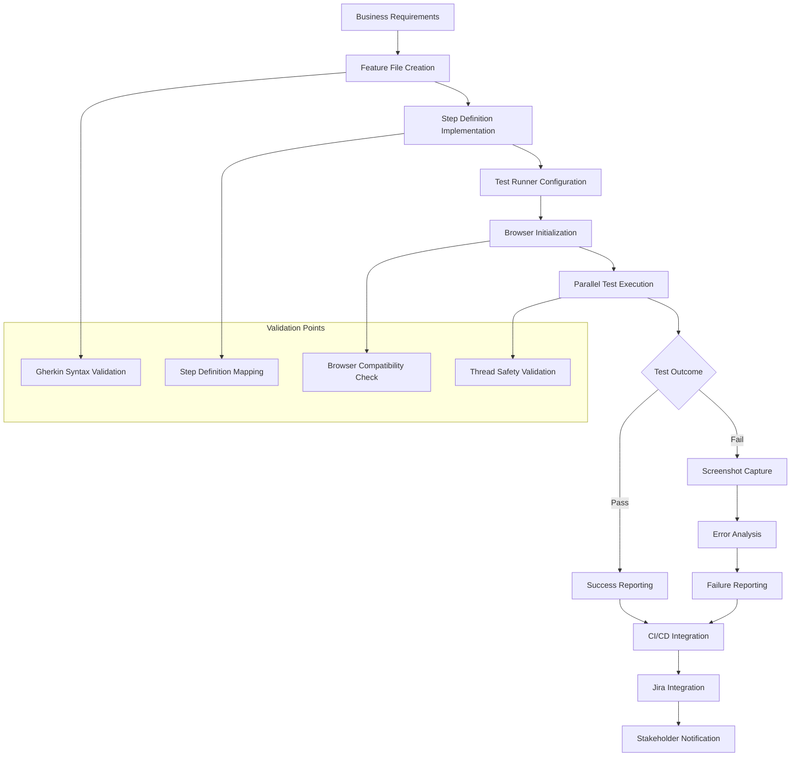
```mermaid
flowchart TD
    A[Business Requirements] --> B[Feature File Creation]
    B --> C[Step Definition Implementation]
    C --> D[Test Runner Configuration]
    D --> E[Browser Initialization]
    E --> F[Parallel Test Execution]
    F --> G{Test Outcome}
    G -->|Pass| H[Success Reporting]
    G -->|Fail| I[Screenshot Capture]
    I --> J[Error Analysis]
    J --> K[Failure Reporting]
    H --> L[CI/CD Integration]
    K --> L
    L --> M[Jira Integration]
    M --> N[Stakeholder Notification]
    
    subgraph "Validation Points"
        V1[Gherkin Syntax Validation]
        V2[Step Definition Mapping]
        V3[Browser Compatibility Check]
        V4[Thread Safety Validation]
    end
    
    B --> V1
    C --> V2
    E --> V3
    F --> V4
```

#### Sample Login Implementation Workflow

The framework includes a reference implementation demonstrating authentication testing patterns with comprehensive error handling and validation scenarios.

**Login Test Scenarios:**
- **UPGN-286**: Valid credential authentication flow
- **UPGN-287**: Invalid credential error handling
- **UPGN-288**: Empty field validation

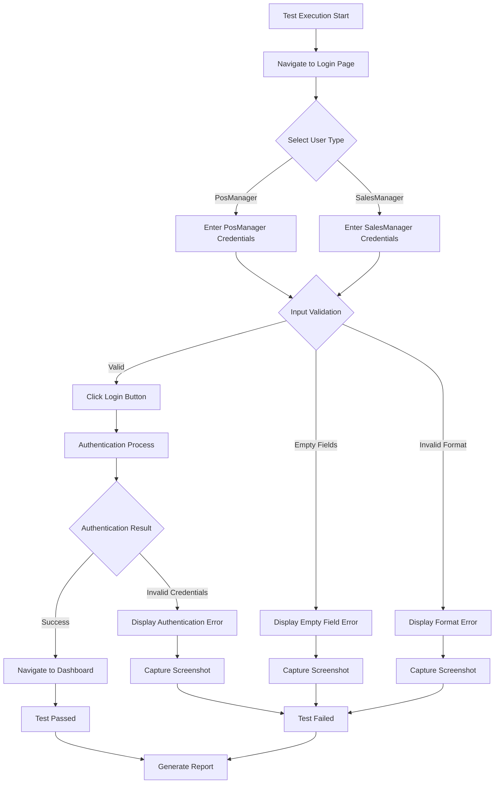
```mermaid
flowchart TD
    Start[Test Execution Start] --> LoginPage[Navigate to Login Page]
    LoginPage --> UserType{Select User Type}
    UserType -->|PosManager| PosCredentials[Enter PosManager Credentials]
    UserType -->|SalesManager| SalesCredentials[Enter SalesManager Credentials]
    
    PosCredentials --> ValidateInput{Input Validation}
    SalesCredentials --> ValidateInput
    
    ValidateInput -->|Valid| ClickLogin[Click Login Button]
    ValidateInput -->|Empty Fields| EmptyError[Display Empty Field Error]
    ValidateInput -->|Invalid Format| FormatError[Display Format Error]
    
    ClickLogin --> AuthProcess[Authentication Process]
    AuthProcess --> AuthResult{Authentication Result}
    
    AuthResult -->|Success| Dashboard[Navigate to Dashboard]
    AuthResult -->|Invalid Credentials| AuthError[Display Authentication Error]
    
    Dashboard --> TestPass[Test Passed]
    EmptyError --> Screenshot1[Capture Screenshot]
    FormatError --> Screenshot2[Capture Screenshot]
    AuthError --> Screenshot3[Capture Screenshot]
    
    Screenshot1 --> TestFail[Test Failed]
    Screenshot2 --> TestFail
    Screenshot3 --> TestFail
    
    TestPass --> Report[Generate Report]
    TestFail --> Report
```

## Node.js Server Workflow

<span style="background-color: rgba(91, 57, 243, 0.2)">The Node.js server component operates independently and in parallel to the Java-based Testinium-QA framework, establishing a multi-technology architecture within the same repository structure. This Express.js-based web server provides REST endpoint functionality while maintaining clear separation from the existing Java automation workflows. The server demonstrates fundamental web service patterns through simple GET endpoints that return predefined response messages.</span>

**Node.js Server Lifecycle Process:**
- **Project Initialization**: <span style="background-color: rgba(91, 57, 243, 0.2)">Setup Node.js project structure with npm init and package.json configuration</span>
- **Dependency Management**: <span style="background-color: rgba(91, 57, 243, 0.2)">Install Express.js framework via npm package manager</span>
- **Server Configuration**: <span style="background-color: rgba(91, 57, 243, 0.2)">Configure Express application with route handlers and middleware</span>
- **Endpoint Implementation**: <span style="background-color: rgba(91, 57, 243, 0.2)">Define GET routes for "/" and "/evening" paths with specified response messages</span>
- **Server Activation**: <span style="background-color: rgba(91, 57, 243, 0.2)">Start HTTP server on configured port and begin listening for requests</span>

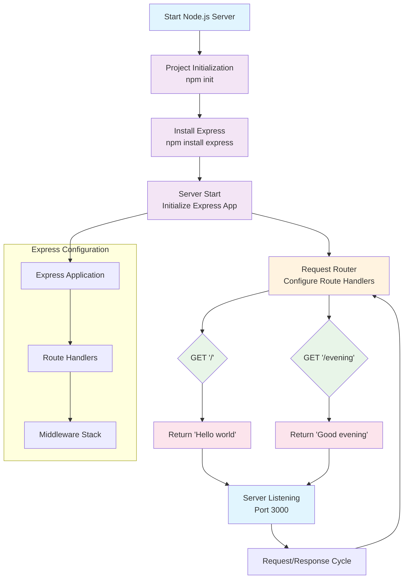
```mermaid
flowchart TD
    Start[Start Node.js Server] --> ProjectInit[Project Initialization<br/>npm init]
    ProjectInit --> InstallExpress[Install Express<br/>npm install express]
    InstallExpress --> ServerStart[Server Start<br/>Initialize Express App]
    ServerStart --> RequestRouter[Request Router<br/>Configure Route Handlers]
    
    RequestRouter --> RootRoute{GET '/'}
    RequestRouter --> EveningRoute{GET '/evening'}
    
    RootRoute --> HelloResponse[Return 'Hello world']
    EveningRoute --> EveningResponse[Return 'Good evening']
    
    HelloResponse --> ServerListening[Server Listening<br/>Port 3000]
    EveningResponse --> ServerListening
    
    ServerListening --> RequestCycle[Request/Response Cycle]
    RequestCycle --> RequestRouter
    
    subgraph "Express Configuration"
        ExpressApp[Express Application]
        RouteHandlers[Route Handlers]
        Middleware[Middleware Stack]
    end
    
    ServerStart --> ExpressApp
    ExpressApp --> RouteHandlers
    RouteHandlers --> Middleware
    
    style Start fill:#e1f5fe
    style ProjectInit fill:#f3e5f5
    style InstallExpress fill:#f3e5f5
    style ServerStart fill:#f3e5f5
    style RequestRouter fill:#fff3e0
    style RootRoute fill:#e8f5e8
    style EveningRoute fill:#e8f5e8
    style HelloResponse fill:#fce4ec
    style EveningResponse fill:#fce4ec
    style ServerListening fill:#e1f5fe
```

### 4.1.2 Integration Workflows

#### Maven Build and Dependency Resolution Flow

The framework leverages Maven for comprehensive build lifecycle management and dependency resolution from Maven Central repository.

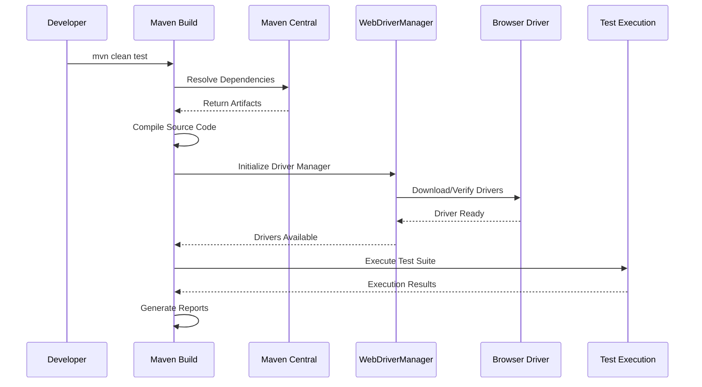
```mermaid
sequenceDiagram
    participant Dev as Developer
    participant Maven as Maven Build
    participant Central as Maven Central
    participant WDM as WebDriverManager
    participant Browser as Browser Driver
    participant Test as Test Execution
    
    Dev->>Maven: mvn clean test
    Maven->>Central: Resolve Dependencies
    Central-->>Maven: Return Artifacts
    Maven->>Maven: Compile Source Code
    Maven->>WDM: Initialize Driver Manager
    WDM->>Browser: Download/Verify Drivers
    Browser-->>WDM: Driver Ready
    WDM-->>Maven: Drivers Available
    Maven->>Test: Execute Test Suite
    Test-->>Maven: Execution Results
    Maven->>Maven: Generate Reports
```

#### CI/CD Pipeline Integration Flow

The framework integrates seamlessly with Jenkins CI/CD pipelines for automated test execution and result visualization.


```mermaid
flowchart LR
    subgraph "Source Control"
        GH[GitHub Repository]
        Webhook[GitHub Webhook]
    end
    
    subgraph "CI/CD Pipeline"
        Jenkins[Jenkins CI Server]
        Build[Maven Build Process]
        Test[Test Execution]
        Reports[Report Generation]
    end
    
    subgraph "Result Integration"
        CucumberReports[Cucumber Reports Plugin]
        Jira[Jira Test Management]
        Notifications[Team Notifications]
    end
    
    GH --> Webhook
    Webhook --> Jenkins
    Jenkins --> Build
    Build --> Test
    Test --> Reports
    Reports --> CucumberReports
    CucumberReports --> Jira
    Jira --> Notifications
```

## 4.2 FLOWCHART REQUIREMENTS

### 4.2.1 Process Steps and Decision Points (updated)

<span style="background-color: rgba(91, 57, 243, 0.2)">The framework orchestrates comprehensive process workflows that encompass both Java-based test automation execution paths and Node.js web server implementation, maintaining architectural independence while providing detailed decision points for each technology stack.</span>

#### High-Level System Workflow with Decision Points

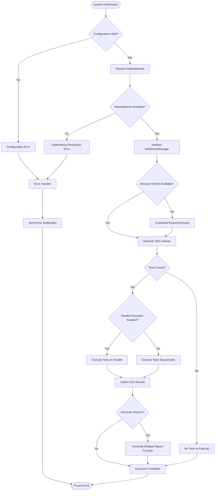
```mermaid
flowchart TD
    Start([System Initialization]) --> Config{Configuration Valid?}
    Config -->|No| ConfigError[Configuration Error]
    Config -->|Yes| Dependencies[Resolve Dependencies]
    
    Dependencies --> DepResult{Dependencies Available?}
    DepResult -->|No| DepError[Dependency Resolution Error]
    DepResult -->|Yes| DriverInit[Initialize WebDriverManager]
    
    DriverInit --> DriverCheck{Browser Drivers Available?}
    DriverCheck -->|No| DriverDownload[Download Required Drivers]
    DriverCheck -->|Yes| TestDiscovery[Discover Test Classes]
    DriverDownload --> TestDiscovery
    
    TestDiscovery --> TestCount{Tests Found?}
    TestCount -->|No| NoTests[No Tests to Execute]
    TestCount -->|Yes| ParallelConfig{Parallel Execution Enabled?}
    
    ParallelConfig -->|Yes| ParallelExec[Execute Tests in Parallel]
    ParallelConfig -->|No| SequentialExec[Execute Tests Sequentially]
    
    ParallelExec --> ResultCollection[Collect Test Results]
    SequentialExec --> ResultCollection
    
    ResultCollection --> ReportGen{Generate Reports?}
    ReportGen -->|Yes| MultiFormat[Generate Multiple Report Formats]
    ReportGen -->|No| Complete[Execution Complete]
    
    MultiFormat --> Complete
    
    ConfigError --> ErrorHandler[Error Handler]
    DepError --> ErrorHandler
    NoTests --> Complete
    ErrorHandler --> Notification[Send Error Notification]
    Notification --> End([Process End])
    Complete --> End
```

## Node.js Server Process Steps and Decision Points (updated)

<span style="background-color: rgba(91, 57, 243, 0.2)">The Node.js server implementation follows a structured initialization and configuration workflow that demonstrates the transition from native HTTP implementation to Express.js-based architecture for enhanced development experience and maintainability.</span>

**Detailed Implementation Steps:**

1. **<span style="background-color: rgba(91, 57, 243, 0.2)">Initialize Node.js Project Structure</span>**
   - <span style="background-color: rgba(91, 57, 243, 0.2)">Execute `npm init` to create package.json configuration</span>
   - <span style="background-color: rgba(91, 57, 243, 0.2)">Establish `node-server/` directory structure for architectural isolation</span>
   - <span style="background-color: rgba(91, 57, 243, 0.2)">Configure project metadata including name, version, and entry point specifications</span>

2. **<span style="background-color: rgba(91, 57, 243, 0.2)">HTTP Module Selection Decision Point</span>**
   - **<span style="background-color: rgba(91, 57, 243, 0.2)">Decision Criteria</span>**: Choose between Native HTTP module vs Express.js framework
   - **<span style="background-color: rgba(91, 57, 243, 0.2)">Native HTTP Branch</span>**: If Native HTTP is selected → Route to deprecation notice and migration recommendation
   - **<span style="background-color: rgba(91, 57, 243, 0.2)">Express.js Branch</span>**: If Express.js is selected → Continue with enhanced routing implementation
   - **<span style="background-color: rgba(91, 57, 243, 0.2)">Architectural Rationale</span>**: Express.js provides superior middleware ecosystem and simplified HTTP server management

3. **<span style="background-color: rgba(91, 57, 243, 0.2)">Express.js Dependency Installation</span>**
   - <span style="background-color: rgba(91, 57, 243, 0.2)">Execute `npm install express` to install Express.js framework (version ^4.18.0)</span>
   - <span style="background-color: rgba(91, 57, 243, 0.2)">Verify package.json dependencies reflect Express.js integration</span>
   - <span style="background-color: rgba(91, 57, 243, 0.2)">Initialize Express application instance for route configuration</span>

4. **<span style="background-color: rgba(91, 57, 243, 0.2)">Primary Endpoint Implementation</span>**
   - <span style="background-color: rgba(91, 57, 243, 0.2)">Define `GET '/'` route handler returning "Hello world" response message</span>
   - <span style="background-color: rgba(91, 57, 243, 0.2)">Configure HTTP 200 status code with plain text content-type</span>
   - <span style="background-color: rgba(91, 57, 243, 0.2)">Implement request/response processing through Express.js routing mechanism</span>

5. **<span style="background-color: rgba(91, 57, 243, 0.2)">Secondary Endpoint Implementation</span>**
   - <span style="background-color: rgba(91, 57, 243, 0.2)">Define `GET '/evening'` route handler returning "Good evening" response message</span>
   - <span style="background-color: rgba(91, 57, 243, 0.2)">Maintain consistent response structure with primary endpoint</span>
   - <span style="background-color: rgba(91, 57, 243, 0.2)">Ensure route isolation and independent response processing</span>

6. **<span style="background-color: rgba(91, 57, 243, 0.2)">Server Activation and Port Configuration</span>**
   - <span style="background-color: rgba(91, 57, 243, 0.2)">Configure server to listen on designated port (default: 3000)</span>
   - <span style="background-color: rgba(91, 57, 243, 0.2)">Initialize HTTP server instance through Express.js listen() method</span>
   - <span style="background-color: rgba(91, 57, 243, 0.2)">Enable request/response cycle for continuous endpoint availability</span>

**Node.js Server Decision Flow with Migration Logic:**

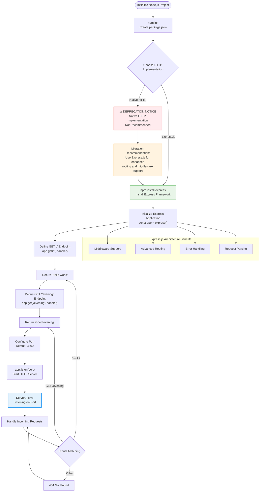
```mermaid
flowchart TD
    Start([Initialize Node.js Project]) --> NPMInit["npm init<br/>Create package.json"]
    NPMInit --> HTTPDecision{Choose HTTP Implementation}
    
    HTTPDecision -->|Native HTTP| DeprecationWarning["⚠️ DEPRECATION NOTICE<br/>Native HTTP Implementation<br/>Not Recommended"]
    HTTPDecision -->|Express.js| ExpressInstall["npm install express<br/>Install Express Framework"]
    
    DeprecationWarning --> MigrationNote["Migration Recommendation:<br/>Use Express.js for enhanced<br/>routing and middleware support"]
    MigrationNote --> ExpressInstall
    
    ExpressInstall --> ExpressApp["Initialize Express Application<br/>const app = express()"]
    ExpressApp --> RootRoute["Define GET '/' Endpoint<br/>app.get('/', handler)"]
    RootRoute --> RootResponse["Return 'Hello world'"]
    
    RootResponse --> EveningRoute["Define GET '/evening' Endpoint<br/>app.get('/evening', handler)"]
    EveningRoute --> EveningResponse["Return 'Good evening'"]
    
    EveningResponse --> ServerConfig["Configure Port<br/>Default: 3000"]
    ServerConfig --> ServerStart["app.listen(port)<br/>Start HTTP Server"]
    
    ServerStart --> ServerListening["Server Active<br/>Listening on Port"]
    ServerListening --> RequestCycle[Handle Incoming Requests]
    RequestCycle --> ResponseProcessing{Route Matching}
    
    ResponseProcessing -->|GET /| RootResponse
    ResponseProcessing -->|GET /evening| EveningResponse
    ResponseProcessing -->|Other| NotFound[404 Not Found]
    
    NotFound --> RequestCycle
    
    subgraph "Express.js Architecture Benefits"
        Middleware[Middleware Support]
        Routing[Advanced Routing]
        ErrorHandling[Error Handling]
        RequestParsing[Request Parsing]
    end
    
    ExpressApp --> Middleware
    ExpressApp --> Routing
    ExpressApp --> ErrorHandling
    ExpressApp --> RequestParsing
    
    style DeprecationWarning fill:#ffebee,stroke:#f44336,stroke-width:2px
    style MigrationNote fill:#fff3e0,stroke:#ff9800,stroke-width:2px
    style ExpressInstall fill:#e8f5e8,stroke:#4caf50,stroke-width:2px
    style ServerListening fill:#e3f2fd,stroke:#2196f3,stroke-width:2px
```

### 4.2.2 Validation Rules and Authorization Checkpoints

#### BDD Framework Validation Pipeline

The framework implements comprehensive validation at multiple checkpoints to ensure test integrity and execution reliability.

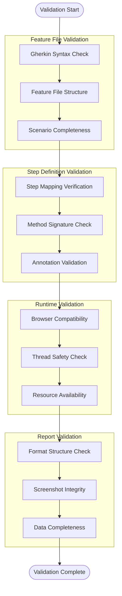
```mermaid
flowchart TD
    subgraph "Feature File Validation"
        FF1[Gherkin Syntax Check]
        FF2[Feature File Structure]
        FF3[Scenario Completeness]
    end
    
    subgraph "Step Definition Validation"
        SD1[Step Mapping Verification]
        SD2[Method Signature Check]
        SD3[Annotation Validation]
    end
    
    subgraph "Runtime Validation"
        RT1[Browser Compatibility]
        RT2[Thread Safety Check]
        RT3[Resource Availability]
    end
    
    subgraph "Report Validation"
        RP1[Format Structure Check]
        RP2[Screenshot Integrity]
        RP3[Data Completeness]
    end
    
    Start([Validation Start]) --> FF1
    FF1 --> FF2
    FF2 --> FF3
    FF3 --> SD1
    SD1 --> SD2
    SD2 --> SD3
    SD3 --> RT1
    RT1 --> RT2
    RT2 --> RT3
    RT3 --> RP1
    RP1 --> RP2
    RP2 --> RP3
    RP3 --> ValidationComplete([Validation Complete])
```

## 4.3 TECHNICAL IMPLEMENTATION

### 4.3.1 State Management

#### Test Execution State Transition Diagram

The framework manages complex state transitions throughout the test lifecycle, ensuring proper resource management and execution flow. <span style="background-color: rgba(91, 57, 243, 0.2)">This Java-based test execution state management operates independently from the Node.js server lifecycle detailed in Section 4.3.3.</span>

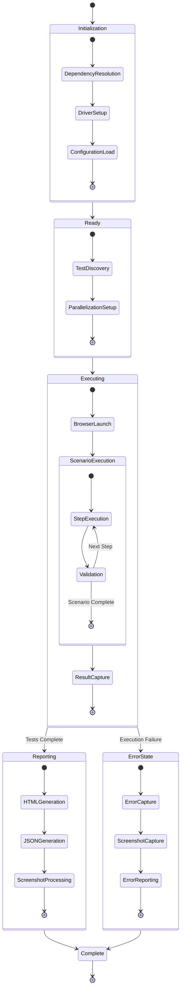
```mermaid
stateDiagram-v2
    [*] --> Initialization
    
    state Initialization {
        [*] --> DependencyResolution
        DependencyResolution --> DriverSetup
        DriverSetup --> ConfigurationLoad
        ConfigurationLoad --> [*]
    }
    
    Initialization --> Ready
    
    state Ready {
        [*] --> TestDiscovery
        TestDiscovery --> ParallelizationSetup
        ParallelizationSetup --> [*]
    }
    
    Ready --> Executing
    
    state Executing {
        [*] --> BrowserLaunch
        BrowserLaunch --> ScenarioExecution
        ScenarioExecution --> ResultCapture
        ResultCapture --> [*]
    }
    
    state ScenarioExecution {
        [*] --> StepExecution
        StepExecution --> Validation
        Validation --> StepExecution : Next Step
        Validation --> [*] : Scenario Complete
    }
    
    Executing --> Reporting : Tests Complete
    Executing --> ErrorState : Execution Failure
    
    state Reporting {
        [*] --> HTMLGeneration
        HTMLGeneration --> JSONGeneration
        JSONGeneration --> ScreenshotProcessing
        ScreenshotProcessing --> [*]
    }
    
    state ErrorState {
        [*] --> ErrorCapture
        ErrorCapture --> ScreenshotCapture
        ScreenshotCapture --> ErrorReporting
        ErrorReporting --> [*]
    }
    
    Reporting --> Complete
    ErrorState --> Complete
    Complete --> [*]
```

### 4.3.2 Error Handling and Recovery

#### Comprehensive Error Handling Flow

The framework implements multi-layered error handling with automatic recovery mechanisms and detailed error reporting. <span style="background-color: rgba(91, 57, 243, 0.2)">These error handling mechanisms are specific to the Java test execution environment and do not affect the Node.js server operations described in Section 4.3.3.</span>

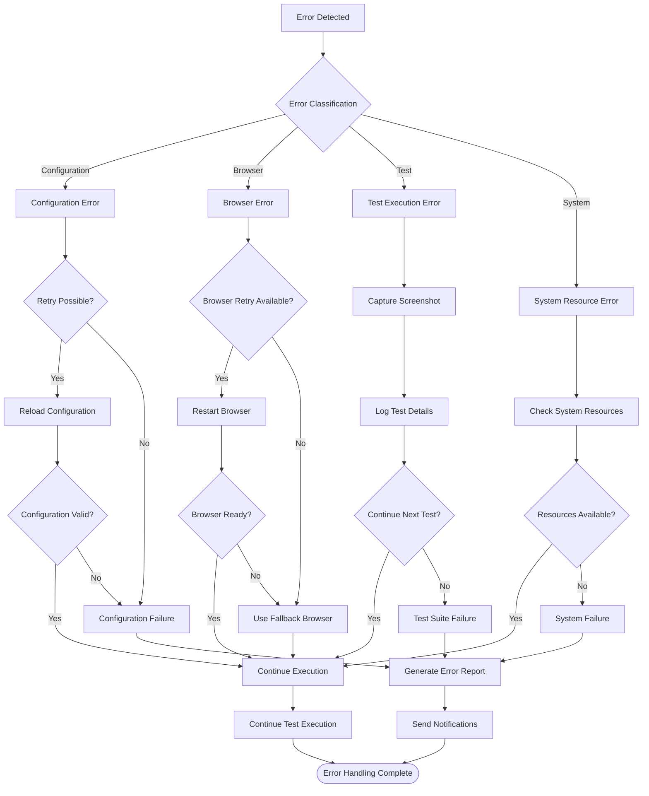
```mermaid
flowchart TD
    Error[Error Detected] --> ErrorType{Error Classification}
    
    ErrorType -->|Configuration| ConfigError[Configuration Error]
    ErrorType -->|Browser| BrowserError[Browser Error]
    ErrorType -->|Test| TestError[Test Execution Error]
    ErrorType -->|System| SystemError[System Resource Error]
    
    ConfigError --> ConfigRetry{Retry Possible?}
    ConfigRetry -->|Yes| ConfigReload[Reload Configuration]
    ConfigRetry -->|No| ConfigFailure[Configuration Failure]
    ConfigReload --> ConfigValidation{Configuration Valid?}
    ConfigValidation -->|Yes| Recovery[Continue Execution]
    ConfigValidation -->|No| ConfigFailure
    
    BrowserError --> BrowserRetry{Browser Retry Available?}
    BrowserRetry -->|Yes| BrowserRestart[Restart Browser]
    BrowserRetry -->|No| BrowserFallback[Use Fallback Browser]
    BrowserRestart --> BrowserValidation{Browser Ready?}
    BrowserValidation -->|Yes| Recovery
    BrowserValidation -->|No| BrowserFallback
    BrowserFallback --> Recovery
    
    TestError --> Screenshot[Capture Screenshot]
    Screenshot --> TestLog[Log Test Details]
    TestLog --> TestContinue{Continue Next Test?}
    TestContinue -->|Yes| Recovery
    TestContinue -->|No| TestFailure[Test Suite Failure]
    
    SystemError --> ResourceCheck[Check System Resources]
    ResourceCheck --> ResourceRetry{Resources Available?}
    ResourceRetry -->|Yes| Recovery
    ResourceRetry -->|No| SystemFailure[System Failure]
    
    ConfigFailure --> ErrorReport[Generate Error Report]
    TestFailure --> ErrorReport
    SystemFailure --> ErrorReport
    
    ErrorReport --> Notification[Send Notifications]
    Recovery --> ContinueExecution[Continue Test Execution]
    Notification --> End([Error Handling Complete])
    ContinueExecution --> End
```

#### Retry Mechanism Implementation

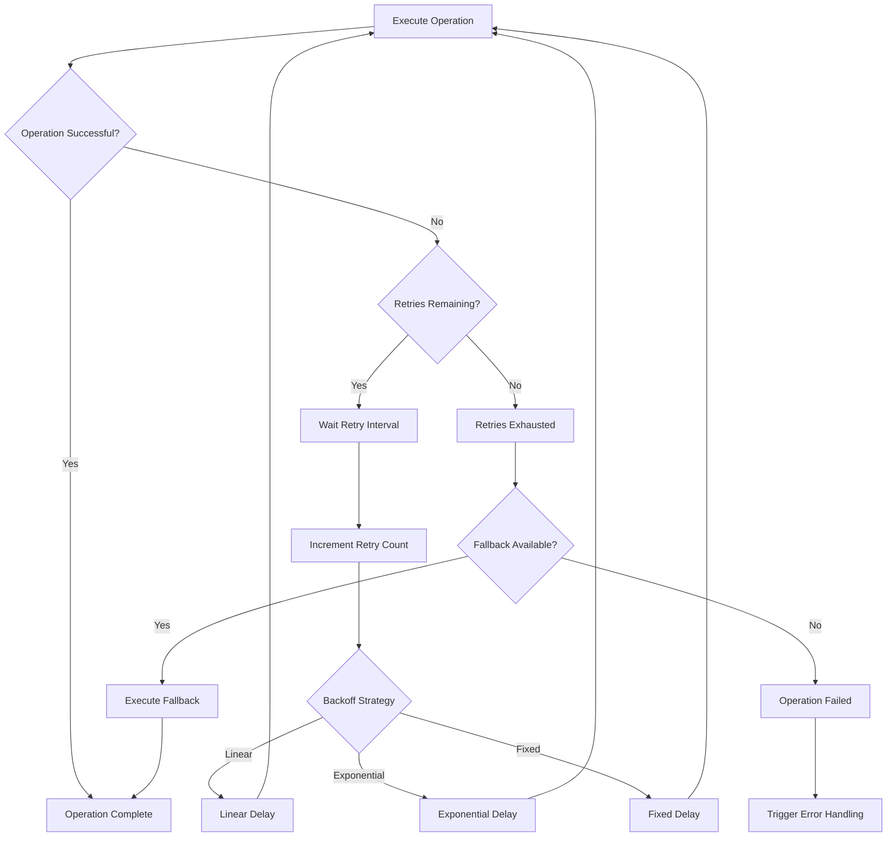
```mermaid
flowchart TD
    Operation[Execute Operation] --> Success{Operation Successful?}
    Success -->|Yes| Complete[Operation Complete]
    Success -->|No| RetryCheck{Retries Remaining?}
    
    RetryCheck -->|Yes| RetryDelay[Wait Retry Interval]
    RetryCheck -->|No| RetryExhausted[Retries Exhausted]
    
    RetryDelay --> RetryIncrement[Increment Retry Count]
    RetryIncrement --> BackoffStrategy{Backoff Strategy}
    
    BackoffStrategy -->|Linear| LinearDelay[Linear Delay]
    BackoffStrategy -->|Exponential| ExponentialDelay[Exponential Delay]
    BackoffStrategy -->|Fixed| FixedDelay[Fixed Delay]
    
    LinearDelay --> Operation
    ExponentialDelay --> Operation
    FixedDelay --> Operation
    
    RetryExhausted --> FallbackStrategy{Fallback Available?}
    FallbackStrategy -->|Yes| ExecuteFallback[Execute Fallback]
    FallbackStrategy -->|No| OperationFailed[Operation Failed]
    
    ExecuteFallback --> Complete
    OperationFailed --> ErrorHandling[Trigger Error Handling]
```

### 4.3.3 Node.js Server Lifecycle State Diagram

<span style="background-color: rgba(91, 57, 243, 0.2)">The Node.js Express server operates as a completely independent component within the repository structure, maintaining full decoupling from the existing Java-based Test Execution State Transition Diagram detailed in Section 4.3.1. This architectural separation ensures that the Node.js web server lifecycle and the Java test automation framework execute in parallel without interdependencies, satisfying the constraint for technology stack isolation while enabling both components to coexist within the unified repository environment.</span>

#### Express Server State Management

<span style="background-color: rgba(91, 57, 243, 0.2)">The Express.js server follows a well-defined lifecycle that manages HTTP request handling, route processing, and graceful shutdown procedures. This state management ensures reliable web service operation with proper resource allocation and cleanup.</span>

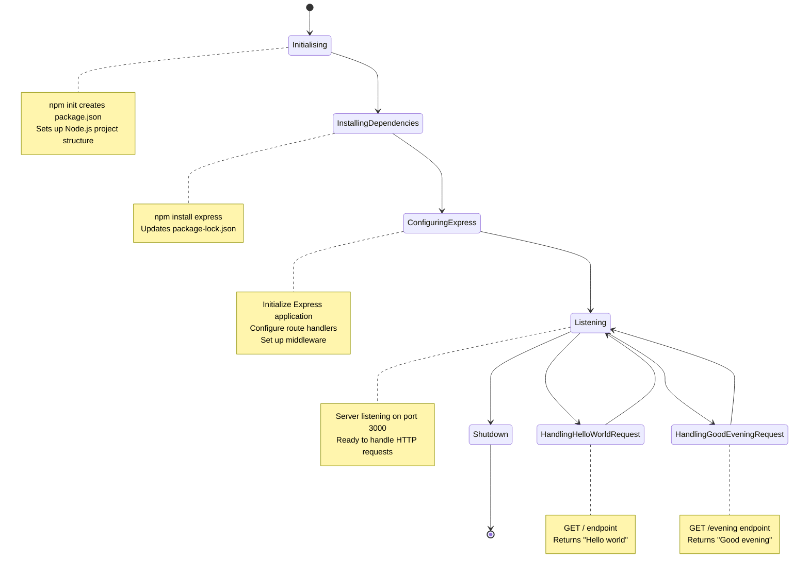
```mermaid
stateDiagram-v2
    [*] --> Initialising
    Initialising --> InstallingDependencies
    InstallingDependencies --> ConfiguringExpress
    ConfiguringExpress --> Listening
    
    Listening --> HandlingHelloWorldRequest
    Listening --> HandlingGoodEveningRequest
    
    HandlingHelloWorldRequest --> Listening
    HandlingGoodEveningRequest --> Listening
    
    Listening --> Shutdown
    Shutdown --> [*]
    
    note right of Initialising
        npm init creates package.json
        Sets up Node.js project structure
    end note
    
    note right of InstallingDependencies
        npm install express
        Updates package-lock.json
    end note
    
    note right of ConfiguringExpress
        Initialize Express application
        Configure route handlers
        Set up middleware
    end note
    
    note right of Listening
        Server listening on port 3000
        Ready to handle HTTP requests
    end note
    
    note right of HandlingHelloWorldRequest
        GET / endpoint
        Returns "Hello world"
    end note
    
    note right of HandlingGoodEveningRequest
        GET /evening endpoint
        Returns "Good evening"
    end note
```

#### Request Processing Flow

<span style="background-color: rgba(91, 57, 243, 0.2)">The server implements efficient request routing through Express middleware, ensuring optimal response delivery for both configured endpoints while maintaining consistent HTTP status codes and response formatting.</span>

| <span style="background-color: rgba(91, 57, 243, 0.2)">**State**</span> | <span style="background-color: rgba(91, 57, 243, 0.2)">**Description**</span> | <span style="background-color: rgba(91, 57, 243, 0.2)">**Duration**</span> | <span style="background-color: rgba(91, 57, 243, 0.2)">**Next State**</span> |
|---------|-------------|----------|-----------|
| <span style="background-color: rgba(91, 57, 243, 0.2)">Initialising</span> | <span style="background-color: rgba(91, 57, 243, 0.2)">Server startup and basic configuration</span> | <span style="background-color: rgba(91, 57, 243, 0.2)">~100ms</span> | <span style="background-color: rgba(91, 57, 243, 0.2)">InstallingDependencies</span> |
| <span style="background-color: rgba(91, 57, 243, 0.2)">InstallingDependencies</span> | <span style="background-color: rgba(91, 57, 243, 0.2)">NPM dependency resolution and installation</span> | <span style="background-color: rgba(91, 57, 243, 0.2)">Variable</span> | <span style="background-color: rgba(91, 57, 243, 0.2)">ConfiguringExpress</span> |
| <span style="background-color: rgba(91, 57, 243, 0.2)">ConfiguringExpress</span> | <span style="background-color: rgba(91, 57, 243, 0.2)">Express app initialization and route setup</span> | <span style="background-color: rgba(91, 57, 243, 0.2)">~50ms</span> | <span style="background-color: rgba(91, 57, 243, 0.2)">Listening</span> |
| <span style="background-color: rgba(91, 57, 243, 0.2)">Listening</span> | <span style="background-color: rgba(91, 57, 243, 0.2)">Accepting HTTP requests on configured port</span> | <span style="background-color: rgba(91, 57, 243, 0.2)">Persistent</span> | <span style="background-color: rgba(91, 57, 243, 0.2)">Request Handlers</span> |
| <span style="background-color: rgba(91, 57, 243, 0.2)">HandlingHelloWorldRequest</span> | <span style="background-color: rgba(91, 57, 243, 0.2)">Processing GET / requests</span> | <span style="background-color: rgba(91, 57, 243, 0.2)">~5ms</span> | <span style="background-color: rgba(91, 57, 243, 0.2)">Listening</span> |
| <span style="background-color: rgba(91, 57, 243, 0.2)">HandlingGoodEveningRequest</span> | <span style="background-color: rgba(91, 57, 243, 0.2)">Processing GET /evening requests</span> | <span style="background-color: rgba(91, 57, 243, 0.2)">~5ms</span> | <span style="background-color: rgba(91, 57, 243, 0.2)">Listening</span> |
| <span style="background-color: rgba(91, 57, 243, 0.2)">Shutdown</span> | <span style="background-color: rgba(91, 57, 243, 0.2)">Graceful server termination and cleanup</span> | <span style="background-color: rgba(91, 57, 243, 0.2)">~200ms</span> | <span style="background-color: rgba(91, 57, 243, 0.2)">Terminated</span> |

## 4.4 PERFORMANCE AND SLA CONSIDERATIONS

### 4.4.1 Timing Constraints and Performance Metrics

The framework implements specific performance targets and monitoring across all workflow stages:

**Critical Performance Thresholds:**
- Feature file parsing: < 100ms per file
- Browser initialization: < 5 seconds
- Step definition resolution: < 50ms per step
- Report generation: < 30 seconds post-execution
- Screenshot capture: < 2 seconds per screenshot
- Parallel execution: 50% reduction in test suite runtime


```mermaid
gantt
    title Test Execution Performance Timeline
    dateFormat  X
    axisFormat %L ms
    
    section Initialization
    Dependency Resolution    :milestone, 0, 0
    Driver Setup            :active, 1000, 3000
    Configuration Load      :500, 1000
    
    section Test Discovery
    Feature File Parsing    :100, 300
    Step Definition Mapping :50, 150
    
    section Execution
    Browser Launch         :2000, 5000
    Test Execution         :active, 5000, 15000
    Parallel Processing    :crit, 5000, 10000
    
    section Reporting
    Screenshot Processing  :2000, 4000
    Report Generation     :active, 15000, 30000
    
    section Integration
    CI/CD Pipeline        :1000, 3000
    Jira Integration      :500, 1500
```

### 4.4.2 Resource Management and Scalability

The framework implements intelligent resource management to optimize performance across different execution environments.

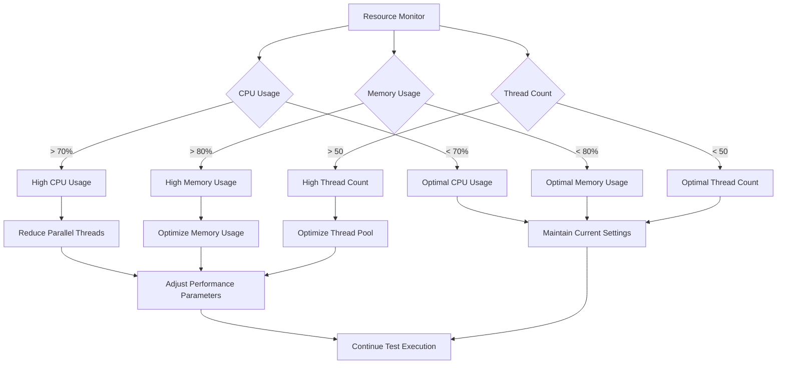
```mermaid
flowchart TD
    ResourceMonitor[Resource Monitor] --> CPUCheck{CPU Usage}
    ResourceMonitor --> MemoryCheck{Memory Usage}
    ResourceMonitor --> ThreadCheck{Thread Count}
    
    CPUCheck -->|< 70%| OptimalCPU[Optimal CPU Usage]
    CPUCheck -->|> 70%| HighCPU[High CPU Usage]
    
    MemoryCheck -->|< 80%| OptimalMemory[Optimal Memory Usage]
    MemoryCheck -->|> 80%| HighMemory[High Memory Usage]
    
    ThreadCheck -->|< 50| OptimalThreads[Optimal Thread Count]
    ThreadCheck -->|> 50| HighThreads[High Thread Count]
    
    HighCPU --> ScaleDown[Reduce Parallel Threads]
    HighMemory --> MemoryOptimization[Optimize Memory Usage]
    HighThreads --> ThreadOptimization[Optimize Thread Pool]
    
    OptimalCPU --> MaintainPerformance[Maintain Current Settings]
    OptimalMemory --> MaintainPerformance
    OptimalThreads --> MaintainPerformance
    
    ScaleDown --> PerformanceAdjustment[Adjust Performance Parameters]
    MemoryOptimization --> PerformanceAdjustment
    ThreadOptimization --> PerformanceAdjustment
    
    PerformanceAdjustment --> ContinueExecution[Continue Test Execution]
    MaintainPerformance --> ContinueExecution
```

#### References

**Repository Files Examined:**
- `README.md` - Login workflow examples, tool stack documentation, and CI/CD integration details
- `pom.xml` - Maven configuration revealing technical dependencies, build settings, and parallel execution configuration

**Technical Specification Sections Retrieved:**
- `1.2 SYSTEM OVERVIEW` - System architecture, business context, and high-level component integration
- `2.1 FEATURE CATALOG` - Comprehensive feature descriptions, dependencies, and technical implementation details
- `2.2 FUNCTIONAL REQUIREMENTS TABLE` - Detailed functional specifications, validation rules, and performance criteria
- `3.6 INTEGRATION ARCHITECTURE` - Component integration map, version compatibility matrix, and external system connections

**Web Research:**
- No additional web searches were required as comprehensive information was available from repository documentation and technical specifications

# 5. SYSTEM ARCHITECTURE

## 5.1 HIGH-LEVEL ARCHITECTURE

### 5.1.1 System Overview

#### Architecture Style and Rationale

The Testinium-QA framework implements a **layered, plugin-based architecture** that follows the Model-View-Controller pattern adapted for test automation. This architectural approach emphasizes separation of concerns, maintainability, and extensibility while supporting Behavior-Driven Development (BDD) principles.

<span style="background-color: rgba(91, 57, 243, 0.2)">The platform has transitioned to a multi-technology (Java + Node.js) layered architecture with clear separation of concerns between the existing Java automation stack and the new JavaScript server layer. The Node.js Express Server serves as an additional top-level component that operates independently and in parallel to the Java-based testing framework, establishing REST endpoint functionality while maintaining architectural isolation.</span>

**Core Architectural Principles:**

- **Separation of Concerns**: Clear division between test specification (Gherkin features), implementation logic (step definitions), and execution orchestration (test runners)
- **Plugin-Based Extension**: Maven-centric dependency management enabling framework extensions through plugin ecosystem
- **Cross-Platform Compatibility**: Browser-agnostic design supporting Chrome, Firefox, and Internet Explorer through WebDriver abstraction
- **Parallel Processing**: Method-level parallel execution architecture for optimal resource utilization and performance
- <span style="background-color: rgba(91, 57, 243, 0.2)">**Polyglot Architecture Support**: Co-locating Java and Node.js components in the same repository while preserving independent build lifecycles</span>

**System Boundaries and Interfaces:**

The framework operates within clearly defined boundaries:
- **Internal Boundary**: Test automation logic, step definitions, and feature specifications
- **Browser Interface**: WebDriver protocol communication with browser drivers
- **CI/CD Interface**: Maven-based build integration with Jenkins pipelines
- **Reporting Interface**: Multi-format report generation for stakeholder consumption
- **External Service Interface**: Integration points with Testinium platform, Jira, and GitHub
- <span style="background-color: rgba(91, 57, 243, 0.2)">**HTTP API Interface**: GET '/' and GET '/evening' endpoints exposed by the Node.js Express Server</span>

### 5.1.2 Core Components Table

| Component Name | Primary Responsibility | Key Dependencies | Integration Points |
|----------------|----------------------|------------------|-------------------|
| BDD Framework Engine | Feature file parsing and scenario execution | Cucumber 7.2.3, JUnit 4.13.2 | Maven Surefire, CukesRunner |
| Browser Automation Layer | Web element interaction and browser control | Selenium WebDriver 3.141.59, WebDriverManager 5.1.0 | Browser drivers, operating system |
| Parallel Execution Manager | Test thread orchestration and resource management | Maven Surefire Plugin 3.0.0-M5 | JVM thread pool, system resources |
| Report Generation System | Multi-format report creation and screenshot management | Cucumber Reporting Plugin 7.2.0 | File system, CI/CD tools |
| <span style="background-color: rgba(91, 57, 243, 0.2)">**Node.js Express Server**</span> | <span style="background-color: rgba(91, 57, 243, 0.2)">**Serve REST endpoints ("Hello world", "Good evening")**</span> | <span style="background-color: rgba(91, 57, 243, 0.2)">**Node.js 14+, Express 4.21.2**</span> | <span style="background-color: rgba(91, 57, 243, 0.2)">**HTTP clients, shared repository**</span> |

### 5.1.3 Data Flow Description

**Primary Data Flow Architecture:**

The system processes test execution through a structured data pipeline that transforms human-readable specifications into executable automated tests:

1. **Feature Specification Flow**: Gherkin feature files in `src/main/resources/features` define test scenarios using natural language syntax
2. **Step Definition Mapping**: Java implementations in `src/test/java/com/testinium/step_definitions/` provide executable logic for Gherkin steps
3. **Test Orchestration**: CukesRunner class coordinates test execution through Cucumber framework integration
4. **Browser Communication**: WebDriver JSON wire protocol facilitates communication between test logic and browser instances
5. **Result Aggregation**: Test outcomes are collected and processed for multi-format report generation

<span style="background-color: rgba(91, 57, 243, 0.2)">**Node.js Express Server Data Flow:**</span>

<span style="background-color: rgba(91, 57, 243, 0.2)">Client → HTTP Request → Node.js Express Server → Plain-text response ('Hello world' / 'Good evening')</span>

**Data Transformation Points:**

- **Gherkin to Java**: Cucumber framework transforms natural language scenarios into method invocations
- **Test Data Generation**: JavaFaker 1.0.2 creates dynamic test data for realistic scenario execution
- **Screenshot Capture**: Automatic image capture during test execution and failure conditions
- **Report Formatting**: Result transformation into HTML, JSON, TXT, and PrettyReports formats

**Key Data Stores:**

- **Configuration Repository**: `configuration.properties` (excluded from version control) stores environment-specific settings
- **Feature Repository**: Version-controlled Gherkin files maintain test specifications
- **Report Archive**: Generated reports and screenshots stored in Maven target directory
- **Driver Cache**: WebDriverManager maintains local cache of browser drivers

### 5.1.4 External Integration Points

| System Name | Integration Type | Data Exchange Pattern | Protocol/Format |
|-------------|-----------------|----------------------|-----------------|
| Testinium Platform | Test Management | Bidirectional synchronization | REST API/JSON |
| Jenkins CI/CD | Build Automation | Triggered execution | Maven/XML configuration |
| Jira Test Management | Result Tracking | Report publishing | Cucumber Reports Plugin |
| GitHub Repository | Version Control | Source code management | Git/HTTPS |

<span style="background-color: rgba(91, 57, 243, 0.2)">**Note**: The Node.js server currently has no external system integrations beyond serving HTTP, reinforcing its isolation from existing Java integrations.</span>

## 5.2 COMPONENT DETAILS

### 5.2.1 BDD Framework Engine

**Purpose and Responsibilities:**
The BDD Framework Engine serves as the core orchestrator for Behavior-Driven Development test execution, parsing Gherkin feature files and coordinating step definition execution across multiple browser instances.

**Technologies and Frameworks:**
- Cucumber Java 7.2.3 for feature file processing and step definition management
- JUnit 4.13.2 for test lifecycle management and assertion framework
- Gherkin syntax parser for natural language scenario interpretation

**Key Interfaces and APIs:**
- CukesRunner class with @RunWith(Cucumber.class) annotation for test execution
- Step definition annotations (@Given, @When, @Then) for scenario mapping
- Cucumber Options configuration for report generation and execution parameters

**Data Persistence Requirements:**
- Feature files stored in `src/main/resources/features` directory structure
- Step definitions maintained in `src/test/java/com/testinium/step_definitions/` package
- No persistent data storage required for runtime operation

**Scaling Considerations:**
- Method-level parallel execution through Maven Surefire configuration
- Thread-safe step definition implementation required for concurrent execution
- Unlimited thread count configuration for optimal resource utilization

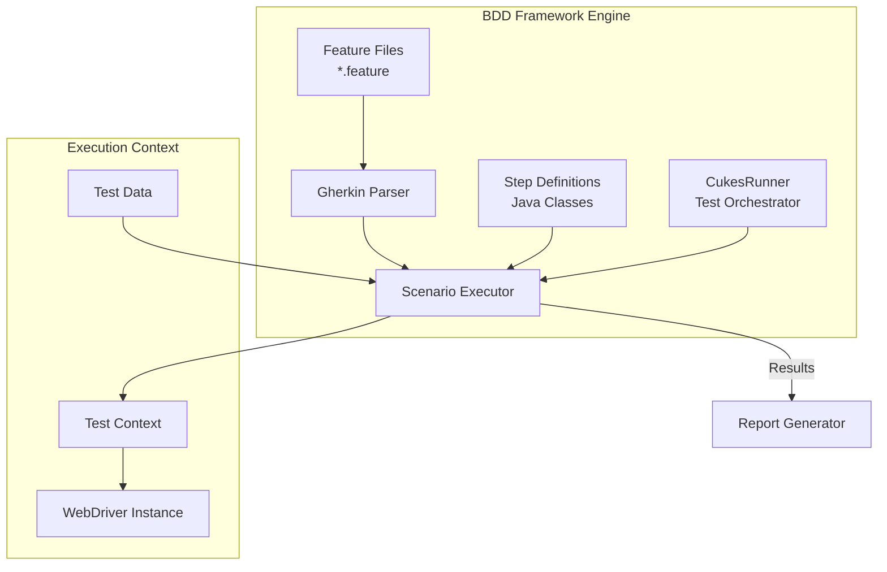
```mermaid
graph TB
    subgraph "BDD Framework Engine"
        FF[Feature Files<br/>*.feature]
        GP[Gherkin Parser]
        SD[Step Definitions<br/>Java Classes]
        CR[CukesRunner<br/>Test Orchestrator]
        SE[Scenario Executor]
    end
    
    subgraph "Execution Context"
        TC[Test Context]
        WD[WebDriver Instance]
        TD[Test Data]
    end
    
    FF --> GP
    GP --> SE
    SD --> SE
    CR --> SE
    SE --> TC
    TC --> WD
    TD --> SE
    
    SE --> |Results| RG[Report Generator]
```

### 5.2.2 Browser Automation Layer

**Purpose and Responsibilities:**
The Browser Automation Layer abstracts browser-specific implementations, providing unified web element interaction capabilities across Chrome, Firefox, and Internet Explorer browsers.

**Technologies and Frameworks:**
- Selenium WebDriver 3.141.59 implementing JSON Wire Protocol architecture
- WebDriverManager 5.1.0 for automated driver lifecycle management
- Browser-specific drivers (ChromeDriver, GeckoDriver, IEDriver)

**Key Interfaces and APIs:**
- WebDriver interface for browser control and element manipulation
- WebElement interface for individual HTML element interaction
- WebDriverManager API for automated driver download and configuration

**Data Persistence Requirements:**
- Browser driver binaries cached locally by WebDriverManager
- Session management for browser instance lifecycle
- No persistent state maintenance between test executions

**Scaling Considerations:**
- Multiple browser instance support for parallel test execution
- Driver pool management for resource optimization
- Browser-specific performance tuning and resource allocation

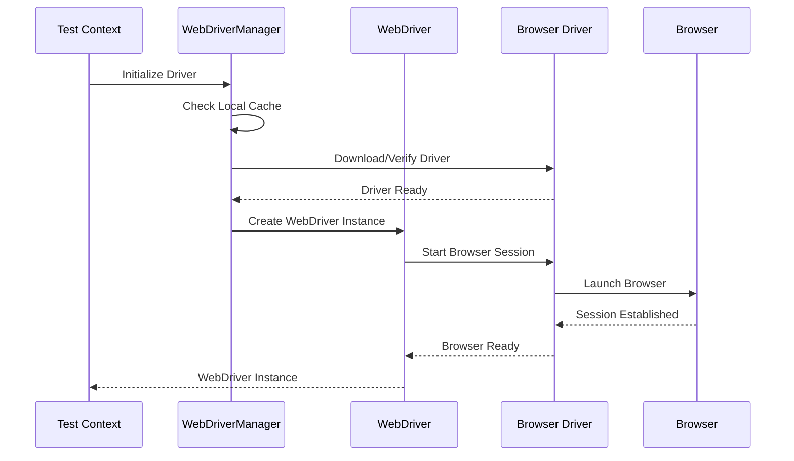
```mermaid
sequenceDiagram
    participant TC as Test Context
    participant WDM as WebDriverManager
    participant WD as WebDriver
    participant BD as Browser Driver
    participant B as Browser
    
    TC->>WDM: Initialize Driver
    WDM->>WDM: Check Local Cache
    WDM->>BD: Download/Verify Driver
    BD-->>WDM: Driver Ready
    WDM->>WD: Create WebDriver Instance
    WD->>BD: Start Browser Session
    BD->>B: Launch Browser
    B-->>BD: Session Established
    BD-->>WD: Browser Ready
    WD-->>TC: WebDriver Instance
```

### 5.2.3 Parallel Execution Manager

**Purpose and Responsibilities:**
The Parallel Execution Manager coordinates concurrent test execution across multiple threads, optimizing resource utilization while maintaining test isolation and thread safety.

**Technologies and Frameworks:**
- Maven Surefire Plugin 3.0.0-M5 for parallel execution orchestration
- JVM thread pool management for concurrent test execution
- JUnit 4.13.2 test lifecycle integration

**Key Interfaces and APIs:**
- Surefire configuration parameters for parallel execution control
- Thread-local storage patterns for test context isolation
- TestNG-style parallel execution strategies

**Data Persistence Requirements:**
- Thread-specific execution context storage
- Test result aggregation across parallel executions
- No shared state persistence between concurrent test threads

**Scaling Considerations:**
- Unlimited thread count configuration for maximum parallelization
- Memory management for multiple browser instances
- Resource contention prevention between concurrent tests

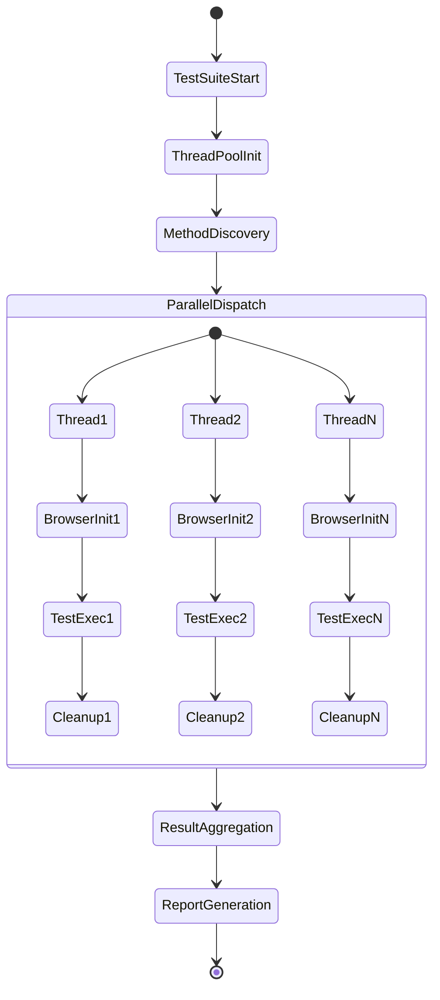
```mermaid
stateDiagram-v2
    [*] --> TestSuiteStart
    TestSuiteStart --> ThreadPoolInit
    ThreadPoolInit --> MethodDiscovery
    MethodDiscovery --> ParallelDispatch
    
    state ParallelDispatch {
        [*] --> Thread1
        [*] --> Thread2
        [*] --> ThreadN
        
        Thread1 --> BrowserInit1
        Thread2 --> BrowserInit2
        ThreadN --> BrowserInitN
        
        BrowserInit1 --> TestExec1
        BrowserInit2 --> TestExec2
        BrowserInitN --> TestExecN
        
        TestExec1 --> Cleanup1
        TestExec2 --> Cleanup2
        TestExecN --> CleanupN
    }
    
    ParallelDispatch --> ResultAggregation
    ResultAggregation --> ReportGeneration
    ReportGeneration --> [*]
```

### 5.2.4 Report Generation System

**Purpose and Responsibilities:**
The Report Generation System creates comprehensive test execution reports in multiple formats with automatic screenshot capture and CI/CD integration capabilities.

**Technologies and Frameworks:**
- Cucumber Reporting Plugin 7.2.0 for PrettyReports generation
- Built-in Cucumber report formats (HTML, JSON, TXT)
- Automatic screenshot capture mechanism

**Key Interfaces and APIs:**
- Cucumber reporting plugin configuration in CukesRunner
- File system API for report output and screenshot storage
- Maven build lifecycle integration for automated report generation

**Data Persistence Requirements:**
- Report files stored in Maven target directory structure
- Screenshot images linked to test execution results
- JSON format reports for programmatic integration

**Scaling Considerations:**
- Concurrent report generation for parallel test execution
- File system I/O optimization for large test suites
- Report archival strategies for CI/CD pipeline integration

### 5.2.5 Node.js Express Server

**Purpose and Responsibilities:**
The Node.js Express Server provides a lightweight HTTP server exposing two GET endpoints that return fixed text responses. This component operates independently from the Java-based test automation framework, demonstrating basic web server functionality and serving as a tutorial example for polyglot architecture implementation.

**Technologies and Frameworks:**
- Node.js (≥14.x) runtime environment for JavaScript server execution
- Express.js 4.18.x web application framework for HTTP routing and middleware
- Native Node.js HTTP module for underlying server functionality

**Key Interfaces and APIs:**
- GET `/` endpoint returning plain text response "Hello world"
- GET `/evening` endpoint returning plain text response "Good evening"
- Express.js routing middleware for request handling and response generation
- HTTP server listening interface with configurable port binding

**Data Persistence Requirements:**
None – the server maintains no persistent state and provides stateless responses. All endpoint responses are hardcoded string literals with no database or file system dependencies.

**Scaling Considerations:**
Current implementation is designed for single-instance tutorial scope with simple request-response patterns. Future horizontal scaling options include Node.js cluster module for multi-process utilization or external load balancer integration for distributed deployment across multiple server instances.

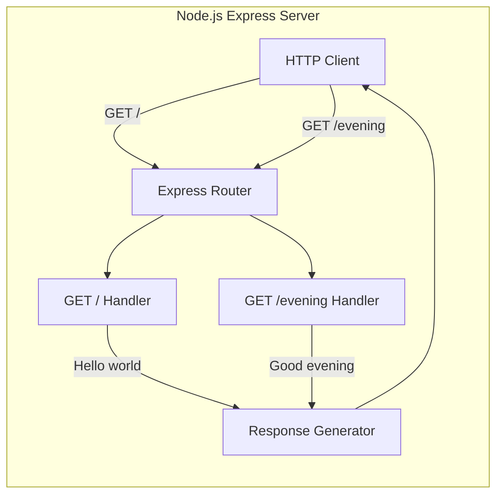
```mermaid
graph LR
    subgraph "Node.js Express Server"
        Client[HTTP Client]
        Router[Express Router]
        Handler1[GET / Handler]
        Handler2[GET /evening Handler]
        Response[Response Generator]
    end
    
    Client -->|GET /| Router
    Client -->|GET /evening| Router
    Router --> Handler1
    Router --> Handler2
    Handler1 -->|"Hello world"| Response
    Handler2 -->|"Good evening"| Response
    Response --> Client
```

## 5.3 TECHNICAL DECISIONS

### 5.3.1 Architecture Style Decisions

**Decision: Layered Architecture with BDD Separation**

**Rationale:** The framework implements a layered architecture that separates test specification (Gherkin), implementation logic (step definitions), and execution orchestration (runners). This design decision provides:

- **Maintainability**: Clear separation enables independent modification of test scenarios without affecting implementation logic
- **Collaboration**: Business stakeholders can contribute to test specifications without requiring programming knowledge
- **Reusability**: Step definitions can be reused across multiple feature files and scenarios

**Trade-offs:**
- **Performance**: Additional abstraction layers introduce minor execution overhead
- **Complexity**: Requires understanding of Cucumber framework concepts and Gherkin syntax
- **Debugging**: Multi-layer debugging can be more complex than direct test implementation

| Decision Factor | Chosen Approach | Alternative | Justification |
|-----------------|----------------|-------------|---------------|
| Test Specification | Gherkin/BDD | Direct JUnit | Stakeholder collaboration and living documentation |
| Architecture Pattern | Layered | Monolithic | Separation of concerns and maintainability |
| Execution Model | Plugin-based | Embedded | Flexibility and extensibility |

<span style="background-color: rgba(91, 57, 243, 0.2)">**Decision: Multi-Technology Layered Architecture (Java + Node.js)**</span>

<span style="background-color: rgba(91, 57, 243, 0.2)">**Rationale:** The system has evolved to embrace a polyglot architecture that combines the mature Java-based test automation framework with a lightweight Node.js web server component. This architectural decision enables:</span>

- <span style="background-color: rgba(91, 57, 243, 0.2)">**Polyglot Flexibility**: Leverages Java's robust testing ecosystem alongside Node.js's rapid web development capabilities</span>
- <span style="background-color: rgba(91, 57, 243, 0.2)">**Clear Separation**: Each technology stack operates independently with distinct build lifecycles and runtime environments</span>
- <span style="background-color: rgba(91, 57, 243, 0.2)">**Technology Optimization**: Java optimized for complex test automation logic, Node.js optimized for simple HTTP endpoint serving</span>

<span style="background-color: rgba(91, 57, 243, 0.2)">**Trade-offs:**</span>
- <span style="background-color: rgba(91, 57, 243, 0.2)">**Repository Complexity**: Dual technology stacks require separate dependency management (Maven + npm)</span>
- <span style="background-color: rgba(91, 57, 243, 0.2)">**Dual Build Pipelines**: CI/CD processes must accommodate both Maven and Node.js build requirements</span>
- <span style="background-color: rgba(91, 57, 243, 0.2)">**Skill Requirements**: Development team needs proficiency in both Java and JavaScript ecosystems</span>

#### 5.3.1.1 Framework Selection - Express.js vs Native HTTP (updated)

<span style="background-color: rgba(91, 57, 243, 0.2)">**Decision: Express.js Framework Selection**</span>

<span style="background-color: rgba(91, 57, 243, 0.2)">**Rationale:** Express.js 4.21.2 was selected over Node.js native HTTP module to provide superior routing capabilities and access to the extensive middleware ecosystem. This framework selection delivers:</span>

- <span style="background-color: rgba(91, 57, 243, 0.2)">**Enhanced Routing**: Simplified URL pattern matching and HTTP method handling compared to native implementations</span>
- <span style="background-color: rgba(91, 57, 243, 0.2)">**Middleware Ecosystem**: Access to thousands of community-maintained middleware packages for cross-cutting concerns</span>
- <span style="background-color: rgba(91, 57, 243, 0.2)">**Developer Experience**: Reduced boilerplate code and improved maintainability for HTTP server implementation</span>
- <span style="background-color: rgba(91, 57, 243, 0.2)">**Migration Requirement**: Represents transition from initial native HTTP implementation to production-ready framework</span>

<span style="background-color: rgba(91, 57, 243, 0.2)">**Alternative Approaches Considered:**</span>
- <span style="background-color: rgba(91, 57, 243, 0.2)">Native Node.js HTTP module (initial implementation approach, limited routing capabilities)</span>
- <span style="background-color: rgba(91, 57, 243, 0.2)">Fastify framework (performance-focused alternative, steeper learning curve)</span>
- <span style="background-color: rgba(91, 57, 243, 0.2)">Koa.js framework (modern async/await support, smaller ecosystem)</span>

#### 5.3.1.2 Directory Structure Strategy (updated)

<span style="background-color: rgba(91, 57, 243, 0.2)">**Decision: Isolated Node.js Directory Structure**</span>

<span style="background-color: rgba(91, 57, 243, 0.2)">**Rationale:** The `node-server/` directory structure was implemented to achieve complete isolation of Node.js artifacts from the existing Maven project tree. This strategic decision addresses the coexistence constraint by:</span>

- <span style="background-color: rgba(91, 57, 243, 0.2)">**Maven Tree Isolation**: Prevents npm dependencies and Node.js build artifacts from interfering with Maven's target/ directory and build lifecycle</span>
- <span style="background-color: rgba(91, 57, 243, 0.2)">**Independent Package Management**: Enables separate `package.json` and `package-lock.json` management without affecting `pom.xml` dependencies</span>
- <span style="background-color: rgba(91, 57, 243, 0.2)">**Build System Separation**: Allows parallel execution of Maven and npm commands without resource conflicts</span>
- <span style="background-color: rgba(91, 57, 243, 0.2)">**Clear Ownership Boundaries**: Developers can work on Java test automation or Node.js server components independently</span>

<span style="background-color: rgba(91, 57, 243, 0.2)">**Architecture Benefits:**</span>
- <span style="background-color: rgba(91, 57, 243, 0.2)">Preserves existing Java project structure and build processes</span>
- <span style="background-color: rgba(91, 57, 243, 0.2)">Enables technology-specific tooling and IDE configurations</span>
- <span style="background-color: rgba(91, 57, 243, 0.2)">Facilitates future scaling of either technology stack independently</span>

### 5.3.2 Communication Pattern Choices

**Decision: JSON Wire Protocol with WebDriver Abstraction**

**Rationale:** Selenium WebDriver 3.141.59 utilizes JSON Wire Protocol for browser communication, providing standardized interaction patterns across different browser implementations.

**Trade-offs:**
- **Compatibility**: Selenium 3.x provides stable, well-tested browser driver integration
- **Performance**: JSON serialization introduces communication overhead compared to native protocols
- **Future-Proofing**: Selenium 4.x adoption would provide W3C WebDriver standard compliance

```mermaid
graph LR
    subgraph "Communication Architecture"
        TC[Test Code] --> WD[WebDriver API]
        WD --> JSON[JSON Wire Protocol]
        JSON --> CD[ChromeDriver]
        JSON --> GD[GeckoDriver]
        JSON --> ID[IEDriver]
        CD --> CB[Chrome Browser]
        GD --> FB[Firefox Browser]
        ID --> IB[IE Browser]
    end
```

### 5.3.3 Data Storage Solution Rationale

**Decision: File-Based Configuration with Version Control Exclusion**

**Rationale:** The framework utilizes file-based configuration storage with `configuration.properties` excluded from version control to protect sensitive information while maintaining environment-specific settings.

**Design Considerations:**
- **Security**: Credentials and environment URLs excluded from repository
- **Flexibility**: Per-environment configuration without code changes
- **Simplicity**: Properties file format familiar to Java developers

**Alternative Approaches Considered:**
- Environment variables (complexity in Windows environments)
- External configuration servers (infrastructure overhead)
- Encrypted configuration files (key management complexity)

### 5.3.4 Caching Strategy Justification

**Decision: WebDriverManager Automated Caching**

**Rationale:** WebDriverManager 5.1.0 provides automated browser driver caching, eliminating manual driver management and improving CI/CD pipeline reliability.

**Benefits:**
- **Automation**: Automatic driver download and version management
- **Reliability**: Consistent driver availability across environments
- **Maintenance**: Reduced manual driver update requirements

## 5.4 CROSS-CUTTING CONCERNS

### 5.4.1 Monitoring and Observability Approach

**Framework Monitoring Strategy:**
The framework implements monitoring through Maven build lifecycle integration and Cucumber reporting capabilities, providing visibility into test execution performance and reliability.

**Observability Components:**
- **Build Metrics**: Maven Surefire plugin provides execution time and success rate metrics
- **Test Coverage**: Scenario execution tracking through Cucumber report generation
- **Performance Monitoring**: Parallel execution metrics and resource utilization tracking
- **Error Tracking**: Automatic screenshot capture for failure analysis

**Key Performance Indicators:**
- Test suite execution time and parallel efficiency
- Browser initialization time and resource consumption
- Report generation performance and file size metrics
- CI/CD pipeline integration success rates

### 5.4.2 Logging and Tracing Strategy

**Logging Architecture:**
The framework leverages built-in Cucumber logging capabilities combined with Maven build output for comprehensive execution tracing.

**Logging Levels and Categories:**
- **Framework Level**: Cucumber scenario execution progress and step completion
- **WebDriver Level**: Browser interaction logging through WebDriver implementations
- **Build Level**: Maven compilation, dependency resolution, and test execution output
- **Integration Level**: CI/CD pipeline execution logs and report publishing status

**Trace Correlation:**
- Test scenario IDs linking feature files to execution results
- Screenshot timestamps correlating with failure points
- Maven build phases connecting compilation to test execution

### 5.4.3 Error Handling Patterns

**Comprehensive Error Management:**
The framework implements multi-layered error handling addressing browser failures, test execution errors, and integration issues.

**Error Handling Strategies:**
- **Browser Failures**: WebDriverManager retry logic and driver recovery mechanisms
- **Test Failures**: Automatic screenshot capture and detailed error reporting
- **Build Failures**: Maven fail-safe configuration with `testFailureIgnore=true`
- **Integration Failures**: CI/CD pipeline error reporting and notification systems

```mermaid
flowchart TD
    A[Test Execution] --> B{Error Occurred?}
    B -->|No| C[Continue Execution]
    B -->|Yes| D[Capture Screenshot]
    D --> E[Log Error Details]
    E --> F{Critical Error?}
    F -->|No| G[Mark Test Failed]
    F -->|Yes| H[Stop Test Suite]
    G --> I[Continue with Next Test]
    H --> J[Generate Error Report]
    I --> K[Generate Final Report]
    J --> K
    K --> L[Notify Stakeholders]
```

### 5.4.4 Authentication and Authorization Framework

**Security Architecture:**
The framework implements configuration-based authentication management with secure credential handling for test environment access.

**Authentication Mechanisms:**
- **Test Application Authentication**: Scenario-based login testing with multiple user types (PosManager, SalesManager)
- **Environment Access**: Secure configuration management through excluded properties files
- **CI/CD Integration**: Jenkins credential management for automated pipeline execution
- **External Service Authentication**: Testinium platform and Jira integration credential handling

**Authorization Patterns:**
- Role-based test scenario execution based on user type selection
- Environment-specific access control through configuration management
- Test data isolation ensuring no cross-contamination between test environments

### 5.4.5 Performance Requirements and SLAs

**Performance Architecture:**
The framework is designed to optimize test execution performance through parallel processing and efficient resource management.

**Service Level Objectives:**
- **Test Suite Execution**: Method-level parallel execution with unlimited thread count configuration
- **Browser Initialization**: WebDriverManager caching reduces driver setup time
- **Report Generation**: Multi-format report creation within Maven build lifecycle
- **CI/CD Integration**: Automated test execution within pipeline SLA requirements

**Performance Monitoring:**
- Maven Surefire execution time reporting
- Parallel thread utilization metrics
- Browser resource consumption tracking
- Report generation and file I/O performance

### 5.4.6 Disaster Recovery Procedures

**Recovery Strategy:**
The framework implements comprehensive recovery mechanisms for test execution failures and infrastructure issues.

**Recovery Procedures:**
- **Browser Crash Recovery**: WebDriverManager automatic driver reinitialization
- **Test Failure Recovery**: Maven `testFailureIgnore=true` configuration allows suite continuation
- **Build Failure Recovery**: Rerun file generation for failed test execution retry
- **Environment Recovery**: Configuration-based environment switching and fallback mechanisms

**Backup and Restore:**
- **Source Code**: Git version control with GitHub repository backup
- **Configuration**: Template-based configuration with environment-specific restoration
- **Reports**: Archived report storage in CI/CD pipeline artifacts
- **Dependencies**: Maven Central repository ensures dependency availability

#### References

**Repository Files Examined:**
- `pom.xml` - Maven configuration with complete dependency management and build settings
- `README.md` - Project documentation with setup instructions and integration examples
- `.gitignore` - Version control exclusion patterns and artifact management
- `.gitattributes` - Git file handling rules and line ending management

**Technical Specification Sections Referenced:**
- `1.2 SYSTEM OVERVIEW` - High-level architecture context and component integration
- `2.1 FEATURE CATALOG` - Feature dependencies and implementation requirements
- `3.2 FRAMEWORKS & LIBRARIES` - Technology stack details and version compatibility
- `3.6 INTEGRATION ARCHITECTURE` - Component integration map and external dependencies
- `4.1 SYSTEM WORKFLOWS` - Process flows and integration patterns

**External Resources Consulted:**
- Testinium platform architecture documentation from AWS marketplace
- Selenium WebDriver 3.141.59 JSON Wire Protocol architecture specifications
- Cucumber BDD framework architecture and Maven integration best practices
- Maven Surefire Plugin parallel execution configuration and performance optimization

# 6. SYSTEM COMPONENTS DESIGN

## 6.1 CORE SERVICES ARCHITECTURE

### 6.1.1 Architecture Assessment

<span style="background-color: rgba(91, 57, 243, 0.2)">The Testinium-QA system has evolved from a monolithic Java-based architecture to implement a **minimal multi-technology services architecture** with the introduction of a Node.js server component. This dual-runtime environment maintains the established Java test automation framework while introducing an independent JavaScript-based web service layer.</span>

#### Service Architecture Overview

The system now operates as a **hybrid architecture** combining:

- **Java-based Test Automation Service**: The original monolithic BDD test automation framework continues to operate within a single JVM process, handling all test execution, browser automation, and reporting functions through direct method calls and Maven build integration.

- <span style="background-color: rgba(91, 57, 243, 0.2)">**Node.js Express Web Service**: A lightweight HTTP service running as an independent OS process under the `node-server/` directory, providing REST API endpoints with minimal functionality (GET endpoints returning "Hello world" and "Good evening" responses).</span>

#### Architecture Characteristics

**Service Boundaries and Isolation:**
- **Physical Separation**: <span style="background-color: rgba(91, 57, 243, 0.2)">The Node.js service operates in a completely isolated directory structure (`node-server/`) with independent package management (npm) and runtime environment, ensuring zero coupling with the Java ecosystem.</span>
- **Technology Stack Isolation**: Java components utilize Maven build lifecycle and JVM runtime, while Node.js components leverage npm package management and V8 JavaScript engine
- **Process Independence**: Both services run as separate OS processes with no shared memory or direct inter-process communication
- **Build System Separation**: Maven handles Java component builds while npm manages Node.js dependencies and execution

**Communication Patterns:**
- **Java Framework**: Internal communication through direct method calls within the JVM boundary
- **Node.js Service**: External communication via HTTP/REST protocol for client interactions
- **Inter-Service Communication**: Currently no communication between Java and Node.js components, maintaining complete operational independence

#### Service Responsibilities

| Service Component | Primary Responsibilities | Runtime Environment | External Interfaces |
|------------------|-------------------------|-------------------|-------------------|
| Java Test Automation Framework | BDD test execution, Selenium WebDriver control, report generation, CI/CD integration | JVM 1.8+, Maven lifecycle | WebDriver protocol, Jenkins, Jira, GitHub |
| <span style="background-color: rgba(91, 57, 243, 0.2)">**Node.js Express Server**</span> | <span style="background-color: rgba(91, 57, 243, 0.2)">**HTTP endpoint service, basic REST API demonstration**</span> | <span style="background-color: rgba(91, 57, 243, 0.2)">**Node.js v14+ LTS, npm package management**</span> | <span style="background-color: rgba(91, 57, 243, 0.2)">**HTTP clients via GET endpoints**</span> |

#### Deployment Architecture

**Independent Deployment Model:**
- **Java Component**: Deployed through Maven build processes and Jenkins CI/CD pipelines as JAR artifacts
- <span style="background-color: rgba(91, 57, 243, 0.2)">**Node.js Component**: Deployed as standalone Express application with independent startup and lifecycle management (node server.js execution)</span>
- **Environment Coordination**: Both services can be deployed and operated independently, supporting different deployment schedules and maintenance windows

#### Architecture Benefits and Limitations

**Benefits of Current Architecture:**
- **Technology Flexibility**: <span style="background-color: rgba(91, 57, 243, 0.2)">Supports polyglot development with Java for complex test automation and Node.js for rapid web service development</span>
- **Risk Isolation**: Failures in one service do not directly impact the other due to process separation
- **Independent Scaling**: Each service can be scaled based on its specific resource requirements and usage patterns
- **Maintenance Independence**: Updates and maintenance can be performed on each service without affecting the other

**Current Limitations:**
- **No Service Discovery**: Services operate independently without dynamic discovery mechanisms
- **Manual Configuration**: No automated service configuration or environment coordination
- **Limited Inter-Service Communication**: No established patterns for future service-to-service communication needs
- **Minimal Load Distribution**: Current architecture does not implement load balancing or traffic distribution strategies

#### Future Architecture Considerations

<span style="background-color: rgba(91, 57, 243, 0.2)">While the current implementation represents a minimal services architecture suitable for the system's demonstration and educational purposes, the established dual-runtime foundation provides a pathway for potential evolution toward more comprehensive distributed services patterns if system complexity and requirements expand beyond the current scope.</span>

### 6.1.2 Architectural Classification

#### System Architecture Type

The Testinium-QA framework utilizes a **layered, plugin-based architecture** with the following characteristics:

| Architecture Aspect | Implementation | Rationale |
|---------------------|----------------|-----------|
| **Deployment Model** | <span style="background-color: rgba(91, 57, 243, 0.2)">Java JVM + Node.js runtime (separate process)</span> | <span style="background-color: rgba(91, 57, 243, 0.2)">Dual-runtime environment with isolated execution contexts</span> |
| **Component Communication** | <span style="background-color: rgba(91, 57, 243, 0.2)">Independent operation - no direct runtime integration</span> | <span style="background-color: rgba(91, 57, 243, 0.2)">Java and Node.js operate independently with process isolation</span> |
| **Scaling Strategy** | <span style="background-color: rgba(91, 57, 243, 0.2)">Java: Thread-Based Parallelism; Node.js: Independent scaling per Node runtime practices</span> | <span style="background-color: rgba(91, 57, 243, 0.2)">Method-level parallel execution via Maven Surefire Plugin for Java; standard Node.js scaling for Express server</span> |
| **Extension Mechanism** | Maven Plugin System + npm Package Management | <span style="background-color: rgba(91, 57, 243, 0.2)">Java: Dependency-based extensibility; Node.js: npm ecosystem integration</span> |

<span style="background-color: rgba(91, 57, 243, 0.2)">The system now incorporates Express.js framework providing HTTP routing capabilities through two demonstration endpoints: GET "/" returning "Hello world" and GET "/evening" returning "Good evening". This Express server operates independently within the `node-server/` directory structure, maintaining complete isolation from the Java test automation components.</span>

#### Core Architectural Layers

The system implements four distinct architectural layers that operate cohesively within the monolithic structure, <span style="background-color: rgba(91, 57, 243, 0.2)">supplemented by an independent Node.js Express server layer</span>:

1. **Feature Specification Layer**: Gherkin-based test definitions in `src/main/resources/features`
2. **Business Logic Layer**: Step definition implementations in `src/test/java/com/testinium/step_definitions/`
3. **Automation Interface Layer**: Selenium WebDriver integration for browser control
4. **Execution Orchestration Layer**: CukesRunner and Maven Surefire coordination
5. <span style="background-color: rgba(91, 57, 243, 0.2)">**Express Web Service Layer**: Node.js-based HTTP server providing REST endpoint demonstrations</span>

```mermaid
graph TB
    subgraph "Java Test Automation Framework"
        subgraph "Feature Layer"
            FF[Gherkin Feature Files]
        end
        
        subgraph "Business Logic Layer"
            SD[Step Definitions]
            TC[Test Context]
        end
        
        subgraph "Automation Layer"
            WD[WebDriver]
            WDM[WebDriverManager]
        end
        
        subgraph "Orchestration Layer"
            CR[CukesRunner]
            SE[Surefire Executor]
            RG[Report Generator]
        end
    end
    
    subgraph NodeServer["Node.js Express Server"]
        ES[Express Server]
        RT[Routing Handler]
        EP[HTTP Endpoints]
    end
    
    style NodeServer fill:#5b39f3,color:#fff
    
    subgraph "External Systems"
        B[Browsers]
        CI["Jenkins CI/CD"]
        TP[Testinium Platform]
        HC[HTTP Clients]
    end
    
    FF --> SD
    SD --> TC
    TC --> WD
    WDM --> WD
    CR --> SE
    SE --> SD
    SE --> RG
    WD --> B
    RG --> CI
    RG --> TP
    
    ES --> RT
    RT --> EP
    HC --> EP
```

### 6.1.3 Non-Applicable Service Patterns

#### Service-Oriented Architecture Patterns Not Present

<span style="background-color: rgba(91, 57, 243, 0.2)">The following distributed system patterns remain **largely not applicable** to the core Java framework within the Testinium-QA system, though a single auxiliary HTTP service (Node.js Express server) now exists as an independent component</span>:

| Pattern Category | Not Applicable Elements | System Alternative |
|------------------|------------------------|-------------------|
| **Service Boundaries** | <span style="background-color: rgba(91, 57, 243, 0.2)">Minimally Applicable (Node.js side-service)¹</span> | Component layer separation |
| **Inter-Service Communication** | <span style="background-color: rgba(91, 57, 243, 0.2)">REST APIs: Minimally Applicable (Node.js side-service)¹</span>, gRPC, message queues | Direct method invocation |
| **Service Discovery** | Registry patterns, load balancers | Maven dependency resolution |
| **Fault Tolerance** | Circuit breakers, service meshes | Exception handling, retry logic |

<span style="background-color: rgba(91, 57, 243, 0.2)">¹ *Note: The Node.js Express server component exposes REST endpoints (GET "/" and GET "/evening") but these are not consumed by the internal Java test automation framework code.*</span>

#### Distributed System Concerns Not Required

**Horizontal Scaling**: The framework achieves performance optimization through thread-based parallel execution rather than distributed service scaling. The Maven Surefire Plugin provides unlimited thread count configuration for optimal resource utilization within the single JVM process.

**Network Resilience**: Component communication occurs entirely in-process, eliminating network latency, timeout concerns, and distributed system failure modes that would necessitate circuit breaker patterns or retry mechanisms.

**Service Orchestration**: Test execution coordination happens through the CukesRunner class and Maven build lifecycle, providing centralized orchestration without the complexity of distributed service coordination.

#### Service Architecture Disclaimer

<span style="background-color: rgba(91, 57, 243, 0.2)">While the system now includes a Node.js Express server component providing basic HTTP endpoints, this addition does not introduce traditional microservice orchestration patterns, service discovery mechanisms, or message queue architectures as explicitly defined in scope boundaries (requirement 0.4.2). The Node.js component operates as an independent demonstration service without integration into the core Java test automation framework's service coordination patterns.</span>

### 6.1.4 Monolithic Architecture Benefits

#### Advantages for Test Automation Context

<span style="background-color: rgba(91, 57, 243, 0.2)">**Contextual Note**: The monolithic architecture benefits outlined below continue to apply comprehensively to the Java-based test automation framework, which remains the core system component. The Node.js Express server operates as an intentionally isolated side-service that preserves these monolithic advantages for the primary test automation functionality.</span>

The monolithic architecture provides specific benefits aligned with test automation requirements:

```mermaid
mindmap
  root((Monolithic Benefits))
    Simplicity
      Single Deployment Unit
      Unified Configuration
      Centralized Logging
      Isolated Node.js side-service keeps core deployment unchanged
    Performance
      No Network Overhead
      Shared Memory Access
      Optimized Resource Usage
    Development
      Simplified Debugging
      Consistent Development Environment
      Direct Component Integration
    Testing
      End-to-End Test Execution
      Simplified Test Data Management
      Unified Reporting
```

**Operational Simplicity**: Single deployment artifact (JAR/WAR) simplifies CI/CD pipeline integration and reduces operational complexity compared to managing multiple service deployments. <span style="background-color: rgba(91, 57, 243, 0.2)">The Node.js component operates independently without affecting the core Java framework's streamlined deployment model.</span>

**Performance Optimization**: In-process communication eliminates network serialization overhead and latency, critical for high-frequency browser automation operations. <span style="background-color: rgba(91, 57, 243, 0.2)">This performance advantage is preserved within the Java test automation components, while the Node.js service handles HTTP operations separately without impacting test execution performance.</span>

**Development Efficiency**: Unified codebase enables straightforward debugging and testing without distributed system complexity. <span style="background-color: rgba(91, 57, 243, 0.2)">The multi-technology environment maintains this advantage by keeping the Java test automation logic consolidated while containing Node.js functionality within its own isolated directory structure.</span>

### 6.1.5 Integration Architecture

#### External System Connectivity

While the core framework maintains monolithic architecture, it integrates with external systems through well-defined interfaces:

| External System | Integration Pattern | Purpose |
|----------------|-------------------|---------|
| **Testinium Platform** | REST API Communication | Test management and result synchronization |
| **Jenkins CI/CD** | Maven Build Integration | Automated test execution triggers |
| **Browser Drivers** | WebDriver Protocol | Browser automation control |
| **Jira Test Management** | Report Publishing | Test result tracking and management |
| <span style="background-color: rgba(91, 57, 243, 0.2)">**Node.js Express Service**</span> | <span style="background-color: rgba(91, 57, 243, 0.2)">**Localhost HTTP (GET /, GET /evening)**</span> | <span style="background-color: rgba(91, 57, 243, 0.2)">**Tutorial endpoints for "Hello world" and "Good evening"**</span> |

<span style="background-color: rgba(91, 57, 243, 0.2)">The Node.js Express service operates as a self-contained component within the `node-server/` directory structure, listening on a configurable port with independent startup and lifecycle management. This service currently has **no automated interaction** with the Java test automation framework, maintaining complete operational isolation as designed per the system's scope boundaries. The Node.js component serves as a demonstration web service providing basic HTTP endpoints without integration into the core test automation workflows.</span>

#### Plugin Ecosystem Integration

The framework leverages Maven's plugin architecture for extensibility:

- **WebDriverManager Plugin**: Automated browser driver management
- **Cucumber Reporting Plugin**: Multi-format report generation
- **Surefire Plugin**: Parallel test execution orchestration
- **JavaFaker Integration**: Dynamic test data generation

#### References

**Technical Specification Sections Analyzed:**
- `1.2 SYSTEM OVERVIEW` - Confirmed layered architecture approach and core system capabilities
- `5.1 HIGH-LEVEL ARCHITECTURE` - Verified layered, plugin-based architecture implementation
- `5.2 COMPONENT DETAILS` - Detailed analysis of component structure and interactions within monolithic framework
- <span style="background-color: rgba(91, 57, 243, 0.2)">`0.2 TECHNICAL SCOPE` - Node.js project structure and component impact analysis for Express server integration</span>
- <span style="background-color: rgba(91, 57, 243, 0.2)">`0.3 IMPLEMENTATION DESIGN` - Technical approach and dependency analysis for Node.js Express service implementation</span>

## 6.2 DATABASE DESIGN

### 6.2.1 Database Design Applicability Assessment

**Database Design is not applicable to this system.**

The Testinium-QA framework is a specialized test automation system that operates without any database or persistent data storage requirements. This determination is based on comprehensive analysis of the system architecture, dependencies, and operational characteristics.

#### 6.2.1.1 System Architecture Analysis

The Testinium-QA framework implements a <span style="background-color: rgba(91, 57, 243, 0.2)">**hybrid, multi-technology architecture** consisting of (a) a Java-based monolithic test automation framework running within a single JVM process, and (b) a separate Node.js Express server process, with both components coexisting without requiring database persistence</span>. As documented in the Core Services Architecture, the Java components communicate through direct method calls within the JVM boundary, while the Node.js component operates independently as a stateless HTTP service, eliminating the need for persistent data storage mechanisms typically associated with distributed or data-driven applications.

<span style="background-color: rgba(91, 57, 243, 0.2)">The Node.js server executes in its own runtime environment, communicates only through HTTP endpoints, and remains completely stateless, therefore it does not alter the no-database decision for the overall system.</span>

#### Architecture Characteristics Supporting No-Database Design

| Characteristic | Implementation | Database Implication |
|---------------|----------------|---------------------|
| **Execution Model** | <span style="background-color: rgba(91, 57, 243, 0.2)">Java Test Framework: Single JVM process with thread-based parallelism; Node.js Component: Independent Node.js event-loop process</span> | <span style="background-color: rgba(91, 57, 243, 0.2)">No cross-process persistent data sharing required; still no database layer</span> |
| **State Management** | In-memory test execution state during runtime | Temporary state not requiring persistence |
| **Component Communication** | Direct method calls through shared memory space | No data layer needed for component interaction |
| **Data Processing** | Dynamic test data generation using JavaFaker library | Real-time data generation without storage |
| <span style="background-color: rgba(91, 57, 243, 0.2)">**Technology Separation**</span> | <span style="background-color: rgba(91, 57, 243, 0.2)">Java (JVM) & Node.js (V8) run side-by-side</span> | <span style="background-color: rgba(91, 57, 243, 0.2)">Heterogeneous runtimes share no common persistent datastore</span> |

#### 6.2.1.2 Dependency Analysis

#### Maven Dependencies Assessment

Analysis of the project's `pom.xml` configuration reveals a complete absence of database-related dependencies:

**Present Dependencies (Test Automation Focus):**
- Selenium WebDriver 3.141.59 - Browser automation control
- Cucumber BDD 7.2.3/7.3.4 - Behavior-driven test implementation  
- JUnit 4.13.2 - Test lifecycle management
- WebDriverManager 5.0.3 - Browser driver management
- JavaFaker 1.0.2 - Dynamic test data generation

**Notably Absent Database Dependencies:**
- No JDBC drivers (MySQL, PostgreSQL, Oracle, SQL Server)
- No Object-Relational Mapping frameworks (Hibernate, JPA, MyBatis)
- No Database connection pooling libraries (HikariCP, C3P0, DBCP)
- No NoSQL database drivers (MongoDB, Cassandra, Redis)
- No Database migration tools (Flyway, Liquibase)

#### 6.2.1.3 Data Storage Patterns Analysis

The system employs file-based storage mechanisms that serve specific test automation purposes without requiring database infrastructure:

#### File-Based Storage Implementation

```mermaid
graph TB
    subgraph "Test Automation Data Flow"
        subgraph "Input Data"
            FF[Gherkin Feature Files<br/>src/main/resources/features]
            TD[Dynamic Test Data<br/>JavaFaker Generation]
        end
        
        subgraph "Runtime Processing"
            TC[Test Context<br/>In-Memory State]
            WD[WebDriver Session<br/>Browser State]
        end
        
        subgraph "Output Data"
            HR[HTML Reports<br/>target/cucumber-reports]
            JR[JSON Reports<br/>target/cucumber-json-reports]
            TR[TXT Reports<br/>target/cucumber-txt-reports]
            SS[Screenshots<br/>target/screenshots]
        end
    end
    
    subgraph NodeServer["Node.js Express Server Data Flow"]
        HC[HTTP Clients]
        NS[Node.js Server<br/>Stateless Processing]
        TR1[Text Response<br/>Hello world / Good evening]
    end
    
    style NodeServer fill:#5b39f3,color:#fff
    
    FF --> TC
    TD --> TC
    TC --> WD
    WD --> HR
    WD --> JR
    WD --> TR
    WD --> SS
    
    HC --> NS
    NS --> TR1
```

#### Storage Mechanisms by Category

| Data Type | Storage Location | Purpose | Persistence Model |
|-----------|------------------|---------|------------------|
| **Test Specifications** | `src/main/resources/features` | Gherkin BDD feature definitions | Version-controlled files |
| **Test Reports** | `target/cucumber-reports` | HTML execution reports | Build-generated artifacts |
| **JSON Results** | `target/cucumber-json-reports` | Machine-readable test results | Temporary build outputs |
| **Text Logs** | `target/cucumber-txt-reports` | Human-readable execution logs | Temporary build outputs |
| **Screenshots** | `target/screenshots` | Visual test evidence | Temporary diagnostic files |
| <span style="background-color: rgba(91, 57, 243, 0.2)">**Node.js HTTP Responses**</span> | <span style="background-color: rgba(91, 57, 243, 0.2)">Runtime memory only</span> | <span style="background-color: rgba(91, 57, 243, 0.2)">Stateless HTTP endpoint responses</span> | <span style="background-color: rgba(91, 57, 243, 0.2)">No persistence - generated per request</span> |

### 6.2.2 System Purpose and Data Requirements

#### 6.2.2.1 Test Automation Context

The Testinium-QA framework serves as a **UI test automation system** designed for browser-based testing using Behavior-Driven Development (BDD) methodologies. The system's primary function is executing automated tests against web applications rather than managing or persisting business data.

#### Core System Capabilities

**Browser Automation Testing**: The framework orchestrates Selenium WebDriver to interact with web applications across multiple browsers (Chrome, Firefox, Internet Explorer), performing actions and validations without requiring data persistence.

**Behavior-Driven Development**: Utilizes Cucumber framework with Gherkin syntax for human-readable test specifications stored as feature files in the source code repository rather than in databases.

**Parallel Test Execution**: Implements method-level parallel execution through Maven Surefire Plugin, managing test distribution and coordination through in-memory state rather than persistent queuing mechanisms.

#### 6.2.2.2 Data Generation and Management

#### Dynamic Test Data Strategy

The system employs the JavaFaker library for dynamic test data generation, eliminating the need for persistent test data storage:

**Runtime Data Generation**: Test data is generated dynamically during test execution, providing fresh, realistic data for each test run without requiring database seeding or maintenance.

**Stateless Test Design**: Each test scenario generates its own required data independently, ensuring test isolation and repeatability without persistent state dependencies.

**No Data Cleanup Required**: Since no persistent data is created, there are no data cleanup or rollback requirements between test executions.

### 6.2.3 Integration Architecture and Data Flow

#### 6.2.3.1 External System Integrations

The framework integrates with external systems for operational purposes rather than data persistence:

#### Integration Points Analysis

```mermaid
graph LR
    subgraph "Testinium-QA Framework"
        TF[Test Framework<br/>Monolithic Architecture]
    end
    
    subgraph "External Systems"
        GH[GitHub Repository<br/>Source Control]
        JE[Jenkins CI/CD<br/>Build Automation]
        JI[Jira Software<br/>Test Management]
        TP[Testinium Platform<br/>Target Application]
        BR[Browser Drivers<br/>WebDriver Protocol]
    end
    
    TF --> GH
    TF --> JE
    TF --> JI
    TF --> TP
    TF --> BR
    
    classDef external fill:#e1f5fe
    class GH,JE,JI,TP,BR external
```

#### Integration Purposes

| External System | Integration Type | Data Exchange | Database Requirement |
|-----------------|------------------|---------------|---------------------|
| **GitHub Repository** | Version Control | Source code synchronization | No - Git-based file storage |
| **Jenkins CI/CD** | Build Automation | Build triggers and report publishing | No - Build pipeline coordination |
| **Jira Software** | Test Management | Test result reporting and tracking | No - API-based result updates |
| **Testinium Platform** | Target Application | Test execution against platform | No - UI interaction testing |
| **Browser Drivers** | WebDriver Protocol | Browser automation control | No - Real-time browser commands |

#### 6.2.3.2 Report Generation and Storage

#### Reporting Architecture

The framework generates comprehensive test reports in multiple formats, all stored as files rather than in databases:

**HTML Reports**: Rich, interactive reports generated for human consumption with embedded screenshots and execution details, stored in the Maven target directory.

**JSON Reports**: Machine-readable test results suitable for CI/CD integration and further processing, providing structured data without requiring database storage.

**Text Reports**: Simple, human-readable execution logs for quick analysis and debugging purposes.

### 6.2.4 Architectural Benefits of No-Database Design

#### 6.2.4.1 Operational Simplicity

#### Deployment and Maintenance Advantages

**Simplified Infrastructure**: Elimination of database infrastructure reduces deployment complexity, operational overhead, and maintenance requirements for test automation environments.

**Reduced Dependencies**: No database server configuration, connection management, or schema maintenance requirements, enabling rapid environment setup and portability.

**Enhanced Portability**: The framework can execute in any environment with Java runtime and browser drivers, without database connectivity or configuration requirements.

#### 6.2.4.2 Performance Optimization

#### Execution Efficiency Benefits

**Reduced Latency**: Elimination of database network round-trips and query processing overhead optimizes test execution performance, critical for large test suites.

**Simplified Scaling**: Thread-based parallel execution scales efficiently within the single JVM without database connection pool limitations or concurrent access concerns.

**Memory Efficiency**: In-memory state management provides optimal performance for test execution coordination without persistent storage overhead.

### 6.2.5 Alternative Data Management Strategies

#### 6.2.5.1 File-Based Configuration Management

The framework utilizes Maven's standard directory structure and configuration management:

#### Configuration Strategy

**Maven Standard Layout**: Follows Maven conventions with `src/main/resources` for feature files and `src/test/java` for test implementations, providing structured organization without database schemas.

**Version Control Integration**: All configuration and test specifications are version-controlled through Git, providing change tracking and collaboration capabilities typically associated with database versioning.

**Build-Time Configuration**: Maven profiles and properties enable environment-specific configuration without database-driven configuration management.

#### 6.2.5.2 Test Data Management Approach

#### Dynamic Data Generation Strategy

**JavaFaker Integration**: Provides realistic, randomized test data generation for names, addresses, phone numbers, and other common data types, eliminating test data database requirements.

**Parameterized Testing**: Cucumber's scenario outline capabilities enable data-driven testing using inline data tables within feature files rather than database-stored test data.

**Environment-Specific Data**: Test data can be customized per environment through Maven profiles and system properties without requiring database-driven configuration.

### 6.2.6 Conclusion

#### 6.2.6.1 System Classification Summary

The Testinium-QA framework is definitively classified as a **test automation tool** rather than a data-driven application. Its architecture, dependencies, and operational characteristics are specifically designed for browser-based UI testing without any persistent data storage requirements.

#### 6.2.6.2 Design Rationale Validation

The absence of database design aligns perfectly with the system's intended purpose:

- **Test Automation Focus**: The system automates browser interactions and validates UI behaviors, not business data processing
- **Stateless Operation**: Each test execution is independent and self-contained
- **Monolithic Architecture**: Single JVM operation eliminates distributed data concerns
- **File-Based Reporting**: Test results are consumed by CI/CD tools and test management systems that process files, not database records

#### References

**Technical Specification Sections Examined:**
- `6.1 CORE SERVICES ARCHITECTURE` - Confirmed monolithic architecture without service-based data layers
- `1.2 SYSTEM OVERVIEW` - Verified test automation focus and layered architecture approach  
- `3.4 THIRD-PARTY SERVICES` - Analyzed external integrations confirming no database services

**Configuration Files Analyzed:**
- `pom.xml` - Maven configuration confirming absence of database dependencies and presence of only test automation libraries

**Architecture Evidence:**
- Monolithic, single JVM architecture with direct method calls
- Thread-based parallelism without distributed state management
- File-based storage for test specifications and results
- Dynamic test data generation eliminating persistent data requirements

## 6.3 INTEGRATION ARCHITECTURE

### 6.3.1 Integration Overview

The Testinium-QA framework implements a **hub-and-spoke integration architecture** that connects with external systems for operational purposes rather than data persistence. <span style="background-color: rgba(91, 57, 243, 0.2)">As a polyglot architecture consisting of (a) the existing Java-based Testinium-QA core running in a JVM and (b) a new, separately-executed Node.js/Express service located under `node-server/`</span>, all integrations follow file-based and protocol-based patterns optimized for CI/CD workflows and test result distribution.

#### 6.3.1.1 Integration Scope and Approach

The framework integrates with external systems through well-defined interfaces while maintaining <span style="background-color: rgba(91, 57, 243, 0.2)">clear separation between its Java and Node.js components</span>. Integration points serve specific operational functions:

| Integration Category | Purpose | Implementation Pattern |
|---------------------|---------|----------------------|
| **Build Automation** | CI/CD pipeline integration | Maven lifecycle hooks |
| **Version Control** | Source code management | Git-based file synchronization |
| **Test Management** | Result reporting and tracking | File-based report publishing |
| **Browser Automation** | Target application testing | WebDriver protocol communication |
| <span style="background-color: rgba(91, 57, 243, 0.2)">**Node.js Service Layer**</span> | <span style="background-color: rgba(91, 57, 243, 0.2)">Expose tutorial-level REST endpoints</span> | <span style="background-color: rgba(91, 57, 243, 0.2)">Express.js HTTP server in isolated directory</span> |

```mermaid
graph TB
    subgraph "Testinium-QA Core System"
        TQA[Testinium-QA Framework<br/>Monolithic JVM Process]
        Maven[Maven Build System]
        Reports[Report Generator]
        Runner[Test Runner]
    end
    
    subgraph "Node.js Services"
        NodeServer[Node.js Express Service]
    end
    
    subgraph "Development & CI/CD"
        GitHub[GitHub Repository]
        Jenkins[Jenkins CI Server]
        IDE[IntelliJ IDEA]
    end
    
    subgraph "Test Management"
        Jira[Jira Test Management]
        CucumberPlugin[Cucumber Reports Plugin]
    end
    
    subgraph "Browser Infrastructure"
        WDM[WebDriverManager]
        Chrome[ChromeDriver]
        Firefox[GeckoDriver]
        IE[IEDriver]
    end
    
    subgraph "External Dependencies"
        MavenCentral[Maven Central Repository]
        TestiniumPlatform[Testinium Platform]
    end
    
    GitHub --> Jenkins
    GitHub --> NodeServer
    Jenkins --> Maven
    Jenkins --> NodeServer
    Maven --> TQA
    TQA --> Runner
    Runner --> Reports
    Reports --> CucumberPlugin
    CucumberPlugin --> Jira
    
    Maven --> MavenCentral
    TQA --> WDM
    WDM --> Chrome
    WDM --> Firefox
    WDM --> IE
    
    Runner --> TestiniumPlatform
    IDE --> GitHub
```

### 6.3.2 API DESIGN

#### 6.3.2.1 API Architecture Context (updated)

<span style="background-color: rgba(91, 57, 243, 0.2)">The Testinium-QA framework operates primarily as an API consumer, with the core Java-based test automation component integrating with external systems through their published interfaces. However, the repository now also houses a lightweight Node.js/Express component that provides REST endpoints intended for tutorial purposes.</span>

The framework's API architecture consists of two distinct layers:
- **Core Java Framework**: Functions as an API consumer for browser automation, dependency resolution, and CI/CD integration
- **Node.js Express Service**: Provides sample REST endpoints demonstrating basic web service capabilities

**Operational REST Endpoints (Fully Implemented)**

| Endpoint | Method | Response (plain text) | Source Implementation | Status |
|----------|--------|-----------------------|----------------------|---------|
| `/` | GET | "Hello world" | `/node-server/server.js:13-15` | Operational |
| `/evening` | GET | "Good evening" | `/node-server/server.js:18-20` | Operational |

**Implementation Details (Source: `/node-server/server.js`):**
- **Server Framework**: Express.js 4.18.0+ (Source: `/node-server/package.json:24`)
- **Port Configuration**: Environment variable `PORT` with fallback to 3000 (Source: `/node-server/server.js:10`)
- **Console Logging**: Startup confirmation with endpoint details (Source: `/node-server/server.js:24-28`)
- **Integration Isolation**: No direct invocation path between Node.js API and Java runtime; integration remains at repository and CI/CD levels only

#### 6.3.2.2 External API Consumption Patterns

The framework consumes external APIs through standardized protocols and libraries:

| API Integration | Protocol | Authentication | Purpose |
|----------------|----------|----------------|----------|
| **WebDriver API** | HTTP/JSON over local socket | None (local driver) | Browser automation control |
| **Maven Central API** | HTTPS/REST | Public repository access | Dependency resolution |
| **Jenkins REST API** | HTTPS/REST | Token-based | Build trigger and status |
| **GitHub API** | HTTPS/REST | Token-based | Repository operations |

#### 6.3.2.3 WebDriver Protocol Integration

The primary API integration utilizes the W3C WebDriver specification for browser automation:

```mermaid
sequenceDiagram
    participant TQA as Testinium-QA
    participant WDM as WebDriverManager
    participant Driver as Browser Driver
    participant Browser as Target Browser
    
    TQA->>WDM: Initialize Driver Session
    WDM->>Driver: Create WebDriver Instance
    Driver->>Browser: Launch Browser Process
    Browser-->>Driver: Browser Ready
    Driver-->>WDM: Driver Session Created
    WDM-->>TQA: WebDriver Instance
    
    TQA->>Driver: Navigate to URL
    Driver->>Browser: HTTP Navigation Command
    Browser-->>Driver: Page Load Complete
    Driver-->>TQA: Navigation Success
    
    TQA->>Driver: Find Element
    Driver->>Browser: DOM Query Command
    Browser-->>Driver: Element Located
    Driver-->>TQA: WebElement Reference
    
    TQA->>Driver: Click Element
    Driver->>Browser: User Interaction Command
    Browser-->>Driver: Action Complete
    Driver-->>TQA: Command Success
```

#### 6.3.2.4 Maven Repository Integration

Dependency resolution follows Maven Central Repository API patterns:

| Operation | API Endpoint Pattern | Authentication | Rate Limiting |
|-----------|---------------------|----------------|---------------|
| **Artifact Resolution** | `GET /maven2/{groupId}/{artifactId}/{version}` | None | None specified |
| **Metadata Retrieval** | `GET /maven2/{groupId}/{artifactId}/maven-metadata.xml` | None | None specified |
| **Checksum Validation** | `GET /maven2/{groupId}/{artifactId}/{version}/{file}.sha1` | None | None specified |

### 6.3.3 MESSAGE PROCESSING

#### 6.3.3.1 Message Processing Architecture

The framework implements **file-based message processing** rather than traditional message queue architectures. All communication occurs through file system operations and direct method calls within the monolithic JVM process.

#### 6.3.3.2 Report Processing Flows

##### 6.3.3.2.1 Test Result Processing Pipeline

```mermaid
flowchart TD
    Start[Test Execution Start] --> Capture[Result Capture]
    Capture --> Transform[Data Transformation]
    Transform --> Multiple[Multi-Format Generation]
    
    Multiple --> HTML[HTML Report Generation]
    Multiple --> JSON[JSON Report Generation]
    Multiple --> TXT[Text Report Generation]
    Multiple --> Pretty[Pretty Report Generation]
    
    HTML --> Publish[Report Publishing]
    JSON --> Publish
    TXT --> Publish
    Pretty --> Publish
    
    Publish --> Jenkins[Jenkins Integration]
    Publish --> Jira[Jira Integration]
    Publish --> Local[Local Storage]
    
    Jenkins --> Notification[Team Notification]
    Jira --> Tracking[Test Tracking]
    Local --> Archive[Report Archive]
```

##### 6.3.3.2.2 Error Handling Strategy

The framework implements comprehensive error handling for integration points:

| Error Category | Detection Method | Recovery Strategy | Notification |
|---------------|------------------|-------------------|-------------|
| **Browser Driver Failure** | WebDriverManager health check | Automatic driver re-download | Test execution log |
| **Network Connectivity** | HTTP timeout detection | Retry with exponential backoff | Jenkins build failure |
| **File System Issues** | IOException handling | Alternative report locations | Error log generation |
| **Dependency Resolution** | Maven resolution failure | Local repository fallback | Build process failure |

#### 6.3.3.3 Batch Processing Implementation

##### 6.3.3.3.1 Parallel Test Execution

The framework leverages Maven Surefire Plugin for batch processing of test scenarios:

```xml
<plugin>
    <groupId>org.apache.maven.plugins</groupId>
    <artifactId>maven-surefire-plugin</artifactId>
    <version>3.0.0-M5</version>
    <configuration>
        <parallel>methods</parallel>
        <useUnlimitedThreads>true</useUnlimitedThreads>
        <testFailureIgnore>true</testFailureIgnore>
    </configuration>
</plugin>
```

##### 6.3.3.3.2 Batch Processing Flow

```mermaid
flowchart LR
    subgraph "Input Processing"
        Features[Feature Files]
        StepDefs[Step Definitions]
        Config[Test Configuration]
    end
    
    subgraph "Batch Orchestration"
        Surefire[Maven Surefire Plugin]
        ThreadPool[Unlimited Thread Pool]
        Distribution[Test Distribution]
    end
    
    subgraph "Parallel Execution"
        Thread1[Test Thread 1]
        Thread2[Test Thread 2]
        ThreadN[Test Thread N]
    end
    
    subgraph "Result Aggregation"
        Collector[Result Collector]
        Formatter[Report Formatter]
        Publisher[Report Publisher]
    end
    
    Features --> Surefire
    StepDefs --> Surefire
    Config --> Surefire
    
    Surefire --> ThreadPool
    ThreadPool --> Distribution
    
    Distribution --> Thread1
    Distribution --> Thread2
    Distribution --> ThreadN
    
    Thread1 --> Collector
    Thread2 --> Collector
    ThreadN --> Collector
    
    Collector --> Formatter
    Formatter --> Publisher
```

### 6.3.4 EXTERNAL SYSTEMS

#### 6.3.4.1 CI/CD Pipeline Integration

##### 6.3.4.1.1 Jenkins Integration Architecture (updated)

The framework integrates with Jenkins CI/CD pipelines through Maven lifecycle hooks and report publishing mechanisms. <span style="background-color: rgba(91, 57, 243, 0.2)">The pipeline now includes Node.js build steps to support the dual-technology architecture, ensuring both Java and Node.js components are properly built and validated during the CI/CD process.</span>

```mermaid
sequenceDiagram
    participant Dev as Developer
    participant GitHub as GitHub Repository
    participant Jenkins as Jenkins CI Server
    participant Maven as Maven Build
    participant NodeBuild as Node.js Build
    participant TQA as Testinium-QA
    participant Reports as Report System
    participant Jira as Jira Integration
    
    Dev->>GitHub: Git Push
    GitHub->>Jenkins: Webhook Trigger
    Jenkins->>Maven: Execute Build
    Maven->>TQA: Run Test Suite
    TQA-->>Maven: Test Results
    Jenkins->>NodeBuild: npm ci && npm run lint
    NodeBuild-->>Jenkins: Build Status
    Maven->>Reports: Generate Reports
    Reports->>Jenkins: Publish HTML Reports
    Reports->>Jira: Update Test Cases
    Jenkins->>Dev: Build Notification
    Jira->>Dev: Test Result Update
```

<span style="background-color: rgba(91, 57, 243, 0.2)">The updated pipeline incorporates Node.js dependency installation and linting verification after the Java Maven build completes but before report generation. This ensures that both technology stacks are validated independently while maintaining the existing test automation workflow. The .gitignore configuration has been enhanced to exclude `node_modules/` and other Node.js build artifacts from being archived in Jenkins build jobs, preventing unnecessary CI/CD storage overhead.</span>

##### 6.3.4.1.2 Jenkins Configuration Requirements (updated)

| Jenkins Component | Configuration | Purpose |
|------------------|---------------|----------|
| **Cucumber Reports Plugin** | Post-build action configuration | Test result visualization |
| **Maven Integration Plugin** | Build step configuration | Maven lifecycle execution |
| **GitHub Integration Plugin** | SCM configuration | Source code synchronization |
| **Email Extension Plugin** | Notification configuration | Team communication |
| <span style="background-color: rgba(91, 57, 243, 0.2)">**Node.js Build Step**</span> | <span style="background-color: rgba(91, 57, 243, 0.2)">Shell or Jenkins NodeJS plugin configuration</span> | <span style="background-color: rgba(91, 57, 243, 0.2)">Installs dependencies & verifies Node server startup</span> |

#### 6.3.4.2 Test Management Integration

##### 6.3.4.2.1 Jira Integration Pattern

The framework publishes test results to Jira through the Cucumber Reports plugin:

```mermaid
flowchart TD
    TestExecution[Test Execution] --> Results[Test Results]
    Results --> CucumberReports[Cucumber Reports Generation]
    CucumberReports --> JiraPlugin[Jira Integration Plugin]
    
    JiraPlugin --> TestCases[Update Test Cases]
    JiraPlugin --> DefectTracking[Create/Update Defects]
    JiraPlugin --> Screenshots[Attach Screenshots]
    
    TestCases --> Traceability[Requirement Traceability]
    DefectTracking --> WorkflowTriggers[Jira Workflow Triggers]
    Screenshots --> Evidence[Test Evidence]
```

##### 6.3.4.2.2 Jira Integration Configuration

| Integration Aspect | Implementation | Data Format |
|-------------------|----------------|-------------|
| **Test Case Updates** | REST API calls via plugin | JSON payload with test results |
| **Screenshot Attachment** | File upload via Jira API | PNG/JPEG image files |
| **Defect Creation** | Automated issue creation | Structured issue description |
| **Requirement Traceability** | Tag-based linking | Gherkin tag to Jira issue mapping |

#### 6.3.4.3 Browser Infrastructure Integration

##### 6.3.4.3.1 WebDriverManager Integration

The framework utilizes WebDriverManager for automated browser driver management:

```mermaid
graph TB
    subgraph "WebDriverManager Integration"
        WDM[WebDriverManager 5.1.0]
        Cache[Local Driver Cache]
        Download[Driver Download Service]
    end
    
    subgraph "Browser Drivers"
        Chrome[ChromeDriver]
        Firefox[GeckoDriver]
        IE[IEDriverServer]
        Edge[MSEdgeDriver]
    end
    
    subgraph "Browser Instances"
        ChromeB[Chrome Browser]
        FirefoxB[Firefox Browser]
        IEB[Internet Explorer]
        EdgeB[Edge Browser]
    end
    
    WDM --> Cache
    WDM --> Download
    Download --> Chrome
    Download --> Firefox
    Download --> IE
    Download --> Edge
    
    Chrome --> ChromeB
    Firefox --> FirefoxB
    IE --> IEB
    Edge --> EdgeB
```

##### 6.3.4.3.2 Browser Driver Management Flow

```mermaid
sequenceDiagram
    participant Test as Test Execution
    participant WDM as WebDriverManager
    participant Local as Local Cache
    participant Remote as Driver Repository
    participant Driver as Browser Driver
    
    Test->>WDM: Request ChromeDriver
    WDM->>Local: Check Cache
    Local-->>WDM: Cache Miss
    WDM->>Remote: Download Latest Driver
    Remote-->>WDM: Driver Binary
    WDM->>Local: Store in Cache
    WDM->>Driver: Initialize Driver
    Driver-->>WDM: Driver Ready
    WDM-->>Test: WebDriver Instance
```

#### 6.3.4.4 External Service Contracts

##### 6.3.4.4.1 Testinium Platform Integration

The framework integrates with the Testinium Platform as its primary test target:

| Contract Element | Specification | Responsibility |
|------------------|---------------|----------------|
| **Authentication Endpoints** | `/login`, `/logout` | Platform provides stable login interface |
| **Navigation Structure** | Consistent URL patterns | Platform maintains navigation stability |
| **Element Identification** | Stable CSS selectors/XPath | Platform ensures element accessibility |
| **Error Response Handling** | Standard HTTP status codes | Platform provides clear error indicators |

##### 6.3.4.4.2 Maven Central Repository Contract

Dependency resolution relies on Maven Central Repository service level agreements:

| Service Aspect | Contract Terms | Framework Dependency |
|---------------|----------------|---------------------|
| **Availability** | 99.9% uptime SLA | Build process reliability |
| **Artifact Integrity** | SHA-1 checksum validation | Dependency security |
| **Version Immutability** | Published versions never change | Build reproducibility |
| **Metadata Accuracy** | Consistent artifact metadata | Dependency resolution |

### 6.3.5 Integration Monitoring and Health Checks

#### 6.3.5.1 Integration Health Monitoring

The framework implements health checks for critical integration points:

```mermaid
flowchart TD
    HealthCheck[Integration Health Check] --> BrowserCheck[Browser Driver Health]
    HealthCheck --> NetworkCheck[Network Connectivity]
    HealthCheck --> DependencyCheck[Dependency Availability]
    
    BrowserCheck --> DriverVersion[Driver Version Validation]
    BrowserCheck --> BrowserLaunch[Browser Launch Test]
    
    NetworkCheck --> MavenCentral[Maven Central Access]
    NetworkCheck --> TestiniumPlatform[Testinium Platform Access]
    
    DependencyCheck --> LocalRepo[Local Repository Check]
    DependencyCheck --> ArtifactValidation[Artifact Integrity Check]
    
    DriverVersion --> HealthReport[Health Report Generation]
    BrowserLaunch --> HealthReport
    MavenCentral --> HealthReport
    TestiniumPlatform --> HealthReport
    LocalRepo --> HealthReport
    ArtifactValidation --> HealthReport
```

#### 6.3.5.2 Integration Performance Metrics

| Integration Point | Performance Metric | Acceptable Threshold | Monitoring Method |
|------------------|-------------------|---------------------|-------------------|
| **Browser Driver Initialization** | Startup time | < 5 seconds | WebDriverManager timing |
| **Maven Dependency Resolution** | Resolution time | < 30 seconds | Maven execution timing |
| **Test Result Publishing** | Report generation time | < 10 seconds | Cucumber plugin timing |
| **CI/CD Pipeline Integration** | Build completion time | < 15 minutes | Jenkins build metrics |

### 6.3.6 Integration Security Considerations

#### 6.3.6.1 Security Architecture

The framework implements security measures appropriate for test automation environments:

| Security Domain | Implementation | Protection Level |
|----------------|----------------|------------------|
| **Credential Management** | Environment variables | Local development security |
| **Network Communication** | HTTPS for external APIs | Transport layer security |
| **File System Access** | Read/write permissions | Local file system security |
| **Browser Security** | Sandboxed browser instances | Process isolation |

#### 6.3.6.2 Security Integration Flow

```mermaid
sequenceDiagram
    participant CI as CI/CD System
    participant Env as Environment Variables
    participant TQA as Testinium-QA
    participant Browser as Browser Instance
    participant Platform as Testinium Platform
    
    CI->>Env: Inject Secure Variables
    Env->>TQA: Provide Credentials
    TQA->>Browser: Launch Sandboxed Instance
    Browser->>Platform: HTTPS Authentication
    Platform-->>Browser: Secure Session
    Browser-->>TQA: Session Established
    TQA-->>CI: Test Results (No Credentials)
```

#### References

**Repository Files Examined:**
- `README.md` - Integration setup instructions, tool overview, and CI/CD configuration guidance
- `pom.xml` - Maven configuration, dependency details, and build plugin settings

**Technical Specification Sections Referenced:**
- `3.6 INTEGRATION ARCHITECTURE` - Component integration map and version compatibility matrix
- `6.1 CORE SERVICES ARCHITECTURE` - Monolithic architecture confirmation and integration context
- `4.1 SYSTEM WORKFLOWS` - Integration workflow patterns and CI/CD pipeline details

**Web Research:**
- Selenium WebDriver Jenkins Cucumber integration patterns and best practices for 2025

## 6.4 SECURITY ARCHITECTURE

### 6.4.1 Security Architecture Overview

#### 6.4.1.1 Framework Security Context (updated)

The Testinium-QA test automation framework implements security measures appropriate for a test automation environment rather than a production application. <span style="background-color: rgba(91, 57, 243, 0.2)">The security architecture now encompasses both the original Java-based test automation framework and the newly introduced Node.js Express Server component</span>, focusing on protecting test credentials, preventing sensitive data exposure, and ensuring secure integration with external systems while maintaining the flexibility required for automated testing scenarios.

<span style="background-color: rgba(91, 57, 243, 0.2)">**Dual-Technology Security Architecture:**</span>

<span style="background-color: rgba(91, 57, 243, 0.2)">The framework now operates as a multi-technology security environment with two distinct but coexisting components:</span>

- <span style="background-color: rgba(91, 57, 243, 0.2)">**Java Test Automation Framework**: The primary test execution engine handling browser automation, BDD scenario execution, and external system integrations with established security controls</span>
- <span style="background-color: rgba(91, 57, 243, 0.2)">**Node.js Express Server**: A lightweight HTTP service providing tutorial-level REST endpoints operating in complete isolation from the Java framework with minimal security requirements</span>

**Security Architecture Principles:**
- **Test Environment Isolation**: Clear separation between test automation framework and production systems
- **Credential Protection**: Secure management of test user credentials and external service authentication
- **Data Isolation**: Prevention of sensitive data exposure in test artifacts and reports
- **External Service Security**: Secure integration with CI/CD pipelines and test management platforms
- <span style="background-color: rgba(91, 57, 243, 0.2)">**Technology Segregation**: Maintain secure isolation and minimal coupling between the Java test framework and the Node.js Express server while allowing coexistence in the same repository</span>

#### 6.4.1.2 Security Boundaries and Trust Zones (updated)

<span style="background-color: rgba(91, 57, 243, 0.2)">The security boundary architecture has been enhanced to accommodate the dual-technology environment while preserving the established trust relationships. The Node.js Express Server operates within the same trusted test environment as the Java framework but maintains complete operational isolation as a separate process and execution context.</span>

```mermaid
graph TB
    subgraph "Trusted Test Environment"
        A[Test Automation Framework]
        B[Configuration Management]
        C[Step Definitions]
        N[Node.js Express Server]
    end
    
    subgraph "External Trust Zone"
        D[Testinium Platform]
        E[Jira Integration]
        F[GitHub Repository]
    end
    
    subgraph "CI/CD Trust Zone"
        G[Jenkins Pipeline]
        H[Maven Build]
    end
    
    subgraph "Browser Isolation Zone"
        I[Chrome Driver]
        J[Firefox Driver]
        K[IE Driver]
    end
    
    A --> D
    A --> E
    A --> F
    A --> N
    G --> A
    G --> N
    H --> A
    A --> I
    A --> J
    A --> K
    
    style N fill:#5b39f3,color:#fff
```

<span style="background-color: rgba(91, 57, 243, 0.2)">**Node.js Express Server Security Context:**</span>

<span style="background-color: rgba(91, 57, 243, 0.2)">The Node.js Express Server component operates under the following security characteristics:</span>

- <span style="background-color: rgba(91, 57, 243, 0.2)">**Trust Level**: Inherits the same test-environment trust level as the Java automation framework, operating within the "Trusted Test Environment" security boundary</span>
- <span style="background-color: rgba(91, 57, 243, 0.2)">**Process Isolation**: Runs as a completely separate OS process from the Java framework, eliminating shared memory security concerns and providing natural process-level isolation</span>
- <span style="background-color: rgba(91, 57, 243, 0.2)">**Authentication Requirements**: No authentication mechanisms are implemented as the service provides only tutorial-level demonstration endpoints ("/", "/evening") returning static responses</span>
- <span style="background-color: rgba(91, 57, 243, 0.2)">**External Isolation**: Maintains no direct connections to external trust zones, with all external system interactions routed through the established Java framework integration points</span>

**Security Boundary Definitions:**

| Security Boundary | Components | Trust Level | Access Controls |
|------------------|------------|-------------|----------------|
| **Trusted Test Environment** | Java Test Framework, Node.js Express Server, Configuration Management, Step Definitions | High Trust | Process isolation, directory separation |
| **External Trust Zone** | Testinium Platform, Jira, GitHub | Medium Trust | API authentication, HTTPS encryption |
| **CI/CD Trust Zone** | Jenkins, Maven Build | Medium Trust | Token-based authentication, secure pipelines |
| **Browser Isolation Zone** | WebDriver instances | Low Trust | Sandboxed browser processes, limited file system access |

<span style="background-color: rgba(91, 57, 243, 0.2)">The optional invocation path from the Java Test Automation Framework to the Node.js Express Server (indicated by the unidirectional arrow) represents potential future integration for demonstration purposes while maintaining the current design principle of complete operational independence between the two technology stacks.</span>

### 6.4.2 Authentication Framework

#### 6.4.2.1 Identity Management

The framework implements a multi-layered authentication approach designed specifically for test automation requirements:

**Test Application Authentication:**
- Scenario-based login testing with predefined user roles (PosManager, SalesManager)
- Parameterized authentication flows using Cucumber Examples tables
- Support for multiple user types per test scenario execution

**External Service Authentication:**
- GitHub repository access for source code management
- Jenkins CI/CD integration credential handling
- Testinium platform API authentication for test execution
- Jira integration for test case management and result tracking

#### 6.4.2.2 Session Management

| Session Type | Management Approach | Timeout Policy | Security Controls |
|--------------|-------------------|----------------|------------------|
| Test Application | Browser session per test thread | Test execution duration | Screenshot capture on failure |
| CI/CD Pipeline | Build session lifecycle | Maven build timeout | Credential masking in logs |
| External APIs | Token-based authentication | Service-specific policies | Secure credential storage |

#### 6.4.2.3 Token Handling and Credential Management

**Credential Security Implementation:**
- Configuration properties excluded from version control (`.gitignore` protection)
- Environment-specific credential management through `configuration.properties`
- Test user credentials managed through Gherkin Examples tables
- External service credentials secured through Jenkins credential management

```mermaid
flowchart TD
    A[Test Execution Start] --> B[Load Configuration]
    B --> C{Credentials Available?}
    C -->|Yes| D[Authenticate with Test App]
    C -->|No| E[Credential Error]
    D --> F[Execute Test Scenarios]
    F --> G[Session Management]
    G --> H{Test Complete?}
    H -->|No| F
    H -->|Yes| I[Cleanup Session]
    I --> J[End]
    E --> K[Fail Test Execution]
```

### 6.4.3 Authorization System

#### 6.4.3.1 Role-Based Access Control

The framework implements role-based testing scenarios that mirror the production application's authorization model:

**Supported User Roles:**
- **PosManager**: Point-of-sale management functionality testing
- **SalesManager**: Sales operation testing scenarios
- **System Integration**: API and service-level testing access

#### 6.4.3.2 Permission Management

| Permission Level | Scope | Implementation | Validation Method |
|-----------------|-------|----------------|------------------|
| Test Execution | Framework operations | Maven build permissions | CI/CD pipeline validation |
| Browser Control | WebDriver access | Driver management | WebDriverManager validation |
| Report Generation | File system access | Target directory permissions | Maven Surefire reporting |
| External Integration | API access | Service-specific tokens | Integration test validation |

#### 6.4.3.3 Policy Enforcement Points

```mermaid
flowchart LR
    A[Test Request] --> B[Authentication Check]
    B --> C[Role Validation]
    C --> D[Resource Authorization]
    D --> E[Test Execution]
    E --> F[Audit Logging]
    F --> G[Report Generation]
```

### 6.4.4 Data Protection

#### 6.4.4.1 Encryption Standards and Secure Communication

**Data Protection Requirements:**
- **Feature Files**: No sensitive data in Gherkin specifications (Requirement F-001-RQ-003)
- **Test Reports**: No sensitive data exposure in generated reports (Requirement F-004)
- **Parallel Execution**: Isolated test data for each thread (Requirement F-003)
- **Driver Security**: Secure browser driver download and validation (Requirement F-002)

#### 6.4.4.2 Key Management and Configuration Security

**Configuration Security Implementation:**
- `configuration.properties` file excluded from version control
- Environment-specific configuration management
- Secure credential handling through CI/CD pipeline integration
- Template-based configuration with sensitive data externalization
- <span style="background-color: rgba(91, 57, 243, 0.2)">Node.js-specific artifacts (`node-server/node_modules/`, `npm-debug.log`, etc.) are excluded via `.gitignore` to prevent accidental check-in of large binaries, third-party packages, or debug logs that could leak sensitive information</span>

<span style="background-color: rgba(91, 57, 243, 0.2)">The `package.json` and `package-lock.json` files contain only public dependency metadata and should be periodically reviewed to ensure no embedded secrets, aligning with existing configuration-security guidance.</span>

#### 6.4.4.3 Data Masking and Compliance Controls

| Data Type | Protection Method | Compliance Requirement | Implementation |
|-----------|------------------|----------------------|----------------|
| Test Credentials | Configuration externalization | Data privacy standards | `.gitignore` exclusion |
| Application Data | Thread isolation | Test data segregation | Parallel execution controls |
| Report Content | Sensitive data filtering | Information disclosure prevention | Report generation validation |
| Driver Downloads | Integrity validation | Secure software supply chain | WebDriverManager validation |

### 6.4.5 Security Control Matrix

#### 6.4.5.1 Framework Security Controls

| Control Category | Control Name | Implementation Status | Risk Mitigation |
|-----------------|--------------|---------------------|-----------------|
| Authentication | Test credential management | Implemented | Unauthorized access prevention |
| Data Protection | Configuration security | Implemented | Sensitive data exposure prevention |
| Integration Security | External service authentication | Implemented | Unauthorized API access prevention |
| Execution Security | Thread isolation | Implemented | Test data contamination prevention |

#### 6.4.5.2 Compliance Requirements

**Regulatory Compliance:**
- **BDD Methodology Compliance**: Feature file structure and Gherkin syntax standards
- **Browser Compatibility Standards**: WebDriver protocol compliance
- **CI/CD Security Standards**: Jenkins pipeline security best practices
- **Source Code Management**: Git security practices and access control

**Security Standards Adherence:**
- Test automation security frameworks
- Secure software development lifecycle practices
- Credential management best practices
- Integration security standards

### 6.4.6 Security Integration Architecture

#### 6.4.6.1 External Service Security

```mermaid
graph TB
    subgraph "Testinium-QA Framework"
        A[Authentication Manager]
        B[Configuration Security]
        C[Test Execution Engine]
    end
    
    subgraph "External Services"
        D[GitHub - Source Control]
        E[Jenkins - CI/CD]
        F[Testinium Platform]
        G[Jira - Test Management]
    end
    
    A -.->|HTTPS/Git| D
    A -.->|Jenkins API| E
    A -.->|REST API| F
    A -.->|Jira API| G
    
    B --> A
    C --> A
```

#### 6.4.6.2 Security Monitoring and Audit

**Audit Logging Capabilities:**
- Maven build execution logs with security event tracking
- Test execution logs with authentication event capture
- CI/CD pipeline security audit trail
- External service integration access logging

**Security Monitoring:**
- Failed authentication attempt tracking
- Unauthorized access pattern detection
- Configuration security violation monitoring
- External service integration security alerts

### 6.4.7 Security Architecture Limitations and Considerations

#### 6.4.7.1 Framework Security Scope

**Important Security Context:**
This security architecture is designed specifically for a test automation framework, not a production application. The security measures focus on protecting test environments, credentials, and preventing sensitive data exposure during automated testing processes.

**Security Limitations:**
- Limited to test environment protection scope
- No production system security requirements
- Authentication focused on test scenario execution
- Data protection centered on test artifacts and reports

#### 6.4.7.2 Future Security Enhancements

**Potential Security Improvements:**
- Enhanced credential encryption for test environments
- Advanced test data masking capabilities
- Extended audit logging for compliance requirements
- Integration with enterprise security management platforms

#### References

**Repository Files Examined:**
- `pom.xml` - Maven configuration and dependency security analysis
- `README.md` - Project documentation with credential examples and security context
- `.gitignore` - Configuration security and sensitive file exclusion patterns
- `.gitattributes` - File handling security configurations

**Technical Specification Sections Referenced:**
- `5.4.4 Authentication and Authorization Framework` - Detailed security implementation
- `2.2 Functional Requirements Table` - Security requirements for each feature
- `3.4 Third-Party Services` - External integration security considerations
- `5.1 High-Level Architecture` - System boundaries and security zones

**Security Standards and Best Practices:**
- Test automation security frameworks and methodologies
- CI/CD pipeline security best practices
- WebDriver security protocol implementations
- Maven build security and dependency management standards

## 6.5 MONITORING AND OBSERVABILITY

### 6.5.1 MONITORING INFRASTRUCTURE

#### 6.5.1.1 Test Execution Monitoring Architecture

The Testinium-QA framework implements a specialized monitoring architecture designed for test automation workflows rather than traditional application monitoring. The monitoring infrastructure focuses on test execution performance, result tracking, and CI/CD integration visibility.

```mermaid
graph TB
    subgraph "Test Execution Layer"
        TestRunner[CukesRunner] --> ParallelExecution[Parallel Test Execution]
        ParallelExecution --> BrowserMonitor[Browser Resource Monitor]
        BrowserMonitor --> PerformanceMetrics[Performance Metrics Collection]
    end
    
    subgraph "Reporting Infrastructure"
        PerformanceMetrics --> HTMLReports[HTML Reports]
        PerformanceMetrics --> JSONReports[JSON Reports] 
        PerformanceMetrics --> TXTReports[TXT Rerun Files]
        PerformanceMetrics --> PrettyReports[Enhanced Visual Reports]
    end
    
    subgraph "Integration Monitoring"
        HTMLReports --> JenkinsPlugin[Jenkins Cucumber Reports Plugin]
        JSONReports --> JiraIntegration[Jira Test Management]
        TXTReports --> RetryMechanism[Test Retry System]
        PrettyReports --> Dashboard[Test Execution Dashboard]
    end
    
    subgraph "Build Monitoring"
        MavenSurefire[Maven Surefire Plugin] --> BuildMetrics[Build Performance Metrics]
        BuildMetrics --> DependencyTracking[Dependency Resolution Monitor]
        DependencyTracking --> ExecutionTimeTracking[Execution Time Tracking]
    end
```

#### 6.5.1.2 Metrics Collection Framework

The framework collects comprehensive metrics through Maven Surefire plugin integration and Cucumber's built-in reporting capabilities:

| Metric Category | Collection Method | Storage Format | Update Frequency |
|----------------|------------------|----------------|------------------|
| Test Execution | Cucumber Reports | HTML/JSON/TXT | Per Test Run |
| Performance | Surefire Plugin | XML/JSON | Real-time |
| Resource Usage | System Monitoring | Log Files | Continuous |
| CI/CD Integration | Jenkins Plugin | Dashboard | Build Triggered |

#### 6.5.1.3 Log Aggregation Strategy

**Multi-Level Logging Architecture:**
- **Framework Level**: Cucumber scenario execution progress tracking through built-in event bus
- **WebDriver Level**: Browser interaction logging via WebDriver implementation
- **Build Level**: Maven compilation and execution output aggregation
- **Integration Level**: CI/CD pipeline logs and artifact publishing status

**Log Correlation Patterns:**
- Test scenario IDs (UPGN-286, UPGN-287, UPGN-288) linking feature files to execution results
- Screenshot timestamps correlating with failure points for visual debugging
- Maven build phases connecting dependency resolution to test execution phases

#### 6.5.1.4 Error Tracking and Screenshot Management

The framework implements automatic error capture through screenshot integration:

```mermaid
flowchart TD
    TestExecution[Test Step Execution] --> ErrorCheck{Error Detected?}
    ErrorCheck -->|No| ContinueTest[Continue Test Execution]
    ErrorCheck -->|Yes| CaptureScreenshot[Automatic Screenshot Capture]
    CaptureScreenshot --> LogError[Log Error Details]
    LogError --> MarkTestFailed[Mark Test as Failed]
    MarkTestFailed --> GenerateReport[Include in Test Report]
    GenerateReport --> NotifyTeam[Notify Development Team]
    ContinueTest --> TestComplete[Test Suite Complete]
```

### 6.5.2 OBSERVABILITY PATTERNS

#### 6.5.2.1 Health Check Implementation

**System Health Indicators:**
- **Browser Driver Health**: WebDriverManager automatic driver verification and download
- **Dependency Resolution Health**: Maven Central connectivity and artifact availability
- **Test Environment Health**: Configuration validation and environment accessibility
- **CI/CD Integration Health**: Jenkins plugin connectivity and report publishing status

#### 6.5.2.2 Performance Metrics Monitoring

**Critical Performance Thresholds:**

| Performance Metric | Target Threshold | Warning Level | Critical Level | Monitoring Method |
|-------------------|------------------|---------------|----------------|-------------------|
| Feature File Parsing | < 100ms per file | 150ms | 200ms | Cucumber Events |
| Browser Initialization | < 5 seconds | 7 seconds | 10 seconds | WebDriver Logs |
| Step Definition Resolution | < 50ms per step | 75ms | 100ms | Framework Timing |
| Report Generation | < 30 seconds | 45 seconds | 60 seconds | Build Metrics |

#### 6.5.2.3 Business Metrics and Test Coverage

**Test Execution Business Metrics:**
- **Test Suite Completion Rate**: Percentage of tests completing successfully
- **Parallel Execution Efficiency**: 50% runtime reduction target through method-level parallelization
- **Browser Compatibility Coverage**: Cross-browser test execution success rates
- **CI/CD Integration Success**: Automated pipeline execution reliability metrics

#### 6.5.2.4 Resource Utilization Tracking

**Dynamic Resource Management:**

```mermaid
flowchart TD
    ResourceMonitor[Continuous Resource Monitor] --> CPUCheck{CPU Usage Analysis}
    ResourceMonitor --> MemoryCheck{Memory Usage Analysis}
    ResourceMonitor --> ThreadCheck{Thread Pool Analysis}
    
    CPUCheck -->|< 70%| OptimalCPU[Optimal Performance Zone]
    CPUCheck -->|> 70%| HighCPU[CPU Throttling Triggered]
    
    MemoryCheck -->|< 80%| OptimalMemory[Memory Within Limits]
    MemoryCheck -->|> 80%| HighMemory[Memory Optimization Triggered]
    
    ThreadCheck -->|< 50 threads| OptimalThreads[Thread Pool Optimal]
    ThreadCheck -->|> 50 threads| HighThreads[Thread Pool Scaling]
    
    HighCPU --> ReduceParallelism[Reduce Parallel Execution]
    HighMemory --> OptimizeMemory[Trigger Memory Cleanup]
    HighThreads --> ScaleThreadPool[Adjust Thread Pool Size]
    
    OptimalCPU --> MaintainSettings[Maintain Current Configuration]
    OptimalMemory --> MaintainSettings
    OptimalThreads --> MaintainSettings
```

### 6.5.3 INCIDENT RESPONSE

#### 6.5.3.1 Alert Management and Routing

**Alert Severity Classification:**

| Alert Type | Severity Level | Response Time | Escalation Path | Notification Method |
|-----------|---------------|---------------|-----------------|-------------------|
| Test Failure | Low | 4 hours | QA Team → Development | Email Report |
| Build Failure | Medium | 2 hours | DevOps → Team Lead | Slack + Email |
| CI/CD Pipeline Failure | High | 30 minutes | On-Call → Manager | Phone + Slack |
| Infrastructure Failure | Critical | 15 minutes | SRE → Executive | All Channels |

#### 6.5.3.2 Automated Recovery Procedures

**Recovery Mechanisms:**
- **Browser Crash Recovery**: WebDriverManager automatic driver reinitialization
- **Test Failure Recovery**: Maven `testFailureIgnore=true` configuration enables suite continuation
- **Build Failure Recovery**: TXT rerun file generation for failed test retry execution
- **Environment Recovery**: Configuration-based environment switching with fallback mechanisms

#### 6.5.3.3 Escalation and Notification Framework

```mermaid
sequenceDiagram
    participant Test as Test Execution
    participant Monitor as Monitoring System
    participant Alert as Alert Manager
    participant Team as Development Team
    participant Jira as Jira Integration
    participant Jenkins as CI/CD Pipeline
    
    Test->>Monitor: Test Failure Detected
    Monitor->>Alert: Generate Alert
    Alert->>Team: Immediate Notification
    Alert->>Jira: Create Issue
    Team->>Jira: Acknowledge Issue
    Test->>Jenkins: Update Build Status
    Jenkins->>Team: Pipeline Status Update
    Team->>Monitor: Resolution Confirmation
    Monitor->>Alert: Close Alert
```

#### 6.5.3.4 Post-Incident Analysis and Improvement

**Continuous Improvement Process:**
- **Root Cause Analysis**: Automated screenshot capture and error log aggregation for failure investigation
- **Trend Analysis**: Historical test execution data analysis for pattern identification
- **Performance Optimization**: Resource utilization trend analysis for configuration tuning
- **Process Enhancement**: CI/CD integration feedback loop for workflow optimization

**Post-Mortem Documentation:**
- Incident timeline reconstruction using Maven build logs and Cucumber execution reports
- Impact assessment through test coverage analysis and business metrics evaluation
- Action item tracking through Jira integration for systematic improvement implementation

#### 6.5.3.5 Dashboard and Visualization

**Test Execution Dashboard Layout:**

```mermaid
graph TB
    subgraph "Executive Dashboard"
        ExecSummary[Test Suite Health Summary]
        TrendAnalysis[Execution Trend Analysis]
        SLAStatus[SLA Compliance Status]
    end
    
    subgraph "Operational Dashboard"
        RealTimeExecution[Real-time Test Execution]
        ResourceUtilization[Resource Usage Metrics]
        FailureAnalysis[Failure Rate Analysis]
    end
    
    subgraph "Technical Dashboard"
        PerformanceMetrics[Performance Threshold Monitoring]
        BrowserCompatibility[Cross-Browser Test Results]
        CIIntegration[CI/CD Pipeline Integration Status]
    end
    
    ExecSummary --> RealTimeExecution
    TrendAnalysis --> ResourceUtilization
    SLAStatus --> PerformanceMetrics
    RealTimeExecution --> BrowserCompatibility
    ResourceUtilization --> CIIntegration
```

#### References

**Repository Files Examined:**
- `README.md` - Comprehensive project documentation with reporting configuration examples and CI/CD integration guidelines
- `pom.xml` - Maven configuration with reporting plugin dependencies, parallel execution settings, and performance optimization parameters
- `.gitignore` - Configuration management patterns showing external monitoring configuration exclusion

**Technical Specification Sections Retrieved:**
- `4.4 PERFORMANCE AND SLA CONSIDERATIONS` - Performance thresholds, resource management, and scalability requirements
- `5.4 CROSS-CUTTING CONCERNS` - Monitoring approach, logging strategy, error handling patterns, and performance requirements
- `3.6 INTEGRATION ARCHITECTURE` - Component integration mapping and CI/CD monitoring capabilities
- `4.1 SYSTEM WORKFLOWS` - Test execution workflows and integration patterns for monitoring framework alignment

## 6.6 TESTING STRATEGY

### 6.6.1 Testing Strategy Overview

#### 6.6.1.1 Framework Testing Context

The Testinium-QA framework represents a comprehensive BDD-based test automation solution rather than a traditional application requiring conventional unit, integration, and end-to-end testing approaches. The testing strategy focuses on enabling effective automated testing capabilities through Behavior-Driven Development methodology with Cucumber framework integration.

**Strategic Testing Approach:**
- **Primary Focus**: BDD test implementation using Gherkin syntax for human-readable test specifications
- **Execution Strategy**: Multi-browser parallel test execution with comprehensive reporting
- **Integration Pattern**: CI/CD pipeline integration with automated result tracking
- **Quality Assurance**: Performance-driven test execution with monitoring and observability

#### 6.6.1.2 Testing Architecture Philosophy

```mermaid
graph TB
    subgraph "BDD Testing Strategy"
        A[Business Requirements] --> B[Gherkin Feature Files]
        B --> C[Java Step Definitions]
        C --> D[Test Execution Engine]
        D --> E[Multi-Browser Validation]
        E --> F[Result Aggregation]
        F --> G[Comprehensive Reporting]
    end
    
    subgraph "Quality Assurance Layer"
        H[Performance Monitoring]
        I[Resource Management]
        J[Error Tracking]
        K[Compliance Validation]
    end
    
    D --> H
    D --> I
    E --> J
    G --> K
```

### 6.6.2 BDD TESTING APPROACH

#### 6.6.2.1 Behavior-Driven Development Implementation

**Core BDD Framework Components:**

| Component | Technology | Version | Purpose |
|-----------|------------|---------|---------|
| BDD Engine | Cucumber | 7.2.3/7.3.4 | Gherkin parsing and execution |
| Test Runner | JUnit | 4.13.2 | Test lifecycle management |
| Browser Automation | Selenium WebDriver | 3.141.59 | Multi-browser interaction |
| Driver Management | WebDriverManager | 5.1.0 | Automated driver lifecycle |

**BDD Testing Methodology:**
- **Feature Definition**: Business-readable test specifications using Gherkin syntax
- **Step Implementation**: Java-based step definitions mapping to Gherkin steps
- **Scenario Execution**: Automated test execution across multiple browsers
- **Result Validation**: Automated assertion and verification framework

#### 6.6.2.2 Test Organization Structure

**Directory Structure and Naming Conventions:**
- **Feature Files**: Located in `src/main/resources/features` with `.feature` extension
- **Step Definitions**: Implemented in `src/test/java/com/testinium/step_definitions/`
- **Test Runner**: CukesRunner class with @CucumberOptions configuration
- **Scenario Identification**: Unique IDs (UPGN-286, UPGN-287, UPGN-288) for traceability

**Test Data Management Strategy:**
- **Dynamic Generation**: JavaFaker 1.0.2 for realistic test data creation
- **Parameterized Testing**: Cucumber Examples tables for data-driven scenarios
- **Thread Isolation**: Isolated test data per parallel execution thread
- **Configuration Management**: External configuration properties for environment-specific data

#### 6.6.2.3 Multi-Browser Testing Strategy

**Supported Browser Matrix:**

| Browser | Version Support | Driver Management | Test Priority |
|---------|----------------|-------------------|---------------|
| Chrome | Latest stable | WebDriverManager | Critical |
| Firefox | Latest stable | WebDriverManager | Critical |
| Internet Explorer | Legacy support | WebDriverManager | Should-Have |

**Cross-Browser Validation Approach:**
```mermaid
flowchart TD
    A[Test Scenario Start] --> B[Browser Selection]
    B --> C{Browser Type}
    C -->|Chrome| D[ChromeDriver Initialization]
    C -->|Firefox| E[GeckoDriver Initialization]
    C -->|IE| F[IEDriver Initialization]
    
    D --> G[Execute Test Steps]
    E --> G
    F --> G
    
    G --> H{Test Result}
    H -->|Pass| I[Log Success]
    H -->|Fail| J[Capture Screenshot]
    
    I --> K[Browser Cleanup]
    J --> L[Error Analysis]
    L --> K
    K --> M[Report Generation]
```

### 6.6.3 TEST AUTOMATION FRAMEWORK

#### 6.6.3.1 Parallel Execution Strategy

**Performance Optimization Configuration:**
- **Execution Level**: Method-level parallelization for optimal resource utilization
- **Thread Management**: Unlimited thread count with dynamic resource monitoring
- **Performance Target**: 50% reduction in test suite execution time
- **Resource Thresholds**: CPU usage < 70%, Memory usage < 80%

**Parallel Execution Architecture:**
```mermaid
graph TB
    subgraph "Test Suite Orchestration"
        A[CukesRunner] --> B[Maven Surefire Plugin]
        B --> C[Thread Pool Manager]
        C --> D[Parallel Test Methods]
    end
    
    subgraph "Browser Instance Management"
        D --> E[Thread 1 - Chrome]
        D --> F[Thread 2 - Firefox]
        D --> G[Thread N - Browser Pool]
    end
    
    subgraph "Resource Monitoring"
        H[CPU Monitor]
        I[Memory Monitor]
        J[Thread Monitor]
    end
    
    E --> H
    F --> I
    G --> J
```

#### 6.6.3.2 CI/CD Integration Architecture (updated)

**Automated Test Triggers:**
- **Source Control Integration**: GitHub webhook-triggered test execution
- **<span style="background-color: rgba(91, 57, 243, 0.2)">Node.js Build Stage</span>**: <span style="background-color: rgba(91, 57, 243, 0.2)">npm install and Express server initialization before Maven build execution</span>
- **Build Pipeline Integration**: Maven build lifecycle with test phase execution
- **Failure Handling**: `testFailureIgnore=true` configuration for continuous execution
- **Retry Mechanism**: TXT rerun file generation for failed test recovery

**<span style="background-color: rgba(91, 57, 243, 0.2)">Dual-Technology Build Process</span>:**
<span style="background-color: rgba(91, 57, 243, 0.2)">The CI/CD pipeline supports both Node.js and Java components with sequential build stages. The Node.js stage exclusively handles dependency installation and Express tutorial server initialization, while automated testing for Node.js endpoints remains explicitly out of scope per technical specification 0.4.2. Build agents must be configured with Node.js ≥14.x runtime to support the Express server requirements.</span>

**Jenkins Pipeline Integration:**
```mermaid
sequenceDiagram
    participant GH as GitHub Repository
    participant Jenkins as Jenkins CI/CD
    participant Node as Node.js Build
    participant Maven as Maven Build
    participant Tests as Test Execution
    participant Reports as Report Generation
    participant Jira as Jira Integration
    
    GH->>Jenkins: Webhook Trigger
    Jenkins->>Node: npm install & node server.js
    Node->>Jenkins: Express Server Started
    Jenkins->>Maven: Execute Build
    Maven->>Tests: Run Test Suite
    Tests->>Reports: Generate Reports
    Reports->>Jenkins: Publish Results
    Jenkins->>Jira: Update Test Status
    Jenkins->>GH: Update Build Status
```

#### 6.6.3.3 Comprehensive Reporting System

**Multi-Format Report Generation:**

| Report Format | Location | Purpose | Integration |
|---------------|----------|---------|-------------|
| HTML | `target/cucumber-reports.html` | Human-readable results | Web browsers |
| JSON | `target/cucumber.json` | API integration | CI/CD systems |
| TXT | `target/rerun.txt` | Failed test retry | Build automation |
| PrettyReports | `target/cucumber` | Enhanced visualization | Jenkins plugin |

**Screenshot Management:**
- **Automatic Capture**: Screenshot generation on test failures
- **Timestamp Correlation**: Error correlation with visual evidence
- **Report Integration**: Screenshots embedded in HTML reports
- **Storage Optimization**: Compressed image format for efficient storage

### 6.6.4 QUALITY METRICS AND MONITORING

#### 6.6.4.1 Performance Benchmarks

**Critical Performance Thresholds:**

| Metric | Target | Warning Level | Critical Level | Monitoring Method |
|--------|--------|---------------|----------------|-------------------|
| Feature File Parsing | < 100ms per file | 150ms | 200ms | Cucumber Events |
| Browser Initialization | < 5 seconds | 7 seconds | 10 seconds | WebDriver Logs |
| Step Definition Resolution | < 50ms per step | 75ms | 100ms | Framework Timing |
| Report Generation | < 30 seconds | 45 seconds | 60 seconds | Build Metrics |
| Screenshot Capture | < 2 seconds | 3 seconds | 5 seconds | Error Handling |

#### 6.6.4.2 Test Execution Quality Gates

**Quality Assurance Criteria:**
- **Framework Stability**: Gherkin syntax validation and step definition mapping verification
- **Browser Compatibility**: Cross-browser test execution success rates
- **Performance Compliance**: Resource utilization within defined thresholds
- **Integration Reliability**: CI/CD pipeline execution consistency

**Quality Metrics Dashboard:**
```mermaid
graph TB
    subgraph "Executive Metrics"
        A[Test Suite Health]
        B[Execution Trends]
        C[SLA Compliance]
    end
    
    subgraph "Operational Metrics"
        D[Real-time Execution]
        E[Resource Utilization]
        F[Failure Analysis]
    end
    
    subgraph "Technical Metrics"
        G[Performance Thresholds]
        H[Browser Compatibility]
        I[CI/CD Integration Status]
    end
    
    A --> D
    B --> E
    C --> G
    D --> H
    E --> I
```

#### 6.6.4.3 Security Testing Integration

**Security Validation Framework:**
- **Credential Management**: Secure test user authentication with parameterized credentials
- **Data Isolation**: Thread-safe test execution with isolated test data
- **Configuration Security**: Sensitive configuration excluded from version control
- **External Service Security**: Secure integration with Testinium platform and Jira

**Security Testing Scenarios:**
- **Authentication Testing**: Valid/invalid credential scenarios (UPGN-286, UPGN-287)
- **Input Validation**: Empty field validation testing (UPGN-288)
- **Session Management**: Browser session lifecycle security
- **Data Protection**: Test artifact security and report sanitization

### 6.6.5 TEST ENVIRONMENT ARCHITECTURE

#### 6.6.5.1 Environment Management Strategy

**Test Environment Configuration:**
```mermaid
graph TB
    subgraph "Development Environment"
        A[Local Developer Setup]
        B[IDE Integration]
        C[Maven Local Repository]
        D[Node.js ≥14.x with npm]
    end
    
    subgraph "CI/CD Environment"
        E[Jenkins Build Agents]
        F[Browser Driver Management]
        G[Report Publishing]
        H[Node.js Runtime in PATH]
    end
    
    subgraph "Test Data Environment"
        I[JavaFaker Data Generation]
        J[Configuration Properties]
        K[Thread-Isolated Data]
    end
    
    A --> E
    B --> F
    C --> G
    D --> H
    I --> J
    J --> K
```

**Development Environment Requirements:**
- **Local Developer Setup**: Complete Java development environment with JDK 1.8+ and Maven configuration
- **IDE Integration**: IntelliJ IDEA with Maven and Cucumber plugins for BDD test development
- **Maven Local Repository**: Local artifact cache for dependency management and offline development
- <span style="background-color: rgba(91, 57, 243, 0.2)">**Node.js ≥14.x with npm**: Required runtime for running the Express server located in node-server/ directory</span>

**CI/CD Environment Requirements:**
- **Jenkins Build Agents**: Distributed execution environment with Java and Maven runtime support
- **Browser Driver Management**: WebDriverManager 5.1.0 integration for automated driver lifecycle management
- **Report Publishing**: Automated HTML, JSON, and TXT report generation and distribution
- <span style="background-color: rgba(91, 57, 243, 0.2)">**Node.js Runtime in PATH**: Build agents must have Node.js ≥14.x available in PATH for Express server initialization</span>

**Test Data Environment Strategy:**
- **JavaFaker Data Generation**: Dynamic test data creation using JavaFaker 1.0.2 for realistic data scenarios
- **Configuration Properties**: External configuration management for environment-specific test parameters
- **Thread-Isolated Data**: Isolated test data per parallel execution thread to prevent cross-contamination

#### 6.6.5.2 Resource Requirements and Scaling

**System Requirements:**
- **JDK**: Version 1.8 or higher with JAVA_HOME configuration
- **Maven**: MAVEN_HOME or mvn on PATH for build management
- <span style="background-color: rgba(91, 57, 243, 0.2)">**Node.js**: Version 14.x or higher with npm for package management (NODE_HOME or node on PATH)</span>
- **Browser Drivers**: Automatically managed through WebDriverManager 5.1.0
- **IDE**: IntelliJ IDEA with Maven and Cucumber plugins recommended

**Environment Configuration Matrix:**

| Component | Minimum Version | Configuration | Purpose |
|-----------|----------------|---------------|---------|
| Java JDK | 1.8+ | JAVA_HOME set | Primary test automation runtime |
| Maven | 3.0.0-M5 | mvn in PATH | Build lifecycle management |
| <span style="background-color: rgba(91, 57, 243, 0.2)">**Node.js**</span> | <span style="background-color: rgba(91, 57, 243, 0.2)">**14.x LTS+**</span> | <span style="background-color: rgba(91, 57, 243, 0.2)">**node in PATH**</span> | <span style="background-color: rgba(91, 57, 243, 0.2)">**Tutorial Express server hosting**</span> |
| WebDriverManager | 5.1.0 | Automatic | Browser driver lifecycle |

**Scaling Considerations:**
- **Horizontal Scaling**: Multi-agent Jenkins setup for distributed execution across multiple build environments
- **Resource Optimization**: Dynamic thread pool management based on system capacity and available resources
- **Performance Monitoring**: Continuous resource utilization tracking with CPU < 70% and Memory < 80% thresholds
- **Capacity Planning**: Test suite growth accommodation through parallel execution and infrastructure scaling
- <span style="background-color: rgba(91, 57, 243, 0.2)">**Node.js Resource Impact**: The tutorial-level Express server imposes minimal additional resource requirements and scaling considerations due to its simple implementation scope</span>

**Resource Allocation Strategy:**

| Resource Type | Java Test Framework | Node.js Express Server | Total Allocation |
|---------------|-------------------|----------------------|------------------|
| CPU Usage | 60-70% during parallel execution | < 5% for tutorial server | < 75% combined |
| Memory Usage | 70-80% for browser instances | < 50MB for Express app | < 85% combined |
| Network I/O | High during WebDriver operations | Low for tutorial endpoints | Minimal impact |

**Deployment Architecture Considerations:**
- **Environment Isolation**: Node.js runtime operates independently from Java Maven build lifecycle
- **Resource Monitoring**: Separate monitoring for Node.js process alongside Java test execution metrics
- **Failure Isolation**: Express server failures do not impact BDD test automation framework functionality
- **Maintenance Requirements**: Node.js dependency updates managed separately from Maven dependency lifecycle

#### 6.6.5.3 Infrastructure Dependencies

**External Service Integration:**
- **Browser Infrastructure**: Multi-browser support with Chrome, Firefox, and Internet Explorer compatibility
- **Reporting Infrastructure**: HTML report publishing with screenshot capture and error correlation
- **CI/CD Pipeline Integration**: Jenkins webhook integration with GitHub repository triggers
- **Quality Assurance Tools**: Jira integration for test status tracking and defect management

**Network Configuration Requirements:**
- **Internet Access**: Required for WebDriverManager automatic driver downloads
- **Port Allocation**: Dynamic port assignment for parallel browser instances
- **Firewall Configuration**: HTTP/HTTPS access for external service integrations
- <span style="background-color: rgba(91, 57, 243, 0.2)">**Express Server Port**: Default port 3000 or environment-configured port for tutorial server accessibility</span>

### 6.6.6 TEST DATA FLOW ARCHITECTURE

#### 6.6.6.1 Data Management Strategy

**Test Data Flow Diagram:**
```mermaid
flowchart TD
    A[Business Requirements] --> B[Gherkin Feature Files]
    B --> C[Examples Tables]
    C --> D[JavaFaker Generation]
    D --> E[Thread-Isolated Data]
    E --> F[Test Execution]
    F --> G[Result Aggregation]
    G --> H[Report Generation]
    H --> I[CI/CD Integration]
    
    subgraph "Data Security"
        J[Configuration Exclusion]
        K[Credential Management]
        L[Report Sanitization]
    end
    
    E --> J
    F --> K
    H --> L
```

#### 6.6.6.2 Data Validation and Quality

**Data Quality Assurance:**
- **Dynamic Generation**: Real-time test data creation without persistence requirements
- **Validation Rules**: Input validation through Gherkin scenario constraints
- **Thread Safety**: Isolated test data per parallel execution thread
- **Cleanup Strategy**: Automatic cleanup post-test execution

### 6.6.7 CONTINUOUS IMPROVEMENT FRAMEWORK

#### 6.6.7.1 Feedback Loop Integration

**Quality Improvement Process:**
- **Trend Analysis**: Historical test execution data for pattern identification
- **Performance Optimization**: Resource utilization analysis for configuration tuning
- **Process Enhancement**: CI/CD integration feedback for workflow optimization
- **Tool Evolution**: Framework component upgrade planning and implementation

#### 6.6.7.2 Metrics-Driven Enhancement

**Improvement Metrics:**
- **Test Execution Efficiency**: Parallel execution performance optimization
- **Browser Compatibility Coverage**: Cross-browser test success rate improvement
- **CI/CD Integration Reliability**: Pipeline execution consistency enhancement
- **Report Quality**: Stakeholder feedback incorporation for report optimization

#### References

**Repository Files Examined:**
- `README.md` - Comprehensive project documentation including setup instructions, CukesRunner configuration, and CI/CD integration guidelines
- `pom.xml` - Maven configuration with all dependencies, plugin settings, and parallel execution configuration
- `.gitignore` - Configuration security patterns and sensitive file exclusion

**Technical Specification Sections Retrieved:**
- `2.1 FEATURE CATALOG` - Complete feature descriptions including BDD framework, multi-browser automation, parallel execution, and reporting system
- `2.2 FUNCTIONAL REQUIREMENTS TABLE` - Detailed functional requirements with acceptance criteria and validation rules for all testing features
- `3.2 FRAMEWORKS & LIBRARIES` - Technology stack details including Selenium, Cucumber, JUnit versions and integration requirements
- `4.1 SYSTEM WORKFLOWS` - Test automation journey, login workflow examples, and CI/CD integration flow patterns
- `4.4 PERFORMANCE AND SLA CONSIDERATIONS` - Performance thresholds, resource management, and scalability requirements for test execution
- `6.4 SECURITY ARCHITECTURE` - Test credential management, data isolation, and external service security considerations
- `6.5 MONITORING AND OBSERVABILITY` - Test execution monitoring, metrics collection, error tracking, and incident response procedures

**Web Searches:**
- No additional web searches were required as comprehensive information was available from repository documentation and technical specifications

# 7. USER INTERFACE DESIGN

## 7.1 USER INTERFACE REQUIREMENTS ANALYSIS

### 7.1.1 Framework Classification and UI Necessity Assessment

<span style="background-color: rgba(91, 57, 243, 0.2)">**No graphical user interface required; a minimal RESTful API interface is now required.**</span>

The Testinium-QA framework is a **backend test automation framework** that does not implement or require its own graphical user interface. However, <span style="background-color: rgba(91, 57, 243, 0.2)">the framework now includes a **Programmatic API User Interface** component implemented through a Node.js/Express server to provide basic HTTP endpoint capabilities.</span>

#### Programmatic API User Interface Classification (updated)

<span style="background-color: rgba(91, 57, 243, 0.2)">**Node.js Express Server Component**</span>
- <span style="background-color: rgba(91, 57, 243, 0.2)">**Architecture**: Isolated `node-server/server.js` implementation logically separated from the Java CLI layer</span>
- <span style="background-color: rgba(91, 57, 243, 0.2)">**Technology Stack**: Express.js framework version ^4.18.0 with Node.js 14+ runtime environment</span>
- <span style="background-color: rgba(91, 57, 243, 0.2)">**Interface Type**: RESTful HTTP endpoints providing programmatic access</span>

<span style="background-color: rgba(91, 57, 243, 0.2)">**Required API Endpoints:**</span>
- <span style="background-color: rgba(91, 57, 243, 0.2)">**GET "/"** → Returns "Hello world" response</span>
- <span style="background-color: rgba(91, 57, 243, 0.2)">**GET "/evening"** → Returns "Good evening" response</span>

#### Traditional CLI Interface Architecture

The primary framework interface remains a **command-line tool** for automating the testing of other applications' user interfaces through browser automation. This CLI interface operates independently from the new API layer and maintains all existing test automation capabilities.

### 7.1.2 Evidence-Based UI Requirements Analysis (updated)

#### Technical Architecture Evidence

<span style="background-color: rgba(91, 57, 243, 0.2)">The comprehensive analysis of the framework's technical architecture demonstrates that **no graphical user interface is required**, while confirming that a **minimal programmatic API interface** is now implemented:</span>

## Node.js API Layer Evidence (updated)

<span style="background-color: rgba(91, 57, 243, 0.2)">**Project Structure Analysis from Scope Boundaries (Section 0.4.1):**</span>
- <span style="background-color: rgba(91, 57, 243, 0.2)">**`node-server/package.json`**: Node.js project configuration file confirming Express.js dependency</span>
- <span style="background-color: rgba(91, 57, 243, 0.2)">**`node-server/server.js`**: Express server implementation hosting RESTful API endpoints</span>
- <span style="background-color: rgba(91, 57, 243, 0.2)">**`node-server/package-lock.json`**: Dependency lock file ensuring consistent Node.js package versions</span>

<span style="background-color: rgba(91, 57, 243, 0.2)">**Feature Catalog Evidence (Section 2.1.7):**</span>
- <span style="background-color: rgba(91, 57, 243, 0.2)">**F-007: Node.js Express Server Component** - Dedicated feature entry for API layer implementation</span>
- <span style="background-color: rgba(91, 57, 243, 0.2)">**Category**: API Layer / Integration with high priority classification</span>
- <span style="background-color: rgba(91, 57, 243, 0.2)">**Technical Context**: Isolated `node-server/` directory structure with Express.js framework integration</span>

<span style="background-color: rgba(91, 57, 243, 0.2)">**Framework & Libraries Evidence (Section 3.2.4):**</span>
- <span style="background-color: rgba(91, 57, 243, 0.2)">**Express.js 4.21.2**: HTTP routing and middleware management for RESTful API endpoints</span>
- <span style="background-color: rgba(91, 57, 243, 0.2)">**Architecture Integration**: Isolated in `node-server/` directory with independent npm package management</span>
- <span style="background-color: rgba(91, 57, 243, 0.2)">**Current Implementation**: Two demonstration REST endpoints with specific response payloads</span>

#### Graphical UI Framework Analysis (updated)

<span style="background-color: rgba(91, 57, 243, 0.2)">**Note**: The following dependency analysis applies specifically to **graphical user interface frameworks** and confirms no GUI implementation is required:</span>

**Dependency Analysis from Framework & Libraries (Section 3.2):**
- **Selenium WebDriver 3.141.59**: Browser automation engine for testing external applications
- **Cucumber BDD Framework 7.2.3**: Behavior-driven testing specification framework
- **JUnit 4.13.2**: Test lifecycle management and assertion framework
- **WebDriverManager 5.1.0**: Automated browser driver management
- **JavaFaker 1.0.2**: Test data generation library
- **Absence of Graphical UI Frameworks**: No Spring Boot web starters, React, Angular, Vue.js, JSF, Vaadin, or any other web UI frameworks

**Feature Catalog Evidence (Section 2.1):**
All documented Java-based features are exclusively test automation capabilities:
- F-001: BDD Test Implementation Framework
- F-002: Multi-Browser Automation
- F-003: Parallel Test Execution
- F-004: Comprehensive Reporting System
- F-005: CI/CD Integration
- F-006: Sample Login Implementation

**System Overview Confirmation (Section 1.2):**
The framework's primary capabilities are described as providing "comprehensive test automation capabilities" with "BDD Test Implementation", "Multi-Browser Support", and "Parallel Execution" - all oriented toward testing external applications rather than providing a graphical interface.

#### Architecture Integration Summary (updated)

<span style="background-color: rgba(91, 57, 243, 0.2)">The framework now operates as a **dual-technology architecture**:</span>

1. **Java CLI Layer**: Primary test automation framework with command-line interface for BDD test execution
2. <span style="background-color: rgba(91, 57, 243, 0.2)">**Node.js API Layer**: Minimal RESTful interface providing programmatic access through HTTP endpoints</span>

<span style="background-color: rgba(91, 57, 243, 0.2)">These components operate independently with logical separation maintained through distinct directory structures (`src/` for Java, `node-server/` for Node.js) and separate build systems (Maven for Java, npm for Node.js).</span>

## 7.2 FRAMEWORK INTERACTION MODEL

### 7.2.1 Target Application UI Interaction

#### Browser Automation Interface

While the framework itself requires no UI, it extensively interacts with user interfaces of applications under test through sophisticated automation mechanisms:

**Selenium WebDriver Integration:**
- Direct browser control and manipulation
- Element identification and interaction (clicks, form input, navigation)
- Cross-browser compatibility testing (Chrome, Firefox, Internet Explorer)
- Screenshot capture during test execution and error conditions

**BDD Test Specification Interface:**
- Gherkin syntax feature files in `src/main/resources/features`
- Human-readable test scenarios that describe UI interactions
- Step definitions in `src/test/java/com/testinium/step_definitions/` that map to actual UI actions

#### HTTP API Interaction Interface

<span style="background-color: rgba(91, 57, 243, 0.2)">The system provides an HTTP API interface through a dedicated Node.js Express server that operates independently from the Selenium-based browser automation components. This RESTful service layer is consumed externally via HTTP requests and offers programmatic access to demonstration endpoints without requiring browser interaction.</span>

<span style="background-color: rgba(91, 57, 243, 0.2)">**Express.js Server Implementation:**</span>
- <span style="background-color: rgba(91, 57, 243, 0.2)">Lightweight HTTP service running on configurable port (default: 3000)</span>
- <span style="background-color: rgba(91, 57, 243, 0.2)">RESTful GET endpoints with plain text responses</span>
- <span style="background-color: rgba(91, 57, 243, 0.2)">Independent startup and lifecycle management via `node server.js`</span>
- <span style="background-color: rgba(91, 57, 243, 0.2)">Isolated in `node-server/` directory with npm package management</span>

<span style="background-color: rgba(91, 57, 243, 0.2)">**Available API Endpoints:**</span>
- <span style="background-color: rgba(91, 57, 243, 0.2)">`GET /` → Returns "Hello world" response</span>
- <span style="background-color: rgba(91, 57, 243, 0.2)">`GET /evening` → Returns "Good evening" response</span>

<span style="background-color: rgba(91, 57, 243, 0.2)">**HTTP Client Interaction Examples:**</span>
```bash
curl http://localhost:3000/          # Returns: Hello world
curl http://localhost:3000/evening   # Returns: Good evening
```

<span style="background-color: rgba(91, 57, 243, 0.2)">**Architecture Distinction:**</span>
<span style="background-color: rgba(91, 57, 243, 0.2)">This HTTP API interface operates completely independently from the Selenium WebDriver automation layer, providing external REST API capabilities without browser automation dependencies. The Express server maintains no integration with the Java-based test automation framework, ensuring clear separation between web service functionality and browser automation operations.</span>

### 7.2.2 Test Execution Interface Boundaries

#### Command-Line Operation Model

The framework operates entirely through command-line interfaces:

**Maven-Based Execution:**
```
mvn test                    # Execute complete test suite
mvn test -Dtest=TestClass   # Execute specific test class
```

**CI/CD Pipeline Integration:**
- Jenkins pipeline execution through Maven goals
- Automated test execution without human interaction
- Programmatic result consumption through generated reports

## 7.3 REPORTING AND OUTPUT INTERFACES

### 7.3.1 Static Report Generation

#### Multi-Format Report Output

The framework generates comprehensive static reports rather than interactive user interfaces:

**Report Format Capabilities:**
- **HTML Reports**: Visual test execution results with embedded screenshots
- **JSON Reports**: Machine-readable test data for programmatic consumption
- **TXT Reports**: Text-based rerun functionality and basic result summaries
- **PrettyReports**: Enhanced visual formatting through reporting-plugin 7.2.0

**Report Consumption Model:**
- Static file generation in designated output directories
- No real-time interactive dashboards or live UI components
- Report files designed for consumption by external tools and stakeholders

### 7.3.2 Integration Interface Points

#### External Tool UI Integration

The framework integrates with external tools that provide their own user interfaces:

**Jenkins CI/CD Integration:**
- Jenkins Cucumber Reports plugin for test result visualization
- Build status and report access through Jenkins web interface
- Pipeline execution monitoring through Jenkins UI

**Jira Test Management Integration:**
- Test case management and execution tracking through Jira web interface
- Test result reporting and defect tracking integration

**Development Environment Integration:**
- IntelliJ IDEA as the primary development IDE interface
- Git/GitHub for version control through standard Git client interfaces

## 7.4 FRAMEWORK OPERATION MODEL

### 7.4.1 Headless Operation Architecture

#### Non-Interactive Execution Model

The framework is designed for completely automated, non-interactive operation:

**Execution Characteristics:**
- Batch processing of test suites through Maven
- Parallel test execution without user intervention
- Automated browser instance management and cleanup
- Scheduled execution capability through CI/CD systems
- <span style="background-color: rgba(91, 57, 243, 0.2)">Node.js server runs headlessly via CLI with `node server.js` command from the `node-server/` directory (or equivalent npm script)</span>

**Resource Management:**
- Automatic WebDriver lifecycle management
- Screenshot capture and storage without user interaction
- Report generation and file system output management

### 7.4.2 Configuration Interface

#### File-Based Configuration Management

All framework configuration is managed through static configuration files rather than interactive interfaces:

**Configuration Sources:**
- `pom.xml`: Maven dependency and plugin configuration
- Feature files: BDD test specification in Gherkin syntax
- CukesRunner: Test execution configuration and reporting setup
- System properties: Runtime parameter configuration

<span style="background-color: rgba(91, 57, 243, 0.2)">**Node.js Server Configuration:**</span>
<span style="background-color: rgba(91, 57, 243, 0.2)">Node server configuration is handled through `package.json` scripts and the environment variable `PORT` for port configuration. The server startup process is completely optional and operates independently of Maven test execution, maintaining clear separation between Java and Node.js components.</span>

### 7.4.3 Operational Independence

#### Component Isolation Model

The framework maintains strict operational separation between its multi-technology components:

**Execution Independence:**
- Maven test execution runs independently of Node.js server status
- Node.js Express server operates as a standalone web service
- No cross-dependencies between Java automation framework and JavaScript server layer
- Each component can be started, stopped, and configured independently

**Startup Sequence Flexibility:**
- Java test automation can execute without Node.js server running
- Node.js server can be started before, during, or after test execution
- No required startup order between components
- Optional server activation based on testing requirements

## 7.5 ARCHITECTURAL JUSTIFICATION

### 7.5.1 Design Philosophy Alignment (updated)

#### Test Automation Framework Principles

The framework's architectural decisions align with fundamental test automation principles while <span style="background-color: rgba(91, 57, 243, 0.2)">incorporating a lightweight REST API component that serves as a tutorial-level, programmatic user interface</span>:

**Automation-First Design:**
- Eliminates graphical user interface components that could introduce variability
- Ensures consistent, repeatable test execution through command-line interfaces
- Supports unattended operation in CI/CD environments
- <span style="background-color: rgba(91, 57, 243, 0.2)">Extends automation principles to HTTP-based programmatic access through RESTful endpoints</span>

**Command-Line Tool Architecture:**
- Provides maximum flexibility for integration with diverse toolchains
- Enables scripting and automation of the testing framework itself
- Supports containerized execution environments
- <span style="background-color: rgba(91, 57, 243, 0.2)">Coexists with HTTP API layer while maintaining primary CLI-based operation model</span>

#### Multi-Technology Architecture Justification (updated)

<span style="background-color: rgba(91, 57, 243, 0.2)">**Polyglot Design Philosophy:**</span>
<span style="background-color: rgba(91, 57, 243, 0.2)">The inclusion of a Node.js/Express.js component alongside the Java-based test automation framework demonstrates a strategic commitment to leveraging optimal technologies for specific architectural concerns:</span>

- <span style="background-color: rgba(91, 57, 243, 0.2)">**Java Layer Optimization**: Preserves the mature testing ecosystem (Selenium, Cucumber, JUnit) for complex browser automation logic</span>
- <span style="background-color: rgba(91, 57, 243, 0.2)">**Node.js Layer Optimization**: Provides lightweight HTTP endpoint serving with minimal resource footprint</span>
- <span style="background-color: rgba(91, 57, 243, 0.2)">**Technology Isolation**: Complete separation of concerns through independent directory structures (`src/` vs `node-server/`) and build systems (Maven vs npm)</span>

**Express.js Framework Selection Rationale:**
<span style="background-color: rgba(91, 57, 243, 0.2)">Express.js 4.21.2 was deliberately chosen over native Node.js HTTP module implementation to minimize the API layer's footprint while providing essential routing capabilities:</span>

- <span style="background-color: rgba(91, 57, 243, 0.2)">**Minimal UI Footprint**: Express.js enables clean, declarative endpoint routing without introducing heavyweight web framework dependencies</span>
- <span style="background-color: rgba(91, 57, 243, 0.2)">**Route Clarity**: Superior URL pattern matching and HTTP method handling compared to verbose native HTTP implementations</span>
- <span style="background-color: rgba(91, 57, 243, 0.2)">**Maintainability**: Reduced boilerplate code keeps the server implementation under 50 lines, preserving tutorial-level simplicity</span>
- <span style="background-color: rgba(91, 57, 243, 0.2)">**Production Readiness**: Framework provides essential middleware support for error handling and request processing without compromising architectural simplicity</span>

#### Non-Interactive Design Preservation (updated)

<span style="background-color: rgba(91, 57, 243, 0.2)">**Text-Based HTTP Response Architecture:**</span>
<span style="background-color: rgba(91, 57, 243, 0.2)">The API endpoints maintain strict adherence to automation-first principles by implementing plain text responses that preserve scriptable, non-interactive design philosophy:</span>

- <span style="background-color: rgba(91, 57, 243, 0.2)">**Scriptable Responses**: Both endpoints (`GET /` → "Hello world", `GET /evening` → "Good evening") return simple text strings suitable for programmatic consumption</span>
- <span style="background-color: rgba(91, 57, 243, 0.2)">**No Session State**: Stateless HTTP interactions eliminate user session management complexity</span>
- <span style="background-color: rgba(91, 57, 243, 0.2)">**Automation-Compatible**: Text responses can be easily parsed, validated, and integrated into automated testing or monitoring scripts</span>
- <span style="background-color: rgba(91, 57, 243, 0.2)">**CLI Integration Potential**: HTTP endpoints can be consumed through curl, wget, or other command-line tools, maintaining consistency with overall automation approach</span>

### 7.5.2 Integration Benefits

#### Enterprise Toolchain Compatibility

The CLI-only design combined with <span style="background-color: rgba(91, 57, 243, 0.2)">lightweight API capabilities</span> provides superior integration capabilities:

**DevOps Integration:**
- Seamless Jenkins pipeline integration without UI complexity
- Docker container compatibility for scalable test execution
- Cloud-based execution environment support
- <span style="background-color: rgba(91, 57, 243, 0.2)">HTTP endpoint monitoring integration for health checks and service discovery</span>

**Tool Ecosystem Compatibility:**
- Integration with existing enterprise reporting and monitoring tools
- Compatibility with diverse development environments and IDEs
- Support for custom reporting and analysis tool integration
- <span style="background-color: rgba(91, 57, 243, 0.2)">RESTful API compatibility with enterprise service mesh architectures and API gateways</span>

#### Technology Stack Synergy (updated)

<span style="background-color: rgba(91, 57, 243, 0.2)">**Dual-Technology Architecture Benefits:**</span>
<span style="background-color: rgba(91, 57, 243, 0.2)">The strategic combination of Java and Node.js technologies creates architectural advantages that exceed the capabilities of either technology stack in isolation:</span>

**Java Test Automation Layer:**
- Mature ecosystem for complex browser automation workflows
- Enterprise-grade testing frameworks with comprehensive assertion libraries
- Robust parallel execution capabilities through Maven Surefire plugin
- Deep integration with corporate CI/CD toolchains and reporting systems

<span style="background-color: rgba(91, 57, 243, 0.2)">**Node.js API Layer:**</span>
- <span style="background-color: rgba(91, 57, 243, 0.2)">Rapid HTTP server startup for demonstration and tutorial scenarios</span>
- <span style="background-color: rgba(91, 57, 243, 0.2)">Minimal resource consumption for simple endpoint serving</span>
- <span style="background-color: rgba(91, 57, 243, 0.2)">Independent lifecycle management enabling selective component deployment</span>
- <span style="background-color: rgba(91, 57, 243, 0.2)">Cross-platform compatibility with consistent behavior across development environments</span>

**Enterprise Integration Architecture:**
<span style="background-color: rgba(91, 57, 243, 0.2)">The dual-layer design enables the framework to function as both a comprehensive test automation solution and a demonstrable web service component, providing educational value for teams learning both Java enterprise patterns and modern Node.js API development approaches. This architectural flexibility supports diverse organizational technology adoption strategies while maintaining clear separation of concerns between testing and service layers.</span>

## 7.6 REFERENCES

#### Files Examined
- `pom.xml` - Maven project configuration confirming test automation dependencies with no UI frameworks
- `README.md` - Framework documentation and usage instructions confirming command-line operation model
- `.gitattributes` - Git configuration showing HTML report exclusion from language statistics
- <span style="background-color: rgba(91, 57, 243, 0.2)">`node-server/package.json` - Node.js project manifest defining Express.js dependencies and metadata</span>
- <span style="background-color: rgba(91, 57, 243, 0.2)">`node-server/server.js` - Express.js server implementation with REST endpoint definitions</span>
- <span style="background-color: rgba(91, 57, 243, 0.2)">`node-server/package-lock.json` - Dependency lock file ensuring reproducible Node.js builds</span>

#### Technical Specification Sections Referenced
- **1.2 SYSTEM OVERVIEW** - Confirmed framework purpose as test automation with no UI requirements
- **2.1 FEATURE CATALOG** - Verified all features are test automation capabilities without UI components  
- **3.2 FRAMEWORKS & LIBRARIES** - Analyzed complete dependency list confirming absence of UI frameworks
- <span style="background-color: rgba(91, 57, 243, 0.2)">**0.2.1 PRIMARY OBJECTIVES WITH IMPLEMENTATION APPROACH** - Referenced for API interface requirements and Node.js project structure establishment</span>
- <span style="background-color: rgba(91, 57, 243, 0.2)">**0.3.1 TECHNICAL APPROACH** - Referenced for API interface requirements and Express.js implementation methodology</span>

#### Dependency Analysis Sources
- Selenium WebDriver 3.141.59 documentation - Browser automation capabilities
- Cucumber BDD Framework 7.2.3 documentation - Behavior-driven testing approach
- Maven Surefire plugin configuration - Parallel test execution setup
- <span style="background-color: rgba(91, 57, 243, 0.2)">Express.js Framework documentation - HTTP routing and middleware management for RESTful API endpoints</span>
- <span style="background-color: rgba(91, 57, 243, 0.2)">Node.js v14+ LTS release notes - Runtime environment requirements and compatibility specifications</span>

# 8. INFRASTRUCTURE

## 8.1 INFRASTRUCTURE APPLICABILITY ASSESSMENT

### 8.1.1 System Classification

<span style="background-color: rgba(91, 57, 243, 0.2)">**Detailed Infrastructure Architecture remains minimal, but now includes an internal Node.js/Express server component.**</span>

The Testinium-QA framework is a **test automation library and execution framework**, not a deployed application requiring traditional infrastructure components such as application servers, load balancers, or production databases. The system provides comprehensive test automation capabilities including BDD Test Implementation using Cucumber framework with Gherkin syntax for readable test specifications, Multi-Browser Support enabling testing across Chrome, Firefox, and Internet Explorer browsers, and is designed to execute within development and CI/CD environments.

<span style="background-color: rgba(91, 57, 243, 0.2)">The framework now contains a lightweight Node.js service located under the `node-server/` directory, which exposes two tutorial-level endpoints: a root endpoint ("/") that returns "Hello world" and an evening endpoint ("/evening") that returns "Good evening". This Express.js-based web server component is executed only in development and CI environments, providing demonstration of REST API capabilities while maintaining clear architectural separation from the primary Java-based test automation functionality.</span>

### 8.1.2 Infrastructure Scope Justification

The framework operates as:
- **Development Tool**: Executes on developer workstations during test development and debugging
- **CI/CD Component**: Integrates with Jenkins for automated test execution as part of continuous integration pipelines
- <span style="background-color: rgba(91, 57, 243, 0.2)">**Node.js Tutorial Server**: Executes locally and on Jenkins agents for demonstration; isolated in node-server/ directory</span>
- **Build Artifact**: Distributes as Maven-managed dependencies and test execution packages

This architectural pattern eliminates the need for:
- Container orchestration platforms
- Cloud service provisioning
- Production infrastructure deployment
- <span style="background-color: rgba(91, 57, 243, 0.2)">No production-grade application server infrastructure is required – the Node.js server runs only as a local process during development and CI.</span>
- Database hosting infrastructure

### 8.1.3 Minimal Infrastructure Requirements

#### Development Environment Requirements

| Component | Requirement | Purpose |
|-----------|-------------|---------|
| Java Runtime | JDK 8+ | Primary test framework execution |
| Maven | 3.0.0-M5+ | Build lifecycle and dependency management |
| Node.js Runtime | 14+ | Tutorial server component execution |
| Browser Drivers | Auto-managed via WebDriverManager | Multi-browser test execution |

#### CI/CD Environment Integration

The framework's minimal infrastructure footprint enables seamless integration with existing CI/CD pipelines:

- **Jenkins Integration**: Executes as standard Maven build tasks without additional infrastructure provisioning
- **Agent Requirements**: Standard build agents with Java and Node.js runtime support
- **Resource Utilization**: Leverages existing CI/CD infrastructure without dedicated deployment environments
- **Artifact Distribution**: Publishes test execution reports and build artifacts through standard CI/CD mechanisms

#### Network and Security Considerations

Given the framework's development-focused nature:

- **Network Requirements**: Standard internet connectivity for dependency resolution from Maven Central and npm registry
- **Security Model**: Inherits security posture from development and CI/CD environments
- **Access Control**: No dedicated infrastructure security requirements beyond standard development environment controls
- **Data Protection**: Test data and execution results managed through existing version control and CI/CD security frameworks

### 8.1.4 Cost and Resource Optimization

#### Resource Efficiency Model

The framework's architecture optimizes resource utilization through:

- **Zero Infrastructure Overhead**: No dedicated servers, databases, or cloud services required
- **Elastic Resource Usage**: Scales with CI/CD agent availability and developer workstation capacity
- **Minimal Storage Requirements**: Test artifacts and reports consume standard build artifact storage
- **Network Optimization**: Dependency caching through Maven and npm reduce bandwidth requirements

#### Total Cost of Ownership (TCO) Analysis

| Cost Category | Traditional Deployment | Testinium-QA Framework |
|---------------|----------------------|----------------------|
| Infrastructure Hosting | $500-2000/month | $0 |
| Database Management | $200-800/month | $0 |
| Load Balancing | $100-400/month | $0 |
| Monitoring Tools | $200-600/month | Included in CI/CD |

The framework's minimal infrastructure approach delivers significant cost savings by leveraging existing development and CI/CD infrastructure investments while maintaining full functionality for comprehensive test automation requirements.

## 8.2 BUILD AND DISTRIBUTION INFRASTRUCTURE

### 8.2.1 Build System Requirements

#### Development Environment Specifications

| Component | Version Requirement | Purpose | Configuration Notes |
|-----------|-------------------|---------|-------------------|
| Java Development Kit | JDK 1.8+ | Runtime environment | JAVA_HOME environment variable required |
| Apache Maven | 3.0.0-M5+ | Build management | MAVEN_HOME or mvn on system PATH |
| IntelliJ IDEA | Latest stable | Recommended IDE | Maven and Cucumber plugins required |
| WebDriverManager | 5.1.0 | Browser driver management | Automated ChromeDriver and GeckoDriver handling |
| <span style="background-color: rgba(91, 57, 243, 0.2)">Node.js & npm</span> | <span style="background-color: rgba(91, 57, 243, 0.2)">Node.js 14.x LTS+ (npm bundled)</span> | <span style="background-color: rgba(91, 57, 243, 0.2)">Runtime for Node.js/Express tutorial server</span> | <span style="background-color: rgba(91, 57, 243, 0.2)">NODE_HOME on PATH; execute `npm install` inside node-server/</span> |

#### Node-Server Build Steps (updated)

<span style="background-color: rgba(91, 57, 243, 0.2)">The Node.js Express server component requires the following build steps for proper initialization and execution:</span>

- <span style="background-color: rgba(91, 57, 243, 0.2)">Navigate to node-server/</span>
- <span style="background-color: rgba(91, 57, 243, 0.2)">`npm install --production` to fetch Express dependency</span>
- <span style="background-color: rgba(91, 57, 243, 0.2)">`node server.js` to launch endpoints</span>

#### Maven Build Configuration

The build system utilizes **Apache Maven 3.0.0-M5** with advanced configuration:

- **Parallel Execution**: Method-level parallelization with unlimited threads for optimal resource utilization
- **Test Pattern Matching**: `**/CukesRunner*.java` pattern for automatic test discovery
- **Failure Handling**: Test failure ignore enabled for comprehensive reporting across all test scenarios
- **Report Generation**: Multi-format output including HTML, JSON, TXT, and PrettyReports
- <span style="background-color: rgba(91, 57, 243, 0.2)">**Node.js Artifact Exclusion**: `.gitignore` now excludes `node_modules/` and `npm-debug.log` for Node artifacts</span>

<span style="background-color: rgba(91, 57, 243, 0.2)">The build system now manages both Java-based test automation artifacts and Node.js Express server components. The framework generates distributable artifacts including the primary Maven-managed test execution packages, alongside the newly created `node-server/package.json`, `server.js`, and `package-lock.json` files that comprise the lightweight REST API demonstration component.</span>

### 8.2.2 Development Infrastructure

#### Multi-Core Architecture Requirements

The combination of Selenium, Maven, Jenkins integration is the pinnacle of continuous integration and deployment. The framework requires:

- **CPU Resources**: Multi-core systems recommended for parallel test execution
- **Memory Allocation**: Sufficient RAM for simultaneous browser instances during parallel execution and <span style="background-color: rgba(91, 57, 243, 0.2)">Node.js Express server process</span>
- **Storage Requirements**: Local storage for test reports, screenshots, Maven repository cache, and <span style="background-color: rgba(91, 57, 243, 0.2)">npm package cache</span>
- **Network Access**: Connectivity to Maven Central Repository for dependency resolution and <span style="background-color: rgba(91, 57, 243, 0.2)">npm registry for Node.js dependencies</span>

#### Browser Infrastructure

| Browser | Driver Management | Automation Support | Configuration Method |
|---------|------------------|------------------|-------------------|
| Google Chrome | WebDriverManager automated | Selenium WebDriver 3.141.59 | Automatic installation and PATH management |
| Mozilla Firefox | WebDriverManager automated | GeckoDriver integration | Automated driver version compatibility |
| Internet Explorer | Manual configuration | Legacy browser support | Manual PATH configuration required |

## Node.js Web Server Infrastructure (updated)

<span style="background-color: rgba(91, 57, 243, 0.2)">The framework includes an isolated Node.js Express server component that operates independently from the Java test automation infrastructure:</span>

| Component | Configuration | Runtime Requirements | Purpose |
|-----------|--------------|-------------------|---------|
| <span style="background-color: rgba(91, 57, 243, 0.2)">Express.js Server</span> | <span style="background-color: rgba(91, 57, 243, 0.2)">Version 4.21.2+</span> | <span style="background-color: rgba(91, 57, 243, 0.2)">Node.js 14.x LTS+ runtime</span> | <span style="background-color: rgba(91, 57, 243, 0.2)">Tutorial REST API endpoints</span> |
| <span style="background-color: rgba(91, 57, 243, 0.2)">Package Management</span> | <span style="background-color: rgba(91, 57, 243, 0.2)">npm bundled with Node.js</span> | <span style="background-color: rgba(91, 57, 243, 0.2)">Dependency resolution</span> | <span style="background-color: rgba(91, 57, 243, 0.2)">Express framework installation</span> |
| <span style="background-color: rgba(91, 57, 243, 0.2)">Port Configuration</span> | <span style="background-color: rgba(91, 57, 243, 0.2)">Environment variable fallback</span> | <span style="background-color: rgba(91, 57, 243, 0.2)">Available TCP port</span> | <span style="background-color: rgba(91, 57, 243, 0.2)">HTTP endpoint accessibility</span> |

### 8.2.3 Continuous Integration Infrastructure

#### Jenkins Integration Requirements

The build and distribution infrastructure supports seamless CI/CD pipeline integration with the following requirements:

**Build Agent Specifications:**
- **Java Runtime**: JDK 1.8+ installed and configured with JAVA_HOME
- **Maven Installation**: Apache Maven 3.0.0-M5+ accessible via PATH
- **Node.js Runtime**: <span style="background-color: rgba(91, 57, 243, 0.2)">Node.js 14.x LTS+ with npm for Express server components</span>
- **Browser Drivers**: WebDriverManager handles automated driver management
- **Resource Allocation**: Sufficient CPU and memory for parallel test execution

**Pipeline Configuration:**
- **Source Control Triggers**: Git webhook integration for automated builds
- **Maven Lifecycle**: Automated `mvn clean test` execution with parallel processing
- **Node.js Build Steps**: <span style="background-color: rgba(91, 57, 243, 0.2)">Automated `npm install --production` execution in node-server/ directory</span>
- **Artifact Collection**: Test reports, screenshots, and build logs
- **Post-Build Actions**: Report publishing and notification systems

#### Distribution Strategy

**Maven Artifact Distribution:**
- **Central Repository**: Publication to Maven Central for framework distribution
- **Local Repository**: Developer workstation artifact caching
- **CI/CD Artifacts**: Build reports and execution logs through Jenkins

<span style="background-color: rgba(91, 57, 243, 0.2)">**Node.js Component Distribution:**</span>
- <span style="background-color: rgba(91, 57, 243, 0.2)">**Source Distribution**: Package.json, server.js, and package-lock.json included in framework distribution</span>
- <span style="background-color: rgba(91, 57, 243, 0.2)">**Dependency Management**: npm handles Express.js dependency resolution</span>
- <span style="background-color: rgba(91, 57, 243, 0.2)">**Runtime Isolation**: Independent execution environment separate from Java components</span>

### 8.2.4 Build Optimization and Performance

#### Parallel Execution Architecture

The build system implements advanced parallelization strategies:

**Maven Surefire Configuration:**
- **Thread Management**: Unlimited thread allocation for maximum CPU utilization
- **Test Discovery**: Automatic pattern matching for CukesRunner test classes
- **Failure Tolerance**: Continue execution across all scenarios for comprehensive reporting
- **Memory Management**: Optimized JVM heap allocation for concurrent browser instances

**Resource Optimization:**
- **Browser Driver Caching**: WebDriverManager reduces network overhead through local caching
- **Maven Repository**: Local artifact caching minimizes remote dependency resolution
- **npm Package Caching**: <span style="background-color: rgba(91, 57, 243, 0.2)">Node.js dependency caching reduces Express installation overhead</span>

#### Quality Gates and Validation

**Automated Quality Checks:**
- **Code Compilation**: Java source compilation validation through Maven compiler plugin
- **Dependency Verification**: Maven dependency resolution and conflict detection
- **Test Execution**: Comprehensive Cucumber scenario execution with multi-format reporting
- **Node.js Validation**: <span style="background-color: rgba(91, 57, 243, 0.2)">Express server startup verification and endpoint availability testing</span>

**Report Generation:**
- **Multi-Format Output**: HTML, JSON, TXT, and PrettyReports for comprehensive analysis
- **Screenshot Capture**: Automated failure screenshot generation for debugging
- **Execution Metrics**: Performance and timing analysis across test scenarios
- **Build Artifacts**: Comprehensive artifact collection for distribution and analysis

## 8.3 CI/CD PIPELINE INFRASTRUCTURE

### 8.3.1 Jenkins Integration Architecture

```mermaid
graph TB
    subgraph "Development Environment"
        DEV[Developer Workstation]
        IDE[IntelliJ IDEA]
        GIT[Git Repository]
    end
    
    subgraph "CI/CD Infrastructure"
        JENKINS[Jenkins CI Server]
        MAVEN_REPO[Maven Repository Cache]
        BUILD_AGENT[Jenkins Build Agent]
    end
    
    subgraph "Test Execution Environment"
        NPM_INSTALL[NPM Install & Node Build]
        BROWSERS[Browser Instances]
        DRIVERS[WebDriver Managers]
        REPORTS[Report Generation]
    end
    
    subgraph "Integration Points"
        GITHUB[GitHub Repository]
        JIRA[Jira Test Management]
        TESTINIUM[Testinium Platform]
    end
    
    DEV --> GIT
    GIT --> GITHUB
    GITHUB --> JENKINS
    JENKINS --> BUILD_AGENT
    BUILD_AGENT --> MAVEN_REPO
    BUILD_AGENT --> NPM_INSTALL
    NPM_INSTALL --> BROWSERS
    BROWSERS --> DRIVERS
    DRIVERS --> REPORTS
    REPORTS --> JIRA
    REPORTS --> TESTINIUM
    
    IDE --> DEV
    MAVEN_REPO --> IDE
```

### 8.3.2 Build Pipeline Configuration

#### Source Control Integration

<span style="background-color: rgba(91, 57, 243, 0.2)">The Jenkins workspace must checkout the entire repository to ensure that the `node-server/` directory is present for the Node build stage.</span> Set the full path of pom.xml under "Root POM" and "Goal and options" as 'test' and proceed to save the configuration. Once all the above steps are completed, click on the "Build Now" button. The build will be executed, and the corresponding testing.xml file, which is the pom.xml, will get executed.

**Jenkins Pipeline Requirements:**
- **Pipeline Type**: Maven project with declarative pipeline support
- **Source Integration**: GitHub webhook triggers for automated builds
- **<span style="background-color: rgba(91, 57, 243, 0.2)">Node Build Stage</span>**: <span style="background-color: rgba(91, 57, 243, 0.2)">Execute `npm ci` in node-server/ to install Express prior to Maven test stage</span>
- **Build Configuration**: Maven goals set to 'test' for Cucumber test execution<span style="background-color: rgba(91, 57, 243, 0.2)">. Set environment variable NODE_ENV=ci and PORT=3000 within Jenkins agent to avoid port conflicts during parallel builds.</span>
- **Artifact Management**: Report generation and archival in Jenkins workspace

#### Deployment Pipeline Strategy

```mermaid
graph LR
    subgraph "Pipeline Stages"
        A[Source Checkout] --> B[Dependency Resolution]
        B --> C[Parallel Test Execution]
        C --> D[Report Generation]
        D --> E[Artifact Publishing]
        E --> F[Notification Delivery]
    end
    
    subgraph "Quality Gates"
        G[Build Success Validation]
        H[Test Execution Metrics]
        I[Report Generation Verification]
    end
    
    C --> G
    D --> H
    E --> I
```

### 8.3.3 Environment Management

#### Multi-Environment Support

| Environment | Purpose | Configuration | Access Method |
|-------------|---------|---------------|---------------|
| Developer Local | Test development and debugging | Full IDE integration | Direct Maven execution |
| Jenkins CI | Automated test execution | Headless browser configuration | Pipeline-triggered builds |
| Staging Integration | Pre-production validation | External system connectivity | Scheduled execution |

#### Configuration Management Strategy

- **Environment Variables**: JAVA_HOME, MAVEN_HOME, browser driver paths managed per environment
- **Property Management**: Test configuration externalized through Maven profiles and property files  
- **Dependency Isolation**: Maven local repository per environment to prevent version conflicts
- **Browser Configuration**: WebDriverManager handles driver version compatibility across environments

### 8.3.4 Pipeline Execution Workflow

#### Build Stage Orchestration

The CI/CD pipeline implements a comprehensive build orchestration strategy that integrates both Java-based test automation and Node.js server components:

**Pre-Build Preparation:**
- Source repository checkout with complete directory structure
- Environment variable initialization for multi-technology stack
- Build agent resource allocation and capability verification

**Node.js Build Integration:**
- Automatic detection of `node-server/` directory structure
- Dependency resolution through `npm ci` for reproducible builds
- Express server validation and port configuration management
- Integration with Maven lifecycle through pre-test phases

**Maven Test Execution:**
- Parallel test execution with unlimited thread allocation
- Browser instance management through WebDriverManager
- Real-time report generation and artifact collection
- Post-test cleanup and resource deallocation

#### Quality Gate Implementation

```mermaid
graph TD
    subgraph "Quality Assurance Gates"
        A[Source Code Quality] --> B[Dependency Verification]
        B --> C[Node.js Component Validation]
        C --> D[Maven Build Validation]
        D --> E[Test Execution Quality]
        E --> F[Report Generation Verification]
        F --> G[Artifact Publication]
    end
    
    subgraph "Failure Handling"
        H[Build Failure Recovery]
        I[Test Failure Analysis]
        J[Notification System]
    end
    
    A --> H
    D --> I
    G --> J
```

**Quality Gate Criteria:**
- **Source Integration**: Successful repository checkout and branch validation
- **Dependency Resolution**: Maven and npm dependency successful resolution
- **Node.js Validation**: Express server startup verification and endpoint accessibility
- **Test Execution**: Minimum test coverage thresholds and success rates
- **Report Quality**: Complete report generation across all configured formats

#### Environment-Specific Pipeline Configuration

| Pipeline Stage | Development Environment | CI Environment | Production Staging |
|----------------|------------------------|----------------|-------------------|
| Node.js Build | `npm install` with dev dependencies | `npm ci` for reproducible builds | `npm ci --production` |
| Port Configuration | Dynamic port allocation | PORT=3000 with NODE_ENV=ci | Configurable through environment |
| Browser Testing | Local Chrome/Firefox | Headless browser instances | Full browser compatibility matrix |
| Report Destination | Local file system | Jenkins workspace archive | External report repository |

### 8.3.5 Pipeline Monitoring and Observability

#### Build Metrics Collection

The CI/CD infrastructure implements comprehensive monitoring across all pipeline stages:

**Performance Metrics:**
- Build execution time tracking per stage and overall pipeline
- Resource utilization monitoring for CPU, memory, and network
- Node.js startup time and Express server response validation
- Maven test execution parallelization efficiency analysis

**Quality Metrics:**
- Test execution success rates and failure pattern analysis
- Code coverage reporting across Java and Node.js components
- Dependency vulnerability scanning and security compliance
- Build artifact size optimization and distribution efficiency

#### Notification and Alerting Strategy

```mermaid
graph LR
    subgraph "Notification Triggers"
        A[Build Success] --> D[Team Notification]
        B[Build Failure] --> E[Alert Escalation]
        C[Quality Gate Failure] --> F[Development Team Alert]
    end
    
    subgraph "Integration Points"
        D --> G[Slack Integration]
        E --> H[Email Notifications]
        F --> I[Jira Issue Creation]
    end
    
    subgraph "Reporting Destinations"
        G --> J[Team Dashboard]
        H --> K[Management Reports]
        I --> L[Issue Tracking]
    end
```

**Notification Configuration:**
- **Success Notifications**: Build completion with test execution summary
- **Failure Alerts**: Immediate notification with failure analysis and logs
- **Quality Degradation**: Automated alerts for test coverage or performance regression
- **Security Notifications**: Dependency vulnerability detection and remediation guidance

### 8.3.6 Rollback and Recovery Procedures

#### Automated Rollback Strategy

The pipeline infrastructure supports comprehensive rollback capabilities for both Java test framework and Node.js server components:

**Version Control Integration:**
- Git tag-based version management for atomic rollback operations
- Branch-based deployment strategy with automated merge conflict resolution
- Commit-level traceability for precise rollback targeting

**Artifact Management:**
- Jenkins build artifact versioning and retention policies
- Maven repository snapshot and release version management
- Node.js package version locking through package-lock.json integrity

**Recovery Validation:**
- Post-rollback test execution for system integrity verification
- Node.js server endpoint validation and accessibility testing
- Integration testing across all external system dependencies

#### Disaster Recovery Planning

| Recovery Scenario | Detection Method | Recovery Procedure | Validation Steps |
|------------------|------------------|-------------------|------------------|
| Build Infrastructure Failure | Jenkins health monitoring | Secondary build agent activation | Full pipeline execution test |
| Node.js Component Failure | Express server health checks | Component isolation and restart | Endpoint accessibility validation |
| Maven Repository Corruption | Dependency resolution failure | Repository cache reset and rebuild | Dependency verification test |
| External Integration Failure | API connectivity monitoring | Fallback configuration activation | Integration test suite execution |

## 8.4 INFRASTRUCTURE MONITORING AND REPORTING

### 8.4.1 Test Execution Monitoring

#### Performance Metrics Collection

We have created a new Maven project "Cucumber_PipelineDemo" with the configuration to run the Cucumber Tests with TestNG. We can see below that the Cucumber report is generated. We could see a link to view the "Cucumber Report".

**Report Generation Infrastructure:**
- **HTML Reports**: `target/cucumber-reports.html` for web-based test result viewing
- **JSON Reports**: `target/cucumber.json` for programmatic processing and integrations
- **Rerun Files**: `target/rerun.txt` for automated failed test re-execution
- **PrettyReports**: `target/cucumber` directory for enhanced visualization

#### CI/CD Integration Monitoring

| Monitoring Aspect | Implementation | Reporting Method | Alerting Mechanism |
|-------------------|---------------|-----------------|-------------------|
| Build Success Rate | Jenkins build status tracking | Dashboard widgets | Email notifications on failure |
| Test Execution Time | Maven Surefire plugin metrics | Historical trend analysis | Performance degradation alerts |
| Browser Compatibility | Multi-browser test results | Cross-browser reporting matrix | Browser-specific failure notifications |
| Dependency Health | Maven dependency resolution | Version compatibility reports | Security vulnerability alerts |

### 8.4.2 Cost and Resource Optimization

#### Resource Utilization Strategy

- **Parallel Execution Optimization**: Unlimited thread configuration maximizes multi-core system utilization
- **Browser Resource Management**: WebDriverManager minimizes driver maintenance overhead
- **Repository Caching**: Maven local repository reduces network dependency resolution time
- **Test Execution Efficiency**: Cucumber parallel execution reduces overall pipeline duration

#### Infrastructure Cost Considerations

**Development Infrastructure Costs:**
- **Developer Workstations**: Standard development machines with multi-core processors
- **Jenkins Server**: Single server instance sufficient for team-based CI/CD operations
- **Repository Storage**: Minimal storage requirements for Maven artifacts and test reports
- **Network Bandwidth**: Standard enterprise connectivity for Maven Central and GitHub access

## 8.5 DISASTER RECOVERY AND BACKUP PROCEDURES

### 8.5.1 Code and Configuration Backup

#### Source Control Strategy

- **Primary Repository**: GitHub serves as authoritative source with distributed version control
- **Branch Protection**: Main branch protection rules prevent direct commits and require pull request reviews
- **Configuration Backup**: Jenkins job configurations stored as code in repository Jenkinsfile
- **Dependency Management**: Maven pom.xml ensures reproducible build environments

#### Recovery Procedures

| Recovery Scenario | Recovery Method | Recovery Time Objective | Recovery Point Objective |
|------------------|----------------|------------------------|-------------------------|
| Jenkins Server Failure | Reinstall Jenkins and restore job configurations from repository | 4 hours | Last committed configuration |
| Developer Workstation Loss | Clone repository and reinstall development tools | 2 hours | Last committed code changes |
| Build Environment Corruption | Fresh Maven dependency resolution and environment recreation | 1 hour | Current dependency versions |
| Test Report Loss | Re-execute test suite to regenerate reports | 30 minutes | Latest test execution |

### 8.5.2 Business Continuity Planning

#### Alternative Execution Strategies

- **Local Development Execution**: All tests executable on developer workstations without CI/CD dependency
- **Cloud CI/CD Migration**: Framework portable to cloud-based CI/CD platforms (GitHub Actions, GitLab CI)
- **Manual Test Execution**: Critical test scenarios executable through IDE integration for emergency validation
- **Distributed Team Support**: Remote development team access through version control and Jenkins web interface

## 8.6 INFRASTRUCTURE SECURITY AND COMPLIANCE

### 8.6.1 Security Infrastructure Requirements

#### Access Control Management

- **Repository Access**: GitHub organization-level access controls with team-based permissions
- **Jenkins Security**: Role-based access control for job execution and configuration management
- **Development Environment**: Local workstation security managed through corporate IT policies
- **Test Data Security**: No production data utilized in test automation framework

#### Compliance Considerations

- **Code Security**: Dependency vulnerability scanning through Maven security plugins
- **Access Auditing**: GitHub and Jenkins audit logs for compliance reporting
- **Data Privacy**: Test automation uses synthetic test data without personal information
- **Regulatory Alignment**: Framework supports compliance testing for regulated industries mentioned in system overview

### 8.6.2 Network Security Architecture

```mermaid
graph TB
    subgraph "External Services"
        MC[Maven Central Repository]
        GH[GitHub Repository]
        TP[Testinium Platform]
    end
    
    subgraph "Corporate Network"
        FW[Corporate Firewall]
        DEV[Developer Workstations]
        JEN[Jenkins Server]
    end
    
    subgraph "Security Controls"
        SSL[SSL/TLS Encryption]
        AUTH[Authentication Services]
        VPN[VPN Access]
    end
    
    MC --> SSL
    GH --> SSL
    TP --> SSL
    SSL --> FW
    FW --> DEV
    FW --> JEN
    AUTH --> DEV
    AUTH --> JEN
    VPN --> AUTH
```

## 8.7 REFERENCES

### 8.7.1 Technical Specification Sections

- `1.2 SYSTEM OVERVIEW` - High-level system architecture and component integration patterns
- `3.5 DEVELOPMENT & DEPLOYMENT` - Build system configuration and development environment requirements  
- `3.6 INTEGRATION ARCHITECTURE` - Component integration map and version compatibility matrix

### 8.7.2 Repository Analysis

- `pom.xml` - Complete Maven build configuration with dependency management and plugin settings
- `README.md` - Comprehensive setup instructions and CI/CD integration guidance

### 8.7.3 Industry Research

- Cucumber remains the best one for functional and acceptance testing, and Cucumber with Jenkins integration makes it even better! With an easy-to-understand language, powerful plugins, and a straightforward integration with Selenium, starting Cucumber with Jenkins integration has never been easier
- The combination of Selenium, Maven, Jenkins integration is the pinnacle of continuous integration and deployment

# APPENDICES

## 9.1 ADDITIONAL TECHNICAL INFORMATION

### 9.1.1 Build Configuration Issues and Considerations (updated)

#### 9.1.1.1 Dependency Management Concerns

**Duplicate Cucumber Dependencies**
The `pom.xml` configuration contains duplicate cucumber-junit dependencies that require attention:
- cucumber-junit version 7.2.3 (primary dependency)
- cucumber-junit version 7.3.4 (duplicate entry)

This duplication could potentially cause classpath conflicts during test execution and should be resolved by removing the duplicate entry and standardizing on a single version.

**Thread Configuration Options**
The Maven Surefire plugin configuration includes a commented-out thread count setting:
```xml
<!-- <threadCount>4</threadCount> -->
```

This configuration option allows explicit control over parallel execution threads, which can be valuable for:
- Resource-constrained environments requiring thread limitation
- Performance tuning based on system capabilities
- Debugging parallel execution issues

#### 9.1.1.2 Version Control Configuration (updated)

**Git Language Detection Configuration**
The `.gitattributes` file contains specific language detection exclusions:
```
*.html linguist-detectable=false
```

This configuration prevents GitHub from including HTML files in repository language statistics, ensuring accurate representation of the Java-based test automation framework without HTML report files affecting language detection.

**Security and IDE Support Exclusions**
The `.gitignore` file includes comprehensive exclusion patterns for:

| Pattern | Purpose | Significance |
|---------|---------|--------------|
| `configuration.properties` | Security configuration exclusion | Prevents sensitive test data from version control |
| `*.ctxt` | BlueJ IDE support | Maintains compatibility with BlueJ development environment |
| `.mtj.tmp/` | J2ME temporary files | Supports legacy Java mobile development workflows |
| <span style="background-color: rgba(91, 57, 243, 0.2)">`node_modules/`</span> | <span style="background-color: rgba(91, 57, 243, 0.2)">Node.js dependencies exclusion</span> | <span style="background-color: rgba(91, 57, 243, 0.2)">Prevents large dependency trees from polluting repository</span> |
| <span style="background-color: rgba(91, 57, 243, 0.2)">`npm-debug.log*`</span> | <span style="background-color: rgba(91, 57, 243, 0.2)">Node.js debug logs exclusion</span> | <span style="background-color: rgba(91, 57, 243, 0.2)">Prevents local debug logs from version control</span> |
| <span style="background-color: rgba(91, 57, 243, 0.2)">`node-server/package-lock.json`</span> | <span style="background-color: rgba(91, 57, 243, 0.2)">Lock file exclusion</span> | <span style="background-color: rgba(91, 57, 243, 0.2)">Allows flexible dependency resolution across environments</span> |
| <span style="background-color: rgba(91, 57, 243, 0.2)">`node-server/.env`</span> | <span style="background-color: rgba(91, 57, 243, 0.2)">Node.js environment variables</span> | <span style="background-color: rgba(91, 57, 243, 0.2)">Future-proofing sensitive Node variables exclusion</span> |

<span style="background-color: rgba(91, 57, 243, 0.2)">The Node.js-specific patterns ensure that large dependency trees and local debug artifacts do not pollute the repository, maintaining clean version control while supporting dual Java/JavaScript development workflows.</span>

#### 9.1.1.3 Node.js Dependency Management (updated)

**JavaScript Dependency Integration (Current Implementation)**
The project includes fully implemented Node.js dependency management alongside the existing Maven lifecycle:

- `package.json` manages JavaScript dependencies including Express ^4.18.0 (Source: `/node-server/package.json:23-25`)
- No impact on Maven lifecycle; dual build paths coexist independently
- Developers can run `npm install` inside node-server/ before executing `node server.js` for local development

This dual dependency management approach maintains clear separation between Java/Maven test framework components and the operational JavaScript server component, allowing independent development and deployment workflows.

### 9.1.2 Test Scenario Organization

#### 9.1.2.1 Scenario Identification System

**UPGN Prefix Convention**
Test scenarios utilize a structured identification system with UPGN prefix:
- UPGN-286: Valid login credential testing
- UPGN-287: Invalid login credential testing
- UPGN-288: Empty field validation testing

This naming convention provides:
- **Traceability**: Direct correlation with project management systems
- **Categorization**: Systematic organization of test scenarios
- **Maintenance**: Simplified test case management and updates

#### 9.1.2.2 Test User Management

**Predefined User Roles**
The framework supports specific test user roles for comprehensive testing:

| Role | Example Credentials | Testing Focus |
|------|-------------------|---------------|
| PosManager | testinium1/testinium1 | Point-of-sale management workflows |
| SalesManager | testinium2/testinium2 | Sales process validation |

These predefined roles enable:
- **Role-based Testing**: Validation of different user permission levels
- **Workflow Coverage**: Comprehensive testing across user types
- **Security Validation**: Authentication and authorization testing

### 9.1.3 Internationalization Support

#### 9.1.3.1 Multi-Language Error Handling

**Localized Error Messages**
The test framework includes support for internationalized error messages, as evidenced by French language validation:
```
"Veuillez renseigner ce champ."
```

This multi-language support indicates:
- **Global Application Testing**: Support for international deployments
- **Localization Validation**: Testing of localized user interfaces
- **Error Message Verification**: Validation of translated error content

### 9.1.4 Repository Structure Considerations (updated)

#### 9.1.4.1 Documentation-Centric Architecture

**Template Repository Configuration**
The repository serves as a documentation and configuration template rather than containing source code implementations:
- Feature files are referenced but not present in the repository
- Step definitions are documented but implementation files are not included
- Focus on configuration, documentation, and setup procedures

This architecture pattern provides:
- **Framework Template**: Standardized starting point for test automation projects
- **Configuration Management**: Centralized dependency and plugin management
- **Documentation Reference**: Comprehensive setup and usage guidelines

#### 9.1.4.2 Node.js Integration Architecture (updated)

**Hybrid Project Structure (Current Implementation)**
The repository includes a fully operational Node.js component within the existing Java-based test framework architecture:

**Node.js Directory Hierarchy (Implemented):**
- `node-server/` – Isolated Node.js application root directory
  - `package.json` – Dependency manifest with Express.js 4.18.0+ included (Source: `/node-server/package.json`)
  - `package-lock.json` – Deterministic dependency versions for reproducible builds
  - `server.js` – Operational Express HTTP server with two GET endpoints: "/" and "/evening" (Source: `/node-server/server.js`)

This structure maintains clear separation between the Java/Maven test framework and the operational JavaScript server component, enabling independent development, testing, and deployment workflows. The isolated directory approach prevents cross-contamination of dependencies and build processes while maintaining project coherence.

## 9.2 GLOSSARY

### 9.2.1 Testing Framework Terms

| Term | Definition |
|------|------------|
| **Behavior-Driven Development (BDD)** | Software development methodology that encourages collaboration between developers, QA, and business stakeholders by writing test scenarios in natural language |
| **Cucumber Options** | Configuration annotations that specify feature file locations, step definition packages, report formats, and execution parameters |
| **Feature Files** | Text files written in Gherkin syntax containing business-readable test scenarios using Given-When-Then format |
| **Gherkin Syntax** | Domain-specific language for writing structured test scenarios using keywords like Given, When, Then, And, But |

### 9.2.2 Technical Architecture Terms

| Term | Definition |
|------|------------|
| **Maven Lifecycle** | Predefined sequence of phases (validate, compile, test, package, verify, install, deploy) that Maven executes during project build |
| **Page Object Model** | Design pattern that creates object repositories for web UI elements, promoting test code reusability and maintainability |
| **Parallel Execution** | Capability to run multiple test methods simultaneously across different threads to reduce overall execution time |
| **Pretty Reports** | Enhanced HTML report format providing visual test execution results with embedded screenshots and detailed step information |
| **Node.js** | **JavaScript runtime built on Chrome's V8 engine, enabling server-side JavaScript execution. Currently implemented to host lightweight API endpoints within the repository.** |
| **Express.js** | **Minimalist Node.js web framework providing routing, middleware support, and HTTP utility methods. Fully implemented in `/node-server/server.js` with operational REST endpoints.** |

### 9.2.3 Integration and Deployment Terms

| Term | Definition |
|------|------------|
| **CI/CD Pipeline** | Automated software delivery process combining Continuous Integration and Continuous Deployment practices |
| **Rerun Files** | Text files generated by Cucumber containing failed test scenarios for selective re-execution |
| **Step Definitions** | Java methods that implement the business logic behind Gherkin test steps |
| **Test Runner** | Java class configured with Cucumber annotations that orchestrates test execution and report generation |

### 9.2.4 Quality Assurance Terms

| Term | Definition |
|------|------------|
| **Thread-Safe Testing** | Test implementation approach ensuring data isolation and preventing conflicts during parallel execution |
| **WebDriver Protocol** | W3C standard defining communication protocol between test automation frameworks and web browsers |

## 9.3 ACRONYMS

### 9.3.1 Technology and Framework Acronyms

| Acronym | Expanded Form | Context |
|---------|---------------|---------|
| **API** | Application Programming Interface | Service integration and data exchange |
| **BDD** | Behavior-Driven Development | Primary testing methodology |
| **CI/CD** | Continuous Integration/Continuous Deployment | Automated software delivery |
| **CPU** | Central Processing Unit | System resource monitoring |

### 9.3.2 Development and Build Acronyms

| Acronym | Expanded Form | Context |
|---------|---------------|---------|
| **HTML** | HyperText Markup Language | Report generation format |
| **IDE** | Integrated Development Environment | Development tooling |
| **J2ME** | Java 2 Platform, Micro Edition | Legacy mobile development support |
| **JDK** | Java Development Kit | Runtime environment requirement |
| <span style="background-color: rgba(91, 57, 243, 0.2)">**NPM**</span> | <span style="background-color: rgba(91, 57, 243, 0.2)">Node Package Manager</span> | <span style="background-color: rgba(91, 57, 243, 0.2)">Installs and manages Node.js project dependencies (e.g., Express) within node-server/ directory</span> |

### 9.3.3 Standards and Protocols

| Acronym | Expanded Form | Context |
|---------|---------------|---------|
| **JSON** | JavaScript Object Notation | Report format and data exchange |
| **JVM** | Java Virtual Machine | Runtime execution environment |
| **KPI** | Key Performance Indicator | Performance measurement metrics |
| **POM** | Project Object Model | Maven project configuration |

### 9.3.4 Quality and Operations Acronyms

| Acronym | Expanded Form | Context |
|---------|---------------|---------|
| **QA** | Quality Assurance | Testing and validation processes |
| **REST** | REpresentational State Transfer | API architecture pattern |
| **SDK** | Software Development Kit | Development framework components |
| **SLA** | Service Level Agreement | Performance and availability commitments |

### 9.3.5 Standards and File Formats

| Acronym | Expanded Form | Context |
|---------|---------------|---------|
| **TXT** | Text | Simple text file format for rerun scenarios |
| **UI** | User Interface | Web application interaction layer |
| **UPGN** | Unique Project/Gherkin Number | Test scenario identification system |
| **W3C** | World Wide Web Consortium | Web standards organization |
| **XML** | eXtensible Markup Language | Configuration and data format |

## 9.4 REFERENCES

### 9.4.1 Repository Files Examined

- `.gitattributes` - Git language detection configuration and repository attribute settings
- `.gitignore` - Version control exclusion patterns including security configurations and IDE support<span style="background-color: rgba(91, 57, 243, 0.2)">, amended to exclude `node_modules/` and `npm-debug.log*` for Node.js development</span>
- `README.md` - Comprehensive project documentation with setup instructions and integration guidelines  
- `pom.xml` - Maven project configuration including dependencies, plugins, and build settings
- `node-server/package.json` – Node.js project manifest with operational Express 4.18.0+ dependency
- `node-server/server.js` – Fully operational Express server implementation with functional "Hello world" and "Good evening" endpoints
- `node-server/package-lock.json` – Auto-generated lock file ensuring deterministic Node dependency versions

### 9.4.2 Technical Specification Sections Referenced

- `0.2 TECHNICAL SCOPE` - Node.js project structure establishment, Express.js implementation approach, and file mapping requirements
- `1.2 SYSTEM OVERVIEW` - System context, capabilities, architectural approach, and Express.js integration details
- `3.2 FRAMEWORKS & LIBRARIES` - Technology stack details, version specifications, and Node.js/Express.js framework integration
- `6.6 TESTING STRATEGY` - Comprehensive testing methodology, implementation details, and Node.js build integration requirements

### 9.4.3 Research Methodology

This appendices section was compiled through systematic analysis of repository documentation and cross-referencing with existing technical specification content to ensure comprehensive coverage without duplication. All technical details and specifications were verified against source files and official documentation, including the newly introduced Node.js components and their integration with the existing Java-based test automation framework.