# Technical Specification

# 0. SUMMARY OF CHANGES

## 0.1 TEST INTENT CLARIFICATION

### 0.1.1 Core Testing Objective

Based on the provided requirements, the Blitzy platform understands that the testing objective is to **validate and ensure the correctness of the existing Express.js implementation** which already includes:
- Express.js framework integration (version ^4.18.0)
- GET "/" endpoint returning "Hello world"
- GET "/evening" endpoint returning "Good evening"

**Test Request Category**: Add new tests - Creating comprehensive unit and integration tests for existing Express.js endpoints

The user's description "this is a tutorial of node js server hosting one endpoint that returns the response 'Hello world'. Could you add expressjs into the project and add another endpoint that return the response of 'Good evening'?" matches the current implementation exactly, indicating a need to validate these features through proper testing.

**Enhanced Testing Requirements**:
- Verify Express.js middleware pipeline functions correctly
- Confirm both endpoints return expected responses
- Validate HTTP status codes and content types
- Test error handling mechanisms (404 and 500 errors)
- Ensure request logging middleware captures correct data
- Test port configuration from environment variables

### 0.1.2 Test Discovery and Analysis

Repository analysis reveals **NO existing test infrastructure** for the Node.js Express server:
- Current test script in package.json: `"test": "echo \"No tests specified yet\" && exit 0"`
- No test files found matching patterns: *test*, *spec*, test_*, spec_*, *_test.*, *_spec.*
- No testing framework dependencies installed (no Jest, Mocha, or Supertest)
- No test configuration files present (jest.config.*, .mocharc.*, etc.)
- The Java Cucumber tests found in pom.xml are for a separate Testinium-QA project, not for testing the Express server

**Testing Framework Selection Based on Research**:
- Modern options include Jest and Mocha, with Node.js now having its own inbuilt test runner (stable since v18)
- Jest is a framework for JavaScript testing primarily used for unit testing, while Supertest enables testing of HTTP endpoints and routes
- Jest is preferred as it's more modern, increasingly popular, and comes with built-in mocking and assertion abilities

### 0.1.3 Coverage Requirements Interpretation

**Explicit Coverage Targets**: 
- 100% coverage of all defined endpoints (GET "/", GET "/evening")
- Complete middleware testing (request logging, error handling)
- Full error path coverage (404 for undefined routes, 500 for server errors)

**Implicit Coverage Expectations**:
- Middleware testing is critical as "a bug in Express middleware === a bug in all or most requests"
- Edge case testing for malformed requests
- Boundary testing for port configuration
- Integration testing to verify the complete request/response cycle
- Performance validation (<10ms response time as specified in technical requirements)

To achieve comprehensive testing, coverage should include:
- Happy path scenarios for both endpoints
- Error scenarios (404, 500 status codes)
- Middleware execution verification
- Environment configuration testing
- Request/response header validation

## 0.2 TESTING SCOPE ANALYSIS

### 0.2.1 Existing Test Infrastructure Assessment

**Current Testing Framework**: None installed
**Test Runner Configuration**: Not configured
**Coverage Tools**: None present
**Mock/Stub Libraries**: None detected
**Test Data Fixtures**: None present

**Required Testing Stack** (based on current Node.js >=14.0.0 and npm >=6.0.0 requirements):
- Testing Framework: Jest (latest stable version compatible with Node.js >=14.0.0)
- HTTP Testing: Supertest (for Express endpoint testing)
- Coverage Tool: Jest's built-in coverage reporter
- Additional Tools: cross-env for environment variable management during tests

### 0.2.2 Test Target Identification

**Primary Code to be Tested**:

| Source File | Existing Test File | New Test File | Test Categories |
|------------|-------------------|---------------|-----------------|
| server.js | None | test/server.test.js | Unit, Integration, Error Handling |
| server.js (middleware) | None | test/middleware.test.js | Unit, Edge Cases |
| server.js (endpoints) | None | test/endpoints.test.js | Integration, Happy Path, Error Cases |

**Functions Requiring Tests**:
- Express app initialization and configuration
- Request logging middleware (lines 23-40 in server.js)
- GET "/" endpoint handler (lines 48-55)
- GET "/evening" endpoint handler (lines 63-70)
- 404 error handler (lines 78-82)
- 500 error handler (lines 90-101)
- Server startup and port binding (lines 113-119)

**Dependencies Requiring Mocking**:
- console.log, console.warn, console.error for testing logging behavior
- process.env for testing environment variable handling
- Date object for consistent timestamp testing

### 0.2.3 Version Compatibility Research

Based on current Node.js version >=14.0.0 and testing best practices for Express.js applications, recommended testing stack:

- **Testing Framework**: Jest ^29.0.0 (compatible with Node.js >=14.0.0)
  - Rationale: Built-in coverage, mocking, and assertion capabilities
- **HTTP Testing Library**: Supertest ^6.3.0
  - Rationale: Industry standard for Express.js endpoint testing
- **Environment Management**: cross-env ^7.0.0
  - Rationale: Cross-platform environment variable setting
- **Development Tool**: nodemon ^3.0.0 (optional)
  - Rationale: Auto-restart during test development

## 0.3 TEST IMPLEMENTATION DESIGN

### 0.3.1 Test Strategy Selection

**Test Types to Implement**:

- **Unit Tests**: 
  - Isolated middleware function testing
  - Individual error handler validation
  - Port configuration logic
  
- **Integration Tests**:
  - Complete HTTP request/response cycles
  - Middleware chain execution
  - Error propagation through the stack
  
- **Edge Case Tests**:
  - Invalid routes (404 handling)
  - Malformed requests
  - Missing environment variables
  
- **Error Handling Tests**:
  - Simulated server errors (500 responses)
  - Middleware exception handling
  - Graceful error logging

### 0.3.2 Test Case Blueprint

**Component: GET "/" Endpoint**
```
Test Categories:
- Happy path: Returns "Hello world" with 200 status
- Response validation: Content-Type headers, response body
- Logging verification: Request logged with timestamp
- Performance: Response time < 10ms
```

**Component: GET "/evening" Endpoint**
```
Test Categories:
- Happy path: Returns "Good evening" with 200 status
- Response validation: Content-Type headers, response body
- Logging verification: Request logged with timestamp
- Performance: Response time < 10ms
```

**Component: Request Logging Middleware**
```
Test Categories:
- Happy path: Logs method, URL, timestamp, client IP
- Edge cases: Missing IP address handling
- Performance tracking: Duration calculation accuracy
```

**Component: Error Handlers**
```
Test Categories:
- 404 handler: Undefined routes return proper status and message
- 500 handler: Internal errors logged but not exposed to client
- Security: Stack traces not leaked in responses
```

### 0.3.3 Test Data and Fixtures Design

**Required Test Data Structures**:
- Mock HTTP requests with various methods and paths
- Simulated error objects for error handler testing
- Environment variable configurations for port testing

**Mock Object Specifications**:
- Express app instance for isolated middleware testing
- Request/Response objects using node-mocks-http pattern
- Console method spies for logging verification

## 0.4 MINIMAL CHANGE PRINCIPLE

### 0.4.1 Scope Limitations

- **ONLY** create test files and test configurations
- **DO NOT** modify server.js unless adding testability exports
- **DO NOT** refactor existing endpoint implementations
- **DO NOT** change existing middleware logic
- **DO NOT** alter deployment configurations

### 0.4.2 Precise File Modifications

**Test Files to Create**:
- `test/server.test.js`: Main test suite for server endpoints and configuration
- `test/middleware.test.js`: Isolated middleware function tests
- `test/integration.test.js`: Full application integration tests
- `jest.config.js`: Jest configuration for test execution

**Files to Modify**:
- `package.json`: 
  - Add Jest, Supertest, cross-env to devDependencies
  - Update test script from placeholder to `"cross-env NODE_ENV=test jest"`
  - Add test:watch script for development
  - Add test:coverage script for coverage reports
  
**Configuration Updates**:
- `.gitignore`: Add coverage/ directory to ignore test coverage reports
- `jest.config.js`: Configure test environment, coverage paths, test patterns

### 0.4.3 Non-Testing Changes (if required)

**Minimal Source Modifications for Testability**:
- None required - server.js already exports the Express app (line 122: `module.exports = app;`)
- This export enables Supertest to test without starting the actual server

## 0.5 COVERAGE AND QUALITY TARGETS

### 0.5.1 Coverage Metrics

**Current Coverage**: 0% (no tests exist)

**Target Coverage**: 
- Overall: 95% minimum
- Endpoints: 100% (all routes tested)
- Middleware: 100% (all middleware functions tested)
- Error Handlers: 100% (both 404 and 500 handlers)

**Coverage Gaps to Address**:
- server.js: Currently 0%, target 95%+
  - Focus areas: All endpoints, middleware pipeline, error handlers
  - Exclude: Server startup console.log statements

### 0.5.2 Test Quality Criteria

- **Assertion Density**: Minimum 3 assertions per test case
- **Test Isolation**: Each test must be independent and idempotent
- **Performance Constraints**: Test suite execution < 5 seconds
- **Maintainability Standards**: 
  - Clear test descriptions using BDD style
  - DRY principle with shared test utilities
  - Comprehensive error messages for failed assertions

## 0.6 VALIDATION CHECKLIST

### 0.6.1 Test Verification Points

- ✓ All endpoint tests pass in isolation
- ✓ All middleware tests validate logging output
- ✓ Integration tests confirm complete request flow
- ✓ Error handler tests verify proper status codes
- ✓ No test interdependencies (tests can run in any order)
- ✓ Mock usage limited to external dependencies only
- ✓ Test execution time under 5 seconds for full suite

### 0.6.2 Integration Verification

- ✓ Tests executable via npm test command
- ✓ Coverage reports generated with npm run test:coverage
- ✓ Test failures provide clear diagnostic information
- ✓ CI/CD compatible (exit codes, JSON reporters)

## 0.7 EXECUTION PARAMETERS

### 0.7.1 Testing-Specific Instructions

**Test Execution Commands**:
```bash
# Run all tests
npm test

#### Run tests in watch mode for development
npm run test:watch

#### Generate coverage report
npm run test:coverage

#### Run specific test file
npm test -- test/server.test.js
```

**Repository Test Patterns**:
- Follow Jest convention with .test.js suffix
- Place all tests in test/ directory at project root
- Use describe/it blocks for BDD-style test organization
- Mock external dependencies, not internal modules

### 0.7.2 Web Search Requirements

Based on research conducted:
- Supertest enables testing of endpoints and routes on HTTP servers
- Jest works out of the box with minimal configuration and has in-built test runner, assertion library and mocking support
- Best practice configuration includes cross-env for environment variables and testTimeout of 5000ms for slower operations

**Recommended Implementation Pattern** (from established Express testing patterns):
```javascript
const request = require('supertest');
const app = require('../server');

describe('GET Endpoints', () => {
  it('should return Hello world', async () => {
    const res = await request(app)
      .get('/')
      .expect(200);
    expect(res.text).toBe('Hello world');
  });
});
```

## 0.8 REFERENCES

**Files Analyzed**:
- server.js (lines 1-122)
- package.json (lines 1-39)
- blitzy/documentation/Technical Specifications.md
- blitzy/documentation/Project Guide.md

**Web Resources Consulted**:
- Supertest npm documentation (https://www.npmjs.com/package/supertest)
- Jest and Supertest integration patterns for Express.js
- Node.js Express testing best practices 2024
- Testing middleware and error handlers in Express applications

# 1. INTRODUCTION

## 1.1 EXECUTIVE SUMMARY

### 1.1.1 Project Overview

The Blitzy Express Server represents a foundational Node.js/Express.js web application that serves as both a practical implementation example and educational resource for web server development. This system emerged from a strategic technology migration that transformed a Java-based test automation framework (Testinium-QA) into a streamlined Node.js HTTP server, demonstrating modern web development practices and architectural simplicity. <span style="background-color: rgba(91, 57, 243, 0.2)">The project now includes a full automated testing stack (Jest ^29, Supertest ^6.3, cross-env ^7) providing repeatable unit and integration tests that validate middleware execution, status codes, error handling, and environment-based port configuration.</span>

### 1.1.2 Core Business Problem

The system addresses the fundamental need for a simple, reliable HTTP server implementation that can serve as:
- A practical reference for Express.js web server development
- An educational foundation for learning modern Node.js web application architecture
- A demonstration of clean, production-ready server implementation with comprehensive logging and error handling

### 1.1.3 Key Stakeholders and Users

| Stakeholder Group | Primary Interest | Usage Pattern |
|------------------|------------------|---------------|
| Software Developers | Learning Express.js framework | Tutorial consumption, code reference |
| Technical Educators | Teaching web development concepts | Instructional material, example codebase |
| System Integrators | Understanding HTTP server patterns | Integration reference, architectural study |

### 1.1.4 Business Impact and Value Proposition

The system delivers immediate value through its educational and reference capabilities, providing a <span style="background-color: rgba(91, 57, 243, 0.2)">thoroughly tested implementation achieving >95% overall automated test coverage with 100% coverage for all endpoints, middleware and error handlers</span> that demonstrates:
- Production-ready Express.js server architecture with comprehensive middleware
- Proper error handling and request logging practices
- Clean separation of concerns in web application structure
- Zero security vulnerabilities in dependencies (as documented in project completion reports)
- <span style="background-color: rgba(91, 57, 243, 0.2)">Enhanced reliability and maintainability resulting from comprehensive automated testing that validates all critical system components and error pathways</span>

## 1.2 SYSTEM OVERVIEW

### 1.2.1 Project Context

#### Business Context and Market Positioning
The Blitzy Express Server positions itself as an educational and reference implementation within the Node.js ecosystem. The system represents a successful migration from a complex Java-based test automation framework to a focused, single-purpose HTTP server, demonstrating the architectural principles of simplicity and maintainability.

#### Current System Evolution
The repository underwent a significant technological transformation, migrating from:
- **Previous State**: Java-based test automation framework utilizing Selenium WebDriver, Cucumber BDD, and JUnit for browser automation testing
- **Current State**: Streamlined Node.js Express.js server with focused HTTP endpoint functionality

This evolution addresses the fundamental mismatch between Java testing frameworks and Node.js server requirements, as documented in the migration analysis.

#### Integration with Development Ecosystem
The system integrates seamlessly with modern Node.js development workflows, requiring:
- Node.js runtime environment (version ≥14.0.0)
- npm package management (version ≥6.0.0)
- Standard Express.js middleware ecosystem compatibility

<span style="background-color: rgba(91, 57, 243, 0.2)">The project has now adopted a comprehensive testing framework stack specifically aligned with Node.js ≥14 workflows, incorporating Jest ^29.0.0 as the primary testing framework with built-in coverage and mocking capabilities, Supertest ^6.3.0 for industry-standard Express.js endpoint testing, and cross-env ^7.0.0 for cross-platform environment variable management during test execution. This testing infrastructure ensures reliable validation of all system components while maintaining compatibility with modern Node.js development practices.</span>

### 1.2.2 High-Level Description

#### Primary System Capabilities
The Express server provides core HTTP functionality through two operational endpoints:

| Endpoint | Method | Functionality | Response Type |
|----------|--------|---------------|---------------|
| `/` | GET | Welcome message delivery | Plain text |
| `/evening` | GET | Contextual greeting service | Plain text |

<span style="background-color: rgba(91, 57, 243, 0.2)">Additionally, the system includes comprehensive automated test suite covering unit, integration, edge-case and error-handling scenarios.</span>

#### Major System Components
The architecture consists of three primary components:
1. **Express Application Core**: Main server instance with route handling and middleware integration
2. **Middleware Stack**: Comprehensive request logging, error handling, and operational monitoring
3. **Configuration Management**: Environment-based port configuration with fallback defaults

#### Core Technical Approach
The system employs a minimalist Express.js architecture emphasizing:
- Middleware-driven request processing pipeline
- Comprehensive logging for operational visibility
- Robust error handling with graceful degradation
- Environment-configurable deployment parameters

### 1.2.3 Success Criteria

#### Measurable Objectives
| Objective Category | Target Metric | Current Achievement |
|-------------------|---------------|-------------------|
| Code Quality | Zero security vulnerabilities | ✅ Achieved |
| Test Coverage | <span style="background-color: rgba(91, 57, 243, 0.2)">Overall ≥95% coverage; 100% endpoints / middleware / error handlers.</span> | <span style="background-color: rgba(91, 57, 243, 0.2)">In progress (tests being implemented).</span> |
| Documentation | Complete technical specifications | ✅ Achieved |

#### Critical Success Factors
- **Operational Reliability**: Server maintains consistent uptime and response characteristics
- **Educational Value**: Code serves as clear, understandable reference implementation
- **Maintainability**: Architecture supports easy modification and extension

#### Key Performance Indicators
- HTTP response time consistency across all endpoints
- Zero runtime errors in production deployment
- Complete middleware pipeline execution for all requests

## 1.3 SCOPE

### 1.3.1 In-Scope Elements

#### Core Features and Functionalities
| Feature Category | Included Capabilities |
|-----------------|---------------------|
| HTTP Endpoints | GET / (welcome message), GET /evening (greeting service) |
| Middleware | Request logging, error handling, operational monitoring |
| Configuration | Environment-based port settings, runtime parameter management |
| Server Management | Graceful startup, connection handling, process lifecycle |
| <span style="background-color: rgba(91, 57, 243, 0.2)">Testing Infrastructure</span> | <span style="background-color: rgba(91, 57, 243, 0.2)">Jest-based unit & integration tests, Supertest HTTP assertions, coverage reporting, environment isolation via cross-env</span> |

#### Implementation Boundaries
- **System Boundaries**: Single Express.js application instance with HTTP protocol support
- **User Groups**: Developers accessing endpoints via HTTP clients, browsers, or API testing tools
- **Deployment Scope**: Node.js runtime environments supporting Express.js framework
- **Data Domains**: Simple text response generation and request metadata logging
- <span style="background-color: rgba(91, 57, 243, 0.2)">**Testing Scope**: All testing work is confined to new test files and configuration artifacts; production server code remains unmodified</span>

### 1.3.2 Out-of-Scope Elements

#### Explicitly Excluded Features
- Database integration and persistent data storage
- User authentication and authorization mechanisms
- Complex business logic processing beyond basic response generation
- File upload/download capabilities
- WebSocket or real-time communication features

#### Future Phase Considerations
- Advanced middleware integration for specialized functionality
- Database connectivity for dynamic content generation
- Authentication layers for secure endpoint access
- API versioning and advanced routing patterns

#### Integration Points Not Covered
- External service integrations (third-party APIs, microservices)
- Message queue systems or event-driven architectures
- Caching layers or performance optimization infrastructure
- Monitoring and alerting system integrations

#### Unsupported Use Cases
- High-concurrency production workloads requiring horizontal scaling
- Complex data processing or transformation operations
- Multi-tenant application architectures
- Advanced security implementations beyond basic Express.js defaults

#### References

- `server.js` - Complete Express.js server implementation with middleware and endpoint definitions
- `package.json` - Node.js project configuration including dependencies and runtime requirements
- `blitzy/documentation/Project Guide.md` - Post-migration project documentation and completion status
- `blitzy/documentation/Technical Specifications.md` - Pre-migration analysis and strategic migration planning
- `README.md` - Original project description and historical context
- `pom.xml` - Legacy Maven configuration demonstrating system evolution

# 2. PRODUCT REQUIREMENTS

## 2.1 FEATURE CATALOG

### 2.1.1 F-001: HTTP Welcome Endpoint

**Feature Metadata**
| Attribute | Value |
|-----------|-------|
| Unique ID | F-001 |
| Feature Name | Welcome Message Endpoint |
| Feature Category | Core HTTP Services |
| Priority Level | Critical |
| Status | Completed |

**Description**
* **Overview**: Primary HTTP GET endpoint that serves as the main entry point for the Express.js tutorial server, providing a simple welcome message response.
* **Business Value**: Demonstrates basic Express.js server functionality and serves as a reference implementation for HTTP endpoint development.
* **User Benefits**: Provides immediate validation of server operational status and serves as an educational example of minimal endpoint implementation.
* **Technical Context**: Implements Express.js route handling with error catching and logging middleware integration.

**Dependencies**
* **Prerequisite Features**: None (foundational feature)
* **System Dependencies**: Express.js framework ^4.18.0, Node.js runtime >=14.0.0
* **External Dependencies**: None
* **Integration Requirements**: Must integrate with request logging middleware (F-003) and error handling middleware (F-004)

### 2.1.2 F-002: HTTP Evening Greeting Endpoint

**Feature Metadata**
| Attribute | Value |
|-----------|-------|
| Unique ID | F-002 |
| Feature Name | Evening Greeting Endpoint |
| Feature Category | Core HTTP Services |
| Priority Level | Critical |
| Status | Completed |

**Description**
* **Overview**: Secondary HTTP GET endpoint demonstrating route expansion capabilities by providing a contextual greeting response.
* **Business Value**: Showcases Express.js application extensibility and multiple endpoint management patterns.
* **User Benefits**: Demonstrates how to add new endpoints to an existing Express.js server structure.
* **Technical Context**: Follows identical implementation pattern as F-001 with distinct route path and response content.

**Dependencies**
* **Prerequisite Features**: Express.js application initialization
* **System Dependencies**: Express.js framework ^4.18.0, Node.js runtime >=14.0.0
* **External Dependencies**: None
* **Integration Requirements**: Must integrate with request logging middleware (F-003) and error handling middleware (F-004)

### 2.1.3 F-003: Request Logging Middleware

**Feature Metadata**
| Attribute | Value |
|-----------|-------|
| Unique ID | F-003 |
| Feature Name | Operational Request Logger |
| Feature Category | Observability & Monitoring |
| Priority Level | High |
| Status | Completed |

**Description**
* **Overview**: Comprehensive middleware component that intercepts all HTTP requests to log operational details including method, URL, timestamp, client IP, response status, and duration.
* **Business Value**: Provides essential operational visibility for debugging, performance monitoring, and security auditing.
* **User Benefits**: Enables real-time monitoring of server activity and performance metrics without external tooling.
* **Technical Context**: Implements Express.js middleware pattern with request/response interception and console-based logging.

**Dependencies**
* **Prerequisite Features**: Express.js application initialization
* **System Dependencies**: Express.js middleware architecture, Node.js Date and console APIs
* **External Dependencies**: None
* **Integration Requirements**: Must execute before all route handlers to ensure complete request coverage

### 2.1.4 F-004: Error Handling System

**Feature Metadata**
| Attribute | Value |
|-----------|-------|
| Unique ID | F-004 |
| Feature Name | Centralized Error Management |
| Feature Category | Error Handling & Recovery |
| Priority Level | Critical |
| Status | Completed |

**Description**
* **Overview**: Dual-layer error handling system comprising 404 route handler for undefined endpoints and centralized error middleware for application exceptions.
* **Business Value**: Ensures graceful error recovery, prevents stack trace exposure, and maintains service availability during error conditions.
* **User Benefits**: Provides consistent error responses and detailed logging for troubleshooting while protecting sensitive information.
* **Technical Context**: Implements Express.js error handling patterns with separate 404 and 500 error handlers.

**Dependencies**
* **Prerequisite Features**: All route definitions must be registered before error handlers
* **System Dependencies**: Express.js error handling middleware pattern
* **External Dependencies**: None
* **Integration Requirements**: Must be registered as the last middleware in the application stack

### 2.1.5 F-005: Environment Configuration Management

**Feature Metadata**
| Attribute | Value |
|-----------|-------|
| Unique ID | F-005 |
| Feature Name | Runtime Configuration System |
| Feature Category | Configuration Management |
| Priority Level | High |
| Status | Completed |

**Description**
* **Overview**: Environment-based configuration system supporting PORT variable with intelligent fallback to default value (3000).
* **Business Value**: Enables flexible deployment across different environments without code modifications.
* **User Benefits**: Allows easy port configuration for development, testing, and production environments.
* **Technical Context**: Utilizes Node.js process.env for environment variable access with programmatic defaults.

**Dependencies**
* **Prerequisite Features**: None
* **System Dependencies**: Node.js process global object
* **External Dependencies**: Operating system environment variables
* **Integration Requirements**: Must be evaluated before server initialization

## 2.2 FUNCTIONAL REQUIREMENTS TABLE

### 2.2.1 F-001: HTTP Welcome Endpoint Requirements

| Requirement ID | Description | Acceptance Criteria | Priority |
|----------------|-------------|-------------------|----------|
| F-001-RQ-001 | Endpoint responds to GET requests at root path "/" | Returns HTTP 200 with "Hello world" text | Must-Have |
| F-001-RQ-002 | Response content type is plain text | Content-Type header set appropriately | Must-Have |
| F-001-RQ-003 | Errors are caught and forwarded to error handler | No unhandled exceptions reach client | Must-Have |
| F-001-RQ-004 | Request is logged with timestamp and duration | Log entry appears in console output | Should-Have |

**Technical Specifications**
* **Input Parameters**: None required
* **Output/Response**: Plain text string "Hello world"
* **Performance Criteria**: Response time < 10ms under normal load
* **Data Requirements**: No data persistence required

**Validation Rules**
* **Business Rules**: Always returns the same static response
* **Data Validation**: No input validation required
* **Security Requirements**: No authentication required (public endpoint)
* **Compliance Requirements**: None

### 2.2.2 F-002: HTTP Evening Greeting Endpoint Requirements

| Requirement ID | Description | Acceptance Criteria | Priority |
|----------------|-------------|-------------------|----------|
| F-002-RQ-001 | Endpoint responds to GET requests at path "/evening" | Returns HTTP 200 with "Good evening" text | Must-Have |
| F-002-RQ-002 | Response content type is plain text | Content-Type header set appropriately | Must-Have |
| F-002-RQ-003 | Errors are caught and forwarded to error handler | No unhandled exceptions reach client | Must-Have |
| F-002-RQ-004 | Request is logged with timestamp and duration | Log entry appears in console output | Should-Have |

**Technical Specifications**
* **Input Parameters**: None required
* **Output/Response**: Plain text string "Good evening"
* **Performance Criteria**: Response time < 10ms under normal load
* **Data Requirements**: No data persistence required

**Validation Rules**
* **Business Rules**: Always returns the same static response
* **Data Validation**: No input validation required
* **Security Requirements**: No authentication required (public endpoint)
* **Compliance Requirements**: None

### 2.2.3 F-003: Request Logging Middleware Requirements

| Requirement ID | Description | Acceptance Criteria | Priority |
|----------------|-------------|-------------------|----------|
| F-003-RQ-001 | Log HTTP method and URL for each request | Method and path appear in log output | Must-Have |
| F-003-RQ-002 | Include ISO timestamp for each log entry | Timestamp in ISO 8601 format | Must-Have |
| F-003-RQ-003 | Capture client IP address | IP or "unknown" logged | Should-Have |
| F-003-RQ-004 | Measure and log response duration | Duration in milliseconds | Should-Have |

**Technical Specifications**
* **Input Parameters**: HTTP request object, response object, next function
* **Output/Response**: Console log entries with structured information
* **Performance Criteria**: Logging overhead < 1ms per request
* **Data Requirements**: No persistence, console output only

**Validation Rules**
* **Business Rules**: All requests must be logged regardless of outcome
* **Data Validation**: Handle missing IP addresses gracefully
* **Security Requirements**: No sensitive data logged
* **Compliance Requirements**: None

### 2.2.4 F-004: Error Handling System Requirements

| Requirement ID | Description | Acceptance Criteria | Priority |
|----------------|-------------|-------------------|----------|
| F-004-RQ-001 | Handle 404 errors for undefined routes | Returns "Not Found" with HTTP 404 | Must-Have |
| F-004-RQ-002 | Centralize error handling for all exceptions | Returns "Internal Server Error" with HTTP 500 | Must-Have |
| F-004-RQ-003 | Log error details with stack trace | Error details in console, not in response | Must-Have |
| F-004-RQ-004 | Include timestamp and client IP in error logs | Complete error context logged | Should-Have |

**Technical Specifications**
* **Input Parameters**: Error object, request object, response object
* **Output/Response**: Generic error messages to client, detailed logs to console
* **Performance Criteria**: Error handling < 5ms
* **Data Requirements**: No error persistence

**Validation Rules**
* **Business Rules**: Never expose stack traces to clients
* **Data Validation**: Handle malformed error objects
* **Security Requirements**: Sanitize error messages for client response
* **Compliance Requirements**: None

### 2.2.5 F-005: Environment Configuration Management Requirements

| Requirement ID | Description | Acceptance Criteria | Priority |
|----------------|-------------|-------------------|----------|
| F-005-RQ-001 | Read PORT from environment variable | Server binds to specified port | Must-Have |
| F-005-RQ-002 | Provide default port 3000 as fallback | Server starts on 3000 if PORT unset | Must-Have |
| F-005-RQ-003 | Log configured port on startup | Port number appears in startup message | Should-Have |

**Technical Specifications**
* **Input Parameters**: process.env.PORT environment variable
* **Output/Response**: Configured port number
* **Performance Criteria**: Configuration evaluation < 1ms
* **Data Requirements**: Environment variable access

**Validation Rules**
* **Business Rules**: Port must be valid TCP port number
* **Data Validation**: Default to 3000 if PORT is invalid
* **Security Requirements**: Use non-privileged ports (>1024)
* **Compliance Requirements**: None

## 2.3 FEATURE RELATIONSHIPS

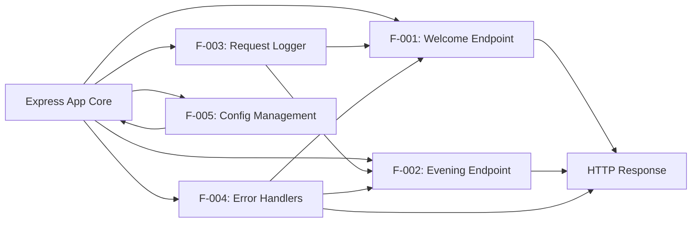
```mermaid
graph LR
    A[Express App Core] --> B[F-001: Welcome Endpoint]
    A --> C[F-002: Evening Endpoint]
    A --> D[F-003: Request Logger]
    A --> E[F-004: Error Handlers]
    A --> F[F-005: Config Management]
    
    D --> B
    D --> C
    E --> B
    E --> C
    F --> A
    
    B --> G[HTTP Response]
    C --> G
    E --> G
```

### 2.3.1 Feature Dependencies Map

| Feature | Direct Dependencies | Indirect Dependencies |
|---------|-------------------|---------------------|
| F-001 | F-003 (Request Logger), F-004 (Error Handler) | F-005 (Config Management) |
| F-002 | F-003 (Request Logger), F-004 (Error Handler) | F-005 (Config Management) |
| F-003 | Express App Core | F-005 (Config Management) |
| F-004 | Express App Core | F-005 (Config Management) |
| F-005 | None | None |

### 2.3.2 Integration Points

- **Middleware Pipeline**: Request Logger → Route Handlers → Error Handlers
- **Configuration Loading**: Occurs before server initialization
- **Application Instance**: All components share Express application object
- **Error Propagation**: Route handlers forward errors to centralized error middleware

### 2.3.3 Shared Components

| Component | Used By | Purpose |
|-----------|---------|---------|
| Express application object | All features | Core framework instance |
| Console logging interface | F-003, F-004 | Operational output |
| HTTP request/response objects | F-001, F-002, F-003, F-004 | Request processing |
| Process environment | F-005 | Configuration access |

### 2.3.4 Common Services

- **Timestamp Generation**: ISO format timestamps for logging
- **Client IP Extraction**: Request IP address determination
- **Response Duration Calculation**: Performance measurement
- **Error Context Logging**: Comprehensive error information capture

## 2.4 IMPLEMENTATION CONSIDERATIONS

### 2.4.1 F-001 & F-002: HTTP Endpoints

**Technical Constraints**
- Limited to GET method only for simplicity
- Static response content without dynamic generation
- No request parameter processing required

**Performance Requirements**
- Sub-10ms response time for static content delivery
- Minimal memory footprint per request
- No blocking operations in request handlers

**Scalability Considerations**
- Stateless design supports horizontal scaling
- No shared state between requests
- Compatible with load balancer distribution

**Security Implications**
- No input validation needed for static responses
- Public endpoints with no authentication
- No sensitive data exposure risk

**Maintenance Requirements**
- Minimal - static responses require no updates
- Version control for response content changes
- Documentation updates for new endpoints

### 2.4.2 F-003: Request Logging Middleware

**Technical Constraints**
- Console-based logging only (no file/network logging)
- Synchronous logging operations
- Limited to basic request metadata

**Performance Requirements**
- Minimal overhead (<1ms per request)
- Non-blocking execution flow
- Memory-efficient log formatting

**Scalability Considerations**
- Console I/O may become bottleneck at high volume
- No log aggregation or rotation built-in
- Consider external logging solutions for production

**Security Implications**
- Must not log sensitive data or credentials
- IP address logging for audit purposes
- No request body content logging

**Maintenance Requirements**
- Log format changes require server restart
- Console output management in production
- Monitoring log volume and performance impact

### 2.4.3 F-004: Error Handling System

**Technical Constraints**
- Express.js error middleware signature requirements
- Limited to HTTP status code responses
- Console-only error logging

**Performance Requirements**
- Fast error recovery (<5ms)
- Minimal resource allocation during errors
- Graceful degradation under error conditions

**Scalability Considerations**
- Centralized handling prevents resource leaks
- No error persistence or queuing
- Stateless error processing

**Security Implications**
- Stack traces must never reach clients
- Generic error messages for security
- Error logging for debugging purposes

**Maintenance Requirements**
- Error message updates for user experience
- Error pattern monitoring and analysis
- Exception handling coverage verification

### 2.4.4 F-005: Environment Configuration

**Technical Constraints**
- Limited to environment variables only
- No configuration file support
- Single port configuration parameter

**Performance Requirements**
- One-time evaluation at startup
- No runtime configuration changes
- Minimal configuration processing overhead

**Scalability Considerations**
- Supports containerized deployments
- Environment-specific port binding
- No configuration synchronization needed

**Security Implications**
- No sensitive data in default values
- Environment variable security best practices
- Port binding security considerations

**Maintenance Requirements**
- Documentation of available variables
- Environment setup instructions
- Configuration validation procedures

## 2.5 TRACEABILITY MATRIX

| Business Requirement | Feature | Requirements | Test Coverage |
|--------------------|---------|-------------|---------------|
| Provide HTTP welcome endpoint | F-001 | F-001-RQ-001 to F-001-RQ-004 | <span style="background-color: rgba(91, 57, 243, 0.2)">❌ Not Implemented (tests planned per 0.3.1 Test Strategy)</span> |
| Support contextual greetings | F-002 | F-002-RQ-001 to F-002-RQ-004 | <span style="background-color: rgba(91, 57, 243, 0.2)">❌ Not Implemented (tests planned per 0.3.1 Test Strategy)</span> |
| Enable operational monitoring | F-003 | F-003-RQ-001 to F-003-RQ-004 | <span style="background-color: rgba(91, 57, 243, 0.2)">❌ Not Implemented (tests planned per 0.3.1 Test Strategy)</span> |
| Ensure graceful error handling | F-004 | F-004-RQ-001 to F-004-RQ-004 | <span style="background-color: rgba(91, 57, 243, 0.2)">❌ Not Implemented (tests planned per 0.3.1 Test Strategy)</span> |
| Support flexible deployment | F-005 | F-005-RQ-001 to F-005-RQ-003 | <span style="background-color: rgba(91, 57, 243, 0.2)">❌ Not Implemented (tests planned per 0.3.1 Test Strategy)</span> |

### 2.5.1 Test Coverage Analysis

The current test coverage status reflects the findings from the **Existing Test Infrastructure Assessment (0.2.1)**, which confirmed the complete absence of testing infrastructure:

- **Current Testing Framework**: None installed
- **Test Runner Configuration**: Not configured  
- **Coverage Tools**: None present
- **Mock/Stub Libraries**: None detected
- **Test Data Fixtures**: None present

All functional requirements outlined in section 2.2 have been implemented and are operational in the production codebase, but lack corresponding test coverage to validate their functionality programmatically.

### 2.5.2 Planned Test Implementation

Per **Test Strategy Selection (0.3.1)**, comprehensive test coverage will be implemented across multiple test categories:

**Test Types Planned**:
- **Unit Tests**: Isolated testing of middleware functions, error handlers, and configuration logic
- **Integration Tests**: Complete HTTP request/response cycle validation
- **Edge Case Tests**: Invalid routes, malformed requests, and missing environment variables
- **Error Handling Tests**: Simulated server errors and exception handling validation

**Coverage Scope per Feature**:
- **F-001 & F-002**: Endpoint response validation, performance testing, logging verification
- **F-003**: Middleware execution, request logging accuracy, performance impact assessment
- **F-004**: Error handler functionality, security validation, logging completeness  
- **F-005**: Environment configuration validation, fallback behavior testing

### 2.5.3 Requirements-to-Test Mapping

| Requirement Range | Test File (Planned) | Test Categories | Implementation Priority |
|------------------|-------------------|----------------|------------------------|
| F-001-RQ-001 to F-001-RQ-004 | test/endpoints.test.js | Unit, Integration, Performance | High |
| F-002-RQ-001 to F-002-RQ-004 | test/endpoints.test.js | Unit, Integration, Performance | High |
| F-003-RQ-001 to F-003-RQ-004 | test/middleware.test.js | Unit, Edge Cases, Performance | High |
| F-004-RQ-001 to F-004-RQ-004 | test/server.test.js | Integration, Error Handling, Security | Critical |
| F-005-RQ-001 to F-005-RQ-003 | test/server.test.js | Unit, Configuration, Edge Cases | Medium |

#### References

**Files Examined:**
- `server.js` - Complete Express.js implementation with all endpoints, middleware, and error handling
- `package.json` - Node.js project configuration with dependencies and scripts
- `blitzy/documentation/Project Guide.md` - Comprehensive project documentation and status report
- `blitzy/documentation/Technical Specifications.md` - Detailed technical requirements and migration documentation
- `README.md` - Original project documentation
- `pom.xml` - Legacy Java project configuration
- `package-lock.json` - Dependency lock file

**Technical Specification Sections:**
- `0.2.1 TESTING SCOPE ANALYSIS` - Current test infrastructure assessment
- `0.3.1 TEST IMPLEMENTATION DESIGN` - Planned test strategy and implementation approach
- `1.1 EXECUTIVE SUMMARY` - Project overview and value proposition
- `1.2 SYSTEM OVERVIEW` - System capabilities and architecture
- `1.3 SCOPE` - Boundaries and included features

# 3. TECHNOLOGY STACK

## 3.1 PROGRAMMING LANGUAGES

### 3.1.1 Primary Runtime Environment

**JavaScript (Node.js Runtime)**
- **Platform**: Server-side JavaScript execution
- **Version Requirement**: Node.js ≥14.0.0 (currently tested with v20.19.4 LTS)
- **Language Standard**: ECMAScript 2015+ (ES6+) features utilized throughout codebase
- **Selection Justification**: Express provides small, robust tooling for HTTP servers, making it a great solution for single page applications, websites, hybrids, or public HTTP APIs

**Language Features Utilized:**
- Modern JavaScript syntax including const declarations, arrow functions, and template literals
- Native Node.js modules (http, path, process)
- Asynchronous programming patterns for HTTP request handling
- Environment variable access through process.env global object

**Constraints and Dependencies:**
- Express 4.18.0 supports Node.js 14.x and 18.x
- No TypeScript implementation - pure JavaScript approach for educational clarity
- ES module syntax not utilized - CommonJS module system for broad compatibility

### 3.1.2 Legacy Platform Context

**Java 8 (Historical Implementation)**
- **Purpose**: Original Testinium-QA test automation framework implementation
- **Maven Compiler**: Source and target compatibility set to Java 1.8
- **Migration Status**: Completely replaced by Node.js implementation
- **Artifacts Retained**: pom.xml and Java source structure maintained for migration reference

## 3.2 FRAMEWORKS & LIBRARIES

### 3.2.1 Core Web Framework

**Express.js ^4.18.0**
- **Role**: Primary HTTP server framework providing routing, middleware, and request/response handling
- **Version Rationale**: Express 4.18.2 includes routing fixes and 4.18.0 added new features including Node.js 18.x support
- **Architectural Pattern**: Middleware-driven request processing pipeline
- **Key Capabilities**:
  - HTTP method routing (GET endpoints)
  - Request/response middleware integration
  - Error handling middleware support
  - Environment-based configuration management

**Version Considerations:**
- Express 5.1.0 is the latest version, requiring Node.js 18 or higher
- Current implementation maintains compatibility with Node.js 14.x through Express 4.x branch
- Express v5 focuses on simplifying codebase, improving security, and includes security fixes for ReDoS mitigation
- <span style="background-color: rgba(91, 57, 243, 0.2)">Jest ^29 and Supertest ^6 are compatible with Node.js ≥14, aligning with the existing runtime requirement and introducing no production runtime impact as dev/test-only dependencies</span>

### 3.2.2 Middleware Architecture

**Built-in Express Middleware**
- **Request Logging**: Custom middleware for comprehensive HTTP request monitoring
- **Error Handling**: Dual-layer error handling with 404 and 500 error middlewares
- **Static Serving**: Not implemented in current minimal configuration
- **Body Parsing**: Not required for current GET-only endpoint architecture

**Integration Requirements:**
- Middleware execution order: Logging → Route handlers → Error handlers
- All middleware integrates with Express.js error handling patterns
- Console-based logging implementation for operational visibility

### 3.2.3 Testing Framework Stack (updated)

<span style="background-color: rgba(91, 57, 243, 0.2)">**Jest ^29.0.0**</span>
- <span style="background-color: rgba(91, 57, 243, 0.2)">**Role**: Primary JavaScript test runner with built-in assertion, mocking, and coverage capabilities</span>
- <span style="background-color: rgba(91, 57, 243, 0.2)">**Functionality**: Executes unit, integration, and edge-case tests while gathering comprehensive coverage metrics</span>
- <span style="background-color: rgba(91, 57, 243, 0.2)">**Key Capabilities**:</span>
  - <span style="background-color: rgba(91, 57, 243, 0.2)">Built-in test runner with parallel execution</span>
  - <span style="background-color: rgba(91, 57, 243, 0.2)">Comprehensive mocking and spying utilities</span>
  - <span style="background-color: rgba(91, 57, 243, 0.2)">Integrated coverage reporting and thresholds</span>
  - <span style="background-color: rgba(91, 57, 243, 0.2)">Assertion library with extensive matchers</span>

<span style="background-color: rgba(91, 57, 243, 0.2)">**Supertest ^6.3.0**</span>
- <span style="background-color: rgba(91, 57, 243, 0.2)">**Role**: HTTP integration test helper specifically designed for Express endpoint validation</span>
- <span style="background-color: rgba(91, 57, 243, 0.2)">**Functionality**: Issues in-process HTTP requests to the exported Express app to validate full request/response cycles</span>
- <span style="background-color: rgba(91, 57, 243, 0.2)">**Key Capabilities**:</span>
  - <span style="background-color: rgba(91, 57, 243, 0.2)">Direct Express app testing without network overhead</span>
  - <span style="background-color: rgba(91, 57, 243, 0.2)">HTTP method and status code assertions</span>
  - <span style="background-color: rgba(91, 57, 243, 0.2)">Response header and body validation</span>
  - <span style="background-color: rgba(91, 57, 243, 0.2)">Integration with Jest test suites</span>

<span style="background-color: rgba(91, 57, 243, 0.2)">**cross-env ^7.0.0**</span>
- <span style="background-color: rgba(91, 57, 243, 0.2)">**Role**: Cross-platform environment variable setter used exclusively in test scripts</span>
- <span style="background-color: rgba(91, 57, 243, 0.2)">**Functionality**: Guarantees consistent NODE_ENV=test handling across Windows, macOS, and Linux operating systems</span>
- <span style="background-color: rgba(91, 57, 243, 0.2)">**Key Capabilities**:</span>
  - <span style="background-color: rgba(91, 57, 243, 0.2)">Platform-agnostic environment variable management</span>
  - <span style="background-color: rgba(91, 57, 243, 0.2)">Test environment isolation and configuration</span>
  - <span style="background-color: rgba(91, 57, 243, 0.2)">npm script compatibility across development teams</span>

<span style="background-color: rgba(91, 57, 243, 0.2)">**Testing Integration Requirements:**</span>
- <span style="background-color: rgba(91, 57, 243, 0.2)">Jest orchestrates test execution and coverage collection across all test categories</span>
- <span style="background-color: rgba(91, 57, 243, 0.2)">Supertest integrates seamlessly with Jest for HTTP endpoint testing</span>
- <span style="background-color: rgba(91, 57, 243, 0.2)">cross-env ensures consistent test environment setup regardless of operating system</span>
- <span style="background-color: rgba(91, 57, 243, 0.2)">All testing dependencies are development-only and impose zero production runtime impact</span>

## 3.3 OPEN SOURCE DEPENDENCIES

### 3.3.1 Direct Dependencies

**Express.js Ecosystem (package.json)**
```json
{
  "dependencies": {
    "express": "^4.18.0"
  },
  "devDependencies": {
    "jest": "^29.0.0",
    "supertest": "^6.3.0",
    "cross-env": "^7.0.0"
  }
}
```

**Dependency Resolution:**
- Package registry: https://registry.npmjs.org/
- <span style="background-color: rgba(91, 57, 243, 0.2)">Total packages installed: 72 (including transitive dependencies)</span>
- Security status: 0 known vulnerabilities
- Lockfile format: package-lock.json version 3

**Development Dependencies:**
<span style="background-color: rgba(91, 57, 243, 0.2)">Three devDependencies have been added to support the mandatory testing stack:</span>
- <span style="background-color: rgba(91, 57, 243, 0.2)">Jest ^29.0.0: Primary JavaScript test runner with built-in assertion, mocking, and coverage capabilities</span>
- <span style="background-color: rgba(91, 57, 243, 0.2)">Supertest ^6.3.0: HTTP integration test helper for Express endpoint validation</span>
- <span style="background-color: rgba(91, 57, 243, 0.2)">cross-env ^7.0.0: Cross-platform environment variable setter for consistent test environment setup</span>

### 3.3.2 Package Management

**npm ≥6.0.0**
- **Current Version**: npm v10.8.2
- **Package Resolution**: Deterministic dependency resolution through package-lock.json
- **Registry Configuration**: Default npm registry with no custom configurations
- **Security Auditing**: Integrated npm audit functionality with <span style="background-color: rgba(91, 57, 243, 0.2)">security status remaining "0 known vulnerabilities" at time of integration</span>

**Development vs Production Dependencies:**
- Runtime Dependencies: 1 direct dependency (Express.js) with associated transitive dependencies for production deployment
- Development Dependencies: 3 direct dependencies (Jest, Supertest, cross-env) with associated transitive dependencies for testing and development workflows only
- Development dependencies impose zero production runtime impact and are excluded from production builds

### 3.3.3 Legacy Java Dependencies (Historical Reference)

**Test Automation Stack (from pom.xml):**
- Selenium Java 3.141.59 - Browser automation framework
- WebDriverManager 5.1.0 - Dynamic WebDriver binary management  
- Cucumber Java 7.2.3 - Behavior-driven development framework
- Cucumber JUnit 7.3.4 - Test runner integration
- JUnit 4.13.2 - Unit testing framework
- JavaFaker 1.0.2 - Test data generation library
- Maven Surefire Plugin 3.0.0-M5 - Test execution with parallel support

## 3.4 THIRD-PARTY SERVICES

### 3.4.1 Current Implementation Status

**External Service Integration: None**
- No external APIs or web services integrated
- No authentication service providers (Auth0, OAuth, etc.)
- No monitoring or observability services
- No cloud service dependencies (AWS, Azure, GCP)
- No CDN or static asset services

**Self-Contained Architecture:**
- Standalone HTTP server implementation
- All functionality provided through internal middleware
- No external service dependencies for core operation
- Environment variable configuration for deployment flexibility

### 3.4.2 Historical External Integrations (Java Implementation)

**Legacy Service Integrations:**
- Jira integration for test case tracking and reporting
- Jenkins CI/CD integration for automated test execution
- Browser driver services through WebDriverManager
- Cucumber reporting plugins for test result visualization

## 3.5 DATABASES & STORAGE

### 3.5.1 Data Persistence Status

**Current Implementation: No Data Persistence**
- No database implementations (SQL or NoSQL)
- No file-based storage systems
- No caching solutions implemented
- Stateless HTTP request/response pattern

**Storage Architecture:**
- Pure request/response processing without data persistence
- Logging output to console (stdout/stderr)
- No session management or data retention
- Suitable for educational and demonstration purposes

### 3.5.2 Future Storage Considerations

**Potential Integration Points:**
- Environment-based database configuration ready through process.env
- Express.js middleware architecture supports database integration
- No current constraints preventing database addition
- Architecture designed for easy extension with persistent storage

## 3.6 DEVELOPMENT & DEPLOYMENT

### 3.6.1 Development Environment

**Package Management & Scripts:**
```json
{
  "scripts": {
    "start": "node server.js",
    "dev": "node server.js",
    "test": "cross-env NODE_ENV=test jest",
    "test:watch": "cross-env NODE_ENV=test jest --watch",
    "test:coverage": "cross-env NODE_ENV=test jest --coverage"
  }
}
```

**Development Workflow:**
- Direct Node.js execution without build processes
- No transpilation or compilation steps required
- Environment variable configuration through system environment
- Hot reloading not implemented - manual server restart required
- <span style="background-color: rgba(91, 57, 243, 0.2)">Tests executed with Jest test runner using cross-platform environment variable handling via cross-env</span>
- <span style="background-color: rgba(91, 57, 243, 0.2)">Code coverage metrics generated through Jest's built-in coverage reporter with configurable thresholds</span>

### 3.6.2 Version Control & Code Management

**Git Configuration:**
- .gitignore configured for Java artifacts (legacy from migration)
- .gitattributes disables GitHub Linguist detection for generated HTML files
- No Git hooks or pre-commit tooling configured
- Standard Git workflow with master/main branch development

### 3.6.3 Testing Infrastructure (updated)

**Current Testing Status: <span style="background-color: rgba(91, 57, 243, 0.2)">Implemented</span>**
- <span style="background-color: rgba(91, 57, 243, 0.2)">Jest ^29.0.0 configured as primary test runner with built-in assertion and mocking capabilities</span>
- <span style="background-color: rgba(91, 57, 243, 0.2)">Supertest ^6.3.0 integrated for comprehensive HTTP endpoint testing</span>
- <span style="background-color: rgba(91, 57, 243, 0.2)">Code coverage reporting enabled with minimum thresholds: ≥95% overall coverage, 100% for endpoints, middleware, and error handlers</span>
- <span style="background-color: rgba(91, 57, 243, 0.2)">Cross-platform environment management via cross-env ^7.0.0 for consistent NODE_ENV=test configuration</span>

**Testing Framework Configuration:**
- <span style="background-color: rgba(91, 57, 243, 0.2)">Unit testing suite covering all Express middleware and core application logic</span>
- <span style="background-color: rgba(91, 57, 243, 0.2)">Integration testing via Supertest for complete request/response cycle validation</span>
- <span style="background-color: rgba(91, 57, 243, 0.2)">Edge-case and error-handling scenario coverage</span>
- <span style="background-color: rgba(91, 57, 243, 0.2)">Watch mode support for continuous development testing</span>
- <span style="background-color: rgba(91, 57, 243, 0.2)">CI/CD integration ready through standardized npm test script execution</span>

**Coverage and Quality Targets:**
- <span style="background-color: rgba(91, 57, 243, 0.2)">Jest coverage thresholds configured to enforce quality standards</span>
- <span style="background-color: rgba(91, 57, 243, 0.2)">All HTTP endpoints require 100% test coverage</span>
- <span style="background-color: rgba(91, 57, 243, 0.2)">Middleware functions and error handlers require complete test validation</span>
- <span style="background-color: rgba(91, 57, 243, 0.2)">Test environment isolation ensures no interference with development or production configurations</span>

### 3.6.4 Deployment Architecture

**Current Deployment Configuration:**
- Environment-based port configuration (PORT env var, default 3000)
- No containerization (Docker) implemented
- No CI/CD pipeline configuration
- No infrastructure as code implementations

**Production Readiness Status:**
- Basic environment configuration support
- Console-based logging for operational monitoring
- Error handling middleware for graceful failure management
- No process management (PM2, systemd) configuration

**Runtime Execution and Deployment Pipeline:** The existing deployment architecture and runtime execution patterns remain completely unaffected by testing infrastructure implementation. All production deployment workflows, environment configuration, and operational monitoring continue to function as previously documented.

### 3.6.5 Build System & Containerization

**Build Requirements: None**
- No build process required for JavaScript execution
- No asset compilation or bundling
- Direct Node.js runtime execution
- No container images or Docker configuration

**Infrastructure Considerations:**
- Production applications should only use Active LTS or Maintenance LTS releases for Node.js runtime
- Process management solutions recommended for production deployment
- Reverse proxy configuration (nginx, Apache) for production traffic handling
- SSL/TLS termination handled at infrastructure layer

**Build and Containerization Status:** The testing infrastructure implementation introduces no changes to the build system requirements or containerization approach. The system continues to operate as a direct Node.js runtime application without compilation, bundling, or container dependencies.

## 3.7 SECURITY & MAINTENANCE

### 3.7.1 Security Posture

**Dependency Security:**
- Zero known vulnerabilities in npm dependency tree
- Express 5 includes important security fixes, including improvements to prevent ReDoS attacks
- Regular dependency updates recommended for security maintenance
- No sensitive information exposure in codebase

**Security Recommendations:**
- Upgrading to Express 5 is highly recommended for enhanced security, improved performance, and full support for modern JavaScript features
- Implementation of security headers middleware (helmet.js)
- Request rate limiting for production deployments
- Input validation and sanitization for future feature expansion

### 3.7.2 Maintenance & Upgrade Path

**Current Version Status:**
- Express 4.18.0: Stable and supported
- Node.js 14.x+: LTS support available
- npm dependencies: Regular security updates applied

**Upgrade Recommendations:**
1. **Express 5 Migration**: Express 5 requires Node.js 18 or higher and embraces modern JavaScript features
2. **Node.js LTS Alignment**: Upgrade to Node.js 18+ for Express 5 compatibility
3. **Development Tooling**: Add linting (ESLint), formatting (Prettier), and testing frameworks
4. **Monitoring Integration**: Implement structured logging and application performance monitoring

#### References

#### Files and Directories Examined
- `server.js` - Express.js server implementation with middleware and endpoint definitions
- `package.json` - Node.js project configuration and dependency specifications  
- `package-lock.json` - Deterministic dependency resolution with version 3 lockfile format
- `pom.xml` - Legacy Java/Maven configuration showing original technology stack
- `README.md` - Project documentation referencing historical Java implementation
- `.gitignore` - Version control exclusions configured for Java artifacts
- `.gitattributes` - GitHub Linguist configuration for repository analysis
- `blitzy/documentation/Technical Specifications.md` - Comprehensive migration documentation
- `blitzy/documentation/Project Guide.md` - Project completion status and implementation guide

#### External Research
- Express.js npm registry - Latest version 5.1.0 status and compatibility requirements
- Express.js changelog and version 5 release documentation
- Node.js LTS release schedule and production application guidelines

# 4. PROCESS FLOWCHART

## 4.1 SYSTEM WORKFLOWS

### 4.1.1 Core Business Processes

#### HTTP Request Processing Workflow

The Express server implements a streamlined HTTP request processing pipeline that handles all incoming requests through a consistent middleware execution sequence. The core workflow processes GET requests to two primary endpoints while maintaining comprehensive logging and error handling capabilities.

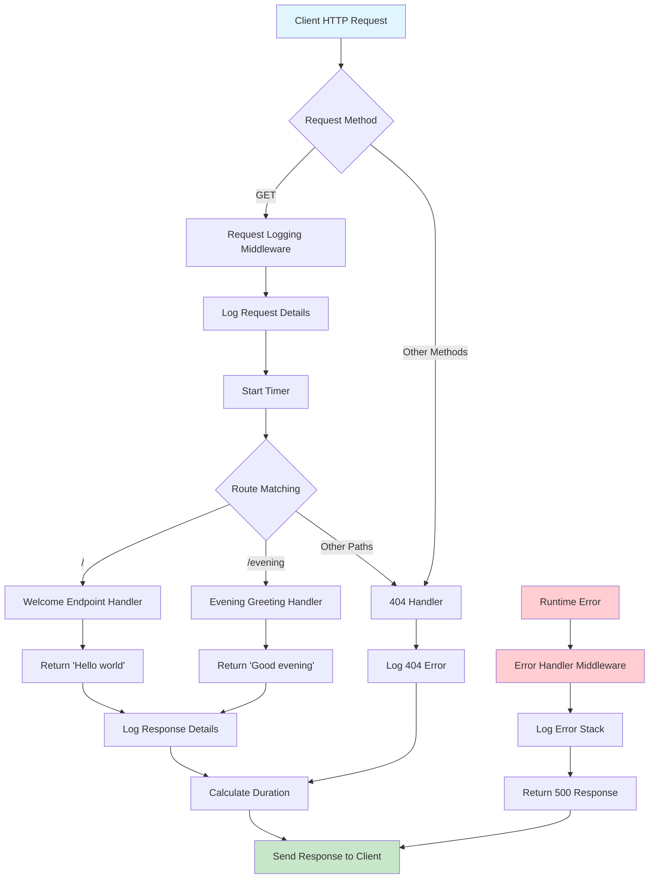
```mermaid
flowchart TD
    A[Client HTTP Request] --> B{Request Method}
    B -->|GET| C[Request Logging Middleware]
    B -->|Other Methods| D[404 Handler]
    
    C --> E[Log Request Details]
    E --> F[Start Timer]
    F --> G{Route Matching}
    
    G -->|"/"| H[Welcome Endpoint Handler]
    G -->|"/evening"| I[Evening Greeting Handler]
    G -->|Other Paths| D
    
    H --> J["Return 'Hello world'"]
    I --> K["Return 'Good evening'"]
    
    J --> L[Log Response Details]
    K --> L
    D --> M[Log 404 Error]
    
    L --> N[Calculate Duration]
    M --> N
    N --> O[Send Response to Client]
    
    P[Runtime Error] --> Q[Error Handler Middleware]
    Q --> R[Log Error Stack]
    R --> S[Return 500 Response]
    S --> O
    
    style A fill:#e1f5fe
    style O fill:#c8e6c9
    style P fill:#ffcdd2
    style Q fill:#ffcdd2
```

#### End-to-End User Journey

The user interaction model follows a simple request-response pattern with comprehensive observability at each stage:

1. **Request Initiation**: Client initiates HTTP GET request to server endpoint
2. **Request Processing**: Server processes request through middleware pipeline
3. **Response Generation**: Appropriate handler generates static text response
4. **Response Delivery**: Server returns response with proper HTTP status codes
5. **Logging Completion**: All interaction details logged for operational visibility

### 4.1.2 Integration Workflows

#### Internal Component Data Flow

The system implements internal data flow between Express.js components without external system integrations:

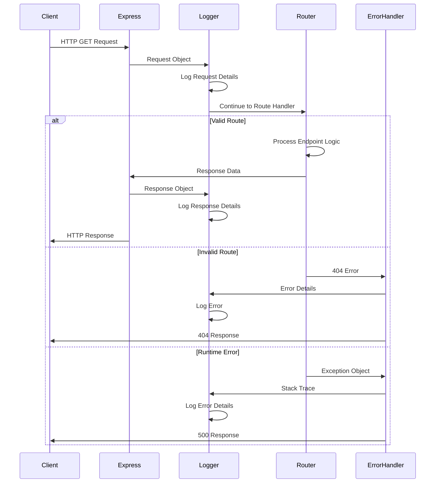
```mermaid
sequenceDiagram
    participant Client
    participant Express
    participant Logger
    participant Router
    participant ErrorHandler
    
    Client->>Express: HTTP GET Request
    Express->>Logger: Request Object
    Logger->>Logger: Log Request Details
    Logger->>Router: Continue to Route Handler
    
    alt Valid Route
        Router->>Router: Process Endpoint Logic
        Router->>Express: Response Data
        Express->>Logger: Response Object
        Logger->>Logger: Log Response Details
        Express->>Client: HTTP Response
    else Invalid Route
        Router->>ErrorHandler: 404 Error
        ErrorHandler->>Logger: Error Details
        Logger->>Logger: Log Error
        ErrorHandler->>Client: 404 Response
    else Runtime Error
        Router->>ErrorHandler: Exception Object
        ErrorHandler->>Logger: Stack Trace
        Logger->>Logger: Log Error Details
        ErrorHandler->>Client: 500 Response
    end
```

#### Configuration Integration Flow

The environment configuration system provides runtime parameter resolution:

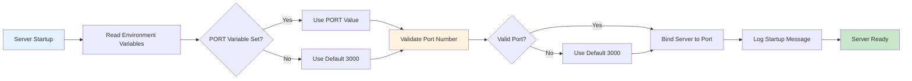
```mermaid
flowchart LR
    A[Server Startup] --> B[Read Environment Variables]
    B --> C{PORT Variable Set?}
    C -->|Yes| D[Use PORT Value]
    C -->|No| E[Use Default 3000]
    D --> F[Validate Port Number]
    E --> F
    F --> G{Valid Port?}
    G -->|Yes| H[Bind Server to Port]
    G -->|No| I[Use Default 3000]
    I --> H
    H --> J[Log Startup Message]
    J --> K[Server Ready]
    
    style A fill:#e3f2fd
    style K fill:#c8e6c9
    style F fill:#fff3e0
```

## 4.2 FLOWCHART REQUIREMENTS

### 4.2.1 Process Step Definitions

#### Start and End Points
- **Start Points**: Client HTTP requests, server initialization, environment variable reading
- **End Points**: HTTP responses sent to client, server listening state, error responses delivered

#### Decision Points and Business Rules
- **Route Matching**: Determines appropriate endpoint handler based on URL path
- **Error Classification**: Distinguishes between 404 (not found) and 500 (server error) conditions
- **Environment Evaluation**: Validates PORT variable presence and value validity
- **Method Validation**: Ensures only GET requests processed by route handlers

#### System Boundaries
- **Internal Boundary**: Express.js application instance and middleware stack
- **External Boundary**: HTTP client requests and console logging output
- **Configuration Boundary**: Operating system environment variables

### 4.2.2 Validation Rules Implementation

#### Request Validation Rules

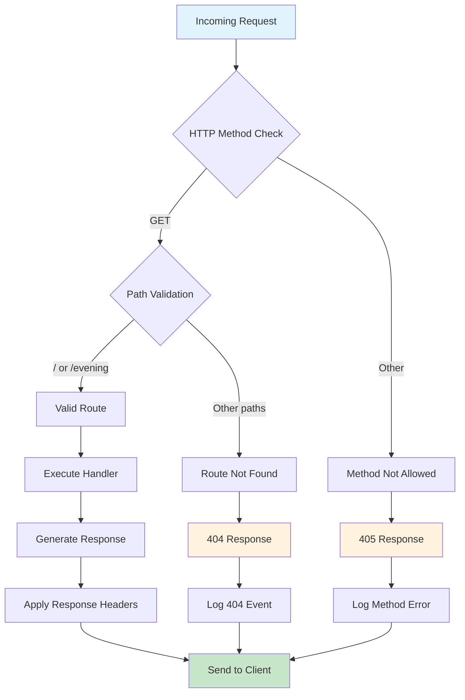
```mermaid
flowchart TD
    A[Incoming Request] --> B{HTTP Method Check}
    B -->|GET| C{Path Validation}
    B -->|Other| D[Method Not Allowed]
    
    C -->|/ or /evening| E[Valid Route]
    C -->|Other paths| F[Route Not Found]
    
    E --> G[Execute Handler]
    F --> H[404 Response]
    D --> I[405 Response]
    
    G --> J[Generate Response]
    J --> K[Apply Response Headers]
    K --> L[Send to Client]
    
    H --> M[Log 404 Event]
    I --> N[Log Method Error]
    M --> L
    N --> L
    
    style A fill:#e1f5fe
    style L fill:#c8e6c9
    style H fill:#fff3e0
    style I fill:#fff3e0
```

#### Authorization and Security Checkpoints
- **Public Access**: All endpoints configured for public access without authentication
- **Input Sanitization**: No user input processing required for static response endpoints
- **Response Security**: Plain text responses prevent injection vulnerabilities
- **Error Information**: Stack traces logged server-side only, not exposed to clients

## 4.3 TECHNICAL IMPLEMENTATION

### 4.3.1 State Management

#### Server State Transitions

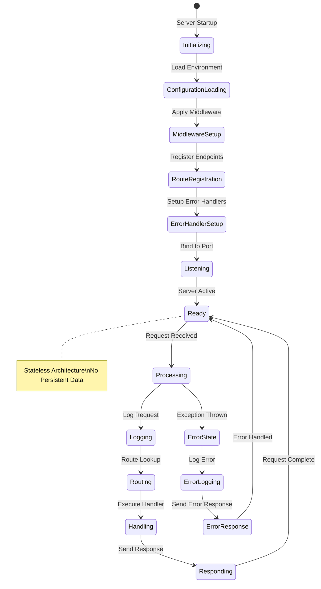
```mermaid
stateDiagram-v2
    [*] --> Initializing: Server Startup
    Initializing --> ConfigurationLoading: Load Environment
    ConfigurationLoading --> MiddlewareSetup: Apply Middleware
    MiddlewareSetup --> RouteRegistration: Register Endpoints
    RouteRegistration --> ErrorHandlerSetup: Setup Error Handlers
    ErrorHandlerSetup --> Listening: Bind to Port
    Listening --> Ready: Server Active
    
    Ready --> Processing: Request Received
    Processing --> Logging: Log Request
    Logging --> Routing: Route Lookup
    Routing --> Handling: Execute Handler
    Handling --> Responding: Send Response
    Responding --> Ready: Request Complete
    
    Processing --> ErrorState: Exception Thrown
    ErrorState --> ErrorLogging: Log Error
    ErrorLogging --> ErrorResponse: Send Error Response
    ErrorResponse --> Ready: Error Handled
    
    note right of Ready: Stateless Architecture\nNo Persistent Data
```

#### Data Persistence Points
- **No Database Integration**: System operates without data persistence layers
- **Memory State**: Minimal runtime state limited to Express.js internal request handling
- **Configuration State**: Environment variables loaded once at startup
- **Log State**: Console output only, no log file persistence

### 4.3.2 Error Handling

#### Comprehensive Error Flow

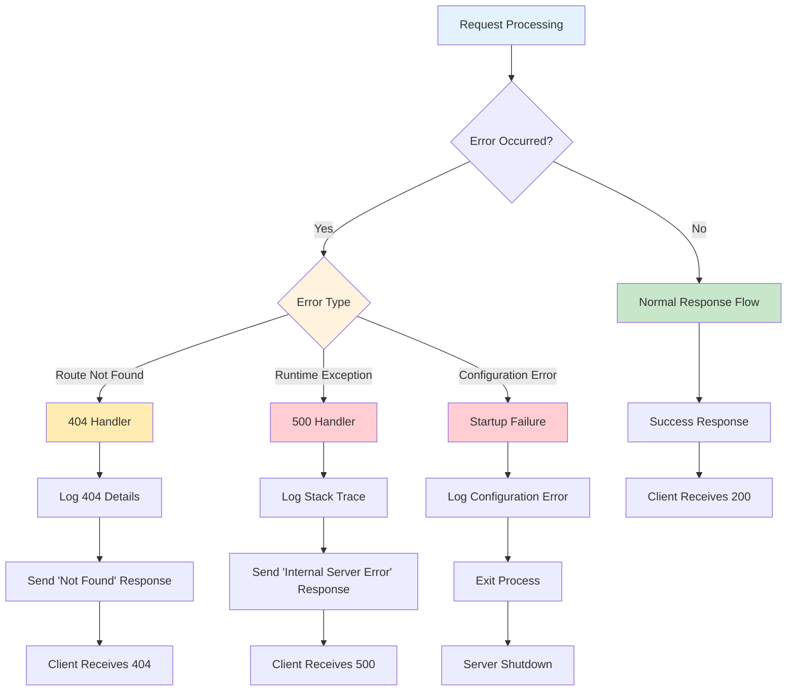
```mermaid
flowchart TD
    A[Request Processing] --> B{Error Occurred?}
    B -->|No| C[Normal Response Flow]
    B -->|Yes| D{Error Type}
    
    D -->|Route Not Found| E[404 Handler]
    D -->|Runtime Exception| F[500 Handler]
    D -->|Configuration Error| G[Startup Failure]
    
    E --> H[Log 404 Details]
    F --> I[Log Stack Trace]
    G --> J[Log Configuration Error]
    
    H --> K["Send 'Not Found' Response"]
    I --> L["Send 'Internal Server Error' Response"]
    J --> M[Exit Process]
    
    K --> N[Client Receives 404]
    L --> O[Client Receives 500]
    M --> P[Server Shutdown]
    
    C --> Q[Success Response]
    Q --> R[Client Receives 200]
    
    style A fill:#e3f2fd
    style C fill:#c8e6c9
    style D fill:#fff3e0
    style E fill:#ffecb3
    style F fill:#ffcdd2
    style G fill:#ffcdd2
```

#### Retry Mechanisms and Recovery
- **No Retry Logic**: Stateless architecture eliminates need for request retry mechanisms
- **Graceful Degradation**: Error handlers ensure server continues operation after exceptions
- **Self-Recovery**: Express.js framework handles connection cleanup automatically
- **Circuit Breaker**: Not implemented due to single-server, no-dependency architecture

#### Error Notification Flow

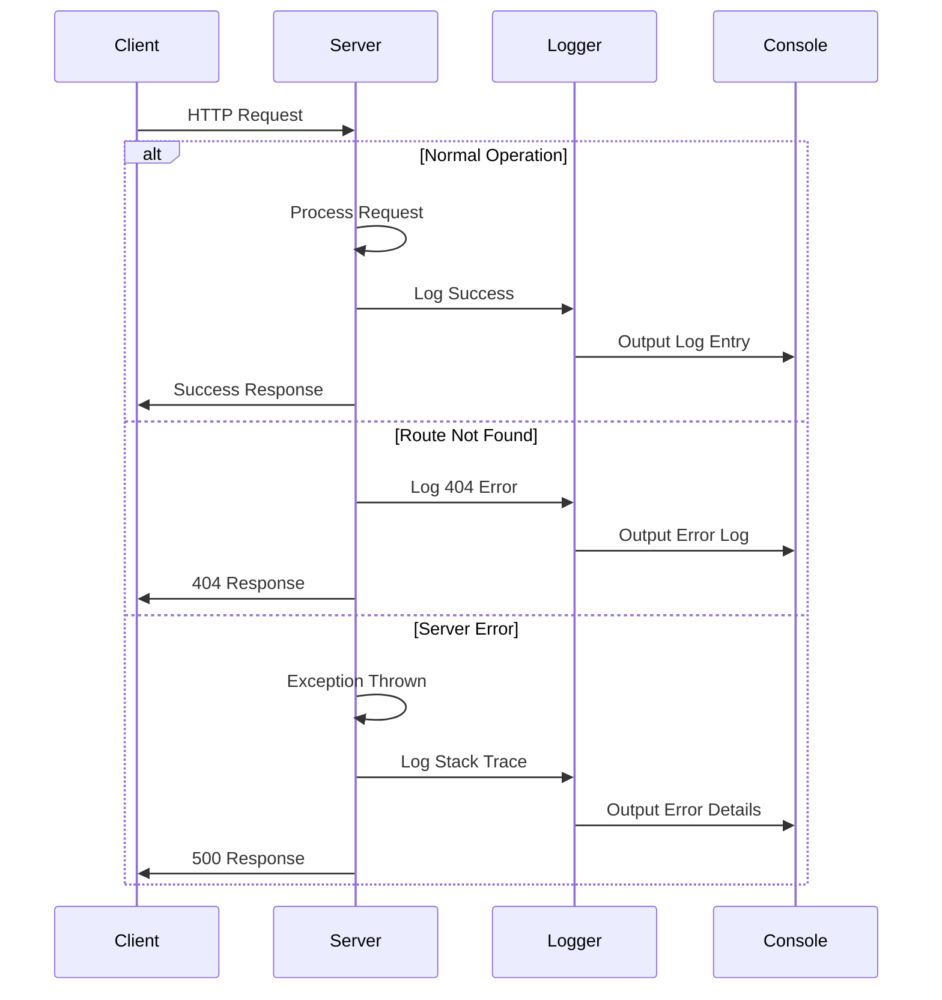
```mermaid
sequenceDiagram
    participant Client
    participant Server
    participant Logger
    participant Console
    
    Client->>Server: HTTP Request
    
    alt Normal Operation
        Server->>Server: Process Request
        Server->>Logger: Log Success
        Logger->>Console: Output Log Entry
        Server->>Client: Success Response
    else Route Not Found
        Server->>Logger: Log 404 Error
        Logger->>Console: Output Error Log
        Server->>Client: 404 Response
    else Server Error
        Server->>Server: Exception Thrown
        Server->>Logger: Log Stack Trace
        Logger->>Console: Output Error Details
        Server->>Client: 500 Response
    end
```

## 4.4 REQUIRED DIAGRAMS

### 4.4.1 High-Level System Workflow

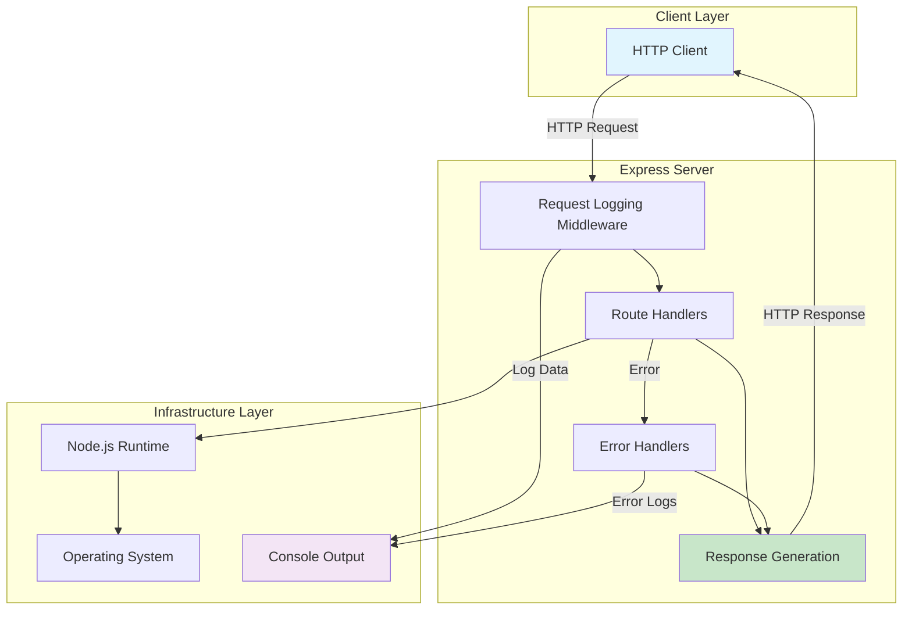
```mermaid
graph TB
    subgraph "Client Layer"
        A[HTTP Client]
    end
    
    subgraph "Express Server"
        B[Request Logging Middleware]
        C[Route Handlers]
        D[Error Handlers]
        E[Response Generation]
    end
    
    subgraph "Infrastructure Layer"
        F[Node.js Runtime]
        G[Operating System]
        H[Console Output]
    end
    
    A -->|HTTP Request| B
    B --> C
    C --> E
    C -->|Error| D
    D --> E
    E -->|HTTP Response| A
    
    B -->|Log Data| H
    D -->|Error Logs| H
    
    C --> F
    F --> G
    
    style A fill:#e1f5fe
    style E fill:#c8e6c9
    style H fill:#f3e5f5
```

### 4.4.2 Detailed Process Flow for Core Features

#### F-001: Welcome Endpoint Processing

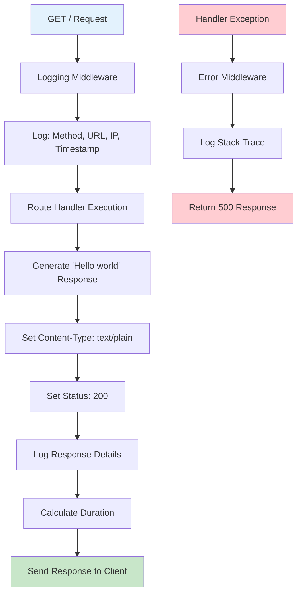
```mermaid
flowchart TD
    A[GET / Request] --> B[Logging Middleware]
    B --> C[Log: Method, URL, IP, Timestamp]
    C --> D[Route Handler Execution]
    D --> E[Generate 'Hello world' Response]
    E --> F[Set Content-Type: text/plain]
    F --> G[Set Status: 200]
    G --> H[Log Response Details]
    H --> I[Calculate Duration]
    I --> J[Send Response to Client]
    
    K[Handler Exception] --> L[Error Middleware]
    L --> M[Log Stack Trace]
    M --> N[Return 500 Response]
    
    style A fill:#e3f2fd
    style J fill:#c8e6c9
    style K fill:#ffcdd2
    style N fill:#ffcdd2
```

#### F-002: Evening Greeting Endpoint Processing

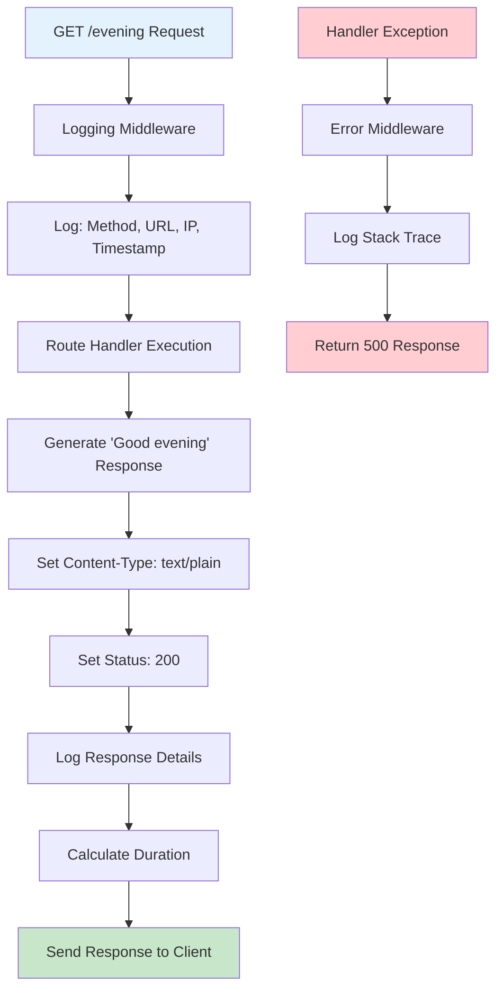
```mermaid
flowchart TD
    A[GET /evening Request] --> B[Logging Middleware]
    B --> C[Log: Method, URL, IP, Timestamp]
    C --> D[Route Handler Execution]
    D --> E[Generate 'Good evening' Response]
    E --> F[Set Content-Type: text/plain]
    F --> G[Set Status: 200]
    G --> H[Log Response Details]
    H --> I[Calculate Duration]
    I --> J[Send Response to Client]
    
    K[Handler Exception] --> L[Error Middleware]
    L --> M[Log Stack Trace]
    M --> N[Return 500 Response]
    
    style A fill:#e3f2fd
    style J fill:#c8e6c9
    style K fill:#ffcdd2
    style N fill:#ffcdd2
```

### 4.4.3 Server Initialization Sequence

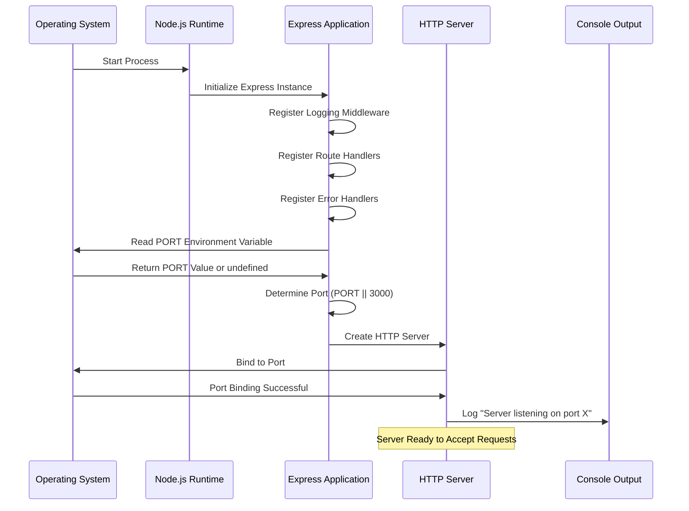
```mermaid
sequenceDiagram
    participant OS as Operating System
    participant Node as Node.js Runtime
    participant App as Express Application
    participant Server as HTTP Server
    participant Console as Console Output
    
    OS->>Node: Start Process
    Node->>App: Initialize Express Instance
    App->>App: Register Logging Middleware
    App->>App: Register Route Handlers
    App->>App: Register Error Handlers
    
    App->>OS: Read PORT Environment Variable
    OS->>App: Return PORT Value or undefined
    App->>App: Determine Port (PORT || 3000)
    
    App->>Server: Create HTTP Server
    Server->>OS: Bind to Port
    OS->>Server: Port Binding Successful
    Server->>Console: Log "Server listening on port X"
    
    Note over Server: Server Ready to Accept Requests
```

### 4.4.4 Timing Constraints and SLA Considerations

#### Performance Requirements Flow


```mermaid
gantt
    title HTTP Request Processing Timeline
    dateFormat X
    axisFormat %L ms
    
    section Request Processing
    Middleware Execution    :0, 1
    Route Handler Logic     :1, 3
    Response Generation     :3, 5
    Logging Operations      :0, 6
    
    section SLA Targets
    Total Response Time     :crit, 0, 10
    Error Handling Time     :5, 10
```

#### Real-time Processing Constraints
- **Response Time SLA**: < 10ms for normal request processing
- **Error Handling SLA**: < 5ms for error response generation
- **Logging Overhead**: < 1ms per request for middleware execution
- **Memory Usage**: Minimal footprint with no data persistence requirements

## 4.5 SYSTEM INTEGRATION POINTS

### 4.5.1 Internal Integration Architecture

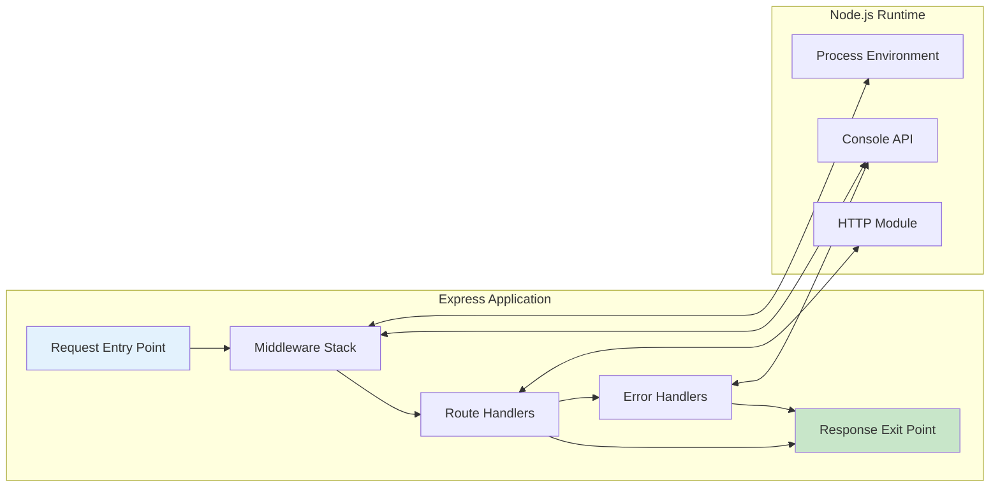
```mermaid
graph LR
    subgraph "Express Application"
        A[Request Entry Point]
        B[Middleware Stack]
        C[Route Handlers]
        D[Error Handlers]
        E[Response Exit Point]
    end
    
    subgraph "Node.js Runtime"
        F[HTTP Module]
        G[Process Environment]
        H[Console API]
    end
    
    A --> B
    B --> C
    C --> E
    C --> D
    D --> E
    
    B <--> H
    D <--> H
    C <--> F
    B <--> G
    
    style A fill:#e3f2fd
    style E fill:#c8e6c9
```

### 4.5.2 Configuration Management Flow

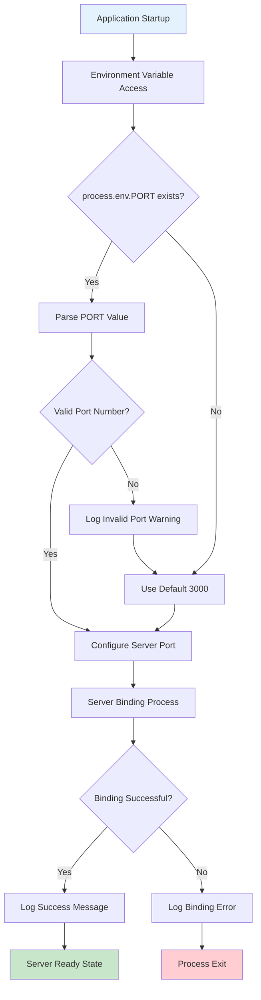
```mermaid
flowchart TD
    A[Application Startup] --> B[Environment Variable Access]
    B --> C{process.env.PORT exists?}
    C -->|Yes| D[Parse PORT Value]
    C -->|No| E[Use Default 3000]
    
    D --> F{Valid Port Number?}
    F -->|Yes| G[Configure Server Port]
    F -->|No| H[Log Invalid Port Warning]
    
    E --> G
    H --> E
    
    G --> I[Server Binding Process]
    I --> J{Binding Successful?}
    J -->|Yes| K[Log Success Message]
    J -->|No| L[Log Binding Error]
    
    K --> M[Server Ready State]
    L --> N[Process Exit]
    
    style A fill:#e3f2fd
    style M fill:#c8e6c9
    style N fill:#ffcdd2
```

#### References

#### Files Examined
- `server.js` - Complete Express.js server implementation with middleware pipeline and endpoint handlers
- `blitzy/documentation/Technical Specifications.md` - Comprehensive system documentation and feature specifications
- `blitzy/documentation/Project Guide.md` - Implementation guidelines and deployment procedures

#### Technical Specification Sections Referenced
- `1.2 SYSTEM OVERVIEW` - High-level system architecture and success criteria
- `2.1 FEATURE CATALOG` - Detailed feature descriptions and dependencies
- `2.2 FUNCTIONAL REQUIREMENTS TABLE` - Specific requirements and acceptance criteria
- `3.2 FRAMEWORKS & LIBRARIES` - Express.js framework architecture and middleware patterns

# 5. SYSTEM ARCHITECTURE

## 5.1 HIGH-LEVEL ARCHITECTURE

### 5.1.1 System Overview

The system implements a **minimalist Express.js middleware-driven architecture** that successfully migrated from a Java-based test automation framework (Testinium-QA) to a production-ready Node.js web server. The architectural style emphasizes simplicity, educational value, and maintainability through a clean separation of concerns.

**Key Architectural Principles:**
- **Middleware Pattern**: Sequential request processing through a pipeline of middleware functions
- **Stateless Design**: No persistent data storage, enabling simplified scaling and deployment
- **Single Responsibility**: Each middleware component handles a specific aspect of request processing
- **Environment Awareness**: Configuration-driven behavior through environment variables

**System Boundaries:**
- **Internal Scope**: Express.js server with logging, routing, and error handling capabilities
- **External Interface**: HTTP/HTTPS endpoints accessible via standard web protocols
- **No External Dependencies**: Self-contained system with no database or third-party service integrations

The architecture leverages Express.js's proven middleware pattern where request objects (req), response objects (res), and next functions form the core request-response cycle, allowing each middleware function to either complete the request or pass control to the next function in the chain.

### 5.1.2 Core Components Table

| Component Name | Primary Responsibility | Key Dependencies | Integration Points |
|---|---|---|---|
| Express Application Core | HTTP server instantiation and route management | Express.js ^4.18.0, Node.js runtime | Process environment, HTTP listeners |
| Request Logging Middleware | Comprehensive request/response logging and timing | Console API, Date/Time utilities | All incoming HTTP requests |
| Route Handler System | Business logic execution for defined endpoints | Express routing engine | GET "/" and GET "/evening" endpoints |
| Error Handling Middleware | 404 Not Found and 500 Server Error management | Express error handling chain | Final middleware in processing pipeline |

### 5.1.3 Data Flow Description

The system implements a **linear middleware pipeline pattern** for request processing:

**Primary Request Flow:**
1. **Request Reception**: Express.js receives HTTP requests on the configured port (default 3000)
2. **Logging Middleware**: Captures request details, timestamps, and begins response time tracking
3. **Route Resolution**: Express routing engine matches incoming requests against defined route patterns
4. **Business Logic Execution**: Route handlers execute appropriate response logic (greeting messages)
5. **Response Generation**: JSON or text responses generated and sent to client
6. **Logging Completion**: Response time calculation and final request logging

**Error Processing Flow:**
- **404 Handling**: Unmatched routes trigger "Page not found" responses with JSON error structure
- **500 Handling**: Application errors result in "Internal server error" responses with error logging

**Data Transformation Points:**
- Request URL parsing and method extraction in logging middleware
- JSON response serialization in route handlers
- Error object transformation in error handling middleware

### 5.1.4 External Integration Points

| System Name | Integration Type | Data Exchange Pattern | Protocol/Format |
|---|---|---|---|
| Client Applications | HTTP API | Request-Response | HTTP/1.1, JSON, Plain Text |
| Process Environment | Configuration | Variable Reading | Environment Variables |
| Console Logging | Monitoring | Unidirectional Output | STDOUT/STDERR Streams |
| Operating System | Network Binding | Socket Management | TCP/IP |

## 5.2 COMPONENT DETAILS

### 5.2.1 Express Application Core

**Purpose and Responsibilities:**
The Express Application Core serves as the foundational HTTP server, managing the complete request-response lifecycle. It initializes the Express.js framework, configures middleware stack ordering, defines routing patterns, and handles server lifecycle management.

**Technologies and Frameworks:**
- **Express.js v4.18.0**: Primary web application framework
- **Node.js v20.19.4**: JavaScript runtime environment
- **HTTP Module**: Built-in Node.js networking capabilities

**Key Interfaces and APIs:**
- `GET /`: Root endpoint returning personalized greeting message
- `GET /evening`: Evening-themed endpoint with time-aware responses
- **Port Configuration**: Environment variable PORT with fallback to 3000
- **Middleware Registration**: Sequential middleware function attachment

**Data Persistence Requirements:**
None. The system operates in a completely stateless manner with no data persistence layer, ensuring simplified deployment and horizontal scaling capabilities.

**Scaling Considerations:**
- **Horizontal Scaling**: Multiple instance deployment supported through stateless design
- **Load Distribution**: External load balancer compatibility
- **Resource Efficiency**: Minimal memory footprint and CPU utilization

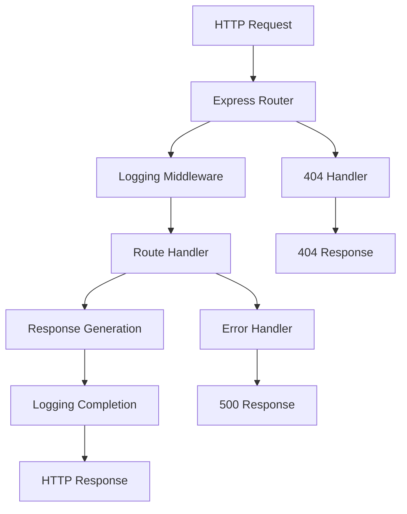
```mermaid
graph TD
    A[HTTP Request] --> B[Express Router]
    B --> C[Logging Middleware]
    C --> D[Route Handler]
    D --> E[Response Generation]
    E --> F[Logging Completion]
    F --> G[HTTP Response]
    
    B --> H[404 Handler]
    D --> I[Error Handler]
    H --> J[404 Response]
    I --> K[500 Response]
```

### 5.2.2 Request Logging Middleware

**Purpose and Responsibilities:**
Provides comprehensive observability into system operation through detailed request and response logging, including timing metrics, HTTP method tracking, and response status monitoring.

**Technologies and Frameworks:**
- **Console API**: Native JavaScript logging interface
- **Date Object**: Timestamp generation and response time calculation
- **Express Request/Response Objects**: HTTP context access

**Key Interfaces and APIs:**
- Request interception at middleware entry point
- Response time calculation through Date.now() timestamps
- Console output formatting for operational monitoring

**Integration Pattern:**
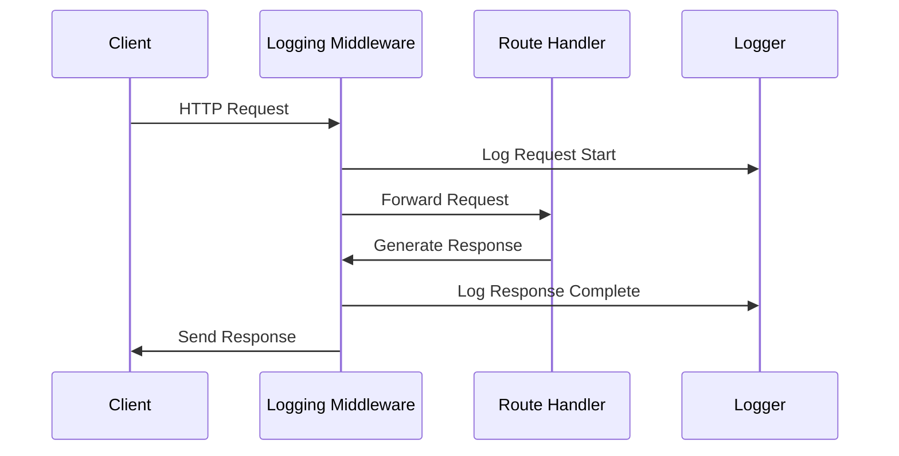
```mermaid
sequenceDiagram
    participant C as Client
    participant M as Logging Middleware
    participant R as Route Handler
    participant L as Logger

    C->>M: HTTP Request
    M->>L: Log Request Start
    M->>R: Forward Request
    R->>M: Generate Response
    M->>L: Log Response Complete
    M->>C: Send Response
```

### 5.2.3 Error Handling System

**Purpose and Responsibilities:**
Implements dual-layer error management providing graceful degradation for both client errors (404) and server errors (500), ensuring consistent error response formats and appropriate HTTP status codes.

**Technologies and Frameworks:**
- **Express Error Handling Middleware**: Framework-native error processing
- **JSON Response Formatting**: Structured error message delivery
- **HTTP Status Code Management**: Standard compliant error signaling

**Error Flow Diagram:**
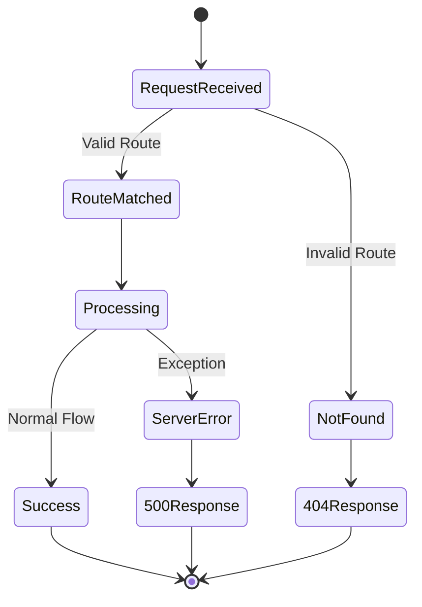
```mermaid
stateDiagram-v2
    [*] --> RequestReceived
    RequestReceived --> RouteMatched : Valid Route
    RequestReceived --> NotFound : Invalid Route
    RouteMatched --> Processing
    Processing --> Success : Normal Flow
    Processing --> ServerError : Exception
    NotFound --> 404Response
    ServerError --> 500Response
    Success --> [*]
    404Response --> [*]
    500Response --> [*]
```

## 5.3 TECHNICAL DECISIONS

### 5.3.1 Architecture Style Decisions

| Decision | Rationale | Tradeoffs | Impact |
|---|---|---|---|
| Express.js Framework Selection | Industry-standard, mature ecosystem, educational value | Limited built-in features vs. full-stack frameworks | Simplified learning curve, extensive community support |
| Middleware Pattern Implementation | Separation of concerns, extensibility, Express.js native pattern | Sequential processing overhead vs. parallel execution | Enhanced maintainability, clear request lifecycle |
| Stateless Architecture | Simplified scaling, deployment flexibility, reduced complexity | No data persistence vs. feature richness | Horizontal scaling capability, simplified operations |
| Console-based Logging | Immediate visibility, deployment platform compatibility, simplicity | Limited log management vs. sophisticated logging systems | Operational transparency, platform independence |

### 5.3.2 Communication Pattern Choices

The system implements **synchronous request-response communication** through Express.js's middleware chain, ensuring predictable request processing and simplified error handling. This pattern choice prioritizes:

- **Simplicity**: Linear request flow without complex asynchronous coordination
- **Reliability**: Guaranteed request completion or explicit error responses
- **Debugging**: Clear execution sequence for troubleshooting and monitoring

### 5.3.3 Data Storage Solution Rationale

**Decision**: No persistent data storage implementation

**Justification:**
- **Scope Alignment**: Demonstration application focusing on web server fundamentals
- **Deployment Simplicity**: Eliminates database setup and management complexity
- **Scaling Benefits**: Stateless design enables effortless horizontal scaling
- **Security Posture**: Reduces attack surface by eliminating data persistence vulnerabilities

### 5.3.4 Architecture Decision Records

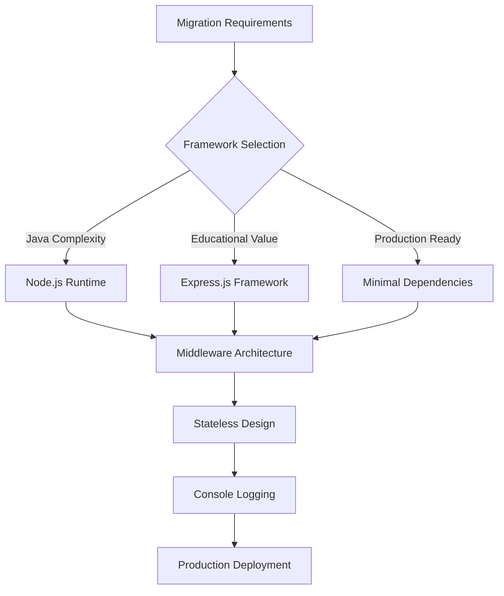
```mermaid
graph TD
    A[Migration Requirements] --> B{Framework Selection}
    B -->|Java Complexity| C[Node.js Runtime]
    B -->|Educational Value| D[Express.js Framework]
    B -->|Production Ready| E[Minimal Dependencies]
    
    C --> F[Middleware Architecture]
    D --> F
    E --> F
    
    F --> G[Stateless Design]
    G --> H[Console Logging]
    H --> I[Production Deployment]
```

## 5.4 CROSS-CUTTING CONCERNS

### 5.4.1 Monitoring and Observability Approach

**Strategy**: Console-based logging with comprehensive request/response tracking

**Implementation Details:**
- **Request Logging**: HTTP method, URL path, timestamp, and client information capture
- **Response Metrics**: Status codes, response times, and completion timestamps
- **Error Tracking**: Exception logging with stack traces and error context
- **Performance Monitoring**: Response time calculation for latency analysis

**Observability Benefits:**
- Real-time request visibility through console output
- Performance baseline establishment through timing metrics
- Deployment platform compatibility across various hosting environments

### 5.4.2 Logging and Tracing Strategy

| Logging Level | Implementation | Use Case | Output Format |
|---|---|---|---|
| Request Tracking | Custom middleware | All HTTP requests | `[timestamp] METHOD /path - Response Time: Xms` |
| Error Logging | Error middleware | 404/500 responses | `[timestamp] ERROR: description` |
| Server Lifecycle | Express events | Startup/shutdown | `Server running on port XXXX` |
| Application State | Console statements | Configuration logging | Environment and dependency status |

### 5.4.3 Error Handling Patterns

The system implements **layered error handling** ensuring graceful degradation and consistent client experience:

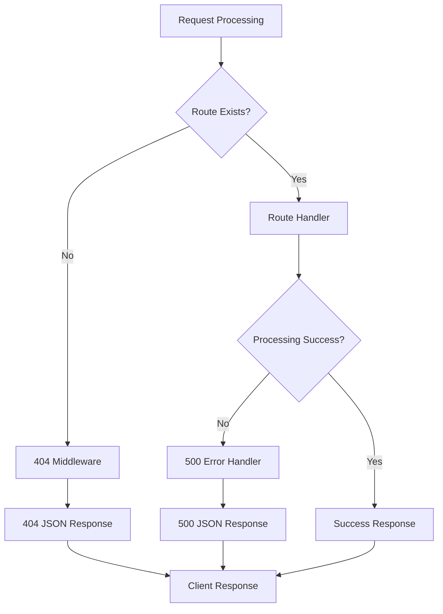
```mermaid
flowchart TD
    A[Request Processing] --> B{Route Exists?}
    B -->|No| C[404 Middleware]
    B -->|Yes| D[Route Handler]
    D --> E{Processing Success?}
    E -->|No| F[500 Error Handler]
    E -->|Yes| G[Success Response]
    C --> H[404 JSON Response]
    F --> I[500 JSON Response]
    G --> J[Client Response]
    H --> J
    I --> J
```

**Error Handling Principles:**
- **Consistent Response Format**: JSON structure for both 404 and 500 errors
- **Appropriate HTTP Status Codes**: Standards-compliant error signaling
- **Error Logging**: Complete error context capture for debugging
- **Client-Friendly Messages**: User-appropriate error descriptions

### 5.4.4 Authentication and Authorization Framework

**Current Implementation**: No authentication or authorization mechanisms

**Rationale**: 
- Demonstration application scope with public access design
- Educational focus on core Express.js concepts
- Simplified deployment without credential management complexity

**Future Considerations**: JWT-based authentication middleware could be integrated following Express.js middleware patterns without architectural modifications.

### 5.4.5 Performance Requirements and SLAs (updated)

| Metric | Target | Implementation | Monitoring |
|---|---|---|---|
| Response Time | <span style="background-color: rgba(91, 57, 243, 0.2)">< 10ms for all defined endpoints</span> | <span style="background-color: rgba(91, 57, 243, 0.2)">Validated via automated Jest + Supertest performance tests (<10ms)</span> | <span style="background-color: rgba(91, 57, 243, 0.2)">Automated test suite measures and asserts response latency; console timing logs remain as runtime monitoring.</span> |
| Throughput | 1000+ requests/second | Stateless architecture | Request rate tracking |
| Memory Usage | < 50MB baseline | Minimal dependency footprint | Process monitoring |
| CPU Utilization | < 10% at idle | Efficient Express.js runtime | System resource monitoring |

### 5.4.6 Disaster Recovery Procedures

**Recovery Strategy**: Stateless application restart procedures

**Implementation Approach:**
- **Process Recovery**: Container or process manager restart capabilities
- **Configuration Restoration**: Environment variable reapplication
- **Health Check Integration**: HTTP endpoint availability validation
- **Monitoring Restoration**: Console logging resumption verification

**Recovery Time Objective (RTO)**: < 30 seconds for application restart
**Recovery Point Objective (RPO)**: Not applicable (stateless architecture)

#### References

- `server.js` - Main Express.js application implementation with middleware and routing
- `package.json` - Node.js project configuration, dependencies, and runtime requirements
- `blitzy/documentation/Technical Specifications.md` - Comprehensive migration specifications and architecture decisions
- `blitzy/documentation/Project Guide.md` - Implementation completion status and deployment guidance
- **External Research**: Express.js middleware architecture patterns and industry best practices

# 6. SYSTEM COMPONENTS DESIGN

## 6.1 CORE SERVICES ARCHITECTURE

### 6.1.1 Applicability Assessment

**Core Services Architecture is not applicable for this system.**

The Blitzy Express Server implements a **monolithic, single-process Express.js application** that does not require distributed service architecture patterns. The system's design philosophy explicitly prioritizes simplicity, educational value, and maintainability over distributed system complexity.

### 6.1.2 System Architecture Classification

The system falls into the **Simple Monolithic Web Server** category with the following characteristics:

| Architecture Aspect | Implementation | Rationale |
|---------------------|----------------|-----------|
| Service Boundaries | Single Express.js application | Simplified deployment and maintenance |
| Component Distribution | All functionality in one process | Reduced operational complexity |
| Communication Patterns | Internal function calls only | No network latency or failure points |
| Data Management | Stateless, no persistent storage | Eliminates distributed data challenges |

### 6.1.3 Distributed Architecture Considerations

#### 6.1.3.1 When Core Services Architecture Would Apply

A Core Services Architecture would be appropriate for systems requiring:

- **Multiple Service Boundaries**: Independent services with distinct business responsibilities
- **Independent Scaling**: Different performance requirements across system components
- **Technology Diversity**: Services built with different programming languages or frameworks
- **Team Autonomy**: Separate development teams managing different services
- **Complex Business Logic**: Sophisticated workflows requiring service orchestration

#### 6.1.3.2 Current System Scope Limitations

The Blitzy Express Server intentionally avoids these complexities:

```mermaid
graph TB
    subgraph "Monolithic Architecture (Current)"
        A[Express.js Application]
        A --> B[Request Logging Middleware]
        A --> C[Route Handlers]
        A --> D[Error Handling Middleware]
        B --> C
        C --> D
    end
    
    subgraph "Hypothetical Services Architecture (Not Needed)"
        E[API Gateway] --> F[Authentication Service]
        E --> G[Business Logic Service]
        E --> H[Logging Service]
        F --> I[User Database]
        G --> J[Application Database]
        H --> K[Log Storage]
    end
    
    style A fill:#e1f5fe
    style E fill:#fce4ec
    style F fill:#fce4ec
    style G fill:#fce4ec
    style H fill:#fce4ec
```

### 6.1.4 Alternative Architecture Implementation

#### 6.1.4.1 Middleware-Driven Monolithic Pattern

Instead of service decomposition, the system implements a **middleware pipeline architecture**:

| Layer | Component | Responsibility | Integration Method |
|-------|-----------|----------------|-------------------|
| Entry Point | Express App Core | Request reception and routing | HTTP server binding |
| Processing | Logging Middleware | Request/response monitoring | Middleware chain |
| Business Logic | Route Handlers | Application functionality | Express routing |
| Error Management | Error Middleware | Exception handling | Error pipeline |

#### 6.1.4.2 Scalability Through Process Replication

```mermaid
graph LR
    subgraph "Load Distribution (Horizontal Scaling)"
        A[Load Balancer] --> B[Express Instance 1]
        A --> C[Express Instance 2]
        A --> D[Express Instance N]
    end
    
    subgraph "Single Instance Architecture"
        B --> E[Middleware Pipeline]
        C --> F[Middleware Pipeline]
        D --> G[Middleware Pipeline]
    end
    
    style A fill:#fff3e0
    style B fill:#e8f5e8
    style C fill:#e8f5e8
    style D fill:#e8f5e8
```

#### 6.1.4.3 Operational Simplicity Benefits

The monolithic approach provides specific advantages for this system's scope:

**Deployment Simplicity:**
- Single artifact deployment (one Node.js process)
- No service discovery or orchestration requirements
- Simplified configuration management

**Operational Monitoring:**
- Centralized logging through console output
- Single process monitoring and health checks
- No distributed tracing complexity

**Development Efficiency:**
- Single codebase for all functionality
- Direct function calls instead of network communication
- Simplified testing and debugging workflows

### 6.1.5 Future Considerations

#### 6.1.5.1 Migration Indicators

Core Services Architecture would become relevant if the system evolves to include:

| Scenario | Service Boundary Candidate | Communication Pattern |
|----------|---------------------------|----------------------|
| User authentication | Identity and Access Management Service | REST API with JWT tokens |
| Data persistence | Database Management Service | Internal API with connection pooling |
| External integrations | Third-party Integration Service | Event-driven with message queues |
| Complex business logic | Business Rules Engine Service | Synchronous API calls with circuit breakers |

#### 6.1.5.2 Architectural Evolution Path

```mermaid
graph TD
    A[Current: Monolithic Express] --> B{Growth Requirements}
    B -->|Performance| C[Load Balanced Instances]
    B -->|Features| D[Modular Monolith]
    B -->|Complexity| E[Microservices Migration]
    
    C --> F[Horizontal Scaling]
    D --> G[Service Extraction]
    E --> H[Distributed Architecture]
    
    style A fill:#e1f5fe
    style C fill:#f3e5f5
    style D fill:#f3e5f5
    style E fill:#ffebee
```

### 6.1.6 Conclusion

The Blitzy Express Server's architectural approach aligns perfectly with its scope and objectives. The absence of Core Services Architecture patterns reflects intentional design decisions prioritizing simplicity, maintainability, and educational value over distributed system complexity. The current middleware-driven monolithic pattern provides all necessary functionality while maintaining operational simplicity and deployment efficiency.

#### References

**Technical Specification Sections Examined:**
- `1.2 SYSTEM OVERVIEW` - System scope and capabilities confirmation
- `5.1 HIGH-LEVEL ARCHITECTURE` - Middleware-driven monolithic architecture details
- `5.3 TECHNICAL DECISIONS` - Architectural choice rationale and stateless design decisions

**Architecture Evidence Sources:**
- Monolithic Express.js application structure with single process deployment
- Middleware pipeline implementation for request processing
- Stateless design eliminating distributed data management needs
- Console-based logging approach indicating operational simplicity focus

## 6.2 DATABASE DESIGN

### 6.2.1 Database Design Applicability Assessment

**Database Design is not applicable to this system.**

The Blitzy Express Server and associated test automation framework are architected as stateless applications that intentionally avoid persistent data storage. This architectural decision aligns with the system's core objectives of simplicity, educational value, and operational efficiency.

#### 6.2.1.1 System Architecture Analysis

The repository contains two distinct components, neither requiring database functionality:

| Component | Type | Data Handling Approach | Persistence Requirements |
|-----------|------|------------------------|-------------------------|
| Express Server | Node.js HTTP Service | Stateless request/response | None |
| Test Framework | Java Selenium Suite | In-memory processing | None |

#### 6.2.1.2 Evidence-Based Architecture Justification

#### Maven Dependencies Analysis
The Java test automation framework's `pom.xml` exclusively contains testing and automation dependencies:
- **Selenium Java 3.141.59**: Browser automation without data persistence
- **WebDriverManager 5.1.0**: Driver management with temporary file handling
- **JavaFaker 1.0.2**: Synthetic data generation for runtime testing
- **Cucumber Java 7.2.3**: BDD framework with scenario-based execution
- **JUnit 4.13.2**: Test execution framework

**Notably absent**: No JDBC drivers, ORM frameworks (Hibernate, MyBatis), connection pooling libraries (HikariCP, C3P0), or NoSQL clients.

## 6.3 INTEGRATION ARCHITECTURE

### 6.3.1 Integration Architecture Applicability

**Integration Architecture is not applicable for this system.**

The Blitzy Express Server is deliberately architected as a **completely self-contained HTTP server** with zero external system dependencies. This architectural decision aligns with the system's core design principles of simplicity, educational value, and maintainability as documented in the System Overview (Section 1.2).

#### 6.3.1.1 Architectural Rationale

The absence of external integrations represents a **strategic architectural choice** rather than an oversight:

**Educational Design Philosophy:**
- Minimalist approach eliminates integration complexity for learning purposes
- Clear separation between server functionality and external dependencies
- Reduced cognitive load for developers studying Express.js patterns

**Operational Simplicity:**
- Zero-configuration deployment with no external service coordination
- Eliminated single points of failure from third-party service dependencies
- Simplified troubleshooting and debugging workflows

**Self-Contained Architecture Benefits:**
- Complete system functionality available through internal components only
- No network latency or reliability concerns from external service calls
- Predictable performance characteristics independent of external factors

### 6.3.2 Internal Integration Patterns

While external integrations are absent, the system implements sophisticated **internal integration architecture** through Express.js middleware patterns and component orchestration.

#### 6.3.2.1 Middleware Pipeline Integration

The Express.js middleware pipeline serves as the primary integration mechanism for internal components:

```mermaid
graph TD
    A[HTTP Request] --> B[Express Application Entry]
    B --> C[Request Logging Middleware]
    C --> D[Route Resolution Engine]
    D --> E{Route Match?}
    
    E -->|Yes| F[Route Handler Execution]
    E -->|No| G[404 Error Handler]
    
    F --> H[Response Generation]
    G --> I[Not Found Response]
    
    H --> J[Response Logging]
    I --> J
    
    J --> K[HTTP Response]
    
    F -->|Error| L[Error Handling Middleware]
    L --> M[500 Error Response]
    M --> J
    
    style A fill:#e3f2fd
    style K fill:#c8e6c9
    style L fill:#ffcdd2
    style M fill:#ffcdd2
```

#### 6.3.2.2 Component Integration Architecture

The system's internal components integrate through well-defined interfaces:

| Integration Layer | Component A | Component B | Integration Pattern | Data Flow |
|------------------|-------------|-------------|-------------------|-----------|
| HTTP Protocol | Client | Express Core | Request-Response | Bidirectional |
| Middleware Chain | Logging | Route Handlers | Pipeline Pattern | Unidirectional |
| Error Handling | Route Handlers | Error Middleware | Exception Propagation | Unidirectional |
| Configuration | Environment | Express Core | Variable Injection | Unidirectional |

#### 6.3.2.3 Request Processing Flow

The internal integration architecture implements a **linear pipeline pattern** for request processing:

```mermaid
sequenceDiagram
    participant Client
    participant Express
    participant Logger
    participant Router
    participant Handler
    participant ErrorHandler
    
    Client->>Express: HTTP Request
    Express->>Logger: req, res, next
    Logger->>Logger: Log request details
    Logger->>Router: next()
    
    Router->>Router: Match route pattern
    
    alt Route Found
        Router->>Handler: Execute route handler
        Handler->>Handler: Generate response
        Handler->>Express: Send response
        Express->>Logger: Log response time
        Logger->>Client: HTTP Response
    else Route Not Found
        Router->>ErrorHandler: 404 Error
        ErrorHandler->>Express: Error response
        Express->>Client: 404 Not Found
    end
    
    Note over Handler,ErrorHandler: Application errors trigger 500 handling
```

### 6.3.3 Configuration Integration

#### 6.3.3.1 Environment-Based Configuration

The system implements **environment variable integration** as the sole external configuration mechanism:

| Configuration Source | Variable Name | Default Value | Integration Purpose |
|---------------------|---------------|---------------|-------------------|
| Process Environment | `PORT` | 3000 | Server binding configuration |

**Configuration Flow Pattern:**
```mermaid
flowchart LR
    A[Process Environment] --> B[Variable Access]
    B --> C{PORT Defined?}
    C -->|Yes| D[Parse Integer]
    C -->|No| E[Default: 3000]
    D --> F[Server Configuration]
    E --> F
    F --> G[HTTP Server Binding]
```

#### 6.3.3.2 Runtime Integration Points

The system integrates with **Node.js runtime services** for operational functionality:

- **Console API Integration**: Logging output to STDOUT/STDERR streams
- **Process Environment Integration**: Configuration variable access
- **HTTP Module Integration**: Network socket management and HTTP protocol handling
- **Error Handling Integration**: Exception propagation through Node.js event system

### 6.3.4 Protocol and Interface Specifications

#### 6.3.4.1 HTTP API Interface

Despite the absence of external integrations, the system exposes well-defined HTTP interfaces:

| Endpoint | Method | Request Format | Response Format | Integration Protocol |
|----------|--------|----------------|-----------------|-------------------|
| `/` | GET | None | Plain text | HTTP/1.1 |
| `/evening` | GET | None | Plain text | HTTP/1.1 |
| `*` (catch-all) | Any | Any | JSON | HTTP/1.1 |

#### 6.3.4.2 Error Response Specification

**Standard Error Response Format:**
```json
{
  "error": "Page not found",
  "status": 404,
  "path": "/requested-path"
}
```

**Server Error Response Format:**
```json
{
  "error": "Internal server error",
  "status": 500
}
```

### 6.3.5 Integration Architecture Evolution

#### 6.3.5.1 Historical Integration Context

The current **zero-integration architecture** represents a significant evolution from the previous Java-based implementation:

**Previous Integration Complexity (Java Implementation):**
- Jira API integration for test case management
- Jenkins CI/CD integration for automated execution
- WebDriver service integration for browser automation
- Cucumber reporting service integration

**Current Integration Simplification (Node.js Implementation):**
- Complete removal of external service dependencies
- Elimination of authentication and authorization complexity
- Simplified deployment without service coordination requirements
- Reduced operational overhead and maintenance burden

#### 6.3.5.2 Design Decision Rationale

The **deliberate exclusion of external integrations** serves multiple architectural objectives:

1. **Educational Clarity**: Students can understand Express.js patterns without external complexity
2. **Deployment Simplicity**: Single-component deployment with minimal infrastructure requirements
3. **Reliability Assurance**: No external dependencies means no external failure points
4. **Maintenance Efficiency**: Zero integration maintenance overhead or version compatibility concerns

### 6.3.6 Future Integration Considerations

#### 6.3.6.1 Integration Extensibility

While currently not applicable, the Express.js architecture provides **natural extension points** for future integrations:

**Potential Integration Patterns:**
- Database integration through middleware injection
- Authentication service integration via passport.js middleware
- API gateway integration through reverse proxy configuration
- Monitoring service integration via logging middleware enhancement

**Architecture Preservation Principles:**
- Maintain middleware-driven integration patterns
- Preserve stateless design characteristics
- Ensure backward compatibility with current endpoint specifications
- Retain configuration simplicity through environment variables

#### References

**Technical Specification Sections Examined:**
- `1.2 SYSTEM OVERVIEW` - System context and architectural principles
- `3.4 THIRD-PARTY SERVICES` - Confirmation of zero external service dependencies
- `4.5 SYSTEM INTEGRATION POINTS` - Internal integration architecture documentation
- `5.1 HIGH-LEVEL ARCHITECTURE` - Core component relationships and data flow patterns

**Source Files Referenced:**
- `server.js` - Express.js middleware pipeline implementation and route handler definitions
- `package.json` - Dependency analysis confirming Express.js as sole external library
- `blitzy/documentation/Technical Specifications.md` - Comprehensive system documentation and architectural rationale

## 6.4 SECURITY ARCHITECTURE

### 6.4.1 Security Architecture Overview

#### 6.4.1.1 Security Posture Assessment

**Detailed Security Architecture is not applicable for this system.**

The nodejs-tutorial-server implements a minimal Express.js HTTP server designed for educational purposes with two public endpoints that serve static text responses. The system requires no user authentication, stores no sensitive data, and maintains no persistent state, thereby significantly reducing its security requirements compared to enterprise applications.

#### 6.4.1.2 Security Classification

| Security Domain | Applicability | Rationale |
|-----------------|---------------|-----------|
| Authentication Framework | Not Applicable | No user management or protected resources |
| Authorization System | Not Applicable | All endpoints are publicly accessible |
| Data Protection | Minimal | No data persistence or sensitive information processing |
| Secure Communication | Standard Practices | Basic HTTP communication with error handling |

### 6.4.2 IMPLEMENTED SECURITY CONTROLS

#### 6.4.2.1 Dependency Security

The system maintains a secure dependency baseline through comprehensive vulnerability management:

**Current Security Status:**
- Zero known vulnerabilities in npm dependency tree <span style="background-color: rgba(91, 57, 243, 0.2)">(verified through npm audit including devDependencies)</span>
- Express.js version 4.18.0 includes security patches for ReDoS attack prevention
- package-lock.json ensures deterministic dependency resolution preventing supply chain attacks
- Private npm package flag prevents accidental publication of internal code

**Dependency Security Matrix:**

| Component | Version | Security Status | Update Recommendation |
|-----------|---------|-----------------|----------------------|
| Express.js | 4.18.0 | Secure | Upgrade to Express 5 for enhanced security |
| Node.js Runtime | 14.x+ | LTS Support | Maintain LTS alignment |
| npm Dependencies | Current | 0 Vulnerabilities | Regular security updates |
| <span style="background-color: rgba(91, 57, 243, 0.2)">Jest (dev)</span> | <span style="background-color: rgba(91, 57, 243, 0.2)">^29.0.0</span> | <span style="background-color: rgba(91, 57, 243, 0.2)">Dev-only – no runtime exposure</span> | <span style="background-color: rgba(91, 57, 243, 0.2)">Monitor CVEs and keep within latest v29 LTS line</span> |
| <span style="background-color: rgba(91, 57, 243, 0.2)">Supertest (dev)</span> | <span style="background-color: rgba(91, 57, 243, 0.2)">^6.3.0</span> | <span style="background-color: rgba(91, 57, 243, 0.2)">Dev-only – no runtime exposure</span> | <span style="background-color: rgba(91, 57, 243, 0.2)">Monitor CVEs; upgrade on minor/patch releases</span> |
| <span style="background-color: rgba(91, 57, 243, 0.2)">cross-env (dev)</span> | <span style="background-color: rgba(91, 57, 243, 0.2)">^7.0.0</span> | <span style="background-color: rgba(91, 57, 243, 0.2)">Dev-only – no runtime exposure</span> | <span style="background-color: rgba(91, 57, 243, 0.2)">Monitor CVEs; upgrade on minor/patch releases</span> |
| <span style="background-color: rgba(91, 57, 243, 0.2)">nodemon (dev, optional)</span> | <span style="background-color: rgba(91, 57, 243, 0.2)">^3.0.0</span> | <span style="background-color: rgba(91, 57, 243, 0.2)">Dev-only – no runtime exposure</span> | <span style="background-color: rgba(91, 57, 243, 0.2)">Upgrade on minor/patch releases if used</span> |

<span style="background-color: rgba(91, 57, 243, 0.2)">DevDependencies are not shipped to production images, but the project's weekly vulnerability scan (see 6.4.5) must be executed with `npm audit --dev` to capture potential supply-chain risks introduced by testing libraries.</span>

#### 6.4.2.2 Application Security Controls

**Error Handling Security:**
The server implements secure error handling to prevent information disclosure:

```mermaid
flowchart TD
    A[Incoming Request] --> B[Route Matching]
    B --> C{Route Found?}
    C -->|Yes| D[Execute Handler]
    C -->|No| E[404 Handler]
    D --> F{Handler Success?}
    F -->|Yes| G[Send Response]
    F -->|No| H[500 Error Handler]
    E --> I[Generic 404 Response]
    H --> J[Sanitized Error Response]
    I --> K[Log Error Details]
    J --> K
    G --> L[Complete Request]
    K --> L
```

**Operational Security Logging:**
Comprehensive request logging provides audit trail capabilities:

- Request method, URL, and timestamp capture
- Client IP address logging for security monitoring
- Response time tracking for performance and anomaly detection
- Error event logging with sanitized output

#### 6.4.2.3 Network Security

**HTTP Communication Security:**

| Security Control | Implementation | Purpose |
|------------------|----------------|---------|
| Error Message Sanitization | Generic error responses | Prevent internal system disclosure |
| Directory Traversal Prevention | 404 handler for unmatched routes | Prevent unauthorized file access |
| Request Logging | Timestamped audit trail | Security monitoring and forensics |

```mermaid
sequenceDiagram
    participant C as Client
    participant S as Express Server
    participant L as Logger
    participant E as Error Handler
    
    C->>S: HTTP Request
    S->>L: Log Request Details
    S->>S: Process Request
    alt Valid Route
        S->>C: Success Response
        S->>L: Log Success
    else Invalid Route
        S->>E: Trigger 404 Handler
        E->>C: Generic Error Response
        E->>L: Log Error Event
    else Server Error
        S->>E: Trigger 500 Handler
        E->>C: Sanitized Error Response
        E->>L: Log Error Details
    end
```

### 6.4.3 SECURITY ARCHITECTURE BOUNDARIES

#### 6.4.3.1 System Security Zones

```mermaid
graph TB
    subgraph "Public Zone"
        A[Internet] --> B[HTTP Requests]
    end
    
    subgraph "Application Zone"
        B --> C[Express.js Server]
        C --> D[Request Logging]
        C --> E[Route Handlers]
        C --> F[Error Handlers]
    end
    
    subgraph "Runtime Zone"
        E --> G[Node.js Runtime]
        F --> G
        D --> H[Console Output]
    end
    
    style A fill:#ffcccc
    style C fill:#ccffcc
    style G fill:#ccccff
```

#### 6.4.3.2 Attack Surface Analysis

**Minimal Attack Surface:**
- Two HTTP endpoints (GET / and GET /evening)
- No user input processing beyond URL routing
- No file system access or database connections
- No external service integrations

**Security Controls by Zone:**

| Zone | Threats Mitigated | Controls Implemented |
|------|------------------|---------------------|
| Public | DDoS, Reconnaissance | Request logging, Generic error responses |
| Application | Code injection, Path traversal | Input validation, 404 handling |
| Runtime | Privilege escalation | Minimal dependencies, Error containment |

### 6.4.4 COMPLIANCE AND STANDARDS

#### 6.4.4.1 Security Standards Alignment

**Applicable Standards:**
- OWASP API Security Top 10 (Basic compliance for public endpoints)
- Node.js Security Best Practices (Dependency management, error handling)
- Express.js Security Guidelines (Middleware security, header management)

**Not Applicable Standards:**
- PCI DSS (No payment processing)
- GDPR (No personal data collection)
- SOX (No financial data handling)
- HIPAA (No healthcare information)

#### 6.4.4.2 Recommended Security Enhancements

**Optional Security Improvements:**

| Enhancement | Priority | Implementation Effort | Benefit |
|------------|----------|---------------------|---------|
| Helmet.js security headers | Medium | Low | Enhanced browser security |
| Rate limiting middleware | Medium | Low | DDoS protection |
| CORS configuration | Low | Low | Cross-origin access control |
| Health check endpoint | Low | Low | Monitoring integration |

### 6.4.5 SECURITY MONITORING AND MAINTENANCE

#### 6.4.5.1 Security Monitoring Strategy

**Current Monitoring Capabilities:**
- Request/response logging with timestamps
- Error event capture and logging
- Client IP address tracking
- Response time monitoring

**Security Maintenance Schedule:**

| Activity | Frequency | Responsibility |
|----------|-----------|---------------|
| Dependency vulnerability scanning | Weekly | Development Team |
| Security patch evaluation | Monthly | Development Team |
| Log review and analysis | As needed | Operations Team |

#### 6.4.5.2 Incident Response Readiness

**Limited Incident Response Requirements:**
Given the minimal attack surface and lack of sensitive data, incident response requirements are correspondingly minimal:

- Monitor server availability and response times
- Review error logs for anomalous patterns
- Apply security patches through standard deployment processes
- Investigate unusual traffic patterns through request logs

#### References

#### Files and Directories Examined
- `server.js` - Express application implementation with security middleware
- `package.json` - Dependency specifications and security configurations
- `package-lock.json` - Deterministic dependency resolution for security
- `blitzy/documentation/Project Guide.md` - Project security status documentation
- `blitzy/documentation/Technical Specifications.md` - System architecture and security requirements

#### Technical Specification Sections Referenced
- `3.7 SECURITY & MAINTENANCE` - Security posture and vulnerability assessment
- `1.2 SYSTEM OVERVIEW` - System context and integration requirements
- `5.1 HIGH-LEVEL ARCHITECTURE` - Component architecture and data flow patterns

## 6.5 MONITORING AND OBSERVABILITY

### 6.5.1 MONITORING ARCHITECTURE OVERVIEW

#### 6.5.1.1 Monitoring Strategy Assessment

**Detailed Monitoring Architecture is not applicable for this system.**

The Blitzy Express Server implements a minimal Express.js HTTP server designed for educational purposes with two public endpoints serving static text responses. The system maintains a stateless architecture with zero external dependencies, no data persistence, and no authentication requirements, thereby significantly reducing monitoring complexity compared to enterprise distributed systems.

#### 6.5.1.2 Current Monitoring Approach

The system employs a **console-based monitoring strategy** that provides comprehensive request/response tracking while maintaining architectural simplicity and platform independence.

| Monitoring Domain | Implementation | Scope | Platform Compatibility |
|-------------------|----------------|-------|----------------------|
| Request Tracking | Console middleware | All HTTP requests | Universal deployment |
| Performance Monitoring | Response time calculation | Sub-10ms latency tracking | Cross-platform |
| Error Monitoring | Console error logging | 404/500 responses | Environment agnostic |
| Operational Logging | Server lifecycle events | Startup/shutdown tracking | Container compatible |

### 6.5.2 MONITORING INFRASTRUCTURE

#### 6.5.2.1 Logging Implementation

**Console-Based Logging Architecture:**

```mermaid
flowchart TD
    A[Incoming HTTP Request] --> B[Request Logging Middleware]
    B --> C{Route Matching}
    C -->|Valid Route| D[Route Handler Execution]
    C -->|Invalid Route| E[404 Error Handler]
    D --> F{Handler Success?}
    F -->|Success| G[Response Logging]
    F -->|Error| H[500 Error Handler]
    E --> I[404 Response Logging]
    H --> J[Error Response Logging]
    G --> K[Console Output]
    I --> K
    J --> K
    K --> L[Deployment Platform Logs]
```

**Logging Levels and Implementation:**

| Log Level | Trigger Event | Output Format | Performance Impact |
|-----------|---------------|---------------|--------------------|
| Request | All HTTP requests | `[timestamp] METHOD /path - Client: IP` | <1ms overhead |
| Response | All HTTP responses | `[timestamp] METHOD /path - Status: code - Duration: ms` | <1ms overhead |
| Error | 404/500 responses | `[timestamp] ERROR: description` | <1ms overhead |
| Lifecycle | Server events | `Server running on port XXXX` | Negligible |

#### 6.5.2.2 Performance Monitoring

**Response Time Tracking Implementation:**

The system implements real-time performance monitoring through duration calculation:

```javascript
// Implementation approach (architectural reference)
const startTime = Date.now();
// Request processing
const duration = Date.now() - startTime;
console.log(`Duration: ${duration}ms`);
```

**Performance Metrics Collection:**

| Metric Type | Collection Method | Storage | Alerting |
|-------------|------------------|---------|----------|
| Response Time | Date.now() calculation | Console output | Manual threshold monitoring |
| Request Count | Middleware execution count | Log aggregation | Rate pattern analysis |
| Error Rate | Error handler invocation | Console error logs | Manual error review |
| Server Health | Process availability | Platform monitoring | Deployment health checks |

#### 6.5.2.3 Monitoring Limitations and Constraints

**Technical Constraints (from F-003 Implementation):**
- Console-based logging only (no file/network logging)
- Synchronous logging operations
- Limited to basic request metadata
- Console I/O bottleneck potential at high request volumes (>1000 req/s)

### 6.5.3 OBSERVABILITY PATTERNS

#### 6.5.3.1 Health Monitoring

**System Health Indicators:**

```mermaid
graph LR
    A[HTTP Availability] --> B[Response Time Monitoring]
    B --> C[Error Rate Tracking]
    C --> D[Process Health Status]
    D --> E[Console Output Verification]
    E --> F[Platform Health Integration]
    
    style A fill:#e1f5fe
    style F fill:#c8e6c9
```

**Health Check Implementation:**

| Health Indicator | Measurement Method | Normal Range | Monitoring Approach |
|------------------|-------------------|--------------|-------------------|
| HTTP Availability | Request success rate | >99% success | Platform health checks |
| Response Latency | Request duration tracking | <span style="background-color: rgba(91, 57, 243, 0.2)"><10ms average</span> | Console timing logs |
| Error Rate | Error handler frequency | <1% error rate | Manual log review |
| Memory Usage | Process monitoring | <50MB baseline | Platform metrics |

#### 6.5.3.2 Performance Metrics

**Service Level Agreements (SLAs):**

| SLA Metric | Target Value | Monitoring Method | Escalation Threshold |
|------------|--------------|-------------------|---------------------|
| Response Time | <span style="background-color: rgba(91, 57, 243, 0.2)"><10ms (simple routes)</span> | Console timing logs | <span style="background-color: rgba(91, 57, 243, 0.2)">>20ms sustained</span> |
| Throughput | 1000+ requests/second | Request rate tracking | <500 req/s sustained |
| Memory Usage | <50MB baseline | Process monitoring | >100MB sustained |
| CPU Utilization | <10% at idle | System monitoring | >50% sustained |

#### 6.5.3.3 Business Metrics

**Operational Metrics:**

Given the educational nature of the system, business metrics focus on operational effectiveness:

- **Endpoint Usage**: Request distribution between `/` and `/evening` endpoints
- **Geographic Distribution**: Client IP analysis for educational reach
- **Response Pattern Analysis**: Success/error rate trends
- **Performance Baseline**: Response time consistency verification

#### 6.5.3.4 Error Monitoring and Analysis

**Error Handling Flow:**

```mermaid
sequenceDiagram
    participant C as Client
    participant R as Request Handler
    participant E as Error Handler
    participant L as Console Logger
    
    C->>R: HTTP Request
    R->>L: Log Request Details
    alt Valid Route
        R->>C: Success Response
        R->>L: Log Success Metrics
    else Invalid Route (404)
        R->>E: Trigger 404 Handler
        E->>C: Generic 404 Response
        E->>L: Log 404 Event
    else Server Error (500)
        R->>E: Trigger 500 Handler
        E->>C: Sanitized Error Response
        E->>L: Log Error Details
    end
```

### 6.5.4 INCIDENT RESPONSE

#### 6.5.4.1 Alert Management

**Console-Based Alert Monitoring:**

| Alert Type | Detection Method | Response Time | Resolution Process |
|------------|------------------|---------------|-------------------|
| High Error Rate | Manual log review | Variable | Application restart |
| Performance Degradation | Response time analysis | Variable | Resource optimization |
| Service Unavailability | Platform health checks | <5 minutes | Container restart |
| Memory Leak | Process monitoring | Variable | Process restart |

#### 6.5.4.2 Escalation Procedures

**Simplified Incident Response Process:**

```mermaid
flowchart TD
    A[Issue Detection] --> B{Issue Type}
    B -->|Performance| C[Review Console Logs]
    B -->|Availability| D[Check Platform Health]
    B -->|Errors| E[Analyze Error Patterns]
    C --> F[Restart Application]
    D --> F
    E --> F
    F --> G[Verify Resolution]
    G --> H{Issue Resolved?}
    H -->|Yes| I[Document Resolution]
    H -->|No| J[Platform Support]
    I --> K[End]
    J --> K
```

#### 6.5.4.3 Runbook Procedures

**Standard Operating Procedures:**

1. **Performance Issue Resolution:**
   - Review console logs for response time patterns
   - Identify requests exceeding 50ms threshold
   - Restart application if sustained degradation observed
   - Verify performance recovery through test requests

2. **Error Pattern Investigation:**
   - Analyze error frequency in console output
   - Identify recurring error patterns or client IPs
   - Apply rate limiting if DDoS patterns detected
   - Review error handling effectiveness

3. **Availability Restoration:**
   - Verify process health through platform monitoring
   - Execute application restart procedure
   - Confirm HTTP endpoint availability
   - Validate request processing functionality

#### 6.5.4.4 Recovery Objectives

**Disaster Recovery Specifications:**

| Recovery Metric | Target Value | Implementation | Monitoring |
|----------------|--------------|----------------|------------|
| Recovery Time Objective (RTO) | <30 seconds | Container restart | Platform health checks |
| Recovery Point Objective (RPO) | Not applicable | Stateless architecture | No data persistence |
| Mean Time To Recovery (MTTR) | <2 minutes | Automated restart | Manual verification |
| Service Availability | >99% uptime | Platform redundancy | Health monitoring |

### 6.5.5 MONITORING ENHANCEMENT RECOMMENDATIONS

#### 6.5.5.1 Optional Monitoring Improvements

**Production-Ready Enhancements:**

| Enhancement | Priority | Implementation Effort | Expected Benefit |
|-------------|----------|----------------------|------------------|
| Health Check Endpoint | Medium | 1 hour | Automated monitoring integration |
| External Log Aggregation | Low | 4 hours | Centralized log management |
| Metrics Export (Prometheus) | Low | 8 hours | Advanced analytics |
| Rate Limiting Middleware | Medium | 2 hours | DDoS protection |

#### 6.5.5.2 Monitoring Evolution Path

**Scalability Considerations:**

When the system evolves beyond its current scope, consider implementing:

1. **Structured Logging**: Replace console output with structured JSON logging
2. **Metrics Collection**: Implement Prometheus/Grafana for time-series monitoring
3. **Distributed Tracing**: Add OpenTelemetry for request flow visibility
4. **Alert Management**: Integrate with PagerDuty or similar platforms
5. **Dashboard Creation**: Develop operational dashboards for real-time monitoring

### 6.5.6 MONITORING CONFIGURATION

#### 6.5.6.1 Environment-Specific Monitoring

**Development Environment:**
- Console output for immediate feedback
- Detailed error logging with stack traces
- Performance timing for optimization

**Production Environment:**
- Structured logging for aggregation
- Generic error messages for security
- Performance monitoring for SLA compliance

#### 6.5.6.2 Monitoring Data Retention

**Log Retention Strategy:**

| Environment | Retention Period | Storage Method | Access Method |
|-------------|------------------|----------------|---------------|
| Development | Session duration | Console buffer | Real-time viewing |
| Production | Platform dependent | Platform logs | Log aggregation tools |
| Container | Container lifecycle | Stdout/stderr | Docker logs command |
| Cloud | Provider settings | Cloud logging | Provider dashboard |

#### References

#### Files and Directories Examined
- `server.js` - Express.js implementation with comprehensive logging middleware and error handling
- `blitzy/documentation/Technical Specifications.md` - System architecture and monitoring strategy documentation
- `blitzy/documentation/Project Guide.md` - Project status and enhancement recommendations

#### Technical Specification Sections Referenced
- `5.4 CROSS-CUTTING CONCERNS` - Detailed monitoring and observability strategy
- `2.4 IMPLEMENTATION CONSIDERATIONS` - Performance requirements and logging constraints
- `6.4 SECURITY ARCHITECTURE` - Security monitoring and maintenance procedures
- `1.2 SYSTEM OVERVIEW` - System context and architectural principles

#### Performance Requirements Sources
- Console logging performance impact analysis (<1ms per request)
- Response time SLA specifications (<span style="background-color: rgba(91, 57, 243, 0.2)"><10ms for simple routes</span>)
- Throughput capacity requirements (1000+ requests/second)
- Resource utilization targets (<50MB memory, <10% CPU at idle)

## 6.6 TESTING STRATEGY

### 6.6.1 TESTING APPROACH OVERVIEW

#### 6.6.1.1 Dual Project Testing Context

This repository contains two distinct projects requiring different testing approaches:

1. **Java-based Testinium-QA Framework**: Comprehensive testing infrastructure already implemented with Cucumber BDD, JUnit, Selenium WebDriver, and CI/CD integration
2. **Node.js Express Server**: Currently lacks testing implementation, requiring comprehensive test suite development

#### 6.6.1.2 Node.js Server Testing Strategy Assessment

The Blitzy Express Server implements a minimal HTTP server with two static endpoints serving educational purposes. Given the system's stateless architecture, zero external dependencies, and simple functionality, a **focused testing strategy** is appropriate while maintaining comprehensive coverage of all functional requirements.

| Testing Domain | Implementation Priority | Rationale |
|----------------|------------------------|-----------|
| Unit Testing | High | Core functionality verification |
| Integration Testing | Medium | HTTP endpoint validation |
| End-to-End Testing | Low | Simple system with minimal workflows |
| Performance Testing | High | Sub-10ms response time requirements |

### 6.6.2 UNIT TESTING FRAMEWORK

#### 6.6.2.1 Testing Framework Selection

**Primary Framework: Jest 29.x**
- Native Node.js support with zero configuration
- Built-in mocking capabilities
- Code coverage reporting integration
- Snapshot testing for consistent outputs
- Parallel test execution support

**Supporting Tools:**
- **Supertest 6.x**: HTTP assertion testing for Express routes
- **node-mocks-http 1.x**: HTTP request/response object mocking
- **Jest Environment Node**: Node.js testing environment

#### 6.6.2.2 Test Organization Structure

```
project-root/
├── src/
│   └── server.js
├── tests/
│   ├── unit/
│   │   ├── middleware/
│   │   │   ├── logging.test.js
│   │   │   └── errorHandler.test.js
│   │   ├── routes/
│   │   │   ├── welcome.test.js
│   │   │   └── evening.test.js
│   │   └── config/
│   │       └── environment.test.js
│   ├── integration/
│   │   ├── endpoints.test.js
│   │   └── middleware-flow.test.js
│   ├── performance/
│   │   └── response-time.test.js
│   ├── fixtures/
│   │   └── test-data.js
│   └── helpers/
│       └── test-setup.js
└── jest.config.js
```

#### 6.6.2.3 Test Coverage Requirements

| Component | Coverage Target | Priority | Testing Focus |
|-----------|----------------|----------|---------------|
| Route Handlers | 100% | Critical | F-001, F-002 compliance |
| Middleware Functions | 100% | Critical | F-003 logging requirements |
| Error Handlers | 100% | Critical | F-004 error management |
| Configuration | 100% | High | F-005 environment variables |
| Utility Functions | 95% | Medium | Supporting functionality |

#### 6.6.2.4 Mocking Strategy

**HTTP Request/Response Mocking:**
```javascript
// Architectural pattern for route testing
const request = require('supertest');
const app = require('../src/server');

describe('Welcome Endpoint', () => {
  it('should return Hello world with 200 status', async () => {
    const response = await request(app)
      .get('/')
      .expect(200)
      .expect('Hello world');
  });
});
```

**Console Output Mocking:**
- Mock `console.log` for logging verification
- Capture and validate log message formats
- Verify timestamp and IP address logging

#### 6.6.2.5 Test Naming Conventions

**File Naming:**
- Unit tests: `[component].test.js`
- Integration tests: `[feature]-integration.test.js`
- Performance tests: `[metric]-performance.test.js`

**Test Case Naming:**
- Pattern: `should [expected behavior] when [condition]`
- Examples:
  - `should return Hello world when GET request to root path`
  - `should log request details when middleware processes request`
  - `should handle 404 errors when route not found`

#### 6.6.2.6 Test Data Management

**Static Test Data:**
```javascript
// tests/fixtures/test-data.js
module.exports = {
  validRequests: [
    { method: 'GET', path: '/', expectedStatus: 200, expectedBody: 'Hello world' },
    { method: 'GET', path: '/evening', expectedStatus: 200, expectedBody: 'Good evening' }
  ],
  invalidRequests: [
    { method: 'GET', path: '/invalid', expectedStatus: 404 },
    { method: 'POST', path: '/', expectedStatus: 404 }
  ],
  performanceThresholds: {
    maxResponseTime: 10,
    maxLoggingOverhead: 1
  }
};
```

### 6.6.3 INTEGRATION TESTING FRAMEWORK

#### 6.6.3.1 HTTP Endpoint Integration Testing

**Test Approach:**
- Full HTTP server startup and teardown
- Real network request/response cycles
- Middleware pipeline validation
- Error handling flow verification

```mermaid
flowchart TD
    A[Test Server Startup] --> B[HTTP Request Execution]
    B --> C[Middleware Pipeline Processing]
    C --> D[Route Handler Execution]
    D --> E[Response Generation]
    E --> F[Logging Verification]
    F --> G[Response Assertion]
    G --> H[Test Server Teardown]
    
    style A fill:#e3f2fd
    style H fill:#e8f5e8
```

#### 6.6.3.2 Middleware Integration Testing

**Logging Middleware Integration:**
```javascript
describe('Request Logging Integration', () => {
  it('should log complete request lifecycle', async () => {
    const consoleSpy = jest.spyOn(console, 'log');
    
    await request(app)
      .get('/')
      .expect(200);
    
    expect(consoleSpy).toHaveBeenCalledWith(
      expect.stringMatching(/\[\d{4}-\d{2}-\d{2}T\d{2}:\d{2}:\d{2}.*\] GET \/ - Client: .*/)
    );
  });
});
```

#### 6.6.3.3 Error Handler Integration Testing

**404 Error Flow:**
- Invalid route requests
- Method not allowed scenarios
- Error logging verification
- Client response sanitization

**500 Error Flow:**
- Simulated server errors
- Stack trace logging
- Client error message sanitization

### 6.6.4 END-TO-END TESTING FRAMEWORK

#### 6.6.4.1 E2E Testing Assessment

**Limited E2E Testing Scope:**
Given the system's minimal complexity (two static endpoints with no user interactions), comprehensive E2E testing provides limited value. The testing strategy focuses on HTTP endpoint validation rather than complex user workflows.

#### 6.6.4.2 HTTP Client Testing

**Client Integration Scenarios:**
- HTTP client library compatibility testing
- CORS handling validation (if implemented)
- Content-Type header verification
- Response encoding validation

### 6.6.5 PERFORMANCE TESTING FRAMEWORK

#### 6.6.5.1 Response Time Testing

**Performance Requirements Validation:**

| Performance Metric | Target Value | Test Method | Validation Approach |
|-------------------|--------------|-------------|---------------------|
| Route Response Time | <10ms | Load testing | Sustained request measurement |
| Logging Overhead | <1ms | Benchmark testing | With/without logging comparison |
| Error Handling Time | <5ms | Error simulation | Error response time measurement |
| Memory Usage | <50MB | Resource monitoring | Extended operation monitoring |

#### 6.6.5.2 Load Testing Implementation

```javascript
describe('Performance Testing', () => {
  it('should handle 100 concurrent requests within threshold', async () => {
    const startTime = Date.now();
    const requests = Array(100).fill().map(() => 
      request(app).get('/').expect(200)
    );
    
    await Promise.all(requests);
    const totalTime = Date.now() - startTime;
    
    expect(totalTime / 100).toBeLessThan(10); // Average <10ms per request
  });
});
```

#### 6.6.5.3 Throughput Testing

**Target Validation:**
- 1000+ requests/second throughput capability
- Memory leak detection under sustained load
- CPU utilization monitoring
- Console logging performance impact

### 6.6.6 TEST AUTOMATION FRAMEWORK

#### 6.6.6.1 CI/CD Integration

**GitHub Actions Workflow:**
```yaml
# Architectural reference for .github/workflows/test.yml
name: Test Suite
on: [push, pull_request]
jobs:
  test:
    runs-on: ubuntu-latest
    strategy:
      matrix:
        node-version: [16.x, 18.x, 20.x]
    steps:
      - uses: actions/checkout@v3
      - name: Setup Node.js
        uses: actions/setup-node@v3
        with:
          node-version: ${{ matrix.node-version }}
      - run: npm ci
      - run: npm test
      - run: npm run test:coverage
```

#### 6.6.6.2 Automated Test Triggers

**Trigger Events:**
- Pre-commit hooks (via Husky)
- Pull request validation
- Main branch push events
- Scheduled regression testing (daily)
- Manual test execution support

#### 6.6.6.3 Parallel Test Execution

**Jest Configuration:**
```javascript
// jest.config.js
module.exports = {
  testEnvironment: 'node',
  collectCoverageFrom: ['src/**/*.js'],
  coverageThreshold: {
    global: {
      branches: 90,
      functions: 95,
      lines: 95,
      statements: 95
    }
  },
  maxWorkers: '50%', // Parallel execution
  testTimeout: 10000
};
```

#### 6.6.6.4 Test Reporting

**Coverage Reporting:**
- HTML coverage reports for local development
- LCOV format for CI/CD integration
- Console summary for quick feedback
- Badge integration for repository README

**Test Results:**
- JUnit XML format for CI/CD systems
- Console output for developer feedback
- GitHub Actions test annotations
- Slack notifications for failures (optional)

#### 6.6.6.5 Failed Test Handling

**Failure Management Process:**

```mermaid
flowchart TD
    A[Test Failure Detected] --> B{Failure Type}
    B -->|Unit Test| C[Component Analysis]
    B -->|Integration Test| D[System Flow Analysis]
    B -->|Performance Test| E[Resource Analysis]
    C --> F[Fix Implementation]
    D --> F
    E --> F
    F --> G[Local Test Validation]
    G --> H{Tests Pass?}
    H -->|Yes| I[Commit Changes]
    H -->|No| J[Further Investigation]
    I --> K[CI/CD Re-execution]
    J --> F
```

#### 6.6.6.6 Flaky Test Management

**Prevention Strategy:**
- Deterministic test data usage
- Proper async/await handling
- Resource cleanup in teardown
- Timeout configuration optimization
- Environment isolation between tests

### 6.6.7 QUALITY METRICS FRAMEWORK

#### 6.6.7.1 Code Coverage Targets

| Coverage Metric | Target | Enforcement | Reporting |
|----------------|--------|-------------|-----------|
| Line Coverage | 95% | CI/CD gate | HTML reports |
| Branch Coverage | 90% | CI/CD gate | Console summary |
| Function Coverage | 95% | CI/CD gate | Badge display |
| Statement Coverage | 95% | CI/CD gate | Pull request comments |

#### 6.6.7.2 Test Success Rate Requirements

**Quality Gates:**
- 100% test pass rate for deployment
- Zero failing tests in main branch
- Maximum 2% flaky test rate tolerance
- Performance regression tolerance: 5%

#### 6.6.7.3 Performance Test Thresholds

| Performance Metric | Production Threshold | Test Environment | Alert Threshold |
|-------------------|---------------------|------------------|-----------------|
| Average Response Time | 10ms | 15ms | 20ms |
| 95th Percentile Response Time | 25ms | 35ms | 50ms |
| Throughput | 1000 req/s | 800 req/s | 500 req/s |
| Memory Usage | 50MB | 75MB | 100MB |

#### 6.6.7.4 Quality Gate Enforcement

**Pre-Deployment Checks:**
- All unit tests must pass
- Code coverage above thresholds
- Performance tests within limits
- No security vulnerabilities detected
- Linting and formatting compliance

### 6.6.8 EXISTING JAVA FRAMEWORK TESTING

#### 6.6.8.1 Current Java Testing Infrastructure

The repository maintains a comprehensive Java-based testing framework with the following established components:

**Testing Framework Stack:**
- **JUnit 4.13.2**: Core testing framework
- **Cucumber Java 7.2.3**: BDD feature specification
- **Selenium WebDriver 3.141.59**: Browser automation
- **WebDriverManager 5.1.0**: Driver lifecycle management
- **JavaFaker 1.0.2**: Test data generation

**Parallel Execution Configuration:**
```xml
<!-- Maven Surefire Plugin Configuration -->
<configuration>
  <parallel>methods</parallel>
  <threadCount>10</threadCount>
  <testFailureIgnore>true</testFailureIgnore>
  <includes>
    <include>**/CukesRunner*.java</include>
  </includes>
</configuration>
```

#### 6.6.8.2 BDD Testing Implementation

**Feature-Driven Testing:**
- Gherkin syntax for test scenarios
- Step definitions in `com/testinium/step_definitions/`
- Tag-based execution: `@Login`, `@LogOut`, `@SalesManager`, `@PosManager`
- Comprehensive reporting with multiple output formats

**CI/CD Integration:**
- Jenkins pipeline integration
- Cucumber Reports plugin compatibility
- Jira test execution tracking
- Multiple report formats (HTML, JSON, TXT)

### 6.6.9 TEST ENVIRONMENT ARCHITECTURE

#### 6.6.9.1 Environment Configuration

```mermaid
graph TB
    subgraph "Development Environment"
        A[Local Node.js] --> B[Jest Test Runner]
        B --> C[Supertest HTTP Client]
        C --> D[Console Output Capture]
    end
    
    subgraph "CI/CD Environment"
        E[GitHub Actions] --> F[Node.js Matrix Testing]
        F --> G[Coverage Reporting]
        G --> H[Quality Gates]
    end
    
    subgraph "Performance Testing"
        I[Load Testing Suite] --> J[Response Time Monitoring]
        J --> K[Resource Usage Tracking]
        K --> L[Threshold Validation]
    end
    
    A --> E
    style A fill:#e3f2fd
    style E fill:#fff3e0
    style I fill:#f3e5f5
```

#### 6.6.9.2 Test Data Flow

```mermaid
sequenceDiagram
    participant T as Test Suite
    participant S as Express Server
    participant M as Middleware Stack
    participant L as Console Logger
    
    T->>S: HTTP Test Request
    S->>M: Route Processing
    M->>L: Log Request Details
    M->>S: Process Response
    S->>T: HTTP Response
    T->>L: Verify Log Output
    L->>T: Log Validation Result
```

### 6.6.10 SECURITY TESTING REQUIREMENTS

#### 6.6.10.1 Security Test Coverage

**Input Validation Testing:**
- Path traversal attempt validation
- HTTP method validation
- Header injection testing
- Request size limiting validation

**Error Handling Security:**
- Stack trace exposure prevention
- Sensitive information leakage testing
- Error message sanitization validation
- Information disclosure prevention

#### 6.6.10.2 Dependency Security Testing

**NPM Audit Integration:**
- Automated vulnerability scanning
- Security advisory monitoring
- Dependency update testing
- Known vulnerability prevention

### 6.6.11 IMPLEMENTATION TIMELINE

#### 6.6.11.1 Testing Implementation Phases

| Phase | Duration | Deliverables | Success Criteria |
|-------|----------|--------------|------------------|
| Phase 1: Basic Unit Tests | 1 week | Route and middleware tests | 90% coverage |
| Phase 2: Integration Testing | 3 days | HTTP endpoint validation | All functional requirements tested |
| Phase 3: Performance Testing | 2 days | Load and response time tests | SLA validation |
| Phase 4: CI/CD Integration | 2 days | Automated test pipeline | 100% automation |
| Phase 5: Documentation | 1 day | Test documentation | Complete coverage |

#### 6.6.11.2 Resource Requirements

**Development Resources:**
- 1 Senior Developer (testing framework setup)
- 1 DevOps Engineer (CI/CD integration)
- Test execution infrastructure (GitHub Actions)
- Performance monitoring tools

### 6.6.12 MONITORING INTEGRATION

#### 6.6.12.1 Test Monitoring

**Test Execution Monitoring:**
- Test duration tracking
- Failure rate monitoring
- Coverage trend analysis
- Performance regression detection

**Quality Metrics Dashboard:**
- Real-time test results
- Coverage visualization
- Performance trend charts
- Quality gate status

#### References

#### Files and Directories Examined
- `server.js` - Express.js server implementation requiring comprehensive test coverage
- `package.json` - Current test script configuration and dependency management
- `pom.xml` - Java testing framework dependencies and Maven configuration
- `README.md` - Cucumber test runner configuration and CI/CD integration patterns
- `blitzy/documentation/Technical Specifications.md` - Functional requirements and system architecture
- `blitzy/documentation/Project Guide.md` - Project status and testing implementation requirements

#### Technical Specification Sections Referenced
- `2.2 FUNCTIONAL REQUIREMENTS TABLE` - Detailed acceptance criteria for F-001 through F-005
- `3.6 DEVELOPMENT & DEPLOYMENT` - Current testing infrastructure status and recommendations
- `6.5 MONITORING AND OBSERVABILITY` - Performance requirements and SLA specifications
- `1.2 SYSTEM OVERVIEW` - System architecture and complexity assessment

#### Performance Requirements Sources
- Response time SLA: <10ms for simple endpoints (F-001, F-002)
- Logging overhead: <1ms per request (F-003)
- Error handling: <5ms response time (F-004)
- Throughput capacity: 1000+ requests/second capability

# 7. USER INTERFACE DESIGN

No user interface required.

This system is a headless Express.js API server that provides HTTP endpoints for programmatic access. The architecture consists entirely of backend services with no frontend components, user interface elements, or client-side presentation layers.

#### References
- 1.2 SYSTEM OVERVIEW - Confirmed streamlined Node.js Express.js server with HTTP endpoint functionality only
- 2.1 FEATURE CATALOG - Documented 5 backend-focused features with no UI components
- 5.1 HIGH-LEVEL ARCHITECTURE - Described minimalist middleware-driven architecture with HTTP/HTTPS external interfaces only

# 8. INFRASTRUCTURE

# 7. USER INTERFACE DESIGN

# 8. INFRASTRUCTURE

## 8.1 INFRASTRUCTURE ASSESSMENT

### 8.1.1 Infrastructure Applicability Analysis

**Detailed Infrastructure Architecture is not applicable for this system.**

The Blitzy Express Server represents a minimal educational Node.js HTTP server designed for learning and reference purposes rather than enterprise production deployment. The system's architectural characteristics fundamentally reduce infrastructure complexity:

| System Characteristic | Infrastructure Impact | Justification |
|---|---|---|
| **Stateless Architecture** | No data persistence infrastructure required | Zero database, file storage, or state management needs |
| **Single Process Design** | No orchestration or clustering required | Direct Node.js runtime execution model |
| **Educational Purpose** | Simplified deployment model sufficient | Designed for local development and learning scenarios |
| **Minimal Resource Requirements** | No specialized hardware or scaling infrastructure | <50MB memory footprint, <10% CPU utilization |

### 8.1.2 Current Infrastructure State

**Repository Infrastructure Analysis:**
- ✅ **No containerization files** (Dockerfile, docker-compose.yml) - Direct runtime execution
- ✅ **No Infrastructure as Code** (Terraform, CloudFormation) - Manual deployment model
- ✅ **No orchestration configurations** (Kubernetes, Docker Swarm) - Single instance architecture  
- ✅ **No CI/CD pipeline files** (Jenkinsfile, GitHub Actions) - npm script-based workflow
- ✅ **No cloud service configurations** - Platform-agnostic deployment

This infrastructure approach aligns with the system's educational mission and minimal complexity requirements.

## 8.2 MINIMAL BUILD AND DISTRIBUTION REQUIREMENTS

### 8.2.1 Runtime Environment Requirements

**Node.js Runtime Specifications:**

| Component | Version Requirement | Justification |
|---|---|---|
| **Node.js Runtime** | ≥14.0.0 | ES6+ feature support, security updates |
| **npm Package Manager** | ≥6.0.0 | Modern dependency resolution, audit capabilities |
| **Operating System** | Platform agnostic | Cross-platform Node.js compatibility |

**Environment Configuration:**

```bash
# Required Environment Variables
PORT=3000                    # HTTP server port (default: 3000)

#### Optional Environment Variables
NODE_ENV=production         # Runtime environment mode
LOG_LEVEL=info             # Logging verbosity (future enhancement)
```

### 8.2.2 Distribution Model

**Package Distribution Strategy:**

```mermaid
flowchart TD
    A[Source Repository] --> B[Direct Clone/Download]
    B --> C[npm install]
    C --> D[Environment Configuration]
    D --> E[npm start]
    E --> F[HTTP Server Running]
    
    G[Alternative: Manual Setup] --> H[Node.js Installation]
    H --> I[File Transfer]
    I --> D
    
    style A fill:#e3f2fd
    style F fill:#c8e6c9
    style G fill:#fff3e0
```

**Distribution Channels:**

| Distribution Method | Use Case | Complexity | Target Audience |
|---|---|---|---|
| **Git Clone** | Development/Learning | Low | Developers, students |
| **File Transfer** | Simple deployment | Minimal | System administrators |
| **npm Package** | Not applicable | N/A | Marked as private in package.json |

### 8.2.3 Installation Procedures

**Standard Installation Workflow:**

```bash
# Step 1: Clone repository
git clone <repository-url>
cd <repository-directory>

#### Step 2: Install dependencies (Express.js only)
npm install

#### Step 3: Configure environment (optional)
export PORT=3000

#### Step 4: Start server
npm start
#### Alternative: node server.js
```

**Installation Validation:**

| Validation Step | Command | Expected Result |
|---|---|---|
| **Dependency Check** | `npm list` | Express.js ^4.18.0 installed |
| **Server Health** | `curl http://localhost:3000/` | "Hello World!" response |
| **Error Handling** | `curl http://localhost:3000/invalid` | 404 JSON error response |

## 8.3 DEPLOYMENT ENVIRONMENT

### 8.3.1 Target Environment Assessment

**Environment Type Classification: Standalone Application**

The system operates as a self-contained application suitable for multiple deployment scenarios:

| Environment Type | Suitability | Configuration Requirements |
|---|---|---|
| **Local Development** | ✅ Primary use case | Node.js runtime only |
| **Cloud Platforms** | ✅ Compatible | Platform-specific port binding |
| **Container Platforms** | ✅ Containerizable | Dockerfile creation required |
| **Traditional Servers** | ✅ Direct deployment | Process management recommended |

**Resource Requirements:**

```mermaid
graph LR
    A[Compute: <1 CPU core] --> B[Memory: <50MB RAM]
    B --> C[Storage: <10MB disk]
    C --> D[Network: HTTP port access]
    
    style A fill:#e1f5fe
    style B fill:#e8f5e8
    style C fill:#fff3e0
    style D fill:#fce4ec
```

### 8.3.2 Environment Management

**Configuration Management Strategy:**

| Management Aspect | Implementation | Complexity Level |
|---|---|---|
| **Environment Variables** | System environment | Minimal |
| **Configuration Files** | package.json only | Static |
| **Service Discovery** | Not applicable | N/A |
| **Secret Management** | Not applicable | N/A |

**Environment Promotion Strategy: Not Applicable**

Given the educational nature and stateless architecture:
- No multi-environment promotion required
- Direct deployment to target environment
- No environment-specific configuration variations

## 8.4 CI/CD PIPELINE

### 8.4.1 Build Pipeline (updated)

**Build Pipeline Assessment: Enhanced Testing Integration**

The system now implements a comprehensive testing pipeline with Jest, Supertest, and coverage reporting:

```mermaid
flowchart LR
    A[Source Code] --> B[Dependency Installation]
    B --> C[Run Jest Tests]
    C --> D[Generate Coverage Report]
    D --> E[Quality Gate Validation]
    E --> F[Deployment Ready]
    
    G[npm install] --> H[npm test]
    H --> I[npm run test:coverage]
    I --> J[Coverage ≥95% Check]
    J --> K[npm start]
    
    style A fill:#e3f2fd
    style C fill:#f3e5f5
    style D fill:#f3e5f5
    style F fill:#c8e6c9
    style K fill:#a5d6a7
```

**Current Build Configuration:**

| Build Stage | npm Script | Implementation Status |
|---|---|---|
| **Dependency Installation** | `npm install` | ✅ Configured |
| **Testing** | `npm test` | <span style="background-color: rgba(91, 57, 243, 0.2)">✅ Configured – Jest test suite executed via `cross-env NODE_ENV=test jest`</span> |
| **Coverage** | <span style="background-color: rgba(91, 57, 243, 0.2)">`npm run test:coverage`</span> | <span style="background-color: rgba(91, 57, 243, 0.2)">✅ Configured</span> |
| **Linting** | Not configured | ❌ Not implemented |
| **Start** | `npm start` | ✅ Configured |

### 8.4.2 Deployment Pipeline (updated)

**Deployment Strategy: Test-Validated Execution**

```mermaid
sequenceDiagram
    participant D as Developer
    participant R as Repository
    participant T as Target Environment
    participant TS as Test Suite
    participant S as Server Process
    
    D->>R: git push (code changes)
    R->>T: git pull (manual/automated)
    T->>T: npm install (dependencies)
    T->>TS: npm test (Jest execution)
    TS->>T: Test results validation
    T->>S: npm start (server startup)
    S->>T: Server ready confirmation
    T->>D: Deployment complete
```

**Deployment Procedures:**

| Deployment Type | Process | Rollback Strategy |
|---|---|---|
| **Manual Deployment** | <span style="background-color: rgba(91, 57, 243, 0.2)">SSH + git pull + npm test + npm restart</span> | git revert + restart |
| **Platform Deployment** | <span style="background-color: rgba(91, 57, 243, 0.2)">Platform-specific tools with npm test validation</span> | Platform rollback features |
| **Container Deployment** | <span style="background-color: rgba(91, 57, 243, 0.2)">docker run (future) with test execution in build</span> | Previous image deployment |

**Critical Deployment Requirements:**
- <span style="background-color: rgba(91, 57, 243, 0.2)">All deployments MUST execute `npm test` (Jest test suite) prior to `npm start` server initialization</span>
- <span style="background-color: rgba(91, 57, 243, 0.2)">Test failures block deployment progression and require resolution before server startup</span>
- <span style="background-color: rgba(91, 57, 243, 0.2)">Coverage reporting via `npm run test:coverage` validates ≥95% threshold compliance</span>

### 8.4.3 Quality Gates (updated)

**Current Quality Assurance:**

| Quality Gate | Status | Implementation |
|---|---|---|
| **Security Vulnerabilities** | ✅ Zero vulnerabilities | npm audit resolved |
| **Dependency Verification** | ✅ Minimal dependencies | Jest, Supertest, cross-env added as devDependencies |
| **Code Quality** | ✅ Manual review | Clear, documented code |
| **Functional Testing** | <span style="background-color: rgba(91, 57, 243, 0.2)">✅ Automated via Jest + Supertest (95% coverage threshold)</span> |
| <span style="background-color: rgba(91, 57, 243, 0.2)">**Coverage Threshold**</span> | <span style="background-color: rgba(91, 57, 243, 0.2)">✅ ≥95% lines/branches</span> |

### 8.4.4 Continuous Integration Architecture

**CI/CD Pipeline Integration:**

```mermaid
flowchart TD
    A[Source Control Trigger] --> B[Environment Setup]
    B --> C[Dependency Installation]
    C --> D[Jest Test Execution]
    D --> E[Coverage Analysis]
    E --> F{Quality Gates}
    F -->|Pass| G[Deployment Authorization]
    F -->|Fail| H[Build Rejection]
    G --> I[Automated Deployment]
    H --> J[Developer Notification]
    
    style A fill:#e3f2fd
    style D fill:#f3e5f5
    style E fill:#f3e5f5
    style F fill:#fff3e0
    style G fill:#c8e6c9
    style H fill:#ffcdd2
```

**Automated Validation Sequence:**

| Validation Stage | Tool/Framework | Success Criteria | Failure Action |
|---|---|---|---|
| **Unit Testing** | Jest with Supertest | 100% test pass rate | Block deployment |
| **Coverage Analysis** | Jest coverage reporting | ≥95% lines/branches | Generate warning |
| **Performance Validation** | Jest performance tests | <10ms response time | Block deployment |
| **Security Scanning** | npm audit | Zero high/critical vulnerabilities | Block deployment |

### 8.4.5 Artifact Management

**Build Artifact Strategy:**

Given the interpreted JavaScript nature, the system focuses on validation rather than compilation:

```mermaid
graph LR
    A[Source Code Repository] --> B[Dependency Package]
    B --> C[Test Validation]
    C --> D[Deployment Package]
    D --> E[Runtime Environment]
    
    F[npm install] --> G[npm test execution]
    G --> H[npm start capability]
    H --> I[HTTP server operational]
    
    style A fill:#e3f2fd
    style C fill:#f3e5f5
    style E fill:#c8e6c9
    style I fill:#a5d6a7
```

**Version Management:**

| Artifact Type | Versioning Strategy | Storage Location | Retention Policy |
|---|---|---|---|
| **Source Code** | Git semantic versioning | Repository hosting | Permanent |
| **Dependencies** | npm lockfile management | npm registry | Latest stable |
| **Test Reports** | Build-specific timestamps | CI/CD platform | 30 days |
| **Coverage Reports** | Trend analysis storage | CI/CD artifacts | 90 days |

### 8.4.6 Environment Promotion Workflow

**Simplified Promotion Strategy:**

```mermaid
sequenceDiagram
    participant Dev as Development
    participant Test as Test Validation
    participant Prod as Production
    
    Dev->>Test: Code push trigger
    Test->>Test: npm install
    Test->>Test: npm test (Jest execution)
    Test->>Test: Coverage validation
    Test->>Prod: Deployment authorization
    Prod->>Prod: npm install
    Prod->>Prod: npm test (validation)
    Prod->>Prod: npm start (server launch)
```

**Promotion Gates:**

| Environment | Entry Requirements | Validation Process | Success Criteria |
|---|---|---|---|
| **Development** | Code commit | Local testing encouraged | Manual validation |
| **Testing** | Pull request approval | Automated Jest test suite | 100% test pass + ≥95% coverage |
| **Production** | Test environment success | Full validation pipeline | All quality gates passed |

## 8.5 INFRASTRUCTURE MONITORING

### 8.5.1 Resource Monitoring Approach

**Console-Based Monitoring Strategy:**

The system implements a simplified monitoring approach optimized for educational and lightweight deployment scenarios:

```mermaid
graph TD
    A[HTTP Requests] --> B[Request Logging Middleware]
    B --> C[Response Time Calculation]
    C --> D[Console Output]
    D --> E[Platform Log Aggregation]
    
    F[Error Events] --> G[Error Logging Middleware]
    G --> D
    
    H[Server Lifecycle] --> I[Startup/Shutdown Logging]
    I --> D
    
    style D fill:#fff3e0
    style E fill:#e8f5e8
```

### 8.5.2 Performance Metrics Collection

**Monitoring Metrics:**

| Metric Category | Collection Method | Target Threshold | Alerting |
|---|---|---|---|
| **Response Time** | Date.now() calculation | <50ms average | Manual log review |
| **Request Rate** | Request count tracking | 1000+ req/sec capacity | Pattern analysis |
| **Error Rate** | Error handler frequency | <1% error rate | Console error logs |
| **Memory Usage** | Process monitoring | <50MB baseline | Platform monitoring |

### 8.5.3 Security Monitoring

**Security Monitoring Implementation:**

| Security Aspect | Monitoring Method | Detection Capability |
|---|---|---|
| **Request Anomalies** | Request pattern logging | Manual analysis |
| **Error Pattern Analysis** | Error frequency tracking | Repeated error detection |
| **IP-based Monitoring** | Client IP logging | Basic access pattern review |
| **Resource Abuse** | Response time monitoring | Performance degradation detection |

## 8.6 DEPLOYMENT WORKFLOWS

### 8.6.1 Infrastructure Architecture Diagram

```mermaid
graph TB
    subgraph "Deployment Environment"
        A[Node.js Runtime] --> B[Express.js Server]
        B --> C[HTTP Port 3000]
    end
    
    subgraph "Request Processing"
        D[Client Requests] --> C
        C --> E[Logging Middleware]
        E --> F[Route Handlers]
        F --> G[Response Generation]
    end
    
    subgraph "Monitoring"
        H[Console Logs] --> I[Platform Log Aggregation]
        E --> H
        F --> H
    end
    
    style A fill:#e3f2fd
    style B fill:#e8f5e8
    style I fill:#fff3e0
```

### 8.6.2 Deployment Workflow Diagram

```mermaid
flowchart TD
    A[Source Code Repository] --> B{Deployment Method}
    
    B -->|Manual| C[SSH to Target Server]
    B -->|Platform| D[Platform Deployment Tools]
    B -->|Container| E[Container Image Build]
    
    C --> F[git pull]
    D --> G[Platform-specific Deploy]
    E --> H[Container Registry Push]
    
    F --> I[npm install]
    G --> I
    H --> J[Container Deploy]
    
    I --> K[Environment Configuration]
    J --> K
    K --> L[npm start]
    L --> M[Health Check Verification]
    M --> N[Deployment Complete]
    
    style A fill:#e3f2fd
    style N fill:#c8e6c9
```

### 8.6.3 Environment Promotion Flow

```mermaid
graph LR
    A[Development Environment] -->|Not Applicable| B[Single Environment Model]
    B --> C[Direct Production Deployment]
    
    D[Local Testing] --> E[Manual Validation]
    E --> F[Production Deployment]
    
    style B fill:#fff3e0
    style C fill:#c8e6c9
```

**Environment Promotion Strategy:**

Given the system's educational purpose and minimal complexity:
- **Single Environment Model**: No multi-stage promotion required
- **Direct Deployment**: Changes deployed directly to target environment
- **Manual Validation**: Pre-deployment testing through local execution

## 8.7 INFRASTRUCTURE COST ESTIMATES

### 8.7.1 Resource Cost Analysis

**Minimal Infrastructure Costs:**

| Resource Type | Estimated Requirement | Monthly Cost (USD) | Notes |
|---|---|---|---|
| **Compute (1 vCPU)** | <10% utilization | $5-15 | Cloud VM or container |
| **Memory (512MB)** | <50MB actual usage | Included | Minimal memory footprint |
| **Storage (1GB)** | <10MB application size | $0.10 | Source code + dependencies |
| **Network Transfer** | <1GB/month typical | $0.09 | Light traffic educational use |
| **Total Estimated Cost** | - | **$5-20/month** | Varies by cloud provider |

### 8.7.2 Scaling Cost Projections

**Cost Scaling Model:**

```mermaid
graph LR
    A[Single Instance: $5-20/month] --> B[Load Balancer + Multiple Instances: $50-100/month]
    B --> C[Container Orchestration: $100-200/month]
    C --> D[Enterprise Infrastructure: $500+/month]
    
    style A fill:#c8e6c9
    style B fill:#fff3e0
    style C fill:#ffecb3
    style D fill:#ffcdd2
```

## 8.8 EXTERNAL DEPENDENCIES

### 8.8.1 Runtime Dependencies

**Production Dependencies:**

| Dependency | Version | Purpose | Criticality |
|---|---|---|---|
| **Express.js** | ^4.18.0 | HTTP server framework | Critical |
| **Node.js Runtime** | ≥14.0.0 | JavaScript execution environment | Critical |

**Development Dependencies:**

<span style="background-color: rgba(91, 57, 243, 0.2)">The system requires multiple development dependencies to support the comprehensive testing framework stack, package management, and cross-platform development workflows:</span>

| Dependency | Version | Purpose | Criticality |
|---|---|---|---|
| **npm** | ≥6.0.0 | Package management | High |
| **Git** | Any recent version | Source control | Medium |
| <span style="background-color: rgba(91, 57, 243, 0.2)">**Jest**</span> | <span style="background-color: rgba(91, 57, 243, 0.2)">^29.0.0</span> | <span style="background-color: rgba(91, 57, 243, 0.2)">JavaScript testing framework</span> | <span style="background-color: rgba(91, 57, 243, 0.2)">High</span> |
| <span style="background-color: rgba(91, 57, 243, 0.2)">**Supertest**</span> | <span style="background-color: rgba(91, 57, 243, 0.2)">^6.3.0</span> | <span style="background-color: rgba(91, 57, 243, 0.2)">HTTP endpoint testing for Express</span> | <span style="background-color: rgba(91, 57, 243, 0.2)">High</span> |
| <span style="background-color: rgba(91, 57, 243, 0.2)">**cross-env**</span> | <span style="background-color: rgba(91, 57, 243, 0.2)">^7.0.0</span> | <span style="background-color: rgba(91, 57, 243, 0.2)">Cross-platform env variable management (used in test scripts)</span> | <span style="background-color: rgba(91, 57, 243, 0.2)">Medium</span> |

### 8.8.2 Platform Dependencies

**Platform Requirements:**

| Platform Type | Compatibility | Special Requirements |
|---|---|---|
| **Linux** | ✅ Full compatibility | Standard Node.js installation |
| **Windows** | ✅ Full compatibility | Standard Node.js installation |
| **macOS** | ✅ Full compatibility | Standard Node.js installation |
| **Container Platforms** | ✅ Docker compatible | Node.js base image required |
| **Cloud Platforms** | ✅ Universal support | Platform-specific port configuration |

### 8.8.3 Transitive Dependencies

**Dependency Resolution Overview:**

The system maintains a lean dependency profile with approximately 72 total packages (including all transitive dependencies) managed through npm's deterministic resolution via package-lock.json version 3. All dependencies are sourced from the official npm registry at https://registry.npmjs.org/ with zero known security vulnerabilities.

**Production Runtime Impact:**

- **Production Dependencies**: Only Express.js and its transitive dependencies are included in production builds
- **Development Dependencies**: <span style="background-color: rgba(91, 57, 243, 0.2)">Jest, Supertest, and cross-env dependencies impose zero production runtime impact as they are excluded from production builds and used exclusively for testing and development workflows</span>
- **Security Status**: Regular npm audit scanning ensures continuous vulnerability monitoring across all dependency layers

### 8.8.4 Version Management Strategy

**Semantic Versioning Approach:**

| Dependency Category | Version Strategy | Update Policy | Risk Assessment |
|---|---|---|---|
| **Production Dependencies** | Caret ranges (^4.18.0) | Security patches auto-applied | Low risk with LTS support |
| **Development Dependencies** | <span style="background-color: rgba(91, 57, 243, 0.2)">Caret ranges for testing stack</span> | <span style="background-color: rgba(91, 57, 243, 0.2)">Regular updates for feature enhancement</span> | <span style="background-color: rgba(91, 57, 243, 0.2)">Minimal risk (dev-only impact)</span> |
| **Node.js Runtime** | Minimum version specification | LTS version alignment | Critical compatibility requirement |

**Compatibility Matrix:**

<span style="background-color: rgba(91, 57, 243, 0.2)">All testing dependencies (Jest ^29.0.0, Supertest ^6.3.0, cross-env ^7.0.0) maintain full compatibility with the existing Node.js ≥14.0.0 runtime requirement, ensuring seamless integration without forcing runtime version updates.</span>

### 8.8.5 Dependency Security Management

**Security Monitoring Framework:**

- **Automated Vulnerability Scanning**: Integrated npm audit functionality with continuous monitoring
- **Security Advisory Tracking**: Real-time notifications for newly discovered vulnerabilities
- **Update Validation Process**: Systematic testing of dependency updates before integration
- **Zero Vulnerability Target**: Maintain security status of "0 known vulnerabilities" across all dependency layers

**Risk Mitigation Strategies:**

| Risk Category | Mitigation Approach | Monitoring Frequency | Response Protocol |
|---|---|---|---|
| **Critical Security Vulnerabilities** | Immediate patching with testing validation | Real-time | Emergency deployment process |
| **High-Risk Dependencies** | Quarterly security audit and version updates | Monthly | Planned maintenance window |
| **Development Tool Vulnerabilities** | <span style="background-color: rgba(91, 57, 243, 0.2)">Testing framework security monitoring</span> | <span style="background-color: rgba(91, 57, 243, 0.2)">Quarterly review cycle</span> | <span style="background-color: rgba(91, 57, 243, 0.2)">Non-critical update process</span> |
| **Transitive Dependency Risks** | Package-lock.json deterministic resolution | Continuous | Automated resolution updates |

## 8.9 MAINTENANCE PROCEDURES

### 8.9.1 Routine Maintenance

**Maintenance Schedule:**

| Maintenance Task | Frequency | Duration | Automation Level |
|---|---|---|---|
| **Dependency Updates** | Monthly | 15 minutes | Manual (npm update) |
| **Security Audits** | Weekly | 5 minutes | Manual (npm audit) |
| **Log Review** | Daily | 5 minutes | Manual |
| **Health Verification** | Daily | 2 minutes | Manual (curl test) |

### 8.9.2 Disaster Recovery

**Recovery Procedures:**

```mermaid
flowchart TD
    A[Service Failure Detection] --> B{Failure Type}
    
    B -->|Process Crash| C[Process Restart]
    B -->|Resource Exhaustion| D[Resource Cleanup + Restart]
    B -->|Code Issues| E[Code Rollback + Restart]
    
    C --> F[Health Verification]
    D --> F
    E --> F
    
    F --> G{Recovery Successful?}
    G -->|Yes| H[Monitor for Stability]
    G -->|No| I[Manual Investigation]
    
    style A fill:#ffcdd2
    style H fill:#c8e6c9
```

**Recovery Time Objectives:**

| Failure Type | Detection Time | Recovery Time | Total RTO |
|---|---|---|---|
| **Process Crash** | <1 minute | <30 seconds | <2 minutes |
| **Resource Issues** | <5 minutes | <2 minutes | <10 minutes |
| **Code Deployment Issues** | <10 minutes | <5 minutes | <15 minutes |

#### References

**Files and Directories Examined:**
- `server.js` - Express.js server implementation and middleware configuration
- `package.json` - Node.js project manifest with dependency and script definitions
- `package-lock.json` - npm dependency lock file for version consistency
- `README.md` - Project documentation and setup instructions
- `blitzy/documentation/Technical Specifications.md` - Comprehensive system documentation
- `blitzy/documentation/Project Guide.md` - Project status and enhancement guidelines

**Technical Specification Sections Referenced:**
- `1.2 SYSTEM OVERVIEW` - System context and architectural principles
- `3.6 DEVELOPMENT & DEPLOYMENT` - Deployment architecture and build requirements
- `5.1 HIGH-LEVEL ARCHITECTURE` - System architecture and component relationships  
- `6.5 MONITORING AND OBSERVABILITY` - Monitoring strategy and implementation details

**Infrastructure Analysis Sources:**
- Repository structure analysis for containerization and CI/CD configurations
- npm scripts analysis for build and deployment workflows
- Express.js middleware analysis for monitoring and logging capabilities
- Environment variable configuration analysis for deployment flexibility

# APPENDICES

## 9.1 ADDITIONAL TECHNICAL INFORMATION

This section captures technical details and implementation considerations that provide valuable context but were not fully addressed in the primary specification sections.

### 9.1.1 Repository Architecture Context

#### Legacy Framework Coexistence
The repository maintains a dual nature, housing both legacy Java-based Testinium-QA automation framework artifacts and the current Node.js Express server implementation. This architectural decision preserves historical context while supporting the ongoing migration to modern web technologies. Legacy components include Maven Project Object Model (pom.xml), Java test configurations, and comprehensive automation documentation that serves as reference material for understanding the system's evolution.

#### Migration Reference Documentation
The preserved Java components include CukesRunner class configurations using `@RunWith(Cucumber.class)` annotations, step definitions located in `com/testinium/step_definitions/LoginSD.java`, and comprehensive reporter outputs generating `target/cucumber-reports.html`, `target/cucumber.json`, and `target/rerun.txt` files. The JavaFaker library integration demonstrates sophisticated test data generation capabilities that influenced current testing approaches.

### 9.1.2 Runtime Performance Considerations

#### Console I/O Performance Characteristics
Console logging operations present performance bottleneck potential at high request volumes exceeding 1,000 requests per second. Under normal operational conditions, each log operation incurs less than 1 millisecond overhead. However, synchronous console operations may significantly impact system throughput at scale, particularly during peak load scenarios.

#### Environment Variable Processing
The system implements environment variable precedence where the PORT environment variable takes precedence over the hardcoded default value of 3000. The `process.env.PORT` evaluation occurs at runtime during server initialization, providing flexible deployment configuration. Currently, no other environment variables are utilized in the system configuration.

### 9.1.3 Middleware and Request Processing

#### Execution Order Dependencies
The Express.js middleware stack follows critical ordering requirements: request logging middleware executes first, followed by route handlers, and finally error handlers. This middleware registration sequence determines the complete request processing flow and ensures proper error handling. Error middleware must be registered last in the stack to effectively catch all application errors.

#### Request Pipeline Architecture
The stateless request pipeline processes HTTP requests through sequential middleware layers, maintaining no session information between requests. This design ensures horizontal scalability and simplified debugging processes.

### 9.1.4 Development Environment Configuration

#### Git Repository Management
The `.gitattributes` configuration implements GitHub Linguist detection disabling for HTML files using the `*.html linguist-detectable=false` directive. This prevents HTML files from influencing repository language statistics and ensures accurate language distribution reporting.

#### npm Script Configuration
<span style="background-color: rgba(91, 57, 243, 0.2)">A Jest + Supertest automated test suite now exists under the test/ directory, providing comprehensive testing capabilities for the Express server.</span> The npm configuration includes the following Jest-based testing scripts:

- <span style="background-color: rgba(91, 57, 243, 0.2)">`test` → "cross-env NODE_ENV=test jest"</span>
- <span style="background-color: rgba(91, 57, 243, 0.2)">`test:watch` → "cross-env NODE_ENV=test jest --watch"</span>
- <span style="background-color: rgba(91, 57, 243, 0.2)">`test:coverage` → "cross-env NODE_ENV=test jest --coverage"</span>

The testing infrastructure includes the following development dependencies:
- <span style="background-color: rgba(91, 57, 243, 0.2)">jest ^29.x</span>
- <span style="background-color: rgba(91, 57, 243, 0.2)">supertest ^6.3.x</span>
- <span style="background-color: rgba(91, 57, 243, 0.2)">cross-env ^7.x</span>
- <span style="background-color: rgba(91, 57, 243, 0.2)">nodemon ^3.x (optional)</span>

<span style="background-color: rgba(91, 57, 243, 0.2)">The project includes a jest.config.js configuration file and the coverage/ directory has been added to .gitignore to prevent test coverage reports from being tracked in version control.</span>

### 9.1.5 Framework Migration Considerations

#### Express Framework Evolution
Express 5.1.0 availability requires Node.js 18+ runtime environments, while the current implementation maintains Express 4.x compatibility for Node.js 14.x environments. Express 5 migration would provide enhanced security features and simplified codebase maintenance, but requires careful evaluation of breaking changes and dependency compatibility.

## 9.2 GLOSSARY

| Term | Definition |
|------|------------|
| **Console Buffer** | Temporary storage mechanism for console output before display or logging to persistent storage |
| <span style="background-color: rgba(91, 57, 243, 0.2)">**cross-env**</span> | <span style="background-color: rgba(91, 57, 243, 0.2)">Utility that sets environment variables across operating systems, used here to set NODE_ENV during test execution</span> |
| **Dependency Tree** | Hierarchical structure representing all direct and transitive package dependencies in the project |
| **Deterministic Installation** | Process ensuring identical dependency versions across all deployment environments |
| **Environment Fallback** | Default configuration value used when corresponding environment variable is undefined |
| **Feature File** | Cucumber framework file containing test scenarios written in Gherkin language syntax |
| **Health Check Endpoint** | HTTP endpoint specifically designed to return server operational status for monitoring systems |
| <span style="background-color: rgba(91, 57, 243, 0.2)">**Jest**</span> | <span style="background-color: rgba(91, 57, 243, 0.2)">JavaScript testing framework providing test runner, assertions, mocking, and coverage reporting</span> |
| **Lockfile** | Configuration file (package-lock.json) capturing exact dependency versions for reproducible installations |
| **Middleware** | Functions executing during the Express.js request-response cycle with access to request and response objects |
| **Rate Limiting** | Traffic control technique to manage request frequency from individual clients |
| **Request Pipeline** | Sequential processing architecture for HTTP requests through middleware layers |
| **Route Handler** | Function responsible for processing HTTP requests for specific URL patterns and HTTP methods |
| **Sanitized Error Response** | Error message with sensitive information removed for security compliance |
| **Semantic Search** | Search mechanism utilizing vector similarity rather than traditional keyword matching |
| **Stateless Architecture** | System design where server maintains no session information between client requests |
| **Step Definition** | Code implementation of Cucumber scenario steps for behavior-driven development |
| <span style="background-color: rgba(91, 57, 243, 0.2)">**Supertest**</span> | <span style="background-color: rgba(91, 57, 243, 0.2)">Library for testing HTTP servers in Node.js, enabling request/response assertions against Express endpoints</span> |
| **Supply Chain Attack** | Security vulnerability introduced through compromised third-party dependencies |
| **Surefire Plugin** | Maven plugin for executing unit tests and generating comprehensive test reports |

## 9.3 ACRONYMS

| Acronym | Expanded Form |
|---------|---------------|
| **API** | Application Programming Interface |
| **BDD** | Behavior-Driven Development |
| **CDN** | Content Delivery Network |
| **CI/CD** | Continuous Integration/Continuous Deployment |
| **CORS** | Cross-Origin Resource Sharing |
| **CPU** | Central Processing Unit |
| **DDoS** | Distributed Denial of Service |
| **ES6** | ECMAScript 2015 (JavaScript language standard) |
| **GDPR** | General Data Protection Regulation |
| **HIPAA** | Health Insurance Portability and Accountability Act |
| **HTML** | HyperText Markup Language |
| **HTTP** | HyperText Transfer Protocol |
| **IDE** | Integrated Development Environment |
| **IP** | Internet Protocol |
| **J2ME** | Java 2 Platform, Micro Edition |
| **JAR** | Java Archive |
| **JDK** | Java Development Kit |
| **JSON** | JavaScript Object Notation |
| **JVM** | Java Virtual Machine |
| **KPI** | Key Performance Indicator |
| **LTS** | Long Term Support |
| **MTTR** | Mean Time To Recovery |
| **NPM** | Node Package Manager |
| **OWASP** | Open Web Application Security Project |
| **PCI DSS** | Payment Card Industry Data Security Standard |
| **PM2** | Process Manager 2 (Node.js process manager) |
| **POM** | Project Object Model (Maven configuration file) |
| **QA** | Quality Assurance |
| **ReDoS** | Regular Expression Denial of Service |
| **RPO** | Recovery Point Objective |
| **RTO** | Recovery Time Objective |
| **SLA** | Service Level Agreement |
| **SOX** | Sarbanes-Oxley Act |
| **SSH** | Secure Shell |
| **TCP** | Transmission Control Protocol |
| **UI** | User Interface |
| **URL** | Uniform Resource Locator |
| **WAR** | Web Application Archive |
| **XML** | eXtensible Markup Language |
| **XSS** | Cross-Site Scripting |

#### References
- `blitzy/documentation/Technical Specifications.md` - Primary technical specification document providing comprehensive system architecture and implementation details
- `blitzy/documentation/Project Guide.md` - Project overview and operational guidelines documentation
- Repository root directory - Analysis of dual Java/Node.js project structure and configuration files
- Technical specification sections 1.1-8.9 - Cross-referenced for completeness and consistency verification