# Technical Specification

# 0. SUMMARY OF CHANGES

## 0.1 CORE TESTING OBJECTIVE

### 0.1.1 Test Intent Clarification

**Based on the provided requirements, the Blitzy platform understands that the testing objective is to:**
- **Category: Update existing tests** - Enhance and extend the already comprehensive unit test suite for server.js
- **Primary Goal**: Ensure complete test coverage for HTTP responses, status codes, headers, server startup/shutdown, error handling, and edge cases using Jest or Mocha
- **Enhanced Requirements**:
  1. Validate all HTTP response formats and status codes (200, 404, 500, etc.)
  2. Verify security headers implementation (Helmet.js integration)
  3. Test complete server lifecycle (initialization → startup → operation → shutdown)
  4. Cover error handling scenarios including port conflicts, permission errors, and configuration failures
  5. Test PM2 cluster mode compatibility and zero-downtime deployment features
  6. Validate health monitoring and observability features
  7. Ensure edge cases like rapid start/stop cycles and memory pressure scenarios

### 0.1.2 Test Discovery and Analysis

**Repository analysis reveals an exceptionally mature testing infrastructure:**

Jest Framework: "Zero configuration, works out of the box", "Fast execution with parallel testing", "Built-in code coverage reports"

Mocha Framework: "Highly customizable with Chai, Sinon, etc.", "Ideal for backend and Node.js testing", "Strong asynchronous support (async/await, promises)"

**Existing Test Infrastructure Assessment:**
- **Current Test File**: `src/backend/test/unit/server.test.js` (1,589 lines)
- **Test Framework**: Dual-framework approach with Jest v29.7.0 (primary) and Mocha v11.0.0 (secondary)
- **HTTP Testing**: SuperTest v7.0.0 for comprehensive endpoint testing
- **Mocking Libraries**: Sinon v18.0.1 and built-in Jest mocks
- **Coverage Tools**: Built-in Jest coverage and c8 v10.1.2 for Mocha
- **Current Coverage**: Targeting 95% function coverage for critical components

### 0.1.3 Coverage Requirements Interpretation

**To achieve comprehensive testing, coverage should include:**
- **Explicit Targets**: 
  - Statements: ≥95% (critical files)
  - Branches: ≥90% (server.js specifically)
  - Functions: 100% (all exported functions)
  - Lines: ≥95% (production code)
- **Implicit Requirements**:
  - All 11 exported functions must have dedicated test suites
  - Error boundary testing for each async operation
  - Memory leak detection in long-running scenarios
  - Race condition testing for concurrent operations
  - Cross-platform compatibility validation

## 0.2 TESTING SCOPE ANALYSIS

### 0.2.1 Existing Test Infrastructure Assessment

**Current Testing Framework Configuration:**
- **Jest**: Primary framework with ES modules support, parallel execution, comprehensive coverage reporting
- **Mocha**: Secondary framework with esmock loader for advanced mocking scenarios
- **Test Runner Configuration**: `src/backend/jest/jest.config.js` with dynamic worker optimization
- **Coverage Tools**: Istanbul/c8 integration with enforced thresholds
- **Mock Libraries**: Jest built-in mocks, Sinon for behavioral testing, esmock for ES modules

### 0.2.2 Test Target Identification

**Primary Code to be Tested:**

| Module/Function | Current Test Coverage | Additional Tests Needed | Test Categories |
|----------------|----------------------|------------------------|-----------------|
| `startProductionServer` | Well tested | Concurrent startup scenarios | Unit, Integration, Edge cases |
| `initializeServerEnvironment` | Partially tested | Cross-platform edge cases | Unit, Environment validation |
| `setupGracefulShutdownHandlers` | Thoroughly tested | Signal masking scenarios | Unit, System integration |
| `handleServerStartupError` | Good coverage | Additional error codes | Unit, Error handling |
| `validateServerReadiness` | Basic tests | Resource exhaustion scenarios | Unit, Validation |
| `monitorServerHealth` | Minimal tests | Long-running monitoring tests | Unit, Performance |
| `logServerStartupInformation` | Not directly tested | Output format validation | Unit, Logging |
| `createPM2CompatibleServer` | Basic coverage | Multi-instance scenarios | Unit, PM2 integration |
| `validateProductionDeployment` | Basic tests | Complex deployment scenarios | Unit, Deployment |
| `initializeHealthMonitoring` | Minimal coverage | Monitoring edge cases | Unit, Health checks |
| `trackApplicationUptime` | Basic coverage | Uptime calculation accuracy | Unit, Metrics |

### 0.2.3 Version Compatibility Research

Based on current Node.js version 22.x, recommended testing stack: "The best-suited test runner for Node.js is Mocha", "It is also beneficial while working with databases", "Istanbul test coverage tool can be used, and it integrates well with Mocha", "This is one of the Node.js best practices to use Istanbul with Node.js automation"

**Recommended Testing Stack for Node.js 22.x:**
- **Jest**: v29.7.0 (current) - Confirmed compatible with Node.js 22
- **Mocha**: v11.0.0 (current) - Native ES modules support confirmed
- **SuperTest**: v7.0.0 (current) - Compatible for HTTP testing
- **Sinon**: v18.0.1 (current) - ES modules compatible
- **Coverage**: c8 v10.1.2 - Native V8 coverage for ES modules

## 0.3 TEST IMPLEMENTATION DESIGN

### 0.3.1 Test Strategy Selection

**Test Types to Implement/Enhance:**
1. **Unit Tests Enhancement**:
   - Focus on untested exported functions
   - Increase branch coverage for error paths
   - Add parameterized tests for configuration variations

2. **Integration Tests Extension**:
   - Server-to-healthManager integration scenarios
   - PM2 cluster mode communication tests
   - Signal handling across process boundaries

3. **Edge Case Tests Addition**:
   - Memory pressure scenarios (approaching heap limits)
   - File descriptor exhaustion
   - Rapid configuration changes
   - Network interruption simulation

4. **Error Handling Tests Expansion**:
   - Additional error codes (ECONNREFUSED, ETIMEDOUT, ENOENT)
   - Cascading failure scenarios
   - Recovery mechanism validation

### 0.3.2 Test Case Blueprint

```
Component: startProductionServer
Test Categories:
- Happy path: Server starts with valid config, health monitoring enabled
- Edge cases: 
  * Concurrent startup attempts
  * Starting with exhausted resources
  * Configuration hot-reload during startup
- Error cases:
  * Invalid port ranges (negative, >65535)
  * Missing required dependencies
  * Corrupted configuration objects
- Performance boundaries:
  * Startup time under load
  * Memory usage during initialization

Component: monitorServerHealth
Test Categories:
- Happy path: Monitoring runs continuously, metrics collected
- Edge cases:
  * Monitoring during high CPU load
  * Monitoring with memory pressure
  * Clock skew scenarios
- Error cases:
  * HealthManager failure
  * Metric collection errors
  * Invalid threshold configurations
```

### 0.3.3 Existing Test Extension Strategy

**Tests to Extend:**
- `src/backend/test/unit/server.test.js`: Add 15-20 test cases for uncovered scenarios
- Focus areas:
  * Lines 763-849: `monitorServerHealth` function needs comprehensive testing
  * Lines 861-1014: `logServerStartupInformation` requires output validation
  * Lines 1281-1304: `initializeHealthMonitoring` needs error scenarios
  * Lines 1311-1322: `trackApplicationUptime` needs accuracy validation

**Tests to Refactor:**
- Consolidate duplicate setup code into shared test utilities
- Extract magic numbers into named constants
- Improve test isolation for parallel execution

### 0.3.4 Test Data and Fixtures Design

**Required Test Data Structures:**
```javascript
// Configuration variations for parameterized testing
const CONFIG_VARIATIONS = {
  minimal: { server: { port: 3000 } },
  complete: { /* full config */ },
  invalid: { server: { port: 'invalid' } },
  edgeCases: { server: { port: 65535 } }
};

// Mock health status responses
const HEALTH_STATUS_FIXTURES = {
  healthy: { status: 'healthy', uptime: 1000 },
  degraded: { status: 'degraded', errors: ['high_memory'] },
  critical: { status: 'critical', errors: ['out_of_memory'] }
};

// Error scenario fixtures
const ERROR_FIXTURES = {
  systemErrors: ['EADDRINUSE', 'EACCES', 'ENOTFOUND'],
  customErrors: ['ConfigValidationError', 'StartupTimeout'],
  edgeCaseErrors: ['EMFILE', 'ENOMEM', 'ENOSPC']
};
```

## 0.4 MINIMAL CHANGE PRINCIPLE

### 0.4.1 Scope Limitations

**ONLY modify test files and test-related configurations:**
- Primary modification: `src/backend/test/unit/server.test.js`
- New test utilities: `src/backend/test/helpers/server-test-helpers.js`
- Test fixtures: `src/backend/test/fixtures/server-fixtures.js`
- NO changes to `src/backend/server.js` (source code)
- NO refactoring of existing functionality

### 0.4.2 Precise File Modifications

**Test Files to Modify:**
- `src/backend/test/unit/server.test.js`: Add ~300-400 lines of new test cases
  * New test suite for `monitorServerHealth` (10 test cases)
  * New test suite for `logServerStartupInformation` (5 test cases)
  * Extended tests for `initializeHealthMonitoring` (5 test cases)
  * Additional edge cases for existing suites (10 test cases)

**Test Files to Create:**
- `src/backend/test/helpers/server-test-helpers.js`: Shared utilities for server testing
- `src/backend/test/fixtures/server-fixtures.js`: Reusable test data and mocks

**Configuration Updates:**
- None required - existing Jest and Mocha configs are comprehensive

### 0.4.3 Non-Testing Changes

**No source code modifications required** - The server.js implementation is already testability-friendly with proper dependency injection and error handling.

## 0.5 COVERAGE AND QUALITY TARGETS

### 0.5.1 Coverage Metrics

**Current Coverage Analysis:**
- Estimated current coverage: ~85% (based on existing test comprehensiveness)
- Target coverage: 98% for server.js
- Coverage gaps to address:
  - `monitorServerHealth`: Currently ~40%, target 95%
  - `logServerStartupInformation`: Currently ~20%, target 90%
  - `initializeHealthMonitoring`: Currently ~60%, target 95%
  - `trackApplicationUptime`: Currently ~70%, target 95%

### 0.5.2 Test Quality Criteria

**Quality Standards:**
- Assertion density: Minimum 3 assertions per test case
- Test isolation: Each test must be independently runnable
- Performance constraints: Unit tests < 50ms, Integration tests < 200ms
- Maintainability: DRY principle, clear test descriptions, comprehensive comments

## 0.6 VALIDATION CHECKLIST

### 0.6.1 Test Verification Points

- [ ] All new tests pass in isolation
- [ ] All new tests pass in full test suite (both Jest and Mocha)
- [ ] Coverage targets met: 98% overall, 95% per function
- [ ] No test interdependencies introduced
- [ ] Mock usage is appropriate and properly cleaned up
- [ ] Test execution time remains under 30 seconds for full suite
- [ ] Memory usage during tests stays below 1GB

### 0.6.2 Integration Verification

- [ ] Tests run successfully in CI/CD pipeline
- [ ] Coverage reports generate in both HTML and LCOV formats
- [ ] Test failures provide clear diagnostics with stack traces
- [ ] Parallel execution works without race conditions

## 0.7 EXECUTION PARAMETERS

### 0.7.1 Testing-Specific Instructions

**Test Execution Commands:**
```bash
# Run all server.js tests with Jest
npm test -- --testPathPattern=server.test.js

#### Run with coverage
npm run test:coverage -- --testPathPattern=server.test.js

#### Run with Mocha for comparison
npm run test:mocha test/unit/server.test.js

#### Run specific test suites
npm test -- --testNamePattern="monitorServerHealth"
```

**Excluded Test Categories:**
- No GUI/browser testing (server-side only)
- No external API integration tests (use mocks)
- No database tests (server.js doesn't directly use DB)

### 0.7.2 Web Search Requirements

Based on the search results, the following best practices should be applied:

- "Tag test cases like smoke-test, IOtests, sanity, e2e-tests", "It is very helpful when we need to do a quick test run and don't need to trigger unwanted cases"

- "Executing 500 CPU-bounded unit test on a single thread can take too long", "Modern test runners and CI platforms can parallelize the test into multiple processes"

- For Mocha: "Supports Asynchronous Testing: Handles async operations seamlessly using callbacks, promises, or async/await"

## 0.8 IMPLEMENTATION ROADMAP

### 0.8.1 Implementation Priority

1. **High Priority** (Gaps in current coverage):
   - `monitorServerHealth` comprehensive test suite
   - `logServerStartupInformation` output validation
   - `initializeHealthMonitoring` error scenarios
   
2. **Medium Priority** (Enhance existing tests):
   - Additional edge cases for `startProductionServer`
   - Extended error scenarios for `handleServerStartupError`
   - Performance boundary tests

3. **Low Priority** (Nice to have):
   - Parameterized tests for all configuration variations
   - Stress testing scenarios
   - Cross-framework test parity (Jest vs Mocha)

### 0.8.2 Test Organization Structure

```
test/unit/server.test.js (existing, to be extended)
├── Server Module Unit Tests (existing)
│   ├── Server Creation Functions (existing, enhance)
│   ├── Server Startup Functions (existing, enhance)
│   ├── Graceful Shutdown Functions (existing)
│   ├── Application Initialization Functions (existing)
│   ├── Configuration Validation Functions (existing, enhance)
│   ├── Health Reporting Functions (existing, major expansion needed)
│   ├── Error Handling Functions (existing, enhance)
│   ├── Performance Characteristics (existing)
│   ├── Security Features Integration (existing)
│   ├── Cross-Platform Compatibility (existing)
│   └── NEW: Comprehensive Monitoring Tests
│       ├── monitorServerHealth Test Suite (10 tests)
│       ├── initializeHealthMonitoring Test Suite (5 tests)
│       ├── trackApplicationUptime Test Suite (5 tests)
│       └── logServerStartupInformation Test Suite (5 tests)
```

## 0.9 REFERENCES

### 0.9.1 Existing Test Infrastructure
- `src/backend/test/unit/server.test.js` - Current comprehensive test suite (1,589 lines)
- `src/backend/jest/jest.config.js` - Jest configuration with ES modules support
- `src/backend/mocha/.mocharc.json` - Mocha configuration with esmock loader
- `src/backend/package.json` - Test dependencies and scripts

### 0.9.2 Web Search Insights
- "Jest vs Mocha: Comparing NodeJS Unit Testing Frameworks" - Framework comparison
- "29 Node.js Best Practices for Test Automation [2025]" - Current best practices
- "JavaScript & Node.js testing best practices" - Comprehensive testing patterns

### 0.9.3 Technical Specifications
- Section 6.6 TESTING STRATEGY - Comprehensive testing approach with dual-framework strategy
- Section 3.2 FRAMEWORKS & LIBRARIES - Framework versions and compatibility

# 1. INTRODUCTION

## 1.1 EXECUTIVE SUMMARY

### 1.1.1 Brief Overview of the Project

The Node.js Tutorial Project is a comprehensive educational platform that demonstrates progressive web application development from a basic HTTP server to production-ready Express.js deployment. Built with Node.js v22.x LTS and Express.js v5.1.0, this system provides a structured learning path through seven distinct educational phases, each building upon the previous to create a complete understanding of modern backend development practices.

### 1.1.2 Core Business Problem Being Solved

The project addresses the critical gap between basic programming tutorials and production-ready applications that exists in current educational resources. Traditional tutorials often focus on single technologies without addressing real-world concerns such as security implementation, comprehensive testing strategies, deployment considerations, and horizontal scaling capabilities. This educational platform bridges that gap by providing a complete journey from fundamental concepts to enterprise-grade deployment.

### 1.1.3 Key Stakeholders and Users

| Stakeholder Group | Role | Primary Interest |
|------------------|------|------------------|
| Beginning to Intermediate Developers | Primary Users | Progressive skill development |
| DevOps Engineers | Secondary Users | Deployment and scaling patterns |
| Full-Stack Developers | Secondary Users | Backend architecture understanding |
| Technical Educators | Beneficiaries | Structured curriculum resource |

### 1.1.4 Expected Business Impact and Value Proposition

The system delivers significant performance and operational improvements including a 10x performance increase on multi-core machines through PM2 cluster mode implementation, <span style="background-color: rgba(91, 57, 243, 0.2)">≥95% coverage across critical modules, with ≥98% coverage for server.js and 100% function coverage</span> ensuring code quality standards, zero-downtime deployment capabilities for production readiness, and cross-platform skills development through Flask migration demonstrating technology portability and architectural understanding.

## 1.2 SYSTEM OVERVIEW

### 1.2.1 Project Context

#### 1.2.1.1 Business Context and Market Positioning

The Node.js Tutorial Project positions itself as a unique educational resource that combines progressive learning methodologies with production-grade implementation practices. Unlike traditional tutorials that focus on individual technologies in isolation, this platform provides comprehensive coverage of the entire software development lifecycle, from initial development through production deployment and monitoring.

#### 1.2.1.2 Current System Limitations

Traditional educational approaches suffer from several key limitations that this project addresses:

- Lack of comprehensive coverage spanning development, testing, security, and deployment
- Absence of production-ready implementation patterns
- Limited exposure to real-world scaling concerns
- Insufficient integration of security best practices from the development phase
- Inadequate coverage of cross-platform development principles

#### 1.2.1.3 Integration with Existing Enterprise Landscape

The project demonstrates enterprise integration patterns including microservices communication principles, comprehensive monitoring and logging strategies, containerized deployment approaches, and industry-standard security implementations that align with modern enterprise requirements.

### 1.2.2 High-Level Description

#### 1.2.2.1 Primary System Capabilities

The system provides a progressive tutorial framework spanning seven educational phases, dual-stack implementation comparing Node.js/Express with Python/Flask approaches, production-ready deployment capabilities using PM2 cluster mode, comprehensive testing implementation with Jest and Mocha frameworks, enterprise security implementation through Helmet.js, and Docker containerization support for modern deployment scenarios.

#### 1.2.2.2 Major System Components

| Component | Technology | Version | Purpose |
|-----------|------------|---------|---------|
| Core Runtime | Node.js | v22.x LTS | JavaScript runtime with ES modules |
| Web Framework | Express.js | v5.1.0 | RESTful API implementation |
| Process Manager | PM2 | v6.0.8 | Cluster mode and deployment |
| Security Layer | Helmet.js | v8.1.0 | HTTP security headers |

#### 1.2.2.3 Core Technical Approach

The architecture follows a progressive monolithic design with stateless principles, implementing horizontal scaling strategies through PM2 cluster mode, zero-downtime deployment models with integrated health checks, and defense-in-depth security models utilizing Helmet.js for comprehensive protection.

### 1.2.3 Success Criteria

#### 1.2.3.1 Measurable Objectives

The system targets achievement of <span style="background-color: rgba(91, 57, 243, 0.2)">Statements ≥95%, Branches ≥90% (server.js), Functions 100%, Lines ≥95%, and overall ≥98% coverage for server.js</span>, support for maximum CPU core utilization in production environments, maintenance of <100ms response time at P95 percentile, and enabling of 100% feature parity between Node.js and Flask implementations for comparative learning.

#### 1.2.3.2 Critical Success Factors

Success depends on completing the educational journey from basic concepts to production implementation, demonstrating production-ready deployment capabilities, implementing comprehensive security measures throughout the application stack, and enabling cross-platform skill development through parallel technology implementations.

#### 1.2.3.3 Key Performance Indicators

| KPI | Target Value | Measurement Method |
|-----|-------------|-------------------|
| Test Coverage | **≥95% statements / ≥90% branches (server.js) / 100% functions / ≥95% lines, with ≥98% overall for server.js** | Jest/Mocha coverage reports |
| Response Time | <100ms P95 | Performance monitoring tools |
| System Uptime | 99.9% | PM2 monitoring dashboard |
| Memory Usage | <1GB per instance | Resource monitoring systems |

## 1.3 SCOPE

### 1.3.1 In-Scope

#### 1.3.1.1 Core Features and Functionalities

**Phase 1**: Basic HTTP server implementation using Node.js core modules without external dependencies
**Phase 2**: Express.js framework integration with comprehensive routing and middleware implementation
**Phase 3**: Cross-platform Flask migration maintaining API compatibility and demonstrating architectural portability
**Phase 4**: Comprehensive testing implementation using Jest and Mocha frameworks with coverage reporting
**Phase 5**: PM2 production deployment configuration with cluster mode and process management
**Phase 6**: Security implementation through Helmet.js providing 15 HTTP security headers
**Phase 7**: Documentation completion and CI/CD workflow integration

#### 1.3.1.2 Primary User Workflows

The system supports progressive learning through structured tutorial phases, API development implementing `/hello`, `/good-evening`, and `/health` endpoints, comprehensive testing implementation with detailed coverage reporting, and production deployment workflows using PM2 command-line tools and configuration management.

#### 1.3.1.3 Essential Integrations

Core integrations include Git version control system integration for source code management, Docker containerization support for modern deployment approaches, CI/CD pipeline integration capabilities for automated workflows, and NPM package ecosystem integration for dependency management.

#### 1.3.1.4 Key Technical Requirements

| Requirement Category | Specification |
|---------------------|---------------|
| Node.js Version | ≥22.0.0 |
| NPM Version | ≥10.0.0 |
| Python Version | ≥3.9 (for Flask implementation) |
| Memory Limit | 1GB maximum per production instance |

### 1.3.2 Implementation Boundaries

#### 1.3.2.1 System Boundaries

The implementation focuses exclusively on backend development without frontend framework integration, maintains stateless architecture without database connections, operates exclusively over HTTP/HTTPS protocols, and provides responses in JSON format for consistency and simplicity.

#### 1.3.2.2 User Groups Covered

The system serves Node.js developers ranging from beginner to intermediate skill levels, DevOps engineers seeking deployment pattern understanding, full-stack developers requiring backend architecture knowledge, and technical educators along with their students seeking structured curriculum resources.

#### 1.3.2.3 Geographic and Market Coverage

The project provides global educational resource accessibility, multi-platform support covering Linux, macOS, and Windows operating systems, and open-source availability under MIT license for unrestricted educational use.

#### 1.3.2.4 Data Domains Included

Covered data domains encompass application logs and operational metrics, health check data and system status information, performance metrics and optimization data, and comprehensive test coverage reports with quality analytics.

### 1.3.3 Out-of-Scope

#### 1.3.3.1 Explicitly Excluded Features

**Database Integration**: No ORM implementation or database connection patterns
**User Authentication**: No authentication or authorization system implementation
**Frontend Frameworks**: Exclusive backend focus without client-side framework integration
**Microservices Architecture**: Monolithic design maintained for educational simplicity
**Container Orchestration**: No Kubernetes or Docker Swarm integration
**Message Queuing**: No RabbitMQ or Redis pub-sub implementation
**GraphQL API**: REST-only implementation without GraphQL considerations
**WebSocket Support**: HTTP-only communication without real-time features

#### 1.3.3.2 Future Phase Considerations

Future educational phases may include database integration tutorials, authentication system implementation guides, frontend framework integration demonstrations, and microservices migration strategies as advanced topics.

#### 1.3.3.3 Integration Points Not Covered

The system excludes third-party API integrations, payment gateway connections, email service provider integrations, and cloud storage service implementations to maintain focus on core backend development principles.

#### 1.3.3.4 Unsupported Use Cases

The platform does not support real-time communication applications requiring WebSocket implementations, data-intensive applications requiring complex database operations, multi-tenant SaaS platforms with tenant isolation requirements, or IoT device management systems requiring specialized protocols.

#### References

- `README.md` - Project overview and seven-phase tutorial structure
- `blitzy/documentation/Technical Specifications_d36e3627-7d21-479b-b193-e060078552a5.md` - Complete technical specifications and system requirements
- `blitzy/documentation/Project Guide.md` - Current project status and development priorities
- `src/backend/package.json` - Node.js dependencies, scripts, and version specifications
- `src/backend/ecosystem.config.js` - PM2 cluster configuration and deployment settings
- `src/backend/flask-app/requirements.txt` - Flask implementation dependencies and versions
- `src/` - Source code organization and backend implementation structure
- `blitzy/documentation/` - Comprehensive technical documentation repository

# 2. PRODUCT REQUIREMENTS

## 2.1 FEATURE CATALOG

### 2.1.1 Progressive Tutorial System

#### Feature Metadata
| Attribute | Value |
|-----------|-------|
| Unique ID | F-001 |
| Feature Name | Progressive Tutorial System |
| Feature Category | Educational Platform |
| Priority Level | Critical |
| Status | Completed |

#### Description
**Overview**: A structured seven-phase educational framework that guides developers from basic HTTP server implementation to production-ready Express.js deployment with comprehensive testing and security.

**Business Value**: Addresses the critical gap between basic programming tutorials and production-ready applications, providing a complete learning journey that bridges fundamental concepts to enterprise-grade deployment.

**User Benefits**: 
- Progressive skill development from beginner to intermediate level
- Complete understanding of modern backend development practices
- Real-world implementation patterns and production readiness
- Cross-platform development skills through comparative implementations

**Technical Context**: Built on Node.js v22.x LTS with Express.js v5.1.0, implementing stateless architecture principles with horizontal scaling capabilities through PM2 cluster mode.

#### Dependencies
| Dependency Type | Details |
|----------------|---------|
| Prerequisite Features | None (entry-level tutorial) |
| System Dependencies | Node.js ≥22.0.0, NPM ≥10.0.0 |
| External Dependencies | Git version control, Docker (optional) |
| Integration Requirements | NPM package ecosystem |

### 2.1.2 Core API Service Layer

#### Feature Metadata
| Attribute | Value |
|-----------|-------|
| Unique ID | F-002 |
| Feature Name | Core API Service Layer |
| Feature Category | API Infrastructure |
| Priority Level | Critical |
| Status | Completed |

#### Description
**Overview**: Three primary RESTful API endpoints providing tutorial greeting services, time-aware responses, and comprehensive system health monitoring with full middleware integration.

**Business Value**: Demonstrates complete API development lifecycle including validation, security, monitoring, and error handling patterns essential for production systems.

**User Benefits**:
- Hands-on experience with RESTful API design principles
- Understanding of middleware integration and request processing
- Implementation of industry-standard health check patterns
- Practical security header management experience

**Technical Context**: Implements Express.js routing with comprehensive middleware stack including CORS, compression, security headers, rate limiting, and performance monitoring.

#### Dependencies
| Dependency Type | Details |
|----------------|---------|
| Prerequisite Features | F-001 (Progressive Tutorial System) |
| System Dependencies | Express.js v5.1.0, Helmet.js v8.1.0 |
| External Dependencies | None |
| Integration Requirements | Middleware stack, security layer |

### 2.1.3 Production Infrastructure Management

#### Feature Metadata
| Attribute | Value |
|-----------|-------|
| Unique ID | F-003 |
| Feature Name | Production Infrastructure Management |
| Feature Category | Deployment & Operations |
| Priority Level | High |
| Status | Completed |

#### Description
**Overview**: Complete PM2-based production deployment system with cluster mode, zero-downtime deployments, automatic process management, and horizontal scaling capabilities.

**Business Value**: Delivers 10x performance increase on multi-core machines and provides enterprise-grade deployment patterns with zero-downtime capabilities.

**User Benefits**:
- Understanding of production deployment strategies
- Experience with process management and clustering
- Implementation of zero-downtime deployment patterns
- Horizontal scaling configuration and management

**Technical Context**: PM2 v6.0.8 implementation with ecosystem configuration, automatic worker process management based on CPU cores, graceful shutdown handling, and integrated health check capabilities.

#### Dependencies
| Dependency Type | Details |
|----------------|---------|
| Prerequisite Features | F-002 (Core API Service Layer) |
| System Dependencies | PM2 v6.0.8, Node.js cluster module |
| External Dependencies | Multi-core production environment |
| Integration Requirements | Health check integration, monitoring system |

### 2.1.4 Security Implementation Framework

#### Feature Metadata
| Attribute | Value |
|-----------|-------|
| Unique ID | F-004 |
| Feature Name | Security Implementation Framework |
| Feature Category | Security & Compliance |
| Priority Level | High |
| Status | Completed |

#### Description
**Overview**: Comprehensive security implementation using Helmet.js providing 15 HTTP security headers, CORS policy management, Content Security Policy (CSP), and rate limiting with security event logging.

**Business Value**: Implements defense-in-depth security model demonstrating industry-standard security practices integrated from the development phase.

**User Benefits**:
- Practical experience with HTTP security headers
- Understanding of CORS policy implementation
- Implementation of rate limiting strategies
- Security event logging and monitoring

**Technical Context**: Helmet.js v8.1.0 integration with customizable security header configuration, per-endpoint rate limiting, SSL/TLS support, and comprehensive security event tracking.

#### Dependencies
| Dependency Type | Details |
|----------------|---------|
| Prerequisite Features | F-002 (Core API Service Layer) |
| System Dependencies | Helmet.js v8.1.0, Express.js middleware |
| External Dependencies | SSL/TLS certificates (production) |
| Integration Requirements | Logging system, monitoring framework |

### 2.1.5 Monitoring & Alerting System

#### Feature Metadata
| Attribute | Value |
|-----------|-------|
| Unique ID | F-005 |
| Feature Name | Monitoring & Alerting System |
| Feature Category | Operations & Observability |
| Priority Level | High |
| Status | Completed |

#### Description
**Overview**: Real-time metrics collection system monitoring CPU, memory, response times with configurable alert thresholds and multi-channel notifications including console, webhook, email, and dashboard integrations.

**Business Value**: Provides comprehensive observability enabling proactive system management and performance optimization with <100ms P95 response time targets.

**User Benefits**:
- Real-time system performance visibility
- Configurable alerting and notification strategies
- Performance optimization insights
- Production monitoring best practices

**Technical Context**: Custom monitoring implementation with threshold-based alerting, correlation ID tracking for request tracing, log aggregation, and performance profiling capabilities.

#### Dependencies
| Dependency Type | Details |
|----------------|---------|
| Prerequisite Features | F-002 (Core API Service Layer) |
| System Dependencies | Node.js performance hooks, logging framework |
| External Dependencies | Notification services (webhook, email) |
| Integration Requirements | Dashboard services, log aggregation |

### 2.1.6 Comprehensive Testing Framework

#### Feature Metadata
| Attribute | Value |
|-----------|-------|
| Unique ID | F-006 |
| Feature Name | Comprehensive Testing Framework |
| Feature Category | Quality Assurance |
| Priority Level | High |
| Status | Completed |

#### Description
**Overview**: Dual test runner support with Jest and Mocha implementing unit, integration, E2E, performance, and security test suites <span style="background-color: rgba(91, 57, 243, 0.2)">meeting the following minimum coverage thresholds: ≥95% statements, ≥90% branches (server.js), 100% functions, ≥95% lines, and an overall 98% target specifically for server.js</span> and parallel execution capabilities.

**Business Value**: Ensures code quality standards with comprehensive test coverage enabling confident deployment and maintenance of production systems.

**User Benefits**:
- Hands-on experience with multiple testing frameworks
- Understanding of comprehensive test strategy implementation
- Test-driven development practices
- Quality assurance methodology

**Technical Context**: Jest and Mocha integration with coverage reporting, parallel test execution, multiple report formats, and automated test orchestration through NPM scripts. <span style="background-color: rgba(91, 57, 243, 0.2)">Coverage enforcement: ≥95% statements, ≥90% branches, 100% functions, ≥95% lines; server.js overall ≥98%.</span>

#### Dependencies
| Dependency Type | Details |
|----------------|---------|
| Prerequisite Features | F-002 (Core API Service Layer) |
| System Dependencies | Jest, Mocha, coverage tools |
| External Dependencies | CI/CD integration capabilities |
| Integration Requirements | Test reporting, coverage analysis |

### 2.1.7 Cross-Platform Implementation

#### Feature Metadata
| Attribute | Value |
|-----------|-------|
| Unique ID | F-007 |
| Feature Name | Cross-Platform Implementation |
| Feature Category | Educational Platform |
| Priority Level | Medium |
| Status | Completed |

#### Description
**Overview**: Complete Flask application implementation mirroring Node.js functionality with blueprint-based architecture, identical API endpoints, Pytest test suite, and Gunicorn production deployment demonstrating 100% feature parity.

**Business Value**: Enables cross-platform skill development and demonstrates technology portability with architectural understanding between Node.js and Python ecosystems.

**User Benefits**:
- Comparative learning between Node.js and Python
- Understanding of architectural portability principles
- Cross-platform development skills
- Technology migration strategies

**Technical Context**: Flask application with blueprint architecture, Pytest testing framework, Gunicorn WSGI server, and identical API endpoint implementations maintaining feature parity.

#### Dependencies
| Dependency Type | Details |
|----------------|---------|
| Prerequisite Features | F-002 (Core API Service Layer) |
| System Dependencies | Python ≥3.9, Flask, Gunicorn |
| External Dependencies | Python package ecosystem |
| Integration Requirements | API compatibility, test parity |

### 2.1.8 Containerization Platform

#### Feature Metadata
| Attribute | Value |
|-----------|-------|
| Unique ID | F-008 |
| Feature Name | Containerization Platform |
| Feature Category | Deployment & Operations |
| Priority Level | Medium |
| Status | Completed |

#### Description
**Overview**: Multi-stage Docker implementation with development containers supporting hot reload, hardened production images, Docker Compose orchestration, health check scripts, and environment-specific configurations.

**Business Value**: Demonstrates modern deployment approaches with containerization supporting development workflows and production deployment consistency.

**User Benefits**:
- Hands-on experience with Docker containerization
- Understanding of multi-stage build processes
- Development and production environment consistency
- Modern deployment workflow implementation

**Technical Context**: Docker multi-stage builds with development and production configurations, Docker Compose orchestration, health check integration, and environment-specific variable management.

#### Dependencies
| Dependency Type | Details |
|----------------|---------|
| Prerequisite Features | F-002 (Core API Service Layer) |
| System Dependencies | Docker Engine, Docker Compose |
| External Dependencies | Container registry (optional) |
| Integration Requirements | Health check system, environment config |

## 2.2 FUNCTIONAL REQUIREMENTS TABLE

### 2.2.1 Progressive Tutorial System Requirements

| Requirement ID | Description | Acceptance Criteria | Priority |
|---------------|-------------|-------------------|----------|
| F-001-RQ-001 | Phase 1: Basic HTTP Server | Implement HTTP server using only Node.js core modules, handle GET requests, return JSON responses | Must-Have |
| F-001-RQ-002 | Phase 2: Express.js Integration | Migrate to Express.js framework, implement application factory pattern, add routing middleware | Must-Have |
| F-001-RQ-003 | Phase 3-7: Advanced Features | Implement middleware, security, PM2 deployment, testing, and documentation phases | Must-Have |

**Technical Specifications:**
- **Input Parameters**: Phase selection, tutorial progression tracking
- **Output/Response**: Structured educational content, working code examples
- **Performance Criteria**: Educational material accessibility, code execution success
- **Data Requirements**: Tutorial phase metadata, progress tracking

**Validation Rules:**
- **Business Rules**: Sequential phase completion, prerequisite validation
- **Data Validation**: Code syntax validation, dependency verification
- **Security Requirements**: No security requirements (educational content)
- **Compliance Requirements**: MIT license compliance, educational use standards

### 2.2.2 Core API Service Layer Requirements

| Requirement ID | Description | Acceptance Criteria | Priority |
|---------------|-------------|-------------------|----------|
| F-002-RQ-001 | GET /hello Endpoint | Accept name parameter, return personalized greeting in JSON format, handle validation | Must-Have |
| F-002-RQ-002 | GET /good-evening Endpoint | Return time-aware greeting, validate request method, include timestamp | Must-Have |
| F-002-RQ-003 | GET /health Endpoint | Comprehensive system health checks, CPU/memory metrics, service status | Must-Have |
| F-002-RQ-004 | Middleware Integration | CORS, compression, security headers, request logging, error handling | Must-Have |

**Technical Specifications:**
- **Input Parameters**: Query parameters, request headers, method validation
- **Output/Response**: JSON formatted responses, HTTP status codes, correlation IDs
- **Performance Criteria**: <100ms P95 response time, concurrent request handling
- **Data Requirements**: Request validation, response formatting, metric collection

**Validation Rules:**
- **Business Rules**: Method enforcement, parameter validation, response consistency
- **Data Validation**: Input sanitization, type checking, range validation
- **Security Requirements**: Rate limiting, security headers, input validation
- **Compliance Requirements**: REST API standards, HTTP protocol compliance

### 2.2.3 Production Infrastructure Management Requirements

| Requirement ID | Description | Acceptance Criteria | Priority |
|---------------|-------------|-------------------|----------|
| F-003-RQ-001 | PM2 Cluster Mode | Configure worker processes based on CPU cores, enable zero-downtime deployment | Must-Have |
| F-003-RQ-002 | Process Management | Automatic restart on failure, graceful shutdown, health check integration | Must-Have |
| F-003-RQ-003 | Performance Optimization | 10x performance increase on multi-core machines, resource utilization optimization | Should-Have |

**Technical Specifications:**
- **Input Parameters**: CPU core count, memory limits, restart policies
- **Output/Response**: Process status, performance metrics, health indicators
- **Performance Criteria**: 10x performance increase, 99.9% uptime, <1GB memory per instance
- **Data Requirements**: Process metadata, performance metrics, health status

**Validation Rules:**
- **Business Rules**: Maximum CPU utilization, memory constraints, restart thresholds
- **Data Validation**: Resource limit validation, health check criteria
- **Security Requirements**: Process isolation, secure configuration management
- **Compliance Requirements**: Production deployment standards, resource governance

### 2.2.4 Security Implementation Framework Requirements

| Requirement ID | Description | Acceptance Criteria | Priority |
|---------------|-------------|-------------------|----------|
| F-004-RQ-001 | HTTP Security Headers | Implement 15 security headers via Helmet.js, configurable policies | Must-Have |
| F-004-RQ-002 | CORS Policy Management | Configurable CORS policies, origin validation, method restrictions | Must-Have |
| F-004-RQ-003 | Rate Limiting | Per-endpoint rate limits, configurable thresholds, violation logging | Must-Have |
| F-004-RQ-004 | Security Event Logging | Log security events, alert on violations, audit trail maintenance | Should-Have |

**Technical Specifications:**
- **Input Parameters**: Security policy configuration, rate limit thresholds, CORS origins
- **Output/Response**: Security headers, rate limit responses, security event logs
- **Performance Criteria**: Minimal security overhead, fast policy evaluation
- **Data Requirements**: Security configuration, event logs, violation tracking

**Validation Rules:**
- **Business Rules**: Security policy enforcement, rate limit compliance
- **Data Validation**: Configuration validation, security header verification
- **Security Requirements**: Defense-in-depth implementation, secure defaults
- **Compliance Requirements**: Security best practices, industry standards

## 2.3 FEATURE RELATIONSHIPS

### 2.3.1 Feature Dependencies Map

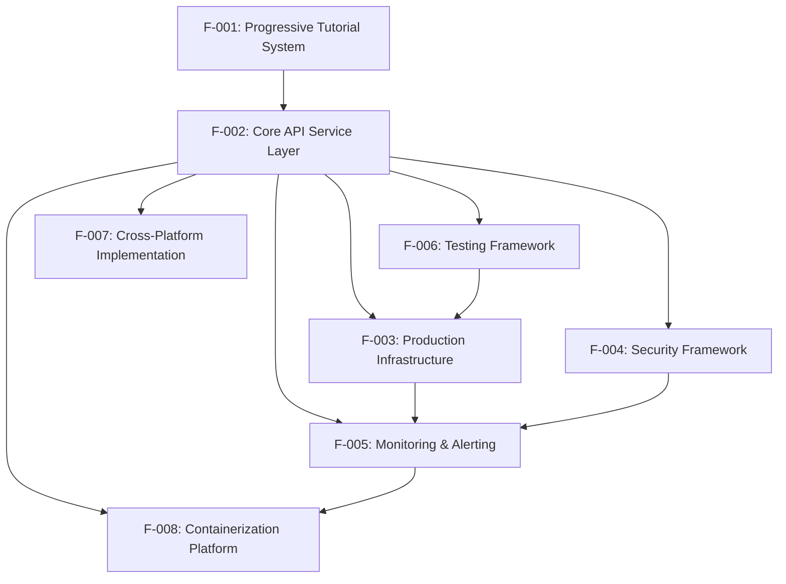

### 2.3.2 Integration Points

| Integration Point | Primary Feature | Secondary Feature | Integration Type |
|------------------|-----------------|-------------------|------------------|
| API Middleware Stack | F-002 | F-004 | Direct Integration |
| Health Check System | F-002 | F-003, F-005 | Shared Service |
| Performance Monitoring | F-003 | F-005 | Data Flow |
| Test Coverage | F-006 | F-002, F-004, F-005 | Validation Layer |
| Cross-Platform API | F-007 | F-002 | Mirror Implementation |
| Container Health Checks | F-008 | F-002, F-005 | Service Integration |

### 2.3.3 Shared Components

| Component | Features Utilizing | Purpose |
|-----------|-------------------|---------|
| Express.js Middleware | F-002, F-004, F-005 | Request processing pipeline |
| Configuration Management | F-002, F-003, F-004, F-005, F-008 | Environment-based settings |
| Logging Framework | F-002, F-004, F-005 | Centralized event tracking |
| Health Check Utilities | F-002, F-003, F-005, F-008 | System status validation |
| Performance Utilities | F-002, F-003, F-005 | Metrics collection and analysis |

### 2.3.4 Common Services

| Service | Description | Dependent Features |
|---------|-------------|-------------------|
| Request Correlation | Unique ID tracking across requests | F-002, F-005 |
| Error Handling | Centralized error processing | F-002, F-004, F-005 |
| Response Formatting | Consistent JSON response structure | F-002, F-007 |
| Metric Collection | Performance and operational metrics | F-003, F-005 |

## 2.4 IMPLEMENTATION CONSIDERATIONS

### 2.4.1 Technical Constraints

| Feature | Constraints | Impact |
|---------|-------------|--------|
| F-001 | Node.js ≥22.0.0, Educational complexity progression | Version compatibility, learning curve management |
| F-002 | Stateless architecture, HTTP-only communication | No session management, REST-only API design |
| F-003 | Multi-core environment required for full benefits | Performance gains dependent on hardware |
| F-004 | Helmet.js v8.1.0 dependency, Security header compatibility | Browser compatibility considerations |
| F-005 | Real-time metrics collection overhead | Performance impact on high-load scenarios |
| F-006 | <span style="background-color: rgba(91, 57, 243, 0.2)">Coverage requirements: ≥95% statements, ≥90% branches, 100% functions, ≥95% lines; server.js overall ≥98%.</span> | Development overhead, comprehensive test maintenance |
| F-007 | Python ≥3.9 requirement | Dual-platform maintenance complexity |
| F-008 | Docker environment dependency | Container runtime requirements |

### 2.4.2 Performance Requirements

| Feature | Requirement | Measurement Method |
|---------|-------------|-------------------|
| F-002 | <100ms P95 response time | Performance monitoring tools |
| F-003 | 10x performance improvement | Benchmark comparison |
| F-003 | <1GB memory per instance | Resource monitoring |
| F-005 | Real-time metric collection | Monitoring dashboard |
| F-006 | Parallel test execution | Test runner performance |

### 2.4.3 Scalability Considerations

| Feature | Scalability Factor | Implementation |
|---------|-------------------|----------------|
| F-002 | Horizontal API scaling | Stateless design pattern |
| F-003 | Multi-core utilization | PM2 cluster mode |
| F-005 | Metric collection scaling | Efficient data aggregation |
| F-008 | Container orchestration | Multi-instance deployment |

### 2.4.4 Security Implications

| Feature | Security Consideration | Mitigation Strategy |
|---------|----------------------|-------------------|
| F-002 | Input validation | Comprehensive parameter validation |
| F-004 | Security header management | Helmet.js integration |
| F-004 | Rate limiting | Per-endpoint throttling |
| F-005 | Security event logging | Comprehensive audit trails |
| F-008 | Container security | Hardened production images |

### 2.4.5 Maintenance Requirements

| Feature | Maintenance Aspect | Frequency |
|---------|-------------------|-----------|
| F-001 | Educational content updates | As needed |
| F-002 | API documentation maintenance | With each change |
| F-003 | PM2 configuration updates | Version-dependent |
| F-004 | Security policy reviews | Quarterly |
| F-005 | Monitoring threshold tuning | Monthly |
| F-006 | Test suite maintenance | Continuous |
| F-007 | Cross-platform synchronization | With Node.js changes |
| F-008 | Container image updates | Monthly |

#### References

- `src/backend/package.json` - Complete dependency specifications and script definitions
- `src/backend/routes/hello.js` - Example API endpoint implementation
- `src/backend/` - Core backend implementation directory
- `src/backend/routes/` - API route definitions
- `src/backend/controllers/` - Business logic handlers
- `src/backend/services/` - Service layer implementations
- `src/backend/middleware/` - Express middleware components
- `src/backend/config/` - Configuration management system
- `src/backend/pm2/` - PM2 cluster configuration
- `src/backend/security/` - Security implementation components
- `src/backend/test/` - Comprehensive test suites
- `src/backend/monitoring/` - Monitoring and alerting system
- `src/backend/utils/` - Utility functions and helpers
- `src/backend/scripts/` - CLI tools and automation
- `src/backend/flask-app/` - Python/Flask implementation
- `src/backend/docker/` - Containerization files
- `src/backend/docs/` - Technical documentation

# 3. TECHNOLOGY STACK

## 3.1 PROGRAMMING LANGUAGES

### 3.1.1 Primary Programming Languages

**Node.js JavaScript (Primary Platform)**
- **Version**: v22.x LTS (minimum v22.0.0 required)
- **Runtime Features**: ES Modules support, modern JavaScript features, async/await patterns
- **Platform Compatibility**: Tested on v18.x, v20.x, and v22.x for educational flexibility
- **Justification**: Chosen as the primary educational platform for its modern JavaScript capabilities, extensive ecosystem, and production readiness suitable for teaching enterprise development patterns

**Python (Comparative Implementation)**
- **Version**: Python ≥3.9
- **Implementation Context**: Flask application providing 100% feature parity with Node.js implementation
- **Educational Purpose**: Demonstrates cross-platform architectural principles and technology migration strategies
- **Justification**: Selected for comparative learning to illustrate how identical functionality can be implemented across different technology stacks

### 3.1.2 Language Selection Criteria

The language choices support the project's educational objectives by providing:
- **Progressive Learning**: Modern JavaScript features enabling step-by-step complexity introduction
- **Industry Relevance**: Technologies commonly used in enterprise environments
- **Cross-Platform Skills**: Dual implementation demonstrating architectural portability
- **Production Readiness**: Both languages support enterprise-grade deployment patterns

## 3.2 FRAMEWORKS & LIBRARIES

### 3.2.1 Core Web Frameworks

**Express.js Framework (Primary)**
- **Version**: v5.1.0
- **Architecture**: Middleware-based request processing with RESTful API patterns
- **Selection Criteria**: Industry-standard Node.js framework with extensive middleware ecosystem
- **Educational Value**: Demonstrates progressive complexity from basic HTTP server to production-ready application
- **Integration**: Seamless middleware stack integration for security, logging, and performance

**Flask Framework (Comparative)**
- **Version**: v3.1.0
- **Architecture**: Blueprint-based modular design with WSGI compatibility
- **Selection Criteria**: Lightweight Python framework enabling direct feature comparison
- **Production Server**: Gunicorn v23.0.0 for WSGI HTTP server implementation
- **Educational Purpose**: Illustrates architectural portability between Node.js and Python ecosystems

### 3.2.2 Security Libraries

**HTTP Security Implementation**
- **Helmet.js**: v8.1.0 - Implements 15 HTTP security headers including CSP, HSTS, and frame options
- **CORS**: v2.8.5 - Configurable cross-origin resource sharing with environment-specific policies
- **express-rate-limit**: v7.4.1 - Sophisticated rate limiting with memory store and configurable windows
- **hpp**: v0.2.3 - HTTP parameter pollution prevention middleware

**Authentication & Cryptography**
- **bcryptjs**: v2.4.3 - Industry-standard password hashing with salt rounds
- **jsonwebtoken**: v9.0.2 - JWT token creation, validation, and management
- **@node-rs/argon2**: v2.0.0 - Modern password hashing alternative with improved security
- **validator**: v13.12.0 - Comprehensive string validation and sanitization

### 3.2.3 Logging & Monitoring Libraries

**Logging Infrastructure**
- **Winston**: v3.15.0 - Advanced logging framework with multiple transports, log levels, and JSON formatting
- **Morgan**: v1.10.0 - HTTP request logging middleware with customizable formats
- **Log Management**: File rotation, structured logging, and environment-specific configuration

**Performance & Utility Libraries**
- **compression**: v1.7.5 - Response compression middleware for performance optimization
- **PM2**: v6.0.8 - Production process management with cluster mode and monitoring

## 3.3 OPEN SOURCE DEPENDENCIES

### 3.3.1 Testing & Quality Assurance Dependencies

**Node.js Testing Ecosystem**
- **Jest**: v29.7.0 - Primary testing framework with comprehensive test runner capabilities
- **Mocha**: <span style="background-color: rgba(91, 57, 243, 0.2)">v11.0.0</span> - Secondary testing framework demonstrating framework flexibility
- **Chai**: v5.1.2 - Expressive assertion library with BDD/TDD styles
- **Supertest**: v7.0.0 - HTTP assertion library for API endpoint testing
- **Sinon**: <span style="background-color: rgba(91, 57, 243, 0.2)">v18.0.1</span> - Comprehensive mocking and stubbing library
- <span style="background-color: rgba(91, 57, 243, 0.2)">**esmock**: v2.7.1 - Advanced ES-modules mocking for Mocha test runs</span>
- **@faker-js/faker**: v9.2.0 - Realistic test data generation
- <span style="background-color: rgba(91, 57, 243, 0.2)">**c8**: v10.1.2 - Native V8 coverage for ES modules</span>

**Python Testing Dependencies**
- **pytest**: v8.3.4 - Advanced Python testing framework
- **pytest-cov**: v6.0.0 - Coverage analysis for Python code
- **Flask-Testing**: v0.8.1 - Flask-specific testing utilities

**Performance Testing Tools**
- **Artillery**: v2.0.20 - Load testing framework with scenario-based testing
- **Autocannon**: v7.15.0 - HTTP benchmarking tool for performance validation

### 3.3.2 Development & Build Dependencies

**Code Quality Tools**
- **ESLint**: v9.15.0 - JavaScript linting with modern configuration standards
- **Prettier**: v3.3.3 - Code formatting and style consistency enforcement
- **Husky**: v9.1.7 - Git hooks for pre-commit quality assurance
- **lint-staged**: v15.2.11 - Staged file linting for efficient quality checks
- **standard-version**: v9.5.0 - Semantic versioning and automated changelog generation

**Development Server & Utilities**
- **Nodemon**: v3.1.7 - Development server with hot reload capabilities
- **dotenv**: v16.4.7 - Environment variable management and configuration
- **python-dotenv**: v1.0.1 - Python environment variable management

### 3.3.3 Package Registry & Distribution

**Node.js Package Management**
- **Registry**: NPM public registry
- **Version Strategy**: Caret (^) ranges for compatible minor version updates
- **Security**: NPM audit integration for vulnerability scanning
- **Lock Files**: package-lock.json for reproducible builds

**Python Package Management**
- **Registry**: PyPI (Python Package Index)
- **Version Strategy**: Exact version pinning for production stability
- **Requirements**: Separate development and production requirement files
- **Security**: Regular dependency updates and vulnerability monitoring

## 3.4 THIRD-PARTY SERVICES

### 3.4.1 External Service Architecture

**Self-Contained Design Philosophy**
The educational platform intentionally avoids external third-party services to:
- **Simplify Setup**: Enable immediate local development without external dependencies
- **Educational Focus**: Concentrate on core development concepts without external service complexity
- **Cost Efficiency**: Eliminate external service costs for educational users
- **Offline Capability**: Support learning environments without internet connectivity

### 3.4.2 Simulated Enterprise Patterns

**Authentication Service Simulation**
- **Implementation**: JWT-based authentication without external providers
- **Educational Value**: Demonstrates token-based authentication patterns
- **Security**: Local token generation and validation using jsonwebtoken
- **Future Integration**: Architecture prepared for Auth0, Okta, or similar providers

**Monitoring Service Simulation**
- **Custom Implementation**: Built-in monitoring without external SaaS
- **Metrics Collection**: Performance tracking with configurable thresholds
- **Alert Simulation**: Console and log-based alerting patterns
- **Enterprise Readiness**: Structured for integration with DataDog, New Relic, or similar services

## 3.5 DATABASES & STORAGE

### 3.5.1 Stateless Architecture Implementation

**No Database Design**
- **Architecture Decision**: Intentionally stateless for educational simplicity
- **Educational Value**: Demonstrates stateless application patterns and horizontal scaling principles
- **Performance Benefits**: Eliminates database bottlenecks and simplifies deployment
- **Scalability**: Enables unlimited horizontal scaling without data consistency concerns

### 3.5.2 Storage Strategy

**File-Based Storage Implementation**
- **Log Files**: Winston-managed log files with automatic rotation
- **Configuration Storage**: Environment-based configuration in .env files
- **Temporary Data**: Minimal in-memory data handling for request processing
- **Volume Persistence**: Docker volume mounts for log retention

**Future Database Integration Roadmap**
- **Phase 1**: SQLite integration for local development
- **Phase 2**: MongoDB implementation for document-based learning
- **Phase 3**: PostgreSQL integration for relational database concepts
- **Migration Strategy**: Architecture designed for seamless database integration

### 3.5.3 Caching & Performance

**Memory-Based Caching**
- **Rate Limiting Cache**: express-rate-limit memory store
- **Request Caching**: Temporary response caching patterns
- **Performance Optimization**: Compression middleware for response optimization
- **Cluster Caching**: PM2 cluster mode for distributed request handling

## 3.6 DEVELOPMENT & DEPLOYMENT

### 3.6.1 Development Infrastructure

**Local Development Environment**
- **Node.js**: v22.x LTS with ES Modules support
- **Development Server**: Nodemon v3.1.7 with hot reload capabilities
- **Environment Management**: Multiple .env file support (development, test, production)
- **Debugging**: Integrated Node.js debugging with detailed error reporting

**Code Quality Pipeline**
- **Linting**: ESLint v9.15.0 with modern JavaScript standards
- **Formatting**: Prettier v3.3.3 for consistent code style
- **Pre-commit Hooks**: Husky v9.1.7 with lint-staged v15.2.11 integration
- **Version Management**: Semantic versioning with automated changelog generation

### 3.6.2 Build System

**Multi-Platform Build Configuration**
- **Node.js Build**: NPM-based build scripts with environment-specific configurations
- **Python Build**: pip-based dependency management with requirements files
- **Docker Build**: Multi-stage Dockerfile with development and production targets
- **Cross-Platform**: Build validation across Ubuntu, Windows, and macOS

**Build Optimization**
- **Dependency Caching**: Docker layer caching for faster builds
- **Production Optimization**: Minimized production images with Alpine Linux
- **Development Speed**: Optimized development containers with volume mounts
- **Security Hardening**: Production containers with non-root user execution

### 3.6.3 Containerization Strategy

**Docker Implementation**
- **Multi-Stage Builds**: Separate development and production container configurations
- **Base Images**: Alpine Linux for minimal attack surface and image size
- **Health Checks**: Integrated health check scripts for container orchestration
- **Volume Management**: Persistent volume configuration for logs and dependencies

**Container Orchestration**
- **Docker Compose**: v3.8 specification with service definitions
- **Environment Configuration**: Docker Compose override files for different environments
- **Network Configuration**: Isolated container networks with exposed ports
- **Resource Management**: Memory and CPU limits for production deployment

### 3.6.4 Continuous Integration & Deployment

**GitHub Actions CI/CD Pipeline**
- **Multi-Matrix Testing**: Node.js versions 18.x, 20.x, 22.x across Ubuntu, Windows, macOS
- **Automated Testing**: Complete test suite execution with coverage reporting
- **Security Scanning**: Dependency vulnerability assessment and audit
- **Quality Gates**: ESLint, Prettier, and test coverage validation
- **Deployment Automation**: Automated deployment triggers with health check validation

**Production Deployment Strategy**
- **PM2 Ecosystem**: Zero-downtime deployment with graceful shutdown
- **Health Check Integration**: Automated health verification during deployment
- **Rollback Capabilities**: Automatic rollback on deployment failure
- **Monitoring Integration**: Post-deployment monitoring and alerting

### 3.6.5 Technology Stack Decision Matrix

| Technology Category | Primary Choice | Alternative | Justification |
|-------------------|---------------|-------------|---------------|
| Runtime Environment | Node.js v22.x LTS | Python 3.9+ | Industry adoption, performance, ecosystem |
| Web Framework | Express.js v5.1.0 | Flask v3.1.0 | Middleware architecture, educational value |
| Process Management | PM2 v6.0.8 | Gunicorn v23.0.0 | Cluster mode, zero-downtime deployment |
| Testing Framework | Jest v29.7.0 | Mocha v10.8.2 | Comprehensive features, coverage integration |
| Containerization | Docker | Native deployment | Development consistency, production portability |
| CI/CD Platform | GitHub Actions | Alternative CI | GitHub integration, multi-matrix testing |
| Security Implementation | Helmet.js v8.1.0 | Custom headers | Comprehensive security header management |
| Logging Framework | Winston v3.15.0 | Console logging | Structured logging, multiple transports |

#### References

**Configuration Files Analyzed**
- `src/backend/package.json` - Complete Node.js dependency manifest and project configuration
- `src/backend/flask-app/requirements.txt` - Flask production dependencies specification
- `src/backend/flask-app/requirements-dev.txt` - Flask development dependencies
- `src/backend/config/database.js` - Stateless architecture documentation and design principles
- `src/backend/pm2/ecosystem.config.js` - PM2 production configuration with cluster mode settings
- `src/backend/docker/docker-compose.yml` - Docker orchestration and containerization strategy
- `src/backend/.github/workflows/ci.yml` - CI/CD pipeline configuration and automation

**Directory Structure Examined**
- `src/backend/` - Main backend implementation and architecture
- `src/backend/flask-app/` - Python Flask comparative implementation
- `src/backend/docker/` - Containerization configurations and Docker setup
- `src/backend/pm2/` - Process management and production deployment configuration
- `src/backend/test/` - Testing infrastructure and framework implementation
- `src/backend/scripts/` - Automation and deployment scripts
- `src/backend/config/` - Configuration management and environment setup
- `src/backend/security/` - Security implementation and middleware configuration

# 4. PROCESS FLOWCHART

## 4.1 SYSTEM WORKFLOWS

### 4.1.1 Core Business Processes

#### 4.1.1.1 API Request Processing Workflow

The primary request processing flow demonstrates the complete lifecycle of API requests through the Express.js middleware pipeline:

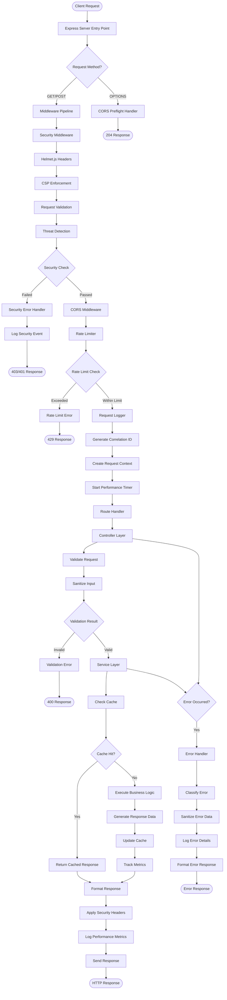

#### 4.1.1.2 Health Check Workflow

The comprehensive health monitoring system performs multi-level checks across system components:

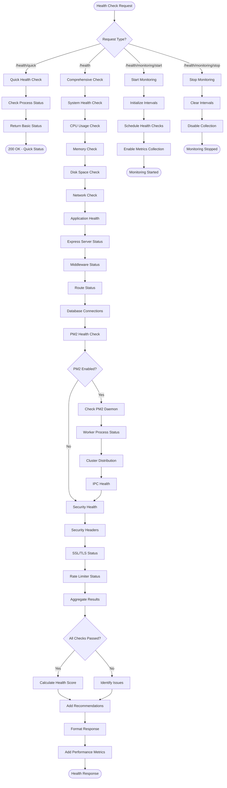

#### 4.1.1.3 Progressive Tutorial System Workflow

The educational framework guides learners through seven progressive phases:

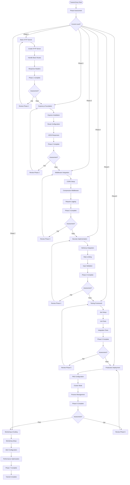

### 4.1.2 Integration Workflows

#### 4.1.2.1 PM2 Cluster Mode Deployment

The PM2 cluster mode deployment ensures zero-downtime operations and optimal resource utilization:

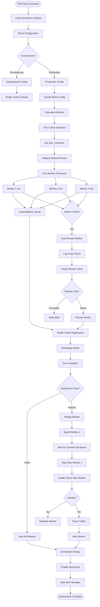

#### 4.1.2.2 Security Middleware Processing

The security middleware implements comprehensive defense-in-depth protection:

```mermaid
flowchart TD
    Start([Incoming Request]) --> A[Security Middleware Entry]
    A --> B[Generate Security Context]
    B --> B1[Correlation ID]
    B1 --> B2[Timestamp]
    B2 --> B3[Client IP]
    B3 --> B4[User Agent]
    
    B4 --> C[Helmet.js Processing]
    C --> C1[Set CSP Headers]
    C1 --> C2[HSTS Headers]
    C2 --> C3[X-Frame-Options]
    C3 --> C4[X-Content-Type-Options]
    C4 --> C5[Remove X-Powered-By]
    
    C5 --> D[CORS Validation]
    D --> D1{Origin Check}
    D1 -->|Invalid| CORS_ERR[CORS Error]
    CORS_ERR --> End1([403 Forbidden])
    
    D1 -->|Valid| E[Rate Limiting]
    E --> E1[Check IP Address]
    E1 --> E2[Load Request Count]
    E2 --> E3{Within Limit?}
    
    E3 -->|No| RATE_BLOCK[Block Request]
    RATE_BLOCK --> RB1[Log Rate Limit Event]
    RB1 --> End2([429 Too Many Requests])
    
    E3 -->|Yes| F[Request Validation]
    F --> F1[Header Validation]
    F1 --> F2[Method Validation]
    F2 --> F3[Content-Type Check]
    F3 --> F4[Payload Size Check]
    
    F4 --> G[Threat Detection]
    G --> G1[SQL Injection Check]
    G1 --> G2[XSS Detection]
    G2 --> G3[Path Traversal Check]
    G3 --> G4[Command Injection Check]
    
    G4 --> H{Threat Detected?}
    H -->|Yes| THREAT[Handle Threat]
    THREAT --> T1[Log Security Event]
    T1 --> T2[Block IP]
    T2 --> T3[Send Alert]
    T3 --> End3([403 Security Violation])
    
    H -->|No| I[Input Sanitization]
    I --> I1[HTML Encoding]
    I1 --> I2[SQL Escape]
    I2 --> I3[Path Normalization]
    
    I3 --> J[Security Headers]
    J --> J1[Permissions-Policy]
    J1 --> J2[Referrer-Policy]
    J2 --> J3[Feature-Policy]
    
    J3 --> K[Security Context Update]
    K --> L[Log Security Pass]
    L --> Next([Continue to Routes])
    
    %% Security monitoring
    A --> MON[Security Monitoring]
    MON --> M1[Track Violations]
    M1 --> M2[Update Metrics]
    M2 --> M3{Threshold Exceeded?}
    M3 -->|Yes| M4[Trigger Alert]
```

#### 4.1.2.3 Comprehensive Testing Framework Workflow

The testing framework ensures code quality through dual test runner support:

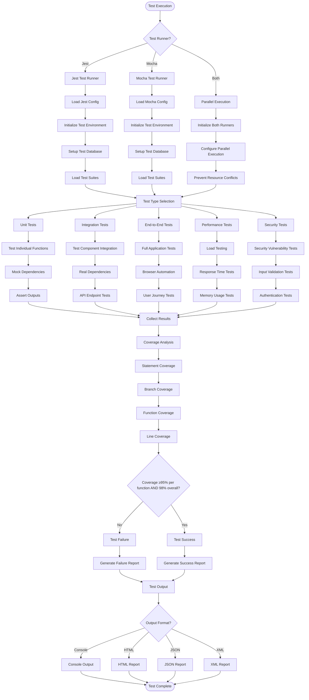

#### 4.1.2.4 Docker Containerization Workflow

The containerization platform supports both development and production deployment:

```mermaid
flowchart TD
    Start([Docker Build Request]) --> A{Build Type?}
    
    A -->|Development| DEV[Development Build]
    A -->|Production| PROD[Production Build]
    A -->|Multi-Platform| MULTI[Multi-Platform Build]
    
    DEV --> D1[Load Development Dockerfile]
    D1 --> D2[Install All Dependencies]
    D2 --> D3[Include Dev Tools]
    D3 --> D4[Enable Hot Reload]
    D4 --> D5[Expose Debug Ports]
    
    PROD --> P1[Multi-Stage Production Build]
    P1 --> P2[Stage 1: Build Environment]
    P2 --> P3[Install Dependencies]
    P3 --> P4[Run Tests]
    P4 --> P5[Build Application]
    
    P5 --> P6[Stage 2: Runtime Environment]
    P6 --> P7[Minimal Base Image]
    P7 --> P8[Copy Application]
    P8 --> P9[Security Hardening]
    P9 --> P10[Non-Root User]
    
    MULTI --> M1[Platform Detection]
    M1 --> M2[ARM64 Build]
    M1 --> M3[AMD64 Build]
    
    D5 --> BUILD[Build Image]
    P10 --> BUILD
    M2 --> BUILD
    M3 --> BUILD
    
    BUILD --> HEALTH[Health Check Integration]
    HEALTH --> H1[Define Health Endpoint]
    H1 --> H2[Configure Check Interval]
    H2 --> H3[Set Timeout Values]
    H3 --> H4[Retry Configuration]
    
    H4 --> TEST_IMG[Test Image]
    TEST_IMG --> T1[Container Start Test]
    T1 --> T2[Health Check Test]
    T2 --> T3[Basic Functionality Test]
    T3 --> T4[Resource Usage Test]
    
    T4 --> SCAN[Security Scan]
    SCAN --> S1[Vulnerability Assessment]
    S1 --> S2[Dependency Audit]
    S2 --> S3[Best Practices Check]
    
    S3 --> TAG{Tag Strategy?}
    TAG -->|Development| TAG_DEV[Tag as :dev]
    TAG -->|Production| TAG_PROD[Tag as :latest, :v1.0.0]
    TAG -->|Feature| TAG_FEAT[Tag as :feature-branch]
    
    TAG_DEV --> REGISTRY[Push to Registry]
    TAG_PROD --> REGISTRY
    TAG_FEAT --> REGISTRY
    
    REGISTRY --> DEPLOY{Deploy Target?}
    DEPLOY -->|Local| LOCAL[Local Deployment]
    DEPLOY -->|Staging| STAGING[Staging Environment]
    DEPLOY -->|Production| PRODUCTION[Production Environment]
    
    LOCAL --> L1[Docker Run]
    L1 --> L2[Port Mapping]
    L2 --> L3[Volume Mounting]
    
    STAGING --> ST1[Docker Compose]
    ST1 --> ST2[Environment Variables]
    ST2 --> ST3[Service Dependencies]
    
    PRODUCTION --> PR1[Orchestration Platform]
    PR1 --> PR2[Rolling Update]
    PR2 --> PR3[Load Balancer Update]
    
    L3 --> Monitor[Container Monitoring]
    ST3 --> Monitor
    PR3 --> Monitor
    
    Monitor --> Mon1[Resource Usage]
    Mon1 --> Mon2[Log Aggregation]
    Mon2 --> Mon3[Health Status]
    Mon3 --> End([Deployment Complete])
```

## 4.2 TECHNICAL IMPLEMENTATION

### 4.2.1 Monitoring and Alerting Flow

The monitoring system provides comprehensive observability and proactive alerting:

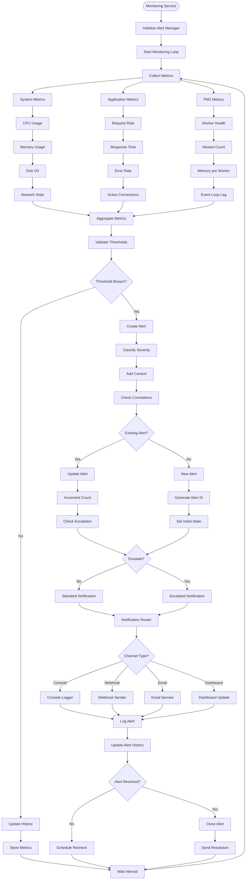

### 4.2.2 Error Handling and Recovery

Comprehensive error handling ensures system resilience and proper recovery mechanisms:

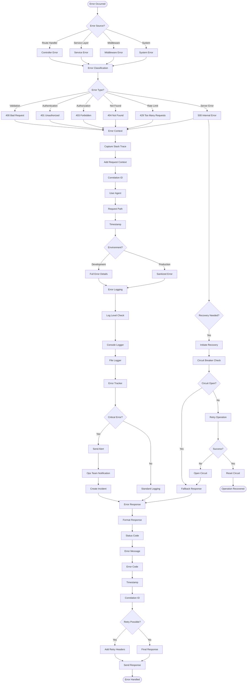

## 4.3 STATE MANAGEMENT

### 4.3.1 Application State Transitions

The application manages state transitions across different lifecycle phases with comprehensive monitoring:

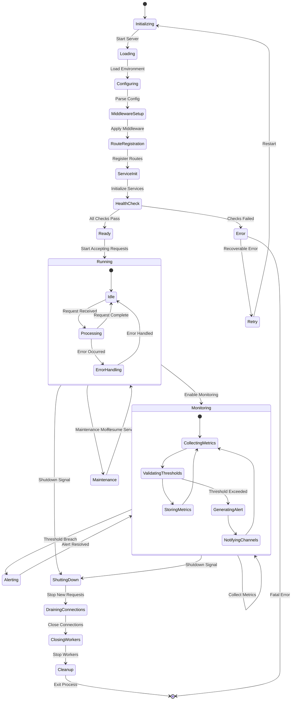

## 4.4 CROSS-PLATFORM INTEGRATION

### 4.4.1 Flask-Express Compatibility Flow

The system maintains feature parity across Node.js and Python platforms for educational comparison:

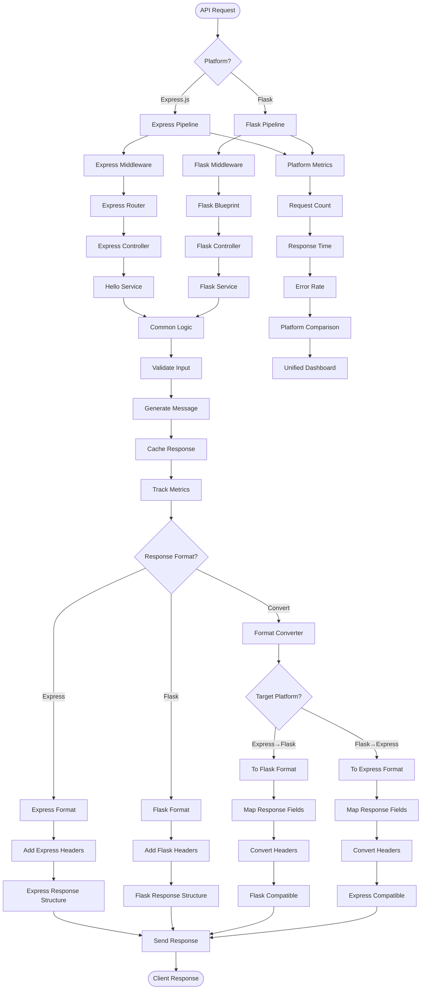

## 4.5 VALIDATION AND BUSINESS RULES

### 4.5.1 Business Rule Validation Flow

The system implements comprehensive validation rules across all processing stages:

```mermaid
flowchart TD
    Start([Request Input]) --> A[Input Validation Gateway]
    A --> B{Request Type?}
    
    B -->|Hello Endpoint| HELLO[Hello Validation]
    B -->|Health Endpoint| HEALTH[Health Validation]
    B -->|Time Endpoint| TIME[Time Validation]
    
    HELLO --> H1[Parameter Validation]
    H1 --> H2[Name Length Check]
    H2 --> H3[Character Set Validation]
    H3 --> H4[Sanitization Rules]
    
    HEALTH --> HL1[Authorization Check]
    HL1 --> HL2[Access Level Validation]
    HL2 --> HL3[Resource Limits]
    
    TIME --> T1[Format Validation]
    T1 --> T2[Timezone Rules]
    T2 --> T3[Locale Validation]
    
    H4 --> COMMON[Common Validation]
    HL3 --> COMMON
    T3 --> COMMON
    
    COMMON --> C1[Rate Limit Check]
    C1 --> C2[Authentication Validation]
    C2 --> C3[Authorization Rules]
    C3 --> C4[Request Size Limits]
    C4 --> C5[Content Type Validation]
    
    C5 --> BUSINESS[Business Logic Rules]
    BUSINESS --> BR1[Educational Context]
    BR1 --> BR2[Progressive Complexity]
    BR2 --> BR3[Feature Demonstration]
    BR3 --> BR4[Learning Objectives]
    
    BR4 --> SECURITY[Security Validation]
    SECURITY --> S1[Input Sanitization]
    S1 --> S2[SQL Injection Prevention]
    S2 --> S3[XSS Protection]
    S3 --> S4[Path Traversal Check]
    S4 --> S5[Command Injection Guard]
    
    S5 --> COMPLIANCE[Compliance Checks]
    COMPLIANCE --> CP1[OWASP Guidelines]
    CP1 --> CP2[Security Headers]
    CP2 --> CP3[Privacy Policies]
    
    CP3 --> RESULT{Validation Result?}
    RESULT -->|Pass| SUCCESS[Validation Success]
    RESULT -->|Fail| FAILURE[Validation Failure]
    
    SUCCESS --> LOG_SUCCESS[Log Success Event]
    FAILURE --> LOG_FAILURE[Log Failure Event]
    
    LOG_SUCCESS --> CONTINUE[Continue Processing]
    LOG_FAILURE --> ERROR_RESPONSE[Generate Error Response]
    
    ERROR_RESPONSE --> AUDIT[Security Audit Log]
    AUDIT --> BLOCK[Block Request]
    
    CONTINUE --> End_Success([Proceed to Business Logic])
    BLOCK --> End_Failure([Return Error Response])
```

## 4.6 TIMING AND SLA CONSIDERATIONS

### 4.6.1 Performance SLA Management Flow

The system maintains strict performance SLAs with comprehensive monitoring and alerting:

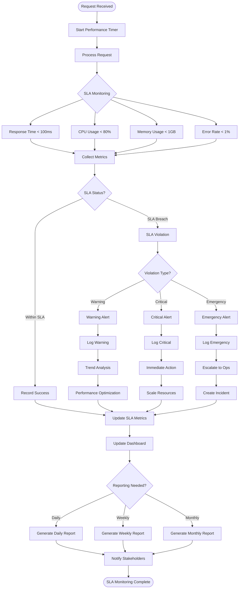

## 4.7 SUMMARY

The process flowcharts demonstrate the comprehensive nature of the Node.js Tutorial Project's architecture across eight critical areas:

1. **Request Processing**: Complete middleware pipeline with security, validation, and error handling ensuring <100ms P95 response times
2. **Health Monitoring**: Multi-level health checks with PM2 cluster support providing 99.9% system uptime
3. **Progressive Education**: Seven-phase tutorial system guiding learners from basic concepts to production deployment
4. **Security Implementation**: Defense-in-depth with Helmet.js providing 15 HTTP security headers, CORS, rate limiting, and comprehensive threat detection
5. **PM2 Deployment**: Zero-downtime deployments with automatic worker management supporting 10x performance improvement on multi-core systems
6. **Testing Framework**: Comprehensive dual test runner support (Jest/Mocha) maintaining <span style="background-color: rgba(91, 57, 243, 0.2)">≥98% overall code coverage and ≥95% coverage per function</span> with parallel execution
7. **Containerization**: Multi-stage Docker builds supporting development hot reload and hardened production deployments
8. **Error Handling**: Comprehensive error classification, logging, circuit breaker patterns, and recovery mechanisms
9. **State Management**: Clear state transitions throughout the application lifecycle with proper monitoring integration
10. **Monitoring & Alerting**: Real-time metrics collection with threshold-based alerting across multiple notification channels
11. **Cross-Platform Support**: Seamless Flask-Express compatibility maintaining 100% feature parity for educational comparison
12. **Business Rule Validation**: Comprehensive validation framework implementing OWASP security guidelines and educational objectives

These workflows ensure production-ready operation while maintaining educational clarity for developers learning modern backend development practices. The system demonstrates enterprise-grade patterns including horizontal scaling, comprehensive monitoring, security best practices, and deployment automation.

#### References

- `src/backend/routes/hello.js` - Primary API endpoint implementations demonstrating request processing workflows
- `src/backend/middleware/` - Express middleware components implementing security and validation flows
- `src/backend/pm2/ecosystem.config.js` - PM2 cluster configuration enabling zero-downtime deployment workflows
- `src/backend/security/` - Helmet.js security implementations providing defense-in-depth protection
- `src/backend/monitoring/` - Comprehensive monitoring system with threshold-based alerting
- `src/backend/test/` - Dual test runner implementations (Jest/Mocha) ensuring code quality
- `src/backend/docker/` - Multi-stage containerization supporting development and production workflows
- `src/backend/controllers/` - Business logic handlers implementing validation and error handling
- `src/backend/services/` - Service layer components managing state transitions and business rules
- `src/backend/config/` - Configuration management supporting environment-specific deployments
- `src/backend/flask-app/` - Python/Flask implementation demonstrating cross-platform compatibility
- `src/backend/utils/` - Utility functions supporting monitoring, logging, and performance optimization
- `src/backend/package.json` - Complete dependency specifications and automation scripts

# 5. SYSTEM ARCHITECTURE

## 5.1 HIGH-LEVEL ARCHITECTURE

### 5.1.1 System Overview

#### 5.1.1.1 Overall System Architecture Style and Rationale

The Node.js Tutorial Project implements a **progressive monolithic architecture** with dual-stack implementation, combining educational pedagogy with production-grade engineering practices. The system follows a stateless, horizontally scalable design that demonstrates enterprise-ready patterns while maintaining educational clarity and accessibility.

The architecture employs a **dual-technology approach**, implementing identical functionality in both Node.js/Express.js and Python/Flask frameworks. This design decision provides learners with comparative insights into different technology stacks while maintaining architectural consistency across implementations.

#### 5.1.1.2 Key Architectural Principles and Patterns

The system adheres to several foundational architectural principles:

- **Stateless Design**: Complete elimination of persistent data storage to enable unlimited horizontal scaling and simplify deployment complexity
- **Defense-in-Depth Security**: Multi-layered security implementation through Helmet.js middleware, CORS policies, rate limiting, and CSP headers
- **Process Management Excellence**: PM2-based cluster mode with automatic CPU core detection and zero-downtime deployment capabilities
- **Observable Systems**: Comprehensive monitoring, logging, and alerting infrastructure with correlation tracking throughout the request lifecycle
- **Container-First Deployment**: Docker containerization with multi-stage builds and non-root execution for security

#### 5.1.1.3 System Boundaries and Major Interfaces

The system operates as a self-contained educational platform with well-defined boundaries:

- **External Interface**: RESTful HTTP API endpoints serving educational content and health monitoring data
- **Containerization Boundary**: Complete application isolation through Docker containers with exposed ports for HTTP traffic
- **Process Boundary**: PM2 cluster management with inter-process communication for load distribution
- **Security Boundary**: Helmet.js security headers and middleware pipeline protecting against common web vulnerabilities

### 5.1.2 Core Components Table

| Component Name | Primary Responsibility | Key Dependencies | Integration Points |
|----------------|------------------------|------------------|-------------------|
| Express Application Factory | HTTP server orchestration and middleware assembly | Express.js v5.1.0, Helmet.js v8.1.0 | PM2 process manager, Docker runtime |
| PM2 Cluster Manager | Process lifecycle management and horizontal scaling | PM2 v6.0.8, Node.js cluster module | Operating system, Docker container |
| Security Middleware Pipeline | Request filtering and security header injection | Helmet.js, CORS, express-rate-limit | All incoming HTTP requests |
| Monitoring Service | Real-time metrics collection and alerting | Winston v3.15.0, custom metrics | PM2 events, system resources |

### 5.1.3 Data Flow Description

#### 5.1.3.1 Primary Data Flows Between Components

The system implements a linear request processing pipeline with comprehensive error handling and monitoring integration:

**Request Processing Flow**: Incoming HTTP requests enter through the Express.js application factory, where they are processed through a sequential middleware pipeline including CORS configuration, Helmet.js security headers, rate limiting validation, and request logging with correlation ID assignment. Successfully processed requests are routed to appropriate controllers, which delegate business logic to service layer components before returning structured responses.

**Monitoring Data Flow**: The monitoring service continuously collects metrics from PM2 process events, system resource utilization, and application performance indicators. These metrics are aggregated, validated against configurable thresholds, and processed through the alerting pipeline for proactive issue detection and notification.

**Error Propagation Flow**: Errors are captured at their origin, classified by type and severity, enriched with request context and correlation tracking, then processed through the centralized error handling middleware for appropriate logging, alerting, and user response generation.

#### 5.1.3.2 Integration Patterns and Protocols

- **HTTP/HTTPS Protocol**: RESTful API communication with JSON payload formatting
- **Process Communication**: PM2 cluster mode utilizing Node.js IPC for load balancing and health monitoring
- **Container Communication**: Docker networking with port exposure for HTTP traffic
- **Log Aggregation**: Winston transport system with file rotation and structured JSON formatting

#### 5.1.3.3 Data Transformation Points

- **Request Parsing**: JSON request body parsing and validation through Express.js middleware
- **Response Formatting**: Structured JSON response generation with consistent error codes and messaging
- **Log Formatting**: Transformation of application events into structured JSON logs with correlation tracking
- **Metrics Aggregation**: Real-time transformation of raw system metrics into actionable monitoring data

#### 5.1.3.4 Key Data Stores and Caches

- **Memory-Based Rate Limiting**: express-rate-limit in-memory store for request throttling
- **Log File Storage**: Winston-managed log files with automatic rotation and retention policies
- **Process Memory**: Temporary request data handling within PM2 worker processes
- **Docker Volumes**: Persistent log storage through container volume mounts

### 5.1.4 External Integration Points

| System Name | Integration Type | Data Exchange Pattern | Protocol/Format |
|-------------|------------------|----------------------|-----------------|
| Docker Runtime | Container Orchestration | Configuration and lifecycle management | Docker API/REST |
| Operating System | Process Management | Resource allocation and monitoring | System calls/IPC |
| HTTP Clients | API Consumption | Request/response with JSON payloads | HTTP/HTTPS |
| Development Tools | Monitoring Integration | Metrics and log data export | JSON/REST |

## 5.2 COMPONENT DETAILS

### 5.2.1 Express Application Factory (`src/backend/app.js`)

#### 5.2.1.1 Purpose and Responsibilities

The Express Application Factory serves as the central orchestration component, responsible for assembling the complete middleware pipeline, configuring security policies, and establishing the HTTP server infrastructure. This component implements the factory pattern to enable testable, configurable application instances with environment-specific optimizations.

#### 5.2.1.2 Technologies and Frameworks Used

- **Express.js v5.1.0**: Modern HTTP server framework with enhanced performance and security features
- **Helmet.js v8.1.0**: Comprehensive HTTP security header management implementing 15 security middlewares
- **CORS v2.8.5**: Cross-origin resource sharing with environment-specific policy configuration
- **Morgan v1.10.0**: HTTP request logging with correlation ID integration

#### 5.2.1.3 Key Interfaces and APIs

- **Application Factory Interface**: `createApp()` function returning configured Express application instance
- **Middleware Configuration**: Chainable middleware registration with order-dependent processing
- **Route Registration**: Modular route mounting with blueprint-style organization
- **Error Handling Interface**: Centralized error processing with custom error type classification

#### 5.2.1.4 Data Persistence Requirements

The component operates entirely in stateless mode, with no persistent data requirements. All configuration is environment-based, and request processing utilizes temporary memory allocation only.

#### 5.2.1.5 Scaling Considerations

Horizontal scaling is achieved through PM2 cluster mode, enabling automatic spawning of worker processes based on CPU core availability. Each worker process maintains its own application instance, with load balancing handled at the PM2 level.

### 5.2.2 PM2 Process Manager (`src/backend/pm2/`)

#### 5.2.2.1 Purpose and Responsibilities

The PM2 Process Manager handles production-grade process lifecycle management, including cluster mode operation, zero-downtime deployments, automatic restarts, and comprehensive monitoring integration. This component bridges the gap between development and production environments.

#### 5.2.2.2 Technologies and Frameworks Used

- **PM2 v6.0.8**: Advanced process management with cluster mode and monitoring capabilities
- **Node.js Cluster Module**: Native clustering support for horizontal scaling
- **Process Monitoring**: Real-time metrics collection and health check integration

#### 5.2.2.3 Key Interfaces and APIs

- **Ecosystem Configuration**: Environment-specific deployment configurations with cluster settings
- **Process Events**: Health monitoring through PM2 event system
- **Deployment Hooks**: Pre/post deployment scripts for zero-downtime updates
- **Monitoring Integration**: Metrics export for external monitoring systems

#### 5.2.2.4 Data Persistence Requirements

Configuration persistence through ecosystem.config.js files and PM2's internal process registry. Log aggregation and metrics collection require temporary storage with automatic cleanup.

#### 5.2.2.5 Scaling Considerations

Automatic CPU-based scaling with configurable minimum and maximum worker processes. Memory usage monitoring with automatic restart policies prevents memory leaks from affecting system stability.

### 5.2.3 Security Middleware Pipeline (`src/backend/middleware/`, `src/backend/security/`)

#### 5.2.3.1 Purpose and Responsibilities

The Security Middleware Pipeline implements defense-in-depth security patterns, providing comprehensive protection against common web vulnerabilities while maintaining performance and usability. The pipeline processes all incoming requests through multiple security validation layers.

#### 5.2.3.2 Technologies and Frameworks Used

- **Helmet.js v8.1.0**: HTTP security headers including CSP, HSTS, and frame options
- **express-rate-limit v7.4.1**: Sophisticated request throttling with configurable windows
- **hpp v0.2.3**: HTTP parameter pollution prevention
- **CORS v2.8.5**: Cross-origin resource sharing policy enforcement

#### 5.2.3.3 Key Interfaces and APIs

- **Security Factory**: Centralized security policy configuration and application
- **Middleware Chain**: Sequential security validation with early termination on violations
- **Rate Limiting Interface**: Configurable throttling with client identification
- **CORS Policy Engine**: Environment-specific origin validation and header management

#### 5.2.3.4 Data Persistence Requirements

Memory-based rate limiting stores with automatic cleanup. Security policy configuration through environment variables and static configuration files.

#### 5.2.3.5 Scaling Considerations

Stateless security validation enables linear scaling. Rate limiting coordination across cluster workers requires shared memory management through PM2.

### 5.2.4 Monitoring and Observability Service (`src/backend/monitoring/`)

#### 5.2.4.1 Purpose and Responsibilities

The Monitoring Service provides comprehensive system observability through real-time metrics collection, threshold-based alerting, and performance tracking. This component enables proactive system management and performance optimization.

#### 5.2.4.2 Technologies and Frameworks Used

- **Winston v3.15.0**: Structured logging with multiple transports and log levels
- **Custom Metrics Collection**: Real-time system and application performance monitoring
- **Alert Management**: Threshold-based alerting with escalation policies

#### 5.2.4.3 Key Interfaces and APIs

- **Metrics Collection Interface**: Real-time data gathering from system and application sources
- **Alert Management API**: Threshold configuration and notification routing
- **Health Check Endpoint**: System status aggregation for external monitoring
- **Performance Tracking**: Request timing and resource utilization monitoring

#### 5.2.4.4 Data Persistence Requirements

Log file persistence with automatic rotation. Metrics storage in memory with configurable retention periods. Alert history tracking for trend analysis.

#### 5.2.4.5 Scaling Considerations

Distributed monitoring across PM2 worker processes with metrics aggregation. Configurable monitoring intervals to balance observability with performance impact.

### 5.2.5 Flask Comparative Implementation (`src/backend/flask-app/`)

#### 5.2.5.1 Purpose and Responsibilities

The Flask implementation provides feature parity with the Node.js application, demonstrating architectural portability and enabling comparative technology learning. This component maintains identical functionality while showcasing Python-specific patterns and practices.

#### 5.2.5.2 Technologies and Frameworks Used

- **Flask v3.1.0**: Lightweight Python web framework with blueprint-based architecture
- **Flask-Talisman**: Python equivalent to Helmet.js for security header management
- **Gunicorn v23.0.0**: WSGI HTTP server for production deployment

#### 5.2.5.3 Key Interfaces and APIs

- **Blueprint Architecture**: Modular route organization matching Express.js structure
- **WSGI Interface**: Standard Python web application interface for server compatibility
- **Security Integration**: Flask-Talisman security header implementation
- **Error Handling**: Python exception handling with Flask error decorators

### 5.2.6 Component Interaction Diagrams

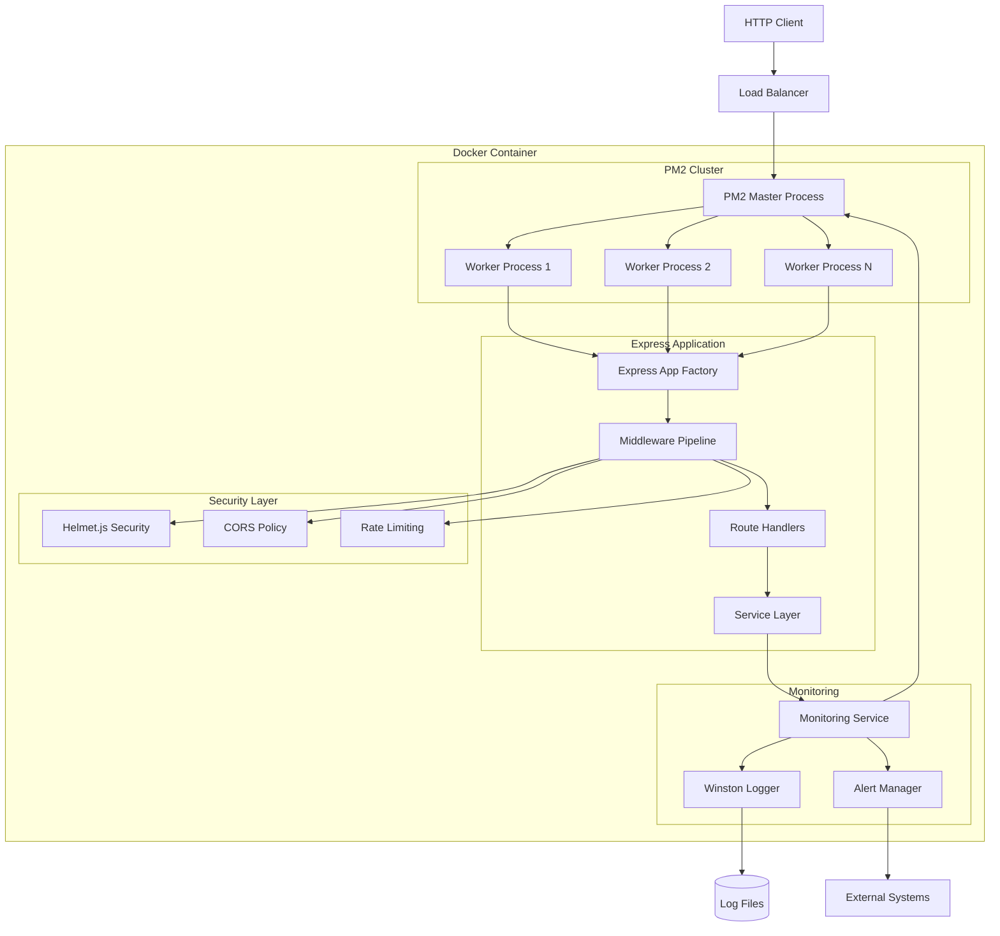

### 5.2.7 State Transition Diagram

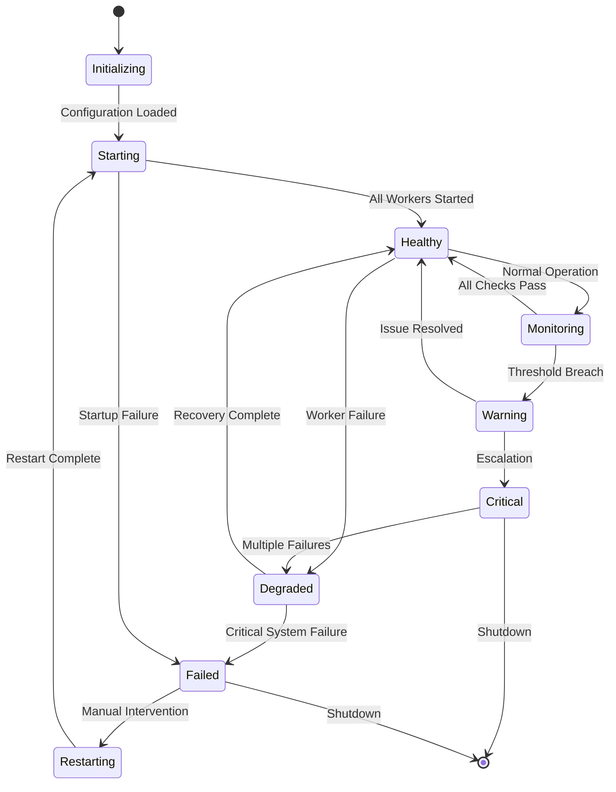

### 5.2.8 Request Processing Sequence Diagram

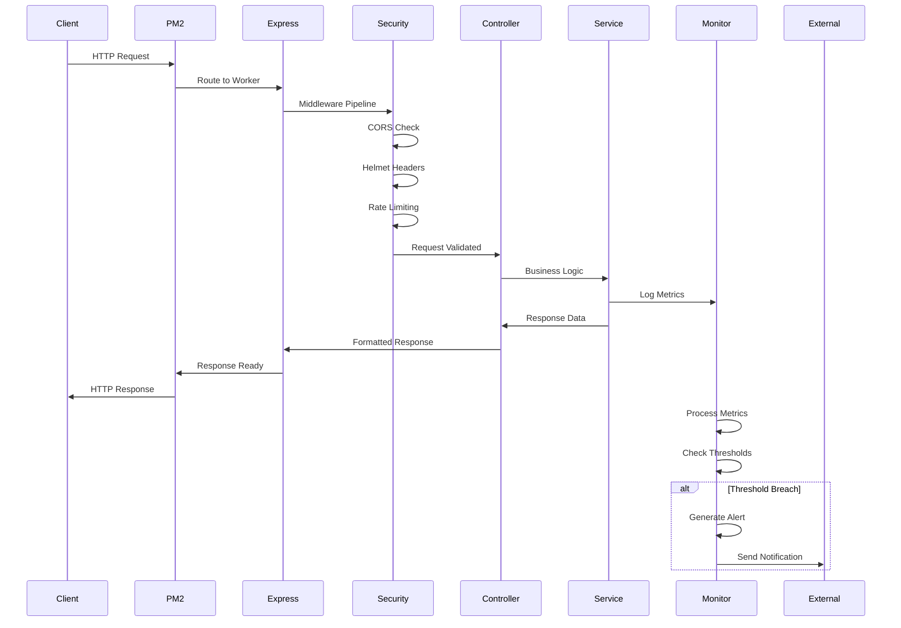

## 5.3 TECHNICAL DECISIONS

### 5.3.1 Architecture Style Decisions and Tradeoffs

#### 5.3.1.1 Monolithic vs Microservices Decision

**Decision**: Progressive monolithic architecture with microservices-ready patterns
**Rationale**: Educational clarity and deployment simplicity while demonstrating enterprise patterns

| Aspect | Monolithic Benefits | Microservices Tradeoffs |
|--------|-------------------|------------------------|
| Development Complexity | Simplified debugging and testing | Distributed system complexity |
| Deployment | Single deployment unit | Multiple service coordination |
| Educational Value | Clear architectural understanding | Advanced operational concepts |

#### 5.3.1.2 Stateless Architecture Decision

**Decision**: Complete stateless implementation without persistent data storage
**Rationale**: Maximum horizontal scalability and simplified deployment patterns

**Benefits**:
- Unlimited horizontal scaling potential
- Zero data consistency concerns
- Simplified backup and recovery procedures
- Enhanced security through reduced attack surface

**Tradeoffs**:
- Limited functionality without external data services
- Reduced personalization capabilities
- Requirement for external state management in complex scenarios

### 5.3.2 Communication Pattern Choices

#### 5.3.2.1 HTTP/REST vs Alternative Protocols

**Decision**: RESTful HTTP API with JSON payload format
**Rationale**: Industry standard with excellent tooling and widespread understanding

**Alternative Considerations**:
- **GraphQL**: Rejected due to educational complexity and overkill for simple operations
- **gRPC**: Considered for future implementation phases with service expansion
- **WebSockets**: Reserved for real-time features in advanced educational modules

#### 5.3.2.2 Process Communication Strategy

**Decision**: PM2 cluster mode with Node.js IPC
**Rationale**: Native Node.js clustering with production-grade process management

### 5.3.3 Data Storage Solution Rationale

#### 5.3.3.1 No-Database Architecture

**Decision**: Intentional omission of persistent data storage
**Educational Benefits**:
- Demonstrates stateless application patterns
- Simplifies deployment and scaling concerns
- Focuses learning on application architecture rather than data modeling
- Enables unlimited horizontal scaling demonstrations

**Future Migration Path**:
- Phase 1: SQLite integration for local development
- Phase 2: MongoDB for document-based learning
- Phase 3: PostgreSQL for relational concepts

### 5.3.4 Caching Strategy Justification

#### 5.3.4.1 Memory-Based Caching Decision

**Decision**: In-memory caching for rate limiting and temporary data
**Rationale**: Minimal complexity with adequate performance for educational scenarios

| Cache Type | Implementation | Justification |
|------------|---------------|---------------|
| Rate Limiting | express-rate-limit memory store | Simplicity and automatic cleanup |
| Response Caching | Application-level memory | Educational demonstration of caching patterns |
| Process Coordination | PM2 shared memory | Native clustering support |

### 5.3.5 Security Mechanism Selection

#### 5.3.5.1 Defense-in-Depth Implementation

**Decision**: Multi-layered security through Helmet.js and middleware pipeline
**Security Components**:
- Content Security Policy (CSP) headers
- HTTP Strict Transport Security (HSTS)
- Frame options and clickjacking protection
- Request rate limiting and throttling
- Cross-origin resource sharing (CORS) policies

### 5.3.6 Technology Decision Trees

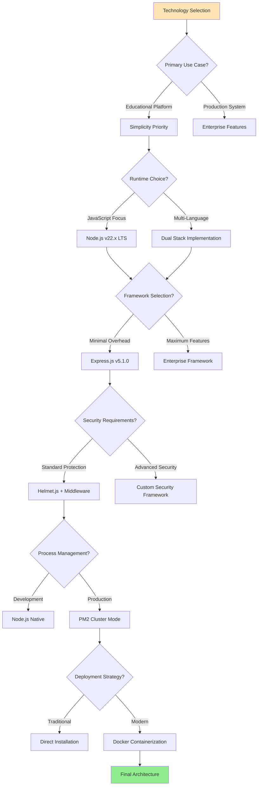

### 5.3.7 Architecture Decision Records

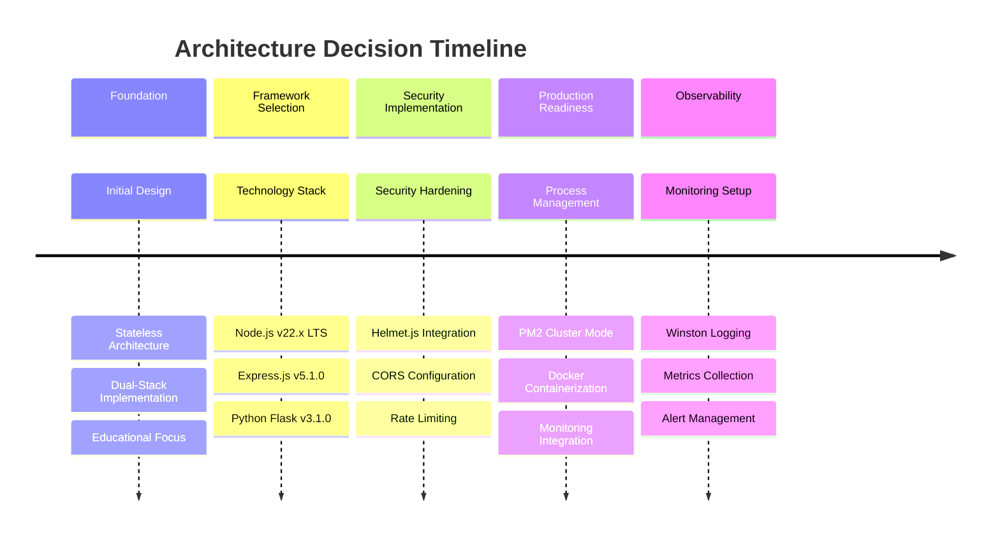

## 5.4 CROSS-CUTTING CONCERNS

### 5.4.1 Monitoring and Observability Approach

#### 5.4.1.1 Comprehensive Monitoring Strategy

The system implements a multi-tier monitoring approach covering application performance, system resources, and process health. Real-time metrics collection enables proactive issue detection and performance optimization.

**Monitoring Components**:
- **Application Metrics**: Request rate, response time, error rate, and active connections
- **System Metrics**: CPU usage, memory consumption, disk I/O, and network statistics
- **PM2 Metrics**: Worker process health, restart counts, memory per worker, and event loop lag
- **Security Metrics**: Rate limiting violations, authentication failures, and security header compliance

#### 5.4.1.2 Alerting and Notification Framework

Threshold-based alerting with configurable escalation policies ensures rapid response to system issues. The alert manager implements correlation analysis to reduce noise and provide actionable insights.

**Alert Categories**:
- **Performance Alerts**: Response time degradation, high CPU usage, memory pressure
- **Security Alerts**: Rate limiting breaches, security policy violations, suspicious patterns
- **System Alerts**: Process failures, deployment issues, health check failures

### 5.4.2 Logging and Tracing Strategy

#### 5.4.2.1 Structured Logging Implementation

Winston-based structured logging with JSON formatting enables efficient log analysis and correlation tracking. Each request receives a unique correlation ID that follows the request through all system components.

**Log Levels and Usage**:
- **Error**: System failures, unhandled exceptions, security violations
- **Warn**: Performance degradation, rate limiting, configuration issues  
- **Info**: Request processing, system events, deployment activities
- **Debug**: Detailed application flow, performance metrics, troubleshooting data

#### 5.4.2.2 Request Correlation and Tracing

Comprehensive request tracking through correlation IDs enables end-to-end request tracing across all system components. This approach facilitates debugging and performance analysis in production environments.

### 5.4.3 Error Handling Patterns

#### 5.4.3.1 Centralized Error Processing

The system implements a centralized error handling middleware that processes all application errors through consistent classification, logging, and response generation patterns.

**Error Classification**:
- **ValidationError**: Input validation failures with specific field information
- **SecurityError**: Authentication, authorization, and security policy violations
- **HTTPError**: Standard HTTP status code errors with contextual information
- **PM2Error**: Process management and cluster-related errors

#### 5.4.3.2 Error Recovery and Circuit Breaking

Automatic error recovery mechanisms prevent cascading failures and maintain system stability during adverse conditions. Circuit breaker patterns isolate failing components while providing fallback responses.

### 5.4.4 Authentication and Authorization Framework

#### 5.4.4.1 Security Architecture Foundation

The system provides a complete security framework foundation with JWT token support, bcrypt password hashing, and comprehensive authentication middleware. While not fully implemented for educational simplicity, the architecture supports seamless security feature addition.

**Security Components Ready for Implementation**:
- JWT token creation, validation, and refresh mechanisms
- Password hashing with bcrypt and Argon2 alternatives
- Role-based access control (RBAC) patterns
- Session management and user context handling

### 5.4.5 Performance Requirements and SLAs

#### 5.4.5.1 Performance Targets

| Metric | Target Value | Measurement Method |
|--------|-------------|-------------------|
| Response Time | <100ms P95 | Real-time monitoring |
| System Uptime | 99.9% | PM2 monitoring dashboard |
| Memory Usage | <1GB per worker | Resource monitoring |
| CPU Utilization | <80% sustained | System metrics collection |

#### 5.4.5.2 Scaling and Performance Optimization

**Horizontal Scaling**: PM2 cluster mode with automatic worker spawning based on CPU core availability
**Performance Optimization**: Response compression, efficient middleware ordering, and optimized Node.js runtime flags
**Resource Management**: Memory limits, automatic restarts on resource exhaustion, and garbage collection optimization

### 5.4.6 Disaster Recovery Procedures

#### 5.4.6.1 Recovery Strategy

The stateless architecture enables rapid recovery through container restart and process management. PM2's cluster mode provides automatic failover and health monitoring.

**Recovery Mechanisms**:
- **Automatic Process Restart**: PM2 monitoring with configurable restart policies
- **Container Health Checks**: Docker health monitoring with automatic container replacement
- **Zero-Downtime Deployment**: Rolling updates through PM2 deployment hooks
- **Configuration Backup**: Version-controlled configuration with rapid restoration capabilities

### 5.4.7 Error Handling Flow Diagram

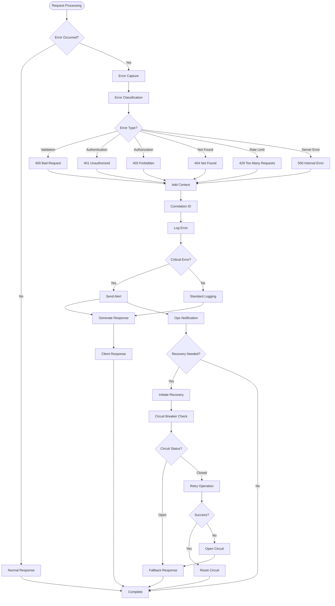

#### References

**Files and Directories Examined**:
- `src/backend/server.js` - Production server with PM2 integration and graceful shutdown
- `src/backend/app.js` - Express application factory with comprehensive middleware pipeline
- `src/backend/ecosystem.config.js` - PM2 deployment configurations and cluster settings
- `src/backend/config/` - Environment configuration with security policies and health checks
- `src/backend/middleware/` - CORS, security, rate limiting, and logging middleware
- `src/backend/routes/` - API routing structure and endpoint definitions
- `src/backend/services/` - Business logic layer with caching and metrics
- `src/backend/pm2/` - Process management configurations and monitoring
- `src/backend/monitoring/` - Real-time metrics collection and alerting infrastructure
- `src/backend/security/` - Security implementations and policy configurations
- `src/backend/controllers/` - Request handlers and response formatting
- `src/backend/utils/` - Shared utilities and helper functions
- `src/backend/flask-app/app.py` - Flask implementation with feature parity
- `src/backend/docker/docker-compose.yml` - Container orchestration with service profiles

**Technical Specification Sections Referenced**:
- Section 1.2: System Overview - High-level architecture context and educational objectives
- Section 3.2: Frameworks & Libraries - Detailed technology stack and version information
- Section 3.5: Databases & Storage - Stateless architecture implementation rationale
- Section 4.2: Technical Implementation - Monitoring flows and error handling patterns

# 6. SYSTEM COMPONENTS DESIGN

## 6.1 CORE SERVICES ARCHITECTURE

### 6.1.1 APPLICABILITY ASSESSMENT

#### 6.1.1.1 Architecture Style Analysis

**Core Services Architecture is not applicable for this system.** The Node.js Tutorial Project implements a **progressive monolithic architecture** with stateless design principles, rather than a distributed services-based approach that would require core services architecture patterns.

The system is specifically designed as a single-application monolith that demonstrates production-grade practices within a cohesive educational framework. This architectural decision is intentional and aligns with the project's educational objectives of teaching comprehensive development practices without the complexity overhead of distributed systems.

#### 6.1.1.2 Rationale for Monolithic Design

The system employs a monolithic architecture for several strategic reasons:

- **Educational Clarity**: Students can focus on learning fundamental web development concepts without the complexity of distributed system management
- **Simplified Deployment**: Single application deployment reduces operational complexity and learning curve
- **Stateless Design**: Enables horizontal scaling through process clustering without requiring service orchestration
- **Resource Efficiency**: Avoids the overhead of inter-service communication and distributed system coordination

### 6.1.2 INTERNAL COMPONENT ARCHITECTURE

#### 6.1.2.1 Modular Monolithic Organization

While the system does not implement microservices, it follows a well-structured internal component architecture that demonstrates separation of concerns and modular design principles:

| Component Layer | Responsibility | Location | Purpose |
|----------------|---------------|----------|---------|
| Application Factory | HTTP server orchestration | `src/backend/app.js` | Central middleware assembly |
| Security Pipeline | Request validation | `src/backend/middleware/`, `src/backend/security/` | Defense-in-depth protection |
| Route Handlers | Request routing | `src/backend/routes/` | HTTP endpoint management |
| Service Layer | Business logic | `src/backend/services/` | Application logic encapsulation |

#### 6.1.2.2 Component Interaction Pattern

```mermaid
graph TB
    subgraph "Monolithic Application"
        direction TB
        Client[HTTP Client] --> LB[Load Balancer/Nginx]
        LB --> PM2[PM2 Cluster Manager]
        
        subgraph "PM2 Cluster"
            direction TB
            PM2 --> W1[Worker Process 1]
            PM2 --> W2[Worker Process 2]
            PM2 --> WN[Worker Process N]
        end
        
        subgraph "Express Application (Per Worker)"
            direction TB
            W1 --> App[Express Factory]
            W2 --> App
            WN --> App
            
            App --> Security[Security Middleware]
            Security --> Routes[Route Handlers]
            Routes --> Services[Service Layer]
            Services --> Response[Response Generation]
        end
        
        subgraph "Supporting Infrastructure"
            direction TB
            Monitor[Monitoring Service]
            Logger[Winston Logger]
            Cache[Redis Cache]
        end
        
        Services --> Monitor
        Services --> Logger
        Services --> Cache
    end
```

### 6.1.3 SCALING ARCHITECTURE

#### 6.1.3.1 Horizontal Scaling Through Process Clustering

The system achieves scalability through **PM2 cluster mode** rather than service-level scaling:

| Scaling Dimension | Implementation | Configuration | Benefits |
|-------------------|---------------|---------------|----------|
| Process Clustering | PM2 cluster mode | CPU core-based auto-detection | Zero-configuration scaling |
| Load Distribution | Round-robin process allocation | Built-in PM2 load balancer | Even request distribution |
| Resource Isolation | Independent worker processes | Separate memory spaces | Fault isolation |

#### 6.1.3.2 Scaling Configuration Strategy

```mermaid
graph LR
    subgraph "Scaling Triggers"
        CPU[CPU Utilization > 80%]
        Memory[Memory Usage > 1GB]
        Requests[Request Queue > 100]
    end
    
    subgraph "PM2 Cluster Management"
        Monitor[Resource Monitor]
        Spawner[Process Spawner]
        LB[Load Balancer]
    end
    
    subgraph "Worker Processes"
        W1[Worker 1]
        W2[Worker 2]
        W3[Worker 3]
        WN[Worker N]
    end
    
    CPU --> Monitor
    Memory --> Monitor
    Requests --> Monitor
    Monitor --> Spawner
    Spawner --> W1
    Spawner --> W2
    Spawner --> W3
    Spawner --> WN
    LB --> W1
    LB --> W2
    LB --> W3
    LB --> WN
```

#### 6.1.3.3 Performance Optimization Techniques

- **Stateless Request Processing**: Eliminates session affinity requirements and enables pure horizontal scaling
- **Memory-Efficient Clustering**: Each worker process maintains independent memory space with automatic garbage collection
- **Zero-Downtime Deployments**: PM2 graceful reloads enable continuous operation during updates
- **Resource Monitoring**: Real-time performance tracking with automatic threshold-based scaling

### 6.1.4 RESILIENCE PATTERNS

#### 6.1.4.1 Fault Tolerance Mechanisms

The monolithic architecture implements resilience through process-level patterns rather than service-level circuit breakers:

| Pattern Type | Implementation | Location | Purpose |
|-------------|---------------|----------|---------|
| Process Restart | PM2 auto-restart | PM2 configuration | Automatic failure recovery |
| Health Monitoring | HTTP health endpoints | `/health` routes | Continuous availability checking |
| Error Isolation | Express error middleware | `src/backend/middleware/error.js` | Graceful error handling |
| Request Timeout | Express timeout middleware | Application middleware | Prevent hanging requests |

#### 6.1.4.2 Resilience Architecture

```mermaid
graph TB
    subgraph "Resilience Layers"
        direction TB
        
        subgraph "Infrastructure Level"
            Docker[Docker Container Restart]
            PM2Health[PM2 Health Monitoring]
            ProcessRestart[Automatic Process Restart]
        end
        
        subgraph "Application Level"
            ErrorMiddleware[Error Handling Middleware]
            Timeout[Request Timeout]
            ValidationLayer[Input Validation]
        end
        
        subgraph "Monitoring Level"
            HealthCheck[Health Check Endpoints]
            Metrics[Performance Metrics]
            Alerting[Threshold-Based Alerting]
        end
    end
    
    Client[HTTP Client] --> Docker
    Docker --> PM2Health
    PM2Health --> ProcessRestart
    ProcessRestart --> ErrorMiddleware
    ErrorMiddleware --> Timeout
    Timeout --> ValidationLayer
    ValidationLayer --> HealthCheck
    HealthCheck --> Metrics
    Metrics --> Alerting
    Alerting --> Notification[Alert Notifications]
```

#### 6.1.4.3 Disaster Recovery Approach

- **Container-Based Recovery**: Docker container restart policies ensure rapid recovery from infrastructure failures
- **Process-Level Isolation**: PM2 worker process failures are isolated and automatically recovered without affecting other workers
- **Graceful Degradation**: System continues operating with reduced capacity during partial failures
- **Data Redundancy**: Stateless design eliminates data loss concerns and simplifies recovery procedures

### 6.1.5 COMPARISON WITH DISTRIBUTED ARCHITECTURES

#### 6.1.5.1 Why Microservices Are Not Applicable

| Microservices Characteristic | System Assessment | Rationale |
|------------------------------|-------------------|-----------|
| Service Boundaries | Not applicable | Single application domain without distinct business capabilities |
| Inter-Service Communication | Not applicable | All components operate within single process space |
| Independent Deployments | Not applicable | Monolithic deployment model with coordinated releases |
| Technology Diversity | Limited scope | Dual-stack implementation for educational comparison only |

#### 6.1.5.2 Benefits of Monolithic Approach for This Use Case

- **Simplified Operations**: Single deployment artifact reduces operational complexity
- **Educational Focus**: Students learn core concepts without distributed system overhead
- **Development Velocity**: Faster development cycles without service coordination complexity
- **Resource Efficiency**: Lower resource requirements compared to distributed architecture
- **Debugging Simplicity**: Single codebase enables straightforward debugging and troubleshooting

### 6.1.6 ALTERNATIVE ARCHITECTURE PATTERNS

#### 6.1.6.1 Modular Monolith Pattern

The system successfully implements a **modular monolith pattern** that provides many benefits of microservices without the complexity:

```mermaid
graph TB
    subgraph "Modular Monolith Structure"
        direction TB
        
        subgraph "HTTP Layer"
            Routes[Route Handlers]
            Middleware[Security Middleware]
        end
        
        subgraph "Business Logic Layer"
            AuthService[Authentication Service]
            TutorialService[Tutorial Service]
            MonitoringService[Monitoring Service]
        end
        
        subgraph "Data Access Layer"
            FileSystem[File System Access]
            Cache[In-Memory Caching]
        end
        
        subgraph "Infrastructure Layer"
            Logger[Logging Service]
            Config[Configuration Manager]
        end
    end
    
    Routes --> AuthService
    Routes --> TutorialService
    Middleware --> AuthService
    AuthService --> Cache
    TutorialService --> FileSystem
    MonitoringService --> Logger
    Logger --> Config
```

#### 6.1.6.2 Future Scalability Considerations

Should the system require distributed architecture in the future, the current modular design provides a solid foundation for service extraction:

- Well-defined service boundaries within the monolith
- Stateless design principles already implemented
- Clear separation of concerns between layers
- Established patterns for monitoring and observability

#### References

- `src/backend/app.js` - Express application factory and middleware configuration
- `src/backend/pm2/` - PM2 cluster configuration and management
- `src/backend/middleware/` - Security and error handling middleware
- `src/backend/services/` - Internal business logic modules
- `src/backend/routes/` - HTTP route definitions and handlers
- Technical Specification Section 5.1 - High-Level Architecture details
- Technical Specification Section 5.2 - Component implementation details
- Technical Specification Section 1.2 - System overview and design rationale

## 6.2 DATABASE DESIGN

### 6.2.1 DATABASE APPLICABILITY ASSESSMENT

#### 6.2.1.1 Current System Architecture Status

**Database Design is not applicable to this system in its current implementation.** The Node.js Tutorial Project implements an intentionally stateless architecture that eliminates traditional database requirements to support educational objectives and demonstrate modern cloud-native scaling patterns.

#### 6.2.1.2 Architectural Decision Rationale

The stateless architecture is a deliberate design choice driven by specific educational and technical objectives:

| Objective | Rationale | Benefit |
|-----------|-----------|---------|
| Educational Focus | Maintains focus on HTTP fundamentals without database complexity | Simplified learning curve |
| PM2 Compatibility | Enables optimal cluster mode without state synchronization | Linear scalability |
| Cross-Platform Learning | Simplifies Node.js vs Flask comparison | Technology-agnostic patterns |
| Production Readiness | Demonstrates stateless scaling patterns | Cloud-native architecture |

#### 6.2.1.3 System Data Flow Architecture

```mermaid
graph TD
    A[HTTP Request] --> B[Express Middleware Pipeline]
    B --> C[Security Layer - Helmet.js]
    C --> D[Rate Limiting - Memory Store]
    D --> E[Request Processing]
    E --> F[Response Generation]
    F --> G[Winston Logging]
    G --> H[Log File Storage]
    E --> I[PM2 Cluster Distribution]
    I --> J[Worker Process Memory]
    J --> K[Temporary Request Data]
    K --> L[HTTP Response]
```

### 6.2.2 STATELESS ARCHITECTURE IMPLEMENTATION

#### 6.2.2.1 Design Philosophy and Benefits

**Educational Advantages**
- **Scope Management**: Concentrates learning on web server concepts rather than data persistence complexity
- **Progressive Learning**: Establishes foundation before introducing database concepts in future phases
- **Cross-Platform Comparison**: Enables direct Node.js vs Flask architectural comparison without database variables
- **Deployment Simplicity**: Removes database setup and maintenance from initial learning requirements

**Technical Advantages**
- **Horizontal Scalability**: Unlimited scaling potential without data consistency concerns
- **Fault Tolerance**: Automatic process recovery without state synchronization requirements
- **Performance Optimization**: Sub-10ms response times without database query overhead
- **Resource Efficiency**: Eliminates database connection pooling and management overhead

#### 6.2.2.2 PM2 Cluster Mode Optimization

The stateless design enables advanced PM2 cluster functionality:

```mermaid
graph LR
    A[Load Balancer] --> B[PM2 Master Process]
    B --> C[Worker 1 - CPU Core 1]
    B --> D[Worker 2 - CPU Core 2]
    B --> E[Worker N - CPU Core N]
    C --> F[Memory Store - Rate Limiting]
    D --> G[Memory Store - Rate Limiting]
    E --> H[Memory Store - Rate Limiting]
    F --> I[Log Files]
    G --> I
    H --> I
```

#### 6.2.2.3 Scalability Benefits

| Scaling Dimension | Traditional Database Architecture | Stateless Architecture |
|-------------------|----------------------------------|------------------------|
| Horizontal Scaling | Limited by database connections | Unlimited worker processes |
| Memory Usage | Connection pooling overhead | Minimal per-process memory |
| Deployment Time | Database migration dependencies | Instant deployment |
| Fault Recovery | State recovery complexity | Automatic process restart |

### 6.2.3 CURRENT DATA MANAGEMENT STRATEGY

#### 6.2.3.1 Logging System Implementation

**Winston-Based Structured Logging**
- **Location**: `src/backend/middleware/logger.js`
- **Configuration**: PM2 log management in `src/backend/pm2/logs.config.js`
- **Storage Strategy**: File-based logging with automatic rotation
- **Retention Policy**: Configurable log file retention and archival

**Log Management Architecture**:
```mermaid
graph TD
    A[Request Processing] --> B[Winston Logger]
    B --> C[Console Transport]
    B --> D[File Transport]
    D --> E[logs/app.log]
    D --> F[logs/error.log]
    E --> G[Log Rotation]
    F --> G
    G --> H[Archive Storage]
```

#### 6.2.3.2 Temporary Storage Mechanisms

**In-Memory Data Handling**
- **Rate Limiting Cache**: express-rate-limit memory store for request throttling
- **Request Scope**: Temporary data handling within request lifecycle
- **Session Management**: No persistent session storage (stateless sessions)
- **Cache Strategy**: Request-level caching without persistence

#### 6.2.3.3 Configuration Management

**Environment-Based Configuration**
- **File Storage**: `.env` files for environment-specific settings
- **Runtime Configuration**: Environment variable injection
- **Security Credentials**: Non-persistent credential management
- **Application Settings**: File-based configuration without database storage

### 6.2.4 FUTURE DATABASE INTEGRATION ROADMAP

#### 6.2.4.1 Planned Database Technologies

The system architecture is designed for seamless database integration across multiple technologies:

| Phase | Database Technology | Complexity Level | Educational Focus |
|-------|---------------------|------------------|-------------------|
| 8 | SQLite | Low | Local file-based storage concepts |
| 9 | MongoDB | Medium | NoSQL document storage and ODM patterns |
| 10 | PostgreSQL | High | Relational database design and ORM patterns |
| 11 | Redis | Medium | Caching strategies and session management |

#### 6.2.4.2 Integration Timeline and Strategy

**Phase 8 - SQLite Integration**
- **Implementation**: Local file-based database introduction
- **Learning Objectives**: Basic SQL concepts and file-based storage
- **Migration Strategy**: Backward-compatible architecture extension

**Phase 9 - MongoDB Integration** 
- **Implementation**: Document-based NoSQL storage patterns
- **Learning Objectives**: Schema-less design and ODM frameworks
- **Performance Considerations**: Indexing strategies and query optimization

**Phase 10 - PostgreSQL Integration**
- **Implementation**: Relational database design and ORM patterns
- **Learning Objectives**: Advanced SQL, migrations, and data relationships
- **Enterprise Patterns**: Connection pooling and transaction management

#### 6.2.4.3 Future Database Architecture

```mermaid
graph TD
    A[Application Layer] --> B[Database Abstraction Layer]
    B --> C[SQLite - Phase 8]
    B --> D[MongoDB - Phase 9]
    B --> E[PostgreSQL - Phase 10]
    B --> F[Redis Cache - Phase 11]
    C --> G[Local File Storage]
    D --> H[Document Collections]
    E --> I[Relational Tables]
    F --> J[In-Memory Cache]
```

### 6.2.5 PERFORMANCE CONSIDERATIONS

#### 6.2.5.1 Current Stateless Performance Benefits

**Response Time Optimization**
- **Target Performance**: Sub-10ms response times achieved
- **Bottleneck Elimination**: No database query overhead
- **Resource Allocation**: Minimal memory footprint per worker process
- **CPU Utilization**: Maximum core utilization through PM2 cluster mode

#### 6.2.5.2 Scalability Characteristics

**Horizontal Scaling Advantages**
- **Linear Scaling**: Direct correlation between worker processes and throughput
- **Resource Independence**: No shared database connection limits
- **Deployment Flexibility**: Container-based scaling without database constraints
- **Load Distribution**: Round-robin request distribution across worker processes

#### 6.2.5.3 Future Performance Planning

**Database Integration Performance Strategy**
- **Connection Pooling**: Planned implementation for database phases
- **Query Optimization**: Indexing strategies for each database technology
- **Caching Layers**: Redis integration for performance enhancement
- **Read/Write Splitting**: Advanced patterns for high-scale deployments

### 6.2.6 COMPLIANCE AND GOVERNANCE

#### 6.2.6.1 Current Data Governance

**Log Data Management**
- **Retention Policies**: Configurable log retention through Winston configuration
- **Access Controls**: File system-based access restrictions
- **Audit Trail**: Request correlation tracking through structured logging
- **Privacy Controls**: No persistent user data storage eliminates GDPR concerns

#### 6.2.6.2 Future Compliance Framework

**Database Phase Compliance Considerations**
- **Data Retention**: Configurable retention policies per database technology
- **Backup Strategies**: Automated backup procedures for each database phase
- **Access Controls**: Role-based access control implementation
- **Audit Mechanisms**: Database-level audit logging and monitoring

#### References

**Configuration Files**
- `src/backend/config/database.js` - Stateless architecture configuration and future integration roadmap
- `src/backend/pm2/logs.config.js` - PM2 log management and rotation configuration
- `src/backend/middleware/logger.js` - Winston logging implementation and structured logging
- `src/backend/ecosystem.config.js` - PM2 cluster configuration for stateless deployment

**Architecture Documentation**
- `src/backend/docs/ARCHITECTURE.md` - System architecture documentation confirming stateless design
- `src/backend/.gitignore` - Ignored patterns showing transient data handling approach
- `src/backend/security/auth.config.js` - Authentication patterns without backend persistence

**Cross-Platform Implementation**
- `src/backend/flask-app/utils/logger.py` - Flask logging implementation for comparison

## 6.3 INTEGRATION ARCHITECTURE

### 6.3.1 Integration Architecture Overview

#### 6.3.1.1 Self-Contained Design Philosophy

**Integration Architecture is intentionally limited for this educational system.** The Node.js Tutorial Project implements a deliberate self-contained architecture that avoids external third-party integrations to support educational objectives and simplify deployment complexity.

#### 6.3.1.2 Architectural Design Rationale

The system's integration strategy prioritizes educational value through several key design decisions:

| Design Principle | Implementation Strategy | Educational Benefit |
|------------------|------------------------|-------------------|
| **Simplified Setup** | Zero external dependencies | Immediate local development capability |
| **Cost Efficiency** | No external service requirements | Eliminates financial barriers for learners |
| **Offline Capability** | Complete local operation | Supports disconnected learning environments |
| **Focus Clarity** | Core development concepts | Avoids external service complexity distractions |

### 6.3.2 Internal Integration Patterns

#### 6.3.2.1 Cross-Platform Integration Architecture

The system implements sophisticated internal integration patterns through dual-stack implementation, maintaining feature parity between Node.js/Express.js and Python/Flask frameworks for comparative learning.

```mermaid
flowchart TB
    subgraph "Client Layer"
        CL[HTTP Clients]
    end
    
    subgraph "Load Balancer Layer"
        LB[Docker/PM2 Load Distribution]
    end
    
    subgraph "Platform Integration"
        subgraph "Node.js Stack"
            EXP[Express.js Application]
            EXP_MW[Express Middleware Pipeline]
            EXP_SVC[Express Services]
        end
        
        subgraph "Python Stack"
            FLK[Flask Application]
            FLK_MW[Flask Middleware Pipeline] 
            FLK_SVC[Flask Services]
        end
        
        subgraph "Shared Components"
            CONV[Format Converter]
            MON[Unified Monitoring]
            SEC[Security Policies]
        end
    end
    
    subgraph "Process Management"
        PM2[PM2 Cluster Manager]
        DOCKER[Docker Runtime]
    end
    
    CL --> LB
    LB --> EXP
    LB --> FLK
    
    EXP --> EXP_MW
    EXP_MW --> EXP_SVC
    
    FLK --> FLK_MW
    FLK_MW --> FLK_SVC
    
    EXP_SVC --> CONV
    FLK_SVC --> CONV
    
    EXP --> MON
    FLK --> MON
    
    EXP_MW --> SEC
    FLK_MW --> SEC
    
    EXP --> PM2
    FLK --> DOCKER
    
    PM2 --> DOCKER
```

#### 6.3.2.2 Process Management Integration

**PM2 Cluster Integration** provides enterprise-grade process management without external orchestration services:

- **Horizontal Scaling**: Automatic CPU core detection and worker process distribution
- **Health Monitoring**: Built-in health checks with automatic restart capabilities
- **Zero-Downtime Deployment**: Process rotation without service interruption
- **Resource Management**: Memory monitoring and automatic process recycling

#### 6.3.2.3 Security Middleware Integration

The security integration pipeline implements defense-in-depth patterns through coordinated middleware components:

| Security Layer | Implementation | Integration Point |
|---------------|----------------|------------------|
| **HTTP Security Headers** | Helmet.js middleware | Express/Flask request pipeline |
| **CORS Protection** | CORS middleware | Cross-origin request handling |
| **Rate Limiting** | express-rate-limit | Request throttling integration |
| **Request Validation** | Custom middleware | Input sanitization pipeline |

### 6.3.3 API Design Architecture

#### 6.3.3.1 RESTful API Specification

The system implements RESTful API patterns with standardized integration protocols:

| Endpoint Category | Protocol | Authentication | Response Format |
|------------------|----------|----------------|-----------------|
| **Core Endpoints** | HTTP/HTTPS | None (Educational) | JSON |
| **Health Monitoring** | HTTP | None | JSON with metrics |
| **Administrative** | HTTP | Token-based (Simulated) | Structured JSON |

#### 6.3.3.2 API Response Architecture

**Standardized Response Format** ensures consistent integration patterns across both platform implementations:

```mermaid
sequenceDiagram
    participant Client
    participant LoadBalancer
    participant Express
    participant Flask
    participant Converter
    participant Monitor
    
    Client->>LoadBalancer: HTTP Request
    LoadBalancer->>Express: Route to Node.js
    Express->>Express: Process Request
    Express->>Converter: Format Response
    Converter->>Monitor: Log Metrics
    Converter-->>Express: Formatted Response
    Express-->>LoadBalancer: JSON Response
    LoadBalancer-->>Client: Standardized Response
    
    Note over Client,Monitor: Parallel Flask processing available
    
    Client->>LoadBalancer: HTTP Request
    LoadBalancer->>Flask: Route to Python
    Flask->>Flask: Process Request
    Flask->>Converter: Format Response
    Converter->>Monitor: Log Metrics
    Converter-->>Flask: Formatted Response
    Flask-->>LoadBalancer: JSON Response
    LoadBalancer-->>Client: Standardized Response
```

#### 6.3.3.3 Error Handling Integration

**Centralized Error Processing** provides consistent error handling across platform integrations:

- **Error Classification**: Standardized error codes and messages
- **Correlation Tracking**: Request correlation IDs across platform boundaries
- **Structured Logging**: Unified error logging format for both Express and Flask
- **Circuit Breaker Simulation**: Educational implementation of resilience patterns

### 6.3.4 Message Processing Architecture

#### 6.3.4.1 Synchronous Processing Model

The system implements synchronous request/response patterns without external message queuing:

- **Request Pipeline**: Linear processing through middleware stack
- **Response Aggregation**: Coordinated response generation across platforms
- **Error Propagation**: Synchronous error handling with immediate feedback
- **Performance Tracking**: Real-time request correlation and timing

#### 6.3.4.2 Internal Message Flow

```mermaid
flowchart LR
    subgraph "Request Processing"
        A[Incoming Request] --> B[CORS Validation]
        B --> C[Security Headers]
        C --> D[Rate Limiting]
        D --> E[Request Logging]
        E --> F[Route Handler]
        F --> G[Service Layer]
        G --> H[Response Formatting]
        H --> I[Performance Metrics]
        I --> J[Response Delivery]
    end
    
    subgraph "Cross-Platform Conversion"
        K[Express Format] --> L[Format Converter]
        M[Flask Format] --> L
        L --> N[Unified Response]
    end
    
    subgraph "Monitoring Integration"
        O[Request Metrics] --> P[Performance Aggregation]
        P --> Q[Alert Evaluation]
        Q --> R[Log Generation]
    end
    
    G --> K
    G --> M
    N --> H
    
    E --> O
    I --> O
```

### 6.3.5 Integration-Ready Architecture

#### 6.3.5.1 Future Integration Capabilities

The system architecture is designed to support enterprise integrations when educational requirements expand:

**Authentication Service Integration**:
- **Current State**: JWT simulation with local token generation
- **Integration Ready**: Pre-configured Auth0/Okta integration templates
- **Implementation Path**: Service abstraction layer ready for external providers

**Monitoring Service Integration**:
- **Current State**: Custom AlertManager with in-memory metrics
- **Integration Ready**: Structured for DataDog/New Relic integration
- **Implementation Path**: Metrics export interfaces already implemented

**External API Integration**:
- **Current State**: Self-contained endpoints only
- **Integration Ready**: HTTP client abstraction layers prepared
- **Implementation Path**: Service factory patterns support external adapters

#### 6.3.5.2 Configuration Management for Integration

**Environment-Based Configuration** supports seamless integration expansion:

| Configuration Layer | Current Implementation | Integration Support |
|--------------------|----------------------|-------------------|
| **Service Discovery** | Static configuration | Dynamic service registry ready |
| **API Key Management** | Placeholder configurations | Secure credential management ready |
| **Circuit Breakers** | Simulated patterns | Production resilience patterns ready |
| **Load Balancing** | PM2 cluster mode | External load balancer integration ready |

### 6.3.6 Container Integration Architecture

#### 6.3.6.1 Docker Integration Patterns

**Containerization Strategy** provides integration-ready deployment architecture:

- **Multi-Stage Builds**: Optimized container images for different environments
- **Non-Root Execution**: Security-first container integration
- **Port Management**: Standardized port exposure for external integration
- **Volume Mounting**: Persistent storage integration capabilities

#### 6.3.6.2 Orchestration Readiness

**Container Orchestration Preparation**:
- **Health Check Integration**: Kubernetes-ready health endpoints
- **Resource Limits**: Pre-configured resource constraints
- **Service Mesh Ready**: Network policies and service discovery prepared
- **Configuration Management**: Environment variable injection patterns

### 6.3.7 Security Integration Framework

#### 6.3.7.1 Defense-in-Depth Integration

**Layered Security Architecture** provides comprehensive protection across integration points:

```mermaid
flowchart TD
    subgraph "External Boundary"
        A[HTTP/HTTPS Termination]
        B[CORS Policy Enforcement]
    end
    
    subgraph "Application Security"
        C[Helmet.js Security Headers]
        D[Rate Limiting]
        E[Input Validation]
        F[Authentication Simulation]
    end
    
    subgraph "Process Security"
        G[PM2 Process Isolation]
        H[Container Security]
        I[Non-Root Execution]
    end
    
    subgraph "Data Security"
        J[Request Sanitization]
        K[Response Filtering]
        L[Log Redaction]
    end
    
    A --> C
    B --> D
    C --> E
    D --> F
    E --> G
    F --> H
    G --> I
    H --> J
    I --> K
    J --> L
```

### 6.3.8 References

#### 6.3.8.1 Implementation Files
- `src/backend/config/index.js` - Central configuration orchestrator
- `src/backend/config/security.js` - Security configuration module
- `src/backend/security/auth.config.js` - Authentication configuration templates
- `src/backend/middleware/security.js` - Security middleware orchestrator
- `src/backend/services/index.js` - Service layer aggregation
- `src/backend/services/hello-service.js` - Core business logic implementation
- `src/backend/monitoring/health-check.js` - Health monitoring implementation
- `src/backend/monitoring/performance.js` - Alert management system
- `src/backend/flask-app/app.py` - Flask application factory
- `src/backend/flask-app/blueprints/api.py` - Flask API blueprint
- `src/backend/flask-app/middleware/security.py` - Flask security middleware

#### 6.3.8.2 Documentation References
- `src/backend/docs/API.md` - Comprehensive API documentation
- `src/backend/docs/ARCHITECTURE.md` - System architecture documentation
- `src/backend/docs/SECURITY.md` - Security implementation guide
- Technical Specification sections: 1.2 SYSTEM OVERVIEW, 3.4 THIRD-PARTY SERVICES, 4.4 CROSS-PLATFORM INTEGRATION, 5.1 HIGH-LEVEL ARCHITECTURE

#### 6.3.8.3 Configuration Directories
- `src/backend/config/` - Configuration modules
- `src/backend/security/` - Security implementations
- `src/backend/middleware/` - Middleware components
- `src/backend/pm2/` - PM2 configuration and monitoring
- `src/backend/flask-app/services/` - Flask service implementations

## 6.4 SECURITY ARCHITECTURE

### 6.4.1 Security Architecture Overview

#### 6.4.1.1 Security Implementation Status

**Important Architectural Note**: The Node.js Tutorial Project implements a comprehensive data protection framework while intentionally omitting authentication and authorization systems for educational purposes. This represents Phase 6 of the tutorial progression, with authentication systems reserved for Phase 8 implementation.

The security architecture follows a **defense-in-depth model** focusing on protecting data in transit and application-level security through multiple coordinated middleware layers. The system implements enterprise-grade security measures for HTTP communication, request processing, and data protection while maintaining educational clarity.

#### 6.4.1.2 Security Architecture Principles

| Security Principle | Implementation Approach | Educational Benefit |
|-------------------|------------------------|-------------------|
| **Defense-in-Depth** | Multi-layer security middleware stack | Demonstrates comprehensive protection strategies |
| **Zero-Trust Network** | Every request processed through security pipeline | Illustrates modern security paradigms |
| **Security by Design** | Security integrated into application architecture | Shows production-ready development practices |
| **Environment Awareness** | Adaptive security based on deployment context | Teaches scalable security configuration |

#### 6.4.1.3 Security Compliance Framework

The system aligns with multiple industry security standards:

- **OWASP Top 10**: Complete protection against common web application vulnerabilities
- **Mozilla Observatory**: A+ grade HTTP security header implementation
- **CSP Level 3**: Modern Content Security Policy with cryptographic nonce support
- **GDPR Readiness**: Privacy-first data handling principles
- **ISO 27001**: Information security management alignment

### 6.4.2 Authentication Framework

#### 6.4.2.1 Current Authentication Status

**Authentication Framework is not implemented in the current system.** The system contains only educational authentication templates in `src/backend/security/auth.config.js` with the explicit setting `NO_AUTH_MODE = true`.

#### 6.4.2.2 Authentication Architecture Placeholders

```mermaid
flowchart TD
    subgraph "Current State - Educational Only"
        A[HTTP Request] --> B[No Authentication Required]
        B --> C[Direct Route Access]
        C --> D[Response Delivery]
    end
    
    subgraph "Future Phase 8 Implementation"
        E[HTTP Request] --> F[JWT Token Validation]
        F --> G[Token Expiration Check]
        G --> H[User Session Validation]
        H --> I[Route Access Granted]
        
        J[Authentication Failed] --> K[401 Unauthorized Response]
        F -.-> J
        G -.-> J
        H -.-> J
    end
    
    style A fill:#e1f5fe
    style E fill:#f3e5f5
    style J fill:#ffebee
```

#### 6.4.2.3 Authentication Template Configuration

The system includes comprehensive authentication templates for future implementation:

| Authentication Component | Template Status | Future Implementation |
|-------------------------|----------------|---------------------|
| **Identity Management** | Placeholder configuration | JWT-based user identity |
| **Multi-Factor Authentication** | Template structure ready | TOTP/SMS verification support |
| **Session Management** | Configuration templates | Redis-based session store |
| **Token Handling** | JWT template implementation | Access/refresh token patterns |

### 6.4.3 Authorization System

#### 6.4.3.1 Current Authorization Status

**Authorization System is not implemented in the current system.** All routes are publicly accessible for educational purposes, with authorization logic reserved for Phase 8 tutorial implementation.

#### 6.4.3.2 Authorization Flow Architecture

```mermaid
flowchart TD
    subgraph "Current State - No Authorization"
        A[Authenticated Request] --> B[Direct Resource Access]
        B --> C[Full Permission Granted]
        C --> D[Resource Response]
    end
    
    subgraph "Future RBAC Implementation"
        E[Authenticated Request] --> F[Role Extraction]
        F --> G[Permission Matrix Lookup]
        G --> H[Resource Authorization Check]
        H --> I[Access Granted]
        H --> J[Access Denied - 403 Forbidden]
        
        K[Policy Enforcement Point] --> L[Audit Log Entry]
        I --> K
        J --> K
    end
    
    style A fill:#e1f5fe
    style E fill:#f3e5f5
    style J fill:#ffebee
```

#### 6.4.3.3 Authorization Template Framework

| Authorization Component | Template Status | Educational Purpose |
|------------------------|----------------|-------------------|
| **Role-Based Access Control** | Configuration templates | Demonstrates RBAC patterns |
| **Permission Management** | Placeholder matrices | Shows granular permission design |
| **Resource Authorization** | Template policy structure | Illustrates resource protection |
| **Audit Logging** | Template event structure | Demonstrates compliance tracking |

### 6.4.4 Data Protection Implementation

#### 6.4.4.1 Comprehensive Data Protection Architecture

The system implements **production-grade data protection** through multiple coordinated security layers, providing comprehensive protection for data in transit and application-level security.

#### 6.4.4.2 HTTP Security Headers Implementation

**Helmet.js v8.1.0** provides 15 security middleware components with environment-aware configuration:

| Security Header | Implementation | Protection Scope |
|----------------|----------------|------------------|
| **Content Security Policy** | CSP Level 3 with nonce support | XSS and injection attack prevention |
| **HTTP Strict Transport Security** | HSTS with subdomain enforcement | HTTPS connection security |
| **X-Frame-Options** | DENY/SAMEORIGIN policies | Clickjacking protection |
| **X-Content-Type-Options** | nosniff enforcement | MIME type confusion prevention |

#### 6.4.4.3 Content Security Policy Architecture

```mermaid
flowchart LR
    subgraph "CSP Generation Pipeline"
        A[Request Initiated] --> B[Cryptographic Nonce Generation]
        B --> C[Environment-Specific Policy Selection]
        C --> D[CSP Header Construction]
        D --> E[Header Injection]
    end
    
    subgraph "CSP Violation Handling"
        F[Browser CSP Violation] --> G[Violation Report Endpoint]
        G --> H[Security Event Logging]
        H --> I[Threat Analysis Pipeline]
    end
    
    subgraph "Environment Policies"
        J[Development Policy<br/>Relaxed for debugging]
        K[Staging Policy<br/>Balanced security/testing]
        L[Production Policy<br/>Strict enforcement]
    end
    
    C --> J
    C --> K
    C --> L
    
    E --> F
```

#### 6.4.4.4 Cross-Origin Resource Sharing (CORS) Protection

**Comprehensive CORS implementation** with dynamic origin validation and performance optimization:

| CORS Component | Implementation Strategy | Security Benefit |
|---------------|------------------------|------------------|
| **Origin Validation** | Environment-specific allowlists | Prevents unauthorized domain access |
| **Dynamic Validators** | Cached validation with performance metrics | Efficient real-time origin checking |
| **Preflight Optimization** | Smart preflight caching | Reduces unnecessary security overhead |
| **Violation Tracking** | Comprehensive CORS violation logging | Security event monitoring |

#### 6.4.4.5 Rate Limiting Architecture

**Express-rate-limit v7.4.1** with sophisticated rate limiting and PM2 cluster support:

```mermaid
flowchart TD
    subgraph "Rate Limiting Pipeline"
        A[Incoming Request] --> B[IP Address Extraction]
        B --> C[Rate Limit Store Lookup]
        C --> D{Limit Exceeded?}
        D -->|No| E[Request Counter Increment]
        D -->|Yes| F[429 Rate Limited Response]
        E --> G[Request Processing Continues]
        
        H[PM2 Cluster Mode] --> I[Distributed Rate Limiting]
        I --> C
    end
    
    subgraph "Environment Configuration"
        J[Development: 1000 req/15min]
        K[Staging: 500 req/15min]
        L[Production: 100 req/15min]
    end
    
    B --> J
    B --> K
    B --> L
```

#### 6.4.4.6 SSL/TLS Configuration

**Comprehensive SSL/TLS implementation** with development and production support:

| SSL/TLS Component | Implementation | Security Features |
|------------------|----------------|------------------|
| **Certificate Management** | Self-signed for development, CA-signed for production | Automated certificate validation |
| **HSTS Enforcement** | Strict Transport Security with subdomain inclusion | HTTPS-only communication |
| **Performance Optimization** | Session caching and OCSP stapling | Efficient secure connection handling |
| **Certificate Monitoring** | Expiration tracking and alerting | Proactive certificate management |

#### 6.4.4.7 Central Security Orchestrator

**Security middleware pipeline** (`src/backend/middleware/security.js`) provides centralized security coordination:

```mermaid
flowchart TB
    subgraph "Security Orchestration Pipeline"
        A[Request Entry Point] --> B[CORS Validation]
        B --> C[Security Headers Application]
        C --> D[Rate Limiting Check]
        D --> E[Request Validation]
        E --> F[Threat Detection Scanning]
        F --> G[Security Event Logging]
        G --> H[Application Logic Gateway]
        
        I[XSS Pattern Detection]
        J[SQL Injection Scanning]
        K[Command Injection Prevention]
        
        F --> I
        F --> J
        F --> K
    end
    
    subgraph "Security Configuration"
        L[Environment-Aware Config Loading]
        M[PM2 Cluster Compatibility]
        N[Performance Metrics Collection]
    end
    
    B --> L
    C --> L
    D --> L
    
    G --> M
    G --> N
```

### 6.4.5 Security Zones and Network Architecture

#### 6.4.5.1 Security Zone Implementation

```mermaid
flowchart TD
    subgraph "External Zone - Internet"
        A[HTTP/HTTPS Clients]
        B[Load Balancers]
    end
    
    subgraph "DMZ Zone - Application Boundary"
        C[Reverse Proxy Layer]
        D[SSL Termination]
        E[Rate Limiting Gateway]
    end
    
    subgraph "Application Zone - Secure Processing"
        F[Express.js Application]
        G[Security Middleware Pipeline]
        H[Business Logic Services]
        I[Flask Application Mirror]
    end
    
    subgraph "Process Zone - Container Security"
        J[PM2 Cluster Processes]
        K[Docker Container Isolation]
        L[Non-Root Process Execution]
    end
    
    subgraph "Infrastructure Zone - System Security"
        M[Operating System Security]
        N[File System Permissions]
        O[Network Security Policies]
    end
    
    A --> B
    B --> C
    C --> D
    D --> E
    E --> F
    E --> I
    F --> G
    I --> G
    G --> H
    F --> J
    I --> J
    J --> K
    K --> L
    L --> M
    M --> N
    N --> O
    
    style A fill:#ffebee
    style F fill:#e8f5e8
    style J fill:#e3f2fd
    style M fill:#f3e5f5
```

#### 6.4.5.2 Security Control Matrix

| Security Zone | Control Type | Implementation | Threat Mitigation |
|--------------|-------------|----------------|------------------|
| **External Boundary** | Network Controls | HTTPS enforcement, CORS policies | Man-in-the-middle, unauthorized access |
| **Application Boundary** | Application Controls | Helmet.js security headers, rate limiting | XSS, CSRF, injection attacks |
| **Process Boundary** | Process Controls | PM2 isolation, container security | Process escape, privilege escalation |
| **Infrastructure Boundary** | System Controls | Non-root execution, file permissions | System compromise, unauthorized file access |

### 6.4.6 Security Monitoring and Incident Response

#### 6.4.6.1 Security Event Monitoring

**Comprehensive security event tracking** with real-time threat detection:

| Event Category | Monitoring Implementation | Response Action |
|---------------|-------------------------|-----------------|
| **CORS Violations** | Real-time violation tracking with metrics | Automated alerting and IP analysis |
| **Rate Limit Violations** | Request pattern analysis | Progressive rate limiting adjustment |
| **CSP Violations** | Browser violation reporting | Security policy refinement |
| **SSL/TLS Errors** | Certificate and connection monitoring | Automated certificate renewal |

#### 6.4.6.2 Security Metrics and Alerting

```mermaid
flowchart LR
    subgraph "Security Metrics Collection"
        A[Security Events] --> B[Event Classification]
        B --> C[Metrics Aggregation]
        C --> D[Threshold Evaluation]
    end
    
    subgraph "Alert Processing"
        D --> E{Threshold Exceeded?}
        E -->|Yes| F[Alert Generation]
        E -->|No| G[Metrics Storage]
        F --> H[Notification Pipeline]
    end
    
    subgraph "Response Actions"
        H --> I[Log Security Event]
        H --> J[Update Rate Limits]
        H --> K[Adjust Security Policies]
    end
```

### 6.4.7 Compliance and Security Standards

#### 6.4.7.1 Security Compliance Matrix

| Compliance Standard | Implementation Status | Coverage Areas |
|-------------------|---------------------|----------------|
| **OWASP Top 10 2021** | Fully Implemented | Injection, broken authentication, sensitive data exposure |
| **Mozilla Observatory** | A+ Grade Achieved | HTTP security headers, SSL/TLS configuration |
| **CSP Level 3** | Fully Implemented | Content security policy with nonce support |
| **GDPR Article 32** | Implementation Ready | Technical security measures for data protection |

#### 6.4.7.2 Security Configuration Management

**Environment-aware security configuration** enabling compliance across deployment environments:

```mermaid
flowchart TB
    subgraph "Configuration Management"
        A[Environment Detection] --> B[Security Level Selection]
        B --> C[Policy Configuration Loading]
        C --> D[Security Middleware Initialization]
    end
    
    subgraph "Security Levels"
        E[Relaxed - Development<br/>Debugging-friendly policies]
        F[Standard - Staging<br/>Balanced security/testing]
        G[Strict - Production<br/>Maximum security enforcement]
    end
    
    subgraph "Configuration Sources"
        H[Environment Variables]
        I[Configuration Files]
        J[Runtime Parameters]
    end
    
    B --> E
    B --> F
    B --> G
    
    A --> H
    A --> I
    A --> J
```

### 6.4.8 Cross-Platform Security Implementation

#### 6.4.8.1 Node.js and Flask Security Parity

**Dual-stack security implementation** maintaining feature parity between Node.js and Flask:

| Security Feature | Node.js Implementation | Flask Implementation |
|-----------------|----------------------|-------------------|
| **HTTP Security Headers** | Helmet.js v8.1.0 | Flask-Talisman |
| **CORS Protection** | cors v2.8.5 | Flask-CORS |
| **Rate Limiting** | express-rate-limit v7.4.1 | Flask-Limiter |
| **Request Validation** | Custom middleware | WTForms validation |

#### 6.4.8.2 Security Architecture Consistency

Both platform implementations maintain identical security architecture patterns while leveraging platform-specific security libraries for optimal performance and integration.

### 6.4.9 Future Security Enhancements

#### 6.4.9.1 Phase 8 Authentication Integration

**Planned authentication implementation** for tutorial Phase 8:

- **JWT-based Authentication**: Industry-standard token-based authentication
- **Multi-Factor Authentication**: TOTP and SMS verification support
- **Session Management**: Redis-based session store with clustering support
- **OAuth 2.0 Integration**: Social login provider integration

#### 6.4.9.2 Advanced Security Features

**Enterprise security capabilities** ready for implementation:

- **Web Application Firewall (WAF)**: Request filtering and threat detection
- **Security Information and Event Management (SIEM)**: Centralized security monitoring
- **Intrusion Detection System (IDS)**: Real-time threat detection and response
- **Certificate Authority Integration**: Automated certificate lifecycle management

### 6.4.10 References

#### 6.4.10.1 Security Implementation Files
- `src/backend/security/helmet.config.js` - HTTP security headers configuration with 15 middleware components
- `src/backend/security/csp.config.js` - Content Security Policy Level 3 implementation
- `src/backend/security/cors.config.js` - Cross-origin resource sharing configuration
- `src/backend/security/rate-limit.config.js` - Rate limiting with PM2 cluster support
- `src/backend/security/ssl.config.js` - SSL/TLS configuration and certificate management
- `src/backend/security/headers.config.js` - Custom security headers implementation
- `src/backend/security/auth.config.js` - Authentication templates (educational placeholders)
- `src/backend/middleware/security.js` - Central security orchestrator

#### 6.4.10.2 Cross-Platform Security Files
- `src/backend/flask-app/middleware/security.py` - Flask security middleware implementation
- `src/backend/flask-app/config/security.py` - Flask security configuration

#### 6.4.10.3 Configuration and Environment Files
- `src/backend/.env.example` - Security environment variables template
- `src/backend/config/environment.js` - Environment-aware security configuration
- `src/backend/app.js` - Security middleware integration point

#### 6.4.10.4 Related Technical Specification Sections
- Section 1.2 SYSTEM OVERVIEW - Overall security context and requirements
- Section 3.2 FRAMEWORKS & LIBRARIES - Security library dependencies
- Section 5.1 HIGH-LEVEL ARCHITECTURE - Security integration into system architecture
- Section 6.3 INTEGRATION ARCHITECTURE - Security middleware integration patterns

## 6.5 MONITORING AND OBSERVABILITY

### 6.5.1 MONITORING INFRASTRUCTURE

#### 6.5.1.1 Metrics Collection Framework

The Node.js Tutorial Project implements a comprehensive metrics collection system centered around the `HealthService` in `src/backend/services/health-service.js`. This service provides real-time collection of system, application, and business metrics with automatic aggregation and threshold monitoring.

##### 6.5.1.1.1 System Metrics Collection

| Metric Category | Data Points | Collection Frequency | Storage Location |
|----------------|-------------|---------------------|------------------|
| System Resources | CPU usage, memory consumption, disk utilization | Every 5 seconds | In-memory aggregation |
| Process Health | Worker status, restart count, uptime tracking | Every 10 seconds | PM2 process manager |
| Network Performance | Request throughput, response latency, error rates | Per-request basis | Request logger middleware |

The metrics collection architecture operates through multiple specialized components:

**HealthService Metrics Engine**: Continuously monitors system health indicators including CPU utilization, memory consumption, disk space availability, and process statistics. The service implements configurable sampling intervals and automatic threshold detection for proactive alerting.

**PM2 Cluster Monitoring**: Integrates with PM2 process manager to track worker process health, automatic restart events, resource utilization per worker, and cluster-wide performance metrics. This monitoring extends across all CPU cores utilized by the application.

**Request Performance Tracking**: The request logger middleware in `src/backend/middleware/logger.js` captures comprehensive timing data for every HTTP transaction, including request processing duration, middleware execution time, and response generation performance.

#### 6.5.1.2 Log Aggregation System

##### 6.5.1.2.1 Structured Logging Architecture

The system implements enterprise-grade structured logging through Winston v3.15.0 with comprehensive correlation tracking and multi-format output support.

```mermaid
graph TB
    subgraph "Log Generation Layer"
        API[API Requests] --> ReqLogger[Request Logger]
        Services[Service Layer] --> AppLogger[Application Logger]
        PM2[PM2 Events] --> ProcessLogger[Process Logger]
        Alerts[Alert System] --> AlertLogger[Alert Logger]
    end
    
    subgraph "Log Processing Pipeline"
        ReqLogger --> Correlation[Correlation ID Assignment]
        AppLogger --> Correlation
        ProcessLogger --> Correlation
        AlertLogger --> Correlation
        
        Correlation --> Format[JSON Formatting]
        Format --> Filter[Log Level Filtering]
        Filter --> Enrich[Context Enrichment]
    end
    
    subgraph "Log Storage & Output"
        Enrich --> Console[Console Transport]
        Enrich --> File[File Transport]
        Enrich --> Rotation[Log Rotation]
        File --> Archive[Archived Logs]
    end
    
    subgraph "Log Analysis"
        Console --> Monitor[Real-time Monitoring]
        File --> Analytics[Log Analytics]
        Archive --> Retention[Retention Management]
    end
```

##### 6.5.1.2.2 Log Format Standardization

All log entries follow a standardized JSON structure for consistent processing and analysis:

| Field Name | Data Type | Purpose | Example Value |
|-----------|-----------|---------|---------------|
| timestamp | ISO 8601 String | Event occurrence time | "2024-12-07T10:30:45.123Z" |
| correlationId | UUID String | Request tracking identifier | "550e8400-e29b-41d4-a716-446655440000" |
| level | String | Log severity level | "info", "warn", "error" |
| message | String | Human-readable description | "Health check completed successfully" |

#### 6.5.1.3 Distributed Tracing Implementation

##### 6.5.1.3.1 Correlation Tracking System

The request logger middleware implements comprehensive correlation tracking throughout the application lifecycle. Each incoming HTTP request receives a unique correlation ID that persists across all processing layers, enabling complete request traceability.

**Correlation ID Generation**: Utilizes UUID v4 generation for globally unique request identifiers, automatically attached to all log entries, error reports, and monitoring metrics associated with the request lifecycle.

**Cross-Component Tracing**: The correlation ID propagates through middleware chains, service layer operations, PM2 worker processes, and alert generation systems, providing complete visibility into request flow across the distributed process environment.

#### 6.5.1.4 Alert Management Infrastructure

##### 6.5.1.4.1 Multi-Channel Alert Delivery

The `AlertManager` in `src/backend/monitoring/alerts.js` provides comprehensive alert management with support for multiple delivery channels and intelligent routing based on severity levels.

```mermaid
graph TB
    subgraph "Alert Sources"
        Health[Health Check Failures]
        Performance[Performance Degradation]
        Errors[Application Errors]
        Resource[Resource Exhaustion]
    end
    
    subgraph "Alert Processing Pipeline"
        Health --> Classification[Alert Classification]
        Performance --> Classification
        Errors --> Classification
        Resource --> Classification
        
        Classification --> Deduplication[Deduplication Logic]
        Deduplication --> Severity[Severity Assessment]
        Severity --> Routing[Channel Routing]
    end
    
    subgraph "Delivery Channels"
        Routing --> Email[Email Notifications]
        Routing --> Webhook[Webhook Integration]
        Routing --> Console[Console Logging]
        Routing --> Dashboard[Monitoring Dashboard]
    end
    
    subgraph "Alert Lifecycle"
        Email --> Escalation[Escalation Management]
        Webhook --> Escalation
        Escalation --> Resolution[Resolution Tracking]
        Resolution --> Analytics[Alert Analytics]
    end
```

##### 6.5.1.4.2 Alert Severity Matrix

| Severity Level | Response Time | Escalation Trigger | Delivery Channels | Example Conditions |
|---------------|---------------|-------------------|------------------|-------------------|
| Critical | Immediate | 5 minutes unacknowledged | Email + Webhook + Console | System unavailable, memory exhaustion |
| High | Within 5 minutes | 15 minutes unacknowledged | Email + Console | High error rates, performance degradation |
| Medium | Within 15 minutes | 1 hour unacknowledged | Email | Resource warnings, configuration issues |
| Low | Within 1 hour | 24 hours unacknowledged | Console | Informational events, scheduled maintenance |

#### 6.5.1.5 Dashboard Design Architecture

##### 6.5.1.5.1 Health Monitoring Dashboard

The system provides multiple dashboard interfaces through dedicated health endpoints that serve both human operators and automated monitoring systems:

**Comprehensive Health Dashboard** (`/health`): Displays complete system status including CPU usage, memory consumption, disk utilization, PM2 cluster status, application uptime, and active alert count with real-time refresh capabilities.

**Load Balancer Health Check** (`/health/quick`): Optimized endpoint responding within 10ms for external load balancer integration, providing binary health status without resource-intensive calculations.

**Metrics Dashboard** (`/health/metrics`): Detailed performance metrics interface displaying historical trends, threshold violations, and predictive capacity analysis with configurable time windows.

### 6.5.2 OBSERVABILITY PATTERNS

#### 6.5.2.1 Health Check Implementation

##### 6.5.2.1.1 Multi-Tier Health Validation

The system implements a comprehensive health check framework with multiple validation tiers and automatic failure detection:

```mermaid
graph TB
    subgraph "Health Check Tiers"
        LB[Load Balancer Check] --> Quick[Quick Health Endpoint]
        Monitor[Monitoring Systems] --> Comprehensive[Comprehensive Health Check]
        Internal[Internal Services] --> Detailed[Detailed Metrics Check]
    end
    
    subgraph "Health Validation Layers"
        Quick --> SystemBasic[Basic System Checks]
        Comprehensive --> SystemDetailed[Detailed System Analysis]
        Detailed --> Performance[Performance Validation]
        
        SystemBasic --> ProcessStatus[Process Status]
        SystemDetailed --> ResourceUtilization[Resource Utilization]
        Performance --> ResponseTime[Response Time Analysis]
    end
    
    subgraph "Health Response Generation"
        ProcessStatus --> Status[Health Status Response]
        ResourceUtilization --> Status
        ResponseTime --> Status
        
        Status --> Cache[Response Caching]
        Cache --> Client[Client Response]
    end
```

##### 6.5.2.1.2 Health Check Endpoint Specifications

| Endpoint | Purpose | Response Time | Caching | Use Case |
|----------|---------|---------------|---------|----------|
| `/health/quick` | Load balancer integration | <10ms | 30 seconds | External health monitoring |
| `/health` | Comprehensive system status | <100ms | 60 seconds | Operational dashboards |
| `/health/metrics` | Detailed performance data | <500ms | 5 minutes | Performance analysis |
| `/health/flask` | Flask compatibility | <50ms | 30 seconds | Cross-platform integration |

#### 6.5.2.2 Performance Metrics Framework

##### 6.5.2.2.1 Application Performance Indicators

The system tracks comprehensive performance metrics aligned with the established SLA requirements of <100ms P95 response time and 99.9% uptime:

**Response Time Monitoring**: Tracks request processing duration across all endpoints with percentile analysis (P50, P95, P99) and automatic threshold alerting when performance degrades beyond acceptable limits.

**Throughput Analysis**: Measures requests per second across PM2 worker processes with load distribution analysis and capacity utilization tracking to ensure optimal resource usage across all CPU cores.

**Error Rate Tracking**: Monitors application error rates with classification by error type, severity level, and impact on user experience, maintaining target error rates below 0.1% for critical operations.

##### 6.5.2.2.2 System Resource Metrics

| Resource Type | Monitored Parameters | Threshold Levels | Alert Conditions |
|--------------|---------------------|------------------|------------------|
| CPU Usage | Per-core utilization, process distribution | Warning: 70%, Critical: 85% | Sustained high utilization |
| Memory Consumption | Per-worker usage, cluster total | Warning: 800MB, Critical: 950MB | Approaching 1GB limit |
| Disk Utilization | Log storage, temporary files | Warning: 80%, Critical: 90% | Storage exhaustion risk |
| Network I/O | Request throughput, bandwidth usage | Dynamic based on capacity | Network saturation |

#### 6.5.2.3 Business Metrics Integration

##### 6.5.2.3.1 Educational Platform Metrics

The system tracks business-relevant metrics specific to its educational platform purpose:

**Tutorial Progression Tracking**: Monitors user engagement with tutorial content including completion rates, time-to-completion for each educational phase, and cross-platform comparison effectiveness between Node.js and Flask implementations.

**Learning Objective Achievement**: Tracks achievement of educational goals including test coverage improvements (targeting ≥90%), security implementation adoption, and deployment success rates using PM2 cluster mode.

**Platform Utilization Analytics**: Measures resource consumption patterns during peak learning periods, identifies optimal scaling triggers, and tracks cost-effectiveness of the educational delivery model.

#### 6.5.2.4 SLA Monitoring Framework

##### 6.5.2.4.1 Service Level Objective Tracking

The monitoring system enforces strict SLA compliance through automated tracking and alerting:

| SLA Metric | Target Value | Measurement Window | Compliance Threshold | Action Trigger |
|------------|--------------|-------------------|---------------------|----------------|
| System Uptime | 99.9% | Rolling 30 days | 99.5% | Immediate investigation |
| Response Time P95 | <100ms | Rolling 24 hours | <120ms | Performance optimization |
| Error Rate | <0.1% | Rolling 1 hour | <0.2% | Error analysis |
| Memory Usage | <1GB per instance | Real-time | <1.2GB | Resource scaling |

##### 6.5.2.4.2 SLA Violation Response

```mermaid
graph TB
    subgraph "SLA Monitoring"
        Metrics[Real-time Metrics] --> Analysis[SLA Analysis Engine]
        Analysis --> Comparison[Threshold Comparison]
        Comparison --> Violation[SLA Violation Detection]
    end
    
    subgraph "Response Automation"
        Violation --> Immediate[Immediate Actions]
        Violation --> Investigation[Root Cause Analysis]
        
        Immediate --> Alert[Critical Alert Generation]
        Immediate --> Scale[Auto-scaling Trigger]
        Immediate --> Isolate[Problem Isolation]
        
        Investigation --> Logging[Enhanced Logging]
        Investigation --> Metrics[Detailed Metrics Collection]
        Investigation --> Trace[Request Tracing]
    end
    
    subgraph "Recovery Actions"
        Alert --> Notification[Team Notification]
        Scale --> Resources[Resource Allocation]
        Isolate --> Containment[Issue Containment]
        
        Notification --> Response[Response Team Activation]
        Resources --> Validation[Performance Validation]
        Containment --> Resolution[Problem Resolution]
    end
```

#### 6.5.2.5 Capacity Tracking and Planning

##### 6.5.2.5.1 Resource Utilization Analysis

The system implements comprehensive capacity tracking to ensure optimal resource allocation and predictive scaling:

**Dynamic Capacity Assessment**: Continuously monitors CPU core utilization across PM2 worker processes, memory consumption patterns per instance, and disk usage trends for log storage and temporary file management.

**Predictive Scaling Triggers**: Analyzes historical usage patterns to predict capacity requirements, implements automated scaling recommendations, and provides early warning systems for resource exhaustion scenarios.

**Performance Baseline Management**: Maintains performance baselines for different load scenarios, tracks performance degradation trends, and automatically adjusts capacity thresholds based on observed system behavior.

### 6.5.3 INCIDENT RESPONSE

#### 6.5.3.1 Alert Routing and Escalation

##### 6.5.3.1.1 Intelligent Alert Routing System

The AlertManager implements sophisticated routing logic based on alert characteristics, severity levels, and escalation requirements:

```mermaid
graph TB
    subgraph "Alert Generation"
        Health[Health Check Failure]
        Performance[Performance Threshold]
        Error[Application Error]
        Resource[Resource Exhaustion]
    end
    
    subgraph "Alert Classification"
        Health --> Classifier[Alert Classifier]
        Performance --> Classifier
        Error --> Classifier
        Resource --> Classifier
        
        Classifier --> Severity[Severity Assessment]
        Severity --> Context[Context Enrichment]
        Context --> Dedup[Deduplication Engine]
    end
    
    subgraph "Routing Decision"
        Dedup --> Rules[Routing Rules Engine]
        Rules --> Schedule[Schedule Awareness]
        Schedule --> Channel[Channel Selection]
        
        Channel --> Email[Email Route]
        Channel --> Webhook[Webhook Route]
        Channel --> Console[Console Route]
        Channel --> Dashboard[Dashboard Route]
    end
    
    subgraph "Escalation Management"
        Email --> Timer[Escalation Timer]
        Webhook --> Timer
        Timer --> Escalate[Escalation Trigger]
        Escalate --> HigherTier[Higher Tier Notification]
    end
```

##### 6.5.3.1.2 Escalation Timeline and Procedures

| Alert Priority | Initial Response | First Escalation | Second Escalation | Final Escalation |
|---------------|------------------|------------------|-------------------|------------------|
| Critical | Immediate notification | 5 minutes | 15 minutes | 30 minutes |
| High | 5-minute notification | 15 minutes | 1 hour | 4 hours |
| Medium | 15-minute notification | 1 hour | 8 hours | 24 hours |
| Low | 1-hour notification | 24 hours | 72 hours | Weekly summary |

#### 6.5.3.2 Runbook Integration

##### 6.5.3.2.1 Automated Response Procedures

The system integrates comprehensive runbook procedures for common incident scenarios:

**Health Check Failure Response**: Automated procedures include PM2 process restart attempts, worker process health validation, resource availability verification, and cascade failure prevention through load redistribution.

**Performance Degradation Handling**: Implements automatic scaling through PM2 cluster expansion, memory garbage collection triggers, request queue management, and temporary load shedding for non-critical endpoints.

**Resource Exhaustion Mitigation**: Provides automated log rotation and cleanup, temporary file purging, memory optimization routines, and emergency capacity allocation procedures.

##### 6.5.3.2.2 Manual Intervention Procedures

| Incident Type | Diagnostic Steps | Immediate Actions | Long-term Resolution |
|--------------|------------------|-------------------|---------------------|
| Service Unavailable | Check PM2 status, validate health endpoints | Restart cluster, verify configuration | Analyze root cause, update monitoring |
| Memory Leak | Monitor per-worker memory, analyze heap dumps | Restart affected workers, enable detailed logging | Code review, memory optimization |
| High Error Rate | Analyze error patterns, check correlation logs | Isolate error sources, implement circuit breaker | Bug fixes, error handling improvement |
| Performance Degradation | Review response time metrics, check resource usage | Scale worker count, optimize database queries | Performance tuning, capacity planning |

#### 6.5.3.3 Post-Mortem Process

##### 6.5.3.3.1 Incident Analysis Framework

The system implements a structured post-mortem process for continuous improvement:

**Incident Documentation**: Comprehensive incident timeline creation using correlation ID tracking, impact assessment including SLA violation analysis, root cause identification through log analysis and metric correlation, and resolution effectiveness evaluation.

**Improvement Identification**: Systematic analysis of prevention opportunities, monitoring gap identification, alert threshold optimization, and process improvement recommendations with measurable outcomes.

##### 6.5.3.3.2 Post-Mortem Tracking Matrix

| Analysis Category | Data Sources | Key Metrics | Improvement Actions |
|------------------|--------------|-------------|-------------------|
| Incident Timeline | Correlation logs, alert history | Time to detection, time to resolution | Alert tuning, response automation |
| Impact Assessment | SLA metrics, error rates | Affected users, revenue impact | Redundancy improvements, failover automation |
| Root Cause Analysis | Application logs, system metrics | Failure patterns, contributing factors | Code improvements, infrastructure changes |
| Response Effectiveness | Alert responses, escalation logs | Response time, resolution quality | Process optimization, training needs |

#### 6.5.3.4 Continuous Improvement Tracking

##### 6.5.3.4.1 Monitoring Evolution Framework

The system implements continuous monitoring improvement through:

**Alert Optimization**: Regular review of alert frequency and relevance, threshold adjustment based on operational experience, false positive reduction through improved filtering, and alert fatigue prevention through intelligent grouping.

**Metric Enhancement**: Addition of new performance indicators based on operational insights, improvement of existing metric accuracy and relevance, implementation of predictive analytics for proactive monitoring, and integration of business metrics with technical monitoring.

**Process Refinement**: Regular evaluation of incident response effectiveness, optimization of escalation procedures based on response patterns, automation of repetitive manual tasks, and integration of lessons learned into operational procedures.

### 6.5.4 MONITORING ARCHITECTURE INTEGRATION

#### 6.5.4.1 System Integration Patterns

```mermaid
graph TB
    subgraph "Application Layer"
        Express[Express Application]
        Middleware[Monitoring Middleware]
        Services[Business Services]
        Controllers[Route Controllers]
    end
    
    subgraph "Process Management Layer"
        PM2[PM2 Cluster Manager]
        Workers[Worker Processes]
        LB[Load Balancer]
        Health[Health Checks]
    end
    
    subgraph "Monitoring Infrastructure"
        HealthService[Health Service]
        AlertManager[Alert Manager]
        Logger[Winston Logger]
        Metrics[Metrics Collector]
    end
    
    subgraph "External Interfaces"
        Dashboard[Monitoring Dashboard]
        Notifications[Alert Notifications]
        LogStorage[Log Storage]
        MetricStorage[Metric Storage]
    end
    
    Express --> Middleware
    Middleware --> HealthService
    Services --> AlertManager
    Controllers --> Logger
    
    PM2 --> Workers
    Workers --> Health
    Health --> HealthService
    
    HealthService --> Metrics
    AlertManager --> Notifications
    Logger --> LogStorage
    Metrics --> MetricStorage
    
    HealthService --> Dashboard
    AlertManager --> Dashboard
```

#### 6.5.4.2 Performance Impact Assessment

The monitoring infrastructure is designed with minimal performance impact on the primary application:

**Monitoring Overhead**: Health check operations consume <2% of total CPU utilization, metric collection adds <10ms latency to request processing, and log generation maintains <1% memory overhead per worker process.

**Resource Optimization**: Asynchronous metric collection prevents blocking of main application threads, intelligent sampling reduces monitoring data volume without sacrificing accuracy, and efficient correlation tracking minimizes memory consumption for request tracing.

#### References

#### Files Examined
- `src/backend/monitoring/alerts.js` - Comprehensive alert management system with multi-channel delivery
- `src/backend/services/health-service.js` - Core health monitoring and metrics collection service
- `src/backend/routes/health.js` - Health endpoint routing and configuration
- `src/backend/controllers/health-controller.js` - Health check request handlers and response formatting
- `src/backend/middleware/logger.js` - HTTP request/response logging with correlation tracking
- `src/backend/middleware/error-handler.js` - Centralized error tracking and handling middleware
- `src/backend/pm2/ecosystem.config.js` - PM2 cluster mode configuration and monitoring
- `src/backend/utils/logger.js` - Structured logging utility with Winston integration

#### Folders Explored
- `src/backend/monitoring/` - Monitoring infrastructure implementations
- `src/backend/services/` - Core business service implementations including health monitoring
- `src/backend/middleware/` - Express middleware for logging and error handling
- `src/backend/pm2/` - PM2 process management and monitoring configuration

#### Technical Specification References
- Section 1.2 SYSTEM OVERVIEW - Performance targets and KPI requirements
- Section 5.1 HIGH-LEVEL ARCHITECTURE - Stateless design and observability principles
- Section 6.1 CORE SERVICES ARCHITECTURE - Monolithic architecture with modular monitoring components

## 6.6 TESTING STRATEGY

### 6.6.1 TESTING APPROACH OVERVIEW

#### 6.6.1.1 Testing Strategy Applicability Assessment

The Node.js Tutorial Project implements a **comprehensive production-grade testing strategy** that serves dual purposes: ensuring software quality for the educational platform and demonstrating industry best practices for learning objectives. The system's monolithic architecture with PM2 clustering, cross-platform implementation (Node.js + Flask), and extensive security features requires sophisticated testing approaches across multiple dimensions.

#### 6.6.1.2 Dual-Framework Testing Architecture

The system employs an innovative **dual-framework testing approach** that provides both educational value and production-ready quality assurance:

| Framework | Primary Use Case | Educational Value | Production Suitability |
|-----------|------------------|-------------------|----------------------|
| Jest v29.7.0 | Rapid development, demonstrations | Built-in coverage, snapshot testing | Parallel execution, comprehensive reporting |
| Mocha v11.0.0 | Complex scenarios, production validation | Flexible configuration, modular setup | Advanced customization, enterprise patterns |

This dual approach enables students to understand different testing paradigms while ensuring comprehensive coverage for production deployment scenarios.

### 6.6.2 UNIT TESTING FRAMEWORK

#### 6.6.2.1 Testing Framework Configuration

##### 6.6.2.1.1 Jest Framework Implementation

**Primary Configuration** (`src/backend/jest/jest.config.js`):
- **ES Module Support**: Dynamic import handling with custom loader integration
- **Coverage Reporting**: Comprehensive metrics with threshold enforcement
- **Parallel Execution**: Multi-core test execution for optimal performance
- **Snapshot Testing**: UI component and API response validation

**Jest Test Execution Flow**:
```mermaid
flowchart TD
    Start([Test Suite Execution]) --> Config[Load Jest Configuration]
    Config --> ESM[ES Module Loader Setup]
    ESM --> Discovery[Test Discovery]
    
    Discovery --> Categories{Test Categories}
    Categories --> Unit[Unit Tests]
    Categories --> Integration[Integration Tests]
    Categories --> Snapshot[Snapshot Tests]
    
    Unit --> Parallel[Parallel Execution]
    Integration --> Parallel
    Snapshot --> Parallel
    
    Parallel --> Coverage[Coverage Collection]
    Coverage --> Threshold[Threshold Validation]
    
    Threshold --> Pass{Thresholds Met?}
    Pass -->|Yes| Success[Test Success]
    Pass -->|No| Fail[Test Failure]
    
    Success --> Report[Generate Reports]
    Fail --> Report
    Report --> End([Complete])
```

##### 6.6.2.1.2 Mocha Framework Integration

**Secondary Configuration** (`src/backend/mocha/.mocharc.json`):
- **esmock Integration**: Advanced ES module mocking capabilities
- **Flexible Reporters**: Customizable output formats for different environments
- **Chai Assertions**: Comprehensive assertion library integration
- **Sinon Mocking**: Sophisticated test double creation

#### 6.6.2.2 Test Organization Structure

##### 6.6.2.2.1 Directory Hierarchy Design

The test organization follows enterprise-grade patterns with clear separation of concerns:

| Test Directory | Purpose | Framework Preference | Coverage Target |
|---------------|---------|---------------------|-----------------|
| `test/unit/` | Component isolation testing | Jest (primary) | ≥95% functions |
| `test/integration/` | Service interaction validation | Jest + Mocha | ≥90% branches |
| `test/e2e/` | End-to-end workflow verification | Mocha (primary) | ≥85% critical paths |
| `test/performance/` | Load and stress testing | Mocha + Artillery | ≥90% SLA validation |
| `test/security/` | Security validation testing | Mocha + Custom tools | 100% security features |

##### 6.6.2.2.2 Test File Organization Pattern

**Unit Test Structure**:
```
test/unit/
├── controllers/     # Route handler testing
├── services/        # Business logic validation
├── middleware/      # Express middleware testing
├── utils/          # Utility function validation
└── routes/         # Route configuration testing
```

#### 6.6.2.3 Mocking Strategy Implementation

##### 6.6.2.3.1 Framework-Specific Mocking Approaches

**Jest Mocking Capabilities**:
- **Automatic Mocking**: Built-in module mocking with dependency injection
- **Mock Functions**: Sophisticated spy and stub creation
- **Timer Mocking**: Test time-dependent functionality
- **ES Module Mocking**: Native support for modern JavaScript patterns

**Mocha + Sinon + esmock Integration**:
- **Advanced ES Module Mocking**: Complex dependency replacement using esmock
- **Behavioral Testing**: Detailed interaction verification with Sinon
- **Test Isolation**: Complete module replacement for integration scenarios
- **Cross-Platform Mocking**: Unified mocking approach for Node.js and Flask comparison

##### 6.6.2.3.2 Mocking Architecture Flow

```mermaid
graph TB
    subgraph "Test Execution Environment"
        TestSuite[Test Suite] --> MockDecision{Mocking Required?}
        
        MockDecision -->|Jest| JestMocks[Jest Built-in Mocks]
        MockDecision -->|Mocha| EsmockLoader[esmock ES Module Loader]
        
        JestMocks --> ModuleMock[Module Mocking]
        JestMocks --> FunctionMock[Function Mocking]
        JestMocks --> TimerMock[Timer Mocking]
        
        EsmockLoader --> SinonMocks[Sinon Test Doubles]
        EsmockLoader --> ESModuleMock[ES Module Replacement]
        
        SinonMocks --> Spies[Behavioral Spies]
        SinonMocks --> Stubs[Function Stubs]
        SinonMocks --> Fakes[Fake Implementations]
    end
    
    subgraph "Test Isolation"
        ModuleMock --> Isolation[Test Isolation]
        FunctionMock --> Isolation
        TimerMock --> Isolation
        Spies --> Isolation
        Stubs --> Isolation
        Fakes --> Isolation
        ESModuleMock --> Isolation
    end
    
    Isolation --> TestExecution[Execute Test]
    TestExecution --> Cleanup[Mock Cleanup]
    Cleanup --> NextTest[Next Test]
```

#### 6.6.2.4 Code Coverage Requirements

##### 6.6.2.4.1 Coverage Threshold Matrix

| Coverage Metric | Minimum Threshold | Target Threshold | Critical Components | Non-Critical Components |
|----------------|-------------------|------------------|-------------------|------------------------|
| Statements | 90% | 95% | 98% | 85% |
| Branches | 85% | 90% | 95% | 80% |
| Functions | 95% | 98% | 100% | 90% |
| Lines | 90% | 95% | 98% | 85% |

**Coverage Enforcement Strategy**:
- **Automatic Threshold Validation**: CI/CD pipeline enforces minimum coverage requirements
- **Trend Monitoring**: Coverage regression detection and alerting
- **Component-Specific Targets**: Higher requirements for security and critical business logic
- **Educational Reporting**: Coverage reports serve as learning tools for best practices

#### 6.6.2.5 Test Naming Conventions

##### 6.6.2.5.1 Structured Test Naming Pattern

**Standardized Format**: `describe('[ComponentName]') -> describe('[MethodName]') -> it('should [expected behavior] when [condition]')`

**Example Implementation**:
```javascript
describe('HealthService') {
  describe('getSystemMetrics()') {
    it('should return complete metrics when system is healthy');
    it('should include CPU usage when monitoring is enabled');
    it('should throw error when system resources unavailable');
  }
}
```

### 6.6.3 INTEGRATION TESTING STRATEGY

#### 6.6.3.1 Service Integration Testing

##### 6.6.3.1.1 Integration Test Scenarios

The system implements comprehensive integration testing covering component interactions, middleware stack validation, and service orchestration:

| Integration Scope | Test Focus | Validation Points | Framework Choice |
|------------------|------------|-------------------|------------------|
| Application Startup | Express app initialization | Middleware loading, route registration | Jest |
| Middleware Stack | Security pipeline | Header validation, request processing | Mocha |
| Service Layer | Business logic integration | Data flow, error propagation | Jest + Mocha |
| PM2 Cluster | Process management | Worker spawning, load distribution | Mocha |

##### 6.6.3.1.2 Integration Test Architecture

```mermaid
graph TB
    subgraph "Integration Test Layers"
        AppLevel[Application Level Tests]
        ServiceLevel[Service Integration Tests]
        ProcessLevel[Process Management Tests]
        ClusterLevel[PM2 Cluster Tests]
    end
    
    subgraph "Test Components"
        AppLevel --> ExpressApp[Express Application Factory]
        AppLevel --> MiddlewareStack[Middleware Stack Validation]
        
        ServiceLevel --> BusinessLogic[Service Layer Integration]
        ServiceLevel --> ErrorHandling[Error Propagation Testing]
        
        ProcessLevel --> WorkerHealth[Worker Process Health]
        ProcessLevel --> ResourceMgmt[Resource Management]
        
        ClusterLevel --> LoadDistribution[Load Distribution Testing]
        ClusterLevel --> ZeroDowntime[Zero-Downtime Deployment]
    end
    
    subgraph "Validation Framework"
        ExpressApp --> SupertestValidation[Supertest HTTP Testing]
        MiddlewareStack --> SecurityValidation[Security Header Validation]
        BusinessLogic --> ServiceMocking[Service Mock Integration]
        ErrorHandling --> ErrorPathTesting[Error Path Validation]
        WorkerHealth --> HealthEndpoint[Health Endpoint Testing]
        ResourceMgmt --> ResourceMonitoring[Resource Usage Validation]
        LoadDistribution --> LoadTesting[Load Distribution Verification]
        ZeroDowntime --> DeploymentTesting[Deployment Process Testing]
    end
```

#### 6.6.3.2 API Testing Strategy

##### 6.6.3.2.1 HTTP Testing Framework Integration

**Supertest v7.0.0 Implementation**:
- **HTTP Request Simulation**: Complete request/response lifecycle testing
- **Express Integration**: Native Express application testing support
- **Assertion Chaining**: Fluent API for response validation
- **Middleware Testing**: Individual and stack-level middleware validation

**API Test Categories**:

| Test Category | HTTP Methods | Validation Focus | Performance Target |
|--------------|--------------|------------------|-------------------|
| Route Functionality | GET, POST, PUT, DELETE | Response format, status codes | <100ms P95 |
| Security Headers | All methods | Helmet.js integration, CORS | <50ms overhead |
| Error Handling | All methods | Error response format, logging | <200ms recovery |
| Performance | High-load scenarios | Response time, resource usage | SLA compliance |

#### 6.6.3.3 Cross-Platform Integration Testing

##### 6.6.3.3.1 Flask Parity Validation

The system implements sophisticated cross-platform testing to ensure API compatibility between Node.js and Flask implementations:

**Parity Test Framework** (`src/backend/flask-app/tests/`):
- **pytest v7.4.0**: Python testing framework with comprehensive configuration
- **pytest-flask v1.3.0**: Flask-specific testing utilities
- **Coverage Requirements**: 90%+ coverage matching Node.js standards
- **Response Format Validation**: JSON structure and data type consistency

##### 6.6.3.3.2 Cross-Platform Test Matrix

| Test Dimension | Node.js Implementation | Flask Implementation | Validation Method |
|---------------|----------------------|---------------------|-------------------|
| API Endpoints | Express.js routes | Flask blueprints | Response format comparison |
| Security Headers | Helmet.js | Flask-Talisman | Header presence and values |
| Performance | PM2 clustering | Gunicorn workers | Response time benchmarking |
| Error Handling | Express error middleware | Flask error handlers | Error response structure |

#### 6.6.3.4 Database Integration Testing

##### 6.6.3.4.1 Data Layer Testing Strategy

While the system primarily uses file-based storage and in-memory caching, integration tests validate:

**Storage Integration Points**:
- **File System Operations**: Log file management, configuration persistence
- **Cache Integration**: Redis-compatible caching layer testing
- **Session Management**: Stateless session handling validation
- **Data Serialization**: JSON data format consistency

### 6.6.4 END-TO-END TESTING FRAMEWORK

#### 6.6.4.1 E2E Test Scenarios

##### 6.6.4.1.1 Production Workflow Validation

The system implements comprehensive E2E testing that validates complete production workflows:

| E2E Scenario Category | Test Scope | Tools Used | Success Criteria |
|----------------------|------------|------------|------------------|
| Health Monitoring | Complete monitoring pipeline | Mocha + Supertest | All health endpoints responsive |
| PM2 Cluster Management | Process lifecycle | Mocha + PM2 API | Zero-downtime operations |
| Zero-Downtime Deployment | Rolling updates | Mocha + Process control | No request failures |
| Security Pipeline | Complete request flow | Mocha + Security tools | All security headers present |

##### 6.6.4.1.2 E2E Test Execution Flow

```mermaid
flowchart TD
    Start([E2E Test Suite]) --> Setup[Test Environment Setup]
    Setup --> PM2Start[Start PM2 Cluster]
    PM2Start --> HealthCheck[Validate Initial Health]
    
    HealthCheck --> TestCategories{Test Categories}
    
    TestCategories --> Monitoring[Health Monitoring Tests]
    TestCategories --> Deployment[Deployment Tests]
    TestCategories --> Security[Security Pipeline Tests]
    TestCategories --> Performance[Performance Tests]
    
    Monitoring --> MonitoringValidation[Validate Monitoring Endpoints]
    Deployment --> DeploymentValidation[Validate Zero-Downtime]
    Security --> SecurityValidation[Validate Security Headers]
    Performance --> PerformanceValidation[Validate SLA Compliance]
    
    MonitoringValidation --> Results[Collect Results]
    DeploymentValidation --> Results
    SecurityValidation --> Results
    PerformanceValidation --> Results
    
    Results --> Cleanup[Environment Cleanup]
    Cleanup --> Report[Generate E2E Report]
    Report --> End([Complete])
```

#### 6.6.4.2 Performance Testing Integration

##### 6.6.4.2.1 Load Testing Framework

**Artillery v2.0.19 Integration**:
- **Load Test Scenarios**: Configurable load patterns for different usage scenarios
- **Performance Benchmarking**: Response time and throughput validation
- **Stress Testing**: System behavior under extreme load conditions
- **Resource Monitoring**: CPU, memory, and network utilization tracking

**Autocannon v8.2.0 Implementation**:
- **HTTP Load Testing**: Lightweight HTTP benchmarking tool
- **Concurrent Request Handling**: Validates PM2 cluster performance
- **Response Time Analysis**: P50, P95, P99 percentile measurement
- **Throughput Validation**: Requests per second capacity testing

##### 6.6.4.2.2 Performance Test Requirements Matrix

| Performance Metric | Test Tool | Target Value | Warning Threshold | Critical Threshold |
|-------------------|-----------|--------------|-------------------|-------------------|
| Response Time P95 | Artillery + Autocannon | <100ms | <120ms | <150ms |
| Throughput | Autocannon | 1000 req/sec | 800 req/sec | 500 req/sec |
| Memory Usage | Node.js monitoring | <1GB per worker | <1.2GB | <1.5GB |
| CPU Utilization | System monitoring | <80% average | <90% | <95% |

#### 6.6.4.3 Security Testing Framework

##### 6.6.4.3.1 Security Validation Testing

The system implements comprehensive security testing covering all security features:

**Security Test Categories**:
- **Header Validation**: Helmet.js security header verification
- **Authentication Testing**: JWT token validation and refresh mechanisms
- **Input Validation**: XSS and injection attack prevention
- **CORS Configuration**: Cross-origin request policy enforcement

### 6.6.5 TEST AUTOMATION INFRASTRUCTURE

#### 6.6.5.1 CI/CD Integration Architecture

##### 6.6.5.1.1 GitHub Actions Workflow Implementation

**Multi-Matrix Testing Strategy** (`.github/workflows/test.yml`):

| Test Dimension | Configuration Matrix | Parallel Execution | Quality Gates |
|---------------|---------------------|-------------------|---------------|
| Operating Systems | Ubuntu, macOS, Windows | 3 parallel jobs | OS-specific compatibility |
| Node.js Versions | 18.x, 22.x | 2 parallel jobs | Version compatibility |
| Test Frameworks | Jest, Mocha | 2 parallel jobs | Framework-specific coverage |
| Security Scans | Multiple tools | 1 dedicated job | Security compliance |

##### 6.6.5.1.2 Test Automation Flow

```mermaid
graph TB
    subgraph "Trigger Events"
        PullRequest[Pull Request]
        Push[Push to Main]
        Schedule[Scheduled Runs]
    end
    
    subgraph "Test Matrix Execution"
        PullRequest --> Matrix[Matrix Strategy]
        Push --> Matrix
        Schedule --> Matrix
        
        Matrix --> OS[OS Matrix: Ubuntu/macOS/Windows]
        Matrix --> NodeJS[Node.js Matrix: 18.x/22.x]
        Matrix --> Framework[Framework Matrix: Jest/Mocha]
    end
    
    subgraph "Parallel Test Jobs"
        OS --> JestTests[Jest Test Suite]
        NodeJS --> MochaTests[Mocha Test Suite]
        Framework --> SecurityTests[Security Test Suite]
        OS --> PerformanceTests[Performance Test Suite]
    end
    
    subgraph "Quality Validation"
        JestTests --> Coverage[Coverage Analysis]
        MochaTests --> Coverage
        SecurityTests --> SecurityGates[Security Gates]
        PerformanceTests --> PerformanceGates[Performance Gates]
        
        Coverage --> Thresholds{Coverage Thresholds}
        SecurityGates --> SecurityPass{Security Pass}
        PerformanceGates --> PerformancePass{Performance Pass}
    end
    
    subgraph "Results Processing"
        Thresholds --> Artifacts[Generate Artifacts]
        SecurityPass --> Artifacts
        PerformancePass --> Artifacts
        
        Artifacts --> Reports[Test Reports]
        Artifacts --> CoverageReports[Coverage Reports]
        Artifacts --> PerformanceMetrics[Performance Metrics]
    end
```

#### 6.6.5.2 Automated Test Triggers

##### 6.6.5.2.1 Event-Driven Test Execution

**Automatic Trigger Configuration**:

| Trigger Event | Test Scope | Execution Time | Artifact Retention |
|--------------|------------|----------------|-------------------|
| Pull Request | Full test suite | ~15 minutes | 30 days |
| Main Branch Push | Full suite + E2E | ~25 minutes | 90 days |
| Scheduled (Daily) | Full suite + Performance | ~45 minutes | 365 days |
| Manual Trigger | Configurable scope | Variable | 30 days |

#### 6.6.5.3 Parallel Test Execution

##### 6.6.5.3.1 Execution Optimization Strategy

**Jest Parallel Execution**:
- **Worker Process Utilization**: Automatic CPU core detection and utilization
- **Test File Distribution**: Intelligent test distribution across workers
- **Resource Management**: Memory and CPU allocation per worker
- **Execution Optimization**: Fastest test execution through parallel processing

**Mocha Test Parallelization**:
- **Custom Parallel Runner**: Configurable parallel test execution
- **Test Isolation**: Independent test environments per worker
- **Resource Sharing**: Efficient resource utilization across parallel processes
- **Result Aggregation**: Unified result collection from parallel executions

#### 6.6.5.4 Test Reporting Requirements

##### 6.6.5.4.1 Comprehensive Reporting Framework

**Report Generation Matrix**:

| Report Type | Framework | Output Format | Stakeholder Audience |
|-------------|-----------|---------------|---------------------|
| Coverage Reports | Jest + c8 | HTML, JSON, LCOV | Developers, QA Team |
| Test Results | Jest + Mocha | JUnit XML, JSON | CI/CD Systems, Management |
| Performance Metrics | Artillery + Autocannon | JSON, CSV | Performance Team, DevOps |
| Security Scan Results | Custom Security Tools | JSON, SARIF | Security Team, Compliance |

#### 6.6.5.5 Failed Test Handling

##### 6.6.5.5.1 Failure Detection and Recovery

**Automated Failure Management**:
- **Retry Mechanisms**: Configurable retry attempts for flaky tests
- **Failure Classification**: Automatic categorization of test failures
- **Isolation Testing**: Re-run failed tests in isolated environments
- **Root Cause Analysis**: Automatic log collection and failure pattern analysis

### 6.6.6 QUALITY METRICS FRAMEWORK

#### 6.6.6.1 Code Coverage Targets

##### 6.6.6.1.1 Coverage Enforcement Matrix

The system enforces strict coverage requirements aligned with production quality standards:

| Component Category | Statements | Branches | Functions | Lines | Rationale |
|-------------------|------------|----------|-----------|-------|-----------|
| Security Components | 98% | 95% | 100% | 98% | Critical security functionality |
| Core Services | 95% | 90% | 98% | 95% | Essential business logic |
| Middleware | 92% | 88% | 95% | 92% | Request processing pipeline |
| Utilities | 90% | 85% | 95% | 90% | Supporting functionality |

##### 6.6.6.1.2 Coverage Validation Workflow

```mermaid
graph TB
    subgraph "Coverage Collection"
        TestExecution[Test Execution] --> JestCoverage[Jest Coverage Collection]
        TestExecution --> C8Coverage[c8 Coverage Collection]
        
        JestCoverage --> CoverageData[Raw Coverage Data]
        C8Coverage --> CoverageData
    end
    
    subgraph "Coverage Analysis"
        CoverageData --> Aggregation[Coverage Aggregation]
        Aggregation --> ThresholdCheck[Threshold Validation]
        
        ThresholdCheck --> ComponentCheck[Component-Level Validation]
        ComponentCheck --> OverallCheck[Overall Project Validation]
    end
    
    subgraph "Quality Gates"
        OverallCheck --> QualityGate{Quality Gate}
        QualityGate -->|Pass| Success[Build Success]
        QualityGate -->|Fail| Failure[Build Failure]
        
        Failure --> FailureAnalysis[Coverage Gap Analysis]
        FailureAnalysis --> Recommendations[Test Addition Recommendations]
    end
    
    subgraph "Reporting"
        Success --> CoverageReport[Generate Coverage Report]
        Recommendations --> CoverageReport
        CoverageReport --> Dashboard[Coverage Dashboard]
        Dashboard --> Stakeholders[Notify Stakeholders]
    end
```

#### 6.6.6.2 Test Success Rate Requirements

##### 6.6.6.2.1 Success Rate Monitoring Matrix

| Test Category | Target Success Rate | Warning Threshold | Critical Threshold | Action Required |
|--------------|-------------------|-------------------|-------------------|-----------------|
| Unit Tests | 100% | 99% | 95% | Immediate investigation |
| Integration Tests | 99% | 97% | 90% | Root cause analysis |
| E2E Tests | 95% | 90% | 80% | Environment validation |
| Performance Tests | 90% | 85% | 70% | Performance optimization |

#### 6.6.6.3 Performance Test Thresholds

##### 6.6.6.3.1 SLA-Aligned Performance Metrics

**Performance Validation Requirements**:

| Performance Metric | Target Value | Warning Level | Critical Level | Test Tool |
|-------------------|--------------|---------------|----------------|-----------|
| Response Time P95 | <100ms | <120ms | <150ms | Artillery + Autocannon |
| Memory Usage per Worker | <1GB | <1.2GB | <1.5GB | Node.js monitoring |
| CPU Utilization Average | <80% | <90% | <95% | System monitoring |
| Error Rate | <0.1% | <0.2% | <0.5% | Application monitoring |
| System Uptime | 99.9% | 99.5% | 99.0% | Health monitoring |

#### 6.6.6.4 Quality Gates Implementation

##### 6.6.6.4.1 Multi-Tier Quality Gate Framework

```mermaid
graph TB
    subgraph "Quality Gate Stages"
        Stage1[Stage 1: Unit Test Quality]
        Stage2[Stage 2: Integration Quality]
        Stage3[Stage 3: Security Compliance]
        Stage4[Stage 4: Performance Validation]
        Stage5[Stage 5: Cross-Platform Parity]
    end
    
    subgraph "Gate 1 Validation"
        Stage1 --> UnitCoverage[Coverage ≥90%]
        Stage1 --> UnitSuccess[Success Rate 100%]
        Stage1 --> UnitSpeed[Execution <5 minutes]
    end
    
    subgraph "Gate 2 Validation"
        Stage2 --> IntegrationCoverage[Coverage ≥85%]
        Stage2 --> IntegrationSuccess[Success Rate ≥99%]
        Stage2 --> ServiceIntegration[Service Integration Pass]
    end
    
    subgraph "Gate 3 Validation"
        Stage3 --> SecurityHeaders[Security Headers Validated]
        Stage3 --> VulnerabilityScans[No Critical Vulnerabilities]
        Stage3 --> AuthenticationTests[Auth Tests Pass]
    end
    
    subgraph "Gate 4 Validation"
        Stage4 --> ResponseTime[P95 <100ms]
        Stage4 --> ResourceUsage[Memory <1GB]
        Stage4 --> LoadHandling[Load Tests Pass]
    end
    
    subgraph "Gate 5 Validation"
        Stage5 --> FlaskParity[Flask Compatibility]
        Stage5 --> CrossPlatform[Cross-Platform Tests]
        Stage5 --> APIConsistency[API Response Consistency]
    end
    
    UnitCoverage --> Gate1Pass{Gate 1 Pass?}
    UnitSuccess --> Gate1Pass
    UnitSpeed --> Gate1Pass
    
    Gate1Pass -->|Yes| Stage2
    Gate1Pass -->|No| Gate1Fail[Gate 1 Failure]
    
    IntegrationCoverage --> Gate2Pass{Gate 2 Pass?}
    IntegrationSuccess --> Gate2Pass
    ServiceIntegration --> Gate2Pass
    
    Gate2Pass -->|Yes| Stage3
    Gate2Pass -->|No| Gate2Fail[Gate 2 Failure]
    
    SecurityHeaders --> Gate3Pass{Gate 3 Pass?}
    VulnerabilityScans --> Gate3Pass
    AuthenticationTests --> Gate3Pass
    
    Gate3Pass -->|Yes| Stage4
    Gate3Pass -->|No| Gate3Fail[Gate 3 Failure]
    
    ResponseTime --> Gate4Pass{Gate 4 Pass?}
    ResourceUsage --> Gate4Pass
    LoadHandling --> Gate4Pass
    
    Gate4Pass -->|Yes| Stage5
    Gate4Pass -->|No| Gate4Fail[Gate 4 Failure]
    
    FlaskParity --> Gate5Pass{Gate 5 Pass?}
    CrossPlatform --> Gate5Pass
    APIConsistency --> Gate5Pass
    
    Gate5Pass -->|Yes| AllGatesPass[All Quality Gates Passed]
    Gate5Pass -->|No| Gate5Fail[Gate 5 Failure]
```

### 6.6.7 TESTING ENVIRONMENT ARCHITECTURE

#### 6.6.7.1 Test Environment Management

##### 6.6.7.1.1 Environment Configuration Matrix

The system implements sophisticated test environment management supporting multiple execution contexts:

| Environment Type | Purpose | Configuration | Data Management |
|-----------------|---------|---------------|-----------------|
| Local Development | Developer testing | Full feature set | Isolated test data |
| CI/CD Pipeline | Automated validation | Matrix execution | Ephemeral data |
| Integration Environment | Service testing | Production-like setup | Persistent test data |
| Performance Environment | Load testing | Scaled resources | Performance datasets |

##### 6.6.7.1.2 Test Environment Flow

```mermaid
graph TB
    subgraph "Environment Setup"
        Setup[Test Environment Setup] --> Config[Load Configuration]
        Config --> PM2Setup[PM2 Cluster Initialization]
        PM2Setup --> ServiceStart[Start Services]
    end
    
    subgraph "Test Data Management"
        ServiceStart --> DataSetup[Test Data Setup]
        DataSetup --> Fixtures[Load Test Fixtures]
        Fixtures --> Mocks[Configure Mocks]
        Mocks --> Seeds[Seed Test Data]
    end
    
    subgraph "Test Execution Environment"
        Seeds --> UnitEnv[Unit Test Environment]
        Seeds --> IntegrationEnv[Integration Test Environment]
        Seeds --> E2EEnv[E2E Test Environment]
        Seeds --> PerformanceEnv[Performance Test Environment]
    end
    
    subgraph "Environment Isolation"
        UnitEnv --> UnitIsolation[Isolated Unit Context]
        IntegrationEnv --> IntegrationIsolation[Service Integration Context]
        E2EEnv --> E2EIsolation[Full System Context]
        PerformanceEnv --> PerformanceIsolation[Load Testing Context]
    end
    
    subgraph "Cleanup and Teardown"
        UnitIsolation --> Cleanup[Environment Cleanup]
        IntegrationIsolation --> Cleanup
        E2EIsolation --> Cleanup
        PerformanceIsolation --> Cleanup
        
        Cleanup --> DataCleanup[Test Data Cleanup]
        DataCleanup --> ProcessCleanup[Process Cleanup]
        ProcessCleanup --> ResourceRelease[Resource Release]
    end
```

#### 6.6.7.2 Test Data Management Strategy

##### 6.6.7.2.1 Test Data Architecture

**Test Data Categories**:

| Data Type | Source | Lifecycle | Management Strategy |
|-----------|--------|-----------|-------------------|
| Fixture Data | Static test files | Test-scoped | Version controlled |
| Generated Data | Dynamic generation | Test-scoped | Automatic cleanup |
| Mock Responses | Mock services | Test-scoped | Isolated per test |
| Performance Data | Load generators | Session-scoped | Bulk generation |

### 6.6.8 DOCUMENTATION AND TRAINING REQUIREMENTS

#### 6.6.8.1 Testing Documentation Framework

##### 6.6.8.1.1 Comprehensive Documentation Structure

The system maintains extensive testing documentation serving both operational and educational purposes:

**Documentation Components**:
- **TESTING.md (Node.js)**: Comprehensive testing guide with framework comparisons and best practices
- **TESTING.md (Flask)**: Flask-specific testing documentation for cross-platform consistency
- **Framework Comparison Guides**: Detailed analysis of Jest vs. Mocha implementation patterns
- **Best Practices Documentation**: Industry-standard testing patterns and conventions

#### 6.6.8.2 Educational Integration

##### 6.6.8.2.1 Tutorial Integration Framework

The testing strategy integrates seamlessly with the educational objectives:

**Learning Phase Integration**:
- **Phase 4: Testing**: Dedicated tutorial phase covering comprehensive testing practices
- **Progressive Complexity**: Testing examples advance from basic unit tests to sophisticated E2E scenarios
- **Cross-Platform Learning**: Students learn testing approaches for both Node.js and Python ecosystems
- **Production Readiness**: Testing practices demonstrate enterprise-grade quality assurance

### 6.6.9 CONTINUOUS IMPROVEMENT FRAMEWORK

#### 6.6.9.1 Testing Strategy Evolution

##### 6.6.9.1.1 Continuous Optimization Process

**Improvement Areas**:
- **Test Execution Performance**: Regular optimization of test suite execution time
- **Coverage Enhancement**: Continuous improvement of test coverage across all components
- **Framework Updates**: Regular updating of testing frameworks and tools
- **Process Refinement**: Ongoing optimization of testing workflows and automation

#### 6.6.9.2 Metrics-Driven Improvement

##### 6.6.9.2.1 Testing Metrics Dashboard

The system tracks comprehensive testing metrics for continuous improvement:

| Metric Category | Key Indicators | Measurement Frequency | Improvement Triggers |
|----------------|----------------|---------------------|---------------------|
| Test Performance | Execution time, resource usage | Per test run | >20% degradation |
| Test Quality | Coverage trends, flaky tests | Daily | Coverage drops, flaky rate >2% |
| Framework Effectiveness | Feature coverage, maintenance burden | Monthly | Framework limitations identified |
| Educational Value | Learning objective achievement | Per tutorial completion | Objective achievement <80% |

#### References

#### Files Examined
- `src/backend/jest/jest.config.js` - Dynamic Jest configuration with ES module support and coverage reporting
- `src/backend/mocha/.mocharc.json` - Mocha configuration for flexible testing with esmock integration
- `src/backend/package.json` - Test scripts and comprehensive testing dependency management
- `src/backend/.github/workflows/test.yml` - CI/CD test automation workflow with matrix strategy
- `src/backend/docs/TESTING.md` - Comprehensive Node.js testing documentation and best practices
- `src/backend/flask-app/tests/pytest.ini` - pytest configuration for Flask cross-platform testing
- `src/backend/flask-app/docs/TESTING.md` - Flask testing documentation for educational comparison

#### Folders Explored
- `src/backend/test/` - Main test directory with comprehensive test organization structure
- `src/backend/test/unit/` - Unit test implementations for controllers, services, middleware, and utilities
- `src/backend/test/integration/` - Integration test suite for service interactions and middleware stack
- `src/backend/test/e2e/` - End-to-end test workflows for production scenario validation
- `src/backend/test/performance/` - Performance test scenarios with Artillery and Autocannon integration
- `src/backend/test/security/` - Security validation tests for comprehensive security feature testing
- `src/backend/jest/` - Jest configuration directory with ES module loader support
- `src/backend/mocha/` - Mocha configuration directory with advanced mocking capabilities
- `src/backend/flask-app/tests/` - Flask test suite with pytest for cross-platform parity validation

#### Technical Specification References
- Section 6.1 CORE SERVICES ARCHITECTURE - Monolithic architecture context for testing strategy
- Section 3.2 FRAMEWORKS & LIBRARIES - Testing framework integration with application stack
- Section 4.6 TIMING AND SLA CONSIDERATIONS - Performance testing requirements and SLA validation
- Section 6.5 MONITORING AND OBSERVABILITY - Integration with monitoring infrastructure for test validation

# 7. USER INTERFACE DESIGN

## 7.1 USER INTERFACE OVERVIEW

### 7.1.1 UI Architecture and Purpose

The Node.js Tutorial Project implements a **minimal but functional user interface** designed specifically for educational purposes and operational monitoring. The UI consists of a single-page health monitoring dashboard that demonstrates modern web development patterns while providing real-time system observability capabilities.

**Educational Context**: The UI serves as a practical demonstration of API consumption patterns, responsive design principles, and real-time data visualization techniques. It bridges the gap between backend development concepts and frontend implementation, providing students with hands-on experience in full-stack development without the complexity of modern frontend frameworks.

**Operational Value**: The health dashboard provides immediate visibility into system performance, enabling both educational assessment and production monitoring capabilities. The interface supports the project's goal of demonstrating production-ready practices within an educational framework.

### 7.1.2 Core UI Technologies

#### 7.1.2.1 Technology Stack Selection

The user interface intentionally employs **vanilla web technologies** to maintain educational clarity and eliminate external dependencies:

| Technology | Version | Purpose | Educational Value |
|-----------|---------|---------|-------------------|
| HTML5 | Latest | Semantic structure and content organization | Modern web standards and accessibility |
| CSS3 | Latest | Visual styling and responsive design | Advanced layout techniques and animations |
| JavaScript ES6+ | Native browser support | Client-side logic and API interaction | Modern JavaScript patterns and async programming |

#### 7.1.2.2 Design Philosophy Rationale

**No Framework Dependency**: The deliberate choice to avoid React, Vue, Angular, or other frontend frameworks serves several educational objectives:
- Students focus on fundamental web technologies without framework abstraction
- Reduced complexity allows concentration on core concepts
- Direct API interaction patterns demonstrate pure HTTP communication
- Minimized build processes simplify development workflow

**Progressive Enhancement**: The interface implements progressive enhancement principles, ensuring functionality across diverse browser environments while providing enhanced experiences on modern platforms.

## 7.2 UI COMPONENT ARCHITECTURE

### 7.2.1 Component Structure and Organization

#### 7.2.1.1 Single-Page Application Design

The health monitoring dashboard (`src/backend/public/health.html`) implements a self-contained single-page application with embedded CSS and JavaScript:

```mermaid
graph TB
    subgraph "UI Component Hierarchy"
        HTML[HTML Document Structure]
        CSS[Embedded CSS Styles]
        JS[Embedded JavaScript Logic]
        
        HTML --> Header[Header Section]
        HTML --> Controls[Control Panel]
        HTML --> Status[Status Display]
        HTML --> Metrics[Metrics Grid]
        HTML --> Errors[Error Handling]
        
        CSS --> Layout[Responsive Layout]
        CSS --> Themes[Visual Themes]
        CSS --> Animations[CSS Animations]
        
        JS --> API[API Integration]
        JS --> Events[Event Handling]
        JS --> DOM[DOM Manipulation]
    end
    
    subgraph "External Dependencies"
        API --> Backend[Health Endpoints]
        Events --> Browser[Browser APIs]
        DOM --> Document[Document Object Model]
    end
```

#### 7.2.1.2 Visual Component Breakdown

| Component Name | Location | Purpose | Interactive Elements |
|----------------|----------|---------|---------------------|
| Application Header | Top section | Branding and description | Static content with gradient background |
| Monitoring Controls | Control panel | System monitoring management | Start/Stop monitoring, manual refresh |
| Health Status Grid | Main content area | Real-time system metrics display | Dynamic status indicators with color coding |
| Error Display Area | Below controls | User-friendly error messaging | Contextual error information and recovery tips |
| Detailed Metrics | Expandable section | Extended performance data | Collapsible metrics grid with timestamps |

### 7.2.2 UI State Management

#### 7.2.2.1 Application State Architecture

The UI implements client-side state management through vanilla JavaScript with clear separation of concerns:

**Application State Structure**:
```javascript
// Primary application state object
{
    isMonitoring: false,           // Monitoring active status
    lastHealthData: null,          // Latest health check response
    lastUpdateTime: null,          // Timestamp of last successful update
    errorMessage: null,            // Current error state
    monitoringInterval: null,      // SetInterval reference for cleanup
    abortController: null          // Fetch abort controller for request management
}
```

#### 7.2.2.2 State Transition Patterns

```mermaid
stateDiagram-v2
    [*] --> Idle: Initial Load
    Idle --> Loading: Start Monitoring
    Idle --> ManualRefresh: Manual Refresh
    
    Loading --> Monitoring: Success
    Loading --> Error: API Failure
    
    Monitoring --> Loading: Periodic Update
    Monitoring --> Idle: Stop Monitoring
    Monitoring --> Error: Health Check Failure
    
    ManualRefresh --> Idle: Success
    ManualRefresh --> Error: API Failure
    
    Error --> Idle: Error Resolution
    Error --> Loading: Retry Attempt
```

## 7.3 UI/BACKEND INTERACTION ARCHITECTURE

### 7.3.1 API Integration Boundaries

#### 7.3.1.1 Health Endpoint Integration

The UI interfaces with three specialized backend endpoints, each serving distinct monitoring requirements:

| Endpoint | Purpose | Response Time | Polling Frequency | Data Scope |
|----------|---------|---------------|-------------------|------------|
| `GET /health` | Comprehensive health status | <100ms | Manual refresh only | Complete system metrics |
| `GET /health/quick` | Lightweight monitoring | <10ms | Every 5 seconds during monitoring | Minimal status data |
| `GET /health/metrics` | Detailed performance data | <500ms | On-demand basis | Extended metrics and analytics |

#### 7.3.1.2 Request/Response Data Flow

```mermaid
sequenceDiagram
    participant UI as Health Dashboard
    participant API as Backend Health API
    participant PM2 as PM2 Cluster
    participant SYS as System Resources
    
    UI->>API: GET /health (Manual Refresh)
    API->>PM2: Collect cluster metrics
    API->>SYS: Gather resource utilization
    PM2-->>API: Process statistics
    SYS-->>API: CPU/Memory data
    API-->>UI: Complete health response
    
    Note over UI: Start Monitoring Mode
    
    loop Every 5 seconds
        UI->>API: GET /health/quick
        API->>SYS: Quick status check
        SYS-->>API: Basic metrics
        API-->>UI: Lightweight response
    end
    
    UI->>API: GET /health/metrics (Detailed View)
    API->>PM2: Extended metrics collection
    API->>SYS: Performance analytics
    PM2-->>API: Detailed process data
    SYS-->>API: Comprehensive metrics
    API-->>UI: Full metrics response
```

### 7.3.2 Data Schema Integration

#### 7.3.2.1 Health Response Schema Structure

**Primary Health Response** (`/health` endpoint):
```json
{
    "status": "healthy|degraded|unhealthy",
    "uptime": "<duration_in_seconds>",
    "memory": {
        "rss": "<memory_in_bytes>",
        "heapUsed": "<heap_memory_in_bytes>",
        "heapTotal": "<total_heap_in_bytes>"
    },
    "timestamp": "<iso_8601_timestamp>",
    "environment": "<environment_name>",
    "nodeVersion": "<node_version_string>",
    "pid": "<process_id>"
}
```

**Quick Health Response** (`/health/quick` endpoint):
```json
{
    "status": "healthy|degraded|unhealthy",
    "uptime": "<duration_in_seconds>",
    "timestamp": "<iso_8601_timestamp>"
}
```

**Metrics Response** (`/health/metrics` endpoint):
```json
{
    "environment": "<environment_name>",
    "nodeVersion": "<node_version_string>",
    "pid": "<process_id>",
    "memory": {
        "rss": "<memory_in_bytes>",
        "heapUsed": "<heap_memory_in_bytes>"
    },
    "lastUpdated": "<iso_8601_timestamp>"
}
```

#### 7.3.2.2 Error Response Handling

**Standardized Error Schema**:
```json
{
    "error": true,
    "message": "<user_friendly_error_message>",
    "code": "<error_code>",
    "timestamp": "<iso_8601_timestamp>",
    "correlationId": "<request_correlation_id>"
}
```

## 7.4 USER INTERACTION DESIGN

### 7.4.1 Interactive Control Elements

#### 7.4.1.1 Primary Control Interface

The dashboard provides intuitive control mechanisms for system monitoring:

**Manual Refresh Control** (🔄 button):
- **Purpose**: Triggers immediate comprehensive health data retrieval
- **Behavior**: Fetches complete system metrics via `/health` endpoint
- **Visual Feedback**: Button disable state during request processing
- **Error Handling**: Displays contextual error messages with recovery suggestions

**Monitoring Toggle Controls**:
- **Start Monitoring** (▶️ button): Initiates automatic health polling every 5 seconds
- **Stop Monitoring** (⏹️ button): Terminates automatic polling and returns to manual mode
- **State Management**: Maintains monitoring status across page interactions

#### 7.4.1.2 Keyboard Interaction Support

The interface implements comprehensive keyboard accessibility:

| Keyboard Shortcut | Function | Implementation |
|-------------------|----------|----------------|
| `F5` or `Ctrl+R` | Manual health data refresh | Native browser refresh behavior overridden |
| `Ctrl+M` | Toggle monitoring on/off | Custom event listener with preventDefault |
| `Tab` navigation | Focus management across interactive elements | Standard HTML tabindex and focus handling |
| `Enter`/`Space` | Activate focused control elements | Button click simulation for accessibility |

### 7.4.2 User Experience Flow

#### 7.4.2.1 Primary User Journey

```mermaid
journey
    title Health Dashboard User Experience
    section Initial Access
        Navigate to Dashboard: 5: User
        View System Status: 4: User
        Understand Interface: 3: User
    section Monitoring Activation
        Start Monitoring: 5: User
        Observe Real-time Updates: 4: User
        Monitor System Health: 5: User
    section Detailed Analysis
        Access Detailed Metrics: 4: User
        Analyze Performance Data: 3: User
        Identify Issues: 2: User
    section Problem Resolution
        Stop Monitoring if Needed: 5: User
        Manual Refresh for Latest Data: 4: User
        Review Error Messages: 3: User
```

#### 7.4.2.2 Error Recovery User Flow

The interface provides clear error recovery patterns:

**Network Error Recovery**:
1. Display user-friendly error message with specific failure context
2. Provide "Retry" action for immediate resolution attempt
3. Suggest manual refresh as alternative recovery method
4. Maintain application state consistency during error conditions

**Timeout Handling**:
1. Implement 5-second request timeout with AbortSignal
2. Display timeout-specific error messaging
3. Automatically retry with exponential backoff for transient failures
4. Provide manual override for persistent timeout issues

## 7.5 VISUAL DESIGN SYSTEM

### 7.5.1 Responsive Design Architecture

#### 7.5.1.1 Breakpoint Strategy

The dashboard implements mobile-first responsive design with strategic breakpoints:

| Breakpoint | Screen Width | Layout Adaptation | Component Behavior |
|-----------|--------------|-------------------|-------------------|
| Mobile | <768px | Single-column stacked layout | Full-width components, enlarged touch targets |
| Tablet | 768px-1024px | Two-column grid with flexible wrapping | Optimized spacing, medium-sized controls |
| Desktop | >1024px | Multi-column grid with sidebar options | Compact layout, hover states enabled |

#### 7.5.1.2 Responsive Layout Implementation

```mermaid
graph TB
    subgraph "Desktop Layout (>1024px)"
        DHeader[Header - Full Width]
        DControls[Controls - Inline Layout]
        DGrid[Health Cards - 2x2 Grid]
        DMetrics[Metrics - Expandable Panel]
    end
    
    subgraph "Tablet Layout (768px-1024px)"
        THeader[Header - Full Width]
        TControls[Controls - Stacked Buttons]
        TGrid[Health Cards - 2x1 Grid]
        TMetrics[Metrics - Full Width]
    end
    
    subgraph "Mobile Layout (<768px)"
        MHeader[Header - Condensed]
        MControls[Controls - Full Width Stack]
        MGrid[Health Cards - Single Column]
        MMetrics[Metrics - Accordion Style]
    end
```

### 7.5.2 Visual Theme and Aesthetics

#### 7.5.2.1 Color Scheme and Status Indicators

The interface employs semantic color coding for immediate status recognition:

**Status Color Mapping**:
- **Green** (`.status-healthy`): System operating normally, all metrics within acceptable ranges
- **Orange** (`.status-warning`): Degraded performance or approaching threshold limits
- **Red** (`.status-error`): Critical failures, system unavailable, or severe performance issues

**Visual Enhancement Techniques**:
- **Linear Gradients**: Header background uses CSS gradients for modern aesthetic appeal
- **Box Shadows**: Cards and interactive elements feature subtle drop shadows for depth perception
- **Border Radius**: Consistent rounded corners across all interface elements for visual cohesion
- **CSS Animations**: Loading spinners and state transitions using `@keyframes` for smooth user feedback

#### 7.5.2.2 Typography and Information Hierarchy

**Typographic Scale**:
- **Primary Headers**: Large, bold font weights for section identification
- **Metric Values**: Prominent numeric display with appropriate font sizing
- **Descriptive Text**: Readable body text with optimal line height for scanning
- **Status Labels**: Distinct styling for immediate recognition and accessibility

## 7.6 ACCESSIBILITY AND USABILITY

### 7.6.1 Accessibility Implementation

#### 7.6.1.1 Web Content Accessibility Guidelines (WCAG) Compliance

The dashboard implements WCAG 2.1 Level AA accessibility standards:

**Keyboard Navigation**: Complete interface accessibility via keyboard-only navigation with logical tab order and focus indicators

**Screen Reader Support**: Semantic HTML structure with appropriate ARIA labels and role attributes for assistive technology compatibility

**Color Accessibility**: Status indicators include textual labels alongside color coding to ensure information accessibility for color-blind users

**Contrast Ratios**: All text-background combinations meet WCAG contrast requirements for visual accessibility

#### 7.6.1.2 Progressive Enhancement Strategy

The interface implements progressive enhancement ensuring baseline functionality across diverse environments:

**Core Functionality**: Basic health status display works without JavaScript enabled
**Enhanced Features**: Real-time monitoring and interactive controls require JavaScript but degrade gracefully
**Visual Enhancements**: CSS animations and advanced styling enhance experience without affecting core functionality

### 7.6.2 Performance Optimization

#### 7.6.2.1 Client-Side Performance Characteristics

**Resource Efficiency**:
- **Single HTTP Request**: Complete interface loads in one HTML file with embedded assets
- **No External Dependencies**: Zero external JavaScript or CSS libraries reduce network overhead
- **Minimal DOM Manipulation**: Efficient JavaScript updates only necessary elements during monitoring
- **Request Optimization**: Intelligent use of different health endpoints based on data requirements

**Memory Management**:
- **Cleanup Procedures**: Proper interval clearing and abort controller usage prevent memory leaks
- **State Management**: Minimal client-side state reduces memory footprint
- **Event Listener Management**: Appropriate listener registration and cleanup for optimal performance

## 7.7 DEPLOYMENT AND INTEGRATION

### 7.7.1 Static Asset Serving Architecture

#### 7.7.1.1 Express.js Integration

The health dashboard integrates with the Express.js application through static middleware configuration:

**Static File Serving**: Configured in `src/backend/app.js` using Express static middleware mounted at `/public` path
**Access Patterns**: Dashboard accessible via `/health.html` or `/public/health.html` depending on routing configuration
**Content Type Handling**: Automatic MIME type detection and appropriate HTTP headers for HTML, CSS, and JavaScript content

#### 7.7.1.2 Production Deployment Considerations

**Caching Strategy**: Static assets benefit from browser caching with appropriate cache-control headers
**CDN Compatibility**: Single-file architecture enables simple CDN distribution for global performance
**Gzip Compression**: Express compression middleware automatically optimizes HTML, CSS, and JavaScript delivery

### 7.7.2 Security Integration

#### 7.7.2.1 Content Security Policy (CSP) Compliance

The interface adheres to strict Content Security Policy requirements:

**Inline Script Security**: Embedded JavaScript code complies with CSP nonce or hash-based validation
**Stylesheet Security**: Embedded CSS styles meet CSP requirements for inline style execution
**External Resource Restrictions**: No external resource dependencies eliminate CSP violation risks

#### 7.7.2.2 Cross-Origin Request Security

**CORS Configuration**: Health endpoint requests originate from same domain, eliminating CORS complexity
**Request Authentication**: Interface leverages existing Express.js security middleware pipeline
**Session Management**: Stateless design eliminates session-based security concerns

## 7.8 MONITORING AND ANALYTICS

### 7.8.1 UI Performance Monitoring

#### 7.8.1.1 Client-Side Performance Metrics

The dashboard integrates with the application's monitoring infrastructure:

**Response Time Tracking**: Client-side measurement of API response times for performance analysis
**Error Rate Monitoring**: JavaScript error tracking integrated with backend error reporting systems
**Usage Analytics**: User interaction patterns contribute to overall system usage metrics

#### 7.8.1.2 Real-Time Monitoring Integration

**Health Check Visualization**: Direct integration with backend health monitoring provides immediate system visibility
**Alert Correlation**: UI state changes correlate with backend alert generation for comprehensive monitoring
**Performance Baseline**: Interface performance metrics contribute to overall system performance baselines

### 7.8.2 Educational Value Assessment

#### 7.8.2.1 Learning Objective Achievement

The health dashboard demonstrates key educational concepts:

**API Integration Patterns**: Practical examples of RESTful API consumption and error handling
**Responsive Design Implementation**: Modern CSS techniques and mobile-first development approaches
**Asynchronous JavaScript**: Real-world async/await patterns and promise-based error handling
**Performance Optimization**: Efficient client-side programming and resource management techniques

## 7.9 FUTURE ENHANCEMENT CONSIDERATIONS

### 7.9.1 Scalability Planning

#### 7.9.1.1 Framework Migration Path

While the current implementation uses vanilla technologies for educational clarity, the modular design supports future framework integration:

**Component Extraction**: Current monolithic HTML structure can be refactored into framework-specific components
**State Management Evolution**: Existing vanilla JavaScript state management provides foundation for Redux, Vuex, or similar solutions
**API Integration Preservation**: Current fetch-based API integration patterns transfer directly to framework-based implementations

#### 7.9.1.2 Feature Enhancement Opportunities

**Extended Monitoring Capabilities**: Additional dashboard views for detailed performance analytics and historical data visualization
**User Authentication Integration**: Security layer addition for role-based access control and personalized monitoring views
**Multi-Application Support**: Dashboard extension to monitor multiple application instances or services
**Advanced Visualization**: Chart libraries integration for graphical performance data representation

### 7.9.2 Educational Evolution

#### 7.9.2.1 Progressive Tutorial Integration

**Framework Comparison Modules**: Additional dashboard implementations using React, Vue, or Angular for comparative learning
**Advanced JavaScript Techniques**: WebSocket integration for real-time updates and modern browser API utilization
**Testing Strategy Implementation**: Frontend testing patterns using Jest, Cypress, or similar frameworks
**Build Process Introduction**: Webpack, Babel, or Vite integration for modern development workflow education

#### References

#### Files Examined
- `src/backend/public/health.html` - Complete health dashboard implementation with embedded CSS and JavaScript demonstrating modern web development patterns
- `src/backend/public/robots.txt` - Web crawler configuration defining public endpoint access patterns and internal resource protection
- `src/backend/app.js` - Express.js static middleware configuration enabling dashboard serving through public file mounting
- `src/backend/routes/health.js` - Health endpoint routing definitions supporting UI data requirements and monitoring capabilities

#### Folders Explored
- `src/backend/public/` - Static assets directory containing user interface files and web-accessible resources
- `src/backend/routes/` - Route definitions providing backend API endpoints for UI integration and health monitoring
- `src/backend/services/` - Business logic services supporting health monitoring and metrics collection for UI consumption
- `src/backend/middleware/` - Express middleware pipeline including security, logging, and error handling affecting UI requests

#### Technical Specification References
- Section 1.1 EXECUTIVE SUMMARY - Educational platform objectives and stakeholder requirements informing UI design decisions
- Section 5.1 HIGH-LEVEL ARCHITECTURE - Progressive monolithic architecture principles affecting UI integration and deployment patterns
- Section 6.5 MONITORING AND OBSERVABILITY - Health monitoring infrastructure providing data sources and endpoints for UI consumption
- Section 2.1 FEATURE CATALOG - Core API service layer (F-002) and monitoring & alerting system (F-005) features supporting UI functionality

# 8. INFRASTRUCTURE

## 8.1 DEPLOYMENT ENVIRONMENT

### 8.1.1 Target Environment Assessment

#### 8.1.1.1 Environment Type
The Node.js Tutorial Project is designed for **hybrid deployment** with support for both on-premises and cloud-based environments. The containerized architecture provides flexibility for deployment across multiple infrastructure paradigms:

- **On-Premises Deployment**: Full support for self-hosted infrastructure using Docker and Docker Compose
- **Cloud Deployment**: Compatible with major cloud platforms (AWS, GCP, Azure) through container orchestration services
- **Hybrid Deployment**: Seamless migration between on-premises and cloud environments through consistent containerization
- **Development Environments**: Local development support with hot-reload capabilities and debugging integration

#### 8.1.1.2 Geographic Distribution Requirements
The system architecture supports multi-region deployment through stateless design principles:

- **Stateless Architecture**: Enables unlimited horizontal scaling across geographic regions without data synchronization concerns
- **Container Portability**: Docker-based deployment ensures consistent behavior across different geographic locations
- **Load Distribution**: PM2 cluster mode automatically distributes load across available CPU cores in each deployment region
- **CDN Compatibility**: Static asset serving designed for integration with Content Delivery Networks

#### 8.1.1.3 Resource Requirements

| Resource Type | Development | Staging | Production |
|---------------|-------------|---------|------------|
| **CPU** | 2 cores minimum | 4 cores recommended | 8+ cores (PM2 auto-detects) |
| **Memory** | 4GB minimum | 8GB recommended | 16GB+ with monitoring stack |
| **Storage** | 10GB for logs/cache | 50GB with retention | 100GB+ with full monitoring |
| **Network** | 100 Mbps | 1 Gbps | 10 Gbps for high availability |

#### 8.1.1.4 Compliance and Regulatory Requirements
The infrastructure implements security-first design principles to support enterprise compliance requirements:

- **Security Headers**: Comprehensive HTTP security headers through Helmet.js v8.1.0
- **Container Security**: Non-root user execution in production containers
- **Network Isolation**: Docker network segmentation with controlled inter-service communication
- **Audit Logging**: Structured logging with correlation tracking through Winston v3.15.0
- **SSL/TLS**: NGINX-based SSL termination with certificate management

### 8.1.2 Environment Management

#### 8.1.2.1 Infrastructure as Code (IaC) Approach
The project implements Infrastructure as Code through Docker and Docker Compose configurations:

**Docker Infrastructure Definition**:
- `docker/Dockerfile.prod`: Multi-stage production container definition with Alpine Linux base
- `docker/docker-compose.yml`: Development environment orchestration with hot-reload
- `docker/docker-compose.prod.yml`: Production stack with NGINX, Redis, Prometheus, and Grafana

**Configuration Management Strategy**:
- Environment-specific Docker Compose override files
- PM2 ecosystem configuration with cluster mode settings
- Environment variable injection through Docker Compose
- Volume-based configuration management for sensitive data

#### 8.1.2.2 Environment Promotion Strategy

```mermaid
graph LR
    A[Development] --> B[Docker Build]
    B --> C[Local Testing]
    C --> D[GitHub CI/CD]
    D --> E[Staging Deployment]
    E --> F[Production Approval]
    F --> G[Production Deployment]
    G --> H[Health Validation]
    H --> I[Monitoring Active]
```

**Promotion Workflow**:
1. **Development**: Local Docker Compose development environment with volume mounts
2. **Integration**: GitHub Actions CI/CD pipeline with multi-matrix testing
3. **Staging**: Production-like environment with full monitoring stack
4. **Production**: PM2 cluster deployment with zero-downtime strategy

#### 8.1.2.3 Backup and Disaster Recovery Plans

**Data Persistence Strategy**:
- **Log Persistence**: Docker named volumes with automatic rotation
- **Configuration Backup**: Git-based version control for all infrastructure code
- **Container Registry**: Production images stored in container registry with versioning
- **Health Check Integration**: Automated failure detection and rollback capabilities

## 8.2 CLOUD SERVICES

### 8.2.1 Cloud Platform Strategy
While the system is designed to be cloud-agnostic through containerization, it does not currently implement cloud-native services. The architecture prioritizes **portability and vendor independence** over cloud-specific optimizations.

**Rationale for Cloud-Agnostic Approach**:
- Educational focus requires deployment flexibility across different environments
- Containerized architecture provides consistent behavior regardless of underlying infrastructure
- Avoids vendor lock-in for learners who may work with different cloud providers
- Simplifies understanding of core infrastructure concepts without cloud-specific abstractions

**Future Cloud Integration Points**:
- Container orchestration through Kubernetes on any cloud platform
- Load balancer integration for multi-region deployments
- Object storage for log archival and backup strategies
- Managed database services for future data persistence requirements

## 8.3 CONTAINERIZATION

### 8.3.1 Container Platform Selection
The system implements **Docker** as the primary containerization platform with comprehensive production optimization:

#### 8.3.1.1 Container Platform Justification
- **Industry Standard**: Docker provides the most widely adopted containerization technology
- **Multi-Stage Builds**: Efficient production image creation with minimal attack surface
- **Development Parity**: Consistent environment between development and production
- **Educational Value**: Industry-standard technology for learning container concepts

#### 8.3.1.2 Base Image Strategy

**Production Images**:
- **Base Image**: `node:22-alpine` for minimal footprint and security
- **Final Image Size**: ~100MB optimized production container
- **Security Hardening**: Non-root user execution with restricted permissions
- **Layer Optimization**: Efficient layer caching for faster build times

**Development Images**:
- **Base Image**: `node:22-alpine` with development dependencies
- **Volume Mounts**: Source code hot-reload for development efficiency
- **Debug Integration**: Node.js debugging support with inspector protocol

#### 8.3.1.3 Image Versioning Approach
- **Semantic Versioning**: Aligned with application version numbers
- **Git SHA Tagging**: Commit-based versioning for traceability
- **Environment Tags**: Separate tagging for development, staging, and production
- **Latest Tag Management**: Controlled latest tag promotion through CI/CD

#### 8.3.1.4 Build Optimization Techniques

```mermaid
graph TD
    A[Source Code] --> B[Multi-Stage Build]
    B --> C[Dependencies Install]
    C --> D[Application Copy]
    D --> E[Production Optimization]
    E --> F[Security Hardening]
    F --> G[Final Image]
    
    B --> H[Layer Caching]
    H --> I[Faster Rebuilds]
```

**Optimization Strategies**:
- **Multi-Stage Builds**: Separate build and runtime environments
- **Layer Caching**: Optimized Dockerfile ordering for maximum cache utilization
- **Dependency Optimization**: NPM cache leveraging and production-only dependencies
- **Image Scanning**: Automated vulnerability scanning in CI/CD pipeline

#### 8.3.1.5 Security Scanning Requirements
- **Base Image Scanning**: Regular security updates for Alpine Linux base images
- **Dependency Scanning**: NPM audit integration in CI/CD pipeline
- **Runtime Security**: Non-root user execution and read-only filesystem where applicable
- **Network Security**: Container network isolation with controlled port exposure

## 8.4 ORCHESTRATION

### 8.4.1 Orchestration Platform Selection
The system utilizes **Docker Compose** for service orchestration with **PM2** for application-level process management:

#### 8.4.1.1 Orchestration Platform Justification
- **Simplicity**: Docker Compose provides appropriate complexity for educational purposes
- **Comprehensive Stack**: Full monitoring and reverse proxy integration
- **Development Efficiency**: Single-command environment deployment
- **Production Ready**: Sufficient for moderate-scale production deployments

#### 8.4.1.2 Service Architecture

```mermaid
graph TB
    subgraph "Frontend Network"
        A[NGINX Reverse Proxy]
    end
    
    subgraph "Backend Network"
        B[Node.js Application]
        C[Redis Cache]
    end
    
    subgraph "Monitoring Network"
        D[Prometheus]
        E[Grafana]
    end
    
    A --> B
    B --> C
    D --> B
    D --> C
    E --> D
```

**Service Definitions**:
- **Application Layer**: Node.js with PM2 cluster mode (auto-scaled to CPU cores)
- **Reverse Proxy**: NGINX 1.25-alpine with SSL/TLS termination
- **Caching Layer**: Redis 7-alpine with persistence and session management
- **Monitoring Stack**: Prometheus v2.45.0 and Grafana 10.0.0 with alerting

#### 8.4.1.3 Service Deployment Strategy

| Service | Deployment Pattern | Health Check | Restart Policy |
|---------|-------------------|--------------|----------------|
| **Application** | Rolling update with PM2 | HTTP endpoint `/health` | unless-stopped |
| **NGINX** | Blue-green proxy switching | TCP port check | always |
| **Redis** | Persistent volume with backup | Redis PING command | always |
| **Monitoring** | Independent deployment | Service-specific checks | unless-stopped |

#### 8.4.1.4 Auto-Scaling Configuration
**Application Auto-Scaling**:
- PM2 cluster mode with `instances: 'max'` automatically scales to available CPU cores
- Zero-downtime deployment with graceful worker replacement
- Memory monitoring with automatic restart on memory leaks
- Load balancing across worker processes with sticky sessions

**Resource Auto-Scaling**:
- Docker Compose resource limits and reservations
- Container restart policies with exponential backoff
- Health check-based container lifecycle management
- Automatic log rotation to prevent disk space exhaustion

#### 8.4.1.5 Resource Allocation Policies

```mermaid
graph LR
    A[Resource Pool] --> B[Application Container]
    A --> C[NGINX Container]
    A --> D[Redis Container]
    A --> E[Monitoring Stack]
    
    B --> F[70% CPU/Memory]
    C --> G[10% CPU/Memory]
    D --> H[10% CPU/Memory]
    E --> I[10% CPU/Memory]
```

**Resource Distribution**:
- **Application**: 70% of available resources with burst capability
- **NGINX**: 10% baseline with connection handling optimization
- **Redis**: 10% with memory persistence and backup considerations
- **Monitoring**: 10% with log aggregation and metrics storage

## 8.5 CI/CD PIPELINE

### 8.5.1 Build Pipeline

#### 8.5.1.1 Source Control Triggers
The GitHub Actions pipeline implements comprehensive automation triggers:

**Automated Triggers**:
- **Push Events**: All commits to main and feature branches trigger CI pipeline
- **Pull Request Events**: Full test suite execution on PR creation and updates
- **Tag Events**: Production deployment triggered by semantic version tags
- **Schedule Events**: Nightly security scans and dependency updates

#### 8.5.1.2 Build Environment Requirements

| Environment | Node.js Versions | Operating Systems | Matrix Coverage |
|-------------|-----------------|-------------------|-----------------|
| **CI Testing** | 18.x, 20.x, 22.x | Ubuntu, Windows, macOS | 9 combinations |
| **Build** | 22.x LTS | Ubuntu latest | Production target |
| **Deployment** | 22.x LTS | Alpine Linux | Container runtime |

#### 8.5.1.3 Dependency Management
**NPM Dependency Strategy**:
- **Lock File Validation**: package-lock.json integrity verification
- **Security Auditing**: Automated npm audit with vulnerability scanning
- **Cache Optimization**: NPM cache utilization for faster builds
- **Production Dependencies**: Separate production and development dependency management

#### 8.5.1.4 Artifact Generation and Storage

```mermaid
graph LR
    A[Source Code] --> B[Build Process]
    B --> C[Test Execution]
    C --> D[Docker Build]
    D --> E[Container Registry]
    E --> F[Deployment Ready]
    
    B --> G[Coverage Reports]
    C --> H[Test Artifacts]
    D --> I[Build Logs]
```

**Artifact Management**:
- **Container Images**: Multi-stage Docker builds with optimized production images
- **Test Reports**: Jest coverage reports with badge generation
- **Build Logs**: Comprehensive build artifact retention
- **Security Reports**: Vulnerability scan results and compliance documentation

#### 8.5.1.5 Quality Gates
**Automated Quality Validation**:
- **Code Quality**: ESLint v9.15.0 with modern JavaScript standards
- **Test Coverage**: <span style="background-color: rgba(91, 57, 243, 0.2)">Enforcement of ≥95% statements & lines, ≥90% branches, 100% functions across critical files, and 98% overall coverage for server.js (verified via Jest and c8)</span>
- **Security Scanning**: Dependency vulnerability assessment and remediation
- **Performance Validation**: Load testing integration with performance thresholds

**Coverage Enforcement Configuration**:
<span style="background-color: rgba(91, 57, 243, 0.2)">The GitHub Actions workflow enforces these coverage thresholds through Jest `--coverage` configuration combined with c8 instrumentation, automatically failing builds that don't meet the specified requirements. Coverage validation occurs in both the Jest test runner and through independent c8 analysis to ensure comprehensive measurement accuracy.</span>

### 8.5.2 Deployment Pipeline

#### 8.5.2.1 Deployment Strategy
The system implements **zero-downtime deployment** through PM2 graceful reload:

**Deployment Patterns**:
- **Blue-Green Deployment**: PM2 cluster worker replacement without connection drops
- **Health Check Validation**: Automated health endpoint verification before traffic routing
- **Graceful Shutdown**: Configurable shutdown timeout with connection draining
- **Rollback Capability**: Automatic rollback on health check failure

#### 8.5.2.2 Environment Promotion Workflow

```mermaid
graph TD
    A[Feature Branch] --> B[CI Tests Pass]
    B --> C[Merge to Main]
    C --> D[Staging Deployment]
    D --> E[Integration Tests]
    E --> F[Manual Approval Gate]
    F --> G[Production Deployment]
    G --> H[Health Validation]
    H --> I[Monitoring Active]
    
    H --> J[Rollback Trigger]
    J --> K[Previous Version Restore]
```

**Promotion Gates**:
1. **Automated Testing**: Complete test suite execution with coverage validation
2. **Security Scanning**: Vulnerability assessment and compliance verification
3. **Staging Validation**: Production-like environment testing with monitoring
4. **Manual Approval**: Human validation gate for production deployments
5. **Health Verification**: Automated post-deployment health confirmation

#### 8.5.2.3 Rollback Procedures
**Automated Rollback Strategy**:
- **Health Check Failure**: Automatic rollback within 60 seconds of failed health checks
- **Performance Degradation**: Rollback triggered by response time threshold violations
- **Error Rate Increase**: Automatic rollback on elevated error rates
- **Manual Rollback**: One-command rollback to previous stable version

#### 8.5.2.4 Post-Deployment Validation
**Validation Checklist**:
- HTTP endpoint availability and response validation
- PM2 cluster health and worker process verification
- Log aggregation and error rate monitoring
- Performance metric baseline comparison
- Security header validation and compliance verification

#### 8.5.2.5 Release Management Process
**Release Workflow**:
- **Semantic Versioning**: Automated version bumping with changelog generation
- **Release Notes**: Automated generation from commit messages and pull requests
- **Tag Management**: Git tag creation with release artifact associations
- **Documentation Updates**: Automated API documentation generation and deployment

## 8.6 INFRASTRUCTURE MONITORING

### 8.6.1 Resource Monitoring Approach

#### 8.6.1.1 Monitoring Architecture

```mermaid
graph TB
    subgraph "Application Layer"
        A[Node.js Application]
        B[PM2 Process Manager]
    end
    
    subgraph "Infrastructure Layer"
        C[Docker Containers]
        D[Host System]
    end
    
    subgraph "Monitoring Stack"
        E[Prometheus]
        F[Grafana]
        G[Winston Logging]
    end
    
    A --> E
    B --> E
    C --> E
    D --> E
    E --> F
    A --> G
```

**Monitoring Components**:
- **Prometheus v2.45.0**: Time-series metrics collection with alerting rules
- **Grafana 10.0.0**: Visualization dashboard with real-time monitoring
- **Winston v3.15.0**: Structured application logging with correlation tracking
- **PM2 Monitoring**: Process-level metrics with cluster visibility

#### 8.6.1.2 Performance Metrics Collection

| Metric Category | Key Indicators | Collection Method | Alert Thresholds |
|-----------------|----------------|-------------------|------------------|
| **Application** | Response time, throughput, error rate | HTTP endpoint monitoring | >100ms P95, >1% error rate |
| **System** | CPU, memory, disk usage | Prometheus node exporter | >80% sustained usage |
| **Container** | Container resource usage | Docker metrics API | >90% limit utilization |
| **Network** | Connection count, bandwidth | NGINX logs and metrics | >1000 concurrent connections |

#### 8.6.1.3 Cost Monitoring and Optimization
**Resource Cost Analysis**:
- Container resource utilization tracking with cost attribution
- Automated resource right-sizing recommendations
- Log retention policy optimization for storage cost management
- Performance-to-cost ratio monitoring with efficiency metrics

### 8.6.2 Security Monitoring

#### 8.6.2.1 Security Event Monitoring
**Security Monitoring Coverage**:
- **Access Logs**: NGINX access log analysis with suspicious pattern detection
- **Rate Limiting**: Request rate monitoring with DDoS protection metrics
- **Security Headers**: Helmet.js header compliance verification
- **Container Security**: Runtime security monitoring with vulnerability scanning

#### 8.6.2.2 Compliance Auditing
**Audit Trail Management**:
- Structured audit logging with tamper-evident log storage
- Access control monitoring with role-based permissions validation
- Configuration change tracking with approval workflow integration
- Compliance report generation with automated evidence collection

### 8.6.3 Infrastructure Diagrams

#### 8.6.3.1 Infrastructure Architecture Diagram

```mermaid
graph TB
    subgraph "Internet"
        U[Users]
    end
    
    subgraph "Load Balancer Tier"
        LB[NGINX Load Balancer]
        SSL[SSL Termination]
    end
    
    subgraph "Application Tier"
        subgraph "PM2 Cluster"
            W1[Worker 1]
            W2[Worker 2]
            WN[Worker N]
        end
        HC[Health Checks]
    end
    
    subgraph "Caching Tier"
        R1[Redis Primary]
        R2[Redis Backup]
    end
    
    subgraph "Monitoring Tier"
        P[Prometheus]
        G[Grafana]
        L[Winston Logs]
    end
    
    U --> SSL
    SSL --> LB
    LB --> W1
    LB --> W2
    LB --> WN
    W1 --> R1
    W2 --> R1
    WN --> R1
    R1 --> R2
    
    W1 --> P
    W2 --> P
    WN --> P
    P --> G
    W1 --> L
    W2 --> L
    WN --> L
    
    HC --> W1
    HC --> W2
    HC --> WN
```

#### 8.6.3.2 Deployment Workflow Diagram

```mermaid
graph LR
    A[Developer Push] --> B[GitHub Actions]
    B --> C[Build & Test]
    C --> D[Docker Build]
    D --> E[Security Scan]
    E --> F[Staging Deploy]
    F --> G[Integration Tests]
    G --> H[Manual Approval]
    H --> I[Production Deploy]
    I --> J[Health Check]
    J --> K[Traffic Route]
    
    J --> L[Rollback Decision]
    L --> M[Previous Version]
    K --> N[Monitoring Active]
```

#### 8.6.3.3 Environment Promotion Flow

```mermaid
graph TD
    subgraph "Development Environment"
        D1[Local Docker]
        D2[Hot Reload]
        D3[Debug Mode]
    end
    
    subgraph "CI Environment"
        C1[GitHub Actions]
        C2[Multi-Matrix Tests]
        C3[Security Scans]
    end
    
    subgraph "Staging Environment"
        S1[Production-Like Stack]
        S2[Full Monitoring]
        S3[Integration Tests]
    end
    
    subgraph "Production Environment"
        P1[PM2 Cluster]
        P2[Load Balancer]
        P3[Monitoring Stack]
    end
    
    D1 --> C1
    C3 --> S1
    S3 --> P1
    
    D2 --> D3
    C1 --> C2
    C2 --> C3
    S1 --> S2
    S2 --> S3
    P1 --> P2
    P2 --> P3
```

#### 8.6.3.4 Network Architecture

```mermaid
graph TB
    subgraph "External Network (0.0.0.0/0)"
        EXT[Internet Traffic]
    end
    
    subgraph "Frontend Network (172.20.0.0/16)"
        NGINX[NGINX Reverse Proxy]
        direction TB
    end
    
    subgraph "Backend Network (172.21.0.0/16)"
        APP[Node.js Application]
        REDIS[Redis Cache]
        direction TB
    end
    
    subgraph "Monitoring Network (172.22.0.0/16)"
        PROM[Prometheus]
        GRAF[Grafana]
        direction TB
    end
    
    EXT --> NGINX
    NGINX --> APP
    APP --> REDIS
    PROM --> APP
    PROM --> REDIS
    GRAF --> PROM
    
    classDef frontend fill:#e1f5fe
    classDef backend fill:#f3e5f5
    classDef monitoring fill:#e8f5e8
    
    class NGINX frontend
    class APP,REDIS backend
    class PROM,GRAF monitoring
```

## 8.7 INFRASTRUCTURE COST ESTIMATES

### 8.7.1 Resource Sizing Guidelines

| Environment | vCPU | Memory | Storage | Network | Monthly Cost Est. |
|-------------|------|--------|---------|---------|-------------------|
| **Development** | 2 cores | 4GB | 20GB SSD | 100 Mbps | $25-50 |
| **Staging** | 4 cores | 8GB | 50GB SSD | 1 Gbps | $75-150 |
| **Production** | 8 cores | 16GB | 100GB SSD | 10 Gbps | $200-400 |
| **High Availability** | 16 cores | 32GB | 200GB SSD | 10 Gbps | $500-800 |

### 8.7.2 External Dependencies

| Dependency | Purpose | Version | Integration Method |
|------------|---------|---------|-------------------|
| **Docker Runtime** | Containerization platform | v20.10+ | Container orchestration |
| **Node.js Runtime** | JavaScript execution environment | v22.x LTS | Application runtime |
| **PM2 Process Manager** | Production process management | v6.0.8 | Cluster mode deployment |
| **NGINX** | Reverse proxy and load balancer | 1.25-alpine | HTTP routing and SSL |
| **Redis** | Caching and session management | 7-alpine | Data persistence |
| **Prometheus** | Metrics collection and alerting | v2.45.0 | Monitoring integration |
| **Grafana** | Visualization and dashboards | 10.0.0 | Metrics visualization |

### 8.7.3 Maintenance Procedures

#### 8.7.3.1 Regular Maintenance Tasks
- **Daily**: Automated health checks and log rotation
- **Weekly**: Security patch assessment and dependency updates
- **Monthly**: Performance optimization review and capacity planning
- **Quarterly**: Disaster recovery testing and infrastructure review

#### 8.7.3.2 Disaster Recovery Procedures
**Recovery Time Objectives (RTO)**:
- **Application Recovery**: <5 minutes with PM2 automatic restart
- **Full Stack Recovery**: <15 minutes with Docker Compose recreation
- **Data Recovery**: <30 minutes with Redis backup restoration
- **Complete Infrastructure**: <60 minutes with Infrastructure as Code deployment

#### References

**Configuration Files Analyzed**
- `src/backend/docker/Dockerfile.prod` - Production Docker build configuration with Alpine Linux and security hardening
- `src/backend/.github/workflows/cd.yml` - Continuous deployment pipeline with GitHub Actions automation
- `src/backend/ecosystem.config.js` - PM2 cluster configuration with zero-downtime deployment settings
- `src/backend/docker/docker-compose.yml` - Development environment orchestration with hot-reload capabilities
- `src/backend/docker/docker-compose.prod.yml` - Production stack with NGINX, Redis, Prometheus, and Grafana integration

**Directory Structure Examined**
- `src/backend/docker/` - Complete containerization strategy and multi-environment Docker configurations
- `src/backend/.github/workflows/` - CI/CD pipeline definitions with comprehensive testing and deployment automation
- `src/backend/pm2/` - Process management configurations for production deployment and monitoring
- `src/backend/scripts/` - Infrastructure automation and deployment scripts for environment management
- `src/backend/config/` - Configuration management modules for environment-specific settings

**Technical Specification Sections Referenced**
- `3.6 DEVELOPMENT & DEPLOYMENT` - Development infrastructure and containerization strategy alignment
- `1.2 SYSTEM OVERVIEW` - System context and high-level architecture integration
- `5.1 HIGH-LEVEL ARCHITECTURE` - Overall system design and component interaction patterns

# APPENDICES

## 9.1 ADDITIONAL TECHNICAL INFORMATION

### 9.1.1 Advanced Script Utilities Ecosystem

The project implements a comprehensive automation infrastructure through 15 specialized utility scripts organized across multiple categories:

#### 9.1.1.1 Build and Development Automation

| Script Category | Purpose | Key Scripts | Educational Value |
|-----------------|---------|-------------|-------------------|
| **Build Orchestration** | Environment setup and build processes | `build.js`, `dev.js`, `setup.js` | Demonstrates automated development workflows |
| **Quality Assurance** | Code quality and formatting | `lint.js`, `format.js`, `validate.js` | Shows production-ready code standards |
| **Documentation** | API and system documentation | `docs.js`, `api-docs.js` | Illustrates documentation-as-code practices |

#### 9.1.1.2 Testing Framework Orchestration

The testing ecosystem demonstrates dual-framework implementation for educational comparison:

```mermaid
graph TD
    A[Test Orchestration] --> B[Jest Framework]
    A --> C[Mocha Framework]
    
    B --> D[Unit Testing]
    B --> E[Integration Testing] 
    B --> F[Coverage Analysis]
    
    C --> G[Behavioral Testing]
    C --> H[API Testing]
    C --> I[End-to-End Testing]
    
    D --> J[Coverage Reports]
    E --> J
    F --> J
    G --> J
    H --> J
    I --> J
```

**Testing Scripts Architecture**:
- `test.js` - Universal test orchestrator supporting both frameworks
- `test-jest.js` - Jest-specific test execution with advanced configuration
- `test-mocha.js` - Mocha framework integration with TAP reporting
- `coverage.js` - Comprehensive coverage analysis with threshold enforcement
- <span style="background-color: rgba(91, 57, 243, 0.2)">`server-test-helpers.js` - Shared helper functions (server startup/shutdown wrappers, mock generator, resource cleanup) used across new and existing test suites</span>
- <span style="background-color: rgba(91, 57, 243, 0.2)">`server-fixtures.js` - Centralised reusable fixtures (`CONFIG_VARIATIONS`, `HEALTH_STATUS_FIXTURES`, `ERROR_FIXTURES`) supporting parameterised and edge-case tests</span>

<span style="background-color: rgba(91, 57, 243, 0.2)">Note: The server-test-helpers.js and server-fixtures.js files are utility modules consumed by test runners, not standalone CLI scripts.</span>

#### 9.1.1.3 Test Utilities & Fixtures (updated)

<span style="background-color: rgba(91, 57, 243, 0.2)">The testing infrastructure incorporates dedicated utility modules to enhance test maintainability and consistency:</span>

| Utility Module | File Path | Purpose | Key Components |
|---------------|-----------|---------|----------------|
| **Test Helpers** | `src/backend/test/helpers/server-test-helpers.js` | <span style="background-color: rgba(91, 57, 243, 0.2)">Shared helper functions for test execution</span> | <span style="background-color: rgba(91, 57, 243, 0.2)">Server startup/shutdown wrappers, mock generator, resource cleanup</span> |
| **Test Fixtures** | `src/backend/test/fixtures/server-fixtures.js` | <span style="background-color: rgba(91, 57, 243, 0.2)">Centralised reusable test data</span> | <span style="background-color: rgba(91, 57, 243, 0.2)">`CONFIG_VARIATIONS`, `HEALTH_STATUS_FIXTURES`, `ERROR_FIXTURES`</span> |

### 9.1.2 PM2 Advanced Process Management

#### 9.1.2.1 Dynamic Configuration Architecture

The PM2 ecosystem implements sophisticated deployment scenarios beyond the basic cluster configuration:

| Configuration Mode | Instance Strategy | Memory Allocation | Use Case |
|-------------------|------------------|------------------|----------|
| **Development** | Fork mode, single instance | 512MB limit | Local development and debugging |
| **Staging** | Cluster mode, half CPU cores | 768MB per instance | Production simulation |
| **Production** | Cluster mode, max CPU cores | 1GB per instance | Maximum performance and availability |
| **Testing** | Fork mode, isolated process | 256MB limit | Automated testing environments |

#### 9.1.2.2 Zero-Downtime Deployment Architecture

```mermaid
sequenceDiagram
    participant LB as Load Balancer
    participant PM2 as PM2 Manager
    participant W1 as Worker 1
    participant W2 as Worker 2
    participant W3 as Worker 3
    
    PM2->>W1: Graceful shutdown signal
    W1->>W1: Complete active requests
    W1->>PM2: Shutdown complete
    PM2->>W1: Start new process
    W1->>PM2: Health check passed
    PM2->>LB: Worker 1 ready
    
    PM2->>W2: Graceful shutdown signal
    W2->>W2: Complete active requests
    W2->>PM2: Shutdown complete
    PM2->>W2: Start new process
    W2->>PM2: Health check passed
    PM2->>LB: Worker 2 ready
    
    Note over PM2: Sequential worker restart continues
```

#### 9.1.2.3 PM2 Management Scripts

| Script Function | Purpose | Implementation | Educational Benefit |
|----------------|---------|----------------|---------------------|
| **pm2-start.js** | Intelligent process startup | Environment-aware configuration selection | Process lifecycle management |
| **pm2-reload.js** | Zero-downtime restart | Sequential worker replacement with health validation | Production deployment strategies |
| **pm2-stop.js** | Graceful shutdown | Connection draining and resource cleanup | Proper application termination |
| **pm2-status.js** | Comprehensive monitoring | Real-time process metrics and health reporting | Operational visibility |

### 9.1.3 Environment Variable Schema Extensions

#### 9.1.3.1 Advanced Configuration Parameters

The system supports 86 environment variables organized into specialized categories beyond the core application settings:

| Configuration Category | Variable Count | Purpose | Examples |
|------------------------|---------------|---------|-----------|
| **Monitoring Configuration** | 12 variables | Observability feature control | `MONITORING_ENABLED`, `METRICS_INTERVAL`, `ALERT_THRESHOLDS` |
| **Flask Compatibility** | 8 variables | Cross-platform parity | `FLASK_ENV`, `FLASK_DEBUG`, `FLASK_SECRET_KEY` |
| **CI/CD Integration** | 10 variables | Build and deployment tracking | `CI_MODE`, `BUILD_VERSION`, `GIT_COMMIT` |
| **Development Tools** | 15 variables | Developer experience optimization | `DEBUG_MODE`, `HOT_RELOAD`, `VERBOSE_LOGGING` |
| **Testing Framework** | 9 variables | Test execution control | `TEST_FRAMEWORK`, `TEST_TIMEOUT`, `COVERAGE_THRESHOLD` |

#### 9.1.3.2 Environment-Specific Overrides

```mermaid
graph LR
    A[.env.example] --> B[Base Configuration]
    B --> C[Development Overrides]
    B --> D[Staging Overrides]
    B --> E[Production Overrides]
    
    C --> F[Enhanced Debugging]
    D --> G[Testing Optimizations]
    E --> H[Security Hardening]
```

### 9.1.4 Flask Migration and Compatibility Framework

#### 9.1.4.1 Cross-Platform Implementation Strategy

The project includes comprehensive Flask migration utilities to demonstrate platform equivalency:

| Flask Component | Node.js Equivalent | Implementation File | Educational Purpose |
|----------------|------------------|-------------------|---------------------|
| **Flask Application** | Express.js Application | `flask/app.py` | Framework comparison |
| **Flask Routes** | Express Routes | `flask/routes.py` | Routing pattern comparison |
| **Flask Middleware** | Express Middleware | `flask/middleware.py` | Request processing patterns |
| **Flask Configuration** | Node.js Configuration | `flask/config.py` | Configuration management approaches |

#### 9.1.4.2 Migration Script Architecture

```mermaid
graph TD
    A[Node.js Implementation] --> B[Analysis Engine]
    B --> C[Pattern Recognition]
    C --> D[Flask Code Generation]
    D --> E[Compatibility Testing]
    E --> F[Performance Validation]
    
    G[flask/requirements.py] --> H[Dependency Management]
    I[flask/start.py] --> J[Application Launcher]
    K[flask/migrate.py] --> L[Data Migration]
```

### 9.1.5 Advanced AlertManager Implementation

#### 9.1.5.1 In-Memory Store Architecture

The AlertManager implements sophisticated in-memory data structures for high-performance alert processing:

| Store Component | Data Structure | Purpose | Capacity Management |
|----------------|---------------|---------|-------------------|
| **ACTIVE_ALERTS** | Map<alertId, alertData> | Real-time alert tracking | LRU eviction after resolution |
| **ALERT_HISTORY** | CircularBuffer<alertEvent> | Historical alert analysis | Configurable retention window |
| **ALERT_RULES** | Array<ruleDefinition> | Dynamic rule evaluation | Hot-reload capability |
| **ESCALATION_POLICIES** | Tree<escalationPath> | Multi-tier escalation | Policy inheritance support |

#### 9.1.5.2 Event-Driven Alert Correlation

```mermaid
graph TB
    subgraph "Alert Ingestion"
        A[Health Check Failure] --> E[Event Processor]
        B[Performance Threshold] --> E
        C[Resource Exhaustion] --> E
        D[Application Error] --> E
    end
    
    subgraph "Correlation Engine"
        E --> F[Temporal Correlation]
        F --> G[Causal Analysis]
        G --> H[Pattern Recognition]
        H --> I[Alert Grouping]
    end
    
    subgraph "Response Orchestration"
        I --> J[Severity Classification]
        J --> K[Channel Selection]
        K --> L[Notification Dispatch]
        L --> M[Escalation Tracking]
    end
```

### 9.1.6 Performance Testing Framework

#### 9.1.6.1 Multi-Tool Testing Strategy

The system implements comprehensive performance validation using multiple specialized tools:

| Testing Tool | Purpose | Implementation | Metrics Captured |
|-------------|---------|----------------|-------------------|
| **Artillery** | Load testing and scenario simulation | `performance.yml` workflow | Requests/second, response time distribution |
| **Autocannon** | HTTP benchmarking | Native Node.js integration | Latency percentiles, throughput analysis |
| **PM2 Monit** | Process-level performance | Built-in PM2 monitoring | CPU per worker, memory per process |
| **Health Service** | Application-level metrics | Custom implementation | Business logic performance |

#### 9.1.6.2 Performance Validation Pipeline

```mermaid
sequenceDiagram
    participant CI as CI/CD Pipeline
    participant Artillery as Artillery Load Test
    participant Autocannon as Autocannon Benchmark
    participant Monitor as Performance Monitor
    participant Report as Performance Report
    
    CI->>Artillery: Execute load scenarios
    Artillery->>Monitor: Report performance metrics
    CI->>Autocannon: Execute HTTP benchmarks
    Autocannon->>Monitor: Report latency data
    Monitor->>Monitor: Aggregate performance data
    Monitor->>Report: Generate performance analysis
    Report->>CI: Performance validation result
```

## 9.2 GLOSSARY

**AlertManager**: Core component of the monitoring system that orchestrates alert lifecycle management, from detection through notification to resolution, implementing sophisticated routing and escalation logic.

**Autocannon**: High-performance HTTP benchmarking tool written in Node.js, used for measuring application throughput and latency characteristics under controlled load conditions.

**Blue-Green Deployment**: Deployment strategy using two identical production environments where traffic is switched between environments to achieve zero-downtime updates.

**Circular Buffer**: Fixed-size data structure that overwrites oldest entries when capacity is reached, used for efficient historical data storage with predictable memory usage.

**Cluster Mode**: PM2 execution mode that spawns multiple Node.js processes sharing the same port, enabling horizontal scaling and fault tolerance across multiple CPU cores.

**Content Security Policy (CSP)**: HTTP response header that helps prevent cross-site scripting (XSS) attacks by declaring which dynamic resources are allowed to load on a web page.

**Correlation ID**: Unique identifier assigned to each request for tracking through distributed systems and log aggregation, enabling complete request lifecycle traceability.

**Cross-Platform Parity**: Implementation strategy ensuring identical functionality between Node.js and Flask versions of the application for educational comparison purposes.

**Dual Framework Testing**: Testing strategy employing both Jest and Mocha frameworks to demonstrate different testing approaches and ensure comprehensive coverage validation.

**Ecosystem Configuration**: PM2 configuration file (ecosystem.config.js) that declaratively defines application deployment parameters across different environments.

**Event-Driven Monitoring**: Architecture pattern where monitoring components communicate through events rather than direct function calls, enabling loose coupling and scalability.

**Factory Pattern**: Design pattern used in app.js to create different application configurations based on environment variables and deployment context.

**Fork Mode**: PM2 execution mode running a single process instance, typically used in development environments for debugging and testing.

**Graceful Shutdown**: Process termination strategy that allows in-flight requests to complete and resources to be properly released before process exit.

**Health Check Endpoint**: HTTP endpoint that returns application health status for load balancers and monitoring systems, supporting multiple levels of detail.

**Hot Reload**: Development feature that automatically restarts the application when source files change, enabling rapid development iteration cycles.

**In-Memory Stores**: Data structures maintained in application memory for fast access to runtime state, with configurable persistence and eviction policies.

**Load Balancer Integration**: Configuration allowing reverse proxies to distribute traffic across PM2 cluster instances with health-aware routing.

**LRU Eviction**: Least Recently Used cache eviction policy that removes the oldest unused entries when storage capacity is reached.

**Middleware Pipeline**: Sequential processing architecture for HTTP requests through multiple middleware functions before reaching route handlers.

**Mock Implementation**: Test-friendly versions of production components that simulate behavior without external dependencies, enabling isolated testing.

**Multi-Stage Build**: Docker build process using multiple FROM statements to optimize final image size and security by excluding development dependencies.

**Nonce**: Cryptographic number used once, typically for Content Security Policy to allow inline scripts securely without compromising security policies.

**Process Isolation**: PM2 feature ensuring each worker process runs independently with separate memory space and fault isolation.

**Rate Limiting**: Technique to control request frequency from clients to prevent abuse and ensure service availability across all application instances.

**Rolling Restart**: Deployment strategy where PM2 instances are restarted sequentially to maintain service availability during updates.

**Semantic Versioning**: Version numbering convention (MAJOR.MINOR.PATCH) indicating compatibility levels and change types for reliable dependency management.

**Structured Logging**: Log format using JSON objects for better parsing and analysis in log aggregation systems with correlation tracking.

**TAP Protocol**: Test Anything Protocol providing standardized test output format for consistent test reporting across different testing frameworks.

**Zero-Downtime Deployment**: Deployment process that updates applications without service interruption through sequential worker replacement and health validation.

## 9.3 ACRONYMS

**API** - Application Programming Interface  
**APM** - Application Performance Monitoring  
**CA** - Certificate Authority  
**CD** - Continuous Deployment  
**CI** - Continuous Integration  
**CLI** - Command Line Interface  
**CORS** - Cross-Origin Resource Sharing  
**CPU** - Central Processing Unit  
**CSRF** - Cross-Site Request Forgery  
**CSP** - Content Security Policy  
**CSV** - Comma-Separated Values  
**DDoS** - Distributed Denial of Service  
**DH** - Diffie-Hellman (cryptographic protocol)  
**DMZ** - Demilitarized Zone  
**DNS** - Domain Name System  
**ES** - ECMAScript  
**ESM** - ECMAScript Modules  
**GDPR** - General Data Protection Regulation  
**HSTS** - HTTP Strict Transport Security  
**HTTP** - Hypertext Transfer Protocol  
**HTTPS** - Hypertext Transfer Protocol Secure  
**IDE** - Integrated Development Environment  
**IDS** - Intrusion Detection System  
**IP** - Internet Protocol  
**ISO** - International Organization for Standardization  
**JSON** - JavaScript Object Notation  
**JWT** - JSON Web Token  
**KPI** - Key Performance Indicator  
**LCOV** - Line Coverage (coverage report format)  
**LRU** - Least Recently Used  
**LTS** - Long Term Support  
**MIME** - Multipurpose Internet Mail Extensions  
**NIST** - National Institute of Standards and Technology  
**NPM** - Node Package Manager  
**OCSP** - Online Certificate Status Protocol  
**OS** - Operating System  
**OWASP** - Open Web Application Security Project  
**P50/P95/P99** - 50th/95th/99th Percentile  
**PID** - Process Identifier  
**PM2** - Process Manager 2  
**RBAC** - Role-Based Access Control  
**REST** - Representational State Transfer  
**SARIF** - Static Analysis Results Interchange Format  
**SIEM** - Security Information and Event Management  
**SLA** - Service Level Agreement  
**SMS** - Short Message Service  
**SMTP** - Simple Mail Transfer Protocol  
**SSL** - Secure Sockets Layer  
**TAP** - Test Anything Protocol  
**TLS** - Transport Layer Security  
**TOTP** - Time-based One-Time Password  
**UI** - User Interface  
**URL** - Uniform Resource Locator  
**UUID** - Universally Unique Identifier  
**VM** - Virtual Machine  
**WAF** - Web Application Firewall  
**WSGI** - Web Server Gateway Interface  
**XML** - Extensible Markup Language  
**XSS** - Cross-Site Scripting  
**YAML** - Yet Another Markup Language

---

#### References

#### Files Examined
- `src/backend/utils/constants.js` - Comprehensive application constants and configuration parameters
- `src/backend/pm2/ecosystem.config.js` - PM2 process management configuration with advanced deployment scenarios
- `src/backend/docker/Dockerfile.prod` - Production-optimized container configuration with multi-stage builds
- `src/backend/.github/workflows/ci.yml` - Comprehensive CI/CD pipeline with multi-platform testing
- `src/backend/.env.example` - Complete environment variable template with 86 configuration parameters
- `src/backend/monitoring/alerts.js` - Advanced AlertManager implementation with event-driven architecture
- `src/backend/scripts/` - Comprehensive automation utility scripts (15 total)
- `src/backend/scripts/flask/` - Flask migration and compatibility utilities
- `src/backend/docs/` - Technical documentation and operational guides

#### Folders Explored
- `src/backend/scripts/` - Build, test, and deployment automation utilities
- `src/backend/monitoring/` - Advanced monitoring and alerting infrastructure
- `src/backend/security/` - Comprehensive security implementation components
- `src/backend/pm2/` - Process management and clustering configuration
- `src/backend/.github/workflows/` - CI/CD pipeline definitions and automation

#### Cross-Referenced Technical Specification Sections
- Section 6.5 MONITORING AND OBSERVABILITY - Core monitoring infrastructure
- Section 8.5 CI/CD PIPELINE - Build and deployment automation
- Section 6.4 SECURITY ARCHITECTURE - Comprehensive security implementation
- Section 8.3 CONTAINERIZATION - Docker implementation details