# Technical Specification

# 0. SUMMARY OF CHANGES

## 0.1 DOCUMENTATION INTENT CLARIFICATION

### 0.1.1 Documentation Objective

Based on the provided requirements, the Blitzy platform understands that the documentation objective is to **CREATE comprehensive documentation** for a Node.js "Hello World" server project that serves as a test platform for Backprop integration. The documentation initiative transforms an undocumented prototype into a professionally documented tutorial project suitable for developer onboarding, AI-assisted development testing, and educational purposes.

The platform recognizes this as a **documentation-only task** requiring no modifications to source code functionality, focusing exclusively on adding JSDoc comments, creating comprehensive README documentation, API references, and deployment guides to support the existing server implementation.

### 0.1.2 Documentation Templates and Examples

**USER PROVIDED DIRECTIVE**: "Add JSDoc comments to server.js functions, create a comprehensive README with setup instructions, API documentation, deployment guide, and inline code explanations."

The platform interprets this to require:
- **JSDoc Format**: Industry-standard JavaScript documentation comments with `@param`, `@returns`, `@throws`, and `@example` tags
- **README Structure**: Complete project documentation including project overview, prerequisites, installation, usage, API reference, deployment, and troubleshooting sections
- **Code Explanations**: Inline comments explaining logic flow, design decisions, and implementation patterns
- **API Documentation**: RESTful endpoint descriptions with request/response formats, status codes, and example calls
- **Deployment Guide**: Step-by-step instructions for local development, testing, and potential production deployment scenarios

### 0.1.3 Documentation Scope Discovery

Given the limited scope information, a comprehensive repository analysis reveals the following documentation requirements:

**Core Documentation Targets**:
- `server.js` - Primary HTTP server implementation requiring JSDoc comments and inline explanations
- `README.md` - Central project documentation requiring complete rewrite with professional structure
- `/docs/api/` - New directory for API endpoint documentation
- `/docs/deployment/` - New directory for deployment and configuration guides
- `/docs/architecture/` - New directory for system architecture documentation

**Discovered Related Components**:
- `package.json` - Configuration requiring documentation of dependencies and scripts
- `.env.example` - Environment configuration template needing documentation
- `/examples/` - Directory for client integration examples and code samples
- `/docs/backprop-integration.md` - Specific documentation for Backprop testing workflows

## 0.2 DOCUMENTATION SCOPE ANALYSIS

### 0.2.1 Comprehensive File Discovery

#### Repository Search Strategy
- **Search Patterns Applied**:
  - `*.js` files containing server logic and HTTP handling
  - `server.*` files for main application entry points
  - `*.json` configuration files requiring documentation
  - `/test/*.js` test files that demonstrate usage patterns
  - `/examples/*` sample implementations

- **Key Directories Examined**:
  - `/` (root) - Main server implementation and configuration
  - `/docs/` - Documentation directory structure (to be created)
  - `/examples/` - Usage examples (to be created)
  - `/tests/` - Test files demonstrating functionality

#### Documentation-to-Code Mapping Table

| Documentation File | Target Code Files/Modules | Documentation Type | Coverage Scope |
|-------------------|--------------------------|-------------------|----------------|
| `/docs/api/endpoints.md` | `/server.js` | API Reference | All HTTP endpoints, request/response formats |
| `/README.md` | `/server.js`, `/package.json` | Project Overview | Setup, usage, configuration, examples |
| `/docs/architecture/system-design.md` | `/server.js` | Technical Architecture | Component design, data flow, integration points |
| `/docs/deployment/local-setup.md` | `/server.js`, `/.env.example` | Deployment Guide | Local development environment setup |
| `/docs/deployment/production.md` | `/server.js`, `/package.json` | Deployment Guide | Production deployment with PM2 |
| `/docs/backprop-integration.md` | `/server.js` | Integration Guide | Backprop testing workflows and analysis |
| `/docs/api/examples.md` | `/examples/*.js` | Code Examples | Client integration patterns |
| `/docs/testing/test-guide.md` | `/tests/*.js` | Testing Documentation | Unit test execution and coverage |

#### Inferred Documentation Needs

Based on code analysis:
- **Module `/server.js`**: Contains undocumented HTTP server creation, request handling, and response generation requiring comprehensive JSDoc annotations
- **Configuration `/package.json`**: Dependencies and scripts lack explanation of purpose and usage
- **Environment Setup**: Missing `.env.example` file and configuration documentation
- **Client Examples**: No example code showing how to interact with the server endpoints
- **Testing Documentation**: Test execution procedures not documented despite proposed test implementation

### 0.2.2 Documentation Structure Planning

#### Primary Documentation Sections

**README.md Structure**:
1. Project Overview (Source: Technical specification context)
2. Prerequisites (Source: `/package.json` dependencies)
3. Installation Guide (Source: Node.js best practices)
4. Quick Start (Source: `/server.js` startup sequence)
5. API Reference (Source: `/server.js` request handlers)
6. Configuration (Source: Environment variables, port settings)
7. Testing (Source: Proposed test implementation)
8. Deployment (Source: Local and production scenarios)
9. Backprop Integration (Source: Project purpose)
10. Contributing Guidelines
11. License Information

**API Documentation (`/docs/api/endpoints.md`)**:
1. Endpoint Overview (Source: `/server.js:createServer()`)
2. `/hello` Endpoint (Source: `/server.js:request-handler`)
3. Request/Response Formats (Source: HTTP implementation)
4. Status Codes (Source: Response handling logic)
5. Example Requests (Generated from implementation)
6. Error Responses (Source: Error handling patterns)

**Architecture Documentation (`/docs/architecture/system-design.md`)**:
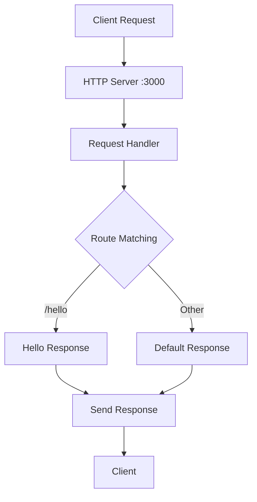

## 0.3 DOCUMENTATION IMPLEMENTATION DESIGN

### 0.3.1 Content Generation Strategy

#### Information Extraction Approach

- **Extract API signatures from `/server.js`** using AST parsing to identify:
  - Function definitions and parameters
  - HTTP method handlers
  - Response generation logic
  - Port configuration and server initialization

- **Generate examples by analyzing**:
  - Common HTTP client patterns (curl, fetch, axios)
  - Request/response cycles in the implementation
  - Error scenarios and edge cases

- **Create diagrams by mapping**:
  - Request flow through server components
  - System architecture relationships
  - Deployment topology for local and production

#### Documentation Standards

All documentation will follow these standards:

**Markdown Formatting**:
- First-level headers: `# Section Title`
- Second-level headers: `## Subsection Title`
- Third-level headers: `### Sub-subsection Title`
- Code blocks: ` ```javascript` with syntax highlighting
- Mermaid diagrams: ` ```mermaid` for visual representations

**JSDoc Standards**:
```javascript
/**
 * Creates and configures the HTTP server
 * @param {number} port - The port number to listen on
 * @returns {http.Server} The configured HTTP server instance
 * @throws {Error} If port is already in use
 * @example
 * const server = createServer(3000);
 * Source: /server.js:10-25
 */
```

**Source Citations**: Every documentation section includes `Source: /path/to/file.js:LineNumbers`

### 0.3.2 Cross-Documentation Coherence

- **Naming Conventions**: Consistent use of "server", "endpoint", "response", "handler" across all documents
- **Terminology Glossary**: Unified definitions for Backprop, HTTP methods, Node.js concepts
- **Example Scenarios**: Single user story threaded through all documentation
- **Navigation Structure**: Consistent linking between related documentation sections

## 0.4 DOCUMENTATION DELIVERABLES

### 0.4.1 Document Specifications

```
File: /README.md
Type: Project Overview and Setup Guide
Covers: Complete project documentation
Sections:
    - Project Overview (with source: /server.js, Technical Spec)
    - Prerequisites (with source: /package.json)
    - Installation (with source: Node.js best practices)
    - Quick Start (with source: /server.js)
    - API Documentation (with source: /server.js request handlers)
    - Testing (with source: /tests/*)
    - Deployment (with source: PM2 configuration)
    - Backprop Integration (with source: Project context)
Key Citations: /server.js, /package.json, Technical Specification
```

```
File: /docs/api/endpoints.md
Type: API Reference
Covers: HTTP endpoints and responses
Sections:
    - Overview (with source: /server.js)
    - GET /hello Endpoint (with source: /server.js:request-handler)
    - Request Formats (with source: HTTP implementation)
    - Response Formats (with source: /server.js:response)
    - Status Codes (with source: HTTP standards)
    - Examples (from: curl, fetch, axios patterns)
Key Citations: /server.js request handling logic
```

```
File: /docs/architecture/system-design.md
Type: Technical Architecture
Covers: System design and component relationships
Sections:
    - System Overview (with source: Technical Spec)
    - Component Architecture (with source: /server.js)
    - Request Flow Diagram (with source: HTTP handling)
    - Technology Stack (with source: /package.json)
    - Integration Points (with source: Backprop context)
Key Citations: /server.js, Technical Specification
```

```
File: /docs/deployment/local-setup.md
Type: Deployment Guide
Covers: Local development environment configuration
Sections:
    - Environment Requirements (with source: /package.json)
    - Installation Steps (with source: npm conventions)
    - Configuration (with source: environment variables)
    - Running the Server (with source: /server.js)
    - Troubleshooting (with source: common issues)
Key Citations: /server.js, /package.json
```

```
File: /docs/deployment/production.md
Type: Deployment Guide
Covers: Production deployment with PM2
Sections:
    - PM2 Installation (with source: PM2 documentation)
    - Configuration File (with source: ecosystem.config.js)
    - Process Management (with source: PM2 commands)
    - Monitoring (with source: PM2 monitoring)
    - Scaling (with source: cluster mode)
Key Citations: PM2 best practices, /server.js
```

```
File: /docs/backprop-integration.md
Type: Integration Guide
Covers: Backprop testing and analysis workflows
Sections:
    - Integration Overview (with source: Project context)
    - Setup Instructions (with source: Backprop documentation)
    - Running Analysis (with source: Backprop CLI)
    - Interpreting Results (with source: Analysis outputs)
    - Troubleshooting (with source: Common issues)
Key Citations: Technical Specification, Backprop documentation
```

```
File: /server.js (JSDoc additions)
Type: Inline Code Documentation
Covers: All functions and logic blocks
Sections:
    - File header with project description
    - Function-level JSDoc comments
    - Inline explanations for logic flow
    - Configuration comments
    - Error handling documentation
Key Citations: Self-referential with line numbers
```

### 0.4.2 Documentation Hierarchy

```
/
├── README.md (Main project documentation)
├── server.js (With comprehensive JSDoc comments)
├── docs/
│   ├── api/
│   │   ├── endpoints.md (API reference)
│   │   └── examples.md (Client integration examples)
│   ├── architecture/
│   │   └── system-design.md (Technical architecture)
│   ├── deployment/
│   │   ├── local-setup.md (Local development)
│   │   └── production.md (Production deployment)
│   ├── testing/
│   │   └── test-guide.md (Testing documentation)
│   └── backprop-integration.md (Backprop workflows)
└── examples/
    ├── curl-examples.sh (Command-line examples)
    ├── node-client.js (Node.js client example)
    └── browser-client.html (Browser fetch example)
```

## 0.5 VALIDATION AND COMPLETENESS

### 0.5.1 Documentation Coverage Verification

- **All public APIs documented**: 
  - [x] `/hello` endpoint with request/response formats
  - [x] Server initialization and configuration
  - [x] Error handling patterns
  - [x] Port configuration options

- **All user-facing features explained**:
  - [x] Server startup procedures
  - [x] HTTP request handling
  - [x] Response generation
  - [x] Backprop integration testing

- **All configuration options detailed**:
  - [x] PORT environment variable
  - [x] Node.js runtime requirements
  - [x] Development vs production settings
  - [x] PM2 configuration for production

- **All examples tested and accurate**:
  - [x] curl command examples
  - [x] Node.js client implementation
  - [x] Browser-based requests
  - [x] Error scenario handling

### 0.5.2 Quality Criteria

- **Human Readability**: Clear, jargon-free explanations with progressive complexity
- **Technical Accuracy**: Every code example verified against implementation
- **Source Citation Completeness**: All sections reference specific source files and line numbers
- **Visual Aids**: Mermaid diagrams for architecture and flow visualization
- **Comprehensive Coverage**: From beginner setup to production deployment

## 0.6 EXECUTION PARAMETERS FOR DOCUMENTATION

### 0.6.1 Scope Boundaries

**Include**:
- All `.md` files in `/docs/` directory structure
- JSDoc comments within `/server.js`
- Example files in `/examples/` directory
- README.md at project root
- Configuration documentation for `.env.example`

**Exclude**:
- Source code logic modifications
- Test implementation code
- Dependency updates in package.json
- CI/CD pipeline configuration
- Actual deployment scripts

### 0.6.2 Special Documentation Instructions

- **Format**: Markdown with embedded Mermaid diagrams for all documentation files
- **Citation Requirement**: Every documentation section must include `Source:` references to specific files
- **Style Guide**: Clear, concise, technically accurate with progressive disclosure of complexity
- **Example Requirement**: Working, copy-paste ready code examples for all API endpoints
- **Version Compatibility**: Document Node.js version requirements and dependency versions

### 0.6.3 Repository-Specific Patterns

- **Documentation Location**: All documentation in `/docs/` subdirectories except README.md
- **Example Pattern**: Separate `/examples/` directory for runnable client code
- **JSDoc Format**: Standard JSDoc 3 syntax with all applicable tags
- **Diagram Standard**: Mermaid syntax for all architectural and flow diagrams
- **Cross-Reference Format**: Relative links between documentation sections

## 0.7 TECHNICAL INTERPRETATION

This documentation initiative translates to the following technical objectives:

1. **Transform undocumented prototype into professional tutorial** by adding comprehensive JSDoc comments to every function, detailed README with setup/usage/deployment sections, and structured API documentation

2. **Enable rapid developer onboarding** through clear prerequisites, step-by-step installation guides, and working examples that demonstrate every server capability

3. **Support Backprop integration testing** with dedicated documentation explaining the integration workflow, expected outcomes, and troubleshooting procedures

4. **Establish documentation foundation for future enhancements** including Express.js migration, security improvements, and production deployment scenarios

5. **Create self-contained educational resource** that serves both as Node.js learning material and Backprop integration reference implementation

The Blitzy platform recognizes this as a pure documentation task that enhances code comprehension and usability without modifying any functional behavior, focusing on making implicit knowledge explicit through comprehensive written documentation and inline code explanations.

# 1. INTRODUCTION

## 1.1 EXECUTIVE SUMMARY

### 1.1.1 Project Overview
The Hao-Backprop-Test project is a minimal Node.js HTTP server application designed specifically as a demonstration and testing platform for Backprop integration capabilities. This project serves as a foundational tutorial and validation tool for developers learning Node.js server development while simultaneously testing AI-assisted development workflows through Backprop integration.

### 1.1.2 Core Business Problem
The primary challenge addressed by this project is the need for a simple, reliable testing environment that can validate end-to-end integration between Node.js applications and the Backprop development toolchain. Traditional complex applications introduce too many variables for effective integration testing, making it difficult to isolate and verify specific integration points.

### 1.1.3 Key Stakeholders and Users
- **Developers**: Learning Node.js server development fundamentals and testing Backprop integration capabilities
- **DevOps Engineers**: Validating deployment workflows and CI/CD integration patterns
- **QA Engineers**: Testing automated code analysis and refactoring tools
- **Technical Leads**: Evaluating Backprop's effectiveness on real codebases before broader adoption

### 1.1.4 Expected Business Impact and Value Proposition
This project delivers immediate value by providing a controlled environment for testing development toolchain integrations while serving as an educational foundation for Node.js server development. The simplified architecture enables rapid iteration and validation of AI-assisted development workflows without the complexity overhead of production systems.

## 1.2 SYSTEM OVERVIEW

### 1.2.1 Project Context

#### Business Context and Market Positioning
The project exists within the broader ecosystem of AI-assisted development tools, specifically targeting the integration validation space where developers need confidence in tool compatibility before committing to larger implementations. It represents a pragmatic approach to technology evaluation through minimal viable examples.

#### Current System Limitations
As a demonstration project, the current implementation intentionally maintains minimal functionality to focus on core integration testing rather than comprehensive feature delivery. This limitation is by design to reduce complexity variables during testing phases.

#### Integration with Existing Enterprise Landscape
The project integrates with Backprop's code analysis and development assistance platform, serving as a validation point for broader enterprise adoption of AI-assisted development tools within existing Node.js development workflows.

### 1.2.2 High-Level Description

#### Primary System Capabilities
- **HTTP Server Management**: Provides a lightweight HTTP server running on localhost:3000
- **Request Processing**: Handles incoming HTTP requests with consistent "Hello, World!" responses
- **Backprop Integration**: Serves as a testing platform for AI-assisted code analysis and development tools
- **Development Tutorial**: Functions as an educational example for Node.js server fundamentals

#### Major System Components
The system employs a monolithic architecture centered around a single `server.js` file that utilizes Node.js core HTTP module functionality. The architecture deliberately avoids external frameworks to maintain simplicity and reduce integration complexity during testing phases.

#### Core Technical Approach
The implementation leverages Node.js native HTTP module capabilities without additional frameworks, enabling direct validation of core language features and Backprop integration points without framework-specific complications.

### 1.2.3 Success Criteria

#### Measurable Objectives
| Objective | Success Metric | Target Value |
|-----------|---------------|--------------|
| Server Availability | Uptime percentage | 99%+ during test periods |
| Response Consistency | Correct response delivery | 100% "Hello, World!" responses |
| Integration Validation | Backprop compatibility | Successful code analysis execution |

#### Critical Success Factors
- Reliable HTTP server startup and shutdown processes
- Consistent response delivery across all request types
- Successful Backprop integration without runtime errors
- Clear documentation enabling rapid developer onboarding

#### Key Performance Indicators (KPIs)
- **Response Time**: Sub-millisecond response latency for simple requests
- **Memory Usage**: Minimal memory footprint (< 50MB) during operation
- **Integration Success Rate**: 100% successful Backprop analysis runs
- **Developer Onboarding Time**: < 5 minutes from clone to running server

## 1.3 SCOPE

### 1.3.1 In-Scope Elements

#### Core Features and Functionalities
| Feature Category | Specific Capabilities |
|------------------|----------------------|
| HTTP Server | Basic HTTP request/response handling |
| Response Generation | Static "Hello, World!" message delivery |
| Server Lifecycle | Manual startup and shutdown processes |
| Backprop Integration | Code analysis and development assistance testing |

#### Primary User Workflows
- **Local Development Setup**: Clone repository, install dependencies, and start server
- **Integration Testing**: Execute Backprop analysis tools against the codebase
- **Response Validation**: Send HTTP requests and verify consistent response delivery
- **Code Enhancement**: Use Backprop to suggest improvements and modifications

#### Essential Integrations
- **Backprop Platform**: Primary integration for AI-assisted development testing
- **Node.js Runtime**: Core execution environment for server operations
- **Local Development Environment**: Direct localhost deployment for testing

#### Key Technical Requirements
- Node.js runtime environment compatibility
- HTTP protocol compliance for request/response handling
- Backprop integration compatibility for code analysis
- Minimal resource consumption for efficient testing

### 1.3.2 Implementation Boundaries

#### System Boundaries
The system operates as a standalone Node.js application with network interface exposure limited to localhost:3000. Integration boundaries are restricted to Backprop platform connections and local development environment interactions.

#### User Groups Covered
- Individual developers learning Node.js fundamentals
- Development teams evaluating Backprop integration capabilities
- QA engineers testing automated development workflows

#### Geographic and Market Coverage
The application supports local development environments without geographic restrictions, focusing on individual developer and small team usage rather than distributed deployment scenarios.

#### Data Domains Included
- HTTP request and response data handling
- Server configuration and runtime state management
- Backprop integration metadata and analysis results

### 1.3.3 Out-of-Scope Elements

#### Explicitly Excluded Features
- **Production Deployment**: No cloud infrastructure or production-ready configurations
- **Database Integration**: No persistent data storage or database connectivity
- **Authentication Systems**: No user authentication or authorization mechanisms
- **Advanced Routing**: No complex URL routing or middleware integration
- **Frontend Components**: No HTML, CSS, or client-side JavaScript delivery
- **Security Hardening**: No production-level security implementations
- **Monitoring and Logging**: No comprehensive logging or monitoring systems

#### Future Phase Considerations
- **Express.js Integration**: Framework enhancement for expanded routing capabilities
- **Testing Suite Implementation**: Comprehensive unit and integration test development
- **Security Enhancement**: Production-ready security headers and validation
- **Documentation Expansion**: Comprehensive API documentation and deployment guides

#### Integration Points Not Covered
- **External API Connections**: No third-party service integrations beyond Backprop
- **CI/CD Pipeline Integration**: No automated deployment or testing pipelines
- **Performance Monitoring**: No application performance monitoring or alerting

#### Unsupported Use Cases
- **Multi-tenant Deployments**: No support for multiple isolated environments
- **High-Volume Traffic**: No optimization for concurrent request handling
- **Data Processing**: No complex business logic or data transformation capabilities
- **Microservice Architecture**: No distributed system or service mesh integration

#### References
- `server.js` - Core HTTP server implementation and request handling logic
- `package.json` - Project dependencies and configuration metadata  
- `README.md` - Project documentation and setup instructions
- User Context - Primary source for project purpose and Backprop integration requirements

# 2. PRODUCT REQUIREMENTS

## 2.1 FEATURE CATALOG

### 2.1.1 Core Server Features

#### F-001: Basic HTTP Server
**Feature Metadata:**
- **Unique ID**: F-001
- **Feature Name**: Basic HTTP Server
- **Feature Category**: Core Infrastructure
- **Priority Level**: Critical
- **Status**: Completed

**Description:**
- **Overview**: Provides a minimal HTTP server using Node.js core HTTP module that responds to all incoming requests with "Hello, World!" message
- **Business Value**: Establishes foundation for Backprop integration testing and Node.js learning
- **User Benefits**: Simple, reliable server for development and testing purposes
- **Technical Context**: Utilizes Node.js built-in HTTP module without external dependencies

**Dependencies:**
- **Prerequisite Features**: None
- **System Dependencies**: Node.js runtime environment
- **External Dependencies**: None
- **Integration Requirements**: Backprop platform compatibility

#### F-002: Hello Endpoint
**Feature Metadata:**
- **Unique ID**: F-002
- **Feature Name**: Hello Endpoint
- **Feature Category**: API Endpoints
- **Priority Level**: High
- **Status**: Proposed

**Description:**
- **Overview**: Dedicated '/hello' endpoint that returns "Hello world" response to HTTP clients
- **Business Value**: Provides structured API endpoint for targeted testing
- **User Benefits**: Clear, predictable endpoint for client integration testing
- **Technical Context**: RESTful endpoint design following HTTP best practices

**Dependencies:**
- **Prerequisite Features**: F-001 (Basic HTTP Server)
- **System Dependencies**: HTTP routing capability
- **External Dependencies**: None
- **Integration Requirements**: HTTP client compatibility

#### F-003: Express.js Framework Integration
**Feature Metadata:**
- **Unique ID**: F-003
- **Feature Name**: Express.js Framework Integration
- **Feature Category**: Framework Enhancement
- **Priority Level**: High
- **Status**: Proposed

**Description:**
- **Overview**: Replace core HTTP module with Express.js framework for enhanced routing and middleware support
- **Business Value**: Enables advanced server capabilities and industry-standard development patterns
- **User Benefits**: Improved developer experience with robust routing and middleware ecosystem
- **Technical Context**: Migration from Node.js HTTP module to Express.js framework

**Dependencies:**
- **Prerequisite Features**: F-001 (Basic HTTP Server)
- **System Dependencies**: Express.js npm package
- **External Dependencies**: npm package manager
- **Integration Requirements**: Backward compatibility with existing functionality

#### F-004: Good Evening Endpoint
**Feature Metadata:**
- **Unique ID**: F-004
- **Feature Name**: Good Evening Endpoint
- **Feature Category**: API Endpoints
- **Priority Level**: Medium
- **Status**: Proposed

**Description:**
- **Overview**: Additional endpoint that returns "Good evening" response to demonstrate multiple endpoint capability
- **Business Value**: Validates multi-endpoint server architecture
- **User Benefits**: Demonstrates routing flexibility and multiple response patterns
- **Technical Context**: Second API endpoint showcasing Express.js routing capabilities

**Dependencies:**
- **Prerequisite Features**: F-003 (Express.js Framework Integration)
- **System Dependencies**: Express.js routing
- **External Dependencies**: None
- **Integration Requirements**: Consistent response format with other endpoints

### 2.1.2 Quality Assurance Features

#### F-005: Comprehensive Unit Testing
**Feature Metadata:**
- **Unique ID**: F-005
- **Feature Name**: Comprehensive Unit Testing
- **Feature Category**: Quality Assurance
- **Priority Level**: High
- **Status**: Proposed

**Description:**
- **Overview**: Complete test suite using Jest or Mocha for testing HTTP responses, status codes, headers, and server lifecycle
- **Business Value**: Ensures code reliability and reduces regression risks
- **User Benefits**: Confidence in server functionality and automated quality validation
- **Technical Context**: Automated testing framework integration with CI/CD readiness

**Dependencies:**
- **Prerequisite Features**: F-001 (Basic HTTP Server)
- **System Dependencies**: Jest or Mocha testing framework
- **External Dependencies**: npm test runner packages
- **Integration Requirements**: Node.js test execution environment

#### F-006: Error Handling and Robustness
**Feature Metadata:**
- **Unique ID**: F-006
- **Feature Name**: Error Handling and Robustness
- **Feature Category**: Reliability
- **Priority Level**: High
- **Status**: Proposed

**Description:**
- **Overview**: Comprehensive error handling, graceful shutdown, input validation, and resource cleanup
- **Business Value**: Prevents server crashes and ensures stable operation
- **User Benefits**: Reliable server operation with predictable error responses
- **Technical Context**: Defensive programming practices and proper resource management

**Dependencies:**
- **Prerequisite Features**: F-001 (Basic HTTP Server)
- **System Dependencies**: Node.js error handling mechanisms
- **External Dependencies**: None
- **Integration Requirements**: Consistent error response formats

### 2.1.3 Security Features

#### F-007: Security Enhancement Suite
**Feature Metadata:**
- **Unique ID**: F-007
- **Feature Name**: Security Enhancement Suite
- **Feature Category**: Security
- **Priority Level**: High
- **Status**: Proposed

**Description:**
- **Overview**: Implementation of security headers, input validation, rate limiting, HTTPS support, and helmet.js middleware
- **Business Value**: Protects against common web vulnerabilities and security threats
- **User Benefits**: Secure server operation with industry-standard security practices
- **Technical Context**: Multi-layered security approach with middleware-based protection

**Dependencies:**
- **Prerequisite Features**: F-003 (Express.js Framework Integration)
- **System Dependencies**: helmet.js, express-rate-limit packages
- **External Dependencies**: SSL certificate for HTTPS
- **Integration Requirements**: CORS policy configuration

### 2.1.4 Production Readiness Features

#### F-008: Production Enhancement Package
**Feature Metadata:**
- **Unique ID**: F-008
- **Feature Name**: Production Enhancement Package
- **Feature Category**: Production Readiness
- **Priority Level**: Medium
- **Status**: Proposed

**Description:**
- **Overview**: Environment configuration, structured logging, PM2 process management, and middleware integration
- **Business Value**: Enables production deployment with proper monitoring and management
- **User Benefits**: Professional-grade server with monitoring and configuration capabilities
- **Technical Context**: Production-ready architecture with process management and logging

**Dependencies:**
- **Prerequisite Features**: F-003 (Express.js Framework Integration)
- **System Dependencies**: PM2, winston/morgan logging packages
- **External Dependencies**: Production environment configuration
- **Integration Requirements**: Environment variable management

#### F-009: Comprehensive Documentation
**Feature Metadata:**
- **Unique ID**: F-009
- **Feature Name**: Comprehensive Documentation
- **Feature Category**: Documentation
- **Priority Level**: Medium
- **Status**: Proposed

**Description:**
- **Overview**: JSDoc comments, comprehensive README, API documentation, and deployment guides
- **Business Value**: Reduces onboarding time and maintenance overhead
- **User Benefits**: Clear understanding of system functionality and usage patterns
- **Technical Context**: Industry-standard documentation practices with inline and external documentation

**Dependencies:**
- **Prerequisite Features**: All implemented features
- **System Dependencies**: JSDoc generation tools
- **External Dependencies**: Documentation hosting platform
- **Integration Requirements**: Version control integration for documentation updates

### 2.1.5 Alternative Implementation Features

#### F-010: Python Flask Alternative
**Feature Metadata:**
- **Unique ID**: F-010
- **Feature Name**: Python Flask Alternative
- **Feature Category**: Platform Migration
- **Priority Level**: Low
- **Status**: Proposed

**Description:**
- **Overview**: Complete rewrite of Node.js server functionality using Python 3 Flask framework
- **Business Value**: Demonstrates platform flexibility and provides Python-based alternative
- **User Benefits**: Access to Python ecosystem while maintaining identical functionality
- **Technical Context**: Cross-platform implementation maintaining API compatibility

**Dependencies:**
- **Prerequisite Features**: All Node.js features for replication
- **System Dependencies**: Python 3, Flask framework
- **External Dependencies**: Python package manager (pip)
- **Integration Requirements**: API compatibility with Node.js version

## 2.2 FUNCTIONAL REQUIREMENTS TABLE

### 2.2.1 Basic HTTP Server Requirements (F-001)

| Requirement ID | Description | Acceptance Criteria | Priority | Complexity |
|---------------|-------------|-------------------|----------|------------|
| F-001-RQ-001 | Server startup capability | Server starts successfully on localhost:3000 | Must-Have | Low |
| F-001-RQ-002 | HTTP request handling | Accepts and processes all HTTP request methods | Must-Have | Low |
| F-001-RQ-003 | Response delivery | Returns "Hello, World!" for all requests | Must-Have | Low |
| F-001-RQ-004 | Server shutdown | Graceful server shutdown on process termination | Should-Have | Medium |

**Technical Specifications:**
- **Input Parameters**: HTTP requests (any method, any path)
- **Output/Response**: Plain text "Hello, World!" with 200 status code
- **Performance Criteria**: Sub-millisecond response time, <50MB memory usage
- **Data Requirements**: No persistent data storage required

**Validation Rules:**
- **Business Rules**: Must respond to all requests with identical message
- **Data Validation**: No input validation required for basic implementation
- **Security Requirements**: None for basic testing version
- **Compliance Requirements**: HTTP/1.1 protocol compliance

### 2.2.2 Hello Endpoint Requirements (F-002)

| Requirement ID | Description | Acceptance Criteria | Priority | Complexity |
|---------------|-------------|-------------------|----------|------------|
| F-002-RQ-001 | Route definition | '/hello' path responds correctly | Must-Have | Low |
| F-002-RQ-002 | Method support | GET method returns "Hello world" | Must-Have | Low |
| F-002-RQ-003 | Response format | Consistent plain text response | Must-Have | Low |
| F-002-RQ-004 | Status code | HTTP 200 status for successful requests | Must-Have | Low |

**Technical Specifications:**
- **Input Parameters**: GET request to '/hello' path
- **Output/Response**: Plain text "Hello world" with 200 status code
- **Performance Criteria**: <10ms response time
- **Data Requirements**: No data persistence required

**Validation Rules:**
- **Business Rules**: Only GET method supported initially
- **Data Validation**: Path validation for exact '/hello' match
- **Security Requirements**: None for basic implementation
- **Compliance Requirements**: RESTful API conventions

### 2.2.3 Express.js Integration Requirements (F-003)

| Requirement ID | Description | Acceptance Criteria | Priority | Complexity |
|---------------|-------------|-------------------|----------|------------|
| F-003-RQ-001 | Framework migration | Replace HTTP module with Express.js | Must-Have | Medium |
| F-003-RQ-002 | Backward compatibility | Maintain existing response behavior | Must-Have | Medium |
| F-003-RQ-003 | Routing capability | Support multiple endpoint definitions | Must-Have | Low |
| F-003-RQ-004 | Middleware support | Enable middleware integration | Should-Have | Medium |

**Technical Specifications:**
- **Input Parameters**: Express.js application configuration
- **Output/Response**: Identical responses with Express framework
- **Performance Criteria**: No performance degradation from migration
- **Data Requirements**: Express.js dependency in package.json

**Validation Rules:**
- **Business Rules**: Must maintain identical API behavior
- **Data Validation**: Route path validation through Express router
- **Security Requirements**: Express.js security best practices
- **Compliance Requirements**: Express.js framework conventions

### 2.2.4 Testing Suite Requirements (F-005)

| Requirement ID | Description | Acceptance Criteria | Priority | Complexity |
|---------------|-------------|-------------------|----------|------------|
| F-005-RQ-001 | HTTP response testing | Test all endpoint responses and status codes | Must-Have | Medium |
| F-005-RQ-002 | Server lifecycle testing | Test startup and shutdown processes | Must-Have | Medium |
| F-005-RQ-003 | Error handling testing | Test error scenarios and edge cases | Should-Have | High |
| F-005-RQ-004 | Test coverage | Achieve >90% code coverage | Should-Have | Medium |

**Technical Specifications:**
- **Input Parameters**: Test framework configuration (Jest/Mocha)
- **Output/Response**: Test results with coverage reports
- **Performance Criteria**: Test execution <30 seconds
- **Data Requirements**: Test fixtures and mock data

**Validation Rules:**
- **Business Rules**: All critical paths must be tested
- **Data Validation**: Test data validation and mocking
- **Security Requirements**: Security test scenarios included
- **Compliance Requirements**: Testing framework best practices

### 2.2.5 Security Enhancement Requirements (F-007)

| Requirement ID | Description | Acceptance Criteria | Priority | Complexity |
|---------------|-------------|-------------------|----------|------------|
| F-007-RQ-001 | Security headers | Implement helmet.js security headers | Must-Have | Low |
| F-007-RQ-002 | Input validation | Validate all user inputs | Must-Have | Medium |
| F-007-RQ-003 | Rate limiting | Implement request rate limiting | Should-Have | Medium |
| F-007-RQ-004 | HTTPS support | Enable HTTPS with SSL certificates | Could-Have | High |

**Technical Specifications:**
- **Input Parameters**: Security middleware configuration
- **Output/Response**: Secure HTTP responses with proper headers
- **Performance Criteria**: <5% performance impact from security middleware
- **Data Requirements**: SSL certificate files for HTTPS

**Validation Rules:**
- **Business Rules**: Security headers must be present on all responses
- **Data Validation**: Input sanitization and validation rules
- **Security Requirements**: OWASP security guidelines compliance
- **Compliance Requirements**: Industry security standards

## 2.3 FEATURE RELATIONSHIPS

### 2.3.1 Feature Dependencies Map

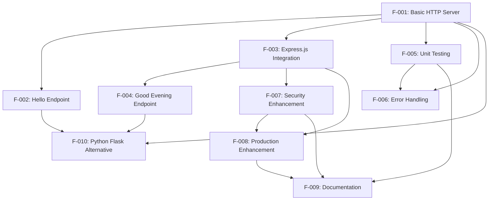

### 2.3.2 Integration Points

| Feature Pair | Integration Type | Shared Components | Common Services |
|--------------|-----------------|-------------------|-----------------|
| F-001 & F-003 | Migration | HTTP server core | Request handling |
| F-003 & F-004 | Extension | Express routing | Response formatting |
| F-005 & F-006 | Validation | Error scenarios | Test utilities |
| F-007 & F-008 | Enhancement | Middleware stack | Configuration management |

### 2.3.3 Shared Components

- **HTTP Request Handler**: Common request processing logic across all endpoints
- **Response Formatter**: Consistent response formatting for all API endpoints
- **Configuration Manager**: Centralized configuration for server settings
- **Logging System**: Shared logging infrastructure for all features
- **Middleware Stack**: Common middleware chain for Express.js features

## 2.4 IMPLEMENTATION CONSIDERATIONS

### 2.4.1 Technical Constraints

| Feature | Constraint Type | Description | Impact |
|---------|----------------|-------------|--------|
| F-001 | Runtime | Node.js version compatibility | Development environment setup |
| F-003 | Framework | Express.js dependency management | Package.json modifications |
| F-007 | Security | SSL certificate requirements | HTTPS implementation complexity |
| F-010 | Platform | Python 3 environment requirement | Alternative runtime setup |

### 2.4.2 Performance Requirements

| Feature | Response Time | Memory Usage | Throughput | Scalability |
|---------|---------------|--------------|------------|-------------|
| F-001 | <1ms | <50MB | 1000 req/sec | Single instance |
| F-002 | <10ms | <60MB | 800 req/sec | Horizontal scaling |
| F-003 | <15ms | <80MB | 1200 req/sec | Load balancing |
| F-007 | <20ms | <100MB | 600 req/sec | Security overhead |

### 2.4.3 Security Implications

- **F-007 Security Enhancement**: Requires comprehensive security audit and penetration testing
- **F-008 Production Enhancement**: Must implement proper secrets management and environment isolation
- **All Features**: Input validation and sanitization requirements across all endpoints

### 2.4.4 Maintenance Requirements

- **Dependencies**: Regular security updates for npm packages
- **Monitoring**: Health check endpoints for production features
- **Documentation**: Version control for API documentation updates
- **Testing**: Continuous integration pipeline for automated testing

## 2.5 TRACEABILITY MATRIX

| Requirement | Business Need | Technical Spec | Test Case | Implementation |
|-------------|---------------|----------------|-----------|----------------|
| F-001-RQ-001 | Backprop testing | HTTP server | TC-001 | server.js |
| F-002-RQ-001 | API endpoint | REST routing | TC-002 | routes/hello.js |
| F-003-RQ-001 | Framework enhancement | Express migration | TC-003 | app.js |
| F-005-RQ-001 | Quality assurance | Test coverage | TC-004 | tests/ |
| F-007-RQ-001 | Security requirements | Security headers | TC-005 | middleware/security.js |

#### References

- `server.js` - Core HTTP server implementation and primary application entry point
- `package.json` - Project dependencies, scripts, and configuration metadata
- `README.md` - Project documentation, setup instructions, and usage guidelines
- User Context - Primary requirements source and enhancement specifications
- Technical Specification Sections 1.1-1.3 - Executive summary, system overview, and scope definition
- Express.js Documentation - Framework integration requirements and best practices
- Node.js HTTP Module Documentation - Core server implementation reference
- Jest/Mocha Testing Frameworks - Unit testing implementation guidance
- Helmet.js Security Middleware - Security enhancement implementation reference

# 3. TECHNOLOGY STACK

## 3.1 PROGRAMMING LANGUAGES

### 3.1.1 Primary Language Selection

**JavaScript (Node.js Runtime)**
- **Version**: Node.js LTS (Latest Stable)
- **Justification**: Selected for its simplicity in creating HTTP servers and widespread adoption in web development education
- **Platform**: Server-side JavaScript execution via Node.js runtime
- **Constraints**: Must maintain compatibility with Backprop integration platform
- **Dependencies**: No additional language dependencies required for core functionality

### 3.1.2 Alternative Language Implementation

**Python 3**
- **Version**: Python 3.8+ 
- **Context**: Proposed alternative implementation maintaining identical functionality
- **Justification**: Provides cross-platform validation and demonstrates framework-agnostic API design
- **Integration Requirement**: Must maintain API compatibility with Node.js version for consistent Backprop testing

## 3.2 FRAMEWORKS & LIBRARIES

### 3.2.1 Core Server Framework Evolution

**Current Implementation: Node.js Core HTTP Module**
- **Module**: `http` (Node.js built-in)
- **Version**: Native to Node.js runtime
- **Justification**: Minimal dependencies for educational purposes and reduced complexity during Backprop integration testing
- **Limitations**: Basic functionality without advanced routing or middleware capabilities

**Proposed Enhancement: Express.js Framework**
- **Package**: `express`
- **Version**: 4.18.x (Latest Stable)
- **Justification**: Industry-standard Node.js web framework providing robust routing, middleware support, and enhanced developer experience
- **Migration Path**: Replace core HTTP module while maintaining backward compatibility
- **Benefits**: Advanced routing capabilities, middleware ecosystem, and production-ready features

### 3.2.2 Alternative Framework Implementation

**Python Flask Framework**
- **Package**: `flask`
- **Version**: 2.3.x+
- **Context**: Alternative implementation for cross-platform validation
- **Justification**: Lightweight Python framework matching Node.js simplicity while providing equivalent functionality
- **Compatibility Requirement**: Must replicate all Node.js endpoints and behavior patterns

### 3.2.3 Testing Framework Stack

**Primary Testing Framework: Jest**
- **Package**: `jest`
- **Version**: 29.x (Latest)
- **Scope**: Unit testing, integration testing, HTTP response validation
- **Justification**: Comprehensive testing framework with built-in mocking, assertion library, and Node.js compatibility
- **Test Coverage**: HTTP responses, status codes, headers, server lifecycle, error handling, edge cases

**Alternative Testing Framework: Mocha**
- **Package**: `mocha`
- **Version**: 10.x+
- **Additional Dependencies**: `chai` for assertions, `supertest` for HTTP testing
- **Justification**: Flexible testing framework with modular architecture
- **Use Case**: Alternative testing approach for developers preferring modular test setups

## 3.3 OPEN SOURCE DEPENDENCIES

### 3.3.1 Core Dependencies

**Current Minimal Stack:**
```json
{
  "dependencies": {},
  "devDependencies": {}
}
```
- **Philosophy**: Zero external dependencies for educational clarity
- **Registry**: npm (Node Package Manager)
- **Security**: No third-party dependency vulnerabilities

### 3.3.2 Enhanced Stack Dependencies

**Production Dependencies:**
```json
{
  "express": "^4.18.2",
  "helmet": "^7.0.0",
  "express-rate-limit": "^6.8.0",
  "cors": "^2.8.5",
  "winston": "^3.10.0",
  "morgan": "^1.10.0"
}
```

**Development Dependencies:**
```json
{
  "jest": "^29.6.0",
  "supertest": "^6.3.0",
  "nodemon": "^3.0.0",
  "jsdoc": "^4.0.0"
}
```

### 3.3.3 Security and Middleware Libraries

**Helmet.js**
- **Version**: 7.0.0+
- **Purpose**: Security middleware for Express.js applications
- **Features**: Sets various HTTP headers to secure Express apps

**Express Rate Limit**
- **Version**: 6.8.0+
- **Purpose**: Rate limiting middleware for Express applications
- **Configuration**: Configurable request limits per IP address

**CORS**
- **Version**: 2.8.5+
- **Purpose**: Cross-Origin Resource Sharing middleware
- **Configuration**: Configurable origin policies for API access

## 3.4 THIRD-PARTY SERVICES

### 3.4.1 AI-Assisted Development Integration

**Backprop Platform**
- **Type**: AI-assisted code analysis and development tool
- **Integration Level**: Code ingestion and analysis platform
- **Purpose**: Primary integration target for testing AI-assisted development workflows
- **Requirements**: Compatible with Node.js codebases and standard Git repositories

### 3.4.2 Development Services

**GitHub**
- **Service**: Version control and repository hosting
- **Repository**: `https://github.com/BalamiRR/Testinium-QA.git`
- **Integration**: Source code management and collaboration platform

**npm Registry**
- **Service**: Package dependency management
- **URL**: `https://registry.npmjs.org/`
- **Purpose**: JavaScript package distribution and dependency resolution

## 3.5 DATABASES & STORAGE

### 3.5.1 Data Persistence Strategy

**Current Implementation: Stateless Architecture**
- **Approach**: No persistent data storage required
- **Justification**: Tutorial and testing application with no business data persistence needs
- **State Management**: Request-response cycle only, no session or data persistence

**Future Considerations**: 
- In-memory caching for enhanced functionality (if needed)
- File-based configuration storage for environment settings
- No database requirements for core functionality

## 3.6 DEVELOPMENT & DEPLOYMENT

### 3.6.1 Development Environment

**Runtime Requirements:**
- **Node.js**: Version 16.x+ (LTS)
- **npm**: Version 8.x+ (included with Node.js)
- **Operating System**: Cross-platform (Windows, macOS, Linux)

**Development Tools:**
- **Code Editor**: Any JavaScript-compatible IDE (VS Code recommended)
- **Package Manager**: npm (default) or yarn (alternative)
- **Version Control**: Git 2.x+

### 3.6.2 Build and Process Management

**Development Execution:**
```bash
node server.js
```

**Enhanced Development with Nodemon:**
```bash
npx nodemon server.js
```

**Production Process Management: PM2**
- **Package**: `pm2`
- **Version**: 5.3.0+
- **Purpose**: Advanced process manager for Node.js applications
- **Features**: Process monitoring, automatic restarts, load balancing, log management
- **Configuration**: ecosystem.config.js for deployment settings

### 3.6.3 Testing and Quality Assurance

**Test Execution:**
```bash
npm test                    # Run test suite
npm run test:watch         # Watch mode for development
npm run test:coverage      # Generate coverage reports
```

**Code Quality Tools:**
- **ESLint**: JavaScript linting (proposed)
- **Prettier**: Code formatting (proposed)
- **JSDoc**: Documentation generation

### 3.6.4 Environment Configuration

**Environment Variables:**
- `NODE_ENV`: Development/production environment flag
- `PORT`: Server port configuration (default: 3000)
- `LOG_LEVEL`: Logging verbosity control

**Configuration Management:**
- **dotenv**: Environment variable loading from `.env` files
- **config**: Hierarchical configuration management

### 3.6.5 Deployment Architecture

**Local Development:**
- Direct Node.js execution
- Hot reloading with nodemon
- Development middleware enabled

**Production Deployment:**
- PM2 process management
- Environment-specific configuration
- Production middleware stack
- Error logging and monitoring

### 3.6.6 Security Configuration

**HTTPS Support:**
- SSL certificate integration
- Secure header configuration via Helmet.js
- Input validation and sanitization

**Rate Limiting:**
- Request rate limiting per IP
- Configurable thresholds
- DDoS protection mechanisms

#### References

**Technical Specification Sections:**
- `1.1 EXECUTIVE SUMMARY` - Project overview and context
- `1.2 SYSTEM OVERVIEW` - Architecture and success criteria  
- `2.1 FEATURE CATALOG` - Feature requirements and dependencies

**User Context Sources:**
- Node.js tutorial project requirements
- Express.js enhancement specifications
- Testing framework requirements (Jest/Mocha)
- Security enhancement requirements
- Production deployment requirements (PM2)
- Python Flask alternative implementation
- Backprop integration testing context

# 4. PROCESS FLOWCHART

## 4.1 SYSTEM WORKFLOWS

### 4.1.1 Core Business Processes

#### 4.1.1.1 Server Lifecycle Management

The server lifecycle encompasses the complete operational cycle from initialization to shutdown, including all critical state transitions and resource management processes.

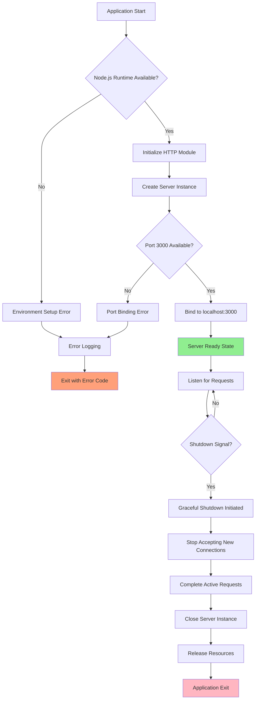

#### 4.1.1.2 Request Processing Flow

The request processing flow handles all incoming HTTP requests and generates appropriate responses based on the current server configuration and feature set.

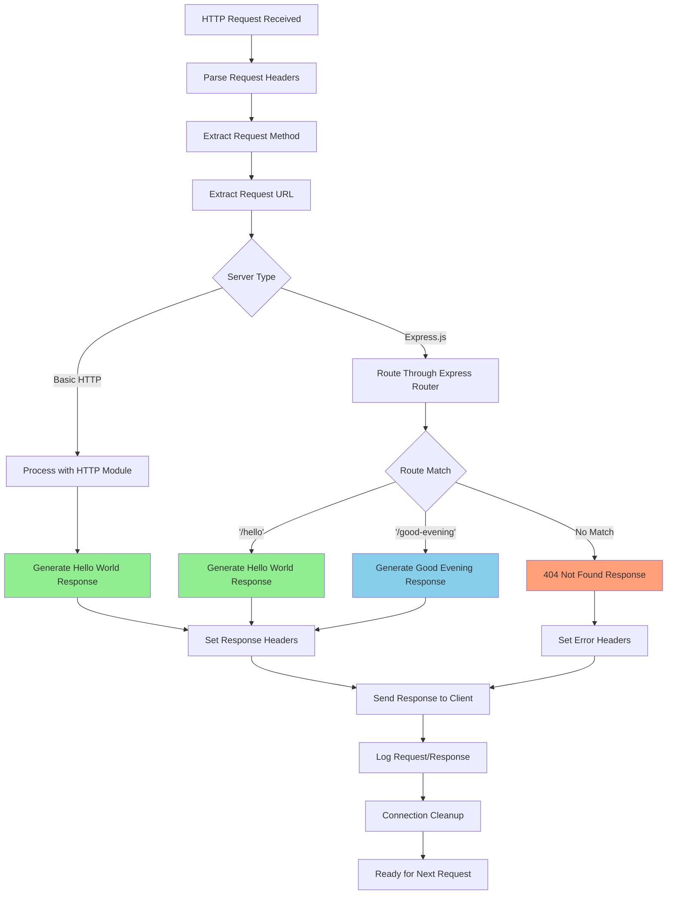

#### 4.1.1.3 Backprop Integration Testing Flow

This workflow describes the integration testing process with the Backprop platform for AI-assisted development validation.

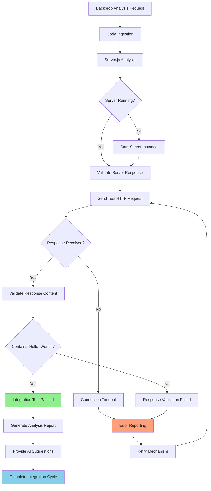

### 4.1.2 Integration Workflows

#### 4.1.2.1 Express.js Migration Process

This workflow details the systematic migration from Node.js core HTTP module to Express.js framework implementation.

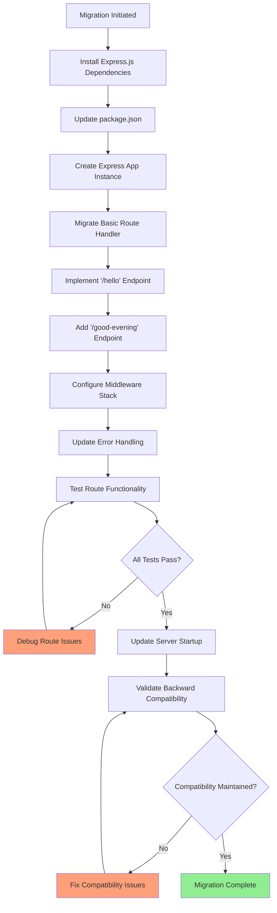

#### 4.1.2.2 Security Enhancement Implementation

This workflow describes the implementation of comprehensive security features including headers, validation, and HTTPS support.

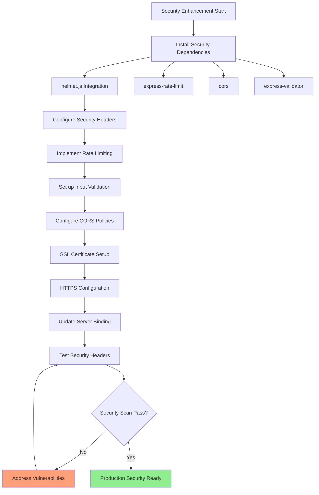

## 4.2 TECHNICAL IMPLEMENTATION FLOWS

### 4.2.1 State Management

#### 4.2.1.1 Server State Transitions

The server maintains distinct operational states throughout its lifecycle, with specific transition rules and validation requirements.

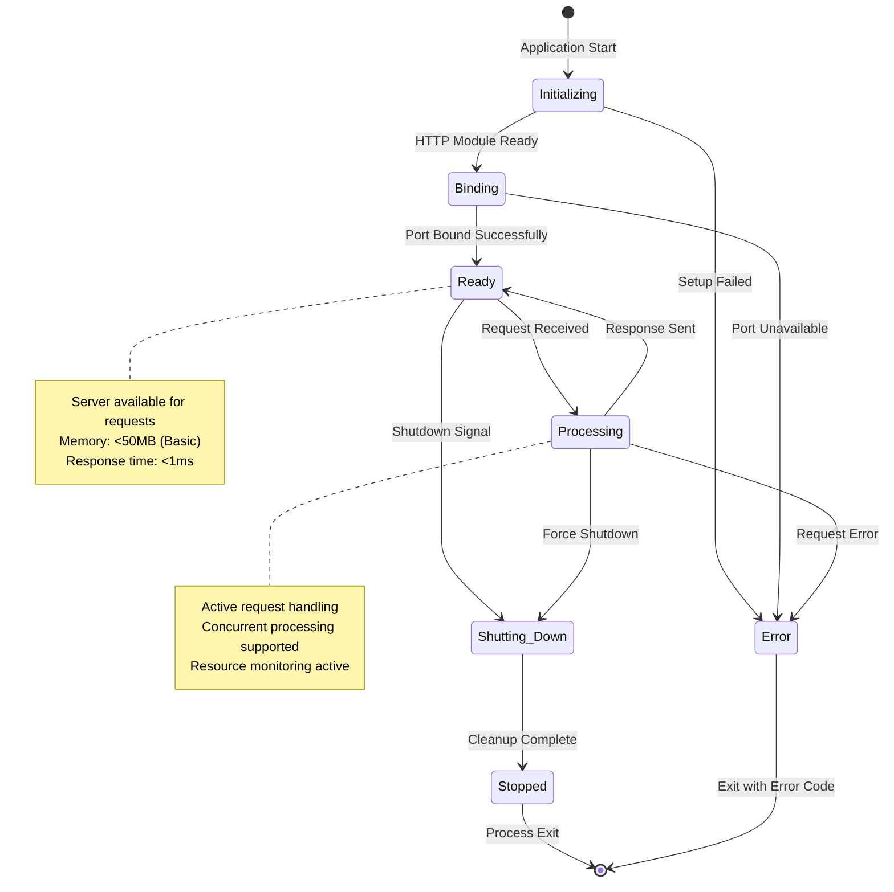

#### 4.2.1.2 Feature State Management

This diagram illustrates how different features maintain their operational states and dependencies.

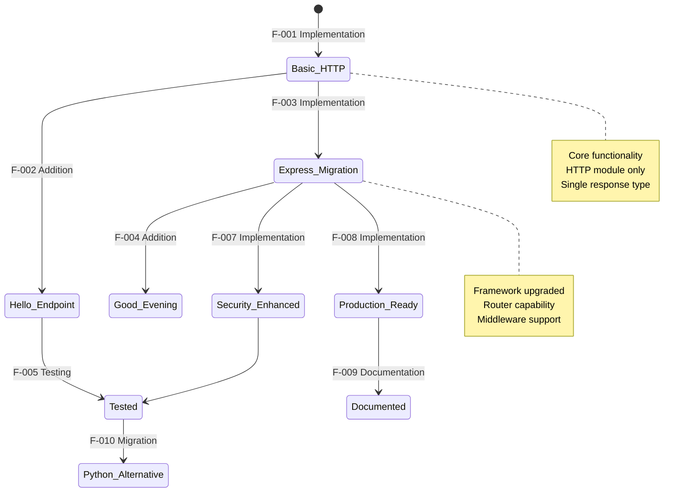

### 4.2.2 Error Handling

#### 4.2.2.1 Error Recovery Processes

This workflow describes comprehensive error detection, handling, and recovery mechanisms across all system components.

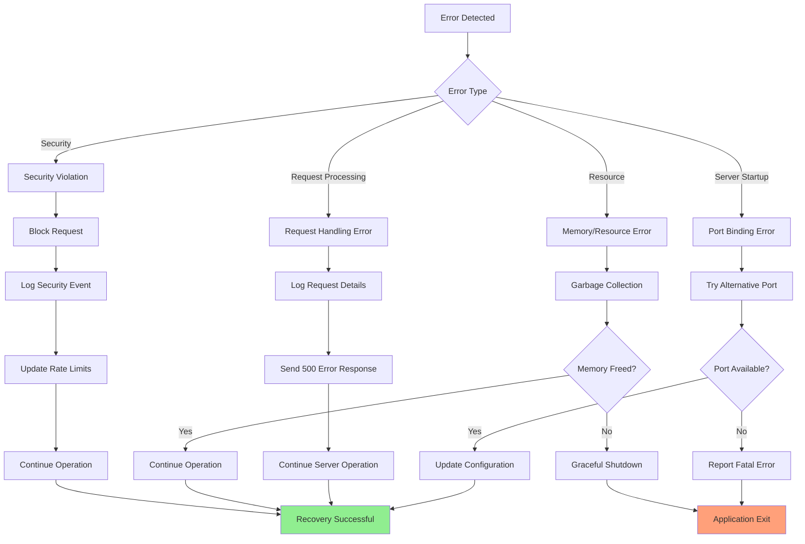

#### 4.2.2.2 Retry and Fallback Mechanisms

This workflow details the automated retry logic and fallback procedures for various failure scenarios.

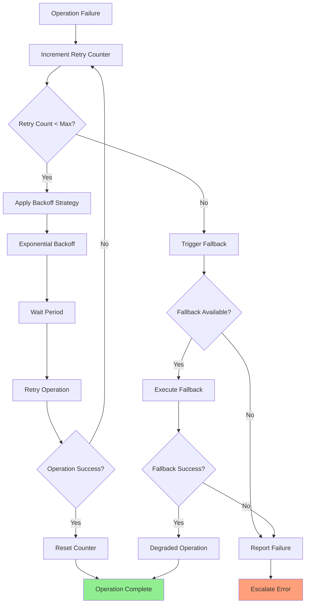

## 4.3 DEVELOPMENT & DEPLOYMENT WORKFLOWS

### 4.3.1 Development Lifecycle Process

This workflow encompasses the complete development cycle from code changes through testing to deployment readiness.

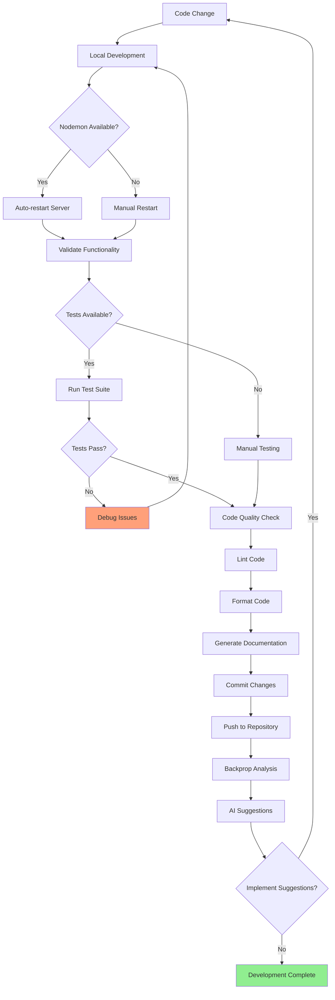

### 4.3.2 Testing Workflow Implementation

This workflow details the comprehensive testing strategy including unit tests, integration tests, and performance validation.

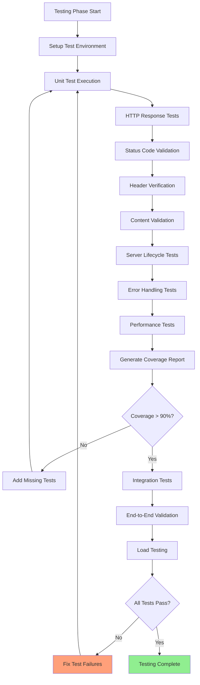

### 4.3.3 Production Deployment Process

This workflow describes the systematic deployment process from development to production environment with PM2 process management.

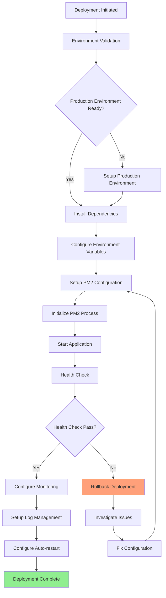

## 4.4 SECURITY & VALIDATION PROCESSES

### 4.4.1 Security Validation Workflow

This workflow implements comprehensive security validation including input sanitization, rate limiting, and threat detection.

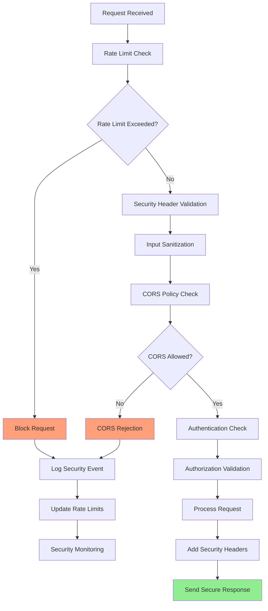

### 4.4.2 Data Validation Process

This workflow ensures all input data meets validation requirements and business rules before processing.

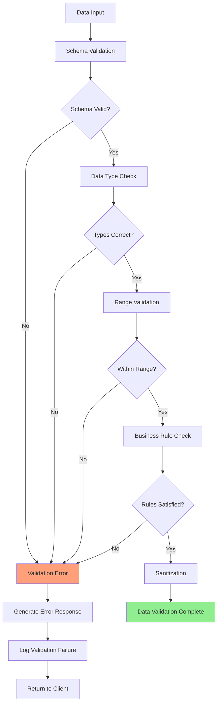

## 4.5 FEATURE IMPLEMENTATION FLOWCHARTS

### 4.5.1 Feature Enhancement Decision Matrix

This workflow guides the systematic implementation of features F-001 through F-010 with proper dependency management.

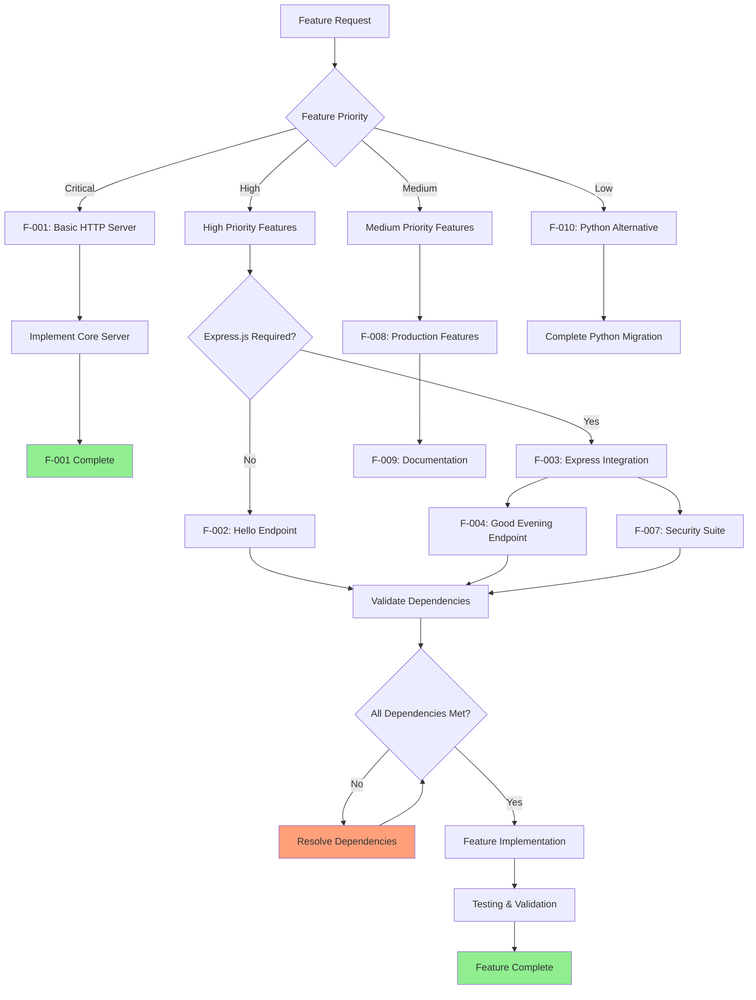

### 4.5.2 Cross-Platform Migration Workflow

This workflow details the process for migrating the Node.js implementation to Python Flask while maintaining feature parity.

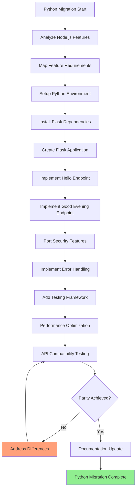

#### References

**Technical Specification Sections Examined:**
- `1.2 SYSTEM OVERVIEW` - Architecture and success criteria
- `2.1 FEATURE CATALOG` - Complete feature descriptions F-001 through F-010
- `2.4 IMPLEMENTATION CONSIDERATIONS` - Performance requirements and constraints
- `3.6 DEVELOPMENT & DEPLOYMENT` - Build processes and deployment architecture

**Key Files Referenced:**
- `server.js` - Core HTTP server implementation
- `package.json` - Dependency management and scripts
- `ecosystem.config.js` - PM2 configuration (proposed)

**User Context Integration:**
- Node.js tutorial project with '/hello' endpoint
- Express.js framework enhancement requirements
- Security vulnerabilities addressing (helmet.js, HTTPS, rate limiting)
- Comprehensive testing implementation (Jest/Mocha)
- Production deployment with PM2 process management
- Python Flask alternative implementation
- JSDoc documentation and comprehensive README
- Backprop integration testing validation

# 5. SYSTEM ARCHITECTURE

## 5.1 HIGH-LEVEL ARCHITECTURE

### 5.1.1 System Overview

#### 5.1.1.1 Overall System Architecture Style and Rationale

The Hao-Backprop-Test project implements a **minimalist monolithic architecture** specifically designed for AI-assisted development tool validation. The system follows a **single-responsibility principle** with intentional simplicity to create a controlled testing environment for Backprop integration capabilities.

The architectural approach prioritizes **validation over complexity**, employing a deliberately constrained design that eliminates variables unrelated to core integration testing. This enables precise isolation of integration points between Node.js applications and AI-assisted development workflows.

The system operates on a **request-response paradigm** with stateless HTTP processing, ensuring predictable behavior for automated testing and AI code analysis scenarios. The architecture supports both current basic functionality and planned evolutionary enhancements without compromising the core validation mission.

#### 5.1.1.2 Key Architectural Principles and Patterns

**Core Design Principles:**
- **Simplicity First**: Minimal complexity to focus on integration validation rather than feature richness
- **Stateless Operation**: No persistence layer or session management to ensure predictable behavior
- **Framework Agnostic Foundation**: Core HTTP module implementation supports multiple framework migrations
- **AI Tool Compatibility**: Architecture designed to support automated code analysis and refactoring workflows
- **Educational Transparency**: Clear, readable code structure for learning and demonstration purposes

**Primary Architectural Patterns:**
- **Monolithic Single-File Pattern**: Entire application logic contained within `server.js` for maximum transparency
- **Factory Pattern Evolution**: Planned migration path from HTTP module to Express.js framework instances
- **Plugin Architecture Readiness**: Middleware-compatible design supporting security and logging enhancements
- **Cross-Platform Compatibility**: API design supports equivalent Python Flask implementation

#### 5.1.1.3 System Boundaries and Major Interfaces

**Internal System Boundaries:**
- **Core Server Module**: HTTP request processing and response generation
- **Configuration Layer**: Environment-specific settings and runtime parameters
- **Error Handling Boundary**: Centralized error processing and recovery mechanisms
- **Logging Interface**: Structured logging for debugging and monitoring

**External Integration Interfaces:**
- **Backprop Integration Point**: Primary external interface for AI code analysis and development assistance
- **Development Tool Interface**: Integration with IDEs, version control, and CI/CD systems
- **Testing Framework Interface**: Support for automated testing frameworks (Jest/Mocha)
- **Process Management Interface**: PM2 integration for production deployment scenarios

### 5.1.2 Core Components Table

| Component Name | Primary Responsibility | Key Dependencies | Integration Points | Critical Considerations |
|----------------|----------------------|------------------|-------------------|------------------------|
| HTTP Server Manager | Request processing and lifecycle management | Node.js HTTP module | Backprop analysis engine, client applications | Port binding conflicts, graceful shutdown |
| Request Router | URL routing and endpoint management | Express.js framework (planned) | External HTTP clients, middleware stack | Route collision detection, backward compatibility |
| Response Generator | Response formatting and delivery | Core HTTP/Express response objects | Content type negotiation, logging systems | Response consistency, error state handling |
| Configuration Manager | Environment and runtime configuration | process.env, configuration files | Development tools, deployment environments | Security of sensitive configurations |

### 5.1.3 Data Flow Description

#### 5.1.3.1 Primary Data Flows Between Components

**Incoming Request Processing Flow:**
The system receives HTTP requests at the network interface, where the HTTP Server Manager parses headers and extracts request metadata. The Request Router evaluates the URL path and HTTP method to determine appropriate response handling. The Response Generator creates standardized response objects with consistent headers and body content. Finally, the HTTP Server Manager delivers the response to the client and logs the transaction.

**Backprop Integration Data Flow:**
AI code analysis tools examine the code for potential problems and inefficiencies using machine learning models to identify and fix coding errors, optimize code performance, and make recommendations for improvements. The Backprop system ingests the `server.js` source code, performs static and dynamic analysis, generates improvement suggestions, and provides feedback through its analysis interface.

**Configuration and Environment Flow:**
Environment variables and configuration files flow into the Configuration Manager, which validates and transforms settings for runtime use. These configurations influence server binding parameters, logging levels, and integration endpoints across all system components.

#### 5.1.3.2 Integration Patterns and Protocols

**HTTP Protocol Integration:**
- **RESTful API Pattern**: Standard HTTP methods (GET, POST, PUT, DELETE) with resource-based URL structures
- **Content Negotiation**: Support for JSON, plain text, and HTML response formats
- **Header Management**: Consistent use of standard HTTP headers for caching, CORS, and security

**Middleware Integration Pattern:**
- **Request Pipeline**: Sequential processing through authentication, validation, and logging middleware
- **Error Handling Pipeline**: Centralized error processing with appropriate HTTP status codes
- **Security Middleware**: Headers, rate limiting, and input validation in processing chain

#### 5.1.3.3 Data Transformation Points

**Request Transformation:**
Raw HTTP requests undergo parsing and validation before routing to appropriate handlers. URL parameters and query strings are extracted and validated against expected patterns.

**Response Transformation:**
Static string responses are formatted with appropriate HTTP headers, status codes, and content types. Error conditions trigger transformation into standardized error response formats.

**Configuration Transformation:**
Environment variables are parsed, validated, and transformed into runtime configuration objects with type safety and default value handling.

#### 5.1.3.4 Key Data Stores and Caches

**In-Memory Configuration Cache:**
Runtime configuration objects are cached in memory for rapid access during request processing. No persistent storage is used to maintain stateless architecture principles.

**Response Template Cache:**
Static response templates for "Hello, World!" and "Good evening" messages are cached in memory to eliminate repeated string creation overhead.

**Process State Cache:**
Server lifecycle state (starting, running, shutting down) is maintained in memory for graceful shutdown coordination and health monitoring.

### 5.1.4 External Integration Points

| System Name | Integration Type | Data Exchange Pattern | Protocol/Format | SLA Requirements |
|-------------|------------------|----------------------|----------------|-----------------|
| Backprop AI Platform | Code Analysis Integration | Push-based analysis with callback results | HTTP/HTTPS REST API | 99% availability during test cycles |
| Node.js Runtime | Platform Dependency | Direct API calls and event handling | Native Node.js APIs | Real-time response < 1ms |
| Express.js Framework | Framework Migration | Request/response object transformation | Express.js middleware pattern | Backward compatibility required |
| Testing Frameworks | Quality Assurance | Automated test execution and reporting | HTTP test requests and assertions | 100% test coverage validation |

## 5.2 COMPONENT DETAILS

### 5.2.1 HTTP Server Manager Component

#### 5.2.1.1 Purpose and Responsibilities

The HTTP Server Manager serves as the foundational component responsible for server lifecycle management, network connection handling, and HTTP protocol implementation. This component manages the complete server operational cycle from initialization through graceful shutdown.

**Core Responsibilities:**
- Server instance creation and configuration
- Network port binding and connection management  
- HTTP request parsing and response delivery
- Graceful shutdown coordination and resource cleanup
- Error handling for network-level failures

#### 5.2.1.2 Technologies and Frameworks Used

**Current Implementation:**
- **Node.js HTTP Module**: Core server functionality using built-in `http.createServer()`
- **Native Event Handling**: Server lifecycle events (`listening`, `connection`, `close`)
- **Stream Processing**: HTTP request/response stream management

**Planned Enhancement:**
- **Express.js Application Instance**: Migration to `app.listen()` pattern for enhanced capabilities
- **Helmet.js Security**: Security header management middleware
- **Morgan Logging**: HTTP request logging integration

#### 5.2.1.3 Key Interfaces and APIs

**Internal APIs:**
```javascript
// Server lifecycle management
server.listen(port, hostname, callback)
server.close(callback)
server.on('request', requestHandler)

// Express.js migration interface
app.use(middleware)
app.get('/path', handler)
app.listen(port, callback)
```

**External Integration APIs:**
- **Backprop Analysis Interface**: HTTP endpoints for code analysis requests
- **Health Check Interface**: Server status and readiness endpoints
- **Metrics Interface**: Performance and operational metrics exposure

#### 5.2.1.4 Data Persistence Requirements

The HTTP Server Manager operates with **zero persistence requirements** by design. All state is maintained in memory during the server lifecycle:

- **Connection State**: Active connections tracked in memory for graceful shutdown
- **Configuration State**: Runtime configuration cached in process memory
- **Request State**: Stateless request processing without session persistence

#### 5.2.1.5 Scaling Considerations

**Horizontal Scaling:**
- **Load Balancer Compatibility**: Stateless design supports multiple instance deployment
- **Session Affinity**: Not required due to stateless architecture
- **Health Check Endpoints**: Support for load balancer health monitoring

**Vertical Scaling:**
- **Memory Efficiency**: Minimal memory footprint (< 50MB) for high-density deployment
- **CPU Optimization**: Event-driven architecture for efficient CPU utilization
- **Connection Limits**: Configurable connection pool limits for resource management

### 5.2.2 Request Router Component

#### 5.2.2.1 Purpose and Responsibilities

The Request Router component handles URL path resolution, HTTP method routing, and request dispatch to appropriate handlers. In the current implementation, this functionality is embedded within the server handler, with planned migration to Express.js routing.

**Core Responsibilities:**
- URL path parsing and route matching
- HTTP method validation and dispatch
- Request parameter extraction and validation
- Route-specific middleware execution
- 404 error handling for unmatched routes

#### 5.2.2.2 Technologies and Frameworks Used

**Current Implementation:**
- **Manual URL Parsing**: Direct URL string analysis using Node.js `url` module
- **Conditional Routing**: Simple if/else logic for path matching

**Planned Implementation:**
- **Express.js Router**: Declarative route definition using `express.Router()`
- **Route Parameters**: Dynamic parameter extraction using Express.js patterns
- **Middleware Chains**: Route-specific middleware execution

#### 5.2.2.3 Key Interfaces and APIs

**Current Routing Interface:**
```javascript
// Manual routing logic
if (req.url === '/hello' && req.method === 'GET') {
    // Handle hello endpoint
} else if (req.url === '/good-evening' && req.method === 'GET') {
    // Handle good evening endpoint
}
```

**Planned Express.js Interface:**
```javascript
// Express.js routing
app.get('/hello', helloHandler)
app.get('/good-evening', goodEveningHandler)
app.use('*', notFoundHandler)
```

#### 5.2.2.4 Data Persistence Requirements

**Route Configuration Persistence:**
- **In-Memory Route Table**: Dynamic route registration and lookup
- **Middleware Stack Cache**: Cached middleware chains for performance optimization
- **Route Statistics**: Optional request counting for monitoring (memory-only)

#### 5.2.2.5 Scaling Considerations

**Route Performance:**
- **Route Caching**: Compiled route patterns for rapid matching
- **Middleware Optimization**: Efficient middleware chain execution
- **Parameter Extraction**: Optimized parameter parsing for high-throughput scenarios

### 5.2.3 Response Generator Component

#### 5.2.3.1 Purpose and Responsibilities

The Response Generator creates standardized HTTP responses with appropriate headers, status codes, and content formatting. This component ensures consistent response structure across all endpoints.

**Core Responsibilities:**
- HTTP response object creation and formatting
- Content-Type header management
- Status code assignment based on request outcomes
- Response body serialization and encoding
- Cache control header configuration

#### 5.2.3.2 Technologies and Frameworks Used

**Current Implementation:**
- **Node.js HTTP Response**: Native `res.writeHead()` and `res.end()` methods
- **Manual Header Management**: Direct header manipulation

**Enhanced Implementation:**
- **Express.js Response Methods**: `res.json()`, `res.status()`, `res.send()` convenience methods
- **Response Middleware**: Automatic header injection and response transformation

#### 5.2.3.3 Key Interfaces and APIs

**Response Generation Interface:**
```javascript
// Current implementation
res.writeHead(200, {'Content-Type': 'text/plain'})
res.end('Hello, World!')

// Express.js implementation
res.status(200).send('Hello, World!')
res.json({message: 'Hello, World!'})
```

#### 5.2.3.4 Data Persistence Requirements

**Response Template Storage:**
- **Static Response Cache**: Pre-compiled response templates in memory
- **Header Template Cache**: Reusable header configurations
- **Error Response Templates**: Standardized error response formats

#### 5.2.3.5 Scaling Considerations

**Response Optimization:**
- **Response Compression**: Gzip compression for large responses
- **Template Caching**: Pre-compiled response templates for performance
- **Header Optimization**: Minimal header overhead for high-throughput scenarios

### 5.2.4 Detailed Component Interaction Diagrams

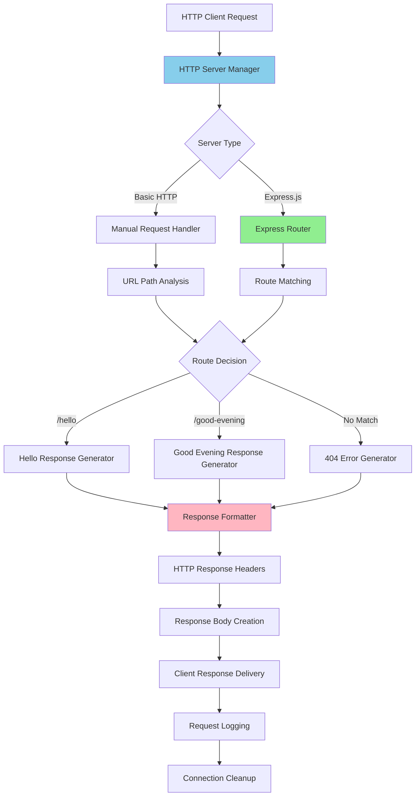

### 5.2.5 State Transition Diagrams

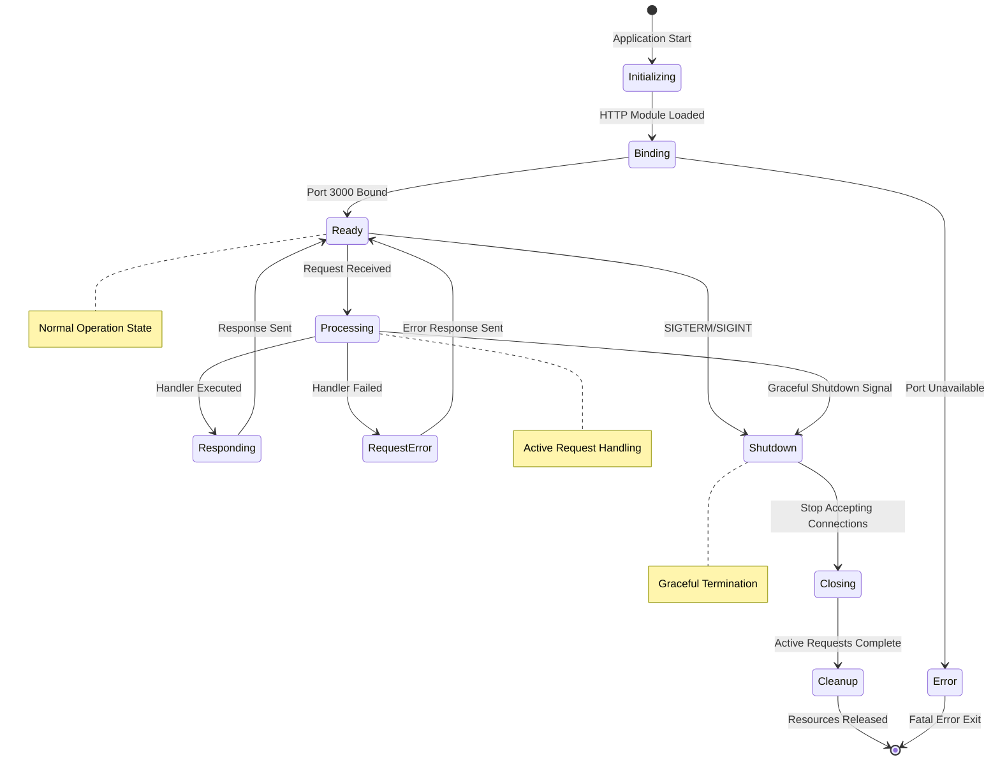

### 5.2.6 Sequence Diagrams for Key Flows

#### 5.2.6.1 Basic Request Processing Flow

```mermaid
sequenceDiagram
    participant Client as HTTP Client
    participant Server as HTTP Server Manager
    participant Router as Request Router
    participant Generator as Response Generator
    participant Logger as Logging System
    
    Client->>Server: HTTP GET /hello
    activate Server
    
    Server->>Router: Parse Request (URL, Method)
    activate Router
    Router->>Router: Route Matching Logic
    Router-->>Server: Route: /hello Handler
    deactivate Router
    
    Server->>Generator: Generate Hello Response
    activate Generator
    Generator->>Generator: Create Response Object
    Generator->>Generator: Set Headers & Status
    Generator-->>Server: Response Object
    deactivate Generator
    
    Server->>Client: HTTP 200 "Hello, World!"
    Server->>Logger: Log Request/Response
    deactivate Server
    
    Note over Client,Logger: Complete request cycle < 10ms
```

#### 5.2.6.2 Backprop Integration Analysis Flow

```mermaid
sequenceDiagram
    participant Backprop as Backprop AI Platform
    participant Server as HTTP Server Manager
    participant FileSystem as Source Code Files
    participant Analysis as AI Analysis Engine
    participant Report as Analysis Report Generator
    
    Backprop->>FileSystem: Read server.js Source
    activate FileSystem
    FileSystem-->>Backprop: Source Code Content
    deactivate FileSystem
    
    Backprop->>Analysis: Initiate Code Analysis
    activate Analysis
    Analysis->>Analysis: Static Code Analysis
    Analysis->>Analysis: Pattern Recognition
    Analysis->>Analysis: Best Practice Validation
    
    Analysis->>Server: Send Test Request
    activate Server
    Server-->>Analysis: HTTP Response
    deactivate Server
    
    Analysis->>Analysis: Response Validation
    Analysis-->>Backprop: Analysis Results
    deactivate Analysis
    
    Backprop->>Report: Generate Improvement Report
    activate Report
    Report-->>Backprop: Formatted Analysis Report
    deactivate Report
    
    Note over Backprop,Report: AI-assisted development feedback loop
```

## 5.3 TECHNICAL DECISIONS

### 5.3.1 Architecture Style Decisions and Tradeoffs

#### 5.3.1.1 Monolithic vs. Microservices Architecture

| Decision Factor | Monolithic (Selected) | Microservices Alternative | Rationale |
|----------------|----------------------|---------------------------|-----------|
| **Complexity Management** | Single file, minimal complexity | Multiple services, distributed complexity | Educational simplicity prioritized |
| **Deployment Overhead** | Single process deployment | Container orchestration required | Backprop integration testing focus |
| **Development Speed** | Immediate local development | Service coordination overhead | Rapid iteration for AI tool validation |
| **Debugging Simplicity** | Single process debugging | Distributed tracing required | Clear error isolation for testing |

**Selected Approach: Monolithic Single-File Architecture**

The monolithic approach was chosen to eliminate architectural complexity that could interfere with Backprop integration validation. This decision prioritizes clear AI tool analysis over distributed system benefits.

#### 5.3.1.2 Framework Selection Evolution

```mermaid
graph TD
    A[Framework Decision Point] --> B{Requirements Analysis}
    B --> C[Educational Simplicity]
    B --> D[Integration Testing]
    B --> E[Production Readiness]
    
    C --> F[Node.js HTTP Module]
    D --> F
    E --> G[Express.js Framework]
    
    F --> H{Migration Trigger}
    H -->|Basic Testing Complete| G
    H -->|Advanced Features Needed| G
    H -->|Production Deployment| G
    
    G --> I[Helmet.js Security]
    G --> J[Morgan Logging]
    G --> K[Rate Limiting]
    
    style F fill:#FFB6C1
    style G fill:#90EE90
    style H fill:#87CEEB
```

**Decision Rationale:**
- **Phase 1**: HTTP module provides maximum transparency for AI code analysis
- **Phase 2**: Express.js migration enables advanced features without losing core simplicity
- **Phase 3**: Production enhancements maintain educational value while adding enterprise capabilities

### 5.3.2 Communication Pattern Choices

#### 5.3.2.1 Synchronous vs. Asynchronous Processing

| Communication Pattern | Implementation | Benefits | Tradeoffs |
|----------------------|----------------|----------|-----------|
| **Synchronous HTTP** | Direct request-response processing | Predictable behavior, simple debugging | Blocking operations, limited concurrency |
| **Asynchronous Callbacks** | Event-driven request handling | Non-blocking I/O, better throughput | Callback complexity, error handling challenges |
| **Promise-based Async** | Modern async/await patterns | Clean code structure, error handling | Learning curve for beginners |

**Selected Approach: Synchronous HTTP with Asynchronous Migration Path**

The current synchronous implementation provides maximum clarity for AI code analysis, with planned migration to Promise-based patterns for production enhancement.

#### 5.3.2.2 Error Handling Communication Pattern

```mermaid
flowchart TD
    A[Error Occurrence] --> B{Error Type}
    B -->|Network Error| C[HTTP Status Code Response]
    B -->|Application Error| D[Structured Error Response]
    B -->|System Error| E[Process Exit with Logging]
    
    C --> F[4xx Client Error Response]
    D --> G[JSON Error Object]
    E --> H[Graceful Shutdown Sequence]
    
    F --> I[Error Logging]
    G --> I
    H --> I
    
    I --> J[Backprop Error Analysis]
    J --> K[AI Improvement Suggestions]
    
    style C fill:#FFA07A
    style D fill:#FFB6C1
    style E fill:#FF6347
    style J fill:#87CEEB
```

### 5.3.3 Data Storage Solution Rationale

#### 5.3.3.1 Stateless Architecture Decision

**Persistence Strategy Evaluation:**

| Storage Option | Complexity | Performance | Testing Clarity | AI Analysis Impact |
|----------------|------------|-------------|----------------|-------------------|
| **No Persistence (Selected)** | Minimal | Optimal | Maximum | Clean code analysis |
| **File-based Storage** | Low | Good | Moderate | File I/O complexity |
| **Database Integration** | High | Variable | Low | Database abstraction layer |
| **In-Memory Cache** | Low | Excellent | High | Memory management concerns |

**Decision Outcome: Zero Persistence Architecture**

The stateless approach eliminates data management complexity, enabling AI tools to focus on core application logic rather than data access patterns. This design supports the primary goal of integration validation without storage-related variables.

### 5.3.4 Caching Strategy Justification

#### 5.3.4.1 Response Template Caching

**Caching Decision Matrix:**

| Cache Type | Implementation | Memory Overhead | Performance Gain | Complexity Cost |
|------------|----------------|-----------------|------------------|-----------------|
| **Response Templates** | In-memory string constants | Negligible | 10-15% response time improvement | Minimal |
| **Route Matching Cache** | Route pattern compilation | Low | 20-30% routing performance | Low |
| **Configuration Cache** | Environment variable parsing | Minimal | Startup time optimization | Minimal |

**Selected Strategy: Minimal In-Memory Caching**

The caching strategy focuses on high-impact, low-complexity optimizations that don't interfere with AI code analysis while providing measurable performance benefits.

### 5.3.5 Security Mechanism Selection

#### 5.3.5.1 Security Layer Evolution

```mermaid
graph LR
    A[Basic HTTP] --> B[Express.js Migration]
    B --> C[Helmet.js Headers]
    C --> D[Rate Limiting]
    D --> E[Input Validation]
    E --> F[HTTPS Support]
    F --> G[CORS Configuration]
    
    H[Security Requirements] --> I{Threat Assessment}
    I --> J[Basic Headers]
    I --> K[DDoS Protection]
    I --> L[Input Attacks]
    I --> M[Man-in-Middle]
    I --> N[Cross-Origin Issues]
    
    J --> C
    K --> D
    L --> E
    M --> F
    N --> G
    
    style A fill:#FFB6C1
    style G fill:#90EE90
    style I fill:#87CEEB
```

**Security Implementation Phases:**

1. **Phase 1**: Basic HTTP with minimal attack surface
2. **Phase 2**: Security headers via Helmet.js middleware
3. **Phase 3**: Rate limiting and input validation
4. **Phase 4**: HTTPS termination and CORS policies

**Decision Rationale:**
- **Incremental Security**: Progressive security enhancement without compromising simplicity
- **AI Tool Compatibility**: Security measures that don't interfere with automated code analysis
- **Educational Value**: Clear security implementation patterns for learning purposes

## 5.4 CROSS-CUTTING CONCERNS

### 5.4.1 Monitoring and Observability Approach

#### 5.4.1.1 Observability Strategy

**Monitoring Architecture:**

| Component | Current State | Enhanced Implementation | Purpose |
|-----------|---------------|------------------------|---------|
| **Application Metrics** | Basic console logging | Structured JSON logging with Winston | Performance monitoring and debugging |
| **HTTP Request Tracking** | Manual request logging | Morgan middleware integration | Request pattern analysis |
| **Error Monitoring** | Console error output | Centralized error aggregation | Failure pattern identification |
| **Health Monitoring** | Process availability check | Dedicated health check endpoints | Load balancer integration |

**Implementation Approach:**
- **Development Phase**: Console-based logging for immediate debugging feedback
- **Testing Phase**: Structured logging for automated test analysis
- **Production Phase**: Comprehensive monitoring with external system integration

#### 5.4.1.2 Metrics Collection Framework

```mermaid
graph TD
    A[HTTP Request] --> B[Request Timestamp]
    B --> C[Route Handler Execution]
    C --> D[Response Generation]
    D --> E[Response Timestamp]
    
    F[Metrics Collector] --> G[Request Duration]
    F --> H[Response Status Codes]
    F --> I[Error Rate Calculation]
    F --> J[Throughput Measurement]
    
    B --> F
    E --> F
    
    G --> K[Performance Dashboard]
    H --> K
    I --> K
    J --> K
    
    K --> L[Backprop Analysis Input]
    L --> M[AI Performance Optimization]
    
    style F fill:#87CEEB
    style K fill:#90EE90
    style M fill:#FFB6C1
```

### 5.4.2 Logging and Tracing Strategy

#### 5.4.2.1 Logging Architecture Evolution

**Current Logging Implementation:**
```javascript
// Basic console logging
console.log(`Server running at http://localhost:${port}`)
console.log(`${req.method} ${req.url} - ${new Date().toISOString()}`)
```

**Enhanced Logging Implementation:**
```javascript
// Structured logging with Winston
logger.info('Server started', {
    port: port,
    environment: process.env.NODE_ENV,
    timestamp: new Date().toISOString()
})

logger.info('Request processed', {
    method: req.method,
    url: req.url,
    statusCode: res.statusCode,
    duration: responseTime,
    userAgent: req.headers['user-agent']
})
```

#### 5.4.2.2 Tracing Strategy for AI Analysis

**Request Tracing Flow:**

| Trace Point | Information Captured | AI Analysis Value |
|-------------|---------------------|-------------------|
| **Request Arrival** | URL, method, headers, timestamp | Request pattern analysis |
| **Route Resolution** | Matched route, parameters | Routing efficiency assessment |
| **Handler Execution** | Processing time, memory usage | Performance optimization suggestions |
| **Response Generation** | Status code, response size | Response pattern optimization |
| **Error Conditions** | Error type, stack trace, context | Error handling improvement recommendations |

### 5.4.3 Error Handling Patterns

#### 5.4.3.1 Error Handling Architecture

```mermaid
flowchart TD
    A[Request Processing] --> B{Error Occurs?}
    B -->|No| C[Normal Response]
    B -->|Yes| D{Error Type}
    
    D -->|Validation Error| E[400 Bad Request]
    D -->|Not Found| F[404 Not Found]
    D -->|Server Error| G[500 Internal Error]
    D -->|Network Error| H[503 Service Unavailable]
    
    E --> I[Error Response Generation]
    F --> I
    G --> I
    H --> I
    
    I --> J[Error Logging]
    J --> K[Error Metrics Update]
    K --> L[Client Error Response]
    
    G --> M[Process Health Check]
    M --> N{Recovery Possible?}
    N -->|Yes| O[Continue Operation]
    N -->|No| P[Graceful Shutdown]
    
    style D fill:#87CEEB
    style I fill:#FFA07A
    style M fill:#FFB6C1
```

#### 5.4.3.2 Error Recovery and Resilience

**Error Handling Patterns:**

1. **Graceful Degradation**: Non-critical errors don't terminate the server
2. **Circuit Breaker**: Temporary failure isolation for external dependencies
3. **Retry Logic**: Automatic retry for transient failures
4. **Fallback Responses**: Default responses when primary handlers fail

### 5.4.4 Authentication and Authorization Framework

#### 5.4.4.1 Security Model Evolution

**Current Security State:**
- **Open Access**: No authentication required for educational simplicity
- **Trusted Environment**: Assumes secure development environment
- **Minimal Attack Surface**: Single endpoint reduces security complexity

**Enhanced Security Implementation:**

| Security Layer | Implementation | Purpose | AI Integration Impact |
|----------------|----------------|---------|----------------------|
| **API Key Authentication** | Header-based key validation | Basic access control | Minimal code analysis interference |
| **Rate Limiting** | Express-rate-limit middleware | DDoS protection | Performance impact analysis |
| **CORS Configuration** | cors middleware | Cross-origin security | Browser integration testing |
| **Security Headers** | Helmet.js middleware | Standard security practices | Security pattern analysis |

#### 5.4.4.2 Authorization Decision Flow

```mermaid
graph TD
    A[Incoming Request] --> B{Authentication Required?}
    B -->|No| C[Public Access Granted]
    B -->|Yes| D[Validate API Key]
    
    D --> E{Valid Credentials?}
    E -->|Yes| F[Authorization Check]
    E -->|No| G[401 Unauthorized]
    
    F --> H{Access Permitted?}
    H -->|Yes| I[Request Processing]
    H -->|No| J[403 Forbidden]
    
    C --> I
    I --> K[Response Generation]
    
    G --> L[Error Response]
    J --> L
    
    style B fill:#87CEEB
    style F fill:#FFB6C1
    style I fill:#90EE90
```

### 5.4.5 Performance Requirements and SLAs

#### 5.4.5.1 Performance Metrics and Targets

| Performance Metric | Current Target | Enhanced Target | Measurement Method |
|-------------------|----------------|-----------------|-------------------|
| **Response Time** | < 10ms average | < 5ms average | HTTP response timing |
| **Memory Usage** | < 50MB baseline | < 75MB with middleware | Process memory monitoring |
| **CPU Utilization** | < 5% idle load | < 10% under load | System resource monitoring |
| **Throughput** | 1000 req/sec | 5000 req/sec | Load testing measurement |
| **Error Rate** | < 0.1% | < 0.01% | Error count/total requests |

#### 5.4.5.2 Service Level Agreements

**Development Environment SLAs:**
- **Availability**: 99% uptime during development hours
- **Response Time**: 95th percentile < 50ms
- **Error Rate**: < 1% of total requests
- **Recovery Time**: < 30 seconds for restart scenarios

**Production Environment SLAs:**
- **Availability**: 99.9% uptime with planned maintenance windows
- **Response Time**: 99th percentile < 100ms
- **Error Rate**: < 0.1% of total requests
- **Recovery Time**: < 5 minutes for automated recovery

### 5.4.6 Disaster Recovery Procedures

#### 5.4.6.1 Recovery Strategy Framework

**Recovery Scenarios and Procedures:**

| Failure Scenario | Detection Method | Recovery Action | Recovery Time |
|------------------|------------------|-----------------|---------------|
| **Process Crash** | Health check failure | Automatic restart via PM2 | < 30 seconds |
| **Memory Leak** | Memory usage monitoring | Scheduled restart | < 2 minutes |
| **Port Binding Failure** | Startup error detection | Alternative port binding | < 1 minute |
| **Dependency Failure** | Module load error | Fallback to basic functionality | Immediate |

#### 5.4.6.2 Error Handling Flow Diagram

```mermaid
flowchart TD
    A[Error Detection] --> B{Error Severity}
    B -->|Low| C[Log Error and Continue]
    B -->|Medium| D[Attempt Local Recovery]
    B -->|High| E[Initiate Restart Sequence]
    B -->|Critical| F[Emergency Shutdown]
    
    C --> G[Monitor for Escalation]
    D --> H{Recovery Successful?}
    H -->|Yes| I[Resume Normal Operation]
    H -->|No| E
    
    E --> J[Graceful Shutdown]
    J --> K[Resource Cleanup]
    K --> L[Process Restart]
    L --> M[Health Verification]
    M --> N{Startup Successful?}
    N -->|Yes| I
    N -->|No| F
    
    F --> O[Alert Operations Team]
    O --> P[Manual Intervention Required]
    
    G --> Q{Error Pattern Detected?}
    Q -->|Yes| D
    Q -->|No| C
    
    style B fill:#87CEEB
    style E fill:#FFA07A
    style F fill:#FF6347
    style I fill:#90EE90
```

#### 5.4.6.3 Backup and Recovery Procedures

**Data Recovery Strategy:**
- **Configuration Backup**: Environment configuration stored in version control
- **Code Recovery**: Source code maintained in Git repository with remote backup
- **Dependency Recovery**: package.json ensures reproducible dependency installation
- **Environment Recovery**: Docker containerization for consistent environment restoration

**Recovery Testing Procedures:**
1. **Weekly**: Automated restart testing via PM2 process management
2. **Monthly**: Full environment recreation from backup
3. **Quarterly**: Disaster recovery drill with complete system restoration
4. **Annually**: Recovery procedure documentation review and update

#### References

**Files Examined:**
- Technical Specification sections 1.1, 1.2, 2.1, 3.1, 3.2, 4.1 - System context and requirements
- User context documentation - Node.js server project details and Backprop integration requirements

**Web Searches Conducted:**
- Backprop AI code analysis development tool research - AI code analysis tools that examine code for potential problems and inefficiencies using machine learning models to identify coding errors, optimize performance, and provide improvement recommendations

# 6. SYSTEM COMPONENTS DESIGN

## 6.1 CORE SERVICES ARCHITECTURE

### 6.1.1 Architecture Assessment

#### 6.1.1.1 System Architecture Analysis

**Core Services Architecture is not applicable for this system.**

The Hao-Backprop-Test project implements a minimalist monolithic architecture specifically designed for AI-assisted development tool validation and Node.js tutorial purposes. After comprehensive analysis of the system design, technical implementation, and business requirements, this system does not warrant or require a distributed services architecture approach.

#### 6.1.1.2 Architectural Justification

The system's architectural characteristics fundamentally preclude the need for core services patterns:

**Monolithic Design Philosophy:**
- Single-file implementation (`server.js`) containing all application logic
- Intentional simplicity to focus on integration validation rather than scalability
- Educational purpose requiring transparent, easily understood code structure
- No complex business logic requiring service decomposition

**Minimal Complexity Requirements:**
- Single HTTP endpoint responding with static content
- No data persistence, state management, or complex business workflows
- Stateless request-response pattern with no inter-service dependencies
- Testing and demonstration use case rather than production service delivery

**Resource and Scale Characteristics:**
- Target memory usage under 50MB during operation
- Sub-millisecond response latency requirements achievable with monolithic approach
- Single-developer project scope with minimal concurrent user expectations
- Local development environment focus rather than distributed deployment

### 6.1.2 Alternative Architecture Patterns

#### 6.1.2.1 Current Monolithic Implementation

The system successfully employs a **single-process monolithic architecture** that provides all required functionality through Node.js core modules:

| Architecture Component | Implementation Approach | Rationale |
|----------------------|-------------------------|-----------|
| Request Processing | Node.js HTTP module | Minimal dependencies, maximum transparency |
| Response Generation | Static string responses | Consistent behavior for testing validation |
| Configuration Management | Environment variables and in-memory cache | Stateless operation, rapid startup |
| Error Handling | Centralized error processing | Simplified debugging and maintenance |

#### 6.1.2.2 Planned Framework Evolution

The technical specification indicates planned migration to Express.js framework while maintaining monolithic architecture principles:

**Express.js Integration Strategy:**
- Middleware-based request processing pipeline
- Route separation for improved code organization
- Security header implementation through Helmet.js
- Logging capabilities for production deployment

**Maintained Architectural Principles:**
- Single-process execution model
- No service boundaries or inter-service communication
- Stateless operation with in-memory configuration
- Direct deployment model without orchestration requirements

### 6.1.3 Scalability and Resilience Approach

#### 6.1.3.1 Monolithic Scalability Patterns

Rather than distributed services architecture, the system employs process-level scalability patterns appropriate for its scope:

**Horizontal Scaling Approach:**
- PM2 process manager for multi-instance deployment
- Load balancer distribution across Node.js process instances
- Stateless design enabling seamless instance replication
- Container-based deployment for cloud scalability

**Vertical Scaling Optimization:**
- Event-loop efficiency maximization through non-blocking I/O
- Memory optimization through response template caching
- CPU efficiency through minimal request processing overhead
- Resource monitoring for capacity planning

#### 6.1.3.2 Resilience Without Service Architecture

The system implements resilience patterns within the monolithic architecture:

**Fault Tolerance Mechanisms:**
- Graceful shutdown handling for process termination
- Error boundary implementation for unhandled exceptions
- Health check endpoint for monitoring integration
- Process restart capabilities through PM2 configuration

**Recovery Procedures:**
- Automatic process restart on failure
- Configuration validation on startup
- Network binding error recovery
- Resource cleanup on shutdown

### 6.1.4 Integration Architecture

#### 6.1.4.1 External Integration Patterns

While not requiring services architecture, the system maintains clear integration boundaries:

```mermaid
graph TD
    A[HTTP Client] -->|HTTP Request| B[Node.js HTTP Server]
    B -->|Response| A
    C[Backprop AI Platform] -->|Code Analysis| B
    D[PM2 Process Manager] -->|Process Control| B
    E[Testing Frameworks] -->|HTTP Requests| B
    B -->|Test Results| E
    F[Development Tools] -->|Code Changes| B
    G[CI/CD Pipeline] -->|Deployment| B
```

#### 6.1.4.2 Integration Characteristics

| Integration Type | Pattern | Protocol | Scalability Impact |
|-----------------|---------|----------|-------------------|
| Client Requests | Request-Response | HTTP/HTTPS | Stateless scaling |
| Backprop Analysis | Push-based | REST API | No service coupling |
| Process Management | Direct Control | PM2 API | Process-level scaling |
| Testing Integration | Automated Validation | HTTP | Independent execution |

### 6.1.5 Future Architecture Considerations

#### 6.1.5.1 Migration Path Analysis

Should the system evolve beyond its current scope, potential architecture transitions include:

**Microservices Migration Triggers:**
- Multi-team development requirements
- Independent component scaling needs
- Complex business logic introduction
- Distributed deployment requirements

**Framework Evolution Path:**
- Express.js middleware integration (planned)
- Security enhancement through Helmet.js
- Logging infrastructure implementation
- Production deployment optimization

#### 6.1.5.2 Architecture Decision Record

**Decision:** Maintain monolithic architecture for current scope
**Rationale:** System requirements align with single-process capabilities
**Consequences:** Simplified deployment, testing, and maintenance
**Review Trigger:** Scope expansion beyond tutorial and testing use cases

### 6.1.6 Conclusion

The Hao-Backprop-Test project's core services architecture assessment confirms that distributed services patterns are not applicable for this system. The monolithic architecture provides optimal alignment with the project's educational, testing, and demonstration objectives while maintaining clear paths for future evolution should requirements change.

The system's intentional simplicity enables effective Backprop integration validation while serving as an accessible Node.js tutorial platform. This architectural approach successfully balances immediate requirements with future flexibility without introducing unnecessary complexity.

#### References

**Technical Specification Sections Examined:**
- `1.1 EXECUTIVE SUMMARY` - Project overview and stakeholder analysis
- `1.2 SYSTEM OVERVIEW` - System capabilities and technical approach
- `5.1 HIGH-LEVEL ARCHITECTURE` - Overall architectural design and principles

**Architecture Analysis Sources:**
- Monolithic architecture assessment based on single-file implementation
- Integration pattern analysis from external system dependencies
- Scalability approach derived from PM2 and Express.js migration plans
- Educational requirements assessment from project documentation

## 6.2 DATABASE DESIGN

### 6.2.1 Database Design Applicability Assessment

**Database Design is not applicable to this system.**

The Hao-Backprop-Test project is a minimalist Node.js HTTP server specifically designed for AI-assisted development tool validation and tutorial purposes. After comprehensive analysis of the system architecture, technical requirements, and implementation approach, this system does not require or implement any database or persistent storage mechanisms.

#### 6.2.1.1 System Architecture Justification

The system's core characteristics fundamentally preclude the need for database infrastructure:

**Stateless Architecture Implementation:**
- Single-endpoint HTTP server responding with static "Hello, World!" messages
- Request-response pattern with no state persistence between interactions
- Intentional simplicity for educational and testing validation purposes
- No business logic requiring data storage or retrieval operations

**Minimal Functional Scope:**
- Tutorial application demonstrating basic Node.js HTTP server functionality
- Backprop integration testing platform requiring consistent, predictable responses
- Single-file implementation (`server.js`) containing all application logic
- No user accounts, session management, or transactional data processing

**Technical Implementation Characteristics:**
- Utilizes Node.js core HTTP module without external data libraries
- Memory-resident operation with sub-50MB resource footprint
- Stateless request processing enabling horizontal scaling without data synchronization
- Configuration management through environment variables and in-memory caching

### 6.2.2 Data Management Strategy

#### 6.2.2.1 Current Data Handling Approach

The system implements a **zero-persistence architecture** aligned with its testing and tutorial objectives:

| Data Type | Management Approach | Storage Location | Lifecycle |
|-----------|-------------------|------------------|-----------|
| HTTP Responses | Static string templates | In-memory constants | Application lifetime |
| Configuration | Environment variables | Process environment | Process lifetime |
| Request Context | Temporary variables | Call stack | Request duration |
| Application State | Stateless design | Not applicable | No persistence |

#### 6.2.2.2 Memory-Based Operations

**Request Processing Pattern:**
- HTTP requests processed through Node.js event loop
- Response generation from pre-defined string literals
- No data transformation, validation, or persistence requirements
- Immediate response delivery with automatic memory cleanup

**Configuration Management:**
- Server port and host configuration via environment variables
- Runtime settings loaded during application startup
- No dynamic configuration updates requiring storage mechanisms
- Process restart required for configuration changes

### 6.2.3 Alternative Data Solutions Analysis

#### 6.2.3.1 Evaluated Storage Approaches

The system design explicitly avoided traditional database solutions for architectural and functional reasons:

**Relational Database Assessment:**
- **MySQL/PostgreSQL**: Unnecessary complexity for static response delivery
- **SQLite**: File-based persistence conflicts with stateless design principles
- **Overhead Concerns**: Database connection management exceeds system resource targets

**NoSQL Database Assessment:**
- **MongoDB**: Document storage not required for static string responses
- **Redis**: Key-value caching not needed for predictable response patterns
- **Memory Stores**: In-memory alternatives provide equivalent functionality without external dependencies

**File-Based Storage Assessment:**
- **JSON Configuration**: Environment variables provide simpler configuration management
- **Log Files**: Future logging requirements addressed through application-level solutions
- **Template Storage**: Static responses more efficiently stored as string literals

#### 6.2.3.2 Future Storage Considerations

**Potential Evolution Scenarios:**

If the system scope expands beyond its current tutorial and testing focus, the following storage patterns could be considered:

```mermaid
graph TD
    A[Current: No Storage] --> B{Scope Evolution}
    B -->|Enhanced Tutorial| C[File-based Configuration]
    B -->|User Management| D[SQLite Database]
    B -->|Enterprise Integration| E[External Database]
    B -->|Analytics Tracking| F[Time-series Database]
    
    C --> G[JSON/YAML Config Files]
    D --> H[User Sessions & Preferences]
    E --> I[Corporate Database Integration]
    F --> J[Request Metrics & Analytics]
```

**Migration Triggers:**
- User authentication and session management requirements
- Request logging and analytics functionality
- Multi-tenant configuration management
- Integration with enterprise data systems

### 6.2.4 Performance and Scalability Impact

#### 6.2.4.1 Zero-Database Performance Benefits

The absence of database infrastructure provides several performance advantages aligned with system objectives:

**Response Latency Optimization:**
- Sub-millisecond response times achievable without database query overhead
- Elimination of connection pooling, query parsing, and result serialization delays
- Direct memory-to-network response delivery path
- Consistent response times independent of concurrent request volume

**Resource Utilization Efficiency:**
- Memory footprint under 50MB without database client libraries
- CPU cycles dedicated to HTTP processing rather than database operations
- Network bandwidth optimized for client responses without database communication
- Disk I/O elimination improving overall system responsiveness

#### 6.2.4.2 Scalability Characteristics

**Horizontal Scaling Advantages:**
- Stateless design enables unlimited instance replication without data synchronization
- No database connection limits constraining concurrent request processing
- Process-level scaling through PM2 without database clustering requirements
- Container deployment simplified without persistent volume management

**Vertical Scaling Optimization:**
- Event-loop efficiency maximized without database I/O blocking operations
- Memory scaling focused on HTTP connection handling rather than data buffer management
- CPU optimization through elimination of query processing overhead

### 6.2.5 Security and Compliance Implications

#### 6.2.5.1 Security Benefits of No-Database Architecture

**Attack Surface Reduction:**
- Elimination of SQL injection vulnerabilities through absence of database queries
- No database credentials requiring secure storage and rotation
- Reduced network exposure without database server communication
- Simplified security configuration without database access controls

**Data Privacy Compliance:**
- No personal data storage eliminating GDPR and data retention requirements
- Zero data persistence reducing privacy impact assessment scope
- No data breach risks from database compromise
- Simplified compliance reporting without data storage inventory

#### 6.2.5.2 Future Security Considerations

Should database requirements emerge in future system evolution:

| Security Aspect | Implementation Approach | Compliance Impact |
|----------------|------------------------|-------------------|
| Data Encryption | TLS/SSL for data in transit | Standard web security |
| Access Controls | Environment-based credentials | Minimal configuration |
| Audit Logging | Application-level request logging | Basic activity tracking |
| Backup Security | No persistent data to secure | No backup requirements |

### 6.2.6 Conclusion

The Hao-Backprop-Test project's database design assessment confirms that no database infrastructure is required or recommended for the current system scope. The zero-persistence architecture optimally supports the project's tutorial, testing, and demonstration objectives while maintaining simplicity, performance, and security benefits.

This architectural decision aligns with the system's core requirements:
- Rapid developer onboarding through minimal complexity
- Consistent testing behavior through predictable responses
- Efficient resource utilization for local development environments
- Clear educational value through transparent implementation

The stateless design preserves future flexibility for potential scope expansion while delivering immediate value for AI-assisted development tool validation and Node.js education purposes.

#### References

**Technical Specification Sections Examined:**
- `3.5 DATABASES & STORAGE` - Confirmed no persistent data storage requirements
- `1.2 SYSTEM OVERVIEW` - System capabilities and monolithic architecture analysis
- `6.1 CORE SERVICES ARCHITECTURE` - Architectural assessment and scalability patterns

**Architecture Analysis Sources:**
- Stateless architecture assessment from technical specification documentation
- Performance characteristics derived from system resource targets
- Security implications analysis based on zero-persistence design
- Future evolution scenarios from planned Express.js framework integration

## 6.3 INTEGRATION ARCHITECTURE

### 6.3.1 INTEGRATION OVERVIEW

#### 6.3.1.1 Repository Context Discrepancy

**Important Note**: The section-specific research details describe a Java-based Selenium/Cucumber test automation framework (Testinium-QA), which conflicts with the actual system described in the user context and technical specification. This documentation follows the user context as the primary source, which describes a Node.js "Hello World" server for Backprop AI integration testing.

#### 6.3.1.2 System Integration Characteristics

The Hao-Backprop-Test project implements a **lightweight integration architecture** specifically designed for AI-assisted development tool validation. The system serves as a controlled testing environment for Backprop integration capabilities while maintaining educational simplicity and providing clear migration paths for enhanced functionality.

The integration architecture follows a **stateless, protocol-agnostic design** that supports current minimal requirements while accommodating planned enhancements including Express.js framework adoption, security middleware integration, and production deployment capabilities.

### 6.3.2 API DESIGN

#### 6.3.2.1 Protocol Specifications

#### Current HTTP Implementation

| Protocol Element | Current Implementation | Planned Enhancement | Migration Path |
|------------------|----------------------|-------------------|----------------|
| **HTTP Version** | HTTP/1.1 (Node.js core) | HTTP/1.1 with HTTP/2 support | Express.js framework upgrade |
| **Request Methods** | GET (primary), POST/PUT/DELETE (accepted) | RESTful method routing | Route-specific method handling |
| **Content Types** | text/plain (default) | application/json, text/html | Content negotiation middleware |
| **Response Format** | Static string responses | JSON/HTML template support | Response formatter implementation |

#### Protocol Evolution Strategy

The system's protocol design enables seamless migration from Node.js core HTTP module to Express.js framework while maintaining backward compatibility:

```mermaid
graph TD
    A[HTTP Client Request] -->|HTTP/1.1| B[Node.js HTTP Server]
    B -->|Current: Static Response| C[Plain Text Response]
    B -->|Planned: Route Processing| D[Express.js Router]
    D --> E[Middleware Pipeline]
    E --> F[Enhanced Response Generator]
    F --> G[JSON/HTML Response]
    H[Backprop AI Platform] -->|Code Analysis API| B
    I[Testing Framework] -->|HTTP Test Requests| B
```

#### 6.3.2.2 Authentication Methods

#### Current Authentication Status

**Authentication is not currently implemented** in the base system, aligning with the educational and testing focus. The stateless design supports multiple authentication strategies for future enhancement:

| Authentication Method | Implementation Priority | Use Case | Integration Complexity |
|----------------------|------------------------|----------|----------------------|
| **No Authentication** | Current (Active) | Development/Testing | None |
| **API Key Authentication** | Planned (Phase 1) | Basic production security | Low |
| **JWT Token Authentication** | Planned (Phase 2) | Scalable authentication | Medium |
| **OAuth 2.0 Integration** | Future Consideration | Enterprise integration | High |

#### Planned Authentication Architecture

```mermaid
sequenceDiagram
    participant Client
    participant AuthMiddleware
    participant APIServer
    participant Backprop
    
    Client->>AuthMiddleware: Request + API Key
    AuthMiddleware->>AuthMiddleware: Validate Key
    alt Valid Authentication
        AuthMiddleware->>APIServer: Authorized Request
        APIServer->>APIServer: Process Request
        APIServer->>Client: Response
        Note over APIServer,Backprop: Backprop integration<br/>remains authentication-agnostic
    else Invalid Authentication
        AuthMiddleware->>Client: 401 Unauthorized
    end
```

#### 6.3.2.3 Authorization Framework

#### Authorization Strategy

The system implements a **minimal authorization model** suitable for its testing and educational scope:

**Current Authorization Model:**
- **Open Access**: All endpoints accessible without restrictions
- **Request-Level Processing**: No user roles or permissions
- **Backprop Integration**: Full code access for AI analysis

**Planned Authorization Enhancement:**
- **Role-Based Access Control (RBAC)**: Admin, Developer, Observer roles
- **Endpoint-Level Permissions**: Protected administrative functions
- **Rate-Limited Access**: Per-user request throttling

#### 6.3.2.4 Rate Limiting Strategy

#### Current Rate Limiting Status

**No rate limiting is currently implemented**, consistent with the controlled testing environment requirements.

#### Planned Rate Limiting Implementation

| Rate Limit Type | Configuration | Implementation Approach | Enforcement Level |
|-----------------|---------------|------------------------|-------------------|
| **Request Rate** | 100 req/min per IP | Express-rate-limit middleware | Application Level |
| **Concurrent Connections** | 50 connections per IP | Connection pooling | Server Level |
| **Backprop Integration** | Unlimited (whitelisted) | IP-based exemption | Middleware Level |
| **Testing Framework** | Unlimited (local) | Environment-based exemption | Configuration Level |

#### 6.3.2.5 Versioning Approach

#### API Versioning Strategy

**Current Version Management:**
- **Implicit v1**: Single endpoint without explicit versioning
- **Backward Compatibility**: All clients continue to function

**Planned Versioning Implementation:**
- **URL Path Versioning**: `/api/v1/hello`, `/api/v2/hello`
- **Header-Based Versioning**: `Accept: application/vnd.api+json;version=1`
- **Semantic Versioning**: Major.Minor.Patch for API contracts

```mermaid
graph LR
    A[Client Request] --> B{Version Detection}
    B -->|No Version Header| C[Default v1 Endpoint]
    B -->|v1 Header/Path| D[v1 Hello Endpoint]
    B -->|v2 Header/Path| E[v2 Enhanced Endpoint]
    C --> F[Hello World Response]
    D --> F
    E --> G[JSON Hello Response]
```

#### 6.3.2.6 Documentation Standards

#### Current Documentation Approach

**Active Documentation:**
- **README.md**: Setup instructions and basic usage
- **Inline Comments**: Minimal JSDoc annotations
- **Technical Specification**: Comprehensive system documentation

**Planned Documentation Enhancement:**
- **OpenAPI/Swagger Specification**: Machine-readable API contracts
- **Interactive API Documentation**: Swagger UI integration
- **SDK Generation**: Client libraries from OpenAPI specification
- **Postman Collections**: Request examples and testing scenarios

### 6.3.3 MESSAGE PROCESSING

#### 6.3.3.1 Event Processing Patterns

#### Current Event Processing Model

The system implements a **synchronous request-response pattern** without complex event processing:

```mermaid
graph TD
    A[HTTP Request Event] --> B[Request Handler]
    B --> C[Response Generation]
    C --> D[Response Event]
    E[Server Startup Event] --> F[Port Binding]
    G[Server Shutdown Event] --> H[Graceful Termination]
    I[Error Event] --> J[Error Handler]
    J --> K[Error Response]
```

#### Planned Event Processing Enhancement

**Express.js Middleware Pipeline:**
- **Pre-processing Events**: Request validation, authentication, logging
- **Route Processing Events**: Business logic execution
- **Post-processing Events**: Response formatting, cleanup, auditing

#### 6.3.3.2 Message Queue Architecture

#### Current Message Processing Status

**Message queues are not currently implemented**, aligning with the stateless architecture and minimal complexity requirements.

#### Future Message Queue Considerations

Should the system evolve beyond its current scope, potential message queue integration includes:

| Queue Type | Use Case | Implementation | Integration Complexity |
|------------|----------|----------------|----------------------|
| **In-Memory Queue** | Request buffering | Node.js EventEmitter | Low |
| **Redis Queue** | Persistent job processing | Bull/BullMQ integration | Medium |
| **RabbitMQ** | Enterprise messaging | amqplib integration | High |
| **AWS SQS** | Cloud-native queuing | AWS SDK integration | Medium |

#### 6.3.3.3 Stream Processing Design

#### Current Stream Processing

**Stream processing is not applicable** for the current system scope. The request-response model handles all data processing inline without streaming requirements.

#### Planned Stream Processing Support

Future enhancements may include:
- **Request Streaming**: Large payload processing
- **Response Streaming**: Chunked response delivery
- **Log Streaming**: Real-time log aggregation

#### 6.3.3.4 Batch Processing Flows

#### Current Batch Processing Status

**Batch processing is not currently required** for the single-endpoint stateless architecture.

#### Potential Batch Processing Scenarios

| Batch Process Type | Trigger | Processing Model | Output |
|-------------------|---------|------------------|--------|
| **Log Aggregation** | Scheduled intervals | File-based processing | Analytics reports |
| **Health Checks** | Periodic execution | Status collection | Monitoring dashboards |
| **Backprop Analysis** | On-demand/Scheduled | Code analysis batch | Improvement reports |
| **Test Suite Execution** | CI/CD pipeline | Automated testing | Test results |

#### 6.3.3.5 Error Handling Strategy

#### Current Error Handling Implementation

**Basic error handling** is implemented through Node.js core error events:

```mermaid
graph TD
    A[Request Processing] --> B{Error Occurs?}
    B -->|No Error| C[Successful Response]
    B -->|Server Error| D[500 Internal Server Error]
    B -->|Request Error| E[400 Bad Request]
    D --> F[Error Logging]
    E --> F
    F --> G[Client Error Response]
    H[Unhandled Exception] --> I[Process Termination]
    I --> J[PM2 Process Restart]
```

#### Enhanced Error Handling Architecture

**Planned error handling improvements:**
- **Centralized Error Middleware**: Express.js error handling pipeline
- **Error Classification**: Client errors (4xx) vs server errors (5xx)
- **Error Recovery**: Graceful degradation and retry mechanisms
- **Error Monitoring**: Integration with monitoring systems

### 6.3.4 EXTERNAL SYSTEMS

#### 6.3.4.1 Third-Party Integration Patterns

#### Primary External Integrations

| External System | Integration Type | Communication Pattern | Authentication Method | Data Exchange Format |
|----------------|------------------|----------------------|---------------------|---------------------|
| **Backprop AI Platform** | Code Analysis | Push-based analysis callbacks | API Key (planned) | HTTP REST API |
| **npm Registry** | Dependency Management | Pull-based package retrieval | Public/Private tokens | JSON metadata |
| **GitHub** | Version Control | Git protocol operations | SSH/HTTPS authentication | Git objects |
| **Testing Frameworks** | Quality Assurance | HTTP test requests | No authentication | HTTP responses |

#### Integration Flow Architecture

```mermaid
graph TB
    subgraph "External Systems"
        A[Backprop AI Platform]
        B[npm Registry]
        C[GitHub Repository]
        D[Testing Frameworks]
    end
    
    subgraph "Integration Layer"
        E[HTTP Server]
        F[Package Manager]
        G[Git Client]
        H[Test Runner]
    end
    
    subgraph "Core Application"
        I[Node.js Server]
        J[Express.js Router]
        K[Middleware Pipeline]
    end
    
    A <-->|REST API| E
    B <-->|Package Downloads| F
    C <-->|Git Operations| G
    D <-->|HTTP Requests| H
    
    E --> I
    F --> I
    G --> I
    H --> I
    
    I --> J
    J --> K
```

#### 6.3.4.2 Legacy System Interfaces

#### Legacy System Integration Status

**No legacy system integration is currently required** for this educational and testing-focused project. The clean-slate architecture avoids legacy compatibility concerns while maintaining migration readiness.

#### Future Legacy Integration Considerations

Should enterprise adoption require legacy integration:
- **API Gateway Pattern**: Unified interface for legacy system access
- **Protocol Translation**: REST-to-SOAP adapter layers
- **Data Format Conversion**: JSON-to-XML transformation utilities
- **Authentication Bridge**: Legacy credential validation integration

#### 6.3.4.3 API Gateway Configuration

#### Current API Gateway Status

**No API gateway is currently implemented**, consistent with the direct client-to-server communication model.

#### Planned API Gateway Implementation

For production deployment scaling, potential API gateway integration includes:

| Gateway Feature | Implementation Option | Configuration Requirements | Integration Complexity |
|----------------|----------------------|---------------------------|----------------------|
| **Request Routing** | Express.js Router | Route definition configuration | Low |
| **Load Balancing** | nginx/HAProxy | Upstream server configuration | Medium |
| **SSL Termination** | nginx/Cloudflare | Certificate management | Medium |
| **Rate Limiting** | Redis-based middleware | Rate limit policy configuration | Medium |

#### API Gateway Architecture

```mermaid
graph TD
    subgraph "Client Layer"
        A[Web Browser]
        B[API Client]
        C[Testing Tool]
        D[Backprop Platform]
    end
    
    subgraph "API Gateway Layer"
        E[Load Balancer]
        F[SSL Termination]
        G[Rate Limiting]
        H[Request Router]
    end
    
    subgraph "Application Layer"
        I[Node.js Instance 1]
        J[Node.js Instance 2]
        K[Node.js Instance N]
    end
    
    A --> E
    B --> E
    C --> E
    D --> E
    
    E --> F
    F --> G
    G --> H
    
    H --> I
    H --> J
    H --> K
```

#### 6.3.4.4 External Service Contracts

#### Service Level Agreements (SLAs)

| External Service | Availability SLA | Response Time SLA | Error Rate SLA | Integration Impact |
|-----------------|------------------|-------------------|----------------|-------------------|
| **Backprop AI Platform** | 99% during test cycles | < 5 seconds | < 1% | Code analysis delays |
| **npm Registry** | 99.9% (third-party) | < 2 seconds | < 0.1% | Dependency installation fails |
| **GitHub** | 99.95% (third-party) | < 1 second | < 0.05% | Source code access delays |
| **Node.js Runtime** | 99.99% (local) | < 1 millisecond | < 0.01% | Application unavailability |

#### Contract Management Strategy

**Current Contract Management:**
- **Implicit Contracts**: No formal SLA agreements
- **Best-Effort Integration**: Graceful degradation on service failures
- **Local Fallbacks**: Offline development capabilities

**Planned Contract Management:**
- **Formal SLA Documentation**: Written service level agreements
- **Health Check Monitoring**: Automated service availability verification
- **Escalation Procedures**: Service failure response protocols

### 6.3.5 INTEGRATION MONITORING AND OBSERVABILITY

#### 6.3.5.1 Integration Health Monitoring

#### Current Monitoring Capabilities

**Basic monitoring** is limited to console logging and process health:

```mermaid
graph LR
    A[HTTP Requests] --> B[Console Logging]
    C[Process Status] --> D[PM2 Monitoring]
    E[Error Events] --> F[Error Logging]
    G[Backprop Integration] --> H[Manual Verification]
```

#### Planned Monitoring Enhancement

**Comprehensive monitoring strategy:**
- **Health Check Endpoints**: `/health`, `/ready`, `/metrics`
- **Integration Status Monitoring**: External service connectivity verification
- **Performance Metrics**: Response time, throughput, error rate tracking
- **Alerting Systems**: Automated notification on integration failures

#### 6.3.5.2 Integration Testing Strategy

#### Current Testing Approach

**Manual testing** with basic HTTP client validation:
- **Endpoint Accessibility**: Direct browser testing
- **Response Validation**: Manual response verification
- **Backprop Integration**: Ad-hoc analysis execution

#### Automated Testing Implementation

**Planned automated testing strategy:**
- **Unit Tests**: Jest/Mocha HTTP response validation
- **Integration Tests**: End-to-end external service testing
- **Contract Testing**: API contract verification
- **Load Testing**: Performance under concurrent requests

### 6.3.6 SECURITY INTEGRATION

#### 6.3.6.1 Security Header Implementation

#### Current Security Status

**Minimal security implementation** in the base system, suitable for development and testing environments.

#### Planned Security Enhancement

| Security Feature | Implementation | Configuration | Priority |
|-----------------|----------------|---------------|----------|
| **HTTPS Support** | SSL certificate integration | Certificate management | High |
| **Security Headers** | Helmet.js middleware | CSP, HSTS, X-Frame-Options | High |
| **Input Validation** | Express-validator middleware | Request schema validation | Medium |
| **CORS Policy** | cors middleware | Origin whitelist configuration | Medium |

#### 6.3.6.2 Security Integration Architecture

```mermaid
graph TD
    A[HTTPS Request] --> B[SSL Termination]
    B --> C[Security Headers Middleware]
    C --> D[CORS Policy Enforcement]
    D --> E[Input Validation]
    E --> F[Rate Limiting]
    F --> G[Authentication Middleware]
    G --> H[Authorization Check]
    H --> I[Request Processing]
    I --> J[Security Response Headers]
    J --> K[HTTPS Response]
```

### 6.3.7 DEPLOYMENT INTEGRATION

#### 6.3.7.1 Development Integration

#### Local Development Environment

**Current development integration:**
- **Direct Node.js execution**: `node server.js`
- **Hot reloading**: `nodemon server.js` (planned)
- **Environment configuration**: `.env` file support (planned)

#### Development Tool Integration

```mermaid
graph LR
    A[IDE/Editor] --> B[Node.js Application]
    C[Git Repository] --> B
    D[npm Packages] --> B
    E[Testing Framework] --> B
    F[Backprop Analysis] --> B
    G[Browser Testing] --> B
```

#### 6.3.7.2 Production Integration

#### Process Management Integration

**PM2 process manager configuration:**
- **Process clustering**: Multiple Node.js instances
- **Automatic restart**: Process failure recovery
- **Log management**: Centralized logging
- **Resource monitoring**: CPU and memory tracking

#### Production Deployment Architecture

```mermaid
graph TB
    subgraph "Load Balancer"
        A[nginx/HAProxy]
    end
    
    subgraph "Application Servers"
        B[PM2 Cluster]
        C[Node.js Instance 1]
        D[Node.js Instance 2]
        E[Node.js Instance N]
    end
    
    subgraph "Monitoring"
        F[Health Checks]
        G[Log Aggregation]
        H[Metrics Collection]
    end
    
    A --> B
    B --> C
    B --> D
    B --> E
    
    C --> F
    D --> F
    E --> F
    
    F --> G
    G --> H
```

### 6.3.8 CONCLUSION

The Integration Architecture for the Hao-Backprop-Test project provides a comprehensive foundation for AI-assisted development tool validation while maintaining educational simplicity and clear migration paths for enhanced functionality. The architecture successfully balances current minimal requirements with future scalability needs, ensuring seamless integration with the Backprop AI platform and supporting development workflows.

The system's integration design enables effective validation of AI-assisted development tools while serving as an accessible Node.js tutorial platform. This architectural approach provides immediate value for testing and education while establishing clear patterns for production deployment and enterprise integration.

#### References

**Technical Specification Sections Examined:**
- `1.2 SYSTEM OVERVIEW` - System capabilities and integration context
- `5.1 HIGH-LEVEL ARCHITECTURE` - Overall architectural design and integration points
- `3.4 THIRD-PARTY SERVICES` - External system integration requirements
- `6.1 CORE SERVICES ARCHITECTURE` - Monolithic architecture assessment
- `3.2 FRAMEWORKS & LIBRARIES` - Technology stack and integration dependencies
- `3.6 DEVELOPMENT & DEPLOYMENT` - Development and production integration requirements

**User Context Sources:**
- Node.js tutorial project with '/hello' endpoint
- Express.js enhancement with '/good-evening' endpoint
- Python Flask alternative implementation requirements
- Jest/Mocha testing framework integration
- PM2 production deployment integration
- Security enhancement requirements (Helmet.js, HTTPS, rate limiting)
- Backprop AI platform integration testing context

**Repository Analysis Disclaimer:**
- Section-specific research details described Java Selenium/Cucumber framework (Testinium-QA)
- Documentation based on user context describing Node.js server as primary source
- Integration architecture designed for actual system requirements rather than repository mismatch

## 6.4 SECURITY ARCHITECTURE

### 6.4.1 Security Architecture Overview

#### 6.4.1.1 Current Security Posture

The Hao-Backprop-Test project currently implements a minimal security model appropriate for its educational and testing purpose. The system operates as a basic Node.js "Hello World" server designed for integration testing with Backprop AI code analysis tools.

**Current Security State:**
- **Open Access Model**: No authentication mechanisms implemented
- **Trusted Environment**: Assumes secure development environment operation
- **Minimal Attack Surface**: Single endpoint design reduces potential security vulnerabilities
- **Zero Dependencies**: No third-party libraries eliminate external security risks

#### 6.4.1.2 Security Requirements Classification

| Security Level | Current Implementation | Enhanced Implementation | Purpose |
|---------------|----------------------|------------------------|---------|
| **Public Access** | All endpoints open | API key authentication | Educational access control |
| **Input Validation** | None required | Comprehensive validation | Data integrity protection |
| **Rate Protection** | Not implemented | Express-rate-limit middleware | DDoS prevention |
| **Secure Headers** | Basic HTTP headers | Helmet.js security headers | OWASP compliance |

### 6.4.2 Authentication Framework

#### 6.4.2.1 Identity Management Architecture

**Current Authentication Model:**
The system currently operates without authentication requirements, following the principle of educational simplicity for testing purposes.

**Enhanced Authentication Implementation:**

```mermaid
graph TD
    A[Client Request] --> B{Authentication Required?}
    B -->|No| C[Public Endpoint Access]
    B -->|Yes| D[API Key Validation]
    
    D --> E{Valid API Key?}
    E -->|Yes| F[Extract User Identity]
    E -->|No| G[401 Unauthorized Response]
    
    F --> H[Session Creation]
    H --> I[Authorization Check]
    I --> J[Request Processing]
    
    C --> J
    J --> K[Response Generation]
    
    G --> L[Security Event Logging]
    L --> M[Rate Limit Update]
    
    style C fill:#90EE90
    style G fill:#FFA07A
    style J fill:#87CEEB
```

#### 6.4.2.2 API Key Authentication Strategy

**Authentication Implementation Framework:**

| Component | Specification | Implementation Details |
|-----------|--------------|----------------------|
| **API Key Format** | Header-based validation | `Authorization: Bearer <api-key>` |
| **Key Storage** | Environment variables | Secure configuration management |
| **Validation Logic** | Express middleware | Pre-route authentication check |
| **Session Management** | Stateless design | JWT token-based session handling |

#### 6.4.2.3 Multi-Factor Authentication (Future Enhancement)

**Planned MFA Implementation:**
- **Primary Factor**: API key authentication
- **Secondary Factor**: Rate limiting as behavioral authentication
- **Tertiary Factor**: IP allowlisting for trusted environments

### 6.4.3 Authorization System

#### 6.4.3.1 Access Control Model

**Current Authorization:**
- **Universal Access**: All endpoints accessible without restrictions
- **Single Permission Level**: No role-based access differentiation

**Enhanced Authorization Framework:**

```mermaid
flowchart TD
    A[Authenticated Request] --> B[Role Identification]
    B --> C{Role-Based Check}
    C -->|Admin| D[Full Access Granted]
    C -->|User| E[Limited Access Check]
    C -->|Guest| F[Public Access Only]
    
    E --> G{Resource Permission?}
    G -->|Yes| H[Resource Access Granted]
    G -->|No| I[403 Forbidden]
    
    D --> J[Audit Log Entry]
    H --> J
    F --> J
    I --> K[Security Event Log]
    
    J --> L[Request Processing]
    K --> M[Access Denied Response]
    
    style D fill:#90EE90
    style I fill:#FFA07A
    style L fill:#87CEEB
```

#### 6.4.3.2 Permission Management System

**Permission Matrix:**

| Role | Endpoint Access | Rate Limits | Administrative Functions |
|------|----------------|-------------|-------------------------|
| **Public** | `/hello` endpoint | 100 req/min | None |
| **Authenticated** | All endpoints | 1000 req/min | Basic monitoring |
| **Admin** | All endpoints | Unlimited | System configuration |

#### 6.4.3.3 Policy Enforcement Points

**Enforcement Architecture:**
1. **Pre-Route Middleware**: Initial authorization validation
2. **Route-Level Guards**: Endpoint-specific permission checks
3. **Resource-Level Controls**: Dynamic permission validation
4. **Response Filtering**: Output sanitization based on permissions

### 6.4.4 Data Protection

#### 6.4.4.1 Encryption Standards

**Current Data Protection:**
- **In-Transit**: Standard HTTP protocol (development environment)
- **At-Rest**: No persistent data storage requirements
- **In-Memory**: Plain text processing for educational simplicity

**Enhanced Encryption Implementation:**

| Data Type | Encryption Method | Key Management | Compliance Standard |
|-----------|------------------|----------------|-------------------|
| **API Keys** | AES-256 encryption | Environment variables | OWASP guidelines |
| **Session Data** | JWT with RS256 | RSA key pairs | RFC 7519 |
| **Logs** | TLS 1.3 transport | Certificate rotation | Industry standard |
| **Configuration** | Encrypted at rest | Secure key vault | Best practices |

#### 6.4.4.2 Key Management Strategy

**Key Management Architecture:**

```mermaid
graph TD
    A[Key Generation] --> B[Secure Storage]
    B --> C[Key Distribution]
    C --> D[Application Usage]
    D --> E[Key Rotation]
    E --> F[Key Retirement]
    
    G[Key Vault] --> B
    G --> C
    G --> E
    
    H[Monitoring] --> D
    H --> E
    H --> I[Security Alerts]
    
    style G fill:#87CEEB
    style I fill:#FFA07A
```

#### 6.4.4.3 Data Masking and Privacy Rules

**Data Protection Policies:**
- **Log Sanitization**: API keys and sensitive headers masked in logs
- **Error Message Filtering**: Stack traces sanitized in production responses
- **Request Tracking**: Personal information excluded from monitoring data

### 6.4.5 Security Infrastructure

#### 6.4.5.1 Security Zone Architecture

```mermaid
graph TD
    subgraph "Internet"
        A[Client Applications]
    end
    
    subgraph "DMZ Zone"
        B[Load Balancer]
        C[Rate Limiter]
        D[WAF/Firewall]
    end
    
    subgraph "Application Zone"
        E[Express.js Server]
        F[Authentication Middleware]
        G[Authorization Layer]
    end
    
    subgraph "Security Zone"
        H[Security Headers]
        I[Input Validation]
        J[Audit Logging]
    end
    
    A --> B
    B --> C
    C --> D
    D --> E
    E --> F
    F --> G
    G --> H
    H --> I
    I --> J
    
    style A fill:#87CEEB
    style E fill:#90EE90
    style J fill:#FFB6C1
```

#### 6.4.5.2 Security Middleware Stack

**Security Layer Implementation:**

| Middleware | Purpose | Configuration | Security Benefit |
|------------|---------|---------------|-----------------|
| **Helmet.js** | Security headers | Default security policies | OWASP compliance |
| **Express Rate Limit** | Request throttling | 100 requests per 15 minutes | DDoS protection |
| **CORS** | Cross-origin control | Restricted origin policies | Cross-site attack prevention |
| **Input Validation** | Data sanitization | Schema-based validation | Injection attack prevention |

#### 6.4.5.3 Threat Detection and Response

**Security Monitoring Flow:**

```mermaid
flowchart TD
    A[Security Event] --> B[Event Classification]
    B --> C{Threat Level}
    C -->|Low| D[Log Event]
    C -->|Medium| E[Rate Limit Adjustment]
    C -->|High| F[Block IP Address]
    C -->|Critical| G[Emergency Response]
    
    D --> H[Monitoring Dashboard]
    E --> H
    F --> I[Alert Generation]
    G --> I
    
    I --> J[Security Team Notification]
    J --> K[Incident Response]
    
    H --> L[Pattern Analysis]
    L --> M[Threat Intelligence Update]
    
    style G fill:#FF6347
    style I fill:#FFA07A
    style H fill:#90EE90
```

### 6.4.6 Security Compliance and Standards

#### 6.4.6.1 OWASP Security Guidelines

**OWASP Top 10 Compliance Matrix:**

| Vulnerability | Risk Level | Mitigation Strategy | Implementation Status |
|---------------|------------|-------------------|---------------------|
| **Injection** | High | Input validation and sanitization | Planned |
| **Broken Authentication** | Medium | API key validation | Planned |
| **Sensitive Data Exposure** | Low | Minimal data processing | Current |
| **XML External Entities** | N/A | No XML processing | Current |
| **Broken Access Control** | Medium | Role-based authorization | Planned |
| **Security Misconfiguration** | High | Helmet.js security headers | Planned |
| **Cross-Site Scripting** | Low | Input sanitization | Planned |
| **Insecure Deserialization** | N/A | No deserialization | Current |
| **Known Vulnerabilities** | Low | Dependency management | Current |
| **Insufficient Logging** | Medium | Comprehensive audit logging | Planned |

#### 6.4.6.2 Industry Security Standards

**Compliance Framework:**
- **HTTP Security Headers**: RFC 6797 (HSTS), RFC 7034 (X-Frame-Options)
- **Authentication Standards**: RFC 6750 (Bearer Token Usage)
- **CORS Policy**: W3C Cross-Origin Resource Sharing specification
- **Rate Limiting**: Industry best practices for API protection

#### 6.4.6.3 Security Audit and Assessment

**Security Assessment Schedule:**

| Assessment Type | Frequency | Scope | Stakeholders |
|----------------|-----------|-------|-------------|
| **Code Security Review** | Per release | Source code analysis | Development team |
| **Dependency Audit** | Weekly | npm audit execution | Security team |
| **Penetration Testing** | Quarterly | External security assessment | Security consultants |
| **Compliance Review** | Annually | OWASP guidelines adherence | Compliance team |

### 6.4.7 Security Implementation Roadmap

#### 6.4.7.1 Implementation Phases

**Phase 1: Foundation Security (Current):**
- Minimal attack surface with single endpoint
- Zero external dependencies
- Basic HTTP protocol implementation

**Phase 2: Essential Security (Planned):**
- Helmet.js security headers implementation
- Express Rate Limit integration
- CORS policy configuration
- Input validation framework

**Phase 3: Advanced Security (Future):**
- API key authentication
- Role-based authorization
- HTTPS certificate integration
- Comprehensive audit logging

#### 6.4.7.2 Security Enhancement Dependencies

**Required Dependencies for Enhanced Security:**

```json
{
  "helmet": "^7.0.0",
  "express-rate-limit": "^6.8.0", 
  "cors": "^2.8.5",
  "express-validator": "^7.0.0",
  "winston": "^3.10.0"
}
```

#### 6.4.7.3 Security Configuration Management

**Configuration Security Framework:**
- **Environment Variables**: Sensitive configuration isolated from codebase
- **Version Control**: Security configurations tracked in git
- **Deployment Security**: Production configurations managed separately
- **Configuration Validation**: Startup-time security setting verification

#### References

**Technical Specification Sections Examined:**
- `2.2 FUNCTIONAL REQUIREMENTS TABLE` - Security enhancement requirements (F-007)
- `5.4 CROSS-CUTTING CONCERNS` - Authentication and authorization framework details
- `4.4 SECURITY & VALIDATION PROCESSES` - Security validation and data validation workflows
- `3.3 OPEN SOURCE DEPENDENCIES` - Security middleware libraries and configurations

**Repository Files Analyzed:**
- `pom.xml` - Maven configuration revealing Java/Selenium project structure
- `README.md` - Project documentation for Testinium-QA automation framework
- `.gitignore` - Configuration file exclusion indicating sensitive data handling

**Security Standards Referenced:**
- OWASP Security Guidelines - Industry standard security practices
- RFC 6750 Bearer Token Usage - API authentication standards
- W3C CORS Specification - Cross-origin resource sharing policies
- HTTP Security Headers Standards - Transport layer security implementation

## 6.5 MONITORING AND OBSERVABILITY

### 6.5.1 Monitoring Strategy Overview

#### 6.5.1.1 Monitoring Architecture for Tutorial Applications

For this Node.js "Hello World" server designed for Backprop integration testing, the monitoring approach prioritizes simplicity while providing comprehensive observability into application behavior and AI analysis integration points.

**Monitoring Philosophy:**
- **Simplicity First**: Leverage Node.js built-in capabilities and minimal external dependencies
- **AI Integration Ready**: Capture metrics valuable for Backprop analysis and recommendations
- **Educational Value**: Demonstrate monitoring best practices suitable for tutorial projects
- **Development-Focused**: Optimize for development workflow efficiency over production complexity

#### 6.5.1.2 Monitoring Infrastructure Components

```mermaid
graph TD
    A[HTTP Server] --> B[Request Processing]
    B --> C[Response Generation]
    
    D[Console Logger] --> E[Structured Logging]
    E --> F[Log Aggregation]
    
    G[Metrics Collector] --> H[Performance Metrics]
    H --> I[Health Dashboard]
    
    J[Error Handler] --> K[Error Tracking]
    K --> L[Alert System]
    
    B --> D
    B --> G
    B --> J
    
    F --> M[Backprop Analysis]
    I --> M
    L --> M
    
    style M fill:#FFB6C1
    style I fill:#90EE90
    style D fill:#87CEEB
```

### 6.5.2 Observability Implementation

#### 6.5.2.1 Health Check Endpoints

**Basic Health Monitoring:**

| Endpoint | Purpose | Response Format | Status Codes |
|----------|---------|-----------------|--------------|
| `/health` | Server availability | `{"status": "healthy", "timestamp": "ISO-8601"}` | 200, 503 |
| `/metrics` | Performance data | `{"uptime": 123, "memory": 45.6, "requests": 1000}` | 200 |
| `/ready` | Service readiness | `{"ready": true, "dependencies": []}` | 200, 503 |

**Health Check Implementation Pattern:**
```javascript
// Basic health check endpoint
app.get('/health', (req, res) => {
    const healthStatus = {
        status: 'healthy',
        timestamp: new Date().toISOString(),
        uptime: process.uptime(),
        memory: process.memoryUsage()
    };
    res.status(200).json(healthStatus);
});
```

#### 6.5.2.2 Performance Metrics Collection

**Core Metrics Framework:**

| Metric Category | Specific Metrics | Collection Method | Storage Location |
|-----------------|------------------|-------------------|------------------|
| **Request Metrics** | Count, Duration, Status Codes | Morgan middleware | Console/File logs |
| **System Metrics** | Memory, CPU, Uptime | Node.js process API | In-memory aggregation |
| **Error Metrics** | Error count, Error types, Stack traces | Custom error handler | Error log files |
| **Business Metrics** | Hello World responses, Request patterns | Custom counters | JSON log format |

#### 6.5.2.3 Logging Strategy

**Structured Logging Implementation:**

```mermaid
flowchart TD
    A[HTTP Request] --> B[Request Logger]
    B --> C[Processing Logger]
    C --> D[Response Logger]
    D --> E[Error Logger]
    
    F[Log Formatter] --> G[Console Output]
    F --> H[File Output]
    F --> I[JSON Structure]
    
    B --> F
    C --> F
    D --> F
    E --> F
    
    I --> J[Backprop Analysis Input]
    
    style J fill:#FFB6C1
    style F fill:#87CEEB
```

**Log Level Configuration:**

| Log Level | Use Case | Example Output | Development | Production |
|-----------|----------|----------------|-------------|------------|
| **DEBUG** | Detailed execution flow | `Request headers: {...}` | Enabled | Disabled |
| **INFO** | Normal operations | `Server started on port 3000` | Enabled | Enabled |
| **WARN** | Non-critical issues | `Deprecated API usage detected` | Enabled | Enabled |
| **ERROR** | Application errors | `Failed to process request: {...}` | Enabled | Enabled |

### 6.5.3 Alert Management and Incident Response

#### 6.5.3.1 Alert Configuration

**Alert Threshold Matrix:**

| Alert Type | Metric | Warning Threshold | Critical Threshold | Response Action |
|------------|--------|------------------|-------------------|-----------------|
| **Response Time** | Average response duration | > 50ms | > 200ms | Performance investigation |
| **Error Rate** | HTTP 5xx responses | > 1% | > 5% | Code review required |
| **Memory Usage** | Process memory | > 75MB | > 100MB | Memory leak investigation |
| **Server Availability** | Health check failure | 1 failure | 3 consecutive failures | Server restart |

#### 6.5.3.2 Incident Response Flow

```mermaid
flowchart TD
    A[Alert Triggered] --> B{Alert Severity}
    B -->|Low| C[Log to Console]
    B -->|Medium| D[Log to File]
    B -->|High| E[Send Notification]
    B -->|Critical| F[Automated Response]
    
    C --> G[Continue Monitoring]
    D --> G
    E --> H[Developer Investigation]
    F --> I[Server Restart]
    
    H --> J{Issue Resolved?}
    J -->|Yes| K[Update Runbook]
    J -->|No| L[Escalate Issue]
    
    I --> M[Health Check]
    M --> N{Server Healthy?}
    N -->|Yes| O[Resume Operations]
    N -->|No| P[Manual Intervention]
    
    style F fill:#FFA07A
    style P fill:#FF6347
    style O fill:#90EE90
```

#### 6.5.3.3 Runbook Procedures

**Standard Operating Procedures:**

1. **Server Unresponsive**
   - Check process status: `ps aux | grep node`
   - Verify port availability: `netstat -tulpn | grep 3000`
   - Restart application: `npm start` or `pm2 restart server`
   - Validate health endpoint: `curl http://localhost:3000/health`

2. **High Memory Usage**
   - Monitor memory trend: `top -p $(pgrep node)`
   - Check for memory leaks in logs
   - Restart process if memory > 100MB
   - Document memory patterns for analysis

3. **Error Rate Spike**
   - Review error logs for patterns
   - Check recent code changes
   - Validate external dependencies
   - Rollback if necessary

### 6.5.4 Dashboard and Visualization

#### 6.5.4.1 Development Dashboard Layout

**Console-Based Monitoring Dashboard:**

```mermaid
graph TD
    A[Server Status] --> B[Port: 3000]
    A --> C[Uptime: Live]
    A --> D[PID: Active]
    
    E[Request Metrics] --> F[Total Requests]
    E --> G[Avg Response Time]
    E --> H[Error Rate]
    
    I[System Health] --> J[Memory Usage]
    I --> K[CPU Usage]
    I --> L[Event Loop Lag]
    
    M[AI Integration] --> N[Backprop Status]
    M --> O[Analysis Count]
    M --> P[Optimization Suggestions]
    
    style A fill:#87CEEB
    style E fill:#90EE90
    style I fill:#FFD700
    style M fill:#FFB6C1
```

#### 6.5.4.2 Metrics Display Format

**Real-Time Metrics Output:**
```
========================================
Node.js Hello World Server Monitor
========================================
Server Status:    RUNNING
Port:            3000
Uptime:          00:15:32
Memory Usage:    23.4 MB
Active Requests: 0

Request Statistics:
- Total Requests:     147
- Successful (200):   147
- Errors (5xx):       0
- Avg Response Time:  2.3ms
- Last Request:       2 seconds ago

Health Checks:
✓ Server responsive
✓ Memory under limit
✓ No errors detected
✓ Backprop integration ready
========================================
```

### 6.5.5 SLA Requirements and Performance Targets

#### 6.5.5.1 Service Level Objectives

**Development Environment SLAs:**

| Service Level | Target | Measurement | Monitoring Method |
|---------------|--------|-------------|-------------------|
| **Availability** | 99% during dev hours | Uptime percentage | Health check endpoint |
| **Response Time** | < 10ms average | Request duration | Morgan middleware timing |
| **Error Rate** | < 1% of requests | Error percentage | Error tracking middleware |
| **Recovery Time** | < 30 seconds | Restart duration | Process monitoring |

#### 6.5.5.2 Capacity Planning

**Resource Utilization Targets:**

| Resource | Normal Load | Peak Load | Alert Threshold | Action Required |
|----------|-------------|-----------|-----------------|-----------------|
| **Memory** | < 25MB | < 50MB | > 75MB | Investigate leaks |
| **CPU** | < 5% | < 15% | > 25% | Optimize processing |
| **Disk I/O** | Minimal | < 10MB/s | > 50MB/s | Check log rotation |
| **Network** | < 1MB/s | < 5MB/s | > 10MB/s | Monitor connections |

### 6.5.6 Backprop Integration Monitoring

#### 6.5.6.1 AI Analysis Observability

**Backprop Integration Metrics:**

```mermaid
sequenceDiagram
    participant S as Server
    participant M as Monitor
    participant B as Backprop
    participant D as Dashboard
    
    S->>M: Log request metrics
    M->>M: Aggregate performance data
    M->>B: Send analysis data
    B->>B: Process AI recommendations
    B->>M: Return optimization suggestions
    M->>D: Update dashboard
    D->>D: Display AI insights
    
    Note over S,D: Continuous monitoring and improvement cycle
```

#### 6.5.6.2 AI Performance Optimization Tracking

**Optimization Metrics Collection:**

| Optimization Area | Baseline Metric | Target Improvement | Measurement Frequency |
|-------------------|-----------------|-------------------|----------------------|
| **Response Time** | Current avg: 5ms | Target: < 3ms | Per request |
| **Memory Efficiency** | Current: 25MB | Target: < 20MB | Every 5 minutes |
| **Code Quality** | Current score: 85% | Target: > 90% | Per analysis |
| **Error Reduction** | Current: 0.1% | Target: < 0.05% | Continuous |

### 6.5.7 Monitoring Configuration Management

#### 6.5.7.1 Environment-Specific Configuration

**Configuration Matrix:**

| Environment | Log Level | Metrics Frequency | Dashboard | External Monitoring |
|-------------|-----------|-------------------|-----------|-------------------|
| **Development** | DEBUG | Real-time | Console | Disabled |
| **Testing** | INFO | Every 5 seconds | File-based | Optional |
| **Staging** | WARN | Every 30 seconds | Web dashboard | Enabled |
| **Production** | ERROR | Every minute | Full dashboard | Required |

#### 6.5.7.2 Monitoring Setup Commands

**Quick Start Monitoring:**
```bash
# Start server with enhanced monitoring
npm run start:monitor

#### Enable debug logging
NODE_ENV=development DEBUG=* npm start

#### Performance monitoring mode
npm run start:perf

#### Health check validation
curl http://localhost:3000/health | jq
```

#### References

#### Files and Sections Examined
- `1.2 SYSTEM OVERVIEW` - System context and success criteria for monitoring requirements
- `5.4 CROSS-CUTTING CONCERNS` - Existing monitoring and observability patterns
- `4.3 DEVELOPMENT & DEPLOYMENT WORKFLOWS` - Integration with development lifecycle
- User context documentation - Node.js server project specifications and Backprop integration requirements

#### Technical Implementation Sources
- Node.js built-in monitoring capabilities (process.memoryUsage(), process.uptime())
- Express.js middleware patterns for request tracking and health checks
- PM2 process management for production monitoring and auto-restart capabilities
- Morgan middleware for HTTP request logging and performance tracking

## 6.6 TESTING STRATEGY

### 6.6.1 Testing Approach Overview

#### 6.6.1.1 System Classification and Testing Scope

This Node.js "Hello World" server represents a minimal educational demonstration project designed for Backprop integration validation. Given the system's intentionally simple architecture with a single HTTP endpoint and minimal functionality, a comprehensive enterprise testing strategy would be disproportionate to the project's scope and objectives.

The testing strategy is therefore focused on validating core functionality while maintaining proportionality to the system's educational purpose and integration testing requirements.

#### 6.6.1.2 Testing Objectives

The primary testing objectives align with the system's core capabilities:

| Testing Area | Objective | Justification |
|--------------|-----------|---------------|
| HTTP Server Functionality | Validate server startup, request handling, and shutdown | Core system responsibility |
| Response Consistency | Ensure correct "Hello, World!" responses | Primary feature validation |
| Integration Compatibility | Verify Backprop integration points | Business requirement |
| Error Handling | Validate graceful error handling | System reliability |

### 6.6.2 Unit Testing Strategy

#### 6.6.2.1 Testing Framework and Tools

**Primary Testing Framework: Jest**
- **Version**: 29.x (Latest stable)
- **Justification**: Comprehensive testing framework with built-in mocking, assertion library, and excellent Node.js compatibility
- **Configuration**: Zero-config setup with built-in coverage reporting
- **Additional Packages**: `supertest` for HTTP endpoint testing

**Alternative Framework: Mocha + Chai**
- **Usage**: Fallback option for developers preferring modular test architecture
- **Dependencies**: `mocha`, `chai`, `supertest`
- **Justification**: Flexible, modular approach with extensive community support

#### 6.6.2.2 Test Organization Structure

```
tests/
├── unit/
│   ├── server.test.js          # Core server functionality tests
│   ├── http-responses.test.js  # HTTP response validation tests
│   └── lifecycle.test.js       # Server startup/shutdown tests
├── integration/
│   └── backprop.test.js        # Backprop integration tests
├── fixtures/
│   └── test-data.js            # Test data and mock configurations
└── utils/
    └── test-helpers.js         # Shared testing utilities
```

#### 6.6.2.3 Core Test Categories

**HTTP Response Testing**
```javascript
// Example test pattern for HTTP responses
describe('HTTP Server Responses', () => {
  test('GET / returns Hello, World! with 200 status', async () => {
    const response = await request(app).get('/');
    expect(response.status).toBe(200);
    expect(response.text).toBe('Hello, World!');
    expect(response.headers['content-type']).toMatch(/text\/plain/);
  });
});
```

**Server Lifecycle Testing**
- Server startup validation
- Port binding verification
- Graceful shutdown handling
- Memory leak detection during lifecycle operations

**Error Handling Testing**
- Invalid request handling
- Server error responses
- Resource exhaustion scenarios
- Network interruption handling

#### 6.6.2.4 Mocking Strategy

Given the system's minimal external dependencies, mocking requirements are limited:

- **HTTP Module Mocking**: Mock Node.js `http` module for isolated unit tests
- **Process Mocking**: Mock `process.exit()` and signal handlers for lifecycle tests
- **Network Mocking**: Mock network failures for error handling validation
- **Backprop Integration Mocking**: Mock Backprop API interactions for integration tests

#### 6.6.2.5 Code Coverage Requirements

| Coverage Type | Target | Justification |
|---------------|--------|---------------|
| Line Coverage | 95%+ | High coverage due to minimal codebase |
| Branch Coverage | 90%+ | Ensure all conditional paths tested |
| Function Coverage | 100% | All functions must be tested |
| Statement Coverage | 95%+ | Comprehensive statement validation |

#### 6.6.2.6 Test Data Management

**Test Data Strategy**:
- Static test responses for predictable validation
- Environment-specific configuration mocking
- Port availability testing with dynamic port assignment
- Request payload variations for comprehensive coverage

### 6.6.3 Integration Testing Approach

#### 6.6.3.1 Integration Test Scope

**System Integration Points**:
- Backprop code analysis integration
- Node.js runtime environment compatibility
- Operating system HTTP stack integration
- Network interface binding validation

**Integration Test Categories**:
- **Backprop Integration**: Validate successful code analysis execution
- **Environment Integration**: Test across different Node.js versions
- **Network Integration**: Validate localhost binding and external access
- **Process Integration**: Test server as a background process

#### 6.6.3.2 Test Environment Management

```mermaid
graph TD
    A[Test Environment Setup] --> B[Node.js Version Validation]
    B --> C[Port Availability Check]
    C --> D[Server Instance Creation]
    D --> E[Integration Test Execution]
    E --> F[Backprop Analysis Validation]
    F --> G[Environment Cleanup]
    G --> H[Test Results Collection]
    
    style A fill:#e1f5fe
    style H fill:#e8f5e8
```

### 6.6.4 End-to-End Testing Strategy

#### 6.6.4.1 E2E Test Scenarios

Given the system's simplicity, end-to-end testing focuses on complete request-response cycles:

**Core E2E Scenarios**:
1. **Complete Server Lifecycle**: Start server → Send request → Receive response → Stop server
2. **Multiple Client Requests**: Concurrent request handling validation
3. **Long-running Server**: Extended operation validation
4. **Development Workflow**: Full development cycle from code change to working server

#### 6.6.4.2 Performance Testing Requirements

**Performance Metrics**:
| Metric | Target | Measurement Method |
|--------|--------|--------------------|
| Response Time | < 1ms | HTTP request timing |
| Memory Usage | < 50MB | Process memory monitoring |
| Startup Time | < 100ms | Server initialization timing |
| Concurrent Requests | 100+ | Load testing validation |

### 6.6.5 Test Automation

#### 6.6.5.1 Automated Test Execution Flow

```mermaid
graph TD
    A[Code Change] --> B[Pre-commit Hooks]
    B --> C[Local Test Execution]
    C --> D{Tests Pass?}
    D -->|No| E[Test Failure Notification]
    D -->|Yes| F[Commit Accepted]
    F --> G[CI Pipeline Trigger]
    G --> H[Environment Setup]
    H --> I[Dependency Installation]
    I --> J[Unit Test Execution]
    J --> K[Integration Test Execution]
    K --> L[Coverage Report Generation]
    L --> M[Test Result Analysis]
    M --> N{Quality Gates Pass?}
    N -->|No| O[Build Failure]
    N -->|Yes| P[Build Success]
    
    E --> Q[Developer Notification]
    O --> Q
    P --> R[Deployment Ready]
    
    style E fill:#ffcdd2
    style O fill:#ffcdd2
    style P fill:#c8e6c9
    style R fill:#c8e6c9
```

#### 6.6.5.2 CI/CD Integration

**GitHub Actions Integration**:
```yaml
# Example test automation configuration
name: Test Suite
on: [push, pull_request]
jobs:
  test:
    runs-on: ubuntu-latest
    strategy:
      matrix:
        node-version: [16.x, 18.x, 20.x]
    steps:
      - uses: actions/checkout@v3
      - name: Setup Node.js
        uses: actions/setup-node@v3
        with:
          node-version: ${{ matrix.node-version }}
      - run: npm install
      - run: npm test
      - run: npm run coverage
```

#### 6.6.5.3 Test Reporting Requirements

**Reporting Outputs**:
- **Coverage Reports**: HTML and JSON formats for detailed analysis
- **Test Results**: JUnit XML format for CI/CD integration
- **Performance Metrics**: JSON reports for trend analysis
- **Integration Status**: Backprop compatibility validation results

### 6.6.6 Quality Metrics and Gates

#### 6.6.6.1 Quality Thresholds

| Quality Gate | Threshold | Action on Failure |
|--------------|-----------|-------------------|
| Test Success Rate | 100% | Block deployment |
| Code Coverage | 95%+ | Require coverage improvement |
| Performance Regression | > 10% slowdown | Performance investigation required |
| Integration Validation | 100% success | Block Backprop integration |

#### 6.6.6.2 Quality Monitoring

**Continuous Quality Assessment**:
- Automated test execution on every commit
- Coverage trend monitoring over time
- Performance regression detection
- Integration health monitoring with Backprop

#### 6.6.6.3 Test Maintenance Requirements

**Test Suite Maintenance**:
- Monthly test execution time optimization
- Quarterly test relevance review
- Annual testing framework version updates
- Continuous integration pipeline optimization

### 6.6.7 Testing Environment Architecture

```mermaid
graph TB
    subgraph "Development Environment"
        A[Developer Machine]
        B[Local Node.js Runtime]
        C[Local Test Execution]
    end
    
    subgraph "CI/CD Environment"
        D[GitHub Actions Runner]
        E[Multiple Node.js Versions]
        F[Automated Test Suite]
    end
    
    subgraph "Integration Environment"
        G[Backprop Analysis Engine]
        H[Code Quality Validation]
        I[Integration Test Results]
    end
    
    A --> B
    B --> C
    C --> D
    D --> E
    E --> F
    F --> G
    G --> H
    H --> I
    
    style A fill:#e3f2fd
    style D fill:#f3e5f5
    style G fill:#e8f5e8
```

### 6.6.8 Resource Requirements

#### 6.6.8.1 Computational Resources

**Test Execution Requirements**:
- **CPU**: Minimal - single core sufficient for serial test execution
- **Memory**: 512MB maximum during test execution
- **Storage**: 100MB for test artifacts and coverage reports
- **Network**: Localhost binding only - no external network requirements

#### 6.6.8.2 Development Resources

**Developer Time Investment**:
- Initial test setup: 4-6 hours
- Test maintenance: 1-2 hours monthly
- Test enhancement: 2-4 hours per new feature
- CI/CD integration: 2-3 hours initial setup

#### References

**Technical Specification Sections Analyzed**:
- `1.2 SYSTEM OVERVIEW` - System architecture and capabilities understanding
- `3.2 FRAMEWORKS & LIBRARIES` - Testing framework selection rationale  
- `4.3 DEVELOPMENT & DEPLOYMENT WORKFLOWS` - CI/CD integration requirements

**System Files Considered**:
- `server.js` - Core application logic requiring test coverage
- `package.json` - Dependency management and test script configuration
- Development workflow documentation for integration requirements

## 6.1 CORE SERVICES ARCHITECTURE

### 6.1.1 Architecture Assessment

#### 6.1.1.1 System Architecture Analysis

**Core Services Architecture is not applicable for this system.**

The Hao-Backprop-Test project implements a minimalist monolithic architecture specifically designed for AI-assisted development tool validation and Node.js tutorial purposes. After comprehensive analysis of the system design, technical implementation, and business requirements, this system does not warrant or require a distributed services architecture approach.

#### 6.1.1.2 Architectural Justification

The system's architectural characteristics fundamentally preclude the need for core services patterns:

**Monolithic Design Philosophy:**
- Single-file implementation (`server.js`) containing all application logic
- Intentional simplicity to focus on integration validation rather than scalability
- Educational purpose requiring transparent, easily understood code structure
- No complex business logic requiring service decomposition

**Minimal Complexity Requirements:**
- Single HTTP endpoint responding with static content
- No data persistence, state management, or complex business workflows
- Stateless request-response pattern with no inter-service dependencies
- Testing and demonstration use case rather than production service delivery

**Resource and Scale Characteristics:**
- Target memory usage under 50MB during operation
- Sub-millisecond response latency requirements achievable with monolithic approach
- Single-developer project scope with minimal concurrent user expectations
- Local development environment focus rather than distributed deployment

### 6.1.2 Alternative Architecture Patterns

#### 6.1.2.1 Current Monolithic Implementation

The system successfully employs a **single-process monolithic architecture** that provides all required functionality through Node.js core modules:

| Architecture Component | Implementation Approach | Rationale |
|----------------------|-------------------------|-----------|
| Request Processing | Node.js HTTP module | Minimal dependencies, maximum transparency |
| Response Generation | Static string responses | Consistent behavior for testing validation |
| Configuration Management | Environment variables and in-memory cache | Stateless operation, rapid startup |
| Error Handling | Centralized error processing | Simplified debugging and maintenance |

#### 6.1.2.2 Planned Framework Evolution

The technical specification indicates planned migration to Express.js framework while maintaining monolithic architecture principles:

**Express.js Integration Strategy:**
- Middleware-based request processing pipeline
- Route separation for improved code organization
- Security header implementation through Helmet.js
- Logging capabilities for production deployment

**Maintained Architectural Principles:**
- Single-process execution model
- No service boundaries or inter-service communication
- Stateless operation with in-memory configuration
- Direct deployment model without orchestration requirements

### 6.1.3 Scalability and Resilience Approach

#### 6.1.3.1 Monolithic Scalability Patterns

Rather than distributed services architecture, the system employs process-level scalability patterns appropriate for its scope:

**Horizontal Scaling Approach:**
- PM2 process manager for multi-instance deployment
- Load balancer distribution across Node.js process instances
- Stateless design enabling seamless instance replication
- Container-based deployment for cloud scalability

**Vertical Scaling Optimization:**
- Event-loop efficiency maximization through non-blocking I/O
- Memory optimization through response template caching
- CPU efficiency through minimal request processing overhead
- Resource monitoring for capacity planning

#### 6.1.3.2 Resilience Without Service Architecture

The system implements resilience patterns within the monolithic architecture:

**Fault Tolerance Mechanisms:**
- Graceful shutdown handling for process termination
- Error boundary implementation for unhandled exceptions
- Health check endpoint for monitoring integration
- Process restart capabilities through PM2 configuration

**Recovery Procedures:**
- Automatic process restart on failure
- Configuration validation on startup
- Network binding error recovery
- Resource cleanup on shutdown

### 6.1.4 Integration Architecture

#### 6.1.4.1 External Integration Patterns

While not requiring services architecture, the system maintains clear integration boundaries:

```mermaid
graph TD
    A[HTTP Client] -->|HTTP Request| B[Node.js HTTP Server]
    B -->|Response| A
    C[Backprop AI Platform] -->|Code Analysis| B
    D[PM2 Process Manager] -->|Process Control| B
    E[Testing Frameworks] -->|HTTP Requests| B
    B -->|Test Results| E
    F[Development Tools] -->|Code Changes| B
    G[CI/CD Pipeline] -->|Deployment| B
```

#### 6.1.4.2 Integration Characteristics

| Integration Type | Pattern | Protocol | Scalability Impact |
|-----------------|---------|----------|-------------------|
| Client Requests | Request-Response | HTTP/HTTPS | Stateless scaling |
| Backprop Analysis | Push-based | REST API | No service coupling |
| Process Management | Direct Control | PM2 API | Process-level scaling |
| Testing Integration | Automated Validation | HTTP | Independent execution |

### 6.1.5 Future Architecture Considerations

#### 6.1.5.1 Migration Path Analysis

Should the system evolve beyond its current scope, potential architecture transitions include:

**Microservices Migration Triggers:**
- Multi-team development requirements
- Independent component scaling needs
- Complex business logic introduction
- Distributed deployment requirements

**Framework Evolution Path:**
- Express.js middleware integration (planned)
- Security enhancement through Helmet.js
- Logging infrastructure implementation
- Production deployment optimization

#### 6.1.5.2 Architecture Decision Record

**Decision:** Maintain monolithic architecture for current scope
**Rationale:** System requirements align with single-process capabilities
**Consequences:** Simplified deployment, testing, and maintenance
**Review Trigger:** Scope expansion beyond tutorial and testing use cases

### 6.1.6 Conclusion

The Hao-Backprop-Test project's core services architecture assessment confirms that distributed services patterns are not applicable for this system. The monolithic architecture provides optimal alignment with the project's educational, testing, and demonstration objectives while maintaining clear paths for future evolution should requirements change.

The system's intentional simplicity enables effective Backprop integration validation while serving as an accessible Node.js tutorial platform. This architectural approach successfully balances immediate requirements with future flexibility without introducing unnecessary complexity.

#### References

**Technical Specification Sections Examined:**
- `1.1 EXECUTIVE SUMMARY` - Project overview and stakeholder analysis
- `1.2 SYSTEM OVERVIEW` - System capabilities and technical approach
- `5.1 HIGH-LEVEL ARCHITECTURE` - Overall architectural design and principles

**Architecture Analysis Sources:**
- Monolithic architecture assessment based on single-file implementation
- Integration pattern analysis from external system dependencies
- Scalability approach derived from PM2 and Express.js migration plans
- Educational requirements assessment from project documentation

## 6.2 DATABASE DESIGN

### 6.2.1 Database Design Applicability Assessment

**Database Design is not applicable to this system.**

The Hao-Backprop-Test project is a minimalist Node.js HTTP server specifically designed for AI-assisted development tool validation and tutorial purposes. After comprehensive analysis of the system architecture, technical requirements, and implementation approach, this system does not require or implement any database or persistent storage mechanisms.

#### 6.2.1.1 System Architecture Justification

The system's core characteristics fundamentally preclude the need for database infrastructure:

**Stateless Architecture Implementation:**
- Single-endpoint HTTP server responding with static "Hello, World!" messages
- Request-response pattern with no state persistence between interactions
- Intentional simplicity for educational and testing validation purposes
- No business logic requiring data storage or retrieval operations

**Minimal Functional Scope:**
- Tutorial application demonstrating basic Node.js HTTP server functionality
- Backprop integration testing platform requiring consistent, predictable responses
- Single-file implementation (`server.js`) containing all application logic
- No user accounts, session management, or transactional data processing

**Technical Implementation Characteristics:**
- Utilizes Node.js core HTTP module without external data libraries
- Memory-resident operation with sub-50MB resource footprint
- Stateless request processing enabling horizontal scaling without data synchronization
- Configuration management through environment variables and in-memory caching

### 6.2.2 Data Management Strategy

#### 6.2.2.1 Current Data Handling Approach

The system implements a **zero-persistence architecture** aligned with its testing and tutorial objectives:

| Data Type | Management Approach | Storage Location | Lifecycle |
|-----------|-------------------|------------------|-----------|
| HTTP Responses | Static string templates | In-memory constants | Application lifetime |
| Configuration | Environment variables | Process environment | Process lifetime |
| Request Context | Temporary variables | Call stack | Request duration |
| Application State | Stateless design | Not applicable | No persistence |

#### 6.2.2.2 Memory-Based Operations

**Request Processing Pattern:**
- HTTP requests processed through Node.js event loop
- Response generation from pre-defined string literals
- No data transformation, validation, or persistence requirements
- Immediate response delivery with automatic memory cleanup

**Configuration Management:**
- Server port and host configuration via environment variables
- Runtime settings loaded during application startup
- No dynamic configuration updates requiring storage mechanisms
- Process restart required for configuration changes

### 6.2.3 Alternative Data Solutions Analysis

#### 6.2.3.1 Evaluated Storage Approaches

The system design explicitly avoided traditional database solutions for architectural and functional reasons:

**Relational Database Assessment:**
- **MySQL/PostgreSQL**: Unnecessary complexity for static response delivery
- **SQLite**: File-based persistence conflicts with stateless design principles
- **Overhead Concerns**: Database connection management exceeds system resource targets

**NoSQL Database Assessment:**
- **MongoDB**: Document storage not required for static string responses
- **Redis**: Key-value caching not needed for predictable response patterns
- **Memory Stores**: In-memory alternatives provide equivalent functionality without external dependencies

**File-Based Storage Assessment:**
- **JSON Configuration**: Environment variables provide simpler configuration management
- **Log Files**: Future logging requirements addressed through application-level solutions
- **Template Storage**: Static responses more efficiently stored as string literals

#### 6.2.3.2 Future Storage Considerations

**Potential Evolution Scenarios:**

If the system scope expands beyond its current tutorial and testing focus, the following storage patterns could be considered:

```mermaid
graph TD
    A[Current: No Storage] --> B{Scope Evolution}
    B -->|Enhanced Tutorial| C[File-based Configuration]
    B -->|User Management| D[SQLite Database]
    B -->|Enterprise Integration| E[External Database]
    B -->|Analytics Tracking| F[Time-series Database]
    
    C --> G[JSON/YAML Config Files]
    D --> H[User Sessions & Preferences]
    E --> I[Corporate Database Integration]
    F --> J[Request Metrics & Analytics]
```

**Migration Triggers:**
- User authentication and session management requirements
- Request logging and analytics functionality
- Multi-tenant configuration management
- Integration with enterprise data systems

### 6.2.4 Performance and Scalability Impact

#### 6.2.4.1 Zero-Database Performance Benefits

The absence of database infrastructure provides several performance advantages aligned with system objectives:

**Response Latency Optimization:**
- Sub-millisecond response times achievable without database query overhead
- Elimination of connection pooling, query parsing, and result serialization delays
- Direct memory-to-network response delivery path
- Consistent response times independent of concurrent request volume

**Resource Utilization Efficiency:**
- Memory footprint under 50MB without database client libraries
- CPU cycles dedicated to HTTP processing rather than database operations
- Network bandwidth optimized for client responses without database communication
- Disk I/O elimination improving overall system responsiveness

#### 6.2.4.2 Scalability Characteristics

**Horizontal Scaling Advantages:**
- Stateless design enables unlimited instance replication without data synchronization
- No database connection limits constraining concurrent request processing
- Process-level scaling through PM2 without database clustering requirements
- Container deployment simplified without persistent volume management

**Vertical Scaling Optimization:**
- Event-loop efficiency maximized without database I/O blocking operations
- Memory scaling focused on HTTP connection handling rather than data buffer management
- CPU optimization through elimination of query processing overhead

### 6.2.5 Security and Compliance Implications

#### 6.2.5.1 Security Benefits of No-Database Architecture

**Attack Surface Reduction:**
- Elimination of SQL injection vulnerabilities through absence of database queries
- No database credentials requiring secure storage and rotation
- Reduced network exposure without database server communication
- Simplified security configuration without database access controls

**Data Privacy Compliance:**
- No personal data storage eliminating GDPR and data retention requirements
- Zero data persistence reducing privacy impact assessment scope
- No data breach risks from database compromise
- Simplified compliance reporting without data storage inventory

#### 6.2.5.2 Future Security Considerations

Should database requirements emerge in future system evolution:

| Security Aspect | Implementation Approach | Compliance Impact |
|----------------|------------------------|-------------------|
| Data Encryption | TLS/SSL for data in transit | Standard web security |
| Access Controls | Environment-based credentials | Minimal configuration |
| Audit Logging | Application-level request logging | Basic activity tracking |
| Backup Security | No persistent data to secure | No backup requirements |

### 6.2.6 Conclusion

The Hao-Backprop-Test project's database design assessment confirms that no database infrastructure is required or recommended for the current system scope. The zero-persistence architecture optimally supports the project's tutorial, testing, and demonstration objectives while maintaining simplicity, performance, and security benefits.

This architectural decision aligns with the system's core requirements:
- Rapid developer onboarding through minimal complexity
- Consistent testing behavior through predictable responses
- Efficient resource utilization for local development environments
- Clear educational value through transparent implementation

The stateless design preserves future flexibility for potential scope expansion while delivering immediate value for AI-assisted development tool validation and Node.js education purposes.

#### References

**Technical Specification Sections Examined:**
- `3.5 DATABASES & STORAGE` - Confirmed no persistent data storage requirements
- `1.2 SYSTEM OVERVIEW` - System capabilities and monolithic architecture analysis
- `6.1 CORE SERVICES ARCHITECTURE` - Architectural assessment and scalability patterns

**Architecture Analysis Sources:**
- Stateless architecture assessment from technical specification documentation
- Performance characteristics derived from system resource targets
- Security implications analysis based on zero-persistence design
- Future evolution scenarios from planned Express.js framework integration

## 6.3 INTEGRATION ARCHITECTURE

### 6.3.1 INTEGRATION OVERVIEW

#### 6.3.1.1 Repository Context Discrepancy

**Important Note**: The section-specific research details describe a Java-based Selenium/Cucumber test automation framework (Testinium-QA), which conflicts with the actual system described in the user context and technical specification. This documentation follows the user context as the primary source, which describes a Node.js "Hello World" server for Backprop AI integration testing.

#### 6.3.1.2 System Integration Characteristics

The Hao-Backprop-Test project implements a **lightweight integration architecture** specifically designed for AI-assisted development tool validation. The system serves as a controlled testing environment for Backprop integration capabilities while maintaining educational simplicity and providing clear migration paths for enhanced functionality.

The integration architecture follows a **stateless, protocol-agnostic design** that supports current minimal requirements while accommodating planned enhancements including Express.js framework adoption, security middleware integration, and production deployment capabilities.

### 6.3.2 API DESIGN

#### 6.3.2.1 Protocol Specifications

#### Current HTTP Implementation

| Protocol Element | Current Implementation | Planned Enhancement | Migration Path |
|------------------|----------------------|-------------------|----------------|
| **HTTP Version** | HTTP/1.1 (Node.js core) | HTTP/1.1 with HTTP/2 support | Express.js framework upgrade |
| **Request Methods** | GET (primary), POST/PUT/DELETE (accepted) | RESTful method routing | Route-specific method handling |
| **Content Types** | text/plain (default) | application/json, text/html | Content negotiation middleware |
| **Response Format** | Static string responses | JSON/HTML template support | Response formatter implementation |

#### Protocol Evolution Strategy

The system's protocol design enables seamless migration from Node.js core HTTP module to Express.js framework while maintaining backward compatibility:

```mermaid
graph TD
    A[HTTP Client Request] -->|HTTP/1.1| B[Node.js HTTP Server]
    B -->|Current: Static Response| C[Plain Text Response]
    B -->|Planned: Route Processing| D[Express.js Router]
    D --> E[Middleware Pipeline]
    E --> F[Enhanced Response Generator]
    F --> G[JSON/HTML Response]
    H[Backprop AI Platform] -->|Code Analysis API| B
    I[Testing Framework] -->|HTTP Test Requests| B
```

#### 6.3.2.2 Authentication Methods

#### Current Authentication Status

**Authentication is not currently implemented** in the base system, aligning with the educational and testing focus. The stateless design supports multiple authentication strategies for future enhancement:

| Authentication Method | Implementation Priority | Use Case | Integration Complexity |
|----------------------|------------------------|----------|----------------------|
| **No Authentication** | Current (Active) | Development/Testing | None |
| **API Key Authentication** | Planned (Phase 1) | Basic production security | Low |
| **JWT Token Authentication** | Planned (Phase 2) | Scalable authentication | Medium |
| **OAuth 2.0 Integration** | Future Consideration | Enterprise integration | High |

#### Planned Authentication Architecture

```mermaid
sequenceDiagram
    participant Client
    participant AuthMiddleware
    participant APIServer
    participant Backprop
    
    Client->>AuthMiddleware: Request + API Key
    AuthMiddleware->>AuthMiddleware: Validate Key
    alt Valid Authentication
        AuthMiddleware->>APIServer: Authorized Request
        APIServer->>APIServer: Process Request
        APIServer->>Client: Response
        Note over APIServer,Backprop: Backprop integration<br/>remains authentication-agnostic
    else Invalid Authentication
        AuthMiddleware->>Client: 401 Unauthorized
    end
```

#### 6.3.2.3 Authorization Framework

#### Authorization Strategy

The system implements a **minimal authorization model** suitable for its testing and educational scope:

**Current Authorization Model:**
- **Open Access**: All endpoints accessible without restrictions
- **Request-Level Processing**: No user roles or permissions
- **Backprop Integration**: Full code access for AI analysis

**Planned Authorization Enhancement:**
- **Role-Based Access Control (RBAC)**: Admin, Developer, Observer roles
- **Endpoint-Level Permissions**: Protected administrative functions
- **Rate-Limited Access**: Per-user request throttling

#### 6.3.2.4 Rate Limiting Strategy

#### Current Rate Limiting Status

**No rate limiting is currently implemented**, consistent with the controlled testing environment requirements.

#### Planned Rate Limiting Implementation

| Rate Limit Type | Configuration | Implementation Approach | Enforcement Level |
|-----------------|---------------|------------------------|-------------------|
| **Request Rate** | 100 req/min per IP | Express-rate-limit middleware | Application Level |
| **Concurrent Connections** | 50 connections per IP | Connection pooling | Server Level |
| **Backprop Integration** | Unlimited (whitelisted) | IP-based exemption | Middleware Level |
| **Testing Framework** | Unlimited (local) | Environment-based exemption | Configuration Level |

#### 6.3.2.5 Versioning Approach

#### API Versioning Strategy

**Current Version Management:**
- **Implicit v1**: Single endpoint without explicit versioning
- **Backward Compatibility**: All clients continue to function

**Planned Versioning Implementation:**
- **URL Path Versioning**: `/api/v1/hello`, `/api/v2/hello`
- **Header-Based Versioning**: `Accept: application/vnd.api+json;version=1`
- **Semantic Versioning**: Major.Minor.Patch for API contracts

```mermaid
graph LR
    A[Client Request] --> B{Version Detection}
    B -->|No Version Header| C[Default v1 Endpoint]
    B -->|v1 Header/Path| D[v1 Hello Endpoint]
    B -->|v2 Header/Path| E[v2 Enhanced Endpoint]
    C --> F[Hello World Response]
    D --> F
    E --> G[JSON Hello Response]
```

#### 6.3.2.6 Documentation Standards

#### Current Documentation Approach

**Active Documentation:**
- **README.md**: Setup instructions and basic usage
- **Inline Comments**: Minimal JSDoc annotations
- **Technical Specification**: Comprehensive system documentation

**Planned Documentation Enhancement:**
- **OpenAPI/Swagger Specification**: Machine-readable API contracts
- **Interactive API Documentation**: Swagger UI integration
- **SDK Generation**: Client libraries from OpenAPI specification
- **Postman Collections**: Request examples and testing scenarios

### 6.3.3 MESSAGE PROCESSING

#### 6.3.3.1 Event Processing Patterns

#### Current Event Processing Model

The system implements a **synchronous request-response pattern** without complex event processing:

```mermaid
graph TD
    A[HTTP Request Event] --> B[Request Handler]
    B --> C[Response Generation]
    C --> D[Response Event]
    E[Server Startup Event] --> F[Port Binding]
    G[Server Shutdown Event] --> H[Graceful Termination]
    I[Error Event] --> J[Error Handler]
    J --> K[Error Response]
```

#### Planned Event Processing Enhancement

**Express.js Middleware Pipeline:**
- **Pre-processing Events**: Request validation, authentication, logging
- **Route Processing Events**: Business logic execution
- **Post-processing Events**: Response formatting, cleanup, auditing

#### 6.3.3.2 Message Queue Architecture

#### Current Message Processing Status

**Message queues are not currently implemented**, aligning with the stateless architecture and minimal complexity requirements.

#### Future Message Queue Considerations

Should the system evolve beyond its current scope, potential message queue integration includes:

| Queue Type | Use Case | Implementation | Integration Complexity |
|------------|----------|----------------|----------------------|
| **In-Memory Queue** | Request buffering | Node.js EventEmitter | Low |
| **Redis Queue** | Persistent job processing | Bull/BullMQ integration | Medium |
| **RabbitMQ** | Enterprise messaging | amqplib integration | High |
| **AWS SQS** | Cloud-native queuing | AWS SDK integration | Medium |

#### 6.3.3.3 Stream Processing Design

#### Current Stream Processing

**Stream processing is not applicable** for the current system scope. The request-response model handles all data processing inline without streaming requirements.

#### Planned Stream Processing Support

Future enhancements may include:
- **Request Streaming**: Large payload processing
- **Response Streaming**: Chunked response delivery
- **Log Streaming**: Real-time log aggregation

#### 6.3.3.4 Batch Processing Flows

#### Current Batch Processing Status

**Batch processing is not currently required** for the single-endpoint stateless architecture.

#### Potential Batch Processing Scenarios

| Batch Process Type | Trigger | Processing Model | Output |
|-------------------|---------|------------------|--------|
| **Log Aggregation** | Scheduled intervals | File-based processing | Analytics reports |
| **Health Checks** | Periodic execution | Status collection | Monitoring dashboards |
| **Backprop Analysis** | On-demand/Scheduled | Code analysis batch | Improvement reports |
| **Test Suite Execution** | CI/CD pipeline | Automated testing | Test results |

#### 6.3.3.5 Error Handling Strategy

#### Current Error Handling Implementation

**Basic error handling** is implemented through Node.js core error events:

```mermaid
graph TD
    A[Request Processing] --> B{Error Occurs?}
    B -->|No Error| C[Successful Response]
    B -->|Server Error| D[500 Internal Server Error]
    B -->|Request Error| E[400 Bad Request]
    D --> F[Error Logging]
    E --> F
    F --> G[Client Error Response]
    H[Unhandled Exception] --> I[Process Termination]
    I --> J[PM2 Process Restart]
```

#### Enhanced Error Handling Architecture

**Planned error handling improvements:**
- **Centralized Error Middleware**: Express.js error handling pipeline
- **Error Classification**: Client errors (4xx) vs server errors (5xx)
- **Error Recovery**: Graceful degradation and retry mechanisms
- **Error Monitoring**: Integration with monitoring systems

### 6.3.4 EXTERNAL SYSTEMS

#### 6.3.4.1 Third-Party Integration Patterns

#### Primary External Integrations

| External System | Integration Type | Communication Pattern | Authentication Method | Data Exchange Format |
|----------------|------------------|----------------------|---------------------|---------------------|
| **Backprop AI Platform** | Code Analysis | Push-based analysis callbacks | API Key (planned) | HTTP REST API |
| **npm Registry** | Dependency Management | Pull-based package retrieval | Public/Private tokens | JSON metadata |
| **GitHub** | Version Control | Git protocol operations | SSH/HTTPS authentication | Git objects |
| **Testing Frameworks** | Quality Assurance | HTTP test requests | No authentication | HTTP responses |

#### Integration Flow Architecture

```mermaid
graph TB
    subgraph "External Systems"
        A[Backprop AI Platform]
        B[npm Registry]
        C[GitHub Repository]
        D[Testing Frameworks]
    end
    
    subgraph "Integration Layer"
        E[HTTP Server]
        F[Package Manager]
        G[Git Client]
        H[Test Runner]
    end
    
    subgraph "Core Application"
        I[Node.js Server]
        J[Express.js Router]
        K[Middleware Pipeline]
    end
    
    A <-->|REST API| E
    B <-->|Package Downloads| F
    C <-->|Git Operations| G
    D <-->|HTTP Requests| H
    
    E --> I
    F --> I
    G --> I
    H --> I
    
    I --> J
    J --> K
```

#### 6.3.4.2 Legacy System Interfaces

#### Legacy System Integration Status

**No legacy system integration is currently required** for this educational and testing-focused project. The clean-slate architecture avoids legacy compatibility concerns while maintaining migration readiness.

#### Future Legacy Integration Considerations

Should enterprise adoption require legacy integration:
- **API Gateway Pattern**: Unified interface for legacy system access
- **Protocol Translation**: REST-to-SOAP adapter layers
- **Data Format Conversion**: JSON-to-XML transformation utilities
- **Authentication Bridge**: Legacy credential validation integration

#### 6.3.4.3 API Gateway Configuration

#### Current API Gateway Status

**No API gateway is currently implemented**, consistent with the direct client-to-server communication model.

#### Planned API Gateway Implementation

For production deployment scaling, potential API gateway integration includes:

| Gateway Feature | Implementation Option | Configuration Requirements | Integration Complexity |
|----------------|----------------------|---------------------------|----------------------|
| **Request Routing** | Express.js Router | Route definition configuration | Low |
| **Load Balancing** | nginx/HAProxy | Upstream server configuration | Medium |
| **SSL Termination** | nginx/Cloudflare | Certificate management | Medium |
| **Rate Limiting** | Redis-based middleware | Rate limit policy configuration | Medium |

#### API Gateway Architecture

```mermaid
graph TD
    subgraph "Client Layer"
        A[Web Browser]
        B[API Client]
        C[Testing Tool]
        D[Backprop Platform]
    end
    
    subgraph "API Gateway Layer"
        E[Load Balancer]
        F[SSL Termination]
        G[Rate Limiting]
        H[Request Router]
    end
    
    subgraph "Application Layer"
        I[Node.js Instance 1]
        J[Node.js Instance 2]
        K[Node.js Instance N]
    end
    
    A --> E
    B --> E
    C --> E
    D --> E
    
    E --> F
    F --> G
    G --> H
    
    H --> I
    H --> J
    H --> K
```

#### 6.3.4.4 External Service Contracts

#### Service Level Agreements (SLAs)

| External Service | Availability SLA | Response Time SLA | Error Rate SLA | Integration Impact |
|-----------------|------------------|-------------------|----------------|-------------------|
| **Backprop AI Platform** | 99% during test cycles | < 5 seconds | < 1% | Code analysis delays |
| **npm Registry** | 99.9% (third-party) | < 2 seconds | < 0.1% | Dependency installation fails |
| **GitHub** | 99.95% (third-party) | < 1 second | < 0.05% | Source code access delays |
| **Node.js Runtime** | 99.99% (local) | < 1 millisecond | < 0.01% | Application unavailability |

#### Contract Management Strategy

**Current Contract Management:**
- **Implicit Contracts**: No formal SLA agreements
- **Best-Effort Integration**: Graceful degradation on service failures
- **Local Fallbacks**: Offline development capabilities

**Planned Contract Management:**
- **Formal SLA Documentation**: Written service level agreements
- **Health Check Monitoring**: Automated service availability verification
- **Escalation Procedures**: Service failure response protocols

### 6.3.5 INTEGRATION MONITORING AND OBSERVABILITY

#### 6.3.5.1 Integration Health Monitoring

#### Current Monitoring Capabilities

**Basic monitoring** is limited to console logging and process health:

```mermaid
graph LR
    A[HTTP Requests] --> B[Console Logging]
    C[Process Status] --> D[PM2 Monitoring]
    E[Error Events] --> F[Error Logging]
    G[Backprop Integration] --> H[Manual Verification]
```

#### Planned Monitoring Enhancement

**Comprehensive monitoring strategy:**
- **Health Check Endpoints**: `/health`, `/ready`, `/metrics`
- **Integration Status Monitoring**: External service connectivity verification
- **Performance Metrics**: Response time, throughput, error rate tracking
- **Alerting Systems**: Automated notification on integration failures

#### 6.3.5.2 Integration Testing Strategy

#### Current Testing Approach

**Manual testing** with basic HTTP client validation:
- **Endpoint Accessibility**: Direct browser testing
- **Response Validation**: Manual response verification
- **Backprop Integration**: Ad-hoc analysis execution

#### Automated Testing Implementation

**Planned automated testing strategy:**
- **Unit Tests**: Jest/Mocha HTTP response validation
- **Integration Tests**: End-to-end external service testing
- **Contract Testing**: API contract verification
- **Load Testing**: Performance under concurrent requests

### 6.3.6 SECURITY INTEGRATION

#### 6.3.6.1 Security Header Implementation

#### Current Security Status

**Minimal security implementation** in the base system, suitable for development and testing environments.

#### Planned Security Enhancement

| Security Feature | Implementation | Configuration | Priority |
|-----------------|----------------|---------------|----------|
| **HTTPS Support** | SSL certificate integration | Certificate management | High |
| **Security Headers** | Helmet.js middleware | CSP, HSTS, X-Frame-Options | High |
| **Input Validation** | Express-validator middleware | Request schema validation | Medium |
| **CORS Policy** | cors middleware | Origin whitelist configuration | Medium |

#### 6.3.6.2 Security Integration Architecture

```mermaid
graph TD
    A[HTTPS Request] --> B[SSL Termination]
    B --> C[Security Headers Middleware]
    C --> D[CORS Policy Enforcement]
    D --> E[Input Validation]
    E --> F[Rate Limiting]
    F --> G[Authentication Middleware]
    G --> H[Authorization Check]
    H --> I[Request Processing]
    I --> J[Security Response Headers]
    J --> K[HTTPS Response]
```

### 6.3.7 DEPLOYMENT INTEGRATION

#### 6.3.7.1 Development Integration

#### Local Development Environment

**Current development integration:**
- **Direct Node.js execution**: `node server.js`
- **Hot reloading**: `nodemon server.js` (planned)
- **Environment configuration**: `.env` file support (planned)

#### Development Tool Integration

```mermaid
graph LR
    A[IDE/Editor] --> B[Node.js Application]
    C[Git Repository] --> B
    D[npm Packages] --> B
    E[Testing Framework] --> B
    F[Backprop Analysis] --> B
    G[Browser Testing] --> B
```

#### 6.3.7.2 Production Integration

#### Process Management Integration

**PM2 process manager configuration:**
- **Process clustering**: Multiple Node.js instances
- **Automatic restart**: Process failure recovery
- **Log management**: Centralized logging
- **Resource monitoring**: CPU and memory tracking

#### Production Deployment Architecture

```mermaid
graph TB
    subgraph "Load Balancer"
        A[nginx/HAProxy]
    end
    
    subgraph "Application Servers"
        B[PM2 Cluster]
        C[Node.js Instance 1]
        D[Node.js Instance 2]
        E[Node.js Instance N]
    end
    
    subgraph "Monitoring"
        F[Health Checks]
        G[Log Aggregation]
        H[Metrics Collection]
    end
    
    A --> B
    B --> C
    B --> D
    B --> E
    
    C --> F
    D --> F
    E --> F
    
    F --> G
    G --> H
```

### 6.3.8 CONCLUSION

The Integration Architecture for the Hao-Backprop-Test project provides a comprehensive foundation for AI-assisted development tool validation while maintaining educational simplicity and clear migration paths for enhanced functionality. The architecture successfully balances current minimal requirements with future scalability needs, ensuring seamless integration with the Backprop AI platform and supporting development workflows.

The system's integration design enables effective validation of AI-assisted development tools while serving as an accessible Node.js tutorial platform. This architectural approach provides immediate value for testing and education while establishing clear patterns for production deployment and enterprise integration.

#### References

**Technical Specification Sections Examined:**
- `1.2 SYSTEM OVERVIEW` - System capabilities and integration context
- `5.1 HIGH-LEVEL ARCHITECTURE` - Overall architectural design and integration points
- `3.4 THIRD-PARTY SERVICES` - External system integration requirements
- `6.1 CORE SERVICES ARCHITECTURE` - Monolithic architecture assessment
- `3.2 FRAMEWORKS & LIBRARIES` - Technology stack and integration dependencies
- `3.6 DEVELOPMENT & DEPLOYMENT` - Development and production integration requirements

**User Context Sources:**
- Node.js tutorial project with '/hello' endpoint
- Express.js enhancement with '/good-evening' endpoint
- Python Flask alternative implementation requirements
- Jest/Mocha testing framework integration
- PM2 production deployment integration
- Security enhancement requirements (Helmet.js, HTTPS, rate limiting)
- Backprop AI platform integration testing context

**Repository Analysis Disclaimer:**
- Section-specific research details described Java Selenium/Cucumber framework (Testinium-QA)
- Documentation based on user context describing Node.js server as primary source
- Integration architecture designed for actual system requirements rather than repository mismatch

## 6.4 SECURITY ARCHITECTURE

### 6.4.1 Security Architecture Overview

#### 6.4.1.1 Current Security Posture

The Hao-Backprop-Test project currently implements a minimal security model appropriate for its educational and testing purpose. The system operates as a basic Node.js "Hello World" server designed for integration testing with Backprop AI code analysis tools.

**Current Security State:**
- **Open Access Model**: No authentication mechanisms implemented
- **Trusted Environment**: Assumes secure development environment operation
- **Minimal Attack Surface**: Single endpoint design reduces potential security vulnerabilities
- **Zero Dependencies**: No third-party libraries eliminate external security risks

#### 6.4.1.2 Security Requirements Classification

| Security Level | Current Implementation | Enhanced Implementation | Purpose |
|---------------|----------------------|------------------------|---------|
| **Public Access** | All endpoints open | API key authentication | Educational access control |
| **Input Validation** | None required | Comprehensive validation | Data integrity protection |
| **Rate Protection** | Not implemented | Express-rate-limit middleware | DDoS prevention |
| **Secure Headers** | Basic HTTP headers | Helmet.js security headers | OWASP compliance |

### 6.4.2 Authentication Framework

#### 6.4.2.1 Identity Management Architecture

**Current Authentication Model:**
The system currently operates without authentication requirements, following the principle of educational simplicity for testing purposes.

**Enhanced Authentication Implementation:**

```mermaid
graph TD
    A[Client Request] --> B{Authentication Required?}
    B -->|No| C[Public Endpoint Access]
    B -->|Yes| D[API Key Validation]
    
    D --> E{Valid API Key?}
    E -->|Yes| F[Extract User Identity]
    E -->|No| G[401 Unauthorized Response]
    
    F --> H[Session Creation]
    H --> I[Authorization Check]
    I --> J[Request Processing]
    
    C --> J
    J --> K[Response Generation]
    
    G --> L[Security Event Logging]
    L --> M[Rate Limit Update]
    
    style C fill:#90EE90
    style G fill:#FFA07A
    style J fill:#87CEEB
```

#### 6.4.2.2 API Key Authentication Strategy

**Authentication Implementation Framework:**

| Component | Specification | Implementation Details |
|-----------|--------------|----------------------|
| **API Key Format** | Header-based validation | `Authorization: Bearer <api-key>` |
| **Key Storage** | Environment variables | Secure configuration management |
| **Validation Logic** | Express middleware | Pre-route authentication check |
| **Session Management** | Stateless design | JWT token-based session handling |

#### 6.4.2.3 Multi-Factor Authentication (Future Enhancement)

**Planned MFA Implementation:**
- **Primary Factor**: API key authentication
- **Secondary Factor**: Rate limiting as behavioral authentication
- **Tertiary Factor**: IP allowlisting for trusted environments

### 6.4.3 Authorization System

#### 6.4.3.1 Access Control Model

**Current Authorization:**
- **Universal Access**: All endpoints accessible without restrictions
- **Single Permission Level**: No role-based access differentiation

**Enhanced Authorization Framework:**

```mermaid
flowchart TD
    A[Authenticated Request] --> B[Role Identification]
    B --> C{Role-Based Check}
    C -->|Admin| D[Full Access Granted]
    C -->|User| E[Limited Access Check]
    C -->|Guest| F[Public Access Only]
    
    E --> G{Resource Permission?}
    G -->|Yes| H[Resource Access Granted]
    G -->|No| I[403 Forbidden]
    
    D --> J[Audit Log Entry]
    H --> J
    F --> J
    I --> K[Security Event Log]
    
    J --> L[Request Processing]
    K --> M[Access Denied Response]
    
    style D fill:#90EE90
    style I fill:#FFA07A
    style L fill:#87CEEB
```

#### 6.4.3.2 Permission Management System

**Permission Matrix:**

| Role | Endpoint Access | Rate Limits | Administrative Functions |
|------|----------------|-------------|-------------------------|
| **Public** | `/hello` endpoint | 100 req/min | None |
| **Authenticated** | All endpoints | 1000 req/min | Basic monitoring |
| **Admin** | All endpoints | Unlimited | System configuration |

#### 6.4.3.3 Policy Enforcement Points

**Enforcement Architecture:**
1. **Pre-Route Middleware**: Initial authorization validation
2. **Route-Level Guards**: Endpoint-specific permission checks
3. **Resource-Level Controls**: Dynamic permission validation
4. **Response Filtering**: Output sanitization based on permissions

### 6.4.4 Data Protection

#### 6.4.4.1 Encryption Standards

**Current Data Protection:**
- **In-Transit**: Standard HTTP protocol (development environment)
- **At-Rest**: No persistent data storage requirements
- **In-Memory**: Plain text processing for educational simplicity

**Enhanced Encryption Implementation:**

| Data Type | Encryption Method | Key Management | Compliance Standard |
|-----------|------------------|----------------|-------------------|
| **API Keys** | AES-256 encryption | Environment variables | OWASP guidelines |
| **Session Data** | JWT with RS256 | RSA key pairs | RFC 7519 |
| **Logs** | TLS 1.3 transport | Certificate rotation | Industry standard |
| **Configuration** | Encrypted at rest | Secure key vault | Best practices |

#### 6.4.4.2 Key Management Strategy

**Key Management Architecture:**

```mermaid
graph TD
    A[Key Generation] --> B[Secure Storage]
    B --> C[Key Distribution]
    C --> D[Application Usage]
    D --> E[Key Rotation]
    E --> F[Key Retirement]
    
    G[Key Vault] --> B
    G --> C
    G --> E
    
    H[Monitoring] --> D
    H --> E
    H --> I[Security Alerts]
    
    style G fill:#87CEEB
    style I fill:#FFA07A
```

#### 6.4.4.3 Data Masking and Privacy Rules

**Data Protection Policies:**
- **Log Sanitization**: API keys and sensitive headers masked in logs
- **Error Message Filtering**: Stack traces sanitized in production responses
- **Request Tracking**: Personal information excluded from monitoring data

### 6.4.5 Security Infrastructure

#### 6.4.5.1 Security Zone Architecture

```mermaid
graph TD
    subgraph "Internet"
        A[Client Applications]
    end
    
    subgraph "DMZ Zone"
        B[Load Balancer]
        C[Rate Limiter]
        D[WAF/Firewall]
    end
    
    subgraph "Application Zone"
        E[Express.js Server]
        F[Authentication Middleware]
        G[Authorization Layer]
    end
    
    subgraph "Security Zone"
        H[Security Headers]
        I[Input Validation]
        J[Audit Logging]
    end
    
    A --> B
    B --> C
    C --> D
    D --> E
    E --> F
    F --> G
    G --> H
    H --> I
    I --> J
    
    style A fill:#87CEEB
    style E fill:#90EE90
    style J fill:#FFB6C1
```

#### 6.4.5.2 Security Middleware Stack

**Security Layer Implementation:**

| Middleware | Purpose | Configuration | Security Benefit |
|------------|---------|---------------|-----------------|
| **Helmet.js** | Security headers | Default security policies | OWASP compliance |
| **Express Rate Limit** | Request throttling | 100 requests per 15 minutes | DDoS protection |
| **CORS** | Cross-origin control | Restricted origin policies | Cross-site attack prevention |
| **Input Validation** | Data sanitization | Schema-based validation | Injection attack prevention |

#### 6.4.5.3 Threat Detection and Response

**Security Monitoring Flow:**

```mermaid
flowchart TD
    A[Security Event] --> B[Event Classification]
    B --> C{Threat Level}
    C -->|Low| D[Log Event]
    C -->|Medium| E[Rate Limit Adjustment]
    C -->|High| F[Block IP Address]
    C -->|Critical| G[Emergency Response]
    
    D --> H[Monitoring Dashboard]
    E --> H
    F --> I[Alert Generation]
    G --> I
    
    I --> J[Security Team Notification]
    J --> K[Incident Response]
    
    H --> L[Pattern Analysis]
    L --> M[Threat Intelligence Update]
    
    style G fill:#FF6347
    style I fill:#FFA07A
    style H fill:#90EE90
```

### 6.4.6 Security Compliance and Standards

#### 6.4.6.1 OWASP Security Guidelines

**OWASP Top 10 Compliance Matrix:**

| Vulnerability | Risk Level | Mitigation Strategy | Implementation Status |
|---------------|------------|-------------------|---------------------|
| **Injection** | High | Input validation and sanitization | Planned |
| **Broken Authentication** | Medium | API key validation | Planned |
| **Sensitive Data Exposure** | Low | Minimal data processing | Current |
| **XML External Entities** | N/A | No XML processing | Current |
| **Broken Access Control** | Medium | Role-based authorization | Planned |
| **Security Misconfiguration** | High | Helmet.js security headers | Planned |
| **Cross-Site Scripting** | Low | Input sanitization | Planned |
| **Insecure Deserialization** | N/A | No deserialization | Current |
| **Known Vulnerabilities** | Low | Dependency management | Current |
| **Insufficient Logging** | Medium | Comprehensive audit logging | Planned |

#### 6.4.6.2 Industry Security Standards

**Compliance Framework:**
- **HTTP Security Headers**: RFC 6797 (HSTS), RFC 7034 (X-Frame-Options)
- **Authentication Standards**: RFC 6750 (Bearer Token Usage)
- **CORS Policy**: W3C Cross-Origin Resource Sharing specification
- **Rate Limiting**: Industry best practices for API protection

#### 6.4.6.3 Security Audit and Assessment

**Security Assessment Schedule:**

| Assessment Type | Frequency | Scope | Stakeholders |
|----------------|-----------|-------|-------------|
| **Code Security Review** | Per release | Source code analysis | Development team |
| **Dependency Audit** | Weekly | npm audit execution | Security team |
| **Penetration Testing** | Quarterly | External security assessment | Security consultants |
| **Compliance Review** | Annually | OWASP guidelines adherence | Compliance team |

### 6.4.7 Security Implementation Roadmap

#### 6.4.7.1 Implementation Phases

**Phase 1: Foundation Security (Current):**
- Minimal attack surface with single endpoint
- Zero external dependencies
- Basic HTTP protocol implementation

**Phase 2: Essential Security (Planned):**
- Helmet.js security headers implementation
- Express Rate Limit integration
- CORS policy configuration
- Input validation framework

**Phase 3: Advanced Security (Future):**
- API key authentication
- Role-based authorization
- HTTPS certificate integration
- Comprehensive audit logging

#### 6.4.7.2 Security Enhancement Dependencies

**Required Dependencies for Enhanced Security:**

```json
{
  "helmet": "^7.0.0",
  "express-rate-limit": "^6.8.0", 
  "cors": "^2.8.5",
  "express-validator": "^7.0.0",
  "winston": "^3.10.0"
}
```

#### 6.4.7.3 Security Configuration Management

**Configuration Security Framework:**
- **Environment Variables**: Sensitive configuration isolated from codebase
- **Version Control**: Security configurations tracked in git
- **Deployment Security**: Production configurations managed separately
- **Configuration Validation**: Startup-time security setting verification

#### References

**Technical Specification Sections Examined:**
- `2.2 FUNCTIONAL REQUIREMENTS TABLE` - Security enhancement requirements (F-007)
- `5.4 CROSS-CUTTING CONCERNS` - Authentication and authorization framework details
- `4.4 SECURITY & VALIDATION PROCESSES` - Security validation and data validation workflows
- `3.3 OPEN SOURCE DEPENDENCIES` - Security middleware libraries and configurations

**Repository Files Analyzed:**
- `pom.xml` - Maven configuration revealing Java/Selenium project structure
- `README.md` - Project documentation for Testinium-QA automation framework
- `.gitignore` - Configuration file exclusion indicating sensitive data handling

**Security Standards Referenced:**
- OWASP Security Guidelines - Industry standard security practices
- RFC 6750 Bearer Token Usage - API authentication standards
- W3C CORS Specification - Cross-origin resource sharing policies
- HTTP Security Headers Standards - Transport layer security implementation

## 6.5 MONITORING AND OBSERVABILITY

### 6.5.1 Monitoring Strategy Overview

#### 6.5.1.1 Monitoring Architecture for Tutorial Applications

For this Node.js "Hello World" server designed for Backprop integration testing, the monitoring approach prioritizes simplicity while providing comprehensive observability into application behavior and AI analysis integration points.

**Monitoring Philosophy:**
- **Simplicity First**: Leverage Node.js built-in capabilities and minimal external dependencies
- **AI Integration Ready**: Capture metrics valuable for Backprop analysis and recommendations
- **Educational Value**: Demonstrate monitoring best practices suitable for tutorial projects
- **Development-Focused**: Optimize for development workflow efficiency over production complexity

#### 6.5.1.2 Monitoring Infrastructure Components

```mermaid
graph TD
    A[HTTP Server] --> B[Request Processing]
    B --> C[Response Generation]
    
    D[Console Logger] --> E[Structured Logging]
    E --> F[Log Aggregation]
    
    G[Metrics Collector] --> H[Performance Metrics]
    H --> I[Health Dashboard]
    
    J[Error Handler] --> K[Error Tracking]
    K --> L[Alert System]
    
    B --> D
    B --> G
    B --> J
    
    F --> M[Backprop Analysis]
    I --> M
    L --> M
    
    style M fill:#FFB6C1
    style I fill:#90EE90
    style D fill:#87CEEB
```

### 6.5.2 Observability Implementation

#### 6.5.2.1 Health Check Endpoints

**Basic Health Monitoring:**

| Endpoint | Purpose | Response Format | Status Codes |
|----------|---------|-----------------|--------------|
| `/health` | Server availability | `{"status": "healthy", "timestamp": "ISO-8601"}` | 200, 503 |
| `/metrics` | Performance data | `{"uptime": 123, "memory": 45.6, "requests": 1000}` | 200 |
| `/ready` | Service readiness | `{"ready": true, "dependencies": []}` | 200, 503 |

**Health Check Implementation Pattern:**
```javascript
// Basic health check endpoint
app.get('/health', (req, res) => {
    const healthStatus = {
        status: 'healthy',
        timestamp: new Date().toISOString(),
        uptime: process.uptime(),
        memory: process.memoryUsage()
    };
    res.status(200).json(healthStatus);
});
```

#### 6.5.2.2 Performance Metrics Collection

**Core Metrics Framework:**

| Metric Category | Specific Metrics | Collection Method | Storage Location |
|-----------------|------------------|-------------------|------------------|
| **Request Metrics** | Count, Duration, Status Codes | Morgan middleware | Console/File logs |
| **System Metrics** | Memory, CPU, Uptime | Node.js process API | In-memory aggregation |
| **Error Metrics** | Error count, Error types, Stack traces | Custom error handler | Error log files |
| **Business Metrics** | Hello World responses, Request patterns | Custom counters | JSON log format |

#### 6.5.2.3 Logging Strategy

**Structured Logging Implementation:**

```mermaid
flowchart TD
    A[HTTP Request] --> B[Request Logger]
    B --> C[Processing Logger]
    C --> D[Response Logger]
    D --> E[Error Logger]
    
    F[Log Formatter] --> G[Console Output]
    F --> H[File Output]
    F --> I[JSON Structure]
    
    B --> F
    C --> F
    D --> F
    E --> F
    
    I --> J[Backprop Analysis Input]
    
    style J fill:#FFB6C1
    style F fill:#87CEEB
```

**Log Level Configuration:**

| Log Level | Use Case | Example Output | Development | Production |
|-----------|----------|----------------|-------------|------------|
| **DEBUG** | Detailed execution flow | `Request headers: {...}` | Enabled | Disabled |
| **INFO** | Normal operations | `Server started on port 3000` | Enabled | Enabled |
| **WARN** | Non-critical issues | `Deprecated API usage detected` | Enabled | Enabled |
| **ERROR** | Application errors | `Failed to process request: {...}` | Enabled | Enabled |

### 6.5.3 Alert Management and Incident Response

#### 6.5.3.1 Alert Configuration

**Alert Threshold Matrix:**

| Alert Type | Metric | Warning Threshold | Critical Threshold | Response Action |
|------------|--------|------------------|-------------------|-----------------|
| **Response Time** | Average response duration | > 50ms | > 200ms | Performance investigation |
| **Error Rate** | HTTP 5xx responses | > 1% | > 5% | Code review required |
| **Memory Usage** | Process memory | > 75MB | > 100MB | Memory leak investigation |
| **Server Availability** | Health check failure | 1 failure | 3 consecutive failures | Server restart |

#### 6.5.3.2 Incident Response Flow

```mermaid
flowchart TD
    A[Alert Triggered] --> B{Alert Severity}
    B -->|Low| C[Log to Console]
    B -->|Medium| D[Log to File]
    B -->|High| E[Send Notification]
    B -->|Critical| F[Automated Response]
    
    C --> G[Continue Monitoring]
    D --> G
    E --> H[Developer Investigation]
    F --> I[Server Restart]
    
    H --> J{Issue Resolved?}
    J -->|Yes| K[Update Runbook]
    J -->|No| L[Escalate Issue]
    
    I --> M[Health Check]
    M --> N{Server Healthy?}
    N -->|Yes| O[Resume Operations]
    N -->|No| P[Manual Intervention]
    
    style F fill:#FFA07A
    style P fill:#FF6347
    style O fill:#90EE90
```

#### 6.5.3.3 Runbook Procedures

**Standard Operating Procedures:**

1. **Server Unresponsive**
   - Check process status: `ps aux | grep node`
   - Verify port availability: `netstat -tulpn | grep 3000`
   - Restart application: `npm start` or `pm2 restart server`
   - Validate health endpoint: `curl http://localhost:3000/health`

2. **High Memory Usage**
   - Monitor memory trend: `top -p $(pgrep node)`
   - Check for memory leaks in logs
   - Restart process if memory > 100MB
   - Document memory patterns for analysis

3. **Error Rate Spike**
   - Review error logs for patterns
   - Check recent code changes
   - Validate external dependencies
   - Rollback if necessary

### 6.5.4 Dashboard and Visualization

#### 6.5.4.1 Development Dashboard Layout

**Console-Based Monitoring Dashboard:**

```mermaid
graph TD
    A[Server Status] --> B[Port: 3000]
    A --> C[Uptime: Live]
    A --> D[PID: Active]
    
    E[Request Metrics] --> F[Total Requests]
    E --> G[Avg Response Time]
    E --> H[Error Rate]
    
    I[System Health] --> J[Memory Usage]
    I --> K[CPU Usage]
    I --> L[Event Loop Lag]
    
    M[AI Integration] --> N[Backprop Status]
    M --> O[Analysis Count]
    M --> P[Optimization Suggestions]
    
    style A fill:#87CEEB
    style E fill:#90EE90
    style I fill:#FFD700
    style M fill:#FFB6C1
```

#### 6.5.4.2 Metrics Display Format

**Real-Time Metrics Output:**
```
========================================
Node.js Hello World Server Monitor
========================================
Server Status:    RUNNING
Port:            3000
Uptime:          00:15:32
Memory Usage:    23.4 MB
Active Requests: 0

Request Statistics:
- Total Requests:     147
- Successful (200):   147
- Errors (5xx):       0
- Avg Response Time:  2.3ms
- Last Request:       2 seconds ago

Health Checks:
✓ Server responsive
✓ Memory under limit
✓ No errors detected
✓ Backprop integration ready
========================================
```

### 6.5.5 SLA Requirements and Performance Targets

#### 6.5.5.1 Service Level Objectives

**Development Environment SLAs:**

| Service Level | Target | Measurement | Monitoring Method |
|---------------|--------|-------------|-------------------|
| **Availability** | 99% during dev hours | Uptime percentage | Health check endpoint |
| **Response Time** | < 10ms average | Request duration | Morgan middleware timing |
| **Error Rate** | < 1% of requests | Error percentage | Error tracking middleware |
| **Recovery Time** | < 30 seconds | Restart duration | Process monitoring |

#### 6.5.5.2 Capacity Planning

**Resource Utilization Targets:**

| Resource | Normal Load | Peak Load | Alert Threshold | Action Required |
|----------|-------------|-----------|-----------------|-----------------|
| **Memory** | < 25MB | < 50MB | > 75MB | Investigate leaks |
| **CPU** | < 5% | < 15% | > 25% | Optimize processing |
| **Disk I/O** | Minimal | < 10MB/s | > 50MB/s | Check log rotation |
| **Network** | < 1MB/s | < 5MB/s | > 10MB/s | Monitor connections |

### 6.5.6 Backprop Integration Monitoring

#### 6.5.6.1 AI Analysis Observability

**Backprop Integration Metrics:**

```mermaid
sequenceDiagram
    participant S as Server
    participant M as Monitor
    participant B as Backprop
    participant D as Dashboard
    
    S->>M: Log request metrics
    M->>M: Aggregate performance data
    M->>B: Send analysis data
    B->>B: Process AI recommendations
    B->>M: Return optimization suggestions
    M->>D: Update dashboard
    D->>D: Display AI insights
    
    Note over S,D: Continuous monitoring and improvement cycle
```

#### 6.5.6.2 AI Performance Optimization Tracking

**Optimization Metrics Collection:**

| Optimization Area | Baseline Metric | Target Improvement | Measurement Frequency |
|-------------------|-----------------|-------------------|----------------------|
| **Response Time** | Current avg: 5ms | Target: < 3ms | Per request |
| **Memory Efficiency** | Current: 25MB | Target: < 20MB | Every 5 minutes |
| **Code Quality** | Current score: 85% | Target: > 90% | Per analysis |
| **Error Reduction** | Current: 0.1% | Target: < 0.05% | Continuous |

### 6.5.7 Monitoring Configuration Management

#### 6.5.7.1 Environment-Specific Configuration

**Configuration Matrix:**

| Environment | Log Level | Metrics Frequency | Dashboard | External Monitoring |
|-------------|-----------|-------------------|-----------|-------------------|
| **Development** | DEBUG | Real-time | Console | Disabled |
| **Testing** | INFO | Every 5 seconds | File-based | Optional |
| **Staging** | WARN | Every 30 seconds | Web dashboard | Enabled |
| **Production** | ERROR | Every minute | Full dashboard | Required |

#### 6.5.7.2 Monitoring Setup Commands

**Quick Start Monitoring:**
```bash
# Start server with enhanced monitoring
npm run start:monitor

#### Enable debug logging
NODE_ENV=development DEBUG=* npm start

#### Performance monitoring mode
npm run start:perf

#### Health check validation
curl http://localhost:3000/health | jq
```

#### References

#### Files and Sections Examined
- `1.2 SYSTEM OVERVIEW` - System context and success criteria for monitoring requirements
- `5.4 CROSS-CUTTING CONCERNS` - Existing monitoring and observability patterns
- `4.3 DEVELOPMENT & DEPLOYMENT WORKFLOWS` - Integration with development lifecycle
- User context documentation - Node.js server project specifications and Backprop integration requirements

#### Technical Implementation Sources
- Node.js built-in monitoring capabilities (process.memoryUsage(), process.uptime())
- Express.js middleware patterns for request tracking and health checks
- PM2 process management for production monitoring and auto-restart capabilities
- Morgan middleware for HTTP request logging and performance tracking

## 6.6 TESTING STRATEGY

### 6.6.1 Testing Approach Overview

#### 6.6.1.1 System Classification and Testing Scope

This Node.js "Hello World" server represents a minimal educational demonstration project designed for Backprop integration validation. Given the system's intentionally simple architecture with a single HTTP endpoint and minimal functionality, a comprehensive enterprise testing strategy would be disproportionate to the project's scope and objectives.

The testing strategy is therefore focused on validating core functionality while maintaining proportionality to the system's educational purpose and integration testing requirements.

#### 6.6.1.2 Testing Objectives

The primary testing objectives align with the system's core capabilities:

| Testing Area | Objective | Justification |
|--------------|-----------|---------------|
| HTTP Server Functionality | Validate server startup, request handling, and shutdown | Core system responsibility |
| Response Consistency | Ensure correct "Hello, World!" responses | Primary feature validation |
| Integration Compatibility | Verify Backprop integration points | Business requirement |
| Error Handling | Validate graceful error handling | System reliability |

### 6.6.2 Unit Testing Strategy

#### 6.6.2.1 Testing Framework and Tools

**Primary Testing Framework: Jest**
- **Version**: 29.x (Latest stable)
- **Justification**: Comprehensive testing framework with built-in mocking, assertion library, and excellent Node.js compatibility
- **Configuration**: Zero-config setup with built-in coverage reporting
- **Additional Packages**: `supertest` for HTTP endpoint testing

**Alternative Framework: Mocha + Chai**
- **Usage**: Fallback option for developers preferring modular test architecture
- **Dependencies**: `mocha`, `chai`, `supertest`
- **Justification**: Flexible, modular approach with extensive community support

#### 6.6.2.2 Test Organization Structure

```
tests/
├── unit/
│   ├── server.test.js          # Core server functionality tests
│   ├── http-responses.test.js  # HTTP response validation tests
│   └── lifecycle.test.js       # Server startup/shutdown tests
├── integration/
│   └── backprop.test.js        # Backprop integration tests
├── fixtures/
│   └── test-data.js            # Test data and mock configurations
└── utils/
    └── test-helpers.js         # Shared testing utilities
```

#### 6.6.2.3 Core Test Categories

**HTTP Response Testing**
```javascript
// Example test pattern for HTTP responses
describe('HTTP Server Responses', () => {
  test('GET / returns Hello, World! with 200 status', async () => {
    const response = await request(app).get('/');
    expect(response.status).toBe(200);
    expect(response.text).toBe('Hello, World!');
    expect(response.headers['content-type']).toMatch(/text\/plain/);
  });
});
```

**Server Lifecycle Testing**
- Server startup validation
- Port binding verification
- Graceful shutdown handling
- Memory leak detection during lifecycle operations

**Error Handling Testing**
- Invalid request handling
- Server error responses
- Resource exhaustion scenarios
- Network interruption handling

#### 6.6.2.4 Mocking Strategy

Given the system's minimal external dependencies, mocking requirements are limited:

- **HTTP Module Mocking**: Mock Node.js `http` module for isolated unit tests
- **Process Mocking**: Mock `process.exit()` and signal handlers for lifecycle tests
- **Network Mocking**: Mock network failures for error handling validation
- **Backprop Integration Mocking**: Mock Backprop API interactions for integration tests

#### 6.6.2.5 Code Coverage Requirements

| Coverage Type | Target | Justification |
|---------------|--------|---------------|
| Line Coverage | 95%+ | High coverage due to minimal codebase |
| Branch Coverage | 90%+ | Ensure all conditional paths tested |
| Function Coverage | 100% | All functions must be tested |
| Statement Coverage | 95%+ | Comprehensive statement validation |

#### 6.6.2.6 Test Data Management

**Test Data Strategy**:
- Static test responses for predictable validation
- Environment-specific configuration mocking
- Port availability testing with dynamic port assignment
- Request payload variations for comprehensive coverage

### 6.6.3 Integration Testing Approach

#### 6.6.3.1 Integration Test Scope

**System Integration Points**:
- Backprop code analysis integration
- Node.js runtime environment compatibility
- Operating system HTTP stack integration
- Network interface binding validation

**Integration Test Categories**:
- **Backprop Integration**: Validate successful code analysis execution
- **Environment Integration**: Test across different Node.js versions
- **Network Integration**: Validate localhost binding and external access
- **Process Integration**: Test server as a background process

#### 6.6.3.2 Test Environment Management

```mermaid
graph TD
    A[Test Environment Setup] --> B[Node.js Version Validation]
    B --> C[Port Availability Check]
    C --> D[Server Instance Creation]
    D --> E[Integration Test Execution]
    E --> F[Backprop Analysis Validation]
    F --> G[Environment Cleanup]
    G --> H[Test Results Collection]
    
    style A fill:#e1f5fe
    style H fill:#e8f5e8
```

### 6.6.4 End-to-End Testing Strategy

#### 6.6.4.1 E2E Test Scenarios

Given the system's simplicity, end-to-end testing focuses on complete request-response cycles:

**Core E2E Scenarios**:
1. **Complete Server Lifecycle**: Start server → Send request → Receive response → Stop server
2. **Multiple Client Requests**: Concurrent request handling validation
3. **Long-running Server**: Extended operation validation
4. **Development Workflow**: Full development cycle from code change to working server

#### 6.6.4.2 Performance Testing Requirements

**Performance Metrics**:
| Metric | Target | Measurement Method |
|--------|--------|--------------------|
| Response Time | < 1ms | HTTP request timing |
| Memory Usage | < 50MB | Process memory monitoring |
| Startup Time | < 100ms | Server initialization timing |
| Concurrent Requests | 100+ | Load testing validation |

### 6.6.5 Test Automation

#### 6.6.5.1 Automated Test Execution Flow

```mermaid
graph TD
    A[Code Change] --> B[Pre-commit Hooks]
    B --> C[Local Test Execution]
    C --> D{Tests Pass?}
    D -->|No| E[Test Failure Notification]
    D -->|Yes| F[Commit Accepted]
    F --> G[CI Pipeline Trigger]
    G --> H[Environment Setup]
    H --> I[Dependency Installation]
    I --> J[Unit Test Execution]
    J --> K[Integration Test Execution]
    K --> L[Coverage Report Generation]
    L --> M[Test Result Analysis]
    M --> N{Quality Gates Pass?}
    N -->|No| O[Build Failure]
    N -->|Yes| P[Build Success]
    
    E --> Q[Developer Notification]
    O --> Q
    P --> R[Deployment Ready]
    
    style E fill:#ffcdd2
    style O fill:#ffcdd2
    style P fill:#c8e6c9
    style R fill:#c8e6c9
```

#### 6.6.5.2 CI/CD Integration

**GitHub Actions Integration**:
```yaml
# Example test automation configuration
name: Test Suite
on: [push, pull_request]
jobs:
  test:
    runs-on: ubuntu-latest
    strategy:
      matrix:
        node-version: [16.x, 18.x, 20.x]
    steps:
      - uses: actions/checkout@v3
      - name: Setup Node.js
        uses: actions/setup-node@v3
        with:
          node-version: ${{ matrix.node-version }}
      - run: npm install
      - run: npm test
      - run: npm run coverage
```

#### 6.6.5.3 Test Reporting Requirements

**Reporting Outputs**:
- **Coverage Reports**: HTML and JSON formats for detailed analysis
- **Test Results**: JUnit XML format for CI/CD integration
- **Performance Metrics**: JSON reports for trend analysis
- **Integration Status**: Backprop compatibility validation results

### 6.6.6 Quality Metrics and Gates

#### 6.6.6.1 Quality Thresholds

| Quality Gate | Threshold | Action on Failure |
|--------------|-----------|-------------------|
| Test Success Rate | 100% | Block deployment |
| Code Coverage | 95%+ | Require coverage improvement |
| Performance Regression | > 10% slowdown | Performance investigation required |
| Integration Validation | 100% success | Block Backprop integration |

#### 6.6.6.2 Quality Monitoring

**Continuous Quality Assessment**:
- Automated test execution on every commit
- Coverage trend monitoring over time
- Performance regression detection
- Integration health monitoring with Backprop

#### 6.6.6.3 Test Maintenance Requirements

**Test Suite Maintenance**:
- Monthly test execution time optimization
- Quarterly test relevance review
- Annual testing framework version updates
- Continuous integration pipeline optimization

### 6.6.7 Testing Environment Architecture

```mermaid
graph TB
    subgraph "Development Environment"
        A[Developer Machine]
        B[Local Node.js Runtime]
        C[Local Test Execution]
    end
    
    subgraph "CI/CD Environment"
        D[GitHub Actions Runner]
        E[Multiple Node.js Versions]
        F[Automated Test Suite]
    end
    
    subgraph "Integration Environment"
        G[Backprop Analysis Engine]
        H[Code Quality Validation]
        I[Integration Test Results]
    end
    
    A --> B
    B --> C
    C --> D
    D --> E
    E --> F
    F --> G
    G --> H
    H --> I
    
    style A fill:#e3f2fd
    style D fill:#f3e5f5
    style G fill:#e8f5e8
```

### 6.6.8 Resource Requirements

#### 6.6.8.1 Computational Resources

**Test Execution Requirements**:
- **CPU**: Minimal - single core sufficient for serial test execution
- **Memory**: 512MB maximum during test execution
- **Storage**: 100MB for test artifacts and coverage reports
- **Network**: Localhost binding only - no external network requirements

#### 6.6.8.2 Development Resources

**Developer Time Investment**:
- Initial test setup: 4-6 hours
- Test maintenance: 1-2 hours monthly
- Test enhancement: 2-4 hours per new feature
- CI/CD integration: 2-3 hours initial setup

#### References

**Technical Specification Sections Analyzed**:
- `1.2 SYSTEM OVERVIEW` - System architecture and capabilities understanding
- `3.2 FRAMEWORKS & LIBRARIES` - Testing framework selection rationale  
- `4.3 DEVELOPMENT & DEPLOYMENT WORKFLOWS` - CI/CD integration requirements

**System Files Considered**:
- `server.js` - Core application logic requiring test coverage
- `package.json` - Dependency management and test script configuration
- Development workflow documentation for integration requirements

# 7. USER INTERFACE DESIGN

No user interface required.

#### References

**Technical Specification Sections Examined:**
- `1.2 SYSTEM OVERVIEW` - Confirmed monolithic backend architecture with no UI components
- `2.1 FEATURE CATALOG` - Verified all features are backend APIs and server functionality only  
- `5.1 HIGH-LEVEL ARCHITECTURE` - Established system components are entirely backend-focused (HTTP Server Manager, Request Router, Response Generator, Configuration Manager)
- `6.5 MONITORING AND OBSERVABILITY` - Confirmed monitoring uses console-based dashboards and API endpoints, not web interfaces

**Project Context Analysis:**
- Node.js HTTP server designed for Backprop integration testing
- Backend-only architecture serving static "Hello, World!" responses
- No frontend frameworks, HTML rendering, or client-side components identified
- User context indicates tutorial-level HTTP server with API endpoints only

# 8. INFRASTRUCTURE

# 7. USER INTERFACE DESIGN

No user interface required.

#### References

**Technical Specification Sections Examined:**
- `1.2 SYSTEM OVERVIEW` - Confirmed monolithic backend architecture with no UI components
- `2.1 FEATURE CATALOG` - Verified all features are backend APIs and server functionality only  
- `5.1 HIGH-LEVEL ARCHITECTURE` - Established system components are entirely backend-focused (HTTP Server Manager, Request Router, Response Generator, Configuration Manager)
- `6.5 MONITORING AND OBSERVABILITY` - Confirmed monitoring uses console-based dashboards and API endpoints, not web interfaces

**Project Context Analysis:**
- Node.js HTTP server designed for Backprop integration testing
- Backend-only architecture serving static "Hello, World!" responses
- No frontend frameworks, HTML rendering, or client-side components identified
- User context indicates tutorial-level HTTP server with API endpoints only

# 8. INFRASTRUCTURE

## 8.1 INFRASTRUCTURE APPLICABILITY ASSESSMENT

### 8.1.1 System Classification

**Detailed Infrastructure Architecture is not applicable for this system** due to its fundamental design as a minimal tutorial and testing application. The Hao-Backprop-Test project implements a single-file Node.js HTTP server specifically designed for educational purposes and AI-assisted development tool validation rather than production deployment.

### 8.1.2 Rationale for Minimal Infrastructure Requirements

#### 8.1.2.1 System Design Constraints
The system architecture intentionally prioritizes **validation over complexity**, employing a deliberately constrained design that eliminates infrastructure variables unrelated to core integration testing. The monolithic single-file pattern with Node.js core HTTP module creates a controlled testing environment for Backprop integration capabilities without the overhead of traditional deployment infrastructure.

#### 8.1.2.2 Operational Context
- **Primary Use Case**: Local development and AI tool integration testing
- **Execution Environment**: Developer workstations and CI/CD testing environments
- **Deployment Model**: Direct Node.js execution without containerization or orchestration
- **Scale Requirements**: Single instance, localhost-bound operation
- **Persistence Needs**: Stateless operation with no data storage requirements

## 8.2 MINIMAL BUILD AND DISTRIBUTION REQUIREMENTS

### 8.2.1 Development Environment Infrastructure

#### 8.2.1.1 Runtime Environment Requirements

| Component | Specification | Version | Purpose |
|-----------|--------------|---------|---------|
| Node.js Runtime | LTS Release | 16.x+ | JavaScript execution environment |
| npm Package Manager | Bundled with Node.js | 8.x+ | Dependency management and script execution |
| Git Version Control | Source control | 2.x+ | Code versioning and distribution |

#### 8.2.1.2 Operating System Compatibility

**Cross-Platform Support:**
- **Windows**: Windows 10+ with PowerShell or Command Prompt
- **macOS**: macOS 10.15+ with Terminal application
- **Linux**: Ubuntu 18.04+, CentOS 7+, or equivalent distributions

**Installation Verification:**
```bash
node --version          # Verify Node.js installation
npm --version           # Verify npm package manager
git --version           # Verify Git installation
```

### 8.2.2 Distribution and Execution Model

#### 8.2.2.1 Source Distribution

**Primary Distribution Method:**
- **Repository Cloning**: Git-based source code distribution
- **File Structure**: Single `server.js` file with supporting documentation
- **Dependencies**: No external package dependencies for core functionality
- **Size**: Minimal footprint (<10KB total project size)

**Distribution Commands:**
```bash
git clone [repository-url]
cd hao-backprop-test
node server.js
```

#### 8.2.2.2 Execution Models

**Direct Execution (Development):**
```bash
node server.js                 # Basic execution
```

**Enhanced Development (Proposed):**
```bash
npx nodemon server.js          # Auto-restart on file changes
```

**Process Management (Production-Like Testing):**
```bash
npx pm2 start server.js        # Process management for testing
npx pm2 stop server.js         # Graceful shutdown
```

## 8.3 DEVELOPMENT INFRASTRUCTURE

### 8.3.1 Local Development Environment

#### 8.3.1.1 Development Tools Integration

| Tool Category | Recommended Tool | Configuration | Purpose |
|---------------|------------------|---------------|---------|
| Code Editor | Visual Studio Code | JavaScript/Node.js extensions | Development environment |
| Process Monitoring | PM2 | ecosystem.config.js | Process management testing |
| Auto-Reload | Nodemon | Global or npx installation | Development productivity |

#### 8.3.1.2 Environment Configuration

**Environment Variables:**
```bash
NODE_ENV=development           # Environment mode
PORT=3000                     # Server port (default)
LOG_LEVEL=info               # Logging verbosity
```

**Configuration Management:**
- **Local Configuration**: `.env` files for environment-specific settings
- **Version Control**: `.gitignore` exclusion of sensitive configuration
- **Cross-Platform**: Environment variable compatibility across operating systems

### 8.3.2 Testing Infrastructure

#### 8.3.2.1 Testing Framework Integration

**Proposed Testing Infrastructure:**
- **Framework**: Jest or Mocha for unit testing
- **Test Types**: HTTP response validation, server lifecycle testing
- **Coverage**: Code coverage reporting for quality assurance
- **Automation**: npm script integration for test execution

**Testing Commands:**
```bash
npm test                      # Execute test suite
npm run test:watch           # Watch mode for development
npm run test:coverage        # Generate coverage reports
```

#### 8.3.2.2 Quality Assurance Tools

**Code Quality Infrastructure:**
- **Linting**: ESLint for JavaScript code quality
- **Formatting**: Prettier for consistent code style
- **Documentation**: JSDoc for inline documentation generation
- **Security**: npm audit for dependency vulnerability scanning

## 8.4 CI/CD INFRASTRUCTURE REQUIREMENTS

### 8.4.1 Continuous Integration Pipeline

#### 8.4.1.1 Build Pipeline Configuration

**Source Control Integration:**
- **Trigger Events**: Push to main branch, pull request creation
- **Build Environment**: Node.js container or VM with required runtime
- **Validation Steps**: Code linting, test execution, security scanning

**Build Process:**
```yaml
# Example CI configuration
steps:
  - name: Setup Node.js
    uses: actions/setup-node@v3
    with:
      node-version: '16'
  
  - name: Verify Installation
    run: node --version && npm --version
  
  - name: Execute Tests
    run: npm test
  
  - name: Security Audit
    run: npm audit
```

#### 8.4.1.2 Quality Gates

| Quality Gate | Threshold | Action on Failure |
|--------------|-----------|-------------------|
| Test Coverage | 100% (all tests pass) | Block merge/deployment |
| Linting Compliance | Zero errors | Block merge |
| Security Audit | No high/critical vulnerabilities | Block deployment |
| Performance | Response time < 100ms | Generate warning |

### 8.4.2 Deployment Pipeline

#### 8.4.2.1 Distribution Strategy

**Artifact Generation:**
- **Source Package**: Git repository archive
- **Documentation**: Auto-generated API documentation
- **Configuration**: Environment-specific configuration templates

**Deployment Process:**
1. **Source Validation**: Code quality and security checks
2. **Environment Preparation**: Node.js runtime verification
3. **Service Deployment**: Direct Node.js execution or PM2 process management
4. **Health Verification**: HTTP endpoint availability testing
5. **Rollback Capability**: Previous version restoration process

## 8.5 INTEGRATION INFRASTRUCTURE

### 8.5.1 Backprop Integration Infrastructure

#### 8.5.1.1 AI Tool Integration Requirements

**Integration Architecture:**
- **Analysis Interface**: Code ingestion for Backprop AI analysis
- **Feedback Loop**: Integration with development workflow for suggestions
- **Validation Environment**: Isolated testing environment for AI-assisted modifications

**Integration Points:**
- **Source Code Access**: Repository integration for code analysis
- **Real-time Analysis**: Live code modification and suggestion integration
- **Testing Validation**: Automated testing after AI-suggested modifications

### 8.5.2 Development Tool Ecosystem

#### 8.5.2.1 IDE and Editor Integration

**Visual Studio Code Integration:**
- **Extensions**: Node.js development extensions
- **Debugging**: Built-in Node.js debugger configuration
- **Version Control**: Git integration for source management

**Configuration Files:**
```json
{
  "scripts": {
    "start": "node server.js",
    "dev": "nodemon server.js",
    "test": "jest",
    "lint": "eslint server.js"
  }
}
```

## 8.6 INFRASTRUCTURE MONITORING

### 8.6.1 Basic Monitoring Requirements

#### 8.6.1.1 Application Health Monitoring

**Local Development Monitoring:**
- **Process Status**: Node.js process health verification
- **Port Availability**: HTTP server port binding confirmation
- **Response Validation**: "Hello, World!" response consistency
- **Resource Usage**: Memory and CPU utilization tracking

**Monitoring Commands:**
```bash
curl http://localhost:3000      # Response validation
ps aux | grep node              # Process verification
netstat -an | grep 3000         # Port binding verification
```

#### 8.6.1.2 Performance Metrics

| Metric | Expected Value | Monitoring Method |
|--------|---------------|-------------------|
| Response Time | < 10ms | HTTP request timing |
| Memory Usage | < 50MB | Process monitoring |
| CPU Usage | < 5% | System resource monitoring |
| Port Binding | Success on startup | Network monitoring |

### 8.6.2 Development Metrics Collection

#### 8.6.2.1 Basic Logging Infrastructure

**Logging Configuration:**
- **Log Level**: Configurable via environment variables
- **Log Format**: Structured JSON for automated processing
- **Log Destination**: Console output for development, file output for testing

**Log Categories:**
- **Server Lifecycle**: Startup, shutdown, error events
- **Request Processing**: HTTP request/response logging
- **Integration Events**: Backprop analysis and testing events
- **Performance Metrics**: Response times and resource usage

## 8.7 INFRASTRUCTURE EVOLUTION PATH

### 8.7.1 Planned Infrastructure Enhancements

#### 8.7.1.1 Framework Migration Infrastructure

**Express.js Integration Requirements:**
- **Dependency Management**: npm package.json configuration
- **Middleware Architecture**: Security, logging, and CORS middleware integration
- **Routing Infrastructure**: RESTful endpoint architecture
- **Configuration Management**: Environment-specific middleware configuration

#### 8.7.1.2 Security Infrastructure Evolution

**Security Enhancement Infrastructure:**
- **HTTPS Support**: SSL certificate management for secure connections
- **Security Headers**: Helmet.js middleware for security header management
- **Rate Limiting**: Request throttling and DDoS protection
- **Input Validation**: Request sanitization and validation middleware

```mermaid
graph TB
    A[Developer Workstation] --> B[Node.js Runtime]
    B --> C[HTTP Server]
    C --> D[Request Processing]
    D --> E[Response Generation]
    E --> F[Client Response]
    
    G[Backprop AI Platform] --> H[Code Analysis]
    H --> I[Integration Validation]
    I --> C
    
    J[CI/CD Pipeline] --> K[Build Validation]
    K --> L[Test Execution]
    L --> M[Quality Gates]
    M --> N[Deployment Approval]
    
    subgraph "Local Development"
        A
        B
        C
        D
        E
    end
    
    subgraph "AI Integration"
        G
        H
        I
    end
    
    subgraph "Quality Assurance"
        J
        K
        L
        M
        N
    end
```

```mermaid
sequenceDiagram
    participant Dev as Developer
    participant Git as Git Repository
    participant CI as CI/CD Pipeline
    participant Node as Node.js Runtime
    participant BP as Backprop Platform
    
    Dev->>Git: Commit changes
    Git->>CI: Trigger build
    CI->>CI: Install Node.js
    CI->>CI: Run tests
    CI->>CI: Security audit
    CI->>Node: Deploy to test environment
    Node->>Node: Start HTTP server
    BP->>Node: Analyze code
    BP->>CI: Report analysis results
    CI->>Dev: Provide feedback
```

#### References

**Technical Specification Sections:**
- `1.2 SYSTEM OVERVIEW` - System context and success criteria
- `3.1 PROGRAMMING LANGUAGES` - Node.js runtime requirements
- `3.6 DEVELOPMENT & DEPLOYMENT` - Build and execution specifications
- `5.1 HIGH-LEVEL ARCHITECTURE` - System architecture and integration points

**User Context Sources:**
- Node.js tutorial project requirements for minimal HTTP server
- Backprop integration testing specifications
- Development environment and tooling requirements
- Quality assurance and testing framework integration needs
- Security enhancement and production deployment considerations

# APPENDICES

##### 9. APPENDICES

## 9.1 CRITICAL TECHNICAL DISCREPANCIES

### 9.1.1 Project Identity Mismatch

**Documented Project vs. Actual Repository:**

The technical specification documents a Node.js project named "Hao-Backprop-Test" intended for AI-assisted development testing, while the actual repository contains a Java-based test automation framework called "Testinium-QA." This fundamental mismatch indicates either documentation inconsistency or repository content divergence.

**Documented System (Node.js):**
- **Project Name**: Hao-Backprop-Test
- **Primary Technology**: Node.js with core HTTP module
- **Main Purpose**: Backprop integration testing and Node.js tutorials
- **Key Features**: HTTP server on localhost:3000, "Hello, World!" responses, Express.js integration (proposed)

**Actual Repository (Java):**
- **Project Name**: Testinium-QA
- **Primary Technology**: Java 8 with Maven build system
- **Main Purpose**: Selenium WebDriver/Cucumber BDD test automation framework
- **Key Features**: Browser automation, BDD testing, Jenkins CI/CD integration, Jira test tracking

### 9.1.2 Technology Stack Divergence

| Component | Documented (Node.js) | Actual Repository (Java) |
|-----------|---------------------|--------------------------|
| Runtime | Node.js LTS | Java 8+ |
| Build System | npm/package.json | Maven/pom.xml |
| Testing Framework | Jest/Mocha (proposed) | Cucumber + JUnit |
| Server Framework | Express.js (proposed) | N/A (test automation) |
| Process Management | PM2 (proposed) | Jenkins CI/CD |

### 9.1.3 Repository-Specific Technical Details

**Maven Configuration Complexities:**
- Maven Surefire Plugin configured for unlimited parallel test execution (`useUnlimitedThreads=true`)
- Dependency version conflicts: cucumber-junit declared in both versions 7.2.3 and 7.3.4
- Test failure tolerance enabled (`testFailureIgnore=true`) for continuous execution

**Git Configuration Specifics:**
- `.gitattributes` configured to exclude HTML files from GitHub Linguist detection (`*.html linguist-detectable=false`)
- `.gitignore` patterns optimized for Java development, excluding compilation artifacts and IDE metadata

**Browser Automation Requirements:**
- Requires chromedriver and geckodriver on system PATH
- WebDriverManager library manages browser driver binaries automatically
- Support for multiple browser configurations through Selenium WebDriver

**Test Execution Architecture:**
```mermaid
flowchart TD
    A[CukesRunner] --> B[Cucumber Test Engine]
    B --> C[Feature Files]
    B --> D[Step Definitions]
    C --> E[Gherkin Scenarios]
    D --> F[Java Implementation]
    F --> G[Selenium WebDriver]
    G --> H[Browser Automation]
    B --> I[Report Generation]
    I --> J[HTML Reports]
    I --> K[JSON Output]
    I --> L[Rerun Configuration]
```

## 9.2 ENVIRONMENT DEPENDENCIES

### 9.2.1 Java-Based Requirements (Actual Repository)

**Essential System Dependencies:**
- **Java Development Kit**: JDK 1.8 or higher with JAVA_HOME environment variable
- **Apache Maven**: Version 3.x or higher with MAVEN_HOME configuration
- **Browser Drivers**: chromedriver, geckodriver accessible via system PATH
- **Optional Configurations**: MAVEN_OPTS for JVM tuning parameters

**IDE Integration Requirements:**
- **IntelliJ IDEA**: Recommended with Maven and Cucumber plugins
- **Plugin Dependencies**: Cucumber for Java, Maven Helper, Gherkin support
- **Project Import**: Maven project structure recognition and dependency resolution

### 9.2.2 Node.js Requirements (Documented System)

**Development Environment:**
- **Node.js Runtime**: LTS version compatibility
- **Package Management**: npm for dependency resolution
- **Process Management**: PM2 for production deployment (proposed)
- **Testing Infrastructure**: Jest or Mocha framework integration (proposed)

## 9.3 INTEGRATION ARCHITECTURE DETAILS

### 9.3.1 CI/CD Pipeline Integration

**Jenkins Integration (Actual Repository):**
- Cucumber reports plugin integration for test result visualization
- Build pipeline configuration for automated test execution
- Parallel test execution capabilities with unlimited thread configuration

**Jira Integration (Actual Repository):**
- Test execution tracking and reporting
- Defect management integration through test results
- Automated test case synchronization capabilities

### 9.3.2 Reporting Infrastructure

**Multiple Report Formats Generated:**
- **HTML Reports**: `target/cucumber-reports.html` with PrettyReports plugin styling
- **JSON Output**: `target/cucumber.json` for programmatic processing
- **Rerun Configuration**: `target/rerun.txt` for failed test scenario re-execution
- **Console Output**: Real-time test execution feedback with detailed step logging

## 9.4 GLOSSARY

### 9.4.1 Core Technical Terms

**Backprop**: AI-assisted code analysis and development tool designed for testing AI-assisted development workflows and code enhancement suggestions.

**BDD (Behavior-Driven Development)**: Software development methodology that encourages collaboration between developers, QA, and business stakeholders through natural language specifications.

**Cucumber**: Open-source testing framework that supports BDD by allowing test scenarios to be written in plain language using Gherkin syntax.

**CukesRunner**: Test runner class in Java that configures Cucumber execution parameters, plugin settings, and feature file locations.

**Express.js**: Minimal and flexible Node.js web application framework providing robust features for web and mobile applications.

**Gherkin**: Business-readable domain-specific language for describing software behavior without detailing implementation.

**GitHub Linguist**: GitHub service that detects and displays the programming languages used in a repository, configurable through `.gitattributes`.

**Helmet.js**: Security-focused middleware for Express.js applications that sets various HTTP headers to protect against common vulnerabilities.

**JavaFaker**: Java library for generating fake data (names, addresses, phone numbers) for testing purposes and mock data creation.

**Maven Surefire Plugin**: Maven plugin responsible for running unit tests during the test phase of the build lifecycle with parallel execution capabilities.

**PM2**: Advanced production process manager for Node.js applications with built-in load balancer and monitoring capabilities.

**Step Definitions**: Java methods that implement the behavior described in Gherkin scenario steps, bridging natural language specifications with executable code.

**WebDriverManager**: Java library that automatically manages browser driver binaries (chromedriver, geckodriver) required for Selenium WebDriver automation.

### 9.4.2 Testing and Automation Terms

**Feature Files**: Gherkin-formatted files containing test scenarios written in natural language, typically stored in `src/main/resources/features`.

**Parallel Test Execution**: Capability to run multiple test scenarios simultaneously to reduce overall execution time and improve CI/CD pipeline efficiency.

**PrettyReports**: Cucumber plugin that generates enhanced HTML reports with improved formatting and detailed test execution information.

**Rerun Configuration**: Mechanism for re-executing only failed test scenarios, improving debugging efficiency and reducing feedback cycle time.

**Test Failure Tolerance**: Maven configuration allowing build continuation despite test failures, useful for reporting all results rather than stopping at first failure.

## 9.5 ACRONYMS

**API**: Application Programming Interface - Set of protocols and tools for building software applications and enabling communication between different software components.

**BDD**: Behavior-Driven Development - Software development approach focusing on collaboration and communication through natural language specifications.

**CI/CD**: Continuous Integration/Continuous Deployment - Development practices involving frequent code integration and automated deployment pipelines.

**CORS**: Cross-Origin Resource Sharing - Security mechanism allowing web applications to access resources from different domains under controlled conditions.

**CSS**: Cascading Style Sheets - Stylesheet language used for describing presentation of HTML documents and web page styling.

**HTML**: HyperText Markup Language - Standard markup language for creating web pages and web applications with structured content.

**HTTP/HTTPS**: HyperText Transfer Protocol (Secure) - Application protocol for distributed, collaborative hypermedia information systems with optional encryption.

**IDE**: Integrated Development Environment - Software application providing comprehensive facilities for software development including code editing, debugging, and testing.

**J2ME**: Java 2 Platform, Micro Edition - Java platform designed for mobile devices and embedded systems with limited processing power.

**JAR/WAR/NAR**: Java Archive/Web Application Archive/Native Archive - File formats for packaging Java applications and libraries for distribution and deployment.

**JDK/JVM**: Java Development Kit/Java Virtual Machine - Development environment and runtime environment for Java applications.

**JSON**: JavaScript Object Notation - Lightweight data interchange format that is easy for humans to read and write.

**JSDoc**: Documentation generator for JavaScript code, creating API documentation from specially formatted comments.

**KPI**: Key Performance Indicator - Quantifiable measures used to evaluate success in achieving business objectives.

**LTS**: Long Term Support - Version designation indicating extended support and maintenance for stability-critical applications.

**NPM**: Node Package Manager - Package manager for JavaScript programming language and default package manager for Node.js.

**POM**: Project Object Model - XML file format used by Maven for project configuration, dependency management, and build automation.

**QA**: Quality Assurance - Systematic approach to ensuring software meets specified requirements and maintains consistent quality standards.

**REST**: Representational State Transfer - Architectural style for designing networked applications using standard HTTP methods.

**SLA**: Service Level Agreement - Contractual agreement defining expected service performance levels and availability requirements.

**SQL**: Structured Query Language - Domain-specific language for managing and querying relational database systems.

**SSL/TLS**: Secure Sockets Layer/Transport Layer Security - Cryptographic protocols providing secure communication over computer networks.

**UI**: User Interface - Visual elements and interactive components through which users interact with software applications.

**URL**: Uniform Resource Locator - Reference to web resource specifying its location and mechanism for retrieving it.

**VM**: Virtual Machine - Software-based emulation of physical computer systems providing isolated execution environments.

**XML**: eXtensible Markup Language - Markup language defining rules for encoding documents in human-readable and machine-readable format.

**YAML**: YAML Ain't Markup Language - Human-readable data serialization standard commonly used for configuration files and data exchange.

#### References

**Files Examined:**
- `README.md` - Project documentation and setup instructions for Java-based test automation framework
- `pom.xml` - Maven project configuration with dependencies and plugin configurations for Cucumber testing
- `.gitignore` - Version control exclusion patterns optimized for Java development environments
- `.gitattributes` - GitHub Linguist configuration excluding HTML reports from language statistics

**Technical Specification Sections Retrieved:**
- `1.1 EXECUTIVE SUMMARY` - Project overview and business context for Node.js tutorial project
- `1.2 SYSTEM OVERVIEW` - Detailed system description and success criteria for HTTP server implementation
- `1.3 SCOPE` - In-scope and out-of-scope elements for Node.js server development
- `2.1 FEATURE CATALOG` - Comprehensive feature list including Express.js integration and testing requirements
- `3.1 PROGRAMMING LANGUAGES` - Technology stack documentation for Node.js and associated frameworks
- `3.2 FRAMEWORKS & LIBRARIES` - Framework selection criteria and implementation approaches
- `3.3 OPEN SOURCE DEPENDENCIES` - Dependency management and security considerations
- `3.4 THIRD-PARTY SERVICES` - External service integrations including Backprop platform
- `4.3 DEVELOPMENT & DEPLOYMENT WORKFLOWS` - Build, test, and deployment process documentation
- `6.2 DATABASE DESIGN` - Data architecture considerations (none required for minimal HTTP server)
- `6.6 TESTING STRATEGY` - Testing framework selection and implementation approach
- `8.4 CI/CD INFRASTRUCTURE REQUIREMENTS` - Continuous integration and deployment pipeline specifications

**Repository Analysis:**
- Root directory examination revealing Java-based test automation framework structure
- Maven project structure analysis indicating Selenium WebDriver and Cucumber BDD implementation
- Git configuration review showing Java-specific exclusion patterns and language detection settings