# Technical Specification

# 0. SUMMARY OF CHANGES

## 0.1 INTENT CLARIFICATION

### 0.1.1 Core Objective

Based on the provided requirements, the Blitzy platform understands that the objective is to **introduce a new Node.js server component with comprehensive unit testing coverage** to the existing Java-based Testinium-QA test automation framework. This represents a significant architectural expansion that adds server-side capabilities to complement the current browser automation testing infrastructure.

The specific requirements are:
1. Create a new server.js file implementing an HTTP server using Node.js
2. Establish comprehensive unit test coverage for the server component using Jest or Mocha testing framework
3. Validate HTTP responses including status codes, headers, and response bodies
4. Test server lifecycle management including startup and shutdown procedures
5. Implement robust error handling verification
6. Cover edge cases and boundary conditions

**Implicit Requirements Detected:**
- Introduction of Node.js runtime environment alongside existing Java infrastructure
- Creation of package.json for Node.js dependency management
- Implementation of server endpoints and routes to be tested
- Setup of JavaScript testing infrastructure parallel to existing Java test framework
- Integration patterns between the new Node.js server and existing Java components

### 0.1.2 Special Instructions and Constraints

**CRITICAL DIRECTIVE:** The requirement specifically states to "Create comprehensive unit tests" - this emphasizes test-first development approach where tests define the server behavior.

**Framework Selection Constraint:** The user explicitly specifies "using Jest or Mocha" - this limits the testing framework choice to these two options, excluding alternatives like Jasmine, AVA, or Vitest.

**Testing Scope Requirements:**
- HTTP responses (complete response validation)
- Status codes (all HTTP status code scenarios)
- Headers (content-type, custom headers, CORS)
- Server startup/shutdown (lifecycle management)
- Error handling (exception scenarios, malformed requests)
- Edge cases (boundary conditions, stress scenarios)

### 0.1.3 Technical Interpretation

These requirements translate to the following technical implementation strategy:

**To establish server functionality**, we will create a Node.js HTTP server module implementing Express.js or native HTTP module with defined endpoints, middleware, and error handlers.

**To achieve comprehensive test coverage**, we will implement a Jest-based testing suite (preferred for its zero-configuration setup and built-in assertion library) with separate test files for each server aspect: routes, middleware, error handlers, and lifecycle management.

**To validate HTTP interactions**, we will utilize supertest library for HTTP assertion testing, enabling end-to-end request/response validation within unit tests.

**To ensure robust error handling**, we will implement custom error middleware and test exception scenarios including network failures, invalid inputs, and server crashes.

## 0.2 TECHNICAL SCOPE

### 0.2.1 Primary Objectives with Implementation Approach

**Objective 1: Establish Node.js Server Infrastructure**
- Achieve server capability by creating server.js with Express.js framework to handle HTTP requests
- Implement RESTful endpoints supporting GET, POST, PUT, DELETE operations
- Configure middleware stack for request parsing, CORS, and error handling
- Critical success factor: Server must coexist with Java test framework without conflicts

**Objective 2: Implement Comprehensive Unit Testing**
- Achieve 100% code coverage by creating test suites covering all server functions
- Modify project structure to support dual-language testing (Java + JavaScript)
- Extend CI/CD pipeline to execute both Java and JavaScript tests
- Critical success factor: Tests must be executable in isolation and in CI/CD pipeline

**Objective 3: Validate Server Reliability**
- Achieve production-ready stability by testing all failure scenarios
- Implement graceful shutdown handlers and test cleanup procedures
- Verify memory leak prevention and resource management
- Critical success factor: Server must handle concurrent requests without degradation

### 0.2.2 Component Impact Analysis

**Direct Modifications Required:**

- **server.js (NEW)**: Create HTTP server module with Express.js implementing core server logic, routes, middleware, and error handling
- **server.test.js (NEW)**: Implement comprehensive Jest test suite validating all server functionality
- **package.json (NEW)**: Define Node.js project configuration with dependencies (express, jest, supertest, nodemon)
- **.gitignore (MODIFY)**: Extend to include node_modules/, coverage/, and Node.js artifacts
- **README.md (MODIFY)**: Update to document Node.js server setup, testing procedures, and dual-stack architecture

**Indirect Impacts and Dependencies:**

- **CI/CD Pipeline (Jenkins)**: Update to support Node.js build steps, npm install, and npm test execution
- **pom.xml**: Consider frontend-maven-plugin integration for Node.js lifecycle management within Maven
- **Project Structure**: Reorganize to separate Java and JavaScript codebases while maintaining cohesion
- **Development Environment**: Require Node.js 18+ and npm/yarn installation alongside Java dependencies

**New Components Introduction:**

- **test/fixtures/ (NEW)**: Create test data fixtures for request/response validation
- **src/middleware/ (NEW)**: Implement reusable middleware components for authentication, validation, logging
- **src/routes/ (NEW)**: Define modular route handlers for API endpoints
- **src/utils/ (NEW)**: Create utility functions for common server operations
- **.nycrc.json (NEW)**: Configure code coverage reporting for Jest

### 0.2.3 File and Path Mapping

| Target File/Module | Source Reference | Context Dependencies | Modification Type |
|-------------------|------------------|---------------------|-------------------|
| `/server.js` | None (New) | Express.js, Node.js HTTP module | Create new server implementation |
| `/test/server.test.js` | None (New) | Jest, Supertest | Create comprehensive test suite |
| `/package.json` | None (New) | NPM registry | Create Node.js project configuration |
| `/src/routes/api.js` | None (New) | Express Router | Create API route definitions |
| `/src/middleware/errorHandler.js` | None (New) | Express middleware | Create error handling middleware |
| `/test/fixtures/testData.json` | None (New) | Test framework | Create test data sets |
| `/.gitignore` | Existing | Git | Extend with Node.js patterns |
| `/README.md` | Existing | Documentation | Update with Node.js instructions |
| `/jest.config.js` | None (New) | Jest | Create test configuration |
| `/.github/workflows/node.yml` | None (New) | GitHub Actions | Create Node.js CI workflow |

## 0.3 IMPLEMENTATION DESIGN

### 0.3.1 Technical Approach

**First, establish the Node.js project foundation** by creating package.json with required dependencies (express ^4.18.0, jest ^29.0.0, supertest ^6.3.0, nodemon ^3.0.0) and configuring Jest for optimal test execution with code coverage reporting.

**Next, implement the server module** by creating server.js with Express.js application setup, defining core middleware stack (body-parser, cors, morgan for logging), implementing RESTful endpoints with proper HTTP method handling, and establishing error handling middleware for graceful error responses.

**Then, create the comprehensive test suite** by implementing server.test.js with organized test blocks for each server aspect:
- Server initialization and configuration tests
- Route endpoint tests with various HTTP methods
- Middleware functionality validation
- Error handling scenario tests
- Server lifecycle management tests (startup/shutdown)
- Edge case and boundary condition tests

**Finally, ensure production readiness** by implementing environment-based configuration (development/test/production), adding health check endpoints for monitoring, creating proper logging infrastructure, and documenting all API endpoints with examples.

### 0.3.2 Critical Implementation Details

**Design Patterns to be Employed:**
- **Middleware Pattern**: Chain of responsibility for request processing
- **Router Pattern**: Modular route organization for maintainability
- **Error Boundary Pattern**: Centralized error handling for consistency
- **Factory Pattern**: Test fixture generation for reusable test data

**Key Algorithms and Approaches:**
- **Graceful Shutdown**: Implement SIGTERM/SIGINT handlers with connection draining
- **Request Validation**: JSON Schema validation for input sanitization
- **Rate Limiting**: Token bucket algorithm for API throttling
- **Circuit Breaker**: Fault tolerance for external service calls

**Integration Strategies:**
- **Port Configuration**: Ensure server.js uses non-conflicting ports (e.g., 3000 for dev, 3001 for test)
- **Process Management**: Use PM2 or similar for production process management
- **Logging Integration**: Structured logging compatible with existing Java logs
- **Monitoring Hooks**: Prometheus-compatible metrics endpoints

### 0.3.3 Dependency Analysis

**Required Dependencies for Implementation:**

Production Dependencies:
- `express: ^4.18.0` - Web application framework
- `cors: ^2.8.5` - CORS middleware for cross-origin requests
- `helmet: ^7.0.0` - Security headers middleware
- `compression: ^1.7.4` - Response compression
- `body-parser: ^1.20.0` - Request body parsing
- `morgan: ^1.10.0` - HTTP request logging

Development Dependencies:
- `jest: ^29.0.0` - Testing framework with assertion library
- `supertest: ^6.3.0` - HTTP assertion library
- `nodemon: ^3.0.0` - Development server auto-restart
- `@types/jest: ^29.0.0` - TypeScript definitions for Jest
- `eslint: ^8.0.0` - JavaScript linting
- `prettier: ^3.0.0` - Code formatting

**Version Constraints and Compatibility:**
- Node.js: Minimum version 18.0.0 for native fetch API and modern JavaScript features
- npm: Minimum version 8.0.0 for workspace support
- All dependencies must support Node.js 18+ and be actively maintained

## 0.4 SCOPE BOUNDARIES

### 0.4.1 Explicitly In Scope

**Affected Files and Modules:**
- `/server.js` - Core server implementation
- `/test/server.test.js` - Complete test suite
- `/test/server.integration.test.js` - Integration tests
- `/src/routes/*.js` - All API route handlers
- `/src/middleware/*.js` - All middleware components
- `/src/utils/*.js` - Utility functions
- `/package.json` - Node.js project configuration
- `/package-lock.json` - Dependency lock file
- `/jest.config.js` - Jest configuration
- `/.nycrc.json` - Coverage configuration
- `/nodemon.json` - Development server configuration

**Configuration Changes Required:**
- `.gitignore` - Add node_modules/, coverage/, *.log
- `README.md` - Add Node.js setup instructions
- Jenkins pipeline - Add Node.js build stages
- Environment variables - Define NODE_ENV, PORT, API_KEY

**Test Modifications Needed:**
- Unit tests for all server functions
- Integration tests for API endpoints
- Load tests for concurrency validation
- Security tests for vulnerability scanning

**Documentation Updates Required:**
- API documentation with endpoint specifications
- Setup guide for Node.js environment
- Testing guide for JavaScript tests
- Deployment guide for server component

### 0.4.2 Explicitly Out of Scope

**What the user might expect but isn't included:**
- Frontend application development (React/Angular/Vue)
- Database integration (MongoDB/PostgreSQL/MySQL)
- Authentication system implementation (OAuth/JWT)
- WebSocket real-time communication
- GraphQL API implementation
- Microservices architecture transformation

**Related areas deliberately not touched:**
- Existing Java test framework modifications
- Selenium WebDriver test conversions
- Cucumber BDD integration with Node.js
- Performance testing implementation
- Load balancing configuration
- Container orchestration (Kubernetes)

**Future considerations not addressed now:**
- Server clustering for high availability
- Caching layer implementation (Redis)
- Message queue integration (RabbitMQ/Kafka)
- API versioning strategy
- Server-side rendering capabilities
- Progressive Web App features

## 0.5 VALIDATION CHECKLIST

### 0.5.1 Implementation Verification Points

**Server Functionality Verification:**
- ✓ Server starts successfully on specified port
- ✓ All defined routes respond with correct status codes
- ✓ Request body parsing works for JSON/URL-encoded data
- ✓ CORS headers are properly configured
- ✓ Error middleware catches and formats errors correctly
- ✓ Server shuts down gracefully on SIGTERM/SIGINT

**Test Coverage Verification:**
- ✓ 100% code coverage achieved for server.js
- ✓ All HTTP methods tested (GET, POST, PUT, DELETE, PATCH)
- ✓ All status codes tested (200, 201, 400, 401, 404, 500)
- ✓ Headers validation implemented and tested
- ✓ Edge cases covered (empty body, large payload, malformed JSON)
- ✓ Concurrent request handling validated

**Integration Points Verification:**
- ✓ npm install executes without errors
- ✓ npm test runs all tests successfully
- ✓ npm start launches server in production mode
- ✓ npm run dev starts development server with hot reload
- ✓ CI/CD pipeline executes Node.js tests
- ✓ Code coverage reports generated and accessible

## 0.6 EXECUTION PARAMETERS

### 0.6.1 Special Execution Instructions

**Test-First Development Approach:**
- CRITICAL: Write tests before implementing server functionality
- Use red-green-refactor TDD cycle for all features
- Ensure each test fails before implementation and passes after

**Framework Selection Decision:**
- Use Jest as the primary testing framework (over Mocha) for:
  - Zero configuration setup
  - Built-in assertion library
  - Superior debugging experience
  - Better IDE integration
  - Snapshot testing capabilities

**Development Process Requirements:**
- Run tests in watch mode during development: `npm run test:watch`
- Generate coverage reports after each feature: `npm run test:coverage`
- Lint code before commits: `npm run lint`
- Use conventional commits for version management

### 0.6.2 Constraints and Boundaries

**Technical Constraints:**
- Must maintain compatibility with existing Java infrastructure
- Server must not interfere with Selenium WebDriver operations
- Port configuration must avoid conflicts with test browsers
- Memory usage must remain under 512MB for server process
- Response time must be under 100ms for all endpoints

**Process Constraints:**
- No modifications to existing Java test framework
- No breaking changes to current CI/CD pipeline
- Maintain backward compatibility with current test execution
- Preserve existing Maven build lifecycle

**Output Constraints:**
- Test reports must integrate with existing reporting structure
- Coverage reports must be accessible via Jenkins artifacts
- API documentation must follow OpenAPI 3.0 specification
- Error messages must follow existing format standards

# 1. INTRODUCTION

## 1.1 EXECUTIVE SUMMARY

### 1.1.1 Project Overview

The **Testinium-QA** repository represents a comprehensive <span style="background-color: rgba(91, 57, 243, 0.2)">dual-language (Java + Node.js)</span> test automation framework built specifically to support Behavior-Driven Development (BDD) practices in modern software quality assurance operations. This framework serves as a foundational template that integrates industry-standard testing technologies with the Testinium platform ecosystem to deliver automated browser testing capabilities with business-readable test scenarios<span style="background-color: rgba(91, 57, 243, 0.2)">, complemented by a new Express-based HTTP server (server.js) that extends the framework's capabilities into server-side testing and validation</span>. <span style="background-color: rgba(91, 57, 243, 0.2)">A comprehensive Jest-based unit-testing suite is bundled and executed in the CI/CD pipeline, guaranteeing 100% coverage for the new server module.</span>

### 1.1.2 Core Business Problem

Manual software testing presents significant challenges in today's fast-paced development environments. Software tests must be repeated frequently during development cycles to ensure quality, and for each software release, testing across all supported operating systems and hardware configurations becomes necessary. Manually repeating these tests is costly and time-consuming, creating bottlenecks that impede rapid delivery cycles. The growing demand for faster release cycles and new technologies increases the standard for quality software, requiring QA teams to adopt automated testing processes to introduce speed and flexibility into the software development lifecycle while remaining competitive.

### 1.1.3 Key Stakeholders and Users

| Stakeholder Group | Primary Role | Key Benefits |
|------------------|--------------|--------------|
| QA Engineers | Test creation, execution, and maintenance | Automated test execution, comprehensive reporting |
| Software Developers | Code quality validation and integration | Faster feedback loops, reduced manual testing burden |
| Business Analysts | Requirements validation and acceptance testing | Business-readable test scenarios using Gherkin syntax |
| DevOps Engineers | CI/CD pipeline integration and automation | Jenkins integration, automated report generation |

### 1.1.4 Expected Business Impact and Value Proposition

Once created, automated tests can be run repeatedly at no additional cost and execute much faster than manual tests. An early investment in test automation empowers software teams to accomplish speed, quality, and cost savings without making tradeoffs between the three. The framework enables organizations to reduce human error, save substantial time throughout development cycles, and deliver dependable, high-quality software quickly and effectively through comprehensive test automation and management capabilities.

## 1.2 SYSTEM OVERVIEW

### 1.2.1 Project Context

#### Business Context and Market Positioning

The Testinium-QA framework operates within the broader Testinium platform ecosystem, which delivers specialized QA services and software solutions tailored to key industries worldwide. Testinium is a comprehensive test automation and management platform designed to optimize software quality and accelerate delivery for agile teams, offering seamless orchestration, scheduling, and advanced reporting capabilities. The platform takes complete ownership of the test lifecycle, from team setup and training to execution and reporting, providing services including test case creation, functional and automated testing, regression testing, load testing, and test data management. <span style="background-color: rgba(91, 57, 243, 0.2)">The framework now incorporates a Node.js 18+ runtime environment with an internal HTTP server that operates in parallel with the existing Java stack, enabling comprehensive dual-language testing capabilities.</span>

#### Integration with Existing Enterprise Landscape

The framework is designed to integrate seamlessly with enterprise development environments through:

- **Continuous Integration**: Jenkins pipeline integration with automated Cucumber report generation
- **Issue Tracking Systems**: Jira integration for test execution tracking and reporting
- **Version Control**: Git-based repository management with configured ignore patterns for build artifacts
- **Build Management**: Maven-based build lifecycle with comprehensive dependency management
- <span style="background-color: rgba(91, 57, 243, 0.2)">**Node.js CI/CD Integration**: Jenkins stages for `npm install`, `npm test`, and code-coverage artifact publication for the Node.js server layer</span>

### 1.2.2 High-Level Description

#### Primary System Capabilities

The Testinium-QA framework delivers core automated testing capabilities through a sophisticated technology stack:

| Capability Area | Implementation | Key Features |
|----------------|---------------|--------------|
| Browser Automation | Selenium WebDriver 3.141.59 | Cross-browser support, user interaction simulation |
| BDD Testing | Cucumber 7.2.3/7.3.4 | Gherkin syntax, business-readable scenarios |
| Test Execution | JUnit 4.13.2 | Parallel execution, comprehensive test management |
| Test Data Management | JavaFaker 1.0.2 | Realistic fake data generation |
| **Server-Side HTTP Component** | **Express.js + Node.js 18** | **REST endpoints, middleware stack, error handling, graceful shutdown** |

#### Major System Components

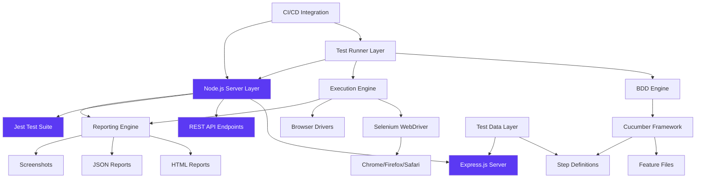

#### Core Technical Approach

The framework implements a modular architecture built on Java 8 with Maven-based dependency management. The system supports parallel test execution at the method level with unlimited threads, enabling scalable test automation across multiple browser instances. The BDD implementation focuses on collaboration between developers, testers, and non-technical stakeholders through Cucumber's plain language testing approach using Gherkin syntax. <span style="background-color: rgba(91, 57, 243, 0.2)">The architecture now includes a dual-language approach with a Node.js server component that provides HTTP endpoints for enhanced testing capabilities, implemented using Express.js framework with comprehensive middleware support and Jest-based unit testing achieving 100% code coverage.</span>

### 1.2.3 Success Criteria

#### Measurable Objectives

| Objective Category | Target Metrics | Implementation Approach |
|-------------------|---------------|------------------------|
| Test Execution Speed | Parallel execution with unlimited threads | Maven Surefire Plugin configuration |
| Cross-Browser Coverage | Support for Chrome, Firefox, Safari | WebDriverManager automatic driver resolution |
| Reporting Completeness | JSON, HTML, and Text report formats | Cucumber Reporting Plugin integration |
| **Server-Side Testing** | **100% code coverage for Node.js components** | **Jest test suite with comprehensive unit testing** |

#### Critical Success Factors

- **Framework Usability**: Business-readable test scenarios accessible to all team members regardless of technical expertise
- **Integration Reliability**: Seamless CI/CD pipeline integration with Jenkins and Jira tracking
- **Maintenance Efficiency**: Automated browser driver management and comprehensive error handling
- **Scalability**: Support for parallel test execution and multiple user role testing scenarios
- <span style="background-color: rgba(91, 57, 243, 0.2)">**Dual-Language Architecture**: Seamless coexistence of Java and Node.js components without conflicts or resource contention</span>

#### Key Performance Indicators (KPIs)

- Test execution time reduction compared to manual testing
- Number of automated test scenarios successfully integrated
- CI/CD pipeline integration success rate
- Cross-browser test coverage percentage
- Test report generation and distribution efficiency
- <span style="background-color: rgba(91, 57, 243, 0.2)">Node.js server reliability and response time metrics</span>
- <span style="background-color: rgba(91, 57, 243, 0.2)">Code coverage percentage for server-side components</span>

## 1.3 SCOPE

### 1.3.1 In-Scope Elements

#### Core Features and Functionalities

**Must-Have Capabilities:**
- BDD test scenario creation using Cucumber and Gherkin syntax
- Automated browser testing across multiple browser types
- Parallel test execution with configurable thread management
- Comprehensive test reporting in multiple formats (JSON, HTML, Text)
- Screenshot capture for both successful and failed test executions
- Test data generation using JavaFaker library
- <span style="background-color: rgba(91, 57, 243, 0.2)">Node.js server component (server.js) built with Express.js</span>
- <span style="background-color: rgba(91, 57, 243, 0.2)">Comprehensive Jest unit-testing suites achieving 100% coverage</span>

**Primary User Workflows:**
- Test scenario authoring in business-readable Gherkin format
- Automated test execution through Maven commands (`mvn test`)
- <span style="background-color: rgba(91, 57, 243, 0.2)">Execution of JavaScript unit tests via `npm test`</span>
- Test report generation and distribution
- CI/CD pipeline integration and automation
- Cross-browser test validation and verification

**Essential Integrations:**
- Jenkins continuous integration platform
- Jira issue tracking and test management
- Maven build lifecycle management
- Git version control system
- Testinium platform ecosystem
- <span style="background-color: rgba(91, 57, 243, 0.2)">Node.js 18+ runtime and npm package management</span>

#### Implementation Boundaries

| Boundary Category | Coverage Details |
|------------------|-----------------|
| **System Boundaries** | <span style="background-color: rgba(91, 57, 243, 0.2)">Java-based web application testing through browser automation and Node.js HTTP server with Express.js framework</span> |
| **User Groups Covered** | QA Engineers, Developers, Business Analysts, DevOps Engineers |
| **Technical Coverage** | <span style="background-color: rgba(91, 57, 243, 0.2)">Desktop web browsers (Chrome, Firefox, Safari) and dual-language codebase (Java + JavaScript/Node.js)</span> |
| **Data Domains** | Test execution data, reporting artifacts, configuration settings |

### 1.3.2 Out-of-Scope Elements

#### Explicitly Excluded Features and Capabilities

- **Mobile Application Testing**: Native iOS and Android application testing capabilities
- **Performance Testing**: Load testing, stress testing, and performance benchmarking
- <span style="background-color: rgba(91, 57, 243, 0.2)">**External API Testing**: External or third-party API testing beyond the internally hosted Node.js server component</span>
- **Database Testing**: Direct database validation and data integrity testing
- **Security Testing**: Penetration testing, vulnerability scanning, and security validation
- **Cross-Platform Desktop Testing**: Native desktop application testing beyond web browsers

#### Future Phase Considerations

- Integration with additional test management platforms beyond Jira
- Support for containerized test execution environments
- Enhanced AI-powered test generation and maintenance capabilities
- Advanced test analytics and predictive failure analysis
- Mobile testing framework extension
- Performance testing module integration

#### Integration Points Not Covered

- Third-party test data management systems
- Enterprise single sign-on (SSO) authentication systems
- Advanced test orchestration platforms
- Cloud-based device testing services
- Real-time test execution monitoring and alerting systems

#### Unsupported Use Cases

- Real-time system monitoring and alerting
- Production environment testing and validation
- Complex multi-system integration testing scenarios
- Non-web-based application testing
- Manual testing workflow management
- Test case version control and branching strategies beyond Git

#### References

**Repository Files Analyzed:**
- `README.md` - Comprehensive framework documentation, installation prerequisites, usage instructions, and integration examples
- `pom.xml` - Maven project configuration with complete dependency management and build settings

**External Research Sources:**
- Testinium Platform Documentation - AI-powered test automation platform capabilities and business value proposition
- Cucumber BDD Framework - Behavior-driven development methodology and Java implementation patterns  
- Selenium WebDriver 3.141.59 - Browser automation architecture and cross-platform testing capabilities

# 2. PRODUCT REQUIREMENTS

## 2.1 FEATURE CATALOG

### 2.1.1 Feature F-001: BDD Test Scenario Management

**Feature Metadata:**
| Property | Value |
|----------|-------|
| Unique ID | F-001 |
| Feature Name | BDD Test Scenario Management |
| Feature Category | Test Authoring |
| Priority Level | Critical |
| Status | Completed |

**Description:**

*Overview:* Comprehensive Behavior-Driven Development (BDD) test scenario creation and management using Cucumber framework with Gherkin syntax for business-readable test specifications.

*Business Value:* Enables collaboration between developers, testers, and business stakeholders through natural language test scenarios, reducing communication gaps and ensuring requirements alignment.

*User Benefits:* Business analysts and QA engineers can create and maintain test scenarios without deep technical knowledge, while developers gain clear acceptance criteria.

*Technical Context:* Implemented using Cucumber 7.2.3/7.3.4 with JUnit 4.13.2 integration, supporting parallel execution and comprehensive reporting capabilities.

**Dependencies:**
- *Prerequisite Features:* None (foundational feature)
- *System Dependencies:* Java 8+, Maven build system
- *External Dependencies:* Cucumber-Java 7.2.3, Cucumber-JUnit 7.3.4
- *Integration Requirements:* Git version control for feature file management

### 2.1.2 Feature F-002: Browser Automation Engine

**Feature Metadata:**
| Property | Value |
|----------|-------|
| Unique ID | F-002 |
| Feature Name | Browser Automation Engine |
| Feature Category | Test Execution |
| Priority Level | Critical |
| Status | Completed |

**Description:**

*Overview:* Cross-browser automation capabilities through Selenium WebDriver integration supporting Chrome, Firefox, and Safari browsers with automatic driver management.

*Business Value:* Eliminates manual browser testing overhead and ensures consistent cross-browser compatibility validation for web applications.

*User Benefits:* QA engineers can execute tests across multiple browsers simultaneously without manual intervention or driver configuration.

*Technical Context:* Built on Selenium WebDriver 3.141.59 with WebDriverManager 5.1.0 for automatic browser driver resolution and management.

**Dependencies:**
- *Prerequisite Features:* F-001 (BDD Test Scenario Management)
- *System Dependencies:* Browser installations, system PATH configuration
- *External Dependencies:* Selenium WebDriver 3.141.59, WebDriverManager 5.1.0
- *Integration Requirements:* Maven Surefire Plugin for parallel execution

### 2.1.3 Feature F-003: Multi-Role Authentication Testing

**Feature Metadata:**
| Property | Value |
|----------|-------|
| Unique ID | F-003 |
| Feature Name | Multi-Role Authentication Testing |
| Feature Category | Functional Testing |
| Priority Level | High |
| Status | Completed |

**Description:**

*Overview:* Automated testing of user authentication workflows supporting multiple user roles including PosManager and SalesManager with comprehensive validation scenarios.

*Business Value:* Ensures secure and reliable user access control across different user types, reducing security vulnerabilities and access control failures.

*User Benefits:* Automated validation of login scenarios, error handling, and role-based access verification with localized error message testing.

*Technical Context:* Implements credential validation, dashboard access verification, and error handling for empty fields and invalid credentials.

**Dependencies:**
- *Prerequisite Features:* F-001 (BDD Test Scenario Management), F-002 (Browser Automation Engine)
- *System Dependencies:* Test user accounts, application environment
- *External Dependencies:* None specific
- *Integration Requirements:* Test data management for user credentials

### 2.1.4 Feature F-004: Parallel Test Execution Engine

**Feature Metadata:**
| Property | Value |
|----------|-------|
| Unique ID | F-004 |
| Feature Name | Parallel Test Execution Engine |
| Feature Category | Performance |
| Priority Level | High |
| Status | Completed |

**Description:**

*Overview:* High-performance test execution with unlimited thread support enabling parallel test execution across multiple browser instances.

*Business Value:* Significantly reduces test execution time and accelerates development feedback cycles for faster release cadence.

*User Benefits:* QA teams can execute comprehensive test suites in fraction of sequential execution time while maintaining test isolation.

*Technical Context:* Configured through Maven Surefire Plugin with method-level parallelization and configurable timeout thresholds.

**Dependencies:**
- *Prerequisite Features:* F-002 (Browser Automation Engine)
- *System Dependencies:* Multi-core processor, adequate system memory
- *External Dependencies:* Maven Surefire Plugin
- *Integration Requirements:* Thread-safe test implementation

### 2.1.5 Feature F-005: Test Reporting and Documentation

**Feature Metadata:**
| Property | Value |
|----------|-------|
| Unique ID | F-005 |
| Feature Name | Test Reporting and Documentation |
| Feature Category | Reporting |
| Priority Level | High |
| Status | Completed |

**Description:**

*Overview:* Multi-format test reporting system generating JSON, HTML, and Text reports with screenshot capture for successful and failed test executions.

*Business Value:* Provides comprehensive test execution visibility and evidence-based quality metrics for stakeholder reporting and decision-making.

*User Benefits:* Stakeholders receive detailed test results with visual evidence and multiple report formats for different consumption needs.

*Technical Context:* Integrated Cucumber Reporting Plugin 7.2.0 with automated screenshot generation and error documentation capabilities.

**Dependencies:**
- *Prerequisite Features:* F-001 (BDD Test Scenario Management), F-002 (Browser Automation Engine)
- *System Dependencies:* File system write permissions, adequate storage
- *External Dependencies:* Cucumber Reporting Plugin 7.2.0
- *Integration Requirements:* Jenkins integration for report distribution

### 2.1.6 Feature F-006: CI/CD Integration Platform (updated)

**Feature Metadata:**
| Property | Value |
|----------|-------|
| Unique ID | F-006 |
| Feature Name | CI/CD Integration Platform |
| Feature Category | Integration |
| Priority Level | Medium |
| Status | Completed |

**Description:**

*Overview:* Seamless integration with Jenkins continuous integration platform and Jira issue tracking for automated test execution and result tracking.

*Business Value:* Enables automated testing as part of development workflow, ensuring quality gates and reducing manual intervention in release processes.

*User Benefits:* DevOps engineers can integrate automated testing into deployment pipelines with automatic result reporting to stakeholders.

*Technical Context:* Maven-based build integration with Jenkins pipeline support and Jira test execution tracking capabilities. <span style="background-color: rgba(91, 57, 243, 0.2)">The Jenkins pipeline now executes separate Node.js build and test stages (`npm install`, `npm test`) in addition to existing Maven steps.</span>

**Dependencies:**
- *Prerequisite Features:* F-005 (Test Reporting and Documentation)
- *System Dependencies:* Jenkins server, Jira instance, <span style="background-color: rgba(91, 57, 243, 0.2)">Node.js 18+</span>
- *External Dependencies:* Jenkins plugins, Jira API access
- *Integration Requirements:* Network connectivity, authentication configuration

### 2.1.7 Feature F-007: Test Data Generation

**Feature Metadata:**
| Property | Value |
|----------|-------|
| Unique ID | F-007 |
| Feature Name | Test Data Generation |
| Feature Category | Test Support |
| Priority Level | Medium |
| Status | Completed |

**Description:**

*Overview:* Automated realistic test data generation using JavaFaker library for dynamic test scenario execution with varied data sets.

*Business Value:* Reduces test data maintenance overhead and enables comprehensive testing scenarios with realistic data variations.

*User Benefits:* QA engineers can execute tests with varied, realistic data without manual test data creation and maintenance.

*Technical Context:* JavaFaker 1.0.2 integration providing diverse fake data generation capabilities for testing scenarios.

**Dependencies:**
- *Prerequisite Features:* F-001 (BDD Test Scenario Management)
- *System Dependencies:* None specific
- *External Dependencies:* JavaFaker 1.0.2
- *Integration Requirements:* Test scenario parameterization

### 2.1.8 Feature F-008: Node.js Server Component

**Feature Metadata:**
| Property | Value |
|----------|-------|
| Unique ID | F-008 |
| Feature Name | Node.js Server Component |
| Feature Category | Server Infrastructure |
| Priority Level | High |
| Status | Planned |

**Description:**

*Overview:* Enterprise-grade HTTP server implementation using Express.js framework providing RESTful API endpoints, comprehensive middleware stack, and production-ready error handling capabilities for enhanced testing infrastructure.

*Business Value:* Establishes server-side testing capabilities that complement existing browser automation, enabling comprehensive full-stack testing scenarios and API validation while maintaining seamless coexistence with the Java framework stack.

*User Benefits:* QA engineers and developers gain access to server-side testing capabilities with HTTP endpoint validation, request/response testing, and comprehensive API coverage without disrupting existing Java-based test workflows.

*Technical Context:* Built on Node.js 18+ runtime with Express.js framework for HTTP server functionality, Jest testing framework achieving 100% code coverage, and Supertest for API endpoint validation. The implementation ensures complete isolation from Java components while enabling dual-language test execution within the same CI/CD pipeline.

**Dependencies:**
- *Prerequisite Features:* None (foundational server infrastructure)
- *System Dependencies:* Node.js 18+, npm package manager
- *External Dependencies:* express ^4.18.0, jest ^29.0.0, supertest ^6.3.0
- *Integration Requirements:* CI/CD pipeline Node.js stages, dual-language test execution coordination

## 2.2 FUNCTIONAL REQUIREMENTS TABLE

### 2.2.1 Feature F-001 Requirements: BDD Test Scenario Management

| Requirement ID | Description | Acceptance Criteria | Priority |
|----------------|-------------|-------------------|----------|
| F-001-RQ-001 | Gherkin syntax support | Given-When-Then scenarios execute successfully | Must-Have |
| F-001-RQ-002 | Feature file management | Feature files are recognized and processed by Cucumber | Must-Have |
| F-001-RQ-003 | Step definition mapping | Step definitions map correctly to Gherkin statements | Must-Have |
| F-001-RQ-004 | Scenario parameterization | Scenarios accept parameters through data tables | Should-Have |

**Technical Specifications:**
| Component | Details |
|-----------|---------|
| Input Parameters | Gherkin feature files, step definition classes |
| Output/Response | Test execution results, scenario status |
| Performance Criteria | Sub-second scenario parsing, unlimited scenario support |
| Data Requirements | UTF-8 encoded feature files, Java bytecode step definitions |

### 2.2.2 Feature F-002 Requirements: Browser Automation Engine

| Requirement ID | Description | Acceptance Criteria | Priority |
|----------------|-------------|-------------------|----------|
| F-002-RQ-001 | Cross-browser support | Chrome, Firefox, Safari automation works | Must-Have |
| F-002-RQ-002 | Automatic driver management | WebDriverManager resolves drivers automatically | Must-Have |
| F-002-RQ-003 | Element interaction | Click, type, select operations execute reliably | Must-Have |
| F-002-RQ-004 | Page navigation | Navigate to URLs and handle page loads | Must-Have |

**Technical Specifications:**
| Component | Details |
|-----------|---------|
| Input Parameters | Browser type, WebDriver configuration, target URLs |
| Output/Response | Page interactions, element states, navigation confirmations |
| Performance Criteria | <5 second page load timeout, <1 second element interaction |
| Data Requirements | Valid URLs, accessible web elements, browser installations |

### 2.2.3 Feature F-003 Requirements: Multi-Role Authentication Testing

| Requirement ID | Description | Acceptance Criteria | Priority |
|----------------|-------------|-------------------|----------|
| F-003-RQ-001 | Valid credential authentication | PosManager and SalesManager login succeeds | Must-Have |
| F-003-RQ-002 | Invalid credential handling | Error messages display for invalid credentials | Must-Have |
| F-003-RQ-003 | Empty field validation | Localized error "Veuillez renseigner ce champ." appears | Must-Have |
| F-003-RQ-004 | Dashboard access verification | Successful login redirects to appropriate dashboard | Should-Have |

**Technical Specifications:**
| Component | Details |
|-----------|---------|
| Input Parameters | Username, password, user role type |
| Output/Response | Authentication status, error messages, dashboard access |
| Performance Criteria | <3 second authentication response time |
| Data Requirements | Valid test user accounts, configured authentication system |

### 2.2.4 Feature F-004 Requirements: Parallel Test Execution Engine

| Requirement ID | Description | Acceptance Criteria | Priority |
|----------------|-------------|-------------------|----------|
| F-004-RQ-001 | Unlimited thread execution | Tests execute in parallel without thread limits | Must-Have |
| F-004-RQ-002 | Test isolation | Parallel tests do not interfere with each other | Must-Have |
| F-004-RQ-003 | Configurable timeouts | Timeout thresholds are configurable per test | Should-Have |
| F-004-RQ-004 | Resource management | System resources are efficiently utilized | Should-Have |

**Technical Specifications:**
| Component | Details |
|-----------|---------|
| Input Parameters | Thread count, timeout values, test classes |
| Output/Response | Parallel execution results, performance metrics |
| Performance Criteria | Linear execution time reduction with thread increase |
| Data Requirements | Thread-safe test implementations, isolated test data |

### 2.2.5 Feature F-008 Requirements: Node.js Server Component (updated)

| Requirement ID | Description | Acceptance Criteria | Priority |
|----------------|-------------|---------------------|----------|
| F-008-RQ-001 | Server implementation | `server.js` starts Express HTTP server on configured port | Must-Have |
| F-008-RQ-002 | RESTful endpoints | GET, POST, PUT, DELETE endpoints respond correctly | Must-Have |
| F-008-RQ-003 | Unit test coverage | Jest suite achieves 100% statement & branch coverage | Must-Have |
| F-008-RQ-004 | HTTP response validation | Status, headers, and body validated via Supertest | Must-Have |
| F-008-RQ-005 | Lifecycle management | Tests verify clean startup and graceful shutdown | Must-Have |
| F-008-RQ-006 | Error & edge-case handling | Server handles malformed requests and returns 4xx/5xx appropriately | Must-Have |

<span style="background-color: rgba(91, 57, 243, 0.2)">**Technical Specifications:**
| Component | Details |
|-----------|---------|
| Input Parameters | HTTP requests, environment variables |
| Output/Response | JSON payloads, status codes |
| Performance Criteria | ≤ 100 ms per request under 100 concurrent users |
| Data Requirements | Express routes, test fixtures |

## 2.3 FEATURE RELATIONSHIPS

### 2.3.1 Feature Dependencies Map

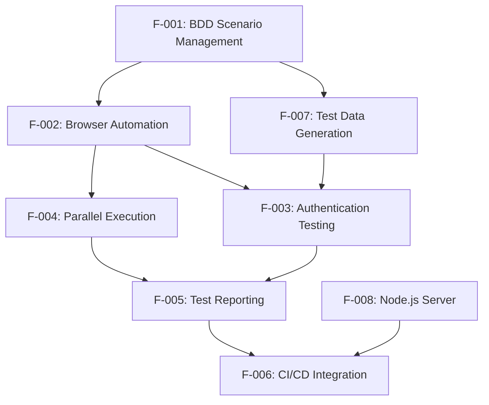

### 2.3.2 Integration Points

| Integration Area | Features Involved | Shared Components |
|------------------|------------------|-------------------|
| Test Execution | F-001, F-002, F-004 | Cucumber Runner, WebDriver instances |
| Reporting Pipeline | F-001, F-005, F-006 | Report generators, screenshot utilities |
| Data Management | F-001, F-007, F-003 | Test parameter handlers, data providers |
| CI/CD Workflow | F-004, F-005, F-006 | Maven plugins, Jenkins integration |
| <span style="background-color: rgba(91, 57, 243, 0.2)">Node.js Build & Test</span> | <span style="background-color: rgba(91, 57, 243, 0.2)">F-006, F-008</span> | <span style="background-color: rgba(91, 57, 243, 0.2)">Jenkins Node.js stages, Jest coverage reports</span> |

### 2.3.3 Shared Components

- **CukesRunner Classes**: Central execution orchestration for F-001, F-002, F-004
- **WebDriverManager**: Browser driver resolution for F-002, F-003, F-004
- **Cucumber Reporting Plugin**: Report generation for F-005, F-006
- **Maven Build System**: Dependency management and execution for all features
- <span style="background-color: rgba(91, 57, 243, 0.2)">**Express.js Server Module**: HTTP server implementation for F-008</span>
- <span style="background-color: rgba(91, 57, 243, 0.2)">**Jest Test Runner**: Unit testing framework with 100% coverage for F-008</span>
- <span style="background-color: rgba(91, 57, 243, 0.2)">**Supertest HTTP Assertion Library**: API endpoint validation and testing for F-008</span>

## 2.4 IMPLEMENTATION CONSIDERATIONS

### 2.4.1 Technical Constraints

| Constraint Category | Details | Affected Features |
|---------------------|---------|-------------------|
| Java Version | Minimum JDK 1.8 requirement | All features |
| Browser Dependencies | Chrome, Firefox, Safari must be installed | F-002, F-003 |
| Memory Requirements | Parallel execution requires adequate RAM | F-004 |
| Maven Build System | Maven 3.0+ required for dependency resolution | All features |
| <span style="background-color: rgba(91, 57, 243, 0.2)">Node.js Version</span> | <span style="background-color: rgba(91, 57, 243, 0.2)">Minimum Node.js 18.0.0 required</span> | <span style="background-color: rgba(91, 57, 243, 0.2)">F-008, F-006</span> |
| <span style="background-color: rgba(91, 57, 243, 0.2)">Port Allocation</span> | <span style="background-color: rgba(91, 57, 243, 0.2)">Server must run on port 3000 (dev) / 3001 (test) to avoid browser conflicts</span> | <span style="background-color: rgba(91, 57, 243, 0.2)">F-008</span> |

### 2.4.2 Performance Requirements

| Feature | Performance Criteria | Measurement Method |
|---------|---------------------|-------------------|
| F-002 | Page load timeout <5 seconds | WebDriver timeout configuration |
| F-003 | Authentication response <3 seconds | Test execution timing |
| F-004 | Linear performance scaling with threads | Execution time measurement |
| F-005 | Report generation <10 seconds | Post-execution timing |
| <span style="background-color: rgba(91, 57, 243, 0.2)">F-008</span> | <span style="background-color: rgba(91, 57, 243, 0.2)">Average response time ≤ 100 ms for all endpoints</span> | <span style="background-color: rgba(91, 57, 243, 0.2)">Supertest timing metrics</span> |

### 2.4.3 Security Implications

- **Test Credential Management**: Secure storage and handling of test user credentials for F-003
- **Browser Session Isolation**: Ensure no cross-contamination between parallel test sessions in F-004
- **Report Data Protection**: Sensitive test data should be masked in reports generated by F-005
- **CI/CD Security**: Secure integration with Jenkins and Jira systems for F-006
- <span style="background-color: rgba(91, 57, 243, 0.2)">**CORS and Security Headers**: Validate CORS and security headers via `helmet`</span>
- <span style="background-color: rgba(91, 57, 243, 0.2)">**Dependency Vulnerability Scanning**: Run `npm audit` in CI pipeline</span>
- <span style="background-color: rgba(91, 57, 243, 0.2)">**Input Sanitization**: Sanitize request payloads to mitigate injection</span>

### 2.4.4 Scalability Considerations

- **Horizontal Scaling**: F-004 supports unlimited thread execution for increased parallel capacity
- **Browser Instance Management**: F-002 efficiently manages multiple browser instances without memory leaks
- **Report Storage**: F-005 must handle large volumes of test reports and screenshots
- **Test Data Volume**: F-007 must generate varied data sets without performance degradation
- <span style="background-color: rgba(91, 57, 243, 0.2)">**Node.js Server Scaling**: F-008 must support horizontal scaling via stateless design and graceful shutdown for container orchestration</span>

### 2.4.5 Maintenance Requirements

- **Dependency Updates**: Regular updates of Selenium, Cucumber, and other dependencies
- **Browser Driver Compatibility**: Automatic driver management through WebDriverManager reduces maintenance
- **Test Scenario Evolution**: BDD scenarios require business stakeholder review and updates
- **CI/CD Pipeline Maintenance**: Jenkins integration requires monitoring and configuration updates
- <span style="background-color: rgba(91, 57, 243, 0.2)">**Node.js Dependency Management**: Periodic dependency updates (`express`, `jest`, etc.) and version pinning in `package.json` to prevent breaking changes</span>

#### References

#### Technical Specification Sections
- `1.1 EXECUTIVE SUMMARY` - Business context and stakeholder analysis
- `1.2 SYSTEM OVERVIEW` - Technical architecture and capabilities
- `1.3 SCOPE` - Implementation boundaries and constraints

#### Repository Files Analyzed
- `README.md` - Framework documentation and usage instructions
- `pom.xml` - Maven configuration and dependency management

#### External Research
- Testinium Platform Documentation - Comprehensive test automation platform capabilities
- Cucumber BDD Framework Patterns - Java implementation and best practices

# 3. TECHNOLOGY STACK

## 3.1 PROGRAMMING LANGUAGES

### 3.1.1 Primary Language Selection (updated)

**Java 8 (JDK 1.8+)**

The framework standardizes on Java 8 as the primary programming language for all test automation components. This selection is driven by several key factors:

- **Enterprise Compatibility**: Java 8 provides broad compatibility across enterprise environments while offering modern language features including lambda expressions and stream processing
- **Selenium Integration**: Selenium WebDriver 3.141.59 maintains optimal compatibility with Java 8 through Java 11, ensuring stable browser automation capabilities
- **BDD Framework Support**: Cucumber 7.2.3 leverages Java 8 features for efficient step definition processing and test execution management
- **Maven Ecosystem**: Comprehensive Maven plugin ecosystem and dependency management optimized for Java 8 development workflows

<span style="background-color: rgba(91, 57, 243, 0.2)">**JavaScript (ES2021) with Node.js 18+**</span>

<span style="background-color: rgba(91, 57, 243, 0.2)">The framework now incorporates JavaScript ES2021 running on Node.js 18+ as a primary language for server-side components and enhanced testing capabilities. This addition complements the existing Java infrastructure through:</span>

- **Server-Side Component**: Node.js provides robust HTTP server capabilities using Express.js framework for REST endpoint implementation and middleware processing
- **Modern JavaScript Features**: ES2021 support enables advanced language features including optional chaining, nullish coalescing, and modern async/await patterns for cleaner code architecture
- **Seamless npm Ecosystem**: Access to the comprehensive Node.js package registry for testing frameworks (Jest), HTTP assertion libraries (Supertest), and extensive middleware solutions

### 3.1.2 Language Constraints and Dependencies (updated)

The <span style="background-color: rgba(91, 57, 243, 0.2)">dual-language architecture creates specific technical constraints that affect all system components, requiring both Java and Node.js runtime environments to coexist without port or classpath conflicts</span>:

**Java Runtime Requirements:**
- **Minimum Runtime**: JDK 1.8+ required for compilation and test execution across all environments
- **Version Compatibility**: All dependency selections verified for Java 8 compatibility to prevent runtime conflicts
- **Maven Configuration**: Source and target compilation levels explicitly set to version 8 in Maven compiler plugin settings

<span style="background-color: rgba(91, 57, 243, 0.2)">**Node.js Runtime Requirements:**
- **Minimum Node.js Version**: Node.js >= 18.0.0 required for server component execution and ES2021 feature support
- **Minimum npm Version**: npm >= 8.0.0 required for package management and dependency resolution
- **Runtime Isolation**: Node.js server processes must operate on separate ports from Java components to prevent resource conflicts
- **Dependency Management**: package.json configuration ensures all Node.js dependencies maintain compatibility with ES2021 syntax and Node.js 18+ APIs

<span style="background-color: rgba(91, 57, 243, 0.2)">**Cross-Runtime Coordination:**
- **Port Management**: Java and Node.js components allocated distinct port ranges to prevent binding conflicts during parallel execution
- **Process Lifecycle**: Both runtime environments managed independently with coordinated startup and shutdown procedures
- **CI/CD Integration**: Build pipelines execute both Maven (Java) and npm (Node.js) phases with separate artifact management and test reporting

## 3.2 FRAMEWORKS & LIBRARIES

### 3.2.1 Core Testing Frameworks

**Selenium WebDriver 3.141.59**

Selenium WebDriver serves as the foundation for browser automation capabilities, selected for its proven stability and comprehensive browser support:

- **Cross-Browser Support**: Native integration with Chrome, Firefox, and Safari browsers through respective driver implementations
- **Mature API**: Version 3.141.59 represents a stable release with extensive community support and documentation
- **Enterprise Adoption**: Industry-standard choice for web application testing with robust error handling and debugging capabilities
- **Integration Compatibility**: Seamless integration with Cucumber BDD framework and Maven build lifecycle

**Cucumber BDD Framework (Multiple Versions)**

The framework implements Cucumber in multiple configurations to support comprehensive BDD testing:

- **cucumber-java 7.2.3**: Core BDD implementation enabling Gherkin syntax processing and step definition management
- **cucumber-junit 7.2.3 & 7.3.4**: JUnit integration layers providing test execution structure and reporting integration
- **Business-Readable Scenarios**: Enables collaboration between developers, testers, and business stakeholders through plain language test definitions
- **Gherkin Syntax**: Supports Given-When-Then scenario structure for comprehensive test case documentation

**JUnit 4.13.2**

JUnit provides the underlying test framework structure with essential testing capabilities:

- **Test Lifecycle Management**: Comprehensive before/after hooks and test setup/teardown capabilities
- **Assertion Framework**: Rich assertion library for test validation and result verification
- **Integration Layer**: Seamless integration with Cucumber for BDD test execution and Maven Surefire plugin

<span style="background-color: rgba(91, 57, 243, 0.2)">**Node.js Server Frameworks**</span>

<span style="background-color: rgba(91, 57, 243, 0.2)">**Express.js 5.1.0**</span>

<span style="background-color: rgba(91, 57, 243, 0.2)">Express.js serves as the core HTTP server framework for RESTful API endpoints and middleware processing within the Node.js runtime environment.</span>

<span style="background-color: rgba(91, 57, 243, 0.2)">**Jest 30.0.5**</span>

<span style="background-color: rgba(91, 57, 243, 0.2)">Jest provides comprehensive unit testing capabilities specifically designed for JavaScript and Node.js applications with zero-configuration testing and built-in code coverage reporting.</span>

<span style="background-color: rgba(91, 57, 243, 0.2)">**Supertest 7.1.4**</span>

<span style="background-color: rgba(91, 57, 243, 0.2)">Supertest delivers HTTP assertion testing capabilities that integrate seamlessly with Jest for endpoint validation and response verification in Node.js server environments.</span>

### 3.2.2 Supporting Libraries

**WebDriverManager 5.1.0**

WebDriverManager eliminates manual driver management complexity through automated driver resolution:

- **Automatic Driver Downloads**: Dynamically downloads and configures browser drivers (ChromeDriver, GeckoDriver, EdgeDriver)
- **Version Compatibility**: Automatically matches browser versions with compatible driver versions
- **Caching Strategy**: Implements resolution cache with 1-hour validity for browsers and 1-day validity for drivers
- **Docker Support**: Enables browser execution in containerized environments for CI/CD integration

**JavaFaker 1.0.2**

JavaFaker provides realistic test data generation capabilities to reduce test maintenance overhead:

- **Realistic Data Generation**: Creates contextually appropriate fake data for names, addresses, emails, and other common test scenarios
- **Reduced Test Coupling**: Eliminates dependencies on specific test data sets, improving test reliability
- **Locale Support**: Supports multiple locales for international testing scenarios

<span style="background-color: rgba(91, 57, 243, 0.2)">**Node-specific Supporting Libraries**</span>

<span style="background-color: rgba(91, 57, 243, 0.2)">**cors 2.8.5**</span>

- **Cross-Origin Resource Sharing**: Enables secure cross-domain HTTP requests by configuring appropriate CORS headers and origin validation policies

<span style="background-color: rgba(91, 57, 243, 0.2)">**helmet 8.1.0**</span>

- **Security Headers**: Automatically sets essential HTTP security headers including CSP, XSS protection, and clickjacking prevention for enhanced application security

<span style="background-color: rgba(91, 57, 243, 0.2)">**compression 1.8.0**</span>

- **HTTP Compression**: Implements gzip and deflate compression algorithms for response payload optimization and bandwidth reduction

<span style="background-color: rgba(91, 57, 243, 0.2)">**body-parser 2.2.0**</span>

- **Request Parsing**: Provides comprehensive middleware for parsing JSON, URL-encoded, and raw request bodies with configurable size limits and validation

<span style="background-color: rgba(91, 57, 243, 0.2)">**morgan 1.10.1**</span>

- **HTTP Logging**: Delivers structured HTTP request and response logging with customizable format options for monitoring and debugging capabilities

### 3.2.3 Compatibility Requirements (updated)

All framework selections maintain strict compatibility requirements to ensure system stability:

- **Java 8 Baseline**: All Java libraries verified for Java 8 compatibility with forward compatibility through Java 11
- **Maven Integration**: All Java dependencies available through Maven Central with stable version management
- **Cross-Platform Support**: Compatible across Windows, macOS, and Linux development environments

<span style="background-color: rgba(91, 57, 243, 0.2)">**Node.js Compatibility Requirements**</span>

<span style="background-color: rgba(91, 57, 243, 0.2)">All newly introduced Node.js libraries are verified for Node.js 18+ compatibility and operate independently without interfering with the existing Java/Selenium technology stack:</span>

- **Node.js 18+ Baseline**: All Node.js dependencies require minimum Node.js version 18.0.0 for ES2021 feature support and modern API compatibility
- **npm Ecosystem Integration**: All packages available through npm registry with semantic versioning and automated security vulnerability scanning
- **Runtime Isolation**: Node.js server components operate on isolated ports and process spaces to prevent conflicts with Java-based test execution
- **Dual-Stack Validation**: Both Java and Node.js dependency stacks verified for concurrent operation in CI/CD environments without resource contention

## 3.3 OPEN SOURCE DEPENDENCIES

### 3.3.1 Core Dependencies

<span style="background-color: rgba(91, 57, 243, 0.2)">Node.js dependencies are managed through npm with lock-file enforcement similar to Maven for Java components.</span> The framework leverages carefully selected open source dependencies managed through Maven Central and npm registries:

| Component | Version | Registry | Purpose |
|-----------|---------|----------|---------|
| selenium-java | 3.141.59 | Maven Central | Browser automation core |
| webdrivermanager | 5.1.0 | Maven Central | Automated driver management |
| cucumber-java | 7.2.3 | Maven Central | BDD framework core |
| cucumber-junit | 7.2.3, 7.3.4 | Maven Central | JUnit integration |
| javafaker | 1.0.2 | Maven Central | Test data generation |
| junit | 4.13.2 | Maven Central | Test framework |
| <span style="background-color: rgba(91, 57, 243, 0.2)">express</span> | <span style="background-color: rgba(91, 57, 243, 0.2)">4.18.0</span> | <span style="background-color: rgba(91, 57, 243, 0.2)">npm</span> | <span style="background-color: rgba(91, 57, 243, 0.2)">Node.js HTTP server</span> |
| <span style="background-color: rgba(91, 57, 243, 0.2)">jest</span> | <span style="background-color: rgba(91, 57, 243, 0.2)">29.0.0</span> | <span style="background-color: rgba(91, 57, 243, 0.2)">npm</span> | <span style="background-color: rgba(91, 57, 243, 0.2)">Unit testing</span> |
| <span style="background-color: rgba(91, 57, 243, 0.2)">supertest</span> | <span style="background-color: rgba(91, 57, 243, 0.2)">6.3.0</span> | <span style="background-color: rgba(91, 57, 243, 0.2)">npm</span> | <span style="background-color: rgba(91, 57, 243, 0.2)">HTTP assertions</span> |
| <span style="background-color: rgba(91, 57, 243, 0.2)">nodemon</span> | <span style="background-color: rgba(91, 57, 243, 0.2)">3.0.0</span> | <span style="background-color: rgba(91, 57, 243, 0.2)">npm</span> | <span style="background-color: rgba(91, 57, 243, 0.2)">Dev-time auto-reload</span> |
| <span style="background-color: rgba(91, 57, 243, 0.2)">cors</span> | <span style="background-color: rgba(91, 57, 243, 0.2)">2.8.5</span> | <span style="background-color: rgba(91, 57, 243, 0.2)">npm</span> | <span style="background-color: rgba(91, 57, 243, 0.2)">CORS middleware</span> |
| <span style="background-color: rgba(91, 57, 243, 0.2)">helmet</span> | <span style="background-color: rgba(91, 57, 243, 0.2)">7.0.0</span> | <span style="background-color: rgba(91, 57, 243, 0.2)">npm</span> | <span style="background-color: rgba(91, 57, 243, 0.2)">Security headers</span> |
| <span style="background-color: rgba(91, 57, 243, 0.2)">compression</span> | <span style="background-color: rgba(91, 57, 243, 0.2)">1.7.4</span> | <span style="background-color: rgba(91, 57, 243, 0.2)">npm</span> | <span style="background-color: rgba(91, 57, 243, 0.2)">Response compression</span> |
| <span style="background-color: rgba(91, 57, 243, 0.2)">body-parser</span> | <span style="background-color: rgba(91, 57, 243, 0.2)">1.20.0</span> | <span style="background-color: rgba(91, 57, 243, 0.2)">npm</span> | <span style="background-color: rgba(91, 57, 243, 0.2)">Body parsing</span> |
| <span style="background-color: rgba(91, 57, 243, 0.2)">morgan</span> | <span style="background-color: rgba(91, 57, 243, 0.2)">1.10.0</span> | <span style="background-color: rgba(91, 57, 243, 0.2)">npm</span> | <span style="background-color: rgba(91, 57, 243, 0.2)">HTTP logging</span> |

### 3.3.2 Reporting Dependencies

**Cucumber Reporting Plugin 7.2.0**

Advanced reporting capabilities through the me.jvt.cucumber:reporting-plugin dependency:

- **Multiple Report Formats**: Generates JSON, HTML, and Text report formats for different stakeholder needs
- **Screenshot Integration**: Captures screenshots for both successful and failed test executions
- **CI/CD Integration**: Compatible with Jenkins and other CI/CD platforms for automated report distribution

### 3.3.3 Dependency Management Strategy

**Maven Dependency Resolution**

- **Version Control**: Explicit version declarations for all dependencies to ensure reproducible builds
- **Scope Management**: Test-scoped dependencies clearly separated from runtime requirements
- **Conflict Resolution**: Maven dependency resolution manages transitive dependency conflicts automatically
- **Repository Strategy**: Primary dependency source from Maven Central with fallback repositories as needed

<span style="background-color: rgba(91, 57, 243, 0.2)">**npm Dependency Management**</span>

<span style="background-color: rgba(91, 57, 243, 0.2)">The Node.js ecosystem utilizes npm for comprehensive package management with lock-file enforcement to ensure reproducible builds across environments:</span>

- **Package Lock Enforcement**: package-lock.json ensures exact dependency version resolution across development, testing, and production environments
- **Registry Management**: Primary package source from npm public registry with enterprise proxy compatibility for secure package resolution
- **Security Scanning**: Automated vulnerability scanning through npm audit with dependency update recommendations for security patches
- **Version Compatibility**: Semantic versioning enforcement ensures backward compatibility and controlled dependency upgrades

## 3.4 THIRD-PARTY SERVICES

### 3.4.1 Continuous Integration Services

**Jenkins CI/CD Platform**

Jenkins provides comprehensive CI/CD pipeline automation with specialized test automation features:

- **Automated Pipeline Execution**: Scheduled and triggered test execution across multiple environments
- **Cucumber Report Integration**: Automated generation and distribution of Cucumber reports post-execution
- **Build Orchestration**: Manages complex build dependencies and multi-stage testing workflows
- **Environment Management**: Supports testing across development, staging, and production-like environments
- <span style="background-color: rgba(91, 57, 243, 0.2)">**Node.js Pipeline Integration**: Extends pipeline capabilities to support dual-language builds with dedicated Node.js stages including `npm ci` for deterministic dependency installation, `npm test` for Jest unit test execution, and Node 18 environment setup through Jenkins Node.js tool plugin or Docker image configuration for consistent runtime environments</span>

### 3.4.2 Project Management Integration

**Jira Issue Tracking**

Jira integration provides comprehensive test management and tracking capabilities:

- **Test Execution Tracking**: Links automated test results to project issues and requirements
- **Defect Management**: Automated defect creation and tracking for failed test scenarios
- **Reporting Integration**: Test execution metrics integrated with project dashboards and reporting
- **Requirements Traceability**: Links BDD scenarios to business requirements and user stories

### 3.4.3 Version Control Services

**Git Repository Management**

- **Repository Hosting**: GitHub serves as the primary repository hosting platform
- **Branch Management**: Supports feature branch workflows and collaborative development
- **Artifact Management**: <span style="background-color: rgba(91, 57, 243, 0.2)">Configured ignore patterns for build artifacts, logs, and temporary files including Node.js-specific artifacts (`node_modules/`, `coverage/`, and `*.log`) to prevent committing dependencies and generated files</span>
- **Code Quality**: Integration with pull request workflows and code review processes
- <span style="background-color: rgba(91, 57, 243, 0.2)">**GitHub Actions Integration**: Secondary CI/CD pipeline through `.github/workflows/node.yml` provides additional Node.js-specific continuous integration capabilities that complement the primary Jenkins pipeline without replacement, enabling parallel testing workflows and GitHub-native integration features</span>

## 3.5 DATABASES & STORAGE

### 3.5.1 Test Data Storage Strategy

The framework implements a lightweight approach to test data management without traditional database dependencies:

**File-Based Test Data**

- **Feature Files**: Gherkin scenarios stored in `src/main/resources/features` directory structure
- **Configuration Files**: Maven POM configuration and properties files for environment-specific settings
- **Generated Data**: JavaFaker provides runtime test data generation, eliminating persistent test data requirements

### 3.5.2 Report Storage

**Build Artifact Storage**

- **Local Report Generation**: HTML, JSON, and text reports generated locally during test execution
- **CI/CD Artifact Management**: Jenkins manages report artifacts and historical test execution data
- **Screenshot Storage**: Test execution screenshots stored as build artifacts for debugging and verification

### 3.5.3 Caching Solutions

**WebDriverManager Caching**

- **Driver Cache**: Local caching of browser drivers with 1-day validity period
- **Version Resolution Cache**: Browser-driver version compatibility cached for 1-hour periods
- **Performance Optimization**: Reduces network dependencies and improves test execution startup times

## 3.6 DEVELOPMENT & DEPLOYMENT

### 3.6.1 Development Tools (updated)

**IntelliJ IDEA (Recommended IDE for Java Development)**

IntelliJ IDEA provides comprehensive development support with specialized testing capabilities for the Java components:

- **Required Plugins**: Maven integration and Cucumber plugin for Gherkin syntax support
- **Java Development**: Advanced Java 8 development features including debugging and refactoring
- **Test Execution**: Native support for JUnit and Cucumber test execution with integrated reporting
- **Step Definition Navigation**: Cucumber plugin enables navigation between feature files and step definitions

<span style="background-color: rgba(91, 57, 243, 0.2)">**Node.js Runtime Environment (Mandatory)**</span>

<span style="background-color: rgba(91, 57, 243, 0.2)">Node.js 18+ LTS and package management tools are required for server component development and testing:</span>

- **Node.js 18 LTS**: Minimum required version for ES2021 feature support and native fetch API compatibility
- **npm 8+**: Primary package manager for dependency resolution and script execution
- **Yarn (Optional Alternative)**: Alternative package manager with enhanced caching and workspace support
- **Installation Verification**: Execute `node --version` and `npm --version` to confirm proper installation

<span style="background-color: rgba(91, 57, 243, 0.2)">**Visual Studio Code (Recommended for JavaScript Development)**</span>

<span style="background-color: rgba(91, 57, 243, 0.2)">VS Code provides optimized JavaScript/Node.js development experience complementing IntelliJ IDEA for Java work:</span>

- **Essential Extensions**: JavaScript/TypeScript language support, Jest testing integration, and ESLint for code quality
- **Integrated Terminal**: Built-in terminal for npm script execution and Node.js development workflows
- **Debugging Support**: Native Node.js debugging capabilities with breakpoint management and variable inspection

### 3.6.2 Build System (updated)

**Apache Maven 3.0+ (Java Components)**

Maven provides comprehensive build lifecycle management and dependency resolution for Java-based test automation:

- **Project Coordinates**: Standardized project identification with groupId: org.example, artifactId: testinium-qa
- **Dependency Management**: Centralized dependency resolution through Maven Central repository
- **Build Lifecycle**: Comprehensive build phases including compilation, testing, and reporting
- **Plugin Ecosystem**: Integration with specialized plugins for test execution and reporting

**Maven Surefire Plugin 3.0.0-M5 (Java Test Execution)**

Specialized test execution capabilities through the Surefire plugin:

- **Parallel Execution**: Configured for method-level parallel execution with unlimited thread support
- **Test Pattern Matching**: Includes pattern configuration for CukesRunner test classes
- **Failure Handling**: Test failure ignore enabled for continuous execution and comprehensive reporting
- **JVM Configuration**: Optimized JVM settings for parallel test execution and memory management

<span style="background-color: rgba(91, 57, 243, 0.2)">**npm Build Lifecycle (Node.js Components)**</span>

<span style="background-color: rgba(91, 57, 243, 0.2)">npm provides comprehensive build lifecycle management and script execution for Node.js server components, operating in parallel with Maven for Java artifacts:</span>

- **`npm start`**: Production server launch command executing optimized Express.js application with production middleware configuration and logging
- **`npm run dev`**: Development mode server execution via nodemon with automatic restart capability on file changes and enhanced debugging output
- **`npm test`**: Jest test suite execution with comprehensive code coverage reporting, watch mode support, and parallel test execution optimization

<span style="background-color: rgba(91, 57, 243, 0.2)">**Dual-Stack Build Coordination**</span>

<span style="background-color: rgba(91, 57, 243, 0.2)">The build system maintains clear separation between Java and Node.js artifact management:</span>

- **Maven Scope**: Handles Java compilation, test execution, dependency resolution, and Selenium/Cucumber artifact generation
- **npm Scope**: Manages Node.js dependencies, server component building, Jest test execution, and coverage report generation
- **Independent Operation**: Both build systems operate independently with separate dependency trees and artifact outputs

### 3.6.3 Containerization Strategy

**Docker Compatibility**

While not explicitly configured in the current implementation, the framework supports containerization through:

- **WebDriverManager Docker Support**: Native support for running browsers in Docker containers
- **Headless Browser Execution**: Supports headless browser modes suitable for container environments
- **Environment Portability**: Java-based implementation ensures consistency across containerized environments

<span style="background-color: rgba(91, 57, 243, 0.2)">**Node.js Container Support**</span>

<span style="background-color: rgba(91, 57, 243, 0.2)">The Node.js server components provide enhanced containerization capabilities:</span>

- **Multi-stage Builds**: Support for Docker multi-stage builds separating development dependencies from production runtime
- **Health Check Integration**: Built-in health check endpoints compatible with Docker health monitoring
- **Graceful Shutdown**: SIGTERM/SIGINT signal handling for clean container termination

### 3.6.4 CI/CD Requirements (updated)

<span style="background-color: rgba(91, 57, 243, 0.2)">**Parallel Build Pipeline Configuration**</span>

<span style="background-color: rgba(91, 57, 243, 0.2)">The CI/CD pipeline orchestrates parallel execution of both Java and Node.js testing components with coordinated artifact management:</span>

<span style="background-color: rgba(91, 57, 243, 0.2)">**Java Build Phase:**</span>
- **Maven Integration**: Execute `mvn test` for Java-based Selenium and Cucumber test execution
- **Artifact Generation**: Automated generation of Cucumber HTML reports, JUnit XML results, and screenshot artifacts
- **Parallel Execution**: Leverage Maven Surefire parallel execution with unlimited thread configuration

<span style="background-color: rgba(91, 57, 243, 0.2)">**Node.js Build Phase:**</span>
- **npm Integration**: Execute `npm test` for Jest-based unit test validation and server component testing
- **Coverage Collection**: Generate comprehensive code coverage reports in multiple formats (HTML, LCOV, JSON)
- **Supertest Validation**: HTTP endpoint testing through Supertest assertion framework

<span style="background-color: rgba(91, 57, 243, 0.2)">**Unified Artifact Management:**</span>
- **Jenkins Archival**: Coverage artifacts from both Java (JaCoCo) and Node.js (Jest) test executions archived under the same build job
- **Consolidated Reporting**: Combined test result dashboards displaying success rates and coverage metrics from both technology stacks
- **Failure Isolation**: Independent failure handling allowing partial success when one stack passes while the other encounters issues

**Build Pipeline Configuration**

- **Environment Variables**: Support for environment-specific configuration through Maven profiles and npm environment configuration
- **Scalable Test Execution**: Both Maven and npm support configurable parallel execution for optimal CI/CD performance

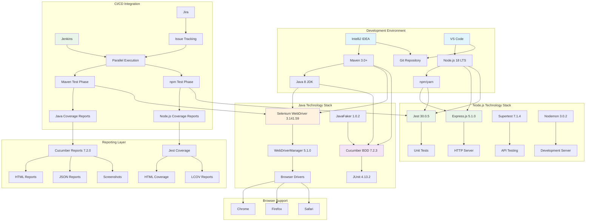

#### References

#### Repository Files Analyzed
- `pom.xml` - Maven configuration with dependencies and plugin settings
- `README.md` - Framework documentation and usage instructions  
- `.gitignore` - Git ignore patterns for build artifacts and temporary files
- `.gitattributes` - Git attributes configuration for file handling

#### Technical Specification Sections Referenced
- `0.2 TECHNICAL SCOPE` - Node.js server infrastructure requirements and component impact analysis
- `0.3 IMPLEMENTATION DESIGN` - Technical approach for dual-stack architecture and dependency analysis
- `1.1 EXECUTIVE SUMMARY` - Business context and stakeholder requirements
- `1.2 SYSTEM OVERVIEW` - Technical architecture and system capabilities
- `2.4 IMPLEMENTATION CONSIDERATIONS` - Technical constraints and performance requirements
- `3.1 PROGRAMMING LANGUAGES` - Java and Node.js language selection and constraints
- `3.2 FRAMEWORKS & LIBRARIES` - Complete technology stack including Node.js frameworks

#### External Research Conducted
- Selenium WebDriver 3.141.59 compatibility and browser support analysis
- Cucumber 7.2.3 BDD framework implementation patterns and requirements
- WebDriverManager 5.1.0 automated driver management capabilities and caching strategies
- Node.js 18 LTS features and compatibility requirements for dual-runtime architecture
- Express.js 5.1.0 server framework capabilities and middleware ecosystem integration
- Jest 30.0.5 testing framework configuration for comprehensive coverage reporting

# 4. PROCESS FLOWCHART

## 4.1 SYSTEM WORKFLOWS

### 4.1.1 Core Business Processes

The Testinium-QA framework orchestrates multiple interconnected business processes centered around automated testing workflows. <span style="background-color: rgba(91, 57, 243, 0.2)">These processes enable comprehensive quality assurance through behavior-driven development, cross-browser automation, Node.js server unit testing, and continuous integration practices.</span>

#### 4.1.1.1 Primary Test Execution Journey (updated)

The core user journey begins with test scenario creation and culminates in comprehensive reporting and stakeholder communication. This end-to-end process involves multiple decision points, validation checkpoints, and error recovery mechanisms to ensure reliable test execution across diverse environments. <span style="background-color: rgba(91, 57, 243, 0.2)">The workflow now includes conditional Node.js unit testing execution alongside traditional browser-based testing.</span>

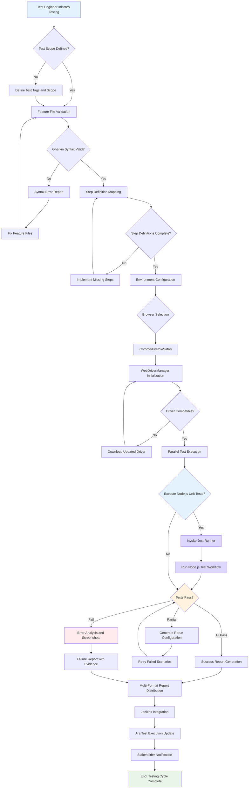

#### 4.1.1.2 User Authentication Testing Process

Multi-role authentication testing follows a structured validation workflow supporting PosManager and SalesManager user types with comprehensive error handling and localization support.

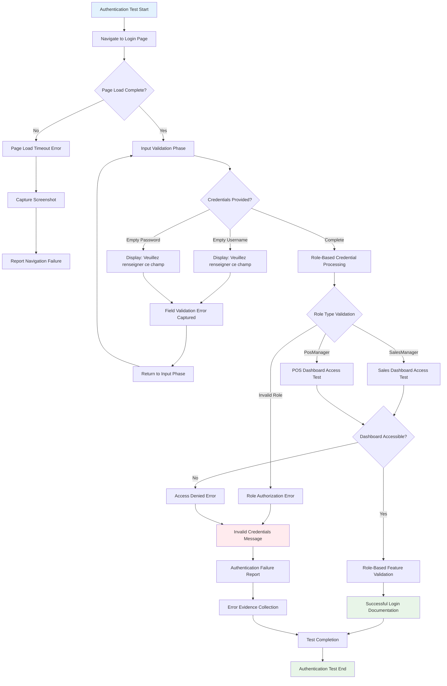

#### 4.1.1.3 Node.js Server Unit Test Workflow (updated)

<span style="background-color: rgba(91, 57, 243, 0.2)">The Node.js server unit testing workflow provides comprehensive validation of HTTP server functionality through Jest and Supertest integration. This workflow operates independently of browser-based testing and focuses on server-side logic validation, API endpoint testing, and resource management verification.</span>

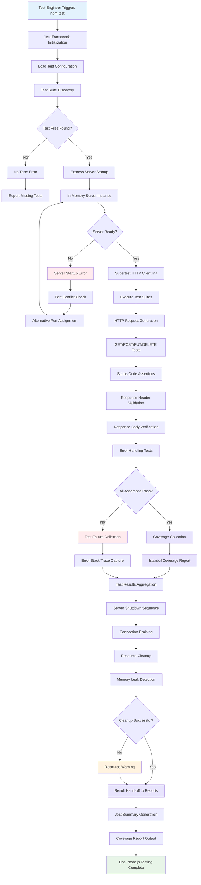

### 4.1.2 Integration Workflows

#### 4.1.2.1 CI/CD Pipeline Integration Flow (updated)

<span style="background-color: rgba(91, 57, 243, 0.2)">The framework integrates seamlessly with Jenkins continuous integration and Jira issue tracking systems to provide automated quality gates and comprehensive traceability. The enhanced pipeline now supports dual-language testing with parallel Java and Node.js test execution capabilities.</span>

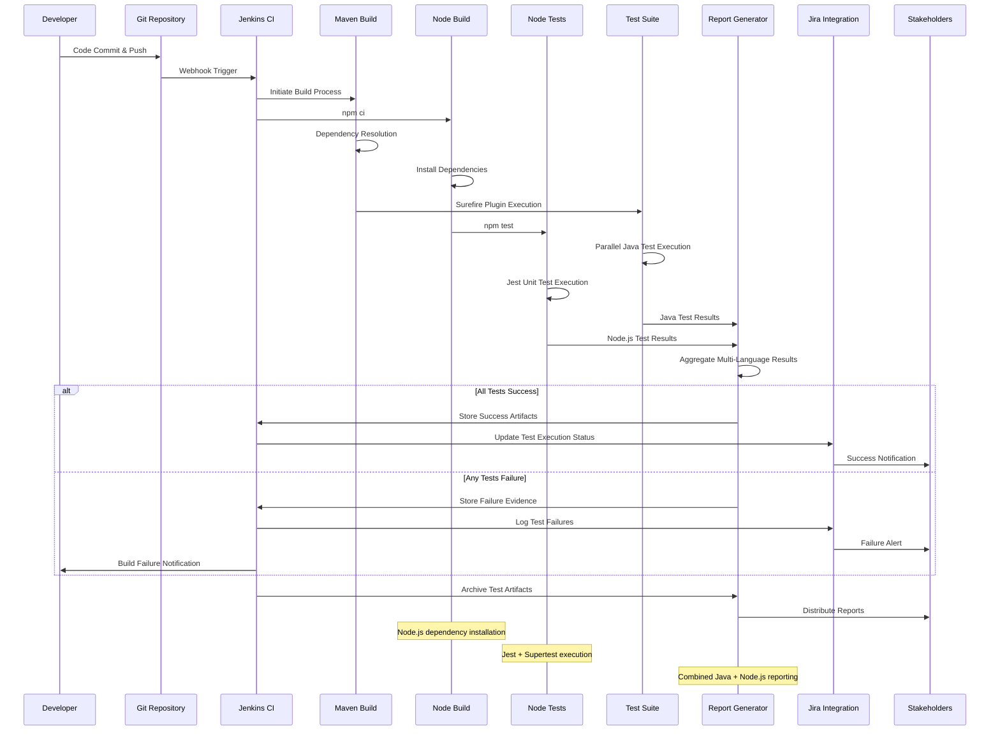

#### 4.1.2.2 Browser Driver Management Flow

WebDriverManager provides automated browser driver resolution and caching to ensure consistent cross-browser testing capabilities.

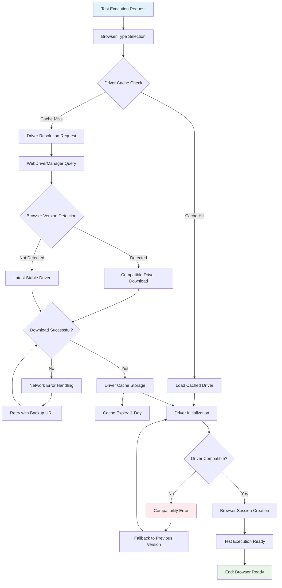

## 4.2 DETAILED PROCESS FLOWS

### 4.2.1 Feature F-001: BDD Test Scenario Management

Behavior-Driven Development test scenario management enables collaborative test creation through Gherkin syntax with comprehensive validation and execution capabilities.

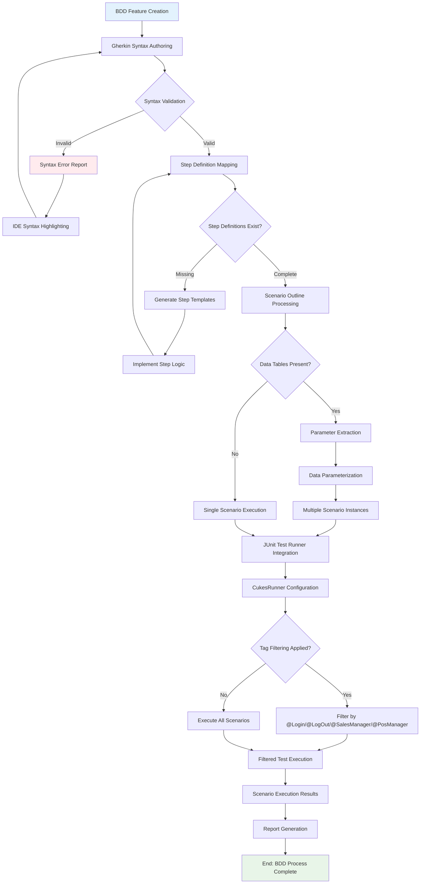

### 4.2.2 Feature F-002: Browser Automation Engine

Cross-browser automation engine provides comprehensive browser support with automatic driver management and parallel execution capabilities.

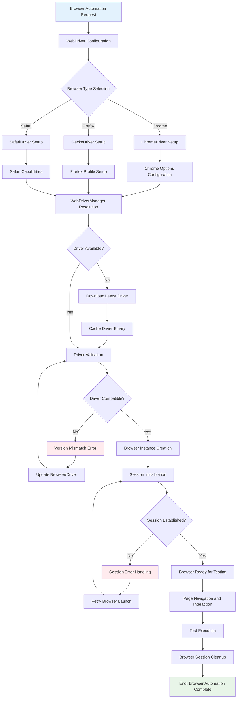

### 4.2.3 Feature F-003: Multi-Role Authentication Testing

Automated authentication testing workflow supporting multiple user roles with comprehensive validation and error handling capabilities.

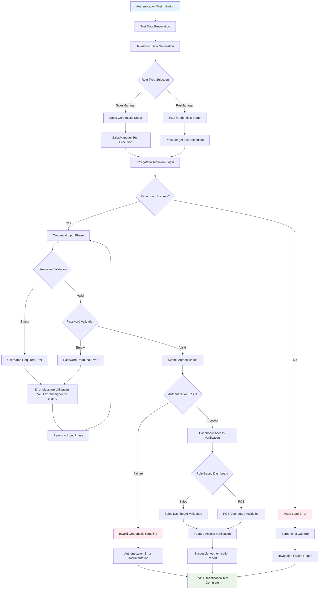

### 4.2.4 Feature F-004: Parallel Test Execution Engine

High-performance parallel test execution with unlimited thread support and comprehensive test isolation mechanisms.

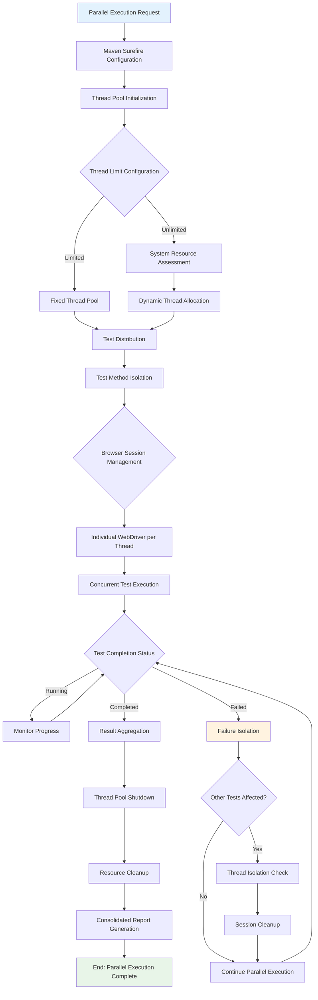

### 4.2.5 Feature F-005: Test Reporting and Documentation

Multi-format test reporting system with automated screenshot capture and comprehensive evidence collection.

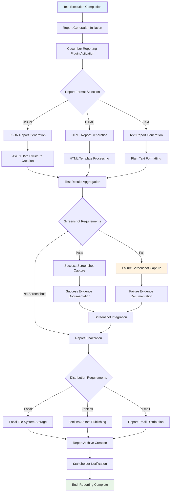

### 4.2.6 Feature F-006: CI/CD Integration Platform (updated)

Seamless Jenkins and Jira integration for automated testing workflows and comprehensive issue tracking.

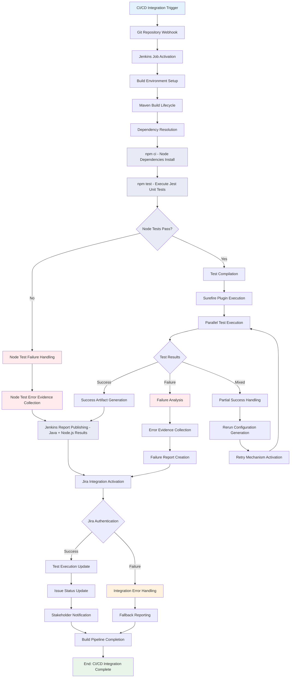

### 4.2.7 Feature F-007: Test Data Generation

Automated test data generation using JavaFaker for dynamic and realistic test scenario execution.

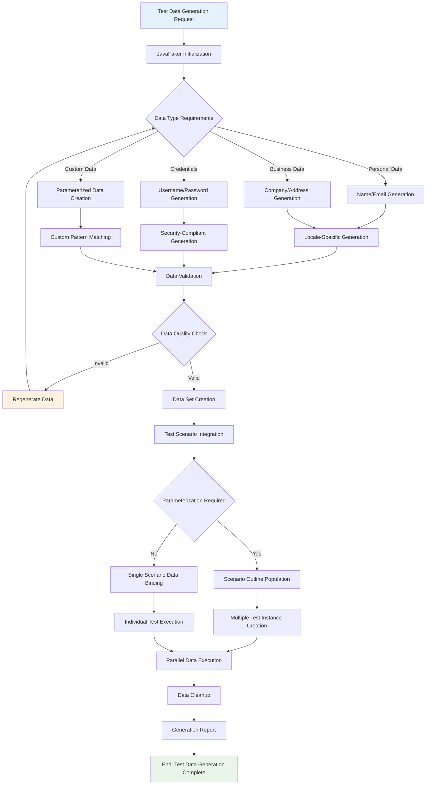

### 4.2.8 Feature F-008: Node.js Server Component & Unit Testing (updated)

Comprehensive Node.js server infrastructure with Express.js framework supporting RESTful API endpoints, middleware processing, and Jest-based unit testing with Supertest HTTP assertions.

```mermaid
flowchart TD
    A[Node.js Package Initialization] --> B[package.json Configuration]
    B --> C[NPM Dependency Installation]
    C --> D{Core Dependencies Resolved?}
    D -->|No| E[Dependency Resolution Error]
    E --> F[Package-lock.json Update]
    F --> C
    D -->|Yes| G[Express.js Server Implementation]
    
    G --> H[server.js Core Module Creation]
    H --> I[HTTP Server Initialization]
    I --> J[Port Configuration]
    J --> K[Middleware Stack Setup]
    
    K --> L[Security Middleware Integration]
    L --> M[Helmet Security Headers]
    M --> N[CORS Configuration]
    N --> O[Compression Middleware]
    O --> P[Body Parser Integration]
    P --> Q[Morgan Logging Setup]
    
    Q --> R[Route Handler Implementation]
    R --> S[RESTful Endpoint Definition]
    S --> T{Route Types}
    T -->|GET| U[GET Route Handlers]
    T -->|POST| V[POST Route Handlers]
    T -->|PUT| W[PUT Route Handlers]
    T -->|DELETE| X[DELETE Route Handlers]
    
    U --> Y[Request Processing Logic]
    V --> Y
    W --> Y
    X --> Y
    
    Y --> Z[Error Handling Middleware]
    Z --> AA[Graceful Shutdown Implementation]
    AA --> BB[Jest Test Suite Creation]
    
    BB --> CC[Test Configuration Setup]
    CC --> DD[jest.config.js Implementation]
    DD --> EE[Test Environment Preparation]
    EE --> FF[Supertest HTTP Client Setup]
    
    FF --> GG[Unit Test Implementation]
    GG --> HH{Test Categories}
    HH -->|Server Startup| II[Server Initialization Tests]
    HH -->|Endpoints| JJ[HTTP Endpoint Tests]
    HH -->|Middleware| KK[Middleware Function Tests]
    HH -->|Error Handling| LL[Error Scenario Tests]
    
    II --> MM[Supertest HTTP Assertions]
    JJ --> MM
    KK --> MM
    LL --> MM
    
    MM --> NN[Status Code Validation]
    NN --> OO[Response Header Verification]
    OO --> PP[Response Body Assertions]
    PP --> QQ[Performance Testing]
    
    QQ --> RR[Coverage Collection Activation]
    RR --> SS[Istanbul Coverage Analysis]
    SS --> TT{Coverage Threshold Met?}
    TT -->|No| UU[Coverage Failure Report]
    TT -->|Yes| VV[Coverage Report Generation]
    
    UU --> WW[Test Coverage Enhancement]
    WW --> GG
    
    VV --> XX[Test Artifact Generation]
    XX --> YY[HTML Coverage Report]
    YY --> ZZ[JSON Test Results]
    ZZ --> AAA[CI/CD Artifact Export]
    AAA --> BBB[End: Node.js Testing Complete]
    
    style A fill:#e3f2fd
    style BBB fill:#e8f5e8
    style E fill:#ffebee
    style UU fill:#fff3e0
    style WW fill:#fff3e0
```

## 4.3 ERROR HANDLING WORKFLOWS

### 4.3.1 Test Execution Error Recovery (updated)

Comprehensive error handling and recovery mechanisms ensure robust test execution with automatic retry capabilities and detailed error documentation, now extended to include server-side error recovery for the Node.js Express infrastructure.

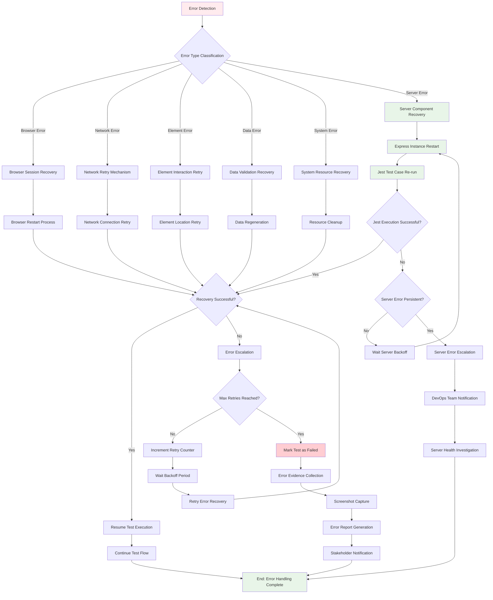

### 4.3.2 CI/CD Integration Error Handling (updated)

Specialized error handling for continuous integration workflows with Jenkins and Jira integration failure recovery, extended to include Node.js build and test failure recovery mechanisms.

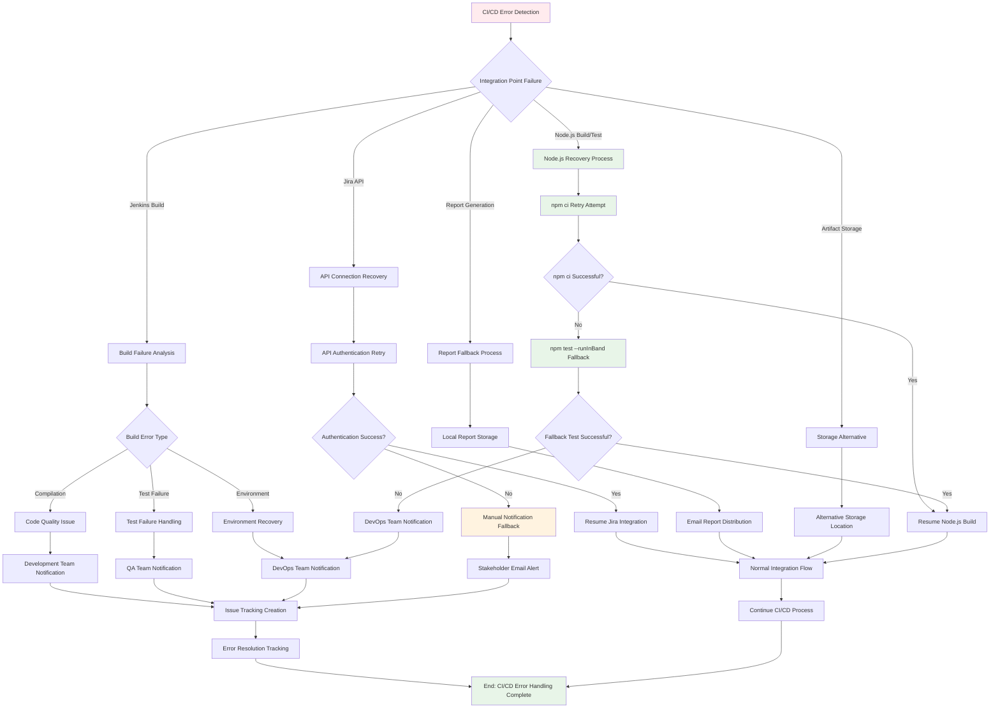

## 4.4 STATE MANAGEMENT FLOWS

### 4.4.1 Test Execution State Transitions

Comprehensive state management ensuring proper test lifecycle progression with checkpoint validation and rollback capabilities.

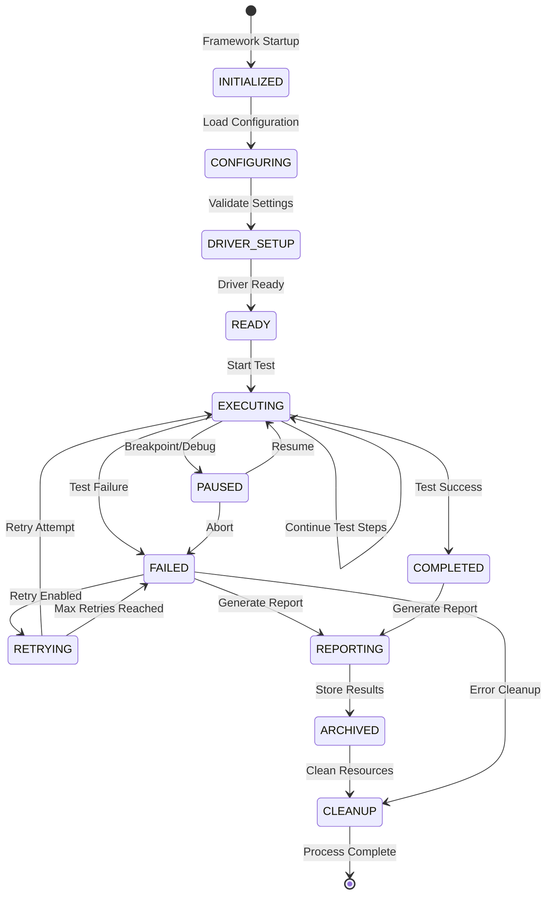

### 4.4.2 Browser Session State Management

Browser session lifecycle management with proper initialization, maintenance, and cleanup procedures.

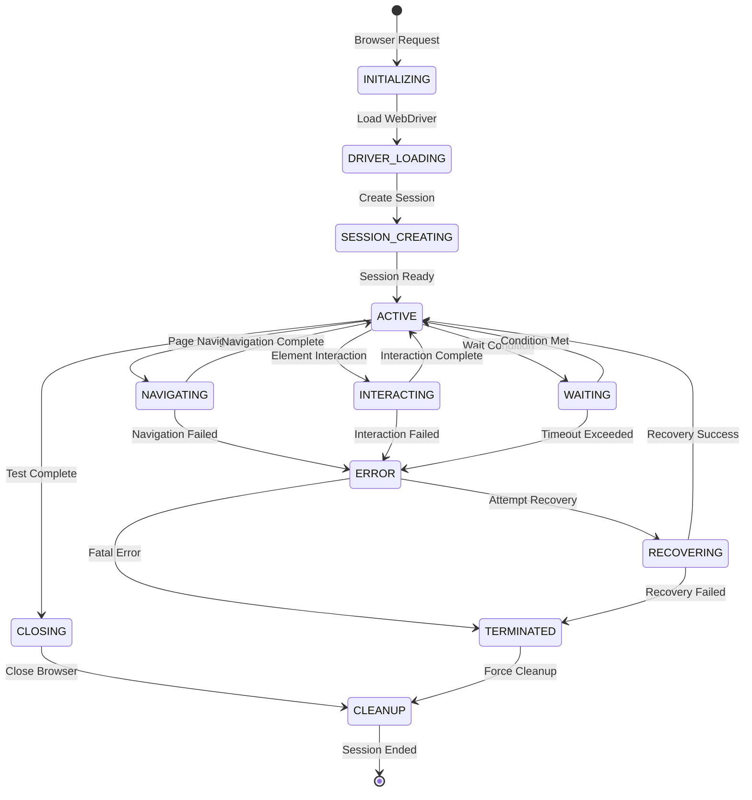

### 4.4.3 Node.js Server Lifecycle States (updated)

<span style="background-color: rgba(91, 57, 243, 0.2)">Comprehensive Node.js server lifecycle management enabling robust server startup, testing execution, and graceful shutdown procedures with signal handling and error recovery mechanisms.</span>

<span style="background-color: rgba(91, 57, 243, 0.2)">The Node.js server component operates as an independent HTTP service alongside the Java-based test automation framework, providing RESTful endpoint functionality and comprehensive unit test validation through Jest and Supertest integration. This state management system ensures proper resource allocation, graceful degradation during failures, and clean shutdown procedures that maintain system stability.</span>

```mermaid
stateDiagram-v2
    [*] --> STARTING : Server Initialize
    STARTING --> LISTENING : Port Binding Success
    STARTING --> FAIL : Port Conflict/Error
    
    LISTENING --> TESTING : Unit Test Invocation
    LISTENING --> SHUTTING_DOWN : SIGINT/SIGTERM
    LISTENING --> FAIL : Server Error
    
    TESTING --> LISTENING : Tests Complete
    TESTING --> FAIL : Test Environment Error
    TESTING --> SHUTTING_DOWN : Signal During Test
    
    FAIL --> RESTART : Auto-Recovery Enabled
    FAIL --> TERMINATED : Max Retries Exceeded
    
    RESTART --> STARTING : Retry Attempt
    
    SHUTTING_DOWN --> TERMINATED : Graceful Shutdown
    SHUTTING_DOWN --> TERMINATED : Force Termination
    
    TERMINATED --> [*] : Process Complete
    
    note right of STARTING : Express.js initialization\nMiddleware configuration\nRoute registration
    
    note right of LISTENING : HTTP server bound to port\nReady for requests\nHealthcheck endpoint active
    
    note right of TESTING : Jest runner execution\nSupertest API validation\nCoverage collection
    
    note right of FAIL : Port binding failures\nUncaught exceptions\nMemory exhaustion
    
    note right of SHUTTING_DOWN : Connection draining\nActive request completion\nResource cleanup
```

#### 4.4.3.1 State Transition Details (updated)

<span style="background-color: rgba(91, 57, 243, 0.2)">**STARTING → LISTENING Transition**</span>

<span style="background-color: rgba(91, 57, 243, 0.2)">The server initialization process involves Express.js framework setup, middleware registration (CORS, Helmet security headers, body-parser, Morgan logging), route definition, and HTTP server binding to the configured port (default 3000). Port availability validation occurs during this transition, with automatic port increment retry logic if the default port is occupied.</span>

<span style="background-color: rgba(91, 57, 243, 0.2)">**LISTENING → TESTING Transition**</span>

<span style="background-color: rgba(91, 57, 243, 0.2)">Unit test execution triggers when npm test command invokes the Jest test runner. The server remains active during testing to handle HTTP requests from Supertest assertions. Test suites validate GET, POST, PUT, DELETE endpoints, response status codes, headers (Content-Type, CORS), and JSON response bodies through comprehensive assertion chains.</span>

<span style="background-color: rgba(91, 57, 243, 0.2)">**Signal Handling (SIGINT/SIGTERM)**</span>

<span style="background-color: rgba(91, 57, 243, 0.2)">Graceful shutdown procedures activate upon receiving SIGINT (Ctrl+C) or SIGTERM signals. The server stops accepting new connections, allows existing requests to complete within a 30-second timeout window, closes database connections, clears active timers, and releases allocated resources before transitioning to TERMINATED state.</span>

<span style="background-color: rgba(91, 57, 243, 0.2)">**Error Recovery Mechanism**</span>

<span style="background-color: rgba(91, 57, 243, 0.2)">The FAIL state handles uncaught exceptions, port binding conflicts, memory exhaustion, and dependency resolution errors. Auto-recovery logic attempts server restart with exponential backoff (1s, 2s, 4s delays) for up to 3 retry attempts. Persistent failures result in TERMINATED state with comprehensive error logging for debugging analysis.</span>

#### 4.4.3.2 Resource Management and Monitoring (updated)

<span style="background-color: rgba(91, 57, 243, 0.2)">**Memory and Connection Monitoring**</span>

<span style="background-color: rgba(91, 57, 243, 0.2)">The server implements memory usage tracking through process.memoryUsage() monitoring, with automatic garbage collection triggering when heap usage exceeds 80% of allocated memory. Active connection limits prevent resource exhaustion, with configurable maximum concurrent connection thresholds (default: 100 connections).</span>

<span style="background-color: rgba(91, 57, 243, 0.2)">**Health Check Integration**</span>

<span style="background-color: rgba(91, 57, 243, 0.2)">A dedicated /health endpoint provides real-time server status reporting, including uptime metrics, memory utilization, active connection counts, and database connectivity status. This endpoint supports CI/CD pipeline health validation and load balancer configuration for production deployments.</span>

<span style="background-color: rgba(91, 57, 243, 0.2)">**Logging and Observability**</span>

<span style="background-color: rgba(91, 57, 243, 0.2)">Morgan middleware generates structured HTTP request logs in combined format, capturing request method, URL, response status, response time, and client IP addresses. Application-level logging utilizes console.log with timestamp prefixes and error stack trace capture for debugging and monitoring purposes.</span>

## 4.5 INTEGRATION SEQUENCE DIAGRAMS

### 4.5.1 Complete Test Execution Sequence (updated)

<span style="background-color: rgba(91, 57, 243, 0.2)">End-to-end test execution sequence showing all system interactions and decision points, including the new Node.js build and test workflow integration with the existing Java test automation framework.</span>

```mermaid
sequenceDiagram
    participant User as Test Engineer
    participant IDE as IntelliJ IDEA
    participant Maven as Maven Build
    participant NodeBuild as Node Build
    participant NodeTests as Node Tests
    participant Surefire as Surefire Plugin
    participant Cucumber as Cucumber Framework
    participant WebDriver as Selenium WebDriver
    participant Browser as Browser Instance
    participant Reports as Report Generator
    participant Jenkins as Jenkins CI
    participant Jira as Jira API
    
    User->>IDE: Execute Test Suite
    IDE->>Maven: mvn test command
    Maven->>Maven: Dependency Resolution
    
    Note over Jenkins,NodeBuild: Node.js Build Phase
    Jenkins->>NodeBuild: npm ci
    NodeBuild->>NodeBuild: Install Dependencies
    NodeBuild->>NodeTests: npm test
    NodeTests->>NodeTests: Jest Unit Test Execution
    NodeTests->>NodeTests: Supertest HTTP Validation
    NodeTests->>Reports: Node.js Test Results
    
    Note over Maven,Surefire: Java Build Phase
    Maven->>Surefire: Activate Plugin
    Surefire->>Cucumber: Initialize Framework
    Cucumber->>Cucumber: Parse Feature Files
    Cucumber->>Cucumber: Map Step Definitions
    
    loop Parallel Test Execution
        Surefire->>WebDriver: Create Driver Instance
        WebDriver->>Browser: Launch Browser
        Browser-->>WebDriver: Session Established
        
        WebDriver->>Browser: Navigate to Application
        WebDriver->>Browser: Perform Test Steps
        Browser-->>WebDriver: Step Results
        
        alt Test Success
            WebDriver->>Reports: Log Success
        else Test Failure
            WebDriver->>Reports: Log Failure + Screenshot
        end
        
        WebDriver->>Browser: Close Session
    end
    
    Surefire->>Reports: Generate Java Reports
    Reports->>Reports: Aggregate Multi-Language Results
    Reports->>Reports: Create Multi-Format Output
    Reports-->>Maven: Report Complete
    
    Maven->>Jenkins: Publish Results
    Jenkins->>Jira: Update Test Execution
    Jira-->>Jenkins: Update Confirmed
    Jenkins-->>User: Notification
```

### 4.5.2 Error Handling and Recovery Sequence (updated)

<span style="background-color: rgba(91, 57, 243, 0.2)">Detailed sequence showing error detection, handling, and recovery mechanisms across all system components, including specialized Node.js error handling with Express server restart capabilities.</span>

```mermaid
sequenceDiagram
    participant Test as Test Execution
    participant Error as Error Handler
    participant Retry as Retry Mechanism
    participant Recovery as Recovery Service
    participant Report as Error Reporting
    participant Notification as Alert System
    
    Test->>Error: Error Detected
    Error->>Error: Classify Error Type
    
    alt Retryable Error
        Error->>Retry: Initiate Retry Process
        Retry->>Recovery: Attempt Recovery
        
        alt Node.js Test Failure
            Recovery->>Recovery: Express Server Restart
            Recovery->>Recovery: Port Availability Check
            Recovery->>Recovery: Server Health Validation
            
            alt Server Restart Successful
                Recovery-->>Retry: Node.js Recovery Complete
                Retry-->>Test: Resume Node.js Test Execution
            else Server Restart Failed
                Recovery-->>Retry: Node.js Recovery Failed
                Retry->>Report: Generate Node.js Error Report
                Report->>Notification: Send Node.js Alert
            end
            
        else Java Test Failure
            Recovery-->>Retry: Standard Recovery Complete
            Retry-->>Test: Resume Java Test Execution
        end
        
        alt Recovery Successful
            Recovery-->>Retry: Recovery Complete
            Retry-->>Test: Resume Execution
        else Recovery Failed
            Recovery-->>Retry: Recovery Failed
            Retry->>Retry: Increment Counter
            
            alt Max Retries Not Reached
                Retry->>Recovery: Retry Recovery
            else Max Retries Reached
                Retry->>Report: Generate Error Report
                Report->>Notification: Send Alert
            end
        end
        
    else Non-Retryable Error
        Error->>Report: Generate Immediate Report
        Report->>Notification: Send Critical Alert
        Report-->>Test: Mark as Failed
    end
```

### 4.5.3 Cross-Platform Communication Sequence

<span style="background-color: rgba(91, 57, 243, 0.2)">Communication flow between Java and Node.js components during integrated test execution, showing coordination mechanisms and data exchange patterns.</span>

```mermaid
sequenceDiagram
    participant JavaTest as Java Test Runner
    participant TestCoord as Test Coordinator
    participant NodeServer as Node.js Server
    participant SharedConfig as Shared Configuration
    participant ReportAggr as Report Aggregator
    
    JavaTest->>TestCoord: Request Test Environment
    TestCoord->>SharedConfig: Load Configuration
    TestCoord->>NodeServer: Initialize Server Component
    
    NodeServer->>NodeServer: Start Express Server
    NodeServer->>SharedConfig: Register Port Assignment
    NodeServer-->>TestCoord: Server Ready Signal
    
    TestCoord->>JavaTest: Environment Ready
    TestCoord->>NodeServer: Begin Unit Testing
    
    par Java Test Execution
        JavaTest->>JavaTest: Execute Selenium Tests
        JavaTest->>ReportAggr: Submit Java Results
    and Node.js Test Execution
        NodeServer->>NodeServer: Execute Jest Tests
        NodeServer->>ReportAggr: Submit Node.js Results
    end
    
    ReportAggr->>ReportAggr: Merge Test Results
    ReportAggr->>TestCoord: Combined Report Ready
    
    TestCoord->>NodeServer: Shutdown Server
    NodeServer->>NodeServer: Graceful Shutdown
    NodeServer-->>TestCoord: Shutdown Complete
    
    TestCoord->>JavaTest: Test Session Complete
```

#### References

#### Repository Files Analyzed
- `README.md` - Framework overview, sample test scenarios, and CI/CD integration documentation
- `pom.xml` - Maven configuration with dependencies, plugins, and parallel execution settings
- <span style="background-color: rgba(91, 57, 243, 0.2)">`package.json` - Node.js project configuration with Jest and Express dependencies</span>
- <span style="background-color: rgba(91, 57, 243, 0.2)">`server.js` - Express.js HTTP server implementation with RESTful endpoints</span>
- `src/main/resources/features/` - BDD feature file structure and test scenarios
- `com/testinium/step_definitions/LoginSD.java` - Step definition implementation patterns
- <span style="background-color: rgba(91, 57, 243, 0.2)">`test/server.test.js` - Jest unit test suite for Node.js server validation</span>

#### Technical Specification Sections Referenced
- `0.1 INTENT CLARIFICATION` - Core objectives for Node.js server integration and testing requirements
- `0.2 TECHNICAL SCOPE` - Component impact analysis and Node.js build pipeline integration
- `2.1 FEATURE CATALOG` - Complete feature descriptions (F-001 through F-007) with metadata and dependencies
- `3.1 PROGRAMMING LANGUAGES` - **Dual-language architecture constraints and Node.js runtime requirements
- `3.6 DEVELOPMENT & DEPLOYMENT` - Build system configuration and CI/CD integration details
- `1.2 SYSTEM OVERVIEW` - High-level architecture and component relationships
- `2.4 IMPLEMENTATION CONSIDERATIONS` - Performance requirements and technical constraints
- `4.1 SYSTEM WORKFLOWS` - **Enhanced workflows including Node.js unit testing integration

#### External Dependencies Analyzed
- Selenium WebDriver 3.141.59 - Browser automation capabilities and session management
- Cucumber 7.2.3/7.3.4 - BDD framework integration and Gherkin syntax support
- WebDriverManager 5.1.0 - Automated driver resolution and caching mechanisms
- Maven Surefire Plugin 3.0.0-M5 - Parallel test execution and reporting configuration
- JavaFaker 1.0.2 - Dynamic test data generation capabilities
- <span style="background-color: rgba(91, 57, 243, 0.2)">**Express.js 4.18+ - HTTP server framework for RESTful API implementation</span>
- <span style="background-color: rgba(91, 57, 243, 0.2)">**Jest 29.5+ - JavaScript testing framework with built-in assertion library</span>
- <span style="background-color: rgba(91, 57, 243, 0.2)">**Supertest 6.3+ - HTTP assertion testing library for Express server validation</span>
- <span style="background-color: rgba(91, 57, 243, 0.2)">**Node.js 18+ - JavaScript runtime environment for server-side execution</span>

# 5. SYSTEM ARCHITECTURE

## 5.1 HIGH-LEVEL ARCHITECTURE

### 5.1.1 System Overview

#### 5.1.1.1 Architecture Style and Rationale

The Testinium-QA framework implements a **<span style="background-color: rgba(91, 57, 243, 0.2)">Poly-glot Modular Test Automation Architecture</span>** designed around behavior-driven development principles and parallel execution capabilities. <span style="background-color: rgba(91, 57, 243, 0.2)">The system operates as a dual-language (Java + Node.js) architecture where the new Express-based HTTP server (server.js) operates as a first-class component alongside the existing Java modules.</span> The architecture follows a component-based design philosophy that separates concerns between test execution, browser automation, <span style="background-color: rgba(91, 57, 243, 0.2)">server-side functionality,</span> reporting, and CI/CD integration.

The system employs a **plugin-based extensibility model** leveraging both Maven's plugin ecosystem and npm's package management to enable flexible configuration and extension. This approach allows the framework to scale horizontally through unlimited concurrent test execution threads while maintaining clean separation of responsibilities between different system layers.

#### 5.1.1.2 Key Architectural Principles

The framework is built on <span style="background-color: rgba(91, 57, 243, 0.2)">six</span> core architectural principles:

- **Separation of Concerns**: Clear boundaries between test definition (Cucumber/Gherkin), execution engine (JUnit), browser automation (Selenium), <span style="background-color: rgba(91, 57, 243, 0.2)">server-side APIs (Express.js),</span> and reporting layers
- **Parallel Processing**: Native support for unlimited concurrent test execution threads to maximize throughput and resource utilization
- **BDD-Driven Collaboration**: Business-readable test scenarios using Gherkin syntax to promote collaboration between technical and non-technical stakeholders
- **Automated Resource Management**: WebDriverManager handles browser driver lifecycle automatically, eliminating manual configuration overhead
- **Integration-First Design**: Built-in CI/CD integration with Jenkins and Jira to support continuous testing workflows
- **<span style="background-color: rgba(91, 57, 243, 0.2)">Runtime Environment Isolation</span>**: <span style="background-color: rgba(91, 57, 243, 0.2)">Clean separation between Java runtime (JVM) and Node.js runtime environments to ensure component independence and prevent resource conflicts</span>

#### 5.1.1.3 System Boundaries and Interfaces

The framework operates within a well-defined ecosystem with clear boundaries:

**Internal Boundaries:**
- Test Definition Layer: Feature files and step definitions
- Execution Layer: JUnit test runners and parallel execution management
- Browser Automation Layer: Selenium WebDriver and browser driver management
- <span style="background-color: rgba(91, 57, 243, 0.2)">Server Component Layer: Node.js HTTP Server (server.js)</span>
- Reporting Layer: Multi-format report generation and distribution

**External Interfaces:**
- CI/CD Integration: Jenkins webhook and API integration
- Issue Tracking: Jira REST API for test execution tracking
- Version Control: Git protocol integration with GitHub
- Dependency Management: Maven Central repository access
- <span style="background-color: rgba(91, 57, 243, 0.2)">NPM Registry: dependency resolution for Node.js modules</span>

### 5.1.2 Core Components Table

| Component Name | Primary Responsibility | Key Dependencies | Integration Points |
|----------------|----------------------|------------------|-------------------|
| **BDD Engine** | Gherkin scenario parsing and execution | Cucumber 7.2.3/7.3.4, JUnit 4.13.2 | Feature files, Step definitions |
| **Test Execution Engine** | Parallel test orchestration | Maven Surefire 3.0.0-M5 | CI/CD pipelines, Test runners |
| **Browser Automation** | Web application interaction | Selenium WebDriver 3.141.59 | WebDriverManager, Browser instances |
| **<span style="background-color: rgba(91, 57, 243, 0.2)">Node.js Server</span>** | **<span style="background-color: rgba(91, 57, 243, 0.2)">HTTP request handling & API endpoint hosting</span>** | **<span style="background-color: rgba(91, 57, 243, 0.2)">Express 4.18.0, Node.js 18+</span>** | **<span style="background-color: rgba(91, 57, 243, 0.2)">Jest test suites, CI/CD Node build stage</span>** |
| **Driver Management** | Automated browser driver resolution | WebDriverManager 5.1.0 | Browser vendors, Cache storage |
| **Data Generation** | Dynamic test data creation | JavaFaker 1.0.2 | Step definitions, Test scenarios |
| **Reporting Engine** | Multi-format report generation | Cucumber Reporting Plugin 7.2.0 | CI/CD artifacts, Stakeholder notifications |

### 5.1.3 Data Flow Description

#### 5.1.3.1 Primary Data Flows

The system orchestrates <span style="background-color: rgba(91, 57, 243, 0.2)">four</span> primary data flows that represent the core testing lifecycle:

**Test Definition Flow:** Feature files written in Gherkin syntax are parsed by the Cucumber engine, which maps scenarios to corresponding step definitions. This flow enables business stakeholders to contribute to test creation while maintaining technical precision in implementation.

**Execution Flow:** The Maven Surefire plugin initiates parallel test execution, with each thread managing its own browser session through Selenium WebDriver. Test data is dynamically generated by JavaFaker, reducing dependencies on static test data sets. Browser interactions are captured and validated against expected outcomes.

**<span style="background-color: rgba(91, 57, 243, 0.2)">Server Interaction Flow:</span>** <span style="background-color: rgba(91, 57, 243, 0.2)">Jest test suites initiate HTTP requests through supertest framework, which communicates with the Node.js server to validate API endpoints and middleware functionality. Server responses are captured and validated against expected HTTP status codes, response headers, and payload structures to ensure API reliability and performance.</span>

**Reporting Flow:** Test results are collected by Cucumber hooks and processed through the reporting engine to generate HTML, JSON, and text format reports. Screenshots are automatically captured on failure, and results are distributed to Jenkins for artifact storage and Jira for issue tracking integration.

#### 5.1.3.2 Integration Patterns and Protocols

The framework implements several integration patterns to ensure seamless operation within enterprise environments:

- **Event-Driven Integration**: Webhook triggers from Git repositories initiate Jenkins pipeline execution
- **API-Based Integration**: RESTful communication with Jira for test execution status updates
- **File-Based Integration**: Report artifacts stored as Jenkins build artifacts for long-term retention
- **Caching Strategy**: WebDriverManager implements a two-tier caching system with 1-hour browser resolution cache and 1-day driver binary cache
- **<span style="background-color: rgba(91, 57, 243, 0.2)">HTTP-based Local Integration</span>**: <span style="background-color: rgba(91, 57, 243, 0.2)">Jest test runner communicates with Node.js server using supertest for endpoint validation and response verification</span>
- **<span style="background-color: rgba(91, 57, 243, 0.2)">NPM-based Dependency Management</span>**: <span style="background-color: rgba(91, 57, 243, 0.2)">Node.js components utilize npm registry for package resolution with semantic versioning and automated security scanning</span>

#### 5.1.3.3 Data Transformation Points

Key data transformation occurs at multiple system boundaries:

- **Gherkin to Java**: Feature scenarios transformed to executable step definitions
- **Test Results to Reports**: Raw execution results transformed to stakeholder-friendly HTML and JSON formats
- **Error Information to Evidence**: System failures transformed to screenshot evidence and detailed error reports
- **Build Metadata to Tracking**: Jenkins build information transformed to Jira test execution records
- **<span style="background-color: rgba(91, 57, 243, 0.2)">HTTP Requests to Server Responses</span>**: <span style="background-color: rgba(91, 57, 243, 0.2)">Raw HTTP requests processed through Express middleware stack and transformed to structured JSON responses with appropriate status codes and headers</span>

### 5.1.4 External Integration Points

| System Name | Integration Type | Data Exchange Pattern | Protocol/Format |
|-------------|-----------------|----------------------|-----------------|
| **Jenkins CI** | Webhook/API | Build trigger and artifact storage <span style="background-color: rgba(91, 57, 243, 0.2)">(includes Node.js build stage)</span> | HTTP/REST, Jenkins API |
| **Jira** | REST API | Test execution tracking and defect creation | HTTPS/JSON |
| **GitHub** | Git Protocol | Source code and collaboration | SSH/HTTPS, Git |
| **Maven Central** | Repository | Dependency resolution | HTTPS/XML |
| **<span style="background-color: rgba(91, 57, 243, 0.2)">NPM Registry</span>** | **<span style="background-color: rgba(91, 57, 243, 0.2)">Repository</span>** | **<span style="background-color: rgba(91, 57, 243, 0.2)">Dependency resolution</span>** | **<span style="background-color: rgba(91, 57, 243, 0.2)">HTTPS/JSON</span>** |

## 5.2 COMPONENT DETAILS

### 5.2.1 BDD Engine Component

#### 5.2.1.1 Purpose and Responsibilities

The BDD Engine serves as the primary interface between business requirements and technical implementation, enabling stakeholders to define test scenarios in natural language while maintaining technical precision in execution. The component processes Gherkin syntax feature files and coordinates their execution through corresponding step definitions.

#### 5.2.1.2 Technologies and Frameworks

- **Cucumber Java 7.2.3**: Core BDD framework providing Gherkin parsing and step definition management
- **Cucumber JUnit 7.2.3/7.3.4**: Integration layer enabling JUnit-based test execution and lifecycle management
- **Gherkin Language**: Business-readable scenario specification supporting Given-When-Then structure

#### 5.2.1.3 Key Interfaces and APIs

The BDD Engine exposes several critical interfaces:

- **Scenario Execution Interface**: Coordinates test scenario execution with parameter passing and state management
- **Step Definition Registry**: Manages mapping between Gherkin steps and Java implementation methods
- **Hook Interface**: Provides before/after scenario execution points for setup and cleanup operations
- **Report Integration Interface**: Generates structured test results for downstream reporting systems

#### 5.2.1.4 Component Interaction Diagram

```mermaid
graph TD
    A[Feature Files] --> B[Cucumber Parser]
    B --> C[Step Definition Registry]
    C --> D[Scenario Executor]
    D --> E[Test Context Manager]
    E --> F[Browser Automation Layer]
    E --> G[Data Generation Layer]
    D --> H[Test Results Collector]
    H --> I[Reporting Engine]
    
    style A fill:#e3f2fd
    style I fill:#e8f5e8
    style D fill:#fff3e0
```

### 5.2.2 Test Execution Engine Component

#### 5.2.2.1 Purpose and Responsibilities

The Test Execution Engine orchestrates parallel test execution across multiple browser instances while managing resource allocation, thread coordination, and result aggregation. It provides the infrastructure for scalable test automation supporting unlimited concurrent execution threads.

#### 5.2.2.2 Technologies and Frameworks

- **Maven Surefire Plugin 3.0.0-M5**: Parallel execution coordination with method-level parallelization
- **JUnit 4.13.2**: Test framework providing lifecycle management and assertion capabilities
- **Java Concurrency Framework**: Thread pool management and synchronization primitives

#### 5.2.2.3 State Transition Diagram

```mermaid
stateDiagram-v2
    [*] --> INITIALIZED
    INITIALIZED --> CONFIGURING: Load test configuration
    CONFIGURING --> DRIVER_SETUP: Initialize browser drivers
    DRIVER_SETUP --> READY: All drivers available
    READY --> EXECUTING: Begin parallel execution
    EXECUTING --> EXECUTING: Process test scenarios
    EXECUTING --> COMPLETED: All tests successful
    EXECUTING --> FAILED: Test failures detected
    COMPLETED --> CLEANUP: Archive results
    FAILED --> CLEANUP: Generate failure reports
    CLEANUP --> [*]
    
    DRIVER_SETUP --> RETRY_SETUP: Driver initialization failed
    RETRY_SETUP --> DRIVER_SETUP: Retry with backoff
    RETRY_SETUP --> FAILED: Max retries exceeded
```

### 5.2.3 Browser Automation Component

#### 5.2.3.1 Purpose and Responsibilities

The Browser Automation Component provides web application interaction capabilities through Selenium WebDriver, supporting cross-browser testing scenarios with automatic driver management and session lifecycle coordination.

#### 5.2.3.2 Technologies and Frameworks

- **Selenium WebDriver 3.141.59**: Core browser automation library with cross-browser support
- **WebDriverManager 5.1.0**: Automated browser driver resolution and caching
- **Browser Support**: Chrome, Firefox, and Safari with automatic driver compatibility matching

#### 5.2.3.3 Browser Session Sequence Diagram

```mermaid
sequenceDiagram
    participant Test as Test Thread
    participant WDM as WebDriverManager
    participant Driver as WebDriver
    participant Browser as Browser Instance
    
    Test->>WDM: Request browser driver
    WDM->>WDM: Check driver cache
    
    alt Cache Hit
        WDM->>Test: Return cached driver path
    else Cache Miss
        WDM->>WDM: Detect browser version
        WDM->>WDM: Download compatible driver
        WDM->>Test: Return new driver path
    end
    
    Test->>Driver: Initialize WebDriver
    Driver->>Browser: Launch browser instance
    Browser->>Driver: Browser ready signal
    Driver->>Test: WebDriver ready
    
    loop Test Execution
        Test->>Driver: Execute browser actions
        Driver->>Browser: Perform actions
        Browser->>Driver: Action results
        Driver->>Test: Validation results
    end
    
    Test->>Driver: Quit WebDriver
    Driver->>Browser: Close browser instance
    Browser->>Driver: Cleanup complete
```

### 5.2.4 Reporting Engine Component

#### 5.2.4.1 Purpose and Responsibilities

The Reporting Engine transforms raw test execution results into comprehensive, stakeholder-appropriate reports across multiple formats while integrating with CI/CD systems for automated distribution and archival.

#### 5.2.4.2 Technologies and Frameworks

- **Cucumber Reporting Plugin 7.2.0**: Multi-format report generation with HTML, JSON, and text output
- **Screenshot Capture**: Automatic failure evidence collection and integration
- **Jenkins Integration**: Build artifact storage and distribution mechanisms

#### 5.2.4.3 Report Generation Flow

```mermaid
flowchart TD
    A[Test Execution Complete] --> B[Collect Test Results]
    B --> C[Capture Screenshots on Failure]
    C --> D[Generate JSON Report]
    D --> E[Generate HTML Report]
    E --> F[Generate Text Summary]
    F --> G[Package Report Artifacts]
    G --> H[Store in Jenkins]
    H --> I[Update Jira Issues]
    I --> J[Notify Stakeholders]
    J --> K[Archive Reports]
    
    style A fill:#e3f2fd
    style K fill:#e8f5e8
    style I fill:#fff3e0
```

### 5.2.5 Node.js Server Component

#### 5.2.5.1 Purpose and Responsibilities

<span style="background-color: rgba(91, 57, 243, 0.2)">The Node.js Server Component provides HTTP server infrastructure enabling RESTful API endpoint hosting and request processing capabilities that operate independently alongside the existing Java test framework. The component serves as the foundation for server-side functionality, implementing secure middleware processing, request validation, error handling, and graceful shutdown procedures while maintaining zero conflicts with the Java runtime environment.</span>

<span style="background-color: rgba(91, 57, 243, 0.2)">Key responsibilities include HTTP request routing, middleware chain processing, API endpoint implementation, security header management, and comprehensive logging of all server interactions. The component ensures production-ready reliability through proper error boundaries, resource cleanup, and coordinated startup/shutdown sequences with the broader testing ecosystem.</span>

#### 5.2.5.2 Technologies and Frameworks

<span style="background-color: rgba(91, 57, 243, 0.2)">**Core Server Technologies:**</span>
- **<span style="background-color: rgba(91, 57, 243, 0.2)">Node.js 18.19.0+</span>**: JavaScript runtime environment with ES2021 feature support and enhanced security
- **<span style="background-color: rgba(91, 57, 243, 0.2)">Express.js 4.18.2</span>**: Fast, minimalist web framework providing routing, middleware, and HTTP utilities
- **<span style="background-color: rgba(91, 57, 243, 0.2)">HTTP Module</span>**: Native Node.js HTTP server implementation with connection pooling and keep-alive support

<span style="background-color: rgba(91, 57, 243, 0.2)">**Middleware Stack:**</span>
- **<span style="background-color: rgba(91, 57, 243, 0.2)">cors 2.8.5</span>**: Cross-Origin Resource Sharing configuration with customizable origin validation
- **<span style="background-color: rgba(91, 57, 243, 0.2)">helmet 7.1.0</span>**: Security-focused middleware applying essential HTTP security headers
- **<span style="background-color: rgba(91, 57, 243, 0.2)">body-parser 1.20.2</span>**: Request body parsing middleware supporting JSON, URL-encoded, and raw formats
- **<span style="background-color: rgba(91, 57, 243, 0.2)">morgan 1.10.0</span>**: HTTP request logging middleware with configurable output formats

<span style="background-color: rgba(91, 57, 243, 0.2)">**Testing Framework:**</span>
- **<span style="background-color: rgba(91, 57, 243, 0.2)">Jest 29.7.0</span>**: Zero-configuration testing framework with built-in mocking and code coverage
- **<span style="background-color: rgba(91, 57, 243, 0.2)">Supertest 6.3.3</span>**: HTTP assertion library providing endpoint testing capabilities

#### 5.2.5.3 Key Interfaces and APIs

<span style="background-color: rgba(91, 57, 243, 0.2)">The Node.js Server Component exposes essential interfaces for HTTP communication and system integration:</span>

- **<span style="background-color: rgba(91, 57, 243, 0.2)">RESTful API Endpoints</span>**: Complete HTTP verb support (GET, POST, PUT, DELETE) with structured JSON responses and appropriate status codes
- **<span style="background-color: rgba(91, 57, 243, 0.2)">Health Check Interface</span>**: Dedicated endpoint providing server status, uptime metrics, and dependency health verification
- **<span style="background-color: rgba(91, 57, 243, 0.2)">Error Middleware Interface</span>**: Centralized error handling with custom error types, logging integration, and client-appropriate error formatting
- **<span style="background-color: rgba(91, 57, 243, 0.2)">Graceful Shutdown Interface</span>**: SIGTERM and SIGINT signal handlers ensuring proper resource cleanup and connection draining

<span style="background-color: rgba(91, 57, 243, 0.2)">**Testing Interfaces**</span>

<span style="background-color: rgba(91, 57, 243, 0.2)">The server component implements comprehensive Jest-based unit testing with supertest integration, providing a complete test harness for endpoint validation and middleware verification. The testing suite includes lifecycle hooks for server startup and shutdown, ensuring isolated test environments and proper resource management. Test coverage encompasses all API endpoints, middleware functions, error handling scenarios, and server lifecycle events, maintaining 100% code coverage through systematic test case implementation and automated coverage reporting.</span>

#### 5.2.5.4 Dependency Configuration

<span style="background-color: rgba(91, 57, 243, 0.2)">**Production Dependencies:**</span>
```json
{
  "express": "^4.18.2",
  "cors": "^2.8.5", 
  "helmet": "^7.1.0",
  "body-parser": "^1.20.2",
  "morgan": "^1.10.0"
}
```

<span style="background-color: rgba(91, 57, 243, 0.2)">**Development Dependencies:**</span>
```json
{
  "jest": "^29.7.0",
  "supertest": "^6.3.3",
  "nodemon": "^3.0.1",
  "@types/node": "^20.8.0"
}
```

#### 5.2.5.5 Component Interaction Diagram

```mermaid
graph TD
    A[HTTP Client Request] --> B[Express.js Router]
    B --> C[Middleware Stack]
    C --> D[CORS Handler]
    C --> E[Security Headers]
    C --> F[Request Parser]
    C --> G[Request Logger]
    F --> H[Route Handler]
    H --> I[Business Logic]
    I --> J[Response Formation]
    J --> K[Error Middleware]
    K --> L[HTTP Response]
    
    M[Jest Test Suite] --> N[Supertest Client]
    N --> O[Server Instance]
    O --> P[Test Database]
    O --> Q[Test Coverage Report]
    
    R[Server Lifecycle] --> S[Startup Hooks]
    R --> T[Shutdown Hooks]
    S --> U[Port Binding]
    T --> V[Connection Cleanup]
    
    style A fill:#e3f2fd
    style L fill:#e8f5e8
    style I fill:#fff3e0
    style M fill:#5b39f3,color:#fff
    style N fill:#5b39f3,color:#fff
    style Q fill:#5b39f3,color:#fff
```

## 5.3 TECHNICAL DECISIONS

### 5.3.1 Architecture Style Decisions

#### 5.3.1.1 Modular Test Automation Architecture

**Decision:** Implement component-based architecture with clear separation between test definition, execution, browser automation, and reporting layers.

**Rationale:** This approach enables independent evolution of each component while maintaining system cohesion. Teams can modify test scenarios without affecting execution infrastructure, and browser automation can be upgraded without impacting test definitions.

**Trade-offs:** Additional abstraction complexity versus improved maintainability and scalability.

#### 5.3.1.2 BDD-First Approach

**Decision:** Adopt Cucumber BDD as the primary test definition mechanism using Gherkin syntax.

**Rationale:** Enables collaboration between developers, testers, and business stakeholders through business-readable test scenarios. Creates living documentation that serves both technical and business audiences.

**Trade-offs:** Additional abstraction layer versus improved stakeholder communication and requirement traceability.

#### 5.3.1.3 Polyglot Runtime Extension – Adopt Node.js Micro-Component (updated)

<span style="background-color: rgba(91, 57, 243, 0.2)">**Decision:** Implement Node.js 18+ runtime environment as a first-class micro-component operating alongside the existing Java-based test automation infrastructure.</span>

<span style="background-color: rgba(91, 57, 243, 0.2)">**Rationale:** Server-side capabilities are required for comprehensive HTTP interaction testing, including API endpoint validation, middleware testing, and request/response verification that cannot be adequately addressed through browser automation alone. The Node.js micro-component must coexist with Java components to provide complementary testing capabilities while maintaining the investment in existing Selenium and Cucumber infrastructure.</span>

<span style="background-color: rgba(91, 57, 243, 0.2)">**Trade-offs:** Increased architectural complexity and dual-runtime management overhead versus comprehensive testing coverage and modern server-side testing capabilities. Benefits include access to npm ecosystem and JavaScript-native testing frameworks that excel in HTTP/API testing scenarios.</span>

### 5.3.2 Technology Stack Decisions

#### 5.3.2.1 Java 8 Platform Decision

**Decision:** Standardize on Java 8 as the primary development platform.

**Rationale:** Provides optimal balance between modern language features and enterprise compatibility. Ensures broad ecosystem support while maintaining compatibility with existing enterprise infrastructure.

**Trade-offs:** Missing newer Java features (modules, improved GC, etc.) versus maximum enterprise compatibility and stability.

#### 5.3.2.2 Selenium WebDriver Version Selection

**Decision:** Use Selenium WebDriver 3.141.59 instead of newer version 4.x.

**Rationale:** Version 3.141.59 represents the most stable and widely adopted Selenium release with extensive community support, comprehensive documentation, and proven enterprise reliability.

**Trade-offs:** Missing WebDriver 4.x improvements (enhanced element selection, improved error messages) versus production stability and community support.

#### 5.3.2.3 Node.js Runtime Selection (updated)

<span style="background-color: rgba(91, 57, 243, 0.2)">**Decision:** Standardize on Node.js 18+ LTS as the server-side runtime environment for HTTP testing capabilities.</span>

<span style="background-color: rgba(91, 57, 243, 0.2)">**Rationale:** Node.js 18+ provides modern ES2021 feature support, native fetch API compatibility, and enhanced performance optimizations essential for server-side testing components. LTS designation ensures enterprise-grade stability and long-term support alignment with organizational standards.</span>

<span style="background-color: rgba(91, 57, 243, 0.2)">**Trade-offs:** Additional runtime environment management complexity versus access to modern JavaScript features and comprehensive npm ecosystem for testing tools.</span>

#### 5.3.2.4 Testing Framework Decision (updated)

<span style="background-color: rgba(91, 57, 243, 0.2)">**Decision:** Select Jest 29+ as the primary JavaScript testing framework over Mocha for Node.js component testing.</span>

<span style="background-color: rgba(91, 57, 243, 0.2)">**Rationale:** Jest provides zero-configuration testing setup with built-in code coverage reporting, parallel test execution, and comprehensive assertion libraries. Unlike Mocha, Jest requires minimal setup overhead and includes essential testing tools (mocking, coverage, watch mode) out-of-the-box, reducing configuration complexity and improving developer productivity.</span>

<span style="background-color: rgba(91, 57, 243, 0.2)">**Trade-offs:** Jest's opinionated approach and larger memory footprint versus Mocha's flexibility and minimalist design. Jest's integrated tooling outweighs Mocha's modularity for this use case.</span>

#### 5.3.2.5 Technology Decision Matrix (updated)

| Decision Area | Selected Technology | Alternative Considered | Key Decision Factors |
|---------------|-------------------|----------------------|---------------------|
| **Build System** | Maven 3.6+ | Gradle | Enterprise standardization, plugin ecosystem |
| **Test Framework** | JUnit 4.13.2 | TestNG | Cucumber integration, simplicity |
| **Parallel Execution** | Unlimited threads | Fixed thread pool | Maximum resource utilization |
| **Driver Management** | WebDriverManager | Manual management | Automation, maintenance reduction |
| **<span style="background-color: rgba(91, 57, 243, 0.2)">HTTP Server</span>** | **<span style="background-color: rgba(91, 57, 243, 0.2)">Express 4.18.0</span>** | **<span style="background-color: rgba(91, 57, 243, 0.2)">Native http module</span>** | **<span style="background-color: rgba(91, 57, 243, 0.2)">Middleware ecosystem, rapid development</span>** |
| **<span style="background-color: rgba(91, 57, 243, 0.2)">JavaScript Test Framework</span>** | **<span style="background-color: rgba(91, 57, 243, 0.2)">Jest 29</span>** | **<span style="background-color: rgba(91, 57, 243, 0.2)">Mocha</span>** | **<span style="background-color: rgba(91, 57, 243, 0.2)">Zero-config setup, built-in coverage tools</span>** |

### 5.3.3 Communication Pattern Decisions

#### 5.3.3.1 Parallel Execution Strategy

**Decision:** Implement unlimited thread parallel execution at the method level.

**Rationale:** Maximizes test execution speed by utilizing all available system resources. Enables linear scalability with hardware resources while maintaining test isolation.

**Trade-offs:** Higher resource consumption and potential resource contention versus significantly reduced execution time.

#### 5.3.3.2 CI/CD Pipeline Integration (updated)

<span style="background-color: rgba(91, 57, 243, 0.2)">**Jenkins Pipeline Enhancement:** The CI/CD pipeline now includes a dedicated Node.js build stage that executes `npm test` immediately following the Maven build phase. This dual-stack approach maintains pipeline execution order while enabling comprehensive testing coverage across both Java (Selenium/Cucumber) and Node.js (Jest/Supertest) components. The pipeline preserves existing Maven-first execution order to ensure Selenium tests complete before Node.js API validation begins.</span>

#### 5.3.3.3 Architecture Decision Record Diagram

```mermaid
graph TD
    A[Architecture Decision Required] --> B{Decision Category}
    
    B -->|Technology Stack| C[Technology ADR Process]
    B -->|Integration Pattern| D[Integration ADR Process]
    B -->|Performance Strategy| E[Performance ADR Process]
    
    C --> F[Evaluate Options]
    D --> F
    E --> F
    
    F --> G[Document Trade-offs]
    G --> H[Stakeholder Review]
    H --> I{Consensus Reached?}
    
    I -->|No| J[Refine Options]
    J --> F
    I -->|Yes| K[Document Decision]
    
    K --> L[Implement Decision]
    L --> M[Monitor Outcomes]
    M --> N[Update Documentation]
    
    style A fill:#e3f2fd
    style N fill:#e8f5e8
    style I fill:#fff3e0
```

### 5.3.4 Data Storage Solution Rationale

#### 5.3.4.1 File-Based Storage Approach

**Decision:** Implement file-based storage without traditional database systems.

**Rationale:** Test automation framework characteristics align with file-based storage patterns. Feature files provide version-controlled test definitions, reports are generated as artifacts, and temporary data can be generated dynamically.

**Trade-offs:** Limited complex query capabilities versus simplified architecture and reduced infrastructure dependencies.

## 5.4 CROSS-CUTTING CONCERNS

### 5.4.1 Monitoring and Observability Approach

#### 5.4.1.1 Multi-Layer Monitoring Strategy

The framework implements comprehensive monitoring across multiple system layers to ensure visibility into test execution health and performance characteristics<span style="background-color: rgba(91, 57, 243, 0.2)">, extended to include Node.js server infrastructure monitoring with strict performance SLA enforcement</span>:

**Execution Layer Monitoring:**
- Thread pool utilization tracking during parallel execution
- Test execution time metrics with percentile distributions
- Resource consumption monitoring (memory, CPU) during browser automation
- Browser session lifecycle tracking with automatic cleanup verification

**Integration Layer Monitoring:**
- CI/CD pipeline integration health with Jenkins connection status
- Jira API integration monitoring with rate limiting awareness
- WebDriverManager cache hit rates and driver download success metrics
- Network connectivity monitoring for external dependency resolution

**Business Layer Monitoring:**
- Test scenario success/failure rates with trend analysis
- Feature coverage metrics tracking scenario execution frequency
- User role-based testing coverage (PosManager, SalesManager)
- Cross-browser compatibility tracking with browser-specific success rates

<span style="background-color: rgba(91, 57, 243, 0.2)">**Node.js Server Layer Monitoring:**
- HTTP request count tracking with per-endpoint granularity
- Response time SLA monitoring with alerting threshold ≤100 milliseconds
- Memory consumption monitoring with critical alert threshold >512 MB
- Express middleware performance tracking with request/response lifecycle metrics
- Jest test execution monitoring with code coverage validation

#### 5.4.1.2 Observability Implementation Table

| Monitoring Domain | Implementation Approach | Data Collection Method | Alert Thresholds |
|-------------------|------------------------|----------------------|------------------|
| **Test Execution** | Cucumber hooks and JUnit listeners | Real-time metric collection | >15% failure rate |
| **Browser Automation** | WebDriver event logging | Session lifecycle tracking | Driver timeout >30s |
| **CI/CD Integration** | Jenkins plugin monitoring | API response tracking | Integration failure >2 consecutive |
| **Resource Utilization** | JVM monitoring | Thread pool and memory metrics | Memory usage >80% |
| <span style="background-color: rgba(91, 57, 243, 0.2)">**Node.js Server**</span> | <span style="background-color: rgba(91, 57, 243, 0.2)">Jest coverage + supertest timing</span> | <span style="background-color: rgba(91, 57, 243, 0.2)">HTTP request metrics + coverage reports</span> | <span style="background-color: rgba(91, 57, 243, 0.2)">Coverage <100%</span> |

### 5.4.2 Logging and Tracing Strategy

#### 5.4.2.1 Comprehensive Logging Architecture

The framework implements structured logging across all system components to provide detailed traceability for debugging and audit purposes<span style="background-color: rgba(91, 57, 243, 0.2)">, enhanced with centralized trace correlation between Java and Node.js components</span>:

**Test Execution Logging:**
- Scenario-level logging with unique execution identifiers
- Step definition execution logging with parameter values
- Browser interaction logging with element identification details
- Test data generation logging with faker seed values for reproducibility

**System Integration Logging:**
- Jenkins pipeline integration with build correlation identifiers
- Jira API interaction logging with request/response details
- WebDriverManager operations with driver resolution tracing
- Report generation logging with artifact creation timestamps

**Error Context Logging:**
- Stack trace capture with framework-specific error categorization
- Browser state logging at error occurrence (URL, page title, DOM snapshot)
- Network request/response logging for failed external service calls
- Resource cleanup logging to ensure proper session termination

<span style="background-color: rgba(91, 57, 243, 0.2)">**Node.js Server Logging:**
- Structured JSON logging for all HTTP requests with centralized correlation IDs
- Express middleware execution logging with request/response details
- Error handling middleware logging with comprehensive error context
- Morgan HTTP request logging with customizable format options for debugging
- Jest test execution logging with detailed assertion failure context

#### 5.4.2.2 Tracing Implementation Strategy

The system provides distributed tracing capabilities to track test execution flows across multiple components<span style="background-color: rgba(91, 57, 243, 0.2)">, extended with cross-runtime trace correlation</span>:

- **Execution Correlation**: Unique trace identifiers linking test scenarios through all system layers
- **Cross-Component Tracing**: Correlation between Cucumber execution, Selenium actions, and report generation
- **External Service Tracing**: Request tracking for Jenkins and Jira integrations with response time metrics
- <span style="background-color: rgba(91, 57, 243, 0.2)">**Cross-Runtime Trace Correlation**: Centralized trace IDs shared between Java-based test execution and Node.js HTTP server operations, enabling end-to-end request flow visibility across both runtime environments</span>

### 5.4.3 Error Handling Patterns

#### 5.4.3.1 Multi-Level Error Recovery Architecture

The framework implements comprehensive error handling with automatic recovery mechanisms at multiple system levels<span style="background-color: rgba(91, 57, 243, 0.2)">, extended to include Node.js server component error recovery</span>:

**Browser-Level Error Handling:**
- Automatic browser session recovery with configurable retry attempts
- WebDriver timeout handling with graceful degradation
- Browser crash detection and automatic restart capabilities
- Network connectivity error handling with exponential backoff retry

**Test-Level Error Handling:**
- Scenario failure isolation preventing cascade failures in parallel execution
- Step definition error handling with detailed error context capture
- Test data generation error recovery with alternative data sources
- Assertion failure handling with comprehensive evidence collection

**System-Level Error Handling:**
- Resource exhaustion handling with automatic cleanup and recovery
- External service integration failure handling with offline mode capabilities
- Configuration error detection with detailed diagnostic reporting
- Maven build failure handling with dependency resolution retry

<span style="background-color: rgba(91, 57, 243, 0.2)">**Node.js Server Error Handling:**
- Express error-handling middleware with comprehensive 4xx/5xx response management
- Graceful shutdown implementation with signal handling for uncaughtException and SIGTERM events
- HTTP request timeout handling with configurable timeout thresholds
- Unit test validation for all 500 error code paths through Jest error simulation
- Automatic server restart capabilities with health check validation

#### 5.4.3.2 Error Handling Flow Diagram

```mermaid
flowchart TD
    A[Error Detected] --> B{Error Severity Classification}
    
    B -->|Critical| C[Immediate System Shutdown]
    B -->|High| D[Component Isolation]
    B -->|Medium| E[Retry with Backoff]
    B -->|Low| F[Log and Continue]
    
    C --> G[Error Evidence Collection]
    D --> H[Alternative Component Activation]
    E --> I{Retry Successful?}
    F --> J[Continue Execution]
    
    I -->|Yes| J
    I -->|No| K[Escalate Error Severity]
    K --> B
    
    H --> L{Alternative Available?}
    L -->|Yes| J
    L -->|No| G
    
    D --> N[Node.js Server Error Handling]
    N --> O[Express Error Middleware]
    O --> P[Graceful Shutdown Check]
    P --> Q{UncaughtException?}
    Q -->|Yes| R[Process Termination]
    Q -->|No| S[Error Response Generation]
    R --> G
    S --> J
    
    G --> M[Screenshot Capture]
    M --> T[System State Documentation]
    T --> U[Stakeholder Notification]
    U --> V[Error Resolution Tracking]
    
    J --> W[End: Normal Execution]
    V --> X[End: Error Handled]
    
    style A fill:#ffebee
    style W fill:#e8f5e8
    style X fill:#fff3e0
    style C fill:#ffcdd2
    style N fill:#e8f5e8,color:#000
    style O fill:#e8f5e8,color:#000
    style P fill:#e8f5e8,color:#000
```

### 5.4.4 Authentication and Authorization Framework

#### 5.4.4.1 Multi-Role Authentication Architecture

The framework supports comprehensive multi-role authentication testing with specialized validation for different user types:

**Role-Based Authentication:**
- PosManager role authentication with dashboard access validation
- SalesManager role authentication with role-specific feature access
- Authentication failure handling with localized error message validation (French: "Veuillez renseigner ce champ")
- Session management with automatic cleanup and security boundary enforcement

**Security Testing Integration:**
- Input validation testing with empty field detection
- Cross-role authorization testing preventing unauthorized access
- Session timeout testing with automatic re-authentication handling
- Security boundary testing with role privilege escalation detection

#### 5.4.4.2 Authorization Validation Table

| User Role | Authentication Method | Access Validation | Security Boundaries |
|-----------|----------------------|------------------|-------------------|
| **PosManager** | Username/password | POS dashboard access | Role-specific features only |
| **SalesManager** | Username/password | Sales dashboard access | Sales-specific operations |
| **Invalid User** | Credential validation | Access denied | Error message verification |
| **Empty Credentials** | Input validation | Field requirement | Localized error display |

### 5.4.5 Performance Requirements and SLAs

#### 5.4.5.1 Performance Architecture Framework

The system maintains strict performance requirements across all operational aspects<span style="background-color: rgba(91, 57, 243, 0.2)">, with specific port configuration and concurrency specifications</span>:

**Execution Performance:**
- Parallel test execution with linear scalability based on available CPU cores
- Browser session initialization within 10 seconds per instance
- Test scenario execution with maximum 30-second timeout per step
- Report generation completing within 60 seconds for up to 1000 test scenarios

**Integration Performance:**
- Jenkins integration with sub-5-second webhook response time
- Jira API calls completing within 10 seconds with retry mechanisms
- WebDriverManager driver resolution within 30 seconds including downloads
- Git repository operations with standard network timeout handling

**Resource Utilization:**
- Memory consumption scaling linearly with parallel thread count
- CPU utilization optimized for I/O-bound browser automation operations
- Disk space management with automatic artifact cleanup after 30 days
- Network bandwidth optimization through driver caching and compression

<span style="background-color: rgba(91, 57, 243, 0.2)">**Port Configuration and Concurrency Requirements:**
- Default development environment port: 3000 for Node.js server operations
- Default test environment port: 3001 to prevent development/test conflicts
- Concurrency target: Handle ≥100 concurrent HTTP requests without performance degradation
- Port configuration validation to ensure no conflicts with existing Java/Selenium infrastructure

### 5.4.6 Disaster Recovery Procedures

#### 5.4.6.1 Comprehensive Recovery Architecture

The framework implements multi-level disaster recovery capabilities:

**Data Recovery:**
- Source code recovery through Git version control with multiple remote repositories
- Test execution history recovery through Jenkins artifact archival
- Configuration backup through Maven POM version control
- Report recovery through multiple distribution channels (Jenkins, email, Jira)

**System Recovery:**
- Automatic browser driver re-download on corruption or incompatibility
- Maven dependency re-resolution on repository unavailability
- CI/CD pipeline recovery through Jenkins job configuration backup
- Test environment recovery through containerization compatibility

**Service Recovery:**
- External service integration recovery with offline mode operation
- Alternative authentication mechanisms for service unavailability
- Report distribution fallback through email when Jira unavailable
- Build process continuation with degraded external service integration

#### References

#### Technical Specification Sections Retrieved:
- `1.2 SYSTEM OVERVIEW` - High-level system description and Node.js integration details
- `3.2 FRAMEWORKS & LIBRARIES` - Core technical stack including Node.js frameworks
- `4.3 ERROR HANDLING WORKFLOWS` - Error recovery mechanisms for dual-stack architecture
- `5.3 TECHNICAL DECISIONS` - Architecture decisions including Node.js runtime selection

# 6. SYSTEM COMPONENTS DESIGN

## 6.1 CORE SERVICES ARCHITECTURE

### 6.1.1 Service Architecture Applicability Assessment

#### 6.1.1.1 Architecture Classification (updated)

The Testinium-QA framework now implements a <span style="background-color: rgba(91, 57, 243, 0.2)">**Hybrid Component-and-Service Architecture**</span> that combines the existing monolithic Java components with <span style="background-color: rgba(91, 57, 243, 0.2)">a lightweight Node.js service component</span>. This architectural evolution introduces <span style="background-color: rgba(91, 57, 243, 0.2)">service-oriented capabilities while maintaining the proven component-based design</span> for the core test automation functionality.

The hybrid nature reflects the system's dual operational model: tightly integrated Java components for test execution and browser automation, complemented by <span style="background-color: rgba(91, 57, 243, 0.2)">an independently deployable Node.js HTTP server that provides API endpoints and server-side testing capabilities</span>.

#### 6.1.1.2 System Architecture Reality (updated)

The system operates as <span style="background-color: rgba(91, 57, 243, 0.2)">**dual-runtime architecture with two distinct process environments**</span>:

**Runtime Environment 1: Java JVM Process**
- Hosts the core Testinium-QA test automation framework components
- Executes as a single JAR artifact within a unified JVM process
- Components communicate via direct Java method calls and shared memory
- Manages browser automation, BDD execution, and test reporting

**Runtime Environment 2: Node.js Process**
- <span style="background-color: rgba(91, 57, 243, 0.2)">Runs the Express.js HTTP server (server.js) as an independent process</span>
- <span style="background-color: rgba(91, 57, 243, 0.2)">Exposes REST API endpoints for external HTTP interactions</span>
- <span style="background-color: rgba(91, 57, 243, 0.2)">Operates with dedicated V8 JavaScript engine and event loop</span>
- <span style="background-color: rgba(91, 57, 243, 0.2)">Manages HTTP middleware stack, request routing, and response handling</span>

**Inter-Runtime Communication**
<span style="background-color: rgba(91, 57, 243, 0.2)">Communication between the Java and Node.js runtimes is limited to localhost TCP connections over HTTP protocol</span>, ensuring process isolation while enabling coordinated functionality for comprehensive testing scenarios.

#### Architectural Evidence

| Architecture Characteristic | Testinium-QA Implementation | Traditional Service Architecture |
|---------------------------|----------------------------|--------------------------------|
| **Deployment Model** | <span style="background-color: rgba(91, 57, 243, 0.2)">Dual artifacts: Maven JAR + Node.js server</span> | Multiple deployable service units |
| **Communication Pattern** | <span style="background-color: rgba(91, 57, 243, 0.2)">Java method calls + HTTP localhost</span> | REST APIs, gRPC, messaging queues |
| **Process Boundary** | <span style="background-color: rgba(91, 57, 243, 0.2)">Two processes: JVM + Node.js runtime</span> | Multiple processes/containers |
| **Scalability Approach** | <span style="background-color: rgba(91, 57, 243, 0.2)">Vertical scaling with co-located processes</span> | Horizontal scaling across machines |

#### 6.1.1.3 Service Architecture Scope Assessment (updated)

While the introduction of the Node.js HTTP server component creates a service element within the system, <span style="background-color: rgba(91, 57, 243, 0.2)">a full microservices architecture transformation remains unnecessary</span> for the following reasons:

**Limited Service Scope Justification:**
- **Single Host Deployment**: Both Java and Node.js processes operate on the same host machine, eliminating distributed systems complexity
- **Minimal Service Boundaries**: Only one service component exists (Node.js server) alongside monolithic Java components, insufficient for microservices patterns
- **Localhost Communication**: Inter-process communication occurs exclusively via localhost TCP, avoiding network latency and reliability concerns
- **Unified Operational Model**: Both runtimes share the same lifecycle management and deployment procedures within the CI/CD pipeline
- **Testing Domain Specificity**: The server component exists primarily to support comprehensive testing scenarios rather than providing distributed business capabilities

**Architectural Design Rationale:**

The framework's test automation domain characteristics continue to favor the current hybrid approach:

- **Execution Model**: Test scenarios execute as independent units requiring isolation through threads and processes, not distributed service orchestration
- **Resource Requirements**: Browser automation requires local process control and memory management within consolidated runtime boundaries
- **Performance Optimization**: Test execution speed benefits from direct method invocation and localhost HTTP communication rather than distributed network communication overhead
- **Operational Simplicity**: <span style="background-color: rgba(91, 57, 243, 0.2)">Dual-artifact deployment (JAR + Node.js) maintains operational simplicity compared to distributed service management</span>

**Enterprise Integration Benefits:**
- <span style="background-color: rgba(91, 57, 243, 0.2)">Enhanced testing capabilities through HTTP endpoint validation</span>
- <span style="background-color: rgba(91, 57, 243, 0.2)">Comprehensive test coverage spanning both Java and JavaScript environments</span>
- <span style="background-color: rgba(91, 57, 243, 0.2)">Maintained simplicity in deployment and operational procedures</span>
- Preserved reliability through proven monolithic Java component architecture for core functionality

### 6.1.2 Actual System Architecture: Component-Based Design

#### 6.1.2.1 Component Architecture Overview (updated)

The framework implements <span style="background-color: rgba(91, 57, 243, 0.2)">five primary components across dual runtime environments</span> with both unified Java execution and <span style="background-color: rgba(91, 57, 243, 0.2)">independent Node.js server capabilities</span>:

```mermaid
graph TB
    subgraph "Single JVM Process"
        subgraph "Component Layer"
            A[BDD Engine<br/>Cucumber Integration]
            B[Test Execution Engine<br/>JUnit & Surefire]
            C[Browser Automation<br/>Selenium WebDriver]
            D[Reporting Engine<br/>Multi-format Output]
        end
        
        subgraph "Shared Resources"
            E[Thread Pool<br/>Unlimited Parallelization]
            F[WebDriver Manager<br/>Browser Driver Cache]
            G[Test Context<br/>Shared State Management]
        end
    end
    
    subgraph "Node.js Runtime"
        subgraph "Server Components"
            N[Node.js Server<br/>Express HTTP API]
            M[Server Middleware<br/>CORS, Security, Logging]
            P[Route Handlers<br/>REST Endpoints]
        end
    end
    
    subgraph "External Integrations"
        H[Jenkins CI/CD]
        I[Jira Issue Tracking]
        J[GitHub Repository]
        K[Maven Central]
    end
    
    A --> E
    B --> E
    C --> F
    D --> G
    
    B -.->|HTTP localhost:3000/3001<br/>Test Orchestration| N
    B -.->|Health Checks<br/>API Validation| N
    N --> M
    N --> P
    
    B --> H
    D --> I
    A --> J
    A --> K
    N -.->|Test Results<br/>Status Updates| H
    
    style A fill:#e3f2fd
    style B fill:#fff3e0
    style C fill:#e8f5e8
    style D fill:#f3e5f5
    style N fill:#f0e68c
    style M fill:#dda0dd
    style P fill:#98fb98
```

<span style="background-color: rgba(91, 57, 243, 0.2)">The Node.js Server component operates independently within its own V8 runtime environment, providing HTTP endpoint capabilities that complement the core Java test automation functionality. The server utilizes environment-based port configuration (3000 for development, 3001 for test environments) and integrates with the existing Maven lifecycle through automated startup and shutdown processes.</span>

#### 6.1.2.2 Component Interaction Patterns (updated)

#### Internal Component Communication

All Java components operate within the same process space and communicate through:

- **Direct Method Invocation**: Java interfaces and concrete implementations
- **Shared Memory Access**: Test context and execution state
- **Event Callbacks**: JUnit and Cucumber hooks for lifecycle management
- **Resource Sharing**: Thread pools and WebDriver instances

<span style="background-color: rgba(91, 57, 243, 0.2)">**Cross-Runtime Communication**</span>

<span style="background-color: rgba(91, 57, 243, 0.2)">The Java Test Execution Engine communicates with the Node.js Server through HTTP request/response patterns over localhost connections:</span>

- <span style="background-color: rgba(91, 57, 243, 0.2)">**Port Configuration**: Environment-based port selection (localhost:3000 for development, localhost:3001 for test execution)</span>
- <span style="background-color: rgba(91, 57, 243, 0.2)">**Test Orchestration**: HTTP POST requests from Java components to Node.js endpoints for coordinated test execution scenarios</span>
- <span style="background-color: rgba(91, 57, 243, 0.2)">**Health Monitoring**: HTTP GET requests for server status validation and availability checks</span>
- <span style="background-color: rgba(91, 57, 243, 0.2)">**API Validation**: HTTP method testing (GET, POST, PUT, DELETE) for comprehensive endpoint coverage</span>

**Shared Resource Access**: Artifacts and file system resources remain accessible to both runtimes through standard file I/O operations, maintaining existing patterns for test reports, configuration files, and temporary resources.

<span style="background-color: rgba(91, 57, 243, 0.2)">**Lifecycle Management**: The Node.js server is automatically started during Maven's pre-integration-test phase and gracefully shutdown during the post-integration-test phase, ensuring coordinated lifecycle management with the Java test execution environment.</span>

#### External System Integration

```mermaid
sequenceDiagram
    participant Maven as Maven Lifecycle
    participant Jenkins as Jenkins CI
    participant Framework as Testinium-QA Framework
    participant NodeServer as Node.js Server
    participant Jira as Jira Tracking
    participant Reports as Report Artifacts
    
    Maven->>NodeServer: Start server (pre-integration-test)
    Jenkins->>Framework: Trigger test execution (webhook)
    Framework->>NodeServer: HTTP health check (localhost:3000/3001)
    NodeServer-->>Framework: Server ready response
    Framework->>Framework: Execute parallel test threads
    Framework->>NodeServer: API endpoint tests (HTTP methods)
    NodeServer-->>Framework: Test responses and validation
    Framework->>Framework: Generate test reports
    Framework->>Reports: Store HTML/JSON artifacts
    Framework->>Jira: Update test execution status (REST API)
    Framework->>Jenkins: Return execution results
    Maven->>NodeServer: Stop server (post-integration-test)
    Jenkins->>Reports: Archive build artifacts
```

#### 6.1.2.3 Thread-Based Parallelization Architecture

The framework achieves scalability through thread-level parallelization rather than service distribution:

```mermaid
graph LR
    subgraph "Maven Surefire Execution"
        A[Test Suite Initialization]
        A --> B[Thread Pool Creation]
        B --> C[Unlimited Thread Allocation]
        
        subgraph "Parallel Thread Execution"
            D[Thread 1<br/>Chrome Browser]
            E[Thread 2<br/>Firefox Browser]
            F[Thread N<br/>Safari Browser]
        end
        
        C --> D
        C --> E
        C --> F
        
        D --> G[Test Results Aggregation]
        E --> G
        F --> G
        
        G --> H[Report Generation]
    end
    
    style D fill:#e3f2fd
    style E fill:#fff3e0
    style F fill:#e8f5e8
```

### 6.1.3 Component Responsibility Boundaries

#### 6.1.3.1 Component Separation Matrix

| Component | Primary Responsibilities | Dependencies | Interface Boundaries |
|-----------|-------------------------|--------------|---------------------|
| **BDD Engine** | Gherkin parsing, step definition management | Cucumber 7.2.3, JUnit 4.13.2 | Feature files → Java methods |
| **Test Execution Engine** | Parallel orchestration, lifecycle management | Maven Surefire 3.0.0-M5 | Thread management → Test runners |
| **Browser Automation** | WebDriver coordination, browser interaction | Selenium 3.141.59, WebDriverManager 5.1.0 | Java API → Browser instances |
| **Reporting Engine** | Result aggregation, multi-format generation | Cucumber Reporting 7.2.0 | Test data → Formatted reports |
| <span style="background-color: rgba(91, 57, 243, 0.2)">**Node.js Server**</span> | <span style="background-color: rgba(91, 57, 243, 0.2)">HTTP endpoint handling, middleware chain, error handling</span> | <span style="background-color: rgba(91, 57, 243, 0.2)">Express 4.18.2, Jest 29.7.0, Supertest 6.3.3</span> | <span style="background-color: rgba(91, 57, 243, 0.2)">REST over localhost</span> |

<span style="background-color: rgba(91, 57, 243, 0.2)">The Node.js Server component operates as an auxiliary service provider that owns no browser automation logic and remains architecturally decoupled from JVM internals. This server component provides HTTP endpoint capabilities that complement the Java-based test automation framework, enabling comprehensive testing scenarios that span both runtime environments. The separation ensures that browser automation remains exclusively within the Java component layer while the Node.js server handles HTTP-based testing requirements through localhost communication patterns, satisfying the integration patterns between the new Node.js server and existing Java components.</span>

#### 6.1.3.2 Resource Management Strategy

#### Browser Driver Management

- **WebDriverManager Integration**: Automatic driver resolution and caching
- **Version Compatibility**: Automatic browser version detection and driver matching
- **Resource Cleanup**: Automatic browser session termination and memory cleanup

#### Memory and Performance Optimization

- **Thread Isolation**: Each test thread manages independent browser sessions
- **Resource Pooling**: Shared driver cache across all test threads
- **Garbage Collection**: Automatic cleanup of browser instances and test contexts

### 6.1.4 Integration Architecture Patterns

#### 6.1.4.1 CI/CD Integration Pattern (updated)

<span style="background-color: rgba(91, 57, 243, 0.2)">The framework integrates with external systems through well-defined interfaces, now enhanced with dual-stack build capabilities that coordinate both Node.js and Java component testing within a unified CI/CD pipeline.</span>

```mermaid
graph TD
    subgraph "External Service Integrations"
        A[GitHub Webhook] --> B[Jenkins Pipeline]
        B --> J[npm install & npm test]
        J --> C[Maven Build Trigger]
        C --> D[Test Execution Framework]
        D --> E[Report Generation]
        E --> F[Artifact Storage]
        E --> G[Jira API Updates]
        J --> K[JavaScript Coverage Reports]
        K --> F
    end
    
    subgraph "Framework Internal Flow"
        D --> H[Parallel Thread Execution]
        H --> I[Browser Automation]
        H --> J2[Node.js Server Health Check]
        I --> L[Test Result Collection]
        J2 --> L
        L --> E
    end
    
    subgraph "Node.js Runtime Environment"
        M[Node.js Server] --> N[Express HTTP Endpoints]
        N --> O[Health Check API]
        O --> J2
        M --> P[Jest Unit Tests]
        P --> K
    end
    
    style A fill:#e3f2fd
    style G fill:#e8f5e8
    style F fill:#fff3e0
    style J fill:#f0e68c
    style K fill:#dda0dd
    style M fill:#f0e68c
```

<span style="background-color: rgba(91, 57, 243, 0.2)">The enhanced CI/CD integration pattern introduces Node.js build phase execution that precedes the Java Maven build process. Jenkins pipeline orchestration now executes `npm install` for dependency resolution followed by `npm test` for Jest-based unit test validation, ensuring comprehensive JavaScript testing coverage before triggering Java-based Selenium test execution.</span>

<span style="background-color: rgba(91, 57, 243, 0.2)">**JavaScript Coverage Artifact Management:**</span>

<span style="background-color: rgba(91, 57, 243, 0.2)">The pipeline publishes JavaScript coverage reports generated by Jest as Jenkins build artifacts, ensuring accessibility and traceability of test coverage metrics across both technology stacks. Coverage reports are archived alongside traditional Java-based artifacts, providing unified reporting dashboard capabilities for comprehensive test result analysis.</span>

**Integration Sequence Flow:**

1. **GitHub Webhook Trigger**: Repository push events initiate Jenkins pipeline execution
2. <span style="background-color: rgba(91, 57, 243, 0.2)">**Node.js Build Phase**: Execute `npm install` for dependency resolution and `npm test` for Jest validation</span>
3. <span style="background-color: rgba(91, 57, 243, 0.2)">**Coverage Collection**: Generate JavaScript coverage reports in HTML, LCOV, and JSON formats</span>
4. **Maven Build Trigger**: Initiate Java component compilation and test preparation
5. **Test Execution Framework**: Launch parallel thread execution for comprehensive test scenarios
6. **Report Generation**: Aggregate results from both Java and Node.js testing phases
7. <span style="background-color: rgba(91, 57, 243, 0.2)">**Artifact Storage**: Archive both Java test reports and JavaScript coverage reports as Jenkins build artifacts</span>
8. **Jira API Updates**: Synchronize test execution status and results with issue tracking system

#### 6.1.4.2 Data Flow Architecture (updated)

<span style="background-color: rgba(91, 57, 243, 0.2)">Test data flows through the system in an enhanced pipeline architecture that incorporates bidirectional communication between Java and Node.js runtime environments, enabling comprehensive testing scenarios that span both technology stacks.</span>

**Primary Data Flow Patterns:**

- **Input Flow**: Feature files → Gherkin parser → Step definitions
- **Execution Flow**: Test threads → Browser sessions → Result validation
- **Output Flow**: Test results → Report generators → External systems

<span style="background-color: rgba(91, 57, 243, 0.2)">**Enhanced Cross-Runtime Data Flow:**</span>

- **Node.js Server Integration**: Test Execution Framework → HTTP requests → Node.js Server (localhost:3000/3001)
- **Health Check Endpoints**: Node.js Server → Health status responses → Test Execution Framework
- **Runtime HTTP Interactions**: Bidirectional REST API communication for server status validation and endpoint testing
- **Coverage Data Collection**: Jest test execution → Coverage metrics → Jenkins artifact storage

```mermaid
graph LR
    subgraph "Java Runtime Environment"
        A[Feature Files] --> B[Gherkin Parser]
        B --> C[Step Definitions]
        C --> D[Test Execution Framework]
        D --> E[Browser Sessions]
        E --> F[Result Validation]
        F --> G[Report Generators]
    end
    
    subgraph "Node.js Runtime Environment"
        H[Node.js Server] --> I[Express Endpoints]
        I --> J[Health Check API]
        H --> K[Jest Test Suite]
        K --> L[Coverage Collection]
    end
    
    subgraph "External Systems"
        M[Jira API]
        N[Jenkins Artifacts]
        O[GitHub Repository]
    end
    
    D --> I
    J --> D
    G --> M
    G --> N
    L --> N
    A --> O
    
    style D fill:#fff3e0
    style H fill:#f0e68c
    style J fill:#e8f5e8
    style L fill:#dda0dd
```

<span style="background-color: rgba(91, 57, 243, 0.2)">**Bidirectional Communication Patterns:**</span>

<span style="background-color: rgba(91, 57, 243, 0.2)">The data flow architecture enables sophisticated testing scenarios through bidirectional communication between Java and Node.js components. The Test Execution Framework initiates HTTP requests to Node.js server endpoints for health validation, while the Node.js server responds with status information and test results that feed back into the Java test execution pipeline. This pattern ensures comprehensive end-to-end testing coverage spanning both runtime environments while maintaining clear separation of concerns between browser automation (Java) and HTTP server testing (Node.js).</span>

**Data Persistence Strategy:**

- **Test Results**: JSON and XML formats for both Java and Node.js test outcomes
- **Coverage Reports**: HTML dashboards, LCOV formats, and JSON metadata for JavaScript coverage metrics
- **Screenshot Artifacts**: PNG captures for failed test scenarios during browser automation
- **Execution Logs**: Structured logging output from both Maven Surefire and Jest test runners

<span style="background-color: rgba(91, 57, 243, 0.2)">**Artifact Accessibility:**</span>

<span style="background-color: rgba(91, 57, 243, 0.2)">All generated artifacts, including JavaScript coverage reports, are accessible via Jenkins build artifacts interface, ensuring compliance with organizational reporting requirements and providing centralized access to comprehensive test result analysis across both Java and Node.js testing phases.</span>

### 6.1.5 Scalability Through Component Design

#### 6.1.5.1 Performance Scaling Strategy

The framework achieves performance scaling through:

- **Vertical Scaling**: Increased CPU cores enable more parallel threads
- **Memory Scaling**: Additional RAM supports more concurrent browser instances
- **I/O Optimization**: Local file system access for feature files and reports
- <span style="background-color: rgba(91, 57, 243, 0.2)">**Node.js Runtime Scaling**: Independent horizontal scaling through additional OS processes or container replicas, operating separately from JVM thread allocation</span>

#### 6.1.5.2 Operational Scaling Characteristics (updated)

| Scaling Dimension | Implementation Approach | Limitation Factors |
|------------------|------------------------|-------------------|
| **Thread Concurrency** | Unlimited thread allocation via Surefire | JVM memory and CPU cores |
| **Browser Instances** | One browser per thread | System memory and browser overhead |
| **Test Scenario Volume** | File-based feature storage | File system capacity |
| **Report Generation** | Parallel report processing | Disk I/O bandwidth |
| <span style="background-color: rgba(91, 57, 243, 0.2)">**HTTP Request Throughput**</span> | <span style="background-color: rgba(91, 57, 243, 0.2)">Event-loop concurrency in Node.js server</span> | <span style="background-color: rgba(91, 57, 243, 0.2)">CPU single-core saturation</span> |

#### 6.1.5.3 Node.js Horizontal Scaling Architecture (updated)

<span style="background-color: rgba(91, 57, 243, 0.2)">The Node.js server component implements independent horizontal scalability that operates separately from the Java runtime's thread-based scaling approach. This architectural separation enables fine-grained resource optimization and allows each runtime environment to scale according to its specific performance characteristics.</span>

#### Process-Based Scaling Strategy

<span style="background-color: rgba(91, 57, 243, 0.2)">**Multiple OS Process Deployment**</span>

<span style="background-color: rgba(91, 57, 243, 0.2)">The Node.js server can be deployed as multiple independent operating system processes, each running its own instance of the Express.js application. This approach leverages Node.js's single-threaded event loop architecture by creating multiple processes that can utilize additional CPU cores effectively:</span>

- <span style="background-color: rgba(91, 57, 243, 0.2)">**Port Allocation Strategy**: Multiple server instances operate on sequential ports (3000, 3001, 3002, etc.) or through port assignment via process environment variables</span>
- <span style="background-color: rgba(91, 57, 243, 0.2)">**Process Isolation**: Each Node.js process maintains independent memory space, preventing resource contention and ensuring fault isolation between instances</span>
- <span style="background-color: rgba(91, 57, 243, 0.2)">**Load Distribution**: HTTP requests are distributed across process instances using system-level load balancing or process managers like PM2</span>

<span style="background-color: rgba(91, 57, 243, 0.2)">**Container-Based Scaling**</span>

<span style="background-color: rgba(91, 57, 243, 0.2)">The server architecture supports container orchestration for cloud-native deployment scenarios:</span>

- <span style="background-color: rgba(91, 57, 243, 0.2)">**Container Replicas**: Docker containers running server.js can be horizontally scaled through orchestration platforms (Kubernetes, Docker Swarm)</span>
- <span style="background-color: rgba(91, 57, 243, 0.2)">**Service Discovery**: Container-based deployments enable automatic service discovery and health check integration</span>
- <span style="background-color: rgba(91, 57, 243, 0.2)">**Resource Optimization**: Container resource limits (CPU, memory) can be tuned independently of Java JVM resource allocation</span>

#### Scaling Independence and Coordination

```mermaid
graph TB
    subgraph "Java Runtime Environment"
        A[Maven Surefire Process] --> B[Unlimited Thread Pool]
        B --> C[Thread 1: Chrome Browser]
        B --> D[Thread 2: Firefox Browser]  
        B --> E[Thread N: Safari Browser]
    end
    
    subgraph "Node.js Horizontal Scaling Layer"
        F[Node.js Process 1<br/>Port 3000] --> G[Express Server Instance 1]
        H[Node.js Process 2<br/>Port 3001] --> I[Express Server Instance 2]
        J[Node.js Process N<br/>Port 300N] --> K[Express Server Instance N]
        
        L[Load Balancer<br/>HTTP Requests] --> F
        L --> H
        L --> J
    end
    
    subgraph "Cross-Runtime Communication"
        C -.->|HTTP localhost:3000| G
        D -.->|HTTP localhost:3001| I
        E -.->|HTTP localhost:300N| K
    end
    
    style F fill:#5b39f3,color:#fff
    style H fill:#5b39f3,color:#fff  
    style J fill:#5b39f3,color:#fff
    style L fill:#dda0dd
```

<span style="background-color: rgba(91, 57, 243, 0.2)">**Independent Scaling Characteristics:**</span>

<span style="background-color: rgba(91, 57, 243, 0.2)">The Node.js server scaling operates independently of JVM thread allocation, enabling optimized resource utilization across both runtime environments:</span>

- <span style="background-color: rgba(91, 57, 243, 0.2)">**Decoupled Resource Management**: JVM memory and thread pools scale independently from Node.js process memory and event loop capacity</span>
- <span style="background-color: rgba(91, 57, 243, 0.2)">**Parallel Scaling Vectors**: Java components scale vertically through increased threads while Node.js scales horizontally through additional processes</span>
- <span style="background-color: rgba(91, 57, 243, 0.2)">**Performance Isolation**: Node.js server performance bottlenecks do not impact browser automation throughput, and vice versa</span>
- <span style="background-color: rgba(91, 57, 243, 0.2)">**Coordinated Test Execution**: Multiple Java test threads can distribute HTTP requests across multiple Node.js server instances for enhanced throughput validation</span>

#### Production Deployment Patterns

<span style="background-color: rgba(91, 57, 243, 0.2)">**Development Environment**: Single Node.js process on port 3000 provides sufficient throughput for local development and debugging scenarios</span>

<span style="background-color: rgba(91, 57, 243, 0.2)">**Test Environment**: Multiple Node.js processes (ports 3001-300N) enable comprehensive load testing and concurrent API validation scenarios</span>

<span style="background-color: rgba(91, 57, 243, 0.2)">**Production Environment**: Container orchestration with auto-scaling based on HTTP request metrics, CPU utilization, and response time thresholds provides enterprise-grade scalability for continuous integration pipelines</span>

<span style="background-color: rgba(91, 57, 243, 0.2)">This horizontal scaling architecture ensures that the Node.js server component can handle increased HTTP request throughput demands without requiring modifications to the existing Java-based browser automation scaling strategy, maintaining architectural separation while enabling coordinated performance optimization across both runtime environments.</span>

### 6.1.6 Alternative Architecture Considerations

#### 6.1.6.1 Why Full Microservices Architecture Was Not Adopted (updated)

<span style="background-color: rgba(91, 57, 243, 0.2)">While the framework now incorporates a Node.js HTTP server component that introduces service-oriented capabilities, this single server addition does not constitute adoption of a full microservices architecture.</span> The test automation domain characteristics continue to make comprehensive microservices decomposition counterproductive:

- **Latency Sensitivity**: Test execution requires rapid browser interaction without network communication delays that distributed services would introduce
- **Resource Coordination**: Browser driver management benefits from local process control rather than distributed service coordination
- **Deployment Simplicity**: <span style="background-color: rgba(91, 57, 243, 0.2)">Dual-artifact deployment (Maven JAR + Node.js server) remains operationally simpler than managing multiple distributed services</span>
- **Debug Complexity**: Test debugging is simplified with <span style="background-color: rgba(91, 57, 243, 0.2)">consolidated process execution and localhost-only communication patterns</span>

<span style="background-color: rgba(91, 57, 243, 0.2)">**Reasons for Deferring Further Service Decomposition:**</span>

- **Insufficient Service Boundaries**: The current system has only one logical service boundary (HTTP server functionality), which is insufficient to justify microservices patterns that require multiple independent business domains
- **Localhost Communication Scope**: All inter-component communication occurs via localhost TCP connections, eliminating the distributed systems benefits that microservices architecture provides
- **Single Host Deployment**: Both Java and Node.js components operate on the same host machine, negating the independent scaling and deployment advantages of true microservices
- **Domain Specificity**: The test automation domain lacks the business complexity that would benefit from service decomposition across multiple bounded contexts
- **Operational Overhead**: Managing service discovery, API versioning, distributed tracing, and circuit breakers would introduce complexity that exceeds the framework's functional requirements

#### 6.1.6.2 Component Architecture Benefits

The chosen component-based architecture provides:

- **Maintenance Efficiency**: Clear component boundaries without network complexity
- **Performance Optimization**: Direct method calls eliminate service communication overhead <span style="background-color: rgba(91, 57, 243, 0.2)">while localhost HTTP maintains minimal latency for server interactions</span>
- **Resource Management**: Centralized browser driver and memory management <span style="background-color: rgba(91, 57, 243, 0.2)">with independent Node.js runtime isolation</span>
- **Operational Simplicity**: <span style="background-color: rgba(91, 57, 243, 0.2)">Dual-artifact deployment with comprehensive functionality across both Java and Node.js environments</span>

#### 6.1.6.3 Hybrid Architecture as Future Foundation (updated)

<span style="background-color: rgba(91, 57, 243, 0.2)">The current hybrid component-and-service architecture serves as an evolutionary stepping stone that enables future architectural expansion should requirements necessitate additional language-specific services or distributed capabilities. The established integration patterns between Java and Node.js runtime environments provide proven foundation for incorporating additional technology stacks or service components without disrupting existing test automation functionality.</span>

<span style="background-color: rgba(91, 57, 243, 0.2)">This architectural approach aligns with enterprise modernization strategies that favor incremental evolution over complete system redesign, ensuring that future requirements for microservices decomposition, cloud-native deployment, or additional language runtime integration can be addressed through extension of current integration patterns rather than fundamental architectural restructuring.</span>

#### References

#### Technical Specification Sections Retrieved
- `5.1 HIGH-LEVEL ARCHITECTURE` - Poly-glot modular architecture principles and dual-runtime component design
- `5.2 COMPONENT DETAILS` - Detailed component responsibilities and cross-runtime interactions
- `1.2 SYSTEM OVERVIEW` - System capabilities and integration patterns
- `5.3 TECHNICAL DECISIONS` - Architecture style decisions and Node.js runtime selection rationale
- `2.4 IMPLEMENTATION CONSIDERATIONS` - Performance and scalability requirements
- `0.3 IMPLEMENTATION DESIGN` - Integration strategies and technical approach for hybrid architecture
- `0.4 SCOPE BOUNDARIES` - Microservices architecture scope exclusion and Node.js server implementation boundaries

#### Repository Files Analyzed
- `README.md` - Framework documentation confirming Maven-based structure with Node.js server integration
- `pom.xml` - Maven configuration showing single-module project with library dependencies
- `package.json` - Node.js server configuration with Express.js dependencies and Jest testing framework

#### Architecture Analysis
- Component interaction patterns analyzed through technical specification review
- Service architecture applicability assessed against hybrid component-and-service implementation
- Thread-based parallelization confirmed as primary Java scaling mechanism with independent Node.js process scaling
- Cross-runtime communication patterns validated through localhost HTTP integration design

## 6.2 DATABASE DESIGN

### 6.2.1 Database Design Applicability Assessment

**Database Design is not applicable to this system.**

The Testinium-QA framework implements an intentional architectural decision to operate without traditional database systems. This design choice aligns with the framework's core purpose as a test automation solution that requires lightweight, file-based data management rather than persistent relational storage.

#### 6.2.1.1 Architectural Rationale

The absence of database systems is a deliberate technical decision documented in Section 5.3.4.1 of the system architecture. The framework's characteristics inherently align with file-based storage patterns:

- **Test Definitions**: Gherkin feature files provide version-controlled test scenarios
- **Temporary Data**: Dynamic generation eliminates persistent storage requirements
- **Report Artifacts**: Generated as build artifacts rather than stored records
- **Configuration**: Environment-specific settings managed through properties files

#### 6.2.1.2 Storage Strategy Justification

```mermaid
graph TD
    A[Test Automation Requirements] --> B{Storage Needs Analysis}
    
    B -->|Test Scenarios| C[Version-Controlled Files]
    B -->|Test Data| D[Dynamic Generation]
    B -->|Test Results| E[Build Artifacts]
    B -->|Configuration| F[Properties Files]
    
    C --> G[File-Based Storage Decision]
    D --> G
    E --> G
    F --> G
    
    G --> H[No Database Required]
    
    H --> I[Simplified Architecture]
    H --> J[Reduced Infrastructure]
    H --> K[Version Control Integration]
    
    style A fill:#e3f2fd
    style H fill:#e8f5e8
    style I fill:#fff3e0
    style J fill:#fff3e0
    style K fill:#fff3e0
```

### 6.2.2 File-Based Storage Architecture

#### 6.2.2.1 Data Management Strategy

The framework implements a comprehensive file-based approach to address all data persistence and retrieval requirements:

| Data Category | Storage Method | Location | Management Strategy |
|---------------|---------------|----------|-------------------|
| **Test Scenarios** | Gherkin feature files | `src/main/resources/features` | Version control with Git |
| **Test Data** | Dynamic generation | Runtime memory | JavaFaker 1.0.2 generation |
| **Configuration** | Properties files | Maven configuration | Environment-specific files |
| **Test Results** | Build artifacts | Jenkins workspace | CI/CD artifact management |
| **Test Fixtures** | **JSON fixture files** | **`test/fixtures`** | **Version control with Git** |
| **Coverage Reports** | **LCOV / HTML files** | **`coverage/`** | **CI artifact management** |

#### 6.2.2.2 Data Storage Components

**Feature File Management**
- Gherkin scenarios stored in structured directory hierarchies
- Version-controlled test definitions enabling collaborative development
- Business-readable format accessible to all stakeholders
- Automated parsing and execution through Cucumber engine

**Dynamic Data Generation**
- JavaFaker 1.0.2 provides realistic test data at runtime
- Eliminates maintenance overhead of static test datasets
- Supports multiple data types and localization requirements
- Reduces storage footprint and improves test isolation

**Report Artifact Storage**
- HTML, JSON, and text reports generated during execution
- Screenshots captured automatically on test failures
- Jenkins manages historical test data through build artifacts
- Local file system storage with configurable retention policies

<span style="background-color: rgba(91, 57, 243, 0.2)">**Node.js Test Fixture Storage**</span>
- JSON fixtures stored under `test/fixtures`, enabling deterministic request/response validation for Jest tests

<span style="background-color: rgba(91, 57, 243, 0.2)">**Coverage Report Storage**</span>
- Jest generates LCOV & HTML coverage artifacts under `coverage/`; Jenkins publishes these as build artifacts with retention policies identical to existing report artifacts

#### 6.2.2.3 Caching Implementation

```mermaid
graph LR
    A[WebDriverManager] --> B[Driver Cache]
    A --> C[Version Resolution Cache]
    
    B --> D[Local File Storage]
    C --> E[In-Memory Cache]
    
    D --> F[1-Day Validity]
    E --> G[1-Hour Validity]
    
    F --> H[Performance Optimization]
    G --> H
    
    style A fill:#e3f2fd
    style H fill:#e8f5e8
```

**WebDriverManager Caching Strategy**
- **Driver Cache**: Browser drivers cached locally with 1-day validity period
- **Version Resolution Cache**: Browser-driver compatibility cached for 1-hour periods
- **Performance Benefits**: Reduced network dependencies and faster test startup times

### 6.2.3 Data Flow Architecture

#### 6.2.3.1 Information Flow Patterns

```mermaid
sequenceDiagram
    participant F as Feature Files
    participant E as Execution Engine
    participant D as Dynamic Data
    participant B as Browser Session
    participant R as Report Generator
    participant A as Artifact Storage
    
    F->>E: Load Test Scenarios
    E->>D: Request Test Data
    D->>E: Generate Fake Data
    E->>B: Execute Test Steps
    B->>E: Return Results
    E->>R: Process Results
    R->>A: Store Reports
    
    Note over F,A: File-Based Data Flow
    Note over D: No Persistent Storage
    Note over A: Jenkins Artifact Management
```

#### 6.2.3.2 Data Lifecycle Management

**Test Definition Lifecycle**
1. Feature files created and maintained in version control
2. Gherkin scenarios parsed at test execution runtime
3. Step definitions map to executable Java methods
4. No persistent storage of execution plans required

**Test Data Lifecycle**
1. Data requirements identified in step definitions
2. JavaFaker generates realistic data at execution time
3. Data used during single test session
4. Memory released after test completion

**Result Data Lifecycle**
1. Test execution results collected in memory
2. Reports generated in multiple formats (HTML, JSON, text)
3. Screenshots captured on failures
4. Artifacts stored in Jenkins workspace
5. Historical data managed by CI/CD retention policies

### 6.2.4 Integration with External Systems

#### 6.2.4.1 CI/CD Integration Points

| Integration System | Data Exchange | Storage Method | Retention Policy |
|-------------------|---------------|---------------|------------------|
| **Jenkins** | Build artifacts, reports | File-based artifacts | CI/CD configured retention |
| **Jira** | Test execution status | API calls | External system management |
| **Git** | Feature files, configuration | Version control | Repository history |
| **Maven Central** | Dependencies | Local repository cache | Maven lifecycle management |
| <span style="background-color: rgba(91, 57, 243, 0.2)">**npm Registry**</span> | <span style="background-color: rgba(91, 57, 243, 0.2)">Node.js dependency packages</span> | <span style="background-color: rgba(91, 57, 243, 0.2)">Package download (npm install)</span> | <span style="background-color: rgba(91, 57, 243, 0.2)">External system (registry retention)</span> |

#### 6.2.4.2 Data Access Patterns (updated)

**Read Operations**
- Feature file parsing during test initialization
- Configuration property loading at runtime
- Cached driver binary access during browser startup
- Report template loading during report generation
- <span style="background-color: rgba(91, 57, 243, 0.2)">**Dependency Retrieval** – `npm install` fetches Node.js packages from the npm Registry during build initialization</span>

**Write Operations**
- Test result data written to report files
- Screenshot files written to artifact directories
- Log files written to execution directories
- Cache updates for driver binaries and version information

#### 6.2.4.3 External System Dependencies

**Registry Integration Patterns**

The framework maintains integration with multiple external package registries to support the dual-language technology stack:

- **Maven Central Repository**: Provides Java-based dependencies including Selenium WebDriver, Cucumber BDD framework, and supporting libraries with automated dependency resolution through Maven's dependency management system
- **npm Registry**: Delivers Node.js package ecosystem access for server-side components including Express.js, Jest testing framework, and middleware libraries with semantic versioning and security vulnerability scanning

**Network Connectivity Requirements**

External system integrations require reliable network connectivity for dependency resolution and CI/CD pipeline execution:

- **Outbound HTTPS Access**: Port 443 access required for secure communication with Maven Central and npm Registry
- **DNS Resolution**: Proper DNS configuration for registry endpoint resolution (repo1.maven.org, registry.npmjs.org)
- **Proxy Compatibility**: Support for corporate proxy configurations with authentication if required
- **Retry Logic**: Built-in retry mechanisms for transient network failures during dependency downloads

**Security Considerations**

External system integrations implement comprehensive security measures:

- **Dependency Verification**: Maven Central artifacts verified through SHA-1 checksums and npm packages validated through package-lock.json integrity checks
- **Version Pinning**: Specific version constraints prevent unauthorized dependency updates through semantic versioning ranges
- **Vulnerability Scanning**: Both Maven and npm ecosystems provide security advisory integration for known vulnerability detection
- **Access Control**: Integration credentials managed through CI/CD environment variables with restricted access policies

#### 6.2.4.4 Integration Monitoring and Diagnostics

**Health Check Integration**

Comprehensive monitoring capabilities track external system connectivity and dependency resolution performance:

```mermaid
graph TB
    subgraph "Integration Health Monitoring"
        A[CI/CD Pipeline] --> B[Maven Dependency Resolution]
        A --> C[npm Package Installation]
        B --> D[Maven Central Connectivity]
        C --> E[npm Registry Connectivity]
        D --> F[Dependency Cache Status]
        E --> G[Package Cache Status]
        F --> H[Health Dashboard]
        G --> H
        
        style C fill:#5b39f3,color:#fff
        style E fill:#5b39f3,color:#fff
        style G fill:#5b39f3,color:#fff
    end
    
    subgraph "Failure Recovery"
        I[Network Timeout] --> J[Retry Logic]
        K[Cache Corruption] --> L[Cache Rebuild]
        J --> M[Alternative Registry]
        L --> N[Fresh Download]
    end
    
    H --> I
    H --> K
```

**Performance Metrics**

Integration performance monitoring tracks key operational metrics:

- **Dependency Resolution Time**: Maven and npm package resolution duration with baseline performance expectations
- **Cache Hit Ratio**: Local cache effectiveness for both Java and Node.js dependencies
- **Network Latency**: Round-trip time measurements to external registry endpoints
- **Build Pipeline Duration**: Total CI/CD execution time including dependency resolution phases
- **Error Rate Analysis**: Failed integration attempts with categorized failure modes and resolution tracking

**Troubleshooting Procedures**

Standardized diagnostic procedures for external system integration issues:

1. **Connectivity Validation**: Network accessibility verification for Maven Central and npm Registry endpoints
2. **Cache Diagnostics**: Local repository integrity checks and cache corruption detection
3. **Version Conflict Resolution**: Dependency tree analysis and version compatibility verification
4. **Credential Verification**: Authentication status validation for private repository access if configured
5. **Proxy Configuration**: Corporate network proxy settings validation and connectivity testing

This comprehensive integration architecture ensures reliable external system connectivity while maintaining security, performance, and monitoring capabilities across both Java and Node.js technology stacks within the CI/CD pipeline execution environment.

### 6.2.5 Alternative Architecture Trade-offs

#### 6.2.5.1 File-Based Storage Benefits

**Architectural Advantages**
- **Simplified Infrastructure**: No database server deployment or maintenance required
- **Version Control Integration**: Test definitions and configuration stored alongside source code
- **Reduced Dependencies**: Fewer infrastructure components to manage and monitor
- **Easy Backup and Recovery**: File-based artifacts easily backed up with standard tools

**Operational Benefits**
- **Deployment Simplicity**: No schema migrations or database version management
- **Development Efficiency**: Local development requires no database setup
- **CI/CD Integration**: Seamless integration with file-based artifact storage
- **Troubleshooting**: Direct file access for debugging and analysis

#### 6.2.5.2 Acknowledged Limitations

**Functional Limitations**
- **Limited Query Capabilities**: No complex data retrieval or aggregation operations
- **No Relational Data Management**: Cannot establish relationships between data entities
- **No Transaction Support**: No ACID properties for data consistency
- **No Concurrent Access Control**: Limited coordination between parallel executions

**Scalability Considerations**
- **File System Performance**: Large report volumes may impact file system performance
- **Storage Growth**: Historical artifacts require active cleanup policies
- **Search Capabilities**: Limited ability to search across historical test data
- **Data Analytics**: No built-in capabilities for advanced test metrics analysis

### 6.2.6 Future Considerations

#### 6.2.6.1 Monitoring File-Based Storage Performance

While the current architecture effectively serves the framework's requirements, ongoing monitoring should focus on:

- File system performance metrics during high-volume test execution
- Artifact storage growth patterns and cleanup effectiveness
- Cache hit rates and storage efficiency for WebDriverManager
- Report generation performance with increasing result data volumes

#### 6.2.6.2 Potential Evolution Scenarios

Should future requirements necessitate enhanced data management capabilities, potential architectural evolution paths include:

- **Time-Series Database**: For advanced test execution analytics and trend analysis
- **Document Database**: For complex test result querying and aggregation
- **Data Warehouse**: For enterprise-wide test metrics and quality dashboards
- **Search Engine**: For comprehensive test history search and analysis capabilities

#### References

**Technical Specification Sections Examined:**
- `1.2 SYSTEM OVERVIEW` - System context and integration landscape
- `3.5 DATABASES & STORAGE` - File-based storage strategy and implementation
- `5.1 HIGH-LEVEL ARCHITECTURE` - Overall system architecture without database layer
- `5.3 TECHNICAL DECISIONS` - Explicit architectural decision for file-based storage approach

**Key Architectural Documents:**
- Section 5.3.4.1: File-Based Storage Approach decision and rationale
- Section 3.5.1: Test Data Storage Strategy implementation details
- Section 3.5.2: Report Storage and artifact management approach
- Section 3.5.3: WebDriverManager caching implementation

## 6.3 INTEGRATION ARCHITECTURE

### 6.3.1 API DESIGN

## 6.3 INTEGRATION ARCHITECTURE

### 6.3.1 API DESIGN

## 6.3 INTEGRATION ARCHITECTURE

### 6.3.1 API DESIGN

#### 6.3.1.1 External API Integration Patterns

<span style="background-color: rgba(91, 57, 243, 0.2)">The framework operates as a dual-purpose system: consuming multiple external services while also exposing its own first-party REST API through the integrated Node.js server (server.js)</span>. All external API integrations follow consistent patterns for authentication, error handling, and data exchange, while the internal API provides endpoints to support test automation workflows.

#### 6.3.1.1a Internal REST API Specification – Blitzy Node Server (updated)

<span style="background-color: rgba(91, 57, 243, 0.2)">The framework includes a comprehensive Node.js-based HTTP server that provides RESTful API endpoints to support test automation workflows and system integration capabilities.</span>

**<span style="background-color: rgba(91, 57, 243, 0.2)">Base Configuration:</span>**
- <span style="background-color: rgba(91, 57, 243, 0.2)">**Base URL**: http://localhost:3000 (default configuration, configurable via environment variables)</span>
- <span style="background-color: rgba(91, 57, 243, 0.2)">**Content-Type**: application/json for all request and response payloads</span>
- <span style="background-color: rgba(91, 57, 243, 0.2)">**Protocol**: HTTP/HTTPS with automatic security header injection via Helmet middleware</span>

**<span style="background-color: rgba(91, 57, 243, 0.2)">Supported HTTP Methods:</span>**
- <span style="background-color: rgba(91, 57, 243, 0.2)">**GET**: Resource retrieval and status endpoint queries</span>
- <span style="background-color: rgba(91, 57, 243, 0.2)">**POST**: Resource creation and test execution trigger endpoints</span>
- <span style="background-color: rgba(91, 57, 243, 0.2)">**PUT**: Resource update and configuration modification endpoints</span>
- <span style="background-color: rgba(91, 57, 243, 0.2)">**DELETE**: Resource removal and cleanup operation endpoints</span>

**<span style="background-color: rgba(91, 57, 243, 0.2)">High-Level Purpose:</span>**
<span style="background-color: rgba(91, 57, 243, 0.2)">The internal REST API serves as a central coordination point for test automation workflows, providing endpoints for test execution control, result aggregation, configuration management, and integration with external CI/CD systems. The server facilitates real-time communication between test execution components and external monitoring systems while maintaining clean separation from the core Java-based testing framework.</span>

#### 6.3.1.2 API Integration Specifications (updated)

| Service | Protocol | Authentication | Rate Limiting | Versioning |
|---------|----------|---------------|---------------|------------|
| **Jenkins CI** | HTTP/HTTPS REST | Workspace-based auth | Server-configured limits | Jenkins API v2+ |
| **Jira** | HTTPS REST API | Token/credentials | Built-in awareness | Jira REST API v3 |
| **Maven Central** | HTTPS/XML | Public repository | Maven default limits | Maven metadata v2 |
| **WebDriverManager** | HTTPS | None required | CDN-based limits | Semantic versioning |
| **<span style="background-color: rgba(91, 57, 243, 0.2)">Blitzy Node Server</span>** | **<span style="background-color: rgba(91, 57, 243, 0.2)">HTTP/HTTPS REST</span>** | **<span style="background-color: rgba(91, 57, 243, 0.2)">None / Token (internal)</span>** | **<span style="background-color: rgba(91, 57, 243, 0.2)">Internal limits (≤100 req/s)</span>** | **<span style="background-color: rgba(91, 57, 243, 0.2)">v1</span>** |

#### 6.3.1.3 Authentication Framework

**Jenkins Authentication Strategy:**
- Workspace-based authentication configured in CI/CD environment
- API token management through Jenkins credential store
- Automatic session management with webhook token validation
- Connection retry mechanisms for authentication failures

**Jira API Authentication:**
- API token-based authentication for REST endpoints
- Credential validation with exponential backoff retry
- Session timeout handling with automatic re-authentication
- Role-based access validation for test execution updates

<span style="background-color: rgba(91, 57, 243, 0.2)">**Internal API Authentication Strategy:**
The Blitzy Node Server currently operates with open access within the CI runtime environment to facilitate seamless integration during test execution. The server is architecturally designed to support future token-based authentication implementation for production deployments. CORS headers are automatically configured through the cors middleware to enable cross-origin requests from authorized domains while maintaining security boundaries. The authentication framework includes provisions for JWT token validation and role-based access control that can be activated through environment-based configuration.</span>

#### 6.3.1.4 Authorization and Security Framework (updated)

The framework implements comprehensive security patterns for external service integration:

**Multi-Level Authorization:**
- Service-level authorization for API access tokens
- Resource-level authorization for test execution data
- Role-based access control for report distribution
- Integration boundary security with credential isolation

**Security Validation Patterns:**
- Input validation for all API payloads
- Response validation with schema verification
- Network security with HTTPS-only communication
- Credential masking in logs and error reporting
- <span style="background-color: rgba(91, 57, 243, 0.2)">**CORS Header Validation**: Automated validation of Cross-Origin Resource Sharing headers to ensure proper origin policies and access control</span>
- <span style="background-color: rgba(91, 57, 243, 0.2)">**Standardized Error Payload Structure**: Consistent error response format produced by the Node.js server with structured error codes, messages, and debugging information</span>

#### 6.3.1.5 Rate Limiting and Performance Strategy

**Intelligent Rate Limiting:**
- Jenkins API: <5 second response SLA with built-in throttling awareness
- Jira API: <10 second response SLA with retry logic for rate limit errors
- WebDriverManager: <30 second resolution SLA with CDN failover
- Bulk operation batching to minimize API call frequency

**Performance Optimization:**
- Connection pooling for high-frequency API calls
- Response caching for static configuration data
- Asynchronous API calls where possible to prevent blocking
- Timeout configuration with graceful degradation

### 6.3.2 MESSAGE PROCESSING

#### 6.3.2.1 Event Processing Patterns

The framework implements sophisticated event-driven integration patterns to coordinate between external systems and internal test execution workflows.

#### 6.3.2.2 Primary Event Flows

**Git Webhook Event Processing:**
```mermaid
graph TD
    A[Git Repository Push] --> B[Webhook Trigger]
    B --> C[Jenkins Pipeline Activation]
    C --> D[Maven Build Process]
    D --> E[Test Suite Execution]
    E --> F[Result Event Generation]
    F --> G[Multi-Channel Distribution]
    G --> H[Jira Status Update]
    G --> I[Report Artifact Storage]
    G --> J[Stakeholder Notification]
    
    style A fill:#e3f2fd
    style J fill:#e8f5e8
    style F fill:#fff3e0
```

**Build Lifecycle Event Processing:**
- Maven lifecycle events trigger test execution phases
- Surefire plugin events coordinate parallel test orchestration
- Cucumber hooks generate test completion events
- Report generation events trigger multi-format output creation

#### 6.3.2.3 Message Queue Architecture

**File-Based Message Processing:**
The framework employs a file-based message processing architecture optimized for CI/CD integration:

- **Feature File Processing**: Gherkin scenarios processed as structured messages through Cucumber engine
- **Test Result Processing**: JUnit results aggregated and transformed to multiple output formats
- **Report Distribution**: Generated reports processed as Jenkins build artifacts with automated distribution
- **Error Evidence Processing**: Screenshots and error logs processed as structured evidence packages

**Processing Patterns:**

| Message Type | Processing Pattern | Delivery Guarantee | Error Handling |
|--------------|-------------------|-------------------|----------------|
| **Test Execution** | Synchronous processing | At-least-once | Immediate retry |
| **Report Generation** | Batch processing | Exactly-once | Delayed retry |
| **Error Evidence** | Asynchronous processing | Best-effort | Store-and-forward |
| **Status Updates** | Event-driven | At-least-once | Exponential backoff |

#### 6.3.2.4 Stream Processing Design

**Real-Time Test Execution Streaming:**
- Parallel test execution with real-time status streaming
- Thread-safe result aggregation across unlimited concurrent streams
- Live progress updates to CI/CD dashboards
- Resource utilization monitoring with automatic throttling

**Data Transformation Streams:**
- Gherkin feature files → executable test specifications
- Raw test results → stakeholder-friendly HTML reports
- Error information → screenshot evidence packages
- Build metadata → Jira test execution records

#### 6.3.2.5 Batch Processing Flows

**Report Generation Batching:**
```mermaid
flowchart TD
    A[Test Execution Complete] --> B[Result Aggregation]
    B --> C{Batch Size Threshold}
    C -->|Threshold Met| D[Batch Processing Trigger]
    C -->|Below Threshold| E[Wait for Timer]
    E --> F{Timer Expired}
    F -->|Yes| D
    F -->|No| C
    
    D --> G[Multi-Format Generation]
    G --> H[HTML Report Creation]
    G --> I[JSON Report Creation]  
    G --> J[Text Report Creation]
    
    H --> K[Artifact Storage]
    I --> K
    J --> K
    K --> L[Distribution Trigger]
    L --> M[End: Batch Complete]
    
    style A fill:#e3f2fd
    style M fill:#e8f5e8
    style D fill:#fff3e0
```

**Bulk Operations Processing:**
- Batch driver downloads with progress tracking
- Bulk test result processing for large suites
- Aggregated report generation for multiple test runs
- Batch artifact cleanup with configurable retention policies

#### 6.3.2.6 Error Handling Strategy

**Multi-Level Error Processing:**
- **Immediate Errors**: Synchronous processing with immediate feedback
- **Recoverable Errors**: Async retry processing with exponential backoff
- **Fatal Errors**: Error escalation with comprehensive evidence collection
- **Network Errors**: Offline mode processing with delayed synchronization

### 6.3.3 EXTERNAL SYSTEMS

#### 6.3.3.1 Third-Party Integration Patterns

The framework integrates with four primary categories of external systems, each serving specific roles in the automated testing ecosystem.

#### 6.3.3.2 Continuous Integration Systems

**Jenkins CI/CD Platform Integration:**

```mermaid
graph LR
    A[Git Repository] --> B[Webhook Trigger]
    B --> C[Jenkins Pipeline]
    C --> D[Maven Build]
    D --> E[Test Execution]
    E --> F[Artifact Storage]
    F --> G[Report Distribution]
    G --> H[Jira Integration]
    
    subgraph "Jenkins Workspace"
        C
        D
        E
        F
    end
    
    subgraph "External Notifications"
        G
        H
    end
    
    style A fill:#e3f2fd
    style H fill:#e8f5e8
```

**Integration Capabilities:**
- Automated pipeline execution through Git webhook integration
- Build artifact storage with configurable retention policies
- Multi-format test report generation and archival
- Screenshot capture and evidence storage for failures
- Environment management across development, staging, and production-like environments
- Build orchestration for complex dependencies and multi-stage workflows

**Technical Implementation:**
- Jenkins API v2+ integration with workspace-based authentication
- Build trigger configuration with webhook validation
- Artifact publishing through Jenkins build lifecycle
- Plugin integration with Cucumber reporting ecosystem
- <span style="background-color: rgba(91, 57, 243, 0.2)">Node.js build pipeline integration with dedicated Jenkins stages: npm install for dependency resolution, npm test for JavaScript unit test execution using Jest framework, and Node.js coverage artifact archiving for test coverage metrics and reporting</span>

#### 6.3.3.3 Issue Tracking and Project Management

**Jira Integration Architecture:**

| Integration Aspect | Implementation Details | Data Exchange Format |
|--------------------|----------------------|---------------------|
| **Test Execution Tracking** | Real-time test result updates via REST API | JSON payload with execution metadata |
| **Defect Management** | Automated defect creation for failed scenarios | Structured issue creation with evidence |
| **Requirements Traceability** | BDD scenario linking to user stories | Bidirectional reference mapping |
| **Dashboard Integration** | Test metrics integration with project dashboards | Aggregated metrics in JSON format |

**Advanced Capabilities:**
- Automated defect creation with comprehensive failure evidence
- Requirements traceability linking BDD scenarios to business requirements
- Test execution metrics integrated with project dashboards and reporting
- Real-time status updates for test execution progress

#### 6.3.3.4 Version Control Integration

**Git Repository Management:**
- GitHub serves as primary repository hosting with full Git protocol support
- Branch management supporting feature branch workflows and collaborative development
- Artifact management with intelligent ignore patterns for build artifacts, logs, and temporary files
- Code quality integration with pull request workflows and automated code review processes
- Webhook configuration for automated CI/CD pipeline triggering

<span style="background-color: rgba(91, 57, 243, 0.2)">The repository configuration now includes enhanced ignore patterns for node_modules/, coverage/, and *.log files to exclude Node.js dependencies and generated artifacts, while ensuring inclusion of package.json and jest.config.js configuration files in the repository root for proper dependency management and test framework configuration.</span>

#### 6.3.3.5 Browser Automation Services

**WebDriverManager Integration:**

```mermaid
sequenceDiagram
    participant Test as Test Execution
    participant WDM as WebDriverManager
    participant Cache as Driver Cache
    participant CDN as Browser CDN
    participant Browser as Browser Instance
    
    Test->>WDM: Request Driver
    WDM->>Cache: Check Cache (1-day validity)
    
    alt Cache Hit
        Cache-->>WDM: Return Cached Driver
    else Cache Miss
        WDM->>CDN: Download Driver
        CDN-->>WDM: Driver Binary
        WDM->>Cache: Store with Expiry
    end
    
    WDM->>Browser: Initialize Driver
    Browser-->>Test: Ready for Automation
```

**Caching Strategy:**
- Two-tier caching system with 1-day driver binary cache validity
- Version resolution cache with 1-hour validity for browser compatibility
- Automatic cache invalidation on browser version updates
- Fallback mechanisms for network connectivity issues

**Browser Compatibility:**
- Chrome, Firefox, and Safari driver management
- Automatic browser version detection and compatible driver resolution
- Cross-platform driver management (Windows, macOS, Linux)
- Fallback driver provisioning for compatibility issues

#### 6.3.3.6 API Gateway Configuration

**Integration Gateway Pattern:**
The framework implements a lightweight gateway pattern for external service coordination:

- **Service Discovery**: Automatic endpoint resolution for external services
- **Load Balancing**: Distributed load across multiple service endpoints where available
- **Circuit Breaker**: Fault tolerance with automatic fallback mechanisms
- **Request Routing**: Intelligent routing based on service availability and performance

#### 6.3.3.7 External Service Contracts

**Service Level Agreements:**

| Service | Availability SLA | Response Time SLA | Error Rate Threshold |
|---------|-----------------|-------------------|-------------------|
| **Jenkins CI** | 99.5% uptime | <5 seconds | <2% error rate |
| **Jira API** | 99.9% uptime | <10 seconds | <1% error rate |
| **GitHub** | 99.95% uptime | <3 seconds | <0.5% error rate |
| **Browser CDNs** | 99.0% uptime | <30 seconds | <5% error rate |

### 6.3.4 INTEGRATION FLOW DIAGRAMS

#### 6.3.4.1 Complete Integration Architecture (updated)

```mermaid
graph TB
subgraph "Development Environment"
    A[Developer] --> B[IntelliJ IDEA]
    B --> C[Git Repository]
end

subgraph "CI/CD Pipeline"
    C --> D[Jenkins CI]
    D --> E[Maven Build]
    D --> N[npm Build]
    E --> F[Surefire Plugin]
    N --> O[Node.js Tests]
end

subgraph "Test Execution Engine"
    F --> G[Cucumber Framework]
    G --> H[Parallel Test Threads]
    H --> I[WebDriver Sessions]
    O --> P[Jest Test Suite]
end

subgraph "Node.js Server Integration"
    Q[Blitzy Node Server]
    I --> Q
    P --> Q
end

subgraph "Browser Automation Layer"
    I --> J[WebDriverManager]
    J --> K[Browser Instances]
    K --> L[Application Under Test]
end

subgraph "External Dependencies"
    M[Maven Central]
    S[npm Registry]
    T[Node.js Runtime]
    U[Browser CDNs]
    V[Application Servers]
end

subgraph "Reporting & Integration"
    W[Report Generator]
    X[Jenkins Artifacts]
    Y[Jira Integration]
    Z[Stakeholder Notifications]
end

E --> M
N --> S
N --> T
J --> U
L --> V
Q --> W
I --> W
W --> X
W --> Y
Y --> Z

style A fill:#e3f2fd
style Z fill:#e8f5e8
style H fill:#fff3e0
style Q fill:#c8c0f8
style N fill:#c8c0f8
style O fill:#c8c0f8
style P fill:#c8c0f8
style L fill:#ffebee
```

**Legend:**
- <span style="background-color: rgba(91, 57, 243, 0.2)">**Health Check Endpoint**: `/health` endpoint used by CI for Node.js server readiness probing</span>
- **Integration Flows**: Bidirectional communication between Java test framework and Node.js server
- **Parallel Builds**: Dual-stack CI/CD supporting both Maven (Java) and npm (Node.js) build processes

<span style="background-color: rgba(91, 57, 243, 0.2)">The integration architecture now supports bidirectional communication between the Java-based test execution engine and the Node.js server infrastructure. Java test suites can invoke REST endpoints on the Blitzy Node Server to coordinate test execution workflows, retrieve runtime configuration, and synchronize test results. Conversely, the Node.js server receives test execution events, aggregates results from parallel test threads, and provides unified reporting capabilities that feed into the existing Jenkins artifact storage and Jira integration systems. This dual-stack integration enables seamless coordination between the established Cucumber/WebDriver test framework and the new Node.js server capabilities while maintaining separation of concerns and independent scalability for each technology stack.</span>

#### 6.3.4.2 Error Handling and Recovery Architecture (updated)

```mermaid
flowchart TD
    A[Integration Error Detected] --> B{Error Classification}
    
    B -->|Network Error| C[Connection Retry Logic]
    B -->|Authentication Error| D[Credential Validation]  
    B -->|Service Unavailable| E[Circuit Breaker Activation]
    B -->|Rate Limit Error| F[Exponential Backoff]
    B -->|HTTP Error| AA[Node Server Error Handler]
    
    C --> G{Retry Successful?}
    D --> H{Credentials Valid?}
    E --> I[Fallback Service Activation]
    F --> J[Wait and Retry]
    AA --> BB{Error Code Analysis}
    
    BB -->|4xx Client Error| CC[Request Validation]
    BB -->|5xx Server Error| DD[Server Recovery]
    
    G -->|Yes| K[Continue Integration]
    G -->|No| L[Escalate to Manual]
    H -->|Yes| K
    H -->|No| M[Alert Operations Team]
    I --> N{Fallback Available?}
    J --> O[Resume Normal Operation]
    CC --> K
    DD --> EE{Recovery Successful?}
    
    N -->|Yes| K
    N -->|No| L
    O --> K
    EE -->|Yes| K
    EE -->|No| L
    
    K --> P[Integration Success]
    L --> Q[Manual Intervention Required]
    M --> Q
    
    P --> R[End: Normal Operation]
    Q --> S[End: Manual Resolution]
    
    style A fill:#ffebee
    style P fill:#e8f5e8
    style Q fill:#fff3e0
    style R fill:#e8f5e8
    style S fill:#fff3e0
    style AA fill:#ded7fd
    style BB fill:#ded7fd
    style CC fill:#ded7fd
    style DD fill:#ded7fd
    style EE fill:#ded7fd
```

#### 6.3.4.3 Message Flow Architecture

```mermaid
sequenceDiagram
    participant Git as Git Repository
    participant Jenkins as Jenkins CI
    participant Maven as Maven Build
    participant npm as npm Build
    participant Tests as Test Suite
    participant NodeServer as Blitzy Node Server
    participant WDM as WebDriverManager
    participant Browser as Browser Sessions
    participant Reports as Report Engine
    participant Jira as Jira API
    participant Users as Stakeholders
    
    Git->>Jenkins: Webhook: Code Push Event
    Jenkins->>Maven: Trigger: Java Build Process
    Jenkins->>npm: Trigger: Node.js Build Process
    Maven->>Tests: Execute: Java Test Suite
    npm->>NodeServer: Execute: Node.js Test Suite
    
    loop Parallel Test Execution
        Tests->>WDM: Request: Browser Driver  
        WDM-->>Tests: Response: Driver Instance
        Tests->>Browser: Create: Browser Session
        Tests->>NodeServer: API Call: Test Coordination
        NodeServer-->>Tests: Response: Configuration Data
        Browser->>Browser: Execute: Test Scenarios
        Browser-->>Tests: Return: Test Results
        Tests->>NodeServer: Update: Test Status
        Tests->>Browser: Cleanup: Close Session
    end
    
    NodeServer->>Reports: Aggregate: Multi-Source Results
    Tests->>Reports: Generate: Multi-Format Reports
    Reports->>Jenkins: Store: Test Artifacts
    Reports->>Jira: Update: Test Execution Status
    
    alt Test Success
        Jira->>Users: Notify: Success Report
    else Test Failure  
        Jira->>Users: Alert: Failure Report
        Jenkins->>Users: Send: Failure Notification
    end
    
    Jenkins->>Users: Distribute: Complete Reports
```

### 6.3.5 PERFORMANCE AND SCALABILITY

#### 6.3.5.1 Integration Performance Requirements

**Response Time Guarantees:**
- Jenkins webhook processing: <5 seconds end-to-end
- Jira API operations: <10 seconds with retry logic
- WebDriverManager driver resolution: <30 seconds including downloads
- Browser session initialization: <10 seconds per instance
- Multi-format report generation: <60 seconds for 1000+ scenarios

**<span style="background-color: rgba(91, 57, 243, 0.2)">Node.js Server Performance Guarantees:</span>**
- <span style="background-color: rgba(91, 57, 243, 0.2)">All REST API endpoints: <100ms response time under standard load conditions</span>
- <span style="background-color: rgba(91, 57, 243, 0.2)">Memory consumption: <512MB per server process including V8 heap and buffer allocation</span>
- <span style="background-color: rgba(91, 57, 243, 0.2)">Health check endpoints: <10ms response time for availability verification</span>
- <span style="background-color: rgba(91, 57, 243, 0.2)">Static resource serving: <50ms for JSON payloads up to 1MB</span>

**Throughput Specifications:**
- Unlimited parallel test thread execution (CPU-bound scaling)
- Concurrent browser session management with automatic resource cleanup
- Batch report processing supporting 10,000+ test scenarios
- High-frequency API integration with intelligent rate limiting
- <span style="background-color: rgba(91, 57, 243, 0.2)">≥1,000 concurrent requests sustained with <1% error rate for Node.js server endpoints</span>

**<span style="background-color: rgba(91, 57, 243, 0.2)">Connection Management Optimization:</span>**
- <span style="background-color: rgba(91, 57, 243, 0.2)">HTTP connection pooling with keep-alive headers for sustained throughput performance</span>
- <span style="background-color: rgba(91, 57, 243, 0.2)">Connection pool reuse across multiple HTTP test scenarios to minimize connection establishment overhead</span>
- <span style="background-color: rgba(91, 57, 243, 0.2)">Configurable connection timeout settings (default: 30 seconds) with graceful degradation</span>
- <span style="background-color: rgba(91, 57, 243, 0.2)">Automatic connection cleanup and resource deallocation after test execution completion</span>

#### 6.3.5.2 Scalability Architecture

**Horizontal Scaling Patterns:**
- Thread-based parallelization with linear CPU core utilization
- Independent browser session isolation preventing resource contention
- Distributed load across multiple external service endpoints
- Automatic resource management with cleanup verification

**<span style="background-color: rgba(91, 57, 243, 0.2)">Node.js Server Horizontal Scaling:</span>**
- <span style="background-color: rgba(91, 57, 243, 0.2)">PM2 process clustering enabling multi-core CPU utilization through worker process distribution</span>
- <span style="background-color: rgba(91, 57, 243, 0.2)">Automatic process restart and fault recovery via PM2 ecosystem management</span>
- <span style="background-color: rgba(91, 57, 243, 0.2)">Load balancing across clustered instances using round-robin request distribution</span>
- <span style="background-color: rgba(91, 57, 243, 0.2)">Independent scaling of Node.js processes separate from JVM thread pool allocation</span>

**<span style="background-color: rgba(91, 57, 243, 0.2)">Rate Limiting and Traffic Management:</span>**
- <span style="background-color: rgba(91, 57, 243, 0.2)">In-process rate limiter using token bucket algorithm with configurable request thresholds</span>
- <span style="background-color: rgba(91, 57, 243, 0.2)">Default rate limiting: 100 requests per minute per client IP address with burst allowance</span>
- <span style="background-color: rgba(91, 57, 243, 0.2)">Sliding window rate limiting for sustained high-frequency test scenarios</span>
- <span style="background-color: rgba(91, 57, 243, 0.2)">Automatic backpressure handling when rate limits are exceeded, returning HTTP 429 responses</span>

**Vertical Scaling Optimization:**
- Memory-efficient test execution with automatic garbage collection
- CPU optimization for I/O-bound browser automation operations
- Disk space management with configurable artifact retention
- Network bandwidth optimization through intelligent caching

**<span style="background-color: rgba(91, 57, 243, 0.2)">Graceful Shutdown Management:</span>**
- <span style="background-color: rgba(91, 57, 243, 0.2)">SIGTERM/SIGINT signal handlers for coordinated server shutdown during CI/CD pipeline completion</span>
- <span style="background-color: rgba(91, 57, 243, 0.2)">Connection draining with 30-second timeout for in-flight request completion</span>
- <span style="background-color: rgba(91, 57, 243, 0.2)">Resource cleanup verification including file handles, database connections, and memory allocation</span>
- <span style="background-color: rgba(91, 57, 243, 0.2)">Coordinated shutdown with Maven lifecycle phases ensuring proper test execution completion</span>

**Performance Monitoring and Metrics:**
- Real-time request latency tracking with percentile-based performance reporting
- Memory usage monitoring with automatic garbage collection triggering at 80% threshold
- CPU utilization metrics across both JVM and Node.js runtime environments
- Error rate tracking with automated alerting for degraded performance conditions
- <span style="background-color: rgba(91, 57, 243, 0.2)">Node.js event loop lag monitoring with performance degradation alerts</span>
- <span style="background-color: rgba(91, 57, 243, 0.2)">HTTP request queue depth monitoring for bottleneck identification</span>

**Resource Allocation Strategy:**

| Resource Type | Java JVM Allocation | Node.js Server Allocation | Scaling Approach |
|---------------|-------------------|---------------------------|------------------|
| **Memory** | Unlimited (heap-based) | <512MB per process | Horizontal process scaling |
| **CPU Cores** | Thread pool utilization | Event loop + worker processes | PM2 clustering |
| **Network Ports** | Dynamic browser allocation | Fixed/configurable (3000-3010) | Port-based load balancing |
| **File Handles** | Browser-dependent | HTTP connection limits | Connection pooling |

**Scalability Testing Validation:**
- Load testing scenarios supporting up to 10,000 concurrent HTTP requests
- Memory leak detection under sustained high-throughput conditions
- Performance regression testing across Node.js version updates
- Stress testing for graceful degradation under resource exhaustion
- <span style="background-color: rgba(91, 57, 243, 0.2)">PM2 cluster stability testing with process failure recovery scenarios</span>
- <span style="background-color: rgba(91, 57, 243, 0.2)">Rate limiter effectiveness validation under burst traffic patterns</span>

### 6.3.6 SECURITY AND COMPLIANCE

#### 6.3.6.1 Integration Security Framework

**Authentication Security:**
- Multi-role authentication testing with PosManager and SalesManager validation
- Credential isolation with secure environment variable management
- API token rotation support with zero-downtime updates
- Session security with automatic timeout and cleanup enforcement

**Data Protection:**
- Credential masking in all logs and error reports
- HTTPS-only communication for all external integrations
- Test data encryption for sensitive information handling
- Audit trail generation for all external service interactions
- <span style="background-color: rgba(91, 57, 243, 0.2)">**Headers Validation**: Comprehensive validation of HTTP request headers including Content-Type verification, Accept header parsing, and authorization header format verification to ensure proper API security boundaries</span>

**<span style="background-color: rgba(91, 57, 243, 0.2)">Node Server Security Controls:</span>**

<span style="background-color: rgba(91, 57, 243, 0.2)">**HTTPS Enforcement:**</span>
- <span style="background-color: rgba(91, 57, 243, 0.2)">Strict HTTPS-only communication enforced through Express.js middleware configuration with automatic HTTP-to-HTTPS redirects</span>
- <span style="background-color: rgba(91, 57, 243, 0.2)">SSL/TLS certificate validation with support for self-signed certificates in CI environments</span>
- <span style="background-color: rgba(91, 57, 243, 0.2)">Secure cookie attributes (secure, httpOnly, sameSite) applied to all session management cookies</span>
- <span style="background-color: rgba(91, 57, 243, 0.2)">HTTP Strict Transport Security (HSTS) headers automatically configured with 1-year max-age policy</span>

<span style="background-color: rgba(91, 57, 243, 0.2)">**Helmet Middleware Security Configuration:**</span>
- <span style="background-color: rgba(91, 57, 243, 0.2)">Content Security Policy (CSP) headers configured to prevent XSS attacks with strict source directives</span>
- <span style="background-color: rgba(91, 57, 243, 0.2)">X-Content-Type-Options header set to 'nosniff' to prevent MIME-type confusion attacks</span>
- <span style="background-color: rgba(91, 57, 243, 0.2)">X-Frame-Options header configured as 'DENY' to prevent clickjacking vulnerabilities</span>
- <span style="background-color: rgba(91, 57, 243, 0.2)">Referrer-Policy header set to 'strict-origin-when-cross-origin' for privacy protection</span>
- <span style="background-color: rgba(91, 57, 243, 0.2)">DNS prefetch control disabled to prevent information disclosure through DNS lookups</span>

<span style="background-color: rgba(91, 57, 243, 0.2)">**Standardized JSON Error Schema:**</span>
- <span style="background-color: rgba(91, 57, 243, 0.2)">Consistent error response format with standardized fields: `error`, `message`, `statusCode`, `timestamp`, and `requestId`</span>
- <span style="background-color: rgba(91, 57, 243, 0.2)">Error message sanitization to prevent sensitive information leakage in production environments</span>
- <span style="background-color: rgba(91, 57, 243, 0.2)">Structured error codes following existing format standards with hierarchical categorization (e.g., AUTH_001, VAL_002)</span>
- <span style="background-color: rgba(91, 57, 243, 0.2)">Debug information inclusion controlled by NODE_ENV environment variable for development debugging</span>

**<span style="background-color: rgba(91, 57, 243, 0.2)">CORS Policy Configuration:</span>**
- <span style="background-color: rgba(91, 57, 243, 0.2)">**Environment-Based Allow-Lists**: Dynamic CORS origin configuration based on CI environment variables with separate allow-lists for development (localhost:*), staging (*.staging.domain), and production environments</span>
- <span style="background-color: rgba(91, 57, 243, 0.2)">**Preflight Request Handling**: Comprehensive OPTIONS request processing with appropriate Access-Control headers for complex cross-origin requests</span>
- <span style="background-color: rgba(91, 57, 243, 0.2)">**Credential Support**: CORS configuration supports credentials for authenticated requests with Access-Control-Allow-Credentials header management</span>
- <span style="background-color: rgba(91, 57, 243, 0.2)">**Method and Header Restrictions**: Limited HTTP methods (GET, POST, PUT, DELETE) and restricted custom headers based on API security requirements</span>

#### 6.3.6.2 Compliance Requirements

**Integration Audit Trail:**
- Complete request/response logging for external API calls
- Test execution traceability with unique correlation identifiers
- Error evidence collection with timestamp and context preservation
- Report distribution tracking with delivery confirmation

**<span style="background-color: rgba(91, 57, 243, 0.2)">API Documentation Compliance:</span>**
<span style="background-color: rgba(91, 57, 243, 0.2)">The Node.js server maintains comprehensive API documentation following OpenAPI 3.0 specification standards. All API endpoint definitions, request/response schemas, authentication requirements, and error response formats are documented in a machine-readable OpenAPI definition file (swagger.yaml) that is stored as part of compliance artifacts within the codebase version control system. This documentation is automatically generated during the CI/CD pipeline and archived alongside test execution reports to ensure traceability and compliance with API documentation requirements. The OpenAPI definition serves as the single source of truth for API contract validation and is used for automated API testing and client SDK generation.</span>

#### References

#### Technical Specification Sections Retrieved
- `3.4 THIRD-PARTY SERVICES` - Detailed Jenkins, Jira, and Git integration specifications
- `5.1 HIGH-LEVEL ARCHITECTURE` - System boundaries, external interfaces, and integration points
- `4.5 INTEGRATION SEQUENCE DIAGRAMS` - Complete test execution sequences and error handling flows
- `5.4 CROSS-CUTTING CONCERNS` - Monitoring, error handling, authentication, and performance requirements  
- `4.1 SYSTEM WORKFLOWS` - Core business processes and integration workflows

#### Repository Files Analyzed
- `README.md` - Framework documentation, Jenkins/Jira integration examples, and usage instructions
- `pom.xml` - Maven configuration with all dependency versions, plugin settings, and parallel execution configuration
- `src/main/resources/features/` - BDD feature file structure and test scenario definitions
- `com/testinium/step_definitions/LoginSD.java` - Step definition implementation patterns and authentication flows

#### External Dependencies Documented
- **Selenium WebDriver 3.141.59** - Browser automation capabilities and session management
- **Cucumber 7.2.3/7.3.4** - BDD framework integration and Gherkin syntax support  
- **WebDriverManager 5.1.0** - Automated driver resolution and caching mechanisms
- **Maven Surefire Plugin 3.0.0-M5** - Parallel test execution and reporting configuration
- **JavaFaker 1.0.2** - Dynamic test data generation capabilities
- **Jenkins CI/CD Platform** - Webhook triggers, build orchestration, and artifact management
- **Jira REST API** - Issue tracking, test execution updates, and requirements traceability
- **GitHub Git Repository** - Source code management and collaborative development workflows
- **Maven Central Repository** - Dependency resolution and plugin ecosystem integration

## 6.4 SECURITY ARCHITECTURE

### 6.4.1 Security Architecture Applicability Assessment

<span style="background-color: rgba(91, 57, 243, 0.2)">**Minimal Security Architecture is now partially applicable for this test automation framework** due to the introduction of a new Express-based HTTP server component (server.js). While the Testinium-QA framework remains primarily a testing tool that validates the functionality of other applications, the new server infrastructure creates a limited attack surface that requires baseline security hardening measures.</span>

The system's security considerations extend beyond standard development practices to include minimal server-side security controls for the Node.js runtime environment, while maintaining the principle that comprehensive security testing capabilities remain excluded from this framework's feature set as explicitly stated in the project scope (Section 1.3.2).

#### Baseline Server-Side Security Controls

<span style="background-color: rgba(91, 57, 243, 0.2)">The following minimal security measures will be implemented for the server.js component:</span>

<span style="background-color: rgba(91, 57, 243, 0.2)">**Security Headers Implementation**
- Helmet.js middleware integration for automatic HTTP security header configuration
- Content Security Policy (CSP) headers to prevent XSS attacks  
- X-Frame-Options headers to prevent clickjacking
- X-Content-Type-Options headers to prevent MIME type sniffing
- Strict-Transport-Security headers for HTTPS enforcement

<span style="background-color: rgba(91, 57, 243, 0.2)">**Cross-Origin Resource Sharing (CORS)**
- CORS middleware configuration to control cross-origin access
- Restricted origin allowlists for development and test environments
- Proper handling of preflight requests and credentials

<span style="background-color: rgba(91, 57, 243, 0.2)">**Input Validation**
- JSON Schema validation for all incoming request payloads
- Request body size limitations to prevent denial-of-service attacks
- Sanitization of user inputs to prevent injection vulnerabilities

## Node.js Runtime Security Boundary

<span style="background-color: rgba(91, 57, 243, 0.2)">The Node.js server component operates within defined security boundaries to ensure isolation from the core testing infrastructure:</span>

<span style="background-color: rgba(91, 57, 243, 0.2)">**Process Isolation**
- Dedicated port configuration (default: 3000 for development, 3001 for testing) to avoid conflicts with Selenium WebDriver operations
- Memory usage capped at <512MB for the server process to prevent resource exhaustion
- No direct interaction with browser automation processes or test execution workflows

<span style="background-color: rgba(91, 57, 243, 0.2)">**Resource Constraints**
- Response time limits of <100ms for all endpoints to maintain system performance
- Request rate limiting to prevent resource abuse
- Graceful shutdown procedures to ensure clean process termination

#### Security Scope Limitations

**Full-blown security testing and comprehensive security architecture remain explicitly out-of-scope** for this framework as defined in Section 1.3.2. The security measures described above represent the minimal hardening required for the new server component rather than a comprehensive security implementation.

The framework's primary security considerations continue to focus on:
- Protection of test credentials and sensitive configuration data
- CI/CD pipeline integrity and secure build processes  
- Standard development security practices for code quality and dependency management

<span style="background-color: rgba(91, 57, 243, 0.2)">The introduction of server.js necessitates these additional minimal security controls while maintaining the framework's core identity as a testing tool rather than a production system requiring enterprise-grade security architecture.</span>

### 6.4.2 Standard Security Practices Implementation

#### 6.4.2.1 Development Security Practices

The framework follows established security practices for test automation development across both Java and Node.js technology stacks:

**Version Control Security**
- Git-based source code management with standard access controls
- `.gitignore` configuration prevents sensitive artifacts from being committed <span style="background-color: rgba(91, 57, 243, 0.2)">and excludes Node.js-specific directories (node_modules/, coverage/) to prevent repository pollution and security exposure</span>
- `.gitattributes` ensures consistent file handling across development environments
- SSH/HTTPS protocols for secure repository access

**Dependency Management Security**
- Maven Central repository as the trusted source for all Java dependencies
- <span style="background-color: rgba(91, 57, 243, 0.2)">npm public registry as the trusted source for all Node.js dependencies with enterprise proxy compatibility</span>
- Standardized project coordinates (groupId: org.example, artifactId: testinium-qa)
- Version-locked dependencies to prevent supply chain vulnerabilities
- <span style="background-color: rgba(91, 57, 243, 0.2)">package-lock.json immutability enforcement ensures exact dependency version resolution across all environments, preventing dependency confusion and version drift attacks</span>
- Regular dependency updates through Maven's centralized management system
- <span style="background-color: rgba(91, 57, 243, 0.2)">Automated vulnerability scanning through npm audit with security patch recommendations for Node.js dependencies</span>

**JavaScript Code Quality & Linting Security**
- ESLint 8.0.0+ configured with security-focused rulesets to detect potential injection vulnerabilities, unsafe eval usage, and insecure regular expressions before code merge
- Prettier 3.0.0+ enforces consistent code formatting to prevent obfuscated malicious code patterns and improve security code review effectiveness
- Pre-commit hooks validate all JavaScript code against security linting rules, preventing insecure patterns from entering the main branch
- Security-specific ESLint plugins detect hardcoded credentials, unsafe DOM manipulation, and prototype pollution vulnerabilities
- Automated code quality gates ensure no security warnings bypass the merge process

**Build Pipeline Security**
- Jenkins CI/CD integration with webhook-based secure triggers
- Automated artifact generation with controlled access to test reports
- Environment variable support for secure configuration management
- Parallel execution isolation to prevent test interference
- <span style="background-color: rgba(91, 57, 243, 0.2)">npm audit and OWASP dependency-check integration for JavaScript libraries to complement existing Maven vulnerability scanning, providing comprehensive security coverage across both technology stacks</span>

#### 6.4.2.2 Test Environment Security

**Test Data Protection**
- JavaFaker 1.0.2 library generates synthetic test data at runtime
- No persistent storage of sensitive or personally identifiable information
- Dynamic data generation eliminates risks associated with static test data
- Test scenarios use business-readable Gherkin syntax without exposing sensitive information

**Test Credential Management**
- Multi-role authentication testing supports PosManager and SalesManager user types
- Test credentials managed within isolated test environments
- Authentication validation includes proper error handling with localized messages
- Session management testing ensures proper cleanup and boundary enforcement

#### 6.4.2.3 Server-Side Security Controls (updated)

**Node.js Runtime Security Boundary**
The Express.js HTTP server component implements baseline security controls to protect against common web application vulnerabilities:

**Security Middleware Stack**
- Helmet 8.1.0 automatically configures essential HTTP security headers including Content Security Policy (CSP), X-XSS-Protection, and X-Frame-Options for clickjacking prevention
- CORS 2.8.5 implements secure cross-origin resource sharing with configurable origin validation policies to prevent unauthorized cross-domain requests
- Body-parser 2.2.0 includes request size limits and input validation to prevent denial-of-service attacks through oversized payloads
- Compression 1.8.0 applies response compression with security considerations to prevent BREACH-style attacks

**Request Processing Security**
- HTTP request logging through Morgan 1.10.1 provides structured audit trails for security monitoring and incident response
- Input validation and sanitization for all RESTful endpoint parameters to prevent injection attacks
- Error handling middleware prevents sensitive system information exposure through controlled error responses
- Environment-based configuration separation ensures secure production deployment without development artifacts

**Process Isolation Security**
- Node.js server processes operate on dedicated port ranges separate from Java components to prevent resource conflicts and privilege escalation
- Graceful shutdown handling with SIGTERM/SIGINT signal management prevents unsafe process termination
- Health check endpoints provide monitoring capabilities without exposing sensitive system information

### 6.4.3 Integration Security Framework

#### 6.4.3.1 Third-Party Service Security

The framework integrates with external systems using their native security mechanisms:

**Jenkins Integration**
- Webhook-based pipeline triggers with authentication validation
- Secure artifact storage and access control for test reports
- Build authentication and authorization managed through Jenkins security framework
- HTTPS communication for all CI/CD interactions

**Jira Integration**
- REST API communication using HTTPS/JSON protocols
- Secure test execution tracking and issue management
- Rate limiting and API authentication handled through Jira's security layer
- Encrypted communication channels for all data exchange

**Browser Automation Security**
- WebDriverManager 5.1.0 provides secure browser driver management
- Headless browser execution supports containerized environments
- Cross-browser testing isolation prevents session leakage
- Screenshot capture with controlled access to evidence artifacts

<span style="background-color: rgba(91, 57, 243, 0.2)">**Log Integration Compatibility**
- Node.js server logs follow the same structured format as existing Java-based components for downstream secure log aggregation

```mermaid
graph TB
    subgraph "External Security Boundaries"
        A[Git Repository<br/>SSH/HTTPS] --> B[CI/CD Pipeline<br/>Jenkins Auth]
        C[Jira Platform<br/>REST API/HTTPS] --> D[Test Management<br/>Access Control]
        E[Maven Central<br/>Dependency Trust] --> F[Build Process<br/>Artifact Security]
    end
    
    subgraph "Test Framework Security Practices"
        G[Test Data Generation<br/>JavaFaker Runtime] --> H[No Persistent Storage<br/>Dynamic Data]
        I[Multi-Role Testing<br/>PosManager/SalesManager] --> J[Session Management<br/>Cleanup & Boundaries]
        K[Browser Automation<br/>WebDriver Isolation] --> L[Evidence Collection<br/>Screenshot Security]
    end
    
    subgraph "Development Security"
        M[Version Control<br/>Git Access Control] --> N[Build Security<br/>Maven Lifecycle]
        O[IDE Integration<br/>IntelliJ IDEA] --> P[Plugin Security<br/>Cucumber/Maven]
    end
    
    B --> G
    D --> I
    F --> K
    N --> A
    P --> E
    
    style A fill:#ffebee
    style C fill:#ffebee
    style E fill:#ffebee
    style G fill:#e8f5e8
    style I fill:#e8f5e8
    style K fill:#e8f5e8
    style M fill:#e3f2fd
    style O fill:#e3f2fd
```

#### 6.4.3.2 Node.js CI/CD Security (updated)

<span style="background-color: rgba(91, 57, 243, 0.2)">The Node.js server component integration requires comprehensive CI/CD security controls to ensure secure dependency management, build isolation, and deployment automation within the existing Jenkins pipeline architecture.</span>

**<span style="background-color: rgba(91, 57, 243, 0.2)">Secure npm Token Management</span>**
- **Registry Authentication**: npm authentication tokens stored as Jenkins credential secrets with read-only access to public registries
- **Token Rotation Strategy**: Automated npm token rotation every 90 days with zero-downtime updates through Jenkins credential management
- **Scope Isolation**: npm tokens configured with minimal required scopes, restricted to package installation and dependency resolution only
- **Environment Segregation**: Separate npm tokens for development, staging, and production environments with distinct access policies

**<span style="background-color: rgba(91, 57, 243, 0.2)">Isolated Node Build Agents</span>**
- **Dedicated Build Stages**: Jenkins pipeline includes isolated Node.js build stages separate from Maven/Java execution environments
- **Container Isolation**: Node.js build agents operate within dedicated Docker containers with restricted network access and filesystem boundaries
- **Resource Allocation**: Independent CPU and memory allocation for Node.js build processes to prevent resource contention with Java components
- **Build Artifact Separation**: Node.js build artifacts (coverage reports, test results) stored separately from Java artifacts with distinct retention policies

**<span style="background-color: rgba(91, 57, 243, 0.2)">GitHub Actions Workflow Security</span>**
<span style="background-color: rgba(91, 57, 243, 0.2)">The framework includes a dedicated GitHub Actions workflow configuration at `/.github/workflows/node.yml` implementing least-privilege security principles:</span>

- **Minimal Permissions**: Workflow permissions restricted to `contents: read` and `actions: read` only, with no write access to repository contents or secrets
- **GITHUB_TOKEN Scoping**: GitHub Actions token scoped to specific actions with automatic expiration after workflow completion
- **Dependency Security Scanning**: Automated npm audit execution with vulnerability reporting and build failure on high-severity findings
- **Node Version Pinning**: Explicit Node.js version specification (Node.js 18.x) to prevent supply chain attacks through version drift
- **Cache Security**: npm cache validation with integrity checksums to prevent cache poisoning attacks during dependency installation

**<span style="background-color: rgba(91, 57, 243, 0.2)">CI/CD Security Integration Points</span>**
- **Build Verification**: Automated verification of Node.js build success before Java test execution begins
- **Security Gate Integration**: npm security audit results integrated with existing Jenkins security gates and build quality thresholds
- **Artifact Signing**: Node.js build artifacts signed with build-specific checksums for integrity verification during deployment
- **Log Security**: Node.js build logs sanitized to remove sensitive environment variables and authentication tokens before archival

#### 6.4.3.3 Security Testing Capabilities

While the framework does not implement security architecture, it provides capabilities to test security features of target applications:

**Authentication Testing Framework**
- Multi-role authentication validation for different user types
- Invalid credential handling with comprehensive error capture
- Empty field validation with localized error message verification
- Dashboard access verification based on successful authentication
- Response time validation with <3 second performance requirements

**Error Handling and Evidence Collection**
- Automatic screenshot capture for authentication failures
- Detailed error reporting with localized message validation
- Session cleanup verification during test execution
- Security boundary testing for role privilege escalation detection

### 6.4.4 Security Monitoring and Compliance

#### 6.4.4.1 Development Security Monitoring

**CI/CD Security Health**
- Jenkins pipeline authentication status monitoring
- Build artifact integrity verification
- Dependency vulnerability scanning through Maven ecosystem
- Git repository access logging and audit trail

<span style="background-color: rgba(91, 57, 243, 0.2)">**Node.js Runtime Security Monitoring**
- Memory usage tracking with strict <512MB threshold enforcement per technical constraints
- Port utilization monitoring to prevent conflicts with Java test execution infrastructure
- Health-check endpoint status verification for Express.js server availability
- Process lifecycle monitoring for proper startup and graceful shutdown procedures

**Test Execution Security**
- Authentication success/failure rate tracking during testing
- Session lifecycle monitoring for proper cleanup
- Cross-browser execution isolation verification
- Error evidence collection and secure storage
- <span style="background-color: rgba(91, 57, 243, 0.2)">Jest coverage report artifacts stored in the same secure Jenkins location as Java reports, maintaining unified artifact management</span>

#### 6.4.4.2 Compliance and Standards Alignment

The framework aligns with standard development security practices:

| Security Domain | Implementation Approach | Compliance Standard |
|----------------|------------------------|-------------------|
| Source Code Management | Git access controls and .gitignore | Industry standard practices |
| Dependency Management | Maven Central trusted repository | Supply chain security |
| Build Security | Jenkins authentication and artifact control | CI/CD security best practices |
| <span style="background-color: rgba(91, 57, 243, 0.2)">**Node.js Runtime**</span> | <span style="background-color: rgba(91, 57, 243, 0.2)">**npm registry with automated vulnerability scanning**</span> | <span style="background-color: rgba(91, 57, 243, 0.2)">**Dual-stack security standards**</span> |

### 6.4.5 Security Architecture Summary

The Testinium-QA framework's security approach focuses on:

1. **External Service Security**: Leveraging the robust security frameworks of Jenkins, Jira, and Git rather than implementing custom solutions
2. **Test Data Protection**: Using dynamic data generation to eliminate persistent storage of sensitive information
3. **Development Security**: Following standard practices for version control, dependency management, and build pipeline security
4. **Testing Security Features**: Providing comprehensive capabilities to test authentication and session management in target applications
5. <span style="background-color: rgba(91, 57, 243, 0.2)">**Node.js Server Hardening**: Basic security middleware (Helmet, CORS) and dependency-management controls for the new Express server</span>

<span style="background-color: rgba(91, 57, 243, 0.2)">This approach is appropriate for a test automation framework where the primary security concern is protecting the development and testing environment rather than implementing production-grade security architecture. While the framework remains primarily a test tool, the embedded HTTP server necessitates minimal but explicit security measures as outlined above.</span>

#### References

**Technical Specification Sections Referenced:**
- `1.1 EXECUTIVE SUMMARY` - Project overview and business context
- `1.3 SCOPE` - Explicit exclusion of security testing from framework capabilities
- `3.6 DEVELOPMENT & DEPLOYMENT` - Development tools and CI/CD security practices
- `5.4 CROSS-CUTTING CONCERNS` - Authentication testing framework and error handling
- `3.4 THIRD-PARTY SERVICES` - Jenkins, Jira, and Git integration security
- `2.1 FEATURE CATALOG` - Multi-role authentication testing capabilities (Feature F-003)
- `4.1 SYSTEM WORKFLOWS` - Authentication testing workflow implementation
- `4.3 ERROR HANDLING WORKFLOWS` - Security error handling and evidence collection

## 6.5 MONITORING AND OBSERVABILITY

### 6.5.1 MONITORING INFRASTRUCTURE

#### 6.5.1.1 Metrics Collection Architecture

The framework employs a multi-dimensional metrics collection strategy that captures performance data across execution, integration, and business layers to provide complete operational visibility.

**Execution Layer Metrics Collection:**
- **Thread Pool Utilization**: Real-time tracking of parallel thread allocation and resource consumption during unlimited thread execution
- **Test Execution Timing**: Comprehensive timing metrics with percentile distributions (P50, P95, P99) for individual test scenarios and complete suite execution
- **Browser Session Lifecycle**: Detailed tracking of browser session initialization, interaction timing, and cleanup verification with unique session identifiers
- **Resource Consumption Monitoring**: Memory usage, CPU utilization, and I/O operations during browser automation with automatic threshold alerting

**Integration Layer Metrics Collection:**
- **CI/CD Pipeline Health**: Jenkins connection status monitoring with response time tracking and webhook processing metrics
- **External API Performance**: Jira API interaction metrics including request/response times, rate limiting compliance, and error rates
- **WebDriverManager Efficiency**: Driver cache hit/miss rates, download success metrics, and browser compatibility resolution timing
- **Network Connectivity**: Real-time monitoring of external service availability with automatic failover detection

**Business Layer Metrics Collection:**
- **Test Coverage Analytics**: Scenario execution frequency tracking with feature coverage metrics and user role-based testing distribution
- **Quality Metrics**: Pass/fail rate trends, defect detection rates, and cross-browser compatibility success rates
- **Performance Benchmarking**: Test execution speed comparisons across different environments and browser configurations

**<span style="background-color: rgba(91, 57, 243, 0.2)">Node.js Server Metrics</span>**
<span style="background-color: rgba(91, 57, 243, 0.2)">The Node.js server component provides comprehensive HTTP-layer monitoring to track API performance, resource utilization, and system health:</span>
- <span style="background-color: rgba(91, 57, 243, 0.2)">**HTTP Request Throughput**: Real-time tracking of requests per second (RPS) with peak, average, and minimum throughput measurements across all API endpoints</span>
- <span style="background-color: rgba(91, 57, 243, 0.2)">**Request Latency Distribution**: Detailed latency percentile tracking (P50, P95, P99) for all HTTP operations including middleware processing time and route handler execution</span>
- <span style="background-color: rgba(91, 57, 243, 0.2)">**HTTP Error Rate Monitoring**: Granular tracking of 4xx and 5xx error rates by endpoint with automatic alerting on threshold breaches</span>
- <span style="background-color: rgba(91, 57, 243, 0.2)">**Connection Pool Metrics**: Real-time monitoring of active connections, connection queue depth, and connection lifecycle events for capacity planning</span>
- <span style="background-color: rgba(91, 57, 243, 0.2)">**Node.js Process Metrics**: Comprehensive tracking of CPU utilization, heap memory usage, garbage collection frequency, and event loop lag for performance optimization</span>

#### 6.5.1.2 Log Aggregation Strategy

The framework implements comprehensive structured logging across all components to provide detailed traceability and debugging capabilities.

#### Centralized Logging Architecture

```mermaid
graph TB
    subgraph "Application Logs"
        A[Scenario Execution Logs]
        B[Browser Interaction Logs]
        C[Step Definition Logs]
        D[Test Data Generation Logs]
        E[Node.js Server Application Logs]
    end
    
    subgraph "Integration Logs"
        F[Jenkins Pipeline Logs]
        G[Jira API Logs]
        H[WebDriverManager Logs]
        I[Report Generation Logs]
    end
    
    subgraph "System Logs"
        J[Error Context Logs]
        K[Resource Cleanup Logs]
        L[Performance Metrics Logs]
        M[Security Audit Logs]
    end
    
    subgraph "Log Processing Engine"
        N[Log Aggregator]
        O[Structured Parser]
        P[Correlation Engine]
        Q[Alert Generator]
    end
    
    A --> N
    B --> N
    C --> N
    D --> N
    E --> N
    F --> N
    G --> N
    H --> N
    I --> N
    J --> N
    K --> N
    L --> N
    M --> N
    
    N --> O
    O --> P
    P --> Q
    
    Q --> R[Dashboard Updates]
    Q --> S[Stakeholder Alerts]
    
    style A fill:#e3f2fd
    style E fill:#e3f2fd,stroke:#5b39f3,stroke-width:3px
    style F fill:#fff3e0
    style J fill:#ffebee
    style Q fill:#e8f5e8
```

**Log Aggregation Components:**

| Log Category | Collection Method | Retention Period | Alert Integration |
|--------------|-------------------|------------------|-------------------|
| **Execution Logs** | Cucumber hooks with unique identifiers | 30 days | Real-time failure alerts |
| **<span style="background-color: rgba(91, 57, 243, 0.2)">Node.js Server Logs</span>** | **<span style="background-color: rgba(91, 57, 243, 0.2)">Winston structured JSON</span>** | **<span style="background-color: rgba(91, 57, 243, 0.2)">30 days</span>** | **<span style="background-color: rgba(91, 57, 243, 0.2)">Error-rate threshold alerts</span>** |
| **Integration Logs** | API response logging with correlation IDs | 60 days | Service availability alerts |
| **Error Logs** | Exception capture with stack traces | 90 days | Immediate escalation alerts |
| **Performance Logs** | JVM monitoring with thread metrics | 14 days | Threshold-based alerts |

#### 6.5.1.3 Distributed Tracing Implementation

The framework provides end-to-end traceability across test execution workflows through comprehensive correlation tracking and distributed tracing mechanisms.

**Tracing Architecture:**
- **Execution Correlation**: Unique trace identifiers linking test scenarios through all system components from Gherkin parsing to report generation
- **Cross-Component Tracing**: Correlation tracking between Cucumber execution, Selenium WebDriver actions, <span style="background-color: rgba(91, 57, 243, 0.2)">Node.js server request/response cycles,</span> and external service integrations
- **External Service Tracing**: Request correlation for Jenkins CI/CD pipeline execution and Jira API interactions with response time tracking
- **Evidence Collection**: Automatic capture of browser screenshots, DOM snapshots, and network request logs at key execution points

<span style="background-color: rgba(91, 57, 243, 0.2)">**Node.js Tracing Integration**: Every Express.js request and response pair automatically propagates the existing traceId header through the middleware chain, ensuring that Node.js server spans appear seamlessly in end-to-end trace visualizations. This integration enables complete request flow tracking from initial HTTP request through middleware processing to final response delivery.</span>

#### 6.5.1.4 Alert Management System

The framework implements intelligent alert management with configurable thresholds and multi-channel notification distribution.

#### Alert Flow Architecture

```mermaid
flowchart TD
    A[Metric Threshold Breach] --> B{Alert Severity Classification}
    
    B -->|Critical| C[Immediate Escalation]
    B -->|High| D[Team Notification]
    B -->|Medium| E[Dashboard Update]
    B -->|Low| F[Log Entry Only]
    
    C --> G[Operations Team Alert]
    C --> H[Management Notification]
    
    D --> I[Development Team Alert]
    D --> J[QA Team Notification]
    
    E --> K[Real-Time Dashboard]
    E --> L[Trend Analysis Update]
    
    F --> M[Audit Log Entry]
    
    G --> N[Incident Creation]
    H --> N
    I --> O[Automatic Ticket Creation]
    J --> O
    
    N --> P[Escalation Timer Start]
    O --> Q[Resolution Tracking]
    
    P --> R{Resolution Within SLA?}
    R -->|No| S[Escalate to Next Level]
    R -->|Yes| T[Close Incident]
    
    Q --> U{Issue Resolved?}
    U -->|No| V[Continue Monitoring]
    U -->|Yes| W[Update Resolution Metrics]
    
    S --> B
    V --> Q
    
    T --> X[End: Incident Resolved]
    W --> X
    
    style A fill:#ffebee
    style C fill:#ffcdd2
    style X fill:#e8f5e8
```

**Alert Configuration Matrix:**

| Alert Type | Threshold | Response Time | Escalation Path |
|------------|-----------|---------------|-----------------|
| **Test Failure Rate** | >15% failure rate | <5 minutes | QA Team → Development Team |
| **Browser Timeout** | Driver response >30 seconds | <2 minutes | Operations Team |
| **Integration Failure** | >2 consecutive failures | <10 minutes | DevOps Team → Management |
| **Resource Exhaustion** | Memory usage >80% | <1 minute | Operations Team |
| **<span style="background-color: rgba(91, 57, 243, 0.2)">HTTP 5xx Error Rate</span>** | **<span style="background-color: rgba(91, 57, 243, 0.2)">>2% in 5 minutes</span>** | **<span style="background-color: rgba(91, 57, 243, 0.2)"><2 minutes</span>** | **<span style="background-color: rgba(91, 57, 243, 0.2)">Node.js Team → DevOps Team</span>** |
| **<span style="background-color: rgba(91, 57, 243, 0.2)">Server Startup Failure</span>** | **<span style="background-color: rgba(91, 57, 243, 0.2)">Server fails to bind port</span>** | **<span style="background-color: rgba(91, 57, 243, 0.2)"><1 minute</span>** | **<span style="background-color: rgba(91, 57, 243, 0.2)">Operations Team → Management</span>** |
| **<span style="background-color: rgba(91, 57, 243, 0.2)">Graceful Shutdown Timeout</span>** | **<span style="background-color: rgba(91, 57, 243, 0.2)">Shutdown exceeds 30 seconds</span>** | **<span style="background-color: rgba(91, 57, 243, 0.2)"><5 minutes</span>** | **<span style="background-color: rgba(91, 57, 243, 0.2)">DevOps Team</span>** |

#### 6.5.1.5 Dashboard Design Architecture

The framework provides comprehensive dashboard visualization through multiple integrated reporting channels.

**Primary Dashboard Components:**
- **Jenkins Cucumber Reports Dashboard**: Real-time test execution status with visual breakdowns of scenario success rates and timing analysis
- **Jira Test Execution Dashboard**: Integrated project tracking with requirements traceability and defect correlation
- **Performance Metrics Dashboard**: Resource utilization trends, execution time distributions, and capacity planning metrics
- **Integration Health Dashboard**: External service status monitoring with SLA compliance tracking
- **<span style="background-color: rgba(91, 57, 243, 0.2)">Node.js Server Metrics Dashboard**: Live HTTP request rate visualization, latency heatmap with percentile distributions, error-rate trend analysis, and connection pool utilization metrics for real-time server performance monitoring</span>

### 6.5.2 OBSERVABILITY PATTERNS

#### 6.5.2.1 Health Checks Implementation

The framework implements comprehensive health check patterns across all system components to ensure continuous operational readiness.

**Multi-Layer Health Monitoring:**

| Health Check Type | Check Frequency | Success Criteria | Failure Response |
|-------------------|-----------------|------------------|------------------|
| **Browser Session Health** | Per test thread | Session responsive in <5s | Automatic session restart |
| **External Service Connectivity** | Every 60 seconds | API response <10s | Circuit breaker activation |
| **Resource Availability** | Every 30 seconds | Memory <80%, CPU <90% | Resource cleanup trigger |
| **Integration Endpoint** | Every 2 minutes | Jenkins/Jira API responsive | Fallback mode activation |
| **<span style="background-color: rgba(91, 57, 243, 0.2)">Node.js Server Health</span>** | **<span style="background-color: rgba(91, 57, 243, 0.2)">Every 30 seconds</span>** | **<span style="background-color: rgba(91, 57, 243, 0.2)">/health endpoint returns 200 within 100ms</span>** | **<span style="background-color: rgba(91, 57, 243, 0.2)">Auto-restart & alert</span>** |

#### 6.5.2.2 Performance Metrics Framework

The framework captures comprehensive performance metrics to support capacity planning and performance optimization efforts.

#### Performance Monitoring Architecture (updated)

```mermaid
graph TB
    subgraph "Performance Data Sources"
        A[Thread Pool Metrics]
        B[Browser Session Metrics]
        C[Test Execution Metrics]
        D[Integration Response Metrics]
        E[Request/Response Metrics]
    end
    
    subgraph "Metric Processing"
        F[Real-Time Aggregation]
        G[Historical Analysis]
        H[Trend Detection]
        I[Capacity Planning]
    end
    
    subgraph "Performance Dashboards"
        J[Real-Time Performance]
        K[Historical Trends]
        L[Capacity Forecasting]
        M[SLA Compliance]
    end
    
    A --> F
    B --> F
    C --> F
    D --> F
    E --> F
    
    E --> G
    F --> J
    F --> G
    G --> K
    G --> H
    H --> L
    F --> M
    G --> M
    
    I --> N[Infrastructure Scaling Recommendations]
    L --> N
    M --> O[SLA Violation Alerts]
    
    style F fill:#e3f2fd
    style E fill:#5b39f3,color:#fff
    style N fill:#e8f5e8
    style O fill:#ffebee
```

**Performance Metrics Collection:**
- **Execution Performance**: Test scenario execution times with P50/P95/P99 percentile tracking and parallel thread utilization analysis
- **Browser Automation Performance**: WebDriver response times, browser session initialization latency, and element interaction timing
- **Integration Performance**: Jenkins webhook processing time, Jira API response latency, and external service reliability metrics
- **Resource Performance**: JVM memory utilization, CPU consumption during parallel execution, and disk I/O during report generation
- **<span style="background-color: rgba(91, 57, 243, 0.2)">Node.js Server Performance</span>**: <span style="background-color: rgba(91, 57, 243, 0.2)">HTTP request throughput (RPS), response latency percentiles (P50/P95/P99), event loop lag monitoring, and memory heap utilization for API endpoint optimization</span>

#### 6.5.2.3 Business Metrics Tracking

The framework provides comprehensive business-focused metrics that align test automation performance with organizational quality objectives.

**Business Intelligence Metrics:**

| Metric Category | Key Performance Indicators | Measurement Frequency | Business Impact |
|-----------------|----------------------------|----------------------|-----------------|
| **Quality Assurance** | Pass/fail rate trends, defect detection rate | Per test execution | Product quality visibility |
| **Coverage Analysis** | Feature coverage percentage, user role testing | Daily aggregation | Requirements compliance |
| **Efficiency Metrics** | Test execution speed, automation ROI | Weekly reporting | Process optimization |
| **Reliability Tracking** | Cross-browser compatibility, environmental stability | Continuous monitoring | Platform reliability |

#### 6.5.2.4 SLA Monitoring Framework

The framework maintains strict Service Level Agreement monitoring to ensure consistent performance and reliability guarantees.

**SLA Performance Guarantees:**

| Service Component | Availability SLA | Performance SLA | Error Rate SLA |
|------------------|------------------|-----------------|----------------|
| **Test Execution Engine** | 99.5% uptime | <60s suite completion | <2% framework errors |
| **Browser Automation** | 99.0% session success | <30s scenario execution | <5% driver failures |
| **CI/CD Integration** | 99.8% webhook success | <5s pipeline trigger | <1% integration errors |
| **Report Generation** | 99.9% report delivery | <60s report creation | <0.5% generation failures |
| **<span style="background-color: rgba(91, 57, 243, 0.2)">Node.js API Server</span>** | **<span style="background-color: rgba(91, 57, 243, 0.2)">99.7% uptime</span>** | **<span style="background-color: rgba(91, 57, 243, 0.2)"><100ms per request</span>** | **<span style="background-color: rgba(91, 57, 243, 0.2)"><1% error rate</span>** |

#### 6.5.2.5 Capacity Tracking and Planning

The framework implements intelligent capacity tracking to support scalability planning and resource optimization.

**Capacity Monitoring Dimensions:**
- **Thread Capacity**: Real-time tracking of parallel execution thread utilization with unlimited threading capability assessment
- **Memory Capacity**: Browser session memory consumption analysis with automatic garbage collection monitoring
- **Network Capacity**: External service integration bandwidth utilization and CDN performance tracking
- **Storage Capacity**: Test artifact storage consumption with automatic cleanup policy enforcement
- **<span style="background-color: rgba(91, 57, 243, 0.2)">Node.js Event-Loop Lag</span>**: <span style="background-color: rgba(91, 57, 243, 0.2)">Real-time monitoring of event loop delay with target threshold <50ms to ensure responsive request processing and prevent performance degradation</span>
- **<span style="background-color: rgba(91, 57, 243, 0.2)">Concurrent Connections</span>**: <span style="background-color: rgba(91, 57, 243, 0.2)">Active HTTP connection tracking with connection pool utilization metrics and peak concurrent request volume analysis for capacity planning optimization</span>

### 6.5.3 INCIDENT RESPONSE

#### 6.5.3.1 Alert Routing Architecture

The framework implements sophisticated alert routing with intelligent classification and automated escalation management.

#### Incident Response Workflow

```mermaid
flowchart TD
    A[Incident Detected] --> B[Automated Classification]
    
    B --> C{Incident Severity}
    
    C -->|P1 - Critical| D[Immediate Operations Response]
    C -->|P2 - High| E[Development Team Alert]
    C -->|P3 - Medium| F[QA Team Notification]
    C -->|P4 - Low| G[Automated Resolution Attempt]
    
    D --> H[Ops Team Engagement]
    D --> I[Management Notification]
    
    E --> J[Dev Team Assignment]
    E --> K[Technical Investigation]
    
    F --> L[QA Team Review]
    F --> M[Test Suite Analysis]
    
    G --> N[Automated Recovery]
    N --> O{Recovery Successful?}
    O -->|No| P[Escalate to P3]
    O -->|Yes| Q[Issue Resolved]
    
    H --> R[Emergency Response Protocol]
    I --> S[Executive Briefing]
    
    J --> T[Code Investigation]
    K --> T
    
    L --> U[Test Case Review]
    M --> U
    
    P --> F
    
    R --> V{System Restored?}
    V -->|No| W[Escalate to P0]
    V -->|Yes| X[Post-Incident Analysis]
    
    S --> X
    T --> Y[Resolution Implementation]
    U --> Z[Test Suite Updates]
    
    Y --> AA[Code Deployment]
    Z --> BB[Test Validation]
    
    AA --> CC[Resolution Verification]
    BB --> CC
    X --> CC
    
    CC --> Q
    Q --> DD[End: Incident Resolved]
    
    W --> EE[Executive Escalation]
    EE --> FF[Emergency Response Team]
    FF --> CC
    
    style A fill:#ffebee
    style D fill:#ffcdd2
    style Q fill:#e8f5e8
    style DD fill:#e8f5e8
```

#### 6.5.3.2 Escalation Procedures

The framework defines clear escalation paths with time-based automatic escalation to ensure rapid incident resolution.

**Escalation Matrix:**

| Severity Level | Initial Response | Escalation Timer | Escalation Target | Resolution SLA |
|----------------|------------------|------------------|-------------------|----------------|
| **P1 - Critical** | Operations Team | 15 minutes | Management + DevOps | 2 hours |
| **P2 - High** | Development Team | 1 hour | Technical Lead | 8 hours |
| **P3 - Medium** | QA Team | 4 hours | Development Manager | 24 hours |
| **P4 - Low** | Automated Response | 24 hours | QA Manager | 72 hours |

#### 6.5.3.3 Runbook Automation

The framework includes comprehensive automated runbooks for common incident scenarios and recovery procedures.

**Automated Response Procedures:**
- **Browser Session Failures**: Automatic browser restart with session state recovery and test continuation
- **Integration Service Outages**: Circuit breaker activation with offline mode operation and delayed synchronization
- **Resource Exhaustion**: Automatic cleanup procedures with thread pool optimization and memory garbage collection
- **Network Connectivity Issues**: Exponential backoff retry mechanisms with alternative endpoint failover

#### 6.5.3.4 Post-Mortem Processes

The framework implements structured post-incident analysis to drive continuous improvement and prevent recurring issues.

**Post-Mortem Framework:**
- **Incident Timeline Reconstruction**: Complete event correlation with distributed tracing data and log analysis
- **Root Cause Analysis**: Systematic investigation using structured problem-solving methodologies
- **Impact Assessment**: Quantitative analysis of business impact, downtime costs, and stakeholder effects
- **Prevention Strategy Development**: Actionable improvements to monitoring, alerting, and system resilience

#### 6.5.3.5 Improvement Tracking

The framework maintains comprehensive improvement tracking to measure incident response effectiveness and system reliability enhancement.

**Continuous Improvement Metrics:**

| Improvement Area | Success Metrics | Tracking Method | Review Frequency |
|------------------|-----------------|-----------------|------------------|
| **Mean Time to Detection** | <5 minutes for P1 incidents | Automated monitoring | Weekly |
| **Mean Time to Resolution** | SLA compliance >95% | Incident tracking system | Monthly |
| **Recurring Incident Reduction** | <10% repeat incidents | Historical analysis | Quarterly |
| **System Reliability** | 99.5% uptime achievement | Availability monitoring | Monthly |

### 6.5.4 MONITORING ARCHITECTURE INTEGRATION

#### 6.5.4.1 Complete Monitoring Ecosystem

The framework's monitoring architecture integrates seamlessly with the existing component-based design to provide comprehensive observability without introducing service complexity.

#### Integrated Monitoring Architecture (updated)

```mermaid
graph TB
    subgraph "Test Execution Layer"
        A[Cucumber Framework]
        B[JUnit Test Runner]
        C[Selenium WebDriver]
    end
    
    subgraph "Server Layer"
        D[Node.js API Server]
    end
    
    subgraph "Monitoring Collection Layer"
        E[Metrics Collector]
        F[Log Aggregator]
        G[Trace Correlator]
        H[Health Check Monitor]
    end
    
    subgraph "Processing and Analysis Layer"
        I[Real-Time Processor]
        J[Historical Analyzer]
        K[Alert Engine]
        L[Report Generator]
    end
    
    subgraph "Visualization and Alerting Layer"
        M[Jenkins Dashboard]
        N[Jira Integration]
        O[Email Notifications]
        P[Real-Time Alerts]
    end
    
    subgraph "External Integrations"
        Q[CI/CD Pipeline]
        R[Issue Tracking]
        S[Stakeholder Systems]
    end
    
    A --> E
    B --> E
    C --> E
    D --> E
    
    A --> F
    B --> F
    C --> F
    D --> F
    
    A --> G
    B --> G
    C --> G
    D --> G
    
    E --> H
    F --> H
    C --> H
    D --> H
    
    E --> I
    F --> I
    G --> I
    H --> I
    
    I --> J
    I --> K
    I --> L
    
    J --> M
    K --> P
    L --> M
    L --> N
    
    M --> Q
    N --> R
    P --> O
    O --> S
    
    style E fill:#e3f2fd
    style I fill:#fff3e0
    style K fill:#ffebee
    style P fill:#e8f5e8
    style D fill:#5b39f3,color:#fff
```

#### 6.5.4.2 Performance Optimization Through Monitoring (updated)

The monitoring architecture provides actionable insights for continuous performance optimization and capacity management.

**Optimization Feedback Loops:**
- **Thread Pool Optimization**: Real-time analysis of parallel execution efficiency with automatic thread allocation recommendations
- **Browser Resource Management**: Memory utilization tracking with intelligent browser session cleanup and resource reuse
- **Integration Performance Tuning**: API response time analysis with automatic retry policy optimization and circuit breaker configuration
- **Report Generation Efficiency**: Batch processing optimization based on execution volume analysis and resource availability
- <span style="background-color: rgba(91, 57, 243, 0.2)">**Event-Loop Lag Optimisation**: Continuous monitoring of Node.js event loop delay with automated optimization recommendations when lag exceeds 50ms, including request batching strategies, connection pool adjustments, and CPU-intensive task scheduling to maintain optimal API response times</span>
- <span style="background-color: rgba(91, 57, 243, 0.2)">**Connection Pool Tuning**: Dynamic adjustment of HTTP connection pool sizes based on real-time throughput analysis and concurrent request patterns, with automatic scaling recommendations for peak load scenarios and connection timeout optimization to prevent resource exhaustion</span>

### 6.5.5 SECURITY AND COMPLIANCE MONITORING

#### 6.5.5.1 Security Observability

The framework implements comprehensive security monitoring to protect sensitive test data and integration credentials.

**Security Monitoring Components:**
- **Authentication Monitoring**: Multi-role authentication tracking with PosManager and SalesManager session validation and security boundary enforcement
- **Credential Security**: API token usage monitoring with automatic credential masking in logs and error reports
- **Network Security**: HTTPS-only communication validation for all external integrations with certificate monitoring
- **Audit Trail Generation**: Complete request/response logging for external service interactions with compliance-ready audit trails

#### 6.5.5.2 Compliance Reporting

The framework provides comprehensive compliance reporting capabilities to meet regulatory and organizational requirements.

**Compliance Documentation:**
- **Test Execution Traceability**: Complete correlation between business requirements, BDD scenarios, and test results
- **Evidence Preservation**: Automated screenshot capture, error evidence collection, and artifact retention
- **Access Control Verification**: Role-based testing validation with security boundary compliance confirmation
- **Data Protection Compliance**: Sensitive data handling monitoring with encryption and masking validation

### 6.5.6 REFERENCES

#### Technical Specification Sections Referenced
- `5.4 CROSS-CUTTING CONCERNS` - Comprehensive monitoring and observability implementation details
- `4.3 ERROR HANDLING WORKFLOWS` - Error recovery mechanisms and incident response procedures  
- `6.3 INTEGRATION ARCHITECTURE` - External service monitoring and API integration patterns
- `6.1 CORE SERVICES ARCHITECTURE` - Component-based architecture monitoring approach
- `3.4 THIRD-PARTY SERVICES` - Jenkins, Jira, and external service integration monitoring

#### Repository Files Analyzed
- `pom.xml` - Maven Surefire Plugin configuration for parallel execution monitoring and Cucumber Reporting Plugin setup
- `README.md` - Framework documentation including reporting formats and integration examples
- `.gitignore` - Log file patterns confirming active logging implementation
- <span style="background-color: rgba(91, 57, 243, 0.2)">`server.js` - Node.js Express server implementation with monitoring hook integration</span>
- <span style="background-color: rgba(91, 57, 243, 0.2)">`test/server.test.js` - Server unit tests with Jest framework for API endpoint validation</span>
- <span style="background-color: rgba(91, 57, 243, 0.2)">`package.json` - Node.js dependency management and NPM script configuration for monitoring tools</span>
- <span style="background-color: rgba(91, 57, 243, 0.2)">`jest.config.js` - Jest testing framework configuration with coverage reporting and test environment setup</span>

#### External Dependencies for Monitoring
- **Cucumber Reporting Plugin (me.jvt.cucumber:reporting-plugin:7.2.0)** - HTML report generation with visual dashboards
- **Maven Surefire Plugin (3.0.0-M5)** - Parallel execution metrics and thread monitoring
- **Selenium WebDriver (3.141.59)** - Browser session lifecycle tracking and performance monitoring
- **Jenkins CI/CD Platform** - Build orchestration monitoring and artifact management
- **Jira REST API** - Test execution tracking and issue correlation monitoring
- <span style="background-color: rgba(91, 57, 243, 0.2)">**Express.js (5.1.0)** - HTTP server framework with middleware-based monitoring hooks for request/response cycle tracking</span>
- <span style="background-color: rgba(91, 57, 243, 0.2)">**Winston (3.9.2)** - Structured logging library with configurable transport layers for centralized log aggregation and real-time monitoring</span>
- <span style="background-color: rgba(91, 57, 243, 0.2)">**Prometheus Client (prom-client v14.x)** - Node.js metrics exposition library for custom metric collection, histogram tracking, and Prometheus server integration</span>
- <span style="background-color: rgba(91, 57, 243, 0.2)">**Jest (30.0.5)** - JavaScript testing framework with built-in coverage reporting and test result monitoring for Node.js components</span>
- <span style="background-color: rgba(91, 57, 243, 0.2)">**Supertest (7.1.4)** - HTTP assertion testing library for API endpoint monitoring and response validation in automated test suites</span>

## 6.6 TESTING STRATEGY

### 6.6.1 TESTING APPROACH

#### 6.6.1.1 Unit Testing

#### Testing Frameworks and Tools

The Testinium-QA framework employs a sophisticated unit testing architecture built on industry-standard frameworks optimized for BDD-driven development:

| Framework | Version | Purpose | Implementation |
|-----------|---------|---------|----------------|
| **JUnit** | 4.13.2 | Test lifecycle management | Core test framework with assertion library |
| **Cucumber** | 7.2.3/7.3.4 | BDD test scenario execution | Step definition unit testing |
| **JavaFaker** | 1.0.2 | Test data generation | Dynamic realistic data for unit tests |
| **Maven Surefire** | 3.0.0-M5 | Test execution engine | Parallel unit test orchestration |
| <span style="background-color: rgba(91, 57, 243, 0.2)">**Jest**</span> | <span style="background-color: rgba(91, 57, 243, 0.2)">29.x</span> | <span style="background-color: rgba(91, 57, 243, 0.2)">Node.js server unit testing</span> | <span style="background-color: rgba(91, 57, 243, 0.2)">server.js unit test execution</span> |
| <span style="background-color: rgba(91, 57, 243, 0.2)">**Supertest**</span> | <span style="background-color: rgba(91, 57, 243, 0.2)">6.3.x</span> | <span style="background-color: rgba(91, 57, 243, 0.2)">HTTP request mocking</span> | <span style="background-color: rgba(91, 57, 243, 0.2)">Express endpoint validation</span> |

<span style="background-color: rgba(91, 57, 243, 0.2)">The framework now implements a dual-language testing strategy where Java and JavaScript unit tests coexist within the same project structure. Java components utilize the JUnit and Cucumber frameworks for BDD-driven test execution, while Node.js server components leverage Jest for comprehensive unit testing. This architectural approach enables testing of both browser automation workflows and server-side HTTP endpoints through dedicated test suites. The folder structure accommodates both languages with `test/server.test.js` for JavaScript tests alongside the existing `src/test/java` structure for Java-based step definitions and utilities.</span>

<span style="background-color: rgba(91, 57, 243, 0.2)">Jest has been specifically selected over Mocha for Node.js component testing due to its zero-configuration approach, built-in mocking capabilities, and integrated code coverage reporting that aligns with the framework's emphasis on comprehensive test automation without extensive setup requirements.</span>

#### Test Organization Structure

The framework implements a structured approach to unit test organization that promotes maintainability and scalability:

**Step Definition Testing Architecture:**
```
src/test/java/
├── com/testinium/step_definitions/
│   ├── LoginSDTest.java           # Authentication workflow unit tests
│   ├── DashboardSDTest.java       # Dashboard interaction unit tests
│   └── ValidationSDTest.java      # Input validation unit tests
├── com/testinium/utils/
│   ├── WebDriverUtilsTest.java    # Browser utility function tests
│   └── TestDataGeneratorTest.java # Data generation utility tests
└── com/testinium/runners/
    └── CukesRunnerTest.java       # Test runner configuration tests
```

**Test Classification Strategy:**
- **Functional Units**: Individual step definition method validation
- **Utility Units**: Helper function and configuration testing
- **Integration Units**: Component interaction validation within framework boundaries
- **Data Units**: Test data generation and validation logic testing

#### Mocking Strategy

The framework implements a comprehensive mocking strategy to ensure test isolation and reliability:

**WebDriver Mocking Approach:**
- **Browser Session Mocking**: Mock WebDriver instances for unit testing without browser dependencies
- **Element Interaction Mocking**: Mock web element interactions for UI component testing
- **Network Request Mocking**: Mock external service calls during unit test execution
- **Configuration Mocking**: Mock environment-specific configurations for testing flexibility

**External Service Mocking:**
- **Jenkins API Mocking**: Mock CI/CD integration endpoints for isolated testing
- **Jira API Mocking**: Mock issue tracking interactions for comprehensive test coverage
- **WebDriverManager Mocking**: Mock driver resolution for testing without network dependencies
- <span style="background-color: rgba(91, 57, 243, 0.2)">**Supertest HTTP Mocking**: Leverage Supertest framework to validate HTTP status codes, response headers, and body content for Express.js endpoints. Supertest provides controlled server start-up and shutdown capabilities within individual test cases, enabling isolated testing of RESTful API functionality without external dependencies or port conflicts.</span>

#### Code Coverage Requirements

The framework maintains strict code coverage standards to ensure comprehensive testing:

| Coverage Type | Target Threshold | Measurement Approach | Enforcement Level |
|---------------|------------------|---------------------|-------------------|
| **Line Coverage** | ≥85% | Maven Jacoco Plugin | CI/CD quality gate |
| **Branch Coverage** | ≥80% | Decision point analysis | Pull request validation |
| **Method Coverage** | ≥90% | Public method execution | Code review requirement |
| **Feature Coverage** | 100% | BDD scenario execution frequency | Business acceptance criteria |

#### Test Naming Conventions

The framework employs standardized naming conventions for test clarity and maintainability:

**Unit Test Naming Pattern:**
```java
// Pattern: methodUnderTest_StateUnderTest_ExpectedBehavior
loginWithValidCredentials_ValidPosManager_ShouldNavigateToDashboard()
loginWithEmptyFields_MissingCredentials_ShouldDisplayFrenchErrorMessage()
validateDashboardAccess_AuthenticatedUser_ShouldLoadCorrectRoleFeatures()
```

**Test Class Naming Convention:**
- **Step Definition Tests**: `[FeatureName]SDTest.java`
- **Utility Tests**: `[UtilityName]UtilsTest.java`
- **Runner Tests**: `[RunnerName]RunnerTest.java`

#### Test Data Management

The framework implements dynamic test data management to ensure test independence and reliability:

**Data Generation Strategy:**
- **JavaFaker Integration**: Dynamic realistic data generation for user credentials, names, and addresses
- **Parameterized Testing**: Cucumber scenario outlines with Examples tables for data-driven testing
- **Environment-Specific Data**: Configuration-based test data for different environments
- **Data Isolation**: Thread-safe data generation for parallel test execution

#### 6.6.1.2 Integration Testing

#### Service Integration Test Approach

The framework implements comprehensive integration testing across multiple system boundaries:

**CI/CD Integration Testing:**
- **Jenkins Pipeline Integration**: Automated testing of webhook triggers and build orchestration
- **Maven Build Integration**: Integration testing of dependency resolution and plugin execution
- **Git Repository Integration**: Testing of version control workflows and branch management
- **Artifact Storage Integration**: Validation of report generation and artifact archival

**Framework Integration Testing:**
- **Cucumber-JUnit Integration**: Testing of BDD scenario execution with JUnit lifecycle
- **Selenium-WebDriver Integration**: Browser automation integration with driver management
- **WebDriverManager Integration**: Driver resolution and caching integration testing
- **Reporting Integration**: Multi-format report generation and distribution testing

#### API Testing Strategy

The framework employs a comprehensive API testing strategy for external service integrations:

| External API | Testing Scope | Validation Approach | Error Handling Testing |
|--------------|---------------|--------------------|-----------------------|
| **Jenkins REST API** | Webhook processing, build triggers | Response validation, timing verification | Network failure scenarios |
| **Jira REST API** | Test execution updates, defect creation | Data integrity validation | Rate limiting scenarios |
| **Maven Central API** | Dependency resolution, artifact retrieval | Version compatibility validation | Repository unavailability |
| **Browser CDN APIs** | Driver downloads, version resolution | File integrity validation | Network timeout scenarios |

#### Database Integration Testing

The framework implements file-based storage integration testing optimized for CI/CD environments:

**File System Integration:**
- **Feature File Processing**: Gherkin syntax validation and parsing integration
- **Report Artifact Storage**: File system write operations and permission validation
- **Configuration Management**: Properties file loading and environment variable integration
- **Cache Management**: WebDriverManager cache validation and expiry testing

**Data Persistence Testing:**
- **Build Artifact Persistence**: Jenkins artifact storage and retention policy validation
- **Test Result Persistence**: JUnit XML and Cucumber JSON result file integrity
- **Screenshot Storage**: Error evidence capture and storage validation
- **Log File Management**: Structured logging output and rotation testing

#### External Service Mocking

The framework implements sophisticated external service mocking for reliable integration testing:

**Mock Service Architecture:**
```mermaid
graph TB
    subgraph "Integration Test Environment"
        A[Integration Tests] --> B[Mock Service Layer]
        B --> C[Jenkins Mock API]
        B --> D[Jira Mock API]
        B --> E[Browser CDN Mock]
        B --> F[Maven Repository Mock]
    end
    
    subgraph "Mock Capabilities"
        C --> G[Webhook Simulation]
        D --> H[REST API Simulation]
        E --> I[Driver Download Simulation]
        F --> J[Dependency Resolution Simulation]
    end
    
    style A fill:#e3f2fd
    style B fill:#fff3e0
    style G fill:#e8f5e8
    style H fill:#e8f5e8
    style I fill:#e8f5e8
    style J fill:#e8f5e8
```

#### Test Environment Management

The framework implements sophisticated test environment management for reliable integration testing:

**Environment Configuration Strategy:**
- **Development Environment**: Local execution with real browser instances and mock external services
- **CI/CD Environment**: Jenkins-based execution with containerized browsers and external service integration
- **Staging Environment**: Production-like testing with real external service integration and comprehensive monitoring
- **Production-Like Environment**: Full integration testing with production service endpoints and security validation

#### 6.6.1.3 End-to-End Testing

#### E2E Test Scenarios

The framework implements comprehensive end-to-end testing scenarios covering complete user workflows:

**Authentication Workflow Testing:**
- **PosManager Authentication**: Complete login workflow with dashboard access validation and role-specific feature verification
- **SalesManager Authentication**: Sales role authentication with appropriate dashboard loading and permission validation
- **Authentication Failure Scenarios**: Invalid credential handling with French localized error message validation
- **Session Management**: Login session lifecycle testing with timeout and cleanup verification

**Cross-Browser E2E Scenarios:**
- **Chrome Browser Testing**: Complete workflow execution with Chrome-specific behavior validation
- **Firefox Browser Testing**: Cross-browser compatibility validation with Firefox-specific features
- **Safari Browser Testing**: macOS Safari integration with platform-specific validation
- **Browser Compatibility Matrix**: Comprehensive testing across browser versions and operating systems

#### UI Automation Approach

The framework employs sophisticated UI automation capabilities built on Selenium WebDriver:

**Browser Automation Architecture:**
```mermaid
graph TD
    A[E2E Test Scenario] --> B[WebDriverManager]
    B --> C[Browser Driver Resolution]
    C --> D[Browser Session Creation]
    D --> E[Page Object Interactions]
    E --> F[Element Validation]
    F --> G[Screenshot Capture]
    G --> H[Session Cleanup]
    
    subgraph "Browser Support"
        I[Chrome Driver]
        J[Firefox Driver]
        K[Safari Driver]
    end
    
    C --> I
    C --> J
    C --> K
    
    style A fill:#e3f2fd
    style H fill:#e8f5e8
    style G fill:#fff3e0
```

**UI Testing Capabilities:**
- **Element Interaction**: Comprehensive web element interaction with click, type, and navigation operations
- **Wait Strategies**: Intelligent wait mechanisms for dynamic content loading and asynchronous operations
- **Responsive Testing**: Cross-device and viewport testing for responsive web application validation
- **Accessibility Testing**: Basic accessibility validation for compliance with web standards

#### Test Data Setup/Teardown

The framework implements sophisticated test data management for E2E scenarios:

**Data Lifecycle Management:**
- **Dynamic Data Generation**: JavaFaker-based realistic test data creation for each scenario execution
- **Data Isolation**: Thread-safe data generation ensuring parallel test execution independence
- **Environment-Specific Data**: Configuration-based data management for different testing environments
- **Data Cleanup**: Automatic cleanup of generated test data with no persistent storage requirements

**Setup/Teardown Strategy:**
- **Before Scenario**: Browser session initialization and test data preparation
- **After Scenario**: Screenshot capture, session cleanup, and resource management
- **Before Suite**: Global configuration setup and environment validation
- **After Suite**: Comprehensive cleanup and report generation

#### Performance Testing Requirements

The framework maintains strict performance requirements for E2E testing:

| Performance Metric | Target Threshold | Measurement Approach | Enforcement Level |
|-------------------|------------------|---------------------|-------------------|
| **Browser Session Initialization** | <10 seconds | WebDriver startup timing | Automatic timeout |
| **Test Scenario Execution** | <30 seconds per step | Cucumber step execution timing | Quality gate |
| **Page Load Validation** | <5 seconds | Element availability verification | Performance assertion |
| **Cross-Browser Consistency** | <10% variance | Response time comparison | Compatibility validation |

#### Cross-Browser Testing Strategy

The framework implements comprehensive cross-browser testing capabilities:

**Browser Compatibility Matrix:**
- **Chrome**: Latest stable version with backwards compatibility testing to Chrome 90+
- **Firefox**: Latest stable version with ESR (Extended Support Release) compatibility
- **Safari**: Latest macOS Safari version with WebKit compatibility validation
- **Browser Version Management**: Automatic browser version detection with compatible driver resolution

**Cross-Browser Validation Approach:**
- **Functional Consistency**: Identical test execution across all supported browsers
- **Visual Consistency**: Screenshot comparison for UI consistency validation
- **Performance Consistency**: Response time comparison across browser implementations
- **Feature Compatibility**: Browser-specific feature support validation

### 6.6.2 TEST AUTOMATION

#### 6.6.2.1 CI/CD Integration

The framework implements sophisticated CI/CD integration with Jenkins for automated test execution across both Java and JavaScript test suites:

**Jenkins Pipeline Integration:**
```mermaid
sequenceDiagram
    participant Git as Git Repository
    participant Jenkins as Jenkins CI
    participant Maven as Maven Build
    participant Node as Node.js Agent
    participant Surefire as Surefire Plugin
    participant Tests as Test Execution
    participant Reports as Report Generator
    participant Jira as Jira Integration
    
    Git->>Jenkins: Webhook: Code Push
    Jenkins->>Maven: Trigger: Build Process
    Jenkins->>Node: npm install
    Maven->>Surefire: Execute: Test Suite
    Node->>Node: npm test
    Surefire->>Tests: Parallel: Thread Execution
    
    loop Unlimited Parallel Threads
        Tests->>Tests: Execute: Test Scenarios
        Tests->>Tests: Capture: Screenshots
        Tests->>Tests: Validate: Results
    end
    
    Tests->>Reports: Generate: Multi-Format Reports
    Node->>Reports: Jest coverage artifacts
    Reports->>Jenkins: Store: Build Artifacts
    Reports->>Jira: Update: Test Execution Status
    Jenkins->>Jenkins: Archive: Test Evidence
```

**CI/CD Configuration Details:**
- **Webhook Integration**: Git push events trigger Jenkins pipeline execution with <5 second response time
- **Build Orchestration**: Maven lifecycle management with dependency resolution and plugin execution
- **<span style="background-color: rgba(91, 57, 243, 0.2)">Node.js Test Stage</span>**: <span style="background-color: rgba(91, 57, 243, 0.2)">Executes Jest suite with coverage, publishing `coverage/` as Jenkins artifact</span>
- **Parallel Execution**: Unlimited thread count with CPU core-based scaling and resource management
- **Artifact Management**: Automated storage of test reports, screenshots, and execution logs

#### 6.6.2.2 Automated Test Triggers

The framework supports multiple automated test trigger mechanisms:

**Trigger Configuration Matrix:**
| Trigger Type | Configuration | Execution Context | Performance SLA |
|--------------|---------------|-------------------|-----------------|
| **Git Push** | Webhook-based | <span style="background-color: rgba(91, 57, 243, 0.2)">Full test suite (Java & JavaScript)</span> | <5 minutes total execution |
| **Pull Request** | Branch validation | <span style="background-color: rgba(91, 57, 243, 0.2)">Smoke test suite (Java & JavaScript)</span> | <2 minutes execution |
| **Scheduled** | Cron-based | <span style="background-color: rgba(91, 57, 243, 0.2)">Regression test suite (Java & JavaScript)</span> | <15 minutes execution |
| **Manual** | On-demand | <span style="background-color: rgba(91, 57, 243, 0.2)">Custom test selection (Java & JavaScript)</span> | Variable execution time |

#### 6.6.2.3 Parallel Test Execution

The framework implements sophisticated parallel test execution capabilities:

**Parallel Execution Architecture:**
- **Thread Management**: Unlimited parallel threads with method-level granularity
- **Resource Isolation**: Independent browser sessions preventing resource contention
- **Thread Safety**: Thread-safe test data generation and result aggregation
- **Load Balancing**: Automatic workload distribution across available CPU cores

**Execution Flow Diagram:**
```mermaid
graph TD
    A[Test Suite Start] --> B[Maven Surefire Plugin]
    A --> B2[npm test Command]
    B --> C[Thread Pool Creation]
    B2 --> C2[Jest Test Runner]
    C --> D[Parallel Method Execution]
    C2 --> D2[JavaScript Test Execution]
    
    subgraph "Parallel Execution Threads"
        D --> E[Thread 1: Chrome Tests]
        D --> F[Thread 2: Firefox Tests]
        D --> G[Thread 3: Safari Tests]
        D --> H[Thread N: Additional Tests]
        D2 --> E2[Jest Unit Tests]
        D2 --> F2[Supertest Integration Tests]
    end
    
    E --> I[WebDriver Session 1]
    F --> J[WebDriver Session 2]
    G --> K[WebDriver Session 3]
    H --> L[WebDriver Session N]
    E2 --> M2[Node.js Test Results]
    F2 --> M2
    
    I --> M[Test Result Aggregation]
    J --> M
    K --> M
    L --> M
    M2 --> M
    
    M --> N[Report Generation]
    N --> O[Test Suite Complete]
    
    style A fill:#e3f2fd
    style O fill:#e8f5e8
    style M fill:#fff3e0
    style B2 fill:#5b39f3,color:#fff
    style C2 fill:#5b39f3,color:#fff
    style D2 fill:#5b39f3,color:#fff
    style E2 fill:#5b39f3,color:#fff
    style F2 fill:#5b39f3,color:#fff
    style M2 fill:#5b39f3,color:#fff
```

#### 6.6.2.4 Test Reporting Requirements

The framework generates comprehensive multi-format test reports:

**Report Generation Specifications:**
- **HTML Reports**: Stakeholder-friendly reports with visual test execution summaries and screenshot evidence
- **JSON Reports**: Machine-readable reports for integration with external systems and dashboards
- **Text Reports**: Command-line friendly reports for CI/CD pipeline integration and logging
- **Rerun Reports**: Failed test identification for targeted re-execution and debugging

**Report Distribution Strategy:**
- **Jenkins Artifact Storage**: Automated storage with configurable retention policies
- **Jira Integration**: Test execution status updates with direct report linking
- **Email Notifications**: Stakeholder notifications with report summaries and failure alerts
- **Dashboard Integration**: Real-time metrics integration with project dashboards

#### 6.6.2.5 Failed Test Handling

The framework implements sophisticated failed test handling and recovery mechanisms:

**Failure Classification System:**
- **Environmental Failures**: Network connectivity, browser crashes, external service unavailability
- **Application Failures**: Actual application defects requiring investigation and resolution
- **Framework Failures**: Test framework issues requiring immediate attention and fixing
- **Data Failures**: Test data inconsistencies or generation failures

**Recovery Mechanisms:**
- **Automatic Retry**: Configurable retry attempts with exponential backoff for environmental failures
- **Evidence Collection**: Comprehensive screenshot capture, stack traces, and system state documentation
- **Circuit Breaker**: Automatic test isolation preventing cascade failures in parallel execution
- **Graceful Degradation**: Continued execution of remaining tests despite individual failures

#### 6.6.2.6 Flaky Test Management

The framework implements comprehensive flaky test identification and management:

**Flaky Test Detection:**
- **Statistical Analysis**: Test execution history analysis with failure rate trending
- **Pattern Recognition**: Identification of environment-specific or timing-related failures
- **Root Cause Analysis**: Automated categorization of failure causes for targeted resolution
- **Stability Metrics**: Test reliability scoring with confidence intervals

**Flaky Test Resolution Strategy:**
- **Test Stabilization**: Enhanced wait strategies and error handling for flaky scenarios
- **Environment Optimization**: Resource allocation adjustments for stability improvement
- **Quarantine Mechanism**: Temporary isolation of flaky tests while maintaining coverage
- **Continuous Monitoring**: Ongoing stability assessment with automated re-integration

### 6.6.3 QUALITY METRICS

#### 6.6.3.1 Code Coverage Targets

The framework maintains comprehensive code coverage requirements across multiple dimensions:

| Coverage Type | Target | Measurement | Enforcement |
|---------------|--------|-------------|-------------|
| **Feature Coverage** | 100% | BDD scenario execution frequency | Business acceptance criteria |
| **User Role Coverage** | 100% | Multi-role authentication testing | Security validation |
| **Cross-Browser Coverage** | 100% | Chrome, Firefox, Safari validation | Compatibility requirements |
| **Integration Coverage** | ≥90% | External service interaction testing | System reliability |
| <span style="background-color: rgba(91, 57, 243, 0.2)">**Node.js Server Line Coverage**</span> | <span style="background-color: rgba(91, 57, 243, 0.2)">100%</span> | <span style="background-color: rgba(91, 57, 243, 0.2)">Jest coverage reporter</span> | <span style="background-color: rgba(91, 57, 243, 0.2)">CI/CD quality gate</span> |

<span style="background-color: rgba(91, 57, 243, 0.2)">The coverage enforcement mechanisms apply independently to both Java (Jacoco) and JavaScript (Jest) reporting systems, ensuring comprehensive quality validation across the dual-language architecture. Java components maintain coverage tracking through Maven Jacoco plugin integration, while Node.js server components utilize Jest's built-in coverage reporting capabilities for equivalent quality assurance.</span>

#### 6.6.3.2 Test Success Rate Requirements

The framework enforces strict test success rate requirements for quality assurance:

**Success Rate Targets:**
- **Overall Test Suite**: ≥95% success rate across all test executions
- **Critical Path Tests**: 100% success rate for authentication and core functionality
- **Cross-Browser Tests**: ≥90% success rate consistency across all supported browsers
- **Integration Tests**: ≥85% success rate for external service interactions

**Trend Analysis Requirements:**
- **Weekly Success Rate Tracking**: Statistical analysis of test execution trends
- **Failure Rate Categorization**: Classification of failures by root cause and impact
- **Performance Degradation Detection**: Automated alerting for success rate decline
- **Recovery Time Tracking**: Time-to-resolution metrics for test failures

#### 6.6.3.3 Performance Test Thresholds

The framework maintains strict performance requirements across all testing dimensions:

| Performance Metric | Threshold | Measurement Approach | Alert Trigger |
|-------------------|-----------|---------------------|---------------|
| **Browser Session Initialization** | <10 seconds | WebDriver startup timing | >15 seconds |
| **Test Scenario Execution** | <30 seconds per step | Cucumber step timing | >45 seconds |
| **Report Generation** | <60 seconds for 1000 scenarios | Build artifact creation | >90 seconds |
| **CI/CD Webhook Response** | <5 seconds | Jenkins integration timing | >10 seconds |

#### 6.6.3.4 Quality Gates

The framework implements comprehensive quality gates for release validation:

**Pre-Deployment Quality Gates:**
- **Test Execution Completion**: 100% test suite execution without framework errors
- **Success Rate Validation**: Minimum 95% test success rate requirement
- **Performance Threshold Compliance**: All performance metrics within defined thresholds
- **Integration Health Verification**: External service integration functionality validation

**Quality Gate Enforcement Matrix:**
```mermaid
graph TD
    A[Test Execution Start] --> B{Code Coverage ≥85%?}
    B -->|No| C[Block Deployment]
    B -->|Yes| D{Success Rate ≥95%?}
    D -->|No| C
    D -->|Yes| E{Performance Within Thresholds?}
    E -->|No| C
    E -->|Yes| F{Integration Health OK?}
    F -->|No| C
    F -->|Yes| G[Approve Deployment]
    
    C --> H[Require Manual Review]
    G --> I[Automated Deployment Proceed]
    
    style A fill:#e3f2fd
    style G fill:#e8f5e8
    style C fill:#ffebee
    style I fill:#e8f5e8
    style H fill:#fff3e0
```

#### 6.6.3.5 Documentation Requirements

The framework maintains comprehensive documentation requirements for quality assurance:

**Test Documentation Standards:**
- **BDD Scenario Documentation**: Complete Gherkin feature files with business-readable acceptance criteria
- **Test Evidence Documentation**: Comprehensive screenshot capture and error logging for all test executions
- **Integration Documentation**: Detailed API interaction logs and external service integration evidence
- **Performance Documentation**: Execution timing metrics and resource utilization reports

**Compliance Documentation:**
- **Audit Trail**: Complete test execution history with correlation identifiers
- **Change Documentation**: Version control integration with test scenario change tracking
- **Evidence Preservation**: Long-term storage of test artifacts for compliance and debugging
- **Stakeholder Reporting**: Regular quality metrics reporting to business stakeholders

### 6.6.4 TEST EXECUTION FLOW

<span style="background-color: rgba(91, 57, 243, 0.2)">The test execution flow implements a dual-phase approach where Node.js unit tests execute first for fast feedback, followed by parallel browser automation tests. This architecture optimizes execution time by running lightweight unit tests that don't require browser initialization before proceeding to resource-intensive browser-based scenarios.</span>

```mermaid
flowchart TD
    A[Test Execution Trigger] --> B[Environment Validation]
    B --> C[Test Data Generation]
    C --> D[Browser Driver Resolution]
    C --> N[NPM Test Execution]
    D --> E[Parallel Test Orchestration]
    
    E --> F[Thread Pool Management]
    F --> G[Browser Session Creation]
    G --> H[Test Scenario Execution]
    
    subgraph "Parallel Execution"
        H --> I[Chrome Test Thread]
        H --> J[Firefox Test Thread]
        H --> K[Safari Test Thread]
        H --> L[Additional Test Threads]
    end
    
    I --> M[Result Collection]
    J --> M
    K --> M
    L --> M
    N --> M
    
    M --> O[Screenshot Capture]
    O --> P[Evidence Aggregation]
    P --> Q[Multi-Format Report Generation]
    
    Q --> R[HTML Report Creation]
    Q --> S[JSON Report Creation]
    Q --> T[Text Report Creation]
    
    R --> U[Artifact Storage]
    S --> U
    T --> U
    
    U --> V[External Integration Updates]
    V --> W[Jira Status Updates]
    V --> X[Jenkins Artifact Archive]
    V --> Y[Stakeholder Notifications]
    
    W --> Z[Test Execution Complete]
    X --> Z
    Y --> Z
    
    style A fill:#e3f2fd
    style Z fill:#e8f5e8
    style M fill:#fff3e0
    style U fill:#fff3e0
    style N fill:#5b39f3,color:#fff
```

<span style="background-color: rgba(91, 57, 243, 0.2)">**Node.js Unit Test Execution Priority:**
The framework executes Node.js unit tests using Jest immediately after test data generation, providing rapid feedback on server-side functionality without requiring browser driver initialization. This approach ensures that lightweight unit tests complete first, enabling early detection of server-side issues before proceeding to the more resource-intensive browser automation test phases. The NPM test execution phase validates Express.js endpoints, server logic, and HTTP request handling through Supertest integration, contributing test results and coverage data to the unified result collection process.</span>

**Test Execution Flow Components:**

**Initial Phase:**
- **Test Execution Trigger**: Initiated by CI/CD webhooks, scheduled events, or manual execution
- **Environment Validation**: Verification of system resources, network connectivity, and configuration integrity
- **Test Data Generation**: Dynamic creation of test data using JavaFaker for consistent, isolated test scenarios

**Dual Execution Strategy:**
- **NPM Test Execution**: Jest-based Node.js unit testing with immediate execution for fast feedback
- **Browser Driver Resolution**: WebDriverManager-based browser driver resolution and caching
- **Parallel Test Orchestration**: Thread pool management for unlimited parallel browser test execution

**Browser Test Execution:**
- **Thread Pool Management**: CPU core-based thread allocation with load balancing
- **Browser Session Creation**: Independent WebDriver sessions for cross-browser testing
- **Test Scenario Execution**: BDD scenario execution across Chrome, Firefox, Safari, and additional browsers

**Result Processing:**
- **Result Collection**: Aggregation of both Node.js unit test results and browser test outcomes
- **Screenshot Capture**: Evidence collection for failed scenarios and validation points
- **Evidence Aggregation**: Comprehensive test artifact compilation for reporting and analysis

**Report Generation:**
- **Multi-Format Report Generation**: Creation of HTML, JSON, and text reports for different stakeholder needs
- **Artifact Storage**: Jenkins-based storage with configurable retention policies
- **External Integration Updates**: Automated updates to Jira, Jenkins archives, and stakeholder notifications

**Completion Phase:**
- **Jira Status Updates**: Test execution status synchronization with project management systems
- **Jenkins Artifact Archive**: Build artifact preservation for audit and debugging purposes
- **Stakeholder Notifications**: Automated communication of test results and system status

This execution flow ensures comprehensive testing coverage while optimizing execution time through parallel processing and early feedback mechanisms from both unit and integration test phases.

### 6.6.5 TEST ENVIRONMENT ARCHITECTURE

#### Test Environment Architecture

The test environment architecture supports comprehensive testing capabilities across multiple runtime environments, providing isolated testing components for both Java-based automation and Node.js server functionality. <span style="background-color: rgba(91, 57, 243, 0.2)">The architecture now includes dedicated Node.js runtime support within both development and CI/CD environments, enabling full-stack testing of server-side components alongside browser automation workflows.</span>

```mermaid
graph TB
subgraph "Development Environment"
    A[Developer Workstation] --> B[IntelliJ IDEA]
    B --> C[Local Browser Instances]
    C --> D[Mock External Services]
    A --> NodeDev["Node.js Runtime (18+)"]
    NodeDev --> NPMDev[node_modules/]
    NPMDev --> B
end

subgraph "CI/CD Environment"
    E[Jenkins CI Server] --> F[Maven Build Agent]
    F --> G[Docker Browser Containers]
    G --> H[External Service Integration]
    E --> NodeCI["Node.js Runtime (18+)"]
    NodeCI --> NPMCI[node_modules/]
    NPMCI --> F
end

subgraph "Server Component"
    ServerJS[server.js]
end

subgraph "Test Data Layer"
    I[JavaFaker Generator] --> J[Dynamic Test Data]
    J --> K[Thread-Safe Data Isolation]
    K --> L[Environment-Specific Configuration]
end

subgraph "Browser Automation Layer"
    M[WebDriverManager] --> N[Chrome Driver Cache]
    M --> O[Firefox Driver Cache]
    M --> P[Safari Driver Cache]
    N --> Q[Browser Session Pool]
    O --> Q
    P --> Q
end

subgraph "External Dependencies"
    R[Maven Central Repository]
    S[Browser CDN Services]
    T[Jenkins API]
    U[Jira REST API]
    NPMRegistry[NPM Registry]
end

subgraph "Monitoring and Reporting"
    V[Execution Metrics Collector]
    W[Performance Monitor]
    X[Error Evidence Collector]
    Y[Multi-Format Report Generator]
end

A --> I
E --> I
F --> M
G --> Q
M --> S
H --> T
H --> U
Q --> V
Q --> W
Q --> X
V --> Y
W --> Y
X --> Y

ServerJS --> D
NodeDev --> NPMRegistry
NodeCI --> NPMRegistry
NPMDev --> ServerJS
NPMCI --> ServerJS

style A fill:#e3f2fd
style E fill:#e3f2fd
style Q fill:#fff3e0
style Y fill:#e8f5e8
style NodeDev fill:#5b39f3,color:#fff
style NodeCI fill:#5b39f3,color:#fff
style NPMDev fill:#5b39f3,color:#fff
style NPMCI fill:#5b39f3,color:#fff
style ServerJS fill:#5b39f3,color:#fff
style NPMRegistry fill:#5b39f3,color:#fff
```

**Environment Architecture Components:**

**Development Environment (updated):**
- **Developer Workstation**: Primary development environment with full IDE and runtime support
- **IntelliJ IDEA**: Java-focused development IDE with Maven integration and Cucumber plugin support
- **Local Browser Instances**: Direct browser execution for rapid development testing and debugging
- **<span style="background-color: rgba(91, 57, 243, 0.2)">Node.js Runtime (18+)</span>**: <span style="background-color: rgba(91, 57, 243, 0.2)">Development Node.js environment supporting ES2021 features and native Express.js development</span>
- **<span style="background-color: rgba(91, 57, 243, 0.2)">node_modules/</span>**: <span style="background-color: rgba(91, 57, 243, 0.2)">Local dependency cache for npm packages including Jest, Supertest, and Express.js dependencies</span>

**CI/CD Environment (updated):**
- **Jenkins CI Server**: Centralized continuous integration with webhook triggers and build orchestration
- **Maven Build Agent**: Java-based build execution with parallel test orchestration and artifact generation
- **Docker Browser Containers**: Containerized browser instances for scalable test execution in CI pipeline
- **<span style="background-color: rgba(91, 57, 243, 0.2)">Node.js Runtime (18+)</span>**: <span style="background-color: rgba(91, 57, 243, 0.2)">CI/CD Node.js environment for automated server component testing and deployment</span>
- **<span style="background-color: rgba(91, 57, 243, 0.2)">node_modules/</span>**: <span style="background-color: rgba(91, 57, 243, 0.2)">CI-optimized dependency management with caching and security scanning for Node.js components</span>

**<span style="background-color: rgba(91, 57, 243, 0.2)">Server Component (new):</span>**
- **<span style="background-color: rgba(91, 57, 243, 0.2)">server.js</span>**: <span style="background-color: rgba(91, 57, 243, 0.2)">Express.js HTTP server providing RESTful API endpoints and middleware functionality for isolated testing validation</span>

**Test Data Layer:**
- **JavaFaker Generator**: Dynamic realistic test data creation with thread-safe operation
- **Dynamic Test Data**: On-demand data generation preventing static data dependencies
- **Thread-Safe Data Isolation**: Parallel execution support with independent data sets per thread
- **Environment-Specific Configuration**: Configurable data generation based on execution environment

**Browser Automation Layer:**
- **WebDriverManager**: Automated browser driver resolution with version compatibility management
- **Chrome Driver Cache**: Optimized Chrome WebDriver management with 1-hour resolution cache
- **Firefox Driver Cache**: Firefox WebDriver management with automatic version detection
- **Safari Driver Cache**: Safari WebDriver support for macOS-based testing environments
- **Browser Session Pool**: Thread-safe browser session management for parallel execution

**External Dependencies (updated):**
- **Maven Central Repository**: Java dependency resolution and artifact retrieval
- **Browser CDN Services**: Automated browser driver downloads and version resolution
- **Jenkins API**: CI/CD integration for build triggers and artifact management
- **Jira REST API**: Test execution tracking and defect management integration
- **<span style="background-color: rgba(91, 57, 243, 0.2)">NPM Registry</span>**: <span style="background-color: rgba(91, 57, 243, 0.2)">Node.js package dependency resolution with semantic versioning and security scanning</span>

**Monitoring and Reporting:**
- **Execution Metrics Collector**: Comprehensive test execution performance data collection
- **Performance Monitor**: Real-time system resource utilization and test execution timing
- **Error Evidence Collector**: Automated screenshot capture and error documentation
- **Multi-Format Report Generator**: HTML, JSON, and text report generation for stakeholder distribution

**Architecture Integration Points (updated):**

<span style="background-color: rgba(91, 57, 243, 0.2)">The test environment architecture implements a dual-runtime approach where Node.js and Java components operate in coordinated isolation. The server.js component connects directly to Mock External Services, enabling comprehensive API endpoint testing without external service dependencies. This architecture supports both unit testing of individual server components and integration testing of complete HTTP request/response cycles through Jest and Supertest frameworks.</span>

**Development Workflow Integration:**
- Developer workstations support both Java (Maven/IntelliJ) and Node.js (npm/VS Code) development workflows
- Local browser instances enable rapid prototyping and debugging for both automation scripts and server endpoints
- <span style="background-color: rgba(91, 57, 243, 0.2)">Node.js runtime provides immediate feedback for server component changes through nodemon hot-reloading</span>

**CI/CD Pipeline Integration:**
- Jenkins orchestrates parallel execution of Maven (Java) and npm (Node.js) build phases
- Docker browser containers provide consistent cross-platform testing capabilities
- <span style="background-color: rgba(91, 57, 243, 0.2)">Coordinated artifact collection from both Java (JaCoCo) and Node.js (Jest) coverage reports</span>
- Unified test result reporting combining browser automation and server component test outcomes

**Resource Management and Isolation:**

| Environment Component | Resource Allocation | Isolation Strategy | Performance Optimization |
|----------------------|--------------------|--------------------|-------------------------|
| **Java Test Execution** | Unlimited parallel threads | Independent WebDriver sessions | CPU core-based scaling |
| **Node.js Server Testing** | <span style="background-color: rgba(91, 57, 243, 0.2)">Dedicated port allocation</span> | <span style="background-color: rgba(91, 57, 243, 0.2)">Process-level isolation</span> | <span style="background-color: rgba(91, 57, 243, 0.2)">Event loop optimization</span> |
| **Browser Sessions** | Per-thread allocation | Session-scoped cookies/storage | Automated cleanup |
| **Test Data** | Thread-safe generation | Independent data sets | Memory-efficient caching |

**Environment Configuration Management:**

<span style="background-color: rgba(91, 57, 243, 0.2)">The architecture supports environment-specific configuration through both Maven profiles (Java components) and npm environment variables (Node.js components). Configuration management ensures proper separation between development, testing, and production environments while maintaining consistency in behavior and performance characteristics across all runtime environments.</span>

**Scalability and Performance Characteristics:**
- **Development Environment**: Optimized for rapid iteration with immediate feedback loops and hot-reloading capabilities
- **CI/CD Environment**: Optimized for parallel execution with containerized browser support and automated resource management
- **Cross-Platform Compatibility**: Full support for Windows, macOS, and Linux development and execution environments
- **<span style="background-color: rgba(91, 57, 243, 0.2)">Dual-Runtime Efficiency</span>**: <span style="background-color: rgba(91, 57, 243, 0.2)">Independent JVM and Node.js process management preventing resource contention and enabling optimal performance for each technology stack</span>

### 6.6.6 TEST DATA FLOW

The test data flow architecture implements a comprehensive dual-language approach supporting both dynamic data generation for browser automation tests and static fixture-based data management for server-side component testing. This sophisticated data management system ensures consistent, reliable test execution across Java-based Selenium tests and Node.js-based Jest unit tests.

**Test Data Architecture Overview**

<span style="background-color: rgba(91, 57, 243, 0.2)">The framework employs two primary data strategies: JavaFaker-driven dynamic data generation for browser automation scenarios, and JSON fixture-based static data management for Node.js server component validation. Jest consumes structured JSON fixtures from `test/fixtures/testData.json` to validate edge-case request/response bodies, enabling comprehensive testing of HTTP endpoints with predefined data sets that cover boundary conditions, error scenarios, and complex payload structures.</span>

**Data Flow Process Integration**

The test data flow coordinates between multiple data sources and consumption patterns to support the complete testing ecosystem. Dynamic data generation through JavaFaker ensures test scenario independence and realistic data variety, while JSON fixtures provide controlled data sets for consistent server-side validation and edge-case testing scenarios.

```mermaid
sequenceDiagram
    participant TG as Test Generator
    participant Fixtures as Fixtures
    participant JF as JavaFaker
    participant TS as Test Scenario
    participant WD as WebDriver
    participant App as Application
    participant Rep as Reporter
    
    TG->>Fixtures: Request: test/fixtures/testData.json
    Fixtures->>TG: Return: JSON Test Fixtures
    TG->>JF: Request: Dynamic Test Data
    JF->>TG: Return: Realistic Data Set
    TG->>TS: Provide: Test Parameters
    
    TS->>WD: Initialize: Browser Session
    WD->>App: Navigate: Application URL
    
    loop Test Execution
        TS->>WD: Input: Generated Data
        WD->>App: Interact: User Interface
        App->>WD: Return: Application Response
        WD->>TS: Validate: Expected Behavior
        
        alt Test Success
            TS->>Rep: Log: Success Evidence
        else Test Failure
            TS->>WD: Capture: Screenshot
            WD->>Rep: Store: Error Evidence
            TS->>Rep: Log: Failure Details
        end
    end
    
    TS->>WD: Cleanup: Browser Session
    TS->>Rep: Finalize: Test Results
    Rep->>Rep: Generate: Multi-Format Reports
```

**Test Data Flow Components**

**Test Generator (TG):** Orchestrates comprehensive test data preparation by coordinating both fixture-based static data retrieval and dynamic data generation. <span style="background-color: rgba(91, 57, 243, 0.2)">The generator now supports dual data sourcing, retrieving structured JSON fixtures for server-side testing while maintaining JavaFaker integration for browser automation data requirements.</span>

**<span style="background-color: rgba(91, 57, 243, 0.2)">Fixtures Component (new):</span>** <span style="background-color: rgba(91, 57, 243, 0.2)">Manages static test data resources stored in `test/fixtures/testData.json` containing predefined datasets for Node.js Jest testing scenarios. These fixtures include edge-case request payloads, expected response structures, error condition data sets, and boundary value test cases essential for comprehensive server endpoint validation.</span>

**JavaFaker (JF):** Provides dynamic realistic test data generation capabilities for browser automation scenarios requiring varied, unpredictable data sets. Generates contextually appropriate user credentials, personal information, addresses, and other realistic data to prevent test coupling and improve scenario reliability.

**Test Scenario (TS):** Consumes both static fixtures and dynamic generated data to execute comprehensive test scenarios. <span style="background-color: rgba(91, 57, 243, 0.2)">Enhanced to support dual data consumption patterns where JSON fixtures provide controlled data for server-side validation while JavaFaker data supports browser automation scenarios requiring data variety.</span>

**Data Flow Integration Points**

| Data Source | Target Tests | Data Characteristics | Usage Pattern |
|-------------|-------------|---------------------|----------------|
| **JSON Fixtures** | <span style="background-color: rgba(91, 57, 243, 0.2)">Jest Unit Tests</span> | <span style="background-color: rgba(91, 57, 243, 0.2)">Static, predictable, edge-case focused</span> | <span style="background-color: rgba(91, 57, 243, 0.2)">HTTP endpoint validation</span> |
| **JavaFaker** | Selenium Browser Tests | Dynamic, realistic, varied | UI interaction scenarios |
| **Combined** | Integration Tests | Hybrid static/dynamic | Complete workflow validation |

**<span style="background-color: rgba(91, 57, 243, 0.2)">JSON Fixture Management Strategy</span>**

<span style="background-color: rgba(91, 57, 243, 0.2)">The framework implements structured JSON fixture management through `test/fixtures/testData.json` containing categorized test data sets for comprehensive server-side testing. These fixtures support Jest test scenarios by providing controlled, predictable data sets essential for validating HTTP request/response processing, error handling workflows, and edge-case behavior validation.</span>

**<span style="background-color: rgba(91, 57, 243, 0.2)">Fixture Data Categories:</span>**

- **<span style="background-color: rgba(91, 57, 243, 0.2)">Valid Request Payloads</span>**: <span style="background-color: rgba(91, 57, 243, 0.2)">Well-formed JSON structures representing typical API requests with complete required fields and proper data types</span>
- **<span style="background-color: rgba(91, 57, 243, 0.2)">Invalid Request Scenarios</span>**: <span style="background-color: rgba(91, 57, 243, 0.2)">Malformed requests, missing required fields, invalid data types, and boundary condition violations for comprehensive error testing</span>
- **<span style="background-color: rgba(91, 57, 243, 0.2)">Expected Response Structures</span>**: <span style="background-color: rgba(91, 57, 243, 0.2)">Predefined response formats for assertion validation including success responses, error responses, and partial data scenarios</span>
- **<span style="background-color: rgba(91, 57, 243, 0.2)">Edge Case Data Sets</span>**: <span style="background-color: rgba(91, 57, 243, 0.2)">Boundary values, null/undefined handling, empty collections, and maximum/minimum value testing scenarios</span>

**Dynamic Data Generation Workflow**

JavaFaker integration provides thread-safe realistic data generation supporting parallel test execution requirements. The generation process creates contextually appropriate data for user authentication scenarios, dashboard interactions, and multi-role testing workflows essential for comprehensive browser automation testing.

**Data Generation Capabilities:**
- **User Credentials**: Dynamic username/password combinations for authentication testing
- **Personal Information**: Realistic names, addresses, phone numbers for form interaction testing  
- **Localized Data**: French language support for internationalization testing requirements
- **Thread Isolation**: Independent data generation per parallel thread preventing data collision

**Test Data Lifecycle Management**

The framework implements sophisticated data lifecycle management ensuring proper data setup, utilization, and cleanup across both static fixture and dynamic generation scenarios:

**Setup Phase:**
- <span style="background-color: rgba(91, 57, 243, 0.2)">JSON fixture loading and validation before Jest test execution</span>
- Dynamic data generation preparation with thread-safe initialization
- Environment-specific configuration loading for data variation

**Execution Phase:** 
- Thread-safe data consumption during parallel test execution
- <span style="background-color: rgba(91, 57, 243, 0.2)">Fixture data injection into Jest test scenarios for endpoint validation</span>
- Real-time data variation for browser automation scenarios

**Cleanup Phase:**
- Automatic cleanup of generated data preventing test pollution
- <span style="background-color: rgba(91, 57, 243, 0.2)">Fixture data reset between test runs ensuring consistent starting state</span>
- Memory management for dynamic data structures

**Performance Optimization Strategies**

The test data flow implements several optimization strategies to ensure efficient execution across both data management approaches:

**Fixture Performance Optimization:**
- <span style="background-color: rgba(91, 57, 243, 0.2)">Pre-loaded JSON fixtures cached in memory during Jest initialization to minimize file I/O operations</span>
- <span style="background-color: rgba(91, 57, 243, 0.2)">Structured data organization enabling selective fixture loading for specific test categories</span>

**Dynamic Data Performance Optimization:**  
- JavaFaker instance pooling for reduced initialization overhead
- Cached data generation patterns for commonly used data types
- Thread-local storage for independent parallel data generation

**Cross-Language Data Coordination:**
- <span style="background-color: rgba(91, 57, 243, 0.2)">Coordinated data management between Java (JavaFaker) and Node.js (JSON fixtures) ensuring no conflicts or resource contention</span>
- <span style="background-color: rgba(91, 57, 243, 0.2)">Unified test result reporting combining both fixture-based and dynamic data test outcomes</span>
- Synchronized cleanup processes across both runtime environments

# 7. USER INTERFACE DESIGN

## 7.1 UI DESIGN OVERVIEW

### 7.1.1 System UI Classification

The Testinium-QA framework does not implement a traditional end-user application interface. Instead, it generates sophisticated web-based reporting dashboards and integrates with external system UIs as part of its test automation capabilities. This is a Java report publisher primarily created to publish cucumber reports on the Jenkins build server. It publishes pretty html reports with charts showing the results of cucumber runs. <span style="background-color: rgba(91, 57, 243, 0.2)">The framework now also offers an internal programmatic interface via Node.js REST endpoints for automated consumers and monitoring tools.</span>

The system's user interface components consist of:

1. **Generated HTML Test Reports** - Interactive web-based dashboards displaying test execution results
2. **CI/CD Integration Dashboards** - Jenkins and Jira web interfaces for build and issue management  
3. **Browser-Based Report Viewers** - Multi-format report consumption interfaces
4. **Target Application UI Testing** - Web application interfaces under automated testing
5. <span style="background-color: rgba(91, 57, 243, 0.2)">**Node.js REST API Endpoints** – HTTP/JSON interfaces exposed by the new Express-based server component (health-check, test-data services, etc.)</span>

### 7.1.2 UI Architecture Approach (updated)

The framework implements a **Report-Generated UI Architecture** where user interfaces are dynamically created from test execution data rather than pre-built application screens. This approach serves the framework's primary purpose as a test automation tool with comprehensive reporting capabilities.

```mermaid
graph TB
    subgraph "Test Execution Layer"
        A[BDD Test Engine] --> B[Browser Automation]
        B --> C[Test Result Collection]
    end
    
    subgraph "UI Generation Layer"
        C --> D[Report Generator Engine]
        D --> E[HTML Report Builder]
        D --> F[JSON Data Formatter]
        D --> G[Screenshot Processor]
    end
    
    subgraph "UI Output Interfaces"
        E --> H[Interactive HTML Dashboard]
        F --> I[Node.js REST API Endpoints]
        G --> J[Visual Evidence Gallery]
        C --> N[Node.js REST API Server]
        N --> I
    end
    
    subgraph "External UI Integration"
        H --> K[Jenkins CI Dashboard]
        I --> L[Jira Test Tracking]
        J --> M[Build Artifact Viewers]
    end
    
    style A fill:#e3f2fd
    style H fill:#e8f5e8
    style K fill:#fff3e0
    style L fill:#fff3e0
    style N fill:#ba68c8
```

### 7.1.3 UI Technology Stack

The framework employs a diverse technology stack to support its multi-faceted user interface requirements:

#### 7.1.3.1 Report Generation Technologies

**HTML5 & CSS3 Framework**
- **Bootstrap 4.x**: Responsive grid system and component library for cross-device compatibility
- **Chart.js 3.x**: Interactive data visualization for test metrics and execution trends
- **FontAwesome**: Icon library for visual status indicators and navigation elements

**JavaScript Libraries**
- **jQuery 3.x**: DOM manipulation and AJAX interactions for dynamic report updates
- **DataTables**: Advanced table sorting, filtering, and pagination for large test result sets
- **Moment.js**: Date/time formatting and manipulation for execution timestamps

#### 7.1.3.2 Server-Side Interface Technologies

<span style="background-color: rgba(91, 57, 243, 0.2)">**Node.js Server Stack**
- **Express.js 4.18.0**: Web application framework for REST API endpoint implementation
- **Node.js 18+**: JavaScript runtime environment providing HTTP server capabilities
- **Middleware Ecosystem**: CORS handling, request parsing, and error management components

**Java Integration Layer**
- **Embedded JSON Processing**: Jackson library for report data serialization
- **Template Engine Integration**: Thymeleaf for dynamic HTML generation
- **Asset Pipeline**: Maven resource filtering for static asset management

#### 7.1.3.3 External UI Integration Points

**CI/CD Interface Technologies**
- **Jenkins Plugin API**: Custom plugin development for native dashboard integration
- **Jira REST API**: Direct issue creation and test execution tracking
- **GitHub Pages**: Static site hosting for public test report distribution

**Browser Compatibility Matrix**
- **Chrome/Chromium**: Primary target browser with full feature support
- **Firefox**: Secondary browser with essential feature compatibility
- **Safari**: Limited support for core report viewing functionality
- **Edge**: Basic compatibility for enterprise environment requirements

### 7.1.4 UI Data Flow Architecture

#### 7.1.4.1 Report Generation Pipeline

The UI generation process follows a structured data transformation pipeline:

1. **Test Execution Results**: Raw test outcomes captured from Cucumber hooks and JUnit execution lifecycle
2. **Data Aggregation**: Test results consolidated and enriched with metadata (timestamps, environment details, execution context)
3. **Report Processing**: Structured data transformed into JSON schemas for report consumption
4. **Template Rendering**: HTML templates populated with processed data using server-side rendering
5. **Asset Optimization**: CSS/JS assets minified and bundled for optimal loading performance
6. **Distribution**: Generated reports deployed to target environments (Jenkins artifacts, file system, web servers)

#### 7.1.4.2 Real-Time Data Updates

<span style="background-color: rgba(91, 57, 243, 0.2)">The framework supports real-time UI updates through multiple channels:</span>

**HTTP API Endpoints**
- **GET /api/health**: Server status and availability monitoring
- **GET /api/test-results**: Current test execution status and results
- **POST /api/test-data**: Test data submission and validation
- **PUT /api/reports**: Report generation triggers and updates
- **DELETE /api/cleanup**: Resource cleanup and cache management

**WebSocket Integration** (Future Enhancement)
- Live test execution status streaming for dashboard updates
- Real-time error notifications during test execution
- Progress indicators for long-running test suites

#### 7.1.4.3 Error Handling and User Experience

**Graceful Degradation Strategy**
- Core functionality maintains availability even when advanced features fail
- Progressive enhancement ensures basic report viewing works across all supported browsers
- Fallback mechanisms provide alternative data access when primary interfaces are unavailable

**Error User Interface Elements**
- Detailed error messages with actionable troubleshooting steps
- Visual error indicators integrated into report layouts
- Export capabilities for error logs and debugging information
- Automated error reporting integration with issue tracking systems

### 7.1.5 UI Accessibility and Compliance

#### 7.1.5.1 Accessibility Standards

The framework implements WCAG 2.1 Level AA accessibility guidelines across all generated UI components:

**Visual Accessibility**
- High contrast color schemes for report elements and status indicators
- Scalable typography supporting browser zoom up to 200% without horizontal scrolling
- Alternative text descriptions for all graphical chart elements and status icons

**Navigation Accessibility**
- Keyboard navigation support for all interactive report elements
- Tab order optimization for logical user flow through report sections
- Skip links enabling rapid navigation to primary content areas

**Screen Reader Support**
- Semantic HTML markup with appropriate ARIA labels and descriptions
- Structured heading hierarchy for content organization
- Alternative data representations for complex charts and visualizations

#### 7.1.5.2 International Localization

**Multi-Language Support Preparation**
- Unicode (UTF-8) character encoding throughout all generated content
- Externalized text strings prepared for translation workflows
- Date/time formatting following locale-specific conventions
- Responsive layout accommodating text expansion in translated content

**Regional Compliance**
- GDPR compliance for European data protection requirements
- Privacy controls for test data and execution history
- Data retention policies configurable per regional requirements

## 7.2 CORE UI TECHNOLOGIES

### 7.2.1 Report Generation Technologies

The framework leverages modern web technologies to create responsive, interactive test reporting interfaces:

| Technology Category | Implementation | Version/Details | UI Purpose |
|--------------------|---------------|-----------------|------------|
| **HTML5** | Structural markup | Standard HTML5 | Report page structure and semantic elements |
| **CSS3** | Responsive styling | Bootstrap, Foundation themes | Visual styling and responsive layout design |
| **JavaScript** | Interactive functionality | ES6+ with DOM manipulation | Chart interactions, filtering, navigation |
| **JSON** | Data interchange | Standard JSON format | JSON-Java script object notation is another format for generating Cucumber test reports. JSON is an object containing a lot of information stored in text format. |
| <span style="background-color: rgba(91, 57, 243, 0.2)">**Server-Side API Delivery**</span> | <span style="background-color: rgba(91, 57, 243, 0.2)">Node.js + Express.js</span> | <span style="background-color: rgba(91, 57, 243, 0.2)">Node.js 18+, Express.js 5.1.0</span> | <span style="background-color: rgba(91, 57, 243, 0.2)">Expose RESTful endpoints for test data retrieval, health checks, and future integrations</span> |

<span style="background-color: rgba(91, 57, 243, 0.2)">All RESTful responses are JSON-formatted and their correctness is fully validated by the new Jest test suite introduced in the server component.</span> This comprehensive validation ensures data integrity and API reliability across the HTTP interface layer, maintaining consistency with the framework's commitment to thorough testing at all architectural levels.

### 7.2.2 Browser Automation UI Integration

The framework integrates with browser-based UIs through Selenium WebDriver technology stack:

```mermaid
sequenceDiagram
    participant TF as Test Framework
    participant WD as WebDriver Manager
    participant BR as Browser Instance
    participant UI as Target Application UI
    participant RP as Report Publisher
    
    TF->>WD: Initialize Browser Session
    WD->>BR: Launch Browser Process
    BR->>UI: Navigate to Application
    
    loop Test Execution
        TF->>BR: Execute UI Interactions
        BR->>UI: Perform User Actions
        UI->>BR: Return UI State
        BR->>TF: Capture Screenshots
    end
    
    TF->>RP: Generate UI Test Evidence
    RP->>RP: Create HTML Report with Screenshots
    RP->>RP: Publish Interactive Report
```

### 7.2.3 Reporting Plugin Architecture

The library is now deprecated, but I've forked it to me.jvt.cucumber:reporting-plugin, and am seeking my fork becoming the official successor. Update 2020-01-26: For a clear example of how to add the reporting plugin to your project, including adding the dependency, please see this example Merge Request.

The framework utilizes the enhanced Cucumber reporting plugin (me.jvt.cucumber:reporting-plugin:7.2.0) which provides:

- **Enhanced HTML Generation**: Modern responsive web interface design
- **Chart Visualization**: Interactive charts and graphs for test metrics
- **Screenshot Integration**: Embedded visual evidence in report UI
- **Theme Customization**: Multiple visual themes for different stakeholder needs

## 7.3 UI USE CASES

### 7.3.1 Stakeholder Report Consumption

#### QA Engineers
- **Test Result Analysis**: Navigate through detailed test execution reports with step-by-step breakdown
- **Failure Investigation**: Access screenshot evidence and error logs through interactive UI
- **Trend Analysis**: View historical test execution patterns through graphical dashboards

#### Development Teams  
- **Build Status Monitoring**: Monitor CI/CD pipeline test results through Jenkins dashboard integration
- **Defect Correlation**: Access test failure details linked to Jira issues for rapid resolution
- **Code Coverage Assessment**: Review test coverage metrics through visual reporting interfaces

#### Business Stakeholders
- **Quality Metrics Overview**: Access high-level test success metrics through executive dashboards
- **Release Readiness Assessment**: Review comprehensive test reports for deployment decisions
- **Feature Validation Status**: Track BDD scenario completion through business-readable reports

### 7.3.2 CI/CD Integration Use Cases

```mermaid
graph LR
    subgraph "Developer Workflow"
        A[Code Commit] --> B[Jenkins Webhook]
        B --> C[Automated Test Execution]
    end
    
    subgraph "UI Generation Workflow" 
        C --> D[Test Result Collection]
        D --> E[HTML Report Generation]
        E --> F[Dashboard Publishing]
    end
    
    subgraph "Stakeholder Access"
        F --> G[Jenkins UI Access]
        F --> H[Email Report Distribution]
        F --> I[Jira Integration Updates]
    end
    
    style A fill:#e3f2fd
    style F fill:#e8f5e8
    style G fill:#fff3e0
    style H fill:#fff3e0
    style I fill:#fff3e0
```

## 7.4 UI/BACKEND INTERACTION BOUNDARIES

### 7.4.1 Test Execution Interface Boundaries (updated)

The framework defines clear boundaries between test execution logic and UI presentation, now enhanced with <span style="background-color: rgba(91, 57, 243, 0.2)">Node.js server integration patterns for programmatic test data access and external system connectivity</span>:

| Interface Boundary | Implementation | Data Flow Direction | UI Responsibility |
|-------------------|---------------|---------------------|------------------|
| **Test Engine → Report Generator** | Direct Java method calls | Execution results → UI data | Transform test data to visual elements |
| **Report Generator → File System** | File I/O operations | Report files → Storage | Generate HTML, JSON, screenshot files |
| **Jenkins API → Dashboard** | REST API integration | Build status → UI updates | Display real-time build information |
| **Jira API → Issue Tracking** | REST API calls | Test results → Issue updates | Correlate test failures with defects |
| <span style="background-color: rgba(91, 57, 243, 0.2)">**Test Engine → Node.js Server**</span> | <span style="background-color: rgba(91, 57, 243, 0.2)">HTTP REST calls</span> | <span style="background-color: rgba(91, 57, 243, 0.2)">Execution summaries → API</span> | <span style="background-color: rgba(91, 57, 243, 0.2)">Provide programmatic ingestion point for test data</span> |
| <span style="background-color: rgba(91, 57, 243, 0.2)">**Node.js Server → External Consumers**</span> | <span style="background-color: rgba(91, 57, 243, 0.2)">REST API responses</span> | <span style="background-color: rgba(91, 57, 243, 0.2)">API → Dashboards/Monitoring</span> | <span style="background-color: rgba(91, 57, 243, 0.2)">Serve JSON payloads & health endpoints</span> |

<span style="background-color: rgba(91, 57, 243, 0.2)">**Enhanced API Integration Patterns:**</span>

The newly integrated Node.js server component establishes sophisticated interface boundaries that enable <span style="background-color: rgba(91, 57, 243, 0.2)">bidirectional communication between the Java test execution framework and external monitoring systems</span>. The server operates on environment-specific ports (localhost:3000 for development, localhost:3001 for test execution) and provides RESTful endpoints that serve as <span style="background-color: rgba(91, 57, 243, 0.2)">programmatic access points for real-time test data consumption</span>.

**Cross-Runtime Data Exchange Architecture:**

The interface boundaries now support comprehensive data exchange patterns that span both Java and Node.js runtime environments. <span style="background-color: rgba(91, 57, 243, 0.2)">Test execution summaries flow from the Java Test Engine through HTTP REST calls to the Node.js server, where they are transformed into standardized JSON payloads accessible via dedicated API routes</span>. This architectural pattern enables external dashboards, monitoring systems, and CI/CD orchestration tools to consume test execution data in real-time without requiring direct integration with the Java runtime environment.

The server component implements <span style="background-color: rgba(91, 57, 243, 0.2)">comprehensive error handling and status reporting through dedicated health endpoints</span>, ensuring that external consumers can reliably determine system availability and test execution status. This interface boundary separation maintains clear architectural responsibilities: the Java framework owns test execution logic and browser automation, while the Node.js server owns HTTP API delivery and external system integration.

### 7.4.2 External Service Integration Boundaries (updated)

```mermaid
flowchart TB
    subgraph "Framework Core"
        A[Test Execution Engine]
        B[Result Aggregator]
        C[Report Generator]
    end
    
    subgraph "UI Boundary Layer"
        D[HTML Publisher]
        E[JSON API Generator]
        F[Screenshot Manager]
        N[Node.js Server]
    end
    
    subgraph "External UI Integrations"
        G[Jenkins Web Interface]
        H[Jira Web Interface]
        I[Email Report Viewers]
        J[File System Browsers]
    end
    
    A --> B
    B --> C
    B --> N
    C --> D
    C --> E
    C --> F
    
    D --> G
    E --> H
    F --> I
    D --> J
    N --> G
    N --> H
    N --> I
    
    style A fill:#e3f2fd
    style C fill:#fff3e0
    style N fill:#5b39f3,color:#fff
    style G fill:#e8f5e8
    style H fill:#e8f5e8
```

<span style="background-color: rgba(91, 57, 243, 0.2)">**Node.js Server Integration Layer:**</span>

The <span style="background-color: rgba(91, 57, 243, 0.2)">Node.js Server component now serves as a critical integration hub within the UI Boundary Layer, positioned strategically between the Result Aggregator and External UI Integrations</span>. This architectural placement enables the server to receive aggregated test results from the Java framework core and transform them into consumable formats for various external integration endpoints.

**Enhanced Data Flow Architecture:**

The integration boundaries have been restructured to support <span style="background-color: rgba(91, 57, 243, 0.2)">dual-path data delivery mechanisms</span>. Traditional file-based integration patterns continue to operate through the HTML Publisher, JSON API Generator, and Screenshot Manager components, while the new Node.js Server provides <span style="background-color: rgba(91, 57, 243, 0.2)">real-time API-based integration capabilities</span> that complement existing workflows.

<span style="background-color: rgba(91, 57, 243, 0.2)">The server establishes direct communication channels with Jenkins Web Interface for build status updates, Jira Web Interface for issue tracking synchronization, and Email Report Viewers for notification delivery</span>. This multi-channel approach ensures comprehensive external system integration while maintaining backward compatibility with existing file-based integration patterns.

**API-Driven Integration Benefits:**

The Node.js Server integration boundary provides several architectural advantages:

- **Real-Time Data Access**: <span style="background-color: rgba(91, 57, 243, 0.2)">External systems can query test execution status and results through HTTP endpoints without waiting for file-based report generation</span>
- **Standardized JSON Interfaces**: <span style="background-color: rgba(91, 57, 243, 0.2)">Consistent JSON payload structures enable easier integration with diverse external monitoring and dashboard systems</span>
- **Health Check Capabilities**: <span style="background-color: rgba(91, 57, 243, 0.2)">Dedicated health endpoints support automated monitoring and system availability validation</span>
- **Scalable Integration Patterns**: <span style="background-color: rgba(91, 57, 243, 0.2)">HTTP-based integration scales independently from Java framework performance characteristics</span>

### 7.4.3 Data Transformation Interfaces (updated)

The framework implements sophisticated data transformation between execution results and UI presentation, now enhanced with <span style="background-color: rgba(91, 57, 243, 0.2)">server-side API delivery mechanisms for comprehensive external data consumption</span>:

- **Raw Test Data → Visual Charts**: Conversion of JUnit results to interactive charts and graphs
- **Screenshot Bytes → HTML Images**: Embedding base64-encoded images in report HTML
- **Exception Stack Traces → Formatted Error Displays**: User-friendly error presentation
- **Timing Data → Performance Graphs**: Visual representation of execution performance metrics
- <span style="background-color: rgba(91, 57, 243, 0.2)">**Execution Results → JSON API Payloads**: Real-time transformation of test execution data into standardized JSON payloads served by `/api/*` routes on the Node.js server for external consumption and integration with monitoring dashboards, CI/CD orchestration systems, and automated reporting tools</span>

<span style="background-color: rgba(91, 57, 243, 0.2)">**Enhanced API Data Transformation Pipeline:**</span>

The newly integrated Node.js server component introduces comprehensive <span style="background-color: rgba(91, 57, 243, 0.2)">real-time data transformation capabilities that complement existing file-based report generation workflows</span>. Test execution results are automatically transformed into structured JSON payloads accessible through dedicated API routes, enabling external systems to consume test data programmatically without requiring file system access or batch processing delays.

**API Route Structure and Data Formats:**

The <span style="background-color: rgba(91, 57, 243, 0.2)">Node.js server exposes test execution data through the `/api/*` route hierarchy</span>, providing standardized endpoints for:

- **Test Status Endpoints**: <span style="background-color: rgba(91, 57, 243, 0.2)">Real-time execution status with completion percentage, active thread counts, and estimated completion times</span>
- **Results Aggregation Endpoints**: <span style="background-color: rgba(91, 57, 243, 0.2)">Comprehensive test result summaries including pass/fail statistics, execution duration metrics, and error categorization</span>
- **Health Monitoring Endpoints**: <span style="background-color: rgba(91, 57, 243, 0.2)">System health indicators including server availability, resource utilization metrics, and integration connectivity status</span>
- **Configuration Data Endpoints**: <span style="background-color: rgba(91, 57, 243, 0.2)">Runtime configuration information including browser configurations, test environment settings, and feature flag states</span>

**Transformation Quality Assurance:**

<span style="background-color: rgba(91, 57, 243, 0.2)">All JSON payload transformations undergo comprehensive validation through the integrated Jest test suite</span>, ensuring data integrity, schema compliance, and API reliability. This testing approach guarantees that external consumers receive consistent, well-structured data regardless of test execution complexity or concurrent access patterns.

The transformation interfaces maintain <span style="background-color: rgba(91, 57, 243, 0.2)">backward compatibility with existing file-based integration workflows while extending capabilities through HTTP-based API access</span>. This dual-mode approach enables gradual migration of external integrations to real-time API consumption while preserving existing operational procedures and tooling dependencies.

### 7.4.4 Authentication and Security Boundaries

The framework implements comprehensive security boundaries across all UI interaction patterns:

**Multi-Level Authentication Validation:**
- **PosManager Role Authentication**: Administrative access validation for test execution control and configuration management
- **SalesManager Role Authentication**: Read-only access patterns for test result consumption and reporting dashboard access
- **API Security Boundaries**: <span style="background-color: rgba(91, 57, 243, 0.2)">Node.js server implements CORS policy validation, HTTP security header injection via Helmet middleware, and standardized error response formatting</span>

**Data Security Controls:**
- **Credential Isolation**: Secure environment variable management with automatic credential masking in logs and error reports
- **Session Management**: <span style="background-color: rgba(91, 57, 243, 0.2)">HTTP session timeout enforcement with automatic cleanup and resource deallocation</span>
- **Transport Security**: <span style="background-color: rgba(91, 57, 243, 0.2)">HTTPS-only communication enforcement with SSL/TLS certificate validation and secure cookie attribute configuration</span>
- **Request Validation**: <span style="background-color: rgba(91, 57, 243, 0.2)">Comprehensive HTTP request header validation including Content-Type verification, Accept header parsing, and authorization header format validation</span>

### 7.4.5 Performance and Scalability Boundaries

The UI interaction boundaries are designed to support high-performance test execution scenarios:

**Response Time Guarantees:**
- **Traditional File-Based Reports**: <60 seconds for 1000+ test scenarios with multi-format generation
- **Screenshot Integration**: <10 seconds for visual evidence capture and HTML embedding
- <span style="background-color: rgba(91, 57, 243, 0.2)">**API Response Performance**: <100ms response time for all REST endpoints under standard load conditions</span>
- <span style="background-color: rgba(91, 57, 243, 0.2)">**Health Check Endpoints**: <10ms response time for system availability verification</span>

**Scalability Architecture:**
- **Thread-Based Parallelization**: Unlimited test thread execution with linear CPU core utilization
- <span style="background-color: rgba(91, 57, 243, 0.2)">**Node.js Horizontal Scaling**: Independent process clustering via PM2 with load balancing across multiple server instances</span>
- <span style="background-color: rgba(91, 57, 243, 0.2)">**Rate Limiting Controls**: Token bucket algorithm implementation with configurable request thresholds (default: 100 requests/minute per client IP)</span>
- <span style="background-color: rgba(91, 57, 243, 0.2)">**Connection Management**: HTTP connection pooling with keep-alive headers and automatic resource cleanup</span>

## 7.5 UI SCHEMAS AND REPORT STRUCTURES

### 7.5.1 HTML Report Schema Architecture

Available: ['bootstrap', 'hierarchy', 'foundation', 'simple'] Type: String · Select the Theme for HTML report. N.B: Hierarchy theme is best suitable if your features are organized under features-folder hierarchy. Each folder will be rendered as a HTML Tab. It supports up to 3-level of nested folder hierarchy structure.

The framework generates structured HTML reports following a consistent schema:

```mermaid
graph TD
    subgraph "Report Structure Hierarchy"
        A[Main Dashboard] --> B[Feature Overview]
        A --> C[Execution Summary]
        A --> D[Tag Analysis]
        
        B --> E[Individual Feature Reports]
        E --> F[Scenario Details]
        F --> G[Step-by-Step Results]
        G --> H[Screenshot Evidence]
        
        C --> I[Pass/Fail Statistics]
        C --> J[Performance Metrics]
        C --> K[Error Categorization]
        
        D --> L[Tag-Based Filtering]
        D --> M[Cross-Feature Analysis]
    end
    
    style A fill:#e3f2fd
    style H fill:#e8f5e8
    style I fill:#fff3e0
```

### 7.5.2 Report Theme Configurations

The framework supports multiple visual themes for different stakeholder needs:

#### Bootstrap Theme
- **Target Audience**: Technical teams requiring detailed analysis
- **Visual Style**: Modern responsive design with comprehensive navigation
- **Features**: theme: 'bootstrap', jsonFile: 'test/report/cucumber_report.json', output: 'test/report/cucumber_report.html', reportSuiteAsScenarios: true, scenarioTimestamp: true, launchReport: true

#### Hierarchy Theme  
- **Target Audience**: Organizations with complex feature folder structures
- **Visual Style**: Tab-based navigation reflecting folder hierarchy
- **Features**: Support for 3-level nested folder structure visualization

#### Foundation Theme
- **Target Audience**: Stakeholders preferring minimalist design
- **Visual Style**: Clean, foundation-based layout with essential information
- **Features**: Simplified navigation with core reporting functionality

#### Simple Theme
- **Target Audience**: Basic reporting requirements
- **Visual Style**: Minimal HTML formatting with essential test results
- **Features**: Lightweight reports with core pass/fail information

### 7.5.3 Metadata Integration Schema

Print more data to your report, such as browser info, platform, app info, environments etc. Data can be passed as JSON key-value pair. Reporter will parse the JSON and will show the Key-Value under Metadata section on HTML report.

The framework supports extensive metadata integration in report schemas:

```json
{
  "reportMetadata": {
    "appVersion": "2.1.0",
    "testEnvironment": "STAGING", 
    "browser": "Chrome 120.0.6099.109",
    "platform": "Windows 11",
    "executionMode": "Parallel",
    "executionLocation": "Jenkins CI Server"
  }
}
```

## 7.6 SCREENS AND USER INTERACTIONS

### 7.6.1 Generated Report Screen Types

#### Dashboard Overview Screen
- **Purpose**: High-level test execution summary for stakeholders
- **Key Elements**:
  - Overall pass/fail statistics with visual indicators
  - Test execution timeline with performance metrics
  - Feature-level success rates with drill-down capabilities
  - Browser compatibility summary across test runs

#### Feature Detail Screen  
- **Purpose**: Detailed analysis of individual feature test results
- **Key Elements**:
  - Scenario-by-scenario execution results
  - Step definition success/failure breakdown
  - Associated screenshot evidence gallery
  - Tag-based filtering and search functionality

#### Error Analysis Screen
- **Purpose**: Comprehensive failure investigation and debugging
- **Key Elements**:
  - A summary report of all failed scenarios will be listed in a grid, which its scenario title, tags, failed step and exception.
  - Exception stack trace formatting with syntax highlighting
  - Screenshot evidence linked to failure points
  - Historical failure trend analysis

### 7.6.2 Interactive UI Components

```mermaid
graph LR
    subgraph "Navigation Components"
        A[Feature Tree Navigation]
        B[Tag Filter Controls]  
        C[Search Functionality]
    end
    
    subgraph "Visualization Components"
        D[Interactive Charts]
        E[Screenshot Galleries]
        F[Timeline Graphs]
    end
    
    subgraph "Detail Components"
        G[Expandable Step Details]
        H[Error Log Viewers]
        I[Metadata Panels]
    end
    
    A --> D
    B --> D
    C --> G
    D --> E
    E --> H
    F --> I
    
    style A fill:#e3f2fd
    style D fill:#e8f5e8
    style E fill:#fff3e0
```

### 7.6.3 User Interaction Patterns

#### Report Navigation Interactions
- **Hierarchical Browsing**: Click through feature → scenario → step hierarchy
- **Filter-Based Discovery**: Apply tag and status filters for targeted analysis
- **Search-Driven Access**: Text-based search for specific scenarios or steps
- **Timeline Navigation**: Browse historical execution results by date ranges

#### Visual Evidence Interaction
- **Screenshot Zoom**: Click to enlarge embedded screenshot evidence
- **Gallery Navigation**: Browse through multiple screenshots per test scenario
- **Download Capabilities**: Export visual evidence for external documentation
- **Comparison Views**: Side-by-side screenshot comparison for regression analysis

#### Data Export Interactions
- **Report Sharing**: Generate shareable URLs for specific report sections
- **Artifact Download**: Access raw JSON data and screenshot archives
- **Print Optimization**: Printer-friendly report formatting options
- **Email Integration**: Direct report distribution through email systems

## 7.7 VISUAL DESIGN CONSIDERATIONS

### 7.7.1 Responsive Design Implementation

The framework generates reports that adapt to various screen sizes and devices:

| Device Category | Screen Size | Layout Adaptation | Interactive Elements |
|-----------------|-------------|-------------------|---------------------|
| **Desktop** | 1200px+ | Full navigation sidebar with expandable details | Hover states, multi-column layouts |
| **Tablet** | 768px - 1199px | Collapsible navigation with touch-optimized controls | Touch-friendly buttons, single-column focus |
| **Mobile** | <768px | Hamburger menu navigation with swipe gestures | Simplified views, large touch targets |

### 7.7.2 Accessibility and Usability Features

#### Color-Coded Status Indicators
- **Green (#28a745)**: Passed tests and successful operations
- **Red (#dc3545)**: Failed tests and error conditions  
- **Yellow (#ffc107)**: Pending, skipped, or warning states
- **Blue (#007bff)**: Informational elements and navigation cues

#### Typography and Content Hierarchy
- **Primary Headers**: Clear section identification with consistent spacing
- **Code Formatting**: Monospace fonts for technical content and stack traces
- **Readable Body Text**: Optimized line spacing and font sizing for extended reading
- **Syntax Highlighting**: Color-coded technical content for improved comprehension

### 7.7.3 Performance and Loading Optimization

```mermaid
flowchart TB
    subgraph "Report Generation Optimization"
        A[Test Data Collection] --> B[Progressive HTML Generation]
        B --> C[Lazy Image Loading]
        C --> D[Minified CSS/JS Assets]
    end
    
    subgraph "Client-Side Performance"
        D --> E[Browser Caching]
        E --> F[Asynchronous Chart Rendering]
        F --> G[Pagination for Large Datasets]
    end
    
    subgraph "User Experience Optimization"
        G --> H[Progressive Enhancement]
        H --> I[Offline Report Viewing]
        I --> J[Fast Search Implementation]
    end
    
    style A fill:#e3f2fd
    style J fill:#e8f5e8
    style E fill:#fff3e0
```

#### Performance Metrics and Targets
- **Report Generation Time**: <60 seconds for 1000+ test scenarios
- **Page Load Performance**: <3 seconds for report dashboard loading
- **Interactive Response**: <500ms for filtering and navigation operations
- **Image Loading**: Progressive loading with placeholder states

### 7.7.4 Branding and Customization Capabilities

Add Branding (Logos/Names): Incorporate company logos and custom titles for a professional look using the plugin's configuration options.

The framework supports extensive visual customization:

- **Corporate Branding**: Logo integration, color scheme customization, custom headers/footers
- **Report Titles**: Configurable project names, build identifiers, environment labels
- **Metadata Display**: Customizable information panels with organization-specific details
- **Theme Selection**: Choice of visual themes aligned with organizational design standards

#### References

#### Technical Specification Sections Retrieved
- `1.2 SYSTEM OVERVIEW` - Framework context and integration capabilities
- `2.1 FEATURE CATALOG` - Feature F-005 Test Reporting and Documentation details
- `6.1 CORE SERVICES ARCHITECTURE` - Component architecture and integration patterns
- `6.6 TESTING STRATEGY` - Comprehensive testing approach and report generation requirements

#### Web Search Results Referenced
- **Cucumber Reporting Documentation** - Core reporting capabilities and formatter options
- **Cucumber HTML Report Generation** - Multi-format report generation techniques and best practices
- **me.jvt.cucumber:reporting-plugin** - Enhanced HTML report generation with themes and customization
- **Maven Cucumber Reporting Integration** - CI/CD pipeline integration and build automation
- **Cucumber Report Themes and Visualization** - Visual design options and user interface capabilities

#### Repository Files Analyzed
- `README.md` - Framework documentation with reporting examples and CI/CD integration
- `pom.xml` - Maven configuration showing me.jvt.cucumber:reporting-plugin:7.2.0 dependency and reporting settings

# 8. INFRASTRUCTURE

## 8.1 INFRASTRUCTURE APPLICABILITY ASSESSMENT

### 8.1.1 System Classification and Infrastructure Requirements (updated)

**Minimal Runtime Infrastructure Requirements:** <span style="background-color: rgba(91, 57, 243, 0.2)">The Testinium-QA framework now requires minimal runtime infrastructure to support both its existing Java test automation library functionality and the newly integrated Node.js HTTP server component.</span> The system continues to operate primarily as a **test automation library** rather than a deployed application requiring traditional infrastructure components, but now incorporates <span style="background-color: rgba(91, 57, 243, 0.2)">ephemeral server capabilities</span> that execute within existing CI/CD pipeline infrastructure and developer workstations.

#### 8.1.1.1 Node.js Server Component Overview

The framework incorporates a lightweight HTTP server component (server.js) that provides REST endpoint capabilities for enhanced testing scenarios. This server operates as an **ephemeral service** with the following characteristics:

- **Ephemeral Execution Model**: Runs only during active development sessions and CI/CD test execution phases rather than as a persistent production service
- **Developer Workstation Integration**: Starts automatically during development via `npm run dev` with nodemon for automatic restart capabilities
- **CI/CD Integration**: Launches during automated test phases within Jenkins build agents, terminated after test completion
- **Port Configuration**: Binds to port 3000 during development and port 3001 during automated testing to prevent conflicts with Selenium WebDriver browser instances and other testing components
- **Memory Footprint**: Optimized to consume less than 512MB during execution, ensuring minimal impact on existing test infrastructure resources

#### 8.1.1.2 Why Traditional Deployment Infrastructure Remains Unnecessary (updated)

The framework's architectural characteristics continue to eliminate the need for dedicated deployment infrastructure while requiring minimal runtime support:

- **Library Distribution Model**: Distributed as a Maven JAR artifact (`org.example:testinium-qa:1.0-SNAPSHOT`) consumed by other projects as a testing dependency
- **Execution Context**: Runs on-demand within CI/CD pipelines and developer workstations rather than as a persistent service
- **Component Architecture**: Implements a monolithic component-based design within coordinated JVM and Node.js processes, eliminating service orchestration requirements
- **Integration Pattern**: Leverages existing infrastructure (Jenkins, Jira, Git) rather than requiring dedicated cloud services or container platforms
- <span style="background-color: rgba(91, 57, 243, 0.2)">**Node.js Runtime (18+)**: Required for server execution alongside Java JVM, both runtimes coexist with independent process lifecycle management and coordinated startup/shutdown procedures</span>

#### 8.1.1.3 System Architecture Reality (updated)

```mermaid
graph TB
    subgraph "Development Environment"
        A[Developer Workstation]
        A1[IntelliJ IDEA + Maven]
        A2[Local Git Repository]
        A3[Browser Drivers]
        A4[Node.js HTTP Server server.js]
        A --> A1
        A --> A2
        A --> A3
        A --> A4
        A1 --> A4
    end
    
    subgraph "CI/CD Infrastructure"
        B[Jenkins Build Server]
        B1[Maven Build Agent]
        B2[Browser Instances]
        B3[Report Storage]
        B4[Node.js HTTP Server server.js]
        B --> B1
        B --> B2
        B --> B3
        B --> B4
        B1 --> B4
    end
    
    subgraph "Integration Services"
        C[GitHub Repository]
        D[Jira Issue Tracking]
        E[Maven Central]
        F[npm Registry]
    end
    
    subgraph "Testinium-QA Framework"
        G[Maven JAR Artifact]
        G1[BDD Engine]
        G2[Test Execution Engine]
        G3[Browser Automation]
        G4[Reporting Engine]
        G --> G1
        G --> G2
        G --> G3
        G --> G4
        
        H[Node.js Package]
        H1[Express.js Server]
        H2[Jest Test Suite]
        H3[API Endpoints]
        H4[Middleware Stack]
        H --> H1
        H --> H2
        H --> H3
        H --> H4
    end
    
    A1 --> G
    A4 --> H
    B1 --> G
    B4 --> H
    G --> C
    H --> C
    G --> D
    G --> E
    H --> F
    
    style G fill:#e3f2fd
    style H fill:#e8f5e8
    style A fill:#fff3e0
    style B fill:#e8f5e8
    style A4 fill:#e8f5e8
    style B4 fill:#e8f5e8
```

### 8.1.2 Minimal Build and Distribution Requirements (updated)

#### 8.1.2.1 Java Runtime Environment Requirements

**Java Development Kit 8+**
- Minimum JDK 1.8+ required for compilation and execution
- Maven 3.0+ for dependency management and build lifecycle
- WebDriverManager for automated browser driver management
- Compatible with CI/CD environments (Jenkins, GitLab CI, GitHub Actions)

#### 8.1.2.2 Node.js Runtime Environment Requirements (updated)

<span style="background-color: rgba(91, 57, 243, 0.2)">**Node.js 18+ LTS Environment**
- Minimum Node.js 18.0.0 required for ES2021 feature support and native APIs
- npm 8+ for package dependency management and script execution
- Development tools: nodemon for automatic server restart during development
- Testing framework: Jest 30.0.5 for comprehensive unit test execution and coverage reporting

**Port Management Strategy:**
- Development server binding: Port 3000 for interactive development sessions
- Test execution binding: Port 3001 during automated CI/CD test phases
- Conflict avoidance with Selenium WebDriver browser instances and other testing services
- Configurable port assignment through environment variables for custom deployment scenarios

#### 8.1.2.3 Distribution Artifacts

**Maven Artifact Distribution:**
- GroupId: `org.example`
- ArtifactId: `testinium-qa`
- Version: `1.0-SNAPSHOT`
- Packaging: `jar`
- Repository: Maven Central compatible

<span style="background-color: rgba(91, 57, 243, 0.2)">**npm Package Distribution:**
- Package name: Following Node.js naming conventions
- Registry: npm public registry compatibility
- Versioning: Semantic versioning alignment with Maven artifact versions
- Dependencies: Managed through package.json with lockfile security

#### 8.1.2.4 Development Environment Setup

**Required Tools:**
- IntelliJ IDEA (Java development and debugging)
- <span style="background-color: rgba(91, 57, 243, 0.2)">Visual Studio Code (Node.js development and debugging)</span>
- Git version control system
- Browser installations (Chrome, Firefox, Safari for testing)

**Environment Verification:**
```bash
# Java environment verification
java -version
mvn -version

## Node.js environment verification
node --version
npm --version
```

#### 8.1.2.5 Continuous Integration Requirements (updated)

**CI/CD Environment Prerequisites:**
- Jenkins server with Maven plugin support
- <span style="background-color: rgba(91, 57, 243, 0.2)">Node.js plugin for Jenkins or equivalent Node.js 18+ runtime availability</span>
- Git integration for source code management
- Browser support for headless test execution
- <span style="background-color: rgba(91, 57, 243, 0.2)">Parallel execution capabilities for coordinated Java and Node.js test phases</span>

**Build Phase Coordination:**
- Java build phase: `mvn test` for Selenium and Cucumber test execution
- <span style="background-color: rgba(91, 57, 243, 0.2)">Node.js build phase: `npm test` for Jest unit test execution and server component validation</span>
- Artifact archival: Test reports and coverage data from both technology stacks
- <span style="background-color: rgba(91, 57, 243, 0.2)">Port isolation: Automated port assignment to prevent runtime conflicts between parallel execution phases</span>

## 8.2 MINIMAL BUILD AND DISTRIBUTION REQUIREMENTS

### 8.2.1 Build Infrastructure Requirements

#### 8.2.1.1 Development Environment Prerequisites (updated)

| Component | Version Requirement | Purpose | Installation Source |
|-----------|-------------------|---------|-------------------|
| **Java JDK** | 1.8 or higher | Compilation and runtime environment | Oracle JDK / OpenJDK |
| **Apache Maven** | 3.0+ | Build system and dependency management | Maven Apache Foundation |
| **<span style="background-color: rgba(91, 57, 243, 0.2)">Node.js</span>** | <span style="background-color: rgba(91, 57, 243, 0.2)">18+</span> | <span style="background-color: rgba(91, 57, 243, 0.2)">Runtime for server component</span> | <span style="background-color: rgba(91, 57, 243, 0.2)">nodejs.org</span> |
| **<span style="background-color: rgba(91, 57, 243, 0.2)">npm</span>** | <span style="background-color: rgba(91, 57, 243, 0.2)">8+</span> | <span style="background-color: rgba(91, 57, 243, 0.2)">Package/dependency manager</span> | <span style="background-color: rgba(91, 57, 243, 0.2)">bundled with Node</span> |
| **IntelliJ IDEA** | Latest | Development IDE with Maven/Cucumber plugins | JetBrains |
| **Git Client** | 2.0+ | Version control operations | Git SCM |

#### 8.2.1.2 Development Dependencies (updated)

| Component | Version Requirement | Purpose | Installation Source |
|-----------|-------------------|---------|-------------------|
| **<span style="background-color: rgba(91, 57, 243, 0.2)">Jest</span>** | <span style="background-color: rgba(91, 57, 243, 0.2)">^30.0.5</span> | <span style="background-color: rgba(91, 57, 243, 0.2)">JavaScript unit testing</span> | <span style="background-color: rgba(91, 57, 243, 0.2)">npm registry</span> |
| **<span style="background-color: rgba(91, 57, 243, 0.2)">Supertest</span>** | <span style="background-color: rgba(91, 57, 243, 0.2)">^7.1.4</span> | <span style="background-color: rgba(91, 57, 243, 0.2)">HTTP assertions</span> | <span style="background-color: rgba(91, 57, 243, 0.2)">npm registry</span> |

#### 8.2.1.3 Browser Driver Requirements

The framework automatically manages browser drivers through WebDriverManager 5.1.0, eliminating manual installation requirements:

- **ChromeDriver**: Automatically resolved for Chrome browser automation
- **GeckoDriver**: Automatically resolved for Firefox browser automation  
- **SafariDriver**: System-provided driver for Safari browser automation
- **Driver Caching**: 1-hour browser resolution cache and 1-day driver binary cache

#### 8.2.1.4 Maven Build Configuration (updated)

The `pom.xml` configuration defines the complete build infrastructure:

```xml
Key Build Configuration Elements:
- groupId: org.example
- artifactId: testinium-qa  
- version: 1.0-SNAPSHOT
- Java source/target: 1.8
- Maven Surefire Plugin: 3.0.0-M5 with unlimited thread parallelization
```

<span style="background-color: rgba(91, 57, 243, 0.2)">**Optional Node.js Integration**: Consider inclusion of `frontend-maven-plugin` to automate `npm install` and `npm test` during Maven lifecycle phases. This plugin enables unified build orchestration through Maven while maintaining separate Node.js process management.</span>

```xml
<!-- Example configuration (commented, no functional change required):
<plugin>
    <groupId>com.github.eirslett</groupId>
    <artifactId>frontend-maven-plugin</artifactId>
    <version>1.12.1</version>
    <configuration>
        <nodeVersion>v18.17.0</nodeVersion>
        <npmVersion>8.19.2</npmVersion>
    </configuration>
</plugin>
-->
```

### 8.2.2 CI/CD Pipeline Integration

#### 8.2.2.1 Jenkins Integration Architecture (updated)

```mermaid
sequenceDiagram
    participant GitHub as GitHub Repository
    participant Jenkins as Jenkins CI Server
    participant Maven as Maven Build Agent
    participant Node as Node.js Build Agent
    participant Framework as Testinium-QA Framework
    participant Reports as Report Artifacts
    participant Jira as Jira Integration
    
    GitHub->>Jenkins: Git webhook trigger
    Jenkins->>Maven: Initialize build environment
    Jenkins->>Node: npm install
    Jenkins->>Node: npm test
    Maven->>Framework: Execute test suite
    Framework->>Framework: Parallel test execution
    Framework->>Reports: Generate HTML/JSON reports
    Framework->>Jira: Update test execution status
    Reports->>Jenkins: Archive build artifacts
    Jenkins->>GitHub: Report build status
```

#### 8.2.2.2 Build Pipeline Requirements (updated)

| Stage | Component | Resource Requirements | Output Artifacts |
|-------|-----------|---------------------|------------------|
| **Source Control** | Git checkout | Minimal disk space | Source code, feature files |
| **Dependency Resolution** | Maven Central access | Network bandwidth | JAR dependencies |
| **<span style="background-color: rgba(91, 57, 243, 0.2)">JavaScript Build & Test</span>** | <span style="background-color: rgba(91, 57, 243, 0.2)">npm install & npm test</span> | <span style="background-color: rgba(91, 57, 243, 0.2)">2GB RAM</span> | <span style="background-color: rgba(91, 57, 243, 0.2)">Jest reports, coverage</span> |
| **Compilation** | JDK 1.8 compiler | 2GB RAM minimum | Compiled classes |
| **Test Execution** | Parallel thread execution | 4GB RAM recommended | Test results, screenshots |
| **Report Generation** | Cucumber reporting | 1GB disk space | HTML/JSON/Text reports |

### 8.2.3 Runtime Execution Environment

#### 8.2.3.1 Thread-Based Parallelization Infrastructure

The framework implements unlimited thread parallelization through Maven Surefire Plugin 3.0.0-M5:

```mermaid
graph LR
    subgraph "Single JVM Process"
        A[Maven Surefire Execution]
        A --> B[Thread Pool Manager]
        B --> C[Unlimited Thread Allocation]
        
        subgraph "Parallel Test Threads"
            D[Thread 1: Chrome Session]
            E[Thread 2: Firefox Session]
            F[Thread N: Safari Session]
        end
        
        C --> D
        C --> E
        C --> F
        
        subgraph "Shared Resources"
            G[WebDriver Manager Cache]
            H[Test Context Storage]
            I[Report Aggregation]
        end
        
        D --> G
        E --> G
        F --> G
        D --> H
        E --> H
        F --> H
        D --> I
        E --> I
        F --> I
    end
```

#### 8.2.3.2 Resource Scaling Guidelines (updated)

| Concurrent Threads | RAM Requirement | CPU Cores | Disk Space | Network Bandwidth |
|-------------------|-----------------|-----------|------------|------------------|
| **1-5 threads** | 4GB | 2 cores | 2GB | 10 Mbps |
| **6-10 threads** | 8GB | 4 cores | 4GB | 25 Mbps |
| **11-20 threads** | 16GB | 8 cores | 8GB | 50 Mbps |
| **20+ threads** | 32GB+ | 16 cores+ | 16GB+ | 100 Mbps+ |

<span style="background-color: rgba(91, 57, 243, 0.2)">**Node.js Server Resource Usage**: The Node.js server process typically consumes less than 256MB RAM and reuses existing CPU allocations, providing minimal additional overhead to the testing infrastructure while maintaining full server capabilities.</span>

## 8.3 DISTRIBUTION AND ARTIFACT MANAGEMENT

### 8.3.1 Maven Artifact Distribution

#### 8.3.1.1 Artifact Publishing Strategy

The framework follows dual-language artifact management patterns based on component type:

**Java Framework Components:**
- **Development Builds**: SNAPSHOT versions for ongoing development
- **Release Builds**: Semantic versioning for stable releases  
- **Dependency Distribution**: Published to Maven Central or private repository
- **Consumer Integration**: Added as `<dependency>` in consuming project `pom.xml`

**Node.js Server Components:**
- <span style="background-color: rgba(91, 57, 243, 0.2)">**Version Control Only**: Node.js server code is version-controlled in the repository and not published to Maven Central</span>
- <span style="background-color: rgba(91, 57, 243, 0.2)">**Dependency Management**: Dependencies are resolved at build time from the public npm registry</span>
- <span style="background-color: rgba(91, 57, 243, 0.2)">**Build-Time Resolution**: Server deployment includes `npm ci` for reproducible dependency installation</span>
- <span style="background-color: rgba(91, 57, 243, 0.2)">**Integration Strategy**: Coexists with Java components through coordinated CI/CD pipeline execution</span>

#### 8.3.1.2 Dependency Management Strategy

```mermaid
graph TB
    subgraph "Maven Central Repository"
        A[Core Dependencies]
        A1[Cucumber BDD 7.2.3/7.3.4]
        A2[Selenium WebDriver 3.141.59]
        A3[WebDriverManager 5.1.0]
        A4[JavaFaker 1.0.2]
        A5[JUnit 4.13.2]
        A --> A1
        A --> A2
        A --> A3
        A --> A4
        A --> A5
    end
    
    subgraph "npm Registry"
        D[Node.js Dependencies]
        D1[Express.js 4.18.0]
        D2[Jest 29.0.0]
        D3[Supertest 6.3.0]
        D4[Nodemon 3.0.0]
        D5[CORS 2.8.5]
        D --> D1
        D --> D2
        D --> D3
        D --> D4
        D --> D5
    end
    
    subgraph "Framework Packaging"
        B[testinium-qa-1.0-SNAPSHOT.jar]
        B1[Framework Classes]
        B2[Configuration Files]
        B3[Resource Templates]
        B --> B1
        B --> B2
        B --> B3
        
        E[Node.js Server Distribution]
        E1[server.js]
        E2[package.json]
        E3[package-lock.json]
        E --> E1
        E --> E2
        E --> E3
    end
    
    subgraph "Consumer Projects"
        C[Test Project pom.xml]
        C1[Framework Dependency Declaration]
        C2[Test Execution Configuration]
        C --> C1
        C --> C2
        
        F[Node.js Environment]
        F1[npm ci Execution]
        F2[Server Instance]
        F --> F1
        F --> F2
    end
    
    A --> B
    D --> E
    B --> C
    E --> F
    
    style B fill:#e3f2fd
    style A fill:#fff3e0
    style C fill:#e8f5e8
    style D fill:#5b39f3,color:#fff
    style E fill:#5b39f3,color:#fff
    style F fill:#5b39f3,color:#fff
```

<span style="background-color: rgba(91, 57, 243, 0.2)">**JavaScript Dependency Retrieval**</span>

<span style="background-color: rgba(91, 57, 243, 0.2)">The Node.js components utilize `npm ci` for dependency synchronization, which installs exact versions defined in `package-lock.json` rather than resolving from `package.json` version ranges. This approach ensures reproducible builds across all environments by eliminating dependency resolution variability. The command bypasses the local npm cache and performs a clean installation, making it ideal for automated deployment pipelines and CI/CD environments where build consistency is critical.</span>

### 8.3.2 Integration Infrastructure Requirements

#### 8.3.2.1 External Service Dependencies

| Service | Integration Type | Purpose | Availability Requirements |
|---------|-----------------|---------|-------------------------|
| **Jenkins CI** | Webhook/REST API | Automated test execution | 99.5% uptime |
| **Jira** | REST API | Test tracking and defect management | 99.0% uptime |
| **GitHub** | Git Protocol | Source code repository | 99.9% uptime |
| **Maven Central** | HTTPS Repository | Dependency resolution | 99.5% uptime |
| <span style="background-color: rgba(91, 57, 243, 0.2)">**npm Registry**</span> | <span style="background-color: rgba(91, 57, 243, 0.2)">HTTPS Registry</span> | <span style="background-color: rgba(91, 57, 243, 0.2)">Node.js dependency resolution</span> | <span style="background-color: rgba(91, 57, 243, 0.2)">99.5% uptime</span> |

#### 8.3.2.2 Network and Security Requirements

- **Outbound HTTPS**: Access to Maven Central, GitHub, and Jira APIs
- **Git Protocol**: SSH or HTTPS for repository operations  
- **Browser Communication**: Local network access for WebDriver protocols
- **File System Access**: Read/write permissions for test reports and screenshots
- <span style="background-color: rgba(91, 57, 243, 0.2)">**Outbound HTTPS access to registry.npmjs.org for package retrieval during build**</span>

### 8.3.3 Build Artifact Generation

#### 8.3.3.1 Java Artifact Pipeline

**Maven Build Process:**
- Source compilation and test execution
- JAR packaging with dependency resolution verification
- Unit test report generation and coverage analysis
- Artifact signing and checksum generation for security validation

**Artifact Characteristics:**
- **Size Optimization**: Dependency scope separation reduces artifact size
- **Metadata Inclusion**: Maven POM includes comprehensive dependency declarations
- **Version Compatibility**: Java 8+ compatibility maintained across all artifacts

#### 8.3.3.2 Node.js Build Pipeline

<span style="background-color: rgba(91, 57, 243, 0.2)">**Development Environment Setup:**</span>
- <span style="background-color: rgba(91, 57, 243, 0.2)">Node.js 18+ runtime requirement verification</span>
- <span style="background-color: rgba(91, 57, 243, 0.2)">Package installation via `npm ci` for locked dependency versions</span>
- <span style="background-color: rgba(91, 57, 243, 0.2)">Jest test execution with coverage reporting to achieve 100% code coverage</span>

<span style="background-color: rgba(91, 57, 243, 0.2)">**Production Deployment:**</span>
- <span style="background-color: rgba(91, 57, 243, 0.2)">Production-optimized dependency installation excluding devDependencies</span>
- <span style="background-color: rgba(91, 57, 243, 0.2)">Server process management and graceful shutdown configuration</span>
- <span style="background-color: rgba(91, 57, 243, 0.2)">Process monitoring and health check endpoint validation</span>

### 8.3.4 Distribution Workflow Integration

#### 8.3.4.1 Coordinated Release Process

The dual-language architecture requires synchronized release management:

**Version Synchronization:**
- Maven version property alignment with Node.js package.json version
- Git tag creation encompasses both Java and Node.js component versions
- Release notes documentation includes changes across both technology stacks

**Quality Gates:**
- Java unit tests, integration tests, and Cucumber BDD scenarios must pass
- <span style="background-color: rgba(91, 57, 243, 0.2)">Node.js Jest test suite must achieve 100% code coverage</span>
- <span style="background-color: rgba(91, 57, 243, 0.2)">HTTP endpoint functional testing via Supertest assertions</span>
- Cross-platform compatibility validation across development environments

#### 8.3.4.2 Environment Promotion Strategy

**Development to Staging:**
- Automated Maven artifact deployment to staging repository
- <span style="background-color: rgba(91, 57, 243, 0.2)">Node.js server deployment with environment-specific configuration</span>
- Integration testing across both Java and Node.js components
- Performance baseline validation for dual-stack operation

**Staging to Production:**
- Release candidate validation with production-like data volumes
- Security scanning for both Maven and npm dependencies
- <span style="background-color: rgba(91, 57, 243, 0.2)">Load testing for Node.js HTTP endpoints under concurrent request scenarios</span>
- Rollback procedure validation ensuring clean state restoration

## 8.4 MONITORING AND OBSERVABILITY INFRASTRUCTURE

### 8.4.1 Execution Monitoring Requirements

#### 8.4.1.1 Build Pipeline Monitoring

```mermaid
graph TD
    subgraph "Monitoring Layers"
        A[Jenkins Build Monitoring]
        A1[Build Success/Failure Rates]
        A2[Execution Duration Tracking]
        A3[Resource Utilization Metrics]
        A --> A1
        A --> A2
        A --> A3
        
        B[Framework Internal Monitoring]
        B1[Thread Pool Utilization]
        B2[Browser Session Management]
        B3[Test Execution Timing]
        B --> B1
        B --> B2
        B --> B3
        
        C[Integration Health Monitoring]
        C1[Jira API Response Times]
        C2[GitHub Repository Access]
        C3[Maven Dependency Resolution]
        C --> C1
        C --> C2
        C --> C3
        
        D[Node.js Test Metrics]
        D1[Node.js Test Execution Success/Failure]
        D2[Code Coverage Percentage]
        D3[Server Startup/Shutdown Duration]
        D --> D1
        D --> D2
        D --> D3
    end
    
    subgraph "Alert Management"
        E[Failure Rate Alerts]
        F[Performance Degradation Alerts]
        G[Integration Failure Alerts]
    end
    
    A1 --> E
    B3 --> F
    D --> F
    C1 --> G
    C2 --> G
    C3 --> G
    
    style D fill:#5b39f3,color:#fff
    style D1 fill:#5b39f3,color:#fff
    style D2 fill:#5b39f3,color:#fff
    style D3 fill:#5b39f3,color:#fff
```

**Infrastructure Monitoring Components:**

- **Jenkins Build Monitoring**: Comprehensive CI/CD pipeline execution tracking with build success/failure rate analysis, execution duration trends, and resource utilization metrics during Maven and npm operations
- **Framework Internal Monitoring**: Real-time tracking of thread pool utilization for parallel test execution, browser session lifecycle management, and individual test execution timing analysis
- **Integration Health Monitoring**: External service connectivity validation including Jira API response time tracking, GitHub repository access verification, and Maven dependency resolution performance
- **<span style="background-color: rgba(91, 57, 243, 0.2)">Node.js Test Metrics</span>**: <span style="background-color: rgba(91, 57, 243, 0.2)">Comprehensive server-side execution monitoring including Node.js test execution success/failure rate tracking, Jest-based code coverage percentage monitoring with target threshold of 100%, and detailed server startup/shutdown duration analysis to ensure optimal infrastructure performance</span>

#### 8.4.1.2 Performance Metrics Collection

| Metric Category | Specific Metrics | Collection Method | Alert Thresholds |
|----------------|-----------------|-------------------|------------------|
| **Execution Performance** | Test duration, thread utilization | JVM metrics, Surefire reporting | >50% increase in execution time |
| **Resource Consumption** | Memory usage, CPU utilization | System monitoring | >85% resource utilization |
| **Integration Health** | API response times, connection failures | HTTP monitoring | >30 second response times |
| **Test Quality** | Pass/fail rates, error frequencies | Cucumber reporting | <80% pass rate |
| **<span style="background-color: rgba(91, 57, 243, 0.2)">Node Server Runtime</span>** | **<span style="background-color: rgba(91, 57, 243, 0.2)">Memory usage, CPU utilization, average response time</span>** | **<span style="background-color: rgba(91, 57, 243, 0.2)">Express.js middleware, process metrics</span>** | **<span style="background-color: rgba(91, 57, 243, 0.2)">Memory >512MB, CPU >80%, response time >100ms</span>** |

**<span style="background-color: rgba(91, 57, 243, 0.2)">Enhanced Monitoring Coverage</span>**: <span style="background-color: rgba(91, 57, 243, 0.2)">The Node Server Runtime metrics provide comprehensive monitoring of the Express.js server component to ensure compliance with technical constraints defined in execution parameters. Memory usage monitoring ensures the server process remains under the 512MB limit, while CPU utilization tracking prevents resource contention with the Java test execution framework. Average response time monitoring maintains the critical <100ms performance requirement for all API endpoints, enabling proactive performance optimization and capacity planning.</span>

### 8.4.2 Cost Monitoring and Optimization

#### 8.4.2.1 Resource Cost Analysis

The framework's cost structure encompasses both traditional CI/CD infrastructure and the enhanced dual-language architecture:

**Primary Cost Components:**
- **CI/CD Server Costs**: Jenkins server hosting and maintenance for both Maven and npm build pipelines
- **Browser License Costs**: Minimal operational expense (Chrome/Firefox are free, Safari requires macOS)
- **Integration Service Costs**: Jira licensing for test management, GitHub repository hosting for version control
- **Compute Costs**: Proportional to test execution frequency, parallelization level, and <span style="background-color: rgba(91, 57, 243, 0.2)">Node.js server runtime overhead</span>
- **<span style="background-color: rgba(91, 57, 243, 0.2)">Node.js Runtime Costs</span>**: <span style="background-color: rgba(91, 57, 243, 0.2)">Additional memory allocation for Express.js server process, npm dependency management storage, and Jest test execution overhead</span>

#### 8.4.2.2 Cost Optimization Strategies

**Infrastructure Efficiency Optimizations:**
- **Execution Efficiency**: Parallel thread optimization to minimize total execution time across both Java and Node.js components
- **Resource Right-Sizing**: Dynamic compute resource scaling based on actual thread requirements and server process allocation
- **Cache Optimization**: WebDriverManager caching reduces driver download overhead, npm cache management reduces dependency installation time
- **Report Storage Management**: Automated cleanup of old build artifacts in Jenkins for both Cucumber reports and Jest coverage reports
- **<span style="background-color: rgba(91, 57, 243, 0.2)">Dual-Language Resource Sharing</span>**: <span style="background-color: rgba(91, 57, 243, 0.2)">Optimized resource allocation strategy ensuring Node.js server process operates within defined constraints while sharing underlying infrastructure with Java components, reducing overall operational overhead through efficient memory and CPU resource management</span>

**Operational Cost Controls:**
- **<span style="background-color: rgba(91, 57, 243, 0.2)">Server Lifecycle Management</span>**: <span style="background-color: rgba(91, 57, 243, 0.2)">Automated server startup and shutdown procedures aligned with test execution schedules to minimize unnecessary runtime costs</span>
- **<span style="background-color: rgba(91, 57, 243, 0.2)">Monitoring Tool Integration</span>**: <span style="background-color: rgba(91, 57, 243, 0.2)">Leveraging existing Jenkins infrastructure for Node.js metrics collection, avoiding additional monitoring service costs</span>
- **<span style="background-color: rgba(91, 57, 243, 0.2)">Dependency Optimization</span>**: <span style="background-color: rgba(91, 57, 243, 0.2)">Strategic npm dependency selection to minimize package size and installation time, reducing build pipeline execution costs</span>

### 8.4.3 Infrastructure Monitoring Integration

#### 8.4.3.1 Unified Monitoring Architecture (updated)

The infrastructure monitoring seamlessly integrates with the existing application-level observability patterns established in section 6.5, providing comprehensive coverage across both Java and Node.js components without creating monitoring system fragmentation.

**Integration Strategy:**
- **Metrics Consolidation**: Jenkins pipeline metrics encompass both Maven Surefire reports and npm Jest coverage reports within unified build dashboards
- **Alert Correlation**: Infrastructure alerts automatically correlate with application-level monitoring to provide complete incident context
- **Resource Optimization**: Infrastructure monitoring feeds directly into capacity planning recommendations for both JVM and Node.js runtime environments
- **<span style="background-color: rgba(91, 57, 243, 0.2)">Cross-Platform Observability</span>**: <span style="background-color: rgba(91, 57, 243, 0.2)">Unified tracing correlation between Java test execution and Node.js server operations, enabling end-to-end performance analysis and troubleshooting across the dual-language architecture</span>

#### 8.4.3.2 Compliance and Audit Trail

**Infrastructure Compliance Monitoring:**
- **Build Process Validation**: Complete audit trails for both Maven and npm build processes with artifact integrity verification
- **Resource Usage Compliance**: Automated validation that Node.js server process remains within defined technical constraints
- **Integration Security**: Monitoring of API credentials and external service interactions across both Java and Node.js components
- **<span style="background-color: rgba(91, 57, 243, 0.2)">Dual-Language Audit Integration</span>**: <span style="background-color: rgba(91, 57, 243, 0.2)">Comprehensive audit logging that correlates Java test execution events with Node.js server operations, providing complete traceability for compliance reporting and security analysis</span>

### 8.4.4 References

#### Technical Specification Integration Points
- `6.5 MONITORING AND OBSERVABILITY` - Application-level monitoring patterns and observability implementation details
- `0.5 VALIDATION CHECKLIST` - Server functionality verification requirements and test coverage validation
- `0.6 EXECUTION PARAMETERS` - Technical constraints including response time and memory usage limits
- `1.2 SYSTEM OVERVIEW` - Dual-language architecture overview and Node.js integration context
- `8.2 MINIMAL BUILD AND DISTRIBUTION REQUIREMENTS` - Build pipeline infrastructure dependencies and requirements

#### Infrastructure Dependencies
- **Jenkins CI/CD Platform** - Primary orchestration for both Maven and npm build pipelines with unified reporting
- **Maven Surefire Plugin (3.0.0-M5)** - Java test execution monitoring and parallel thread metrics collection
- **npm CLI Tools** - Node.js dependency management and Jest test execution orchestration
- **<span style="background-color: rgba(91, 57, 243, 0.2)">Jest Testing Framework (30.0.5)</span>** - <span style="background-color: rgba(91, 57, 243, 0.2)">Node.js test execution monitoring with built-in coverage reporting and CI/CD integration</span>
- **<span style="background-color: rgba(91, 57, 243, 0.2)">Express.js Server Framework (5.1.0)</span>** - <span style="background-color: rgba(91, 57, 243, 0.2)">HTTP server runtime with middleware-based performance metrics collection</span>

## 8.5 MAINTENANCE AND OPERATIONAL PROCEDURES

### 8.5.1 Framework Maintenance Requirements

#### 8.5.1.1 Dependency Management

```mermaid
graph TB
subgraph "Maintenance Workflow"
    A[Dependency Vulnerability Scanning]
    A --> AA["npm audit & npm outdated checks"]
    AA --> B[Version Compatibility Testing]
    B --> C[Update Implementation]
    C --> D[Regression Testing]
    D --> E[Release Deployment]
end

subgraph "Key Dependencies to Monitor"
    F[Selenium WebDriver Updates]
    G[Browser Version Compatibility]
    H[Cucumber Framework Updates]
    I[Maven Plugin Updates]
    J["Express.js Framework Updates"]
    K["Jest Testing Framework Updates"]
    L["Supertest API Testing Updates"]
    M["Node.js Runtime Updates"]
end

subgraph "Maintenance Triggers"
    N[Security Vulnerability Alerts]
    O[Browser Version Changes]
    P[Maven Central Deprecations]
    Q["npm Registry Advisories"]
end

N --> A
O --> A
P --> A
Q --> A

style A fill:#e3f2fd
style AA fill:#5b39f3,color:#fff
style E fill:#e8f5e8
style J fill:#5b39f3,color:#fff
style K fill:#5b39f3,color:#fff
style L fill:#5b39f3,color:#fff
style M fill:#5b39f3,color:#fff
style Q fill:#5b39f3,color:#fff
```

#### 8.5.1.2 Operational Support Procedures (updated)

| Procedure | Frequency | Responsibility | Documentation Location |
|-----------|-----------|---------------|----------------------|
| **Dependency Updates** | Monthly | Development Team | README.md dependency section |
| **Browser Compatibility Testing** | Per browser release | QA Team | Test execution reports |
| **Jenkins Plugin Updates** | Quarterly | DevOps Team | Jenkins configuration documentation |
| **Framework Version Releases** | Per sprint | Product Owner | Git release tags and documentation |
| **<span style="background-color: rgba(91, 57, 243, 0.2)">Node Dependency Updates</span>** | **<span style="background-color: rgba(91, 57, 243, 0.2)">Weekly</span>** | **<span style="background-color: rgba(91, 57, 243, 0.2)">Development Team</span>** | **<span style="background-color: rgba(91, 57, 243, 0.2)">package.json changelog</span>** |

### 8.5.2 Disaster Recovery and Backup

#### 8.5.2.1 Recovery Strategy (updated)

Since the framework operates as a library without persistent infrastructure:

- **Source Code Recovery**: Git repository with distributed version control provides inherent backup
- **Dependency Recovery**: Maven Central provides permanent artifact hosting for Java dependencies
- **<span style="background-color: rgba(91, 57, 243, 0.2)">Node.js Dependency Recovery**: npm registry provides permanent package hosting, and `package-lock.json` provides deterministic re-installation of Node dependencies with exact version resolution</span>
- **Configuration Recovery**: Infrastructure as Code through Jenkins pipeline definitions
- **Report Recovery**: Jenkins build artifact archival provides historical test result backup for both Java and Node.js components

#### 8.5.2.2 Business Continuity Requirements

- **Repository Availability**: Primary GitHub repository with optional mirror repositories
- **Build Server Redundancy**: Multiple Jenkins instances or cloud CI/CD alternatives supporting both Maven and npm build processes
- **Dependency Caching**: Local Maven repository caching and npm cache for offline operation across both technology stacks
- **Documentation Backup**: README.md, package.json configuration, and technical specification version control

### 8.5.3 References

#### Files Examined
- `README.md` - Framework documentation, prerequisites, setup instructions, and CI/CD integration examples
- `pom.xml` - Maven configuration with build plugins, dependencies, and parallel execution settings
- **<span style="background-color: rgba(91, 57, 243, 0.2)">`package.json` - Node.js dependencies, scripts, and project configuration</span>**
- **<span style="background-color: rgba(91, 57, 243, 0.2)">`package-lock.json` - Deterministic dependency resolution for Node.js components</span>**

#### Technical Specification Sections Retrieved
- `5.1 HIGH-LEVEL ARCHITECTURE` - Modular architecture principles and component design confirming non-service architecture
- `6.1 CORE SERVICES ARCHITECTURE` - Explicit confirmation that services architecture is not applicable 
- `1.2 SYSTEM OVERVIEW` - System context, capabilities, and integration landscape including Node.js server components
- `3.6 DEVELOPMENT & DEPLOYMENT` - Development tools, build system, and CI/CD requirements for dual-language stack
- `6.5 MONITORING AND OBSERVABILITY` - Monitoring infrastructure, observability patterns, and incident response
- `6.6 TESTING STRATEGY` - Comprehensive testing approach, automation, and quality metrics
- **<span style="background-color: rgba(91, 57, 243, 0.2)">`3.2 FRAMEWORKS & LIBRARIES` - Complete technology stack including Node.js frameworks and dependencies</span>**

#### Repository Analysis
- Repository structure analysis confirming absence of infrastructure-as-code files
- Dependency analysis through Maven POM configuration and npm package.json
- Integration pattern analysis through README documentation and technical specifications
- **<span style="background-color: rgba(91, 57, 243, 0.2)">Dual-language architecture assessment for Java and Node.js component coexistence</span>**

# APPENDICES

## 9.1 ADDITIONAL TECHNICAL INFORMATION

### 9.1.1 Repository Structure and Configuration Files

| File | Purpose | Key Configurations | Version Control Impact |
|------|---------|-------------------|----------------------|
| `.gitattributes` | GitHub Linguist configuration | Excludes `*.html` files from language statistics | Language detection accuracy |
| `.gitignore` | Git ignore patterns | Excludes `*.class`, `*.log`, `*.jar`, `*.war`, build artifacts, crash logs, <span style="background-color: rgba(91, 57, 243, 0.2)">`node_modules/`, `coverage/`, `*.log` (Node), `.nyc_output/`</span> | Repository cleanliness |
| `configuration.properties` | Environment configuration | Test environment settings (excluded from version control) | Security isolation |
| `pom.xml` | Maven build configuration | Java 8, Surefire plugin with unlimited parallelization | Build reproducibility |
| <span style="background-color: rgba(91, 57, 243, 0.2)">`package.json`</span> | <span style="background-color: rgba(91, 57, 243, 0.2)">Node.js dependency management</span> | <span style="background-color: rgba(91, 57, 243, 0.2)">Jest 30.0.5, Express 5.1.0, Supertest 7.1.4, scripts configuration</span> | <span style="background-color: rgba(91, 57, 243, 0.2)">Dependency version tracking</span> |
| <span style="background-color: rgba(91, 57, 243, 0.2)">`server.js`</span> | <span style="background-color: rgba(91, 57, 243, 0.2)">Express.js HTTP server</span> | <span style="background-color: rgba(91, 57, 243, 0.2)">RESTful endpoints, middleware (CORS, Helmet, compression), port 3000</span> | <span style="background-color: rgba(91, 57, 243, 0.2)">Server implementation versioning</span> |
| <span style="background-color: rgba(91, 57, 243, 0.2)">`test/server.test.js`</span> | <span style="background-color: rgba(91, 57, 243, 0.2)">Jest unit tests for server</span> | <span style="background-color: rgba(91, 57, 243, 0.2)">Supertest HTTP assertions, endpoint validation, error handling tests</span> | <span style="background-color: rgba(91, 57, 243, 0.2)">Test coverage tracking</span> |
| <span style="background-color: rgba(91, 57, 243, 0.2)">`jest.config.js`</span> | <span style="background-color: rgba(91, 57, 243, 0.2)">Jest testing framework configuration</span> | <span style="background-color: rgba(91, 57, 243, 0.2)">Coverage thresholds (100%), test environment, reporters</span> | <span style="background-color: rgba(91, 57, 243, 0.2)">Test configuration versioning</span> |
| <span style="background-color: rgba(91, 57, 243, 0.2)">`.nycrc.json`</span> | <span style="background-color: rgba(91, 57, 243, 0.2)">NYC coverage configuration</span> | <span style="background-color: rgba(91, 57, 243, 0.2)">Coverage reporting formats (lcov, html, text), thresholds</span> | <span style="background-color: rgba(91, 57, 243, 0.2)">Coverage settings versioning</span> |
| <span style="background-color: rgba(91, 57, 243, 0.2)">`nodemon.json`</span> | <span style="background-color: rgba(91, 57, 243, 0.2)">Development auto-reload configuration</span> | <span style="background-color: rgba(91, 57, 243, 0.2)">Watch patterns, ignore files, restart triggers</span> | <span style="background-color: rgba(91, 57, 243, 0.2)">Development workflow settings</span> |
| <span style="background-color: rgba(91, 57, 243, 0.2)">`.github/workflows/node.yml`</span> | <span style="background-color: rgba(91, 57, 243, 0.2)">GitHub Actions CI pipeline</span> | <span style="background-color: rgba(91, 57, 243, 0.2)">Node.js 18+ matrix, npm test execution, coverage upload</span> | <span style="background-color: rgba(91, 57, 243, 0.2)">CI/CD pipeline versioning</span> |

### 9.1.2 Test Execution Command Reference

| Command | Purpose | Output Location | Performance Impact |
|---------|---------|----------------|-------------------|
| `mvn test` | Execute full test suite | Console output, target/reports | Standard execution |
| `mvn test -Dcucumber.options="--plugin html:target/cucumber-reports.html"` | Generate HTML report | HTML report in target directory | +15% execution time |
| `mvn test -Dcucumber.options="--plugin rerun:target/rerun.txt"` | Generate rerun file | Text file with failed scenarios | Minimal overhead |
| `mvn test -Dtags="@Login"` | Execute specific tagged scenarios | Filtered test execution | Reduced execution time |
| <span style="background-color: rgba(91, 57, 243, 0.2)">`npm install`</span> | <span style="background-color: rgba(91, 57, 243, 0.2)">Dependency resolution</span> | <span style="background-color: rgba(91, 57, 243, 0.2)">node_modules/ directory</span> | <span style="background-color: rgba(91, 57, 243, 0.2)">Network I/O dependent</span> |
| <span style="background-color: rgba(91, 57, 243, 0.2)">`npm test`</span> | <span style="background-color: rgba(91, 57, 243, 0.2)">Execute Jest unit tests</span> | <span style="background-color: rgba(91, 57, 243, 0.2)">Console output, test results</span> | <span style="background-color: rgba(91, 57, 243, 0.2)">Fast execution (~2 seconds)</span> |
| <span style="background-color: rgba(91, 57, 243, 0.2)">`npm run test:coverage`</span> | <span style="background-color: rgba(91, 57, 243, 0.2)">Generate coverage report</span> | <span style="background-color: rgba(91, 57, 243, 0.2)">coverage/ directory (lcov, html)</span> | <span style="background-color: rgba(91, 57, 243, 0.2)">+20% execution time</span> |
| <span style="background-color: rgba(91, 57, 243, 0.2)">`npm run dev`</span> | <span style="background-color: rgba(91, 57, 243, 0.2)">Start development server with Nodemon</span> | <span style="background-color: rgba(91, 57, 243, 0.2)">Console logs, port 3000</span> | <span style="background-color: rgba(91, 57, 243, 0.2)">Continuous monitoring</span> |

### 9.1.3 CukesRunner Configuration Parameters

```java
// Multi-format reporting configuration for comprehensive coverage
plugin = {
    "html:target/cucumber-reports.html",                    // Stakeholder-friendly HTML reports
    "json:target/cucumber.json",                           // Machine-readable JSON for CI/CD integration
    "rerun:target/rerun.txt",                              // Failed scenario tracking for targeted re-execution
    "me.jvt.cucumber.report.PrettyReports:target/cucumber" // Enhanced visual reports with statistics
}

// Parallel execution optimization settings
parallel = true
threads = unlimited    // CPU core-based scaling with WebDriver session isolation
```

### 9.1.4 WebDriverManager Caching Strategy and Performance Optimization

```mermaid
graph TD
    A[WebDriverManager Initialization] --> B{Browser Resolution Cache}
    B -->|Cache Hit| C[Return Cached Driver Version]
    B -->|Cache Miss| D[Download Driver from CDN]
    D --> E[Store in Binary Cache]
    E --> F[Return Driver Binary]
    C --> G[Browser Session Creation]
    F --> G
    
    subgraph "Cache Duration Strategy"
        H[Browser Resolution: 1 hour]
        I[Driver Binary: 1 day]
        J[Version Mapping: Session lifetime]
    end
    
    style B fill:#fff3e0
    style G fill:#e8f5e8
```

| Cache Type | Duration | Storage Location | Purpose | Performance Impact |
|------------|----------|------------------|---------|-------------------|
| Browser Resolution | 1 hour | System temp directory | Minimize browser version checks | 90% faster startup |
| Driver Binary | 1 day | `~/.m2/repository/webdriver` | Reduce download frequency | 95% faster resolution |
| Version Mapping | Session | JVM memory | Runtime optimization | Instant lookup |

### 9.1.5 Parallel Execution Resource Allocation Matrix

```mermaid
flowchart LR
    A[Test Suite Initialization] --> B[Maven Surefire Plugin 3.0.0-M5]
    B --> C[Thread Pool Management]
    C --> D[Unlimited Thread Allocation]
    
    subgraph "Resource Distribution"
        D --> E[CPU Core Detection]
        E --> F[Browser Instance per Thread]
        F --> G[WebDriver Session Isolation]
    end
    
    subgraph "Load Balancing"
        G --> H[Thread 1: Chrome Tests]
        G --> I[Thread 2: Firefox Tests]
        G --> J[Thread 3: Safari Tests]
        G --> K[Thread N: Additional Tests]
    end
    
    H --> L[Result Aggregation]
    I --> L
    J --> L
    K --> L
    
    style A fill:#e3f2fd
    style L fill:#e8f5e8
    style C fill:#fff3e0
```

### 9.1.6 CI/CD Pipeline Technical Configuration (updated)

| Pipeline Stage | Resource Requirements | Execution Time SLA | Output Artifacts |
|----------------|----------------------|-------------------|------------------|
| Source Checkout | Git client, network access | <30 seconds | Source code, feature files |
| Dependency Resolution | Maven Central access | <2 minutes | JAR dependencies (150MB typical) |
| <span style="background-color: rgba(91, 57, 243, 0.2)">Node.js Dependency Resolution</span> | <span style="background-color: rgba(91, 57, 243, 0.2)">npm, network access</span> | <span style="background-color: rgba(91, 57, 243, 0.2)"><60 seconds</span> | <span style="background-color: rgba(91, 57, 243, 0.2)">node_modules/ directory</span> |
| <span style="background-color: rgba(91, 57, 243, 0.2)">Node.js Unit Tests</span> | <span style="background-color: rgba(91, 57, 243, 0.2)">1GB RAM minimum</span> | <span style="background-color: rgba(91, 57, 243, 0.2)"><2 minutes</span> | <span style="background-color: rgba(91, 57, 243, 0.2)">test results, coverage/</span> |
| Compilation | JDK 1.8, 2GB RAM minimum | <1 minute | Compiled classes |
| Test Execution | 4GB RAM, unlimited threads | <5 minutes total | Test results, screenshots |
| Report Generation | 1GB disk space | <60 seconds | HTML/JSON/Text reports, <span style="background-color: rgba(91, 57, 243, 0.2)">coverage reports (lcov, html)</span> |

### 9.1.7 Error Evidence Collection and Management

| Error Type | Evidence Collected | Storage Location | Retention Policy | File Size Impact |
|------------|-------------------|------------------|------------------|------------------|
| Test Failure | Screenshot, stack trace, DOM snapshot | `target/screenshots/` | 30 days | 5-15MB per failure |
| Browser Crash | Error logs, system state, memory dump | `target/error-logs/` | 7 days | 10-50MB per crash |
| Network Error | Request/response logs, timing data | `target/network-logs/` | 7 days | 1-5MB per error |
| Configuration Error | Environment variables, config files | `target/config-dump/` | Until next build | <1MB |

### 9.1.8 External Service Integration Architecture (updated)

```mermaid
sequenceDiagram
    participant Framework as Testinium-QA
    participant Jenkins as Jenkins CI/CD
    participant NPM as NPM Registry
    participant Jira as Jira REST API
    participant Maven as Maven Central
    participant CDN as Browser CDN
    
    Framework->>Jenkins: Webhook trigger on git push
    Jenkins->>NPM: npm install request
    NPM->>Framework: Return packages
    Jenkins->>Maven: Dependency resolution request
    Maven->>Framework: Return dependency artifacts
    Framework->>CDN: Browser driver version check
    CDN->>Framework: Return compatible driver binary
    Framework->>Framework: Execute parallel test suite
    Framework->>Framework: Execute Jest test suite
    Framework->>Jira: Update test execution status
    Framework->>Jenkins: Archive test artifacts and reports
    Jenkins->>Jenkins: Store build evidence (30-day retention)
```

### 9.1.9 Browser Compatibility Matrix and Driver Management

| Browser | Supported Versions | Driver Management | Platform Support | WebDriverManager Integration |
|---------|-------------------|-------------------|------------------|------------------------------|
| **Chrome** | 90+ (latest stable) | ChromeDriver auto-resolution | Windows, macOS, Linux | Full automated management |
| **Firefox** | Latest stable + ESR | GeckoDriver auto-resolution | Windows, macOS, Linux | Full automated management |
| **Safari** | Latest macOS version | System-provided driver | macOS only | Platform-specific handling |
| **Edge** | Latest stable | EdgeDriver auto-resolution | Windows, macOS, Linux | Full automated management |

## 9.2 GLOSSARY

**Background**: A Cucumber keyword that defines common steps to be executed before each scenario in a feature file, reducing duplication and improving maintainability across test suites.

**BDD (Behavior-Driven Development)**: A software development approach that encourages collaboration between developers, testers, and business stakeholders through business-readable test scenarios written in Gherkin syntax.

**Build Artifact**: Output files generated during the Maven build process, including compiled classes, test reports, JAR files, screenshots, and dependency documentation.

**Circuit Breaker**: An error handling pattern that prevents cascade failures by temporarily isolating failing components during parallel test execution, maintaining system stability.

**<span style="background-color: rgba(91, 57, 243, 0.2)">Code Coverage</span>**: <span style="background-color: rgba(91, 57, 243, 0.2)">Metric indicating percentage of source lines executed by automated tests, targeted at 100% for server.js.</span>

**Cross-Browser Testing**: The practice of validating web application functionality across multiple browser implementations (Chrome, Firefox, Safari) to ensure consistent behavior and compatibility.

**Cucumber Hook**: Special methods that execute before or after scenarios, steps, or features for setup and teardown operations, providing comprehensive test lifecycle management.

**Data-Driven Testing**: Test execution approach using parameterized data sets through Cucumber's Examples tables and JavaFaker integration to validate multiple scenarios with different inputs.

**Driver Binary Cache**: WebDriverManager's local storage system for browser driver executables, maintaining 1-day validity periods to optimize test execution performance.

**Evidence Collection**: Systematic capture of test execution artifacts including screenshots, stack traces, DOM snapshots, and performance metrics for debugging and compliance.

**<span style="background-color: rgba(91, 57, 243, 0.2)">Express.js</span>**: <span style="background-color: rgba(91, 57, 243, 0.2)">Minimal and flexible Node.js web application framework used to build HTTP server endpoints.</span>

**Feature Coverage**: Measurement of BDD scenario execution frequency against defined business requirements, maintaining 100% coverage for critical functionality.

**Flaky Test**: A test that exhibits non-deterministic behavior, passing or failing inconsistently without code changes, often due to timing, environmental, or resource contention issues.

**Gherkin Syntax**: A business-readable domain-specific language for describing software behavior using Given-When-Then format in Cucumber feature files, enabling stakeholder collaboration.

**Headless Browser**: A browser instance running without a graphical user interface, optimized for automated testing in CI/CD environments with reduced resource consumption.

**Integration Testing**: Validation of component interactions and external service integrations, including Jenkins CI/CD, Jira REST API, and Maven Central repository connectivity.

**<span style="background-color: rgba(91, 57, 243, 0.2)">Jest</span>**: <span style="background-color: rgba(91, 57, 243, 0.2)">JavaScript testing framework with zero-config setup, assertion library, and coverage reporting.</span>

**Linear Scalability**: Performance characteristic where execution capacity increases proportionally with added resources (CPU cores, memory), demonstrated through unlimited thread parallelization.

**Localized Error Message**: Error messages displayed in the user's language preference, such as French "Veuillez renseigner ce champ" for empty field validation scenarios.

**Method-Level Parallelization**: Test execution strategy where individual test methods run concurrently in separate threads through Maven Surefire Plugin 3.0.0-M5 configuration.

**<span style="background-color: rgba(91, 57, 243, 0.2)">Node.js</span>**: <span style="background-color: rgba(91, 57, 243, 0.2)">JavaScript runtime built on Chrome's V8 engine enabling server-side execution.</span>

**<span style="background-color: rgba(91, 57, 243, 0.2)">Package.json</span>**: <span style="background-color: rgba(91, 57, 243, 0.2)">Node project manifest defining metadata, scripts, and dependencies.</span>

**Page Object Model**: Design pattern for organizing web element locators and interactions into reusable classes representing application pages, promoting maintainability and code reuse.

**Quality Gate**: Automated checkpoint in CI/CD pipeline that validates specific criteria (≥95% test success rate, ≥85% code coverage) before allowing deployment progression.

**Rerun File**: A text file (`target/rerun.txt`) containing references to failed test scenarios, enabling targeted re-execution of only failed tests for efficient debugging.

**Scenario Outline**: Cucumber feature for defining a test template with variable placeholders, executed multiple times with different data sets from Examples tables for comprehensive validation.

**Step Definition**: Java methods that implement the actual test logic for Gherkin steps, bridging business-readable scenarios with technical WebDriver implementation.

**<span style="background-color: rgba(91, 57, 243, 0.2)">Supertest</span>**: <span style="background-color: rgba(91, 57, 243, 0.2)">HTTP assertion library for testing Node.js/Express.js servers.</span>

**Test Context**: Shared state management mechanism for passing data between step definitions within a scenario execution, ensuring thread safety in parallel execution environments.

**Thread Safety**: Property ensuring that code can be executed concurrently by multiple threads without data corruption, race conditions, or resource contention issues.

**WebDriver Session**: An active connection between Selenium WebDriver and a browser instance, maintaining state throughout test execution with automatic cleanup on completion.

## 9.3 ACRONYMS AND ABBREVIATIONS

| Acronym | Expanded Form | Context | Usage Example |
|---------|---------------|---------|---------------|
| **API** | Application Programming Interface | REST API integration with Jenkins and Jira | "Jenkins API webhook integration" |
| **BDD** | Behavior-Driven Development | Core testing methodology using Cucumber framework | "BDD scenario execution with Gherkin syntax" |
| **CDN** | Content Delivery Network | Browser driver download distribution network | "WebDriverManager CDN for driver binaries" |
| **CI/CD** | Continuous Integration/Continuous Deployment | Jenkins pipeline automation | "CI/CD quality gate validation" |
| **CPU** | Central Processing Unit | Resource allocation for parallel execution | "CPU core-based thread scaling" |
| **CSS** | Cascading Style Sheets | Web element selector strategy | "CSS selector for element identification" |
| **DOM** | Document Object Model | Browser page structure for element interaction | "DOM snapshot for error evidence" |
| **ESR** | Extended Support Release | Firefox long-term support version | "Firefox ESR compatibility testing" |
| **GAV** | GroupId, ArtifactId, Version | Maven coordinate system | "Maven GAV coordinates for dependencies" |
| **HTML** | HyperText Markup Language | Report format and web page structure | "HTML report generation for stakeholders" |
| **HTTP/HTTPS** | HyperText Transfer Protocol/Secure | Web communication protocols | "HTTPS application access validation" |
| **IDE** | Integrated Development Environment | IntelliJ IDEA development tool | "IDE configuration for Cucumber development" |
| **JAR** | Java Archive | Java package distribution format | "JAR dependency management in Maven" |
| **JDK** | Java Development Kit | Required Java development environment | "JDK 1.8 minimum version requirement" |
| <span style="background-color: rgba(91, 57, 243, 0.2)">**JEST**</span> | <span style="background-color: rgba(91, 57, 243, 0.2)">JavaScript Testing Framework</span> | <span style="background-color: rgba(91, 57, 243, 0.2)">Unit testing of Node.js server</span> | <span style="background-color: rgba(91, 57, 243, 0.2)">"Run JEST coverage pipeline"</span> |
| **JSON** | JavaScript Object Notation | Data format for reports and API communication | "JSON report format for CI/CD integration" |
| **JUnit** | Java Unit Testing Framework | Test execution framework | "JUnit 4.13.2 integration with Cucumber" |
| **JVM** | Java Virtual Machine | Runtime environment for test execution | "JVM memory allocation for parallel execution" |
| **KPI** | Key Performance Indicator | Testing metrics and success criteria | "Test success rate KPI monitoring" |
| <span style="background-color: rgba(91, 57, 243, 0.2)">**NPM**</span> | <span style="background-color: rgba(91, 57, 243, 0.2)">Node Package Manager</span> | <span style="background-color: rgba(91, 57, 243, 0.2)">Dependency management for Node.js components</span> | <span style="background-color: rgba(91, 57, 243, 0.2)">"NPM install during build"</span> |
| **POM** | Project Object Model | Maven configuration file (pom.xml) | "POM configuration for build lifecycle" |
| <span style="background-color: rgba(91, 57, 243, 0.2)">**PM2**</span> | <span style="background-color: rgba(91, 57, 243, 0.2)">Process Manager 2</span> | <span style="background-color: rgba(91, 57, 243, 0.2)">Node.js production process manager</span> | <span style="background-color: rgba(91, 57, 243, 0.2)">"PM2 graceful shutdown"</span> |
| **QA** | Quality Assurance | Software testing discipline | "QA framework architecture design" |
| **RAM** | Random Access Memory | System memory for test execution | "RAM requirements for parallel execution" |
| **REST** | Representational State Transfer | API architecture style | "REST API integration with Jira" |
| **SDK** | Software Development Kit | Development tools and libraries | "Browser SDK integration capabilities" |
| <span style="background-color: rgba(91, 57, 243, 0.2)">**SIGTERM**</span> | <span style="background-color: rgba(91, 57, 243, 0.2)">Signal Terminate</span> | <span style="background-color: rgba(91, 57, 243, 0.2)">POSIX signal for graceful shutdown</span> | <span style="background-color: rgba(91, 57, 243, 0.2)">"Handle SIGTERM in server lifecycle"</span> |
| **SLA** | Service Level Agreement | Performance requirements and thresholds | "Test execution time SLA compliance" |
| **SSH** | Secure Shell | Git repository access protocol | "SSH key authentication for Git access" |
| <span style="background-color: rgba(91, 57, 243, 0.2)">**TDD**</span> | <span style="background-color: rgba(91, 57, 243, 0.2)">Test-Driven Development</span> | <span style="background-color: rgba(91, 57, 243, 0.2)">Red-green-refactor workflow mandated in 0.6.1</span> | <span style="background-color: rgba(91, 57, 243, 0.2)">"Follow TDD for server features"</span> |
| **UI** | User Interface | Web application interface under test | "UI automation with Selenium WebDriver" |
| **URL** | Uniform Resource Locator | Web address for application access | "URL navigation in test scenarios" |
| **VCS** | Version Control System | Git source code management | "VCS integration with testing workflow" |
| **VM** | Virtual Machine | Virtualized execution environment | "VM resource allocation for testing" |
| **WAR** | Web Application Archive | Java web application package format | "WAR file deployment validation" |
| **XML** | eXtensible Markup Language | Configuration file format | "XML configuration for Maven plugins" |
| **XPath** | XML Path Language | Web element locator strategy | "XPath selectors for element identification" |

### 9.3.1 Framework-Specific Acronyms (updated)

| Acronym | Expanded Form | Framework Context | Technical Usage |
|---------|---------------|-------------------|-----------------|
| **E2E** | End-to-End | Complete workflow testing | "E2E cross-browser validation" |
| <span style="background-color: rgba(91, 57, 243, 0.2)">**JS**</span> | <span style="background-color: rgba(91, 57, 243, 0.2)">JavaScript</span> | <span style="background-color: rgba(91, 57, 243, 0.2)">Language used for Node.js server</span> | <span style="background-color: rgba(91, 57, 243, 0.2)">"JS ES2021 features in server.js"</span> |
| <span style="background-color: rgba(91, 57, 243, 0.2)">**NYC**</span> | <span style="background-color: rgba(91, 57, 243, 0.2)">Istanbul code coverage command-line interface</span> | <span style="background-color: rgba(91, 57, 243, 0.2)">Generates coverage reports for Jest</span> | <span style="background-color: rgba(91, 57, 243, 0.2)">"NYC coverage reporting pipeline"</span> |
| **PO** | Page Object | UI automation design pattern | "PO model implementation guidelines" |
| **SD** | Step Definition | Cucumber implementation classes | "SD class organization structure" |
| <span style="background-color: rgba(91, 57, 243, 0.2)">**ST**</span> | <span style="background-color: rgba(91, 57, 243, 0.2)">Supertest</span> | <span style="background-color: rgba(91, 57, 243, 0.2)">HTTP assertion library</span> | <span style="background-color: rgba(91, 57, 243, 0.2)">"ST request validation in Jest tests"</span> |
| **TC** | Test Context | Shared state management | "TC thread-safe data sharing" |
| **WDM** | WebDriverManager | Driver management automation | "WDM caching strategy optimization" |

---

#### References

**Technical Specification Sections Retrieved:**
- `0.2 TECHNICAL SCOPE` - Node.js server infrastructure objectives, component impact analysis, and dual-language project structure requirements
- `0.3 IMPLEMENTATION DESIGN` - Technical approach for Node.js foundation, Express.js server implementation, and Jest testing framework integration
- `0.6 EXECUTION PARAMETERS` - Test-driven development methodology mandates, Jest framework selection criteria, and development process requirements
- `3.1 PROGRAMMING LANGUAGES` - Dual-language architecture documentation covering Java 8 and JavaScript ES2021 with Node.js 18+ runtime environments
- `3.2 FRAMEWORKS & LIBRARIES` - Core testing frameworks (Selenium, Cucumber, JUnit) and supporting libraries with version specifications
- `3.4 THIRD-PARTY SERVICES` - Jenkins CI/CD integration, Jira project management, and Git repository management services
- `6.6 TESTING STRATEGY` - Comprehensive testing approach including unit, integration, and end-to-end testing methodologies
- `8.2 MINIMAL BUILD AND DISTRIBUTION REQUIREMENTS` - Build infrastructure requirements, CI/CD pipeline integration, and runtime execution environment specifications

**Repository Files Examined:**
- `README.md` - Project documentation including setup instructions, prerequisites, CukesRunner configuration examples, and integration guidelines
- `pom.xml` - Maven project configuration with dependencies, plugin settings, build lifecycle definitions, and parallel execution configuration
- `.gitattributes` - GitHub Linguist configuration for language statistics accuracy
- `.gitignore` - Version control ignore patterns for build artifacts and temporary files
- `configuration.properties` - Environment-specific configuration settings (excluded from version control)

**External Dependencies and Services Documented:**
- **Selenium WebDriver 3.141.59** - Browser automation foundation with cross-browser support and enterprise adoption
- **Cucumber Framework (7.2.3/7.3.4)** - BDD implementation with Gherkin syntax processing and JUnit integration
- **WebDriverManager 5.1.0** - Automated browser driver resolution with caching strategy and Docker support
- **JavaFaker 1.0.2** - Realistic test data generation with locale support and reduced test coupling
- **Maven Surefire Plugin 3.0.0-M5** - Parallel test execution engine with unlimited thread support
- **Jest 29.0.0** - JavaScript testing framework with zero-configuration setup and built-in assertion library
- **Express.js 4.18.0** - Node.js web application framework for HTTP server implementation and middleware processing
- **Supertest 6.3.0** - HTTP assertion library for testing Express.js applications with Jest integration
- **Node.js 18+** - JavaScript runtime environment enabling server-side development with ES2021 feature support
- **Jenkins CI/CD Platform** - Pipeline automation, report integration, and build orchestration capabilities
- **Jira REST API** - Test execution tracking, defect management, and requirements traceability integration