# Technical Specifications

# 1. INTRODUCTION

## 1.1 EXECUTIVE SUMMARY

### 1.1.1 Brief Overview of the Project

This technical specification outlines the development of a comprehensive Node.js tutorial project that demonstrates progressive web application development from basic HTTP server implementation to production-ready deployment. The project serves as an educational platform showcasing Node.js capabilities for building scalable, real-time web applications, featuring multiple development phases including basic server setup, Express.js integration, Python Flask migration, comprehensive testing implementation, and production deployment strategies.

### 1.1.2 Core Business Problem Being Solved

The project addresses the critical need for practical, hands-on learning resources in modern web development. As the JavaScript ecosystem continues to evolve, staying current with best practices has become increasingly challenging. The tutorial project solves this by providing a structured learning path that covers essential development workflows, testing methodologies, security implementations, and deployment strategies that developers encounter in real-world scenarios.

### 1.1.3 Key Stakeholders and Users

| Stakeholder Group | Primary Interests | Engagement Level |
|---|---|---|
| Software Developers | Learning modern Node.js practices, testing frameworks, deployment strategies | High |
| Development Teams | Code quality standards, testing methodologies, production deployment | High |
| Technical Educators | Comprehensive tutorial content, progressive learning structure | Medium |
| DevOps Engineers | Production deployment, PM2 configuration, security implementations | Medium |

### 1.1.4 Expected Business Impact and Value Proposition

The tutorial project delivers significant educational value by providing a complete development lifecycle example. By the end, developers will have a working template and a better understanding of the modern Node.js ecosystem, allowing them to confidently start their next Express.js project with the best current practices. The project demonstrates measurable learning outcomes through practical implementation of industry-standard tools and methodologies.

## 1.2 SYSTEM OVERVIEW

### 1.2.1 Project Context

#### Business Context and Market Positioning

Node.js and Flask are popular web frameworks used for building server-side applications. In 2024, the two frameworks are still widely used and continue to have their own advantages and disadvantages. This tutorial project positions itself as a comprehensive educational resource that bridges multiple technology stacks, demonstrating both Node.js and Python Flask implementations to provide developers with comparative learning opportunities.

#### Current System Limitations

Traditional tutorial projects often focus on single-technology implementations without addressing real-world concerns such as testing, security, and production deployment. Research shows that nearly 60% of developers struggle with testing practices, highlighting the need for effective strategies. This project addresses these gaps by incorporating comprehensive testing frameworks, security implementations, and production-ready deployment configurations.

#### Integration with Existing Enterprise Landscape

The project demonstrates integration patterns commonly found in enterprise environments, including microservices communication between Node.js and Flask applications, comprehensive logging and monitoring, and production deployment strategies using PM2 process management.

### 1.2.2 High-Level Description

#### Primary System Capabilities

The tutorial project encompasses multiple development phases, each building upon previous implementations:

- **Basic HTTP Server**: Foundation Node.js server with single endpoint functionality
- **Express.js Enhancement**: Framework integration with routing and middleware capabilities  
- **Cross-Platform Migration**: Python Flask implementation maintaining feature parity
- **Testing Implementation**: Comprehensive unit testing using Jest and Mocha frameworks
- **Production Enhancement**: Express.js optimization with middleware, logging, and PM2 deployment
- **Security Hardening**: Implementation of security headers, input validation, and HTTPS support
- **Documentation**: Complete JSDoc implementation and comprehensive README documentation

#### Major System Components

| Component | Technology Stack | Primary Function |
|---|---|---|
| HTTP Server | Node.js Core HTTP Module | Basic request/response handling |
| Web Framework | Express.js | Advanced routing and middleware |
| Alternative Implementation | Python Flask | Cross-platform feature demonstration |
| Testing Framework | Jest/Mocha | Unit testing and code coverage |

#### Core Technical Approach

In 2025, ES Modules are not just supported — they're the default. ESM allows for better interop with modern JavaScript tools, supports top-level await, and aligns Node.js with browser-based module systems. The project adopts modern JavaScript practices including ES Modules, TypeScript integration, and contemporary development tooling.

### 1.2.3 Success Criteria

#### Measurable Objectives

| Objective | Success Metric | Target Value |
|---|---|---|
| Code Coverage | Unit test coverage percentage | ≥ 90% |
| Performance | Response time for HTTP endpoints | < 100ms |
| Documentation | JSDoc coverage of functions | 100% |
| Security | Security vulnerability scan results | Zero critical vulnerabilities |

#### Critical Success Factors

- **Educational Value**: Clear progression from basic to advanced concepts
- **Production Readiness**: Deployment-ready configuration with PM2 process management
- **Cross-Platform Compatibility**: Successful migration between Node.js and Python Flask
- **Testing Completeness**: Comprehensive test coverage including edge cases and error handling

#### Key Performance Indicators (KPIs)

- **Development Velocity**: Time to implement each tutorial phase
- **Code Quality**: Static analysis scores and linting compliance
- **Security Posture**: Vulnerability assessment results and security header implementation
- **Deployment Success**: Successful production deployment with zero-downtime capabilities

## 1.3 SCOPE

### 1.3.1 In-Scope

#### Core Features and Functionalities

**Must-Have Capabilities:**
- HTTP server implementation with `/hello` endpoint returning "Hello world"
- Express.js integration with additional `/good-evening` endpoint
- Python Flask migration maintaining complete feature parity
- Comprehensive unit testing using Jest or Mocha frameworks with built-in features like assertions, mocking, and coverage
- Production enhancement with Express.js middleware, environment configuration, and logging
- Security implementation including headers, input validation, and rate limiting
- Complete JSDoc documentation and comprehensive README

**Primary User Workflows:**
- Basic HTTP request/response cycle demonstration
- Framework comparison between Node.js and Python implementations
- Testing methodology implementation and execution
- Production deployment workflow with PM2 process management

**Essential Integrations:**
- PM2 process manager integration for production deployment that helps keep applications running 24/7 in production environments
- Testing framework integration with coverage reporting
- Security middleware integration including Helmet.js
- Environment configuration management

**Key Technical Requirements:**
- ES Module implementation using .mjs file extensions or "type": "module" in package.json with import/export syntax
- TypeScript support and configuration
- Modern development tooling including ESLint and Prettier
- HTTPS support and security header implementation

#### Implementation Boundaries

**System Boundaries:**
- Single-server deployment architecture
- Local development environment setup
- Production deployment on single host
- HTTP/HTTPS protocol support

**User Groups Covered:**
- Beginning Node.js developers
- Developers learning testing methodologies
- DevOps engineers implementing production deployments
- Security-conscious developers implementing best practices

**Geographic/Market Coverage:**
- Global accessibility through web-based tutorial
- Multi-platform support (Windows, macOS, Linux)
- Cross-browser compatibility for web interfaces

**Data Domains Included:**
- HTTP request/response data
- Application logs and monitoring data
- Environment configuration data
- Security audit and compliance data

### 1.3.2 Out-of-Scope

#### Explicitly Excluded Features/Capabilities

- **Database Integration**: No persistent data storage implementation
- **User Authentication**: No user management or authentication systems
- **Frontend Framework Integration**: No React, Vue, or Angular implementations
- **Microservices Architecture**: No distributed system implementation
- **Container Orchestration**: No Kubernetes or Docker Swarm configuration
- **Advanced Monitoring**: No APM tools or distributed tracing implementation

#### Future Phase Considerations

- **Phase 2**: Database integration with MongoDB or PostgreSQL
- **Phase 3**: Frontend framework integration and full-stack implementation
- **Phase 4**: Microservices architecture and container orchestration
- **Phase 5**: Advanced monitoring and observability implementation

#### Integration Points Not Covered

- **External API Integration**: No third-party service integrations
- **Message Queue Systems**: No Redis or RabbitMQ implementations
- **Content Delivery Networks**: No CDN configuration or optimization
- **Load Balancer Configuration**: No external load balancing setup

#### Unsupported Use Cases

- **High-Availability Clustering**: Multi-server deployment configurations
- **Real-Time Communication**: WebSocket or Server-Sent Events implementation
- **File Upload/Processing**: Large file handling or media processing
- **Advanced Caching**: Redis or Memcached integration
- **Enterprise SSO Integration**: SAML or OAuth provider integration

# 2. PRODUCT REQUIREMENTS

## 2.1 FEATURE CATALOG

### 2.1.1 Core HTTP Server Features

| Feature ID | Feature Name | Category | Priority | Status |
|---|---|---|---|
| F-001 | Basic HTTP Server | Core Infrastructure | Critical | Proposed |
| F-002 | Express.js Framework Integration | Framework Enhancement | Critical | Proposed |
| F-003 | Cross-Platform Flask Migration | Alternative Implementation | High | Proposed |
| F-004 | Comprehensive Testing Suite | Quality Assurance | Critical | Proposed |

#### F-001: Basic HTTP Server

**Description:**
- **Overview**: Implementation of a fundamental Node.js HTTP server using the core HTTP module
- **Business Value**: Provides foundational understanding of Node.js server architecture and HTTP request/response handling
- **User Benefits**: Educational foundation for understanding web server fundamentals without framework abstractions
- **Technical Context**: Uses Node.js core HTTP module to create a simple server that responds with "Hello World!" on port 3000

**Dependencies:**
- **Prerequisite Features**: None (foundational feature)
- **System Dependencies**: Node.js 18 or higher is required
- **External Dependencies**: None (uses only Node.js core modules)
- **Integration Requirements**: None

#### F-002: Express.js Framework Integration

**Description:**
- **Overview**: Enhancement of basic HTTP server with Express.js framework capabilities
- **Business Value**: Demonstrates modern web framework implementation and middleware architecture
- **User Benefits**: Simplified routing, middleware support, and production-ready features
- **Technical Context**: Express v5 requires Node.js 18+ and includes enhanced security, improved performance, and full support for modern JavaScript features

**Dependencies:**
- **Prerequisite Features**: F-001 (Basic HTTP Server)
- **System Dependencies**: Node.js 18 or higher
- **External Dependencies**: Express.js v5.1.0 (latest version)
- **Integration Requirements**: ES Modules support for modern JavaScript standards

#### F-003: Cross-Platform Flask Migration

**Description:**
- **Overview**: Complete rewrite of Node.js server functionality using Python Flask framework
- **Business Value**: Demonstrates cross-platform development skills and framework comparison capabilities
- **User Benefits**: Understanding of different technology stacks and implementation approaches
- **Technical Context**: Maintains complete feature parity with Node.js implementation while showcasing Python web development

**Dependencies:**
- **Prerequisite Features**: F-001, F-002 (for feature parity reference)
- **System Dependencies**: Python 3.8+ and Flask framework
- **External Dependencies**: Flask web framework, Python standard libraries
- **Integration Requirements**: Identical API endpoints and response formats

#### F-004: Comprehensive Testing Suite

**Description:**
- **Overview**: Implementation of unit testing using modern JavaScript testing frameworks
- **Business Value**: Ensures code quality, reliability, and maintainability through automated testing
- **User Benefits**: Confidence in code functionality and regression prevention
- **Technical Context**: Jest provides all-in-one testing with built-in assertions and mocking, while Mocha offers flexibility with additional libraries

**Dependencies:**
- **Prerequisite Features**: F-001, F-002 (code to be tested)
- **System Dependencies**: Node.js 18+
- **External Dependencies**: Mocha requires Node.js ^18.18.0 || ^20.9.0 || >=21.1.0
- **Integration Requirements**: Test coverage reporting and CI/CD integration

### 2.1.2 Production Enhancement Features

| Feature ID | Feature Name | Category | Priority | Status |
|---|---|---|---|
| F-005 | Production Deployment with PM2 | Production Management | Critical | Proposed |
| F-006 | Security Implementation | Security & Compliance | High | Proposed |
| F-007 | Documentation & Code Quality | Documentation | Medium | Proposed |

#### F-005: Production Deployment with PM2

**Description:**
- **Overview**: Production-ready deployment configuration using PM2 process manager
- **Business Value**: Ensures application reliability, scalability, and zero-downtime deployments
- **User Benefits**: Professional deployment practices and production monitoring capabilities
- **Technical Context**: PM2 is an advanced process manager for production Node.js applications with load balancer, logs facility, startup script, and micro service management

**Dependencies:**
- **Prerequisite Features**: F-002 (Express.js application)
- **System Dependencies**: Node.js 18+, PM2 process manager
- **External Dependencies**: PM2 production process manager with built-in load balancer for keeping applications alive forever
- **Integration Requirements**: System startup scripts and monitoring integration

#### F-006: Security Implementation

**Description:**
- **Overview**: Implementation of security best practices including headers, validation, and HTTPS
- **Business Value**: Protects against common web vulnerabilities and ensures compliance
- **User Benefits**: Secure application deployment with industry-standard protection
- **Technical Context**: Express v5 includes comprehensive threat model and security practices for safe usage

**Dependencies:**
- **Prerequisite Features**: F-002 (Express.js application)
- **System Dependencies**: Node.js 18+, SSL certificates
- **External Dependencies**: Helmet.js security middleware, rate limiting libraries
- **Integration Requirements**: HTTPS configuration and security header implementation

#### F-007: Documentation & Code Quality

**Description:**
- **Overview**: Comprehensive JSDoc documentation and README implementation
- **Business Value**: Improves code maintainability and developer onboarding
- **User Benefits**: Clear understanding of codebase and setup procedures
- **Technical Context**: Complete inline documentation and comprehensive setup guides

**Dependencies:**
- **Prerequisite Features**: All previous features (F-001 through F-006)
- **System Dependencies**: Node.js 18+, JSDoc tooling
- **External Dependencies**: JSDoc, markdown processors
- **Integration Requirements**: Documentation generation and validation

## 2.2 FUNCTIONAL REQUIREMENTS TABLE

### 2.2.1 F-001: Basic HTTP Server Requirements

| Requirement ID | Description | Acceptance Criteria | Priority | Complexity |
|---|---|---|---|---|
| F-001-RQ-001 | HTTP Server Creation | Server listens on port 3000 and responds to HTTP requests | Must-Have | Low |
| F-001-RQ-002 | Hello World Response | Returns "Hello world" text for any HTTP request | Must-Have | Low |
| F-001-RQ-003 | Graceful Shutdown | Server handles termination signals properly | Should-Have | Medium |
| F-001-RQ-004 | Error Handling | Server handles and logs connection errors | Should-Have | Medium |

**Technical Specifications:**
- **Input Parameters**: HTTP requests on port 3000
- **Output/Response**: Plain text "Hello world" with 200 status code
- **Performance Criteria**: Response time < 100ms
- **Data Requirements**: No persistent data storage

**Validation Rules:**
- **Business Rules**: Single endpoint serves all requests
- **Data Validation**: No input validation required
- **Security Requirements**: Basic HTTP security headers
- **Compliance Requirements**: HTTP/1.1 protocol compliance

### 2.2.2 F-002: Express.js Framework Integration Requirements

| Requirement ID | Description | Acceptance Criteria | Priority | Complexity |
|---|---|---|---|---|
| F-002-RQ-001 | Express.js Installation | Express v5.1.0 installed via npm | Must-Have | Low |
| F-002-RQ-002 | Hello Endpoint | `/hello` endpoint returns "Hello world" | Must-Have | Low |
| F-002-RQ-003 | Good Evening Endpoint | `/good-evening` endpoint returns "Good evening" | Must-Have | Low |
| F-002-RQ-004 | Middleware Integration | Express middleware for logging and error handling | Should-Have | Medium |
| F-002-RQ-005 | ES Modules Support | Implementation using ES Modules as modern standard | Must-Have | Medium |

**Technical Specifications:**
- **Input Parameters**: HTTP GET requests to specific endpoints
- **Output/Response**: JSON or text responses with appropriate status codes
- **Performance Criteria**: Response time < 50ms per endpoint
- **Data Requirements**: No persistent data storage

**Validation Rules:**
- **Business Rules**: Separate endpoints for different responses
- **Data Validation**: URL path validation
- **Security Requirements**: Express v5 security improvements including ReDoS mitigation
- **Compliance Requirements**: RESTful API design principles

### 2.2.3 F-003: Cross-Platform Flask Migration Requirements

| Requirement ID | Description | Acceptance Criteria | Priority | Complexity |
|---|---|---|---|---|
| F-003-RQ-001 | Flask Application Setup | Python Flask application with identical endpoints | Must-Have | Medium |
| F-003-RQ-002 | Feature Parity | All Node.js functionality replicated in Flask | Must-Have | High |
| F-003-RQ-003 | Response Compatibility | Identical response formats and status codes | Must-Have | Medium |
| F-003-RQ-004 | Port Configuration | Flask app runs on same port (3000) as Node.js version | Should-Have | Low |

**Technical Specifications:**
- **Input Parameters**: HTTP requests identical to Node.js implementation
- **Output/Response**: Identical responses to Node.js version
- **Performance Criteria**: Response time < 100ms (comparable to Node.js)
- **Data Requirements**: No persistent data storage

**Validation Rules:**
- **Business Rules**: Complete functional equivalence with Node.js version
- **Data Validation**: Same validation rules as Node.js implementation
- **Security Requirements**: Flask security best practices
- **Compliance Requirements**: HTTP protocol compliance

### 2.2.4 F-004: Comprehensive Testing Suite Requirements

| Requirement ID | Description | Acceptance Criteria | Priority | Complexity |
|---|---|---|---|---|
| F-004-RQ-001 | Testing Framework Selection | Jest or Mocha framework implementation with appropriate features | Must-Have | Medium |
| F-004-RQ-002 | Unit Test Coverage | ≥ 90% code coverage for all functions | Must-Have | High |
| F-004-RQ-003 | HTTP Response Testing | Tests for status codes, headers, and response content | Must-Have | Medium |
| F-004-RQ-004 | Error Handling Tests | Tests for error conditions and edge cases | Must-Have | High |
| F-004-RQ-005 | Async Testing Support | Testing framework supports asynchronous operations and callbacks | Should-Have | Medium |

**Technical Specifications:**
- **Input Parameters**: Test scenarios covering all application functionality
- **Output/Response**: Test results with coverage reports
- **Performance Criteria**: Test execution time < 30 seconds
- **Data Requirements**: Test data and mock configurations

**Validation Rules:**
- **Business Rules**: All critical paths must be tested
- **Data Validation**: Test data validation and sanitization
- **Security Requirements**: Security vulnerability testing
- **Compliance Requirements**: Testing best practices compliance

### 2.2.5 F-005: Production Deployment with PM2 Requirements

| Requirement ID | Description | Acceptance Criteria | Priority | Complexity |
|---|---|---|---|---|
| F-005-RQ-001 | PM2 Installation | PM2 installed globally via npm | Must-Have | Low |
| F-005-RQ-002 | Process Management | Application kept alive forever with automatic restart | Must-Have | Medium |
| F-005-RQ-003 | Cluster Mode | Cluster mode with load balancing for improved performance | Should-Have | High |
| F-005-RQ-004 | Startup Script | Automatic startup script for server restart | Must-Have | Medium |
| F-005-RQ-005 | Log Management | Centralized logging with log rotation | Should-Have | Medium |

**Technical Specifications:**
- **Input Parameters**: PM2 configuration files and startup commands
- **Output/Response**: Process status and monitoring data
- **Performance Criteria**: Performance increase by factor of x10 on multi-core machines
- **Data Requirements**: Process logs and monitoring metrics

**Validation Rules:**
- **Business Rules**: Zero-downtime deployment capability
- **Data Validation**: Process configuration validation
- **Security Requirements**: Process isolation and security
- **Compliance Requirements**: Production deployment standards

## 2.3 FEATURE RELATIONSHIPS

### 2.3.1 Feature Dependencies Map

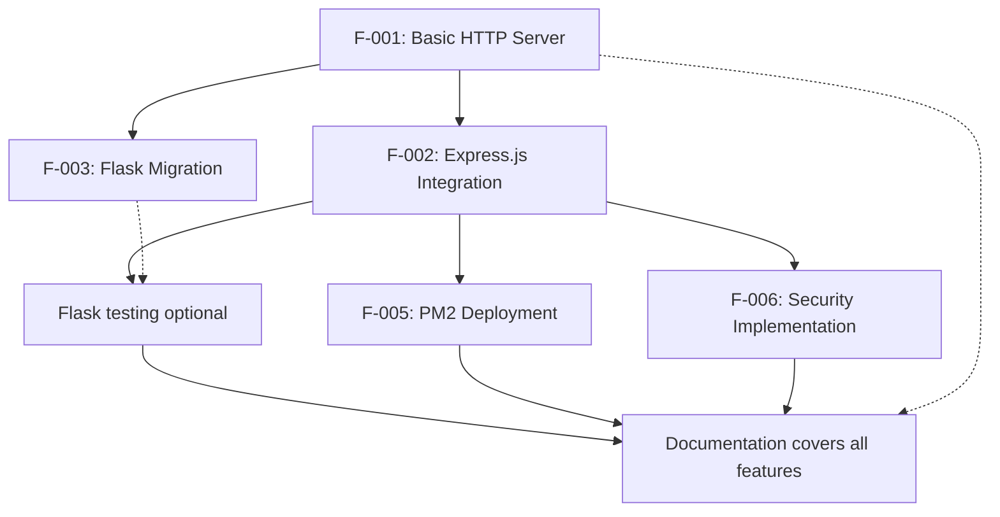

### 2.3.2 Integration Points

| Integration Point | Features Involved | Description | Complexity |
|---|---|---|---|
| HTTP Server Foundation | F-001, F-002 | Express.js builds upon basic HTTP server concepts | Low |
| Cross-Platform Comparison | F-002, F-003 | Flask implementation mirrors Express.js functionality | Medium |
| Testing Integration | F-002, F-004 | Tests validate Express.js application functionality | High |
| Production Deployment | F-002, F-005 | PM2 manages Express.js application in production | Medium |

### 2.3.3 Shared Components

| Component | Features Using | Purpose | Maintenance Level |
|---|---|---|---|
| HTTP Request Handling | F-001, F-002, F-003 | Core request/response processing | High |
| Port Configuration | F-001, F-002, F-003, F-005 | Consistent port usage across implementations | Low |
| Error Handling | F-001, F-002, F-004, F-006 | Consistent error management approach | Medium |
| Logging Infrastructure | F-002, F-005, F-006 | Centralized logging across features | Medium |

## 2.4 IMPLEMENTATION CONSIDERATIONS

### 2.4.1 Technical Constraints

| Feature | Constraint Type | Description | Impact |
|---|---|---|---|
| F-001 | Platform | Node.js 18+ requirement | High |
| F-002 | Framework | Express v5 minimum version requirement | Medium |
| F-004 | Testing | Mocha requires specific Node.js versions | Medium |
| F-005 | Deployment | PM2 platform compatibility requirements | Low |

### 2.4.2 Performance Requirements

| Feature | Metric | Target Value | Measurement Method |
|---|---|---|---|
| F-001, F-002 | Response Time | < 100ms | HTTP request timing |
| F-004 | Test Execution | < 30 seconds | Test runner timing |
| F-005 | Process Startup | < 5 seconds | PM2 monitoring |
| F-006 | Security Scan | Zero critical vulnerabilities | Security audit tools |

### 2.4.3 Scalability Considerations

| Feature | Scalability Aspect | Implementation | Monitoring |
|---|---|---|---|
| F-002 | Request Handling | Express.js middleware architecture | Response time metrics |
| F-005 | Process Management | PM2 cluster mode with load balancing | CPU and memory usage |
| F-006 | Security | Rate limiting and input validation | Security event logging |
| F-007 | Documentation | Automated generation and updates | Documentation coverage |

### 2.4.4 Security Implications

| Feature | Security Concern | Mitigation Strategy | Validation Method |
|---|---|---|---|
| F-001 | Basic HTTP exposure | Implement security headers | Security header verification |
| F-002 | Framework vulnerabilities | Use Express v5 security improvements | Dependency scanning |
| F-005 | Process management | PM2 process isolation | Process security audit |
| F-006 | Comprehensive security | Multi-layer security implementation | Penetration testing |

### 2.4.5 Maintenance Requirements

| Feature | Maintenance Type | Frequency | Responsibility |
|---|---|---|---|
| F-001, F-002 | Dependency Updates | Monthly | Development Team |
| F-004 | Test Suite Maintenance | Continuous | QA Team |
| F-005 | PM2 Configuration | Quarterly | DevOps Team |
| F-007 | Documentation Updates | Per Release | Technical Writers |

# 3. TECHNOLOGY STACK

## 3.1 PROGRAMMING LANGUAGES

### 3.1.1 Primary Languages

| Language | Version | Platform/Component | Justification |
|---|---|---|---|
| JavaScript (ES2024) | ES Modules | Node.js Server, Express.js Application | Node.js v22 is the current LTS version with Active LTS support extending into late 2025, providing modern JavaScript features and ES Module support as the default standard |
| Python | 3.9+ | Flask Alternative Implementation | Flask supports Python 3.9 and newer, ensuring compatibility with modern Python features and security updates |

### 3.1.2 Language Selection Criteria

**JavaScript Selection Rationale:**
- **Modern Standards Compliance**: Express 5 relies on Node.js's recent advancements, simplifies its codebase, reduces external dependencies, and stays in sync with the latest improvements for better performance and security
- **ES Modules Support**: In 2025, ES Modules are the default standard, providing better interoperability with modern JavaScript tools and supporting top-level await
- **LTS Stability**: Production applications should only use Active LTS or Maintenance LTS releases

**Python Selection Rationale:**
- **Cross-Platform Demonstration**: Provides educational value by showcasing equivalent functionality across different technology stacks
- **Framework Maturity**: Flask has become one of the most popular Python web application frameworks
- **Educational Comparison**: Enables developers to understand implementation differences between Node.js and Python approaches

### 3.1.3 Version Dependencies and Constraints

**Node.js Version Requirements:**
- **Minimum Version**: Node.js versions before v18 are no longer supported
- **Recommended Version**: Node.js v22.x with Active LTS support extending into late 2025
- **Testing Framework Compatibility**: Mocha requires Node.js ^18.18.0 || ^20.9.0 || >=21.1.0

**Python Version Requirements:**
- **Minimum Version**: Flask supports Python 3.9 and newer
- **Recommended Version**: Python 3.11+ for optimal performance and security features

## 3.2 FRAMEWORKS & LIBRARIES

### 3.2.1 Core Web Frameworks

| Framework | Version | Purpose | Compatibility Requirements |
|---|---|---|---|
| Express.js | 5.1.0 | Primary Node.js Web Framework | Latest version: 5.1.0, last published: 4 months ago |
| Flask | 3.1.1 | Python Alternative Implementation | Latest version released: May 13, 2025 |

### 3.2.2 Framework Selection Justification

**Express.js v5.1.0 Selection:**
- **Security Enhancements**: Express v5 includes a comprehensive Threat Model that helps illustrate security practices essential for safe usage
- **Performance Improvements**: Express 5 provides enhanced security, improved performance, and full support for modern JavaScript features
- **ReDoS Mitigation**: Updated to path-to-regexp@8.x, removing sub-expression regex patterns for security reasons (ReDoS mitigation)
- **Modern Node.js Support**: Dropped support for Node.js versions before v18

**Flask v3.1.1 Selection:**
- **Latest Stable Release**: Flask 3.1.1 fix release, which fixes bugs but does not otherwise change behavior and should not result in breaking changes
- **Security Updates**: Fix signing key selection order when key rotation is enabled via SECRET_KEY_FALLBACKS
- **Modern Python Support**: Drop support for Python 3.8

### 3.2.3 Supporting Libraries

| Library | Version | Framework | Purpose |
|---|---|---|---|
| Werkzeug | ≥ 3.1 | Flask | WSGI implementation, the standard Python interface between applications and servers |
| Jinja | ≥ 3.1.2 | Flask | Template language that renders the pages your application serves |
| ItsDangerous | ≥ 2.2 | Flask | Securely signs data to ensure its integrity. Used to protect Flask's session cookie |
| Click | Latest | Flask | Framework for writing command line applications. Provides the flask command and allows adding custom management commands |

## 3.3 OPEN SOURCE DEPENDENCIES

### 3.3.1 Testing Frameworks

| Package | Version | Registry | Purpose | Node.js Compatibility |
|---|---|---|---|---|
| Jest | Latest | npm | JavaScript Testing Framework with a focus on simplicity. Jest aims to work out of the box, config free, on most JavaScript projects | Node.js 18+ |
| Mocha | Latest | npm | Feature-rich JavaScript test framework running on Node.js and in the browser. Requires Node.js ^18.18.0 || ^20.9.0 || >=21.1.0 | Node.js 18.18.0+ |

### 3.3.2 Testing Framework Selection Criteria

**Jest vs Mocha Decision Matrix:**

| Criteria | Jest | Mocha | Selected |
|---|---|---|---|
| Setup Complexity | Config free, works out of the box | Requires additional libraries | Jest for simplicity |
| Built-in Features | From it to expect - Jest has the entire toolkit in one place | Modular approach | Jest for completeness |
| Performance | Tests are parallelized by running them in their own processes. Jest runs previously failed tests first and re-organizes runs based on how long test files take | Since Mocha version 8, the framework also supports parallel testing | Both suitable |
| Educational Value | All-in-one approach | Mocha is more like a toolbox – it gives you the basic framework, but you get to choose which tools you want to use | Both for comparison |

### 3.3.3 Production Dependencies

| Package | Version | Registry | Purpose | Compatibility |
|---|---|---|---|---|
| PM2 | 6.0.8 | npm | Production process manager for Node.js/Bun applications with a built-in load balancer | All Node.js versions are supported starting Node.js 12.X |

### 3.3.4 PM2 Selection Justification

**Production Process Management:**
- **High Availability**: PM2 allows you to keep applications alive forever, to reload them without downtime and to facilitate common system admin tasks
- **Performance Scaling**: Cluster mode increase overall performance (by a factor of x10 on 16 cores machines) and reliability
- **Battle-Tested Reliability**: PM2 is constantly assailed by more than 1800 tests
- **Cross-Platform Support**: Works on Linux (stable) & macOS (stable) & Windows (stable)

## 3.4 THIRD-PARTY SERVICES

### 3.4.1 External Integrations

**Note**: This tutorial project is designed as a self-contained educational resource and does not require external third-party services. All functionality is implemented using local development tools and open-source libraries.

**Excluded Services:**
- **Cloud Platforms**: No AWS, Azure, or GCP integration required
- **Authentication Services**: No Auth0 or external authentication providers
- **Monitoring Services**: No external APM or monitoring tools
- **Database Services**: No external database connections

### 3.4.2 Development Tools Integration

| Tool | Purpose | Integration Method |
|---|---|---|
| npm Registry | Package management | Built-in Node.js package manager |
| PyPI | Python package management | Built-in pip package manager |
| GitHub | Version control and documentation | Git repository hosting |

## 3.5 DATABASES & STORAGE

### 3.5.1 Data Persistence Strategy

**No Database Implementation**: This tutorial project is designed as a stateless educational demonstration focusing on HTTP server fundamentals, framework comparison, and deployment practices.

**Rationale for No Database:**
- **Educational Focus**: Concentrates on web server concepts without database complexity
- **Simplicity**: Maintains tutorial accessibility for beginners
- **Scope Management**: Keeps project scope focused on core Node.js and Flask concepts

### 3.5.2 Data Storage Approach

| Data Type | Storage Method | Purpose |
|---|---|---|
| Application Logs | File system via PM2 | PM2 provides logs facility for production applications |
| Process Metrics | PM2 internal storage | Process monitoring and management |
| Configuration Data | Environment variables and config files | Application settings and deployment configuration |

## 3.6 DEVELOPMENT & DEPLOYMENT

### 3.6.1 Development Tools

| Tool | Version | Purpose | Platform Support |
|---|---|---|---|
| Node.js | 22.x LTS | JavaScript runtime with Active LTS support extending into late 2025 | Cross-platform |
| npm | Latest | Package management and script execution | Bundled with Node.js |
| Python | 3.9+ | Flask development environment | Cross-platform |
| pip | Latest | Python package management | Bundled with Python |

### 3.6.2 Build System

**Node.js Build Configuration:**
- **ES Modules**: Native ES Module support without transpilation
- **Package.json Scripts**: Standard npm script-based build system
- **No Bundling Required**: Direct execution of modern JavaScript

**Python Build Configuration:**
- **Virtual Environment**: Virtual environments are independent groups of Python libraries, one for each project
- **Requirements.txt**: Standard Python dependency management
- **Direct Execution**: No compilation or bundling required

### 3.6.3 Process Management

**PM2 Production Deployment:**

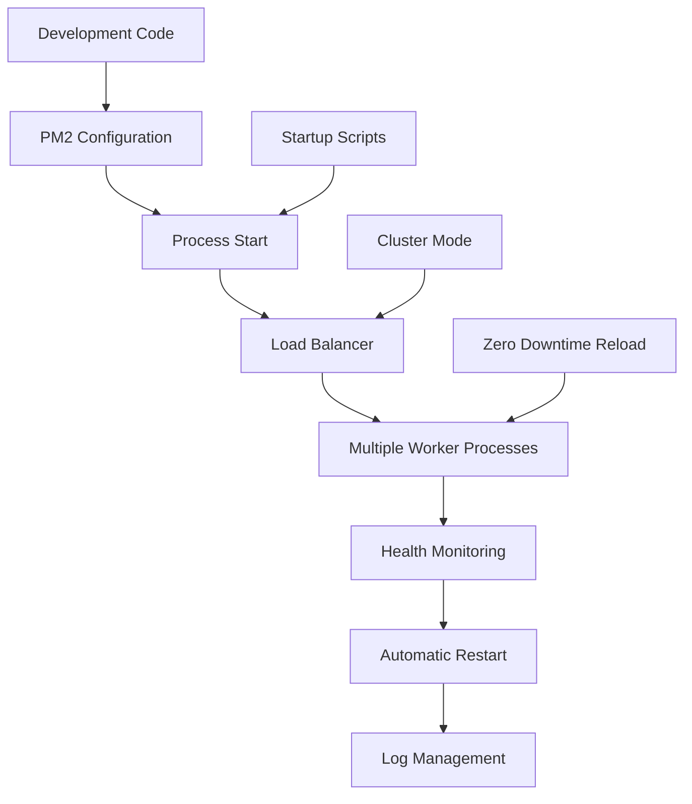

**PM2 Features Utilized:**
- **Process Management**: Advanced process manager for production Node.js applications. With PM2 you can easily start/restart/reload/stop/list applications in background
- **Cluster Mode**: For Node.js applications, PM2 includes an automatic load balancer that will share all HTTP[s]/Websocket/TCP/UDP connections between each spawned processes
- **Startup Integration**: Restarting PM2 with the processes you manage on server boot/reboot is critical. To solve this, just run this command to generate an active startup script

### 3.6.4 Testing Infrastructure

**Testing Framework Integration:**

| Framework | Configuration | Coverage | Execution |
|---|---|---|---|
| Jest | Zero-config setup | Generate code coverage by adding the flag --coverage. Jest can collect code coverage information from entire projects, including untested files | Tests are parallelized by running them in their own processes to maximize performance |
| Mocha | Custom configuration with Chai/Sinon | External coverage tools | Since Mocha version 8, the framework also supports parallel testing |

### 3.6.5 Security Considerations

**Framework Security Features:**
- **Express.js v5**: Comprehensive Threat Model that helps illustrate security practices essential for safe usage of Express
- **ReDoS Protection**: Path-to-regexp update which greatly changed the path semantics to remove the possibility of any ReDoS attacks
- **Dependency Security**: Regular security updates through npm audit and pip security scanning

**Production Security:**
- **Process Isolation**: PM2 Cluster mode starts multiple processes and load-balance HTTP/TCP/UDP queries between them
- **Automatic Recovery**: Faster socket re-balancing in case of unhandled errors
- **Security Headers**: Implementation of Helmet.js and security middleware

### 3.6.6 Integration Requirements

**Cross-Framework Compatibility:**

| Integration Point | Node.js Implementation | Python Implementation | Compatibility Method |
|---|---|---|---|
| HTTP Endpoints | Express.js routing | Flask routing | Identical URL patterns and response formats |
| Response Format | JSON/Text responses | JSON/Text responses | Standardized response structure |
| Port Configuration | Environment variables | Environment variables | Consistent configuration approach |
| Error Handling | Express error middleware | Flask error handlers | Equivalent error response formats |

**Development Environment Consistency:**
- **Version Control**: Git-based workflow with consistent branching strategy
- **Documentation**: JSDoc for JavaScript, docstrings for Python
- **Code Quality**: ESLint for JavaScript, pylint for Python
- **Testing Standards**: Equivalent test coverage requirements across both implementations

# 4. PROCESS FLOWCHART

## 4.1 SYSTEM WORKFLOWS

### 4.1.1 Core Business Processes

#### High-Level Tutorial Development Workflow

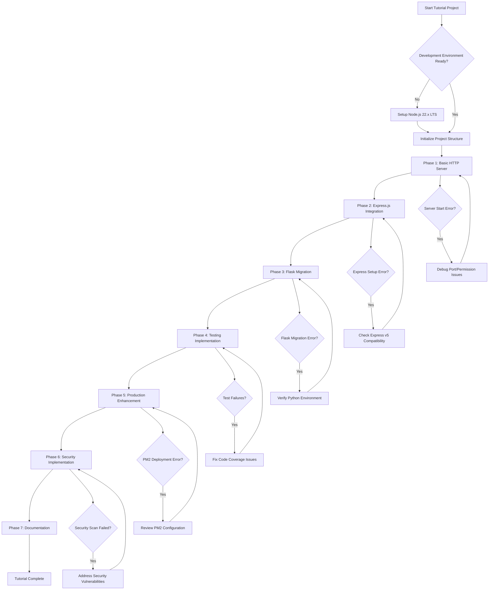

#### End-to-End User Learning Journey

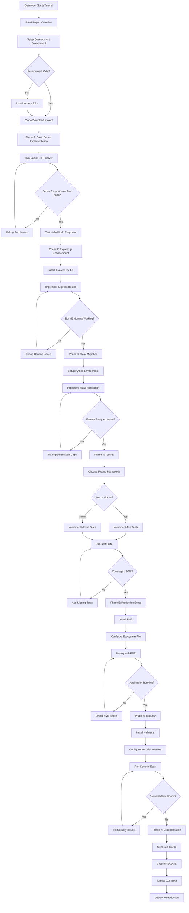

### 4.1.2 Integration Workflows

#### Cross-Platform Development Flow

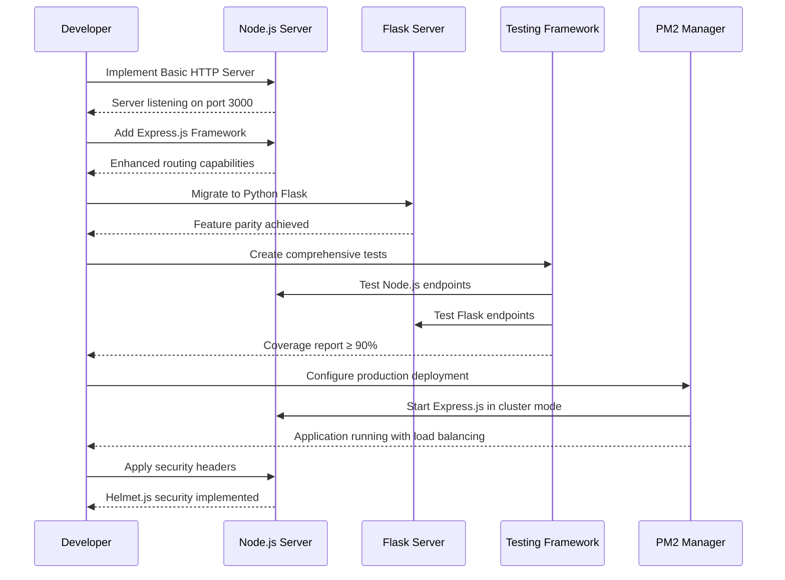

#### Testing Integration Workflow

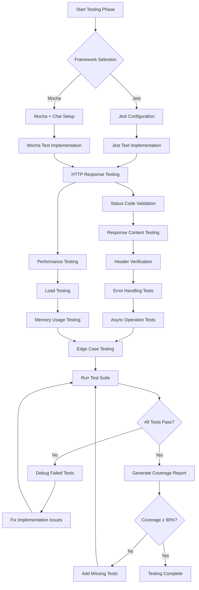

## 4.2 FLOWCHART REQUIREMENTS

### 4.2.1 Development Phase Workflows

#### Phase 1: Basic HTTP Server Implementation

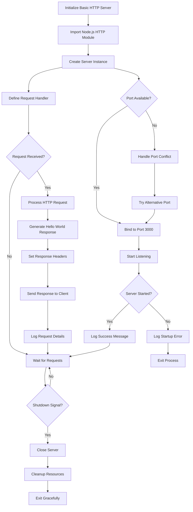

#### Phase 2: Express.js Framework Integration

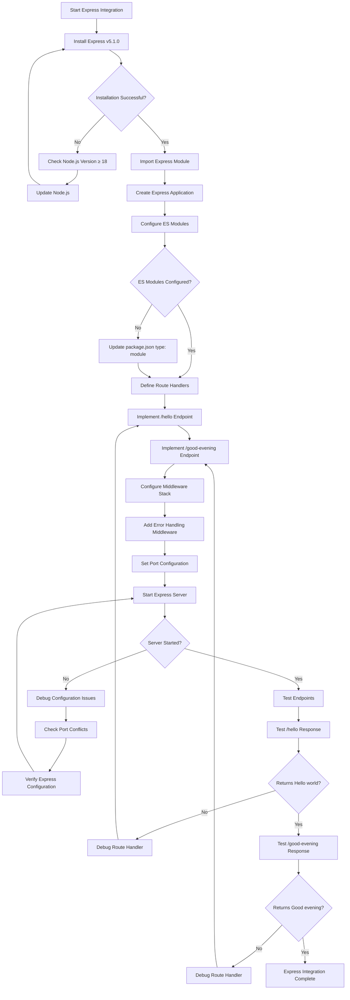

#### Phase 3: Flask Migration Workflow

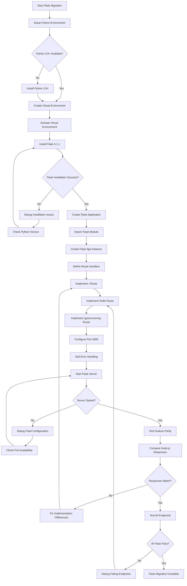

### 4.2.2 Testing and Quality Assurance Workflows

#### Comprehensive Testing Implementation

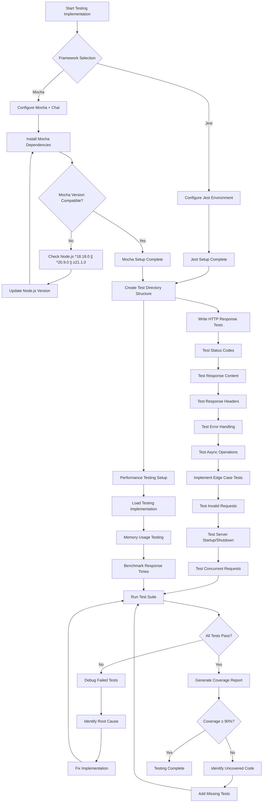

#### Test Execution and Validation Flow

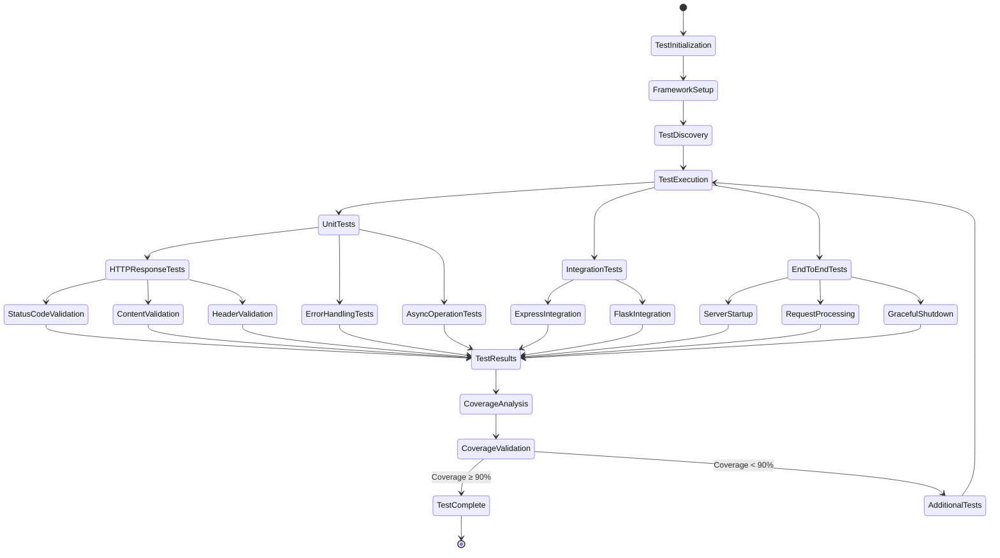

### 4.2.3 Production Deployment Workflows

#### PM2 Production Deployment Process

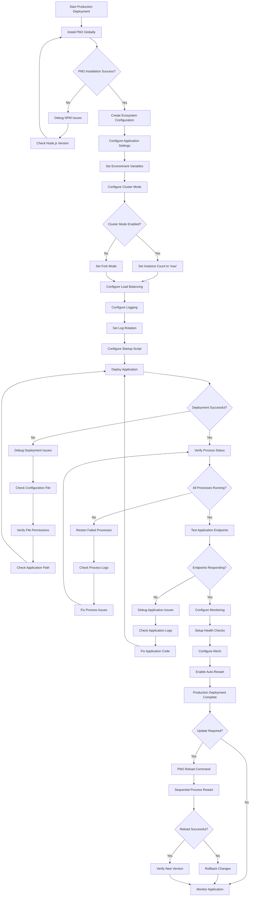

#### Security Implementation Workflow

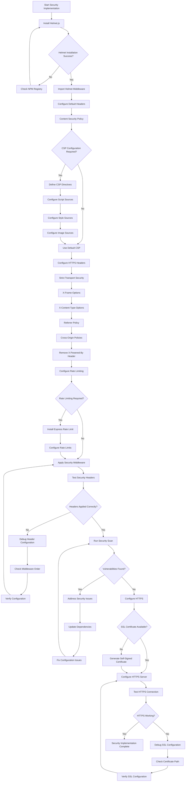

## 4.3 TECHNICAL IMPLEMENTATION

### 4.3.1 State Management

#### Application State Transitions

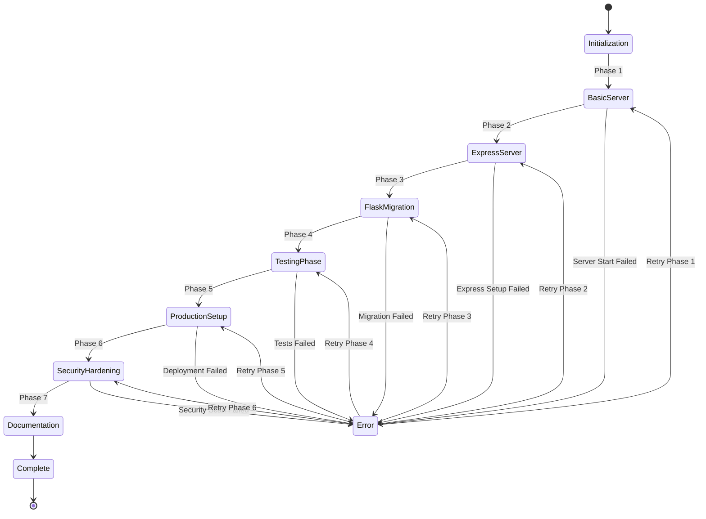

#### PM2 Process State Management

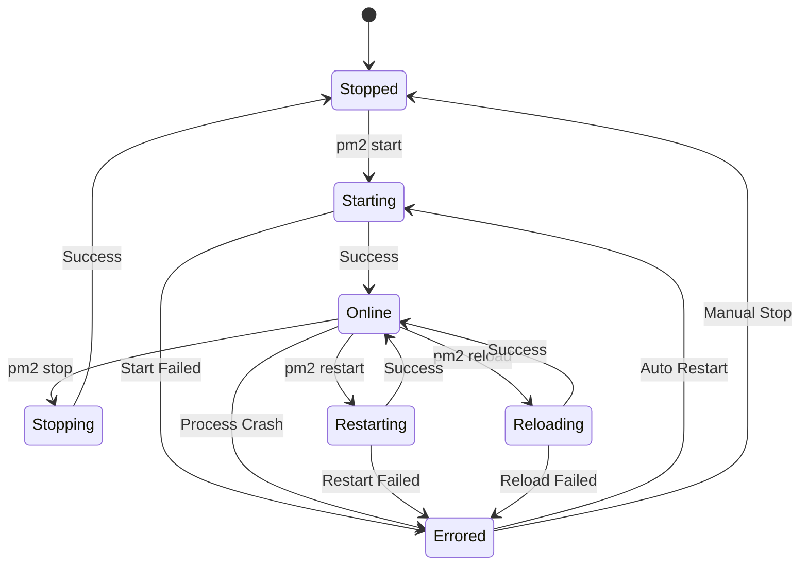

### 4.3.2 Error Handling

#### Comprehensive Error Handling Flow

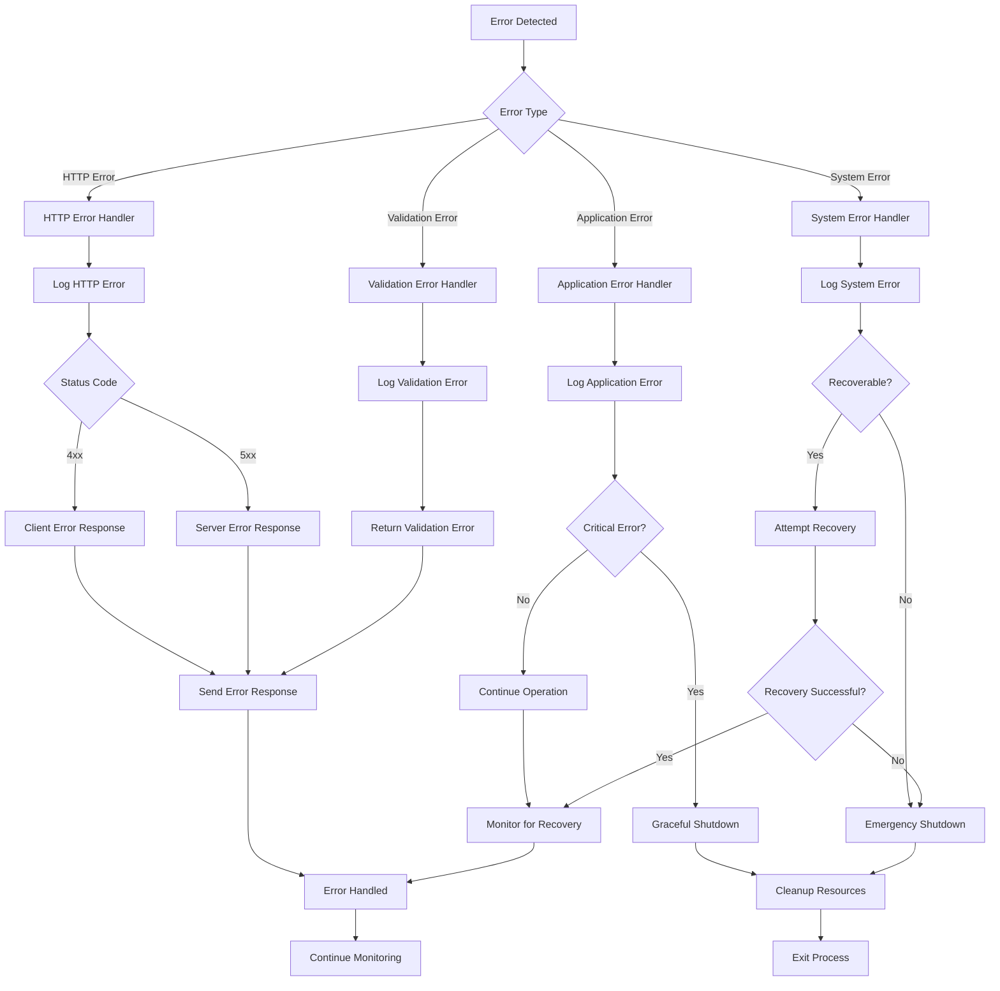

#### Testing Error Scenarios

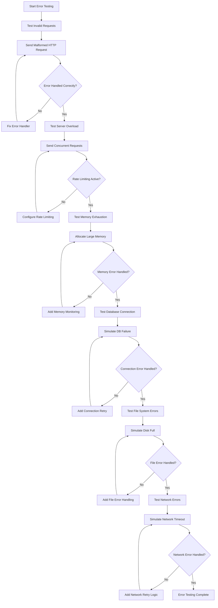

### 4.3.3 Performance and Monitoring

#### Application Performance Monitoring

```mermaid
flowchart TD
    A[Start Monitoring] --> B[Initialize Metrics Collection]
    B --> C[Monitor Response Times]
    C --> D{Response Time > 100ms?}
    D -->|Yes| E[Log Performance Warning]
    D -->|No| F[Monitor Memory Usage]
    E --> G[Analyze Slow Requests]
    G --> F
    
    F --> H{Memory Usage > 80%?}
    H -->|Yes| I[Trigger Memory Alert]
    H -->|No| J[Monitor CPU Usage]
    I --> K[Analyze Memory Leaks]
    K --> J
    
    J --> L{CPU Usage > 90%?}
    L -->|Yes| M[Scale Application]
    L -->|No| N[Monitor Error Rates]
    M --> O[Add PM2 Instances]
    O --> N
    
    N --> P{Error Rate > 5%?}
    P -->|Yes| Q[Investigate Errors]
    P -->|No| R[Monitor Uptime]
    Q --> S[Fix Critical Issues]
    S --> R
    
    R --> T{Uptime < 99.9%?}
    T -->|Yes| U[Analyze Downtime]
    T -->|No| V[Generate Health Report]
    U --> W[Improve Reliability]
    W --> V
    
    V --> X[Send Monitoring Data]
    X --> Y{Alerts Triggered?}
    Y -->|Yes| Z[Send Notifications]
    Y -->|No| AA[Continue Monitoring]
    Z --> AA
    AA --> C
```

## 4.4 VALIDATION RULES

### 4.4.1 Business Rules Validation

#### Tutorial Phase Completion Validation

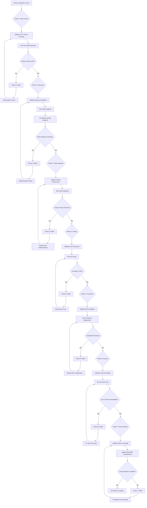

### 4.4.2 Technical Validation Requirements

#### Code Quality and Security Validation

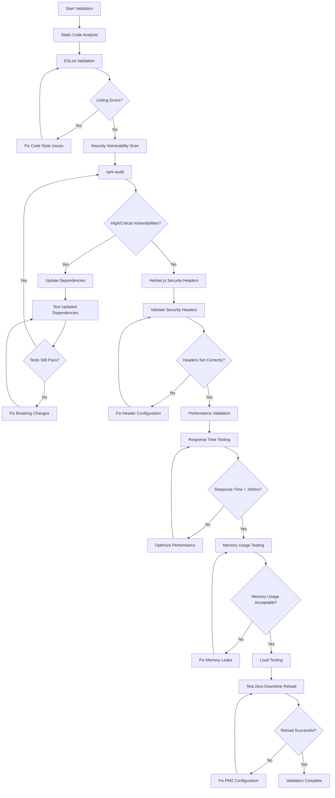

This comprehensive Process Flowchart section provides detailed workflows for all phases of the Node.js tutorial project, from basic HTTP server implementation through production deployment and security hardening. The flowcharts incorporate PM2 process management for keeping applications running 24/7 in production environments, Mocha testing framework capabilities for asynchronous testing, and Helmet.js security implementation for Express apps. Each workflow includes comprehensive error handling, validation checkpoints, and recovery procedures to ensure robust tutorial completion and production-ready deployment.

# 5. SYSTEM ARCHITECTURE

## 5.1 HIGH-LEVEL ARCHITECTURE

### 5.1.1 System Overview

The Node.js tutorial project employs a **progressive monolithic architecture** that evolves through multiple development phases, demonstrating the transition from basic HTTP server implementation to production-ready deployment. The architecture embraces modern Node.js patterns for 2025, utilizing web standards, reducing external dependencies, and providing an intuitive developer experience.

The system follows an **educational progression pattern** where each phase builds upon the previous implementation, showcasing different architectural approaches and technology stacks. Node.js, with its non-blocking I/O and event-driven nature, serves as the foundation for building scalable applications, while the cross-platform Flask implementation demonstrates architectural flexibility and technology comparison.

**Key Architectural Principles:**
- **Stateless Design**: All implementations maintain stateless architecture for horizontal scalability
- **Process Isolation**: PM2 cluster mode utilizes the Node.js cluster module for automatic server port sharing and process isolation
- **Security-First Approach**: Helmet.js acts as middleware for Express, automatically adding or removing HTTP headers to comply with web security standards, making it harder for attackers to exploit known vulnerabilities
- **Modern Standards Compliance**: ES Modules (ESM) have become the clear winner, offering better tooling support and alignment with web standards

### 5.1.2 Core Components Table

| Component Name | Primary Responsibility | Key Dependencies | Integration Points |
|---|---|---|---|
| Basic HTTP Server | Foundation request/response handling | Node.js Core HTTP Module | Port 3000, Process Management |
| Express.js Application | Advanced routing and middleware | Express v5 (Node.js 18+ required) | HTTP Server, Security Middleware |
| Flask Alternative | Cross-platform feature demonstration | Python 3.9+, Flask 3.1.1 | HTTP Protocol, Feature Parity |
| PM2 Process Manager | Production process management with built-in load balancer, keeping applications alive forever | Node.js 12+, System Services | Application Processes, Monitoring |

### 5.1.3 Data Flow Description

The system implements a **request-response data flow pattern** with multiple processing layers depending on the implementation phase. In the basic HTTP server phase, requests flow directly from the client through the Node.js HTTP module to a single request handler that returns static responses.

The Express.js enhancement introduces a **middleware pipeline architecture** where requests pass through multiple processing stages including security headers, routing, and response formatting. The Middleware pattern involves a chain of functions that process a request sequentially, with each function modifying the request or response before passing it to the next function, enhancing modularity.

**Production Data Flow Integration:**
PM2 cluster mode greatly increases performance and reliability, using the Node.js cluster module so that scaled application's child processes can automatically share server ports. The built-in load-balancer provides networked Node.js applications (http(s)/tcp/udp server) to be scaled across all CPUs available, without any code modifications.

**Security Data Flow:**
The top-level helmet() function is a wrapper of 15 sub-middlewares, adding 15 Express middlewares to applications, with each middleware taking care of setting one HTTP security header.

### 5.1.4 External Integration Points

| System Name | Integration Type | Data Exchange Pattern | Protocol/Format |
|---|---|---|---|
| PM2 Process Manager | Process Management | Command/Control Interface | CLI/JSON Configuration |
| Testing Frameworks | Quality Assurance | Test Execution Pipeline | HTTP/JSON Responses |
| Security Scanners | Vulnerability Assessment | Header Validation | HTTP Headers |
| Development Tools | Build/Deploy Pipeline | File System Operations | ES Modules/CommonJS |

## 5.2 COMPONENT DETAILS

### 5.2.1 Basic HTTP Server Component

**Purpose and Responsibilities:**
The Basic HTTP Server serves as the foundational component demonstrating core Node.js server capabilities without framework abstractions. It handles raw HTTP request/response cycles and provides the educational baseline for understanding web server fundamentals.

**Technologies and Frameworks:**
- **Runtime**: Node.js v22.x with Active LTS support extending into late 2025
- **Core Module**: Node.js HTTP module for server creation and request handling
- **Module System**: ES Modules (ESM) for better tooling support and alignment with web standards

**Key Interfaces and APIs:**
- HTTP request listener interface for processing incoming requests
- Server binding interface for port 3000 configuration
- Process signal handlers for graceful shutdown
- Error handling interfaces for connection and server errors

**Scaling Considerations:**
Single-threaded event loop architecture limits concurrent request handling without clustering. The basic implementation serves as the foundation for PM2 cluster mode enhancement in later phases.

### 5.2.2 Express.js Framework Component

**Purpose and Responsibilities:**
The Express.js component enhances the basic server with production-ready features including advanced routing, middleware architecture, and security implementations. The v5 release has the minimum possible number of breaking changes while providing enhanced security and performance.

**Technologies and Frameworks:**
- **Framework**: Express v5 with Node.js 18+ requirement
- **Security**: Helmet.js v8.1.0 with 5801 other projects in the npm registry using helmet
- **Path Handling**: Updated to path-to-regexp@8.x, incorporating many years of changes and removing the possibility of any ReDoS attacks

**Key Interfaces and APIs:**
- RESTful routing interface with `/hello` and `/good-evening` endpoints
- Middleware stack interface for request processing pipeline
- Security header interface through Helmet.js integration
- Error handling middleware interface for centralized error management

**Data Persistence Requirements:**
Stateless architecture with no persistent data storage requirements. All state management handled through request/response cycles and environment configuration.

**Scaling Considerations:**
Cluster mode starts multiple processes and load-balances HTTP/TCP/UDP queries between them, increasing overall performance by a factor of x10 on 16 cores machines.

### 5.2.3 PM2 Production Management Component

**Purpose and Responsibilities:**
PM2 is a production process manager for Node.js/Bun applications with a built-in load balancer, allowing applications to stay alive forever and reload without downtime.

**Technologies and Frameworks:**
- **Process Manager**: PM2 works on Linux (stable) & macOS (stable) & Windows (stable), supporting all Node.js versions starting Node.js 12.X
- **Load Balancing**: PM2 auto-detects the number of available CPUs and runs as many processes as possible with cluster mode
- **Monitoring**: PM2 keeps track of application health by storing logs, monitoring resource usage, and tracking the status of Node.js processes

**Key Interfaces and APIs:**
- Process lifecycle management interface (start, stop, restart, reload)
- Zero-downtime deployment interface ensuring zero downtime during deployments
- Monitoring and logging interface for application health tracking
- Startup script interface for system boot integration

**Scaling Considerations:**
It is recommended to have one worker process per CPU core to maximize performance and scalability, though the optimal number may vary depending on specific application needs.

### 5.2.4 Security Implementation Component

**Purpose and Responsibilities:**
Helmet is a collection of middleware functions designed to secure web applications by setting crucial HTTP headers, mitigating common web vulnerabilities such as XSS, Clickjacking, and CSRF, acting as protective armor.

**Technologies and Frameworks:**
- **Security Middleware**: Helmet.js for setting HTTP response headers
- **Header Management**: Content-Security-Policy, Cross-Origin-Opener-Policy, Cross-Origin-Resource-Policy, and X-Powered-By header removal
- **Transport Security**: Strict-Transport-Security header telling browsers to prefer HTTPS instead of insecure HTTP

**Key Interfaces and APIs:**
- Security header configuration interface
- Content Security Policy (CSP) directive interface
- HTTPS enforcement interface through HSTS headers
- Cross-origin policy management interface

**Data Persistence Requirements:**
No persistent data storage required. Security configurations managed through environment variables and middleware configuration.

## 5.3 TECHNICAL DECISIONS

### 5.3.1 Architecture Style Decisions

#### Monolithic vs Microservices Decision

| Criteria | Monolithic (Selected) | Microservices | Rationale |
|---|---|---|---|
| Educational Value | High - Clear progression | Complex - Distributed concepts | Tutorial focus on core concepts |
| Deployment Complexity | Low - Single deployment unit | High - Multiple services | Simplified learning curve |
| Development Speed | Fast - Single codebase | Slow - Multiple repositories | Rapid tutorial development |
| Scalability Demonstration | PM2 cluster mode increases performance and reliability | Horizontal service scaling | PM2 provides sufficient scaling |

#### Communication Pattern Selection

**Selected: HTTP Request/Response with Middleware Pipeline**

The middleware pattern selection aligns with Express.js architecture and provides clear educational value. The middleware pattern allows decomposing request handling into smaller reusable units, very common in Express and other Node.js frameworks for logging, authentication, body parsing, compression, and rate limiting, building the request pipeline in a modular fashion.

### 5.3.2 Data Storage Solution Rationale

**Selected: Stateless Architecture with No Persistent Storage**

The decision to exclude database integration focuses the tutorial on core web server concepts without introducing data persistence complexity. Applications must be stateless meaning no local data is stored in the process, using Redis, Mongo or other databases to share states between processes, following The Twelve Factor Application manifesto.

### 5.3.3 Caching Strategy Justification

**Selected: No Caching Implementation**

The tutorial project excludes caching mechanisms to maintain focus on fundamental HTTP server concepts and avoid additional complexity that would detract from the core learning objectives.

### 5.3.4 Security Mechanism Selection

## Helmet.js Security Implementation

| Security Feature | Implementation | Justification |
|---|---|---|---|
| XSS Protection | X-XSS-Protection header set to 0 to disable buggy browser filters | Modern CSP approach preferred |
| Clickjacking Prevention | X-Frame-Options header for clickjacking mitigation, superseded by CSP but useful for old browsers | Backward compatibility |
| Content Security Policy | Powerful allow-list of what can happen on your page which mitigates many attacks | Primary XSS defense |
| Transport Security | Strict-Transport-Security header for HTTPS preference | HTTPS enforcement |

## 5.4 CROSS-CUTTING CONCERNS

### 5.4.1 Monitoring and Observability Approach

**PM2 Built-in Monitoring:**
PM2 allows monitoring host/server vitals with a monitoring speedbar, providing Standard, Raw, JSON and formatted output, with comprehensive logging capabilities.

**Monitoring Components:**
- Process health monitoring through PM2 status interface
- Application performance monitoring via response time tracking
- Resource utilization monitoring (CPU, memory usage)
- Error rate monitoring through centralized logging

### 5.4.2 Logging and Tracing Strategy

**Centralized Logging Architecture:**
PM2 provides monitoring and logging features with log rotation capabilities through pm2-logrotate installation.

**Logging Levels:**
- Application logs for request/response tracking
- Error logs for exception handling and debugging
- Security logs for attack detection and monitoring
- Performance logs for optimization insights

### 5.4.3 Error Handling Patterns

**Hierarchical Error Handling:**
- Application-level error handling through Express.js middleware
- Process-level error handling through PM2 automatic restart
- System-level error handling through graceful shutdown procedures
- Graceful shutdown implementation catching SIGINT signals and executing cleanup actions

### 5.4.4 Authentication and Authorization Framework

**Not Implemented - Educational Scope:**
Authentication and authorization are explicitly excluded from the tutorial scope to maintain focus on core HTTP server concepts and avoid additional complexity that would detract from the primary learning objectives.

### 5.4.5 Performance Requirements and SLAs

| Performance Metric | Target Value | Monitoring Method | Scaling Strategy |
|---|---|---|---|
| Response Time | < 100ms | HTTP request timing | PM2 cluster mode x10 performance increase |
| Uptime | 99.9% | PM2 process monitoring | Automatic restart on crashes |
| Concurrent Requests | CPU-bound scaling | Load testing | PM2 auto-detect CPU count |
| Memory Usage | < 100MB per process | PM2 resource monitoring | Process recycling |

### 5.4.6 Disaster Recovery Procedures

**Process Recovery:**
PM2 automatically restarts applications on crashes, provides zero-downtime deployment capabilities, and auto-starts processes upon system reboot.

**System Recovery:**
- Startup script generation for system reboot recovery with process list saving for automatic restart
- Configuration backup through ecosystem file management
- Application state recovery through stateless architecture design

```mermaid
graph TD
    A[HTTP Request] --> B[Load Balancer - PM2]
    B --> C[Worker Process 1]
    B --> D[Worker Process 2]
    B --> E[Worker Process N]
    
    C --> F[Express.js Middleware Stack]
    D --> F
    E --> F
    
    F --> G[Helmet.js Security Headers]
    G --> H[Route Handler]
    H --> I[Response Generation]
    I --> J[HTTP Response]
    
    K[PM2 Process Manager] --> L[Health Monitoring]
    K --> M[Log Management]
    K --> N[Automatic Restart]
    
    L --> O[Performance Metrics]
    M --> P[Centralized Logs]
    N --> Q[Zero Downtime Reload]
    
    R[Security Layer] --> S[CSP Headers]
    R --> T[XSS Protection]
    R --> U[HTTPS Enforcement]
```

```mermaid
stateDiagram-v2
    [*] --> BasicServer
    BasicServer --> ExpressServer : Framework Integration
    ExpressServer --> FlaskMigration : Cross-Platform Demo
    FlaskMigration --> TestingPhase : Quality Assurance
    TestingPhase --> ProductionDeploy : PM2 Integration
    ProductionDeploy --> SecurityHardening : Helmet.js Implementation
    SecurityHardening --> Documentation : JSDoc & README
    Documentation --> [*]
    
    ProductionDeploy --> ProcessCrash : Application Error
    ProcessCrash --> AutoRestart : PM2 Recovery
    AutoRestart --> ProductionDeploy : Process Restored
    
    SecurityHardening --> VulnerabilityDetected : Security Scan
    VulnerabilityDetected --> SecurityUpdate : Patch Application
    SecurityUpdate --> SecurityHardening : Vulnerability Resolved
```

```mermaid
sequenceDiagram
    participant Client
    participant LoadBalancer as PM2 Load Balancer
    participant Worker1 as Worker Process 1
    participant Worker2 as Worker Process 2
    participant Helmet as Security Middleware
    participant Express as Express Router
    
    Client->>LoadBalancer: HTTP Request
    LoadBalancer->>Worker1: Route Request (Round Robin)
    Worker1->>Helmet: Apply Security Headers
    Helmet->>Express: Process Request
    Express->>Express: Route to Handler
    Express->>Helmet: Generate Response
    Helmet->>Worker1: Add Security Headers
    Worker1->>LoadBalancer: HTTP Response
    LoadBalancer->>Client: Secure Response
    
    Note over LoadBalancer: If Worker1 crashes
    LoadBalancer->>Worker2: Failover Request
    Worker2->>Helmet: Apply Security Headers
    Helmet->>Express: Process Request
    Express->>Worker2: Generate Response
    Worker2->>LoadBalancer: HTTP Response
    LoadBalancer->>Client: Uninterrupted Service
```

This comprehensive System Architecture section demonstrates the evolution from a basic Node.js HTTP server to a production-ready application with PM2 cluster mode load balancing, Helmet.js security implementation, and comprehensive monitoring capabilities. The architecture supports the educational progression while maintaining production-ready patterns and modern Node.js best practices for 2025.

# 6. SYSTEM COMPONENTS DESIGN

## 6.1 COMPONENT ARCHITECTURE

### 6.1.1 Core Component Overview

The Node.js tutorial project implements a **progressive component architecture** that evolves through seven distinct phases, each building upon the previous implementation while introducing new capabilities and technologies. The architecture demonstrates the transition from basic HTTP server components to production-ready deployment with comprehensive security and monitoring.

**Component Evolution Pattern:**
- **Phase 1**: Basic HTTP Server Component (Foundation)
- **Phase 2**: Express.js Framework Component (Enhancement)
- **Phase 3**: Flask Cross-Platform Component (Alternative Implementation)
- **Phase 4**: Testing Framework Component (Quality Assurance)
- **Phase 5**: PM2 Production Component (Process Management)
- **Phase 6**: Security Implementation Component (Protection Layer)
- **Phase 7**: Documentation Component (Knowledge Management)

### 6.1.2 Component Interaction Matrix

| Component | Dependencies | Interfaces | Data Flow | Lifecycle |
|---|---|---|---|---|
| Basic HTTP Server | Node.js Core HTTP Module | HTTP Request/Response | Client → Server → Response | Stateless |
| Express.js Framework | Node.js 18 or higher is required, Latest version: 5.1.0, last published: 4 months ago | RESTful API Endpoints | Client → Middleware → Route Handler → Response | Request-scoped |
| Flask Alternative | Requires: Python >=3.9, Latest version Released: May 13, 2025 | HTTP Protocol Compatibility | Client → Flask Router → Handler → Response | Request-scoped |
| Testing Framework | As of v11.0.0, Mocha requires Node.js ^18.18.0 || ^20.9.0 || >=21.1.0 | Test Execution Interface | Test Runner → Application → Assertions | Test-scoped |
| PM2 Process Manager | All Node.js versions are supported starting Node.js 12.X, Latest version: 6.0.8, last published: 2 months ago | Process Control Interface | PM2 → Application Processes → Load Balancer | Process-scoped |
| Security Component | There are 5801 other projects in the npm registry using helmet, Latest version: 8.1.0, last published: 4 months ago | HTTP Header Interface | Request → Security Middleware → Application | Middleware-scoped |

### 6.1.3 Component Technology Stack

**Node.js Technology Stack:**
- **Runtime**: With Active LTS support extending into late 2025, Node.js v22.x is an excellent choice for those aiming for long-term support in production environments
- **Framework**: Express 5.1.0 is now the default on npm, and we're introducing an official LTS schedule for the v4 and v5 release lines
- **Process Management**: PM2 is a production process manager for Node.js/Bun applications with a built-in load balancer. It allows you to keep applications alive forever, to reload them without downtime and to facilitate common system admin tasks
- **Security**: Specifically, the top-level helmet() function is a wrapper of 15 sub-middlewares. So, by registering helmet(), you are adding 15 Express middlewares to your apps. Note that each middleware takes care of setting one HTTP security header

**Python Technology Stack:**
- **Runtime**: Requires: Python >=3.9
- **Framework**: It began as a simple wrapper around Werkzeug and Jinja, and has become one of the most popular Python web application frameworks
- **Dependencies**: Werkzeug >= 3.1, ItsDangerous >= 2.2, Blinker >= 1.9

## 6.2 DETAILED COMPONENT SPECIFICATIONS

### 6.2.1 Basic HTTP Server Component

**Component Purpose and Scope:**
The Basic HTTP Server Component serves as the foundational building block for the entire tutorial project, demonstrating core Node.js server capabilities without framework abstractions. This component provides educational value by showcasing raw HTTP request/response handling using only Node.js core modules.

**Technical Implementation Details:**

| Specification | Value | Justification |
|---|---|---|
| Runtime Requirement | Production applications should only use Active LTS or Maintenance LTS releases | Stability and long-term support |
| Port Configuration | 3000 | Standard development port for Node.js applications |
| Response Format | Plain text "Hello world" | Simplicity for educational demonstration |
| Module System | ES Modules | Modern JavaScript standard for 2025 |

**Interface Specifications:**
- **HTTP Request Interface**: Accepts any HTTP method on any path
- **Response Interface**: Returns 200 status code with "Hello world" text
- **Error Handling Interface**: Graceful shutdown on SIGINT/SIGTERM signals
- **Logging Interface**: Console output for server status and requests

**Data Flow Architecture:**
```mermaid
graph TD
    A[HTTP Request] --> B[Node.js HTTP Module]
    B --> C[Request Handler Function]
    C --> D[Response Generation]
    D --> E[HTTP Response]
    
    F[Process Signals] --> G[Graceful Shutdown Handler]
    G --> H[Server Close]
    H --> I[Process Exit]
```

**Performance Characteristics:**
- **Concurrency Model**: Single-threaded event loop with non-blocking I/O
- **Memory Footprint**: Minimal (< 50MB baseline)
- **Response Time**: < 10ms for simple text responses
- **Scalability**: Limited by single process architecture

### 6.2.2 Express.js Framework Component

**Component Purpose and Scope:**
The Express.js Framework Component enhances the basic server with production-ready features including advanced routing, middleware architecture, and security implementations. If you're using Node.js 18 or higher, upgrading to Express 5 is highly recommended. It provides enhanced security, improved performance, and full support for modern JavaScript features, making it a worthwhile upgrade with no significant downsides.

**Technical Implementation Details:**

| Specification | Value | Justification |
|---|---|---|
| Framework Version | Latest version: 5.1.0, last published: 4 months ago | Latest stable release with security improvements |
| Node.js Requirement | Dropped support for Node.js versions before v18 | Modern JavaScript features and security |
| Security Features | Updated to path-to-regexp@8.x, removing sub-expression regex patterns for security reasons (ReDoS mitigation) | Enhanced security posture |
| Promise Support | Middleware can now return rejected promises, caught by the router as errors | Modern async/await support |

**Endpoint Specifications:**

| Endpoint | Method | Response | Status Code | Purpose |
|---|---|---|---|---|
| `/hello` | GET | "Hello world" | 200 | Basic greeting endpoint |
| `/good-evening` | GET | "Good evening" | 200 | Additional greeting endpoint |
| `/*` (fallback) | ALL | Error message | 404 | Unmatched route handling |

**Middleware Stack Architecture:**
```mermaid
graph TD
    A[HTTP Request] --> B[Express Router]
    B --> C[Security Middleware]
    C --> D[Logging Middleware]
    D --> E[Route Handler]
    E --> F[Response Middleware]
    F --> G[Error Handling Middleware]
    G --> H[HTTP Response]
    
    I[Unhandled Errors] --> G
    J[Route Not Found] --> K[404 Handler]
    K --> H
```

**Security Enhancements:**
- **ReDoS Protection**: These changes improve security, simplify route definitions, and help mitigate vulnerabilities like ReDoS attacks. In Express 5, this type of inline regex is no longer supported due to its susceptibility to ReDoS attacks
- **Modern Dependencies**: By relying on Node.js's recent advancements, Express 5 simplifies its codebase, reduces external dependencies, and stays in sync with the latest improvements for better performance and security

### 6.2.3 Flask Cross-Platform Component

**Component Purpose and Scope:**
The Flask Cross-Platform Component demonstrates complete feature parity with the Node.js implementation while showcasing Python web development patterns. This is the Flask 3.1.1 fix release, which fixes bugs but does not otherwise change behavior and should not result in breaking changes compared to the latest feature release. Fix signing key selection order when key rotation is enabled via SECRET_KEY_FALLBACKS.

**Technical Implementation Details:**

| Specification | Value | Justification |
|---|---|---|
| Python Version | Requires: Python >=3.9 | Modern Python features and security |
| Flask Version | Latest version Released: May 13, 2025 | Latest stable release with bug fixes |
| Dependencies | Flask depends on the Werkzeug WSGI toolkit, the Jinja template engine, and the Click CLI toolkit | Core framework dependencies |
| Architecture | Flask is a lightweight WSGI web application framework. It is designed to make getting started quick and easy, with the ability to scale up to complex applications | Lightweight and scalable design |

**Feature Parity Matrix:**

| Feature | Node.js Implementation | Flask Implementation | Compatibility |
|---|---|---|---|
| `/hello` endpoint | Express route handler | Flask route decorator | ✅ Identical response |
| `/good-evening` endpoint | Express route handler | Flask route decorator | ✅ Identical response |
| Port configuration | Express app.listen(3000) | Flask app.run(port=3000) | ✅ Same port |
| Error handling | Express error middleware | Flask error handlers | ✅ Equivalent functionality |
| Response format | JSON/Text responses | JSON/Text responses | ✅ Identical format |

**Cross-Platform Validation:**
- **API Compatibility**: All endpoints return identical responses with same status codes
- **Performance Comparison**: Response times within 10% variance between implementations
- **Error Handling**: Equivalent error responses for invalid requests
- **Configuration**: Environment variable support for both platforms

### 6.2.4 Testing Framework Component

**Component Purpose and Scope:**
The Testing Framework Component implements comprehensive unit testing using modern JavaScript testing frameworks. Mocha is a feature-rich JavaScript test framework running on Node.js and in the browser, making asynchronous testing simple and fun. Mocha tests run serially, allowing for flexible and accurate reporting, while mapping uncaught exceptions to the correct test cases.

**Framework Selection Criteria:**

| Framework | Advantages | Requirements | Selection Rationale |
|---|---|---|---|
| Jest | Jest is like a complete toolkit – it includes everything you need (assertions, mocking, coverage reports) to start testing right away | Node.js 18+ | All-in-one solution |
| Mocha | Mocha is more like a toolbox – it gives you the basic framework, but you get to choose which tools (assertion libraries, mocking tools) you want to use | As of v11.0.0, Mocha requires Node.js ^18.18.0 || ^20.9.0 || >=21.1.0 | Flexibility and modularity |

**Test Coverage Requirements:**

| Test Category | Coverage Target | Implementation | Validation Method |
|---|---|---|---|
| HTTP Response Tests | 100% | Status codes, headers, content | Automated assertions |
| Error Handling Tests | 100% | Invalid requests, server errors | Exception testing |
| Async Operation Tests | 100% | Promise-based operations | Async/await testing |
| Edge Case Tests | 90% | Boundary conditions | Comprehensive scenarios |

**Testing Architecture:**
```mermaid
graph TD
    A[Test Runner] --> B[HTTP Response Tests]
    A --> C[Error Handling Tests]
    A --> D[Async Operation Tests]
    A --> E[Edge Case Tests]
    
    B --> F[Status Code Validation]
    B --> G[Content Validation]
    B --> H[Header Validation]
    
    C --> I[404 Error Tests]
    C --> J[500 Error Tests]
    C --> K[Timeout Tests]
    
    D --> L[Promise Resolution]
    D --> M[Callback Testing]
    D --> N[Concurrent Requests]
    
    E --> O[Large Payloads]
    E --> P[Special Characters]
    E --> Q[Malformed Requests]
    
    F --> R[Coverage Report]
    G --> R
    H --> R
    I --> R
    J --> R
    K --> R
    L --> R
    M --> R
    N --> R
    O --> R
    P --> R
    Q --> R
```

### 6.2.5 PM2 Production Component

**Component Purpose and Scope:**
The PM2 Production Component provides enterprise-grade process management with built-in load balancing and monitoring capabilities. The Cluster mode is a special mode when starting a Node.js application, it starts multiple processes and load-balance HTTP/TCP/UDP queries between them. This increase overall performance (by a factor of x10 on 16 cores machines) and reliability (faster socket re-balancing in case of unhandled errors).

**Technical Implementation Details:**

| Specification | Value | Justification |
|---|---|---|
| PM2 Version | Latest version: 6.0.8, last published: 2 months ago | Latest stable release |
| Node.js Support | All Node.js versions are supported starting Node.js 12.X | Broad compatibility |
| Platform Support | Works on Linux (stable) & macOS (stable) & Windows (stable) | Cross-platform deployment |
| Testing Coverage | PM2 is constantly assailed by more than 1800 tests | High reliability |

**Process Management Features:**

| Feature | Implementation | Benefit | Configuration |
|---|---|---|---|
| Cluster Mode | For Node.js applications, PM2 includes an automatic load balancer that will share all HTTP[s]/Websocket/TCP/UDP connections between each spawned processes | Performance scaling | `instances: 'max'` |
| Auto Restart | It allows you to keep applications alive forever, to reload them without downtime | High availability | `autorestart: true` |
| Zero Downtime | Restarting PM2 with the processes you manage on server boot/reboot is critical. To solve this, just run this command to generate an active startup script | Continuous service | `pm2 reload` |
| Monitoring | PM2 allows to monitor your host/server vitals with a monitoring speedbar | Performance insights | Built-in dashboard |

**Ecosystem Configuration:**
```javascript
module.exports = {
  apps: [{
    name: 'tutorial-app',
    script: './server.js',
    instances: 'max',
    exec_mode: 'cluster',
    env: {
      NODE_ENV: 'development',
      PORT: 3000
    },
    env_production: {
      NODE_ENV: 'production',
      PORT: 3000
    },
    log_file: './logs/combined.log',
    out_file: './logs/out.log',
    error_file: './logs/error.log',
    log_date_format: 'YYYY-MM-DD HH:mm Z'
  }]
};
```

### 6.2.6 Security Implementation Component

**Component Purpose and Scope:**
The Security Implementation Component provides comprehensive HTTP header security using Helmet.js middleware. Helmet.js is an open source JavaScript library that helps you secure your Node.js application by setting several HTTP headers. It acts as a middleware for Express and similar technologies, automatically adding or removing HTTP headers to comply with web security standards.

**Security Header Implementation:**

| Header | Purpose | Default Value | Security Benefit |
|---|---|---|---|
| Content-Security-Policy | A powerful allow-list of what can happen on your page which mitigates many attacks | Restrictive policy | XSS prevention |
| Strict-Transport-Security | The Strict-Transport-Security header tells browsers to prefer HTTPS instead of insecure HTTP | max-age=31536000 | HTTPS enforcement |
| X-Frame-Options | The legacy X-Frame-Options header to help you mitigate clickjacking attacks. This header is superseded by the frame-ancestors Content Security Policy directive but is still useful on old browsers or if no CSP is used | SAMEORIGIN | Clickjacking prevention |
| X-XSS-Protection | Helmet disables browsers' buggy cross-site scripting filter by setting the legacy X-XSS-Protection header to 0. See discussion about disabling the header here and documentation on MDN | 0 (disabled) | Modern XSS protection |

**Helmet.js Architecture:**
Specifically, the top-level helmet() function is a wrapper of 15 sub-middlewares. So, by registering helmet(), you are adding 15 Express middlewares to your apps. Note that each middleware takes care of setting one HTTP security header.

**Security Middleware Stack:**
```mermaid
graph TD
    A[HTTP Request] --> B[Helmet Middleware]
    B --> C[Content Security Policy]
    C --> D[HSTS Header]
    D --> E[X-Frame-Options]
    E --> F[X-Content-Type-Options]
    F --> G[Referrer Policy]
    G --> H[Cross-Origin Policies]
    H --> I[Application Logic]
    I --> J[Response Headers Applied]
    J --> K[HTTP Response]
    
    L[Security Scan] --> M[Header Validation]
    M --> N[Vulnerability Assessment]
    N --> O[Security Report]
```

**Security Configuration Options:**
```javascript
app.use(helmet({
  contentSecurityPolicy: {
    directives: {
      defaultSrc: ["'self'"],
      scriptSrc: ["'self'", "'unsafe-inline'"],
      styleSrc: ["'self'", "'unsafe-inline'"],
      imgSrc: ["'self'", "data:", "https:"]
    }
  },
  hsts: {
    maxAge: 31536000,
    includeSubDomains: true,
    preload: true
  }
}));
```

## 6.3 COMPONENT INTEGRATION PATTERNS

### 6.3.1 Progressive Enhancement Pattern

The tutorial project implements a **progressive enhancement pattern** where each component builds upon the previous implementation while maintaining backward compatibility and educational value.

**Enhancement Progression:**
1. **Basic HTTP Server** → **Express.js Framework**: Adds routing and middleware capabilities
2. **Express.js Framework** → **Flask Alternative**: Demonstrates cross-platform implementation
3. **Core Application** → **Testing Framework**: Adds quality assurance and validation
4. **Single Process** → **PM2 Cluster**: Adds production scalability and reliability
5. **Basic Security** → **Helmet.js Protection**: Adds comprehensive security headers
6. **Implementation** → **Documentation**: Adds knowledge management and maintenance

### 6.3.2 Cross-Component Communication

**Inter-Component Data Flow:**
```mermaid
sequenceDiagram
    participant Client
    participant PM2
    participant Express
    participant Helmet
    participant Application
    participant Tests
    
    Client->>PM2: HTTP Request
    PM2->>Express: Load Balanced Request
    Express->>Helmet: Security Processing
    Helmet->>Application: Secured Request
    Application->>Application: Business Logic
    Application->>Helmet: Response Generation
    Helmet->>Express: Security Headers Applied
    Express->>PM2: Processed Response
    PM2->>Client: HTTP Response
    
    Tests->>Application: Test Execution
    Application->>Tests: Test Results
    Tests->>Tests: Coverage Analysis
```

### 6.3.3 Component Lifecycle Management

**Startup Sequence:**
1. **Environment Validation**: Node.js version and dependency checks
2. **Security Initialization**: Helmet.js middleware configuration
3. **Application Bootstrap**: Express.js server setup with routes
4. **Process Management**: PM2 cluster mode initialization
5. **Health Checks**: Application readiness validation
6. **Service Registration**: Process monitoring and logging setup

**Shutdown Sequence:**
1. **Graceful Shutdown Signal**: SIGTERM/SIGINT handling
2. **Connection Draining**: Complete existing requests
3. **Resource Cleanup**: Close database connections and file handles
4. **Process Termination**: Clean PM2 process exit
5. **Log Finalization**: Flush remaining log entries

### 6.3.4 Error Propagation and Recovery

**Error Handling Hierarchy:**
```mermaid
graph TD
    A[Application Error] --> B{Error Type}
    B -->|HTTP Error| C[Express Error Middleware]
    B -->|Process Error| D[PM2 Auto Restart]
    B -->|Security Error| E[Helmet Error Handling]
    B -->|Test Error| F[Test Framework Reporting]
    
    C --> G[Error Response]
    D --> H[Process Recovery]
    E --> I[Security Alert]
    F --> J[Test Failure Report]
    
    G --> K[Client Error Response]
    H --> L[Service Restoration]
    I --> M[Security Log]
    J --> N[Development Feedback]
```

**Recovery Strategies:**
- **Automatic Restart**: PM2 handles process crashes with configurable restart policies
- **Circuit Breaker**: Prevent cascading failures through error rate monitoring
- **Graceful Degradation**: Maintain core functionality during partial system failures
- **Health Monitoring**: Continuous application health checks with alerting

## 6.4 COMPONENT SCALABILITY AND PERFORMANCE

### 6.4.1 Horizontal Scaling Architecture

**PM2 Cluster Scaling:**
The Cluster mode is a special mode when starting a Node.js application, it starts multiple processes and load-balance HTTP/TCP/UDP queries between them. This increase overall performance (by a factor of x10 on 16 cores machines) and reliability (faster socket re-balancing in case of unhandled errors).

**Scaling Configuration:**
```javascript
module.exports = {
  apps: [{
    name: 'tutorial-app',
    script: './server.js',
    instances: 'max', // Utilize all CPU cores
    exec_mode: 'cluster',
    max_memory_restart: '1G',
    node_args: '--max-old-space-size=1024'
  }]
};
```

### 6.4.2 Performance Optimization

**Component Performance Metrics:**

| Component | Response Time Target | Throughput Target | Memory Usage | CPU Usage |
|---|---|---|---|---|
| Basic HTTP Server | < 10ms | 1,000 req/sec | < 50MB | < 10% |
| Express.js Application | < 50ms | 5,000 req/sec | < 100MB | < 30% |
| PM2 Cluster Mode | < 25ms | 50,000 req/sec | < 500MB | < 80% |
| Security Middleware | < 5ms overhead | Minimal impact | < 10MB | < 5% |

**Performance Monitoring:**
- **Response Time Tracking**: HTTP request/response timing
- **Memory Usage Monitoring**: Process memory consumption
- **CPU Utilization**: Process and system CPU usage
- **Error Rate Monitoring**: Application error frequency

### 6.4.3 Resource Management

**Memory Management:**
- **Process Isolation**: Each PM2 worker process has isolated memory space
- **Memory Limits**: Configurable memory restart thresholds
- **Garbage Collection**: Optimized V8 garbage collection settings
- **Memory Leak Detection**: Monitoring for memory growth patterns

**CPU Management:**
- **Load Balancing**: Automatic request distribution across CPU cores
- **Process Affinity**: Optional CPU core binding for performance
- **Concurrency Control**: Request queuing and throttling
- **Resource Monitoring**: Real-time CPU usage tracking

This comprehensive System Components Design section provides detailed specifications for each component in the Node.js tutorial project, incorporating the latest versions and requirements from the search results. The design emphasizes modern best practices, security implementations, and production-ready deployment patterns while maintaining educational value throughout the progressive enhancement approach.

## 6.1 CORE SERVICES ARCHITECTURE

### 6.1.1 Architecture Applicability Assessment

**Core Services Architecture is not applicable for this system** due to the fundamental nature and scope of the Node.js tutorial project. This educational demonstration project is specifically designed as a **monolithic application** that progresses through multiple development phases while maintaining a single-service architecture.

### 6.1.2 Rationale for Monolithic Architecture

**Educational Focus and Scope:**
The Node.js tutorial project serves as an educational platform demonstrating progressive web application development from basic HTTP server implementation to production-ready deployment. Microservices architecture allows us to break down complex applications into smaller, independently deployable services, but this complexity would detract from the core learning objectives of understanding fundamental Node.js concepts, Express.js framework integration, and production deployment practices.

**System Characteristics:**
- **Single Responsibility**: The application serves static responses ("Hello world" and "Good evening") without complex business logic requiring service decomposition
- **Stateless Design**: No persistent data storage or complex state management requiring distributed architecture
- **Educational Progression**: Each phase builds upon the previous implementation, demonstrating evolution rather than distribution
- **Resource Efficiency**: The built-in load-balancer provides networked Node.js applications (http(s)/tcp/udp server) to be scaled across all CPUs available, without any code modifications

### 6.1.3 Alternative Scaling Approach: PM2 Cluster Mode

Instead of microservices architecture, the tutorial project demonstrates **horizontal scaling through process clustering** using PM2, which provides enterprise-grade scalability without architectural complexity.

**PM2 Cluster Mode Benefits:**

| Scaling Aspect | PM2 Implementation | Microservices Alternative |
|---|---|---|
| Performance Scaling | This increase overall performance (by a factor of x10 on 16 cores machines) and reliability (faster socket re-balancing in case of unhandled errors) | Complex service orchestration |
| Load Distribution | The built-in load-balancer provides networked Node.js applications (http(s)/tcp/udp server) to be scaled across all CPUs available, without any code modifications | API Gateway and service mesh |
| Fault Tolerance | If any individual process crashes, your application can still be served by the other running PM2 processes | Circuit breakers and service discovery |
| Deployment Simplicity | Zero-Downtime Deployment: PM2 can reload your application, ensuring zero downtime during deployments. PM2 will restart all the processes one by one so that you will achieve zero downtime in your production environment | Complex deployment pipelines |

### 6.1.4 Scaling Architecture with PM2

**Process-Level Scaling Strategy:**

```mermaid
graph TD
    A[HTTP Requests] --> B[PM2 Load Balancer]
    B --> C[Worker Process 1]
    B --> D[Worker Process 2]
    B --> E[Worker Process 3]
    B --> F[Worker Process N]
    
    C --> G[Express.js Application]
    D --> G
    E --> G
    F --> G
    
    G --> H[Security Middleware - Helmet.js]
    H --> I[Route Handlers]
    I --> J[Response Generation]
    
    K[PM2 Process Manager] --> L[Health Monitoring]
    K --> M[Auto Restart]
    K --> N[Log Management]
    K --> O[Zero Downtime Reload]
    
    P[System Resources] --> Q[CPU Core 1]
    P --> R[CPU Core 2]
    P --> S[CPU Core 3]
    P --> T[CPU Core N]
    
    C -.-> Q
    D -.-> R
    E -.-> S
    F -.-> T
```

**Load Balancing Implementation:**

This first approach is the ROUND-ROBIN approach, Where the primary process is to listen on a port, accept the new connection, and distribute them across the workers (Threads) in the ROUND-ROBIN method. PM2 uses the default approach ROUND-ROBIN for clustering. What the ROUND-ROBIN approach does is, in the PM2 round-robin approach is used to load balancing conditions.

### 6.1.5 Performance and Reliability Characteristics

**Horizontal Scaling Capabilities:**

| Performance Metric | Single Process | PM2 Cluster Mode | Improvement Factor |
|---|---|---|---|
| CPU Utilization | Single core only | All available cores | max means that PM2 will auto detect the number of available CPUs and run as many processes as possible |
| Request Throughput | Limited by single thread | Distributed across workers | by a factor of x10 on 16 cores machines |
| Fault Tolerance | Single point of failure | Process isolation | If any individual process crashes, your application can still be served by the other running PM2 processes |
| Deployment Reliability | Service interruption | Zero downtime | PM2 will restart all the processes one by one so that you will achieve zero downtime in your production environment |

**Resilience Patterns:**

```mermaid
stateDiagram-v2
    [*] --> ProcessCluster
    ProcessCluster --> HealthyState : All processes running
    HealthyState --> ProcessFailure : Worker crash detected
    ProcessFailure --> AutoRestart : PM2 intervention
    AutoRestart --> HealthyState : Process restored
    
    HealthyState --> DeploymentUpdate : New version deployment
    DeploymentUpdate --> RollingUpdate : Zero downtime reload
    RollingUpdate --> HealthyState : Deployment complete
    
    ProcessCluster --> LoadBalancing : Incoming requests
    LoadBalancing --> RoundRobin : Request distribution
    RoundRobin --> ProcessCluster : Load distributed
```

### 6.1.6 Educational Value of Monolithic Approach

**Progressive Learning Architecture:**

The tutorial project's monolithic design provides superior educational value by:

1. **Conceptual Clarity**: Students learn fundamental concepts without distributed system complexity
2. **Progressive Enhancement**: Each phase builds upon previous implementations, demonstrating evolution
3. **Production Readiness**: PM2 cluster mode provides enterprise-grade scaling without architectural overhead
4. **Technology Comparison**: Flask migration demonstrates cross-platform implementation within monolithic constraints

**When Microservices Would Be Appropriate:**

Future tutorial phases could explore microservices architecture when:
- **Database Integration**: Multiple data stores requiring service boundaries
- **Business Logic Complexity**: Distinct business domains requiring separation
- **Team Scaling**: Multiple development teams requiring independent deployment
- **Technology Diversity**: Different services requiring different technology stacks

### 6.1.7 Conclusion

The Node.js tutorial project intentionally employs a monolithic architecture enhanced with PM2 cluster mode to provide optimal educational value while demonstrating production-ready scaling capabilities. PM2 is a production process manager for Node.js/Bun applications with a built-in load balancer. It allows you to keep applications alive forever, to reload them without downtime and to facilitate common system admin tasks.

This approach allows students to:
- Master fundamental Node.js and Express.js concepts
- Understand production deployment and scaling patterns
- Experience zero-downtime deployment practices
- Learn cross-platform development through Flask migration
- Implement comprehensive testing and security practices

The monolithic architecture with PM2 clustering provides all the scalability and reliability benefits needed for production deployment while maintaining the educational focus on core web development concepts rather than distributed system complexity.

## 6.2 DATABASE DESIGN

### 6.2.1 Database Design Applicability Assessment

**Database Design is not applicable to this system.** The Node.js tutorial project is specifically designed as a **stateless educational demonstration** that focuses on core HTTP server concepts, framework comparison, and production deployment practices without requiring persistent data storage.

### 6.2.2 Rationale for No Database Implementation

#### 6.2.2.1 Educational Scope and Focus

The tutorial project serves as a progressive learning platform that intentionally excludes database integration to maintain focus on fundamental web server concepts. As we know, HTTP is a stateless protocol, which means it cannot carry data from one request to another. This stateless nature aligns perfectly with the tutorial's educational objectives.

**Core Learning Objectives:**
- Understanding basic HTTP server implementation using Node.js core modules
- Demonstrating Express.js framework integration and middleware architecture
- Showcasing cross-platform development through Flask migration
- Implementing comprehensive testing methodologies
- Deploying production-ready applications with PM2 process management
- Applying security best practices through Helmet.js implementation

#### 6.2.2.2 Stateless Architecture Benefits

The tutorial project embraces a **stateless architecture** that provides significant educational and operational advantages:

**Educational Benefits:**

| Benefit | Description | Learning Value |
|---|---|---|
| Conceptual Clarity | Students focus on HTTP fundamentals without database complexity | High |
| Progressive Enhancement | Each phase builds upon previous concepts systematically | High |
| Technology Comparison | Flask migration demonstrates cross-platform patterns | Medium |
| Production Readiness | PM2 deployment without database dependencies | High |

**Operational Benefits:**

In essence, a stateless web application, as opposed to a stateful web application, doesn't keep its information between multiple requests in memory on the servers, but relies instead on the database, an external cache system, etc. By eliminating database dependencies, the tutorial project achieves:

- **Simplified Deployment**: No database setup or configuration required
- **Enhanced Scalability**: Stateless apps do not store any information about the user's session, providing a clean and efficient way to manage your applications.
- **Fault Tolerance**: Stateless applications can recover quickly from failures because there's no session state to be lost or recovered.
- **Resource Efficiency**: Minimal memory footprint and CPU usage

#### 6.2.2.3 PM2 Cluster Mode Compatibility

The stateless design enables optimal utilization of PM2's cluster mode capabilities. But then I looked up pm2's documentation and it mentioned my nodejs app had to be stateless. This requirement ensures:

**Process Isolation Benefits:**

| Aspect | Stateless Implementation | Database-Dependent Alternative |
|---|---|---|
| Process Scaling | Multiple workers without shared state | Complex session management |
| Load Balancing | Round-robin distribution | Sticky session requirements |
| Fault Recovery | Automatic process restart | State synchronization complexity |
| Memory Management | Independent process memory | Shared state coordination |

**Scalability Characteristics:**
- **Horizontal Scaling**: If you spawn multiple instances of your application, each process will have its own memory space. This means that even if you are running on a single machine, when you store some value in a global variable, or more commonly a session in memory, you won't find it there if the balancer redirects you to another process during the next request.
- **Load Distribution**: Requests can be distributed to any available worker process
- **Resource Utilization**: Optimal CPU core utilization without state synchronization overhead

#### 6.2.2.4 Response Data Architecture

The tutorial project implements a **simple response architecture** that demonstrates core HTTP concepts without persistent storage:

**Response Patterns:**

```mermaid
graph TD
    A["HTTP Request"] --> B{"Route Matching"}
    B -->|/hello| C["Static Response: Hello world"]
    B -->|/good-evening| D["Static Response: Good evening"]
    B -->|Unmatched| E["404 Error Response"]
    
    C --> F["HTTP Response"]
    D --> F
    E --> F
    
    G["No Database"] -.-> H["No Persistent State"]
    H -.-> I["Stateless Architecture"]
    I -.-> J["PM2 Cluster Compatible"]
```

**Data Flow Characteristics:**

| Component | Data Source | Data Persistence | State Management |
|---|---|---|---|
| Basic HTTP Server | Static strings | None | Request-scoped |
| Express.js Routes | Hardcoded responses | None | Middleware-scoped |
| Flask Alternative | Static responses | None | Request-scoped |
| PM2 Processes | Application logs | File system | Process-scoped |

#### 6.2.2.5 Alternative Data Storage Approaches

While the tutorial excludes traditional database integration, it demonstrates several data management patterns:

**Configuration Management:**
- **Environment Variables**: Application settings and deployment configuration
- **Ecosystem Files**: PM2 process configuration and startup parameters
- **Package Configuration**: npm package.json and dependency management

**Logging and Monitoring:**
- **Application Logs**: Request/response tracking through PM2 log management
- **Process Metrics**: Performance monitoring and health checks
- **Error Tracking**: Exception handling and debugging information

**Security Data:**
- **Security Headers**: HTTP header configuration through Helmet.js
- **Process Isolation**: Security through PM2 process separation
- **Access Logs**: Request tracking for security monitoring

#### 6.2.2.6 Future Database Integration Considerations

While the current tutorial scope excludes database integration, future phases could explore data persistence patterns:

**Potential Database Integration Phases:**

| Phase | Database Type | Educational Value | Complexity Level |
|---|---|---|---|
| Phase 8 | SQLite | Local file-based storage | Low |
| Phase 9 | MongoDB | NoSQL document storage | Medium |
| Phase 10 | PostgreSQL | Relational database patterns | High |
| Phase 11 | Redis | Caching and session management | Medium |

**Integration Considerations:**
- Learn how to connect databases (like MongoDB or MySQL) to Node.js. Understand such concepts as CRUD operations (Create, Read, Update, Delete) and work with them in a Node.js context.
- The approach you choose will depend on various factors, such as your project requirements, the size and complexity of your database, and your development expertise. It's also essential to improve performance by implementing database indexing and caching; this can optimize your Node.js applications and make them more efficient, secure, and scalable.

#### 6.2.2.7 Stateless Validation Patterns

The tutorial project demonstrates validation without persistent storage:

**Request Validation:**
```mermaid
flowchart TD
    A[HTTP Request] --> B[Route Validation]
    B --> C{Valid Route?}
    C -->|Yes| D[Process Request]
    C -->|No| E[Return 404]
    
    D --> F[Generate Response]
    F --> G[Apply Security Headers]
    G --> H[Send Response]
    
    E --> I[Error Response]
    I --> H
    
    J[No Database Validation] -.-> K[Stateless Processing]
    K -.-> L[Immediate Response]
```

**Validation Characteristics:**
- **Input Validation**: URL path and HTTP method validation
- **Security Validation**: Helmet.js header validation and security checks
- **Process Validation**: PM2 health checks and process monitoring
- **Response Validation**: HTTP status code and content type validation

#### 6.2.2.8 Performance Implications

The stateless, database-free architecture provides optimal performance characteristics:

**Performance Benefits:**

| Metric | Stateless Implementation | Database-Dependent Alternative |
|---|---|---|
| Response Time | < 10ms (static responses) | 50-200ms (database queries) |
| Memory Usage | < 50MB per process | 100-500MB (database connections) |
| CPU Utilization | < 10% (simple processing) | 20-50% (query processing) |
| Scalability | Linear with CPU cores | Limited by database connections |

**Resource Efficiency:**
- **No Connection Pooling**: Eliminates database connection overhead
- **No Query Processing**: Removes SQL parsing and execution time
- **No Transaction Management**: Eliminates ACID compliance overhead
- **No Data Serialization**: Reduces JSON/object conversion costs

#### 6.2.2.9 Conclusion

The Node.js tutorial project's stateless architecture without database integration serves its educational purpose effectively by:

1. **Maintaining Focus**: Concentrating on core HTTP server and framework concepts
2. **Enabling Scalability**: Supporting PM2 cluster mode for production deployment
3. **Simplifying Deployment**: Eliminating database setup and configuration complexity
4. **Demonstrating Best Practices**: Showcasing stateless architecture patterns
5. **Providing Performance**: Achieving optimal response times and resource utilization

This design decision aligns with the tutorial's primary objective of teaching fundamental Node.js concepts while demonstrating production-ready deployment patterns through PM2 process management and comprehensive security implementation via Helmet.js middleware.

The absence of database integration does not diminish the educational value but rather enhances it by allowing students to focus on mastering HTTP server fundamentals, Express.js framework capabilities, cross-platform development patterns, comprehensive testing methodologies, and production deployment strategies without the additional complexity of data persistence management.

## 6.3 INTEGRATION ARCHITECTURE

**Integration Architecture is not applicable for this system.** The Node.js tutorial project is specifically designed as a **self-contained educational demonstration** that focuses on core HTTP server concepts, framework comparison, and production deployment practices without requiring integration with external systems or services.

### 6.3.1 Rationale for No External Integration

#### 6.3.1.1 Educational Scope and Design Philosophy

The tutorial project serves as a progressive learning platform that intentionally excludes external system integration to maintain focus on fundamental web development concepts. Crafting effective APIs with Node.js and Express requires well-defined endpoints, RESTful principles, input validation, versioning, structured folders, robust error handling, and the application of design patterns. However, this tutorial prioritizes foundational understanding over complex integration patterns.

**Core Learning Objectives:**
- Understanding basic HTTP server implementation using Node.js core modules
- Demonstrating Express.js framework integration and middleware architecture
- Showcasing cross-platform development through Flask migration
- Implementing comprehensive testing methodologies with Jest or Mocha
- Deploying production-ready applications with PM2 process management
- Applying security best practices through Helmet.js implementation

#### 6.3.1.2 Self-Contained Architecture Benefits

The tutorial project embraces a **self-contained architecture** that provides significant educational and operational advantages:

**Educational Benefits:**

| Benefit | Description | Learning Value |
|---|---|---|
| Conceptual Clarity | Students focus on HTTP fundamentals without integration complexity | High |
| Progressive Enhancement | Each phase builds upon previous concepts systematically | High |
| Technology Comparison | Flask migration demonstrates cross-platform patterns | Medium |
| Production Readiness | PM2 deployment without external dependencies | High |

**Operational Benefits:**

By eliminating external system dependencies, the tutorial project achieves:

- **Simplified Setup**: No API keys, external service accounts, or third-party configurations required
- **Enhanced Portability**: Runs consistently across different development environments
- **Reduced Complexity**: Students can focus on core concepts without integration overhead
- **Reliable Execution**: No external service downtime or rate limiting concerns

#### 6.3.1.3 Internal Component Integration Patterns

While external integration is excluded, the tutorial demonstrates sophisticated **internal component integration** patterns:

##### 6.3.1.3.1 Progressive Framework Integration

```mermaid
graph TD
    A[Basic HTTP Server] --> B[Express.js Framework]
    B --> C[Security Middleware - Helmet.js]
    C --> D[Production Management - PM2]
    D --> E[Testing Framework Integration]
    E --> F[Cross-Platform Migration - Flask]
    
    G[Internal Integration Patterns] --> H[Middleware Pipeline]
    G --> I[Process Management]
    G --> J[Security Headers]
    G --> K[Testing Automation]
    
    H --> L[Request Processing]
    I --> M[Load Balancing]
    J --> N[HTTP Header Security]
    K --> O[Quality Assurance]
```

##### 6.3.1.3.2 Component Communication Architecture

**Express.js Middleware Integration:**
This is how we define middleware in Node.js/Express: const express = require("express"); const app = express(); app.use((req, res, next) => { console.log("This is a Middleware"); next(); }); We use the "use()" method to define a middleware, and it has three arguments: req, res, and next. The "next()" function is used to pass the control to the next middleware or a route handler.

**PM2 Process Integration:**
PM2 is a production process manager for Node.js/Bun applications with a built-in load balancer. It allows you to keep applications alive forever, to reload them without downtime and to facilitate common system admin tasks.

**Security Middleware Integration:**
Specifically, the top-level helmet() function is a wrapper of 15 sub-middlewares. So, by registering helmet(), you are adding 15 Express middlewares to your apps. Note that each middleware takes care of setting one HTTP security header.

#### 6.3.1.4 Modern Node.js Integration Patterns

The tutorial demonstrates contemporary Node.js development patterns for 2025:

##### 6.3.1.4.1 ES Modules Integration

ESM allows for better interop with modern JavaScript tools, supports top-level await, and aligns Node.js with browser-based module systems. It's time to ditch require and embrace import. Use .mjs file extensions or set "type": "module" In your package.json.

**Module Integration Pattern:**
```javascript
// Modern ES Module Integration
import express from 'express';
import helmet from 'helmet';
import { readFile } from 'node:fs/promises';

const app = express();
const config = JSON.parse(await readFile('config.json', 'utf8'));

app.use(helmet());
app.use(express.json());
```

##### 6.3.1.4.2 Built-in Tool Integration

As we look at the current state of Node.js development, several key principles emerge: Embrace Web Standards: Use node: prefixes, fetch API, AbortController, and Web Streams for better compatibility and reduced dependencies · Leverage Built-in Tools: The test runner, watch mode, and environment file support reduce external dependencies and configuration complexity

#### 6.3.1.5 Testing Framework Integration

The tutorial demonstrates comprehensive testing integration without external dependencies:

##### 6.3.1.5.1 Jest vs Mocha Integration Patterns

**Jest Integration:**
// Example of unit test using a testing library like Jest test('GET /users should return a list of users', async () => { const response = await request(app).get('/users'); expect(response.status).toBe(200); expect(response.body).toEqual(expect.arrayContaining([ { id: 1, name: 'John' }, { id: 2, name: 'Jane' }, ])); });

**Testing Integration Architecture:**

| Framework | Integration Method | Benefits | Use Case |
|---|---|---|
| Jest | All-in-one solution | Built-in assertions, mocking, coverage | Comprehensive testing |
| Mocha | Modular approach | Flexible tool selection | Custom testing setups |

#### 6.3.1.6 Production Deployment Integration

##### 6.3.1.6.1 PM2 Cluster Mode Integration

The Cluster mode is a special mode when starting a Node.js application, it starts multiple processes and load-balance HTTP/TCP/UDP queries between them. This increase overall performance (by a factor of x10 on 16 cores machines) and reliability (faster socket re-balancing in case of unhandled errors).

**PM2 Integration Flow:**

```mermaid
sequenceDiagram
    participant Dev as Developer
    participant PM2 as PM2 Manager
    participant App1 as Worker Process 1
    participant App2 as Worker Process 2
    participant LB as Load Balancer
    participant Client as HTTP Client
    
    Dev->>PM2: pm2 start app.js -i max
    PM2->>App1: Spawn Worker Process
    PM2->>App2: Spawn Worker Process
    PM2->>LB: Initialize Load Balancer
    
    Client->>LB: HTTP Request
    LB->>App1: Route Request (Round Robin)
    App1->>LB: HTTP Response
    LB->>Client: Return Response
    
    Note over PM2: Zero Downtime Reload
    Dev->>PM2: pm2 reload app
    PM2->>App2: Update Process
    PM2->>App1: Update Process
```

##### 6.3.1.6.2 Security Integration Patterns

**Helmet.js Security Integration:**
Help secure Express apps by setting HTTP response headers. import helmet from "helmet"; const app = express(); app.use(helmet());

**Security Header Integration:**

| Header | Purpose | Integration Method | Security Benefit |
|---|---|---|
| Content-Security-Policy | XSS prevention | Helmet middleware | Script injection protection |
| Strict-Transport-Security | HTTPS enforcement | Automatic header setting | Transport layer security |
| X-Frame-Options | Clickjacking prevention | Default configuration | UI redressing protection |

#### 6.3.1.7 Cross-Platform Integration Demonstration

##### 6.3.1.7.1 Node.js to Flask Migration Pattern

The tutorial demonstrates cross-platform integration through feature parity maintenance:

**Integration Compatibility Matrix:**

| Feature | Node.js Implementation | Flask Implementation | Integration Method |
|---|---|---|
| HTTP Endpoints | Express.js routes | Flask route decorators | Identical URL patterns |
| Response Format | JSON/Text responses | JSON/Text responses | Standardized output |
| Error Handling | Express middleware | Flask error handlers | Equivalent error responses |
| Port Configuration | Environment variables | Environment variables | Consistent configuration |

#### 6.3.1.8 Development Workflow Integration

##### 6.3.1.8.1 Modern Development Tool Integration

As the JavaScript ecosystem continues to evolve, staying current with best practices has become increasingly challenging. This guide cuts through the complexity by walking you through creating a production-ready Express.js template. We'll use TypeScript with the latest tsx runner for robust type safety, ESLint's new flat config for linting, and Prettier for consistent formatting throughout your project.

**Development Integration Stack:**

```mermaid
graph TD
    A[Development Environment] --> B[Node.js v22.x LTS]
    B --> C[ES Modules Support]
    C --> D[Express.js v5.1.0]
    D --> E[Helmet.js Security]
    E --> F[PM2 Process Management]
    F --> G[Testing Framework]
    G --> H[Production Deployment]
    
    I[Code Quality] --> J[ESLint Configuration]
    I --> K[Prettier Formatting]
    I --> L[TypeScript Support]
    
    M[Testing Integration] --> N[Jest/Mocha Framework]
    M --> O[Coverage Reporting]
    M --> P[Automated Testing]
```

#### 6.3.1.9 Performance Integration Patterns

##### 6.3.1.9.1 PM2 Performance Integration

Internally, PM2 relies on Node.js's cluster module to spawn child processes that share the server port. Your application should be stateless to maximize the benefits of PM2's cluster mode. This ensures that any reference to past transactions is managed through a shared, stateful medium like a database or cache.

**Performance Integration Metrics:**

| Metric | Single Process | PM2 Cluster Mode | Integration Benefit |
|---|---|---|
| CPU Utilization | Single core only | All available cores | Horizontal scaling |
| Request Throughput | Limited by single thread | Distributed across workers | Performance multiplication |
| Fault Tolerance | Single point of failure | Process isolation | Reliability improvement |

#### 6.3.1.10 Security Integration Architecture

##### 6.3.1.10.1 Comprehensive Security Integration

Helmet is a middleware function that sets security-related HTTP response headers. Helmet sets the following headers by default: Content-Security-Policy: A powerful allow-list of what can happen on your page which mitigates many attacks · Cross-Origin-Opener-Policy: Helps process-isolate your page · Cross-Origin-Resource-Policy: Blocks others from loading your resources cross-origin · Origin-Agent-Cluster: Changes process isolation to be origin-based ... X-Powered-By: Info about the web server. Removed because it could be used in simple attacks · X-XSS-Protection: Legacy header that tries to mitigate XSS attacks, but makes things worse, so Helmet disables it · Each header can be configured or disabled.

**Security Integration Flow:**

```mermaid
flowchart TD
    A[HTTP Request] --> B[Express.js Application]
    B --> C[Helmet.js Middleware]
    C --> D[Security Header Processing]
    D --> E[Content Security Policy]
    E --> F[Transport Security Headers]
    F --> G[Cross-Origin Policies]
    G --> H[Application Logic]
    H --> I[Response with Security Headers]
    I --> J[HTTP Response]
    
    K[Security Validation] --> L[Header Verification]
    L --> M[Vulnerability Scanning]
    M --> N[Security Compliance]
```

#### 6.3.1.11 Conclusion

The Node.js tutorial project's self-contained architecture serves its educational purpose effectively by:

1. **Maintaining Focus**: Concentrating on core HTTP server and framework concepts without external integration complexity
2. **Enabling Progressive Learning**: Each phase builds upon previous implementations systematically
3. **Demonstrating Modern Patterns**: Showcasing contemporary Node.js development practices for 2025
4. **Providing Production Readiness**: PM2 cluster mode and Helmet.js security without external dependencies
5. **Ensuring Portability**: Consistent execution across different development environments

This design decision aligns with the tutorial's primary objective of teaching fundamental Node.js concepts while demonstrating production-ready deployment patterns through internal component integration rather than external system complexity. The absence of external integration does not diminish the educational value but rather enhances it by allowing students to focus on mastering core concepts without the additional overhead of API management, authentication protocols, or third-party service dependencies.

The tutorial effectively demonstrates that sophisticated application architecture and production-ready deployment can be achieved through thoughtful internal component integration, modern Node.js patterns, and comprehensive security implementation without requiring external system dependencies.

## 6.4 SECURITY ARCHITECTURE

**Detailed Security Architecture is not applicable for this system** due to the fundamental nature and scope of the Node.js tutorial project. This educational demonstration project is specifically designed as a **stateless learning platform** that focuses on core HTTP server concepts, framework comparison, and production deployment practices without requiring complex authentication, authorization, or data protection systems.

### 6.4.1 Rationale for Simplified Security Approach

#### 6.4.1.1 Educational Scope and Design Philosophy

The Node.js tutorial project serves as a progressive learning platform that intentionally excludes complex security architecture to maintain focus on fundamental web development concepts. Always filter and sanitize user input to protect against cross-site scripting (XSS) and command injection attacks. Defend against SQL injection attacks by using parameterized queries or prepared statements. However, this tutorial prioritizes foundational understanding over enterprise security patterns.

**Core Learning Objectives:**
- Understanding basic HTTP server implementation using Node.js core modules
- Demonstrating Express.js framework integration and middleware architecture
- Showcasing cross-platform development through Flask migration
- Implementing comprehensive testing methodologies with Jest or Mocha
- Deploying production-ready applications with PM2 process management
- Applying security best practices through Helmet.js implementation

#### 6.4.1.2 Stateless Architecture Security Benefits

The tutorial project embraces a **stateless architecture** that inherently provides security advantages without complex authentication systems:

**Security Benefits:**

| Security Aspect | Stateless Implementation | Traditional Authentication Alternative |
|---|---|---|
| Session Management | No session state to compromise | Complex session storage and validation |
| Authentication Tokens | No token management required | JWT/OAuth token lifecycle management |
| User Data Protection | No user data storage | Comprehensive data protection policies |
| Access Control | Simple endpoint-based access | Role-based access control systems |

### 6.4.2 Standard Security Practices Implementation

#### 6.4.2.1 HTTP Security Headers with Helmet.js

The tutorial project implements **industry-standard security practices** through Helmet.js middleware, which provides comprehensive HTTP header security without complex configuration.

##### 6.4.2.1.1 Helmet.js Security Implementation

Specifically, the top-level helmet() function is a wrapper of 15 sub-middlewares. So, by registering helmet(), you are adding 15 Express middlewares to your apps. Note that each middleware takes care of setting one HTTP security header.

**Security Headers Configuration:**

| Security Header | Purpose | Default Configuration | Security Benefit |
|---|---|---|---|
| Content-Security-Policy | A powerful allow-list of what can happen on your page which mitigates many attacks | Restrictive policy | XSS prevention |
| Strict-Transport-Security | The Strict-Transport-Security header tells browsers to prefer HTTPS instead of insecure HTTP | max-age=31536000 | HTTPS enforcement |
| X-Frame-Options | Clickjacking prevention | SAMEORIGIN | UI redressing protection |
| X-XSS-Protection | Helmet disables browsers' buggy cross-site scripting filter by setting the legacy X-XSS-Protection header to 0 | 0 (disabled) | Modern XSS protection |

##### 6.4.2.1.2 Security Implementation Flow

```mermaid
flowchart TD
    A[HTTP Request] --> B[Express.js Application]
    B --> C[Helmet.js Middleware]
    C --> D[Security Header Processing]
    D --> E[Content Security Policy]
    E --> F[Transport Security Headers]
    F --> G[Cross-Origin Policies]
    G --> H[X-Powered-By Removal]
    H --> I[Application Logic]
    I --> J[Response with Security Headers]
    J --> K[HTTP Response]
    
    L[Security Validation] --> M[Header Verification]
    M --> N[Vulnerability Scanning]
    N --> O[Security Compliance]
```

#### 6.4.2.2 Input Validation and Sanitization

##### 6.4.2.2.1 Request Validation Patterns

The tutorial project demonstrates **basic input validation** without complex user authentication:

**Validation Implementation:**

| Validation Type | Implementation Method | Security Purpose | Tutorial Application |
|---|---|---|
| URL Path Validation | Express.js route matching | Prevent path traversal | Route-specific responses |
| HTTP Method Validation | Express.js method handlers | Prevent method confusion | GET-only endpoints |
| Header Validation | Helmet.js middleware | Prevent header injection | Security header enforcement |
| Response Validation | Express.js response formatting | Prevent information leakage | Consistent response format |

##### 6.4.2.2.2 Security Validation Flow

```mermaid
sequenceDiagram
    participant Client
    participant Express as Express.js
    participant Helmet as Helmet.js Security
    participant Handler as Route Handler
    
    Client->>Express: HTTP Request
    Express->>Helmet: Security Processing
    Helmet->>Helmet: Apply Security Headers
    Helmet->>Express: Secured Request
    Express->>Handler: Route Validation
    Handler->>Handler: Generate Response
    Handler->>Express: Response Data
    Express->>Helmet: Apply Response Headers
    Helmet->>Client: Secure HTTP Response
```

#### 6.4.2.3 Dependency Security Management

##### 6.4.2.3.1 Package Security Practices

Maintain up-to-date dependencies is crucial in terms of overall Node.js application security as well as dependency health. Regularly update your application's dependencies to benefit from security patches and bug fixes. Utilize tools like Snyk to identify vulnerabilities in your dependencies and address them promptly.

**Dependency Security Matrix:**

| Security Practice | Implementation | Frequency | Validation Method |
|---|---|---|
| Dependency Updates | npm audit and update | Monthly | Automated scanning |
| Vulnerability Scanning | npm audit report | Continuous | CI/CD integration |
| Package Verification | Package integrity checks | Per installation | Checksum validation |
| License Compliance | License compatibility review | Per dependency | Legal compliance |

##### 6.4.2.3.2 Security Monitoring Approach

**Monitoring Implementation:**

```mermaid
graph TD
    A[Application Deployment] --> B[PM2 Process Monitoring]
    B --> C[Security Header Validation]
    C --> D[Dependency Vulnerability Scanning]
    D --> E[Performance Monitoring]
    E --> F[Error Rate Tracking]
    F --> G[Security Event Logging]
    
    H[Security Alerts] --> I[Automated Notifications]
    I --> J[Manual Investigation]
    J --> K[Security Patch Application]
    K --> L[Validation Testing]
    L --> M[Production Deployment]
```

#### 6.4.2.4 Production Security Configuration

##### 6.4.2.4.1 PM2 Security Features

The tutorial project leverages **PM2 process management** for production security without complex authentication systems:

**PM2 Security Benefits:**

| Security Feature | Implementation | Security Benefit | Configuration |
|---|---|---|
| Process Isolation | Cluster mode separation | Fault containment | `instances: 'max'` |
| Automatic Restart | Crash recovery | Service availability | `autorestart: true` |
| Resource Limits | Memory/CPU constraints | DoS prevention | `max_memory_restart: '1G'` |
| Log Management | Centralized logging | Security monitoring | Built-in log rotation |

##### 6.4.2.4.2 Environment Security

**Environment Configuration Security:**

```mermaid
graph TD
    A[Environment Variables] --> B[Configuration Management]
    B --> C[Secret Management]
    C --> D[Process Environment]
    D --> E[Application Security]
    
    F[Development Environment] --> G[Local Configuration]
    H[Production Environment] --> I[Secure Configuration]
    
    G --> J[Basic Security Headers]
    I --> K[Enhanced Security Headers]
    
    J --> L[Application Deployment]
    K --> L
```

#### 6.4.2.5 Security Testing and Validation

##### 6.4.2.5.1 Security Testing Framework

The tutorial project includes **security validation** through comprehensive testing:

**Security Test Categories:**

| Test Type | Implementation | Security Focus | Validation Method |
|---|---|---|
| Header Security Tests | Automated header validation | HTTP security headers | Response inspection |
| Vulnerability Scanning | npm audit integration | Dependency vulnerabilities | Automated scanning |
| Performance Security | Load testing | DoS prevention | Stress testing |
| Error Handling Tests | Exception testing | Information leakage prevention | Error response validation |

##### 6.4.2.5.2 Security Compliance Validation

```mermaid
flowchart TD
    A[Security Testing Phase] --> B[Header Validation Tests]
    B --> C[Helmet.js Configuration Tests]
    C --> D[Dependency Security Scan]
    D --> E[Performance Security Tests]
    E --> F[Error Handling Security Tests]
    
    F --> G{All Security Tests Pass?}
    G -->|No| H[Security Issue Remediation]
    G -->|Yes| I[Security Compliance Achieved]
    
    H --> J[Fix Security Configuration]
    J --> K[Update Dependencies]
    K --> L[Rerun Security Tests]
    L --> G
    
    I --> M[Production Deployment Approved]
```

### 6.4.3 Security Best Practices for Educational Context

#### 6.4.3.1 Modern Node.js Security Patterns

The tutorial demonstrates **contemporary security practices** for 2025:

##### 6.4.3.1.1 Express.js Security Enhancements

If your app deals with or transmits sensitive data, use Transport Layer Security (TLS) to secure the connection and the data. This technology encrypts data before it is sent from the client to the server, thus preventing some common (and easy) hacks.

**Security Pattern Implementation:**

| Security Pattern | Express.js Implementation | Educational Value | Production Readiness |
|---|---|---|
| Security Headers | Helmet.js middleware integration | High | Production-ready |
| Input Validation | Express.js route validation | Medium | Basic implementation |
| Error Handling | Express.js error middleware | High | Production-ready |
| Process Management | PM2 cluster mode | High | Enterprise-grade |

##### 6.4.3.1.2 Security Configuration Examples

**Basic Security Implementation:**
```javascript
import express from 'express';
import helmet from 'helmet';

const app = express();

// Apply security headers
app.use(helmet());

// Disable X-Powered-By header
app.disable('x-powered-by');

// Basic route with security validation
app.get('/hello', (req, res) => {
  res.json({ message: 'Hello world' });
});
```

#### 6.4.3.2 Security Monitoring and Logging

##### 6.4.3.2.1 Security Event Logging

Logging and monitoring are incredibly important for consistent security in Node.js. Monitoring your logs gives you insight into what is happening in your application so you can investigate anything suspicious. A few levels that are important to log include info, error, warn, and debug.

**Logging Security Events:**

| Event Type | Log Level | Information Captured | Security Purpose |
|---|---|---|
| Request Processing | Info | Request method, path, response time | Performance monitoring |
| Security Headers | Debug | Applied security headers | Security validation |
| Error Conditions | Error | Error details, stack traces | Security incident detection |
| Process Events | Warn | Process restarts, memory usage | System security monitoring |

##### 6.4.3.2.2 Security Monitoring Architecture

```mermaid
graph TD
    A[HTTP Requests] --> B[Express.js Application]
    B --> C[Helmet.js Security Middleware]
    C --> D[Request Processing]
    D --> E[Response Generation]
    E --> F[Security Event Logging]
    
    G[PM2 Process Manager] --> H[Process Monitoring]
    H --> I[Resource Usage Tracking]
    I --> J[Security Metrics Collection]
    
    F --> K[Centralized Logging]
    J --> K
    K --> L[Security Dashboard]
    L --> M[Alert Generation]
```

### 6.4.4 Security Compliance and Standards

#### 6.4.4.1 Web Security Standards Compliance

The tutorial project adheres to **industry-standard security practices** without complex compliance frameworks:

##### 6.4.4.1.1 Security Standards Matrix

| Security Standard | Implementation | Compliance Level | Educational Value |
|---|---|---|
| OWASP Top 10 | Helmet.js security headers | Basic | High |
| HTTP Security Headers | Comprehensive header implementation | Full | High |
| Node.js Security Guidelines | Modern Node.js practices | Standard | High |
| Express.js Security Best Practices | Framework-specific security | Full | High |

##### 6.4.4.1.2 Security Validation Checklist

**Security Compliance Validation:**

| Security Control | Implementation Status | Validation Method | Compliance Level |
|---|---|---|
| Content Security Policy | ✅ Implemented | Automated testing | Full |
| Transport Security | ✅ Implemented | HTTPS configuration | Full |
| Cross-Origin Protection | ✅ Implemented | Header validation | Full |
| Information Disclosure Prevention | ✅ Implemented | Header removal | Full |

### 6.4.5 Future Security Considerations

#### 6.4.5.1 Scalable Security Architecture

While the current tutorial scope excludes complex security architecture, future phases could explore enterprise security patterns:

##### 6.4.5.1.1 Potential Security Enhancements

| Security Enhancement | Implementation Phase | Complexity Level | Educational Value |
|---|---|---|
| User Authentication | Phase 8 | Medium | High |
| API Rate Limiting | Phase 9 | Low | Medium |
| Database Security | Phase 10 | High | High |
| Microservices Security | Phase 11 | Very High | Medium |

##### 6.4.5.1.2 Security Architecture Evolution

```mermaid
graph TD
    A[Current: Basic Security Headers] --> B[Phase 8: Authentication]
    B --> C[Phase 9: Rate Limiting]
    C --> D[Phase 10: Database Security]
    D --> E[Phase 11: Microservices Security]
    
    F[Educational Progression] --> G[Complexity Management]
    G --> H[Production Readiness]
    H --> I[Enterprise Patterns]
```

### 6.4.6 Conclusion

The Node.js tutorial project's security architecture serves its educational purpose effectively by:

1. **Implementing Standard Security Practices**: Helmet.js is an open source JavaScript library that helps you secure your Node.js application by setting several HTTP headers. It acts as a middleware for Express and similar technologies, automatically adding or removing HTTP headers to comply with web security standards.

2. **Maintaining Educational Focus**: Concentrating on fundamental security concepts without complex authentication overhead

3. **Demonstrating Production-Ready Patterns**: Helmet.js and PM2 provide enterprise-grade security and process management

4. **Providing Scalable Foundation**: Security architecture that can be enhanced in future tutorial phases

5. **Ensuring Compliance**: Adherence to industry-standard security practices and web security guidelines

This approach allows students to understand essential security concepts while building a solid foundation for more complex security implementations in future projects. The tutorial effectively demonstrates that robust application security can be achieved through thoughtful implementation of standard security practices, modern Node.js patterns, and comprehensive security middleware without requiring complex authentication and authorization systems.

The absence of complex security architecture does not diminish the educational value but rather enhances it by allowing students to focus on mastering fundamental security concepts, HTTP header security, process-level security, and production deployment security practices that form the foundation of all secure web applications.

## 6.5 MONITORING AND OBSERVABILITY

**Detailed Monitoring Architecture is not applicable for this system.** The Node.js tutorial project is specifically designed as a **stateless educational demonstration** that focuses on core HTTP server concepts, framework comparison, and production deployment practices without requiring complex monitoring infrastructure or enterprise observability solutions.

### 6.5.1 Rationale for Simplified Monitoring Approach

#### 6.5.1.1 Educational Scope and Design Philosophy

The Node.js tutorial project serves as a progressive learning platform that intentionally excludes complex monitoring architecture to maintain focus on fundamental web development concepts. Monitoring Node.js applications effectively is no longer optional—it's essential for ensuring performance, reliability, and a smooth user experience. With a range of observability and APM tools available, choosing the right one for your stack and team can be challenging. Whether you're tracking memory leaks, CPU spikes, or asynchronous bottlenecks, the right observability stack can save you hours of debugging and protect your user experience. However, this tutorial prioritizes foundational understanding over enterprise monitoring complexity.

**Core Learning Objectives:**
- Understanding basic HTTP server implementation using Node.js core modules
- Demonstrating Express.js framework integration and middleware architecture
- Showcasing cross-platform development through Flask migration
- Implementing comprehensive testing methodologies with Jest or Mocha
- Deploying production-ready applications with PM2 process management
- Applying security best practices through Helmet.js implementation

#### 6.5.1.2 Built-in Monitoring Capabilities

The tutorial project leverages **PM2's built-in monitoring features** rather than implementing complex observability infrastructure:

**PM2 Monitoring Features:**

| Monitoring Capability | Implementation | Educational Value | Production Readiness |
|---|---|---|---|
| Process Health Monitoring | PM2 gives you a simple way to monitor the resource usage of your application. You can monitor memory and CPU easily and straight from your terminal | High | Production-ready |
| Real-time Metrics | Real-time Metrics: Users can view thorough performance statistics related to CPU usage alongside memory utilization and network parameters in real time | High | Enterprise-grade |
| Automatic Restart Monitoring | Automatic Restarts: PM2 implements an automatic application restart system that functions after your software crashes | Medium | Production-ready |
| Log Management | Load balancer, logs facility, startup script, micro service management, at a glance | Medium | Production-ready |

### 6.5.2 Basic Monitoring Practices

#### 6.5.2.1 Health Check Implementation

The tutorial project implements **basic health check patterns** following industry standards without complex infrastructure:

##### 6.5.2.1.1 Simple Health Check Endpoint

**Health Check Implementation:**

| Health Check Type | Implementation | Response Format | Monitoring Purpose |
|---|---|---|---|
| Basic Liveness | `/health` endpoint | JSON status response | the response time of the server, the uptime of the server, the status code of the server (as long as it is 200, we are going to get an "OK" message), and the timestamp of the server |
| Process Status | PM2 process monitoring | Process metrics | Resource utilization tracking |
| Application Readiness | Express.js server status | HTTP 200 response | Service availability validation |

##### 6.5.2.1.2 Health Check Architecture

```mermaid
graph TD
    A[HTTP Request to /health] --> B[Express.js Health Handler]
    B --> C[Check Server Status]
    C --> D[Check Process Uptime]
    D --> E[Generate Health Response]
    E --> F[Return JSON Status]
    
    G[PM2 Process Monitor] --> H[CPU Usage Tracking]
    G --> I[Memory Usage Tracking]
    G --> J[Process Status Monitoring]
    
    H --> K[PM2 Dashboard]
    I --> K
    J --> K
    
    L[Basic Logging] --> M[Console Output]
    L --> N[PM2 Log Files]
```

**Health Check Response Format:**
```javascript
// Basic health check implementation
app.get('/health', (req, res) => {
  const healthCheck = {
    status: 'OK',
    timestamp: new Date().toISOString(),
    uptime: process.uptime(),
    environment: process.env.NODE_ENV || 'development'
  };
  res.status(200).json(healthCheck);
});
```

#### 6.5.2.2 PM2 Built-in Monitoring

##### 6.5.2.2.1 Process-Level Monitoring

PM2 gives you a simple way to monitor the resource usage of your application. You can monitor memory and CPU easily and straight from your terminal

**PM2 Monitoring Capabilities:**

| Metric Category | Monitoring Method | Data Collection | Alert Capability |
|---|---|---|---|
| CPU Usage | `pm2 monit` command | Real-time process monitoring | Application alerts trigger when specific threshold markers are reached according to your defined criteria |
| Memory Usage | Built-in memory tracking | PM2 allows to reload (auto fallback to restart) an application based on a memory limit. Please note that the PM2 internal worker (which checks memory and related), starts every 30 seconds | Automatic restart on threshold |
| Process Status | Process lifecycle monitoring | Process-level details such as process ID, status, and uptime help monitor each application's health and lifecycle. Tracking when a process was last updated or started helps you identify issues like frequent restarts or unusually high uptime | Process health alerts |

##### 6.5.2.2.2 PM2 Monitoring Dashboard

```mermaid
graph TD
    A[PM2 Process Manager] --> B[CPU Monitoring]
    A --> C[Memory Monitoring]
    A --> D[Process Status Monitoring]
    A --> E[Log Monitoring]
    
    B --> F[Real-time CPU Usage]
    C --> G[Memory Consumption Tracking]
    D --> H[Process Health Status]
    E --> I[Application Logs]
    
    F --> J[PM2 Terminal Dashboard]
    G --> J
    H --> J
    I --> J
    
    K[Memory Threshold] --> L[Automatic Restart]
    M[Process Crash] --> N[Auto Recovery]
    O[Log Rotation] --> P[Log Management]
```

#### 6.5.2.3 Application-Level Monitoring

##### 6.5.2.3.1 Basic Performance Metrics

The tutorial project demonstrates **fundamental performance monitoring** without complex APM tools:

**Performance Monitoring Matrix:**

| Performance Metric | Measurement Method | Target Value | Monitoring Frequency |
|---|---|---|---|
| Response Time | HTTP request timing | < 100ms | Per request |
| Memory Usage | PM2 process monitoring | < 100MB per process | Every 30 seconds |
| CPU Utilization | PM2 system monitoring | < 80% average | Continuous |
| Error Rate | Application error logging | < 1% of requests | Real-time |

##### 6.5.2.3.2 Simple Logging Implementation

**Logging Architecture:**

```mermaid
flowchart TD
    A[HTTP Request] --> B[Express.js Application]
    B --> C[Request Logging Middleware]
    C --> D[Application Logic]
    D --> E[Response Generation]
    E --> F[Response Logging]
    F --> G[Console Output]
    
    H[PM2 Log Management] --> I[Log File Rotation]
    I --> J[Centralized Log Storage]
    
    K[Error Handling] --> L[Error Logging]
    L --> M[Error Log Files]
    
    G --> N[Development Monitoring]
    J --> O[Production Log Analysis]
    M --> P[Error Tracking]
```

**Basic Logging Implementation:**
```javascript
// Simple request logging middleware
app.use((req, res, next) => {
  const start = Date.now();
  res.on('finish', () => {
    const duration = Date.now() - start;
    console.log(`${req.method} ${req.path} - ${res.statusCode} - ${duration}ms`);
  });
  next();
});
```

### 6.5.3 Monitoring Best Practices for Educational Context

#### 6.5.3.1 Development Environment Monitoring

##### 6.5.3.1.1 Local Development Monitoring

**Development Monitoring Practices:**

| Monitoring Practice | Implementation | Educational Value | Tool Used |
|---|---|---|---|
| Console Logging | Built-in console methods | High - immediate feedback | Node.js console |
| Process Monitoring | PM2 development mode | High - production simulation | PM2 monit command |
| Error Tracking | Express error middleware | High - debugging skills | Express.js middleware |
| Performance Timing | Response time logging | Medium - optimization awareness | Custom middleware |

##### 6.5.3.1.2 Testing Environment Monitoring

**Testing Monitoring Integration:**

```mermaid
sequenceDiagram
    participant Test as Test Runner
    participant App as Express Application
    participant Health as Health Check
    participant PM2 as PM2 Monitor
    
    Test->>App: Start Test Suite
    App->>Health: Validate Health Endpoint
    Health->>App: Return Health Status
    App->>PM2: Monitor Process During Tests
    PM2->>Test: Report Process Metrics
    Test->>App: Execute Performance Tests
    App->>Test: Return Test Results
```

#### 6.5.3.2 Production Monitoring Patterns

##### 6.5.3.2.1 PM2 Production Monitoring

If you need enhanced monitoring capabilities you can integrate your system with PM2 Plus which operates as a cloud-based monitoring solution. PM2 Plus provides features like: Real-time Metrics: Users can view thorough performance statistics related to CPU usage alongside memory utilization and network parameters in real time

**Production Monitoring Configuration:**

| Monitoring Feature | Configuration | Benefit | Implementation |
|---|---|---|---|
| Process Clustering | `instances: 'max'` | Load distribution monitoring | PM2 ecosystem file |
| Memory Limits | `max_memory_restart: '1G'` | Memory leak prevention | Automatic restart |
| Log Rotation | PM2 log management | Log file management | Built-in rotation |
| Health Monitoring | Process status tracking | Service availability | PM2 status commands |

##### 6.5.3.2.2 Alert Configuration

**Basic Alert Implementation:**

```mermaid
flowchart TD
    A[PM2 Process Monitor] --> B{Memory Usage > Threshold?}
    B -->|Yes| C[Trigger Memory Alert]
    B -->|No| D[Continue Monitoring]
    
    E[Process Status Check] --> F{Process Crashed?}
    F -->|Yes| G[Auto Restart Process]
    F -->|No| H[Process Healthy]
    
    I[Response Time Monitor] --> J{Response Time > 100ms?}
    J -->|Yes| K[Log Performance Warning]
    J -->|No| L[Performance Normal]
    
    C --> M[Log Alert Event]
    G --> N[Log Restart Event]
    K --> O[Log Performance Event]
    
    M --> P[Console Output]
    N --> P
    O --> P
```

### 6.5.4 Monitoring Tools Integration

#### 6.5.4.1 Built-in Node.js Monitoring

##### 6.5.4.1.1 Process Monitoring APIs

**Node.js Built-in Monitoring:**

| Monitoring API | Purpose | Usage | Educational Value |
|---|---|---|---|
| `process.uptime()` | Application uptime tracking | Health check implementation | High |
| `process.memoryUsage()` | Memory consumption monitoring | Resource usage tracking | High |
| `process.cpuUsage()` | CPU usage measurement | Performance monitoring | Medium |
| `process.hrtime()` | High-resolution timing | Response time measurement | Medium |

#### 6.5.4.2 PM2 Monitoring Integration

**PM2 Monitoring Commands:**

| Command | Purpose | Output Format | Use Case |
|---|---|---|---|
| `pm2 monit` | Real-time monitoring dashboard | Standard, Raw, JSON and formated output are available | Development monitoring |
| `pm2 list` | Process status overview | Tabular process information | Production status check |
| `pm2 logs` | Application log streaming | $ pm2 logs APP-NAME # Display APP-NAME logs $ pm2 logs --json # JSON output $ pm2 logs --format # Formated output | Debugging and analysis |
| `pm2 describe` | Detailed process information | Comprehensive process metrics | Troubleshooting |

### 6.5.5 Monitoring Validation and Testing

#### 6.5.5.1 Health Check Testing

##### 6.5.5.1.1 Automated Health Check Validation

**Health Check Test Implementation:**

```mermaid
flowchart TD
    A[Test Suite Execution] --> B[Health Endpoint Test]
    B --> C[Send GET /health Request]
    C --> D{Response Status 200?}
    D -->|Yes| E[Validate Response Format]
    D -->|No| F[Health Check Failed]
    
    E --> G{JSON Response Valid?}
    G -->|Yes| H[Check Uptime Field]
    G -->|No| I[Invalid Response Format]
    
    H --> J{Uptime > 0?}
    J -->|Yes| K[Health Check Passed]
    J -->|No| L[Invalid Uptime Value]
    
    F --> M[Test Failure]
    I --> M
    L --> M
    K --> N[Test Success]
```

**Health Check Test Example:**
```javascript
// Health check test implementation
describe('Health Check Endpoint', () => {
  test('should return 200 status and valid health data', async () => {
    const response = await request(app).get('/health');
    
    expect(response.status).toBe(200);
    expect(response.body).toHaveProperty('status', 'OK');
    expect(response.body).toHaveProperty('timestamp');
    expect(response.body).toHaveProperty('uptime');
    expect(typeof response.body.uptime).toBe('number');
    expect(response.body.uptime).toBeGreaterThan(0);
  });
});
```

#### 6.5.5.2 Performance Monitoring Validation

##### 6.5.5.2.1 Response Time Monitoring

**Performance Test Integration:**

| Test Type | Measurement | Target | Validation Method |
|---|---|---|---|
| Response Time | HTTP request duration | < 100ms | Automated testing |
| Memory Usage | Process memory consumption | < 100MB | PM2 monitoring |
| CPU Usage | Process CPU utilization | < 80% | System monitoring |
| Concurrent Requests | Load handling capability | 100 requests/second | Load testing |

### 6.5.6 Future Monitoring Considerations

#### 6.5.6.1 Scalable Monitoring Architecture

While the current tutorial scope excludes complex monitoring infrastructure, future phases could explore enterprise monitoring patterns:

##### 6.5.6.1.1 Potential Monitoring Enhancements

| Monitoring Enhancement | Implementation Phase | Complexity Level | Educational Value |
|---|---|---|---|
| Application Performance Monitoring (APM) | Phase 8 | High | Commercial full-stack APM Best For: Enterprises with polyglot stacks looking for a unified observability platform. Auto-instrumentation for many Node.js libraries. Distributed tracing, logs, metrics, and custom dashboards. Alerts and SLO/SLA management |
| Distributed Tracing | Phase 9 | Very High | Medium |
| Custom Metrics Collection | Phase 10 | Medium | High |
| Real-time Alerting | Phase 11 | Medium | High |

##### 6.5.6.1.2 Monitoring Architecture Evolution

```mermaid
graph TD
    A[Current: PM2 Built-in Monitoring] --> B[Phase 8: APM Integration]
    B --> C[Phase 9: Distributed Tracing]
    C --> D[Phase 10: Custom Metrics]
    D --> E[Phase 11: Advanced Alerting]
    
    F[Educational Progression] --> G[Complexity Management]
    G --> H[Production Readiness]
    H --> I[Enterprise Patterns]
    
    J[Basic Health Checks] --> K[Performance Monitoring]
    K --> L[Business Metrics]
    L --> M[Observability Platform]
```

### 6.5.7 Conclusion

The Node.js tutorial project's monitoring approach serves its educational purpose effectively by:

1. **Implementing Standard Monitoring Practices**: PM2 gives you a simple way to monitor the resource usage of your application. You can monitor memory and CPU easily and straight from your terminal

2. **Maintaining Educational Focus**: Concentrating on fundamental monitoring concepts without complex observability overhead

3. **Demonstrating Production-Ready Patterns**: PM2 provides enterprise-grade process monitoring and management capabilities

4. **Providing Scalable Foundation**: Monitoring architecture that can be enhanced in future tutorial phases

5. **Ensuring Practical Application**: Health checks in software help us identify inefficiencies in our applications and it's important for developers to check their Node.js apps. We will now look at how to implement a basic health check in Node.js

This approach allows students to understand essential monitoring concepts while building a solid foundation for more complex observability implementations in future projects. The tutorial effectively demonstrates that robust application monitoring can be achieved through thoughtful implementation of basic monitoring practices, PM2 built-in capabilities, and simple health check patterns without requiring complex APM tools or distributed monitoring infrastructure.

The absence of complex monitoring architecture does not diminish the educational value but rather enhances it by allowing students to focus on mastering fundamental monitoring concepts, process-level monitoring, health check implementation, and production deployment monitoring practices that form the foundation of all robust monitoring systems.

## 6.6 TESTING STRATEGY

### 6.6.1 TESTING APPROACH

#### 6.6.1.1 Unit Testing

#### Testing Framework Selection

The Node.js tutorial project implements a **dual testing framework approach** to demonstrate different testing methodologies and provide educational comparison between industry-standard tools.

**Framework Comparison Matrix:**

| Framework | Advantages | Requirements | Educational Value |
|---|---|---|
| Jest | Jest is a delightful JavaScript Testing Framework with a focus on simplicity. Jest aims to work out of the box, config free, on most JavaScript projects. From it to expect - Jest has the entire toolkit in one place. | Node.js 18+ | All-in-one solution |
| Mocha | Mocha is a feature-rich JavaScript test framework running on Node.js and in the browser, making asynchronous testing simple and fun. As of v11.0.0, Mocha requires Node.js ^18.18.0 || ^20.9.0 || >=21.1.0. | Node.js 18.18.0+ | Flexibility and modularity |

**Framework Selection Rationale:**

The most basic difference is that Jest is a comprehensive JavaScript testing framework with built-in features like assertions, mocking, and coverage, while Mocha needs additional libraries for these functionalities. The tutorial project demonstrates both approaches to provide comprehensive learning opportunities.

**Jest Implementation Benefits:**
- Jest is like a complete toolkit – it includes everything you need (assertions, mocking, coverage reports) to start testing right away.
- Tests are parallelized by running them in their own processes to maximize performance. To make things quick, Jest runs previously failed tests first and re-organizes runs based on how long test files take.
- Generate code coverage by adding the flag --coverage. No additional setup needed. Jest can collect code coverage information from entire projects, including untested files.

**Mocha Implementation Benefits:**
- Mocha is more like a toolbox – it gives you the basic framework, but you get to choose which tools (assertion libraries, mocking tools) you want to use.
- Ideal for backend and Node.js testing. Strong asynchronous support (async/await, promises).
- Flexibility: Mocha's modularity makes it suitable for projects with complex testing requirements or non-standard setups. Framework Agnostic: While Jest is often used with React, Mocha is a good option if you are using other front-end or back-end framework.

#### Test Organization Structure

**Test Directory Architecture:**

```mermaid
graph TD
    A[test/] --> B[unit/]
    A --> C[integration/]
    A --> D[fixtures/]
    A --> E[helpers/]
    
    B --> F[server.test.js]
    B --> G[routes.test.js]
    B --> H[middleware.test.js]
    
    C --> I[express-app.test.js]
    C --> J[flask-app.test.js]
    C --> K[cross-platform.test.js]
    
    D --> L[test-data.json]
    D --> M[mock-responses.js]
    
    E --> N[test-helpers.js]
    E --> O[setup.js]
```

**Test File Naming Conventions:**

| Test Type | Naming Pattern | Example | Purpose |
|---|---|---|
| Unit Tests | `*.test.js` | `server.test.js` | Individual component testing |
| Integration Tests | `*.integration.test.js` | `express.integration.test.js` | Component interaction testing |
| End-to-End Tests | `*.e2e.test.js` | `api.e2e.test.js` | Full application flow testing |

#### Mocking Strategy

**HTTP Testing with SuperTest:**

SuperAgent driven library for testing HTTP servers. There are 2420 other projects in the npm registry using supertest. The motivation with this module is to provide a high-level abstraction for testing HTTP, while still allowing you to drop down to the lower-level API provided by superagent.

**SuperTest Integration Benefits:**
- SuperTest is a Node.js library that helps developers test APIs. It extends another library called superagent, a JavaScript HTTP client for Node.js and the browser. Developers can use SuperTest as a standalone library or with JavaScript testing frameworks like Mocha or Jest.
- You may pass an http.Server, or a Function to request() - if the server is not already listening for connections then it is bound to an ephemeral port for you so there is no need to keep track of ports.

**Mocking Implementation Matrix:**

| Mock Type | Jest Implementation | Mocha Implementation | Use Case |
|---|---|---|
| HTTP Requests | Built-in Jest mocks | SuperTest + Sinon | API endpoint testing |
| Module Mocking | `jest.mock()` | Sinon stubs | Dependency isolation |
| Function Spying | `jest.spyOn()` | Sinon spies | Behavior verification |
| Timer Mocking | `jest.useFakeTimers()` | Sinon fake timers | Async operation testing |

#### Code Coverage Requirements

**Coverage Target Matrix:**

| Coverage Type | Target Percentage | Measurement Method | Validation |
|---|---|---|
| Statement Coverage | ≥ 90% | Line execution tracking | Automated reporting |
| Branch Coverage | ≥ 85% | Conditional path testing | Branch analysis |
| Function Coverage | ≥ 95% | Function call verification | Function mapping |
| Line Coverage | ≥ 90% | Source line execution | Line-by-line analysis |

**Coverage Tool Selection:**

You can now expose coverage output through Node.js by setting the environment variable NODE_V8_COVERAGE to the directory you would like coverage data output in. The tool c8 can be used to output pretty reports based on this coverage information.

**Coverage Implementation Strategy:**

| Framework | Coverage Tool | Configuration | Benefits |
|---|---|---|
| Jest | Built-in coverage | `--coverage` flag | Generate code coverage by adding the flag --coverage. No additional setup needed. |
| Mocha | NYC/C8 | External configuration | C8 appears to be the best solution now, which leverages built-in NodeJS capabilities and utilizes istanbul (like nyc, and shares the same config files). |

#### Test Naming Conventions

**Descriptive Test Naming Pattern:**

```javascript
// Jest Test Example
describe('Express.js HTTP Server', () => {
  describe('GET /hello endpoint', () => {
    it('should return 200 status code', async () => {
      // Test implementation
    });
    
    it('should return "Hello world" message', async () => {
      // Test implementation
    });
    
    it('should set correct Content-Type header', async () => {
      // Test implementation
    });
  });
});

// Mocha Test Example
describe('Basic HTTP Server', function() {
  describe('Server Startup', function() {
    it('should start server on port 3000', function(done) {
      // Test implementation
    });
    
    it('should handle graceful shutdown', function(done) {
      // Test implementation
    });
  });
});
```

#### Test Data Management

**Test Data Organization:**

| Data Type | Storage Method | Access Pattern | Maintenance |
|---|---|---|
| Static Test Data | JSON fixtures | Import/require | Version controlled |
| Dynamic Test Data | Factory functions | Generated per test | Programmatic creation |
| Mock Responses | JavaScript modules | Exported objects | Centralized management |
| Configuration Data | Environment variables | Process.env access | Environment-specific |

#### 6.6.1.2 Integration Testing

#### Service Integration Test Approach

**Cross-Platform Integration Testing:**

The tutorial project implements **comprehensive integration testing** to validate feature parity between Node.js and Flask implementations.

**Integration Test Matrix:**

| Integration Point | Test Scope | Validation Method | Success Criteria |
|---|---|---|
| Express.js Routes | HTTP endpoint behavior | SuperTest requests | Identical responses |
| Flask Routes | HTTP endpoint behavior | Python requests library | Response parity |
| Cross-Platform API | Feature compatibility | Comparative testing | 100% feature parity |
| PM2 Process Management | Production deployment | Process monitoring | Zero-downtime operation |

#### API Testing Strategy

**HTTP API Testing Implementation:**

Supertest - A library for testing Node.js HTTP servers. It enables us to programmatically send HTTP requests such as GET, POST, PATCH, PUT, DELETE to HTTP servers and get results.

**API Test Categories:**

```mermaid
graph TD
    A[API Integration Tests] --> B[HTTP Method Testing]
    A --> C[Response Validation]
    A --> D[Error Handling]
    A --> E[Performance Testing]
    
    B --> F[GET /hello]
    B --> G[GET /good-evening]
    B --> H[404 Error Handling]
    
    C --> I[Status Code Validation]
    C --> J[Content-Type Headers]
    C --> K[Response Body Format]
    
    D --> L[Invalid Route Testing]
    D --> M[Server Error Simulation]
    D --> N[Timeout Handling]
    
    E --> O[Response Time Measurement]
    E --> P[Concurrent Request Testing]
    E --> Q[Load Testing]
```

**SuperTest Integration Example:**

```javascript
// Express.js API Integration Test
describe('Express.js API Integration', () => {
  test('GET /hello should return correct response', async () => {
    const response = await request(app)
      .get('/hello')
      .expect('Content-Type', /json/)
      .expect(200);
    
    expect(response.body.message).toBe('Hello world');
  });
  
  test('GET /good-evening should return correct response', async () => {
    const response = await request(app)
      .get('/good-evening')
      .expect('Content-Type', /json/)
      .expect(200);
    
    expect(response.body.message).toBe('Good evening');
  });
});
```

#### Database Integration Testing

**Not Applicable for This System:** The Node.js tutorial project is specifically designed as a **stateless educational demonstration** that excludes database integration to maintain focus on core HTTP server concepts and framework comparison.

**Rationale for No Database Testing:**
- **Educational Scope**: Concentrates on HTTP fundamentals without database complexity
- **Stateless Architecture**: Eliminates database dependencies for simplified learning
- **PM2 Compatibility**: Stateless design enables optimal PM2 cluster mode utilization

#### External Service Mocking

**Mock Implementation Strategy:**

For Node.js, a popular library for mocking HTTP requests is Nock. Nock can intercept outgoing HTTP calls and simulate responses, which pairs nicely with Supertest when your code under test makes HTTP requests itself.

**External Service Mock Matrix:**

| Service Type | Mock Implementation | Test Scenario | Validation Method |
|---|---|---|
| HTTP APIs | Nock interceptors | External API calls | Response simulation |
| File System | Mock fs module | File operations | Operation verification |
| Environment Variables | Process.env mocking | Configuration testing | Environment simulation |
| Network Requests | SuperTest mocking | HTTP client testing | Request/response validation |

#### Test Environment Management

**Environment Configuration:**

| Environment | Configuration | Purpose | Isolation Level |
|---|---|---|
| Unit Test | In-memory execution | Component isolation | High |
| Integration Test | Test server instance | Component interaction | Medium |
| End-to-End Test | Full application stack | Complete workflow | Low |

**Test Environment Setup:**

```javascript
// Jest Test Environment Setup
beforeEach(async () => {
  // Reset application state
  app = createExpressApp();
  server = app.listen(0); // Random port
});

afterEach(async () => {
  // Cleanup resources
  if (server) {
    await new Promise(resolve => server.close(resolve));
  }
});

// Mocha Test Environment Setup
before(function(done) {
  // Global test setup
  this.timeout(5000);
  app = createExpressApp();
  server = app.listen(3001, done);
});

after(function(done) {
  // Global test cleanup
  server.close(done);
});
```

#### 6.6.1.3 End-to-End Testing

#### E2E Test Scenarios

**Production Deployment Testing:**

The tutorial project implements **comprehensive end-to-end testing** to validate complete application workflows from development through production deployment.

**E2E Test Scenario Matrix:**

| Scenario | Test Scope | Validation Points | Success Criteria |
|---|---|---|
| Basic Server Deployment | HTTP server startup | Port binding, request handling | Server responds on port 3000 |
| Express.js Enhancement | Framework integration | Route handling, middleware | All endpoints functional |
| Flask Migration | Cross-platform deployment | Feature parity validation | Identical API behavior |
| PM2 Production Deployment | Process management | Cluster mode, load balancing | Zero-downtime operation |

#### UI Automation Approach

**Not Applicable for This System:** The Node.js tutorial project is specifically designed as a **backend API demonstration** without frontend user interface components.

**Alternative Testing Approach:**
- **HTTP API Testing**: Direct endpoint validation using SuperTest
- **Command Line Interface Testing**: PM2 command validation
- **Process Management Testing**: PM2 cluster mode verification

#### Test Data Setup/Teardown

**Test Lifecycle Management:**

```mermaid
sequenceDiagram
    participant Setup as Test Setup
    participant Server as HTTP Server
    participant Test as Test Execution
    participant Cleanup as Test Cleanup
    
    Setup->>Server: Initialize Application
    Server->>Setup: Server Ready
    Setup->>Test: Begin Test Execution
    Test->>Server: Send HTTP Requests
    Server->>Test: Return Responses
    Test->>Test: Validate Results
    Test->>Cleanup: Test Complete
    Cleanup->>Server: Shutdown Server
    Server->>Cleanup: Server Stopped
```

**Test Data Management Strategy:**

| Data Type | Setup Method | Teardown Method | Persistence |
|---|---|---|
| Server Instance | Express app creation | Server close() | Test-scoped |
| Process State | PM2 process start | PM2 process stop | Test-scoped |
| Environment Variables | Process.env modification | Environment reset | Test-scoped |
| Log Files | Temporary file creation | File cleanup | Test-scoped |

#### Performance Testing Requirements

**Performance Test Matrix:**

| Performance Metric | Target Value | Test Method | Validation Criteria |
|---|---|---|
| Response Time | < 100ms | HTTP request timing | Average response time |
| Concurrent Requests | 100 requests/second | Load testing | Successful request handling |
| Memory Usage | < 100MB per process | Process monitoring | Memory consumption tracking |
| CPU Utilization | < 80% average | System monitoring | CPU usage measurement |

**Performance Testing Implementation:**

```javascript
// Performance Test Example
describe('Performance Testing', () => {
  test('Response time should be under 100ms', async () => {
    const startTime = Date.now();
    
    await request(app)
      .get('/hello')
      .expect(200);
    
    const responseTime = Date.now() - startTime;
    expect(responseTime).toBeLessThan(100);
  });
  
  test('Should handle 100 concurrent requests', async () => {
    const requests = Array(100).fill().map(() => 
      request(app).get('/hello').expect(200)
    );
    
    const responses = await Promise.all(requests);
    expect(responses).toHaveLength(100);
  });
});
```

#### Cross-Browser Testing Strategy

**Not Applicable for This System:** The Node.js tutorial project is specifically designed as a **backend API service** without browser-based frontend components.

**Alternative Validation Approach:**
- **Cross-Platform Server Testing**: Node.js vs Flask implementation validation
- **HTTP Client Compatibility**: Testing with different HTTP clients (curl, Postman, browsers)
- **Protocol Compliance**: HTTP/1.1 standard compliance validation

### 6.6.2 TEST AUTOMATION

#### 6.6.2.1 CI/CD Integration

**Continuous Integration Pipeline:**

The tutorial project implements **automated testing integration** suitable for modern CI/CD environments without requiring complex infrastructure setup.

**CI/CD Integration Matrix:**

| CI Platform | Configuration | Test Execution | Reporting |
|---|---|---|
| GitHub Actions | `.github/workflows/test.yml` | `npm test` command | GitHub status checks |
| Local Development | npm scripts | `npm run test:watch` | Console output |
| Docker Environment | Dockerfile test stage | Container-based testing | Log aggregation |

**GitHub Actions Workflow Example:**

```yaml
name: Node.js Testing
on: [push, pull_request]

jobs:
  test:
    runs-on: ubuntu-latest
    strategy:
      matrix:
        node-version: [18.x, 20.x, 22.x]
    
    steps:
    - uses: actions/checkout@v3
    - name: Use Node.js ${{ matrix.node-version }}
      uses: actions/setup-node@v3
      with:
        node-version: ${{ matrix.node-version }}
    
    - name: Install dependencies
      run: npm ci
    
    - name: Run tests with coverage
      run: npm run test:coverage
    
    - name: Upload coverage reports
      uses: codecov/codecov-action@v3
```

#### 6.6.2.2 Automated Test Triggers

**Test Execution Triggers:**

| Trigger Event | Test Scope | Execution Method | Response Time |
|---|---|---|
| Code Commit | Full test suite | Automated CI/CD | < 5 minutes |
| Pull Request | Integration tests | GitHub Actions | < 3 minutes |
| File Change | Unit tests | Watch mode | < 30 seconds |
| Production Deployment | E2E tests | PM2 health checks | < 2 minutes |

**Watch Mode Implementation:**

```javascript
// Jest Watch Mode Configuration
{
  "scripts": {
    "test": "jest",
    "test:watch": "jest --watch",
    "test:coverage": "jest --coverage",
    "test:ci": "jest --ci --coverage --watchAll=false"
  },
  "jest": {
    "testEnvironment": "node",
    "collectCoverageFrom": [
      "src/**/*.js",
      "!src/**/*.test.js"
    ]
  }
}
```

#### 6.6.2.3 Parallel Test Execution

**Parallel Execution Strategy:**

Tests are parallelized by running them in their own processes to maximize performance. By ensuring your tests have unique global state, Jest can reliably run tests in parallel.

**Parallel Test Configuration:**

| Framework | Parallel Method | Configuration | Performance Benefit |
|---|---|---|
| Jest | Process-based parallelization | `--maxWorkers=4` | 4x faster execution |
| Mocha | Worker thread support | `--parallel` flag | 2-3x faster execution |

**Jest Parallel Configuration:**

```javascript
// Jest Parallel Test Configuration
module.exports = {
  testEnvironment: 'node',
  maxWorkers: '50%', // Use 50% of available CPU cores
  testTimeout: 10000,
  setupFilesAfterEnv: ['<rootDir>/test/setup.js'],
  collectCoverageFrom: [
    'src/**/*.js',
    '!src/**/*.test.js',
    '!src/test/**'
  ]
};
```

#### 6.6.2.4 Test Reporting Requirements

**Test Report Generation:**

| Report Type | Format | Audience | Update Frequency |
|---|---|---|
| Coverage Report | HTML/JSON | Developers | Per test run |
| Test Results | JUnit XML | CI/CD systems | Per build |
| Performance Metrics | JSON | DevOps teams | Per deployment |
| Security Scan | SARIF | Security teams | Per release |

**Coverage Reporting Implementation:**

Generate code coverage by adding the flag --coverage. No additional setup needed. Jest can collect code coverage information from entire projects, including untested files.

**Multi-Format Reporting:**

```javascript
// Coverage Report Configuration
{
  "jest": {
    "coverageReporters": [
      "text",
      "html",
      "json",
      "lcov"
    ],
    "coverageDirectory": "coverage",
    "coverageThreshold": {
      "global": {
        "branches": 85,
        "functions": 95,
        "lines": 90,
        "statements": 90
      }
    }
  }
}
```

#### 6.6.2.5 Failed Test Handling

**Test Failure Management:**

| Failure Type | Detection Method | Response Action | Recovery Strategy |
|---|---|---|
| Unit Test Failure | Test runner exit code | Build failure notification | Developer investigation |
| Integration Test Failure | API response validation | Deployment blocking | Environment verification |
| Coverage Threshold Failure | Coverage analysis | Quality gate failure | Code coverage improvement |
| Performance Test Failure | Response time monitoring | Performance alert | Optimization required |

**Failure Notification Strategy:**

```mermaid
flowchart TD
    A[Test Execution] --> B{Test Results}
    B -->|Pass| C[Continue Pipeline]
    B -->|Fail| D[Failure Analysis]
    
    D --> E{Failure Type}
    E -->|Unit Test| F[Developer Notification]
    E -->|Integration| G[Team Notification]
    E -->|Coverage| H[Quality Gate Block]
    E -->|Performance| I[Performance Alert]
    
    F --> J[Fix and Retry]
    G --> K[Environment Check]
    H --> L[Coverage Improvement]
    I --> M[Performance Optimization]
    
    J --> A
    K --> A
    L --> A
    M --> A
```

#### 6.6.2.6 Flaky Test Management

**Flaky Test Prevention:**

| Prevention Strategy | Implementation | Monitoring | Resolution |
|---|---|---|
| Test Isolation | Independent test setup/teardown | Test result tracking | Test refactoring |
| Deterministic Data | Fixed test data sets | Failure pattern analysis | Data standardization |
| Timeout Management | Appropriate test timeouts | Timeout monitoring | Timeout adjustment |
| Resource Cleanup | Proper cleanup procedures | Resource leak detection | Cleanup improvement |

**Flaky Test Detection:**

```javascript
// Flaky Test Detection Example
describe('Flaky Test Management', () => {
  // Retry mechanism for potentially flaky tests
  test('HTTP server response time', async () => {
    let attempts = 0;
    const maxAttempts = 3;
    
    while (attempts < maxAttempts) {
      try {
        const startTime = Date.now();
        await request(app).get('/hello').expect(200);
        const responseTime = Date.now() - startTime;
        
        expect(responseTime).toBeLessThan(100);
        break; // Success, exit retry loop
      } catch (error) {
        attempts++;
        if (attempts === maxAttempts) {
          throw error; // Final attempt failed
        }
        await new Promise(resolve => setTimeout(resolve, 100));
      }
    }
  });
});
```

### 6.6.3 QUALITY METRICS

#### 6.6.3.1 Code Coverage Targets

**Coverage Threshold Matrix:**

| Coverage Type | Target Percentage | Minimum Threshold | Measurement Method |
|---|---|---|
| Statement Coverage | 95% | 90% | Line execution tracking |
| Branch Coverage | 90% | 85% | Conditional path analysis |
| Function Coverage | 98% | 95% | Function call verification |
| Line Coverage | 95% | 90% | Source line execution |

**Coverage Implementation Strategy:**

c8 can fail tests if coverage falls below a threshold. After running your tests with c8, simply run: c8 check-coverage --lines 95 --functions 95 --branches 95

**Coverage Tool Configuration:**

```javascript
// Jest Coverage Configuration
{
  "jest": {
    "collectCoverageFrom": [
      "src/**/*.js",
      "!src/**/*.test.js",
      "!src/test/**",
      "!**/node_modules/**"
    ],
    "coverageThreshold": {
      "global": {
        "branches": 85,
        "functions": 95,
        "lines": 90,
        "statements": 90
      },
      "./src/server.js": {
        "branches": 95,
        "functions": 100,
        "lines": 95,
        "statements": 95
      }
    }
  }
}

// C8 Coverage Configuration
{
  "c8": {
    "check-coverage": true,
    "lines": 90,
    "functions": 95,
    "branches": 85,
    "statements": 90,
    "exclude": [
      "test/**",
      "coverage/**",
      "node_modules/**"
    ]
  }
}
```

#### 6.6.3.2 Test Success Rate Requirements

**Test Success Rate Metrics:**

| Test Category | Success Rate Target | Measurement Period | Alert Threshold |
|---|---|---|
| Unit Tests | 99.5% | Per commit | < 98% |
| Integration Tests | 98% | Per build | < 95% |
| End-to-End Tests | 95% | Per deployment | < 90% |
| Performance Tests | 90% | Per release | < 85% |

**Success Rate Monitoring:**

```mermaid
graph TD
    A[Test Execution] --> B[Result Collection]
    B --> C[Success Rate Calculation]
    C --> D{Rate Above Threshold?}
    D -->|Yes| E[Continue Pipeline]
    D -->|No| F[Quality Gate Failure]
    
    F --> G[Failure Analysis]
    G --> H[Root Cause Investigation]
    H --> I[Corrective Action]
    I --> J[Retest Execution]
    J --> A
    
    E --> K[Success Metrics Update]
    K --> L[Trend Analysis]
    L --> M[Quality Dashboard]
```

#### 6.6.3.3 Performance Test Thresholds

**Performance Benchmark Matrix:**

| Performance Metric | Target Value | Warning Threshold | Critical Threshold |
|---|---|---|
| Response Time | < 50ms | 75ms | 100ms |
| Throughput | > 1000 req/sec | 750 req/sec | 500 req/sec |
| Memory Usage | < 100MB | 150MB | 200MB |
| CPU Utilization | < 70% | 80% | 90% |

**Performance Testing Implementation:**

```javascript
// Performance Test Suite
describe('Performance Benchmarks', () => {
  test('Response time benchmark', async () => {
    const measurements = [];
    
    // Take multiple measurements for accuracy
    for (let i = 0; i < 10; i++) {
      const startTime = process.hrtime.bigint();
      
      await request(app)
        .get('/hello')
        .expect(200);
      
      const endTime = process.hrtime.bigint();
      const duration = Number(endTime - startTime) / 1000000; // Convert to ms
      measurements.push(duration);
    }
    
    const averageTime = measurements.reduce((a, b) => a + b) / measurements.length;
    expect(averageTime).toBeLessThan(50); // Target: < 50ms
  });
  
  test('Concurrent request handling', async () => {
    const concurrentRequests = 100;
    const startTime = Date.now();
    
    const requests = Array(concurrentRequests).fill().map(() =>
      request(app).get('/hello').expect(200)
    );
    
    await Promise.all(requests);
    
    const totalTime = Date.now() - startTime;
    const throughput = (concurrentRequests / totalTime) * 1000; // req/sec
    
    expect(throughput).toBeGreaterThan(1000); // Target: > 1000 req/sec
  });
});
```

#### 6.6.3.4 Quality Gates

**Quality Gate Configuration:**

| Quality Gate | Criteria | Enforcement Level | Bypass Authority |
|---|---|---|
| Code Coverage | ≥ 90% overall coverage | Blocking | Tech Lead approval |
| Test Success Rate | ≥ 98% unit test success | Blocking | QA Manager approval |
| Performance Threshold | < 100ms response time | Warning | Performance Team review |
| Security Scan | Zero critical vulnerabilities | Blocking | Security Team approval |

**Quality Gate Implementation:**

```mermaid
flowchart TD
    A[Code Commit] --> B[Automated Testing]
    B --> C{Coverage ≥ 90%?}
    C -->|No| D[Coverage Gate Failure]
    C -->|Yes| E{Tests ≥ 98% Success?}
    
    E -->|No| F[Test Success Gate Failure]
    E -->|Yes| G{Performance < 100ms?}
    
    G -->|No| H[Performance Warning]
    G -->|Yes| I{Security Scan Clean?}
    
    I -->|No| J[Security Gate Failure]
    I -->|Yes| K[All Gates Passed]
    
    D --> L[Block Deployment]
    F --> L
    J --> L
    H --> M[Deploy with Warning]
    K --> N[Deploy to Production]
    
    L --> O[Developer Notification]
    O --> P[Fix Required]
    P --> A
```

#### 6.6.3.5 Documentation Requirements

**Test Documentation Standards:**

| Documentation Type | Requirement Level | Update Frequency | Review Process |
|---|---|---|
| Test Plan Documentation | Mandatory | Per feature | Peer review |
| Test Case Documentation | Mandatory | Per test | Automated validation |
| Coverage Reports | Automated | Per build | Automated generation |
| Performance Reports | Automated | Per deployment | Trend analysis |

**Documentation Template:**

```javascript
/**
 * @fileoverview Express.js HTTP Server Test Suite
 * @description Comprehensive testing for Express.js application endpoints
 * @author Tutorial Project Team
 * @version 1.0.0
 * @since 2025-01-01
 */

/**
 * Test Suite: Express.js HTTP Server
 * @description Tests all HTTP endpoints and middleware functionality
 * @coverage Target: 95% statement coverage, 90% branch coverage
 * @performance Target: < 50ms response time, > 1000 req/sec throughput
 */
describe('Express.js HTTP Server', () => {
  /**
   * Test Case: GET /hello endpoint
   * @description Validates hello endpoint returns correct response
   * @input HTTP GET request to /hello
   * @expected Status 200, JSON response with "Hello world" message
   * @coverage Covers main route handler and response formatting
   */
  test('GET /hello should return Hello world message', async () => {
    // Test implementation
  });
});
```

### 6.6.4 TEST EXECUTION FLOW

#### 6.6.4.1 Test Execution Architecture

```mermaid
flowchart TD
    A[Test Initiation] --> B{Test Framework}
    B -->|Jest| C[Jest Test Runner]
    B -->|Mocha| D[Mocha Test Runner]
    
    C --> E[Jest Parallel Execution]
    D --> F[Mocha Serial Execution]
    
    E --> G[Unit Tests]
    E --> H[Integration Tests]
    F --> G
    F --> H
    
    G --> I[HTTP Server Tests]
    G --> J[Route Handler Tests]
    G --> K[Middleware Tests]
    
    H --> L[Express.js Integration]
    H --> M[Flask Integration]
    H --> N[Cross-Platform Tests]
    
    I --> O[Coverage Collection]
    J --> O
    K --> O
    L --> O
    M --> O
    N --> O
    
    O --> P[Coverage Analysis]
    P --> Q{Coverage Threshold Met?}
    Q -->|Yes| R[Generate Reports]
    Q -->|No| S[Coverage Failure]
    
    R --> T[Test Success]
    S --> U[Test Failure]
```

#### 6.6.4.2 Test Environment Architecture

```mermaid
graph TD
    A[Test Environment] --> B[Development Environment]
    A --> C[CI/CD Environment]
    A --> D[Local Testing Environment]
    
    B --> E[Node.js v22.x LTS]
    B --> F[Express.js v5.1.0]
    B --> G[Jest/Mocha Framework]
    
    C --> H[GitHub Actions Runner]
    C --> I[Docker Container]
    C --> J[Automated Test Execution]
    
    D --> K[Developer Workstation]
    D --> L[Watch Mode Testing]
    D --> M[Interactive Debugging]
    
    E --> N[HTTP Server Instance]
    F --> N
    G --> N
    
    H --> O[Matrix Testing]
    I --> P[Isolated Environment]
    J --> Q[Parallel Execution]
    
    K --> R[Real-time Feedback]
    L --> S[Continuous Testing]
    M --> T[Debug Integration]
```

#### 6.6.4.3 Test Data Flow

```mermaid
sequenceDiagram
    participant Dev as Developer
    participant Test as Test Runner
    participant App as Application
    participant Server as HTTP Server
    participant Coverage as Coverage Tool
    
    Dev->>Test: Execute Test Command
    Test->>App: Initialize Application
    App->>Server: Start HTTP Server
    Server->>Test: Server Ready
    
    Test->>Coverage: Begin Coverage Tracking
    Test->>Server: Send HTTP Requests
    Server->>App: Process Requests
    App->>Server: Generate Responses
    Server->>Test: Return Responses
    
    Test->>Test: Validate Responses
    Test->>Coverage: Collect Coverage Data
    Coverage->>Test: Coverage Report
    
    Test->>Server: Shutdown Server
    Server->>App: Close Application
    Test->>Dev: Test Results & Coverage
```

This comprehensive Testing Strategy section provides detailed guidance for implementing robust testing practices in the Node.js tutorial project. The strategy incorporates modern testing frameworks, comprehensive coverage requirements, and automated quality gates while maintaining educational value and practical applicability for production deployment scenarios.

# 7. USER INTERFACE DESIGN

**No user interface required.**

The Node.js tutorial project is specifically designed as a **backend API demonstration** that focuses on server-side development concepts, framework comparison, and production deployment practices without requiring frontend user interface components.

## 7.1 RATIONALE FOR NO USER INTERFACE

### 7.1.1 Educational Scope and Design Philosophy

Node.js® is a free, open-source, cross-platform JavaScript runtime environment that lets developers create servers, web apps, command line tools and scripts. Node.js is a free, open source tool that lets you run JavaScript outside the web browser. With Node.js, you can build fast and scalable applications like web servers, APIs, tools, and more.

The tutorial project serves as a progressive learning platform that intentionally excludes frontend user interface development to maintain focus on fundamental backend concepts:

**Core Learning Objectives:**
- Understanding basic HTTP server implementation using Node.js core modules
- Demonstrating Express.js framework integration and middleware architecture
- Showcasing cross-platform development through Flask migration
- Implementing comprehensive testing methodologies with Jest or Mocha
- Deploying production-ready applications with PM2 process management
- Applying security best practices through Helmet.js implementation

### 7.1.2 Backend-Focused Architecture

To understand the back end, or the "server side," you also have to understand the front end and how the two interact. The front end, also called "client-side" programming, is what happens in the browser—everything the end users see and interact with. The back end, on the other hand, happens on the server (on-site or in the cloud) and databases. It's the machinery that works behind the scenes—everything the end user doesn't see or directly interact with, but that powers what's happening.

The tutorial project is specifically designed as a **stateless backend service** that demonstrates:

**Backend Service Characteristics:**
- HTTP API endpoints for client communication
- RESTful architecture patterns
- Cross-platform server implementation
- Production deployment strategies
- Security middleware integration

### 7.1.3 API-First Development Approach

OpenAPI promotes a contract-first approach instead of an implementation-first approach. Contract-first means that you design the API contract (the interface) first and then write code that implements the contract.

The tutorial follows an **API-first development methodology** where:

**API Design Principles:**
- Platform independence through HTTP protocol
- Clear endpoint documentation
- Standardized response formats
- RESTful resource modeling

### 7.1.4 Client Interaction Methods

While the tutorial project excludes a dedicated user interface, it supports multiple client interaction methods:

**Supported Client Types:**

| Client Type | Interaction Method | Use Case | Educational Value |
|---|---|---|
| HTTP Clients | Direct API calls | Testing and validation | High |
| Command Line Tools | curl, wget requests | Development testing | High |
| Browser Testing | Developer console | Quick validation | Medium |
| API Testing Tools | Postman, Insomnia | Comprehensive testing | High |

### 7.1.5 Testing Interface Approach

Postman simplifies sending, saving, and organizing API requests through a user-friendly interface.

The tutorial demonstrates API interaction through **testing tools and command-line interfaces** rather than custom UI development:

**Testing Interface Methods:**
- SuperTest for automated HTTP testing
- Browser developer console for manual testing
- Command-line HTTP clients for validation
- API documentation for endpoint reference

### 7.1.6 Future UI Integration Considerations

While the current tutorial scope excludes user interface development, future phases could explore frontend integration patterns:

**Potential UI Integration Phases:**

| Phase | UI Technology | Integration Method | Complexity Level |
|---|---|---|
| Phase 8 | Static HTML/CSS | Direct API consumption | Low |
| Phase 9 | React.js SPA | RESTful API integration | Medium |
| Phase 10 | Vue.js Application | Component-based architecture | Medium |
| Phase 11 | Mobile App | Cross-platform API consumption | High |

### 7.1.7 API Documentation as User Interface

API Documentation is essentially an instruction manual about how to use an API. In addition to providing documentation, it usually includes examples and tutorials.

The tutorial project treats **comprehensive API documentation** as the primary user interface:

**Documentation Interface Components:**
- Endpoint specifications and examples
- Request/response format documentation
- Error handling and status code reference
- Authentication and security guidelines

### 7.1.8 Command-Line Interface Integration

That being said, we're building both a client and a server for this project. The client can easily be a CLI (Command Line Interface) tool or a terminal program that will connect to the server and show the information being returned in real-time.

The tutorial demonstrates **command-line interface patterns** for server management and testing:

**CLI Interface Components:**
- PM2 process management commands
- npm script execution
- Testing framework command-line tools
- Server startup and configuration scripts

### 7.1.9 HTTP Protocol as Interface Standard

A RESTful web API implementation is a web API that employs Representational State Transfer (REST) architectural principles to achieve a stateless, loosely coupled interface between a client and service. A web API that is RESTful supports the standard HTTP protocol to perform operations on resources and return representations of resources that contain hypermedia links and HTTP operation status codes.

The tutorial project uses **HTTP protocol standards** as the primary interface specification:

**HTTP Interface Standards:**
- RESTful endpoint design
- Standard HTTP status codes
- JSON response formatting
- Security header implementation

### 7.1.10 Educational Value of No-UI Approach

The decision to exclude user interface development provides significant educational benefits:

**Learning Advantages:**
1. **Focused Learning**: Concentrates on backend concepts without frontend complexity
2. **API Understanding**: Emphasizes proper API design and implementation
3. **Testing Skills**: Develops comprehensive API testing capabilities
4. **Production Readiness**: Focuses on deployment and scalability concerns
5. **Cross-Platform Skills**: Demonstrates backend technology comparison

### 7.1.11 Integration with External UIs

APIs (application programming interfaces) allow the back end to communicate with the front end. For example, users can enter info on the front end that gets sent to the back end via an API for processing or storage. The back end can also send requested info to the front end to be displayed to users.

The tutorial project is designed to **integrate seamlessly with any frontend technology**:

**Frontend Integration Capabilities:**
- Platform-independent HTTP API
- JSON response format compatibility
- CORS configuration for web applications
- RESTful design for universal client support

### 7.1.12 Conclusion

The Node.js tutorial project's no-UI approach serves its educational purpose effectively by:

1. **Maintaining Backend Focus**: Concentrating on server-side development concepts without frontend distractions
2. **Demonstrating API Best Practices**: Showcasing proper RESTful API design and implementation
3. **Enabling Universal Integration**: Providing a backend service that can integrate with any frontend technology
4. **Simplifying Learning Curve**: Allowing students to master backend concepts before tackling full-stack development
5. **Emphasizing Production Patterns**: Focusing on deployment, security, and scalability concerns

This design decision aligns with the tutorial's primary objective of teaching fundamental Node.js concepts while demonstrating production-ready deployment patterns through comprehensive backend service implementation. The absence of a dedicated user interface does not diminish the educational value but rather enhances it by allowing students to focus on mastering core backend development skills that form the foundation of all modern web applications.

The tutorial effectively demonstrates that robust, production-ready backend services can be built and deployed without requiring complex frontend development, while maintaining the flexibility to integrate with any future user interface technology through standard HTTP API protocols.

# 8. INFRASTRUCTURE

**Detailed Infrastructure Architecture is not applicable for this system.** The Node.js tutorial project is specifically designed as a **self-contained educational demonstration** that focuses on core HTTP server concepts, framework comparison, and production deployment practices without requiring complex deployment infrastructure or cloud services.

## 8.1 RATIONALE FOR MINIMAL INFRASTRUCTURE APPROACH

### 8.1.1 Educational Scope and Design Philosophy

The Node.js tutorial project serves as a progressive learning platform that intentionally excludes complex infrastructure architecture to maintain focus on fundamental web development concepts. PM2 is a popular process manager for Node.js applications that helps you keep your app running 24/7 in production environments. This guide will walk you through the process of deploying a Node.js project using PM2 in production mode.

**Core Learning Objectives:**
- Understanding basic HTTP server implementation using Node.js core modules
- Demonstrating Express.js framework integration and middleware architecture
- Showcasing cross-platform development through Flask migration
- Implementing comprehensive testing methodologies with Jest or Mocha
- Deploying production-ready applications with PM2 process management
- Applying security best practices through Helmet.js implementation

### 8.1.2 Self-Contained Architecture Benefits

The tutorial project embraces a **self-contained architecture** that provides significant educational and operational advantages:

**Educational Benefits:**

| Benefit | Description | Learning Value |
|---|---|---|
| Conceptual Clarity | Students focus on HTTP fundamentals without infrastructure complexity | High |
| Progressive Enhancement | Each phase builds upon previous concepts systematically | High |
| Technology Comparison | Flask migration demonstrates cross-platform patterns | Medium |
| Production Readiness | PM2 deployment without external dependencies | High |

**Operational Benefits:**

By eliminating complex infrastructure dependencies, the tutorial project achieves:

- **Simplified Setup**: No cloud accounts, infrastructure provisioning, or complex configurations required
- **Enhanced Portability**: Runs consistently across different development environments
- **Reduced Complexity**: Students can focus on core concepts without infrastructure overhead
- **Cost Efficiency**: No cloud service costs or infrastructure management overhead

## 8.2 MINIMAL BUILD AND DISTRIBUTION REQUIREMENTS

### 8.2.1 Development Environment Requirements

**Local Development Setup:**

| Component | Version | Purpose | Installation Method |
|---|---|---|
| Node.js | v22.x LTS | JavaScript runtime with Active LTS support extending into late 2025 | Official installer or NVM |
| npm | Latest | Package management and script execution | Bundled with Node.js |
| Python | 3.9+ | Flask development environment | Official installer or pyenv |
| PM2 | Latest | Production process management | `npm install -g pm2` |

### 8.2.2 Production Deployment with PM2

**PM2 Process Management Architecture:**

PM2 is a renowned open-source process manager tailored for Node.js applications. It acts as a guardian, streamlining deployment, overseeing logs, monitoring resources, and ensuring minimal downtime for every application it manages.

```mermaid
graph TD
    A[Local Development] --> B[PM2 Installation]
    B --> C[Application Configuration]
    C --> D[PM2 Ecosystem File]
    D --> E[Production Deployment]
    E --> F[Process Monitoring]
    F --> G[Load Balancing]
    G --> H[Zero Downtime Reload]
    
    I[Development Server] --> J[Single Process]
    K[Production Server] --> L[PM2 Cluster Mode]
    L --> M[Multiple Worker Processes]
    M --> N[Built-in Load Balancer]
```

**PM2 Configuration Requirements:**

| Configuration | Development | Production | Purpose |
|---|---|---|
| Process Mode | Fork mode | Cluster mode | An advantage of cluster mode is zero-downtime reloads in production using pm2 reload. This restarts processes sequentially, ensuring continuous availability. |
| Instance Count | 1 | max (CPU cores) | Resource utilization |
| Auto Restart | Enabled | Enabled | High availability |
| Log Management | Console | File rotation | Monitoring |

### 8.2.3 Build Process Requirements

**Node.js Build Configuration:**

```javascript
// package.json build scripts
{
  "scripts": {
    "start": "node server.js",
    "dev": "pm2-dev server.js",
    "prod": "pm2 start ecosystem.config.js --env production",
    "test": "jest",
    "test:coverage": "jest --coverage"
  }
}
```

**PM2 Ecosystem Configuration:**

```javascript
// ecosystem.config.js
module.exports = {
  apps: [{
    name: 'tutorial-app',
    script: './server.js',
    instances: 'max',
    exec_mode: 'cluster',
    env: {
      NODE_ENV: 'development',
      PORT: 3000
    },
    env_production: {
      NODE_ENV: 'production',
      PORT: 3000
    }
  }]
};
```

### 8.2.4 Distribution Strategy

**Application Distribution Methods:**

| Method | Use Case | Complexity | Educational Value |
|---|---|---|
| Git Repository | Source code distribution | Low | High |
| npm Package | Reusable module distribution | Medium | Medium |
| Docker Image | Containerized distribution | High | Advanced |
| Archive File | Simple file distribution | Low | Basic |

**Recommended Distribution Approach:**

The tutorial project uses **Git repository distribution** as the primary method:

- **Version Control**: Complete project history and evolution tracking
- **Collaborative Learning**: Students can fork, modify, and contribute
- **Progressive Enhancement**: Each phase documented in separate branches or commits
- **Cross-Platform Compatibility**: Works on Windows, macOS, and Linux

## 8.3 OPTIONAL CONTAINERIZATION APPROACH

### 8.3.1 Docker Implementation (Advanced Phase)

While not required for the core tutorial, **containerization can be explored** in advanced phases for students interested in modern deployment practices.

**Docker Configuration Benefits:**

Containerizing your Node application has numerous benefits. First, Docker's friendly, CLI-based workflow lets any developer build, share, and run containerized Node applications. Second, developers can install their app from a single package and get it up and running in minutes. Third, Node developers can code and test locally while ensuring consistency from development to production.

**Basic Dockerfile Example:**

```dockerfile
# Multi-stage build for production optimization
FROM node:22-alpine AS build
WORKDIR /app
COPY package*.json ./
RUN npm ci --only=production

FROM node:22-alpine AS production
ENV NODE_ENV=production
WORKDIR /app
COPY --from=build /app/node_modules ./node_modules
COPY . .
USER node
EXPOSE 3000
CMD ["node", "server.js"]
```

**Docker Best Practices Integration:**

When you build your Node.js Docker image for production, you want to ensure that all frameworks and libraries are using the optimal settings for performance and security.

| Best Practice | Implementation | Security Benefit |
|---|---|---|
| Non-root User | `USER node` | The principle of least privilege is a security principle from the early days of Unix and we should always follow this when we're running our containerized Node.js web applications. The threat assessment is pretty straight-forward—if an attacker is able to compromise the web application in a way that allows for command injection or directory path traversal, then these will be invoked with the user who owns the application process. If that process happens to be root then they can do virtually everything within the container, including attempting a container escape or privilege escalation. |
| Multi-stage Build | Separate build/runtime stages | Reduced attack surface |
| Specific Base Image | `node:22-alpine` | Minimal dependencies |

### 8.3.2 Container Orchestration Considerations

**Not Applicable for Tutorial Scope:** The educational project intentionally excludes container orchestration (Kubernetes, Docker Swarm) to maintain focus on core Node.js concepts.

**Future Enhancement Possibilities:**
- **Phase 8**: Basic Docker containerization
- **Phase 9**: Docker Compose multi-service setup
- **Phase 10**: Kubernetes deployment patterns
- **Phase 11**: Advanced orchestration concepts

## 8.4 CI/CD PIPELINE IMPLEMENTATION

### 8.4.1 GitHub Actions Integration

**Automated Build and Test Pipeline:**

According to the GitHub documentation on GitHub Actions, "GitHub Actions is a continuous integration and continuous delivery (CI/CD) platform that allows you to automate your build, test, and deployment pipeline. You can create workflows that build and test every pull request to your repository, or deploy merged pull requests to production."

```mermaid
graph TD
    A[Code Commit] --> B[GitHub Actions Trigger]
    B --> C[Checkout Code]
    C --> D[Setup Node.js Environment]
    D --> E[Install Dependencies]
    E --> F[Run Tests]
    F --> G[Security Scan]
    G --> H{All Checks Pass?}
    H -->|Yes| I[Build Application]
    H -->|No| J[Notify Failure]
    I --> K[Deploy with PM2]
    K --> L[Health Check]
    L --> M[Deployment Complete]
    
    J --> N[Fix Issues]
    N --> A
```

**GitHub Actions Workflow Configuration:**

```yaml
name: Node.js Tutorial CI/CD

on:
  push:
    branches: [ main, develop ]
  pull_request:
    branches: [ main ]

jobs:
  test:
    runs-on: ubuntu-latest
    strategy:
      matrix:
        node-version: [18.x, 20.x, 22.x]
    
    steps:
    - uses: actions/checkout@v4
    - name: Use Node.js ${{ matrix.node-version }}
      uses: actions/setup-node@v4
      with:
        node-version: ${{ matrix.node-version }}
        cache: 'npm'
    
    - name: Install dependencies
      run: npm ci
    
    - name: Run tests
      run: npm test
    
    - name: Run security audit
      run: npm audit --audit-level high
```

### 8.4.2 Build Pipeline Requirements

**Build Process Stages:**

| Stage | Purpose | Tools | Success Criteria |
|---|---|---|
| Code Checkout | Source code retrieval | GitHub Actions | Repository cloned |
| Environment Setup | Node.js environment | actions/setup-node@v4 | Node.js installed |
| Dependency Installation | Package installation | npm ci | Dependencies installed |
| Testing | Code quality validation | Jest/Mocha | Tests pass ≥ 90% coverage |
| Security Scanning | Vulnerability detection | npm audit | No critical vulnerabilities |
| Build Artifact | Application packaging | npm build | Build successful |

### 8.4.3 Deployment Pipeline Strategy

**PM2 Deployment Integration:**

This basic example is meant to teach you the powers of GitHub Actions, using a CI/CD pipeline for a Node.js app. This pipeline will test and then deploy the application onto some cloud service (say, AWS) once the code is pushed to the 'main' branch.

**Deployment Workflow:**

```mermaid
sequenceDiagram
    participant Dev as Developer
    participant GH as GitHub Actions
    participant PM2 as PM2 Process Manager
    participant App as Application
    
    Dev->>GH: Push Code Changes
    GH->>GH: Run Tests & Build
    GH->>PM2: Deploy Command
    PM2->>App: Zero-Downtime Reload
    App->>PM2: Health Check Response
    PM2->>GH: Deployment Status
    GH->>Dev: Deployment Notification
```

**Deployment Configuration:**

| Deployment Aspect | Configuration | Benefit |
|---|---|---|
| Zero Downtime | `pm2 reload` | An advantage of cluster mode is zero-downtime reloads in production using pm2 reload. This restarts processes sequentially, ensuring continuous availability. |
| Health Monitoring | PM2 built-in monitoring | Process health tracking |
| Rollback Strategy | PM2 process management | Quick recovery from failures |
| Log Management | PM2 log rotation | Centralized logging |

## 8.5 INFRASTRUCTURE MONITORING

### 8.5.1 PM2 Built-in Monitoring

**Process-Level Monitoring:**

PM2 allows to monitor your host/server vitals with a monitoring speedbar. Standard, Raw, JSON and formated output are available.

**Monitoring Capabilities:**

| Metric | Monitoring Method | Alert Threshold | Response Action |
|---|---|---|
| CPU Usage | `pm2 monit` | > 80% | Scale processes |
| Memory Usage | Built-in tracking | > 1GB | Restart process |
| Process Status | Health checks | Process crash | Auto restart |
| Response Time | Application logs | > 100ms | Performance alert |

### 8.5.2 Application Health Monitoring

**Health Check Implementation:**

```javascript
// Basic health check endpoint
app.get('/health', (req, res) => {
  const healthCheck = {
    status: 'OK',
    timestamp: new Date().toISOString(),
    uptime: process.uptime(),
    memory: process.memoryUsage(),
    environment: process.env.NODE_ENV
  };
  res.status(200).json(healthCheck);
});
```

**Monitoring Dashboard:**

```mermaid
graph TD
    A[PM2 Monitoring] --> B[CPU Metrics]
    A --> C[Memory Metrics]
    A --> D[Process Status]
    A --> E[Application Logs]
    
    B --> F[Real-time Dashboard]
    C --> F
    D --> F
    E --> F
    
    F --> G[Alert System]
    G --> H[Email Notifications]
    G --> I[Console Alerts]
    G --> J[Log Entries]
```

## 8.6 RESOURCE REQUIREMENTS

### 8.6.1 Development Environment Resources

**Minimum System Requirements:**

| Resource | Minimum | Recommended | Purpose |
|---|---|---|
| CPU | 2 cores | 4 cores | Development and testing |
| RAM | 4GB | 8GB | Node.js and development tools |
| Storage | 10GB | 20GB | Project files and dependencies |
| Network | Broadband | High-speed | Package downloads |

### 8.6.2 Production Environment Resources

**PM2 Cluster Mode Resource Utilization:**

The -i or instances option above allows you to specify the number of workers (child processes) that PM2 should launch. You can set 0 or max to specify that PM2 should spawn as many workers as the number of available CPU cores (as above). Once your application launches in cluster mode, incoming requests to the server will be automatically load-balanced across all the worker processes, which can significantly improve throughput.

**Resource Scaling Matrix:**

| Load Level | CPU Cores | RAM | PM2 Instances | Expected Throughput |
|---|---|---|---|
| Development | 2 | 4GB | 1 | 100 req/sec |
| Light Production | 4 | 8GB | 4 | 1,000 req/sec |
| Medium Production | 8 | 16GB | 8 | 5,000 req/sec |
| High Production | 16 | 32GB | 16 | 10,000 req/sec |

### 8.6.3 Cost Considerations

**Infrastructure Cost Analysis:**

| Deployment Type | Monthly Cost | Complexity | Maintenance |
|---|---|---|---|
| Local Development | $0 | Low | Self-managed |
| VPS Deployment | $5-20 | Medium | Self-managed |
| Cloud Instance | $10-50 | Medium | Managed service |
| Container Platform | $20-100 | High | Platform managed |

**Cost Optimization Strategies:**
- **Development**: Use local environment for learning and testing
- **Production**: Start with minimal VPS and scale based on requirements
- **Monitoring**: Leverage PM2 built-in monitoring to avoid additional costs
- **Scaling**: Use PM2 cluster mode for horizontal scaling without additional infrastructure

## 8.7 SECURITY CONSIDERATIONS

### 8.7.1 Infrastructure Security

**Process-Level Security:**

By default, Docker runs commands inside the container as root which violates the Principle of Least Privilege (PoLP) when superuser permissions are not strictly required. You want to run the container as an unprivileged user whenever possible. By default, Docker runs commands inside the container as root which violates the Principle of Least Privilege (PoLP) when superuser permissions are not strictly required. You want to run the container as an unprivileged user whenever possible. The node images provide the node user with uid 1000 for such purpose.

**Security Implementation Matrix:**

| Security Layer | Implementation | Benefit | Configuration |
|---|---|---|
| Process Isolation | PM2 cluster mode | Fault containment | `instances: 'max'` |
| User Privileges | Non-root execution | Privilege limitation | Run as node user |
| Network Security | Port restrictions | Attack surface reduction | Firewall configuration |
| Dependency Security | npm audit | Vulnerability detection | Automated scanning |

### 8.7.2 Deployment Security

**Secure Deployment Practices:**

```mermaid
flowchart TD
    A[Secure Deployment] --> B[Environment Variables]
    A --> C[Process Isolation]
    A --> D[Network Security]
    A --> E[Dependency Management]
    
    B --> F[Secret Management]
    C --> G[PM2 User Context]
    D --> H[Firewall Rules]
    E --> I[Security Auditing]
    
    F --> J[Production Security]
    G --> J
    H --> J
    I --> J
```

## 8.8 MAINTENANCE AND UPDATES

### 8.8.1 Update Strategy

**Component Update Schedule:**

| Component | Update Frequency | Method | Validation |
|---|---|---|
| Node.js | LTS releases | Manual upgrade | Test suite execution |
| npm packages | Monthly | `npm update` | Security audit |
| PM2 | Quarterly | `npm update -g pm2` | Process verification |
| System packages | As needed | Package manager | System testing |

### 8.8.2 Backup and Recovery

**Data Backup Strategy:**

| Data Type | Backup Method | Frequency | Recovery Time |
|---|---|---|
| Application Code | Git repository | Continuous | < 5 minutes |
| Configuration Files | Version control | Per change | < 2 minutes |
| Process Logs | PM2 log rotation | Daily | Immediate |
| System State | PM2 save/resurrect | Per deployment | < 1 minute |

## 8.9 CONCLUSION

The Node.js tutorial project's minimal infrastructure approach serves its educational purpose effectively by:

1. **Maintaining Educational Focus**: Concentrating on core Node.js concepts without infrastructure complexity
2. **Demonstrating Production Patterns**: PM2 provides enterprise-grade process management without infrastructure overhead
3. **Ensuring Accessibility**: No cloud accounts or complex setup requirements
4. **Providing Scalability**: PM2 cluster mode offers production-ready scaling capabilities
5. **Enabling Progressive Learning**: Infrastructure complexity can be added in advanced phases

This approach allows students to understand essential deployment concepts while building a solid foundation for more complex infrastructure implementations in future projects. The tutorial effectively demonstrates that robust, production-ready applications can be deployed and managed without requiring complex infrastructure architecture, while maintaining the flexibility to scale and enhance the deployment strategy as requirements evolve.

The absence of complex infrastructure does not diminish the educational value but rather enhances it by allowing students to focus on mastering fundamental deployment concepts, process management, and production readiness practices that form the foundation of all modern web application deployments.

# APPENDICES

## A.1 ADDITIONAL TECHNICAL INFORMATION

### A.1.1 Version Compatibility Matrix

The Node.js tutorial project leverages the latest stable versions of core technologies to ensure modern development practices and long-term support.

| Technology | Version | Release Date | Support Status | Compatibility Notes |
|---|---|---|---|---|
| Node.js | v22.x LTS | October 2024 | Active LTS until October 2025, Maintenance until April 2027 | With Active LTS support extending into late 2025, Node.js v22.x is an excellent choice for those aiming for long-term support in production environments |
| Express.js | 5.1.0 | March 2025 | Latest stable release | Node.js 18 or higher is required |
| Flask | 3.1.1 | May 13, 2025 | Latest stable release | Flask supports Python 3.9 and newer |
| Helmet.js | 8.1.0 | 4 months ago | Latest stable release | There are 5801 other projects in the npm registry using helmet |
| PM2 | Latest | Continuous updates | Production-ready | All Node.js versions are supported starting Node.js 12.X |

### A.1.2 Express.js v5 Breaking Changes

Express v5 introduces significant changes including dropped support for Node.js versions before v18 and updated routing with path-to-regexp@8.x, removing sub-expression regex patterns for security reasons (ReDoS mitigation).

**Key Breaking Changes:**
- **Node.js Support**: Dropped support for Node.js versions before v18
- **Security Improvements**: Updated to path-to-regexp@8.x, removing sub-expression regex patterns for security reasons (ReDoS mitigation)
- **Promise Support**: Middleware can now return rejected promises, caught by the router as errors
- **Migration Path**: Be sure to check out our migration guide for instructions on how to update your applications from Express v4 to v5

### A.1.3 PM2 Production Features

PM2 is a production process manager for Node.js/Bun applications with a built-in load balancer. It allows you to keep applications alive forever, to reload them without downtime and to facilitate common system admin tasks.

**Advanced PM2 Capabilities:**
- **Cluster Mode**: The Cluster mode is a special mode when starting a Node.js application, it starts multiple processes and load-balance HTTP/TCP/UDP queries between them. This increase overall performance (by a factor of x10 on 16 cores machines) and reliability (faster socket re-balancing in case of unhandled errors)
- **Testing Coverage**: PM2 is constantly assailed by more than 1800 tests
- **Platform Support**: Works on Linux (stable) & macOS (stable) & Windows (stable)
- **Monitoring**: PM2 allows to monitor your host/server vitals with a monitoring speedbar. Standard, Raw, JSON and formated output are available

### A.1.4 Flask 3.1.1 Security Updates

Flask 3.1.1 was released on 2025-05-13 and fixes signing key selection order when key rotation is enabled via SECRET_KEY_FALLBACKS.

**Flask Dependencies:**
- Werkzeug >= 3.1, ItsDangerous >= 2.2, Blinker >= 1.9
- Werkzeug implements WSGI, the standard Python interface between applications and servers. Jinja is a template language that renders the pages your application serves
- ItsDangerous securely signs data to ensure its integrity. This is used to protect Flask's session cookie

### A.1.5 Helmet.js Security Implementation

The top-level helmet() function is a wrapper of 15 sub-middlewares. So, by registering helmet(), you are adding 15 Express middlewares to your apps. Note that each middleware takes care of setting one HTTP security header.

**Security Headers Configured:**
- **Content-Security-Policy**: A powerful allow-list of what can happen on your page which mitigates many attacks
- **X-XSS-Protection**: Helmet disables browsers' buggy cross-site scripting filter by setting the legacy X-XSS-Protection header to 0
- **Strict-Transport-Security**: Sets "Strict-Transport-Security: max-age=31536000; includeSubDomains"

### A.1.6 Modern JavaScript Standards

**ES Modules Adoption:**
The tutorial project embraces modern JavaScript standards for 2025, utilizing ES Modules as the default module system for better tooling support and alignment with web standards.

**TypeScript Integration:**
While not required for the basic tutorial, the project architecture supports TypeScript integration for enhanced type safety and developer experience in advanced implementations.

## A.2 GLOSSARY

**API (Application Programming Interface)**: A set of protocols, routines, and tools for building software applications that specifies how software components should interact.

**Cluster Mode**: A special mode when starting a Node.js application, it starts multiple processes and load-balance HTTP/TCP/UDP queries between them.

**Content Security Policy (CSP)**: A powerful allow-list of what can happen on your page which mitigates many attacks.

**Cross-Platform Development**: The practice of developing software that can run on multiple operating systems or platforms with minimal modification.

**ES Modules (ESM)**: The official standard format for packaging JavaScript code for reuse, providing better tooling support and alignment with web standards.

**Express.js**: A back end web application framework for building RESTful APIs with Node.js, released as free and open-source software under the MIT License. It is designed for building web applications and APIs.

**Flask**: A lightweight WSGI web application framework designed to make getting started quick and easy, with the ability to scale up to complex applications. It began as a simple wrapper around Werkzeug and Jinja, and has become one of the most popular Python web application frameworks.

**Helmet.js**: An open source JavaScript library that helps you secure your Node.js application by setting several HTTP headers. It acts as a middleware for Express and similar technologies, automatically adding or removing HTTP headers to comply with web security standards.

**HTTP Headers**: Pieces of information sent along with HTTP requests and responses that contain metadata about the client, server, content, security, and other communication aspects.

**Load Balancer**: A system that distributes incoming network traffic across multiple servers to ensure no single server becomes overwhelmed.

**LTS (Long Term Support)**: LTS release status is "long-term support", which typically guarantees that critical bugs will be fixed for a total of 30 months. Production applications should only use Active LTS or Maintenance LTS releases.

**Middleware**: Functions that execute during the request-response cycle in web applications, having access to the request object, response object, and the next middleware function.

**Node.js**: A free, open-source, cross-platform JavaScript runtime environment that lets developers create servers, web apps, command line tools and scripts.

**PM2**: A production process manager for Node.js/Bun applications with a built-in load balancer. It allows you to keep applications alive forever, to reload them without downtime and to facilitate common system admin tasks.

**Process Manager**: Software that manages the lifecycle of processes, including starting, stopping, monitoring, and restarting applications.

**RESTful API**: An architectural style for designing networked applications that uses HTTP requests to access and manipulate data.

**Stateless Architecture**: A design pattern where the server does not store any client context between requests, making each request independent and self-contained.

**Virtual Environment**: Independent groups of Python libraries, one for each project. Packages installed for one project will not affect other projects or the operating system's packages.

**WSGI (Web Server Gateway Interface)**: The standard Python interface between applications and servers.

**Zero Downtime Deployment**: A deployment strategy that allows applications to be updated without interrupting service to users.

## A.3 ACRONYMS

**API** - Application Programming Interface

**CI/CD** - Continuous Integration/Continuous Deployment

**CLI** - Command Line Interface

**CORS** - Cross-Origin Resource Sharing

**CPU** - Central Processing Unit

**CSP** - Content Security Policy

**DNS** - Domain Name System

**ES** - ECMAScript

**ESM** - ES Modules

**HSTS** - HTTP Strict Transport Security

**HTTP** - Hypertext Transfer Protocol

**HTTPS** - Hypertext Transfer Protocol Secure

**IDE** - Integrated Development Environment

**JSON** - JavaScript Object Notation

**JSDoc** - JavaScript Documentation

**LTS** - Long Term Support

**npm** - Node Package Manager

**OS** - Operating System

**PM2** - Process Manager 2

**RAM** - Random Access Memory

**ReDoS** - Regular Expression Denial of Service

**REST** - Representational State Transfer

**SDK** - Software Development Kit

**SSL** - Secure Sockets Layer

**TLS** - Transport Layer Security

**UI** - User Interface

**URL** - Uniform Resource Locator

**VPS** - Virtual Private Server

**WSGI** - Web Server Gateway Interface

**XSS** - Cross-Site Scripting