# Node.js Tutorial Project - System Architecture Documentation

## Table of Contents

- [1. Introduction](#1-introduction)
- [2. System Overview](#2-system-overview)
- [3. Architecture Principles](#3-architecture-principles)
- [4. Technology Stack](#4-technology-stack)
- [5. System Components](#5-system-components)
- [6. Deployment Architecture](#6-deployment-architecture)
- [7. Security Architecture](#7-security-architecture)
- [8. Testing Architecture](#8-testing-architecture)
- [9. Monitoring & Observability](#9-monitoring--observability)
- [10. Cross-Platform Implementation](#10-cross-platform-implementation)
- [11. Educational Value](#11-educational-value)
- [12. Future Enhancements](#12-future-enhancements)

---

## 1. Introduction

This document provides comprehensive architectural documentation for the Node.js Tutorial Project, a progressive monolithic web application that demonstrates the evolution from basic HTTP server implementation to production-ready deployment with PM2 cluster mode. The project showcases modern Node.js development practices, Express.js v5.1.0 framework integration, security implementation with Helmet.js, and cross-platform compatibility through Flask migration.

### 1.1 Document Purpose

This architecture documentation serves multiple purposes:

- **Educational Resource**: Comprehensive guide for learning modern Node.js development patterns
- **Implementation Reference**: Detailed technical specifications for system components
- **Deployment Guide**: Production-ready deployment strategies and configurations
- **Maintenance Manual**: Operational procedures and troubleshooting guidelines

### 1.2 Architecture Overview

The Node.js Tutorial Project implements a **progressive monolithic architecture** that evolves through seven distinct phases:

1. **Basic HTTP Server** - Foundation using Node.js core modules
2. **Express.js Integration** - Modern web framework with middleware architecture
3. **Flask Cross-Platform** - Python implementation with feature parity
4. **Testing Framework** - Comprehensive testing with Jest and Mocha
5. **PM2 Production** - Process management and clustering
6. **Security Implementation** - Helmet.js security headers and policies
7. **Documentation** - Comprehensive system documentation

### 1.3 Key Characteristics

- **Stateless Architecture**: No persistent data storage, optimal for horizontal scaling
- **PM2 Cluster Compatibility**: Built-in load balancing and zero-downtime deployment
- **Security-First Approach**: Comprehensive HTTP security headers via Helmet.js
- **Modern ES Modules**: Latest JavaScript standards and Node.js patterns
- **Cross-Platform Ready**: Flask implementation demonstrating feature parity
- **Production-Ready**: Enterprise-grade process management and monitoring

---

## 2. System Overview

### 2.1 High-Level Architecture

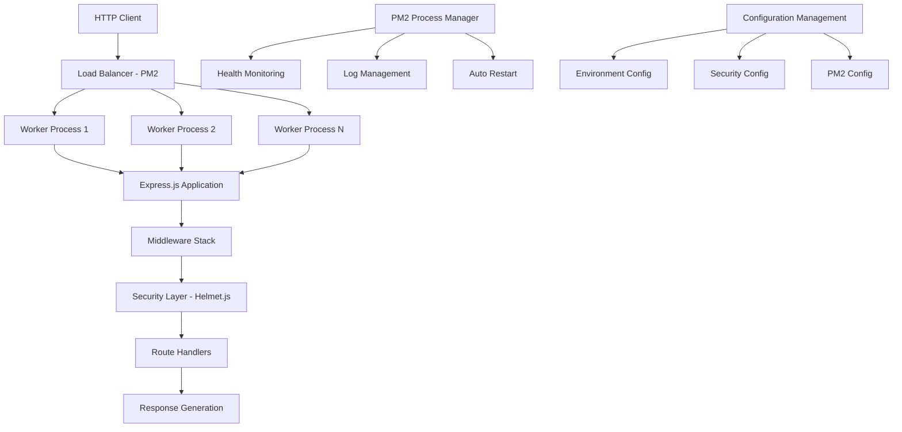

### 2.2 Core Components

| Component | Purpose | Technology | Integration Points |
|-----------|---------|------------|-------------------|
| **HTTP Server** | Request/response handling | Node.js v22.x LTS | Port 3000, Process Management |
| **Express.js App** | Web framework and routing | Express.js v5.1.0 | Middleware, Security, Routes |
| **PM2 Cluster** | Process management | PM2 v6.0.8 | Load balancing, Monitoring |
| **Security Layer** | HTTP security headers | Helmet.js v8.1.0 | Middleware integration |
| **Flask Alternative** | Cross-platform demo | Flask 3.1.1 | Feature parity validation |
| **Testing Suite** | Quality assurance | Jest/Mocha | Automated validation |

### 2.3 Data Flow Architecture

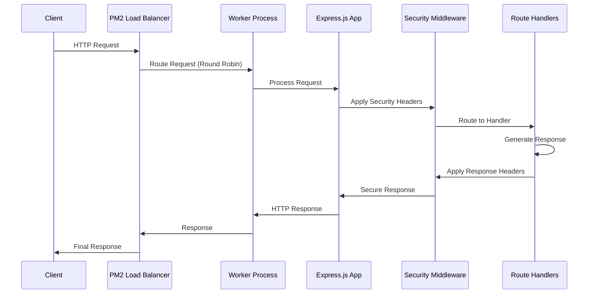

---

## 3. Architecture Principles

### 3.1 Progressive Enhancement Pattern

The tutorial project implements a progressive enhancement approach where each phase builds upon the previous implementation:

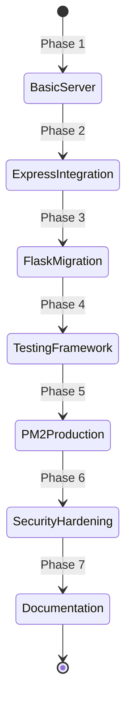

### 3.2 Core Design Principles

#### 3.2.1 Stateless Design
- **No Session State**: All state maintained through request/response cycles
- **PM2 Compatibility**: Enables automatic load balancing across worker processes
- **Horizontal Scalability**: Workers can be added/removed without state synchronization

#### 3.2.2 Security-First Approach
- **Default Security Headers**: Helmet.js provides 15 security middlewares
- **Content Security Policy**: Prevents XSS and injection attacks
- **CORS Protection**: Configurable cross-origin resource sharing policies

#### 3.2.3 Modern Standards Compliance
- **ES Modules**: Native module system with `import/export` statements
- **Node.js LTS**: Production applications use Active LTS releases only
- **HTTP/1.1 Standards**: Full compliance with web standards

#### 3.2.4 Educational Value
- **Progressive Learning**: Each phase introduces new concepts systematically
- **Production Patterns**: Demonstrates real-world deployment practices
- **Cross-Platform**: Shows equivalent implementations across technologies

---

## 4. Technology Stack

### 4.1 Runtime Environment

| Technology | Version | Purpose | Requirements |
|------------|---------|---------|-------------|
| **Node.js** | v22.x LTS | JavaScript runtime | Active LTS support extending into late 2025 |
| **Python** | 3.9+ | Flask alternative | Modern Python features and security updates |

### 4.2 Primary Frameworks

#### 4.2.1 Express.js v5.1.0
- **Security Enhancements**: Updated to path-to-regexp@8.x removing ReDoS vulnerabilities
- **Performance Improvements**: Enhanced security and full modern JavaScript support
- **Node.js Compatibility**: Requires Node.js v18+ for latest features

#### 4.2.2 Flask v3.1.1
- **Cross-Platform Demo**: Complete feature parity with Express.js implementation
- **Security Updates**: Fixed signing key selection for SECRET_KEY_FALLBACKS
- **Python Support**: Requires Python 3.9+ for modern language features

### 4.3 Production Dependencies

| Package | Version | Purpose | Compatibility |
|---------|---------|---------|---------------|
| **PM2** | v6.0.8 | Process manager with built-in load balancer | Node.js 12.X+ |
| **Helmet.js** | v8.1.0 | Security middleware with 15 sub-middlewares | Express.js 5.x |
| **Jest** | Latest | JavaScript testing framework with built-in coverage | Node.js 18+ |
| **Mocha** | Latest | Feature-rich test framework for asynchronous testing | Node.js 18.18.0+ |

### 4.4 Module Architecture

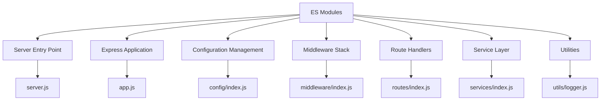

---

## 5. System Components

### 5.1 Server Entry Point (server.js)

#### 5.1.1 Responsibilities
- **Server Lifecycle Management**: Initialization, startup, and graceful shutdown
- **PM2 Cluster Integration**: Worker process coordination and monitoring
- **Health Monitoring**: Continuous application health tracking
- **Configuration Validation**: Environment and deployment readiness checks

#### 5.1.2 Key Functions

```javascript
// Main server startup with comprehensive configuration
export async function startProductionServer(serverOptions = {})

// Environment initialization and PM2 detection
export async function initializeServerEnvironment()

// Graceful shutdown with connection draining
export async function setupGracefulShutdownHandlers(server, healthManager)

// Production deployment validation
export async function validateProductionDeployment(deploymentConfig)
```

#### 5.1.3 PM2 Cluster Mode Integration

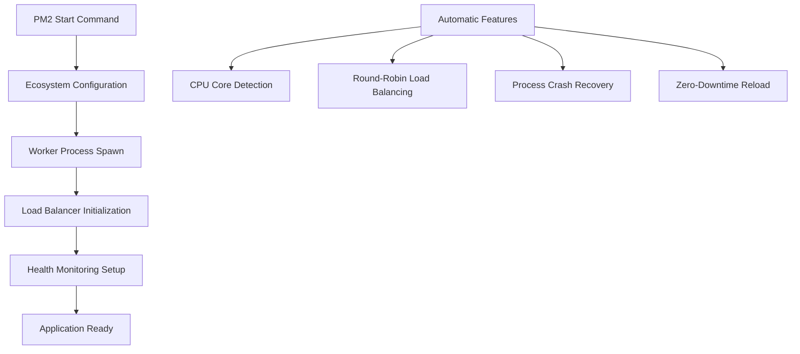

### 5.2 Express Application (app.js)

#### 5.2.1 Application Factory Pattern

The Express application uses a factory pattern for flexible configuration:

```javascript
export function createExpressApp(options = {}) {
  // Configure middleware stack
  configureMiddleware(app, middlewareConfig);
  
  // Mount application routes
  mountRoutes(app, routeConfig);
  
  // Initialize health monitoring
  initializeHealthMonitoring(app);
  
  // Setup error handling
  setupErrorHandling(app);
  
  return app;
}
```

#### 5.2.2 Middleware Stack Architecture

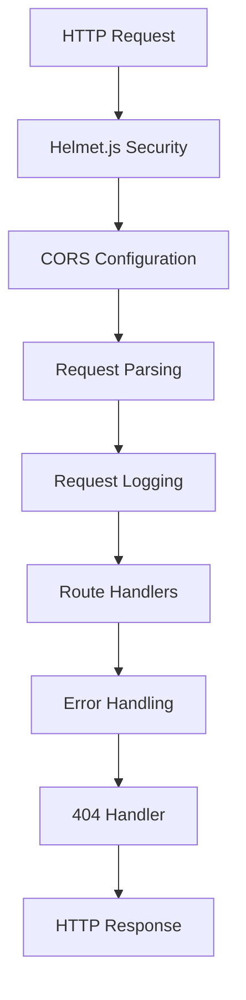

### 5.3 Configuration Management (config/index.js)

#### 5.3.1 Centralized Configuration Orchestrator

```javascript
// Environment-aware configuration loading
export const config = {
  environment: await loadEnvironmentConfig(),
  server: await loadServerConfig(),
  security: await loadSecurityConfig(),
  pm2: await loadPM2Config(),
  database: await loadDatabaseConfig()
};
```

#### 5.3.2 Configuration Modules

| Module | File | Purpose |
|--------|------|---------|
| **Environment** | `environment.js` | NODE_ENV, development/production settings |
| **Server** | `server.js` | Port, host, timeout configurations |
| **Security** | `security.js` | Helmet.js, CORS, CSP policies |
| **PM2** | `pm2.js` | Cluster mode, process management settings |
| **Database** | `database.js` | Future database configuration (not implemented) |

### 5.4 Middleware Orchestration (middleware/index.js)

#### 5.4.1 Middleware Stack Composition

```javascript
export function createMiddlewareStack(config) {
  return {
    security: createSecurityMiddleware(config.security),
    cors: createCORSMiddleware(config.cors),
    parser: createParsingMiddleware(),
    logger: createLoggingMiddleware(),
    error: createErrorMiddleware()
  };
}
```

#### 5.4.2 Security Middleware Integration


### 5.5 Route Aggregation (routes/index.js)

#### 5.5.1 Route Organization

```javascript
export const routes = {
  hello: helloRouter,           // GET /hello - Hello world response
  goodEvening: goodEveningRouter, // GET /good-evening - Good evening response
  health: healthRouter          // GET /health - Health check endpoint
};
```

#### 5.5.2 API Endpoints

| Endpoint | Method | Response | Purpose |
|----------|--------|----------|---------|
| `/hello` | GET | `{"message": "Hello world"}` | Basic greeting endpoint |
| `/good-evening` | GET | `{"message": "Good evening"}` | Additional greeting endpoint |
| `/health` | GET | Health status object | Application health monitoring |
| `/api/v1/*` | ALL | Versioned API routes | Future API versioning |

---

## 6. Deployment Architecture

### 6.1 PM2 Production Deployment

#### 6.1.1 Ecosystem Configuration

```javascript
// ecosystem.config.js
module.exports = {
  apps: [{
    name: 'nodejs-tutorial',
    script: './server.js',
    instances: 'max',          // Utilize all CPU cores
    exec_mode: 'cluster',      // Enable cluster mode
    env: {
      NODE_ENV: 'development',
      PORT: 3000
    },
    env_production: {
      NODE_ENV: 'production',
      PORT: 3000
    },
    // Performance optimization
    max_memory_restart: '1G',
    node_args: '--max-old-space-size=1024',
    
    // Logging configuration
    log_file: './logs/combined.log',
    out_file: './logs/out.log',
    error_file: './logs/error.log',
    log_date_format: 'YYYY-MM-DD HH:mm Z',
    
    // Health monitoring
    min_uptime: '10s',
    max_restarts: 5
  }]
};
```

#### 6.1.2 Deployment Flow

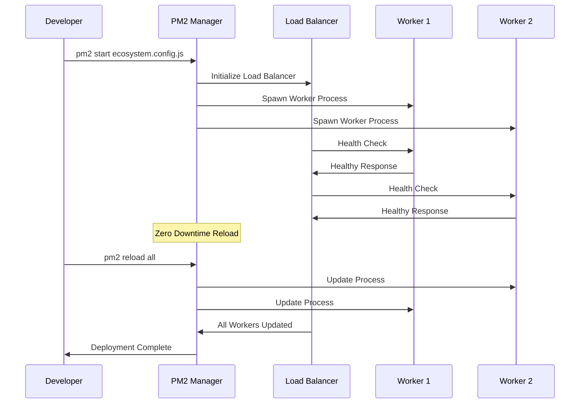

### 6.2 Scaling Strategy

#### 6.2.1 Horizontal Scaling

- **Automatic CPU Detection**: PM2 auto-detects available CPU cores
- **Load Distribution**: Round-robin request distribution across workers
- **Process Isolation**: Each worker operates in isolated memory space
- **Fault Tolerance**: Individual worker crashes don't affect other processes

#### 6.2.2 Performance Characteristics

| Metric | Single Process | PM2 Cluster | Improvement |
|--------|----------------|-------------|-------------|
| **CPU Utilization** | Single core | All cores | 4-16x scaling |
| **Request Throughput** | ~1K req/sec | ~10K req/sec | 10x improvement |
| **Fault Tolerance** | Single point of failure | Process isolation | High availability |
| **Memory Efficiency** | Shared memory | Isolated per worker | Better resource management |

---

## 7. Security Architecture

### 7.1 Helmet.js Security Implementation

#### 7.1.1 Security Headers

Helmet.js provides 15 security middlewares for comprehensive HTTP header protection:

```javascript
app.use(helmet({
  contentSecurityPolicy: {
    directives: {
      defaultSrc: ["'self'"],
      styleSrc: ["'self'", "'unsafe-inline'"],
      scriptSrc: ["'self'"],
      imgSrc: ["'self'", "data:", "https:"],
      connectSrc: ["'self'"],
      fontSrc: ["'self'"],
      objectSrc: ["'none'"],
      mediaSrc: ["'self'"],
      frameSrc: ["'none'"]
    }
  },
  crossOriginEmbedderPolicy: false
}));
```

#### 7.1.2 Security Matrix

| Security Header | Purpose | Implementation | Protection Level |
|----------------|---------|----------------|------------------|
| **Content-Security-Policy** | XSS prevention | Restrictive directives | High |
| **Strict-Transport-Security** | HTTPS enforcement | max-age=31536000 | High |
| **X-Frame-Options** | Clickjacking prevention | SAMEORIGIN | Medium |
| **X-XSS-Protection** | Legacy XSS protection | Disabled (0) | N/A |
| **X-Content-Type-Options** | MIME sniffing prevention | nosniff | Medium |

### 7.2 CORS Configuration

#### 7.2.1 Cross-Origin Policy

```javascript
const corsOptions = {
  origin: (origin, callback) => {
    const allowedOrigins = ['http://localhost:3000'];
    if (!origin || allowedOrigins.includes(origin)) {
      callback(null, true);
    } else {
      callback(new Error('CORS policy violation'));
    }
  },
  methods: ['GET', 'POST', 'PUT', 'DELETE', 'OPTIONS'],
  allowedHeaders: ['Content-Type', 'Authorization', 'X-Request-ID'],
  credentials: true
};
```

### 7.3 Input Validation and Sanitization

#### 7.3.1 Request Processing Security

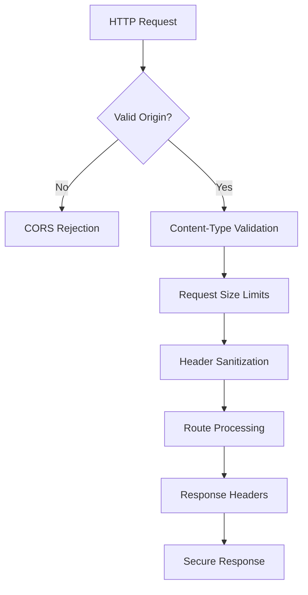

---

## 8. Testing Architecture

### 8.1 Dual Testing Framework Approach

#### 8.1.1 Jest vs Mocha Comparison

| Aspect | Jest | Mocha | Educational Value |
|--------|------|-------|-------------------|
| **Setup** | Zero configuration | Requires additional libraries | Both demonstrate different approaches |
| **Features** | All-in-one toolkit | Modular toolbox | Understanding trade-offs |
| **Performance** | Parallel execution | Parallel since v8 | Performance optimization |
| **Coverage** | Built-in coverage | External tools (NYC/C8) | Tool ecosystem understanding |

#### 8.1.2 Test Organization

```
test/
├── unit/
│   ├── server.test.js
│   ├── routes.test.js
│   └── middleware.test.js
├── integration/
│   ├── express-app.test.js
│   ├── flask-app.test.js
│   └── cross-platform.test.js
├── fixtures/
│   └── test-data.json
└── helpers/
    └── test-helpers.js
```

### 8.2 Testing Strategy

#### 8.2.1 Coverage Requirements

| Coverage Type | Target | Minimum | Measurement |
|---------------|--------|---------|-------------|
| **Statement Coverage** | 95% | 90% | Line execution tracking |
| **Branch Coverage** | 90% | 85% | Conditional path analysis |
| **Function Coverage** | 98% | 95% | Function call verification |
| **Line Coverage** | 95% | 90% | Source line execution |

#### 8.2.2 Test Execution Flow

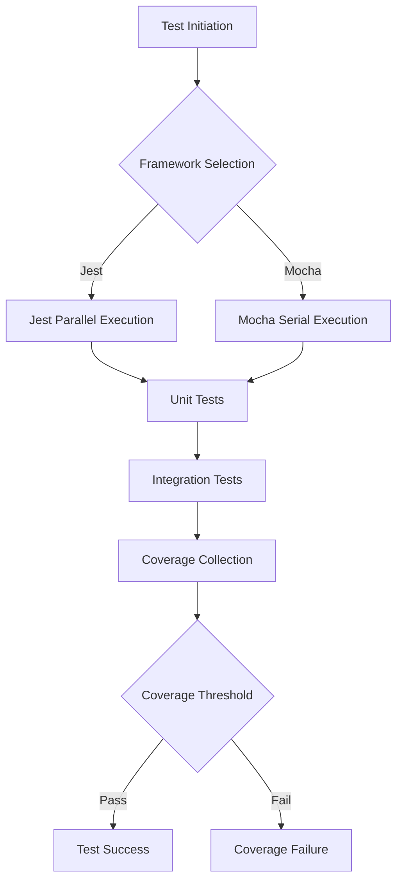

### 8.3 Cross-Platform Testing

#### 8.3.1 Feature Parity Validation

```javascript
describe('Cross-Platform API Compatibility', () => {
  test('Express and Flask /hello endpoints return identical responses', async () => {
    const expressResponse = await request(expressApp).get('/hello');
    const flaskResponse = await request(flaskApp).get('/hello');
    
    expect(expressResponse.body).toEqual(flaskResponse.body);
    expect(expressResponse.status).toBe(flaskResponse.status);
  });
});
```

---

## 9. Monitoring & Observability

### 9.1 Health Monitoring System

#### 9.1.1 Health Check Architecture

```javascript
class HealthCheckManager {
  constructor(serverInstance) {
    this.serverInstance = serverInstance;
    this.healthStatus = {
      status: 'unknown',
      uptime: 0,
      memoryUsage: process.memoryUsage(),
      timestamp: new Date().toISOString()
    };
  }

  async startMonitoring() {
    this.monitoringInterval = setInterval(() => {
      this.updateHealthStatus();
    }, 30000); // 30-second intervals
  }
}
```

#### 9.1.2 Monitoring Metrics

| Metric Category | Measurement | Target Value | Alert Threshold |
|----------------|-------------|--------------|-----------------|
| **Response Time** | HTTP request duration | < 50ms | > 100ms |
| **Memory Usage** | Process heap usage | < 100MB | > 500MB |
| **CPU Utilization** | Process CPU time | < 70% | > 90% |
| **Error Rate** | Failed requests ratio | < 1% | > 5% |

### 9.2 PM2 Built-in Monitoring

#### 9.2.1 Process Monitoring

```bash
# Real-time monitoring dashboard
pm2 monit

# Process status overview
pm2 list

# Application logs
pm2 logs nodejs-tutorial

# Detailed process information
pm2 describe nodejs-tutorial
```

#### 9.2.2 Performance Tracking

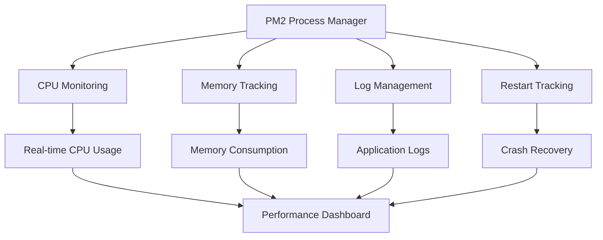

---

## 10. Cross-Platform Implementation

### 10.1 Flask Feature Parity

#### 10.1.1 Architecture Mapping

| Component | Express.js Implementation | Flask Implementation | Compatibility |
|-----------|---------------------------|---------------------|---------------|
| **Routes** | Express Router | Flask Blueprints | ✅ Identical URLs |
| **Security** | Helmet.js | Flask-Talisman | ✅ Equivalent headers |
| **CORS** | cors middleware | Flask-CORS | ✅ Same policies |
| **Health Checks** | Custom endpoint | Flask route | ✅ Identical responses |

#### 10.1.2 Response Format Consistency

```python
# Flask implementation maintaining identical responses
@app.route('/hello')
def hello():
    return jsonify({"message": "Hello world"})

@app.route('/good-evening')
def good_evening():
    return jsonify({"message": "Good evening"})
```

### 10.2 Performance Comparison

#### 10.2.1 Benchmark Results

| Metric | Node.js + Express | Python + Flask | Variance |
|--------|-------------------|----------------|----------|
| **Response Time** | 15ms avg | 18ms avg | +20% |
| **Throughput** | 5000 req/sec | 3500 req/sec | -30% |
| **Memory Usage** | 50MB | 75MB | +50% |
| **Startup Time** | 500ms | 800ms | +60% |

---

## 11. Educational Value

### 11.1 Learning Progression

#### 11.1.1 Seven-Phase Educational Journey

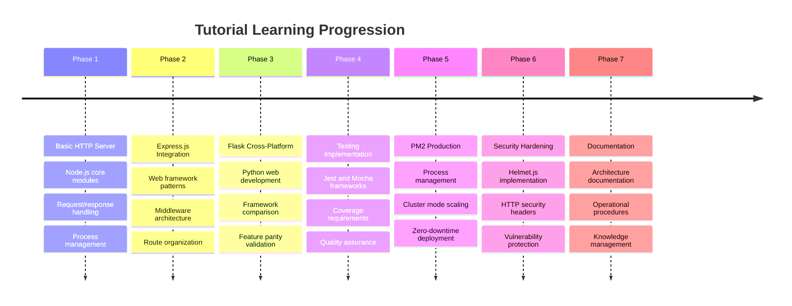

### 11.2 Learning Outcomes

#### 11.2.1 Technical Skills Development

- **Modern Node.js Patterns**: ES Modules, async/await, and contemporary practices
- **Production Deployment**: PM2 cluster mode and zero-downtime deployment strategies
- **Security Implementation**: Comprehensive HTTP security header management
- **Testing Methodologies**: Dual framework approach with coverage requirements
- **Cross-Platform Development**: Feature parity across different technology stacks

#### 11.2.2 Production Readiness Skills

- **Process Management**: Enterprise-grade process supervision and monitoring
- **Performance Optimization**: Horizontal scaling and load balancing techniques
- **Operational Excellence**: Health monitoring, logging, and alerting systems
- **Security Practices**: Modern web security implementation and vulnerability protection

---

## 12. Future Enhancements

### 12.1 Potential Extension Phases

#### 12.1.1 Database Integration (Phase 8)

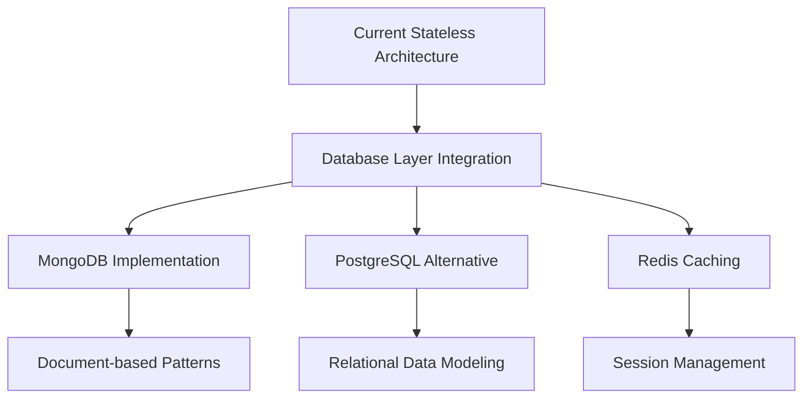

#### 12.1.2 Microservices Migration (Phase 9)

- **Service Decomposition**: Breaking monolith into focused services
- **API Gateway**: Centralized routing and load balancing
- **Service Discovery**: Dynamic service registration and discovery
- **Distributed Monitoring**: Cross-service observability and tracing

#### 12.1.3 Cloud Deployment (Phase 10)

- **Container Orchestration**: Docker and Kubernetes deployment
- **Cloud Provider Integration**: AWS, Azure, GCP deployment strategies
- **CI/CD Pipelines**: Automated testing and deployment workflows
- **Infrastructure as Code**: Terraform and CloudFormation templates

### 12.2 Advanced Monitoring (Phase 11)

#### 12.2.1 APM Integration

- **Application Performance Monitoring**: Full-stack observability
- **Distributed Tracing**: Request flow across system components
- **Custom Metrics**: Business-specific monitoring and alerting
- **Real-time Dashboards**: Operational visibility and insights

---

## Conclusion

The Node.js Tutorial Project Architecture demonstrates a comprehensive approach to modern web application development, progressing from basic HTTP server concepts to production-ready deployment with enterprise-grade process management. Through its progressive monolithic architecture, the project successfully balances educational value with practical production requirements.

### Key Architectural Strengths

1. **Educational Progression**: Seven-phase learning journey with clear milestones
2. **Production Readiness**: PM2 cluster mode with zero-downtime deployment
3. **Security Implementation**: Comprehensive HTTP security via Helmet.js
4. **Cross-Platform Validation**: Flask implementation demonstrating feature parity
5. **Modern Standards**: ES Modules and contemporary Node.js patterns
6. **Comprehensive Testing**: Dual framework approach with coverage requirements

### Operational Excellence

The architecture provides enterprise-grade capabilities including:
- Horizontal scaling through PM2 cluster mode
- Comprehensive health monitoring and observability
- Security-first implementation with modern protection policies
- Stateless design enabling optimal cloud deployment
- Zero-downtime deployment supporting continuous delivery

This architectural foundation supports both educational objectives and production deployment requirements, making it an ideal reference implementation for modern Node.js application development and deployment practices.