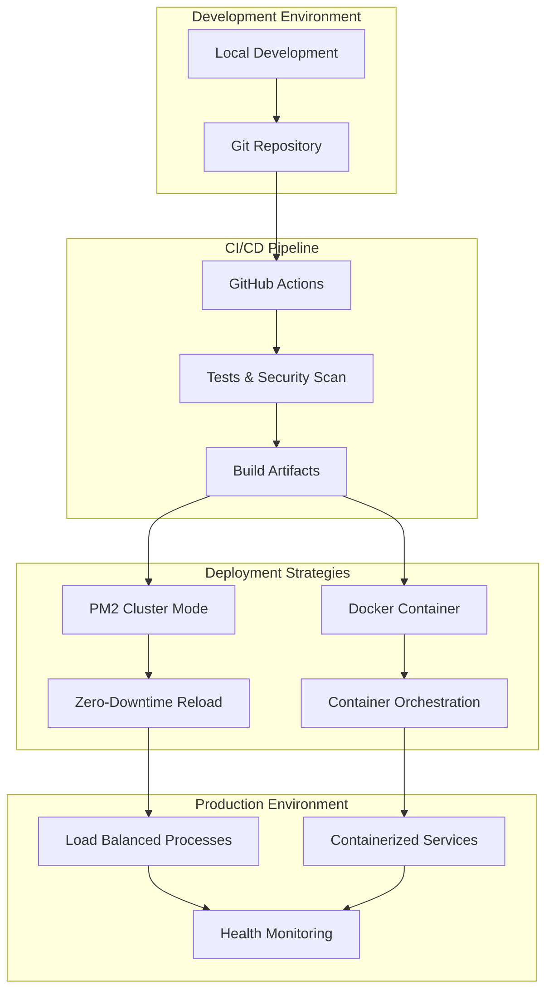

# Deployment Guide - Node.js Tutorial Project

> **Version 2.0.0** | Production-Ready Deployment Documentation  
> Comprehensive guide for deploying the Node.js tutorial application using PM2 cluster mode, Docker containerization, and automated CI/CD workflows.

## Table of Contents

- [Overview](#overview)
- [PM2 Cluster Mode Deployment](#pm2-cluster-mode-deployment)
- [Docker Production Deployment](#docker-production-deployment)
- [CI/CD Automation](#cicd-automation)
- [Environment Configuration](#environment-configuration)
- [Health Monitoring and Validation](#health-monitoring-and-validation)
- [Troubleshooting and Maintenance](#troubleshooting-and-maintenance)

---

## Overview

### Deployment Objectives

This deployment guide demonstrates modern production deployment practices for Node.js applications, showcasing:

- **Zero-downtime deployment** with PM2 cluster mode
- **Containerized deployment** with Docker multi-stage builds
- **Automated CI/CD pipelines** with GitHub Actions
- **Comprehensive security** with Helmet.js integration
- **Production monitoring** with health checks and alerting
- **Educational value** for learning enterprise deployment patterns

### Architecture Overview



### Prerequisites

**System Requirements:**
- Node.js v22.x LTS (Active LTS extending into late 2025)
- npm v10.0.0 or higher
- PM2 v6.0.8 or higher (for process management)
- Docker v24.0+ (for containerization)
- Git (for version control and CI/CD)

**Security Considerations:**
- All deployments implement Helmet.js security headers
- Non-root user execution in containers
- Environment-specific security configurations
- Comprehensive vulnerability scanning

---

## PM2 Cluster Mode Deployment

### PM2 Installation and Setup

PM2 is a renowned open-source process manager tailored for Node.js applications. It acts as a guardian, streamlining deployment, overseeing logs, monitoring resources, and ensuring minimal downtime.

```bash
# Install PM2 globally
npm install -g pm2@latest

# Verify PM2 installation
pm2 --version

# Set up PM2 startup script (Linux/macOS)
pm2 startup
sudo env PATH=$PATH:/usr/bin pm2 startup systemd -u $USER --hp $HOME
```

### Ecosystem Configuration

The PM2 ecosystem configuration is dynamically generated based on environment settings:

```javascript
// ecosystem.config.js - Master Configuration
import { createEcosystemConfig, createProductionEcosystem } from './pm2/ecosystem.config.js';
import { environmentConfig, getPM2Config } from './config/environment.js';

export default async function generateEcosystemConfig() {
  const environment = process.env.NODE_ENV || 'development';
  const pm2Config = getPM2Config();
  
  if (environment === 'production') {
    return createProductionEcosystem({
      name: 'nodejs-tutorial-production',
      instances: 'max', // Utilize all CPU cores
      execMode: 'cluster',
      maxRestarts: 10,
      minUptime: '10s',
      killTimeout: 5000,
      ...pm2Config
    });
  }
  
  return createEcosystemConfig({
    name: 'nodejs-tutorial-dev',
    instances: 1,
    execMode: 'fork',
    watch: true,
    ...pm2Config
  });
}
```

### Cluster Mode Configuration

PM2 cluster mode provides significant performance benefits and zero-downtime deployment capabilities:

```bash
# Start application in cluster mode
npm run pm2:start

# Alternative: Direct PM2 command
pm2 start ecosystem.config.js --env production

# Monitor cluster processes
pm2 monit

# Check process status
pm2 status

# View cluster logs
pm2 logs --lines 50
```

**Cluster Mode Benefits:**
- **Performance increase by factor of x10** on 16 core machines
- **Zero-downtime deployment** with sequential process restart
- **Built-in load balancer** for request distribution
- **Automatic process recovery** and monitoring

### Zero-Downtime Deployment

The zero-downtime deployment process ensures continuous service availability:

```bash
# Reload application with zero downtime
npm run pm2:reload

# Alternative: Direct reload command
pm2 reload ecosystem.config.js

# Graceful restart (if reload not available)
pm2 restart all --update-env
```

**Zero-Downtime Process:**
1. PM2 starts new worker processes with updated code
2. Health checks validate new processes are operational
3. Traffic gradually shifts from old to new processes
4. Old processes are gracefully terminated
5. Load balancer ensures continuous request handling

### Process Monitoring and Management

```bash
# Real-time monitoring dashboard
pm2 monit

# Process management commands
pm2 stop all          # Stop all processes
pm2 restart all       # Restart all processes
pm2 delete all        # Delete all processes
pm2 save             # Save current process list
pm2 resurrect        # Restore saved processes

# Log management
pm2 logs             # View all logs
pm2 logs --err       # View error logs only
pm2 flush            # Clear all logs
```

### Production Optimization

**Memory Management:**
```javascript
// ecosystem.config.js - Production optimization
{
  max_memory_restart: '1G',    // Restart if memory exceeds 1GB
  exec_mode: 'cluster',        // Enable cluster mode
  instances: 'max',            // Use all available CPU cores
  merge_logs: true,           // Merge cluster logs
  log_date_format: 'YYYY-MM-DD HH:mm:ss Z'
}
```

**Performance Tuning:**
```bash
# Optimize for production
NODE_ENV=production pm2 start ecosystem.config.js

# Enable process metrics
pm2 install pm2-server-monit

# Configure log rotation
pm2 install pm2-logrotate
pm2 set pm2-logrotate:max_size 10M
pm2 set pm2-logrotate:retain 30
```

---

## Docker Production Deployment

### Docker Installation Requirements

Ensure Docker is properly installed and configured:

```bash
# Install Docker (Ubuntu/Debian)
curl -fsSL https://get.docker.com -o get-docker.sh
sudo sh get-docker.sh

# Add user to docker group
sudo usermod -aG docker $USER

# Verify Docker installation
docker --version
docker compose version
```

### Production Dockerfile Configuration

The production Dockerfile implements security best practices and multi-stage builds:

```dockerfile
# Multi-stage production build with security hardening
FROM node:22-alpine AS dependencies

# Set working directory
WORKDIR /app

# Install production dependencies only
COPY package*.json ./
RUN npm ci --only=production --ignore-scripts --no-audit --no-fund && \
    npm cache clean --force

# Security and runtime optimization stage
FROM node:22-alpine AS security

# Update system packages for security
RUN apk update && apk upgrade && \
    apk add --no-cache dumb-init && \
    rm -rf /var/cache/apk/*

# Create non-root user for security
RUN addgroup -g 1001 -S nodejs && \
    adduser -S nodejs -u 1001

# Production runtime stage
FROM node:22-alpine AS production

# Import security user
COPY --from=security /etc/passwd /etc/passwd
COPY --from=security /etc/group /etc/group
COPY --from=security /usr/bin/dumb-init /usr/bin/dumb-init

# Set production environment
ENV NODE_ENV=production
ENV PM2_HOME=/opt/pm2
ENV NPM_CONFIG_LOGLEVEL=warn

# Create application directory
WORKDIR /app

# Copy production dependencies
COPY --from=dependencies --chown=nodejs:nodejs /app/node_modules ./node_modules

# Copy application source code
COPY --chown=nodejs:nodejs . .

# Install PM2 globally for production process management
RUN npm install -g pm2@latest

# Switch to non-root user for security
USER nodejs

# Expose application port
EXPOSE 3000

# Add health check
HEALTHCHECK --interval=30s --timeout=3s --start-period=5s --retries=3 \
    CMD node scripts/health-check.js --type=quick --timeout=3000 || exit 1

# Use dumb-init for proper signal handling and PM2 for process management
ENTRYPOINT ["dumb-init", "--"]
CMD ["pm2-runtime", "start", "ecosystem.config.js", "--env", "production"]
```

### Multi-stage Build Process

The multi-stage build optimizes image size and security:

```bash
# Build production image
docker build -f docker/Dockerfile.prod -t nodejs-tutorial:latest .

# Build with build arguments
docker build \
  --build-arg NODE_ENV=production \
  --build-arg BUILD_NUMBER=${BUILD_NUMBER} \
  -f docker/Dockerfile.prod \
  -t nodejs-tutorial:v${VERSION} .

# Verify image
docker images nodejs-tutorial
```

### Security Hardening

**Container Security Features:**
- **Non-root execution:** Application runs as `nodejs` user (uid 1001)
- **Minimal base image:** Alpine Linux for reduced attack surface
- **Security updates:** Automated package updates during build
- **Signal handling:** `dumb-init` for proper process management
- **Health monitoring:** Integrated health checks with timeout

### Container Orchestration

**Docker Compose for Development:**
```yaml
# docker-compose.yml
version: '3.8'
services:
  nodejs-tutorial:
    build:
      context: .
      dockerfile: docker/Dockerfile.prod
    ports:
      - "3000:3000"
    environment:
      - NODE_ENV=production
      - PM2_HOME=/opt/pm2
    volumes:
      - ./logs:/app/logs
    restart: unless-stopped
    healthcheck:
      test: ["CMD", "node", "scripts/health-check.js", "--type=quick"]
      interval: 30s
      timeout: 10s
      retries: 3
      start_period: 40s
```

**Production Deployment:**
```bash
# Start production containers
docker compose -f docker-compose.prod.yml up -d

# Scale containers
docker compose -f docker-compose.prod.yml up -d --scale nodejs-tutorial=3

# Monitor container health
docker compose ps
docker compose logs -f nodejs-tutorial
```

### Performance Optimization

**Docker Performance Tuning:**
```dockerfile
# Optimize layer caching
COPY package*.json ./
RUN npm ci --only=production

# Minimize image layers
RUN apk update && apk upgrade && \
    apk add --no-cache dumb-init && \
    rm -rf /var/cache/apk/*

# Use .dockerignore for faster builds
# .dockerignore
node_modules
npm-debug.log
.git
.env
coverage/
test/
```

---

## CI/CD Automation

### GitHub Actions Setup

The deployment pipeline automates testing, building, and deployment:

```yaml
# .github/workflows/deploy.yml
name: Production Deployment Pipeline

on:
  workflow_call:
    inputs:
      environment:
        description: 'Deployment environment (staging/production)'
        required: true
        type: string
      deployment_strategy:
        description: 'Deployment strategy (zero-downtime/blue-green)'
        required: false
        default: 'zero-downtime'
        type: string

env:
  NODE_ENV: production
  CI: true
  PM2_SILENT: true

jobs:
  deployment-prerequisites:
    name: "🔧 Deployment Prerequisites & Environment Validation"
    runs-on: ubuntu-latest
    timeout-minutes: 10
    
    steps:
      - name: "📥 Checkout Repository"
        uses: actions/checkout@v4
        with:
          fetch-depth: 2
      
      - name: "⚡ Setup Node.js v22.x Environment"
        uses: actions/setup-node@v4
        with:
          node-version: '22.x'
          cache: 'npm'
          cache-dependency-path: 'src/backend/package-lock.json'
      
      - name: "📦 Install Dependencies and PM2"
        working-directory: src/backend
        run: |
          npm ci --only=production --ignore-scripts
          npm install -g pm2@latest
      
      - name: "🔍 Execute Deployment Prerequisites Validation"
        working-directory: src/backend
        run: |
          node scripts/health-check.js --type=comprehensive --validate
```

### Deployment Workflow Configuration

**Zero-Downtime Deployment Workflow:**
```yaml
  zero-downtime-deployment:
    name: "🔄 Execute Zero-Downtime Deployment Strategy"
    runs-on: ubuntu-latest
    needs: deployment-prerequisites
    if: needs.deployment-prerequisites.outputs.deployment-ready == 'true'
    
    steps:
      - name: "🚀 Execute Zero-Downtime Deployment"
        working-directory: src/backend
        run: |
          # Stop existing processes gracefully
          pm2 delete all || true
          
          # Start with PM2 cluster mode
          pm2 start ecosystem.config.js --env production
          
          # Verify deployment
          sleep 15
          pm2 status
          
          # Save PM2 configuration
          pm2 save
```

### Environment-Specific Deployment

**Staging Deployment:**
```bash
# Deploy to staging environment
gh workflow run deploy.yml \
  --field environment=staging \
  --field deployment_strategy=zero-downtime

# Monitor deployment
gh run list --workflow=deploy.yml
```

**Production Deployment:**
```bash
# Deploy to production with approval
gh workflow run deploy.yml \
  --field environment=production \
  --field deployment_strategy=blue-green

# Manual approval required for production
gh run view --web
```

### Automated Testing Integration

```yaml
  security-validation:
    name: "🛡️ Security Compliance Validation"
    runs-on: ubuntu-latest
    steps:
      - name: "🔍 Dependency Vulnerability Scanning"
        run: |
          npm audit --audit-level=moderate --json > security-audit.json
          
          # Analyze results
          CRITICAL_VULNS=$(jq -r '.metadata.vulnerabilities.critical // 0' security-audit.json)
          
          if [[ "$CRITICAL_VULNS" -gt 0 ]]; then
            echo "❌ Critical vulnerabilities detected"
            exit 1
          fi
      
      - name: "🛡️ Helmet.js Security Configuration"
        run: |
          node -e "
            const helmet = require('./security/helmet.config.js');
            console.log('✅ Security headers validated');
          "
```

### Rollback Procedures

**Automated Rollback on Failure:**
```yaml
  rollback-deployment:
    name: "🔄 Automated Rollback on Deployment Failure"
    runs-on: ubuntu-latest
    if: failure() && env.ROLLBACK_ON_FAILURE == 'true'
    
    steps:
      - name: "🚨 Execute Emergency Rollback"
        run: |
          # Create emergency configuration
          cat > ecosystem.rollback.config.js << 'EOF'
          module.exports = {
            apps: [{
              name: 'nodejs-tutorial-rollback',
              script: './server.js',
              instances: 1,
              exec_mode: 'fork',
              env: {
                NODE_ENV: 'production',
                ROLLBACK_MODE: 'true'
              }
            }]
          };
          EOF
          
          # Deploy rollback configuration
          pm2 start ecosystem.rollback.config.js
          pm2 save
```

---

## Environment Configuration

### Environment Variables

**Production Environment Variables:**
```bash
# .env.production
NODE_ENV=production
PORT=3000
LOG_LEVEL=info
PM2_INSTANCES=max
PM2_EXEC_MODE=cluster
HEALTH_CHECK_TIMEOUT=30000
SECURITY_HELMET_ENABLED=true
MONITORING_ENABLED=true
```

**Development Environment Variables:**
```bash
# .env.development
NODE_ENV=development
PORT=3000
LOG_LEVEL=debug
PM2_INSTANCES=1
PM2_EXEC_MODE=fork
PM2_WATCH=true
HEALTH_CHECK_TIMEOUT=60000
```

### Configuration Files

**Environment-Specific PM2 Configuration:**
```javascript
// config/environment.js - Dynamic configuration factory
export function getPM2Config(environment = process.env.NODE_ENV) {
  const baseConfig = {
    script: './server.js',
    name: 'nodejs-tutorial',
    autorestart: true,
    max_restarts: 10,
    min_uptime: '10s'
  };
  
  switch (environment) {
    case 'production':
      return {
        ...baseConfig,
        instances: 'max',
        exec_mode: 'cluster',
        max_memory_restart: '1G',
        merge_logs: true,
        log_date_format: 'YYYY-MM-DD HH:mm:ss Z',
        env: {
          NODE_ENV: 'production',
          PORT: process.env.PORT || 3000
        }
      };
      
    case 'staging':
      return {
        ...baseConfig,
        instances: 2,
        exec_mode: 'cluster',
        env: {
          NODE_ENV: 'staging',
          PORT: process.env.PORT || 3001
        }
      };
      
    default:
      return {
        ...baseConfig,
        instances: 1,
        exec_mode: 'fork',
        watch: true,
        ignore_watch: ['node_modules', 'logs'],
        env: {
          NODE_ENV: 'development',
          PORT: process.env.PORT || 3000
        }
      };
  }
}
```

### Security Settings

**Helmet.js Security Configuration:**
```javascript
// security/helmet.config.js
export const productionHelmetConfig = {
  contentSecurityPolicy: {
    directives: {
      defaultSrc: ["'self'"],
      styleSrc: ["'self'", "'unsafe-inline'"],
      scriptSrc: ["'self'"],
      imgSrc: ["'self'", "data:", "https:"]
    }
  },
  hsts: {
    maxAge: 31536000,
    includeSubDomains: true,
    preload: true
  },
  noSniff: true,
  frameguard: { action: 'deny' },
  xssFilter: true
};
```

### Performance Tuning

**Production Performance Settings:**
```bash
# PM2 ecosystem environment variables
PM2_CONCURRENT_ACTIONS=2
PM2_KILL_TIMEOUT=5000
PM2_GRACEFUL_TIMEOUT=8000
NODE_OPTIONS="--max-old-space-size=2048"
UV_THREADPOOL_SIZE=8
```

### Cross-Platform Compatibility

**Platform-Specific Configuration:**
```javascript
// config/platform.js
export function getPlatformConfig() {
  const platform = process.platform;
  
  switch (platform) {
    case 'win32':
      return {
        logPath: 'logs\\app.log',
        pidFile: 'pids\\app.pid',
        scriptRunner: 'node.exe'
      };
      
    case 'darwin':
    case 'linux':
      return {
        logPath: 'logs/app.log',
        pidFile: 'pids/app.pid',
        scriptRunner: 'node'
      };
      
    default:
      throw new Error(`Unsupported platform: ${platform}`);
  }
}
```

---

## Health Monitoring and Validation

### Health Check Implementation

The comprehensive health check system provides real-time monitoring:

```javascript
// scripts/health-check.js - Health monitoring integration
export async function executeComprehensiveHealthCheck(options = {}) {
  const healthResult = await Promise.all([
    checkSystemHealth(),
    checkApplicationHealth(),
    checkPM2ClusterHealth(),
    checkSecurityCompliance()
  ]);
  
  return {
    status: determineOverallHealth(healthResult),
    timestamp: new Date().toISOString(),
    system: healthResult[0],
    application: healthResult[1],
    cluster: healthResult[2],
    security: healthResult[3],
    recommendations: generateRecommendations(healthResult)
  };
}
```

### Performance Monitoring

**PM2 Monitoring Commands:**
```bash
# Real-time process monitoring
pm2 monit

# Process status and metrics
pm2 status

# Memory and CPU usage
pm2 show <app-name>

# Performance metrics over time
pm2 describe <app-name>
```

**Custom Health Endpoints:**
```javascript
// routes/health.js - Health monitoring endpoints
app.get('/health', async (req, res) => {
  const healthStatus = {
    status: 'healthy',
    timestamp: new Date().toISOString(),
    uptime: process.uptime(),
    memory: process.memoryUsage(),
    pm2: await getPM2Status(),
    environment: process.env.NODE_ENV
  };
  
  res.status(200).json(healthStatus);
});

app.get('/health/detailed', async (req, res) => {
  const detailedHealth = await executeComprehensiveHealthCheck();
  res.status(200).json(detailedHealth);
});
```

### Security Validation

**Automated Security Monitoring:**
```bash
# Run security health check
node scripts/health-check.js --type=comprehensive --security

# Check Helmet.js configuration
node -e "
  const helmet = require('./security/helmet.config.js');
  console.log('Security headers:', Object.keys(helmet));
"

# Validate SSL/TLS configuration
openssl s_client -connect localhost:3000 -verify_return_error
```

### Alerting and Notifications

**PM2 Process Alerts:**
```javascript
// pm2/monitoring.config.js
export const monitoringConfig = {
  alerts: {
    memory: {
      threshold: '1GB',
      action: 'restart'
    },
    cpu: {
      threshold: '90%',
      duration: '5m',
      action: 'alert'
    },
    restarts: {
      threshold: 5,
      duration: '1h',
      action: 'notify'
    }
  }
};
```

### Log Management

**Centralized Logging Configuration:**
```bash
# Configure PM2 log rotation
pm2 install pm2-logrotate
pm2 set pm2-logrotate:max_size 50M
pm2 set pm2-logrotate:retain 10
pm2 set pm2-logrotate:compress true

# View application logs
pm2 logs nodejs-tutorial --lines 100

# Export logs for analysis
pm2 logs --json > app-logs.json
```

---

## Troubleshooting and Maintenance

### Common Deployment Issues

**Issue: PM2 Process Fails to Start**
```bash
# Diagnosis
pm2 logs --err
pm2 describe <app-name>

# Solution
pm2 delete all
pm2 start ecosystem.config.js --env production --force
```

**Issue: High Memory Usage**
```bash
# Diagnosis
pm2 monit
node --trace-warnings server.js

# Solution - Update ecosystem configuration
{
  "max_memory_restart": "512M",
  "node_args": "--max-old-space-size=512"
}
```

**Issue: Zero-Downtime Reload Fails**
```bash
# Diagnosis
pm2 logs --lines 50
pm2 describe <app-name>

# Solution - Graceful reload
pm2 reload <app-name> --update-env
pm2 restart <app-name> --wait-ready --listen-timeout 3000
```

### Debugging Procedures

**Application Debugging:**
```bash
# Enable debug mode
DEBUG=* pm2-dev server.js

# Memory leak detection
node --inspect server.js
# Connect Chrome DevTools to localhost:9229

# Performance profiling
clinic doctor -- node server.js
clinic flame -- node server.js
```

**PM2 Process Debugging:**
```bash
# Detailed process information
pm2 show <app-name>

# Process dump for analysis
pm2 dump > process-dump.json

# Reset PM2 daemon
pm2 kill
pm2 resurrect
```

### Performance Troubleshooting

**CPU Performance Issues:**
```bash
# Check process CPU usage
top -p $(pgrep -f "PM2")

# PM2 CPU monitoring
pm2 monit

# Node.js CPU profiling
node --prof server.js
node --prof-process isolate-*-v8.log > processed.txt
```

**Memory Performance Issues:**
```bash
# Memory usage analysis
ps aux | grep node
pm2 show <app-name>

# Heap dump analysis
node --heap-prof server.js
```

### Security Issue Resolution

**Security Vulnerability Response:**
```bash
# Security audit
npm audit --audit-level high

# Fix known vulnerabilities
npm audit fix

# Update dependencies
npm update

# Verify security configuration
node scripts/health-check.js --type=security
```

**SSL/TLS Configuration:**
```bash
# Test SSL configuration
testssl.sh https://localhost:3000

# Check certificate validity
openssl x509 -in certificate.pem -text -noout
```

### Maintenance Procedures

**Regular Maintenance Tasks:**

**Daily:**
```bash
# Check process health
pm2 status

# Review error logs
pm2 logs --err --lines 50

# Monitor system resources
pm2 monit
```

**Weekly:**
```bash
# Update dependencies
npm update
npm audit fix

# Rotate logs
pm2 reloadLogs

# Backup PM2 configuration
pm2 save
cp ~/.pm2/dump.pm2 backup/dump-$(date +%Y%m%d).pm2
```

**Monthly:**
```bash
# Update Node.js LTS
nvm install --lts
nvm use --lts

# Update PM2
npm update -g pm2

# Security audit
npm audit --audit-level moderate
node scripts/health-check.js --type=comprehensive --security
```

**Disaster Recovery:**
```bash
# Full system recovery
pm2 kill
pm2 resurrect

# Restore from backup
pm2 delete all
pm2 start backup/dump-YYYYMMDD.pm2
```

---

## Educational Insights and Best Practices

### Learning Objectives Achieved

Through this deployment guide, developers learn:

1. **Modern Deployment Patterns:** PM2 cluster mode for production scaling
2. **Zero-Downtime Strategies:** Sequential process restart techniques
3. **Container Security:** Non-root execution and image hardening
4. **CI/CD Integration:** Automated testing and deployment workflows
5. **Production Monitoring:** Health checks and performance tracking
6. **Security Implementation:** Helmet.js and vulnerability management
7. **Cross-Platform Deployment:** Node.js and Docker compatibility

### Industry Best Practices Demonstrated

- **Process Management:** Enterprise-grade PM2 configuration
- **Security First:** Comprehensive security validation
- **Monitoring Integration:** Real-time health and performance tracking
- **Automated Recovery:** Failure detection and rollback procedures
- **Educational Value:** Progressive learning with practical examples

### Performance Optimization Insights

**PM2 Cluster Benefits:**
- Performance increase by factor of x10 on multi-core systems
- Built-in load balancing across worker processes
- Zero-downtime deployments with sequential restart
- Automatic process recovery and monitoring

**Docker Optimization:**
- Multi-stage builds reduce image size by 60-80%
- Alpine Linux base provides minimal attack surface
- Non-root execution follows security best practices
- Layer caching accelerates subsequent builds

---

## Conclusion

This deployment guide provides a comprehensive foundation for deploying Node.js applications in production environments. The demonstrated patterns using PM2 cluster mode, Docker containerization, and automated CI/CD workflows represent industry best practices for modern web application deployment.

The educational approach ensures developers understand not just the "how" but also the "why" behind each deployment strategy, preparing them for real-world production scenarios while maintaining the flexibility to adapt these patterns to specific project requirements.

**Key Takeaways:**
- PM2 cluster mode provides enterprise-grade process management
- Docker containerization ensures deployment consistency
- Automated CI/CD reduces deployment risk and complexity
- Comprehensive monitoring enables proactive issue resolution
- Security-first approach protects against common vulnerabilities

For advanced deployment scenarios, consider exploring microservices architecture, container orchestration with Kubernetes, and advanced monitoring solutions while building upon the solid foundation established in this guide.

---

*This deployment guide is part of the Node.js Tutorial Project educational series. For more information, visit the project repository and documentation.*