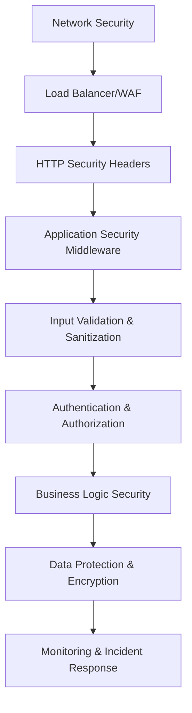
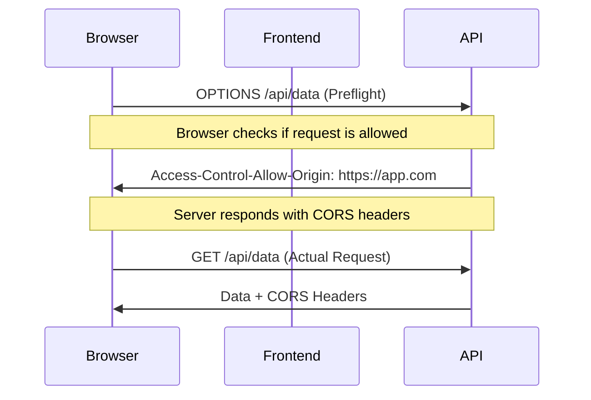
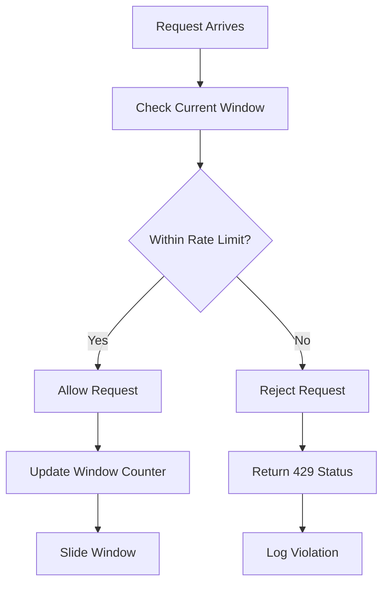
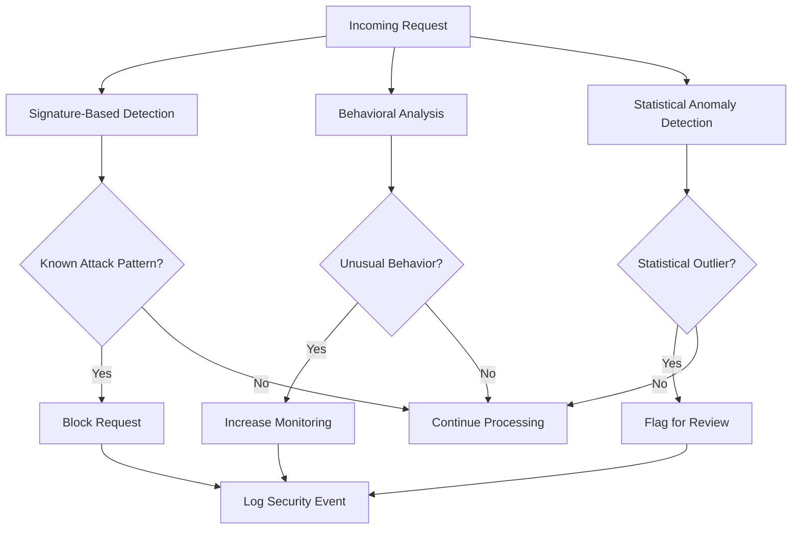

# Phase 4: Security Implementation Tutorial - Enterprise-Grade Web Application Security

Welcome to **Phase 4 of the Node.js Tutorial Project** - the comprehensive security implementation phase! This tutorial builds upon the middleware foundations from Phase 3 and guides you through implementing enterprise-grade security for Express.js applications using modern security practices and industry-standard tools.

## 🎯 Learning Objectives

By completing this tutorial, you will master:

- **Comprehensive HTTP Header Security** with Helmet.js 15 sub-middlewares
- **Content Security Policy (CSP)** implementation for XSS prevention
- **CORS Protection** with environment-specific policies and origin validation
- **Rate Limiting** for DoS attack prevention with PM2 cluster compatibility
- **Threat Detection** patterns and behavioral security analysis
- **Security Monitoring** and event logging for operational awareness
- **Input Validation** and injection attack prevention
- **Production Security Deployment** with PM2 cluster mode and zero-downtime updates
- **Security Testing** methodologies including vulnerability assessment

---

## 📋 Prerequisites

Before starting Phase 4, ensure you have completed:

✅ **Phase 3: Express.js Middleware Implementation** - Understanding of middleware architecture and request/response processing  
✅ **Node.js v22.x LTS** - Modern JavaScript features and security enhancements  
✅ **Express.js v5.1.0** - Latest framework with enhanced security features and ReDoS mitigation  
✅ **Basic HTTP Security Concepts** - Understanding of HTTP headers, HTTPS, and web security fundamentals  
✅ **PM2 Process Management** - Process clustering and production deployment concepts  

### Required Knowledge Foundation

- HTTP request/response lifecycle and middleware execution order
- Environment variables and configuration management
- Asynchronous JavaScript (promises, async/await) for security middleware
- JSON data handling and API request processing
- Basic understanding of web application vulnerabilities (XSS, CSRF, injection attacks)

---

## 🌐 Web Application Security Fundamentals

### Understanding the Modern Threat Landscape

Web applications face increasingly sophisticated security threats. The **OWASP Top 10** identifies the most critical security risks:

1. **Broken Access Control** - Unauthorized access to application features
2. **Cryptographic Failures** - Weak encryption and data protection
3. **Injection Attacks** - SQL injection, XSS, and command injection
4. **Insecure Design** - Security flaws in application architecture
5. **Security Misconfiguration** - Insecure default configurations
6. **Vulnerable Components** - Outdated libraries with known vulnerabilities
7. **Authentication Failures** - Weak authentication and session management
8. **Data Integrity Failures** - Insufficient validation of data and software updates
9. **Logging Failures** - Inadequate security monitoring and alerting
10. **Server-Side Request Forgery** - Unauthorized server-side requests

### Defense-in-Depth Security Architecture

Effective web application security implements **multiple layers of protection**:



**Layer 1: Network Security** - Firewalls, DDoS protection, network segmentation  
**Layer 2: HTTP Security Headers** - Browser security policies and attack prevention  
**Layer 3: Application Middleware** - Request validation, rate limiting, CORS protection  
**Layer 4: Input Validation** - Injection attack prevention and data sanitization  
**Layer 5: Authentication** - User identity verification and session management  
**Layer 6: Authorization** - Access control and permission enforcement  
**Layer 7: Business Logic** - Application-specific security rules and validation  
**Layer 8: Data Protection** - Encryption, secure storage, and privacy controls  
**Layer 9: Monitoring** - Security event logging, threat detection, and incident response  

---

## 🛡️ Helmet.js Comprehensive Security Implementation

**Helmet.js v8.1.0** provides 15 sub-middlewares for comprehensive HTTP header security. Each middleware addresses specific attack vectors and browser security policies.

### Understanding Helmet.js Architecture

Helmet.js acts as a **security middleware orchestrator**, automatically applying HTTP security headers:

```javascript
// Basic Helmet.js integration
import helmet from 'helmet'; // v8.1.0
import express from 'express';

const app = express();

// Apply all 15 Helmet.js sub-middlewares
app.use(helmet());
```

### The 15 Helmet.js Sub-Middlewares

| Sub-Middleware | Security Header | Attack Prevention | Browser Support |
|---|---|---|---|
| `contentSecurityPolicy` | `Content-Security-Policy` | XSS, injection attacks | Modern browsers |
| `crossOriginEmbedderPolicy` | `Cross-Origin-Embedder-Policy` | Spectre attacks | Chrome 83+, Firefox 79+ |
| `crossOriginOpenerPolicy` | `Cross-Origin-Opener-Policy` | Process isolation | Chrome 83+, Firefox 79+ |
| `crossOriginResourcePolicy` | `Cross-Origin-Resource-Policy` | Resource access control | Modern browsers |
| `dnsPrefetchControl` | `X-DNS-Prefetch-Control` | DNS prefetch attacks | All browsers |
| `expectCt` | `Expect-CT` | Certificate transparency | Chrome, Safari |
| `frameguard` | `X-Frame-Options` | Clickjacking | All browsers |
| `hidePoweredBy` | Removes `X-Powered-By` | Information disclosure | All browsers |
| `hsts` | `Strict-Transport-Security` | Protocol downgrade | Modern browsers |
| `ieNoOpen` | `X-Download-Options` | IE download security | Internet Explorer |
| `noSniff` | `X-Content-Type-Options` | MIME sniffing | All browsers |
| `originAgentCluster` | `Origin-Agent-Cluster` | Process isolation | Chrome 88+ |
| `permittedCrossDomainPolicies` | `X-Permitted-Cross-Domain-Policies` | Flash/PDF security | Legacy support |
| `referrerPolicy` | `Referrer-Policy` | Privacy protection | Modern browsers |
| `xssFilter` | `X-XSS-Protection` | XSS protection (disabled) | Legacy browsers |

### Environment-Specific Helmet Configuration

Create comprehensive Helmet configurations for different environments:

```javascript
// src/backend/security/helmet.config.js
import { SECURITY_CONSTANTS } from '../utils/constants.js';

/**
 * Creates environment-specific Helmet.js configuration
 * @param {string} environment - Target environment (development|staging|production)
 * @param {object} options - Additional configuration options
 * @returns {object} Helmet.js configuration object
 */
export function createHelmetConfig(environment = 'production', options = {}) {
  const baseConfig = {
    // Content Security Policy - XSS Prevention
    contentSecurityPolicy: {
      directives: {
        defaultSrc: ["'self'"],
        scriptSrc: environment === 'development' 
          ? ["'self'", "'unsafe-inline'", "'unsafe-eval'"] 
          : ["'self'"],
        styleSrc: ["'self'", "'unsafe-inline'", "https:"],
        imgSrc: ["'self'", "data:", "https:"],
        connectSrc: ["'self'"],
        fontSrc: ["'self'", "https:", "data:"],
        objectSrc: ["'none'"],
        mediaSrc: ["'self'"],
        frameSrc: ["'none'"],
        childSrc: ["'none'"],
        formAction: ["'self'"],
        frameAncestors: ["'none'"],
        baseUri: ["'self'"],
        upgradeInsecureRequests: environment === 'production' ? [] : null
      }
    },

    // Strict Transport Security - HTTPS Enforcement
    hsts: {
      maxAge: 31536000, // 1 year
      includeSubDomains: true,
      preload: environment === 'production'
    },

    // Frame Protection - Clickjacking Prevention
    frameguard: {
      action: 'deny' // Block all iframe embedding
    },

    // MIME Type Protection - Content Sniffing Prevention
    noSniff: true,

    // Referrer Policy - Privacy Protection
    referrerPolicy: {
      policy: environment === 'production' 
        ? 'strict-origin-when-cross-origin' 
        : 'no-referrer-when-downgrade'
    },

    // Cross-Origin Policies - Process Isolation
    crossOriginEmbedderPolicy: {
      policy: environment === 'production' ? 'require-corp' : false
    },
    
    crossOriginOpenerPolicy: {
      policy: 'same-origin'
    },
    
    crossOriginResourcePolicy: {
      policy: 'same-origin'
    },

    // DNS Prefetch Control - Privacy Protection
    dnsPrefetchControl: {
      allow: environment === 'development'
    },

    // Information Disclosure Prevention
    hidePoweredBy: true,

    // Legacy Browser Support
    ieNoOpen: true,
    permittedCrossDomainPolicies: {
      permittedPolicies: 'none'
    },

    // Modern Browser Features
    originAgentCluster: true,

    // Disable Legacy XSS Filter (modern CSP is better)
    xssFilter: false
  };

  // Merge with custom options
  return mergeHelmetConfig(baseConfig, options);
}

/**
 * Validates Helmet.js configuration for security compliance
 * @param {object} config - Helmet configuration to validate
 * @returns {object} Validation results with recommendations
 */
export function validateHelmetConfig(config) {
  const validation = {
    isValid: true,
    issues: [],
    recommendations: [],
    score: 0
  };

  // Validate CSP configuration
  if (!config.contentSecurityPolicy || !config.contentSecurityPolicy.directives) {
    validation.issues.push('Content Security Policy not configured');
    validation.isValid = false;
  } else {
    // Check for unsafe CSP directives
    const csp = config.contentSecurityPolicy.directives;
    if (csp.scriptSrc?.includes("'unsafe-eval'")) {
      validation.recommendations.push('Remove unsafe-eval from script-src for better security');
    }
    if (csp.objectSrc !== "none" && !csp.objectSrc?.includes("'none'")) {
      validation.recommendations.push('Set object-src to none to prevent plugin exploitation');
    }
  }

  // Validate HSTS configuration
  if (!config.hsts || config.hsts.maxAge < 31536000) {
    validation.recommendations.push('HSTS max-age should be at least 1 year (31536000 seconds)');
  }

  // Calculate security score
  validation.score = calculateSecurityScore(config);
  
  return validation;
}

/**
 * Creates development-specific Helmet configuration with relaxed policies
 */
export function createDevelopmentHelmetConfig(options = {}) {
  return createHelmetConfig('development', {
    contentSecurityPolicy: {
      directives: {
        defaultSrc: ["'self'"],
        scriptSrc: ["'self'", "'unsafe-inline'", "'unsafe-eval'", "localhost:*"],
        styleSrc: ["'self'", "'unsafe-inline'"],
        imgSrc: ["'self'", "data:", "http:", "https:"],
        connectSrc: ["'self'", "ws:", "wss:", "localhost:*"],
        fontSrc: ["'self'", "data:", "https:"]
      }
    },
    ...options
  });
}

/**
 * Creates production-specific Helmet configuration with strict security
 */
export function createProductionHelmetConfig(options = {}) {
  return createHelmetConfig('production', {
    contentSecurityPolicy: {
      directives: {
        defaultSrc: ["'self'"],
        scriptSrc: ["'self'"],
        styleSrc: ["'self'", "https:"],
        imgSrc: ["'self'", "https:", "data:"],
        connectSrc: ["'self'"],
        fontSrc: ["'self'", "https:"],
        objectSrc: ["'none'"],
        frameSrc: ["'none'"],
        formAction: ["'self'"],
        frameAncestors: ["'none'"],
        upgradeInsecureRequests: []
      }
    },
    hsts: {
      maxAge: 63072000, // 2 years
      includeSubDomains: true,
      preload: true
    },
    crossOriginEmbedderPolicy: { policy: 'require-corp' },
    ...options
  });
}

// Helper function to merge Helmet configurations
function mergeHelmetConfig(baseConfig, customConfig) {
  // Deep merge implementation for Helmet configurations
  return {
    ...baseConfig,
    ...customConfig,
    contentSecurityPolicy: {
      ...baseConfig.contentSecurityPolicy,
      ...customConfig.contentSecurityPolicy,
      directives: {
        ...baseConfig.contentSecurityPolicy?.directives,
        ...customConfig.contentSecurityPolicy?.directives
      }
    }
  };
}

// Helper function to calculate security score
function calculateSecurityScore(config) {
  let score = 0;
  const maxScore = 100;
  
  // CSP configuration (30 points)
  if (config.contentSecurityPolicy?.directives) {
    score += 20;
    if (config.contentSecurityPolicy.directives.objectSrc?.includes("'none'")) score += 5;
    if (!config.contentSecurityPolicy.directives.scriptSrc?.includes("'unsafe-eval'")) score += 5;
  }
  
  // HSTS configuration (20 points)
  if (config.hsts) {
    score += 10;
    if (config.hsts.maxAge >= 31536000) score += 5;
    if (config.hsts.includeSubDomains) score += 3;
    if (config.hsts.preload) score += 2;
  }
  
  // Frame protection (15 points)
  if (config.frameguard) score += 15;
  
  // Other headers (35 points)
  if (config.noSniff) score += 5;
  if (config.referrerPolicy) score += 5;
  if (config.crossOriginOpenerPolicy) score += 5;
  if (config.crossOriginResourcePolicy) score += 5;
  if (config.hidePoweredBy) score += 5;
  if (config.dnsPrefetchControl) score += 5;
  if (config.originAgentCluster) score += 5;
  
  return Math.min(score, maxScore);
}

export {
  createHelmetConfig,
  validateHelmetConfig,
  createDevelopmentHelmetConfig,
  createProductionHelmetConfig,
  mergeHelmetConfig,
  calculateSecurityScore
};
```

### Content Security Policy (CSP) Deep Dive

**Content Security Policy** is the most powerful tool for preventing XSS attacks. It works by defining trusted sources for different types of content:

#### CSP Directive Categories

```javascript
// Comprehensive CSP Configuration
const cspDirectives = {
  // Resource Loading Directives
  defaultSrc: ["'self'"],                    // Default policy for all resources
  scriptSrc: ["'self'", "'unsafe-inline'"], // JavaScript sources
  styleSrc: ["'self'", "'unsafe-inline'"],  // CSS sources
  imgSrc: ["'self'", "data:", "https:"],    // Image sources
  connectSrc: ["'self'"],                   // AJAX, WebSocket sources
  fontSrc: ["'self'", "https:", "data:"],   // Font sources
  mediaSrc: ["'self'"],                     // Video/audio sources
  objectSrc: ["'none'"],                    // Plugin sources (disable)
  
  // Navigation Directives
  frameSrc: ["'none'"],                     // Frame sources
  childSrc: ["'none'"],                     // Worker, frame sources
  formAction: ["'self'"],                   // Form submission targets
  frameAncestors: ["'none'"],              // Pages that can embed this page
  
  // Document Directives
  baseUri: ["'self'"],                      // Base element URLs
  sandbox: [],                              // Sandbox restrictions
  
  // Security Directives
  upgradeInsecureRequests: [],              // Force HTTPS for HTTP resources
  blockAllMixedContent: [],                 // Block HTTP resources on HTTPS pages
  
  // Reporting Directives
  reportUri: ['/csp-report'],               // CSP violation reporting endpoint
  reportTo: 'csp-endpoint'                  // Reporting API endpoint
};
```

#### CSP Implementation Strategies

**1. Report-Only Mode for Development**
```javascript
// Start with report-only to identify violations
app.use(helmet({
  contentSecurityPolicy: {
    directives: cspDirectives,
    reportOnly: true // Don't enforce, just report violations
  }
}));
```

**2. Gradual CSP Tightening**
```javascript
// Progressive CSP implementation
const progressiveCSP = {
  // Phase 1: Basic protection
  phase1: {
    defaultSrc: ["'self'", "'unsafe-inline'", "'unsafe-eval'"],
    objectSrc: ["'none'"]
  },
  
  // Phase 2: Remove unsafe-eval
  phase2: {
    defaultSrc: ["'self'", "'unsafe-inline'"],
    scriptSrc: ["'self'"],
    objectSrc: ["'none'"]
  },
  
  // Phase 3: Remove unsafe-inline with nonces
  phase3: {
    defaultSrc: ["'self'"],
    scriptSrc: ["'self'", "'nonce-{random}'"],
    styleSrc: ["'self'", "'nonce-{random}'"],
    objectSrc: ["'none'"]
  }
};
```

**3. CSP Nonce Generation**
```javascript
// Generate unique nonces for each request
app.use((req, res, next) => {
  res.locals.nonce = crypto.randomBytes(16).toString('base64');
  next();
});

app.use(helmet({
  contentSecurityPolicy: {
    directives: {
      scriptSrc: ["'self'", (req, res) => `'nonce-${res.locals.nonce}'`],
      styleSrc: ["'self'", (req, res) => `'nonce-${res.locals.nonce}'`]
    }
  }
}));
```

### Testing Helmet.js Security Headers

Create comprehensive tests to validate security header implementation:

```javascript
// src/backend/test/security/helmet-headers.test.js
import request from 'supertest';
import { createExpressApp } from '../../express-server.js';
import { createHelmetConfig } from '../../security/helmet.config.js';

describe('Helmet.js Security Headers', () => {
  let app;

  beforeEach(async () => {
    app = await createExpressApp({
      middleware: { helmet: true, security: true }
    });
  });

  describe('Content Security Policy', () => {
    test('should set CSP header with strict directives', async () => {
      const response = await request(app)
        .get('/hello')
        .expect(200);

      expect(response.headers['content-security-policy']).toBeDefined();
      expect(response.headers['content-security-policy']).toContain("default-src 'self'");
      expect(response.headers['content-security-policy']).toContain("object-src 'none'");
    });

    test('should include frame-ancestors directive', async () => {
      const response = await request(app)
        .get('/hello')
        .expect(200);

      expect(response.headers['content-security-policy']).toContain("frame-ancestors 'none'");
    });

    test('should upgrade insecure requests in production', async () => {
      process.env.NODE_ENV = 'production';
      app = await createExpressApp({ middleware: { helmet: true } });

      const response = await request(app)
        .get('/hello')
        .expect(200);

      expect(response.headers['content-security-policy']).toContain('upgrade-insecure-requests');
    });
  });

  describe('Strict Transport Security', () => {
    test('should set HSTS header with long max-age', async () => {
      const response = await request(app)
        .get('/hello')
        .expect(200);

      expect(response.headers['strict-transport-security']).toBeDefined();
      expect(response.headers['strict-transport-security']).toContain('max-age=31536000');
      expect(response.headers['strict-transport-security']).toContain('includeSubDomains');
    });
  });

  describe('X-Frame-Options', () => {
    test('should deny frame embedding', async () => {
      const response = await request(app)
        .get('/hello')
        .expect(200);

      expect(response.headers['x-frame-options']).toBe('DENY');
    });
  });

  describe('X-Content-Type-Options', () => {
    test('should prevent MIME sniffing', async () => {
      const response = await request(app)
        .get('/hello')
        .expect(200);

      expect(response.headers['x-content-type-options']).toBe('nosniff');
    });
  });

  describe('Cross-Origin Policies', () => {
    test('should set Cross-Origin-Opener-Policy', async () => {
      const response = await request(app)
        .get('/hello')
        .expect(200);

      expect(response.headers['cross-origin-opener-policy']).toBeDefined();
    });

    test('should set Cross-Origin-Resource-Policy', async () => {
      const response = await request(app)
        .get('/hello')
        .expect(200);

      expect(response.headers['cross-origin-resource-policy']).toBeDefined();
    });
  });

  describe('Information Disclosure Prevention', () => {
    test('should remove X-Powered-By header', async () => {
      const response = await request(app)
        .get('/hello')
        .expect(200);

      expect(response.headers['x-powered-by']).toBeUndefined();
    });
  });

  describe('Referrer Policy', () => {
    test('should set appropriate referrer policy', async () => {
      const response = await request(app)
        .get('/hello')
        .expect(200);

      expect(response.headers['referrer-policy']).toBeDefined();
      expect(['strict-origin-when-cross-origin', 'no-referrer-when-downgrade'])
        .toContain(response.headers['referrer-policy']);
    });
  });
});
```

---

## 🌐 CORS Security and Cross-Origin Protection

**Cross-Origin Resource Sharing (CORS)** is a browser security feature that controls which domains can access your API. Proper CORS configuration prevents unauthorized cross-origin requests while enabling legitimate cross-domain functionality.

### Understanding CORS Security Model

CORS works through HTTP headers that tell browsers which cross-origin requests are allowed:



### Environment-Specific CORS Configuration

```javascript
// src/backend/middleware/cors.js
import cors from 'cors';
import { SECURITY_CONSTANTS } from '../utils/constants.js';

/**
 * Configure CORS for specific environment with security policies
 * @param {string} environment - Target environment
 * @param {object} options - Additional CORS options
 * @returns {Function} CORS middleware function
 */
export function configureCorsForEnvironment(environment = 'production', options = {}) {
  const corsConfig = {
    // Development Configuration - Permissive for local development
    development: {
      origin: [
        'http://localhost:3000',
        'http://localhost:3001',
        'http://127.0.0.1:3000',
        'http://127.0.0.1:3001'
      ],
      credentials: true,
      methods: ['GET', 'POST', 'PUT', 'DELETE', 'OPTIONS'],
      allowedHeaders: ['Content-Type', 'Authorization', 'X-Requested-With'],
      maxAge: 86400, // 24 hours
      optionsSuccessStatus: 200
    },

    // Staging Configuration - Production-like with additional testing origins
    staging: {
      origin: [
        'https://staging.yourdomain.com',
        'https://test.yourdomain.com'
      ],
      credentials: true,
      methods: ['GET', 'POST', 'PUT', 'DELETE'],
      allowedHeaders: ['Content-Type', 'Authorization'],
      maxAge: 86400,
      optionsSuccessStatus: 204
    },

    // Production Configuration - Strict origin validation
    production: {
      origin: (origin, callback) => {
        // Define allowed origins for production
        const allowedOrigins = [
          'https://yourdomain.com',
          'https://www.yourdomain.com',
          'https://app.yourdomain.com'
        ];

        // Allow requests with no origin (mobile apps, Postman, etc.)
        if (!origin) return callback(null, true);

        if (allowedOrigins.includes(origin)) {
          callback(null, true);
        } else {
          // Log unauthorized origin attempt
          console.warn(`CORS violation: Unauthorized origin ${origin}`);
          callback(new Error('CORS policy violation: Origin not allowed'));
        }
      },
      credentials: true,
      methods: ['GET', 'POST', 'PUT', 'DELETE'],
      allowedHeaders: ['Content-Type', 'Authorization'],
      maxAge: 3600, // 1 hour
      optionsSuccessStatus: 204
    }
  };

  // Select configuration for environment
  const config = corsConfig[environment] || corsConfig.production;
  
  // Merge with custom options
  const finalConfig = { ...config, ...options };

  // Create CORS middleware with logging
  return cors({
    ...finalConfig,
    origin: typeof finalConfig.origin === 'function' 
      ? finalConfig.origin 
      : (origin, callback) => {
          // Log all CORS requests for monitoring
          console.log(`CORS request from origin: ${origin || 'unknown'}`);
          
          if (Array.isArray(finalConfig.origin)) {
            if (!origin || finalConfig.origin.includes(origin)) {
              callback(null, true);
            } else {
              callback(new Error('CORS policy violation'));
            }
          } else {
            callback(null, finalConfig.origin);
          }
        }
  });
}

/**
 * Validate CORS configuration for security compliance
 * @param {object} corsConfig - CORS configuration to validate
 * @returns {object} Validation results with security recommendations
 */
export function validateCorsConfiguration(corsConfig) {
  const validation = {
    isValid: true,
    issues: [],
    recommendations: [],
    securityScore: 0
  };

  // Check for wildcard origins in production
  if (corsConfig.origin === '*') {
    validation.issues.push('Wildcard origin (*) allows any domain - security risk');
    validation.isValid = false;
  }

  // Validate credentials handling
  if (corsConfig.credentials && corsConfig.origin === '*') {
    validation.issues.push('Cannot use credentials:true with wildcard origin');
    validation.isValid = false;
  }

  // Check allowed methods
  const riskyMethods = ['TRACE', 'CONNECT'];
  if (corsConfig.methods) {
    riskyMethods.forEach(method => {
      if (corsConfig.methods.includes(method)) {
        validation.recommendations.push(`Remove ${method} method - security risk`);
      }
    });
  }

  // Validate preflight max age
  if (!corsConfig.maxAge || corsConfig.maxAge > 86400) {
    validation.recommendations.push('Set maxAge to reasonable value (≤ 24 hours)');
  }

  // Calculate security score
  let score = 100;
  if (corsConfig.origin === '*') score -= 30;
  if (corsConfig.credentials && corsConfig.origin === '*') score -= 20;
  if (!corsConfig.maxAge) score -= 10;
  
  validation.securityScore = Math.max(score, 0);

  return validation;
}

/**
 * Create CORS middleware with violation logging
 * @param {object} options - CORS configuration options
 * @returns {Function} Enhanced CORS middleware with logging
 */
export function createCorsWithLogging(options = {}) {
  const corsMiddleware = configureCorsForEnvironment(
    process.env.NODE_ENV || 'development',
    options
  );

  return (req, res, next) => {
    // Log CORS request details
    const corsLog = {
      timestamp: new Date().toISOString(),
      origin: req.headers.origin,
      method: req.method,
      path: req.path,
      userAgent: req.headers['user-agent'],
      referer: req.headers.referer
    };

    console.log('CORS Request:', corsLog);

    // Apply CORS middleware
    corsMiddleware(req, res, (err) => {
      if (err) {
        // Log CORS violation
        console.error('CORS Violation:', {
          ...corsLog,
          error: err.message
        });
        
        // Return CORS error response
        return res.status(403).json({
          error: 'CORS policy violation',
          message: 'Origin not allowed by CORS policy'
        });
      }
      
      next();
    });
  };
}

export {
  configureCorsForEnvironment,
  validateCorsConfiguration,
  createCorsWithLogging
};
```

### CORS Security Best Practices

#### 1. Environment-Specific Origins
```javascript
// Never use wildcards in production
const productionOrigins = [
  'https://yourdomain.com',
  'https://www.yourdomain.com',
  'https://app.yourdomain.com'
];

// Development can be more permissive
const developmentOrigins = [
  'http://localhost:3000',
  'http://localhost:3001',
  'http://127.0.0.1:3000'
];
```

#### 2. Credential Handling Security
```javascript
// Secure credential configuration
const corsConfig = {
  credentials: true, // Allow cookies and auth headers
  origin: 'https://trusted-domain.com', // Specific origin required
  // Never use credentials: true with origin: '*'
};
```

#### 3. Method and Header Restrictions
```javascript
// Restrict to necessary methods and headers
const restrictiveCors = {
  methods: ['GET', 'POST', 'PUT', 'DELETE'], // No TRACE, CONNECT
  allowedHeaders: [
    'Content-Type',
    'Authorization',
    'X-Requested-With'
  ],
  exposedHeaders: ['X-Total-Count'], // Only expose necessary headers
};
```

### Testing CORS Configuration

```javascript
// src/backend/test/security/cors.test.js
import request from 'supertest';
import { createExpressApp } from '../../express-server.js';

describe('CORS Security Configuration', () => {
  let app;

  beforeEach(async () => {
    app = await createExpressApp({
      middleware: { cors: true, helmet: true }
    });
  });

  describe('Origin Validation', () => {
    test('should allow requests from allowed origins', async () => {
      const response = await request(app)
        .get('/hello')
        .set('Origin', 'http://localhost:3000')
        .expect(200);

      expect(response.headers['access-control-allow-origin']).toBe('http://localhost:3000');
    });

    test('should reject requests from unauthorized origins', async () => {
      const response = await request(app)
        .get('/hello')
        .set('Origin', 'https://malicious-site.com')
        .expect(403);

      expect(response.body.error).toBe('CORS policy violation');
    });
  });

  describe('Preflight Requests', () => {
    test('should handle preflight OPTIONS requests', async () => {
      const response = await request(app)
        .options('/hello')
        .set('Origin', 'http://localhost:3000')
        .set('Access-Control-Request-Method', 'POST')
        .set('Access-Control-Request-Headers', 'Content-Type')
        .expect(204);

      expect(response.headers['access-control-allow-methods']).toContain('POST');
      expect(response.headers['access-control-allow-headers']).toContain('Content-Type');
    });
  });

  describe('Credentials Handling', () => {
    test('should set credentials header for allowed origins', async () => {
      const response = await request(app)
        .get('/hello')
        .set('Origin', 'http://localhost:3000')
        .expect(200);

      expect(response.headers['access-control-allow-credentials']).toBe('true');
    });
  });
});
```

---

## ⚡ Rate Limiting and DoS Attack Prevention

**Rate limiting** protects your API from abuse by limiting the number of requests a client can make within a time window. This prevents Denial of Service (DoS) attacks, brute force attempts, and API abuse.

### Understanding Rate Limiting Algorithms

#### Sliding Window Algorithm
The sliding window algorithm provides more accurate rate limiting by tracking requests over a rolling time period:



### Implementing Rate Limiting with PM2 Cluster Compatibility

```javascript
// src/backend/middleware/rate-limiter.js
import rateLimit from 'express-rate-limit';
import RedisStore from 'rate-limit-redis';
import { createClient } from 'redis';
import { SECURITY_CONSTANTS } from '../utils/constants.js';

/**
 * Create rate limiting middleware with PM2 cluster support
 * @param {object} options - Rate limiting configuration
 * @returns {Function} Rate limiting middleware
 */
export function createRateLimiterMiddleware(options = {}) {
  const config = {
    // Basic Configuration
    windowMs: options.windowMs || SECURITY_CONSTANTS.RATE_LIMIT_CONFIG.WINDOW_MS, // 15 minutes
    maxRequests: options.maxRequests || SECURITY_CONSTANTS.RATE_LIMIT_CONFIG.MAX_REQUESTS, // 100 requests
    
    // Advanced Configuration
    skipSuccessfulRequests: options.skipSuccessfulRequests || false,
    skipFailedRequests: options.skipFailedRequests || false,
    
    // PM2 Cluster Support
    enableDistributedStorage: options.enableDistributedStorage || process.env.NODE_ENV === 'production',
    redisUrl: options.redisUrl || process.env.REDIS_URL || 'redis://localhost:6379',
    
    // Custom Options
    ...options
  };

  // Create Redis store for PM2 cluster mode
  let store;
  if (config.enableDistributedStorage) {
    try {
      const redisClient = createClient({ url: config.redisUrl });
      store = new RedisStore({
        client: redisClient,
        prefix: 'rl:', // Rate limit prefix
        resetExpiryOnChange: true
      });
    } catch (error) {
      console.warn('Redis not available, falling back to memory store:', error.message);
      // Will use default memory store
    }
  }

  // Create rate limiter
  const limiter = rateLimit({
    windowMs: config.windowMs,
    max: config.maxRequests,
    store: store, // undefined falls back to memory store
    
    // Custom key generator for accurate client identification
    keyGenerator: (req) => {
      // Use IP address as primary identifier
      let key = req.ip || req.connection.remoteAddress;
      
      // Add user ID if authenticated
      if (req.user?.id) {
        key += `:user:${req.user.id}`;
      }
      
      // Add endpoint to allow different limits per endpoint
      if (config.perEndpoint) {
        key += `:endpoint:${req.route?.path || req.path}`;
      }
      
      return key;
    },

    // Skip requests based on conditions
    skip: (req) => {
      // Skip health checks
      if (req.path === '/health' || req.path === '/ping') {
        return true;
      }
      
      // Skip if user has bypass permission
      if (req.user?.hasPermission?.('bypassRateLimit')) {
        return true;
      }
      
      return false;
    },

    // Custom response for rate limit exceeded
    handler: (req, res) => {
      const retryAfter = Math.round(config.windowMs / 1000);
      
      res.status(429).json({
        error: 'Too Many Requests',
        message: `Rate limit exceeded. Try again in ${retryAfter} seconds.`,
        retryAfter: retryAfter,
        limit: config.maxRequests,
        window: config.windowMs,
        timestamp: new Date().toISOString()
      });
      
      // Log rate limit violation
      console.warn('Rate limit exceeded:', {
        ip: req.ip,
        endpoint: req.path,
        userAgent: req.headers['user-agent'],
        timestamp: new Date().toISOString()
      });
    },

    // Success response headers
    standardHeaders: true, // Enable standard rate limit headers
    legacyHeaders: false,  // Disable legacy X-RateLimit headers
    
    // Skip successful requests if configured
    skipSuccessfulRequests: config.skipSuccessfulRequests,
    skipFailedRequests: config.skipFailedRequests
  });

  return limiter;
}

/**
 * Create endpoint-specific rate limiters
 * @param {object} endpointLimits - Rate limits per endpoint
 * @returns {object} Middleware functions for each endpoint
 */
export function createEndpointRateLimiters(endpointLimits = {}) {
  const limiters = {};
  
  const defaultLimits = {
    '/api/auth/login': { windowMs: 15 * 60 * 1000, max: 5 }, // 5 login attempts per 15 min
    '/api/auth/register': { windowMs: 60 * 60 * 1000, max: 3 }, // 3 registrations per hour
    '/api/password/reset': { windowMs: 60 * 60 * 1000, max: 3 }, // 3 resets per hour
    '/api/admin/*': { windowMs: 60 * 1000, max: 10 }, // 10 admin requests per minute
    ...endpointLimits
  };

  Object.entries(defaultLimits).forEach(([endpoint, limits]) => {
    limiters[endpoint] = createRateLimiterMiddleware({
      ...limits,
      perEndpoint: true,
      message: `Rate limit exceeded for ${endpoint}`
    });
  });

  return limiters;
}

/**
 * Validate rate limiter configuration
 * @param {object} config - Rate limiter configuration
 * @returns {object} Validation results
 */
export function validateRateLimiterConfig(config) {
  const validation = {
    isValid: true,
    warnings: [],
    recommendations: [],
    pm2Compatible: false
  };

  // Check window size
  if (config.windowMs < 60000) { // Less than 1 minute
    validation.warnings.push('Very short window may impact performance');
  }

  // Check request limit
  if (config.maxRequests > 1000) {
    validation.warnings.push('High request limit may not prevent abuse effectively');
  }

  // Check PM2 compatibility
  if (config.enableDistributedStorage || config.store) {
    validation.pm2Compatible = true;
  } else {
    validation.recommendations.push('Use Redis store for PM2 cluster mode compatibility');
  }

  // Check memory store warning
  if (!config.store && process.env.NODE_ENV === 'production') {
    validation.warnings.push('Memory store not recommended for production - use Redis');
  }

  return validation;
}

/**
 * Create adaptive rate limiter that adjusts based on system load
 * @param {object} baseConfig - Base rate limiting configuration
 * @returns {Function} Adaptive rate limiting middleware
 */
export function createAdaptiveRateLimiter(baseConfig = {}) {
  let currentMultiplier = 1.0;
  
  const limiter = createRateLimiterMiddleware({
    ...baseConfig,
    max: (req) => {
      // Adjust limit based on system load
      const baseLimit = baseConfig.maxRequests || 100;
      return Math.floor(baseLimit * currentMultiplier);
    }
  });

  // Monitor system performance and adjust
  setInterval(() => {
    const memUsage = process.memoryUsage();
    const memPercentage = memUsage.heapUsed / memUsage.heapTotal;
    
    if (memPercentage > 0.8) {
      currentMultiplier = Math.max(0.5, currentMultiplier * 0.9); // Reduce limits
    } else if (memPercentage < 0.4) {
      currentMultiplier = Math.min(1.5, currentMultiplier * 1.1); // Increase limits
    }
  }, 30000); // Check every 30 seconds

  return limiter;
}

export {
  createRateLimiterMiddleware,
  createEndpointRateLimiters,
  validateRateLimiterConfig,
  createAdaptiveRateLimiter
};
```

### Advanced Rate Limiting Strategies

#### 1. IP-Based vs User-Based Limiting
```javascript
// Different strategies for different scenarios
const rateLimitStrategies = {
  // IP-based for anonymous users
  anonymous: {
    keyGenerator: (req) => req.ip,
    windowMs: 15 * 60 * 1000,
    max: 100
  },
  
  // User-based for authenticated users
  authenticated: {
    keyGenerator: (req) => req.user?.id || req.ip,
    windowMs: 15 * 60 * 1000,
    max: 500
  },
  
  // API key based for external clients
  apiKey: {
    keyGenerator: (req) => req.headers['x-api-key'] || req.ip,
    windowMs: 60 * 60 * 1000,
    max: 1000
  }
};
```

#### 2. Tiered Rate Limiting
```javascript
// Different limits for different user tiers
export function createTieredRateLimiter() {
  return (req, res, next) => {
    const userTier = req.user?.tier || 'free';
    
    const tierLimits = {
      free: { windowMs: 15 * 60 * 1000, max: 100 },
      premium: { windowMs: 15 * 60 * 1000, max: 500 },
      enterprise: { windowMs: 15 * 60 * 1000, max: 2000 }
    };
    
    const limiter = createRateLimiterMiddleware(tierLimits[userTier]);
    limiter(req, res, next);
  };
}
```

#### 3. Burst Protection
```javascript
// Allow bursts but enforce longer-term limits
export function createBurstProtectionLimiter() {
  const shortTermLimit = createRateLimiterMiddleware({
    windowMs: 60 * 1000, // 1 minute
    max: 20, // 20 requests per minute
    skipSuccessfulRequests: true
  });
  
  const longTermLimit = createRateLimiterMiddleware({
    windowMs: 60 * 60 * 1000, // 1 hour
    max: 1000, // 1000 requests per hour
    skipFailedRequests: true
  });
  
  return [shortTermLimit, longTermLimit];
}
```

### Testing Rate Limiting

```javascript
// src/backend/test/security/rate-limiter.test.js
import request from 'supertest';
import { createExpressApp } from '../../express-server.js';

describe('Rate Limiting Security', () => {
  let app;

  beforeEach(async () => {
    app = await createExpressApp({
      middleware: { rateLimit: true }
    });
  });

  describe('Basic Rate Limiting', () => {
    test('should allow requests within limit', async () => {
      for (let i = 0; i < 5; i++) {
        await request(app)
          .get('/hello')
          .expect(200);
      }
    });

    test('should reject requests exceeding limit', async () => {
      // Make requests up to the limit
      for (let i = 0; i < 100; i++) {
        await request(app).get('/hello');
      }

      // Next request should be rate limited
      const response = await request(app)
        .get('/hello')
        .expect(429);

      expect(response.body.error).toBe('Too Many Requests');
      expect(response.body.retryAfter).toBeDefined();
    });

    test('should include rate limit headers', async () => {
      const response = await request(app)
        .get('/hello')
        .expect(200);

      expect(response.headers['ratelimit-limit']).toBeDefined();
      expect(response.headers['ratelimit-remaining']).toBeDefined();
      expect(response.headers['ratelimit-reset']).toBeDefined();
    });
  });

  describe('Rate Limit Reset', () => {
    test('should reset limit after window expires', async () => {
      // This test would need to mock time or use a very short window
      // Implementation depends on testing framework capabilities
    });
  });
});
```

---

## 🕵️ Threat Detection and Behavioral Analysis

**Threat detection** goes beyond basic security headers and rate limiting to identify suspicious patterns and potential attacks through behavioral analysis and pattern recognition.

### Understanding Threat Detection Patterns

Modern threat detection combines multiple approaches:



### Implementing Comprehensive Threat Detection

```javascript
// src/backend/middleware/security.js
import crypto from 'node:crypto';
import { logSecurityEvent } from '../utils/logger.js';

/**
 * Create comprehensive security middleware with threat detection
 * @param {object} options - Security configuration options
 * @returns {Function} Security middleware function
 */
export function createSecurityMiddleware(options = {}) {
  const config = {
    enableThreatDetection: options.enableThreatDetection !== false,
    enableBehavioralAnalysis: options.enableBehavioralAnalysis !== false,
    enableRequestValidation: options.enableRequestValidation !== false,
    alertThreshold: options.alertThreshold || 5,
    ...options
  };

  // Initialize threat tracking
  const threatTracker = new ThreatTracker(config);
  
  return async (req, res, next) => {
    try {
      // Generate request correlation ID
      req.correlationId = crypto.randomUUID();
      
      // Analyze request for threats
      const threatAnalysis = await threatTracker.analyzeRequest(req);
      
      // Store threat analysis in request
      req.threatAnalysis = threatAnalysis;
      
      // Handle high-risk requests
      if (threatAnalysis.riskLevel === 'high') {
        logSecurityEvent('high-risk-request-blocked', {
          correlationId: req.correlationId,
          ip: req.ip,
          userAgent: req.headers['user-agent'],
          threats: threatAnalysis.threatsDetected,
          riskScore: threatAnalysis.riskScore
        });
        
        return res.status(403).json({
          error: 'Request blocked by security policy',
          correlationId: req.correlationId
        });
      }
      
      // Enhanced monitoring for medium risk
      if (threatAnalysis.riskLevel === 'medium') {
        logSecurityEvent('medium-risk-request-monitored', {
          correlationId: req.correlationId,
          ip: req.ip,
          threats: threatAnalysis.threatsDetected
        });
      }
      
      next();
    } catch (error) {
      console.error('Security middleware error:', error);
      next(error);
    }
  };
}

/**
 * Threat tracking and analysis system
 */
class ThreatTracker {
  constructor(config) {
    this.config = config;
    this.attackPatterns = this.initializeAttackPatterns();
    this.clientProfiles = new Map(); // Track client behavior
    this.recentThreats = new Map(); // Recent threat cache
  }

  /**
   * Initialize attack pattern database
   */
  initializeAttackPatterns() {
    return {
      // SQL Injection Patterns
      sqlInjection: [
        /(\%27)|(\')|(\-\-)|(\%23)|(#)/i,
        /((\%3D)|(=))[^\n]*((\%27)|(\')|(\-\-)|(\%3B)|(;))/i,
        /\w*((\%27)|(\'))((\%6F)|o|(\%4F))((\%72)|r|(\%52))/i,
        /((\%27)|(\'))union/ix,
        /exec(\s|\+)+(s|x)p\w+/ix
      ],

      // XSS Patterns
      xss: [
        /<script[^>]*>.*?<\/script>/gi,
        /<iframe[^>]*>.*?<\/iframe>/gi,
        /javascript\s*:/gi,
        /on\w+\s*=/gi,
        /]*onerror[^>]*>/gi,
        /eval\s*\(/gi,
        /expression\s*\(/gi
      ],

      // Command Injection Patterns
      commandInjection: [
        /[;&|`]|(\$\()|(\`)/g,
        /(nc|netcat|wget|curl)\s+/i,
        /(rm|cat|ls|ps|kill|chmod)\s+/i,
        /\/bin\/(sh|bash|csh|ksh|zsh)/i
      ],

      // Directory Traversal Patterns
      directoryTraversal: [
        /\.\.[\/\\]/g,
        /%2e%2e[\/\\]/gi,
        /\.\.%2f/gi,
        /%252e%252e/gi
      ],

      // LDAP Injection Patterns
      ldapInjection: [
        /\*\)|&\||\|\||&$/,
        /\(\|/,
        /\*\)/
      ]
    };
  }

  /**
   * Analyze incoming request for threats
   * @param {object} req - Express request object
   * @returns {object} Threat analysis results
   */
  async analyzeRequest(req) {
    const analysis = {
      correlationId: req.correlationId,
      timestamp: new Date().toISOString(),
      ip: req.ip,
      riskScore: 0,
      riskLevel: 'low',
      threatsDetected: [],
      behaviorialFlags: []
    };

    // Signature-based threat detection
    if (this.config.enableThreatDetection) {
      const signatureThreats = this.detectSignatureThreats(req);
      analysis.threatsDetected.push(...signatureThreats);
      analysis.riskScore += signatureThreats.length * 20;
    }

    // Behavioral analysis
    if (this.config.enableBehavioralAnalysis) {
      const behavioralFlags = this.analyzeBehavior(req);
      analysis.behaviorialFlags.push(...behavioralFlags);
      analysis.riskScore += behavioralFlags.length * 10;
    }

    // Request validation
    if (this.config.enableRequestValidation) {
      const validationIssues = this.validateRequest(req);
      analysis.threatsDetected.push(...validationIssues);
      analysis.riskScore += validationIssues.length * 15;
    }

    // Calculate risk level
    analysis.riskLevel = this.calculateRiskLevel(analysis.riskScore);

    // Update client profile
    this.updateClientProfile(req.ip, analysis);

    return analysis;
  }

  /**
   * Detect known attack patterns in request
   * @param {object} req - Express request object
   * @returns {array} Array of detected threats
   */
  detectSignatureThreats(req) {
    const threats = [];
    const requestData = this.extractRequestData(req);

    Object.entries(this.attackPatterns).forEach(([threatType, patterns]) => {
      patterns.forEach((pattern, index) => {
        if (pattern.test(requestData)) {
          threats.push({
            type: threatType,
            pattern: pattern.toString(),
            location: this.findThreatLocation(req, pattern),
            severity: this.getThreatSeverity(threatType)
          });
        }
      });
    });

    return threats;
  }

  /**
   * Analyze client behavior for anomalies
   * @param {object} req - Express request object
   * @returns {array} Array of behavioral flags
   */
  analyzeBehavior(req) {
    const flags = [];
    const clientIp = req.ip;
    const currentTime = Date.now();

    // Get or create client profile
    if (!this.clientProfiles.has(clientIp)) {
      this.clientProfiles.set(clientIp, {
        firstSeen: currentTime,
        requestCount: 0,
        endpoints: new Set(),
        userAgents: new Set(),
        lastRequest: 0,
        avgRequestInterval: 0
      });
    }

    const profile = this.clientProfiles.get(clientIp);
    profile.requestCount++;
    profile.endpoints.add(req.path);
    profile.userAgents.add(req.headers['user-agent']);

    // Calculate request frequency
    if (profile.lastRequest > 0) {
      const interval = currentTime - profile.lastRequest;
      profile.avgRequestInterval = (profile.avgRequestInterval + interval) / 2;
    }
    profile.lastRequest = currentTime;

    // Analyze behavioral patterns
    
    // 1. High request frequency (potential DoS)
    if (profile.avgRequestInterval > 0 && profile.avgRequestInterval < 100) {
      flags.push({
        type: 'high-frequency-requests',
        description: 'Unusually high request frequency detected',
        severity: 'medium',
        interval: profile.avgRequestInterval
      });
    }

    // 2. Multiple user agents (potential bot)
    if (profile.userAgents.size > 5) {
      flags.push({
        type: 'multiple-user-agents',
        description: 'Multiple user agents from same IP',
        severity: 'low',
        count: profile.userAgents.size
      });
    }

    // 3. Endpoint scanning behavior
    if (profile.endpoints.size > 20) {
      flags.push({
        type: 'endpoint-scanning',
        description: 'Potential endpoint enumeration detected',
        severity: 'medium',
        endpointCount: profile.endpoints.size
      });
    }

    // 4. Suspicious user agent patterns
    const userAgent = req.headers['user-agent'] || '';
    if (this.isSuspiciousUserAgent(userAgent)) {
      flags.push({
        type: 'suspicious-user-agent',
        description: 'Suspicious user agent detected',
        severity: 'low',
        userAgent: userAgent
      });
    }

    return flags;
  }

  /**
   * Validate request structure and content
   * @param {object} req - Express request object
   * @returns {array} Array of validation issues
   */
  validateRequest(req) {
    const issues = [];

    // Check for suspicious headers
    const suspiciousHeaders = [
      'x-forwarded-for', 'x-real-ip', 'x-cluster-client-ip',
      'forwarded', 'via', 'x-forwarded-host'
    ];

    suspiciousHeaders.forEach(header => {
      if (req.headers[header]) {
        // Check for header injection attempts
        if (/[\r\n]/.test(req.headers[header])) {
          issues.push({
            type: 'header-injection',
            description: `Header injection attempt in ${header}`,
            severity: 'high',
            header: header
          });
        }
      }
    });

    // Check for oversized requests
    const contentLength = parseInt(req.headers['content-length'] || '0');
    if (contentLength > 10 * 1024 * 1024) { // 10MB
      issues.push({
        type: 'oversized-request',
        description: 'Request size exceeds security limit',
        severity: 'medium',
        size: contentLength
      });
    }

    // Check for suspicious query parameters
    Object.keys(req.query || {}).forEach(key => {
      if (key.length > 100 || String(req.query[key]).length > 1000) {
        issues.push({
          type: 'oversized-parameter',
          description: 'Query parameter exceeds size limit',
          severity: 'low',
          parameter: key
        });
      }
    });

    return issues;
  }

  /**
   * Extract request data for analysis
   * @param {object} req - Express request object
   * @returns {string} Combined request data
   */
  extractRequestData(req) {
    const parts = [
      req.url,
      JSON.stringify(req.query || {}),
      JSON.stringify(req.body || {}),
      JSON.stringify(req.headers || {})
    ];
    return parts.join(' ');
  }

  /**
   * Find location of threat in request
   * @param {object} req - Express request object
   * @param {RegExp} pattern - Threat pattern
   * @returns {string} Location description
   */
  findThreatLocation(req, pattern) {
    if (pattern.test(req.url)) return 'url';
    if (pattern.test(JSON.stringify(req.query))) return 'query';
    if (pattern.test(JSON.stringify(req.body))) return 'body';
    if (pattern.test(JSON.stringify(req.headers))) return 'headers';
    return 'unknown';
  }

  /**
   * Get threat severity level
   * @param {string} threatType - Type of threat
   * @returns {string} Severity level
   */
  getThreatSeverity(threatType) {
    const severityMap = {
      sqlInjection: 'high',
      xss: 'high',
      commandInjection: 'critical',
      directoryTraversal: 'medium',
      ldapInjection: 'medium'
    };
    return severityMap[threatType] || 'low';
  }

  /**
   * Check if user agent is suspicious
   * @param {string} userAgent - User agent string
   * @returns {boolean} True if suspicious
   */
  isSuspiciousUserAgent(userAgent) {
    const suspiciousPatterns = [
      /bot|crawler|spider|scraper/i,
      /curl|wget|python|java|go-http/i,
      /scanner|nikto|nmap|sqlmap/i,
      /^$/  // Empty user agent
    ];

    return suspiciousPatterns.some(pattern => pattern.test(userAgent));
  }

  /**
   * Calculate risk level based on score
   * @param {number} score - Risk score
   * @returns {string} Risk level
   */
  calculateRiskLevel(score) {
    if (score >= 60) return 'critical';
    if (score >= 40) return 'high';
    if (score >= 20) return 'medium';
    return 'low';
  }

  /**
   * Update client behavioral profile
   * @param {string} ip - Client IP address
   * @param {object} analysis - Threat analysis results
   */
  updateClientProfile(ip, analysis) {
    // Update threat history
    if (!this.recentThreats.has(ip)) {
      this.recentThreats.set(ip, []);
    }
    
    const threats = this.recentThreats.get(ip);
    threats.push({
      timestamp: Date.now(),
      riskScore: analysis.riskScore,
      threatsDetected: analysis.threatsDetected.length
    });

    // Keep only recent threats (last hour)
    const oneHourAgo = Date.now() - (60 * 60 * 1000);
    this.recentThreats.set(ip, threats.filter(t => t.timestamp > oneHourAgo));
  }
}

/**
 * Detect threats in request data
 * @param {object} options - Detection options
 * @returns {Function} Threat detection middleware
 */
export async function detectThreats(options = {}) {
  const threatTracker = new ThreatTracker(options);
  
  return async (req) => {
    return await threatTracker.analyzeRequest(req);
  };
}

/**
 * Enforce security policies based on threat analysis
 * @param {object} options - Policy enforcement options
 * @returns {Function} Policy enforcement middleware
 */
export async function enforceSecurityPolicies(options = {}) {
  const config = {
    blockHighRisk: options.blockHighRisk !== false,
    quarantineMediumRisk: options.quarantineMediumRisk || false,
    logAllThreats: options.logAllThreats !== false,
    ...options
  };

  return (req, res, next) => {
    const analysis = req.threatAnalysis;
    
    if (!analysis) {
      return next();
    }

    // Handle different risk levels
    switch (analysis.riskLevel) {
      case 'critical':
      case 'high':
        if (config.blockHighRisk) {
          logSecurityEvent('threat-blocked', {
            correlationId: req.correlationId,
            riskLevel: analysis.riskLevel,
            threats: analysis.threatsDetected
          });
          
          return res.status(403).json({
            error: 'Request blocked by security policy',
            correlationId: req.correlationId
          });
        }
        break;

      case 'medium':
        if (config.quarantineMediumRisk) {
          // Add additional monitoring/delays for medium risk
          req.securityQuarantine = true;
        }
        break;
    }

    if (config.logAllThreats && analysis.threatsDetected.length > 0) {
      logSecurityEvent('threats-detected', {
        correlationId: req.correlationId,
        riskLevel: analysis.riskLevel,
        threatCount: analysis.threatsDetected.length,
        threats: analysis.threatsDetected
      });
    }

    next();
  };
}

/**
 * Create comprehensive security report
 * @param {object} options - Report generation options
 * @returns {object} Security analysis report
 */
export async function createSecurityReport(options = {}) {
  const config = {
    timeframe: options.timeframe || '24h',
    includeMetrics: options.includeMetrics !== false,
    includeThreatAnalysis: options.includeThreatAnalysis !== false,
    ...options
  };

  // This would typically integrate with your logging/monitoring system
  // For this tutorial, we'll return a mock report structure
  
  return {
    timestamp: new Date().toISOString(),
    timeframe: config.timeframe,
    summary: {
      totalRequests: 0,
      threatsDetected: 0,
      threatsBlocked: 0,
      riskDistribution: {
        low: 0,
        medium: 0,
        high: 0,
        critical: 0
      }
    },
    metrics: config.includeMetrics ? await generateSecurityMetrics() : null,
    threatAnalysis: config.includeThreatAnalysis ? await generateThreatAnalysis() : null,
    recommendations: generateSecurityRecommendations()
  };
}

// Helper functions for security reporting
async function generateSecurityMetrics() {
  return {
    averageRiskScore: 0,
    mostCommonThreats: [],
    topSourceIPs: [],
    protectionEffectiveness: '99.5%'
  };
}

async function generateThreatAnalysis() {
  return {
    threatTrends: [],
    attackPatterns: [],
    geographicDistribution: []
  };
}

function generateSecurityRecommendations() {
  return [
    'Continue monitoring threat patterns',
    'Consider implementing additional behavioral analysis',
    'Review and update attack pattern signatures',
    'Optimize rate limiting thresholds based on legitimate traffic patterns'
  ];
}

export {
  createSecurityMiddleware,
  detectThreats,
  enforceSecurityPolicies,
  createSecurityReport,
  ThreatTracker
};
```

### Testing Threat Detection

```javascript
// src/backend/test/security/threat-detection.test.js
import request from 'supertest';
import { createExpressApp } from '../../express-server.js';
import { ThreatTracker } from '../../middleware/security.js';

describe('Threat Detection System', () => {
  let app;
  let threatTracker;

  beforeEach(async () => {
    app = await createExpressApp({
      middleware: { security: true, threatDetection: true }
    });
    threatTracker = new ThreatTracker({ enableThreatDetection: true });
  });

  describe('SQL Injection Detection', () => {
    test('should detect SQL injection in query parameters', async () => {
      const response = await request(app)
        .get("/hello?id=1' OR '1'='1")
        .expect(403);

      expect(response.body.error).toBe('Request blocked by security policy');
    });

    test('should detect SQL injection in request body', async () => {
      const response = await request(app)
        .post('/hello')
        .send({ username: "admin'; DROP TABLE users; --" })
        .expect(403);

      expect(response.body.error).toBe('Request blocked by security policy');
    });
  });

  describe('XSS Detection', () => {
    test('should detect script injection attempts', async () => {
      const response = await request(app)
        .get('/hello?search=<script>alert("xss")</script>')
        .expect(403);

      expect(response.body.error).toBe('Request blocked by security policy');
    });

    test('should detect event handler injection', async () => {
      const response = await request(app)
        .get('/hello?input=')
        .expect(403);

      expect(response.body.error).toBe('Request blocked by security policy');
    });
  });

  describe('Behavioral Analysis', () => {
    test('should detect high-frequency requests', async () => {
      // Simulate rapid requests from same IP
      const promises = Array(50).fill().map(() => 
        request(app).get('/hello')
      );

      await Promise.all(promises);

      // Subsequent requests should be flagged
      const response = await request(app)
        .get('/hello')
        .expect(200); // Might be allowed but flagged

      // Check if behavioral analysis detected the pattern
      // This would typically be verified through logs or metrics
    });
  });

  describe('Threat Tracker', () => {
    test('should initialize with attack patterns', () => {
      expect(threatTracker.attackPatterns).toBeDefined();
      expect(threatTracker.attackPatterns.sqlInjection).toBeInstanceOf(Array);
      expect(threatTracker.attackPatterns.xss).toBeInstanceOf(Array);
    });

    test('should analyze request and return threat assessment', async () => {
      const mockReq = {
        correlationId: 'test-123',
        ip: '192.168.1.1',
        url: "/test?id=1' OR '1'='1",
        query: { id: "1' OR '1'='1" },
        body: {},
        headers: { 'user-agent': 'TestAgent/1.0' },
        path: '/test'
      };

      const analysis = await threatTracker.analyzeRequest(mockReq);

      expect(analysis.riskLevel).toBe('high');
      expect(analysis.threatsDetected).toHaveLength(1);
      expect(analysis.threatsDetected[0].type).toBe('sqlInjection');
    });
  });
});
```

---

## 📊 Security Monitoring and Event Logging

**Security monitoring** provides operational visibility into your application's security posture through comprehensive event logging, real-time analytics, and threat intelligence.

### Implementing Security Event Logging

```javascript
// src/backend/utils/logger.js
import winston from 'winston'; // v3.11.0
import crypto from 'node:crypto';

// Create Winston logger with security event formatting
const logger = winston.createLogger({
  level: process.env.LOG_LEVEL || 'info',
  format: winston.format.combine(
    winston.format.timestamp(),
    winston.format.errors({ stack: true }),
    winston.format.json()
  ),
  defaultMeta: {
    service: 'tutorial-security',
    version: '1.0.0'
  },
  transports: [
    // File transport for security events
    new winston.transports.File({
      filename: 'logs/security.log',
      level: 'warn',
      maxsize: 5242880, // 5MB
      maxFiles: 5
    }),
    
    // Console transport for development
    new winston.transports.Console({
      format: winston.format.combine(
        winston.format.colorize(),
        winston.format.simple()
      )
    })
  ]
});

/**
 * Log security events with structured data
 * @param {string} eventType - Type of security event
 * @param {object} eventData - Event data and context
 * @param {string} severity - Event severity level
 */
export function logSecurityEvent(eventType, eventData = {}, severity = 'info') {
  const securityEvent = {
    timestamp: new Date().toISOString(),
    eventType,
    severity,
    correlationId: eventData.correlationId || crypto.randomUUID(),
    ip: eventData.ip,
    userAgent: eventData.userAgent,
    endpoint: eventData.endpoint,
    method: eventData.method,
    sessionId: eventData.sessionId,
    userId: eventData.userId,
    ...eventData
  };

  // Log based on severity
  switch (severity) {
    case 'critical':
    case 'error':
      logger.error('Security Event', securityEvent);
      break;
    case 'warn':
    case 'warning':
      logger.warn('Security Event', securityEvent);
      break;
    default:
      logger.info('Security Event', securityEvent);
  }

  // Send to security monitoring system (SIEM)
  if (process.env.SIEM_ENDPOINT) {
    sendToSIEM(securityEvent);
  }

  // Trigger alerts for critical events
  if (severity === 'critical') {
    triggerSecurityAlert(securityEvent);
  }
}

/**
 * Generate unique request correlation ID
 * @returns {string} Unique correlation ID
 */
export function generateRequestId() {
  return crypto.randomUUID();
}

/**
 * Create request-specific logger with correlation ID
 * @param {object} req - Express request object
 * @param {object} options - Logger options
 * @returns {object} Request logger instance
 */
export function createRequestLogger(req, options = {}) {
  const correlationId = req.correlationId || generateRequestId();
  req.correlationId = correlationId;

  return {
    correlationId,
    info: (message, data = {}) => logSecurityEvent('request-info', { 
      ...data, 
      correlationId, 
      message,
      ip: req.ip,
      endpoint: req.path,
      method: req.method
    }, 'info'),
    warn: (message, data = {}) => logSecurityEvent('request-warning', { 
      ...data, 
      correlationId, 
      message,
      ip: req.ip,
      endpoint: req.path,
      method: req.method
    }, 'warn'),
    error: (message, data = {}) => logSecurityEvent('request-error', { 
      ...data, 
      correlationId, 
      message,
      ip: req.ip,
      endpoint: req.path,
      method: req.method
    }, 'error')
  };
}

/**
 * Security metrics collection middleware
 * @param {object} options - Metrics collection options
 * @returns {Function} Metrics middleware
 */
export function createSecurityMetricsMiddleware(options = {}) {
  const metrics = {
    requests: 0,
    threats: 0,
    violations: 0,
    blocked: 0
  };

  return (req, res, next) => {
    metrics.requests++;
    
    // Track security events
    if (req.threatAnalysis) {
      if (req.threatAnalysis.threatsDetected.length > 0) {
        metrics.threats++;
      }
      
      if (req.threatAnalysis.riskLevel === 'high') {
        metrics.violations++;
      }
    }

    // Track blocked requests
    const originalSend = res.send;
    res.send = function(data) {
      if (res.statusCode === 403 || res.statusCode === 429) {
        metrics.blocked++;
      }
      return originalSend.call(this, data);
    };

    // Add metrics to response headers (development only)
    if (process.env.NODE_ENV === 'development') {
      res.set('X-Security-Metrics', JSON.stringify(metrics));
    }

    next();
  };
}

// Helper functions for external integrations

/**
 * Send security event to SIEM system
 * @param {object} event - Security event data
 */
async function sendToSIEM(event) {
  try {
    // Implementation would depend on your SIEM system
    // Example: Splunk, Elasticsearch, etc.
    console.log('Sending to SIEM:', event.eventType);
  } catch (error) {
    logger.error('Failed to send event to SIEM', { error: error.message, event });
  }
}

/**
 * Trigger security alert for critical events
 * @param {object} event - Critical security event
 */
async function triggerSecurityAlert(event) {
  try {
    // Implementation would integrate with alerting system
    // Example: PagerDuty, Slack, email notifications
    console.log('🚨 CRITICAL SECURITY ALERT:', event.eventType);
  } catch (error) {
    logger.error('Failed to trigger security alert', { error: error.message, event });
  }
}

export default logger;
export {
  logSecurityEvent,
  generateRequestId,
  createRequestLogger,
  createSecurityMetricsMiddleware
};
```

### Real-Time Security Dashboard Data

```javascript
// src/backend/monitoring/security-dashboard.js
import EventEmitter from 'events';
import { logSecurityEvent } from '../utils/logger.js';

/**
 * Real-time security monitoring dashboard
 */
class SecurityDashboard extends EventEmitter {
  constructor(options = {}) {
    super();
    this.metrics = {
      totalRequests: 0,
      threatsDetected: 0,
      threatsBlocked: 0,
      uniqueIPs: new Set(),
      topThreats: new Map(),
      hourlyStats: [],
      riskDistribution: { low: 0, medium: 0, high: 0, critical: 0 }
    };
    this.config = options;
    this.initializeMonitoring();
  }

  /**
   * Initialize monitoring system
   */
  initializeMonitoring() {
    // Reset hourly statistics
    setInterval(() => {
      this.resetHourlyStats();
    }, 60 * 60 * 1000); // Every hour

    // Emit dashboard updates
    setInterval(() => {
      this.emit('dashboard-update', this.getDashboardData());
    }, 5000); // Every 5 seconds
  }

  /**
   * Process security event for dashboard
   * @param {object} event - Security event data
   */
  processSecurityEvent(event) {
    this.metrics.totalRequests++;
    
    if (event.ip) {
      this.metrics.uniqueIPs.add(event.ip);
    }

    // Process threat analysis
    if (event.threatAnalysis) {
      const { riskLevel, threatsDetected } = event.threatAnalysis;
      
      if (threatsDetected && threatsDetected.length > 0) {
        this.metrics.threatsDetected++;
        
        // Count threat types
        threatsDetected.forEach(threat => {
          const count = this.metrics.topThreats.get(threat.type) || 0;
          this.metrics.topThreats.set(threat.type, count + 1);
        });
      }

      // Update risk distribution
      if (riskLevel) {
        this.metrics.riskDistribution[riskLevel]++;
      }
    }

    // Track blocked requests
    if (event.eventType === 'threat-blocked' || event.blocked) {
      this.metrics.threatsBlocked++;
    }

    // Log dashboard event
    logSecurityEvent('dashboard-event-processed', {
      eventType: event.eventType,
      metricsSnapshot: this.getMetricsSnapshot()
    });
  }

  /**
   * Get current dashboard data
   * @returns {object} Dashboard data
   */
  getDashboardData() {
    return {
      timestamp: new Date().toISOString(),
      totalRequests: this.metrics.totalRequests,
      threatsDetected: this.metrics.threatsDetected,
      threatsBlocked: this.metrics.threatsBlocked,
      uniqueIPs: this.metrics.uniqueIPs.size,
      blockingRate: this.calculateBlockingRate(),
      topThreats: Array.from(this.metrics.topThreats.entries())
        .sort((a, b) => b[1] - a[1])
        .slice(0, 10),
      riskDistribution: { ...this.metrics.riskDistribution },
      hourlyStats: [...this.metrics.hourlyStats],
      securityScore: this.calculateSecurityScore()
    };
  }

  /**
   * Calculate threat blocking rate
   * @returns {number} Blocking rate percentage
   */
  calculateBlockingRate() {
    if (this.metrics.threatsDetected === 0) return 100;
    return Math.round((this.metrics.threatsBlocked / this.metrics.threatsDetected) * 100);
  }

  /**
   * Calculate overall security score
   * @returns {number} Security score (0-100)
   */
  calculateSecurityScore() {
    let score = 100;
    
    // Deduct points for unblocked threats
    const unblocked = this.metrics.threatsDetected - this.metrics.threatsBlocked;
    score -= unblocked * 2;
    
    // Deduct points for high risk events
    score -= this.metrics.riskDistribution.critical * 10;
    score -= this.metrics.riskDistribution.high * 5;
    
    return Math.max(0, Math.min(100, score));
  }

  /**
   * Reset hourly statistics
   */
  resetHourlyStats() {
    const hourlyData = {
      timestamp: new Date().toISOString(),
      requests: this.metrics.totalRequests,
      threats: this.metrics.threatsDetected,
      blocked: this.metrics.threatsBlocked
    };

    this.metrics.hourlyStats.push(hourlyData);
    
    // Keep only last 24 hours
    if (this.metrics.hourlyStats.length > 24) {
      this.metrics.hourlyStats = this.metrics.hourlyStats.slice(-24);
    }

    // Reset counters for next hour
    this.metrics.totalRequests = 0;
    this.metrics.threatsDetected = 0;
    this.metrics.threatsBlocked = 0;
    this.metrics.uniqueIPs.clear();
    this.metrics.topThreats.clear();
    this.metrics.riskDistribution = { low: 0, medium: 0, high: 0, critical: 0 };
  }

  /**
   * Get metrics snapshot
   * @returns {object} Current metrics snapshot
   */
  getMetricsSnapshot() {
    return {
      totalRequests: this.metrics.totalRequests,
      threatsDetected: this.metrics.threatsDetected,
      threatsBlocked: this.metrics.threatsBlocked,
      uniqueIPs: this.metrics.uniqueIPs.size
    };
  }

  /**
   * Export dashboard data for external systems
   * @param {string} format - Export format (json, csv, etc.)
   * @returns {string} Exported data
   */
  exportData(format = 'json') {
    const data = this.getDashboardData();
    
    switch (format) {
      case 'json':
        return JSON.stringify(data, null, 2);
      case 'csv':
        return this.convertToCSV(data);
      default:
        throw new Error(`Unsupported export format: ${format}`);
    }
  }

  /**
   * Convert dashboard data to CSV format
   * @param {object} data - Dashboard data
   * @returns {string} CSV formatted data
   */
  convertToCSV(data) {
    const csvRows = [
      'Timestamp,Total Requests,Threats Detected,Threats Blocked,Unique IPs,Security Score',
      `${data.timestamp},${data.totalRequests},${data.threatsDetected},${data.threatsBlocked},${data.uniqueIPs},${data.securityScore}`
    ];
    return csvRows.join('\n');
  }
}

// Create singleton dashboard instance
const securityDashboard = new SecurityDashboard();

/**
 * Express middleware to integrate with security dashboard
 * @returns {Function} Dashboard integration middleware
 */
export function createDashboardMiddleware() {
  return (req, res, next) => {
    // Add dashboard integration to request
    req.securityDashboard = securityDashboard;
    
    // Process request event
    securityDashboard.processSecurityEvent({
      eventType: 'request-processed',
      ip: req.ip,
      endpoint: req.path,
      method: req.method,
      threatAnalysis: req.threatAnalysis
    });
    
    next();
  };
}

/**
 * Get current security dashboard data
 * @returns {object} Dashboard data
 */
export function getDashboardData() {
  return securityDashboard.getDashboardData();
}

/**
 * Subscribe to dashboard updates
 * @param {Function} callback - Update callback function
 */
export function subscribeToDashboardUpdates(callback) {
  securityDashboard.on('dashboard-update', callback);
}

export { SecurityDashboard, securityDashboard };
export default securityDashboard;
```

---

## 🧪 Security Testing and Vulnerability Assessment

**Security testing** validates that your security controls are working effectively and identifies potential vulnerabilities before they can be exploited by attackers.

### Comprehensive Security Test Suite

```javascript
// src/backend/test/security/security-integration.test.js
import request from 'supertest';
import { createExpressApp } from '../../express-server.js';
import { createSecurityTestApp } from '../../examples/security-usage.js';

describe('Security Integration Tests', () => {
  let app;
  let securityApp;

  beforeAll(async () => {
    app = await createExpressApp({
      middleware: {
        helmet: true,
        security: true,
        cors: true,
        rateLimit: true
      }
    });
    
    securityApp = createSecurityTestApp({
      security: true,
      monitoring: true,
      educational: true
    });
  });

  describe('HTTP Security Headers Validation', () => {
    test('should implement all required security headers', async () => {
      const response = await request(app)
        .get('/hello')
        .expect(200);

      // Helmet.js security headers
      expect(response.headers['content-security-policy']).toBeDefined();
      expect(response.headers['strict-transport-security']).toBeDefined();
      expect(response.headers['x-frame-options']).toBe('DENY');
      expect(response.headers['x-content-type-options']).toBe('nosniff');
      expect(response.headers['referrer-policy']).toBeDefined();
      expect(response.headers['cross-origin-opener-policy']).toBeDefined();
      expect(response.headers['cross-origin-resource-policy']).toBeDefined();
      
      // Information disclosure prevention
      expect(response.headers['x-powered-by']).toBeUndefined();
    });

    test('should have secure CSP directives', async () => {
      const response = await request(app)
        .get('/hello')
        .expect(200);

      const csp = response.headers['content-security-policy'];
      expect(csp).toContain("default-src 'self'");
      expect(csp).toContain("object-src 'none'");
      expect(csp).toContain("frame-ancestors 'none'");
    });

    test('should enforce HSTS with proper configuration', async () => {
      const response = await request(app)
        .get('/hello')
        .expect(200);

      const hsts = response.headers['strict-transport-security'];
      expect(hsts).toContain('max-age=');
      expect(hsts).toContain('includeSubDomains');
    });
  });

  describe('Threat Detection Validation', () => {
    test('should detect and block SQL injection attempts', async () => {
      const sqlInjectionPayloads = [
        "1' OR '1'='1",
        "'; DROP TABLE users; --",
        "UNION SELECT * FROM passwords",
        "1' AND (SELECT COUNT(*) FROM users) > 0 --"
      ];

      for (const payload of sqlInjectionPayloads) {
        const response = await request(securityApp)
          .get(`/security-test/hello?id=${encodeURIComponent(payload)}`)
          .expect(403);

        expect(response.body.error).toBe('Request blocked by security policy');
      }
    });

    test('should detect and block XSS attempts', async () => {
      const xssPayloads = [
        '<script>alert("xss")</script>',
        '',
        'javascript:alert("xss")',
        '<iframe src="javascript:alert(\'xss\')"></iframe>',
        '<svg onload=alert("xss")>'
      ];

      for (const payload of xssPayloads) {
        const response = await request(securityApp)
          .get(`/security-test/hello?search=${encodeURIComponent(payload)}`)
          .expect(403);

        expect(response.body.error).toBe('Request blocked by security policy');
      }
    });

    test('should detect command injection attempts', async () => {
      const commandInjectionPayloads = [
        '; cat /etc/passwd',
        '| rm -rf /',
        '`whoami`',
        '$(uname -a)',
        '&& curl malicious-site.com'
      ];

      for (const payload of commandInjectionPayloads) {
        const response = await request(securityApp)
          .post('/security-test/hello')
          .send({ command: payload })
          .expect(403);

        expect(response.body.error).toBe('Request blocked by security policy');
      }
    });
  });

  describe('Rate Limiting Validation', () => {
    test('should enforce rate limits', async () => {
      // Make requests up to the limit
      const requests = Array(100).fill().map(() => 
        request(app).get('/hello')
      );
      
      await Promise.all(requests);

      // Next request should be rate limited
      const response = await request(app)
        .get('/hello')
        .expect(429);

      expect(response.body.error).toBe('Too Many Requests');
      expect(response.body.retryAfter).toBeDefined();
    });

    test('should include rate limit headers', async () => {
      const response = await request(app)
        .get('/hello')
        .expect(200);

      expect(response.headers['ratelimit-limit']).toBeDefined();
      expect(response.headers['ratelimit-remaining']).toBeDefined();
      expect(response.headers['ratelimit-reset']).toBeDefined();
    });
  });

  describe('CORS Security Validation', () => {
    test('should allow requests from allowed origins', async () => {
      const response = await request(app)
        .get('/hello')
        .set('Origin', 'http://localhost:3000')
        .expect(200);

      expect(response.headers['access-control-allow-origin']).toBe('http://localhost:3000');
    });

    test('should reject requests from unauthorized origins', async () => {
      const response = await request(app)
        .get('/hello')
        .set('Origin', 'https://malicious-site.com')
        .expect(403);

      expect(response.body.error).toBe('CORS policy violation');
    });

    test('should handle preflight requests correctly', async () => {
      const response = await request(app)
        .options('/hello')
        .set('Origin', 'http://localhost:3000')
        .set('Access-Control-Request-Method', 'POST')
        .set('Access-Control-Request-Headers', 'Content-Type')
        .expect(204);

      expect(response.headers['access-control-allow-methods']).toContain('POST');
      expect(response.headers['access-control-allow-headers']).toContain('Content-Type');
    });
  });

  describe('Input Validation Security', () => {
    test('should validate request size limits', async () => {
      const largePayload = 'x'.repeat(11 * 1024 * 1024); // 11MB

      const response = await request(securityApp)
        .post('/security-test/hello')
        .send({ data: largePayload })
        .expect(413); // Payload too large
    });

    test('should validate header injection attempts', async () => {
      const response = await request(securityApp)
        .get('/security-test/hello')
        .set('X-Custom-Header', 'value\r\nMalicious: header')
        .expect(400);
    });

    test('should validate parameter size limits', async () => {
      const longParam = 'x'.repeat(1001);
      
      const response = await request(securityApp)
        .get(`/security-test/hello?param=${longParam}`)
        .expect(400);
    });
  });

  describe('Error Handling Security', () => {
    test('should not expose sensitive information in errors', async () => {
      const response = await request(app)
        .get('/non-existent-endpoint')
        .expect(404);

      // Should not expose server details
      expect(response.text).not.toContain('Error:');
      expect(response.text).not.toContain('at ');
      expect(response.text).not.toContain('node_modules');
    });

    test('should handle malformed JSON gracefully', async () => {
      const response = await request(app)
        .post('/hello')
        .set('Content-Type', 'application/json')
        .send('{"invalid": json}')
        .expect(400);

      expect(response.body.error).toBeDefined();
      expect(response.body.error).not.toContain('SyntaxError');
    });
  });

  describe('Security Monitoring Integration', () => {
    test('should log security events', async () => {
      // This test would typically check log files or monitoring systems
      // For this example, we'll verify headers are present
      const response = await request(securityApp)
        .get('/security-test/hello')
        .expect(200);

      expect(response.body.correlationId).toBeDefined();
      expect(response.body.security).toBe('enabled');
    });

    test('should track security metrics', async () => {
      const response = await request(securityApp)
        .get('/security-test/hello')
        .expect(200);

      // In development mode, metrics might be exposed in headers
      if (process.env.NODE_ENV === 'development') {
        expect(response.headers['x-security-metrics']).toBeDefined();
      }
    });
  });

  describe('Performance Impact Assessment', () => {
    test('should maintain acceptable response times with security middleware', async () => {
      const startTime = Date.now();
      
      await request(app)
        .get('/hello')
        .expect(200);
      
      const responseTime = Date.now() - startTime;
      
      // Security middleware should add minimal overhead (< 100ms)
      expect(responseTime).toBeLessThan(100);
    });

    test('should handle concurrent requests efficiently', async () => {
      const concurrentRequests = 50;
      const startTime = Date.now();
      
      const requests = Array(concurrentRequests).fill().map(() =>
        request(app).get('/hello').expect(200)
      );
      
      await Promise.all(requests);
      
      const totalTime = Date.now() - startTime;
      const avgResponseTime = totalTime / concurrentRequests;
      
      // Average response time should be reasonable
      expect(avgResponseTime).toBeLessThan(50);
    });
  });
});
```

### Automated Security Scanning Integration

```javascript
// src/backend/test/security/automated-security-scan.test.js
import { exec } from 'child_process';
import { promisify } from 'util';
import fs from 'fs/promises';

const execAsync = promisify(exec);

describe('Automated Security Scanning', () => {
  describe('Dependency Vulnerability Scanning', () => {
    test('should pass npm audit without high/critical vulnerabilities', async () => {
      try {
        const { stdout } = await execAsync('npm audit --audit-level=high');
        
        // If npm audit succeeds, there are no high/critical vulnerabilities
        expect(stdout).toContain('found 0 vulnerabilities');
      } catch (error) {
        // If npm audit fails, parse the output to understand vulnerabilities
        const auditOutput = error.stdout || error.stderr;
        
        // Fail the test with vulnerability details
        fail(`Security vulnerabilities found:\n${auditOutput}`);
      }
    }, 30000);

    test('should generate security audit report', async () => {
      try {
        await execAsync('npm audit --json > audit-report.json');
        
        const reportExists = await fs.access('audit-report.json')
          .then(() => true)
          .catch(() => false);
        
        expect(reportExists).toBe(true);
        
        // Read and validate report structure
        const reportContent = await fs.readFile('audit-report.json', 'utf8');
        const report = JSON.parse(reportContent);
        
        expect(report.auditReportVersion).toBeDefined();
        expect(report.vulnerabilities).toBeDefined();
        expect(report.metadata).toBeDefined();
        
        // Clean up
        await fs.unlink('audit-report.json').catch(() => {});
      } catch (error) {
        console.warn('Could not generate audit report:', error.message);
      }
    });
  });

  describe('Configuration Security Validation', () => {
    test('should validate secure configuration settings', async () => {
      // Check environment variable security
      const insecureSettings = [
        process.env.DEBUG === 'true' && process.env.NODE_ENV === 'production',
        process.env.NODE_ENV === 'production' && !process.env.SESSION_SECRET,
        process.env.CORS_ORIGIN === '*' && process.env.NODE_ENV === 'production'
      ].filter(Boolean);

      expect(insecureSettings).toHaveLength(0);
    });

    test('should validate SSL/TLS configuration', async () => {
      // In production, HTTPS should be enforced
      if (process.env.NODE_ENV === 'production') {
        expect(process.env.FORCE_HTTPS).toBe('true');
        expect(process.env.HSTS_MAX_AGE).toBeDefined();
      }
    });
  });

  describe('Code Quality Security Checks', () => {
    test('should not contain hardcoded secrets', async () => {
      try {
        // Simple regex patterns for common secrets
        const secretPatterns = [
          /password\s*=\s*['"][^'"]+['"]/i,
          /api[_-]?key\s*=\s*['"][^'"]+['"]/i,
          /secret\s*=\s*['"][^'"]+['"]/i,
          /token\s*=\s*['"][^'"]+['"]/i
        ];

        const { stdout } = await execAsync('find src -name "*.js" -exec grep -l "password\\|api[_-]key\\|secret\\|token" {} \\;');
        
        if (stdout.trim()) {
          const files = stdout.trim().split('\n');
          
          for (const file of files) {
            const content = await fs.readFile(file, 'utf8');
            
            for (const pattern of secretPatterns) {
              if (pattern.test(content)) {
                fail(`Potential hardcoded secret found in ${file}`);
              }
            }
          }
        }
      } catch (error) {
        // If grep finds nothing, that's good
        if (error.code === 1) {
          // No matches found - this is expected
          return;
        }
        throw error;
      }
    });

    test('should use secure coding patterns', async () => {
      try {
        // Check for potentially insecure patterns
        const insecurePatterns = [
          { pattern: /eval\s*\(/, message: 'eval() usage detected - potential code injection risk' },
          { pattern: /innerHTML\s*=/, message: 'innerHTML usage detected - potential XSS risk' },
          { pattern: /document\.write\s*\(/, message: 'document.write() usage detected - potential XSS risk' }
        ];

        const { stdout } = await execAsync('find src -name "*.js" -type f');
        const files = stdout.trim().split('\n').filter(Boolean);

        for (const file of files) {
          const content = await fs.readFile(file, 'utf8');
          
          for (const { pattern, message } of insecurePatterns) {
            if (pattern.test(content)) {
              console.warn(`⚠️  ${message} in ${file}`);
            }
          }
        }
      } catch (error) {
        console.warn('Could not perform code pattern analysis:', error.message);
      }
    });
  });
});
```

---

## 🏭 Production Security Deployment with PM2

**Production deployment** requires careful consideration of security in clustered environments, zero-downtime updates, and distributed security state management.

### PM2 Ecosystem Configuration for Security

```javascript
// ecosystem.config.js - PM2 Configuration for Production Security
module.exports = {
  apps: [{
    name: 'tutorial-security-app',
    script: './src/backend/express-server.js',
    
    // PM2 Cluster Configuration
    instances: 'max', // Use all available CPU cores
    exec_mode: 'cluster',
    
    // Environment Configuration
    env: {
      NODE_ENV: 'development',
      PORT: 3000,
      LOG_LEVEL: 'debug',
      REDIS_URL: 'redis://localhost:6379',
      ENABLE_SECURITY_MONITORING: 'true'
    },
    
    env_staging: {
      NODE_ENV: 'staging',
      PORT: 3000,
      LOG_LEVEL: 'info',
      REDIS_URL: 'redis://staging-redis:6379',
      CORS_ORIGIN: 'https://staging.yourdomain.com',
      HSTS_MAX_AGE: '31536000',
      ENABLE_SECURITY_MONITORING: 'true',
      SIEM_ENDPOINT: 'https://siem.yourdomain.com/api/events'
    },
    
    env_production: {
      NODE_ENV: 'production',
      PORT: 3000,
      LOG_LEVEL: 'warn',
      REDIS_URL: 'redis://prod-redis-cluster:6379',
      CORS_ORIGIN: 'https://yourdomain.com,https://app.yourdomain.com',
      HSTS_MAX_AGE: '63072000', // 2 years
      FORCE_HTTPS: 'true',
      ENABLE_SECURITY_MONITORING: 'true',
      SIEM_ENDPOINT: 'https://siem.yourdomain.com/api/events',
      SECURITY_ALERT_WEBHOOK: 'https://alerts.yourdomain.com/security'
    },
    
    // Resource Management
    max_memory_restart: '1G',
    node_args: '--max-old-space-size=1024',
    
    // Logging Configuration
    log_file: './logs/combined.log',
    out_file: './logs/out.log',
    error_file: './logs/error.log',
    log_date_format: 'YYYY-MM-DD HH:mm:ss Z',
    merge_logs: true,
    
    // Process Management
    autorestart: true,
    watch: false, // Disable in production
    max_restarts: 10,
    min_uptime: '10s',
    
    // Health Monitoring
    health_check_url: 'http://localhost:3000/health',
    health_check_grace_period: 3000,
    
    // Security-specific PM2 Configuration
    kill_timeout: 5000, // Graceful shutdown timeout
    listen_timeout: 8000,
    shutdown_with_message: true
  }],

  // Deployment Configuration
  deploy: {
    production: {
      user: 'deploy',
      host: ['prod-server-1', 'prod-server-2'],
      ref: 'origin/main',
      repo: 'git@github.com:yourorg/tutorial-project.git',
      path: '/var/www/tutorial-app',
      
      // Pre-deployment Security Checks
      'pre-deploy-local': 'npm audit --audit-level=high && npm run test:security',
      
      // Deployment Commands
      'post-deploy': 'npm install && npm run build && pm2 reload ecosystem.config.js --env production',
      
      // Post-deployment Validation
      'post-setup': 'npm install && npm run setup:production',
      
      // Environment Setup
      env: {
        NODE_ENV: 'production'
      }
    },
    
    staging: {
      user: 'deploy',
      host: 'staging-server',
      ref: 'origin/develop',
      repo: 'git@github.com:yourorg/tutorial-project.git',
      path: '/var/www/tutorial-app-staging',
      'pre-deploy-local': 'npm audit && npm run test',
      'post-deploy': 'npm install && pm2 reload ecosystem.config.js --env staging',
      env: {
        NODE_ENV: 'staging'
      }
    }
  }
};
```

### Zero-Downtime Security Updates

```javascript
// src/backend/scripts/deploy-security-update.js
import { exec } from 'child_process';
import { promisify } from 'util';
import fs from 'fs/promises';

const execAsync = promisify(exec);

/**
 * Deploy security updates with zero downtime
 */
class SecurityDeployment {
  constructor(options = {}) {
    this.config = {
      appName: options.appName || 'tutorial-security-app',
      healthCheckUrl: options.healthCheckUrl || 'http://localhost:3000/health',
      maxWaitTime: options.maxWaitTime || 60000, // 1 minute
      ...options
    };
  }

  /**
   * Execute zero-downtime security deployment
   */
  async deploySecurityUpdate() {
    console.log('🚀 Starting zero-downtime security deployment...');
    
    try {
      // 1. Pre-deployment validation
      await this.validateSecurityUpdate();
      
      // 2. Backup current configuration
      await this.backupCurrentState();
      
      // 3. Deploy new security configuration
      await this.deployNewConfiguration();
      
      // 4. Perform rolling restart
      await this.performRollingRestart();
      
      // 5. Validate deployment
      await this.validateDeployment();
      
      // 6. Update monitoring and alerting
      await this.updateMonitoring();
      
      console.log('✅ Security deployment completed successfully');
      
    } catch (error) {
      console.error('❌ Security deployment failed:', error.message);
      await this.rollback();
      throw error;
    }
  }

  /**
   * Validate security update before deployment
   */
  async validateSecurityUpdate() {
    console.log('🔍 Validating security update...');
    
    // Run security tests
    try {
      await execAsync('npm run test:security');
      console.log('✅ Security tests passed');
    } catch (error) {
      throw new Error(`Security tests failed: ${error.message}`);
    }
    
    // Validate configuration
    try {
      await this.validateSecurityConfiguration();
      console.log('✅ Security configuration validated');
    } catch (error) {
      throw new Error(`Configuration validation failed: ${error.message}`);
    }
    
    // Check dependencies for vulnerabilities
    try {
      await execAsync('npm audit --audit-level=high');
      console.log('✅ No high-severity vulnerabilities found');
    } catch (error) {
      throw new Error(`Dependency vulnerabilities found: ${error.message}`);
    }
  }

  /**
   * Backup current application state
   */
  async backupCurrentState() {
    console.log('💾 Backing up current state...');
    
    const timestamp = new Date().toISOString().replace(/[:.]/g, '-');
    const backupDir = `./backups/security-deployment-${timestamp}`;
    
    try {
      // Create backup directory
      await fs.mkdir(backupDir, { recursive: true });
      
      // Backup PM2 configuration
      await execAsync(`pm2 dump ${backupDir}/pm2.dump`);
      
      // Backup current logs
      await execAsync(`cp -r ./logs ${backupDir}/logs`);
      
      // Backup environment configuration
      await execAsync(`cp ecosystem.config.js ${backupDir}/`);
      
      this.backupPath = backupDir;
      console.log(`✅ Backup created at ${backupDir}`);
      
    } catch (error) {
      throw new Error(`Backup failed: ${error.message}`);
    }
  }

  /**
   * Deploy new security configuration
   */
  async deployNewConfiguration() {
    console.log('🔧 Deploying new security configuration...');
    
    try {
      // Update environment variables for security
      await this.updateSecurityEnvironment();
      
      // Deploy updated middleware configurations
      await this.deploySecurityMiddleware();
      
      console.log('✅ Security configuration deployed');
      
    } catch (error) {
      throw new Error(`Configuration deployment failed: ${error.message}`);
    }
  }

  /**
   * Perform rolling restart with health checks
   */
  async performRollingRestart() {
    console.log('🔄 Performing rolling restart...');
    
    try {
      // Get current PM2 process list
      const { stdout } = await execAsync('pm2 jlist');
      const processes = JSON.parse(stdout);
      const appProcesses = processes.filter(p => p.name === this.config.appName);
      
      if (appProcesses.length === 0) {
        throw new Error('No application processes found');
      }
      
      // Perform rolling restart one process at a time
      for (const process of appProcesses) {
        console.log(`🔄 Restarting process ${process.pm_id}...`);
        
        // Restart individual process
        await execAsync(`pm2 restart ${process.pm_id}`);
        
        // Wait for process to become healthy
        await this.waitForHealthyProcess(process.pm_id);
        
        // Brief pause between restarts
        await this.sleep(2000);
      }
      
      console.log('✅ Rolling restart completed');
      
    } catch (error) {
      throw new Error(`Rolling restart failed: ${error.message}`);
    }
  }

  /**
   * Wait for process to become healthy
   */
  async waitForHealthyProcess(processId) {
    const startTime = Date.now();
    const maxWaitTime = this.config.maxWaitTime;
    
    while (Date.now() - startTime < maxWaitTime) {
      try {
        // Check process status
        const { stdout } = await execAsync(`pm2 show ${processId}`);
        
        if (stdout.includes('online')) {
          // Additional health check via HTTP
          await this.performHealthCheck();
          return;
        }
        
      } catch (error) {
        // Process might not be ready yet
      }
      
      await this.sleep(5000); // Wait 5 seconds before retry
    }
    
    throw new Error(`Process ${processId} did not become healthy within ${maxWaitTime}ms`);
  }

  /**
   * Perform HTTP health check
   */
  async performHealthCheck() {
    try {
      const response = await fetch(this.config.healthCheckUrl);
      
      if (!response.ok) {
        throw new Error(`Health check failed with status ${response.status}`);
      }
      
      const health = await response.json();
      
      if (health.status !== 'OK') {
        throw new Error(`Health check returned status: ${health.status}`);
      }
      
    } catch (error) {
      throw new Error(`Health check failed: ${error.message}`);
    }
  }

  /**
   * Validate successful deployment
   */
  async validateDeployment() {
    console.log('✅ Validating deployment...');
    
    try {
      // Verify all processes are running
      const { stdout } = await execAsync(`pm2 list | grep ${this.config.appName}`);
      
      if (!stdout.includes('online')) {
        throw new Error('Not all processes are online');
      }
      
      // Perform comprehensive health check
      await this.performHealthCheck();
      
      // Validate security headers
      await this.validateSecurityHeaders();
      
      // Check security monitoring
      await this.validateSecurityMonitoring();
      
      console.log('✅ Deployment validation successful');
      
    } catch (error) {
      throw new Error(`Deployment validation failed: ${error.message}`);
    }
  }

  /**
   * Validate security headers are working
   */
  async validateSecurityHeaders() {
    try {
      const response = await fetch('http://localhost:3000/hello');
      
      const requiredHeaders = [
        'content-security-policy',
        'strict-transport-security',
        'x-frame-options',
        'x-content-type-options'
      ];
      
      for (const header of requiredHeaders) {
        if (!response.headers.get(header)) {
          throw new Error(`Missing security header: ${header}`);
        }
      }
      
    } catch (error) {
      throw new Error(`Security header validation failed: ${error.message}`);
    }
  }

  /**
   * Validate security monitoring is active
   */
  async validateSecurityMonitoring() {
    // This would typically check your monitoring endpoints
    // For this tutorial, we'll do a basic validation
    
    try {
      // Check if security events are being logged
      const logExists = await fs.access('./logs/security.log')
        .then(() => true)
        .catch(() => false);
      
      if (!logExists) {
        console.warn('⚠️  Security log file not found');
      }
      
    } catch (error) {
      console.warn('⚠️  Security monitoring validation warning:', error.message);
    }
  }

  /**
   * Update monitoring and alerting systems
   */
  async updateMonitoring() {
    console.log('📊 Updating monitoring systems...');
    
    try {
      // Update monitoring configurations
      // This would typically integrate with your monitoring stack
      
      // Log deployment event
      console.log('📝 Security deployment event logged');
      
      // Send deployment notification
      if (process.env.SECURITY_ALERT_WEBHOOK) {
        await this.sendDeploymentNotification();
      }
      
    } catch (error) {
      console.warn('⚠️  Monitoring update warning:', error.message);
    }
  }

  /**
   * Rollback deployment if validation fails
   */
  async rollback() {
    console.log('↩️  Rolling back deployment...');
    
    try {
      if (this.backupPath) {
        // Restore PM2 configuration
        await execAsync(`pm2 resurrect ${this.backupPath}/pm2.dump`);
        
        // Restore configuration files
        await execAsync(`cp ${this.backupPath}/ecosystem.config.js ./`);
        
        console.log('✅ Rollback completed');
      }
      
    } catch (error) {
      console.error('❌ Rollback failed:', error.message);
    }
  }

  /**
   * Helper method to pause execution
   */
  sleep(ms) {
    return new Promise(resolve => setTimeout(resolve, ms));
  }

  /**
   * Validate security configuration before deployment
   */
  async validateSecurityConfiguration() {
    // Implementation would validate your specific security configurations
    // This is a placeholder for demonstration
    return true;
  }

  /**
   * Update security environment variables
   */
  async updateSecurityEnvironment() {
    // Implementation would update environment-specific security settings
    console.log('🔧 Security environment updated');
  }

  /**
   * Deploy security middleware updates
   */
  async deploySecurityMiddleware() {
    // Implementation would deploy middleware configuration updates
    console.log('🛡️  Security middleware updated');
  }

  /**
   * Send deployment notification
   */
  async sendDeploymentNotification() {
    // Implementation would send notifications to your alerting system
    console.log('📢 Deployment notification sent');
  }
}

// CLI interface for security deployment
if (import.meta.url === `file://${process.argv[1]}`) {
  const deployment = new SecurityDeployment();
  
  deployment.deploySecurityUpdate()
    .then(() => {
      console.log('🎉 Security deployment completed successfully');
      process.exit(0);
    })
    .catch((error) => {
      console.error('💥 Security deployment failed:', error.message);
      process.exit(1);
    });
}

export { SecurityDeployment };
export default SecurityDeployment;
```

### PM2 Cluster Security State Management