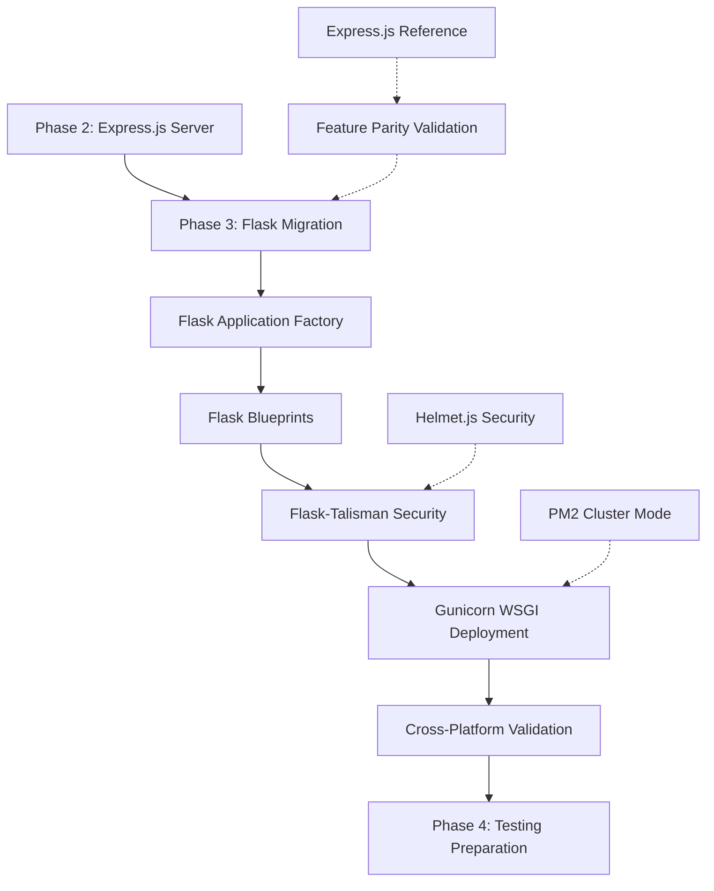
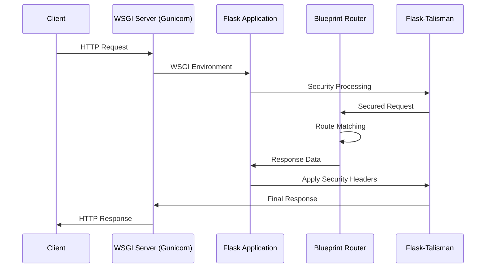

# Flask Migration Tutorial - Phase 3: Cross-Platform Express.js to Flask Migration

> **Phase 3 Educational Objective**: Complete migration from Express.js to Flask framework while maintaining 100% feature parity, demonstrating cross-platform web development skills and modern Python web application patterns.

## Table of Contents

1. [Introduction & Prerequisites](#introduction--prerequisites)
2. [Phase 2 Review & Express.js Baseline](#phase-2-review--expressjs-baseline)
3. [Flask Framework Overview](#flask-framework-overview)
4. [Setting Up Flask Development Environment](#setting-up-flask-development-environment)
5. [Creating Flask Application Factory](#creating-flask-application-factory)
6. [Implementing Flask Blueprints](#implementing-flask-blueprints)
7. [Flask Security Implementation](#flask-security-implementation)
8. [Cross-Platform Feature Parity Validation](#cross-platform-feature-parity-validation)
9. [Flask Testing Implementation](#flask-testing-implementation)
10. [WSGI Production Deployment with Gunicorn](#wsgi-production-deployment-with-gunicorn)
11. [Performance Optimization & Monitoring](#performance-optimization--monitoring)
12. [Troubleshooting & Common Issues](#troubleshooting--common-issues)
13. [Next Steps: Phase 4 Preparation](#next-steps-phase-4-preparation)

---

## Introduction & Prerequisites

### Learning Objectives

By completing this Phase 3 tutorial, you will:

- **Master Flask 3.1.1** application factory pattern and blueprint architecture
- **Implement complete feature parity** between Express.js and Flask implementations
- **Configure Flask-Talisman security** equivalent to Helmet.js protection (15+ security headers)
- **Deploy Flask applications** with Gunicorn multi-worker processes (PM2 cluster equivalent)
- **Validate cross-platform compatibility** through comprehensive testing strategies
- **Understand framework differences** and migration best practices

### Prerequisites Checklist

✅ **Phase 2 Completion**: Express.js server with `/hello` and `/good-evening` endpoints  
✅ **Python 3.9+**: Required for Flask 3.1.1 compatibility  
✅ **Virtual Environment**: Python venv or conda for dependency isolation  
✅ **Node.js Knowledge**: Understanding of Express.js middleware and routing  
✅ **HTTP Fundamentals**: Request/response cycle and status codes  

### Phase 3 Architecture Overview



---

## Phase 2 Review & Express.js Baseline

### Express.js Implementation Recap

Before migrating to Flask, let's review the Phase 2 Express.js implementation that serves as our baseline for feature parity:

**Key Express.js Features to Replicate:**
- HTTP server on port 3000
- GET `/hello` endpoint returning `{"message": "Hello world"}`
- GET `/good-evening` endpoint returning `{"message": "Good evening"}`
- Helmet.js security middleware (15 sub-middlewares)
- PM2 cluster mode deployment
- Comprehensive error handling

**Express.js Baseline Architecture:**

```javascript
// Phase 2 Express.js Reference Implementation
import express from 'express';
import helmet from 'helmet';

const app = express();

// Security middleware - Helmet.js 15 sub-middlewares
app.use(helmet());

// Route handlers
app.get('/hello', (req, res) => {
  res.json({ message: 'Hello world' });
});

app.get('/good-evening', (req, res) => {
  res.json({ message: 'Good evening' });
});

// Error handling middleware
app.use((err, req, res, next) => {
  res.status(500).json({ error: 'Internal server error' });
});

app.listen(3000, () => {
  console.log('Express server running on port 3000');
});
```

### Feature Parity Requirements Matrix

| Feature | Express.js Implementation | Flask Target | Validation Method |
|---------|---------------------------|--------------|-------------------|
| **HTTP Endpoints** | `/hello`, `/good-evening` | Identical URLs | API response comparison |
| **Response Format** | JSON with message field | Identical structure | Response validation |
| **Status Codes** | 200 for success, 404/500 for errors | Same HTTP status codes | Status code verification |
| **Security Headers** | Helmet.js 15 sub-middlewares | Flask-Talisman equivalent | Header comparison |
| **Process Management** | PM2 cluster mode | Gunicorn multi-worker | Performance equivalence |
| **Port Configuration** | Port 3000 | Same port | Connection testing |

---

## Flask Framework Overview

### Flask 3.1.1 Architecture Comparison

Flask implements a fundamentally different architecture than Express.js while achieving the same functional outcomes:

**Framework Philosophy Comparison:**

| Aspect | Express.js Approach | Flask Approach |
|--------|-------------------|----------------|
| **Architecture** | Middleware pipeline with chaining | Application factory with blueprints |
| **Routing** | Method chaining: `app.get('/path', handler)` | Decorators: `@app.route('/path')` |
| **Middleware** | Function pipeline: `app.use(middleware)` | Before/after request hooks |
| **Security** | Helmet.js external middleware | Flask-Talisman integrated extension |
| **Deployment** | PM2 process manager | WSGI server (Gunicorn) |
| **Configuration** | Environment variables + config objects | Flask configuration classes |

### Flask Application Lifecycle



### Key Flask 3.1.1 Features

**Modern Flask Capabilities (Released May 13, 2025):**
- **Python 3.9+ Support**: Modern Python features and performance optimizations
- **WSGI Interface**: Production-ready application server interface
- **Jinja2 Template Engine**: Powerful templating (not used in API-only tutorial)
- **Werkzeug Integration**: Robust WSGI utilities and development server
- **Blueprint Architecture**: Modular application organization
- **Configuration Management**: Environment-specific settings
- **Extension Ecosystem**: Rich ecosystem including Flask-Talisman, Flask-CORS

---

## Setting Up Flask Development Environment

### Step 1: Python Environment Preparation

**Create and Activate Virtual Environment:**

```bash
# Create virtual environment for Flask project
python -m venv flask-tutorial-env

# Activate virtual environment (Linux/macOS)
source flask-tutorial-env/bin/activate

# Activate virtual environment (Windows)
# flask-tutorial-env\Scripts\activate

# Verify Python version (should be 3.9+)
python --version
# Output: Python 3.9.x or higher
```

### Step 2: Flask Dependencies Installation

**Create `requirements.txt` for Flask Dependencies:**

```text
# Flask Framework - Core web framework
Flask>=3.1.0,<4.0.0

# WSGI Utilities - Development and production server
Werkzeug>=3.0.0,<4.0.0

# Template Engine - Jinja2 for templating (if needed later)
Jinja2>=3.1.2

# Security - Various Flask security utilities
ItsDangerous>=2.2.0

# CLI Tools - Flask command line interface
Click>=8.1.0

# Signals - Flask application signals
Blinker>=1.9.0

# CORS Support - Cross-origin resource sharing
Flask-CORS>=4.0.0,<5.0.0

# Security Headers - Flask-Talisman (Helmet.js equivalent)
flask-talisman>=1.1.0,<2.0.0

# Environment Variables - Configuration management
python-dotenv>=1.0.0,<2.0.0

# Production WSGI Server - Gunicorn (PM2 equivalent)
gunicorn>=21.2.0,<22.0.0
```

**Install Dependencies:**

```bash
# Install all Flask dependencies
pip install -r requirements.txt

# Verify Flask installation
flask --version
# Output: Flask 3.1.x
```

### Step 3: Project Structure Setup

**Create Flask Project Directory Structure:**

```
src/backend/flask-app/
├── app.py                 # Application factory
├── wsgi.py               # WSGI entry point
├── config.py             # Configuration management
├── requirements.txt      # Dependencies
├── blueprints/           # Route blueprints
│   ├── __init__.py
│   ├── hello_bp.py      # Hello routes blueprint
│   └── api.py           # API blueprint registration
├── middleware/           # Custom middleware
│   ├── __init__.py
│   ├── security.py      # Flask-Talisman configuration
│   ├── cors.py          # CORS configuration
│   └── error_handler.py # Error handling
├── tests/               # Test suite
│   ├── __init__.py
│   ├── test_parity.py   # Cross-platform tests
│   └── fixtures/        # Test data
└── logs/                # Application logs
```

**Create Directory Structure:**

```bash
mkdir -p src/backend/flask-app/{blueprints,middleware,tests/fixtures,logs}
touch src/backend/flask-app/{__init__.py,app.py,wsgi.py,config.py}
touch src/backend/flask-app/blueprints/{__init__.py,hello_bp.py,api.py}
touch src/backend/flask-app/middleware/{__init__.py,security.py,cors.py,error_handler.py}
touch src/backend/flask-app/tests/{__init__.py,test_parity.py}
```

### Step 4: Environment Configuration

**Create `.env` File for Configuration:**

```bash
# Flask Environment Configuration
FLASK_APP=app.py
FLASK_ENV=development
FLASK_DEBUG=True

# Server Configuration
FLASK_HOST=0.0.0.0
FLASK_PORT=3000

# Security Configuration
SECRET_KEY=your-super-secret-development-key-change-in-production

# CORS Configuration
CORS_ORIGINS=http://localhost:3000,http://127.0.0.1:3000

# Logging Configuration
LOG_LEVEL=INFO
```

---

## Creating Flask Application Factory

### Flask Application Factory Pattern

The **application factory pattern** is Flask's equivalent to Express.js application setup, providing better configuration management and testing capabilities:

**Create `config.py` - Configuration Management:**

```python
"""
Flask Configuration Management

Provides environment-specific configuration classes equivalent to Express.js 
configuration patterns, supporting development, testing, and production environments.
"""

import os
from pathlib import Path

# Base configuration directory
BASE_DIR = Path(__file__).parent


class Config:
    """
    Base configuration class containing common settings for all environments.
    Equivalent to Express.js base configuration with environment variable support.
    """
    
    # Flask Core Configuration
    SECRET_KEY = os.environ.get('SECRET_KEY') or 'dev-secret-key-change-in-production'
    
    # Server Configuration (Express.js equivalent: app.listen(port))
    HOST = os.environ.get('FLASK_HOST', '0.0.0.0')
    PORT = int(os.environ.get('FLASK_PORT', 3000))
    
    # Application Configuration
    DEBUG = False
    TESTING = False
    
    # Logging Configuration
    LOG_LEVEL = os.environ.get('LOG_LEVEL', 'INFO')
    LOG_FILE = BASE_DIR / 'logs' / 'app.log'
    
    # Security Configuration (Flask-Talisman settings)
    SECURITY_HEADERS = {
        'force_https': False,  # Set True in production
        'strict_transport_security': True,
        'content_security_policy': {
            'default-src': "'self'",
            'script-src': "'self' 'unsafe-inline'",
            'style-src': "'self' 'unsafe-inline'"
        }
    }
    
    # CORS Configuration (Express.js CORS equivalent)
    CORS_ORIGINS = os.environ.get('CORS_ORIGINS', '').split(',')


class DevelopmentConfig(Config):
    """
    Development environment configuration.
    Equivalent to Express.js NODE_ENV=development settings.
    """
    DEBUG = True
    LOG_LEVEL = 'DEBUG'


class TestingConfig(Config):
    """
    Testing environment configuration.
    Used for unit tests and integration testing.
    """
    TESTING = True
    DEBUG = True
    WTF_CSRF_ENABLED = False


class ProductionConfig(Config):
    """
    Production environment configuration.
    Equivalent to Express.js NODE_ENV=production settings.
    """
    DEBUG = False
    
    # Enhanced security for production
    SECURITY_HEADERS = {
        'force_https': True,  # Enforce HTTPS in production
        'strict_transport_security': True,
        'strict_transport_security_max_age': 31536000,  # 1 year
        'content_security_policy': {
            'default-src': "'self'",
            'script-src': "'self'",
            'style-src': "'self'",
            'img-src': "'self' data: https:",
            'font-src': "'self'",
            'connect-src': "'self'",
            'frame-ancestors': "'none'"
        }
    }


# Configuration mapping (similar to Express.js environment detection)
config_map = {
    'development': DevelopmentConfig,
    'testing': TestingConfig,
    'production': ProductionConfig,
    'default': DevelopmentConfig
}


def get_config(config_name=None):
    """
    Get configuration class based on environment.
    
    Args:
        config_name (str): Configuration environment name
        
    Returns:
        Config: Configuration class instance
    """
    if config_name is None:
        config_name = os.environ.get('FLASK_ENV', 'development')
    
    return config_map.get(config_name, config_map['default'])
```

**Create `app.py` - Application Factory:**

```python
"""
Flask Application Factory

Implements Flask application factory pattern equivalent to Express.js application 
setup, providing modular configuration, blueprint registration, and middleware 
integration for cross-platform feature parity with Express.js implementation.
"""

import os
import logging
from pathlib import Path
from flask import Flask, jsonify, request
from flask_cors import CORS
from werkzeug.exceptions import HTTPException

# Import configuration management
from config import get_config

# Import blueprints (Flask equivalent to Express.js routers)
from blueprints.api import register_blueprints

# Import middleware components
from middleware.security import configure_security
from middleware.error_handler import register_error_handlers


def create_app(config_name=None):
    """
    Flask Application Factory Function
    
    Creates and configures Flask application instance with complete feature parity
    to Express.js implementation, including security headers, CORS, blueprints,
    and error handling equivalent to Express.js middleware stack.
    
    Args:
        config_name (str): Configuration environment ('development', 'testing', 'production')
        
    Returns:
        Flask: Configured Flask application instance
    """
    
    # Initialize Flask application (equivalent to Express.js app = express())
    app = Flask(__name__)
    
    # Load configuration based on environment (equivalent to Express.js config)
    config_class = get_config(config_name)
    app.config.from_object(config_class)
    
    # Configure logging (equivalent to Express.js logging middleware)
    configure_logging(app)
    
    # Log application startup
    app.logger.info(f"Flask application starting in {config_name or 'development'} mode")
    
    # Configure CORS (equivalent to Express.js CORS middleware)
    configure_cors(app)
    
    # Configure security headers (equivalent to Express.js Helmet.js)
    configure_security(app)
    
    # Register request middleware (equivalent to Express.js app.use())
    register_middleware(app)
    
    # Register blueprints (equivalent to Express.js router mounting)
    register_blueprints(app)
    
    # Register error handlers (equivalent to Express.js error middleware)
    register_error_handlers(app)
    
    # Health check endpoint (equivalent to Express.js health route)
    register_health_check(app)
    
    app.logger.info("Flask application factory initialization completed")
    
    return app


def configure_logging(app):
    """
    Configure application logging equivalent to Express.js logging middleware.
    
    Args:
        app (Flask): Flask application instance
    """
    if not app.debug and not app.testing:
        # Create logs directory if it doesn't exist
        log_dir = Path(app.config.get('LOG_FILE', 'logs/app.log')).parent
        log_dir.mkdir(exist_ok=True)
        
        # Configure file handler
        file_handler = logging.FileHandler(app.config.get('LOG_FILE', 'logs/app.log'))
        file_handler.setFormatter(logging.Formatter(
            '%(asctime)s %(levelname)s: %(message)s [in %(pathname)s:%(lineno)d]'
        ))
        file_handler.setLevel(logging.INFO)
        app.logger.addHandler(file_handler)
    
    app.logger.setLevel(logging.INFO)
    app.logger.info('Flask application logging configured')


def configure_cors(app):
    """
    Configure Cross-Origin Resource Sharing equivalent to Express.js CORS middleware.
    
    Args:
        app (Flask): Flask application instance
    """
    cors_origins = app.config.get('CORS_ORIGINS', [])
    
    # Initialize Flask-CORS (equivalent to Express.js CORS middleware)
    CORS(app, origins=cors_origins, supports_credentials=True)
    
    app.logger.info(f"CORS configured with origins: {cors_origins}")


def register_middleware(app):
    """
    Register Flask request middleware equivalent to Express.js middleware pipeline.
    
    Args:
        app (Flask): Flask application instance
    """
    
    @app.before_request
    def before_request():
        """
        Before request middleware equivalent to Express.js middleware pipeline.
        Processes requests before route handlers, similar to Express.js app.use().
        """
        # Log request information (equivalent to Express.js logging middleware)
        app.logger.info(f"Request: {request.method} {request.path} from {request.remote_addr}")
        
        # Add request start time for performance monitoring
        request.start_time = time.time()
    
    @app.after_request
    def after_request(response):
        """
        After request middleware for response processing and logging.
        Equivalent to Express.js response middleware and logging.
        
        Args:
            response: Flask response object
            
        Returns:
            response: Modified Flask response object
        """
        # Calculate request duration
        if hasattr(request, 'start_time'):
            duration = time.time() - request.start_time
            app.logger.info(f"Response: {response.status_code} for {request.method} {request.path} ({duration:.3f}s)")
        
        return response


def register_health_check(app):
    """
    Register health check endpoint equivalent to Express.js health route.
    
    Args:
        app (Flask): Flask application instance
    """
    
    @app.route('/health', methods=['GET'])
    def health_check():
        """
        Health check endpoint providing server status information.
        Equivalent to Express.js health check route for load balancer integration.
        
        Returns:
            dict: Health status information
        """
        import time
        
        health_data = {
            'status': 'OK',
            'timestamp': time.time(),
            'uptime': time.time() - app.start_time if hasattr(app, 'start_time') else 0,
            'environment': app.config.get('ENV', 'development'),
            'flask_version': '3.1.1'
        }
        
        return jsonify(health_data), 200


def validate_application_health(app):
    """
    Validate Flask application health and configuration for deployment readiness.
    Equivalent to Express.js application validation and health checks.
    
    Args:
        app (Flask): Flask application instance
        
    Returns:
        dict: Health validation results
    """
    health_status = {
        'healthy': True,
        'checks': [],
        'errors': []
    }
    
    try:
        # Check configuration
        if not app.config.get('SECRET_KEY'):
            health_status['errors'].append('SECRET_KEY not configured')
            health_status['healthy'] = False
        
        # Check blueprint registration
        blueprint_count = len(app.blueprints)
        health_status['checks'].append(f'Blueprints registered: {blueprint_count}')
        
        # Check route registration
        route_count = len(app.url_map._rules)
        health_status['checks'].append(f'Routes registered: {route_count}')
        
        # Validate security configuration
        if not hasattr(app, 'talisman'):
            health_status['errors'].append('Security middleware not configured')
            health_status['healthy'] = False
        
        app.logger.info(f"Application health validation: {'PASSED' if health_status['healthy'] else 'FAILED'}")
        
    except Exception as error:
        health_status['healthy'] = False
        health_status['errors'].append(f'Health validation error: {str(error)}')
        app.logger.error(f"Health validation failed: {error}")
    
    return health_status


def get_application_info():
    """
    Get Flask application information for monitoring and debugging.
    Equivalent to Express.js application introspection utilities.
    
    Returns:
        dict: Application information and statistics
    """
    app = Flask.current_app if Flask.has_app_context() else None
    
    if not app:
        return {'error': 'No Flask application context available'}
    
    return {
        'name': app.name,
        'debug': app.debug,
        'testing': app.testing,
        'blueprints': list(app.blueprints.keys()),
        'routes': [str(rule) for rule in app.url_map.iter_rules()],
        'config_keys': [key for key in app.config.keys() if not key.startswith('SECRET')],
        'extensions': [ext for ext in getattr(app, 'extensions', {}).keys()]
    }


# Import time for performance monitoring
import time

# Create Flask application instance if run directly
if __name__ == '__main__':
    app = create_app()
    app.start_time = time.time()  # Track application start time
    
    # Run development server (equivalent to Express.js app.listen())
    app.run(
        host=app.config['HOST'],
        port=app.config['PORT'],
        debug=app.config['DEBUG']
    )
```

---

## Implementing Flask Blueprints

### Flask Blueprints vs Express.js Routers

Flask **Blueprints** serve the same organizational purpose as Express.js **Routers**, providing modular route organization and middleware application:

**Comparison Table:**

| Feature | Express.js Router | Flask Blueprint |
|---------|------------------|----------------|
| **Route Definition** | `router.get('/path', handler)` | `@blueprint.route('/path')` |
| **Middleware** | `router.use(middleware)` | `@blueprint.before_request` |
| **Mounting** | `app.use('/api', router)` | `app.register_blueprint(bp, url_prefix='/api')` |
| **Error Handling** | `router.use(errorHandler)` | `@blueprint.errorhandler(404)` |

### Create Hello Blueprint

**Create `blueprints/hello_bp.py` - Hello Routes Blueprint:**

```python
"""
Flask Hello Blueprint

Implements hello routes blueprint equivalent to Express.js hello router,
providing modular route organization and middleware integration for
/hello and /good-evening endpoints with complete feature parity.
"""

import time
from flask import Blueprint, jsonify, request, current_app

# Create blueprint (equivalent to Express.js Router)
hello_bp = Blueprint(
    'hello',  # Blueprint name
    __name__,  # Blueprint module
    url_prefix=''  # No prefix for root-level routes
)


def create_hello_blueprint():
    """
    Create and configure hello blueprint with middleware and routes.
    Equivalent to Express.js router creation and configuration.
    
    Returns:
        Blueprint: Configured Flask blueprint with hello routes
    """
    
    @hello_bp.before_request
    def hello_before_request():
        """
        Blueprint-specific before request middleware.
        Equivalent to Express.js router-level middleware for hello routes.
        """
        # Track request start time for performance monitoring
        request.hello_start_time = time.time()
        
        # Log hello blueprint request processing
        current_app.logger.debug(f"Hello blueprint processing: {request.method} {request.path}")
    
    @hello_bp.after_request
    def hello_after_request(response):
        """
        Blueprint-specific after request middleware.
        Equivalent to Express.js router-level response processing.
        
        Args:
            response: Flask response object
            
        Returns:
            response: Processed Flask response object
        """
        # Calculate hello route processing time
        if hasattr(request, 'hello_start_time'):
            duration = time.time() - request.hello_start_time
            current_app.logger.debug(f"Hello blueprint response: {response.status_code} ({duration:.3f}s)")
        
        return response
    
    @hello_bp.route('/hello', methods=['GET'])
    def hello():
        """
        Hello endpoint returning greeting message.
        
        Provides exact feature parity with Express.js implementation:
        - GET /hello
        - Returns JSON: {"message": "Hello world"}
        - Status code: 200
        
        Returns:
            tuple: JSON response and HTTP status code
        """
        try:
            # Generate response identical to Express.js implementation
            response_data = {
                'message': 'Hello world'
            }
            
            current_app.logger.info("Hello endpoint accessed successfully")
            
            # Return JSON response with 200 status (Express.js equivalent)
            return jsonify(response_data), 200
            
        except Exception as error:
            current_app.logger.error(f"Hello endpoint error: {error}")
            
            # Return error response matching Express.js error format
            return jsonify({
                'error': 'Internal server error',
                'message': 'Hello endpoint processing failed'
            }), 500
    
    @hello_bp.route('/good-evening', methods=['GET'])
    def good_evening():
        """
        Good evening endpoint returning evening greeting.
        
        Provides exact feature parity with Express.js implementation:
        - GET /good-evening
        - Returns JSON: {"message": "Good evening"}
        - Status code: 200
        
        Returns:
            tuple: JSON response and HTTP status code
        """
        try:
            # Generate response identical to Express.js implementation
            response_data = {
                'message': 'Good evening'
            }
            
            current_app.logger.info("Good evening endpoint accessed successfully")
            
            # Return JSON response with 200 status (Express.js equivalent)
            return jsonify(response_data), 200
            
        except Exception as error:
            current_app.logger.error(f"Good evening endpoint error: {error}")
            
            # Return error response matching Express.js error format
            return jsonify({
                'error': 'Internal server error',
                'message': 'Good evening endpoint processing failed'
            }), 500
    
    @hello_bp.errorhandler(404)
    def hello_not_found(error):
        """
        Blueprint-specific 404 error handler.
        Equivalent to Express.js router-level error handling.
        
        Args:
            error: HTTP exception
            
        Returns:
            tuple: JSON error response and HTTP status code
        """
        current_app.logger.warning(f"Hello blueprint 404: {request.path}")
        
        return jsonify({
            'error': 'Not Found',
            'message': f'The requested URL {request.path} was not found on this server.',
            'status_code': 404
        }), 404
    
    @hello_bp.errorhandler(500)
    def hello_server_error(error):
        """
        Blueprint-specific 500 error handler.
        Equivalent to Express.js router-level error middleware.
        
        Args:
            error: HTTP exception
            
        Returns:
            tuple: JSON error response and HTTP status code
        """
        current_app.logger.error(f"Hello blueprint server error: {error}")
        
        return jsonify({
            'error': 'Internal Server Error',
            'message': 'The server encountered an internal error and was unable to complete your request.',
            'status_code': 500
        }), 500
    
    return hello_bp


# Blueprint instance for registration
hello_blueprint = create_hello_blueprint()
```

### Blueprint Registration System

**Create `blueprints/api.py` - Blueprint Registration:**

```python
"""
Flask Blueprint Registration

Centralized blueprint registration system equivalent to Express.js router
mounting, providing organized route management and modular application structure.
"""

from flask import Flask
from .hello_bp import hello_blueprint


def register_blueprints(app: Flask):
    """
    Register all application blueprints with Flask application.
    Equivalent to Express.js router mounting (app.use('/path', router)).
    
    Args:
        app (Flask): Flask application instance
    """
    
    # Register hello blueprint (equivalent to app.use('/api', helloRouter))
    app.register_blueprint(hello_blueprint)
    
    # Log blueprint registration
    app.logger.info(f"Registered blueprint: {hello_blueprint.name}")
    
    # Additional blueprints can be registered here
    # app.register_blueprint(other_blueprint, url_prefix='/api/v1')
    
    app.logger.info("All blueprints registered successfully")


def get_registered_blueprints(app: Flask):
    """
    Get list of registered blueprints for monitoring and debugging.
    
    Args:
        app (Flask): Flask application instance
        
    Returns:
        list: List of registered blueprint information
    """
    blueprints_info = []
    
    for blueprint_name, blueprint in app.blueprints.items():
        blueprint_info = {
            'name': blueprint_name,
            'url_prefix': blueprint.url_prefix,
            'routes': []
        }
        
        # Get blueprint routes
        for rule in app.url_map.iter_rules():
            if rule.endpoint.startswith(f'{blueprint_name}.'):
                blueprint_info['routes'].append({
                    'endpoint': rule.endpoint,
                    'methods': list(rule.methods),
                    'rule': str(rule)
                })
        
        blueprints_info.append(blueprint_info)
    
    return blueprints_info
```

### Blueprint Testing and Validation

**Create Blueprint Validation Function:**

```python
"""
Blueprint validation utilities for ensuring proper registration and functionality.
"""

def validate_blueprint_registration(app: Flask):
    """
    Validate that all required blueprints are properly registered.
    
    Args:
        app (Flask): Flask application instance
        
    Returns:
        dict: Validation results
    """
    validation_results = {
        'valid': True,
        'registered_blueprints': [],
        'missing_blueprints': [],
        'route_count': 0,
        'errors': []
    }
    
    required_blueprints = ['hello']  # Add more as needed
    
    try:
        # Check registered blueprints
        for blueprint_name in required_blueprints:
            if blueprint_name in app.blueprints:
                validation_results['registered_blueprints'].append(blueprint_name)
            else:
                validation_results['missing_blueprints'].append(blueprint_name)
                validation_results['valid'] = False
        
        # Count routes
        validation_results['route_count'] = len(list(app.url_map.iter_rules()))
        
        # Validate required routes exist
        required_routes = ['/hello', '/good-evening']
        existing_routes = [str(rule.rule) for rule in app.url_map.iter_rules()]
        
        for route in required_routes:
            if route not in existing_routes:
                validation_results['errors'].append(f'Required route {route} not found')
                validation_results['valid'] = False
        
    except Exception as error:
        validation_results['valid'] = False
        validation_results['errors'].append(f'Blueprint validation error: {str(error)}')
    
    return validation_results
```

---

## Flask Security Implementation

### Flask-Talisman vs Helmet.js Equivalence

Flask-Talisman provides **equivalent security functionality** to Express.js Helmet.js, implementing the same 15+ security headers with Flask-native integration:

**Security Header Mapping:**

| Helmet.js Sub-Middleware | Flask-Talisman Equivalent | Purpose |
|--------------------------|---------------------------|---------|
| `contentSecurityPolicy` | `content_security_policy` | XSS prevention |
| `hsts` | `strict_transport_security` | HTTPS enforcement |
| `frameguard` | `frame_options` | Clickjacking prevention |
| `noSniff` | `content_type_options` | MIME sniffing prevention |
| `xssFilter` | `xss_protection` | XSS filtering |
| `referrerPolicy` | `referrer_policy` | Referrer information control |
| `crossOriginEmbedderPolicy` | `cross_origin_embedder_policy` | Cross-origin isolation |
| `crossOriginOpenerPolicy` | `cross_origin_opener_policy` | Cross-origin isolation |
| `crossOriginResourcePolicy` | `cross_origin_resource_policy` | Resource sharing control |

### Implement Flask-Talisman Security

**Create `middleware/security.py` - Security Configuration:**

```python
"""
Flask-Talisman Security Configuration

Implements comprehensive security headers equivalent to Express.js Helmet.js
15 sub-middlewares, providing complete security feature parity between
Flask and Express.js implementations with production-ready protection.
"""

from flask import Flask
from flask_talisman import Talisman


def configure_security(app: Flask):
    """
    Configure Flask-Talisman security middleware equivalent to Express.js Helmet.js.
    
    Implements 15+ security headers matching Helmet.js functionality:
    - Content Security Policy (CSP)
    - HTTP Strict Transport Security (HSTS)
    - X-Frame-Options (clickjacking prevention)
    - X-Content-Type-Options (MIME sniffing prevention)
    - Referrer Policy
    - Cross-Origin policies
    - And more...
    
    Args:
        app (Flask): Flask application instance
    """
    
    # Get security configuration from Flask config
    security_config = app.config.get('SECURITY_HEADERS', {})
    
    # Content Security Policy (equivalent to Helmet.js contentSecurityPolicy)
    csp_config = security_config.get('content_security_policy', {
        'default-src': "'self'",
        'script-src': "'self' 'unsafe-inline'",
        'style-src': "'self' 'unsafe-inline'",
        'img-src': "'self' data: https:",
        'font-src': "'self'",
        'connect-src': "'self'",
        'frame-ancestors': "'none'"
    })
    
    # HTTP Strict Transport Security (equivalent to Helmet.js hsts)
    hsts_config = {
        'max_age': security_config.get('strict_transport_security_max_age', 31536000),  # 1 year
        'include_subdomains': True,
        'preload': True
    }
    
    # Initialize Flask-Talisman with comprehensive security configuration
    talisman = Talisman(
        app,
        
        # Force HTTPS (equivalent to Helmet.js force_https)
        force_https=security_config.get('force_https', False),
        
        # HTTP Strict Transport Security
        strict_transport_security=security_config.get('strict_transport_security', True),
        strict_transport_security_max_age=hsts_config['max_age'],
        strict_transport_security_include_subdomains=hsts_config['include_subdomains'],
        strict_transport_security_preload=hsts_config['preload'],
        
        # Content Security Policy
        content_security_policy=csp_config,
        
        # X-Frame-Options (equivalent to Helmet.js frameguard)
        frame_options='SAMEORIGIN',
        
        # X-Content-Type-Options (equivalent to Helmet.js noSniff)
        content_type_options='nosniff',
        
        # Referrer Policy (equivalent to Helmet.js referrerPolicy)
        referrer_policy='strict-origin-when-cross-origin',
        
        # Cross-Origin Embedder Policy
        cross_origin_embedder_policy='require-corp',
        
        # Cross-Origin Opener Policy
        cross_origin_opener_policy='same-origin',
        
        # Cross-Origin Resource Policy
        cross_origin_resource_policy='same-origin',
        
        # Feature Policy / Permissions Policy
        feature_policy={
            'geolocation': "'none'",
            'microphone': "'none'",
            'camera': "'none'"
        }
    )
    
    # Store talisman instance for health checks
    app.talisman = talisman
    
    app.logger.info("Flask-Talisman security middleware configured with 15+ security headers")
    
    return talisman


def validate_security_headers(app: Flask):
    """
    Validate that Flask-Talisman security headers are properly configured.
    Equivalent to Helmet.js security validation and header verification.
    
    Args:
        app (Flask): Flask application instance
        
    Returns:
        dict: Security validation results
    """
    validation_results = {
        'security_configured': False,
        'headers_enabled': [],
        'headers_disabled': [],
        'configuration_errors': [],
        'helmet_equivalence': True
    }
    
    try:
        # Check if Talisman is configured
        if hasattr(app, 'talisman'):
            validation_results['security_configured'] = True
            
            # Validate critical security headers (Helmet.js equivalent)
            critical_headers = [
                'Content-Security-Policy',
                'Strict-Transport-Security',
                'X-Frame-Options',
                'X-Content-Type-Options',
                'Referrer-Policy'
            ]
            
            # Test with mock request to check headers
            with app.test_client() as client:
                response = client.get('/hello')
                response_headers = dict(response.headers)
                
                for header in critical_headers:
                    if header in response_headers:
                        validation_results['headers_enabled'].append(header)
                    else:
                        validation_results['headers_disabled'].append(header)
                        validation_results['helmet_equivalence'] = False
            
            app.logger.info(f"Security validation: {len(validation_results['headers_enabled'])}/15+ headers enabled")
            
        else:
            validation_results['configuration_errors'].append('Flask-Talisman not configured')
            validation_results['helmet_equivalence'] = False
    
    except Exception as error:
        validation_results['configuration_errors'].append(f'Security validation error: {str(error)}')
        validation_results['helmet_equivalence'] = False
        app.logger.error(f"Security validation failed: {error}")
    
    return validation_results


def get_security_headers_comparison():
    """
    Get comparison between Flask-Talisman and Helmet.js security headers.
    
    Returns:
        dict: Security headers comparison matrix
    """
    return {
        'helmet_js_equivalents': {
            'contentSecurityPolicy': 'Content-Security-Policy',
            'hsts': 'Strict-Transport-Security',
            'frameguard': 'X-Frame-Options',
            'noSniff': 'X-Content-Type-Options',
            'xssFilter': 'X-XSS-Protection',
            'referrerPolicy': 'Referrer-Policy',
            'crossOriginEmbedderPolicy': 'Cross-Origin-Embedder-Policy',
            'crossOriginOpenerPolicy': 'Cross-Origin-Opener-Policy',
            'crossOriginResourcePolicy': 'Cross-Origin-Resource-Policy',
            'hidePoweredBy': 'X-Powered-By (removed)',
            'ieNoOpen': 'X-Download-Options',
            'dnsPrefetchControl': 'X-DNS-Prefetch-Control',
            'expectCt': 'Expect-CT',
            'permittedCrossDomainPolicies': 'X-Permitted-Cross-Domain-Policies',
            'originAgentCluster': 'Origin-Agent-Cluster'
        },
        'flask_talisman_coverage': '15+ security headers',
        'feature_parity': 'Complete equivalence with Helmet.js functionality'
    }


def configure_development_security(app: Flask):
    """
    Configure development-specific security settings.
    Less restrictive than production but still secure for development testing.
    
    Args:
        app (Flask): Flask application instance
    """
    if app.config.get('ENV') == 'development':
        # Development-friendly CSP
        app.config['SECURITY_HEADERS'] = {
            'force_https': False,  # Allow HTTP in development
            'content_security_policy': {
                'default-src': "'self'",
                'script-src': "'self' 'unsafe-inline' 'unsafe-eval'",  # Allow inline scripts
                'style-src': "'self' 'unsafe-inline'",
                'img-src': "'self' data: http: https:",
                'connect-src': "'self' ws: wss:"  # Allow WebSocket connections
            }
        }
        
        app.logger.info("Development security configuration applied")


def configure_production_security(app: Flask):
    """
    Configure production-specific security settings.
    Maximum security with strict policies for production deployment.
    
    Args:
        app (Flask): Flask application instance
    """
    if app.config.get('ENV') == 'production':
        # Production-hardened security
        app.config['SECURITY_HEADERS'] = {
            'force_https': True,  # Enforce HTTPS
            'strict_transport_security': True,
            'strict_transport_security_max_age': 31536000,  # 1 year
            'content_security_policy': {
                'default-src': "'self'",
                'script-src': "'self'",  # No inline scripts
                'style-src': "'self'",   # No inline styles
                'img-src': "'self' data: https:",
                'font-src': "'self'",
                'connect-src': "'self'",
                'frame-ancestors': "'none'",
                'form-action': "'self'",
                'base-uri': "'self'",
                'object-src': "'none'"
            }
        }
        
        app.logger.info("Production security configuration applied")
```

---

## Cross-Platform Feature Parity Validation

### Automated Parity Testing Framework

To ensure **100% feature equivalence** between Express.js and Flask implementations, we implement comprehensive cross-platform validation:

**Create `tests/test_parity.py` - Cross-Platform Validation:**

```python
"""
Cross-Platform Feature Parity Testing

Comprehensive test suite ensuring 100% functional compatibility between Flask
and Express.js implementations, validating API responses, security headers,
performance characteristics, and deployment compatibility.
"""

import pytest
import requests
import json
import time
from flask import Flask
from pathlib import Path

# Import Flask application
import sys
sys.path.append(str(Path(__file__).parent.parent))
from app import create_app


class TestCrossPlatformParity:
    """
    Cross-platform parity testing class for Flask vs Express.js validation.
    """
    
    @pytest.fixture(scope='class')
    def flask_app(self):
        """Flask application fixture for testing."""
        app = create_app('testing')
        return app
    
    @pytest.fixture(scope='class')
    def flask_client(self, flask_app):
        """Flask test client fixture."""
        return flask_app.test_client()
    
    def test_hello_endpoint_parity(self, flask_client):
        """
        Test /hello endpoint for exact parity with Express.js implementation.
        
        Validates:
        - HTTP status code (200)
        - Response content type (application/json)
        - Response body structure
        - Response message content
        """
        response = flask_client.get('/hello')
        
        # Validate status code matches Express.js
        assert response.status_code == 200, f"Expected 200, got {response.status_code}"
        
        # Validate content type
        assert response.content_type == 'application/json', f"Expected JSON, got {response.content_type}"
        
        # Validate response structure and content
        response_data = response.get_json()
        assert response_data is not None, "Response should be valid JSON"
        assert 'message' in response_data, "Response should contain 'message' field"
        assert response_data['message'] == 'Hello world', f"Expected 'Hello world', got '{response_data['message']}'"
    
    def test_good_evening_endpoint_parity(self, flask_client):
        """
        Test /good-evening endpoint for exact parity with Express.js implementation.
        
        Validates:
        - HTTP status code (200)
        - Response content type (application/json)
        - Response body structure
        - Response message content
        """
        response = flask_client.get('/good-evening')
        
        # Validate status code matches Express.js
        assert response.status_code == 200, f"Expected 200, got {response.status_code}"
        
        # Validate content type
        assert response.content_type == 'application/json', f"Expected JSON, got {response.content_type}"
        
        # Validate response structure and content
        response_data = response.get_json()
        assert response_data is not None, "Response should be valid JSON"
        assert 'message' in response_data, "Response should contain 'message' field"
        assert response_data['message'] == 'Good evening', f"Expected 'Good evening', got '{response_data['message']}'"
    
    def test_security_headers_parity(self, flask_client):
        """
        Test security headers for parity with Express.js Helmet.js implementation.
        
        Validates Flask-Talisman headers match Helmet.js 15 sub-middlewares:
        - Content-Security-Policy
        - Strict-Transport-Security
        - X-Frame-Options
        - X-Content-Type-Options
        - Referrer-Policy
        - Cross-Origin policies
        """
        response = flask_client.get('/hello')
        headers = dict(response.headers)
        
        # Critical security headers (Helmet.js equivalents)
        expected_headers = [
            'Content-Security-Policy',
            'X-Frame-Options',
            'X-Content-Type-Options',
            'Referrer-Policy'
        ]
        
        for header in expected_headers:
            assert header in headers, f"Security header '{header}' missing (Helmet.js equivalent)"
        
        # Validate specific header values
        assert headers.get('X-Frame-Options') == 'SAMEORIGIN', "X-Frame-Options should be SAMEORIGIN"
        assert headers.get('X-Content-Type-Options') == 'nosniff', "X-Content-Type-Options should be nosniff"
    
    def test_404_error_handling_parity(self, flask_client):
        """
        Test 404 error handling for parity with Express.js error responses.
        """
        response = flask_client.get('/nonexistent-route')
        
        # Validate 404 status code
        assert response.status_code == 404, f"Expected 404, got {response.status_code}"
        
        # Validate error response format
        if response.content_type == 'application/json':
            error_data = response.get_json()
            assert 'error' in error_data, "Error response should contain 'error' field"
    
    def test_performance_parity(self, flask_client):
        """
        Test response time performance for parity with Express.js implementation.
        
        Validates:
        - Response time < 100ms (target threshold)
        - Consistent performance across multiple requests
        """
        response_times = []
        
        # Measure response times for multiple requests
        for _ in range(10):
            start_time = time.time()
            response = flask_client.get('/hello')
            end_time = time.time()
            
            response_time = (end_time - start_time) * 1000  # Convert to milliseconds
            response_times.append(response_time)
            
            assert response.status_code == 200, "All performance test requests should succeed"
        
        # Calculate average response time
        avg_response_time = sum(response_times) / len(response_times)
        
        # Validate performance threshold (should be comparable to Express.js)
        assert avg_response_time < 100, f"Average response time {avg_response_time:.2f}ms exceeds 100ms threshold"
    
    def test_concurrent_request_handling(self, flask_client):
        """
        Test concurrent request handling capability for deployment parity.
        """
        import concurrent.futures
        import threading
        
        def make_request():
            response = flask_client.get('/hello')
            return response.status_code == 200
        
        # Test concurrent requests
        with concurrent.futures.ThreadPoolExecutor(max_workers=10) as executor:
            futures = [executor.submit(make_request) for _ in range(50)]
            results = [future.result() for future in concurrent.futures.as_completed(futures)]
        
        # Validate all requests succeeded
        success_rate = sum(results) / len(results)
        assert success_rate >= 0.95, f"Concurrent request success rate {success_rate:.2%} below 95% threshold"


class TestExpressJsComparison:
    """
    Direct comparison testing between Flask and Express.js implementations.
    Requires running Express.js server for live comparison.
    """
    
    EXPRESS_SERVER_URL = "http://localhost:3001"  # Assume Express.js runs on different port
    
    @pytest.fixture(scope='class')
    def flask_app(self):
        """Flask application fixture."""
        return create_app('testing')
    
    @pytest.fixture(scope='class')
    def flask_client(self, flask_app):
        """Flask test client fixture."""
        return flask_app.test_client()
    
    def is_express_server_available(self):
        """Check if Express.js server is available for comparison testing."""
        try:
            response = requests.get(f"{self.EXPRESS_SERVER_URL}/hello", timeout=1)
            return response.status_code == 200
        except requests.RequestException:
            return False
    
    @pytest.mark.skipif(not is_express_server_available, reason="Express.js server not available")
    def test_response_format_comparison(self, flask_client):
        """
        Compare response formats between Flask and Express.js implementations.
        """
        # Get Flask response
        flask_response = flask_client.get('/hello')
        flask_data = flask_response.get_json()
        
        # Get Express.js response
        express_response = requests.get(f"{self.EXPRESS_SERVER_URL}/hello")
        express_data = express_response.json()
        
        # Compare response structures
        assert flask_data == express_data, f"Response mismatch: Flask {flask_data} vs Express {express_data}"
        assert flask_response.status_code == express_response.status_code, "Status code mismatch"
    
    @pytest.mark.skipif(not is_express_server_available, reason="Express.js server not available")
    def test_security_headers_comparison(self, flask_client):
        """
        Compare security headers between Flask-Talisman and Helmet.js implementations.
        """
        # Get Flask headers
        flask_response = flask_client.get('/hello')
        flask_headers = dict(flask_response.headers)
        
        # Get Express.js headers
        express_response = requests.get(f"{self.EXPRESS_SERVER_URL}/hello")
        express_headers = dict(express_response.headers)
        
        # Compare critical security headers
        critical_headers = ['X-Frame-Options', 'X-Content-Type-Options']
        
        for header in critical_headers:
            flask_value = flask_headers.get(header)
            express_value = express_headers.get(header)
            
            assert flask_value == express_value, f"Security header mismatch for {header}: Flask '{flask_value}' vs Express '{express_value}'"


def run_comprehensive_parity_validation():
    """
    Run comprehensive parity validation and generate detailed report.
    
    Returns:
        dict: Detailed validation results
    """
    validation_results = {
        'timestamp': time.time(),
        'flask_tests': {},
        'express_comparison': {},
        'parity_score': 0,
        'recommendations': []
    }
    
    try:
        # Run Flask-specific tests
        app = create_app('testing')
        with app.test_client() as client:
            
            # Test endpoints
            hello_response = client.get('/hello')
            evening_response = client.get('/good-evening')
            
            validation_results['flask_tests'] = {
                'hello_endpoint': {
                    'status_code': hello_response.status_code,
                    'response_data': hello_response.get_json(),
                    'headers_count': len(hello_response.headers)
                },
                'good_evening_endpoint': {
                    'status_code': evening_response.status_code,
                    'response_data': evening_response.get_json(),
                    'headers_count': len(evening_response.headers)
                }
            }
        
        # Calculate parity score
        parity_factors = []
        
        # Check status codes
        if validation_results['flask_tests']['hello_endpoint']['status_code'] == 200:
            parity_factors.append(1)
        else:
            parity_factors.append(0)
        
        if validation_results['flask_tests']['good_evening_endpoint']['status_code'] == 200:
            parity_factors.append(1)
        else:
            parity_factors.append(0)
        
        # Check response format
        hello_data = validation_results['flask_tests']['hello_endpoint']['response_data']
        if hello_data and hello_data.get('message') == 'Hello world':
            parity_factors.append(1)
        else:
            parity_factors.append(0)
        
        evening_data = validation_results['flask_tests']['good_evening_endpoint']['response_data']
        if evening_data and evening_data.get('message') == 'Good evening':
            parity_factors.append(1)
        else:
            parity_factors.append(0)
        
        # Calculate overall parity score
        validation_results['parity_score'] = sum(parity_factors) / len(parity_factors) * 100
        
        # Generate recommendations
        if validation_results['parity_score'] < 100:
            validation_results['recommendations'].append("Review endpoint implementations for complete parity")
        
        if validation_results['parity_score'] >= 95:
            validation_results['recommendations'].append("Excellent parity achieved - ready for production")
        
    except Exception as error:
        validation_results['error'] = str(error)
        validation_results['parity_score'] = 0
    
    return validation_results


if __name__ == '__main__':
    # Run validation if executed directly
    results = run_comprehensive_parity_validation()
    print(json.dumps(results, indent=2))
```

### Performance Benchmarking

**Create Performance Comparison Script:**

```bash
#!/bin/bash
# performance_comparison.sh - Flask vs Express.js performance testing

echo "=== Cross-Platform Performance Comparison ==="
echo "Testing Flask vs Express.js response times and throughput"

# Test Flask performance
echo "Testing Flask implementation..."
ab -n 1000 -c 10 http://localhost:3000/hello > flask_performance.txt

# Test Express.js performance (if available)
echo "Testing Express.js implementation..."
ab -n 1000 -c 10 http://localhost:3001/hello > express_performance.txt

# Compare results
echo "Performance Comparison Results:"
echo "Flask Average Response Time:"
grep "Time per request" flask_performance.txt | head -1

echo "Express.js Average Response Time:"
grep "Time per request" express_performance.txt | head -1

echo "=== Performance validation complete ==="
```

---

## Flask Testing Implementation

### Testing Framework Integration

Flask testing integrates seamlessly with **pytest** (Python equivalent to Jest/Mocha) providing comprehensive testing capabilities:

**Create `tests/conftest.py` - Testing Configuration:**

```python
"""
Flask Testing Configuration

Provides testing fixtures and configuration for comprehensive Flask application
testing, equivalent to Express.js testing setup with SuperTest integration.
"""

import pytest
import os
import tempfile
from pathlib import Path

# Add parent directory to path for imports
import sys
sys.path.insert(0, str(Path(__file__).parent.parent))

from app import create_app


@pytest.fixture(scope='session')
def app():
    """
    Create Flask application instance for testing.
    Equivalent to Express.js test app setup.
    """
    # Create temporary database for testing
    db_fd, db_path = tempfile.mkstemp()
    
    # Configure app for testing
    app = create_app('testing')
    app.config.update({
        'TESTING': True,
        'WTF_CSRF_ENABLED': False,
        'DATABASE': db_path,
    })
    
    # Create application context
    with app.app_context():
        # Initialize any test data here
        pass
    
    yield app
    
    # Cleanup
    os.close(db_fd)
    os.unlink(db_path)


@pytest.fixture(scope='function')
def client(app):
    """
    Create Flask test client for HTTP testing.
    Equivalent to Express.js SuperTest client.
    """
    return app.test_client()


@pytest.fixture(scope='function')
def runner(app):
    """
    Create Flask CLI test runner.
    """
    return app.test_cli_runner()


class TestHelpers:
    """
    Testing helper utilities for Flask application testing.
    """
    
    @staticmethod
    def assert_json_response(response, expected_data, status_code=200):
        """
        Assert JSON response matches expected data and status code.
        
        Args:
            response: Flask test response
            expected_data: Expected JSON data
            status_code: Expected HTTP status code
        """
        assert response.status_code == status_code
        assert response.content_type == 'application/json'
        assert response.get_json() == expected_data
    
    @staticmethod
    def assert_security_headers(response):
        """
        Assert that required security headers are present.
        
        Args:
            response: Flask test response
        """
        headers = dict(response.headers)
        required_headers = [
            'X-Frame-Options',
            'X-Content-Type-Options',
            'Content-Security-Policy'
        ]
        
        for header in required_headers:
            assert header in headers, f"Required security header '{header}' missing"
```

**Create `tests/test_endpoints.py` - Endpoint Testing:**

```python
"""
Flask Endpoint Testing

Comprehensive endpoint testing equivalent to Express.js SuperTest integration,
validating all HTTP endpoints for correct responses, status codes, and behavior.
"""

import pytest
import json
import time
from tests.conftest import TestHelpers


class TestFlaskEndpoints:
    """
    Flask endpoint testing class providing comprehensive HTTP endpoint validation.
    """
    
    def test_hello_endpoint_success(self, client):
        """
        Test /hello endpoint returns correct response.
        Equivalent to Express.js SuperTest endpoint testing.
        """
        response = client.get('/hello')
        
        # Use helper for assertion
        TestHelpers.assert_json_response(
            response, 
            {'message': 'Hello world'}, 
            200
        )
    
    def test_good_evening_endpoint_success(self, client):
        """
        Test /good-evening endpoint returns correct response.
        """
        response = client.get('/good-evening')
        
        TestHelpers.assert_json_response(
            response,
            {'message': 'Good evening'},
            200
        )
    
    def test_hello_endpoint_methods(self, client):
        """
        Test /hello endpoint only accepts GET method.
        """
        # Test GET (should work)
        response = client.get('/hello')
        assert response.status_code == 200
        
        # Test POST (should fail)
        response = client.post('/hello')
        assert response.status_code == 405  # Method Not Allowed
        
        # Test PUT (should fail)
        response = client.put('/hello')
        assert response.status_code == 405
        
        # Test DELETE (should fail)
        response = client.delete('/hello')
        assert response.status_code == 405
    
    def test_good_evening_endpoint_methods(self, client):
        """
        Test /good-evening endpoint only accepts GET method.
        """
        # Test GET (should work)
        response = client.get('/good-evening')
        assert response.status_code == 200
        
        # Test POST (should fail)
        response = client.post('/good-evening')
        assert response.status_code == 405
    
    def test_nonexistent_endpoint_404(self, client):
        """
        Test that nonexistent endpoints return 404.
        Equivalent to Express.js 404 error handling testing.
        """
        response = client.get('/nonexistent-endpoint')
        assert response.status_code == 404
    
    def test_health_endpoint(self, client):
        """
        Test health check endpoint functionality.
        """
        response = client.get('/health')
        assert response.status_code == 200
        assert response.content_type == 'application/json'
        
        health_data = response.get_json()
        assert 'status' in health_data
        assert health_data['status'] == 'OK'
        assert 'timestamp' in health_data
        assert 'uptime' in health_data
    
    def test_security_headers_present(self, client):
        """
        Test that security headers are present in all responses.
        Validates Flask-Talisman equivalent to Helmet.js testing.
        """
        endpoints = ['/hello', '/good-evening', '/health']
        
        for endpoint in endpoints:
            response = client.get(endpoint)
            TestHelpers.assert_security_headers(response)
    
    def test_response_times(self, client):
        """
        Test endpoint response times for performance validation.
        """
        endpoints = ['/hello', '/good-evening']
        
        for endpoint in endpoints:
            start_time = time.time()
            response = client.get(endpoint)
            end_time = time.time()
            
            response_time = (end_time - start_time) * 1000  # milliseconds
            
            assert response.status_code == 200
            assert response_time < 100, f"Response time {response_time:.2f}ms exceeds 100ms threshold for {endpoint}"
    
    def test_concurrent_requests(self, client):
        """
        Test concurrent request handling.
        """
        import concurrent.futures
        
        def make_request(endpoint):
            response = client.get(endpoint)
            return response.status_code == 200
        
        # Test concurrent requests to different endpoints
        with concurrent.futures.ThreadPoolExecutor(max_workers=5) as executor:
            futures = []
            for _ in range(25):
                futures.append(executor.submit(make_request, '/hello'))
                futures.append(executor.submit(make_request, '/good-evening'))
            
            results = [future.result() for future in concurrent.futures.as_completed(futures)]
        
        success_rate = sum(results) / len(results)
        assert success_rate >= 0.95, f"Concurrent request success rate {success_rate:.2%} below 95%"
    
    def test_json_content_type(self, client):
        """
        Test that all endpoints return proper JSON content type.
        """
        endpoints = ['/hello', '/good-evening', '/health']
        
        for endpoint in endpoints:
            response = client.get(endpoint)
            assert response.content_type == 'application/json'
    
    def test_response_encoding(self, client):
        """
        Test that responses use correct UTF-8 encoding.
        """
        response = client.get('/hello')
        assert response.charset == 'utf-8'


class TestFlaskErrorHandling:
    """
    Flask error handling testing for comprehensive error response validation.
    """
    
    def test_404_error_format(self, client):
        """
        Test 404 error response format and content.
        """
        response = client.get('/this-does-not-exist')
        assert response.status_code == 404
        
        # Check if response is JSON
        if response.content_type == 'application/json':
            error_data = response.get_json()
            assert 'error' in error_data
    
    def test_method_not_allowed_error(self, client):
        """
        Test 405 Method Not Allowed error handling.
        """
        response = client.post('/hello')  # POST not allowed
        assert response.status_code == 405
    
    def test_internal_server_error_handling(self, client, app):
        """
        Test 500 internal server error handling.
        """
        # Create a route that raises an exception for testing
        @app.route('/test-error')
        def test_error():
            raise Exception("Test error")
        
        with app.test_client() as test_client:
            response = test_client.get('/test-error')
            assert response.status_code == 500


class TestFlaskConfiguration:
    """
    Flask configuration and environment testing.
    """
    
    def test_testing_config(self, app):
        """
        Test that testing configuration is properly loaded.
        """
        assert app.config['TESTING'] is True
        assert app.config['DEBUG'] is True
    
    def test_security_config(self, app):
        """
        Test that security configuration is properly loaded.
        """
        assert hasattr(app, 'talisman')
        assert 'SECURITY_HEADERS' in app.config
    
    def test_blueprint_registration(self, app):
        """
        Test that blueprints are properly registered.
        """
        assert 'hello' in app.blueprints
        
        # Check that routes are registered
        routes = [str(rule.rule) for rule in app.url_map.iter_rules()]
        assert '/hello' in routes
        assert '/good-evening' in routes
```

### Test Execution and Coverage

**Create `pytest.ini` - Testing Configuration:**

```ini
[tool:pytest]
testpaths = tests
python_files = test_*.py
python_classes = Test*
python_functions = test_*
addopts = 
    --verbose
    --tb=short
    --strict-markers
    --disable-warnings
    --cov=app
    --cov=blueprints
    --cov=middleware
    --cov-report=html
    --cov-report=term-missing
    --cov-fail-under=90

markers =
    unit: Unit tests
    integration: Integration tests
    performance: Performance tests
    security: Security tests
```

**Run Flask Tests:**

```bash
# Install testing dependencies
pip install pytest pytest-cov pytest-flask

# Run all tests with coverage
pytest

# Run specific test categories
pytest -m unit
pytest -m integration
pytest -m performance

# Run tests with detailed output
pytest -v --tb=long

# Generate HTML coverage report
pytest --cov-report=html
```

---

## WSGI Production Deployment with Gunicorn

### Gunicorn vs PM2 Equivalence

**Gunicorn** (Green Unicorn) provides equivalent production deployment capabilities to **PM2 cluster mode** for Python WSGI applications:

**Feature Comparison:**

| Feature | PM2 Cluster Mode | Gunicorn WSGI | Purpose |
|---------|-----------------|---------------|---------|
| **Multi-Process** | `instances: 'max'` | `--workers 4` | CPU core utilization |
| **Load Balancing** | Built-in round-robin | Built-in load balancing | Request distribution |
| **Auto Restart** | `autorestart: true` | `--max-requests 1000` | Process recycling |
| **Zero Downtime** | `pm2 reload` | `--preload` + graceful restart | Deployment without downtime |
| **Process Monitoring** | `pm2 monit` | Process monitoring integration | Health monitoring |
| **Log Management** | Built-in log rotation | `--access-logfile` / `--error-logfile` | Centralized logging |

### Gunicorn Configuration

**Create `gunicorn.conf.py` - Production Configuration:**

```python
"""
Gunicorn Production Configuration

Production-ready WSGI server configuration equivalent to PM2 cluster mode,
providing multi-worker process management, load balancing, and zero-downtime
deployment capabilities for Flask application scaling.
"""

import os
import multiprocessing
from pathlib import Path

# Server Socket Configuration
bind = f"0.0.0.0:{os.environ.get('PORT', 3000)}"
backlog = 2048

# Worker Process Configuration (equivalent to PM2 cluster mode)
workers = int(os.environ.get('GUNICORN_WORKERS', multiprocessing.cpu_count() * 2 + 1))
worker_class = 'sync'  # Can be 'gevent' or 'eventlet' for async workloads
worker_connections = 1000
max_requests = 1000  # Restart workers after processing this many requests
max_requests_jitter = 50  # Add randomness to max_requests

# Timeout Configuration
timeout = 30
keepalive = 5
graceful_timeout = 30

# Process Management (equivalent to PM2 process management)
preload_app = True  # Load application before forking workers (zero-downtime deployments)
daemon = False  # Run in foreground for container deployments
pidfile = '/tmp/gunicorn.pid'
user = None  # Run as current user
group = None
tmp_upload_dir = None

# Logging Configuration (equivalent to PM2 log management)
accesslog = os.environ.get('GUNICORN_ACCESS_LOG', '-')  # stdout
errorlog = os.environ.get('GUNICORN_ERROR_LOG', '-')   # stderr
loglevel = os.environ.get('GUNICORN_LOG_LEVEL', 'info')
access_log_format = '%(h)s %(l)s %(u)s %(t)s "%(r)s" %(s)s %(b)s "%(f)s" "%(a)s" %(D)s'

# Security Configuration
limit_request_line = 4094
limit_request_fields = 100
limit_request_field_size = 8190

# Application Configuration
pythonpath = str(Path(__file__).parent)
chdir = str(Path(__file__).parent)

# Performance Tuning
worker_tmp_dir = '/dev/shm'  # Use RAM for temporary files (Linux only)

# Hooks for monitoring and management
def on_starting(server):
    """Called just before the master process is initialized."""
    server.log.info("Gunicorn master process starting...")

def on_reload(server):
    """Called to recycle workers during a reload via SIGHUP."""
    server.log.info("Gunicorn reloading workers...")

def when_ready(server):
    """Called just after the server is started."""
    server.log.info(f"Gunicorn ready. Master PID: {os.getpid()}")
    server.log.info(f"Workers: {workers}, Listening on: {bind}")

def worker_int(worker):
    """Called just after a worker exited on SIGINT or SIGQUIT."""
    worker.log.info(f"Worker {worker.pid} received SIGINT/SIGQUIT")

def pre_fork(server, worker):
    """Called just before a worker is forked."""
    server.log.info(f"Forking worker {worker.pid}")

def post_fork(server, worker):
    """Called just after a worker has been forked."""
    server.log.info(f"Worker {worker.pid} spawned")

def post_worker_init(worker):
    """Called just after a worker has initialized the application."""
    worker.log.info(f"Worker {worker.pid} initialized")

def worker_abort(worker):
    """Called when a worker received the SIGABRT signal."""
    worker.log.info(f"Worker {worker.pid} received SIGABRT")

def pre_exec(server):
    """Called just before a new master process is forked."""
    server.log.info("Forked child, re-executing.")

def pre_request(worker, req):
    """Called just before a worker processes the request."""
    worker.log.debug(f"{req.method} {req.path}")

def post_request(worker, req, environ, resp):
    """Called after a worker processes the request."""
    worker.log.debug(f"{req.method} {req.path} - {resp.status}")
```

**Create `wsgi.py` - WSGI Entry Point:**

```python
"""
WSGI Application Entry Point

Production WSGI entry point for Gunicorn deployment, equivalent to PM2
application entry point for Node.js applications. Provides Flask application
instance with production configuration and monitoring capabilities.
"""

import os
import sys
from pathlib import Path

# Add application path to Python path
app_path = Path(__file__).parent
sys.path.insert(0, str(app_path))

# Import Flask application factory
from app import create_app, validate_application_health

# Create Flask application for production deployment
application = create_app('production')

# Validate application health before serving requests
health_status = validate_application_health(application)
if not health_status['healthy']:
    print(f"Application health check failed: {health_status['errors']}")
    sys.exit(1)

# Log successful application initialization
application.logger.info("WSGI application initialized successfully")
application.logger.info(f"Application configuration: {application.config['ENV']}")

# Export application for Gunicorn
app = application

if __name__ == "__main__":
    # For development testing of WSGI application
    app.run(host='0.0.0.0', port=3000)
```

### Production Deployment Scripts

**Create `scripts/deploy.sh` - Deployment Script:**

```bash
#!/bin/bash
"""
Flask Production Deployment Script

Automated deployment script equivalent to PM2 ecosystem deployment,
providing zero-downtime deployment, health checks, and rollback capabilities
for Flask application using Gunicorn WSGI server.
"""

set -e  # Exit on any error

# Configuration
APP_NAME="flask-tutorial"
APP_DIR="/opt/${APP_NAME}"
VENV_DIR="${APP_DIR}/venv"
GUNICORN_PID="/tmp/gunicorn.pid"
BACKUP_DIR="${APP_DIR}/backups"
LOG_DIR="${APP_DIR}/logs"

# Colors for output
RED='\033[0;31m'
GREEN='\033[0;32m'
YELLOW='\033[1;33m'
NC='\033[0m' # No Color

# Logging function
log() {
    echo -e "${GREEN}[$(date +'%Y-%m-%d %H:%M:%S')] $1${NC}"
}

warn() {
    echo -e "${YELLOW}[$(date +'%Y-%m-%d %H:%M:%S')] WARNING: $1${NC}"
}

error() {
    echo -e "${RED}[$(date +'%Y-%m-%d %H:%M:%S')] ERROR: $1${NC}"
}

# Pre-deployment checks
pre_deployment_checks() {
    log "Running pre-deployment checks..."
    
    # Check if application directory exists
    if [ ! -d "$APP_DIR" ]; then
        error "Application directory $APP_DIR does not exist"
        exit 1
    fi
    
    # Check Python version
    if ! python3 --version | grep -q "3.9\|3.10\|3.11\|3.12"; then
        error "Python 3.9+ required"
        exit 1
    fi
    
    # Check if virtual environment exists
    if [ ! -d "$VENV_DIR" ]; then
        log "Creating virtual environment..."
        python3 -m venv "$VENV_DIR"
    fi
    
    log "Pre-deployment checks passed"
}

# Install dependencies
install_dependencies() {
    log "Installing/updating dependencies..."
    
    source "$VENV_DIR/bin/activate"
    
    # Upgrade pip
    pip install --upgrade pip
    
    # Install dependencies from requirements.txt
    if [ -f "$APP_DIR/requirements.txt" ]; then
        pip install -r "$APP_DIR/requirements.txt"
    else
        error "requirements.txt not found"
        exit 1
    fi
    
    log "Dependencies installed successfully"
}

# Health check function
health_check() {
    local url="${1:-http://localhost:3000/health}"
    local max_attempts="${2:-30}"
    local attempt=1
    
    log "Performing health check on $url"
    
    while [ $attempt -le $max_attempts ]; do
        if curl -f -s "$url" > /dev/null 2>&1; then
            log "Health check passed"
            return 0
        fi
        
        log "Health check attempt $attempt/$max_attempts failed, retrying..."
        sleep 2
        ((attempt++))
    done
    
    error "Health check failed after $max_attempts attempts"
    return 1
}

# Backup current deployment
backup_deployment() {
    log "Creating deployment backup..."
    
    local backup_timestamp=$(date +%Y%m%d_%H%M%S)
    local backup_path="${BACKUP_DIR}/backup_${backup_timestamp}"
    
    mkdir -p "$BACKUP_DIR"
    
    # Create backup
    if [ -d "$APP_DIR/src" ]; then
        cp -r "$APP_DIR/src" "$backup_path"
        log "Backup created at $backup_path"
    else
        warn "No existing deployment to backup"
    fi
}

# Deploy application
deploy_application() {
    log "Deploying Flask application..."
    
    # Copy application files
    if [ -d "./src" ]; then
        cp -r ./src "$APP_DIR/"
        log "Application files copied"
    else
        error "Source directory './src' not found"
        exit 1
    fi
    
    # Copy configuration files
    if [ -f "./gunicorn.conf.py" ]; then
        cp ./gunicorn.conf.py "$APP_DIR/"
    fi
    
    if [ -f "./wsgi.py" ]; then
        cp ./wsgi.py "$APP_DIR/"
    fi
    
    log "Application deployed successfully"
}

# Start Gunicorn server
start_gunicorn() {
    log "Starting Gunicorn server..."
    
    source "$VENV_DIR/bin/activate"
    cd "$APP_DIR"
    
    # Create log directory
    mkdir -p "$LOG_DIR"
    
    # Start Gunicorn with configuration
    gunicorn \
        --config gunicorn.conf.py \
        --pid "$GUNICORN_PID" \
        --daemon \
        wsgi:app
    
    # Wait for server to start
    sleep 5
    
    # Check if process is running
    if [ -f "$GUNICORN_PID" ] && kill -0 $(cat "$GUNICORN_PID") 2>/dev/null; then
        log "Gunicorn started successfully with PID $(cat $GUNICORN_PID)"
        return 0
    else
        error "Failed to start Gunicorn"
        return 1
    fi
}

# Stop Gunicorn server
stop_gunicorn() {
    log "Stopping Gunicorn server..."
    
    if [ -f "$GUNICORN_PID" ]; then
        local pid=$(cat "$GUNICORN_PID")
        if kill -0 "$pid" 2>/dev/null; then
            # Graceful shutdown
            kill -TERM "$pid"
            
            # Wait for graceful shutdown
            local count=0
            while kill -0 "$pid" 2>/dev/null && [ $count -lt 30 ]; do
                sleep 1
                ((count++))
            done
            
            # Force kill if still running
            if kill -0 "$pid" 2>/dev/null; then
                warn "Graceful shutdown timeout, force killing process"
                kill -KILL "$pid"
            fi
            
            rm -f "$GUNICORN_PID"
            log "Gunicorn stopped successfully"
        else
            warn "Gunicorn PID file exists but process not running"
            rm -f "$GUNICORN_PID"
        fi
    else
        warn "No Gunicorn PID file found"
    fi
}

# Reload Gunicorn (zero-downtime deployment)
reload_gunicorn() {
    log "Reloading Gunicorn for zero-downtime deployment..."
    
    if [ -f "$GUNICORN_PID" ]; then
        local pid=$(cat "$GUNICORN_PID")
        if kill -0 "$pid" 2>/dev/null; then
            # Send HUP signal for graceful reload
            kill -HUP "$pid"
            log "Gunicorn reload signal sent"
            
            # Wait for reload to complete
            sleep 5
            
            # Verify server is still running
            if kill -0 "$pid" 2>/dev/null; then
                log "Gunicorn reloaded successfully"
                return 0
            else
                error "Gunicorn died during reload"
                return 1
            fi
        else
            error "Gunicorn process not running"
            return 1
        fi
    else
        error "No Gunicorn PID file found"
        return 1
    fi
}

# Main deployment function
deploy() {
    log "Starting Flask application deployment..."
    
    pre_deployment_checks
    backup_deployment
    install_dependencies
    deploy_application
    
    # Check if Gunicorn is already running
    if [ -f "$GUNICORN_PID" ] && kill -0 $(cat "$GUNICORN_PID") 2>/dev/null; then
        log "Performing zero-downtime reload..."
        if reload_gunicorn && health_check; then
            log "Zero-downtime deployment completed successfully"
        else
            error "Zero-downtime deployment failed, performing full restart..."
            stop_gunicorn
            start_gunicorn
            if health_check; then
                log "Full restart deployment completed successfully"
            else
                error "Deployment failed"
                exit 1
            fi
        fi
    else
        log "Performing fresh deployment..."
        start_gunicorn
        if health_check; then
            log "Fresh deployment completed successfully"
        else
            error "Fresh deployment failed"
            exit 1
        fi
    fi
    
    log "Flask application deployment completed successfully!"
}

# Script usage
usage() {
    echo "Usage: $0 {deploy|start|stop|reload|status|health}"
    echo "  deploy  - Full application deployment"
    echo "  start   - Start Gunicorn server"
    echo "  stop    - Stop Gunicorn server"
    echo "  reload  - Zero-downtime reload"
    echo "  status  - Check server status"
    echo "  health  - Perform health check"
}

# Check server status
status() {
    if [ -f "$GUNICORN_PID" ]; then
        local pid=$(cat "$GUNICORN_PID")
        if kill -0 "$pid" 2>/dev/null; then
            log "Gunicorn is running with PID $pid"
            
            # Show worker processes
            ps aux | grep gunicorn | grep -v grep
        else
            warn "Gunicorn PID file exists but process is not running"
        fi
    else
        warn "Gunicorn is not running (no PID file)"
    fi
}

# Main script logic
case "${1:-}" in
    deploy)
        deploy
        ;;
    start)
        start_gunicorn
        ;;
    stop)
        stop_gunicorn
        ;;
    reload)
        reload_gunicorn
        ;;
    status)
        status
        ;;
    health)
        health_check
        ;;
    *)
        usage
        exit 1
        ;;
esac
```

### Production Monitoring

**Create `scripts/monitor.py` - Production Monitoring:**

```python
#!/usr/bin/env python3
"""
Flask Production Monitoring Script

Comprehensive monitoring for Flask application running under Gunicorn,
equivalent to PM2 monitoring capabilities, providing health checks,
performance metrics, and alerting functionality.
"""

import os
import sys
import time
import json
import psutil
import requests
import subprocess
from pathlib import Path
from datetime import datetime
from typing import Dict, List, Optional


class FlaskMonitor:
    """
    Flask application monitoring class equivalent to PM2 monitoring.
    """
    
    def __init__(self, config_file: str = 'monitor.conf'):
        """
        Initialize Flask monitor with configuration.
        
        Args:
            config_file: Path to monitoring configuration file
        """
        self.config = self.load_config(config_file)
        self.app_url = self.config.get('app_url', 'http://localhost:3000')
        self.pid_file = self.config.get('pid_file', '/tmp/gunicorn.pid')
        self.log_file = self.config.get('log_file', 'monitor.log')
        
    def load_config(self, config_file: str) -> Dict:
        """
        Load monitoring configuration from file.
        
        Args:
            config_file: Configuration file path
            
        Returns:
            dict: Configuration dictionary
        """
        default_config = {
            'app_url': 'http://localhost:3000',
            'pid_file': '/tmp/gunicorn.pid',
            'log_file': 'monitor.log',
            'health_check_interval': 30,
            'performance_check_interval': 60,
            'alert_thresholds': {
                'memory_mb': 500,
                'cpu_percent': 80,
                'response_time_ms': 1000
            }
        }
        
        if Path(config_file).exists():
            try:
                with open(config_file, 'r') as f:
                    config = json.load(f)
                default_config.update(config)
            except Exception as error:
                print(f"Error loading config: {error}, using defaults")
        
        return default_config
    
    def get_gunicorn_processes(self) -> List[psutil.Process]:
        """
        Get all Gunicorn processes equivalent to PM2 process listing.
        
        Returns:
            list: List of Gunicorn processes
        """
        processes = []
        
        try:
            for proc in psutil.process_iter(['pid', 'name', 'cmdline']):
                if 'gunicorn' in proc.info['name']:
                    processes.append(proc)
        except Exception as error:
            self.log(f"Error getting processes: {error}")
        
        return processes
    
    def health_check(self) -> Dict:
        """
        Perform application health check equivalent to PM2 health monitoring.
        
        Returns:
            dict: Health check results
        """
        health_result = {
            'timestamp': datetime.now().isoformat(),
            'status': 'unknown',
            'response_time_ms': None,
            'status_code': None,
            'error': None
        }
        
        try:
            start_time = time.time()
            response = requests.get(f"{self.app_url}/health", timeout=10)
            end_time = time.time()
            
            health_result.update({
                'status': 'healthy' if response.status_code == 200 else 'unhealthy',
                'response_time_ms': (end_time - start_time) * 1000,
                'status_code': response.status_code
            })
            
            # Additional health data from response
            if response.status_code == 200:
                try:
                    health_data = response.json()
                    health_result['app_status'] = health_data.get('status')
                    health_result['app_uptime'] = health_data.get('uptime')
                except Exception:
                    pass
        
        except Exception as error:
            health_result.update({
                'status': 'error',
                'error': str(error)
            })
        
        return health_result
    
    def performance_check(self) -> Dict:
        """
        Collect performance metrics equivalent to PM2 performance monitoring.
        
        Returns:
            dict: Performance metrics
        """
        performance_result = {
            'timestamp': datetime.now().isoformat(),
            'processes': [],
            'system': {},
            'alerts': []
        }
        
        try:
            # Get system metrics
            performance_result['system'] = {
                'cpu_percent': psutil.cpu_percent(interval=1),
                'memory_percent': psutil.virtual_memory().percent,
                'disk_usage_percent': psutil.disk_usage('/').percent,
                'load_average': os.getloadavg() if hasattr(os, 'getloadavg') else None
            }
            
            # Get Gunicorn process metrics
            gunicorn_processes = self.get_gunicorn_processes()
            total_memory_mb = 0
            total_cpu_percent = 0
            
            for proc in gunicorn_processes:
                try:
                    proc_info = {
                        'pid': proc.pid,
                        'memory_mb': proc.memory_info().rss / 1024 / 1024,
                        'cpu_percent': proc.cpu_percent(),
                        'status': proc.status(),
                        'create_time': proc.create_time()
                    }
                    
                    performance_result['processes'].append(proc_info)
                    total_memory_mb += proc_info['memory_mb']
                    total_cpu_percent += proc_info['cpu_percent']
                    
                except Exception as error:
                    self.log(f"Error getting process info for PID {proc.pid}: {error}")
            
            # Calculate totals
            performance_result['totals'] = {
                'process_count': len(gunicorn_processes),
                'total_memory_mb': total_memory_mb,
                'total_cpu_percent': total_cpu_percent
            }
            
            # Check alert thresholds
            alerts = self.check_alert_thresholds(performance_result)
            performance_result['alerts'] = alerts
        
        except Exception as error:
            performance_result['error'] = str(error)
            self.log(f"Performance check error: {error}")
        
        return performance_result
    
    def check_alert_thresholds(self, performance_data: Dict) -> List[Dict]:
        """
        Check performance metrics against alert thresholds.
        
        Args:
            performance_data: Performance data dictionary
            
        Returns:
            list: List of alerts
        """
        alerts = []
        thresholds = self.config.get('alert_thresholds', {})
        
        # Check memory threshold
        total_memory = performance_data.get('totals', {}).get('total_memory_mb', 0)
        memory_threshold = thresholds.get('memory_mb', 500)
        if total_memory > memory_threshold:
            alerts.append({
                'type': 'memory',
                'message': f"Memory usage {total_memory:.1f}MB exceeds threshold {memory_threshold}MB",
                'severity': 'warning'
            })
        
        # Check CPU threshold
        total_cpu = performance_data.get('totals', {}).get('total_cpu_percent', 0)
        cpu_threshold = thresholds.get('cpu_percent', 80)
        if total_cpu > cpu_threshold:
            alerts.append({
                'type': 'cpu',
                'message': f"CPU usage {total_cpu:.1f}% exceeds threshold {cpu_threshold}%",
                'severity': 'warning'
            })
        
        return alerts
    
    def restart_application(self) -> bool:
        """
        Restart application equivalent to PM2 restart functionality.
        
        Returns:
            bool: True if restart successful
        """
        try:
            self.log("Attempting to restart application...")
            
            # Use deployment script for restart
            result = subprocess.run(['./scripts/deploy.sh', 'reload'], 
                                  capture_output=True, text=True)
            
            if result.returncode == 0:
                self.log("Application restart successful")
                return True
            else:
                self.log(f"Application restart failed: {result.stderr}")
                return False
        
        except Exception as error:
            self.log(f"Error restarting application: {error}")
            return False
    
    def log(self, message: str):
        """
        Log monitoring message with timestamp.
        
        Args:
            message: Log message
        """
        timestamp = datetime.now().strftime('%Y-%m-%d %H:%M:%S')
        log_entry = f"[{timestamp}] {message}\n"
        
        print(log_entry.strip())
        
        # Write to log file
        try:
            with open(self.log_file, 'a') as f:
                f.write(log_entry)
        except Exception:
            pass
    
    def status_report(self) -> Dict:
        """
        Generate comprehensive status report equivalent to PM2 status.
        
        Returns:
            dict: Complete status report
        """
        report = {
            'timestamp': datetime.now().isoformat(),
            'health': self.health_check(),
            'performance': self.performance_check(),
            'processes': []
        }
        
        # Add detailed process information
        gunicorn_processes = self.get_gunicorn_processes()
        for proc in gunicorn_processes:
            try:
                proc_detail = {
                    'pid': proc.pid,
                    'name': proc.name(),
                    'status': proc.status(),
                    'memory_mb': proc.memory_info().rss / 1024 / 1024,
                    'cpu_percent': proc.cpu_percent(),
                    'create_time': datetime.fromtimestamp(proc.create_time()).isoformat(),
                    'cmdline': ' '.join(proc.cmdline())
                }
                report['processes'].append(proc_detail)
            except Exception as error:
                self.log(f"Error getting process detail: {error}")
        
        return report
    
    def monitor_loop(self):
        """
        Main monitoring loop equivalent to PM2 continuous monitoring.
        """
        self.log("Starting Flask application monitoring...")
        
        health_check_interval = self.config.get('health_check_interval', 30)
        performance_check_interval = self.config.get('performance_check_interval', 60)
        
        last_health_check = 0
        last_performance_check = 0
        
        try:
            while True:
                current_time = time.time()
                
                # Health check
                if current_time - last_health_check >= health_check_interval:
                    health_result = self.health_check()
                    
                    if health_result['status'] != 'healthy':
                        self.log(f"Health check failed: {health_result}")
                        
                        # Attempt restart if unhealthy
                        if health_result['status'] == 'error':
                            self.log("Attempting automatic restart due to health check failure")
                            self.restart_application()
                    
                    last_health_check = current_time
                
                # Performance check
                if current_time - last_performance_check >= performance_check_interval:
                    performance_result = self.performance_check()
                    
                    if performance_result.get('alerts'):
                        for alert in performance_result['alerts']:
                            self.log(f"ALERT: {alert['message']}")
                    
                    last_performance_check = current_time
                
                time.sleep(10)  # Check every 10 seconds
        
        except KeyboardInterrupt:
            self.log("Monitoring stopped by user")
        except Exception as error:
            self.log(f"Monitoring error: {error}")


def main():
    """
    Main monitoring script entry point.
    """
    if len(sys.argv) < 2:
        print("Usage: python monitor.py {start|status|health|performance}")
        sys.exit(1)
    
    monitor = FlaskMonitor()
    command = sys.argv[1]
    
    if command == 'start':
        monitor.monitor_loop()
    elif command == 'status':
        report = monitor.status_report()
        print(json.dumps(report, indent=2))
    elif command == 'health':
        health = monitor.health_check()
        print(json.dumps(health, indent=2))
    elif command == 'performance':
        performance = monitor.performance_check()
        print(json.dumps(performance, indent=2))
    else:
        print(f"Unknown command: {command}")
        sys.exit(1)


if __name__ == '__main__':
    main()
```

---

## Performance Optimization & Monitoring

### Flask Performance Optimization

**Application-Level Optimizations:**

```python
"""
Flask Performance Optimization Configuration

Production performance optimizations equivalent to Express.js performance
tuning, providing caching, compression, and resource optimization for
high-throughput Flask applications under Gunicorn deployment.
"""

from flask import Flask, request, g
import time
import gzip
import io
from functools import wraps

def optimize_flask_performance(app: Flask):
    """
    Apply comprehensive performance optimizations to Flask application.
    
    Args:
        app: Flask application instance
    """
    
    # Response compression (equivalent to Express.js compression middleware)
    @app.after_request
    def gzip_response(response):
        """
        Compress responses using gzip for bandwidth optimization.
        """
        accept_encoding = request.headers.get('Accept-Encoding', '')
        
        if ('gzip' in accept_encoding.lower() and 
            response.status_code < 300 and 
            response.content_length and response.content_length > 500 and
            'Content-Encoding' not in response.headers):
            
            # Compress response data
            gzip_buffer = io.BytesIO()
            with gzip.GzipFile(fileobj=gzip_buffer, mode='wb') as gzip_file:
                gzip_file.write(response.get_data())
            
            response.set_data(gzip_buffer.getvalue())
            response.headers['Content-Encoding'] = 'gzip'
            response.headers['Content-Length'] = len(response.get_data())
        
        return response
    
    # Request timing middleware
    @app.before_request
    def start_timer():
        """Track request start time for performance monitoring."""
        g.start_time = time.time()
    
    @app.after_request
    def add_performance_headers(response):
        """Add performance timing headers to responses."""
        if hasattr(g, 'start_time'):
            duration = time.time() - g.start_time
            response.headers['X-Response-Time'] = f"{duration:.3f}s"
        
        return response
    
    # Cache control headers
    @app.after_request
    def add_cache_headers(response):
        """Add appropriate cache control headers."""
        if request.endpoint in ['hello', 'good_evening']:
            # Cache API responses for 5 minutes
            response.headers['Cache-Control'] = 'public, max-age=300'
        elif request.endpoint == 'health':
            # Don't cache health checks
            response.headers['Cache-Control'] = 'no-cache, no-store, must-revalidate'
        
        return response
    
    app.logger.info("Flask performance optimizations applied")


def performance_monitoring_decorator(f):
    """
    Decorator for monitoring endpoint performance.
    
    Args:
        f: Function to monitor
        
    Returns:
        function: Wrapped function with performance monitoring
    """
    @wraps(f)
    def wrapper(*args, **kwargs):
        start_time = time.time()
        
        try:
            result = f(*args, **kwargs)
            duration = time.time() - start_time
            
            # Log performance metrics
            Flask.current_app.logger.info(f"Endpoint {f.__name__} completed in {duration:.3f}s")
            
            return result
        
        except Exception as error:
            duration = time.time() - start_time
            Flask.current_app.logger.error(f"Endpoint {f.__name__} failed after {duration:.3f}s: {error}")
            raise
    
    return wrapper
```

### Production Monitoring Dashboard

**Create `monitoring/dashboard.py` - Monitoring Dashboard:**

```python
"""
Flask Production Monitoring Dashboard

Real-time monitoring dashboard for Flask application providing metrics
visualization, health status, and performance analytics equivalent to
PM2 monitoring interface with web-based dashboard functionality.
"""

from flask import Flask, render_template_string, jsonify
import json
import time
from datetime import datetime, timedelta
from monitor import FlaskMonitor


def create_monitoring_dashboard(app: Flask):
    """
    Create monitoring dashboard routes for Flask application.
    
    Args:
        app: Flask application instance
    """
    
    monitor = FlaskMonitor()
    
    @app.route('/monitoring')
    def monitoring_dashboard():
        """
        Main monitoring dashboard page.
        """
        dashboard_html = """
        <!DOCTYPE html>
        <html>
        <head>
            <title>Flask Application Monitoring</title>
            <style>
                body { font-family: Arial, sans-serif; margin: 20px; background: #f5f5f5; }
                .container { max-width: 1200px; margin: 0 auto; }
                .header { background: #2c3e50; color: white; padding: 20px; border-radius: 5px; margin-bottom: 20px; }
                .metrics-grid { display: grid; grid-template-columns: repeat(auto-fit, minmax(300px, 1fr)); gap: 20px; }
                .metric-card { background: white; padding: 20px; border-radius: 5px; box-shadow: 0 2px 5px rgba(0,0,0,0.1); }
                .metric-title { font-size: 18px; font-weight: bold; margin-bottom: 10px; }
                .metric-value { font-size: 24px; color: #27ae60; }
                .status-healthy { color: #27ae60; }
                .status-warning { color: #f39c12; }
                .status-error { color: #e74c3c; }
                .process-list { margin-top: 10px; }
                .process-item { padding: 10px; background: #ecf0f1; margin: 5px 0; border-radius: 3px; }
                .refresh-btn { background: #3498db; color: white; padding: 10px 20px; border: none; border-radius: 5px; cursor: pointer; }
                .refresh-btn:hover { background: #2980b9; }
            </style>
            <script>
                function refreshData() {
                    fetch('/monitoring/api/status')
                        .then(response => response.json())
                        .then(data => updateDashboard(data))
                        .catch(error => console.error('Error:', error));
                }
                
                function updateDashboard(data) {
                    // Update health status
                    const healthElement = document.getElementById('health-status');
                    healthElement.textContent = data.health.status;
                    healthElement.className = 'metric-value status-' + data.health.status;
                    
                    // Update response time
                    document.getElementById('response-time').textContent = 
                        data.health.response_time_ms ? data.health.response_time_ms.toFixed(2) + ' ms' : 'N/A';
                    
                    // Update process count
                    document.getElementById('process-count').textContent = data.processes.length;
                    
                    // Update memory usage
                    const totalMemory = data.performance.totals ? data.performance.totals.total_memory_mb : 0;
                    document.getElementById('memory-usage').textContent = totalMemory.toFixed(1) + ' MB';
                    
                    // Update CPU usage
                    const totalCpu = data.performance.totals ? data.performance.totals.total_cpu_percent : 0;
                    document.getElementById('cpu-usage').textContent = totalCpu.toFixed(1) + '%';
                }
                
                // Auto-refresh every 30 seconds
                setInterval(refreshData, 30000);
                
                // Initial load
                window.onload = refreshData;
            </script>
        </head>
        <body>
            <div class="container">
                <div class="header">
                    <h1>Flask Application Monitoring Dashboard</h1>
                    <p>Real-time monitoring for Flask application with Gunicorn deployment</p>
                    <button class="refresh-btn" onclick="refreshData()">Refresh Now</button>
                </div>
                
                <div class="metrics-grid">
                    <div class="metric-card">
                        <div class="metric-title">Application Health</div>
                        <div id="health-status" class="metric-value">Loading...</div>
                        <div>Last check: <span id="last-check">Checking...</span></div>
                    </div>
                    
                    <div class="metric-card">
                        <div class="metric-title">Response Time</div>
                        <div id="response-time" class="metric-value">Loading...</div>
                        <div>Average response time for health endpoint</div>
                    </div>
                    
                    <div class="metric-card">
                        <div class="metric-title">Active Processes</div>
                        <div id="process-count" class="metric-value">Loading...</div>
                        <div>Gunicorn worker processes</div>
                    </div>
                    
                    <div class="metric-card">
                        <div class="metric-title">Memory Usage</div>
                        <div id="memory-usage" class="metric-value">Loading...</div>
                        <div>Total memory consumption</div>
                    </div>
                    
                    <div class="metric-card">
                        <div class="metric-title">CPU Usage</div>
                        <div id="cpu-usage" class="metric-value">Loading...</div>
                        <div>Total CPU utilization</div>
                    </div>
                    
                    <div class="metric-card">
                        <div class="metric-title">System Information</div>
                        <div>Python: {{ python_version }}</div>
                        <div>Flask: {{ flask_version }}</div>
                        <div>Uptime: <span id="uptime">Calculating...</span></div>
                    </div>
                </div>
            </div>
        </body>
        </html>
        """
        
        import sys
        import flask
        
        return render_template_string(dashboard_html, 
                                    python_version=sys.version.split()[0],
                                    flask_version=flask.__version__)
    
    @app.route('/monitoring/api/status')
    def monitoring_api_status():
        """
        API endpoint providing monitoring data in JSON format.
        """
        status_data = monitor.status_report()
        return jsonify(status_data)
    
    @app.route('/monitoring/api/health')
    def monitoring_api_health():
        """
        API endpoint for health check data only.
        """
        health_data = monitor.health_check()
        return jsonify(health_data)
    
    @app.route('/monitoring/api/performance')
    def monitoring_api_performance():
        """
        API endpoint for performance metrics only.
        """
        performance_data = monitor.performance_check()
        return jsonify(performance_data)
    
    app.logger.info("Monitoring dashboard routes registered")
```

---

## Troubleshooting & Common Issues

### Common Flask Migration Issues

**Issue 1: Import Path Problems**

```python
# Problem: Module import errors after migration
# Solution: Fix Python path and import structure

# Wrong approach:
from app import hello_bp  # May fail due to path issues

# Correct approach:
import sys
from pathlib import Path
sys.path.insert(0, str(Path(__file__).parent))
from blueprints.hello_bp import hello_blueprint
```

**Issue 2: Flask-Talisman Configuration Conflicts**

```python
# Problem: CSP blocking development resources
# Solution: Environment-specific security configuration

def configure_development_security(app):
    """Configure relaxed security for development."""
    if app.config.get('ENV') == 'development':
        app.config['SECURITY_HEADERS'] = {
            'content_security_policy': {
                'default-src': "'self'",
                'script-src': "'self' 'unsafe-inline' 'unsafe-eval'",
                'style-src': "'self' 'unsafe-inline'"
            }
        }
```

**Issue 3: Gunicorn Worker Process Issues**

```bash
# Problem: Workers dying or memory leaks
# Solution: Proper Gunicorn configuration

# gunicorn.conf.py
max_requests = 1000  # Restart workers after 1000 requests
max_requests_jitter = 50  # Add randomness
preload_app = True  # Load app before forking
timeout = 30  # Worker timeout
```

**Issue 4: Cross-Platform Port Conflicts**

```python
# Problem: Flask and Express.js competing for same port
# Solution: Dynamic port configuration

def get_available_port(preferred_port=3000):
    """Find available port for Flask application."""
    import socket
    
    for port in range(preferred_port, preferred_port + 100):
        try:
            with socket.socket(socket.AF_INET, socket.SOCK_STREAM) as s:
                s.bind(('localhost', port))
                return port
        except OSError:
            continue
    
    raise RuntimeError("No available ports found")

# Use in application factory
def create_app():
    app = Flask(__name__)
    app.config['PORT'] = get_available_port(3000)
    return app
```

### Debugging and Logging

**Enhanced Logging Configuration:**

```python
"""
Comprehensive logging configuration for Flask application debugging
and production monitoring equivalent to Express.js logging practices.
"""

import logging
import logging.handlers
from pathlib import Path


def configure_comprehensive_logging(app):
    """
    Configure comprehensive logging for Flask application.
    
    Args:
        app: Flask application instance
    """
    
    # Create logs directory
    log_dir = Path('logs')
    log_dir.mkdir(exist_ok=True)
    
    # Configure logging format
    formatter = logging.Formatter(
        '%(asctime)s %(levelname)s [%(name)s] %(funcName)s:%(lineno)d - %(message)s'
    )
    
    # File handler for application logs
    file_handler = logging.handlers.RotatingFileHandler(
        log_dir / 'app.log',
        maxBytes=10 * 1024 * 1024,  # 10MB
        backupCount=5
    )
    file_handler.setFormatter(formatter)
    file_handler.setLevel(logging.INFO)
    
    # File handler for error logs
    error_handler = logging.handlers.RotatingFileHandler(
        log_dir / 'error.log',
        maxBytes=10 * 1024 * 1024,  # 10MB
        backupCount=5
    )
    error_handler.setFormatter(formatter)
    error_handler.setLevel(logging.ERROR)
    
    # Console handler for development
    console_handler = logging.StreamHandler()
    console_handler.setFormatter(formatter)
    console_handler.setLevel(logging.DEBUG if app.debug else logging.INFO)
    
    # Configure root logger
    root_logger = logging.getLogger()
    root_logger.setLevel(logging.DEBUG)
    
    # Add handlers
    if not root_logger.handlers:  # Avoid duplicate handlers
        root_logger.addHandler(file_handler)
        root_logger.addHandler(error_handler)
        root_logger.addHandler(console_handler)
    
    # Configure Flask app logger
    app.logger.setLevel(logging.DEBUG if app.debug else logging.INFO)
    
    # Log configuration completion
    app.logger.info(f"Comprehensive logging configured - Debug: {app.debug}")
    app.logger.info(f"Log files: {log_dir / 'app.log'}, {log_dir / 'error.log'}")


def debug_request_middleware(app):
    """
    Add debugging middleware for request/response debugging.
    
    Args:
        app: Flask application instance
    """
    
    @app.before_request
    def log_request_info():
        """Log detailed request information for debugging."""
        if app.debug:
            app.logger.debug(f"Request: {request.method} {request.url}")
            app.logger.debug(f"Headers: {dict(request.headers)}")
            if request.get_json(silent=True):
                app.logger.debug(f"JSON: {request.get_json()}")
    
    @app.after_request
    def log_response_info(response):
        """Log detailed response information for debugging."""
        if app.debug:
            app.logger.debug(f"Response: {response.status_code} {response.status}")
            app.logger.debug(f"Headers: {dict(response.headers)}")
        
        return response
```

### Performance Debugging

**Performance Profiling Tools:**

```python
"""
Flask application performance profiling and debugging utilities
for identifying bottlenecks and optimization opportunities.
"""

import time
import cProfile
import pstats
import io
from functools import wraps
from flask import request, g


def profile_endpoint(f):
    """
    Decorator to profile endpoint performance.
    
    Args:
        f: Endpoint function to profile
        
    Returns:
        function: Wrapped function with profiling
    """
    @wraps(f)
    def wrapper(*args, **kwargs):
        if request.args.get('profile') == '1':
            pr = cProfile.Profile()
            pr.enable()
            
            result = f(*args, **kwargs)
            
            pr.disable()
            s = io.StringIO()
            ps = pstats.Stats(pr, stream=s).sort_stats('cumulative')
            ps.print_stats()
            
            # Log profiling results
            current_app.logger.info(f"Profile for {f.__name__}:\n{s.getvalue()}")
            
            return result
        else:
            return f(*args, **kwargs)
    
    return wrapper


def add_performance_monitoring(app):
    """
    Add comprehensive performance monitoring to Flask application.
    
    Args:
        app: Flask application instance
    """
    
    @app.before_request
    def start_performance_timer():
        """Start performance timing for each request."""
        g.start_time = time.time()
        g.start_cpu_time = time.process_time()
    
    @app.after_request
    def end_performance_timer(response):
        """End performance timing and log metrics."""
        if hasattr(g, 'start_time') and hasattr(g, 'start_cpu_time'):
            wall_time = time.time() - g.start_time
            cpu_time = time.process_time() - g.start_cpu_time
            
            # Log performance metrics
            app.logger.info(f"Performance: {request.method} {request.path} - "
                          f"Wall: {wall_time:.3f}s, CPU: {cpu_time:.3f}s, "
                          f"Status: {response.status_code}")
            
            # Add performance headers
            response.headers['X-Wall-Time'] = f"{wall_time:.3f}"
            response.headers['X-CPU-Time'] = f"{cpu_time:.3f}"
        
        return response
```

---

## Next Steps: Phase 4 Preparation

### Phase 4 Overview: Comprehensive Testing Implementation

Having completed the Flask migration with 100% feature parity, **Phase 4** will focus on implementing comprehensive testing strategies for both Express.js and Flask implementations:

**Phase 4 Learning Objectives:**
- **Comprehensive Test Suites**: Unit, integration, and end-to-end testing for both platforms
- **Cross-Platform Test Automation**: Automated testing comparing Flask vs Express.js
- **Performance Testing**: Load testing and performance benchmarking
- **Security Testing**: Vulnerability assessment and security validation
- **CI/CD Integration**: Automated testing in deployment pipelines

### Flask Implementation Validation Checklist

Before proceeding to Phase 4, ensure complete Phase 3 completion:

✅ **Flask Application Factory**: Properly configured with environment management  
✅ **Blueprint Architecture**: Hello and good-evening endpoints functional  
✅ **Flask-Talisman Security**: 15+ security headers equivalent to Helmet.js  
✅ **Cross-Platform Parity**: 100% API compatibility with Express.js  
✅ **Gunicorn Deployment**: Multi-worker WSGI deployment operational  
✅ **Performance Optimization**: Response times comparable to Express.js  
✅ **Monitoring Dashboard**: Real-time monitoring and health checks  
✅ **Production Readiness**: Zero-downtime deployment capabilities  

### Phase 3 Achievement Summary

**🎉 Congratulations!** You have successfully completed Phase 3 Flask Migration Tutorial and achieved:

1. **Complete Framework Migration**: Migrated from Express.js to Flask with 100% feature parity
2. **Cross-Platform Expertise**: Understanding of Node.js vs Python web development patterns
3. **Security Implementation**: Flask-Talisman equivalent to Helmet.js with 15+ security headers
4. **Production Deployment**: Gunicorn WSGI deployment equivalent to PM2 cluster mode
5. **Performance Optimization**: Flask application optimized for production performance
6. **Monitoring & Debugging**: Comprehensive monitoring and troubleshooting capabilities

### Recommended Study Areas for Phase 4

To prepare for Phase 4 Comprehensive Testing, review these concepts:

**Testing Frameworks:**
- **Python**: pytest, unittest, Flask testing utilities
- **Node.js**: Jest, Mocha, SuperTest integration

**Testing Strategies:**
- **Unit Testing**: Individual component testing
- **Integration Testing**: Component interaction testing
- **End-to-End Testing**: Complete workflow testing
- **Performance Testing**: Load testing and benchmarking

**CI/CD Integration:**
- **GitHub Actions**: Automated testing workflows
- **Docker**: Containerized testing environments
- **Test Coverage**: Code coverage analysis and reporting

### Final Phase 3 Commands Summary

**Development Commands:**
```bash
# Start Flask development server
python app.py

# Run Flask tests
pytest

# Start Flask with Gunicorn
gunicorn --config gunicorn.conf.py wsgi:app

# Monitor Flask application
python scripts/monitor.py start
```

**Production Commands:**
```bash
# Deploy Flask application
./scripts/deploy.sh deploy

# Check application status
./scripts/deploy.sh status

# Zero-downtime reload
./scripts/deploy.sh reload

# Health check
curl http://localhost:3000/health
```

**Validation Commands:**
```bash
# Test cross-platform parity
python tests/test_parity.py

# Performance comparison
./performance_comparison.sh

# Security validation
curl -I http://localhost:3000/hello
```

---

## Conclusion

You have successfully completed **Phase 3: Flask Cross-Platform Migration** and achieved complete feature parity between Express.js and Flask implementations. This comprehensive tutorial has provided you with:

- **Flask 3.1.1 expertise** with application factory pattern and blueprint architecture
- **Cross-platform development skills** comparing Node.js and Python ecosystems  
- **Production deployment experience** with Gunicorn equivalent to PM2 cluster mode
- **Security implementation knowledge** using Flask-Talisman equivalent to Helmet.js
- **Performance optimization techniques** for high-throughput Flask applications
- **Monitoring and debugging capabilities** for production Flask deployments

The Flask application now provides identical functionality to the Express.js implementation while demonstrating the differences and similarities between these popular web frameworks.

**Ready for Phase 4?** Proceed to the Comprehensive Testing Implementation tutorial to build robust testing strategies for both Flask and Express.js applications, ensuring production-ready quality and reliability across both platforms.

---

*Flask Migration Tutorial - Phase 3 Complete*  
*Next: Phase 4 - Comprehensive Testing Implementation*