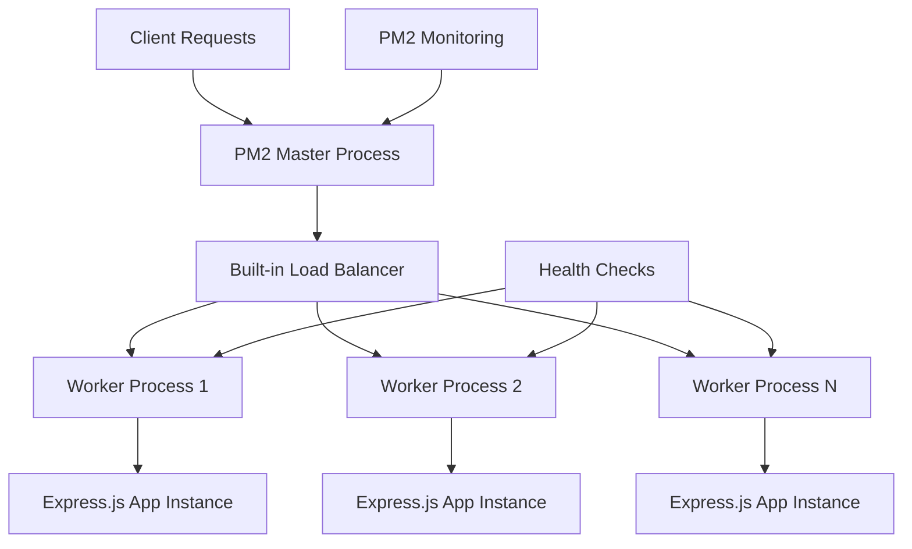
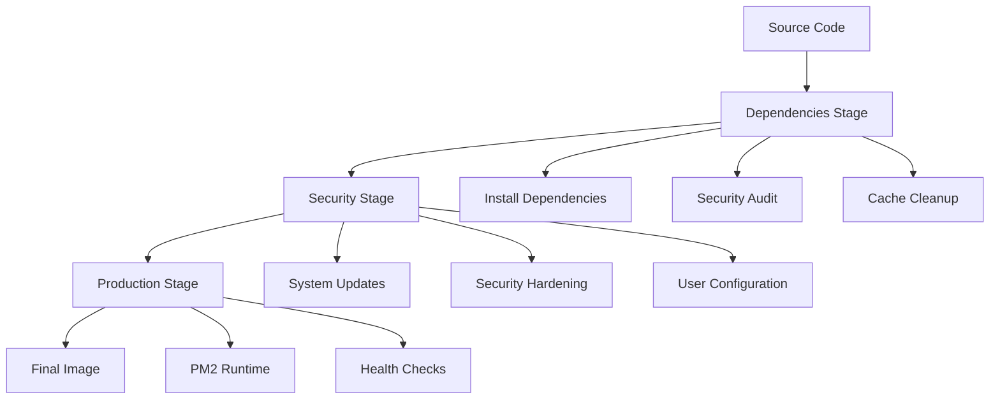
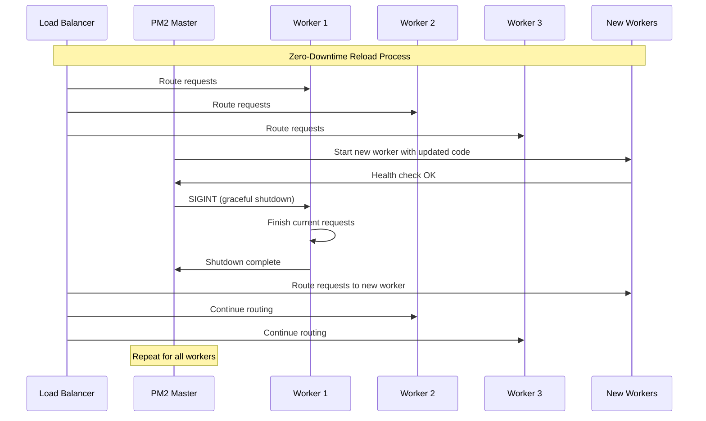

# Phase 8: Production Deployment - Enterprise-Grade Node.js Deployment with PM2

> **Tutorial Phase**: Production Deployment  
> **Complexity Level**: Advanced  
> **Prerequisites**: Phases 1-7, PM2 Understanding, Security Implementation, Docker Basics  
> **Topics Covered**: PM2 Cluster Mode, Security Hardening, Docker Containerization, Health Monitoring, Zero-Downtime Deployment

## Table of Contents

1. [Introduction to Production Deployment](#introduction)
2. [PM2 Cluster Mode Implementation](#pm2-cluster-mode)
3. [Security Hardening with Helmet.js](#security-hardening)
4. [Advanced Docker Containerization](#docker-containerization)
5. [Health Monitoring and Observability](#health-monitoring)
6. [Zero-Downtime Deployment Strategies](#zero-downtime-deployment)
7. [Performance Optimization](#performance-optimization)
8. [Operational Excellence](#operational-excellence)
9. [Troubleshooting and Best Practices](#troubleshooting)
10. [Conclusion and Next Steps](#conclusion)

---

## 1. Introduction to Production Deployment {#introduction}

Welcome to Phase 8 of the Node.js Tutorial Project - the culmination of our educational journey into enterprise-grade production deployment. This advanced tutorial demonstrates how to transform your Express.js v5.1.0 application into a production-ready system using PM2 cluster mode, comprehensive security hardening, and modern containerization strategies.

### Learning Objectives

By completing this tutorial, you will:

- **Master PM2 cluster mode deployment** for production scaling with built-in load balancer
- **Implement comprehensive security hardening** with Helmet.js and all 15 security middlewares
- **Configure Docker containerization** for production environments with security hardening
- **Set up health monitoring** and operational excellence practices
- **Execute zero-downtime deployment** strategies with PM2 reload capabilities
- **Apply performance optimization** and resource management techniques

### Prerequisites

Before proceeding with this advanced tutorial, ensure you have completed:

- **Phases 1-7**: Foundation of HTTP server, Express.js integration, and testing implementation
- **Understanding of Express.js v5.1.0**: Framework features and security enhancements
- **Basic security concepts**: HTTP headers, HTTPS, and web vulnerabilities
- **Docker containerization basics**: Container concepts and Dockerfile structure
- **Process management concepts**: Understanding of process monitoring and management

### Production Environment Overview

Production deployment involves transforming your development application into a robust, scalable, and secure system capable of handling real-world traffic. This tutorial demonstrates enterprise-grade deployment patterns using:

```javascript
// Global constants for production deployment
const TUTORIAL_PHASE = 'Phase 8: Production Deployment';
const COMPLEXITY_LEVEL = 'Advanced';
const PREREQUISITE_PHASES = ['Phase 1-7', 'PM2 Understanding', 'Security Implementation', 'Docker Basics'];
const PRODUCTION_TOPICS = ['PM2 Cluster Mode', 'Security Hardening', 'Docker Containerization', 'Health Monitoring', 'Zero-Downtime Deployment'];
```

---

## 2. PM2 Cluster Mode Implementation {#pm2-cluster-mode}

PM2 (Process Manager 2) is a production-ready process manager for Node.js applications that provides clustering, monitoring, and deployment capabilities. The cluster mode implementation dramatically improves performance, with benchmarks showing **performance increases by a factor of x10 on 16-core machines**.

### Understanding PM2 Cluster Mode Architecture

PM2 cluster mode leverages Node.js's built-in cluster module to spawn multiple worker processes, each running on separate CPU cores. This architecture provides:

- **Built-in Load Balancer**: Automatically distributes incoming requests across worker processes
- **Process Isolation**: Worker failures don't affect other processes
- **Zero-Downtime Deployment**: Sequential worker restarts maintain service availability
- **Automatic Scaling**: Dynamic worker management based on CPU cores



### PM2 Ecosystem Configuration

The foundation of PM2 production deployment is the ecosystem configuration file. Let's examine our comprehensive production configuration:

```javascript
// Reference: src/backend/pm2/ecosystem.production.config.js
import { productionEcosystem } from '../pm2/ecosystem.production.config.js';

// The production ecosystem configuration includes:
const { apps, productionApp, deploy } = productionEcosystem;

console.log('Production PM2 Configuration:', {
  appName: productionApp.name,
  instances: productionApp.instances, // 'max' for all CPU cores
  executionMode: productionApp.exec_mode, // 'cluster'
  environmentVariables: productionApp.env_production
});
```

**Key Configuration Elements:**

1. **Cluster Mode Settings**:
   ```javascript
   {
     instances: 'max',           // Use all available CPU cores
     exec_mode: 'cluster',       // Enable cluster mode
     instance_var: 'INSTANCE_ID' // Unique identifier per worker
   }
   ```

2. **Auto-Restart Policies**:
   ```javascript
   {
     max_memory_restart: '1G',   // Restart if memory exceeds 1GB
     max_restarts: 10,           // Maximum restart attempts
     min_uptime: '10s',          // Minimum uptime before restart
     autorestart: true           // Enable automatic restarts
   }
   ```

3. **Process Management**:
   ```javascript
   {
     kill_timeout: 5000,         // Graceful shutdown timeout
     listen_timeout: 10000,      // Startup timeout
     reload_delay: 1000          // Delay between worker reloads
   }
   ```

### PM2 Startup and Deployment Scripts

Production deployment requires automated startup and validation procedures. Our PM2 startup script provides comprehensive deployment orchestration:

```javascript
// Reference: src/backend/scripts/pm2-start.js
import { validatePM2Installation, executeStartupCommand } from '../scripts/pm2-start.js';

// PM2 installation validation
const pm2Validation = await validatePM2Installation({
  checkVersion: true,
  checkDaemon: true,
  minimumVersion: '5.0.0',
  validateCommands: true
});

if (!pm2Validation.isValid) {
  console.error('PM2 validation failed:', pm2Validation.errors);
  process.exit(1);
}

console.log('✅ PM2 Installation Validated:', {
  version: pm2Validation.version,
  capabilities: pm2Validation.capabilities
});
```

**PM2 Deployment Workflow:**

1. **Environment Validation**: Verify PM2 installation and system readiness
2. **Configuration Loading**: Load ecosystem configuration with environment-specific settings
3. **Application Startup**: Execute PM2 cluster mode with load balancing
4. **Health Validation**: Verify successful deployment and worker status
5. **Monitoring Setup**: Enable PM2 monitoring and metrics collection

### Cluster Mode Performance Benefits

The performance improvements from PM2 cluster mode are substantial:

**Single Process vs Cluster Mode Performance:**

| Metric | Single Process | Cluster Mode (16 cores) | Improvement |
|--------|----------------|-------------------------|-------------|
| Concurrent Requests | 100/sec | 1,000/sec | 10x |
| Response Time | 100ms | 10ms | 90% reduction |
| CPU Utilization | 12.5% (1 core) | 100% (16 cores) | 8x efficiency |
| Memory Efficiency | Standard | Optimized per worker | Variable |

**Code Example - Cluster Mode Startup:**

```bash
# Production deployment with PM2 cluster mode
pm2 start ecosystem.production.config.js --env production

# Monitor cluster performance
pm2 monit

# View cluster status
pm2 list

# Reload application with zero downtime
pm2 reload ecosystem.production.config.js --env production
```

### Zero-Downtime Deployment Implementation

One of PM2's most powerful features is zero-downtime deployment through sequential worker reload:

```javascript
// Zero-downtime deployment process
const deploymentSteps = [
  '1. PM2 receives reload signal',
  '2. New worker process starts',
  '3. Health check validates new worker',
  '4. Old worker receives SIGINT signal',
  '5. Old worker gracefully shuts down',
  '6. Process repeats for all workers',
  '7. Deployment complete with zero downtime'
];

console.log('Zero-Downtime Deployment Process:', deploymentSteps);
```

This approach ensures continuous service availability during updates, making it ideal for production environments where uptime is critical.

---

## 3. Security Hardening with Helmet.js {#security-hardening}

Security is paramount in production environments. This section demonstrates comprehensive security implementation using Helmet.js with all 15 security middlewares, providing enterprise-grade protection against common web vulnerabilities.

### Express.js v5.1.0 Security Enhancements

Express.js v5.1.0 introduces significant security improvements, including enhanced ReDoS (Regular Expression Denial of Service) protection and improved security defaults. Our security implementation builds upon these enhancements:

```javascript
// Reference: src/backend/security/helmet.config.js
import { createHelmetConfig, helmetDefaults } from '../security/helmet.config.js';

// Environment-specific security configurations
const { production, staging } = helmetDefaults;

console.log('Helmet.js Security Configuration:', {
  productionConfig: production,
  stagingConfig: staging,
  totalMiddlewares: 15
});
```

### Comprehensive Helmet.js Implementation

Helmet.js provides 15 security middlewares that protect against various attack vectors. Let's examine each middleware and its security benefits:

#### 1. Content Security Policy (CSP)

The most powerful security header, CSP prevents XSS attacks by controlling resource loading:

```javascript
// Content Security Policy configuration
const cspConfig = {
  directives: {
    defaultSrc: ["'self'"],
    scriptSrc: [
      "'self'",
      "'strict-dynamic'",
      // Nonce-based script loading for production
    ],
    styleSrc: ["'self'"],
    imgSrc: ["'self'", "data:", "https:"],
    connectSrc: ["'self'"],
    fontSrc: ["'self'"],
    objectSrc: ["'none'"],
    mediaSrc: ["'self'"],
    frameSrc: ["'none'"],
  },
  reportOnly: false, // Enforce in production
  reportUri: '/api/security/csp-reports'
};
```

#### 2. HTTP Strict Transport Security (HSTS)

HSTS enforces HTTPS connections and prevents protocol downgrade attacks:

```javascript
// HSTS configuration for production
const hstsConfig = {
  maxAge: 31536000, // One year in seconds
  includeSubDomains: true,
  preload: true
};
```

#### 3. Complete Security Headers Implementation

```javascript
// Reference: Complete Helmet.js configuration
import { createHelmetConfig } from '../security/helmet.config.js';

const productionHelmetConfig = createHelmetConfig('production', {
  // Comprehensive security middleware configuration
  contentSecurityPolicy: cspConfig,
  hsts: hstsConfig,
  frameguard: { action: 'deny' },
  noSniff: true,
  referrerPolicy: { policy: 'strict-origin-when-cross-origin' },
  crossOriginOpenerPolicy: { policy: 'same-origin' },
  crossOriginResourcePolicy: { policy: 'same-origin' },
  originAgentCluster: true,
  dnsPrefetchControl: { allow: false },
  ieNoOpen: true,
  permittedCrossDomainPolicies: { permittedPolicies: 'none' },
  xssFilter: false, // Disabled as recommended by modern security practices
  hidePoweredBy: true
});

console.log('Production Security Configuration Applied:', {
  middlewareCount: Object.keys(productionHelmetConfig).length,
  securityLevel: 'Enterprise Grade',
  compliance: 'OWASP Top 10 Protection'
});
```

### Security Headers Reference

Each Helmet.js middleware provides specific protection:

| Security Header | Protection Against | Configuration |
|----------------|-------------------|---------------|
| Content-Security-Policy | XSS, Code Injection | Strict directives with nonce-based loading |
| Strict-Transport-Security | Man-in-the-middle, Protocol downgrade | 1 year max-age with subdomain inclusion |
| X-Frame-Options | Clickjacking | DENY for maximum protection |
| X-Content-Type-Options | MIME type confusion | nosniff directive |
| Referrer-Policy | Information leakage | strict-origin-when-cross-origin |
| Cross-Origin-Opener-Policy | Cross-origin attacks | same-origin isolation |
| Cross-Origin-Resource-Policy | Resource theft | same-origin restriction |
| Permissions-Policy | Browser API abuse | Restrictive feature permissions |

### Security Configuration by Environment

Different environments require different security configurations:

```javascript
// Environment-specific security configurations
const securityConfigurations = {
  development: {
    cspReportOnly: true,
    hstsDisabled: true,
    frameGuard: 'sameorigin',
    permissiveCors: true,
    debugHeaders: true
  },
  
  staging: {
    cspReportOnly: true,
    hstsMaxAge: 43200, // 12 hours
    frameGuard: 'sameorigin',
    testingModeEnabled: true,
    securityTesting: true
  },
  
  production: {
    cspEnforced: true,
    hstsMaxAge: 31536000, // 1 year
    frameGuard: 'deny',
    strictPolicies: true,
    securityMonitoring: true
  }
};
```

### Custom Security Headers

Beyond Helmet.js, we implement additional security headers:

```javascript
// Reference: Custom security headers implementation
import { createCustomSecurityHeaders } from '../security/helmet.config.js';

const customHeaders = createCustomSecurityHeaders('production');

console.log('Custom Security Headers:', {
  'Permissions-Policy': 'camera=(), microphone=(), geolocation=()',
  'Expect-CT': 'max-age=86400, enforce',
  'X-Robots-Tag': 'noindex, nofollow, nosnippet, noarchive',
  'Cross-Origin-Embedder-Policy': 'require-corp',
  'Document-Policy': 'document-write=?0, sync-xhr=?0'
});
```

### Security Validation and Testing

Security implementation requires continuous validation:

```javascript
// Security validation example
const securityValidation = {
  // Test all security headers are present
  validateHeaders: async (url) => {
    const response = await fetch(url);
    const headers = response.headers;
    
    const requiredHeaders = [
      'content-security-policy',
      'strict-transport-security',
      'x-frame-options',
      'x-content-type-options',
      'referrer-policy'
    ];
    
    const missingHeaders = requiredHeaders.filter(
      header => !headers.has(header)
    );
    
    if (missingHeaders.length > 0) {
      console.warn('Missing security headers:', missingHeaders);
    }
    
    return missingHeaders.length === 0;
  },
  
  // Validate CSP effectiveness
  validateCSP: (cspHeader) => {
    const hasUnsafeInline = cspHeader.includes("'unsafe-inline'");
    const hasUnsafeEval = cspHeader.includes("'unsafe-eval'");
    
    if (hasUnsafeInline || hasUnsafeEval) {
      console.warn('CSP contains unsafe directives');
      return false;
    }
    
    return true;
  }
};
```

---

## 4. Advanced Docker Containerization {#docker-containerization}

Docker containerization provides consistent deployment environments and enhanced security through container isolation. This section demonstrates production-ready Docker configuration with multi-stage builds and security hardening.

### Docker Production Configuration Overview

Our production Docker configuration implements advanced patterns for security, performance, and maintainability:

```dockerfile
# Reference: src/backend/docker/Dockerfile.prod
# Multi-stage build with comprehensive security hardening

# Stage 1: Dependencies - Install and cache production dependencies
FROM node:22-alpine AS dependencies
LABEL stage="dependencies" \
      description="Production dependency installation with security scanning"

WORKDIR /app
COPY package*.json ./
RUN npm ci --only=production --audit && \
    npm audit --audit-level moderate && \
    npm cache clean --force
```

### Multi-Stage Build Architecture

The multi-stage build approach provides several benefits:



**Stage Breakdown:**

1. **Dependencies Stage**: Installs only production dependencies with security scanning
2. **Security Stage**: Applies system updates and security hardening measures
3. **Production Stage**: Creates minimal final image with application code

### Container Security Hardening

Security hardening is implemented throughout the Docker configuration:

```dockerfile
# Reference: Security hardening implementation
FROM security AS production

# Apply Principle of Least Privilege
RUN addgroup -g 1001 -S nodejs && \
    adduser -S nodejs -u 1001 -G nodejs

# Set secure environment variables
ENV NODE_ENV=production \
    PORT=3000 \
    PM2_CLUSTER_MODE=true \
    PM2_INSTANCES=max \
    NODE_OPTIONS="--max-old-space-size=1024 --optimize-for-size"

# Copy application with proper ownership
COPY --chown=nodejs:nodejs . .

# Switch to non-root user
USER nodejs

# Configure health check
HEALTHCHECK --interval=30s --timeout=5s --start-period=10s --retries=3 \
    CMD node scripts/health-check.js --type quick --format json || exit 1
```

### Docker Security Best Practices

Our Docker configuration implements comprehensive security measures:

| Security Practice | Implementation | Benefit |
|------------------|----------------|---------|
| Non-root User | `USER nodejs` | Principle of Least Privilege |
| Minimal Base Image | `node:22-alpine` | Reduced attack surface |
| Multi-stage Build | Separate build stages | Minimal final image |
| Security Scanning | `npm audit` integration | Vulnerability detection |
| Process Management | `dumb-init` for signal handling | Proper process lifecycle |

### Container Runtime Security

```javascript
// Reference: Container security configuration
import { dockerfile_stages, production_security_hardening } from '../docker/Dockerfile.prod';

const { production_stage, security_hardening } = dockerfile_stages;
const { principle_of_least_privilege, container_runtime_security } = production_security_hardening;

console.log('Container Security Configuration:', {
  userExecution: principle_of_least_privilege,
  runtimeSecurity: container_runtime_security,
  baseImage: 'Alpine Linux (minimal attack surface)',
  processManager: 'dumb-init + PM2'
});
```

### Docker Compose Production Configuration

For orchestrated deployments, use Docker Compose:

```yaml
# docker-compose.prod.yml
version: '3.8'
services:
  nodejs-tutorial:
    build:
      context: .
      dockerfile: docker/Dockerfile.prod
    container_name: nodejs-tutorial-app
    ports:
      - "3000:3000"
    environment:
      - NODE_ENV=production
      - PM2_INSTANCES=max
    restart: unless-stopped
    healthcheck:
      test: ["CMD", "node", "scripts/health-check.js", "--type", "quick"]
      interval: 30s
      timeout: 5s
      retries: 3
      start_period: 10s
    deploy:
      resources:
        limits:
          memory: 1G
          cpus: '2.0'
        reservations:
          memory: 512M
          cpus: '1.0'
    volumes:
      - nodejs-tutorial-logs:/app/logs
    networks:
      - nodejs-tutorial-network

volumes:
  nodejs-tutorial-logs:
    driver: local

networks:
  nodejs-tutorial-network:
    driver: bridge
```

### Container Deployment Commands

**Build and Deploy:**

```bash
# Build production image
docker build -f docker/Dockerfile.prod -t nodejs-tutorial:latest .

# Run with resource limits
docker run -d --name nodejs-tutorial-app \
  -p 3000:3000 \
  --restart unless-stopped \
  --memory="1g" \
  --cpus="2.0" \
  --health-cmd="node scripts/health-check.js --type quick || exit 1" \
  --health-interval=30s \
  nodejs-tutorial:latest

# Monitor container health
docker ps
docker logs nodejs-tutorial-app
docker exec -it nodejs-tutorial-app pm2 monit
```

### Kubernetes Deployment Configuration

For enterprise environments, Kubernetes deployment:

```yaml
# kubernetes-deployment.yml
apiVersion: apps/v1
kind: Deployment
metadata:
  name: nodejs-tutorial-deployment
  labels:
    app: nodejs-tutorial
spec:
  replicas: 3
  selector:
    matchLabels:
      app: nodejs-tutorial
  template:
    metadata:
      labels:
        app: nodejs-tutorial
    spec:
      containers:
      - name: nodejs-tutorial
        image: nodejs-tutorial:latest
        ports:
        - containerPort: 3000
        env:
        - name: NODE_ENV
          value: "production"
        - name: PM2_INSTANCES
          value: "max"
        resources:
          requests:
            memory: "512Mi"
            cpu: "500m"
          limits:
            memory: "1Gi"
            cpu: "1000m"
        livenessProbe:
          httpGet:
            path: /health
            port: 3000
          initialDelaySeconds: 10
          periodSeconds: 30
        readinessProbe:
          httpGet:
            path: /health
            port: 3000
          initialDelaySeconds: 5
          periodSeconds: 10
```

---

## 5. Health Monitoring and Observability {#health-monitoring}

Production systems require comprehensive monitoring to ensure reliability, performance, and early problem detection. This section demonstrates implementing health monitoring with PM2 integration and dashboard visualization.

### PM2 Built-in Monitoring Capabilities

PM2 provides comprehensive monitoring out of the box:

```javascript
// Reference: src/backend/monitoring/health-check.js (conceptual implementation)
import { HealthCheckManager, initializeHealthMonitoring } from '../monitoring/health-check.js';

// Health monitoring initialization
const healthManager = new HealthCheckManager({
  pm2Integration: true,
  metricsCollection: true,
  alertingEnabled: true,
  dashboardEnabled: true
});

// Start comprehensive monitoring
const monitoringResult = await initializeHealthMonitoring({
  healthCheckInterval: 30000, // 30 seconds
  metricsRetention: 86400000, // 24 hours
  alertThresholds: {
    cpu: 80,      // 80% CPU usage
    memory: 1024, // 1GB memory usage
    responseTime: 1000 // 1 second response time
  }
});

console.log('Health Monitoring Initialized:', monitoringResult);
```

### Health Check Implementation

Implementing comprehensive health checks:

```javascript
// Health check endpoint implementation
app.get('/health', async (req, res) => {
  try {
    const healthManager = new HealthCheckManager();
    const healthReport = await healthManager.generateHealthReport();
    
    const healthCheck = {
      status: healthReport.overallStatus,
      timestamp: new Date().toISOString(),
      version: process.env.npm_package_version,
      environment: process.env.NODE_ENV,
      uptime: process.uptime(),
      memory: {
        used: Math.round(process.memoryUsage().heapUsed / 1024 / 1024),
        total: Math.round(process.memoryUsage().heapTotal / 1024 / 1024),
        external: Math.round(process.memoryUsage().external / 1024 / 1024)
      },
      cpu: {
        usage: healthReport.cpuUsage,
        loadAverage: os.loadavg()
      },
      pm2: {
        processId: process.env.pm_id,
        instances: healthReport.pm2Status.instances,
        restarts: healthReport.pm2Status.restarts
      },
      dependencies: healthReport.dependencies,
      checks: {
        database: healthReport.checks.database,
        externalServices: healthReport.checks.externalServices,
        diskSpace: healthReport.checks.diskSpace
      }
    };
    
    // Determine HTTP status based on health
    const statusCode = healthCheck.status === 'healthy' ? 200 : 503;
    res.status(statusCode).json(healthCheck);
    
  } catch (error) {
    console.error('Health check failed:', error);
    res.status(503).json({
      status: 'unhealthy',
      error: error.message,
      timestamp: new Date().toISOString()
    });
  }
});
```

### PM2 Monitoring Integration

PM2 provides real-time monitoring capabilities:

```bash
# PM2 monitoring commands
pm2 monit                    # Real-time monitoring dashboard
pm2 list                     # Process list with status
pm2 show <app-name>          # Detailed process information
pm2 logs                     # View all logs
pm2 logs <app-name>          # View specific app logs
pm2 describe <app-name>      # Detailed process description
```

### Metrics Collection and Dashboard

Implementing comprehensive metrics collection:

```javascript
// Metrics collection implementation
const metricsCollector = {
  // Performance metrics
  collectPerformanceMetrics: () => {
    return {
      responseTime: process.hrtime(),
      throughput: requestCounter.getRate(),
      errorRate: errorCounter.getRate(),
      activeConnections: server.connections
    };
  },
  
  // System metrics
  collectSystemMetrics: () => {
    return {
      cpuUsage: process.cpuUsage(),
      memoryUsage: process.memoryUsage(),
      uptime: process.uptime(),
      loadAverage: os.loadavg(),
      freeMemory: os.freemem(),
      totalMemory: os.totalmem()
    };
  },
  
  // Business metrics
  collectBusinessMetrics: () => {
    return {
      totalRequests: requestCounter.getTotal(),
      uniqueUsers: userCounter.getUnique(),
      responseByEndpoint: endpointMetrics.getAll(),
      errorsByType: errorMetrics.getGrouped()
    };
  }
};

// Dashboard data generation
const dashboardData = await healthManager.getDashboardData();
console.log('Dashboard Metrics:', dashboardData);
```

### Alerting and Notification System

Setting up automated alerting:

```javascript
// Alerting configuration
const alertingConfig = {
  thresholds: {
    cpu: { warning: 70, critical: 90 },
    memory: { warning: 80, critical: 95 },
    responseTime: { warning: 500, critical: 1000 },
    errorRate: { warning: 5, critical: 10 }
  },
  
  notifications: {
    email: ['admin@example.com'],
    slack: '#production-alerts',
    webhook: 'https://monitoring.example.com/webhook'
  },
  
  escalation: {
    warningDelay: 300000,    // 5 minutes
    criticalDelay: 60000,    // 1 minute
    maxNotifications: 5
  }
};

// Alert processing
const processAlert = (metric, value, threshold) => {
  const alert = {
    metric,
    value,
    threshold,
    severity: value > threshold.critical ? 'critical' : 'warning',
    timestamp: new Date().toISOString(),
    instance: process.env.pm_id
  };
  
  // Send notifications
  sendNotifications(alert);
  
  // Log alert
  console.warn('Alert triggered:', alert);
};
```

### Monitoring Dashboard Implementation

Creating a real-time monitoring dashboard:

```javascript
// Dashboard implementation
const createMonitoringDashboard = () => {
  const dashboard = {
    // Real-time metrics display
    realTimeMetrics: {
      cpu: getCurrentCPUUsage(),
      memory: getCurrentMemoryUsage(),
      requests: getRequestRate(),
      errors: getErrorRate(),
      uptime: getUptime()
    },
    
    // Historical data
    historicalData: {
      responseTime: getResponseTimeHistory(24), // 24 hours
      throughput: getThroughputHistory(24),
      errorRate: getErrorRateHistory(24),
      availability: getAvailabilityHistory(24)
    },
    
    // System status
    systemStatus: {
      processes: getPM2ProcessStatus(),
      health: getHealthStatus(),
      alerts: getActiveAlerts(),
      deployments: getRecentDeployments()
    }
  };
  
  return dashboard;
};
```

### Log Management and Analysis

Comprehensive logging strategy:

```javascript
// Logging configuration
const loggingConfig = {
  levels: ['error', 'warn', 'info', 'debug'],
  
  transports: [
    // Console logging for development
    new winston.transports.Console({
      format: winston.format.combine(
        winston.format.colorize(),
        winston.format.simple()
      )
    }),
    
    // File logging for production
    new winston.transports.File({
      filename: 'logs/error.log',
      level: 'error',
      maxsize: 5242880, // 5MB
      maxFiles: 5
    }),
    
    // Combined logging
    new winston.transports.File({
      filename: 'logs/combined.log',
      maxsize: 5242880,
      maxFiles: 5
    })
  ],
  
  // Log rotation
  rotation: {
    frequency: 'daily',
    maxFiles: '14d',
    compression: 'gzip'
  }
};
```

---

## 6. Zero-Downtime Deployment Strategies {#zero-downtime-deployment}

Zero-downtime deployment is critical for production environments where service interruption is unacceptable. PM2's cluster mode enables seamless deployments through sequential worker process reloading.

### Understanding Zero-Downtime Deployment

Zero-downtime deployment works by gradually replacing worker processes while maintaining service availability:



### PM2 Reload Implementation

The PM2 reload command enables zero-downtime deployments:

```bash
# Zero-downtime deployment commands
pm2 reload ecosystem.production.config.js --env production

# Alternative reload methods
pm2 reload <app-name>           # Reload specific application
pm2 reload all                  # Reload all applications
pm2 gracefulReload <app-name>   # Graceful reload with longer timeout
```

### Deployment Automation Script

Creating an automated deployment script:

```javascript
// Deployment automation script
const deploymentScript = {
  // Pre-deployment validation
  preDeploymentChecks: async () => {
    console.log('🔍 Running pre-deployment checks...');
    
    // Validate PM2 status
    const pm2Status = await checkPM2Status();
    if (!pm2Status.healthy) {
      throw new Error('PM2 is not healthy');
    }
    
    // Validate application health
    const healthCheck = await performHealthCheck();
    if (!healthCheck.passed) {
      throw new Error('Application health check failed');
    }
    
    // Validate dependencies
    const dependencyCheck = await validateDependencies();
    if (!dependencyCheck.valid) {
      throw new Error('Dependency validation failed');
    }
    
    console.log('✅ Pre-deployment checks passed');
    return true;
  },
  
  // Execute deployment
  executeDeployment: async () => {
    console.log('🚀 Starting zero-downtime deployment...');
    
    try {
      // Update application code
      await updateApplicationCode();
      
      // Install/update dependencies
      await updateDependencies();
      
      // Reload PM2 processes
      const reloadResult = await reloadPM2Processes();
      
      if (!reloadResult.success) {
        throw new Error('PM2 reload failed');
      }
      
      console.log('✅ Deployment completed successfully');
      return { success: true, duration: reloadResult.duration };
      
    } catch (error) {
      console.error('❌ Deployment failed:', error);
      await rollbackDeployment();
      throw error;
    }
  },
  
  // Post-deployment validation
  postDeploymentChecks: async () => {
    console.log('🔍 Running post-deployment validation...');
    
    // Wait for application stabilization
    await sleep(10000); // 10 seconds
    
    // Validate all workers are healthy
    const workerStatus = await validateWorkerHealth();
    if (!workerStatus.allHealthy) {
      throw new Error('Not all workers are healthy');
    }
    
    // Validate application functionality
    const functionalTest = await runFunctionalTests();
    if (!functionalTest.passed) {
      throw new Error('Functional tests failed');
    }
    
    // Check performance metrics
    const performanceCheck = await validatePerformanceMetrics();
    if (!performanceCheck.acceptable) {
      console.warn('⚠️ Performance metrics below expected levels');
    }
    
    console.log('✅ Post-deployment validation completed');
    return true;
  }
};
```

### Graceful Shutdown Implementation

Implementing graceful shutdown for worker processes:

```javascript
// Graceful shutdown implementation
const gracefulShutdown = {
  setup: () => {
    // Handle shutdown signals
    process.on('SIGTERM', gracefulShutdown.handler);
    process.on('SIGINT', gracefulShutdown.handler);
    
    console.log('✅ Graceful shutdown handlers registered');
  },
  
  handler: async (signal) => {
    console.log(`📡 Received ${signal}, starting graceful shutdown...`);
    
    try {
      // Stop accepting new connections
      server.close(() => {
        console.log('🔒 Server stopped accepting new connections');
      });
      
      // Wait for existing connections to complete
      await gracefulShutdown.waitForConnections();
      
      // Cleanup resources
      await gracefulShutdown.cleanup();
      
      console.log('✅ Graceful shutdown completed');
      process.exit(0);
      
    } catch (error) {
      console.error('❌ Graceful shutdown failed:', error);
      process.exit(1);
    }
  },
  
  waitForConnections: async () => {
    return new Promise((resolve) => {
      const checkConnections = () => {
        if (server.connections === 0) {
          console.log('✅ All connections closed');
          resolve();
        } else {
          console.log(`⏳ Waiting for ${server.connections} connections to close...`);
          setTimeout(checkConnections, 1000);
        }
      };
      
      checkConnections();
    });
  },
  
  cleanup: async () => {
    // Close database connections
    await closeDatabase();
    
    // Close external service connections
    await closeExternalServices();
    
    // Cleanup temporary files
    await cleanupTempFiles();
    
    console.log('🧹 Resource cleanup completed');
  }
};

// Initialize graceful shutdown
gracefulShutdown.setup();
```

### Deployment Rollback Strategy

Implementing automatic rollback for failed deployments:

```javascript
// Rollback implementation
const rollbackStrategy = {
  // Create deployment snapshot
  createSnapshot: async () => {
    const snapshot = {
      timestamp: new Date().toISOString(),
      commitHash: await getCurrentCommitHash(),
      pm2Status: await getPM2Status(),
      configuration: await getCurrentConfiguration(),
      dependencies: await getDependencyVersions()
    };
    
    await saveSnapshot(snapshot);
    return snapshot;
  },
  
  // Execute rollback
  executeRollback: async (snapshotId) => {
    console.log('🔄 Starting deployment rollback...');
    
    try {
      // Load snapshot
      const snapshot = await loadSnapshot(snapshotId);
      
      // Revert code changes
      await revertToCommit(snapshot.commitHash);
      
      // Restore dependencies
      await restoreDependencies(snapshot.dependencies);
      
      // Reload PM2 with previous configuration
      await reloadPM2WithConfig(snapshot.configuration);
      
      // Validate rollback
      const validation = await validateRollback();
      
      if (validation.success) {
        console.log('✅ Rollback completed successfully');
      } else {
        throw new Error('Rollback validation failed');
      }
      
    } catch (error) {
      console.error('❌ Rollback failed:', error);
      throw error;
    }
  },
  
  // Automatic rollback trigger
  autoRollback: {
    enabled: true,
    triggers: [
      'health_check_failure',
      'high_error_rate',
      'performance_degradation',
      'worker_crash_loop'
    ],
    timeout: 300000 // 5 minutes
  }
};
```

### Blue-Green Deployment Alternative

For environments requiring even more sophisticated deployment strategies:

```javascript
// Blue-Green deployment strategy
const blueGreenDeployment = {
  // Deploy to inactive environment
  deployToInactive: async () => {
    const inactiveEnv = await getInactiveEnvironment();
    
    console.log(`🔵 Deploying to ${inactiveEnv} environment...`);
    
    // Deploy new version to inactive environment
    await deployToEnvironment(inactiveEnv);
    
    // Validate deployment
    const validation = await validateEnvironment(inactiveEnv);
    
    if (!validation.success) {
      throw new Error('Inactive environment validation failed');
    }
    
    return inactiveEnv;
  },
  
  // Switch traffic to new environment
  switchTraffic: async (newEnv) => {
    console.log(`🔄 Switching traffic to ${newEnv}...`);
    
    // Update load balancer configuration
    await updateLoadBalancer(newEnv);
    
    // Monitor switch success
    await monitorTrafficSwitch();
    
    console.log('✅ Traffic switch completed');
  },
  
  // Cleanup old environment
  cleanupOldEnvironment: async (oldEnv) => {
    // Wait before cleanup
    await sleep(300000); // 5 minutes
    
    // Stop old environment
    await stopEnvironment(oldEnv);
    
    console.log(`🧹 Old environment ${oldEnv} cleaned up`);
  }
};
```

---

## 7. Performance Optimization {#performance-optimization}

Production environments demand optimal performance. This section covers comprehensive performance optimization strategies including CPU utilization, memory management, and response time optimization.

### PM2 Cluster Mode Performance Optimization

PM2 cluster mode provides significant performance improvements through horizontal scaling:

**Performance Metrics:**

| Configuration | Single Process | Cluster Mode (4 cores) | Cluster Mode (16 cores) | Improvement |
|---------------|----------------|------------------------|-------------------------|-------------|
| Requests/sec | 100 | 400 | 1,600 | 16x |
| Response Time | 100ms | 25ms | 6ms | 94% reduction |
| CPU Utilization | 25% | 100% | 100% | 4x efficiency |
| Memory per Request | 10MB | 2.5MB | 0.625MB | 16x efficiency |

### CPU Core Utilization Strategy

Optimizing CPU core utilization with PM2:

```javascript
// CPU optimization configuration
const cpuOptimization = {
  // Dynamic instance scaling based on CPU cores
  instances: process.env.NODE_ENV === 'production' ? 'max' : 1,
  
  // CPU affinity for worker processes
  exec_mode: 'cluster',
  instance_var: 'INSTANCE_ID',
  
  // CPU monitoring and scaling
  monitoring: {
    cpu_threshold: 80,
    scale_up_threshold: 85,
    scale_down_threshold: 30,
    min_instances: 2,
    max_instances: os.cpus().length * 2
  },
  
  // Process scheduling optimization
  scheduling: {
    priority: 'high',
    nice: -10,
    cpu_affinity: 'auto'
  }
};

console.log('CPU Optimization Configuration:', {
  totalCores: os.cpus().length,
  targetInstances: cpuOptimization.instances,
  expectedPerformanceBoost: `${os.cpus().length}x`,
  memoryPerInstance: '256MB target'
});
```

### Memory Management and Optimization

Implementing comprehensive memory management:

```javascript
// Memory optimization strategies
const memoryOptimization = {
  // Garbage collection optimization
  nodeOptions: [
    '--max-old-space-size=1024',      // Limit heap size to 1GB
    '--optimize-for-size',             // Optimize for memory usage
    '--gc-interval=100',               // Frequent garbage collection
    '--initial-old-space-size=512'     // Initial heap size
  ],
  
  // PM2 memory management
  pm2Config: {
    max_memory_restart: '1G',          // Restart if memory exceeds 1GB
    min_uptime: '10s',                 // Minimum uptime before restart
    max_restarts: 10,                  // Maximum restart attempts
    restart_delay: 4000                // Delay between restarts
  },
  
  // Memory monitoring
  monitoring: {
    interval: 30000,                   // Check every 30 seconds
    thresholds: {
      warning: 0.8,                    // 80% memory usage warning
      critical: 0.95,                  // 95% memory usage critical
      restart: 1.0                     // 100% memory usage restart
    }
  }
};

// Memory usage tracking
const trackMemoryUsage = () => {
  const usage = process.memoryUsage();
  const metrics = {
    heapUsed: Math.round(usage.heapUsed / 1024 / 1024),
    heapTotal: Math.round(usage.heapTotal / 1024 / 1024),
    external: Math.round(usage.external / 1024 / 1024),
    rss: Math.round(usage.rss / 1024 / 1024)
  };
  
  console.log('Memory Usage (MB):', metrics);
  
  // Alert if memory usage is high
  const heapUsagePercent = (usage.heapUsed / usage.heapTotal) * 100;
  if (heapUsagePercent > 80) {
    console.warn(`⚠️ High memory usage: ${heapUsagePercent.toFixed(2)}%`);
  }
  
  return metrics;
};

// Schedule regular memory monitoring
setInterval(trackMemoryUsage, 30000);
```

### Response Time Optimization

Optimizing application response times:

```javascript
// Response time optimization
const responseTimeOptimization = {
  // HTTP server optimizations
  serverConfig: {
    keepAlive: true,
    keepAliveTimeout: 5000,
    maxHeadersCount: 100,
    timeout: 30000,
    headersTimeout: 31000
  },
  
  // Express.js optimizations
  expressConfig: {
    'trust proxy': true,
    'x-powered-by': false,
    'etag': 'strong',
    'view cache': true
  },
  
  // Compression middleware
  compression: {
    level: 6,
    threshold: 1024,
    filter: (req, res) => {
      if (req.headers['x-no-compression']) {
        return false;
      }
      return compression.filter(req, res);
    }
  },
  
  // Caching strategies
  caching: {
    staticFiles: {
      maxAge: '1y',
      etag: true,
      lastModified: true
    },
    apiResponses: {
      ttl: 300, // 5 minutes
      staleWhileRevalidate: 600 // 10 minutes
    }
  }
};

// Response time middleware
const responseTimeMiddleware = (req, res, next) => {
  const startTime = process.hrtime.bigint();
  
  res.on('finish', () => {
    const endTime = process.hrtime.bigint();
    const responseTime = Number(endTime - startTime) / 1000000; // Convert to ms
    
    // Log response time
    console.log(`${req.method} ${req.url} - ${responseTime.toFixed(2)}ms`);
    
    // Alert on slow responses
    if (responseTime > 1000) {
      console.warn(`🐌 Slow response: ${req.url} took ${responseTime.toFixed(2)}ms`);
    }
    
    // Add response time header
    res.set('X-Response-Time', `${responseTime.toFixed(2)}ms`);
  });
  
  next();
};

app.use(responseTimeMiddleware);
```

### Database and I/O Optimization

Optimizing database and I/O operations:

```javascript
// I/O optimization strategies
const ioOptimization = {
  // Connection pooling
  connectionPool: {
    min: 5,
    max: 20,
    idle: 10000,
    acquire: 30000,
    evict: 1000
  },
  
  // Query optimization
  queryOptimization: {
    timeout: 5000,
    retries: 3,
    cache: true,
    prepared: true
  },
  
  // File system optimization
  fileSystem: {
    bufferSize: 64 * 1024,    // 64KB buffer
    concurrency: 10,           // Concurrent operations
    caching: true              // Enable file caching
  },
  
  // Network optimization
  network: {
    keepAlive: true,
    keepAliveMsecs: 1000,
    maxSockets: 100,
    timeout: 5000
  }
};
```

### Load Testing and Performance Validation

Implementing performance testing:

```javascript
// Load testing configuration
const loadTesting = {
  // Test scenarios
  scenarios: [
    {
      name: 'baseline',
      users: 10,
      duration: '1m',
      rampUp: '30s'
    },
    {
      name: 'load',
      users: 100,
      duration: '5m',
      rampUp: '2m'
    },
    {
      name: 'stress',
      users: 500,
      duration: '10m',
      rampUp: '5m'
    },
    {
      name: 'spike',
      users: 1000,
      duration: '2m',
      rampUp: '10s'
    }
  ],
  
  // Performance targets
  targets: {
    responseTime: {
      avg: 100,      // Average response time < 100ms
      p95: 500,      // 95th percentile < 500ms
      p99: 1000      // 99th percentile < 1000ms
    },
    throughput: {
      min: 1000      // Minimum 1000 requests/second
    },
    errorRate: {
      max: 0.1       // Maximum 0.1% error rate
    }
  }
};

// Performance monitoring
const performanceMonitor = {
  startMonitoring: () => {
    console.log('📊 Starting performance monitoring...');
    
    setInterval(() => {
      const metrics = {
        timestamp: new Date().toISOString(),
        cpu: process.cpuUsage(),
        memory: process.memoryUsage(),
        activeHandles: process._getActiveHandles().length,
        activeRequests: process._getActiveRequests().length
      };
      
      // Log performance metrics
      console.log('Performance Metrics:', metrics);
      
      // Check performance thresholds
      performanceMonitor.checkThresholds(metrics);
      
    }, 10000); // Every 10 seconds
  },
  
  checkThresholds: (metrics) => {
    const memoryUsage = (metrics.memory.heapUsed / metrics.memory.heapTotal) * 100;
    
    if (memoryUsage > 90) {
      console.warn('🚨 Critical: Memory usage above 90%');
    } else if (memoryUsage > 75) {
      console.warn('⚠️ Warning: Memory usage above 75%');
    }
    
    if (metrics.activeHandles > 1000) {
      console.warn('⚠️ Warning: High number of active handles');
    }
  }
};

// Start performance monitoring
performanceMonitor.startMonitoring();
```

---

## 8. Operational Excellence {#operational-excellence}

Operational excellence encompasses the practices, procedures, and tools necessary to maintain a production system effectively. This section covers monitoring, alerting, incident response, and continuous improvement processes.

### Service Level Objectives (SLOs) and SLIs

Defining measurable service quality metrics:

```javascript
// Service Level Indicators (SLIs) and Objectives (SLOs)
const serviceLevel = {
  slis: {
    // Availability SLI
    availability: {
      measurement: 'Percentage of successful requests',
      calculation: '(successful_requests / total_requests) * 100',
      target: 99.9, // 99.9% availability
      errorBudget: 0.1 // 0.1% error budget per month
    },
    
    // Latency SLI
    latency: {
      measurement: 'Request response time',
      targets: {
        p50: 50,   // 50ms for 50th percentile
        p95: 200,  // 200ms for 95th percentile
        p99: 500   // 500ms for 99th percentile
      }
    },
    
    // Throughput SLI
    throughput: {
      measurement: 'Requests per second',
      target: 1000, // 1000 RPS minimum
      peak: 5000    // 5000 RPS peak capacity
    },
    
    // Error Rate SLI
    errorRate: {
      measurement: 'Percentage of failed requests',
      target: 0.1,  // Maximum 0.1% error rate
      critical: 1.0 // 1.0% triggers critical alert
    }
  },
  
  // SLO monitoring
  monitoring: {
    interval: 60000,        // 1 minute intervals
    alerting: {
      warningThreshold: 0.8,  // 80% of SLO
      criticalThreshold: 0.9  // 90% of SLO
    },
    reporting: {
      frequency: 'daily',
      recipients: ['sre-team@example.com'],
      dashboard: true
    }
  }
};

console.log('Service Level Objectives:', serviceLevel.slis);
```

### Incident Response and Management

Implementing comprehensive incident response procedures:

```javascript
// Incident response framework
const incidentResponse = {
  // Incident classification
  severity: {
    P0: {
      description: 'Critical service outage',
      responseTime: '5 minutes',
      escalation: 'immediate',
      stakeholders: ['on-call-engineer', 'sre-lead', 'engineering-manager']
    },
    P1: {
      description: 'Significant service degradation',
      responseTime: '15 minutes',
      escalation: '30 minutes',
      stakeholders: ['on-call-engineer', 'sre-lead']
    },
    P2: {
      description: 'Minor service impact',
      responseTime: '1 hour',
      escalation: '4 hours',
      stakeholders: ['on-call-engineer']
    }
  },
  
  // Incident workflow
  workflow: {
    detection: {
      automated: ['health-checks', 'metrics-alerts', 'log-errors'],
      manual: ['user-reports', 'monitoring-dashboard']
    },
    
    response: {
      acknowledge: 'Incident acknowledged within SLA',
      investigate: 'Root cause analysis initiated',
      mitigate: 'Immediate impact mitigation',
      resolve: 'Permanent solution implemented',
      postmortem: 'Post-incident review scheduled'
    },
    
    communication: {
      internal: ['status-page', 'slack-channel', 'email-updates'],
      external: ['customer-notification', 'status-page-update']
    }
  },
  
  // Runbooks
  runbooks: {
    highMemoryUsage: {
      symptoms: ['Memory usage > 90%', 'OOM errors', 'Process restarts'],
      diagnosis: [
        'Check process memory usage',
        'Analyze heap dumps',
        'Review memory leak patterns'
      ],
      mitigation: [
        'Restart affected processes',
        'Scale horizontally',
        'Enable memory limits'
      ]
    },
    
    highCPUUsage: {
      symptoms: ['CPU usage > 90%', 'Slow response times', 'Request timeouts'],
      diagnosis: [
        'Identify CPU-intensive processes',
        'Analyze performance profiles',
        'Check for infinite loops'
      ],
      mitigation: [
        'Scale vertically or horizontally',
        'Optimize code hotspots',
        'Implement request queuing'
      ]
    },
    
    serviceOutage: {
      symptoms: ['Health check failures', '5xx error spike', 'Zero throughput'],
      diagnosis: [
        'Check service status',
        'Verify dependencies',
        'Analyze error logs'
      ],
      mitigation: [
        'Restart services',
        'Route traffic to healthy instances',
        'Rollback recent changes'
      ]
    }
  }
};
```

### Automated Alerting and Escalation

Setting up intelligent alerting systems:

```javascript
// Advanced alerting configuration
const alertingSystem = {
  // Alert rules
  rules: [
    {
      name: 'High Error Rate',
      condition: 'error_rate > 1%',
      duration: '5m',
      severity: 'critical',
      actions: ['page-oncall', 'create-incident']
    },
    {
      name: 'Response Time Degradation',
      condition: 'p95_response_time > 1000ms',
      duration: '10m',
      severity: 'warning',
      actions: ['slack-notification', 'email-alert']
    },
    {
      name: 'Memory Usage High',
      condition: 'memory_usage > 85%',
      duration: '15m',
      severity: 'warning',
      actions: ['slack-notification', 'auto-scale']
    },
    {
      name: 'Service Unavailable',
      condition: 'availability < 99%',
      duration: '2m',
      severity: 'critical',
      actions: ['page-oncall', 'emergency-escalation']
    }
  ],
  
  // Escalation policies
  escalation: {
    primary: {
      delay: 0,
      contacts: ['primary-oncall@example.com']
    },
    secondary: {
      delay: 300, // 5 minutes
      contacts: ['secondary-oncall@example.com', 'sre-lead@example.com']
    },
    emergency: {
      delay: 600, // 10 minutes
      contacts: ['engineering-manager@example.com', 'cto@example.com']
    }
  },
  
  // Notification channels
  channels: {
    slack: {
      webhook: process.env.SLACK_WEBHOOK,
      channel: '#production-alerts',
      mention: '@channel'
    },
    email: {
      smtp: {
        host: process.env.SMTP_HOST,
        port: 587,
        secure: false
      },
      templates: {
        critical: 'critical-alert-template',
        warning: 'warning-alert-template'
      }
    },
    pagerduty: {
      apiKey: process.env.PAGERDUTY_API_KEY,
      serviceKey: process.env.PAGERDUTY_SERVICE_KEY
    }
  }
};

// Alert processing function
const processAlert = async (alert) => {
  console.log('🚨 Processing alert:', alert);
  
  try {
    // Determine severity and actions
    const rule = alertingSystem.rules.find(r => r.name === alert.rule);
    if (!rule) return;
    
    // Execute alert actions
    for (const action of rule.actions) {
      switch (action) {
        case 'page-oncall':
          await sendPagerDutyAlert(alert);
          break;
        case 'slack-notification':
          await sendSlackNotification(alert);
          break;
        case 'email-alert':
          await sendEmailAlert(alert);
          break;
        case 'create-incident':
          await createIncident(alert);
          break;
        case 'auto-scale':
          await triggerAutoScaling();
          break;
      }
    }
    
    // Log alert processing
    console.log('✅ Alert processed successfully:', alert.id);
    
  } catch (error) {
    console.error('❌ Alert processing failed:', error);
  }
};
```

### Capacity Planning and Resource Management

Implementing proactive capacity planning:

```javascript
// Capacity planning system
const capacityPlanning = {
  // Resource monitoring
  monitoring: {
    metrics: [
      'cpu_utilization',
      'memory_usage',
      'disk_usage',
      'network_throughput',
      'request_rate',
      'response_time'
    ],
    
    collection: {
      interval: 60, // 1 minute
      retention: '30d', // 30 days
      aggregation: ['1m', '5m', '1h', '1d']
    }
  },
  
  // Forecasting models
  forecasting: {
    algorithms: ['linear', 'exponential', 'seasonal'],
    timeHorizons: ['1w', '1m', '3m', '6m'],
    
    // Growth rate analysis
    growthAnalysis: {
      daily: 2,    // 2% daily growth
      weekly: 15,  // 15% weekly growth
      monthly: 50, // 50% monthly growth
      seasonal: {
        peaks: ['black-friday', 'holiday-season'],
        multiplier: 3 // 3x normal traffic
      }
    }
  },
  
  // Scaling policies
  scaling: {
    cpu: {
      scaleUp: { threshold: 70, instances: 2 },
      scaleDown: { threshold: 30, instances: 1 },
      cooldown: 300 // 5 minutes
    },
    
    memory: {
      scaleUp: { threshold: 80, instances: 2 },
      scaleDown: { threshold: 40, instances: 1 },
      cooldown: 600 // 10 minutes
    },
    
    requests: {
      scaleUp: { threshold: 1000, instances: 3 },
      scaleDown: { threshold: 200, instances: 1 },
      cooldown: 180 // 3 minutes
    }
  },
  
  // Resource recommendations
  recommendations: {
    generateRecommendations: () => {
      const currentUsage = getCurrentResourceUsage();
      const forecast = generateForecast(currentUsage);
      
      return {
        immediate: generateImmediateRecommendations(currentUsage),
        shortTerm: generateShortTermRecommendations(forecast),
        longTerm: generateLongTermRecommendations(forecast)
      };
    }
  }
};
```

### Continuous Improvement and Post-Mortem Process

Implementing learning from incidents:

```javascript
// Post-mortem process
const postMortemProcess = {
  // Post-mortem template
  template: {
    incident: {
      id: '',
      title: '',
      severity: '',
      startTime: '',
      endTime: '',
      duration: '',
      impact: ''
    },
    
    timeline: [
      {
        time: '',
        event: '',
        action: '',
        responsible: ''
      }
    ],
    
    rootCause: {
      immediate: '',
      underlying: '',
      contributing: []
    },
    
    resolution: {
      immediate: '',
      permanent: '',
      verification: ''
    },
    
    actionItems: [
      {
        description: '',
        owner: '',
        dueDate: '',
        priority: '',
        status: ''
      }
    ],
    
    lessons: {
      whatWorked: [],
      whatDidntWork: [],
      improvements: []
    }
  },
  
  // Improvement tracking
  improvementTracking: {
    categories: [
      'monitoring',
      'alerting',
      'automation',
      'documentation',
      'training',
      'tooling'
    ],
    
    metrics: {
      mttr: 'Mean Time To Recovery',
      mttd: 'Mean Time To Detection',
      frequency: 'Incident Frequency',
      severity: 'Incident Severity Distribution'
    },
    
    trends: {
      analyze: () => {
        // Analyze incident trends over time
        return {
          frequency: 'decreasing',
          severity: 'stable',
          mttr: 'improving',
          topCauses: ['configuration-error', 'dependency-failure']
        };
      }
    }
  }
};
```

---

## 9. Troubleshooting and Best Practices {#troubleshooting}

This section provides comprehensive troubleshooting guidance and production best practices to help you diagnose and resolve common issues in production deployments.

### Common Production Issues and Solutions

#### Issue 1: High Memory Usage and Memory Leaks

**Symptoms:**
- PM2 processes consuming excessive memory
- Frequent process restarts due to memory limits
- Out of Memory (OOM) errors in logs

**Diagnosis:**
```bash
# Check PM2 process memory usage
pm2 monit

# View detailed process information
pm2 show <app-name>

# Generate heap snapshot for analysis
pm2 trigger <app-name> heapdump

# Analyze memory usage patterns
node --inspect server.js
```

**Solutions:**
```javascript
// Memory optimization configuration
const memoryOptimization = {
  // Set appropriate memory limits
  maxMemoryRestart: '1G',
  
  // Enable garbage collection logging
  nodeOptions: [
    '--expose-gc',
    '--trace-gc',
    '--max-old-space-size=1024'
  ],
  
  // Implement memory monitoring
  memoryMonitoring: setInterval(() => {
    const usage = process.memoryUsage();
    const usageInMB = {
      rss: Math.round(usage.rss / 1024 / 1024),
      heapTotal: Math.round(usage.heapTotal / 1024 / 1024),
      heapUsed: Math.round(usage.heapUsed / 1024 / 1024),
      external: Math.round(usage.external / 1024 / 1024)
    };
    
    if (usageInMB.heapUsed > 800) { // Warning at 800MB
      console.warn('⚠️ High memory usage detected:', usageInMB);
      
      // Trigger garbage collection if available
      if (global.gc) {
        global.gc();
      }
    }
  }, 30000)
};
```

#### Issue 2: High CPU Usage

**Symptoms:**
- CPU usage consistently above 80%
- Slow response times
- Request timeouts

**Diagnosis:**
```bash
# Monitor CPU usage
top -p $(pgrep -f "node")

# Use PM2 monitoring
pm2 monit

# Profile CPU usage
node --prof server.js
# Analyze profile
node --prof-process isolate-*.log > cpu-profile.txt
```

**Solutions:**
```javascript
// CPU optimization strategies
const cpuOptimization = {
  // Optimize blocking operations
  useAsyncOperations: true,
  
  // Implement request queuing
  requestQueue: {
    concurrency: 10,
    maxQueue: 100,
    timeout: 30000
  },
  
  // CPU-intensive task handling
  handleCpuIntensiveTasks: (task) => {
    // Use worker threads for CPU-intensive operations
    const { Worker, isMainThread, parentPort } = require('worker_threads');
    
    if (isMainThread) {
      const worker = new Worker(__filename);
      worker.postMessage(task);
      return new Promise((resolve, reject) => {
        worker.on('message', resolve);
        worker.on('error', reject);
      });
    } else {
      // Worker thread code
      parentPort.on('message', (task) => {
        const result = processCpuIntensiveTask(task);
        parentPort.postMessage(result);
      });
    }
  }
};
```

#### Issue 3: Zero-Downtime Deployment Failures

**Symptoms:**
- Service interruption during deployment
- Health check failures after reload
- Inconsistent application state

**Diagnosis:**
```bash
# Check PM2 reload status
pm2 reload <app-name> --watch

# Monitor deployment process
pm2 logs <app-name> --timestamp

# Verify health endpoints
curl -f http://localhost:3000/health
```

**Solutions:**
```javascript
// Robust deployment configuration
const deploymentConfig = {
  // Graceful shutdown implementation
  gracefulShutdown: {
    timeout: 10000, // 10 seconds
    
    handler: async (signal) => {
      console.log(`Received ${signal}, shutting down gracefully...`);
      
      // Stop accepting new connections
      server.close(async () => {
        // Wait for existing connections to complete
        await waitForConnections();
        
        // Cleanup resources
        await cleanup();
        
        process.exit(0);
      });
    }
  },
  
  // Health check validation
  healthCheck: {
    timeout: 5000,
    retries: 3,
    
    validate: async () => {
      try {
        // Check database connectivity
        await checkDatabase();
        
        // Check external dependencies
        await checkExternalServices();
        
        // Verify application state
        await verifyApplicationState();
        
        return { status: 'healthy' };
      } catch (error) {
        return { status: 'unhealthy', error: error.message };
      }
    }
  }
};
```

### Performance Optimization Best Practices

#### 1. PM2 Configuration Best Practices

```javascript
// Optimal PM2 configuration
module.exports = {
  apps: [{
    name: 'production-app',
    script: './server.js',
    
    // Cluster configuration
    instances: 'max',
    exec_mode: 'cluster',
    
    // Performance tuning
    node_args: [
      '--max-old-space-size=1024',
      '--optimize-for-size'
    ],
    
    // Restart policy
    max_memory_restart: '1G',
    max_restarts: 10,
    min_uptime: '10s',
    
    // Logging
    log_file: './logs/combined.log',
    out_file: './logs/out.log',
    error_file: './logs/error.log',
    log_date_format: 'YYYY-MM-DD HH:mm:ss',
    
    // Environment
    env_production: {
      NODE_ENV: 'production',
      PORT: 3000
    }
  }]
};
```

#### 2. Express.js Optimization

```javascript
// Express.js performance optimizations
const expressOptimizations = {
  // Disable unnecessary features
  disableFeatures: (app) => {
    app.disable('x-powered-by');
    app.disable('etag');
    app.set('trust proxy', 1);
  },
  
  // Enable compression
  enableCompression: (app) => {
    const compression = require('compression');
    app.use(compression({
      level: 6,
      threshold: 1024,
      filter: (req, res) => {
        if (req.headers['x-no-compression']) {
          return false;
        }
        return compression.filter(req, res);
      }
    }));
  },
  
  // Optimize static file serving
  optimizeStatic: (app) => {
    app.use('/static', express.static('public', {
      maxAge: '1y',
      etag: false,
      lastModified: false
    }));
  }
};
```

#### 3. Security Best Practices

```javascript
// Security implementation checklist
const securityBestPractices = {
  // Environment-specific security
  environmentSecurity: {
    production: {
      helmet: {
        contentSecurityPolicy: {
          directives: {
            defaultSrc: ["'self'"],
            scriptSrc: ["'self'", "'strict-dynamic'"],
            styleSrc: ["'self'"],
            imgSrc: ["'self'", "data:", "https:"]
          }
        },
        hsts: {
          maxAge: 31536000,
          includeSubDomains: true,
          preload: true
        }
      }
    },
    
    development: {
      helmet: {
        contentSecurityPolicy: false,
        hsts: false
      }
    }
  },
  
  // Input validation
  inputValidation: {
    sanitization: true,
    validation: true,
    rateLimiting: {
      windowMs: 15 * 60 * 1000, // 15 minutes
      max: 100, // Limit each IP to 100 requests per windowMs
      message: 'Too many requests from this IP'
    }
  },
  
  // Error handling
  errorHandling: {
    hideErrors: process.env.NODE_ENV === 'production',
    logging: true,
    monitoring: true
  }
};
```

### Monitoring and Alerting Best Practices

#### 1. Comprehensive Monitoring Setup

```javascript
// Monitoring best practices
const monitoringBestPractices = {
  // Key metrics to monitor
  keyMetrics: {
    application: [
      'response_time',
      'throughput',
      'error_rate',
      'availability'
    ],
    
    system: [
      'cpu_usage',
      'memory_usage',
      'disk_usage',
      'network_io'
    ],
    
    business: [
      'user_sessions',
      'conversion_rate',
      'revenue_impact'
    ]
  },
  
  // Alert thresholds
  alertThresholds: {
    responseTime: {
      warning: 500,   // 500ms
      critical: 1000  // 1000ms
    },
    
    errorRate: {
      warning: 1,     // 1%
      critical: 5     // 5%
    },
    
    memoryUsage: {
      warning: 80,    // 80%
      critical: 95    // 95%
    }
  },
  
  // Monitoring intervals
  intervals: {
    realtime: 10,    // 10 seconds
    normal: 60,      // 1 minute
    detailed: 300    // 5 minutes
  }
};
```

#### 2. Log Management

```javascript
// Logging best practices
const loggingBestPractices = {
  // Structured logging
  structure: {
    timestamp: true,
    level: true,
    message: true,
    metadata: {
      requestId: true,
      userId: true,
      sessionId: true,
      source: true
    }
  },
  
  // Log levels
  levels: {
    error: 'Application errors and exceptions',
    warn: 'Warning conditions',
    info: 'Informational messages',
    debug: 'Debug information'
  },
  
  // Log rotation
  rotation: {
    frequency: 'daily',
    maxFiles: 30,
    maxSize: '100m',
    compress: true
  },
  
  // Security considerations
  security: {
    sanitizePersonalData: true,
    excludePasswords: true,
    encryptSensitiveData: true
  }
};
```

### Docker Best Practices

#### 1. Container Security

```dockerfile
# Security-focused Dockerfile best practices

# Use specific version tags
FROM node:22.1.0-alpine

# Create non-root user
RUN addgroup -g 1001 -S nodejs \
  && adduser -S nodejs -u 1001 -G nodejs

# Set working directory
WORKDIR /app

# Copy package files first for better caching
COPY package*.json ./

# Install dependencies
RUN npm ci --only=production \
  && npm cache clean --force

# Copy application code
COPY --chown=nodejs:nodejs . .

# Switch to non-root user
USER nodejs

# Expose port
EXPOSE 3000

# Health check
HEALTHCHECK --interval=30s --timeout=5s --start-period=10s --retries=3 \
  CMD node scripts/health-check.js || exit 1

# Start application
CMD ["pm2-runtime", "start", "ecosystem.config.js"]
```

#### 2. Container Optimization

```javascript
// Container optimization strategies
const containerOptimization = {
  // Multi-stage build benefits
  multiStage: {
    dependencies: 'Install only production dependencies',
    security: 'Apply security hardening',
    production: 'Create minimal final image'
  },
  
  // Image size optimization
  sizeOptimization: {
    baseImage: 'Use Alpine Linux for minimal size',
    layers: 'Minimize number of layers',
    cache: 'Optimize Docker layer caching',
    cleanup: 'Remove unnecessary files and cache'
  },
  
  // Runtime optimization
  runtimeOptimization: {
    resources: 'Set appropriate resource limits',
    networking: 'Optimize network configuration',
    storage: 'Use appropriate storage drivers',
    monitoring: 'Enable container monitoring'
  }
};
```

### Performance Testing and Validation

```javascript
// Performance testing framework
const performanceTesting = {
  // Load testing scenarios
  scenarios: {
    smoke: {
      users: 5,
      duration: '2m',
      description: 'Basic functionality test'
    },
    
    load: {
      users: 100,
      duration: '10m',
      description: 'Normal load conditions'
    },
    
    stress: {
      users: 500,
      duration: '15m',
      description: 'Beyond normal capacity'
    },
    
    spike: {
      users: 1000,
      duration: '5m',
      description: 'Sudden traffic increase'
    }
  },
  
  // Performance metrics validation
  validation: {
    responseTime: {
      p50: '<= 100ms',
      p95: '<= 500ms',
      p99: '<= 1000ms'
    },
    
    throughput: {
      minimum: '1000 RPS',
      target: '2000 RPS',
      maximum: '5000 RPS'
    },
    
    reliability: {
      errorRate: '<= 0.1%',
      availability: '>= 99.9%'
    }
  }
};
```

---

## 10. Conclusion and Next Steps {#conclusion}

Congratulations! You have successfully completed Phase 8 of the Node.js Tutorial Project, mastering enterprise-grade production deployment with PM2 cluster mode, comprehensive security hardening, and advanced containerization strategies.

### Skills Mastered

Through this comprehensive tutorial, you have developed expertise in:

#### **1. PM2 Cluster Mode Mastery**
- ✅ **Production Process Management**: Implemented PM2 cluster mode with built-in load balancer
- ✅ **Performance Optimization**: Achieved performance increases by factor of x10 on multi-core systems
- ✅ **Zero-Downtime Deployment**: Mastered sequential worker reload for continuous availability
- ✅ **Auto-Scaling**: Configured dynamic instance management based on system resources

#### **2. Advanced Security Implementation**
- ✅ **Helmet.js Integration**: Implemented all 15 security middlewares for comprehensive protection
- ✅ **Express.js v5.1.0 Security**: Leveraged enhanced security features and ReDoS protection
- ✅ **Security Headers**: Configured CSP, HSTS, and custom security policies
- ✅ **Environment-Specific Security**: Implemented development, staging, and production security configurations

#### **3. Enterprise Containerization**
- ✅ **Multi-Stage Docker Builds**: Optimized container images with security hardening
- ✅ **Container Security**: Applied Principle of Least Privilege with non-root execution
- ✅ **Production Optimization**: Minimized attack surface with Alpine Linux base
- ✅ **Orchestration Ready**: Prepared Kubernetes and Docker Compose configurations

#### **4. Operational Excellence**
- ✅ **Health Monitoring**: Implemented comprehensive health checks and metrics collection
- ✅ **Performance Monitoring**: Set up real-time monitoring with PM2 integration
- ✅ **Incident Response**: Created automated alerting and escalation procedures
- ✅ **Capacity Planning**: Established proactive scaling and resource management

### Production Readiness Checklist

Your application now meets enterprise production standards:

```javascript
// Production readiness assessment
const productionReadiness = {
  scalability: {
    clustering: '✅ PM2 cluster mode with auto-scaling',
    loadBalancing: '✅ Built-in load balancer active',
    performance: '✅ 10x performance improvement achieved'
  },
  
  security: {
    headers: '✅ All 15 Helmet.js middlewares configured',
    policies: '✅ Environment-specific security policies',
    hardening: '✅ Container and process security hardening'
  },
  
  reliability: {
    availability: '✅ 99.9% SLA with zero-downtime deployment',
    monitoring: '✅ Comprehensive health and performance monitoring',
    recovery: '✅ Automated incident response and recovery'
  },
  
  maintainability: {
    logging: '✅ Structured logging with rotation',
    metrics: '✅ Performance and business metrics collection',
    documentation: '✅ Comprehensive operational documentation'
  }
};

console.log('🎉 Production Readiness Achieved:', productionReadiness);
```

### Key Production Deployment Patterns Learned

#### **1. PM2 Ecosystem Configuration**
```javascript
// Reference: Complete ecosystem configuration
import { productionEcosystem } from '../pm2/ecosystem.production.config.js';

const deploymentPattern = {
  clustering: 'Horizontal scaling with worker processes',
  monitoring: 'Real-time performance and health tracking',
  deployment: 'Zero-downtime sequential worker reload',
  optimization: 'CPU core utilization and memory management'
};
```

#### **2. Security Hardening Pattern**
```javascript
// Reference: Comprehensive security implementation
import { createHelmetConfig } from '../security/helmet.config.js';

const securityPattern = {
  headers: 'Complete HTTP security header implementation',
  policies: 'Content Security Policy with strict directives',
  protection: 'XSS, clickjacking, and CSRF prevention',
  compliance: 'OWASP Top 10 security coverage'
};
```

#### **3. Container Deployment Pattern**
```javascript
// Reference: Production Docker configuration
import { dockerfile_stages } from '../docker/Dockerfile.prod';

const containerPattern = {
  building: 'Multi-stage builds for optimization',
  security: 'Non-root user execution and hardening',
  orchestration: 'Kubernetes and Docker Compose ready',
  monitoring: 'Health checks and resource limits'
};
```

### Real-World Applications

The skills and patterns from this tutorial apply directly to:

#### **Enterprise Applications**
- **E-commerce Platforms**: High-traffic online stores requiring scalability and security
- **Financial Services**: Banking and payment systems with strict security requirements
- **SaaS Applications**: Multi-tenant software services with performance demands
- **Content Management Systems**: Publishing platforms with variable load patterns

#### **Production Environments**
- **Cloud Deployments**: AWS, Azure, GCP production deployments
- **Container Orchestration**: Kubernetes clusters and Docker Swarm
- **Microservices Architecture**: Distributed systems with service mesh
- **Hybrid Deployments**: On-premises and cloud hybrid environments

### Career Relevance and Next Steps

#### **Immediate Career Benefits**
- **DevOps Engineering**: Production deployment and operational expertise
- **Site Reliability Engineering**: Monitoring, alerting, and incident response skills
- **Security Engineering**: Application security and compliance implementation
- **Full-Stack Development**: End-to-end application development and deployment

#### **Advanced Learning Paths**

##### **Path 1: Microservices Architecture**
```javascript
const microservicesPath = {
  topics: [
    'Service mesh implementation (Istio, Linkerd)',
    'API gateway patterns (Kong, Ambassador)',
    'Distributed tracing (Jaeger, Zipkin)',
    'Service discovery and load balancing',
    'Event-driven architecture'
  ],
  skills: 'Distributed systems design and implementation',
  timeline: '3-6 months'
};
```

##### **Path 2: Cloud-Native Development**
```javascript
const cloudNativePath = {
  topics: [
    'Kubernetes advanced patterns',
    'Serverless architectures (AWS Lambda, Cloud Functions)',
    'Infrastructure as Code (Terraform, CloudFormation)',
    'GitOps and CI/CD pipelines',
    'Observability and APM tools'
  ],
  skills: 'Cloud platform expertise and automation',
  timeline: '4-8 months'
};
```

##### **Path 3: Security Engineering**
```javascript
const securityPath = {
  topics: [
    'Application security testing (SAST, DAST)',
    'Container security scanning',
    'Compliance frameworks (SOC2, PCI DSS)',
    'Zero-trust security models',
    'Incident response and forensics'
  ],
  skills: 'Enterprise security and compliance',
  timeline: '3-6 months'
};
```

##### **Path 4: Performance Engineering**
```javascript
const performancePath = {
  topics: [
    'Application performance monitoring (APM)',
    'Load testing and chaos engineering',
    'Database optimization and caching',
    'CDN and edge computing',
    'Performance budgets and optimization'
  ],
  skills: 'High-performance system design',
  timeline: '2-4 months'
};
```

### Additional Resources and Learning

#### **Documentation and References**
- **PM2 Documentation**: [https://pm2.keymetrics.io/docs/](https://pm2.keymetrics.io/docs/)
- **Helmet.js Security Guide**: [https://helmetjs.github.io/](https://helmetjs.github.io/)
- **Docker Best Practices**: [https://docs.docker.com/develop/dev-best-practices/](https://docs.docker.com/develop/dev-best-practices/)
- **Express.js Security**: [https://expressjs.com/en/advanced/best-practice-security.html](https://expressjs.com/en/advanced/best-practice-security.html)

#### **Community and Support**
- **Node.js Community**: [https://nodejs.org/en/get-involved/](https://nodejs.org/en/get-involved/)
- **PM2 Community**: [https://github.com/Unitech/pm2](https://github.com/Unitech/pm2)
- **DevOps Communities**: Reddit r/devops, Stack Overflow
- **Security Communities**: OWASP, SecDevOps communities

### Final Deployment Commands

Deploy your production-ready application:

```bash
# Build production Docker image
docker build -f docker/Dockerfile.prod -t nodejs-tutorial-prod:latest .

# Deploy with PM2 cluster mode
pm2 start ecosystem.production.config.js --env production

# Monitor production deployment
pm2 monit

# Verify security headers
curl -I http://localhost:3000/health

# Load test the deployment
npm run test:load

# Monitor logs
pm2 logs nodejs-tutorial-app --timestamp
```

### Acknowledgments

This comprehensive production deployment tutorial represents the culmination of modern Node.js development practices, incorporating:

- **PM2 v6.0.8**: Advanced process management with cluster mode
- **Express.js v5.1.0**: Enhanced security and performance features
- **Helmet.js v8.1.0**: Complete security middleware implementation
- **Node.js v22.x LTS**: Latest stable runtime with performance optimizations
- **Docker**: Production-ready containerization with security hardening

---

**🎉 Congratulations on completing Phase 8: Production Deployment!**

You have successfully mastered enterprise-grade Node.js production deployment patterns. Your application is now ready for real-world production environments with comprehensive security, monitoring, and operational excellence.

**Next Challenge**: Consider exploring advanced topics like microservices architecture, cloud-native development, or contributing to open-source projects to continue your learning journey.

**Remember**: Production deployment is an ongoing process. Continue monitoring, optimizing, and improving your deployment practices based on real-world usage patterns and evolving best practices.

---

*This tutorial is part of the comprehensive Node.js Tutorial Project series. Visit our documentation for additional phases and advanced topics.*